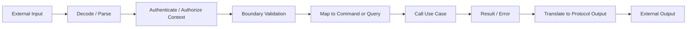
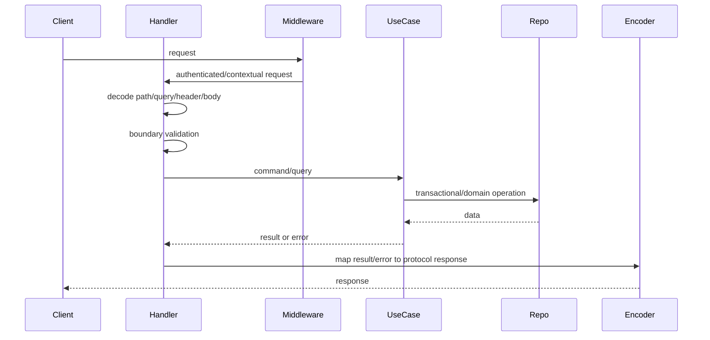
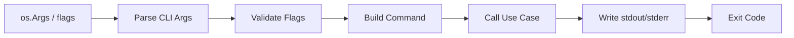
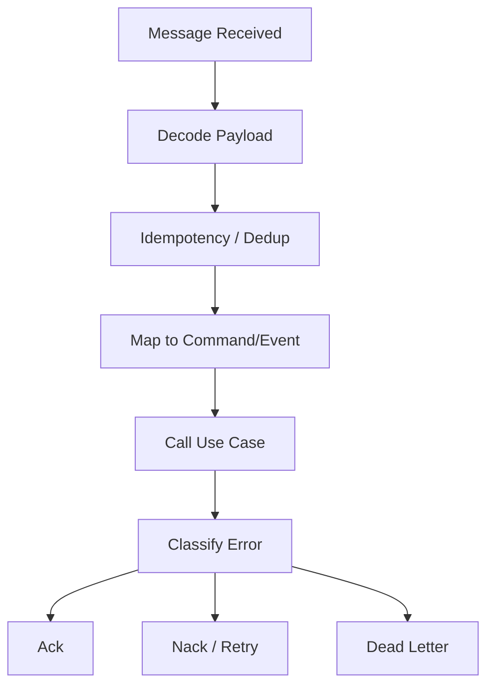
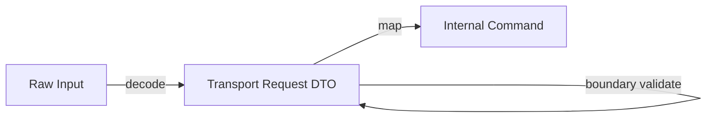
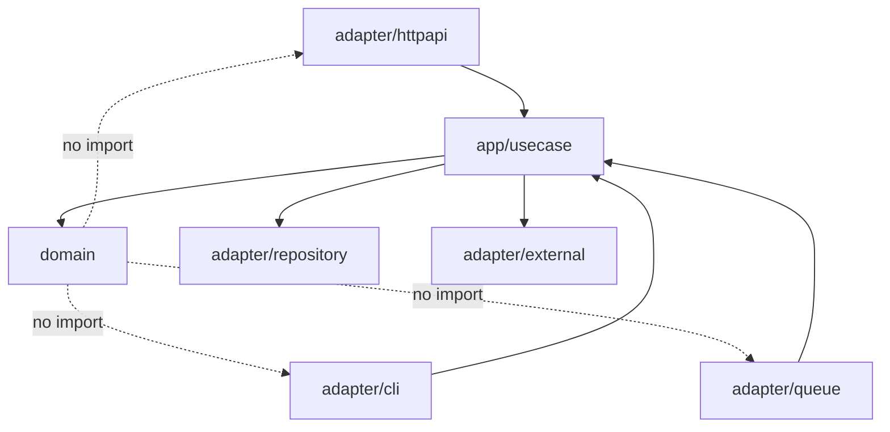
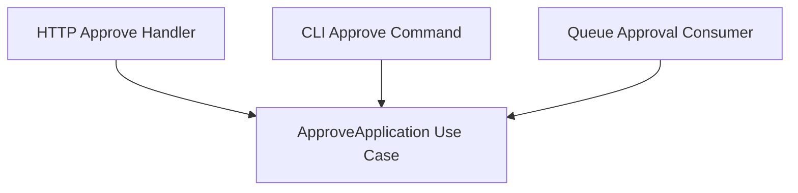

# learn-go-design-patterns-common-patterns-anti-patterns-part-014.md

# Part 014 — Handler Pattern: HTTP, CLI, Worker, Consumer

> Seri: **Go Design Patterns, Common Patterns, and Anti-Patterns**  
> Fokus: **handler sebagai boundary adapter, bukan tempat business logic**  
> Target pembaca: **Java software engineer yang ingin mendesain Go service production-grade**  
> Baseline: **Go 1.26.x**  

---

## 0. Posisi Part Ini Dalam Seri

Kita sudah membangun fondasi:

- Part 000: taxonomy pattern dan filosofi seri.
- Part 001: reframing Java ke Go.
- Part 002: simplicity sebagai strategi desain.
- Part 003: package-oriented design.
- Part 004: API surface.
- Part 005: interface placement.
- Part 006: constructor dan initialization.
- Part 007: functional options.
- Part 008: configuration.
- Part 009: dependency wiring tanpa DI container.
- Part 010: adapter and port pattern.
- Part 011: repository pattern.
- Part 012: unit of work dan transaction boundary.
- Part 013: service layer pattern.

Part ini masuk ke boundary paling umum dalam aplikasi production:

- HTTP handler.
- CLI command handler.
- Queue/message consumer handler.
- Background worker/job handler.
- Cron/scheduler handler.
- Event handler.

Intinya: **handler adalah adapter boundary yang menerjemahkan dunia luar ke use case internal, lalu menerjemahkan hasil internal kembali ke protokol luar.**

Handler yang baik membuat aplikasi mudah dites, mudah diobservasi, dan mudah diubah protokolnya. Handler yang buruk membuat business logic tersebar di transport layer, error mapping tidak konsisten, authorization tidak defensible, dan transaksi menjadi tidak jelas.

---

## 1. Tujuan Pembelajaran

Setelah menyelesaikan part ini, kamu harus bisa:

1. Membedakan handler, controller, service, adapter, dan use case dalam idiom Go.
2. Mendesain HTTP handler yang tipis tetapi tidak bodoh.
3. Mendesain CLI handler, queue consumer, worker, dan cron handler dengan mental model yang sama.
4. Menentukan apa yang boleh dan tidak boleh ada di handler.
5. Mencegah business logic bocor ke transport layer.
6. Mendesain decoding, validation, authorization, idempotency, error mapping, logging, metrics, tracing, dan response encoding secara konsisten.
7. Membuat handler yang testable tanpa mocking berlebihan.
8. Mengenali anti-pattern seperti fat handler, leaky DTO, context value abuse, inconsistent error response, dan handler-specific domain behavior.
9. Menyusun refactoring playbook dari controller Java/Spring style menuju handler Go yang idiomatis.
10. Mengembangkan mental model lintas transport: HTTP, CLI, worker, consumer, scheduler.

---

## 2. Handler Dalam Go: Definisi Praktis

Dalam Go, istilah handler biasanya berarti **fungsi atau object kecil yang menerima input dari boundary eksternal, mengubahnya menjadi command/query internal, memanggil use case, lalu mengubah result/error menjadi output sesuai protokol**.

Untuk HTTP, bentuk standarnya:

```go
func(w http.ResponseWriter, r *http.Request)
```

atau:

```go
type Handler struct {
    svc *ApprovalService
}

func (h *Handler) ServeHTTP(w http.ResponseWriter, r *http.Request) {
    // decode -> call use case -> encode
}
```

Untuk CLI:

```go
func(ctx context.Context, args []string, out io.Writer, errOut io.Writer) int
```

Untuk message consumer:

```go
func(ctx context.Context, msg Message) error
```

Untuk background job:

```go
func(ctx context.Context, job Job) error
```

Walaupun bentuknya berbeda, pola desainnya sama:



Handler bukan pusat business decision. Handler adalah **membrane**.

---

## 3. Handler vs Controller vs Service

Java engineer sering membawa konsep `Controller -> Service -> Repository` dari Spring. Itu tidak selalu salah, tetapi di Go kita perlu menghindari ritual layering.

### 3.1 Controller Dalam Java/Spring

Biasanya controller:

- menerima request;
- binding request body;
- validasi annotation;
- memanggil service;
- return response object;
- framework mengurus serialization, error handling, dependency injection, interceptors.

Contoh mental model Java:

```java
@RestController
@RequestMapping("/applications")
class ApplicationController {
    private final ApplicationService service;

    @PostMapping("/{id}/approve")
    ResponseEntity<ApproveResponse> approve(@PathVariable String id,
                                            @RequestBody ApproveRequest req) {
        return ResponseEntity.ok(service.approve(id, req));
    }
}
```

Framework menyembunyikan banyak hal.

### 3.2 Handler Dalam Go

Go cenderung explicit:

- route registration explicit;
- request decode explicit;
- validation explicit;
- error mapping explicit;
- response write explicit;
- middleware explicit;
- dependency wiring explicit.

```go
func (h *ApplicationHandler) approve(w http.ResponseWriter, r *http.Request) {
    ctx := r.Context()

    applicationID := r.PathValue("applicationID")

    var req approveRequest
    if err := decodeJSON(r, &req); err != nil {
        writeError(ctx, w, err)
        return
    }

    cmd := ApproveApplicationCommand{
        ApplicationID: applicationID,
        ActorID:       actorIDFromContext(ctx),
        Reason:        req.Reason,
        IdempotencyKey: r.Header.Get("Idempotency-Key"),
    }

    result, err := h.approver.Approve(ctx, cmd)
    if err != nil {
        writeError(ctx, w, err)
        return
    }

    writeJSON(ctx, w, http.StatusOK, approveResponseFromResult(result))
}
```

Lebih verbose? Ya. Tapi juga lebih jelas:

- input apa yang diambil;
- bagaimana request dikonversi;
- siapa yang dipanggil;
- error bagaimana dipetakan;
- response apa yang keluar.

---

## 4. Core Rule: Handler Is a Boundary Adapter

Handler bertugas melakukan translasi antar dua dunia.

| Dunia luar | Dunia dalam |
|---|---|
| HTTP method/path/header/body | command/query object |
| CLI args/env/stdin | command/query object |
| queue message headers/payload | command/event object |
| cron trigger | command/job object |
| transport error status | domain/application error |
| protocol response | result object |

Handler yang baik menjaga agar domain/use case tidak tahu:

- HTTP status code;
- request header;
- JSON tag;
- CLI flag;
- queue offset;
- broker ack/nack;
- response writer;
- framework router;
- web session;
- transport DTO.

Use case boleh tahu **business actor**, **command**, **policy**, **transaction**, **repository**, **clock**, **event publisher**, tetapi tidak seharusnya tahu `http.ResponseWriter`.

---

## 5. Handler Shape yang Disarankan

Handler production biasanya punya flow seperti ini:



Pseudo-template:

```go
func (h *Handler) SomeAction(w http.ResponseWriter, r *http.Request) {
    ctx := r.Context()

    input, err := h.decodeSomeAction(r)
    if err != nil {
        h.writeError(ctx, w, err)
        return
    }

    cmd, err := input.toCommand(ctx)
    if err != nil {
        h.writeError(ctx, w, err)
        return
    }

    result, err := h.useCase.Execute(ctx, cmd)
    if err != nil {
        h.writeError(ctx, w, err)
        return
    }

    h.writeJSON(ctx, w, http.StatusOK, responseFromResult(result))
}
```

Handler boleh punya helper internal, tetapi helper itu tetap transport-level.

---

## 6. Apa yang Boleh Ada di Handler

Handler boleh melakukan:

1. Extract request context.
2. Extract route/path parameters.
3. Extract query parameters.
4. Extract headers.
5. Decode body.
6. Validate syntactic boundary input.
7. Build command/query.
8. Extract authenticated actor from request-scoped context.
9. Extract idempotency key.
10. Call use case.
11. Map application result to response DTO.
12. Map application/domain/infrastructure error to protocol output.
13. Set response headers.
14. Write response.
15. Emit boundary-level logs/metrics/traces.

Contoh validasi yang cocok di handler:

- JSON invalid.
- required field missing in request payload.
- query param bukan integer.
- pagination limit terlalu besar menurut API contract.
- unsupported content type.
- malformed UUID.
- missing idempotency key for endpoint that requires one.

Contoh validasi yang **tidak cukup** kalau hanya di handler:

- application boleh approve atau tidak;
- state transition valid atau tidak;
- actor punya policy permission atau tidak;
- entity sedang locked atau tidak;
- quota bisnis terpenuhi atau tidak;
- workflow deadline lewat atau tidak;
- cross-entity consistency valid atau tidak.

Itu milik use case/domain/policy layer.

---

## 7. Apa yang Tidak Boleh Ada di Handler

Handler sebaiknya tidak berisi:

1. Business state transition.
2. Transaction orchestration besar.
3. SQL query langsung.
4. Broker publish langsung sebagai bagian business workflow.
5. Complex retry policy.
6. Domain authorization rule.
7. Cross-entity validation.
8. Long-running workflow logic.
9. Cache consistency decision.
10. Domain event construction detail.
11. Audit business decision detail.
12. Business-specific error classification yang harus reusable.

Buruk:

```go
func (h *Handler) approve(w http.ResponseWriter, r *http.Request) {
    id := r.PathValue("id")

    app, err := h.db.GetApplication(r.Context(), id)
    if err != nil { /* ... */ }

    if app.Status != "PENDING" {
        http.Error(w, "invalid state", http.StatusConflict)
        return
    }

    if !strings.Contains(r.Header.Get("X-Roles"), "manager") {
        http.Error(w, "forbidden", http.StatusForbidden)
        return
    }

    app.Status = "APPROVED"
    app.ApprovedAt = time.Now()

    if err := h.db.UpdateApplication(r.Context(), app); err != nil { /* ... */ }
    if err := h.publisher.PublishApproved(r.Context(), app); err != nil { /* ... */ }

    w.WriteHeader(http.StatusOK)
}
```

Lebih baik:

```go
func (h *ApplicationHandler) approve(w http.ResponseWriter, r *http.Request) {
    ctx := r.Context()

    var req approveRequest
    if err := decodeJSON(r, &req); err != nil {
        h.writeError(ctx, w, err)
        return
    }

    result, err := h.approver.Approve(ctx, ApproveApplicationCommand{
        ApplicationID:   r.PathValue("applicationID"),
        ActorID:         actorIDFromContext(ctx),
        Reason:          req.Reason,
        IdempotencyKey:  r.Header.Get("Idempotency-Key"),
        RequestID:       requestIDFromContext(ctx),
    })
    if err != nil {
        h.writeError(ctx, w, err)
        return
    }

    writeJSON(ctx, w, http.StatusOK, approveResponse{
        ApplicationID: result.ApplicationID,
        Status:        string(result.Status),
        DecisionID:    result.DecisionID,
    })
}
```

---

## 8. HTTP Handler Pattern

### 8.1 Minimal HTTP Handler

```go
func healthz(w http.ResponseWriter, r *http.Request) {
    w.WriteHeader(http.StatusNoContent)
}
```

Ini baik untuk endpoint sederhana.

### 8.2 Struct-Based Handler

Untuk handler dengan dependency:

```go
type ApplicationHandler struct {
    approver ApplicationApprover
    reader   ApplicationReader
    logger   *slog.Logger
}

func NewApplicationHandler(
    approver ApplicationApprover,
    reader ApplicationReader,
    logger *slog.Logger,
) *ApplicationHandler {
    if approver == nil {
        panic("nil approver")
    }
    if reader == nil {
        panic("nil reader")
    }
    if logger == nil {
        logger = slog.Default()
    }
    return &ApplicationHandler{
        approver: approver,
        reader:   reader,
        logger:   logger,
    }
}
```

Consumer-owned interface:

```go
type ApplicationApprover interface {
    Approve(ctx context.Context, cmd ApproveApplicationCommand) (ApproveApplicationResult, error)
}

type ApplicationReader interface {
    Get(ctx context.Context, query GetApplicationQuery) (ApplicationView, error)
}
```

Handler mendefinisikan interface sesuai kebutuhan handler, bukan provider membuat `IApplicationService` besar.

### 8.3 Route Registration

Dengan `net/http.ServeMux` modern:

```go
func RegisterApplicationRoutes(mux *http.ServeMux, h *ApplicationHandler) {
    mux.HandleFunc("GET /applications/{applicationID}", h.get)
    mux.HandleFunc("POST /applications/{applicationID}/approve", h.approve)
}
```

Sejak Go 1.22, `net/http.ServeMux` mendukung method matching dan wildcard pattern, sehingga banyak service sederhana tidak perlu router eksternal hanya untuk method/path routing.

### 8.4 Decode Pattern

```go
func decodeJSON(r *http.Request, dst any) error {
    if r.Body == nil {
        return NewBadRequestError("request body is required")
    }
    defer r.Body.Close()

    dec := json.NewDecoder(r.Body)
    dec.DisallowUnknownFields()

    if err := dec.Decode(dst); err != nil {
        return NewBadRequestError("invalid JSON body").WithCause(err)
    }

    if dec.More() {
        return NewBadRequestError("multiple JSON values are not allowed")
    }

    return nil
}
```

Catatan:

- `DisallowUnknownFields` berguna untuk strict public API, tetapi perlu hati-hati terhadap backward compatibility.
- Untuk endpoint internal, strictness bisa mengurangi bug.
- Untuk API publik dengan client beragam, unknown fields kadang perlu diabaikan agar forward-compatible.

### 8.5 Encode Pattern

```go
func writeJSON(ctx context.Context, w http.ResponseWriter, status int, value any) {
    w.Header().Set("Content-Type", "application/json")
    w.WriteHeader(status)

    if value == nil {
        return
    }

    if err := json.NewEncoder(w).Encode(value); err != nil {
        slog.ErrorContext(ctx, "failed to write response", "error", err)
    }
}
```

Important: setelah `WriteHeader`/write body, biasanya status tidak bisa diubah. Maka error saat encode response sudah berada di fase late failure.

### 8.6 Error Mapping Pattern

```go
func writeError(ctx context.Context, w http.ResponseWriter, err error) {
    status, body := errorResponse(err)
    slog.WarnContext(ctx, "request failed",
        "status", status,
        "error", err,
    )
    writeJSON(ctx, w, status, body)
}
```

```go
func errorResponse(err error) (int, problemResponse) {
    var badRequest BadRequestError
    if errors.As(err, &badRequest) {
        return http.StatusBadRequest, problemResponse{
            Code:    "bad_request",
            Message: badRequest.PublicMessage(),
        }
    }

    var unauthorized UnauthorizedError
    if errors.As(err, &unauthorized) {
        return http.StatusUnauthorized, problemResponse{
            Code:    "unauthorized",
            Message: "authentication is required",
        }
    }

    var forbidden ForbiddenError
    if errors.As(err, &forbidden) {
        return http.StatusForbidden, problemResponse{
            Code:    "forbidden",
            Message: "permission denied",
        }
    }

    var conflict ConflictError
    if errors.As(err, &conflict) {
        return http.StatusConflict, problemResponse{
            Code:    conflict.Code(),
            Message: conflict.PublicMessage(),
        }
    }

    return http.StatusInternalServerError, problemResponse{
        Code:    "internal_error",
        Message: "internal server error",
    }
}
```

Error mapping sebaiknya konsisten per transport boundary, bukan copy-paste per handler.

---

## 9. CLI Handler Pattern

CLI handler sering dianggap kecil, tetapi dalam production tool, CLI juga boundary adapter.



### 9.1 Bad CLI Pattern

```go
func main() {
    if len(os.Args) < 2 {
        panic("missing file")
    }

    data, _ := os.ReadFile(os.Args[1])
    db, _ := sql.Open("postgres", os.Getenv("DATABASE_URL"))
    // parse, validate, write, print, exit all mixed
}
```

Problems:

- hard to test;
- no dependency injection;
- hidden environment read;
- poor error semantics;
- impossible to reuse from tests;
- `os.Exit` deep in logic.

### 9.2 Better CLI Handler Shape

```go
type ImportCommand struct {
    SourcePath string
    DryRun     bool
}

type ImportUseCase interface {
    Import(ctx context.Context, cmd ImportCommand) (ImportResult, error)
}

type ImportCLI struct {
    importer ImportUseCase
    out      io.Writer
    errOut   io.Writer
}

func (c *ImportCLI) Run(ctx context.Context, args []string) int {
    flags := flag.NewFlagSet("import", flag.ContinueOnError)
    flags.SetOutput(c.errOut)

    var dryRun bool
    flags.BoolVar(&dryRun, "dry-run", false, "validate without writing")

    if err := flags.Parse(args); err != nil {
        return 2
    }

    if flags.NArg() != 1 {
        fmt.Fprintln(c.errOut, "usage: import [--dry-run] <source-path>")
        return 2
    }

    result, err := c.importer.Import(ctx, ImportCommand{
        SourcePath: flags.Arg(0),
        DryRun:     dryRun,
    })
    if err != nil {
        fmt.Fprintf(c.errOut, "import failed: %v\n", err)
        return 1
    }

    fmt.Fprintf(c.out, "imported=%d skipped=%d\n", result.Imported, result.Skipped)
    return 0
}
```

`main` hanya composition root:

```go
func main() {
    ctx := context.Background()

    app, cleanup, err := buildApp()
    if err != nil {
        fmt.Fprintln(os.Stderr, err)
        os.Exit(1)
    }
    defer cleanup()

    code := app.ImportCLI.Run(ctx, os.Args[1:])
    os.Exit(code)
}
```

CLI handler juga harus tipis.

---

## 10. Queue Consumer Handler Pattern

Queue consumer handler berbeda dari HTTP karena output-nya bukan response body, melainkan keputusan:

- ack;
- nack/retry;
- dead-letter;
- ignore duplicate;
- pause/backoff;
- poison message handling.



### 10.1 Consumer Handler Interface

```go
type Message struct {
    ID          string
    Key         string
    Headers     map[string]string
    Body        []byte
    ReceivedAt  time.Time
    DeliveryNo  int
}

type MessageHandler interface {
    Handle(ctx context.Context, msg Message) error
}
```

### 10.2 Handler Implementation

```go
type ApplicationSubmittedConsumer struct {
    processor ApplicationSubmissionProcessor
}

type ApplicationSubmissionProcessor interface {
    ProcessSubmitted(ctx context.Context, cmd ProcessSubmittedCommand) error
}

func (h *ApplicationSubmittedConsumer) Handle(ctx context.Context, msg Message) error {
    var event applicationSubmittedEvent
    if err := json.Unmarshal(msg.Body, &event); err != nil {
        return NonRetryableError{
            Code: "invalid_message_payload",
            Err:  err,
        }
    }

    cmd := ProcessSubmittedCommand{
        EventID:       event.EventID,
        ApplicationID: event.ApplicationID,
        SubmittedAt:   event.SubmittedAt,
        CorrelationID: msg.Headers["correlation-id"],
    }

    return h.processor.ProcessSubmitted(ctx, cmd)
}
```

### 10.3 Consumer Runner Owns Ack/Nack

Handler should not usually directly call broker ack/nack. Runner should classify errors.

```go
func runConsumer(ctx context.Context, sub Subscriber, h MessageHandler) error {
    return sub.Consume(ctx, func(ctx context.Context, msg Message, ack Acknowledger) {
        err := h.Handle(ctx, msg)
        switch {
        case err == nil:
            ack.Ack()
        case IsNonRetryable(err):
            ack.DeadLetter(err)
        case IsRetryable(err):
            ack.NackRetry(err)
        default:
            ack.NackRetry(err)
        }
    })
}
```

Kenapa ack/nack tidak di dalam handler?

Karena ack/nack adalah protocol concern. Handler menerjemahkan pesan menjadi command dan memprosesnya. Runner mengurus broker semantics.

---

## 11. Worker/Job Handler Pattern

Background job mirip queue consumer, tetapi trigger bisa berasal dari:

- database job table;
- scheduler;
- cron;
- in-memory queue;
- admin request;
- reconciliation loop.

### 11.1 Job Handler Shape

```go
type Job struct {
    ID        string
    Kind      string
    Payload   json.RawMessage
    Attempt   int
    CreatedAt time.Time
}

type JobHandler interface {
    HandleJob(ctx context.Context, job Job) error
}
```

### 11.2 Job Dispatch Registry

```go
type JobRegistry struct {
    handlers map[string]JobHandler
}

func (r *JobRegistry) Handle(ctx context.Context, job Job) error {
    h, ok := r.handlers[job.Kind]
    if !ok {
        return NonRetryableError{Code: "unknown_job_kind"}
    }
    return h.HandleJob(ctx, job)
}
```

### 11.3 Job Handler Example

```go
type SendDecisionEmailJob struct {
    sender DecisionEmailSender
}

func (h *SendDecisionEmailJob) HandleJob(ctx context.Context, job Job) error {
    var payload sendDecisionEmailPayload
    if err := json.Unmarshal(job.Payload, &payload); err != nil {
        return NonRetryableError{Code: "invalid_job_payload", Err: err}
    }

    return h.sender.SendDecisionEmail(ctx, SendDecisionEmailCommand{
        ApplicationID: payload.ApplicationID,
        DecisionID:    payload.DecisionID,
        RecipientID:   payload.RecipientID,
        IdempotencyKey: job.ID,
    })
}
```

---

## 12. Scheduler/Cron Handler Pattern

Cron handler is not “just a function”. It has important semantics:

- concurrency policy;
- overlap handling;
- lock/lease;
- idempotency;
- missed run behavior;
- timeout;
- observability;
- retry;
- backfill.

### 12.1 Bad Cron Pattern

```go
func startCron() {
    go func() {
        for {
            time.Sleep(time.Hour)
            cleanupExpiredApplications()
        }
    }()
}
```

Problems:

- no shutdown;
- no context;
- no lock;
- drift;
- no observability;
- no error handling;
- hidden lifecycle.

### 12.2 Better Cron Handler

```go
type ExpirationReconciler interface {
    ReconcileExpired(ctx context.Context, cmd ReconcileExpiredCommand) (ReconcileExpiredResult, error)
}

type ExpireApplicationsJob struct {
    reconciler ExpirationReconciler
    clock      Clock
}

func (j *ExpireApplicationsJob) Run(ctx context.Context, scheduledAt time.Time) error {
    result, err := j.reconciler.ReconcileExpired(ctx, ReconcileExpiredCommand{
        ScheduledAt: scheduledAt,
        RunID:       newRunID(scheduledAt),
    })
    if err != nil {
        return err
    }

    slog.InfoContext(ctx, "expired applications reconciled",
        "checked", result.Checked,
        "expired", result.Expired,
    )
    return nil
}
```

Scheduler runner handles timing and lifecycle. Job handler handles command mapping and use case call.

---

## 13. Decode / Validate / Map Pattern

A good handler has three separate concepts:

1. **Decode**: protocol bytes/string → request struct.
2. **Boundary validate**: request struct is well-formed according to protocol contract.
3. **Map**: request struct → command/query.



### 13.1 Why Separate?

Because each failure has different meaning.

| Step | Example failure | Typical HTTP status | Owner |
|---|---|---:|---|
| Decode | invalid JSON | 400 | handler |
| Boundary validate | missing required request field | 400 | handler/API contract |
| Map | invalid path ID format | 400 | handler |
| Use case validate | illegal state transition | 409/422 | application/domain |
| Authorization | actor cannot approve | 403 | policy/use case |
| Persistence | optimistic conflict | 409/500 depending cause | repository/use case |

### 13.2 Request DTO Should Not Become Domain Object

Bad:

```go
type Application struct {
    ID     string `json:"id"`
    Status string `json:"status"`
    Reason string `json:"reason"`
}
```

This struct is now both transport DTO and domain object. That couples JSON shape to domain shape.

Better:

```go
type approveRequest struct {
    Reason string `json:"reason"`
}

type ApproveApplicationCommand struct {
    ApplicationID  string
    ActorID        string
    Reason         string
    IdempotencyKey string
}
```

---

## 14. Handler and Context

In HTTP, request context is obtained from `r.Context()`.

```go
ctx := r.Context()
```

Context should carry:

- cancellation;
- deadline;
- request-scoped values like request ID, trace ID, authenticated principal if middleware set it carefully.

Context should not carry:

- database connection;
- logger as general dependency;
- service object;
- config;
- repository;
- feature flag client;
- arbitrary parameter bag.

Bad:

```go
svc := ctx.Value("applicationService").(*ApplicationService)
```

Better:

```go
type ApplicationHandler struct {
    approver ApplicationApprover
}
```

### 14.1 Context Value Wrapper

If context values are needed, wrap them with typed accessors.

```go
type contextKey struct{ name string }

var actorKey = contextKey{name: "actor"}

func WithActor(ctx context.Context, actor Actor) context.Context {
    return context.WithValue(ctx, actorKey, actor)
}

func ActorFromContext(ctx context.Context) (Actor, bool) {
    actor, ok := ctx.Value(actorKey).(Actor)
    return actor, ok
}
```

In handler:

```go
actor, ok := ActorFromContext(ctx)
if !ok {
    h.writeError(ctx, w, UnauthorizedError{})
    return
}
```

---

## 15. Handler and Authorization

There are at least three authorization layers:

1. **Authentication boundary**: who is the caller?
2. **Coarse route authorization**: can this role call this endpoint generally?
3. **Domain/application authorization**: can this actor perform this action on this entity in current state?

Handler/middleware can handle layer 1 and sometimes layer 2.

Use case/policy should handle layer 3.

Bad:

```go
if actor.Role != "manager" {
    http.Error(w, "forbidden", http.StatusForbidden)
    return
}
```

This may be too coarse. Real rule may depend on:

- application status;
- assigned team;
- conflict of interest;
- delegation;
- organization unit;
- case sensitivity level;
- regulatory segregation of duties.

Better:

```go
result, err := h.approver.Approve(ctx, ApproveApplicationCommand{
    ActorID:       actor.ID,
    ApplicationID: r.PathValue("applicationID"),
    Reason:        req.Reason,
})
```

Then use case calls policy:

```go
allowed, reason := s.policy.CanApprove(actor, application)
if !allowed {
    return ApproveApplicationResult{}, ForbiddenError{Reason: reason}
}
```

---

## 16. Handler and Idempotency

Handlers are often the right place to extract idempotency key, but not the right place to implement all idempotency semantics.

```go
key := r.Header.Get("Idempotency-Key")
if key == "" {
    h.writeError(ctx, w, NewBadRequestError("Idempotency-Key header is required"))
    return
}

result, err := h.approver.Approve(ctx, ApproveApplicationCommand{
    ApplicationID:  r.PathValue("applicationID"),
    ActorID:        actor.ID,
    IdempotencyKey: key,
})
```

Use case decides:

- whether key was already used;
- whether previous result can be returned;
- whether conflict exists because same key used for different payload;
- whether dedup record should be written in same transaction.

For message consumer, idempotency key often comes from:

- event ID;
- message ID;
- aggregate ID + version;
- outbox record ID;
- external provider request ID.

---

## 17. Handler and Observability

Handler is a very important observability boundary.

It knows:

- request method/path;
- status code;
- response latency;
- actor identity category, if safe;
- user-agent/client id;
- correlation ID;
- transport-specific metadata;
- payload size;
- route name;
- error class.

But handler should avoid:

- logging raw PII;
- logging secrets;
- high-cardinality unbounded labels in metrics;
- duplicate logging at every layer;
- mixing audit trail with debug logs.

### 17.1 Boundary Log

```go
slog.InfoContext(ctx, "application approval requested",
    "application_id", applicationID,
    "actor_id", actor.ID,
    "request_id", requestIDFromContext(ctx),
)
```

For sensitive systems, consider logging stable IDs, not raw personal data.

### 17.2 Metrics

Useful handler metrics:

- request count by route/method/status class;
- latency histogram by route/method;
- request body size;
- decode failure count;
- auth failure count;
- application error class count.

Avoid labels like:

- user ID;
- application ID;
- raw error message;
- arbitrary query parameter.

### 17.3 Trace

Handler is often where trace/span begins or is extracted.

Use case should receive `context.Context` so tracing/cancellation/deadline propagate.

---

## 18. Handler and Security

Handler boundary must enforce protocol-level safety:

1. Limit request body size.
2. Restrict content type when needed.
3. Strict decode when appropriate.
4. Normalize path/query input.
5. Avoid reflecting raw input in error messages.
6. Avoid logging secrets/PII.
7. Set correct response headers.
8. Never trust client-provided actor fields.
9. Validate idempotency key format/length.
10. Prevent path traversal for file-related handlers.

Example body limit:

```go
func limitBody(next http.Handler, maxBytes int64) http.Handler {
    return http.HandlerFunc(func(w http.ResponseWriter, r *http.Request) {
        r.Body = http.MaxBytesReader(w, r.Body, maxBytes)
        next.ServeHTTP(w, r)
    })
}
```

### 18.1 Do Not Trust Actor from Body

Bad:

```json
{
  "actorId": "manager-123",
  "reason": "approved"
}
```

Handler must derive actor from authenticated context, not request body.

```go
actor, ok := ActorFromContext(ctx)
```

---

## 19. Handler and Response Design

Response DTO is also part of public API surface.

Bad:

```go
writeJSON(ctx, w, http.StatusOK, domainApplication)
```

This leaks domain shape.

Better:

```go
type applicationResponse struct {
    ID        string `json:"id"`
    Status    string `json:"status"`
    Submitted string `json:"submittedAt"`
}

func applicationResponseFromView(v ApplicationView) applicationResponse {
    return applicationResponse{
        ID:        v.ID,
        Status:    string(v.Status),
        Submitted: v.SubmittedAt.Format(time.RFC3339),
    }
}
```

### 19.1 Response Envelope?

Common options:

Plain response:

```json
{
  "id": "app-123",
  "status": "approved"
}
```

Envelope:

```json
{
  "data": {
    "id": "app-123",
    "status": "approved"
  },
  "meta": {
    "requestId": "req-123"
  }
}
```

Problem details:

```json
{
  "code": "invalid_transition",
  "message": "application cannot be approved from rejected state",
  "requestId": "req-123"
}
```

Pick one API style and keep it consistent.

---

## 20. Handler Testing Pattern

Handler tests should verify boundary behavior, not internal implementation.

### 20.1 HTTP Handler Test

```go
type fakeApprover struct {
    got ApproveApplicationCommand
    res ApproveApplicationResult
    err error
}

func (f *fakeApprover) Approve(ctx context.Context, cmd ApproveApplicationCommand) (ApproveApplicationResult, error) {
    f.got = cmd
    return f.res, f.err
}

func TestApproveHandler(t *testing.T) {
    approver := &fakeApprover{
        res: ApproveApplicationResult{
            ApplicationID: "app-123",
            Status:        StatusApproved,
            DecisionID:    "dec-456",
        },
    }

    h := NewApplicationHandler(approver, nil, slog.Default())

    body := strings.NewReader(`{"reason":"complete"}`)
    req := httptest.NewRequest(http.MethodPost, "/applications/app-123/approve", body)
    req.SetPathValue("applicationID", "app-123")
    req.Header.Set("Idempotency-Key", "idem-1")
    req = req.WithContext(WithActor(req.Context(), Actor{ID: "user-1"}))

    rec := httptest.NewRecorder()

    h.approve(rec, req)

    if rec.Code != http.StatusOK {
        t.Fatalf("status = %d, want %d; body=%s", rec.Code, http.StatusOK, rec.Body.String())
    }

    if approver.got.ApplicationID != "app-123" {
        t.Fatalf("application id = %q", approver.got.ApplicationID)
    }
    if approver.got.ActorID != "user-1" {
        t.Fatalf("actor id = %q", approver.got.ActorID)
    }
}
```

### 20.2 What to Test

Test:

- invalid JSON returns 400;
- missing actor returns 401;
- missing idempotency key returns 400 if required;
- use case error maps to expected status;
- successful result maps to expected response;
- command fields are correctly mapped;
- content type is correct;
- request body size limit if middleware included.

Do not test:

- JSON encoder internals;
- exact log string unless log is contract;
- every private helper separately unless complex;
- service business logic through handler tests.

---

## 21. CLI Handler Testing

```go
func TestImportCLI(t *testing.T) {
    importer := &fakeImporter{
        result: ImportResult{Imported: 10, Skipped: 2},
    }

    var out bytes.Buffer
    var errOut bytes.Buffer

    cli := &ImportCLI{
        importer: importer,
        out:      &out,
        errOut:   &errOut,
    }

    code := cli.Run(context.Background(), []string{"--dry-run", "data.csv"})
    if code != 0 {
        t.Fatalf("exit code = %d", code)
    }

    if !strings.Contains(out.String(), "imported=10") {
        t.Fatalf("unexpected stdout: %s", out.String())
    }

    if importer.got.SourcePath != "data.csv" {
        t.Fatalf("source path = %q", importer.got.SourcePath)
    }
}
```

CLI handler becomes testable because it does not call `os.Exit` internally.

---

## 22. Consumer Handler Testing

```go
func TestSubmittedConsumerInvalidPayloadIsNonRetryable(t *testing.T) {
    h := &ApplicationSubmittedConsumer{
        processor: &fakeProcessor{},
    }

    err := h.Handle(context.Background(), Message{
        ID:   "msg-1",
        Body: []byte(`{invalid`),
    })

    if !IsNonRetryable(err) {
        t.Fatalf("expected non-retryable error, got %v", err)
    }
}
```

Test handler classification separately from broker runner.

---

## 23. Production Example: Approval HTTP Handler

### 23.1 Types

```go
type Actor struct {
    ID    string
    Roles []string
}

type ApproveApplicationCommand struct {
    ApplicationID  string
    ActorID        string
    Reason         string
    IdempotencyKey string
    RequestID      string
}

type ApproveApplicationResult struct {
    ApplicationID string
    Status        ApplicationStatus
    DecisionID    string
    DecidedAt     time.Time
}

type ApplicationStatus string

const (
    StatusPending  ApplicationStatus = "pending"
    StatusApproved ApplicationStatus = "approved"
    StatusRejected ApplicationStatus = "rejected"
)
```

### 23.2 Handler

```go
type ApplicationHandler struct {
    approver ApplicationApprover
    logger   *slog.Logger
}

type ApplicationApprover interface {
    Approve(ctx context.Context, cmd ApproveApplicationCommand) (ApproveApplicationResult, error)
}

func NewApplicationHandler(approver ApplicationApprover, logger *slog.Logger) *ApplicationHandler {
    if approver == nil {
        panic("nil approver")
    }
    if logger == nil {
        logger = slog.Default()
    }
    return &ApplicationHandler{
        approver: approver,
        logger:   logger,
    }
}
```

### 23.3 Request/Response DTO

```go
type approveRequest struct {
    Reason string `json:"reason"`
}

type approveResponse struct {
    ApplicationID string `json:"applicationId"`
    Status        string `json:"status"`
    DecisionID    string `json:"decisionId"`
    DecidedAt     string `json:"decidedAt"`
}
```

### 23.4 Handler Method

```go
func (h *ApplicationHandler) Approve(w http.ResponseWriter, r *http.Request) {
    ctx := r.Context()

    actor, ok := ActorFromContext(ctx)
    if !ok {
        h.writeError(ctx, w, UnauthorizedError{})
        return
    }

    applicationID := r.PathValue("applicationID")
    if applicationID == "" {
        h.writeError(ctx, w, NewBadRequestError("applicationID is required"))
        return
    }

    idempotencyKey := r.Header.Get("Idempotency-Key")
    if idempotencyKey == "" {
        h.writeError(ctx, w, NewBadRequestError("Idempotency-Key header is required"))
        return
    }

    var req approveRequest
    if err := decodeJSON(r, &req); err != nil {
        h.writeError(ctx, w, err)
        return
    }

    if strings.TrimSpace(req.Reason) == "" {
        h.writeError(ctx, w, NewBadRequestError("reason is required"))
        return
    }

    result, err := h.approver.Approve(ctx, ApproveApplicationCommand{
        ApplicationID:  applicationID,
        ActorID:        actor.ID,
        Reason:         req.Reason,
        IdempotencyKey: idempotencyKey,
        RequestID:      RequestIDFromContext(ctx),
    })
    if err != nil {
        h.writeError(ctx, w, err)
        return
    }

    writeJSON(ctx, w, http.StatusOK, approveResponse{
        ApplicationID: result.ApplicationID,
        Status:        string(result.Status),
        DecisionID:    result.DecisionID,
        DecidedAt:     result.DecidedAt.Format(time.RFC3339),
    })
}
```

### 23.5 What This Handler Does Well

- Does not query database.
- Does not implement transition rules.
- Does not know transaction boundary.
- Does not publish event.
- Does not authorize domain rule itself.
- Does not expose domain object directly.
- Extracts actor safely from context.
- Extracts idempotency key but delegates semantics.
- Maps request to command explicitly.
- Maps result to response explicitly.
- Uses centralized error writer.

---

## 24. Error Mapping Deep Dive

In a mature service, error mapping should not be random.

### 24.1 Example Error Types

```go
type BadRequestError struct {
    Message string
    Err     error
}

func NewBadRequestError(message string) BadRequestError {
    return BadRequestError{Message: message}
}

func (e BadRequestError) Error() string {
    if e.Err != nil {
        return e.Message + ": " + e.Err.Error()
    }
    return e.Message
}

func (e BadRequestError) Unwrap() error { return e.Err }
```

```go
type ConflictError struct {
    code    string
    message string
}

func (e ConflictError) Error() string { return e.message }
func (e ConflictError) Code() string  { return e.code }
func (e ConflictError) PublicMessage() string {
    return e.message
}
```

### 24.2 Protocol Mapping Table

| Internal error kind | HTTP | CLI exit | Queue behavior |
|---|---:|---:|---|
| Bad request | 400 | 2 | DLQ/non-retry |
| Unauthorized | 401 | 1/2 | DLQ/non-retry |
| Forbidden | 403 | 1 | DLQ/non-retry |
| Not found | 404 | 1 | maybe non-retry |
| Conflict | 409 | 1 | maybe retry if optimistic |
| Rate limited | 429 | 1 | retry/backoff |
| Timeout | 504 | 1 | retry |
| Temporary dependency failure | 503 | 1 | retry |
| Unknown internal | 500 | 1 | retry or DLQ after max |

The same use case error may map differently by transport.

---

## 25. Handler Anti-Pattern Catalog

### 25.1 Fat Handler

Symptoms:

- handler has 100+ lines;
- multiple SQL queries;
- transition logic;
- event publishing;
- authorization rule;
- retry logic;
- transaction begin/commit;
- extensive branching.

Root cause:

- no use case boundary;
- service layer too weak;
- port/adapter not separated;
- developer treats HTTP handler as Spring controller + service combined.

Refactor:

1. Extract command.
2. Extract use case method.
3. Move transaction to use case.
4. Move repository calls to repository.
5. Move policy to policy object.
6. Keep handler as decode/map/call/encode.

---

### 25.2 Business Logic in Handler

Bad:

```go
if app.Status == "PENDING" && actor.Role == "MANAGER" {
    app.Status = "APPROVED"
}
```

Why bad:

- only HTTP path gets rule;
- CLI/worker may bypass rule;
- difficult to audit;
- duplicated across endpoints;
- impossible to test domain independently.

Better:

```go
result, err := h.approver.Approve(ctx, cmd)
```

---

### 25.3 Transport DTO Leaks Into Domain

Bad:

```go
func (s *Service) Approve(ctx context.Context, req approveRequest) error
```

Better:

```go
func (s *Service) Approve(ctx context.Context, cmd ApproveApplicationCommand) error
```

Reason:

- request DTO is protocol-specific;
- command is application-specific;
- same use case can be called from HTTP, CLI, worker, consumer.

---

### 25.4 Domain Object Returned Directly

Bad:

```go
writeJSON(ctx, w, http.StatusOK, application)
```

Risks:

- exposes internal fields;
- JSON tags infect domain;
- future domain changes become API breaking changes;
- sensitive fields accidentally serialized;
- API versioning becomes difficult.

Better:

```go
writeJSON(ctx, w, http.StatusOK, applicationResponseFromView(view))
```

---

### 25.5 Context Value Abuse

Bad:

```go
repo := ctx.Value("repo").(Repository)
featureFlags := ctx.Value("featureFlags").(FlagClient)
```

Why bad:

- hidden dependencies;
- runtime panic;
- hard to test;
- no compile-time contract;
- context becomes service locator.

Better:

```go
type Handler struct {
    svc Service
}
```

---

### 25.6 `http.Error` Everywhere

Bad:

```go
http.Error(w, err.Error(), http.StatusInternalServerError)
```

Problems:

- leaks internal error;
- inconsistent response shape;
- no request ID;
- impossible to localize/standardize;
- security risk.

Better:

```go
h.writeError(ctx, w, err)
```

---

### 25.7 Swallowing Decode Errors

Bad:

```go
json.NewDecoder(r.Body).Decode(&req)
```

without checking error.

Better:

```go
if err := decodeJSON(r, &req); err != nil {
    h.writeError(ctx, w, err)
    return
}
```

---

### 25.8 Handler Starts Goroutine Without Owner

Bad:

```go
go h.sendEmail(applicationID)
writeJSON(ctx, w, http.StatusAccepted, nil)
```

Problems:

- request context may cancel;
- no retry;
- no observability;
- process crash loses work;
- no idempotency;
- no shutdown ownership.

Better:

- write outbox record inside transaction;
- publish job;
- worker processes job with retry/idempotency.

---

### 25.9 Handler Opens Database Connection

Bad:

```go
func handler(w http.ResponseWriter, r *http.Request) {
    db, _ := sql.Open("postgres", os.Getenv("DATABASE_URL"))
    // ...
}
```

Better:

- open DB in composition root;
- inject repository/use case;
- handler does not own DB lifecycle.

---

### 25.10 Inconsistent Status Mapping

Bad:

- one handler maps not found to 404;
- another maps not found to 500;
- another maps invalid transition to 400;
- another maps same invalid transition to 409.

Better:

- centralized error taxonomy;
- centralized transport mapper;
- tests for mapper.

---

### 25.11 Handler Performs Domain Authorization

Bad:

```go
if !slices.Contains(actor.Roles, "approver") {
    http.Error(w, "forbidden", http.StatusForbidden)
    return
}
```

Sometimes acceptable for coarse route guard, but dangerous for domain rule. Use case should enforce authoritative authorization.

---

### 25.12 Handler Does Transaction Boundary

Bad:

```go
tx, _ := h.db.BeginTx(ctx, nil)
// call repo A, repo B, publish event, commit
```

Problem:

- transport-specific transaction;
- duplicate transaction rules across CLI/worker;
- external side effect risk;
- use case consistency hidden.

Better:

```go
result, err := h.useCase.Execute(ctx, cmd)
```

Use case owns transaction.

---

### 25.13 One Handler Struct With Everything

Bad:

```go
type Handler struct {
    userSvc UserService
    appSvc ApplicationService
    reportSvc ReportService
    billingSvc BillingService
    auditSvc AuditService
    // 50 more
}
```

Better:

- split by domain/route group;
- smaller handler structs;
- route registration composes groups.

---

## 26. Package Layout for Handlers

A practical layout:

```text
cmd/api/main.go
internal/app/approval/service.go
internal/app/approval/command.go
internal/app/approval/policy.go
internal/app/approval/repository.go
internal/adapter/httpapi/application_handler.go
internal/adapter/httpapi/error_response.go
internal/adapter/httpapi/middleware.go
internal/adapter/queue/application_submitted_consumer.go
internal/adapter/cli/import_command.go
internal/platform/httpserver/server.go
```

Alternative vertical slice:

```text
internal/application/approval/usecase.go
internal/application/approval/http_handler.go
internal/application/approval/consumer.go
internal/application/approval/repository.go
internal/application/approval/policy.go
```

Both can work. The invariant:

- handler imports use case/application package;
- use case does not import handler;
- domain/application does not import `net/http`;
- DTOs do not leak inward;
- repository adapter does not import handler.



---

## 27. Handler Review Checklist

Use this in code review.

### 27.1 Boundary

- [ ] Handler only decodes/maps/calls/encodes.
- [ ] No SQL in handler.
- [ ] No business transition in handler.
- [ ] No external publish side effect directly in handler unless endpoint is explicitly a transport proxy.
- [ ] No domain object directly serialized.
- [ ] No transport DTO passed into domain/use case.

### 27.2 Context

- [ ] Uses `r.Context()` for request-scoped work.
- [ ] Does not store context in struct.
- [ ] Does not use context as dependency bag.
- [ ] Actor/request ID accessors are typed.
- [ ] Cancellation/deadline is propagated to use case.

### 27.3 Error Handling

- [ ] Decode errors map to 400.
- [ ] Auth errors map to 401/403.
- [ ] Conflict errors map consistently.
- [ ] Internal errors do not leak details.
- [ ] Response shape is consistent.
- [ ] Error mapper has tests.

### 27.4 Security

- [ ] Request body limit is applied where needed.
- [ ] Content type is validated where needed.
- [ ] Secrets/PII not logged.
- [ ] Client-supplied actor is ignored.
- [ ] Idempotency key validated when required.
- [ ] File/path input normalized if applicable.

### 27.5 Observability

- [ ] Route/method/status/latency observable.
- [ ] Request ID/correlation ID propagated.
- [ ] Metrics avoid high-cardinality labels.
- [ ] Logs do not duplicate noisy errors at every layer.
- [ ] Audit is separate from debug logging.

### 27.6 Testing

- [ ] Handler tests cover success mapping.
- [ ] Handler tests cover decode failure.
- [ ] Handler tests cover auth failure.
- [ ] Handler tests cover use case error mapping.
- [ ] Handler test uses fake use case, not real DB.
- [ ] Business logic is tested in use case/domain tests, not only through HTTP.

---

## 28. Refactoring Playbook: Fat Java-Style Controller to Go Handler

### Step 1: Identify Boundary Logic vs Business Logic

Mark each line:

- transport decode;
- validation;
- authorization;
- state transition;
- persistence;
- event publish;
- response mapping;
- logging.

### Step 2: Extract Command

```go
type ApproveApplicationCommand struct {
    ApplicationID  string
    ActorID        string
    Reason         string
    IdempotencyKey string
}
```

### Step 3: Extract Use Case Interface at Handler Side

```go
type ApplicationApprover interface {
    Approve(ctx context.Context, cmd ApproveApplicationCommand) (ApproveApplicationResult, error)
}
```

### Step 4: Move Transaction to Use Case

Handler should not know transaction begin/commit.

### Step 5: Move State Transition to Domain/Application

Handler should not mutate entity state.

### Step 6: Move Event Publication to Outbox/Use Case

Handler should not fire-and-forget goroutine.

### Step 7: Centralize Error Mapping

Create `writeError` and error mapper.

### Step 8: Add Handler Tests

Use fake use case to lock request/response contract.

### Step 9: Add Use Case Tests

Test business logic without HTTP.

### Step 10: Review Import Graph

Ensure app/domain package does not import handler package or `net/http`.

---

## 29. Advanced Pattern: Handler as Protocol Policy Boundary

Handler can enforce protocol policy:

- max body size;
- allowed content type;
- accepted API version;
- required headers;
- route-level auth;
- request timeout;
- input field strictness;
- response format;
- pagination limits;
- API idempotency requirement.

But protocol policy should not become domain policy.

Example:

```go
if r.Header.Get("Content-Type") != "application/json" {
    h.writeError(ctx, w, UnsupportedMediaTypeError{})
    return
}
```

That is handler-level.

```go
if application.Amount > actor.ApprovalLimit {
    return ForbiddenError{}
}
```

That is domain/application-level.

---

## 30. Advanced Pattern: Multi-Transport Use Case

A good use case can be called from multiple handlers.



Each handler maps from its protocol:

HTTP:

```go
cmd := ApproveApplicationCommand{
    ApplicationID: r.PathValue("applicationID"),
    ActorID:       actor.ID,
    Reason:        req.Reason,
}
```

CLI:

```go
cmd := ApproveApplicationCommand{
    ApplicationID: flags.Arg(0),
    ActorID:       operatorID,
    Reason:        reason,
}
```

Queue:

```go
cmd := ApproveApplicationCommand{
    ApplicationID: event.ApplicationID,
    ActorID:       event.ApproverID,
    Reason:        event.Reason,
}
```

The use case remains the single authority for business behavior.

---

## 31. Advanced Pattern: Handler-Specific Request Model vs Shared Command Model

Do not confuse request DTO and command.

### Request DTO

- protocol-specific;
- JSON tags;
- form tags;
- query semantics;
- optionality based on endpoint;
- versioned with API.

### Command

- application-specific;
- no JSON tags needed;
- stable for use case;
- includes actor/request metadata;
- expresses intent.

```go
type createApplicationRequestV1 struct {
    Name        string `json:"name"`
    Description string `json:"description"`
}

type CreateApplicationCommand struct {
    ApplicantID string
    Name        string
    Description string
    Source      SubmissionSource
    RequestID   string
}
```

API v2 can have different DTO but same command if use case intent unchanged.

---

## 32. Advanced Pattern: Handler-Level Feature Flag

Feature flags can exist at handler boundary, but be careful.

Acceptable:

- route availability;
- response field exposure;
- protocol version behavior;
- beta endpoint gating.

Dangerous:

- core business rule only in handler;
- worker path bypasses flag;
- CLI path behaves differently accidentally.

Example:

```go
if !h.flags.Enabled(ctx, "approval_api_v2") {
    h.writeError(ctx, w, NotFoundError{})
    return
}
```

But approval eligibility must live in use case/policy.

---

## 33. Advanced Pattern: Handler and API Versioning

For public APIs, handler is often where version differences are managed.

```text
POST /v1/applications/{id}/approve
POST /v2/applications/{id}/approve
```

Possible design:

```go
func (h *ApplicationHandlerV1) Approve(w http.ResponseWriter, r *http.Request) { ... }
func (h *ApplicationHandlerV2) Approve(w http.ResponseWriter, r *http.Request) { ... }
```

Both call same use case if business intent is same.

```go
h.approver.Approve(ctx, cmd)
```

Different request/response mapping does not require different use case unless behavior changed.

---

## 34. Handler Performance Considerations

Handler overhead usually comes from:

- JSON decoding/encoding;
- allocations in DTO mapping;
- logging fields;
- middleware chain;
- body buffering;
- reflection in validators;
- excessive string conversions;
- large response payload;
- synchronous external calls in request path;
- no timeout.

Principles:

1. Optimize correctness and boundary clarity first.
2. Avoid buffering large bodies unnecessarily.
3. Stream when payload is large.
4. Use request context for cancellation.
5. Avoid per-request heavy initialization.
6. Reuse long-lived clients through dependency wiring.
7. Avoid logging huge payloads.
8. Avoid reflection-heavy generic handler framework unless needed.

Bad:

```go
func handler(w http.ResponseWriter, r *http.Request) {
    client := &http.Client{Timeout: 5 * time.Second}
    // created every request unnecessarily
}
```

Better: inject configured client/use case.

---

## 35. Handler as Contract Boundary in Regulated Systems

For regulatory/case-management systems, handler design affects defensibility.

Important requirements:

- request ID/correlation ID propagated;
- actor derived from trusted auth context;
- command includes actor and intent;
- use case produces decision/audit record;
- handler returns stable error codes;
- domain rejection not hidden as generic 500;
- idempotency prevents duplicate decision;
- invalid transition maps clearly;
- audit trail is not built from raw HTTP logs;
- response does not expose sensitive internal fields.

Example command for defensible workflow:

```go
type EscalateCaseCommand struct {
    CaseID         string
    ActorID        string
    Reason         string
    TargetLevel    EscalationLevel
    IdempotencyKey string
    RequestID      string
    Source         CommandSource
}
```

Handler responsibility:

- extract `CaseID` from path;
- extract actor from auth context;
- decode reason/target level;
- extract idempotency key/request ID;
- call use case.

Use case responsibility:

- load case;
- check policy;
- validate transition;
- write transition record;
- write audit decision;
- publish outbox event;
- return result.

---

## 36. Common Design Decisions

### 36.1 Should Handler Methods Be Exported?

Often no.

```go
func (h *ApplicationHandler) approve(w http.ResponseWriter, r *http.Request)
```

If only route registration inside same package needs it, keep unexported.

Export when external package needs to register directly:

```go
func (h *ApplicationHandler) Approve(w http.ResponseWriter, r *http.Request)
```

### 36.2 One Handler Per Resource or Per Use Case?

Options:

Resource-style:

```go
type ApplicationHandler struct { ... }
```

Use-case style:

```go
type ApproveApplicationHandler struct { ... }
```

Resource-style is common and practical. Use-case style can help when workflows are complex and dependencies differ significantly.

### 36.3 Should Handler Have One Service or Many?

Prefer dependency by need:

```go
type ApplicationHandler struct {
    approver ApplicationApprover
    reader   ApplicationReader
}
```

Avoid injecting one huge `ApplicationService` if each method needs a small subset.

### 36.4 Should Handler Use Generic Decode Helpers?

Can be okay:

```go
func decode[T any](r *http.Request) (T, error) {
    var v T
    err := decodeJSON(r, &v)
    return v, err
}
```

But do not build a mini-framework that hides all request flow.

---

## 37. Exercises

### Exercise 1: Refactor Fat Handler

Given this handler:

```go
func (h *Handler) reject(w http.ResponseWriter, r *http.Request) {
    id := r.PathValue("id")
    var req struct { Reason string `json:"reason"` }
    json.NewDecoder(r.Body).Decode(&req)

    app, _ := h.repo.Get(r.Context(), id)
    if app.Status != "pending" {
        http.Error(w, "bad state", 400)
        return
    }
    app.Status = "rejected"
    app.Reason = req.Reason
    h.repo.Save(r.Context(), app)
    h.publisher.Publish(r.Context(), app)
    w.WriteHeader(200)
}
```

Refactor into:

- request DTO;
- command;
- use case interface;
- thin handler;
- centralized error mapping.

### Exercise 2: Design CLI Handler

Design a CLI handler for:

```text
case close --case-id C123 --reason "duplicate" --dry-run
```

It should:

- parse flags;
- build `CloseCaseCommand`;
- call use case;
- return exit code;
- write result to stdout;
- write errors to stderr;
- not call `os.Exit` internally.

### Exercise 3: Design Queue Consumer

Design a consumer handler for event:

```json
{
  "eventId": "evt-1",
  "caseId": "case-1",
  "newStatus": "approved",
  "occurredAt": "2026-06-23T10:00:00Z"
}
```

Classify:

- invalid JSON;
- unknown status;
- duplicate event;
- temporary database error.

### Exercise 4: Error Mapper Table

Build a table mapping internal errors to:

- HTTP status;
- CLI exit code;
- queue ack/nack/DLQ decision.

### Exercise 5: Import Graph Check

Given package graph:

```text
internal/domain -> internal/httpapi
internal/httpapi -> internal/app
internal/app -> internal/repository
```

Identify what is wrong and propose corrected import direction.

---

## 38. Summary

Handler pattern in Go is not about copying Java controller style. It is about building a clear boundary adapter.

A good handler:

- receives external input;
- decodes it;
- validates protocol-level shape;
- extracts trusted request context;
- maps input to command/query;
- calls application use case;
- maps result/error to protocol output;
- preserves observability and security;
- stays thin enough that business behavior is reusable across HTTP, CLI, worker, and consumer paths.

A bad handler:

- contains business logic;
- opens database connections;
- manages transactions;
- publishes events directly;
- serializes domain objects;
- passes request DTOs inward;
- uses context as service locator;
- maps errors inconsistently;
- starts hidden goroutines;
- becomes impossible to test without full stack.

The invariant to remember:

> **Handler owns protocol translation. Use case owns business decision. Repository owns persistence mechanics. Middleware owns cross-cutting transport behavior. Worker/runner owns lifecycle and ack/nack semantics.**

If this invariant holds, your Go service remains understandable even as protocols, workflows, and integrations grow.

---

## 39. References

- Go `net/http` package documentation: `Handler`, `HandlerFunc`, `ResponseWriter`, `Request`, `ServeMux`.
- Go 1.22 routing enhancements for `net/http.ServeMux` method matching and wildcards.
- Go 1.26 release notes for current standard library behavior relevant to HTTP server routing and runtime/toolchain baseline.
- Go `context` package documentation.
- Go Blog: context propagation across API boundaries.
- Effective Go: interfaces, naming, methods, and idiomatic style.
- Go Code Review Comments: interface placement, context, error handling, naming, package comments.
- Google Go Style Guide and Style Decisions: clarity, least mechanism, interface design, package naming, testing style.

---

## 40. Status Seri

Seri belum selesai.

Part ini adalah:

```text
Part 014 dari 035
```

Part berikutnya:

```text
Part 015 — Middleware and Interceptor Pattern
```

<!-- NAVIGATION_FOOTER -->
<div class="page-nav">
<a href="./learn-go-design-patterns-common-patterns-anti-patterns-part-013.md">⬅️ Part 013 — Service Layer Pattern in Go</a>
<a href="./index.md">📚 Kategori</a>
<a href="../../index.md">🏠 Home</a>
<a href="./learn-go-design-patterns-common-patterns-anti-patterns-part-015.md">Part 015 — Middleware and Interceptor Pattern ➡️</a>
</div>
