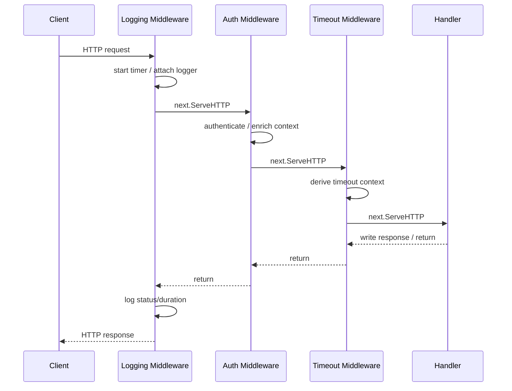
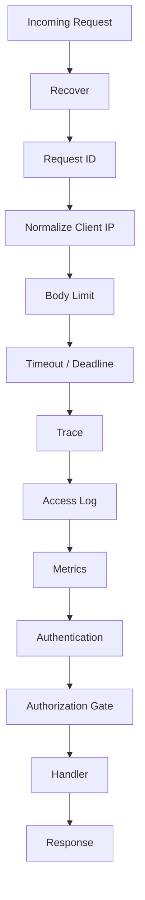
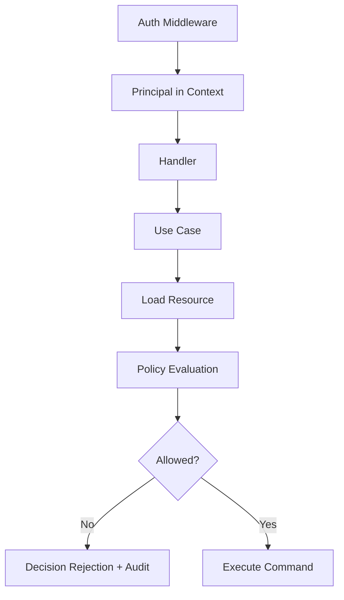
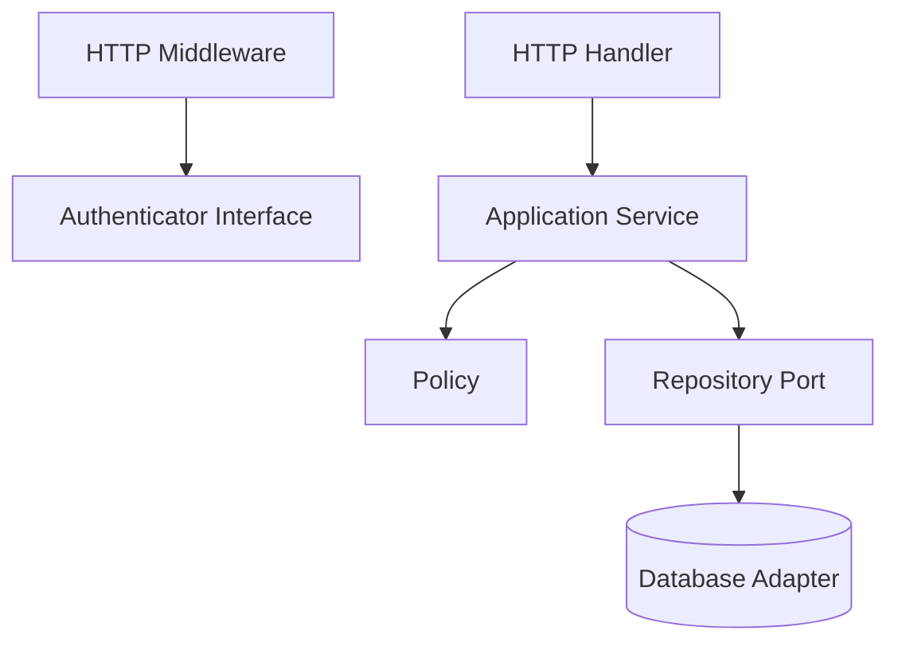

# learn-go-design-patterns-common-patterns-anti-patterns-part-015.md

# Part 015 — Middleware and Interceptor Pattern

> Seri: **Go Design Patterns, Common Patterns, and Anti-Patterns**  
> Target pembaca: **Java software engineer yang ingin berpikir idiomatis dan production-grade di Go**  
> Baseline: **Go 1.26.x**  
> Fokus: **middleware, interceptor, cross-cutting concern, chain ordering, request boundary, observability, security, resilience, dan anti-pattern**

---

## 0. Posisi Part Ini Dalam Seri

Sebelumnya kita sudah membahas:

- package sebagai unit desain,
- API surface,
- interface placement,
- constructor/init,
- functional options,
- configuration,
- dependency wiring,
- port/adapter,
- repository,
- transaction boundary,
- service layer,
- handler pattern.

Part ini berada tepat setelah **Handler Pattern**, karena middleware/interceptor adalah pola yang hidup di sekitar handler.

Handler menjawab pertanyaan:

> “Apa yang harus dilakukan untuk request/event/command ini?”

Middleware/interceptor menjawab pertanyaan:

> “Perilaku lintas-cutting apa yang harus berlaku sebelum/sesudah handler berjalan, tanpa mencampurnya ke business logic?”

Contoh concern yang sering cocok menjadi middleware/interceptor:

- request logging,
- correlation/request ID,
- authentication extraction,
- authorization coarse gate,
- panic recovery,
- timeout/deadline,
- rate limiting,
- metrics,
- tracing,
- CORS,
- body size limit,
- compression,
- request normalization,
- security headers,
- audit envelope,
- retry/interception pada client side.

Namun middleware juga sering menjadi tempat codebase mulai rusak:

- business rule disembunyikan di middleware,
- context dipakai sebagai dependency bag,
- ordering tidak jelas,
- error ditelan,
- panic recovery terlalu luas,
- logging dobel,
- response wrapper salah,
- middleware terlalu banyak hingga call path sulit dipahami.

---

## 1. Core Mental Model

Middleware adalah **function yang membungkus function lain**.

Dalam `net/http`, bentuk paling umum:

```go
type Middleware func(http.Handler) http.Handler
```

Artinya:

```text
handler asli -> dibungkus -> handler baru
```

Kalau ada banyak middleware:

```text
request
  -> middleware A before
    -> middleware B before
      -> middleware C before
        -> handler
      <- middleware C after
    <- middleware B after
  <- middleware A after
response
```

Mermaid:



Untuk gRPC, istilah yang lazim adalah **interceptor**, tetapi mental model-nya mirip:

```text
RPC request
  -> interceptor before
    -> handler / invoker
  <- interceptor after
RPC response
```

Perbedaan penting:

- HTTP middleware membungkus `http.Handler`.
- gRPC interceptor membungkus RPC unary/stream handler atau invoker.
- HTTP `ResponseWriter` punya karakteristik unik: setelah header/body ditulis, sebagian keputusan response sudah tidak bisa diubah.
- gRPC lebih eksplisit dalam bentuk `(resp, err)` untuk unary RPC.

---

## 2. Apa Yang Bukan Middleware

Middleware bukan tempat untuk:

- menghitung business decision,
- menjalankan workflow domain,
- melakukan database transaction domain,
- memanggil banyak repository,
- mengubah status domain entity,
- melakukan approval/rejection rule,
- menyimpan domain audit sebagai efek samping utama,
- mengambil dependency dari context karena malas wiring,
- mengganti service layer.

Middleware idealnya menangani concern yang:

1. berlaku lintas banyak endpoint/RPC,
2. relatif independen dari use case spesifik,
3. bisa dijelaskan sebagai policy boundary,
4. punya ordering yang jelas,
5. tidak menyembunyikan semantic business utama.

Rule praktis:

> Kalau behavior-nya harus dipahami untuk mengetahui arti business operation, kemungkinan besar itu bukan middleware.

Contoh:

```text
Baik sebagai middleware:
- request ID
- auth principal extraction
- timeout
- metrics
- structured access log
- panic recovery

Buruk sebagai middleware:
- if user role supervisor then auto-approve
- if application status draft then mutate status
- if amount > 100000 then insert risk finding
- if customer has active case then reject submission
```

---

## 3. Java Mindset vs Go Mindset

Java/Spring engineer sering terbiasa dengan:

- servlet filter,
- interceptor,
- annotation-based AOP,
- security filter chain,
- aspect-oriented logging,
- transaction annotation,
- validation annotation,
- controller advice,
- exception handler global.

Di Go, pendekatan yang lebih sehat:

- fungsi eksplisit,
- wrapper eksplisit,
- dependency jelas,
- order chain terlihat saat wiring,
- tidak bergantung pada reflection magic,
- tidak memakai annotation sebagai control plane tersembunyi.

Perbandingan:

| Concern | Java/Spring style | Go idiomatic style |
|---|---|---|
| Auth | filter chain + annotation | middleware extract principal, service authorize explicitly |
| Logging | AOP/log aspect | explicit middleware/decorator |
| Transaction | `@Transactional` | closure-based transaction in use case boundary |
| Validation | annotation + framework | handler input validation + domain invariant |
| Error mapping | global exception handler | handler/interceptor maps typed errors |
| Dependency | container injection | constructor + composition root |
| Cross-cutting | aspect/proxy magic | explicit function wrapping |

Hal yang perlu diwaspadai:

> Jangan membuat Go middleware menjadi “mini Spring container”.

Kalau chain behavior hanya bisa dipahami dengan membaca banyak implicit hook, reflection registry, dan global variable, desainnya sudah menjauh dari kekuatan Go.

---

## 4. Middleware as Chain of Responsibility

Pattern klasik yang paling dekat adalah **Chain of Responsibility**.

Setiap middleware punya kesempatan untuk:

1. membaca request,
2. memutus apakah request boleh lanjut,
3. menambah metadata ke context,
4. membungkus writer/response,
5. menjalankan behavior sebelum handler,
6. menjalankan behavior sesudah handler,
7. menangani panic/error pada boundary tertentu.

Contoh minimal:

```go
type Middleware func(http.Handler) http.Handler

func Chain(h http.Handler, middlewares ...Middleware) http.Handler {
	for i := len(middlewares) - 1; i >= 0; i-- {
		h = middlewares[i](h)
	}
	return h
}
```

Kenapa iterasi dari belakang?

Karena kita ingin urutan deklarasi:

```go
handler := Chain(finalHandler,
	RequestID,
	Logging,
	Recover,
	Authenticate,
	Authorize,
)
```

berarti request flow:

```text
RequestID -> Logging -> Recover -> Authenticate -> Authorize -> finalHandler
```

Kalau implementasi chain salah, order mental model akan terbalik dan mudah menghasilkan bug halus.

---

## 5. Basic HTTP Middleware Shape

```go
func RequestID(next http.Handler) http.Handler {
	return http.HandlerFunc(func(w http.ResponseWriter, r *http.Request) {
		requestID := r.Header.Get("X-Request-ID")
		if requestID == "" {
			requestID = newRequestID()
		}

		ctx := context.WithValue(r.Context(), requestIDKey{}, requestID)
		w.Header().Set("X-Request-ID", requestID)

		next.ServeHTTP(w, r.WithContext(ctx))
	})
}
```

Important details:

- `next.ServeHTTP` harus dipanggil kalau request dilanjutkan.
- Untuk mengganti context, pakai `r.WithContext(ctx)`.
- Key context sebaiknya tipe unexported agar tidak collision.
- Middleware boleh short-circuit dengan menulis response dan `return`.
- Jangan pakai context untuk dependency besar seperti DB, config, logger global, repository.

Context key pattern:

```go
type requestIDKey struct{}

func RequestIDFromContext(ctx context.Context) (string, bool) {
	v, ok := ctx.Value(requestIDKey{}).(string)
	return v, ok
}
```

---

## 6. Middleware Ordering: Bagian Paling Sering Diremehkan

Ordering bukan detail kecil. Ordering adalah semantic contract.

Contoh chain umum:

```text
1. Recover
2. RequestID
3. RealIP / Forwarded header normalization
4. Security headers
5. Body size limit
6. Timeout
7. Logging
8. Metrics
9. Tracing
10. Authentication
11. Authorization coarse gate
12. Route handler
```

Tetapi order ini tidak universal.

Contoh trade-off:

- `Recover` paling luar agar panic dari middleware lain juga tertangkap.
- `RequestID` sebaiknya awal agar log panic punya correlation ID.
- `Timeout` harus cukup awal agar downstream mendapat context deadline.
- `Logging` ingin melihat status akhir, sehingga perlu membungkus writer.
- `Authentication` harus sebelum middleware yang butuh principal.
- `Authorization` harus setelah auth.
- `RateLimit` bisa sebelum auth untuk IP-based, atau setelah auth untuk user-based.
- `Metrics` bisa luar untuk seluruh request, atau dalam setelah normalization tergantung label strategy.

Mermaid:



Order harus ditulis eksplisit di composition root. Jangan tersebar di banyak file dengan registration side effect.

Bad:

```go
func init() {
	RegisterMiddleware(Auth)
	RegisterMiddleware(Logging)
}
```

Better:

```go
handler := Chain(router,
	middleware.Recover(logger),
	middleware.RequestID(),
	middleware.Timeout(cfg.RequestTimeout),
	middleware.AccessLog(logger),
	middleware.Metrics(metrics),
	middleware.Auth(authenticator),
)
```

---

## 7. Short-Circuit Pattern

Middleware boleh menghentikan request.

Contoh authentication:

```go
func Authenticate(auth Authenticator) Middleware {
	return func(next http.Handler) http.Handler {
		return http.HandlerFunc(func(w http.ResponseWriter, r *http.Request) {
			principal, err := auth.Authenticate(r.Context(), r.Header.Get("Authorization"))
			if err != nil {
				http.Error(w, "unauthorized", http.StatusUnauthorized)
				return
			}

			ctx := WithPrincipal(r.Context(), principal)
			next.ServeHTTP(w, r.WithContext(ctx))
		})
	}
}
```

Short-circuit cocok untuk:

- unauthenticated request,
- invalid content type,
- body too large,
- rate limit exceeded,
- maintenance mode,
- invalid protocol-level precondition.

Short-circuit buruk untuk:

- domain rejection yang butuh decision trace,
- application-level validation kompleks,
- state machine transition rejection,
- workflow-specific policy.

Domain rejection sebaiknya berada di use case agar:

- bisa dites tanpa HTTP,
- bisa dipakai oleh worker/CLI/RPC,
- bisa dicatat sebagai decision result,
- tidak tersembunyi di transport boundary.

---

## 8. ResponseWriter Wrapping Pattern

Untuk access log dan metrics, middleware sering perlu tahu:

- status code,
- response size,
- whether header already written,
- duration.

`http.ResponseWriter` tidak menyediakan status code yang sudah ditulis. Maka umum dibuat wrapper.

```go
type statusRecorder struct {
	http.ResponseWriter
	status int
	size   int
}

func (r *statusRecorder) WriteHeader(code int) {
	if r.status != 0 {
		return
	}
	r.status = code
	r.ResponseWriter.WriteHeader(code)
}

func (r *statusRecorder) Write(b []byte) (int, error) {
	if r.status == 0 {
		r.status = http.StatusOK
	}
	n, err := r.ResponseWriter.Write(b)
	r.size += n
	return n, err
}

func (r *statusRecorder) Status() int {
	if r.status == 0 {
		return http.StatusOK
	}
	return r.status
}
```

Access log middleware:

```go
func AccessLog(logger *slog.Logger) Middleware {
	return func(next http.Handler) http.Handler {
		return http.HandlerFunc(func(w http.ResponseWriter, r *http.Request) {
			start := time.Now()
			rec := &statusRecorder{ResponseWriter: w}

			next.ServeHTTP(rec, r)

			logger.InfoContext(r.Context(), "http_request",
				"method", r.Method,
				"path", r.URL.Path,
				"status", rec.Status(),
				"size", rec.size,
				"duration_ms", time.Since(start).Milliseconds(),
			)
		})
	}
}
```

Caveat penting:

- Wrapper harus mempertahankan optional interfaces bila diperlukan: `http.Flusher`, `http.Hijacker`, `http.Pusher`, `io.ReaderFrom`.
- Tidak semua response bisa dibungkus sederhana, terutama streaming, websocket, SSE, hijacked connection.
- Setelah handler menulis header/body, middleware luar tidak bisa dengan aman mengubah keputusan response.

Anti-pattern:

```go
next.ServeHTTP(w, r)
w.WriteHeader(http.StatusInternalServerError) // terlambat dan salah
```

---

## 9. Panic Recovery Middleware

Recovery middleware menangkap panic agar server tidak crash karena satu request.

```go
func Recover(logger *slog.Logger) Middleware {
	return func(next http.Handler) http.Handler {
		return http.HandlerFunc(func(w http.ResponseWriter, r *http.Request) {
			defer func() {
				if rec := recover(); rec != nil {
					logger.ErrorContext(r.Context(), "panic recovered",
						"panic", rec,
						"method", r.Method,
						"path", r.URL.Path,
					)

					http.Error(w, "internal server error", http.StatusInternalServerError)
				}
			}()

			next.ServeHTTP(w, r)
		})
	}
}
```

Tetapi recovery bukan alasan untuk menoleransi panic sebagai control flow.

Recovery harus:

- mencatat panic dengan correlation ID,
- tidak mengekspos detail internal ke client,
- menghindari double-write bila response sudah committed,
- meningkatkan metric panic,
- mempertimbangkan stack trace,
- tidak menelan panic fatal di background goroutine yang tidak berada di request stack.

Masalah response already written:

```go
func Recover(logger *slog.Logger) Middleware {
	return func(next http.Handler) http.Handler {
		return http.HandlerFunc(func(w http.ResponseWriter, r *http.Request) {
			rec := &statusRecorder{ResponseWriter: w}

			defer func() {
				if p := recover(); p != nil {
					logger.ErrorContext(r.Context(), "panic recovered", "panic", p)

					if rec.status == 0 {
						http.Error(rec, "internal server error", http.StatusInternalServerError)
					}
				}
			}()

			next.ServeHTTP(rec, r)
		})
	}
}
```

Jika handler sudah menulis `200` lalu panic, middleware tidak bisa membatalkan response yang sudah terkirim. Untuk kasus streaming, recovery hanya bisa log dan close.

---

## 10. Timeout Middleware

Timeout middleware membuat deadline untuk request.

```go
func Timeout(d time.Duration) Middleware {
	return func(next http.Handler) http.Handler {
		return http.HandlerFunc(func(w http.ResponseWriter, r *http.Request) {
			ctx, cancel := context.WithTimeout(r.Context(), d)
			defer cancel()

			next.ServeHTTP(w, r.WithContext(ctx))
		})
	}
}
```

Tapi ini hanya efektif bila downstream menghormati context:

- DB call memakai `QueryContext`/`ExecContext`,
- HTTP client memakai request dengan context,
- goroutine worker memeriksa `ctx.Done()`,
- retry loop berhenti saat context cancelled,
- service tidak membuat `context.Background()` sendiri.

Anti-pattern:

```go
func (s *Service) DoSomething(ctx context.Context) error {
	ctx = context.Background() // membunuh deadline dari middleware
	return s.repo.Save(ctx)
}
```

Timeout middleware tidak otomatis membatalkan CPU-bound work yang tidak mengecek context.

Untuk HTTP server, timeout juga perlu dilihat di level server:

```go
srv := &http.Server{
	Addr:              cfg.Addr,
	Handler:           handler,
	ReadHeaderTimeout: 5 * time.Second,
	ReadTimeout:       15 * time.Second,
	WriteTimeout:      30 * time.Second,
	IdleTimeout:       60 * time.Second,
}
```

Request timeout middleware dan server timeout menyelesaikan masalah yang berbeda:

| Timeout | Level | Tujuan |
|---|---|---|
| `ReadHeaderTimeout` | server | proteksi slowloris/header lambat |
| `ReadTimeout` | server | batas baca request |
| `WriteTimeout` | server | batas tulis response |
| middleware timeout | application | deadline untuk downstream work |
| client timeout | outbound | batas caller menunggu remote |

---

## 11. Authentication Middleware vs Authorization Middleware

Authentication menjawab:

> “Siapa caller ini?”

Authorization menjawab:

> “Apakah caller ini boleh melakukan action ini terhadap resource ini?”

Di middleware, authentication sering cocok karena berlaku lintas endpoint.

```go
func WithPrincipal(ctx context.Context, p Principal) context.Context {
	return context.WithValue(ctx, principalKey{}, p)
}

func PrincipalFromContext(ctx context.Context) (Principal, bool) {
	p, ok := ctx.Value(principalKey{}).(Principal)
	return p, ok
}
```

Authorization lebih hati-hati.

Coarse authorization cocok di middleware:

- route membutuhkan authenticated user,
- route membutuhkan role umum,
- route membutuhkan scope token tertentu.

Fine-grained authorization biasanya lebih baik di service/use case:

- user boleh approve application tertentu,
- officer boleh melihat case berdasarkan assignment,
- agency user boleh mutate entity berdasarkan ownership,
- transition allowed based on state + role + delegation + lock.

Bad:

```go
func SupervisorOnly(next http.Handler) http.Handler {
	return http.HandlerFunc(func(w http.ResponseWriter, r *http.Request) {
		// ternyata di sini juga auto-approve draft application
	})
}
```

Better:

```text
middleware:
- extract principal
- reject unauthenticated
- maybe check coarse scope

use case:
- load resource
- evaluate policy
- return decision/result
- audit decision
```

Mermaid:



---

## 12. Context Value Pattern and Abuse

Good context values:

- request ID,
- trace ID/span,
- authenticated principal,
- locale/request metadata,
- small request-scoped values that cross API boundaries.

Bad context values:

- DB connection pool,
- repository,
- service,
- config,
- logger as required dependency,
- feature flag client,
- mutable bag of arbitrary values,
- transaction hidden from call signatures.

Bad:

```go
func Handler(w http.ResponseWriter, r *http.Request) {
	repo := r.Context().Value("repo").(*Repository)
	_ = repo
}
```

Better:

```go
type Handler struct {
	service *ApplicationService
}

func (h *Handler) ServeHTTP(w http.ResponseWriter, r *http.Request) {
	// dependencies are fields, request metadata is in context
}
```

Rule:

> Context carries request-scoped metadata and cancellation. Constructors carry dependencies.

---

## 13. Logging Middleware

Logging middleware should produce **access logs**, not domain audit.

Access log answers:

- which request came in,
- status,
- duration,
- route,
- method,
- request ID,
- caller identity summary,
- error class if known.

Domain audit answers:

- who made which business decision,
- against which domain entity,
- before/after state,
- policy reason,
- approval/rejection reason,
- evidence snapshot.

Do not confuse them.

Access log middleware:

```go
func AccessLog(logger *slog.Logger) Middleware {
	return func(next http.Handler) http.Handler {
		return http.HandlerFunc(func(w http.ResponseWriter, r *http.Request) {
			start := time.Now()
			rec := &statusRecorder{ResponseWriter: w}

			next.ServeHTTP(rec, r)

			attrs := []any{
				"method", r.Method,
				"path", r.URL.Path,
				"status", rec.Status(),
				"duration_ms", time.Since(start).Milliseconds(),
			}

			if rid, ok := RequestIDFromContext(r.Context()); ok {
				attrs = append(attrs, "request_id", rid)
			}

			logger.InfoContext(r.Context(), "http access", attrs...)
		})
	}
}
```

Avoid:

- logging Authorization header,
- logging raw request body by default,
- logging PII without redaction,
- high-cardinality labels in metrics,
- logging same error at middleware and service and repository.

Logging strategy:

```text
Repository: add technical context to error, usually no log.
Service: may log important domain decision or operational failure.
Handler: map error to response.
Middleware: access log once per request.
```

---

## 14. Metrics Middleware

Metrics middleware should answer:

- request count,
- latency distribution,
- error/status count,
- in-flight requests,
- panic count,
- timeout count.

Important metric label principle:

> Label cardinality must be bounded.

Good labels:

- route pattern: `/applications/{id}/approve`,
- method: `POST`,
- status class: `2xx`, `4xx`, `5xx`,
- service name,
- endpoint group.

Bad labels:

- raw URL path containing IDs,
- user ID,
- request ID,
- application number,
- raw error string,
- arbitrary query parameter.

Bad:

```go
metrics.Requests.WithLabelValues(r.URL.Path, userID, err.Error()).Inc()
```

Better:

```go
metrics.ObserveHTTP(routePattern, r.Method, rec.Status(), time.Since(start))
```

Middleware can collect protocol-level metrics, but domain metrics should usually live in service/use case.

Example:

```text
HTTP middleware metric:
- http_requests_total{route,method,status}

Domain metric:
- approvals_total{decision="approved|rejected", reason_class}
```

---

## 15. Tracing Middleware

Tracing middleware usually:

- extracts trace context from inbound request,
- starts server span,
- attaches span to context,
- records status/error,
- injects context into downstream calls.

Key design point:

> Trace propagation must be early enough so downstream logs/DB/outbound calls can attach to the span.

Typical placement:

```text
RequestID -> Trace -> Logging -> Auth -> Handler
```

But if auth must be included in span attributes, auth can run after span creation.

Be careful with:

- putting PII in span attributes,
- high-cardinality span names,
- starting too many nested spans for trivial functions,
- forgetting to end span,
- losing context in goroutines.

---

## 16. Error Mapping Middleware: Usually Be Careful

Java frameworks often use global exception handlers. In Go, error mapping usually happens in handler or RPC interceptor.

For HTTP, because `http.Handler` does not return error, a pure middleware cannot naturally map handler errors unless you define your own handler type.

Alternative pattern:

```go
type AppHandler func(http.ResponseWriter, *http.Request) error

func Adapt(h AppHandler, mapper ErrorMapper) http.Handler {
	return http.HandlerFunc(func(w http.ResponseWriter, r *http.Request) {
		if err := h(w, r); err != nil {
			mapper.WriteError(w, r, err)
		}
	})
}
```

Then middleware wraps the adapted handler.

Or:

```go
type HandlerWithError interface {
	ServeHTTPError(http.ResponseWriter, *http.Request) error
}
```

But do not over-framework too early.

For gRPC, interceptor can naturally map errors because RPC handlers return error:

```go
func ErrorMappingUnaryInterceptor() grpc.UnaryServerInterceptor {
	return func(
		ctx context.Context,
		req any,
		info *grpc.UnaryServerInfo,
		handler grpc.UnaryHandler,
	) (any, error) {
		resp, err := handler(ctx, req)
		if err != nil {
			return nil, mapErrorToStatus(err)
		}
		return resp, nil
	}
}
```

HTTP error mapping can be explicit in handler because protocol does not provide returned error in `http.Handler`.

---

## 17. gRPC Unary Interceptor Pattern

Unary server interceptor shape:

```go
func LoggingUnaryInterceptor(logger *slog.Logger) grpc.UnaryServerInterceptor {
	return func(
		ctx context.Context,
		req any,
		info *grpc.UnaryServerInfo,
		handler grpc.UnaryHandler,
	) (resp any, err error) {
		start := time.Now()

		resp, err = handler(ctx, req)

		logger.InfoContext(ctx, "grpc request",
			"method", info.FullMethod,
			"duration_ms", time.Since(start).Milliseconds(),
			"error", err != nil,
		)

		return resp, err
	}
}
```

Authentication unary interceptor:

```go
func AuthUnaryInterceptor(auth Authenticator) grpc.UnaryServerInterceptor {
	return func(
		ctx context.Context,
		req any,
		info *grpc.UnaryServerInfo,
		handler grpc.UnaryHandler,
	) (any, error) {
		principal, err := auth.AuthenticateContext(ctx)
		if err != nil {
			return nil, status.Error(codes.Unauthenticated, "unauthenticated")
		}

		ctx = WithPrincipal(ctx, principal)
		return handler(ctx, req)
	}
}
```

Interceptor order matters just like middleware.

```go
server := grpc.NewServer(
	grpc.ChainUnaryInterceptor(
		RecoverUnaryInterceptor(logger),
		RequestIDUnaryInterceptor(),
		LoggingUnaryInterceptor(logger),
		AuthUnaryInterceptor(auth),
	),
)
```

---

## 18. gRPC Stream Interceptor Pattern

Streaming is trickier because context and message flow last longer.

A stream interceptor may need to wrap `grpc.ServerStream` to override context.

```go
type wrappedServerStream struct {
	grpc.ServerStream
	ctx context.Context
}

func (s *wrappedServerStream) Context() context.Context {
	return s.ctx
}

func AuthStreamInterceptor(auth Authenticator) grpc.StreamServerInterceptor {
	return func(
		srv any,
		ss grpc.ServerStream,
		info *grpc.StreamServerInfo,
		handler grpc.StreamHandler,
	) error {
		principal, err := auth.AuthenticateContext(ss.Context())
		if err != nil {
			return status.Error(codes.Unauthenticated, "unauthenticated")
		}

		ctx := WithPrincipal(ss.Context(), principal)
		return handler(srv, &wrappedServerStream{ServerStream: ss, ctx: ctx})
	}
}
```

Streaming concerns:

- per-stream vs per-message auth,
- long-lived deadlines,
- cancellation propagation,
- message-level metrics,
- backpressure,
- partial failure,
- cleanup on stream close.

Do not assume unary interceptor design transfers perfectly to streams.

---

## 19. Client-Side Middleware / Interceptor

Middleware is not only server-side.

Client-side interceptor/decorator can handle:

- outbound tracing,
- retries,
- timeout,
- auth token injection,
- idempotency key,
- circuit breaker,
- metrics,
- logging,
- response classification.

HTTP client decorator example:

```go
type RoundTripperFunc func(*http.Request) (*http.Response, error)

func (f RoundTripperFunc) RoundTrip(r *http.Request) (*http.Response, error) {
	return f(r)
}

func AuthRoundTripper(tokenSource TokenSource, next http.RoundTripper) http.RoundTripper {
	if next == nil {
		next = http.DefaultTransport
	}

	return RoundTripperFunc(func(r *http.Request) (*http.Response, error) {
		token, err := tokenSource.Token(r.Context())
		if err != nil {
			return nil, err
		}

		clone := r.Clone(r.Context())
		clone.Header.Set("Authorization", "Bearer "+token)

		return next.RoundTrip(clone)
	})
}
```

Important:

- Clone request before mutation if it may be reused.
- Respect request context.
- Do not retry non-idempotent requests without idempotency semantics.
- Do not log sensitive headers.
- Do not hide remote error classification from caller.

---

## 20. Middleware vs Decorator vs Adapter

These patterns overlap.

| Pattern | Wraps | Common target | Example |
|---|---|---|---|
| Middleware | handler | inbound transport | HTTP logging middleware |
| Interceptor | RPC handler/invoker | gRPC | auth unary interceptor |
| Decorator | interface/concrete dependency | service/client/repo | retrying payment client |
| Adapter | external boundary | infra/transport | SQL repository, HTTP client adapter |

A middleware is a decorator specialized around request handling.

Do not force everything into middleware.

Example:

- Retry outbound HTTP call: client decorator, not inbound middleware.
- Transaction boundary: use case/unit of work, not middleware.
- Domain audit: service/use case, not access log middleware.
- Row-level authorization: service/policy, not generic middleware.

---

## 21. Security Middleware Patterns

Security middleware may include:

- TLS termination awareness,
- HSTS/security headers,
- CORS,
- CSRF for browser flows,
- content type enforcement,
- request body size limit,
- authentication,
- coarse scope check,
- rate limiting,
- IP allowlist for admin endpoint,
- request smuggling protections at proxy/server layer.

Example security headers:

```go
func SecurityHeaders() Middleware {
	return func(next http.Handler) http.Handler {
		return http.HandlerFunc(func(w http.ResponseWriter, r *http.Request) {
			w.Header().Set("X-Content-Type-Options", "nosniff")
			w.Header().Set("X-Frame-Options", "DENY")
			w.Header().Set("Referrer-Policy", "no-referrer")
			next.ServeHTTP(w, r)
		})
	}
}
```

But security headers are not a full security model.

Anti-pattern:

```text
“Authorization is already handled by middleware.”
```

Maybe true for coarse API access. Usually false for object-level decision.

---

## 22. CORS Middleware: Simple but Often Misused

CORS is browser policy, not server-to-server security.

Bad mental model:

> “CORS protects my API from unauthorized access.”

Better mental model:

> CORS controls which browser origins may read responses. It does not replace authentication or authorization.

CORS middleware must be explicit:

- allowed origins,
- allowed methods,
- allowed headers,
- credentials policy,
- preflight handling,
- max age.

Anti-pattern:

```go
w.Header().Set("Access-Control-Allow-Origin", "*")
w.Header().Set("Access-Control-Allow-Credentials", "true")
```

This combination is conceptually broken for credentialed browser requests.

For internal APIs, ask:

- Is this endpoint accessed by browsers?
- Which frontend origins are legitimate?
- Are cookies involved?
- Is token stored in browser?
- Does gateway already handle CORS?

---

## 23. Rate Limiting Middleware

Rate limiting can happen at different layers:

- CDN/API gateway,
- load balancer/proxy,
- application middleware,
- downstream client decorator,
- per-user policy in service.

Application middleware rate limiting dimensions:

- IP-based,
- token/client ID-based,
- user ID-based,
- route-based,
- tenant-based,
- global budget.

Placement depends on identity:

```text
IP-based limiter: before authentication can be OK.
User-based limiter: after authentication.
Tenant-based limiter: after tenant resolution.
Route-specific limiter: after route matching.
```

Rate limit result should include:

- stable error response,
- retry-after when useful,
- metric,
- log at appropriate level,
- no sensitive internal quota detail.

Anti-patterns:

- one global limiter for all endpoints,
- limiter key uses raw user input unsafely,
- no distributed coordination when multiple replicas need shared quota,
- limiter does expensive auth/database lookup first when IP-abuse is obvious,
- limiter logs every rejected request at error level causing log flood.

---

## 24. Middleware With Functional Options

Middleware often needs configuration.

Example:

```go
type AccessLogOptions struct {
	SkipPaths map[string]bool
	Now       func() time.Time
}

type AccessLogOption func(*AccessLogOptions)

func WithSkippedPath(path string) AccessLogOption {
	return func(o *AccessLogOptions) {
		if o.SkipPaths == nil {
			o.SkipPaths = make(map[string]bool)
		}
		o.SkipPaths[path] = true
	}
}

func AccessLog(logger *slog.Logger, opts ...AccessLogOption) Middleware {
	cfg := AccessLogOptions{Now: time.Now}
	for _, opt := range opts {
		opt(&cfg)
	}
	if cfg.Now == nil {
		cfg.Now = time.Now
	}

	return func(next http.Handler) http.Handler {
		return http.HandlerFunc(func(w http.ResponseWriter, r *http.Request) {
			if cfg.SkipPaths[r.URL.Path] {
				next.ServeHTTP(w, r)
				return
			}

			start := cfg.Now()
			next.ServeHTTP(w, r)
			logger.InfoContext(r.Context(), "request", "duration", cfg.Now().Sub(start))
		})
	}
}
```

But do not overuse functional options for simple middleware.

Good:

```go
Timeout(5 * time.Second)
```

Overkill:

```go
Timeout(WithDuration(5*time.Second))
```

---

## 25. Route-Specific Middleware

Not all middleware should apply globally.

Example grouping:

```go
public := Chain(publicRouter,
	RequestID(),
	AccessLog(logger),
)

private := Chain(privateRouter,
	RequestID(),
	AccessLog(logger),
	Authenticate(auth),
)

admin := Chain(adminRouter,
	RequestID(),
	AccessLog(logger),
	Authenticate(auth),
	RequireRole("admin"),
)
```

Alternative with router groups depends on router library.

Design principle:

> Middleware scope should match policy scope.

Bad:

- auth middleware applied globally then hacked with skip paths,
- huge skip-list inside middleware,
- middleware knows all route names,
- route-specific business policy in global middleware.

Better:

- compose chains per route group,
- keep global middleware truly global,
- keep endpoint-specific logic in handler/service.

---

## 26. Middleware and Testing Strategy

Middleware testing should cover:

- whether `next` is called,
- whether short-circuit works,
- status code,
- headers,
- context enrichment,
- ordering if chain builder is custom,
- response writer wrapper behavior,
- panic recovery,
- timeout/cancellation,
- sensitive log redaction,
- metrics label bounds.

Example test for auth short-circuit:

```go
func TestAuthenticateRejectsMissingToken(t *testing.T) {
	auth := fakeAuthenticator{err: ErrUnauthenticated}
	mw := Authenticate(auth)

	called := false
	next := http.HandlerFunc(func(w http.ResponseWriter, r *http.Request) {
		called = true
	})

	rr := httptest.NewRecorder()
	req := httptest.NewRequest(http.MethodGet, "/x", nil)

	mw(next).ServeHTTP(rr, req)

	if called {
		t.Fatalf("next handler was called")
	}
	if rr.Code != http.StatusUnauthorized {
		t.Fatalf("status = %d, want %d", rr.Code, http.StatusUnauthorized)
	}
}
```

Test for context enrichment:

```go
func TestRequestIDAddsContextValue(t *testing.T) {
	mw := RequestID()

	next := http.HandlerFunc(func(w http.ResponseWriter, r *http.Request) {
		id, ok := RequestIDFromContext(r.Context())
		if !ok || id == "" {
			t.Fatalf("missing request id")
		}
	})

	req := httptest.NewRequest(http.MethodGet, "/x", nil)
	rr := httptest.NewRecorder()

	mw(next).ServeHTTP(rr, req)
}
```

Test with deterministic clock:

```go
type fakeClock struct {
	times []time.Time
	idx   int
}

func (c *fakeClock) Now() time.Time {
	t := c.times[c.idx]
	c.idx++
	return t
}
```

---

## 27. Observability of Middleware Itself

Middleware is part of runtime control plane. It needs observability.

For each middleware, ask:

- What metric indicates this middleware is rejecting/altering traffic?
- What log field proves it ran?
- Does it expose safe debug info?
- Can we distinguish handler failure from middleware failure?
- Does it attach correlation fields?
- Does it avoid noisy logs?

Examples:

| Middleware | Useful metric | Useful log field |
|---|---|---|
| Auth | auth_failures_total by reason class | principal type, auth method, no raw token |
| Rate limit | rate_limited_total by key class/route | limiter name, route, retry_after |
| Recover | panics_total | request_id, route, stack hash |
| Timeout | request_timeouts_total | deadline_ms, route |
| Body limit | body_rejected_total | max_bytes, content_type |
| CORS | cors_preflight_total | origin class, allowed bool |

Avoid putting request ID as metric label.

---

## 28. Performance Considerations

Middleware overhead sources:

- allocation per request,
- context value creation,
- closure capture,
- response writer wrapping,
- logging attribute construction,
- metric label lookup,
- body buffering,
- regex route matching,
- token parsing,
- remote auth introspection,
- synchronization in shared limiter.

Usually middleware overhead is acceptable compared to I/O, but in high-throughput services it matters.

Guidelines:

1. Avoid reading full body in middleware unless required.
2. Avoid expensive string manipulation per request.
3. Use route pattern, not raw path normalization with heavy regex each time.
4. Avoid building log fields if log level disabled, when logger supports optimization.
5. Do not perform remote call in global middleware unless necessary.
6. Keep context values small.
7. Avoid global locks in hot path.
8. Benchmark middleware chain under realistic concurrency.

Bad:

```go
func Logging(next http.Handler) http.Handler {
	return http.HandlerFunc(func(w http.ResponseWriter, r *http.Request) {
		body, _ := io.ReadAll(r.Body) // dangerous for every request
		logger.Info("request", "body", string(body))
		next.ServeHTTP(w, r)
	})
}
```

---

## 29. Middleware and Request Body

Reading body in middleware is dangerous because body is a stream.

If middleware reads it, handler may not be able to read it unless restored.

```go
body, err := io.ReadAll(r.Body)
if err != nil { ... }
r.Body = io.NopCloser(bytes.NewReader(body))
```

Problems:

- memory amplification,
- slow requests,
- large upload risk,
- sensitive data exposure,
- streaming broken,
- backpressure broken,
- request body can only be replayed if buffered.

Better:

- use `http.MaxBytesReader` or server-level limits,
- log metadata not full body,
- decode in handler,
- validate content length/type in middleware if needed,
- stream large payloads where appropriate.

Body size middleware:

```go
func MaxBodyBytes(n int64) Middleware {
	return func(next http.Handler) http.Handler {
		return http.HandlerFunc(func(w http.ResponseWriter, r *http.Request) {
			r.Body = http.MaxBytesReader(w, r.Body, n)
			next.ServeHTTP(w, r)
		})
	}
}
```

---

## 30. Middleware and Response Body

Capturing response body is also risky.

Use cases:

- debugging in non-prod,
- audit of selected safe responses,
- response transformation,
- compression,
- envelope wrapping.

Risks:

- memory overhead,
- streaming broken,
- sensitive data leak,
- status/header mismatch,
- double write,
- compression conflict,
- partial response issues.

Production rule:

> Do not globally capture response body unless you have a strong, bounded, audited reason.

For audit, prefer domain audit event in use case rather than response capture.

---

## 31. Anti-Pattern Catalog

### 31.1 Business Logic in Middleware

Symptom:

```go
func AutoApproveIfSupervisor(next http.Handler) http.Handler
```

Problem:

- workflow hidden from use case,
- hard to test outside HTTP,
- worker/CLI path bypasses rule,
- audit incomplete,
- authorization mixed with mutation.

Fix:

- middleware extracts principal,
- use case evaluates policy,
- domain decision is explicit.

---

### 31.2 Context as Dependency Bag

Symptom:

```go
ctx.Value("db").(*sql.DB)
ctx.Value("repo").(Repository)
ctx.Value("config").(Config)
```

Problem:

- hidden dependency,
- runtime panic,
- impossible to know constructor contract,
- poor testability.

Fix:

- inject dependencies into struct fields,
- context only request metadata/cancellation.

---

### 31.3 Middleware Ordering by Accident

Symptom:

- registration through `init`,
- map iteration order,
- auto-discovered middleware,
- route group inheritance unclear.

Problem:

- security bugs,
- missing request ID in logs,
- timeout not propagated,
- auth after authorization.

Fix:

- explicit chain in composition root,
- documented order,
- tests for critical ordering.

---

### 31.4 Double Logging

Symptom:

- repository logs error,
- service logs same error,
- handler logs same error,
- middleware logs request as error.

Problem:

- log noise,
- alert fatigue,
- duplicated stack/context,
- unclear owner.

Fix:

- one owner for access log,
- one owner for domain significant event,
- errors enriched as values, not logged everywhere.

---

### 31.5 Swallowing Errors

Common in interceptors/decorators:

```go
resp, err := handler(ctx, req)
if err != nil {
	logger.Error("failed", "err", err)
	return resp, nil
}
```

Problem:

- caller sees success,
- retry logic broken,
- metrics wrong,
- data corruption risk.

Fix:

- classify/map error, but preserve failure semantics.

---

### 31.6 Panic Recovery as Control Flow

Symptom:

- validation panics,
- auth panics,
- domain rule panics,
- recovery maps everything to 500.

Problem:

- expected rejection becomes internal error,
- poor observability,
- hidden invalid state.

Fix:

- expected conditions return error/result,
- panic reserved for programmer error/invariant breach.

---

### 31.7 Global Middleware Registry

Symptom:

```go
middleware.Register("auth", Auth())
```

Problem:

- hidden order,
- hard to test,
- package import has side effects,
- plugin-like complexity without need.

Fix:

- explicit composition root,
- registry only when real plugin architecture exists.

---

### 31.8 Over-Middleware

Symptom:

- 20 middleware in chain,
- each mutates context,
- business flow unclear,
- debug requires stepping through wrappers.

Problem:

- accidental framework,
- local reasoning lost,
- performance overhead,
- ordering bugs.

Fix:

- collapse related middleware,
- move domain logic to service,
- keep only true cross-cutting behavior.

---

### 31.9 ResponseWriter Wrapper Broken

Symptom:

- websocket broken,
- streaming broken,
- flush missing,
- status logged as 200 incorrectly,
- headers modified after write.

Fix:

- test wrapper,
- preserve optional interfaces where needed,
- avoid body capture globally.

---

### 31.10 Auth Middleware Performs Remote Authorization Per Request Without Budget

Symptom:

- middleware calls remote authz system for every request,
- no timeout,
- no cache,
- no circuit breaker,
- global outage when authz slows.

Fix:

- deadline propagation,
- local token validation where possible,
- cache safe metadata,
- separate coarse auth from fine policy,
- use bulkhead/circuit breaker.

---

## 32. Production-Grade Middleware Design Checklist

For each middleware, answer:

### Scope

- Is this concern truly cross-cutting?
- Should it be global, route-group, or endpoint-specific?
- Does it belong in middleware, service, decorator, or adapter?

### Ordering

- What must run before it?
- What must run after it?
- Does it need request ID/trace/principal?
- Does it short-circuit?

### Context

- Does it add context values?
- Are keys typed and unexported?
- Are values request-scoped and small?
- Does it preserve cancellation/deadline?

### Response

- Does it write response?
- Can it double-write?
- Does it wrap ResponseWriter safely?
- Does it work for streaming/websocket?

### Error/Panic

- Does it preserve error semantics?
- Does it classify expected vs unexpected failures?
- Does recovery avoid exposing internals?

### Security

- Does it avoid logging secrets?
- Does it enforce correct trust boundary?
- Does it rely on spoofable headers?
- Does it validate proxy assumptions?

### Observability

- What metric does it emit?
- What log fields does it add?
- Are metric labels bounded?
- Does it preserve correlation ID?

### Performance

- Does it allocate heavily?
- Does it read body?
- Does it call network?
- Does it lock globally?

### Testing

- Is short-circuit tested?
- Is `next` call behavior tested?
- Is ordering tested?
- Is context enrichment tested?
- Is panic path tested?

---

## 33. Example: Production Middleware Stack

```go
type Middleware func(http.Handler) http.Handler

func Chain(h http.Handler, mws ...Middleware) http.Handler {
	for i := len(mws) - 1; i >= 0; i-- {
		h = mws[i](h)
	}
	return h
}

type ServerDeps struct {
	Logger        *slog.Logger
	Authenticator Authenticator
	Metrics       HTTPMetrics
	RequestLimit  int64
	Timeout       time.Duration
}

func NewHTTPHandler(router http.Handler, deps ServerDeps) http.Handler {
	return Chain(router,
		Recover(deps.Logger),
		RequestID(),
		SecurityHeaders(),
		MaxBodyBytes(deps.RequestLimit),
		Timeout(deps.Timeout),
		AccessLog(deps.Logger),
		Metrics(deps.Metrics),
		Authenticate(deps.Authenticator),
	)
}
```

But in real services, not all routes require auth.

Better grouping:

```go
func NewPublicHandler(router http.Handler, deps ServerDeps) http.Handler {
	return Chain(router,
		Recover(deps.Logger),
		RequestID(),
		SecurityHeaders(),
		MaxBodyBytes(deps.RequestLimit),
		Timeout(deps.Timeout),
		AccessLog(deps.Logger),
		Metrics(deps.Metrics),
	)
}

func NewPrivateHandler(router http.Handler, deps ServerDeps) http.Handler {
	return Chain(router,
		Recover(deps.Logger),
		RequestID(),
		SecurityHeaders(),
		MaxBodyBytes(deps.RequestLimit),
		Timeout(deps.Timeout),
		AccessLog(deps.Logger),
		Metrics(deps.Metrics),
		Authenticate(deps.Authenticator),
	)
}
```

---

## 34. Middleware Package Layout

Possible structure:

```text
internal/
  transport/
    httpapi/
      handler.go
      routes.go
      middleware/
        chain.go
        requestid.go
        recover.go
        accesslog.go
        auth.go
        timeout.go
        security.go
        bodylimit.go
```

For shared platform middleware:

```text
internal/
  platform/
    httpmiddleware/
      chain.go
      requestid.go
      recover.go
      accesslog.go
```

Be careful with shared middleware packages. They can become dumping grounds.

A middleware package should not import domain packages unless it is explicitly route/domain-specific. Generic middleware should depend on small interfaces and standard library types.

Bad import graph:

```text
middleware -> application service -> repository -> db
```

Better:

```text
middleware -> authenticator interface
handler -> use case service
service -> repository interface
```

Mermaid:



---

## 35. Refactoring Playbook

### Case 1: Business Logic Hidden in Middleware

Before:

```text
Auth middleware loads application, checks state, mutates approval, writes audit.
```

Steps:

1. Keep middleware extracting principal only.
2. Create use case method `ApproveApplication(ctx, cmd)`.
3. Move resource loading into service.
4. Move policy check into policy component/domain service.
5. Move audit to service transaction boundary.
6. Handler calls service explicitly.
7. Add tests for service without HTTP.

After:

```text
Auth middleware -> principal
Handler -> command
Service -> load + authorize + transition + audit + persist
```

---

### Case 2: Context Dependency Bag

Before:

```go
ctx = context.WithValue(ctx, "db", db)
ctx = context.WithValue(ctx, "repo", repo)
```

Steps:

1. Identify all dependency keys.
2. Move dependencies into constructors.
3. Keep only request metadata in context.
4. Add compile-time constructor checks.
5. Remove string keys.

---

### Case 3: Middleware Order Unclear

Before:

```go
Register(Auth)
Register(Recover)
Register(Logging)
```

Steps:

1. Replace registry with explicit `Chain` call.
2. Document ordering rules.
3. Add one integration test for order-critical context.
4. Remove `init()` registration.

---

### Case 4: Broken Access Logger

Before:

```go
logger.Info("request", "status", 200)
next.ServeHTTP(w, r)
```

Steps:

1. Wrap `ResponseWriter` to capture status.
2. Default status to 200 only if write happened/no status.
3. Preserve important optional interfaces if needed.
4. Add tests for explicit 404, implicit 200, panic path.
5. Avoid logging body.

---

## 36. Decision Matrix

| Situation | Best location |
|---|---|
| Add request ID | middleware |
| Access log | middleware |
| Panic recovery | middleware |
| Parse bearer token | middleware/interceptor |
| Object-level permission | service/policy |
| Start DB transaction | use case/unit of work |
| Retry outbound call | client decorator |
| Map gRPC domain error to status | interceptor |
| Map HTTP service error to response | handler/adapted handler |
| Domain audit | service/use case |
| Body size limit | middleware/server |
| Rate limit by IP | middleware/gateway |
| Rate limit by tenant | middleware after tenant resolution or service policy |
| Trace extraction | middleware/interceptor |
| Add auth header to outbound request | client round tripper/interceptor |

---

## 37. Review Heuristics

When reviewing middleware code, ask:

1. Is the middleware name honest?
2. Does it do only one cross-cutting concern?
3. Does it call `next` exactly when intended?
4. Does it short-circuit safely?
5. Does it write response only when it owns response decision?
6. Does it avoid domain mutation?
7. Does it avoid context dependency bag?
8. Does it preserve cancellation/deadline?
9. Does it avoid logging secrets?
10. Are metric labels bounded?
11. Is ordering explicit?
12. Can the behavior be tested without running the whole app?
13. Does it work with streaming/hijacking if used on such routes?
14. Does it fail closed for security concerns?
15. Does it avoid hidden global state?

---

## 38. Exercises

### Exercise 1 — Build Chain

Implement:

```go
type Middleware func(http.Handler) http.Handler
func Chain(h http.Handler, mws ...Middleware) http.Handler
```

Write a test proving order:

```text
A before
B before
handler
B after
A after
```

---

### Exercise 2 — Access Log Recorder

Implement `statusRecorder` and tests for:

- handler writes explicit `201`,
- handler writes body only,
- handler writes nothing,
- handler calls `WriteHeader` twice.

---

### Exercise 3 — Auth Middleware

Create auth middleware that:

- rejects missing token,
- adds `Principal` to context,
- does not expose token in log,
- calls next only on success.

---

### Exercise 4 — Timeout Propagation

Create middleware timeout, then create fake repository that observes `ctx.Done()`.

Prove cancellation propagates.

---

### Exercise 5 — Refactor Bad Middleware

Given middleware that:

- authenticates,
- loads application,
- checks state,
- approves application,
- writes audit,
- logs access,

split it into:

- auth middleware,
- access log middleware,
- handler,
- service/use case,
- policy component,
- audit component.

---

## 39. Summary

Middleware/interceptor adalah pola penting di Go, tetapi harus digunakan dengan disiplin.

Core principles:

1. Middleware is wrapper composition.
2. Ordering is semantic, not cosmetic.
3. Middleware is for cross-cutting transport/runtime concerns.
4. Business behavior belongs in service/use case/domain policy.
5. Context is for cancellation and request-scoped metadata, not dependency injection.
6. ResponseWriter wrapping is subtle; test it carefully.
7. Panic recovery is a safety net, not control flow.
8. Auth extraction can live in middleware; fine authorization often belongs in service.
9. Metrics/logging/tracing middleware must avoid high cardinality and sensitive data.
10. Explicit composition root beats hidden registration.

The best Go middleware feels boring:

- small,
- explicit,
- easy to test,
- easy to order,
- easy to remove,
- clear about what it owns,
- silent about what it does not own.

---

## 40. What Comes Next

Next part:

```text
learn-go-design-patterns-common-patterns-anti-patterns-part-016.md
```

Topic:

```text
Context Propagation Pattern
```

Part 016 akan membahas `context.Context` lebih dalam sebagai pola desain lintas boundary:

- cancellation ownership,
- deadline budgeting,
- request-scoped values,
- goroutine propagation,
- API signature,
- context in struct anti-pattern,
- background context misuse,
- context and retries,
- context and transaction,
- context and observability.

<!-- NAVIGATION_FOOTER -->
<div class="page-nav">
<a href="./learn-go-design-patterns-common-patterns-anti-patterns-part-014.md">⬅️ Part 014 — Handler Pattern: HTTP, CLI, Worker, Consumer</a>
<a href="./index.md">📚 Kategori</a>
<a href="../../index.md">🏠 Home</a>
<a href="./learn-go-design-patterns-common-patterns-anti-patterns-part-016.md">Part 016 — Context Propagation Pattern ➡️</a>
</div>
