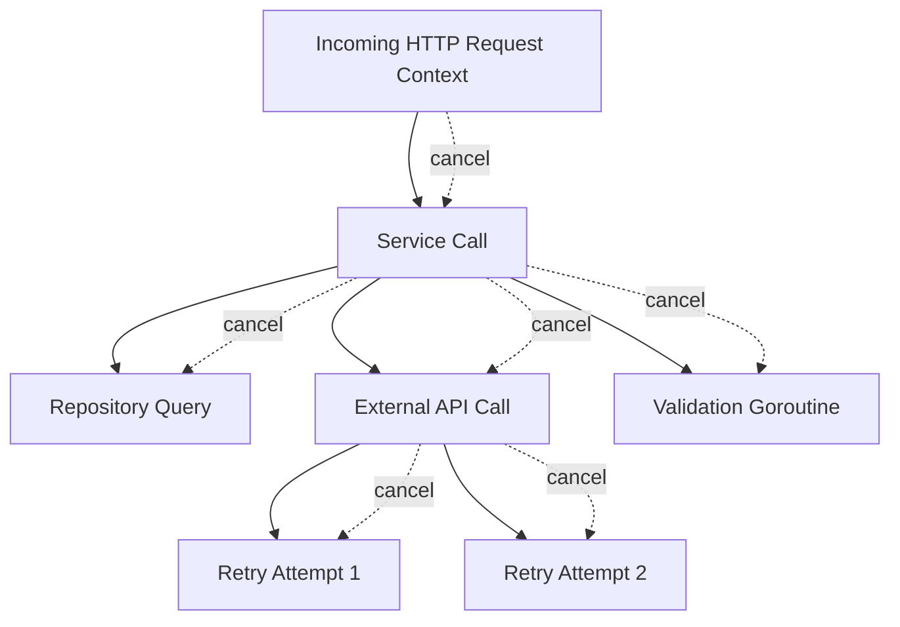
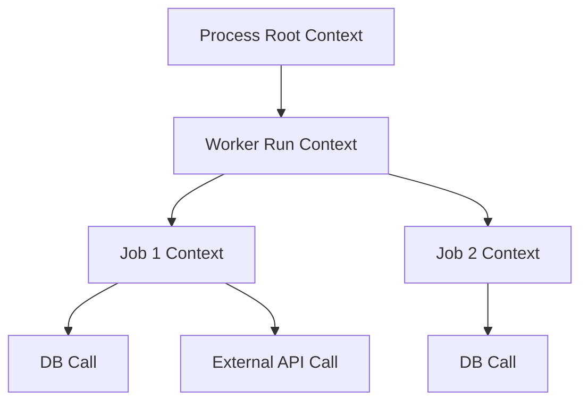

# learn-go-design-patterns-common-patterns-anti-patterns-part-016.md

# Part 016 — Context Propagation Pattern

> Seri: **Go Design Patterns, Common Patterns, and Anti-Patterns**  
> Target pembaca: **Java software engineer yang ingin menguasai Go design pada level production/internal engineering handbook**  
> Fokus part ini: **mendesain propagation boundary untuk cancellation, deadline, request-scoped values, dan observability context tanpa menyalahgunakan `context.Context` sebagai dependency bag atau global runtime state.**

---

## 0. Posisi Part Ini Dalam Seri

Sampai part sebelumnya, kita sudah membangun urutan desain berikut:

1. **Package** sebagai unit arsitektur.
2. **API surface** sebagai kontrak stabil.
3. **Interface placement** sebagai boundary perilaku.
4. **Constructor/init** sebagai lifecycle setup.
5. **Functional options/configuration** sebagai construction-time customization.
6. **Dependency wiring** sebagai executable architecture.
7. **Adapter/port/repository/unit-of-work/service/handler/middleware** sebagai lapisan boundary.

Part ini membahas salah satu primitive paling sering dipakai tetapi juga paling sering disalahgunakan di Go: **`context.Context`**.

`context.Context` bukan sekadar parameter yang selalu dimasukkan agar “idiomatic”. Ia adalah **propagation contract**.

Ia menjawab pertanyaan:

> “Jika sebuah request, job, command, atau operation dibatalkan, timeout, atau membawa metadata lintas boundary, bagaimana seluruh call chain tahu dan bereaksi?”

Tanpa desain context yang benar, sistem Go akan terlihat sederhana tetapi gagal di production:

- goroutine leak,
- database query tetap berjalan setelah request client batal,
- outbound HTTP call tidak punya deadline,
- retry tetap berjalan setelah caller menyerah,
- background worker tidak bisa shutdown graceful,
- trace/correlation ID hilang,
- context value berubah menjadi dependency injection tersembunyi,
- unit test sulit karena dependency diselundupkan melalui context.

Part ini akan membangun mental model yang kuat: **context adalah control plane untuk satu operation**, bukan data model, bukan service locator, bukan optional parameters, bukan tempat menyimpan config, dan bukan field struct biasa.

---

## 1. Core Definition

Dalam dokumentasi resmi Go, package `context` mendefinisikan `Context` sebagai pembawa:

1. **deadline**,
2. **cancellation signal**,
3. **request-scoped values**,

yang melintasi API boundary dan process boundary.

Hal penting:

- Context dibuat di boundary awal operation.
- Context diteruskan secara eksplisit sepanjang call chain.
- Context dapat diturunkan menjadi context baru dengan cancel/deadline/timeout/value tambahan.
- Jika parent context dibatalkan, derived context juga dibatalkan.
- Method pada `Context` aman dipanggil oleh banyak goroutine.

Secara desain, `context.Context` adalah **propagation mechanism**, bukan ownership mechanism untuk dependency utama.

---

## 2. Why Context Exists

Bayangkan request HTTP masuk:

```text
Client
  -> HTTP Handler
      -> Application Service
          -> Repository
              -> DB Query
          -> External API Client
          -> Worker Dispatch
```

Client menutup koneksi setelah 2 detik. Tetapi service kamu masih:

- menunggu DB 20 detik,
- memanggil API eksternal 30 detik,
- menjalankan retry,
- menulis log tanpa correlation ID,
- memulai goroutine background yang tidak pernah berhenti.

Masalahnya bukan “kurang goroutine”. Masalahnya adalah **tidak ada propagation control**.

Context memberi sistem kemampuan untuk berkata:

> “Operation ini sudah tidak relevan. Semua pekerjaan turunan harus tahu dan berhenti dengan benar.”

---

## 3. Mental Model: Context as Operation Control Plane

Gunakan mental model berikut:

```text
context.Context = operation-scoped control plane

Bukan:
- object state
- business data model
- dependency registry
- global config
- transaction container
- user session object penuh
- generic map untuk melewatkan parameter
```

Context membawa sinyal yang melekat pada **operation**, bukan pada **object**.

Operation bisa berupa:

- HTTP request,
- RPC request,
- CLI command execution,
- cron job run,
- queue message handling,
- database transaction operation,
- background worker lifecycle,
- batch import execution,
- state transition command.

Setiap operation punya:

- caller,
- waktu hidup,
- cancellation reason,
- timeout/deadline,
- security/request metadata,
- trace/correlation boundary,
- child operations.

Context cocok untuk hal-hal itu.

---

## 4. Diagram: Context Tree



Ketika parent context dibatalkan, semua child context ikut menerima sinyal cancel. Ini adalah **tree of relevance**.

Jika operation utama tidak relevan, child operation juga umumnya tidak relevan.

---

## 5. Java Mindset vs Go Mindset

### 5.1 Java Common Mindset

Java engineer sering datang dari dunia:

- thread-local request context,
- MDC logging context,
- dependency injection container,
- request-scoped bean,
- transaction annotation,
- security context holder,
- interceptor/proxy magic,
- `CompletableFuture`/reactive context propagation,
- framework-managed lifecycle.

Akibatnya, ketika melihat `context.Context`, ada kecenderungan memperlakukannya seperti:

```text
Spring RequestContext + MDC + SecurityContext + BeanFactory + ThreadLocal
```

Itu berbahaya di Go.

### 5.2 Go Mindset

Di Go:

- propagation eksplisit,
- dependency eksplisit,
- cancellation eksplisit,
- lifetime eksplisit,
- goroutine tidak otomatis mewarisi thread-local,
- package tidak bergantung pada framework container,
- transaction tidak otomatis dibungkus annotation,
- context bukan magic ambient state.

Context bukan pengganti DI container.

Dependency utama harus tetap lewat constructor atau function parameter biasa.

Contoh benar:

```go
type Service struct {
    repo   Repository
    logger *slog.Logger
    clock  Clock
}

func NewService(repo Repository, logger *slog.Logger, clock Clock) *Service {
    return &Service{repo: repo, logger: logger, clock: clock}
}

func (s *Service) Approve(ctx context.Context, cmd ApproveCommand) (ApproveResult, error) {
    // ctx controls this operation.
    // repo/logger/clock are dependencies.
}
```

Contoh buruk:

```go
func Approve(ctx context.Context, cmd ApproveCommand) error {
    repo := ctx.Value(repoKey{}).(Repository)
    logger := ctx.Value(loggerKey{}).(*slog.Logger)
    clock := ctx.Value(clockKey{}).(Clock)
    // Hidden dependencies. Hard to test. Hard to reason.
    return repo.Save(ctx, cmd.ID)
}
```

---

## 6. The Four Roles of Context

Secara praktis, context punya empat peran desain:

```text
1. Cancellation
2. Deadline / timeout
3. Request-scoped values
4. Cross-boundary propagation
```

Mari bahas satu per satu.

---

## 7. Role 1 — Cancellation

Cancellation menjawab:

> “Apakah pekerjaan ini masih perlu dilanjutkan?”

Contoh:

- client disconnect,
- server shutting down,
- parent operation gagal,
- user cancel import,
- job lease expired,
- timeout terjadi,
- worker menerima SIGTERM.

Pattern dasar:

```go
func DoWork(ctx context.Context) error {
    select {
    case <-ctx.Done():
        return ctx.Err()
    default:
    }

    // Do work.
    return nil
}
```

Untuk pekerjaan blocking, operasi yang dipanggil juga harus menerima context:

```go
row := db.QueryRowContext(ctx, query, id)
```

atau:

```go
req, err := http.NewRequestWithContext(ctx, http.MethodGet, url, nil)
```

### 7.1 Cancellation Is Cooperative

Context tidak membunuh goroutine secara paksa.

Ia memberi sinyal. Code kamu harus memilih untuk mendengarkan.

```go
for {
    select {
    case <-ctx.Done():
        return ctx.Err()
    case item := <-items:
        process(item)
    }
}
```

Jika loop panjang tidak mengecek `ctx.Done()`, cancel tidak berguna.

### 7.2 Anti-Pattern: Ignoring Cancellation

Buruk:

```go
func Process(ctx context.Context, items []Item) error {
    for _, item := range items {
        expensiveWork(item) // tidak pernah cek ctx
    }
    return nil
}
```

Lebih baik:

```go
func Process(ctx context.Context, items []Item) error {
    for _, item := range items {
        if err := ctx.Err(); err != nil {
            return err
        }
        if err := expensiveWork(ctx, item); err != nil {
            return err
        }
    }
    return nil
}
```

---

## 8. Role 2 — Deadline and Timeout

Deadline menjawab:

> “Kapan operation ini harus berhenti meskipun belum selesai?”

Timeout adalah durasi relatif. Deadline adalah waktu absolut.

```go
ctx, cancel := context.WithTimeout(parent, 2*time.Second)
defer cancel()
```

Aturan penting:

- Selalu panggil `cancel()` untuk melepaskan resource terkait timer.
- Jangan membuat timeout sembarangan di deep function tanpa memahami budget caller.
- Deadline child tidak boleh lebih longgar dari parent secara efektif.
- Timeout harus didesain sebagai budget, bukan angka acak.

### 8.1 Budget Propagation

Dalam sistem besar, timeout harus dibagi.

Misal request punya SLA 2 detik:

```text
HTTP request total budget: 2000ms
  authz: 100ms
  validation: 100ms
  db read: 400ms
  external API: 800ms
  db write: 300ms
  response margin: 300ms
```

Jika setiap layer membuat `WithTimeout(ctx, 5*time.Second)`, maka timeout child tidak bermakna. Parent tetap bisa cancel lebih dulu, tetapi code menjadi menipu karena angka timeout lokal tidak merepresentasikan budget nyata.

### 8.2 Deadline-Aware Design

Gunakan `ctx.Deadline()` untuk memeriksa sisa waktu ketika perlu mengambil keputusan.

```go
func hasEnoughBudget(ctx context.Context, min time.Duration, now func() time.Time) bool {
    deadline, ok := ctx.Deadline()
    if !ok {
        return true
    }
    return time.Until(deadline) >= min
}
```

Contoh penggunaan:

```go
if !hasEnoughBudget(ctx, 200*time.Millisecond, time.Now) {
    return Result{}, ErrInsufficientTimeBudget
}
```

Ini berguna untuk operasi yang tidak layak dimulai jika budget tinggal terlalu sedikit.

---

## 9. Role 3 — Request-Scoped Values

Context value adalah fitur paling rawan disalahgunakan.

Gunakan hanya untuk data yang:

1. request-scoped,
2. melintasi API/process boundary,
3. dibutuhkan oleh banyak layer orthogonal,
4. bukan dependency utama,
5. bukan parameter bisnis utama.

Contoh yang biasanya masuk akal:

- correlation ID,
- trace span/context,
- authenticated principal minimal,
- tenant ID,
- request ID,
- locale jika memang request-scoped,
- auth claims ringkas,
- logger yang sudah enriched **dalam beberapa codebase**, walau lebih aman jika logger dependency eksplisit.

Contoh yang tidak seharusnya masuk context:

- repository,
- database handle,
- config,
- feature flag client,
- clock,
- service object,
- transaction object tanpa disiplin ketat,
- business command data,
- large DTO,
- mutable map,
- cache client,
- Kafka producer,
- arbitrary option.

### 9.1 Typed Key Pattern

Jangan pakai string key.

Buruk:

```go
ctx = context.WithValue(ctx, "userID", userID)
```

Lebih baik:

```go
package requestctx

type userIDKey struct{}

func WithUserID(ctx context.Context, userID string) context.Context {
    return context.WithValue(ctx, userIDKey{}, userID)
}

func UserID(ctx context.Context) (string, bool) {
    v, ok := ctx.Value(userIDKey{}).(string)
    return v, ok
}
```

Dengan pattern ini:

- key tidak collision lintas package,
- akses dikontrol function,
- caller tidak tahu detail key,
- value extraction bisa dites.

### 9.2 Minimal Principal Pattern

Jangan masukkan seluruh user/session object besar ke context.

Lebih baik masukkan principal minimal:

```go
type Principal struct {
    SubjectID string
    TenantID  string
    Roles     []string
}
```

Tetapi hati-hati: jika authorization decision kompleks, principal sebaiknya menjadi parameter command atau resolved dependency di boundary use case.

```go
func (s *Service) Approve(ctx context.Context, principal Principal, cmd ApproveCommand) (ApproveResult, error) {
    // Explicit and auditable.
}
```

Context value cocok untuk propagation, tetapi business decision sering lebih defensible jika input-nya eksplisit.

---

## 10. Role 4 — Cross-Boundary Propagation

Context mengalir dari incoming boundary ke outgoing boundary.

Contoh HTTP server:

```go
func (h *Handler) ServeHTTP(w http.ResponseWriter, r *http.Request) {
    ctx := r.Context()

    result, err := h.service.Approve(ctx, cmd)
    if err != nil {
        h.writeError(w, err)
        return
    }

    h.writeJSON(w, result)
}
```

Contoh outbound HTTP:

```go
func (c *Client) Fetch(ctx context.Context, id string) (Payload, error) {
    req, err := http.NewRequestWithContext(ctx, http.MethodGet, c.url(id), nil)
    if err != nil {
        return Payload{}, err
    }

    resp, err := c.http.Do(req)
    if err != nil {
        return Payload{}, err
    }
    defer resp.Body.Close()

    // decode response
    return Payload{}, nil
}
```

Contoh database:

```go
func (r *Repository) FindByID(ctx context.Context, id string) (Record, error) {
    row := r.db.QueryRowContext(ctx, `select id, status from records where id = ?`, id)
    // scan
    return Record{}, nil
}
```

---

## 11. API Design Rule: Context First

Go convention:

```go
func F(ctx context.Context, arg1 T, arg2 U) error
```

Bukan:

```go
func F(arg1 T, ctx context.Context) error
func F(arg1 T, arg2 U, ctx context.Context) error
```

Alasan:

- mudah dikenali,
- konsisten lintas package,
- menandakan operation-aware API,
- membantu reviewer melihat propagation chain.

### 11.1 When Should a Function Accept Context?

Accept `context.Context` jika function:

- melakukan I/O,
- bisa blocking lama,
- memanggil dependency yang butuh context,
- menjalankan goroutine child,
- perlu deadline/cancel,
- perlu request-scoped metadata,
- berada di boundary service/repository/client/handler/worker.

Tidak perlu context jika function:

- pure computation kecil,
- formatting string,
- mapping DTO sederhana,
- validation lokal tanpa I/O dan cepat,
- constructor biasa yang tidak melakukan operation.

Namun jika function kecil berada dalam call chain operation dan mungkin berkembang menjadi I/O, menerima context bisa masuk akal di boundary-level API.

### 11.2 Avoid Optional Context

Buruk:

```go
func Fetch(ctx context.Context, id string) error {
    if ctx == nil {
        ctx = context.Background()
    }
    // hides caller bug
    return nil
}
```

Lebih baik fail fast secara konvensi:

```go
func Fetch(ctx context.Context, id string) error {
    if ctx == nil {
        panic("nil context")
    }
    return nil
}
```

Banyak codebase memilih tidak eksplisit check nil karena `context` documentation menyatakan jangan pass nil context; gunakan `context.TODO()` jika belum tahu context mana yang tepat.

---

## 12. Do Not Store Context in Struct

Ini salah satu rule paling penting.

Buruk:

```go
type Service struct {
    ctx  context.Context
    repo Repository
}

func (s *Service) Approve(cmd Command) error {
    return s.repo.Save(s.ctx, cmd.ID)
}
```

Masalah:

- context lifetime menjadi ambigu,
- satu service instance bisa dipakai banyak request,
- cancellation request A bisa memengaruhi request B,
- deadline lama bisa bocor ke operation baru,
- test menjadi sulit,
- dependency dan operation state tercampur.

Lebih baik:

```go
type Service struct {
    repo Repository
}

func (s *Service) Approve(ctx context.Context, cmd Command) error {
    return s.repo.Save(ctx, cmd.ID)
}
```

### 12.1 Exception: Struct That Represents One Operation

Ada pengecualian terbatas: struct ephemeral yang memang merepresentasikan satu operation internal.

```go
type approvalRun struct {
    ctx context.Context
    cmd ApproveCommand
}
```

Tetapi untuk public service/client/repository object yang reusable, jangan simpan context sebagai field.

---

## 13. Context Ownership Pattern

Context memiliki ownership chain.

```text
Creator owns cancellation.
Receiver observes cancellation.
```

Jika function membuat derived context dengan `WithCancel`/`WithTimeout`, function itu wajib memastikan `cancel()` dipanggil.

```go
func (c *Client) FetchWithLocalTimeout(ctx context.Context, id string) (Payload, error) {
    ctx, cancel := context.WithTimeout(ctx, c.timeout)
    defer cancel()

    return c.fetch(ctx, id)
}
```

Receiver tidak boleh cancel context yang tidak ia buat.

Buruk:

```go
func Do(ctx context.Context, cancel context.CancelFunc) error {
    defer cancel() // unclear ownership
    return nil
}
```

Lebih baik:

```go
func Do(ctx context.Context) error {
    // observe only
    return nil
}
```

---

## 14. Background, TODO, WithoutCancel

### 14.1 `context.Background()`

Digunakan sebagai root context ketika tidak ada parent:

- `main`,
- top-level test,
- process root,
- manual script,
- startup operation.

Jangan dipakai di deep function untuk “menghindari cancel”.

Buruk:

```go
func (s *Service) SendEmail(ctx context.Context, email Email) error {
    // breaks caller cancellation/deadline
    return s.client.Send(context.Background(), email)
}
```

Benar:

```go
func (s *Service) SendEmail(ctx context.Context, email Email) error {
    return s.client.Send(ctx, email)
}
```

### 14.2 `context.TODO()`

Gunakan ketika context belum jelas, biasanya sementara saat migrasi.

```go
ctx := context.TODO()
```

`TODO` adalah sinyal desain: “ini harus diselesaikan”. Jangan jadikan permanen.

### 14.3 `context.WithoutCancel`

Go menyediakan `context.WithoutCancel(parent)` untuk membuat context turunan yang membawa value dari parent tetapi tidak ikut cancel parent.

Ini berguna untuk kasus terbatas, misalnya setelah response dikirim kamu ingin menjalankan cleanup/audit yang tidak boleh langsung mati karena client disconnect.

Tetapi ini sangat mudah disalahgunakan.

Contoh penggunaan hati-hati:

```go
func (s *Service) recordAuditAfterResponse(ctx context.Context, event AuditEvent) {
    auditCtx := context.WithoutCancel(ctx)
    auditCtx, cancel := context.WithTimeout(auditCtx, 2*time.Second)
    defer cancel()

    _ = s.audit.Write(auditCtx, event)
}
```

Catatan penting:

- tetap beri timeout baru,
- jangan jadikan cara untuk mengabaikan cancel secara umum,
- jangan gunakan untuk operation utama,
- jangan gunakan jika side effect harus transactional dengan request.

---

## 15. Context and HTTP Server

Incoming HTTP request sudah membawa context:

```go
ctx := r.Context()
```

Context tersebut biasanya dibatalkan ketika:

- client connection ditutup,
- request dibatalkan,
- server selesai menangani request,
- server shutdown.

Handler harus meneruskan `r.Context()` ke service.

```go
func (h *ApprovalHandler) Approve(w http.ResponseWriter, r *http.Request) {
    ctx := r.Context()

    cmd, err := decodeApproveCommand(r)
    if err != nil {
        writeError(w, err)
        return
    }

    result, err := h.service.Approve(ctx, cmd)
    if err != nil {
        writeError(w, err)
        return
    }

    writeJSON(w, result)
}
```

### 15.1 Server Timeout vs Context Timeout

HTTP server memiliki timeout seperti:

- `ReadTimeout`,
- `ReadHeaderTimeout`,
- `WriteTimeout`,
- `IdleTimeout`.

Application juga bisa membuat operation timeout.

Jangan mencampur secara membabi buta. Bedakan:

- network-level timeout,
- request handling budget,
- downstream call timeout,
- graceful shutdown timeout.

---

## 16. Context and Outbound HTTP Client

Outbound HTTP call harus memakai context.

```go
req, err := http.NewRequestWithContext(ctx, http.MethodPost, url, body)
if err != nil {
    return err
}

resp, err := c.http.Do(req)
```

### 16.1 Client Timeout vs Context Deadline

`http.Client{Timeout: ...}` memberi batas total untuk request client tersebut.

Context deadline memberi batas operation dari caller.

Pattern production umum:

- pakai `http.Client` dengan transport timeout yang sehat,
- pakai context untuk per-operation deadline/cancel,
- hindari client tanpa timeout,
- hindari membuat client baru per request.

---

## 17. Context and Database

`database/sql` menyediakan method context-aware:

- `QueryContext`,
- `QueryRowContext`,
- `ExecContext`,
- `BeginTx`,
- `PrepareContext`.

Gunakan method ini di repository.

```go
func (r *Repo) UpdateStatus(ctx context.Context, tx *sql.Tx, id string, status string) error {
    _, err := tx.ExecContext(ctx, `update applications set status = ? where id = ?`, status, id)
    return err
}
```

### 17.1 Transaction Context

Untuk transaction:

```go
tx, err := db.BeginTx(ctx, nil)
if err != nil {
    return err
}
defer tx.Rollback()

// operations with ctx

if err := tx.Commit(); err != nil {
    return err
}
```

Jika context cancel sebelum commit, commit bisa gagal. Ini harus menjadi bagian dari failure model.

---

## 18. Context and Goroutines

Jika goroutine adalah child dari operation, berikan context yang sama atau derived context.

```go
func (s *Service) ValidateAll(ctx context.Context, items []Item) error {
    g, ctx := errgroup.WithContext(ctx)

    for _, item := range items {
        item := item
        g.Go(func() error {
            return s.validateOne(ctx, item)
        })
    }

    return g.Wait()
}
```

Jika tidak memakai `errgroup`, pattern dasarnya:

```go
ctx, cancel := context.WithCancel(ctx)
defer cancel()

errCh := make(chan error, len(items))

for _, item := range items {
    item := item
    go func() {
        errCh <- process(ctx, item)
    }()
}

for range items {
    if err := <-errCh; err != nil {
        cancel()
        return err
    }
}

return nil
```

### 18.1 Goroutine Leak Anti-Pattern

Buruk:

```go
go func() {
    for item := range ch {
        process(item)
    }
}()
```

Jika `ch` tidak pernah ditutup, goroutine hidup selamanya.

Lebih baik:

```go
go func() {
    for {
        select {
        case <-ctx.Done():
            return
        case item, ok := <-ch:
            if !ok {
                return
            }
            process(item)
        }
    }
}()
```

---

## 19. Context and Worker Lifecycle

Worker punya dua level context:

```text
process context
  -> worker run context
      -> message/job handling context
          -> downstream call context
```

Diagram:



Worker run context berhenti saat shutdown.

Job context biasanya punya timeout sendiri.

```go
func (w *Worker) Run(ctx context.Context) error {
    for {
        select {
        case <-ctx.Done():
            return ctx.Err()
        case msg := <-w.messages:
            if err := w.handleMessage(ctx, msg); err != nil {
                w.logger.Error("handle message", "err", err)
            }
        }
    }
}

func (w *Worker) handleMessage(parent context.Context, msg Message) error {
    ctx, cancel := context.WithTimeout(parent, w.jobTimeout)
    defer cancel()

    return w.handler.Handle(ctx, msg)
}
```

---

## 20. Context and Logging

Ada dua pola umum.

### 20.1 Logger as Dependency, Metadata from Context

```go
type Service struct {
    logger *slog.Logger
}

func (s *Service) Approve(ctx context.Context, cmd Command) error {
    requestID, _ := requestctx.RequestID(ctx)

    s.logger.InfoContext(ctx, "approving application",
        "request_id", requestID,
        "application_id", cmd.ApplicationID,
    )

    return nil
}
```

Logger adalah dependency. Request metadata bisa berasal dari context.

### 20.2 Logger Inside Context

Beberapa codebase menaruh logger yang sudah enriched ke context.

```go
logger := loggerFromContext(ctx)
logger.Info("message")
```

Ini bisa praktis tetapi rawan menjadi dependency bag.

Jika dipakai, batasi:

- accessor function jelas,
- default logger aman,
- tidak untuk mengganti dependency injection,
- tidak menyimpan logger mutable yang berubah-ubah.

### 20.3 Recommended for Large Codebase

Untuk large production service, lebih defensible:

- base logger sebagai dependency struct,
- trace/request IDs dari context,
- middleware enrichment di boundary,
- gunakan `InfoContext`/`ErrorContext` bila logging library mendukung context.

---

## 21. Context and Tracing

Tracing adalah salah satu use case utama context value.

Trace context biasanya disisipkan oleh instrumentation/middleware, lalu outbound client/repository membaca context untuk meneruskan span.

Pattern:

```text
incoming request
  -> extract trace headers
  -> put trace span/context into ctx
  -> service receives ctx
  -> outbound HTTP injects trace headers from ctx
  -> DB instrumentation attaches span to ctx
```

Ini request-scoped dan cross-boundary, sehingga cocok untuk context.

Anti-pattern:

- membuat trace ID baru di setiap layer,
- tidak meneruskan context ke outbound call,
- menaruh business object besar hanya untuk tracing,
- log punya request ID tetapi trace hilang.

---

## 22. Context and Authorization

Authorization metadata sering menggoda untuk disimpan penuh di context.

Ada tiga level desain:

### 22.1 Authentication Result in Context

Middleware melakukan authentication lalu memasukkan principal minimal:

```go
ctx = authctx.WithPrincipal(ctx, principal)
```

Handler/service bisa mengambil principal.

### 22.2 Principal as Explicit Use Case Parameter

Lebih eksplisit untuk domain-critical operation:

```go
func (s *Service) Approve(ctx context.Context, principal Principal, cmd ApproveCommand) (ApproveResult, error)
```

Ini lebih baik untuk auditability dan testing.

### 22.3 Policy Engine Dependency Explicit

Policy evaluator tetap dependency biasa:

```go
type Service struct {
    policy PolicyEvaluator
}
```

Jangan:

```go
policy := ctx.Value(policyKey{}).(PolicyEvaluator)
```

### 22.4 Rule of Thumb

- Principal minimal boleh di context.
- Decision input penting sebaiknya eksplisit.
- Policy dependency harus eksplisit.
- Authorization result yang perlu diaudit harus menjadi result/decision record, bukan value tersembunyi di context.

---

## 23. Context and Transaction Boundary

Jangan gunakan context untuk menyembunyikan transaction kecuali kamu punya framework internal yang sangat disiplin dan terdokumentasi.

Buruk:

```go
func (r *Repo) Save(ctx context.Context, entity Entity) error {
    tx := txFromContext(ctx)
    _, err := tx.ExecContext(ctx, query, entity.ID)
    return err
}
```

Masalah:

- transaction ownership tersembunyi,
- repository bisa dipanggil tanpa tx tanpa jelas,
- nested transaction sulit,
- testing ambiguous,
- commit/rollback owner tidak terlihat.

Lebih eksplisit:

```go
type Executor interface {
    ExecContext(context.Context, string, ...any) (sql.Result, error)
    QueryContext(context.Context, string, ...any) (*sql.Rows, error)
    QueryRowContext(context.Context, string, ...any) *sql.Row
}

func (r *Repo) Save(ctx context.Context, exec Executor, entity Entity) error {
    _, err := exec.ExecContext(ctx, query, entity.ID)
    return err
}
```

Service/unit-of-work memilih apakah executor adalah `*sql.DB` atau `*sql.Tx`.

---

## 24. Context and Retry

Retry harus context-aware.

Buruk:

```go
for i := 0; i < 3; i++ {
    err := call()
    if err == nil {
        return nil
    }
    time.Sleep(time.Second)
}
```

Masalah:

- sleep tidak bisa dibatalkan,
- retry tetap jalan setelah caller cancel,
- tidak mempertimbangkan deadline,
- bisa melewati request budget.

Lebih baik:

```go
func retry(ctx context.Context, attempts int, delay time.Duration, fn func(context.Context) error) error {
    var last error

    for i := 0; i < attempts; i++ {
        if err := ctx.Err(); err != nil {
            return err
        }

        err := fn(ctx)
        if err == nil {
            return nil
        }
        last = err

        timer := time.NewTimer(delay)
        select {
        case <-ctx.Done():
            timer.Stop()
            return ctx.Err()
        case <-timer.C:
        }
    }

    return last
}
```

Production version harus juga mempertimbangkan:

- retryability classification,
- exponential backoff,
- jitter,
- max elapsed time,
- idempotency,
- observability.

---

## 25. Context and Cache

Cache call juga harus menerima context jika bisa blocking atau remote.

```go
func (c *RedisCache) Get(ctx context.Context, key string) (Value, bool, error) {
    return c.client.Get(ctx, key)
}
```

In-memory cache sederhana mungkin tidak perlu context untuk pure map lookup.

Tetapi jika interface cache akan punya remote implementation, context masuk akal di API:

```go
type Cache interface {
    Get(ctx context.Context, key string) (Value, bool, error)
    Set(ctx context.Context, key string, value Value, ttl time.Duration) error
}
```

Jangan pakai context value sebagai cache.

Buruk:

```go
ctx = context.WithValue(ctx, cacheKey{}, map[string]any{})
```

---

## 26. Context and Domain Layer

Pertanyaan penting:

> “Apakah domain object/method perlu menerima context?”

Biasanya domain pure logic tidak perlu context.

```go
func (a Application) CanApprove(policy Policy) Decision
```

Jika domain method melakukan I/O, mungkin itu bukan pure domain method lagi.

Dalam desain bersih:

- application service menerima context,
- repository/client menerima context,
- pure domain function tidak menerima context,
- policy evaluator menerima context jika policy evaluation melakukan I/O atau butuh cancellation.

Contoh:

```go
func (s *ApprovalService) Approve(ctx context.Context, principal Principal, cmd ApproveCommand) (ApproveResult, error) {
    app, err := s.repo.Find(ctx, cmd.ApplicationID)
    if err != nil {
        return ApproveResult{}, err
    }

    decision := app.CanBeApprovedBy(principal)
    if !decision.Allowed {
        return ApproveResult{Decision: decision}, nil
    }

    if err := s.repo.SaveApproval(ctx, app.ID); err != nil {
        return ApproveResult{}, err
    }

    return ApproveResult{Decision: decision}, nil
}
```

Domain decision tidak perlu context jika semua input sudah tersedia.

---

## 27. Context Value Design

### 27.1 Package Boundary

Buat package kecil untuk context accessors jika metadata dipakai lintas package.

```text
internal/requestctx
  request_id.go
  principal.go
  tenant.go
```

Contoh:

```go
package requestctx

import "context"

type requestIDKey struct{}

func WithRequestID(ctx context.Context, id string) context.Context {
    return context.WithValue(ctx, requestIDKey{}, id)
}

func RequestID(ctx context.Context) (string, bool) {
    id, ok := ctx.Value(requestIDKey{}).(string)
    return id, ok
}
```

### 27.2 Avoid Public Key Variables

Buruk:

```go
var RequestIDKey = "requestID"
```

Lebih baik key unexported, accessor exported.

### 27.3 Avoid Required Business Parameter Hidden in Context

Buruk:

```go
func (s *Service) Submit(ctx context.Context, form Form) error {
    tenantID := ctx.Value(tenantKey{}).(string)
    // tenant is central to business rule but hidden
}
```

Lebih eksplisit:

```go
func (s *Service) Submit(ctx context.Context, tenantID string, form Form) error {
    // tenant visible in API contract
}
```

Atau masukkan ke command:

```go
type SubmitCommand struct {
    TenantID string
    Form    Form
}
```

---

## 28. Context Cancellation Cause

Modern Go memiliki API untuk cancellation cause, seperti `WithCancelCause`, `Cause`, dan related variants.

Pattern ini berguna ketika kamu perlu membedakan:

- canceled karena user abort,
- canceled karena first goroutine failed,
- canceled karena shutdown,
- canceled karena deadline,
- canceled karena policy stop.

Contoh:

```go
ctx, cancel := context.WithCancelCause(parent)

go func() {
    if err := worker(ctx); err != nil {
        cancel(fmt.Errorf("worker failed: %w", err))
    }
}()

<-ctx.Done()
err := context.Cause(ctx)
```

Gunakan cause untuk observability dan orchestration, bukan untuk business control flow yang lebih tepat menjadi explicit result.

---

## 29. Context in Tests

Gunakan context test yang jelas.

### 29.1 Basic Test

```go
func TestServiceApprove(t *testing.T) {
    ctx := context.Background()

    result, err := service.Approve(ctx, cmd)
    if err != nil {
        t.Fatal(err)
    }

    _ = result
}
```

### 29.2 Timeout Test

```go
func TestServiceHonorsCancellation(t *testing.T) {
    ctx, cancel := context.WithCancel(context.Background())
    cancel()

    err := service.SlowOperation(ctx)
    if !errors.Is(err, context.Canceled) {
        t.Fatalf("expected canceled, got %v", err)
    }
}
```

### 29.3 Deadline Test

```go
func TestClientTimeout(t *testing.T) {
    ctx, cancel := context.WithTimeout(context.Background(), 10*time.Millisecond)
    defer cancel()

    err := client.Call(ctx)
    if !errors.Is(err, context.DeadlineExceeded) {
        t.Fatalf("expected deadline exceeded, got %v", err)
    }
}
```

### 29.4 Avoid Long Real Sleeps

Buruk:

```go
time.Sleep(5 * time.Second)
```

Lebih baik gunakan fake dependency, controllable clock, fake server, atau small timeout yang stabil.

---

## 30. Error Semantics with Context

Context error umum:

- `context.Canceled`,
- `context.DeadlineExceeded`.

Di boundary, mapping error harus jelas.

Contoh HTTP mapping:

```go
switch {
case errors.Is(err, context.Canceled):
    // Client closed request. Often log at debug/info, not error.
case errors.Is(err, context.DeadlineExceeded):
    // 504 Gateway Timeout or 503 depending on boundary.
default:
    // normal error mapping
}
```

Jangan membungkus context error sampai `errors.Is` tidak bisa bekerja.

Benar:

```go
return fmt.Errorf("fetch customer: %w", err)
```

Buruk:

```go
return fmt.Errorf("fetch customer failed: %v", err)
```

---

## 31. Observability of Context Failures

Context cancellation bukan selalu error production.

Bedakan:

| Situation | Meaning | Log Level |
|---|---:|---:|
| Client disconnected | Caller no longer waiting | debug/info |
| Deadline exceeded due downstream slowness | Possible latency issue | warn/error depending SLO |
| Shutdown cancellation | Expected during deploy | info |
| Internal cancel due first goroutine failure | Need root cause | warn/error |
| Retry stopped due context | Usually consequence | debug/warn |

Metrics yang berguna:

- operation timeout count,
- cancellation count by source,
- deadline remaining at important boundary,
- downstream timeout by dependency,
- job canceled by shutdown,
- retry abandoned due context,
- goroutine active count if worker-heavy.

---

## 32. Production Example: Approval Use Case

### 32.1 Scenario

Kita punya regulatory approval flow:

- HTTP request masuk untuk approve application.
- Handler decode command.
- Middleware inject request ID, principal, trace.
- Service melakukan authorization dan transaction.
- Repository update state.
- Outbox event ditulis dalam transaction.
- Audit log ditulis.
- Semua harus honor cancellation/deadline.

### 32.2 Context Metadata Package

```go
package requestctx

import "context"

type requestIDKey struct{}
type principalKey struct{}

type Principal struct {
    SubjectID string
    TenantID  string
    Roles     []string
}

func WithRequestID(ctx context.Context, id string) context.Context {
    return context.WithValue(ctx, requestIDKey{}, id)
}

func RequestID(ctx context.Context) (string, bool) {
    v, ok := ctx.Value(requestIDKey{}).(string)
    return v, ok
}

func WithPrincipal(ctx context.Context, p Principal) context.Context {
    return context.WithValue(ctx, principalKey{}, p)
}

func PrincipalFrom(ctx context.Context) (Principal, bool) {
    v, ok := ctx.Value(principalKey{}).(Principal)
    return v, ok
}
```

### 32.3 Handler

```go
type ApprovalHandler struct {
    service *ApprovalService
}

func (h *ApprovalHandler) Approve(w http.ResponseWriter, r *http.Request) {
    ctx := r.Context()

    principal, ok := requestctx.PrincipalFrom(ctx)
    if !ok {
        writeError(w, ErrUnauthenticated)
        return
    }

    cmd, err := decodeApproveCommand(r)
    if err != nil {
        writeError(w, err)
        return
    }

    result, err := h.service.Approve(ctx, principal, cmd)
    if err != nil {
        writeError(w, err)
        return
    }

    writeJSON(w, result)
}
```

### 32.4 Service

```go
type ApprovalService struct {
    txRunner TxRunner
    repo     ApplicationRepository
    outbox   OutboxRepository
    audit    AuditRepository
    policy   PolicyEvaluator
    logger   *slog.Logger
}

func (s *ApprovalService) Approve(
    ctx context.Context,
    principal requestctx.Principal,
    cmd ApproveCommand,
) (ApproveResult, error) {
    if err := ctx.Err(); err != nil {
        return ApproveResult{}, err
    }

    if err := cmd.Validate(); err != nil {
        return ApproveResult{}, err
    }

    var result ApproveResult

    err := s.txRunner.WithinTx(ctx, func(ctx context.Context, exec Executor) error {
        app, err := s.repo.FindForUpdate(ctx, exec, cmd.ApplicationID)
        if err != nil {
            return err
        }

        decision := s.policy.CanApprove(ctx, principal, app)
        result.Decision = decision

        if !decision.Allowed {
            result.Status = "rejected"
            return nil
        }

        if err := app.Approve(cmd.Reason); err != nil {
            return err
        }

        if err := s.repo.Save(ctx, exec, app); err != nil {
            return err
        }

        if err := s.outbox.Append(ctx, exec, ApplicationApprovedEvent{
            ApplicationID: app.ID,
            ApprovedBy:    principal.SubjectID,
        }); err != nil {
            return err
        }

        if err := s.audit.Append(ctx, exec, AuditRecord{
            ActorID:       principal.SubjectID,
            ApplicationID: app.ID,
            Action:        "APPROVE",
            Reason:        cmd.Reason,
            Decision:      decision.Code,
        }); err != nil {
            return err
        }

        result.Status = "approved"
        return nil
    })
    if err != nil {
        return ApproveResult{}, err
    }

    requestID, _ := requestctx.RequestID(ctx)
    s.logger.InfoContext(ctx, "application approval completed",
        "request_id", requestID,
        "application_id", cmd.ApplicationID,
        "status", result.Status,
    )

    return result, nil
}
```

### 32.5 What This Design Gets Right

- Context comes from request boundary.
- Principal is extracted at handler but passed explicitly to use case.
- Service dependencies are explicit fields.
- Transaction runner receives context.
- Repository receives context.
- Policy evaluator receives context only if it may need operation metadata/cancel.
- Audit is part of transaction if required for consistency.
- Logger is dependency, request ID is context metadata.
- Error/cancel can propagate through all layers.

---

## 33. Anti-Pattern Catalog

### 33.1 Context as Dependency Bag

```go
repo := ctx.Value(repoKey{}).(Repository)
```

Problem:

- hidden dependency,
- runtime panic,
- no compile-time graph,
- poor testability.

Fix:

- constructor injection,
- explicit parameter,
- composition root.

---

### 33.2 Context Stored in Struct

```go
type Client struct {
    ctx context.Context
}
```

Problem:

- lifetime confusion,
- reuse bug,
- cancellation leak.

Fix:

- pass context per method call.

---

### 33.3 Creating Background Context Deep Inside

```go
client.Call(context.Background())
```

Problem:

- breaks cancellation,
- ignores deadline,
- loses trace/request values.

Fix:

- pass caller context.

---

### 33.4 Context Value for Business Parameters

```go
tenantID := ctx.Value("tenantID").(string)
```

Problem:

- hidden contract,
- weak auditability,
- runtime panic.

Fix:

- command field or explicit parameter.

---

### 33.5 String Context Keys

```go
context.WithValue(ctx, "user", user)
```

Problem:

- key collision,
- no package ownership,
- hard to refactor.

Fix:

- unexported typed key + accessor.

---

### 33.6 Not Calling Cancel

```go
ctx, _ := context.WithTimeout(parent, time.Second)
```

Problem:

- timer/resource leak until timeout,
- unclear ownership.

Fix:

```go
ctx, cancel := context.WithTimeout(parent, time.Second)
defer cancel()
```

---

### 33.7 Overriding Parent Deadline Blindly

```go
ctx, cancel := context.WithTimeout(ctx, 30*time.Second)
```

Problem:

- hides actual budget,
- misleading operational behavior.

Fix:

- use deadline budgeting,
- check remaining time,
- set local timeout intentionally.

---

### 33.8 Ignoring `ctx.Err()` in Long Loop

```go
for _, x := range xs {
    process(x)
}
```

Problem:

- cancellation ineffective.

Fix:

- check `ctx.Err()` or select on `ctx.Done()`.

---

### 33.9 Using Context for Optional Parameters

```go
ctx = context.WithValue(ctx, pageSizeKey{}, 100)
```

Problem:

- hidden API,
- no discoverability.

Fix:

- explicit function parameter or options struct.

---

### 33.10 Losing Context at Adapter Boundary

```go
func (c *Client) Fetch(ctx context.Context, id string) error {
    req, _ := http.NewRequest(http.MethodGet, url, nil)
    _, err := c.http.Do(req)
    return err
}
```

Problem:

- outbound call ignores cancellation/deadline/trace.

Fix:

```go
req, _ := http.NewRequestWithContext(ctx, http.MethodGet, url, nil)
```

---

## 34. Refactoring Playbook

### 34.1 From Background Context Everywhere

Before:

```go
func (r *Repo) Find(id string) (Record, error) {
    return r.find(context.Background(), id)
}
```

After:

```go
func (r *Repo) Find(ctx context.Context, id string) (Record, error) {
    return r.find(ctx, id)
}
```

Migration steps:

1. Add context to lowest I/O methods.
2. Propagate upward to service.
3. Propagate to handler/worker.
4. Remove internal `Background()`.
5. Add cancellation tests.

---

### 34.2 From Context Dependency Bag

Before:

```go
func Handle(ctx context.Context, cmd Command) error {
    repo := ctx.Value(repoKey{}).(Repository)
    return repo.Save(ctx, cmd.ID)
}
```

After:

```go
type Handler struct {
    repo Repository
}

func (h *Handler) Handle(ctx context.Context, cmd Command) error {
    return h.repo.Save(ctx, cmd.ID)
}
```

Migration steps:

1. Identify all context keys used for dependencies.
2. Move dependencies to struct fields.
3. Wire through constructor.
4. Keep context only for request metadata.
5. Delete dependency keys.

---

### 34.3 From Hidden Business Context Values

Before:

```go
func (s *Service) Submit(ctx context.Context, form Form) error {
    tenantID := tenantFromContext(ctx)
    return s.repo.Save(ctx, tenantID, form)
}
```

After:

```go
type SubmitCommand struct {
    TenantID string
    Form     Form
}

func (s *Service) Submit(ctx context.Context, cmd SubmitCommand) error {
    return s.repo.Save(ctx, cmd.TenantID, cmd.Form)
}
```

Migration steps:

1. Classify value: request metadata or business input?
2. Move business input to command/result.
3. Keep metadata like request ID in context.
4. Update tests to assert explicit command content.

---

## 35. Review Checklist

Gunakan checklist ini saat code review.

### 35.1 API Shape

- [ ] Apakah function yang melakukan I/O menerima `context.Context`?
- [ ] Apakah `ctx` menjadi parameter pertama?
- [ ] Apakah ada nil context handling yang menyembunyikan bug?
- [ ] Apakah pure domain function tidak menerima context tanpa alasan?

### 35.2 Propagation

- [ ] Apakah handler memakai `r.Context()`?
- [ ] Apakah repository memakai `QueryContext`/`ExecContext`?
- [ ] Apakah outbound HTTP memakai `NewRequestWithContext`?
- [ ] Apakah goroutine child menerima context?
- [ ] Apakah retry/sleep bisa dibatalkan?

### 35.3 Ownership

- [ ] Apakah setiap `WithCancel`/`WithTimeout` punya `cancel()`?
- [ ] Apakah receiver tidak cancel context yang tidak ia buat?
- [ ] Apakah background context tidak dibuat di deep function?
- [ ] Apakah `WithoutCancel` dipakai sangat terbatas dan diberi timeout baru?

### 35.4 Values

- [ ] Apakah context value hanya request-scoped?
- [ ] Apakah key typed dan unexported?
- [ ] Apakah accessor function tersedia?
- [ ] Apakah dependency tidak disimpan di context?
- [ ] Apakah business parameter penting eksplisit?

### 35.5 Observability

- [ ] Apakah cancellation vs deadline dibedakan?
- [ ] Apakah context error tetap bisa dicek dengan `errors.Is`?
- [ ] Apakah trace/request ID diteruskan ke outbound boundary?
- [ ] Apakah log level sesuai untuk client cancel vs real failure?

---

## 36. Decision Matrix

| Design Question | Recommended Default | Avoid |
|---|---|---|
| Function does I/O? | Accept `ctx context.Context` first | Use `context.Background()` internally |
| Constructor needs dependency? | Constructor parameter | Context value |
| Need request ID? | Context value with typed key | Global variable/string key |
| Need business tenant ID? | Command field/explicit parameter | Hidden context value |
| Need timeout? | Derive context and defer cancel | Magic timeout deep in stack |
| Need background cleanup after request? | `WithoutCancel` + new timeout, limited use | Blindly ignore cancellation |
| Need transaction? | Explicit tx/executor/unit-of-work | Hidden tx in context |
| Need auth principal? | Minimal context value at boundary, explicit in use case if critical | Full session object everywhere |
| Need logger? | Dependency + context metadata | Logger as universal context dependency |
| Need retry? | Context-aware retry loop | `time.Sleep` without select |

---

## 37. Common Production Failure Scenarios

### 37.1 Client Cancel Does Not Stop DB Query

Symptom:

- high DB load even when clients timeout,
- request logs show timeout but DB still busy.

Likely cause:

- repository uses `Query` instead of `QueryContext`,
- service uses `context.Background()`.

Fix:

- propagate `r.Context()` down to DB call,
- use context-aware DB methods,
- add integration test with canceled context.

---

### 37.2 Trace Lost After Service Layer

Symptom:

- incoming request has trace,
- outbound call starts unrelated trace.

Likely cause:

- adapter creates new background context,
- middleware did not pass context.

Fix:

- preserve context through all call boundaries,
- use request context in outbound request creation.

---

### 37.3 Shutdown Hangs

Symptom:

- deploy takes long,
- process does not exit,
- worker goroutines remain active.

Likely cause:

- workers ignore root shutdown context,
- blocking receive without `ctx.Done`,
- retry sleep not cancelable.

Fix:

- worker `Run(ctx)` pattern,
- select on `ctx.Done`,
- context-aware retry/backoff.

---

### 37.4 Random Panic from Context Value

Symptom:

- panic: interface conversion,
- only happens in some endpoint/test.

Likely cause:

- dependency or business value hidden in context,
- missing middleware,
- string key collision.

Fix:

- typed key + `(value, bool)` accessor,
- move required business data into command,
- move dependencies into constructor.

---

## 38. Exercises

### Exercise 1 — Identify Context Abuse

Refactor this code:

```go
func Process(ctx context.Context, id string) error {
    db := ctx.Value("db").(*sql.DB)
    logger := ctx.Value("logger").(*slog.Logger)

    ctx, _ = context.WithTimeout(context.Background(), 10*time.Second)

    row := db.QueryRow("select status from applications where id = ?", id)

    logger.Info("processed")
    return row.Err()
}
```

Expected refactoring direction:

- move `db` and `logger` into struct dependencies,
- do not use string keys,
- do not replace caller context with background,
- call `cancel`,
- use `QueryRowContext`,
- preserve request metadata.

---

### Exercise 2 — Design Context Boundary

Design context propagation for:

```text
HTTP request -> service -> repository -> outbox -> external validation API
```

Answer:

- where context originates,
- where timeout is applied,
- which values are allowed in context,
- which parameters must be explicit,
- how cancellation affects transaction,
- how trace/request ID propagates.

---

### Exercise 3 — Worker Shutdown

Design a worker that:

- consumes jobs,
- applies per-job timeout,
- stops on process cancellation,
- does not leak goroutines,
- records timeout metric.

---

## 39. Summary

`context.Context` adalah salah satu primitive paling penting dalam desain Go production.

Mental model utamanya:

```text
Context is the operation control plane.
```

Gunakan context untuk:

- cancellation,
- deadline/timeout,
- request-scoped metadata,
- cross-boundary propagation.

Jangan gunakan context untuk:

- dependency injection,
- config,
- repository/client/service,
- business command data utama,
- optional parameters,
- mutable shared state,
- transaction hiding tanpa disiplin ekstrem.

Design rule paling penting:

```text
Dependencies are explicit.
Operation lifetime is context.
Business input is command/parameter.
Request metadata may be context value.
```

Jika rule ini dipegang, codebase Go akan lebih:

- mudah diuji,
- mudah direview,
- tahan cancellation,
- hemat resource,
- observable,
- production-safe,
- tidak berubah menjadi framework tersembunyi.

---

## 40. References

- Go package `context`: `https://pkg.go.dev/context`
- Go Blog — Go Concurrency Patterns: Context: `https://go.dev/blog/context`
- Go Blog — Contexts and structs: `https://go.dev/blog/context-and-structs`
- Go Wiki — Go Code Review Comments, Contexts section: `https://go.dev/wiki/CodeReviewComments`
- Go package `net/http`: `https://pkg.go.dev/net/http`
- Go package `database/sql`: `https://pkg.go.dev/database/sql`
- Go package `log/slog`: `https://pkg.go.dev/log/slog`

---

## 41. Status Seri

Part ini adalah **Part 016 dari 035**.

Seri **belum selesai**.

Part berikutnya:

> **Part 017 — Error Translation and Boundary Error Pattern**


<!-- NAVIGATION_FOOTER -->
<div class="page-nav">
<a href="./learn-go-design-patterns-common-patterns-anti-patterns-part-015.md">⬅️ Part 015 — Middleware and Interceptor Pattern</a>
<a href="./index.md">📚 Kategori</a>
<a href="../../index.md">🏠 Home</a>
<a href="./learn-go-design-patterns-common-patterns-anti-patterns-part-017.md">Part 017 — Error Translation and Boundary Error Pattern ➡️</a>
</div>
