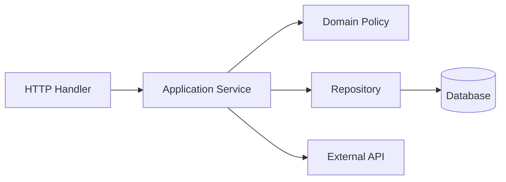
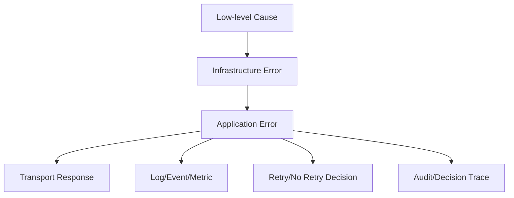
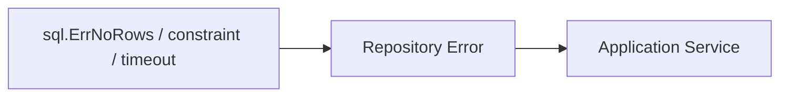
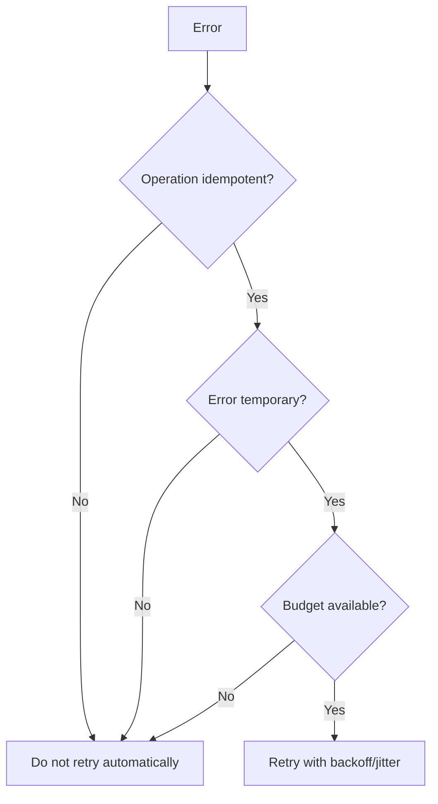
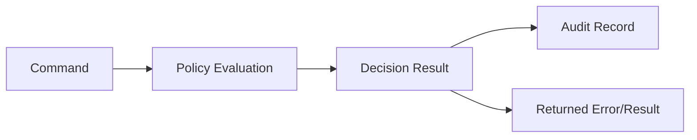

# learn-go-design-patterns-common-patterns-anti-patterns-part-017.md

# Part 017 — Error Translation and Boundary Error Pattern

> Seri: **Go Design Patterns, Common Patterns, and Anti-Patterns**  
> Target pembaca: **Java software engineer yang ingin mendesain sistem Go production-grade**  
> Baseline bahasa: **Go 1.26.x**  
> Fokus part ini: **mendesain error sebagai contract antar-boundary, bukan sekadar pesan kegagalan**

---

## 0. Posisi Part Ini dalam Seri

Pada part sebelumnya kita sudah membahas:

- package sebagai unit desain,
- API surface,
- interface placement,
- constructor,
- functional options,
- configuration,
- dependency wiring,
- adapter/port,
- repository,
- transaction boundary,
- service layer,
- handler,
- middleware,
- context propagation.

Part ini menyambungkan semuanya melalui satu konsep yang sering menentukan apakah sistem Go mudah dioperasikan atau justru menyakitkan:

> **Error bukan hanya nilai yang dikembalikan. Error adalah sinyal keputusan antar-boundary.**

Di Go, error terlihat sederhana:

```go
if err != nil {
    return err
}
```

Namun dalam sistem besar, yang penting bukan hanya “ada error”, melainkan:

- error ini berasal dari boundary mana?
- apakah caller boleh retry?
- apakah ini business rejection atau system failure?
- apakah harus ditampilkan ke user?
- apakah harus masuk audit trail?
- apakah metric cardinality aman?
- apakah error ini mengandung PII?
- apakah wrapping menjaga root cause?
- apakah handler bisa memetakan error ke HTTP/gRPC status yang benar?
- apakah transaction harus rollback?
- apakah event harus dipublish atau tidak?
- apakah worker harus dead-letter message?

Part ini fokus pada **error translation pattern**: bagaimana error berubah bentuk saat melewati boundary.

---

## 1. Masalah Utama yang Diselesaikan

Dalam codebase kecil, error sering cukup berupa:

```go
return fmt.Errorf("failed to get user: %w", err)
```

Dalam codebase besar, pola itu belum cukup. Bayangkan flow berikut:



Error bisa muncul di banyak tempat:

- request invalid,
- user unauthorized,
- transition state tidak legal,
- data tidak ditemukan,
- duplicate command,
- database timeout,
- unique constraint violation,
- external API 429,
- external API 500,
- context deadline exceeded,
- worker cancellation,
- malformed event,
- optimistic lock conflict.

Jika semua error hanya menjadi `error`, lalu handler melakukan:

```go
http.Error(w, err.Error(), http.StatusInternalServerError)
```

maka sistem akan bermasalah:

- semua kegagalan dianggap 500,
- business rejection terlihat seperti system outage,
- retry dilakukan pada error yang tidak retryable,
- user melihat pesan internal,
- log penuh duplicate noise,
- alert menjadi tidak bermakna,
- audit trail tidak bisa menjelaskan keputusan,
- service boundary bocor detail vendor.

Error translation pattern menyelesaikan ini dengan membuat error memiliki **semantic role**.

---

## 2. Mental Model: Error sebagai Boundary Signal

Mental model dasar:



Setiap boundary perlu menjawab pertanyaan berbeda.

| Boundary | Pertanyaan utama |
|---|---|
| Domain | Apakah aturan bisnis mengizinkan operasi ini? |
| Repository | Apakah persistence berhasil? Apakah data ada? Apakah constraint dilanggar? |
| External adapter | Apakah dependency eksternal gagal? Apakah retry aman? |
| Application service | Apakah use case berhasil, ditolak, konflik, timeout, atau gagal sistem? |
| Handler | Status response apa yang benar? Pesan apa yang aman untuk client? |
| Worker | Retry, skip, dead-letter, atau fatal? |
| Observability | Apa class error, source, operation, dan severity? |
| Audit | Apakah ini keputusan bisnis yang harus direkam? |

Error tidak boleh hanya menjawab “apa pesan string-nya?”.

Error perlu memberi sinyal minimal:

- **kind/classification**,
- **operation**,
- **cause**,
- **safe message**,
- **retryability**,
- **visibility**,
- **ownership**.

---

## 3. Java Mindset vs Go Mindset

### 3.1 Java Mindset yang Sering Terbawa

Java engineer sering terbiasa dengan:

- checked exception vs unchecked exception,
- exception hierarchy,
- global exception handler,
- framework mapping via annotation,
- `RuntimeException` wrapping everywhere,
- stack trace sebagai sumber utama diagnosis,
- service method yang melempar exception,
- centralized `@ControllerAdvice`,
- custom exception per business case.

Contoh gaya Java yang sering diterjemahkan mentah ke Go:

```go
type UserNotFoundException struct {
    Message string
}

type InvalidTransitionException struct {
    Message string
}

type DatabaseException struct {
    Message string
}
```

Lalu seluruh codebase penuh type error kecil tanpa taxonomy yang jelas.

### 3.2 Go Mindset yang Lebih Tepat

Go tidak memakai exception untuk control flow. Go memakai explicit return:

```go
value, err := repo.Find(ctx, id)
if err != nil {
    return Result{}, err
}
```

Implikasinya:

- error adalah bagian normal dari function contract,
- caller harus membuat keputusan eksplisit,
- boundary translation terlihat di code,
- semantic classification harus didesain, bukan diasumsikan framework,
- wrapping harus menjaga cause,
- error tidak selalu berarti failure yang harus dilog.

Dalam Go, desain error yang baik biasanya lebih mirip:

```go
if errors.Is(err, domain.ErrInvalidTransition) {
    return http.StatusConflict
}

var appErr *apperror.Error
if errors.As(err, &appErr) {
    return mapKind(appErr.Kind)
}
```

Bukan:

```go
if strings.Contains(err.Error(), "invalid transition") {
    return http.StatusConflict
}
```

---

## 4. Taxonomy Error dalam Sistem Go Besar

Sebelum membuat type, kita perlu taxonomy.

### 4.1 Domain Error

Domain error muncul karena aturan domain menolak operasi.

Contoh:

- application cannot be approved from `Draft`,
- appeal cannot be submitted after deadline,
- case already closed,
- amount exceeds allowed threshold,
- user is not eligible for action.

Domain error biasanya:

- expected,
- non-retryable,
- aman dipetakan ke 400/403/404/409/422 tergantung konteks,
- perlu business reason,
- mungkin perlu audit trail,
- tidak selalu perlu error log.

Contoh:

```go
var ErrInvalidTransition = errors.New("invalid transition")

type InvalidTransitionError struct {
    EntityID string
    From     State
    To       State
    Reason   string
}

func (e *InvalidTransitionError) Error() string {
    return "invalid state transition"
}

func (e *InvalidTransitionError) Is(target error) bool {
    return target == ErrInvalidTransition
}
```

Caller bisa:

```go
if errors.Is(err, domain.ErrInvalidTransition) {
    // map to conflict
}
```

### 4.2 Validation Error

Validation error terjadi saat input tidak memenuhi shape atau constraint awal.

Contoh:

- required field missing,
- invalid email format,
- date range invalid,
- numeric range invalid,
- malformed ID.

Validation error biasanya:

- expected,
- non-retryable,
- harus memberi detail field yang aman,
- cocok dipetakan ke 400 atau 422,
- tidak perlu stack trace noise.

Contoh:

```go
type FieldViolation struct {
    Field   string
    Code    string
    Message string
}

type ValidationError struct {
    Violations []FieldViolation
}

func (e *ValidationError) Error() string {
    return "validation failed"
}
```

### 4.3 Authorization Error

Authorization error berarti actor tidak boleh melakukan operasi.

Contoh:

- user lacks role,
- user cannot access resource,
- organization mismatch,
- action not allowed for current delegation.

Perlu hati-hati:

- jangan leak resource existence bila tidak boleh diketahui,
- jangan expose policy internal,
- audit mungkin diperlukan,
- mapping bisa 403 atau 404 tergantung threat model.

```go
var ErrForbidden = errors.New("forbidden")

type ForbiddenError struct {
    ActorID  string
    Action   string
    Resource string
    Reason   string // internal reason, not necessarily public
}

func (e *ForbiddenError) Error() string {
    return "forbidden"
}

func (e *ForbiddenError) Is(target error) bool {
    return target == ErrForbidden
}
```

### 4.4 Not Found Error

Not found terlihat sederhana, tapi sering tricky.

Ada beberapa arti:

- resource memang tidak ada,
- actor tidak punya akses sehingga disamarkan sebagai not found,
- dependency eksternal return 404,
- optional lookup tidak menemukan data,
- repository tidak menemukan row.

Jangan langsung membocorkan `sql.ErrNoRows` ke handler.

```go
var ErrApplicationNotFound = errors.New("application not found")

type NotFoundError struct {
    Resource string
    Key      string
}

func (e *NotFoundError) Error() string {
    return e.Resource + " not found"
}
```

### 4.5 Conflict Error

Conflict berarti request valid, tetapi bertabrakan dengan state saat ini.

Contoh:

- optimistic lock conflict,
- duplicate submission,
- invalid current state,
- already processed,
- concurrent update.

Conflict biasanya dipetakan ke 409.

```go
var ErrConflict = errors.New("conflict")

type ConflictError struct {
    Resource string
    Reason   string
}

func (e *ConflictError) Error() string {
    return "conflict"
}

func (e *ConflictError) Is(target error) bool {
    return target == ErrConflict
}
```

### 4.6 Infrastructure Error

Infrastructure error berasal dari dependency teknis:

- database unavailable,
- connection timeout,
- DNS failure,
- network reset,
- disk failure,
- S3 unavailable,
- Redis down,
- external API 500.

Infrastructure error biasanya:

- unexpected dari perspektif user,
- mungkin retryable,
- perlu log/metric,
- tidak boleh expose detail internal,
- harus menjaga cause untuk diagnosis.

```go
type InfraError struct {
    Op        string
    Component string
    Retryable bool
    Err       error
}

func (e *InfraError) Error() string {
    return e.Op + " failed on " + e.Component
}

func (e *InfraError) Unwrap() error {
    return e.Err
}
```

### 4.7 Timeout and Cancellation Error

Timeout dan cancellation perlu dibedakan.

- `context.Canceled`: caller membatalkan operasi.
- `context.DeadlineExceeded`: deadline habis.
- network timeout: dependency lambat/timeout.

Semua bukan “internal server error” yang sama.

```go
if errors.Is(err, context.Canceled) {
    // often no need to log as error
}

if errors.Is(err, context.DeadlineExceeded) {
    // deadline budget exhausted
}
```

### 4.8 Retryable Error

Retryability bukan sekadar jenis exception. Retryability tergantung:

- operation idempotent atau tidak,
- error temporary atau permanent,
- budget masih ada atau tidak,
- dependency overload atau tidak,
- retry akan memperparah keadaan atau tidak.

Pattern yang berguna:

```go
type Retryable interface {
    Retryable() bool
}

func IsRetryable(err error) bool {
    var r Retryable
    if errors.As(err, &r) {
        return r.Retryable()
    }
    return false
}
```

Namun jangan menjadikan semua error interface besar.

---

## 5. Error Shape: Minimal tetapi Bermakna

Salah satu desain umum:

```go
package apperror

type Kind string

const (
    KindInvalid       Kind = "invalid"
    KindUnauthenticated Kind = "unauthenticated"
    KindForbidden     Kind = "forbidden"
    KindNotFound      Kind = "not_found"
    KindConflict      Kind = "conflict"
    KindUnavailable   Kind = "unavailable"
    KindTimeout       Kind = "timeout"
    KindCanceled      Kind = "canceled"
    KindInternal      Kind = "internal"
)

type Error struct {
    Kind      Kind
    Operation string
    Message   string
    Safe      string
    Retryable bool
    Cause     error
}

func (e *Error) Error() string {
    if e.Operation == "" {
        return string(e.Kind)
    }
    return e.Operation + ": " + string(e.Kind)
}

func (e *Error) Unwrap() error {
    return e.Cause
}
```

Tapi hati-hati. Central `apperror.Error` berguna bila:

- taxonomy benar-benar dipakai konsisten,
- handler punya mapping jelas,
- team disiplin mengisi field,
- tidak semua domain detail dipaksa masuk satu struct.

Jika tidak, ia bisa menjadi “god error”.

---

## 6. Sentinel Error Pattern

Sentinel error adalah package-level variable:

```go
var ErrNotFound = errors.New("not found")
```

### 6.1 Kapan Berguna

Sentinel cocok saat caller hanya perlu classification sederhana.

```go
if errors.Is(err, store.ErrNotFound) {
    return nil, nil
}
```

Use case:

- not found,
- conflict,
- already exists,
- closed,
- invalid transition,
- duplicate,
- unauthenticated,
- forbidden.

### 6.2 Kapan Berbahaya

Sentinel buruk bila:

- butuh detail field/resource,
- butuh multi-dimensional classification,
- butuh retryability,
- butuh safe public message,
- butuh operation/cause chain.

Buruk:

```go
return ErrNotFound
```

Lebih baik:

```go
return &NotFoundError{Resource: "application", Key: id}
```

Atau hybrid:

```go
var ErrNotFound = errors.New("not found")

type NotFoundError struct {
    Resource string
    Key      string
}

func (e *NotFoundError) Error() string { return e.Resource + " not found" }
func (e *NotFoundError) Is(target error) bool { return target == ErrNotFound }
```

---

## 7. Typed Error Pattern

Typed error memberi data tambahan.

```go
type DuplicateError struct {
    Resource string
    Field    string
    Value    string
}

func (e *DuplicateError) Error() string {
    return "duplicate " + e.Resource
}
```

Caller:

```go
var dup *DuplicateError
if errors.As(err, &dup) {
    // use dup.Resource, dup.Field
}
```

### 7.1 Kapan Typed Error Cocok

Gunakan typed error bila caller perlu data structured:

- validation violations,
- current state and requested state,
- retry-after duration,
- resource type,
- conflict version,
- external status code,
- policy denial reason.

### 7.2 Risiko Typed Error

Typed error bisa menjadi over-fragmented:

```go
type UserEmailInvalidError struct{}
type UserPhoneInvalidError struct{}
type UserNameInvalidError struct{}
type UserAddressInvalidError struct{}
```

Lebih baik:

```go
type ValidationError struct {
    Violations []FieldViolation
}
```

---

## 8. Wrapping Pattern

Go wrapping memakai `%w`:

```go
return fmt.Errorf("load application %s: %w", id, err)
```

Dengan wrapping, caller masih bisa:

```go
errors.Is(err, sql.ErrNoRows)
errors.As(err, &netErr)
```

### 8.1 Good Wrapping

Good wrapping menambah context operasional:

```go
func (r *Repository) Find(ctx context.Context, id string) (*Application, error) {
    row := r.db.QueryRowContext(ctx, query, id)

    var app Application
    if err := row.Scan(&app.ID, &app.Status); err != nil {
        if errors.Is(err, sql.ErrNoRows) {
            return nil, &NotFoundError{Resource: "application", Key: id}
        }
        return nil, fmt.Errorf("scan application %s: %w", id, err)
    }

    return &app, nil
}
```

### 8.2 Bad Wrapping

Bad wrapping kehilangan cause:

```go
return fmt.Errorf("failed to load application: %v", err)
```

Karena `%v` tidak membuat unwrap chain.

Bad wrapping juga bisa menambah noise berlebihan:

```go
return fmt.Errorf("repo find failed: service get failed: handler failed: %w", err)
```

Setiap layer tidak harus wrapping jika tidak menambah decision value.

### 8.3 Wrapping Rule

Wrap bila menambah salah satu:

- operation,
- resource id,
- boundary name,
- classification,
- retryability,
- safe message,
- observability dimension.

Jangan wrap hanya untuk menulis “failed”.

---

## 9. Error Translation Pattern per Boundary

### 9.1 Repository Boundary

Repository menerjemahkan vendor-level error menjadi persistence semantic.



Contoh:

```go
func (r *ApplicationRepository) FindByID(ctx context.Context, id string) (*Application, error) {
    row := r.db.QueryRowContext(ctx, selectApplication, id)

    var app Application
    if err := row.Scan(&app.ID, &app.Status, &app.Version); err != nil {
        switch {
        case errors.Is(err, sql.ErrNoRows):
            return nil, &NotFoundError{Resource: "application", Key: id}
        case errors.Is(err, context.Canceled):
            return nil, err
        case errors.Is(err, context.DeadlineExceeded):
            return nil, &InfraError{
                Op:        "ApplicationRepository.FindByID",
                Component: "database",
                Retryable: true,
                Err:       err,
            }
        default:
            return nil, &InfraError{
                Op:        "ApplicationRepository.FindByID",
                Component: "database",
                Retryable: false,
                Err:       err,
            }
        }
    }

    return &app, nil
}
```

Repository sebaiknya tidak mengembalikan `sql.ErrNoRows` langsung ke handler.

### 9.2 External API Adapter Boundary

External adapter menerjemahkan HTTP/gRPC/vendor error menjadi dependency semantic.

```go
type ExternalError struct {
    System     string
    Operation  string
    StatusCode int
    Retryable  bool
    Err        error
}

func (e *ExternalError) Error() string {
    return e.System + " " + e.Operation + " failed"
}

func (e *ExternalError) Unwrap() error { return e.Err }
func (e *ExternalError) Retryable() bool { return e.Retryable }
```

Mapping:

| External response | Internal meaning |
|---|---|
| 400 | adapter/request bug or invalid upstream input |
| 401/403 | credential/config/authz failure |
| 404 | not found in external system or stale reference |
| 409 | conflict |
| 429 | retryable with backoff if budget allows |
| 500/502/503/504 | dependency unavailable, maybe retryable |
| timeout | dependency timeout |
| malformed response | contract violation |

### 9.3 Domain Boundary

Domain layer sebaiknya tidak tahu SQL, HTTP, gRPC, Redis, S3.

Domain error harus berbicara bahasa domain:

```go
func (a Application) Approve(actor Actor, now time.Time) error {
    if a.Status != StatusSubmitted {
        return &InvalidTransitionError{
            EntityID: a.ID,
            From:     a.Status,
            To:       StatusApproved,
            Reason:   "application must be submitted before approval",
        }
    }

    if !actor.CanApprove(a) {
        return &ForbiddenError{
            ActorID:  actor.ID,
            Action:   "approve_application",
            Resource: a.ID,
            Reason:   "actor lacks approval authority",
        }
    }

    return nil
}
```

### 9.4 Application Service Boundary

Application service menggabungkan error domain, repository, external dependency, dan policy.

```go
func (s *ApproveService) Approve(ctx context.Context, cmd ApproveCommand) (ApproveResult, error) {
    if err := cmd.Validate(); err != nil {
        return ApproveResult{}, err
    }

    result, err := s.tx.WithinTx(ctx, func(ctx context.Context, tx Tx) (ApproveResult, error) {
        app, err := s.apps.FindForUpdate(ctx, tx, cmd.ApplicationID)
        if err != nil {
            return ApproveResult{}, err
        }

        if err := app.Approve(cmd.Actor, s.clock.Now()); err != nil {
            return ApproveResult{}, err
        }

        if err := s.apps.Save(ctx, tx, app); err != nil {
            return ApproveResult{}, err
        }

        return ApproveResult{ApplicationID: app.ID, Status: app.Status}, nil
    })
    if err != nil {
        return ApproveResult{}, translateApproveError(err)
    }

    return result, nil
}
```

`translateApproveError` boleh menambah use-case operation:

```go
func translateApproveError(err error) error {
    if err == nil {
        return nil
    }

    switch {
    case errors.Is(err, ErrInvalidTransition), errors.Is(err, ErrForbidden), errors.Is(err, ErrNotFound):
        return err
    case errors.Is(err, context.Canceled), errors.Is(err, context.DeadlineExceeded):
        return err
    default:
        return fmt.Errorf("approve application: %w", err)
    }
}
```

### 9.5 Handler Boundary

Handler menerjemahkan application error ke transport response.

```go
func writeError(w http.ResponseWriter, r *http.Request, err error) {
    status, body := mapHTTPError(err)

    w.Header().Set("Content-Type", "application/json")
    w.WriteHeader(status)
    _ = json.NewEncoder(w).Encode(body)
}
```

Mapping contoh:

```go
func mapHTTPError(err error) (int, ErrorResponse) {
    switch {
    case errors.Is(err, context.Canceled):
        return 499, ErrorResponse{Code: "request_canceled", Message: "request canceled"}
    case errors.Is(err, context.DeadlineExceeded):
        return http.StatusGatewayTimeout, ErrorResponse{Code: "timeout", Message: "request timed out"}
    case errors.Is(err, ErrValidation):
        return http.StatusBadRequest, validationResponse(err)
    case errors.Is(err, ErrForbidden):
        return http.StatusForbidden, ErrorResponse{Code: "forbidden", Message: "forbidden"}
    case errors.Is(err, ErrNotFound):
        return http.StatusNotFound, ErrorResponse{Code: "not_found", Message: "resource not found"}
    case errors.Is(err, ErrConflict), errors.Is(err, ErrInvalidTransition):
        return http.StatusConflict, ErrorResponse{Code: "conflict", Message: "operation conflicts with current state"}
    default:
        return http.StatusInternalServerError, ErrorResponse{Code: "internal", Message: "internal server error"}
    }
}
```

Catatan: HTTP 499 bukan standard library constant, tetapi umum dipakai beberapa reverse proxy untuk client closed request. Gunakan hanya bila sesuai platform observability.

---

## 10. Jangan Log Error di Semua Layer

Anti-pattern umum:

```go
func repo() error {
    if err != nil {
        log.Error("repo failed", "err", err)
        return err
    }
}

func service() error {
    if err != nil {
        log.Error("service failed", "err", err)
        return err
    }
}

func handler() {
    if err != nil {
        log.Error("handler failed", "err", err)
        writeError(err)
    }
}
```

Hasil:

- satu error menghasilkan banyak log,
- alert noisy,
- trace sulit dibaca,
- cost observability meningkat,
- severity tidak konsisten.

Pattern lebih baik:

- lower layer wrap/translate, tidak log kecuali ada local event penting,
- boundary owner log sekali,
- expected business error mungkin log level info/debug atau audit, bukan error,
- unexpected infrastructure error log error,
- cancellation biasanya tidak perlu error log.

```go
func (h *Handler) Approve(w http.ResponseWriter, r *http.Request) {
    res, err := h.svc.Approve(r.Context(), cmd)
    if err != nil {
        h.logError(r.Context(), err)
        writeError(w, r, err)
        return
    }
    writeJSON(w, http.StatusOK, res)
}
```

Severity mapping:

| Error kind | Typical log level |
|---|---|
| validation | debug/info |
| forbidden | info/warn depending security policy |
| not found | debug/info |
| conflict | info |
| context canceled | debug or no log |
| timeout | warn/error depending dependency/SLO |
| unavailable | error |
| internal invariant violation | error/critical |

---

## 11. Public Error Message vs Internal Error

Jangan expose internal error:

```go
http.Error(w, err.Error(), http.StatusInternalServerError)
```

Jika `err.Error()` berisi:

```text
query user: ORA-00001 unique constraint APP.USERS_UK_EMAIL violated
```

maka client melihat detail DB/vendor/schema.

Pattern:

```go
type ErrorResponse struct {
    Code      string `json:"code"`
    Message   string `json:"message"`
    RequestID string `json:"request_id,omitempty"`
    Details   any    `json:"details,omitempty"`
}
```

Internal log:

```go
logger.ErrorContext(ctx, "request failed",
    "error", err,
    "kind", classify(err),
    "operation", operation(err),
    "request_id", requestID,
)
```

Public response:

```json
{
  "code": "conflict",
  "message": "operation conflicts with current state",
  "request_id": "req-123"
}
```

---

## 12. Error Code Pattern

API sering butuh stable error code.

Bad:

```json
{
  "error": "invalid state transition from SUBMITTED to DRAFT"
}
```

Better:

```json
{
  "code": "application.invalid_transition",
  "message": "application cannot move to the requested state"
}
```

Guideline error code:

- stable,
- documented,
- not tied to English sentence,
- not tied to SQL/vendor,
- specific enough for client decision,
- not too granular sampai taxonomy meledak.

Example code taxonomy:

```text
validation.required
validation.invalid_format
application.not_found
application.invalid_transition
application.version_conflict
auth.forbidden
dependency.unavailable
dependency.timeout
internal.unexpected
```

---

## 13. Error and Retry Semantics

Error classification harus mendukung retry decision.



Retryable berdasarkan error saja tidak cukup. Contoh:

- `timeout` pada read-only query mungkin retryable,
- `timeout` setelah payment submit mungkin tidak aman,
- `429` retryable jika ada budget dan `Retry-After`,
- `409` optimistic conflict bisa retryable bila use case punya merge/reload strategy,
- validation error tidak retryable.

Pattern:

```go
type RetryPolicy struct {
    MaxAttempts int
    IsRetryable func(error) bool
}
```

Use case harus punya idempotency strategy sebelum retry mutating operation.

---

## 14. Error and Transaction Semantics

Transaction runner biasanya rollback jika closure return error.

```go
func (r *Runner) WithinTx(ctx context.Context, fn func(ctx context.Context, tx *sql.Tx) error) error {
    tx, err := r.db.BeginTx(ctx, nil)
    if err != nil {
        return err
    }

    if err := fn(ctx, tx); err != nil {
        rbErr := tx.Rollback()
        if rbErr != nil {
            return fmt.Errorf("rollback after %w: %v", err, rbErr)
        }
        return err
    }

    if err := tx.Commit(); err != nil {
        return fmt.Errorf("commit transaction: %w", err)
    }

    return nil
}
```

Namun perlu hati-hati:

- business rejection return error menyebabkan rollback, itu normal,
- external side effect dalam transaction tidak otomatis rollback,
- commit error ambiguous,
- rollback error bisa menutupi original error jika salah desain,
- panic handling perlu eksplisit.

Pattern lebih defensible:

```go
type RollbackError struct {
    Original error
    Rollback error
}

func (e *RollbackError) Error() string {
    return "rollback failed after operation error"
}

func (e *RollbackError) Unwrap() error {
    return e.Original
}
```

Dengan ini root cause tetap dapat dicari.

---

## 15. Error and Context Semantics

Jangan mengubah cancellation menjadi generic internal error.

Bad:

```go
if err := repo.Save(ctx, app); err != nil {
    return fmt.Errorf("save failed: %w", err)
}
```

Ini masih preserve cause, tetapi handler harus tetap bisa mengenali:

```go
errors.Is(err, context.Canceled)
errors.Is(err, context.DeadlineExceeded)
```

Jika membuat typed infra error, pastikan unwrap tetap menjaga context cause:

```go
return &InfraError{
    Op: "save application",
    Component: "database",
    Retryable: false,
    Err: err,
}
```

Lalu:

```go
if errors.Is(err, context.Canceled) {
    // still works if Unwrap correct
}
```

---

## 16. Error and Observability Pattern

Error harus bisa diklasifikasi untuk logs/metrics/traces.

### 16.1 Metrics

Metric jangan memakai `err.Error()` sebagai label.

Bad:

```go
errors_total{error="application 123 not found"}
```

Ini high cardinality.

Good:

```text
request_errors_total{kind="not_found", operation="approve_application"}
```

### 16.2 Logs

Structured log:

```go
logger.ErrorContext(ctx, "operation failed",
    "operation", "approve_application",
    "error_kind", classify(err),
    "retryable", IsRetryable(err),
    "err", err,
)
```

### 16.3 Traces

Trace span bisa merekam:

- status error,
- error kind,
- dependency system,
- retry attempt,
- timeout budget,
- correlation id.

Jangan masukkan PII ke span attribute.

---

## 17. Error and Audit Pattern

Tidak semua error adalah audit event.

Audit relevan untuk:

- authorization denial,
- policy rejection,
- state transition failure yang penting,
- attempted restricted operation,
- compliance-sensitive decision,
- administrative action failure.

Contoh decision trace:

```go
type DecisionRecord struct {
    RequestID     string
    ActorID       string
    ResourceID    string
    Action        string
    Decision      string
    ReasonCode    string
    OccurredAt    time.Time
}
```

Business rejection lebih baik direkam sebagai decision, bukan sekadar error log.



---

## 18. `errors.Join` Pattern

Go mendukung penggabungan beberapa error.

Use case:

- cleanup multiple resources,
- validation multi-source,
- shutdown multiple components,
- rollback plus close failure.

Contoh:

```go
func closeAll(closers ...io.Closer) error {
    var errs []error
    for _, c := range closers {
        if err := c.Close(); err != nil {
            errs = append(errs, err)
        }
    }
    return errors.Join(errs...)
}
```

Caution:

- jangan pakai join untuk mengganti validation structured detail bila caller butuh field-level info,
- jangan join error yang butuh ordered cause chain,
- mapping HTTP dari joined error harus punya rule deterministik.

---

## 19. Panic vs Error

Panic bukan normal error handling.

Panic cocok untuk:

- programmer error,
- impossible invariant violation,
- failed must-init during startup,
- unrecoverable corruption.

Tidak cocok untuk:

- validation error,
- database not found,
- authorization rejection,
- external timeout,
- business rule failure.

Bad:

```go
if state != Submitted {
    panic("invalid transition")
}
```

Good:

```go
if state != Submitted {
    return &InvalidTransitionError{From: state, To: Approved}
}
```

Middleware recovery berguna sebagai last-resort safety net, bukan primary control flow.

---

## 20. Production Example: Approval Use Case Error Model

### 20.1 Domain Errors

```go
package approval

import "errors"

var (
    ErrInvalidTransition = errors.New("invalid transition")
    ErrForbidden         = errors.New("forbidden")
    ErrNotFound          = errors.New("not found")
    ErrConflict          = errors.New("conflict")
)

type InvalidTransitionError struct {
    ApplicationID string
    From          Status
    To            Status
    Reason        string
}

func (e *InvalidTransitionError) Error() string {
    return "invalid application transition"
}

func (e *InvalidTransitionError) Is(target error) bool {
    return target == ErrInvalidTransition
}

type ForbiddenError struct {
    ActorID       string
    ApplicationID string
    Action        string
    Reason        string
}

func (e *ForbiddenError) Error() string { return "forbidden" }
func (e *ForbiddenError) Is(target error) bool { return target == ErrForbidden }
```

### 20.2 Repository Translation

```go
package approvalstore

func (r *Repository) FindForUpdate(ctx context.Context, tx *sql.Tx, id string) (*approval.Application, error) {
    row := tx.QueryRowContext(ctx, findForUpdateSQL, id)

    var app approval.Application
    if err := scanApplication(row, &app); err != nil {
        if errors.Is(err, sql.ErrNoRows) {
            return nil, &approval.NotFoundError{ApplicationID: id}
        }
        return nil, &InfraError{
            Op:        "approvalstore.Repository.FindForUpdate",
            Component: "database",
            Retryable: false,
            Err:       err,
        }
    }

    return &app, nil
}
```

### 20.3 Application Service

```go
func (s *Service) Approve(ctx context.Context, cmd ApproveCommand) (ApproveResult, error) {
    if err := cmd.Validate(); err != nil {
        return ApproveResult{}, err
    }

    var result ApproveResult
    err := s.tx.WithinTx(ctx, func(ctx context.Context, tx *sql.Tx) error {
        app, err := s.repo.FindForUpdate(ctx, tx, cmd.ApplicationID)
        if err != nil {
            return err
        }

        if err := app.Approve(cmd.Actor, s.clock.Now()); err != nil {
            return err
        }

        if err := s.repo.Save(ctx, tx, app); err != nil {
            return err
        }

        if err := s.outbox.Add(ctx, tx, ApprovalEventFrom(app)); err != nil {
            return err
        }

        result = ApproveResult{ApplicationID: app.ID, Status: app.Status}
        return nil
    })
    if err != nil {
        return ApproveResult{}, fmt.Errorf("approve application %s: %w", cmd.ApplicationID, err)
    }

    return result, nil
}
```

### 20.4 HTTP Mapping

```go
func approvalHTTPStatus(err error) int {
    switch {
    case errors.Is(err, approval.ErrInvalidTransition):
        return http.StatusConflict
    case errors.Is(err, approval.ErrForbidden):
        return http.StatusForbidden
    case errors.Is(err, approval.ErrNotFound):
        return http.StatusNotFound
    case errors.Is(err, approval.ErrConflict):
        return http.StatusConflict
    case errors.Is(err, context.Canceled):
        return 499
    case errors.Is(err, context.DeadlineExceeded):
        return http.StatusGatewayTimeout
    default:
        return http.StatusInternalServerError
    }
}
```

### 20.5 Client Response

```go
func approvalErrorResponse(err error, requestID string) ErrorResponse {
    switch {
    case errors.Is(err, approval.ErrInvalidTransition):
        return ErrorResponse{
            Code:      "application.invalid_transition",
            Message:   "application cannot move to the requested state",
            RequestID: requestID,
        }
    case errors.Is(err, approval.ErrForbidden):
        return ErrorResponse{
            Code:      "auth.forbidden",
            Message:   "forbidden",
            RequestID: requestID,
        }
    case errors.Is(err, approval.ErrNotFound):
        return ErrorResponse{
            Code:      "application.not_found",
            Message:   "application not found",
            RequestID: requestID,
        }
    default:
        return ErrorResponse{
            Code:      "internal.unexpected",
            Message:   "internal server error",
            RequestID: requestID,
        }
    }
}
```

---

## 21. Anti-Pattern Catalog

### 21.1 String Matching Error

Bad:

```go
if strings.Contains(err.Error(), "not found") {
    return http.StatusNotFound
}
```

Problem:

- fragile,
- breaks after message change,
- localization breaks logic,
- vendor message leaks into decision,
- impossible to maintain.

Better:

```go
if errors.Is(err, ErrNotFound) {
    return http.StatusNotFound
}
```

---

### 21.2 Exposing Vendor Error to API

Bad:

```go
return http.StatusInternalServerError, err.Error()
```

Problem:

- leaks schema,
- leaks internal IDs,
- leaks dependency details,
- security risk,
- unstable client contract.

Better:

```go
return http.StatusInternalServerError, "internal server error"
```

Log internal cause separately.

---

### 21.3 Logging and Returning Everywhere

Bad:

```go
log.Println(err)
return err
```

in every layer.

Problem:

- duplicate logs,
- noisy alert,
- unclear ownership,
- severity chaos.

Better:

- wrap/translate in inner layers,
- log once at boundary.

---

### 21.4 Losing Cause

Bad:

```go
return fmt.Errorf("database failed: %v", err)
```

Better:

```go
return fmt.Errorf("database failed: %w", err)
```

---

### 21.5 One Giant Error Type for Everything

Bad:

```go
type AppError struct {
    Code string
    Message string
    HTTPStatus int
    SQLState string
    Retryable bool
    Field string
    Actor string
    Resource string
    Vendor string
    Stack string
}
```

Problem:

- mixes transport/domain/infra,
- encourages every layer to know HTTP,
- fields meaningless in many cases,
- grows forever.

Better:

- keep domain errors domain-specific,
- map to transport at handler boundary,
- share small classification only when useful.

---

### 21.6 HTTP Status Inside Domain

Bad:

```go
type DomainError struct {
    HTTPStatus int
}
```

Problem:

- domain depends on HTTP,
- same use case cannot cleanly serve gRPC/CLI/worker,
- mapping policy becomes scattered.

Better:

```go
errors.Is(err, ErrInvalidTransition) // domain
// handler maps to 409
```

---

### 21.7 Error Used for Expected Decision Result

Sometimes business rejection is better as result, not error.

Bad:

```go
if !eligible {
    return nil, errors.New("not eligible")
}
```

Better for policy evaluation:

```go
type EligibilityDecision struct {
    Allowed bool
    Reason  string
}
```

Use error for inability to evaluate, not always for negative decision.

This will be expanded in Part 018.

---

### 21.8 Retrying Every Error

Bad:

```go
for i := 0; i < 3; i++ {
    err = call()
    if err == nil { return nil }
}
return err
```

Problem:

- retries validation errors,
- retries forbidden errors,
- retries non-idempotent operations,
- amplifies overload.

Better:

```go
if !IsRetryable(err) || !operation.IsIdempotent() {
    return err
}
```

---

### 21.9 Panic for Business Rule

Bad:

```go
panic("user cannot approve")
```

Better:

```go
return &ForbiddenError{Action: "approve"}
```

---

### 21.10 Swallowing Error

Bad:

```go
_ = tx.Rollback()
```

Sometimes acceptable if rollback after commit is expected, but dangerous when cleanup failure matters.

Better:

```go
if rbErr := tx.Rollback(); rbErr != nil {
    return &RollbackError{Original: err, Rollback: rbErr}
}
```

---

## 22. Refactoring Playbook

### Step 1: Inventory Error Sources

List all sources:

- repository,
- external client,
- domain policy,
- validation,
- authorization,
- worker,
- transaction runner,
- middleware.

### Step 2: Group by Semantic Kind

Do not start by creating type. Start with classification:

- invalid,
- forbidden,
- not found,
- conflict,
- timeout,
- canceled,
- unavailable,
- internal.

### Step 3: Define Boundary Translation

For each boundary:

| Boundary | Translate from | Translate to |
|---|---|---|
| repository | SQL/vendor | persistence/domain semantic |
| external adapter | HTTP/gRPC/vendor | dependency semantic |
| domain | state/policy | domain semantic |
| application | lower errors | use-case operation error |
| handler | app/domain errors | transport response |
| worker | app errors | retry/dead-letter decision |

### Step 4: Replace String Matching

Before:

```go
if strings.Contains(err.Error(), "duplicate") {
    return Conflict
}
```

After:

```go
if errors.Is(err, ErrConflict) {
    return Conflict
}
```

### Step 5: Introduce Safe Response Contract

Define:

```go
type ErrorResponse struct {
    Code string `json:"code"`
    Message string `json:"message"`
    RequestID string `json:"request_id,omitempty"`
    Details any `json:"details,omitempty"`
}
```

### Step 6: Log Once at Boundary

Move logging to handler/worker boundary.

### Step 7: Add Tests for Mapping

Test:

- domain error → HTTP status,
- validation error → response details,
- SQL no rows → domain not found,
- context timeout → timeout response,
- external 429 → retryable dependency error.

### Step 8: Add Metrics by Error Kind

Avoid dynamic labels.

---

## 23. Testing Strategy

### 23.1 Test `errors.Is`

```go
func TestInvalidTransitionErrorIs(t *testing.T) {
    err := &InvalidTransitionError{From: Draft, To: Approved}

    if !errors.Is(err, ErrInvalidTransition) {
        t.Fatal("expected ErrInvalidTransition")
    }
}
```

### 23.2 Test Repository Translation

```go
func TestRepositoryFindTranslatesNoRows(t *testing.T) {
    repo := newRepoWithNoRowsDB(t)

    _, err := repo.FindByID(context.Background(), "app-1")
    if !errors.Is(err, ErrNotFound) {
        t.Fatalf("expected not found, got %v", err)
    }
}
```

### 23.3 Test HTTP Mapping

```go
func TestHTTPErrorMapping(t *testing.T) {
    tests := []struct {
        name string
        err  error
        want int
    }{
        {"not found", &NotFoundError{Resource: "application", Key: "1"}, http.StatusNotFound},
        {"forbidden", &ForbiddenError{Action: "approve"}, http.StatusForbidden},
        {"conflict", &InvalidTransitionError{}, http.StatusConflict},
        {"timeout", context.DeadlineExceeded, http.StatusGatewayTimeout},
    }

    for _, tt := range tests {
        t.Run(tt.name, func(t *testing.T) {
            got := approvalHTTPStatus(tt.err)
            if got != tt.want {
                t.Fatalf("got %d want %d", got, tt.want)
            }
        })
    }
}
```

### 23.4 Test Public Response Does Not Leak Internal Error

```go
func TestInternalErrorResponseDoesNotLeakSQL(t *testing.T) {
    err := fmt.Errorf("query failed: %w", errors.New("ORA-00001 APP.SECRET_TABLE"))

    resp := approvalErrorResponse(err, "req-1")

    if strings.Contains(resp.Message, "ORA-") || strings.Contains(resp.Message, "SECRET_TABLE") {
        t.Fatal("response leaked internal database detail")
    }
}
```

---

## 24. Review Checklist

Gunakan checklist ini saat code review.

### Error Classification

- [ ] Apakah error punya semantic kind yang jelas?
- [ ] Apakah expected business rejection dibedakan dari system failure?
- [ ] Apakah validation error punya detail field aman?
- [ ] Apakah authorization error tidak leak resource existence?
- [ ] Apakah not found jelas berasal dari domain/resource, bukan vendor leak?

### Wrapping and Cause

- [ ] Apakah wrapping memakai `%w` saat perlu preserve cause?
- [ ] Apakah layer hanya wrap jika menambah value?
- [ ] Apakah `errors.Is`/`errors.As` masih bekerja?
- [ ] Apakah context cancellation/deadline tetap terdeteksi?

### Boundary Translation

- [ ] Repository tidak membocorkan SQL/vendor error ke handler?
- [ ] External adapter menerjemahkan status vendor ke semantic dependency error?
- [ ] Domain tidak tahu HTTP/gRPC/SQL?
- [ ] Handler punya mapping terpusat dan konsisten?

### Observability

- [ ] Error dilog sekali di owner boundary?
- [ ] Metric memakai low-cardinality error kind?
- [ ] Log tidak berisi PII/secrets?
- [ ] Expected errors tidak semuanya log level error?

### Retry and Worker

- [ ] Retryability eksplisit?
- [ ] Retry mempertimbangkan idempotency?
- [ ] Worker tahu kapan retry/dead-letter/skip?
- [ ] Timeout/cancellation tidak dianggap generic internal error?

### API Contract

- [ ] Public error response stable?
- [ ] Error code tidak bergantung pada English sentence?
- [ ] Internal error detail tidak diekspos?
- [ ] Request/correlation ID dikembalikan bila berguna?

---

## 25. Latihan

### Latihan 1 — Refactor String Matching

Diberikan code:

```go
if strings.Contains(err.Error(), "no rows") {
    return http.StatusNotFound
}
```

Refactor menjadi:

- repository translation,
- sentinel/typed error,
- handler mapping dengan `errors.Is`.

### Latihan 2 — Design Validation Error

Buat `ValidationError` yang mendukung:

- multiple field violations,
- error code per field,
- public response mapping,
- no PII leak.

### Latihan 3 — External API Error

Design error model untuk client OneMap-like API:

- 401 token expired,
- 429 rate limit,
- 500 dependency error,
- timeout,
- malformed response.

Tentukan mana retryable.

### Latihan 4 — Worker Retry Mapping

Buat function:

```go
func WorkerDecision(err error) Decision
```

Dengan output:

- Ack,
- Retry,
- DeadLetter,
- Drop.

### Latihan 5 — Public Response Safety

Buat test yang memastikan error internal tidak pernah bocor ke JSON response.

---

## 26. Ringkasan

Error translation pattern adalah salah satu pola paling penting dalam Go production system.

Inti part ini:

- Error adalah **boundary signal**, bukan hanya string.
- Domain error harus berbicara bahasa domain.
- Repository harus menerjemahkan SQL/vendor error.
- External adapter harus menerjemahkan dependency failure.
- Application service boleh menambah operation context.
- Handler memetakan error ke transport response.
- Worker memetakan error ke retry/dead-letter decision.
- Public message harus aman.
- Internal cause harus tetap terjaga.
- Gunakan `errors.Is`, `errors.As`, dan wrapping dengan `%w`.
- Hindari string matching.
- Hindari logging di semua layer.
- Hindari membocorkan SQL/vendor/internal detail ke API.
- Retryability harus eksplisit dan mempertimbangkan idempotency.
- Business rejection tidak selalu harus diperlakukan seperti system failure.

Dalam sistem besar, kualitas error model menentukan:

- debuggability,
- observability,
- API consistency,
- security,
- retry safety,
- auditability,
- maintainability.

---

## 27. Hubungan ke Part Berikutnya

Part berikutnya adalah:

# Part 018 — Result, Decision, and Policy Pattern

Part 018 akan melanjutkan ide penting dari part ini:

> Tidak semua hasil negatif harus menjadi `error`.

Kita akan membahas kapan memakai:

- `error`,
- result object,
- decision object,
- policy result,
- validation result,
- rejection reason,
- audit-friendly decision record.

Ini sangat penting untuk sistem regulatory, workflow, case management, authorization, compliance, dan state-machine-heavy domain.

---

## Status Seri

- Part saat ini: **017 dari 035**
- Status: **belum selesai**
- Seri selesai pada: **Part 035 — Capstone: Designing a Production-Grade Go Service from Zero**

<!-- NAVIGATION_FOOTER -->
<div class="page-nav">
<a href="./learn-go-design-patterns-common-patterns-anti-patterns-part-016.md">⬅️ Part 016 — Context Propagation Pattern</a>
<a href="./index.md">📚 Kategori</a>
<a href="../../index.md">🏠 Home</a>
<a href="./learn-go-design-patterns-common-patterns-anti-patterns-part-018.md">Part 018 — Result, Decision, and Policy Pattern ➡️</a>
</div>
