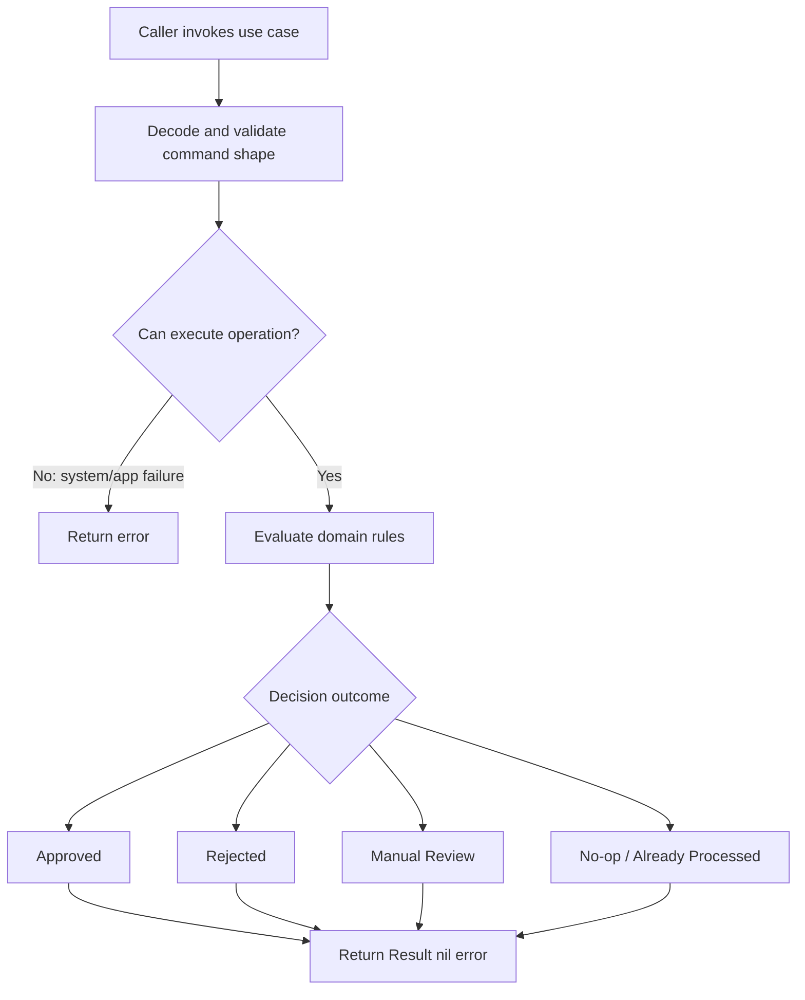
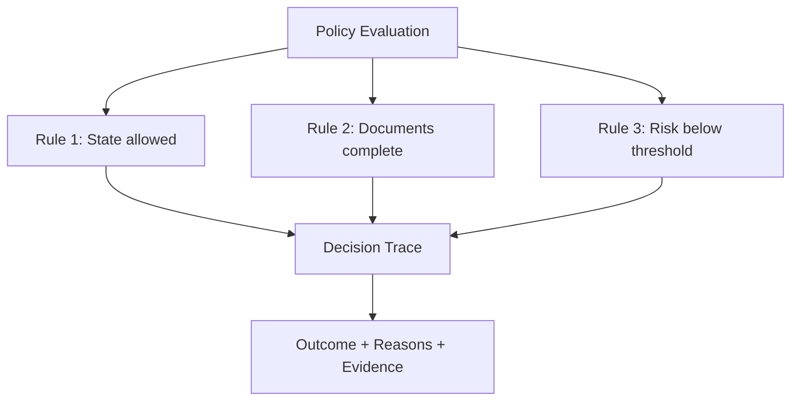
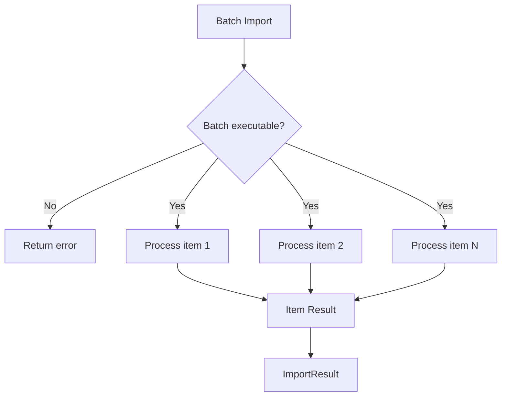
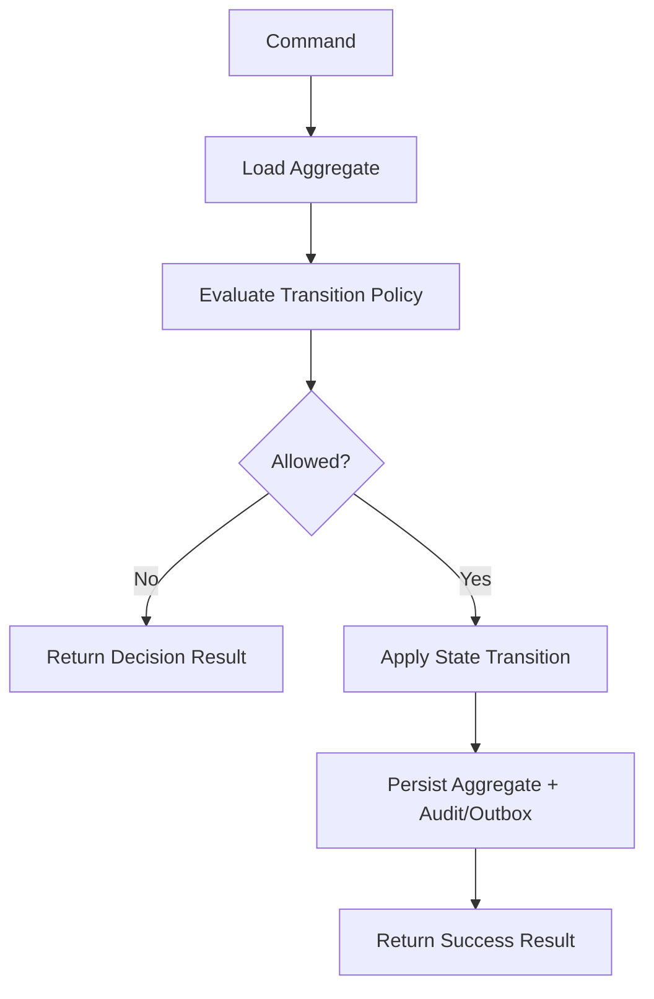

# learn-go-design-patterns-common-patterns-anti-patterns-part-018.md

# Part 018 — Result, Decision, and Policy Pattern

> Seri: **Go Design Patterns, Common Patterns, and Anti-Patterns**  
> Fokus: **Go Design Patterns, Common Patterns, and Anti-Patterns**  
> Target pembaca: **Java software engineer yang ingin mendesain sistem Go production-grade**  
> Baseline: **Go 1.26.x**, dengan prinsip yang tetap mengikuti Go 1 compatibility promise dan idiom desain Go modern.

---

## 0. Posisi Part Ini Dalam Seri

Sebelumnya kita sudah membahas:

- package sebagai unit desain,
- API surface,
- interface placement,
- constructor,
- configuration,
- wiring,
- adapter/port,
- repository,
- transaction boundary,
- service layer,
- handler,
- middleware,
- context propagation,
- error translation.

Part ini membahas sesuatu yang sering rancu di sistem production:

> **Tidak semua hasil negatif adalah error.**

Dalam banyak sistem bisnis, terutama sistem regulatory, compliance, enforcement, workflow, approval, entitlement, fraud, scoring, dan lifecycle management, hasil seperti:

- application rejected,
- policy denied,
- validation failed,
- candidate not eligible,
- transition not allowed,
- partial success,
- manual review required,
- duplicate ignored,
- no-op because already processed,
- stale command rejected,
- escalation required,

sering kali **bukan error teknis**.

Itu adalah **keputusan domain**.

Kalau semua hal tersebut dimodelkan sebagai `error`, sistem akan sulit dibaca, sulit diuji, sulit diaudit, sulit diobservasi, dan sulit dipertanggungjawabkan.

---

## 1. Problem Utama

Banyak codebase Go yang awalnya terlihat sederhana:

```go
func ApproveApplication(ctx context.Context, id string) error
```

Lalu berkembang menjadi sistem yang perlu menjawab pertanyaan:

- Apakah application berhasil di-approve?
- Kalau tidak, apakah karena validasi bisnis?
- Apakah karena user tidak punya role?
- Apakah karena state tidak valid?
- Apakah karena dependency eksternal down?
- Apakah karena sudah diproses sebelumnya?
- Apakah command harus retry?
- Apakah hasil perlu ditampilkan ke user?
- Apakah hasil perlu masuk audit trail?
- Apakah rejection reason harus persist?
- Apakah rejection ini expected business outcome atau system fault?

Kalau hanya memakai `error`, semua pertanyaan tersebut bercampur.

Contoh buruk:

```go
func (s *Service) Approve(ctx context.Context, id string) error {
    app, err := s.repo.Find(ctx, id)
    if err != nil {
        return err
    }

    if app.Status != "submitted" {
        return fmt.Errorf("application cannot be approved")
    }

    if app.RiskScore > 80 {
        return fmt.Errorf("application too risky")
    }

    if !app.DocumentsComplete {
        return fmt.Errorf("documents incomplete")
    }

    app.Status = "approved"
    return s.repo.Save(ctx, app)
}
```

Masalahnya:

1. Error teknis dan business decision tercampur.
2. Caller tidak tahu mana retryable dan mana final.
3. Handler sulit mapping response secara stabil.
4. Audit trail kehilangan struktur alasan.
5. Test harus mencocokkan string.
6. UI sulit menampilkan reason code yang konsisten.
7. Observability menjadi noisy: business rejection terlihat seperti system error.
8. Policy logic tersebar di service.

---

## 2. Mental Model: Error vs Decision vs Result

Dalam Go, `error` adalah nilai. Tetapi bukan berarti setiap hasil negatif harus menjadi `error`.

Kita perlu membedakan tiga konsep:

| Konsep | Arti | Contoh | Biasanya Return |
|---|---|---|---|
| Error | Operasi gagal karena kondisi teknis/operasional/tidak bisa menyelesaikan tugas | DB down, timeout, malformed storage data | `error` |
| Decision | Operasi berhasil mengevaluasi aturan dan menghasilkan keputusan domain | approved, rejected, manual review | `Decision` / `PolicyResult` |
| Result | Output operasi yang bisa mencakup status, metadata, effect, dan decision | created, updated, no-op, duplicate ignored | `Result` + `error` |

Formula desain yang sehat:

```go
func UseCase(ctx context.Context, cmd Command) (Result, error)
```

Dengan makna:

- `error != nil` berarti use case **tidak berhasil menyelesaikan operasi secara reliable**.
- `error == nil` berarti use case berhasil dieksekusi sampai titik keputusan.
- `Result` menjelaskan hasil domain/operasional yang valid.

Contoh:

```go
result, err := svc.EvaluateApplication(ctx, cmd)
if err != nil {
    // system/application failure: timeout, DB error, dependency failure
}

switch result.Decision.Outcome {
case OutcomeApproved:
    // valid business decision
case OutcomeRejected:
    // valid business decision
case OutcomeManualReview:
    // valid business decision
}
```

---

## 3. Diagram Besar: Operation Outcome Model



Interpretasi:

- `error` menjawab: **apakah operasi gagal dijalankan?**
- `Result` menjawab: **apa hasil valid dari operasi tersebut?**
- `Decision` menjawab: **kenapa domain memilih outcome itu?**

---

## 4. Kenapa Java Engineer Sering Terjebak

Di Java enterprise, terutama dengan Spring, banyak desain memakai exception untuk hampir semua jalur negatif:

```java
if (!eligible) {
    throw new NotEligibleException(...);
}
```

Kemudian exception di-map oleh `@ControllerAdvice` ke response.

Di Go, pola ini sering diterjemahkan menjadi:

```go
if !eligible {
    return fmt.Errorf("not eligible")
}
```

Masalahnya bukan karena Go tidak punya exception. Masalahnya adalah **semantic overload**.

Dalam sistem besar, kita perlu membedakan:

- expected domain rejection,
- invalid caller input,
- unauthorized operation,
- conflict,
- not found,
- dependency failure,
- persistence failure,
- invariant violation,
- programming bug.

Kalau semuanya menjadi `error`, caller harus melakukan `errors.Is`, `errors.As`, type switching, atau string matching hanya untuk mendapatkan business outcome.

Itu membuat alur domain menjadi kabur.

---

## 5. Core Pattern

Pola umum:

```go
type Outcome string

const (
    OutcomeApproved     Outcome = "approved"
    OutcomeRejected     Outcome = "rejected"
    OutcomeManualReview Outcome = "manual_review"
    OutcomeNoop         Outcome = "noop"
)

type ReasonCode string

const (
    ReasonNone                 ReasonCode = "none"
    ReasonDocumentIncomplete   ReasonCode = "document_incomplete"
    ReasonRiskScoreTooHigh     ReasonCode = "risk_score_too_high"
    ReasonInvalidCurrentStatus ReasonCode = "invalid_current_status"
)

type Decision struct {
    Outcome Outcome
    Reasons []DecisionReason
}

type DecisionReason struct {
    Code    ReasonCode
    Message string
    Field   string
    Meta    map[string]string
}

type EvaluationResult struct {
    ApplicationID string
    Decision      Decision
    EvaluatedAt   time.Time
}
```

Use case:

```go
func (s *ApplicationService) Evaluate(ctx context.Context, cmd EvaluateCommand) (EvaluationResult, error) {
    app, err := s.repo.Find(ctx, cmd.ApplicationID)
    if err != nil {
        return EvaluationResult{}, fmt.Errorf("find application: %w", err)
    }

    decision := s.policy.Evaluate(app)

    return EvaluationResult{
        ApplicationID: app.ID,
        Decision:      decision,
        EvaluatedAt:   s.clock.Now(),
    }, nil
}
```

Policy:

```go
type ApplicationPolicy struct{}

func (p ApplicationPolicy) Evaluate(app Application) Decision {
    var reasons []DecisionReason

    if app.Status != StatusSubmitted {
        reasons = append(reasons, DecisionReason{
            Code:    ReasonInvalidCurrentStatus,
            Message: "application is not in submitted state",
            Field:   "status",
            Meta: map[string]string{
                "current_status": string(app.Status),
            },
        })
    }

    if !app.DocumentsComplete {
        reasons = append(reasons, DecisionReason{
            Code:    ReasonDocumentIncomplete,
            Message: "required documents are incomplete",
            Field:   "documents",
        })
    }

    if app.RiskScore > 80 {
        reasons = append(reasons, DecisionReason{
            Code:    ReasonRiskScoreTooHigh,
            Message: "risk score exceeds automatic approval threshold",
            Field:   "risk_score",
            Meta: map[string]string{
                "threshold": "80",
                "actual":    strconv.Itoa(app.RiskScore),
            },
        })
    }

    if len(reasons) > 0 {
        return Decision{Outcome: OutcomeRejected, Reasons: reasons}
    }

    return Decision{Outcome: OutcomeApproved}
}
```

---

## 6. Design Invariant

Pattern ini memiliki invariant penting:

> **A business decision must be inspectable without parsing an error string.**

Artinya:

- outcome harus explicit,
- reason code harus stable,
- reason dapat diuji,
- reason dapat diaudit,
- reason dapat di-map ke UI/API,
- reason tidak bergantung pada English message,
- system error tetap memakai `error`.

---

## 7. Error Tetap Diperlukan

Pattern ini **bukan** berarti menghapus `error`.

Gunakan `error` untuk:

- database unavailable,
- query failed,
- external API timeout,
- JSON marshal/unmarshal failure,
- invalid persisted data,
- transaction commit failure,
- context canceled/deadline exceeded,
- configuration invalid,
- permission system unavailable,
- unexpected invariant break.

Contoh:

```go
func (s *Service) Submit(ctx context.Context, cmd SubmitCommand) (SubmitResult, error) {
    if err := cmd.ValidateShape(); err != nil {
        return SubmitResult{}, err
    }

    app, err := s.repo.Find(ctx, cmd.ApplicationID)
    if err != nil {
        return SubmitResult{}, fmt.Errorf("find application: %w", err)
    }

    decision := s.policy.CanSubmit(app)
    if decision.Outcome != OutcomeAllowed {
        return SubmitResult{Decision: decision}, nil
    }

    if err := s.repo.Save(ctx, app.Submit()); err != nil {
        return SubmitResult{}, fmt.Errorf("save submitted application: %w", err)
    }

    return SubmitResult{
        Decision: Decision{Outcome: OutcomeAllowed},
        Submitted: true,
    }, nil
}
```

`cmd.ValidateShape()` bisa menjadi `error` bila command tidak valid secara syntactic atau caller contract dilanggar. Namun business policy rejection lebih cocok masuk `Decision`.

---

## 8. Decision vs Validation

Validation dan decision sering mirip, tetapi tidak sama.

| Aspek | Validation | Decision |
|---|---|---|
| Fokus | Input/data memenuhi syarat bentuk/invariant | Sistem memilih outcome berdasarkan aturan |
| Contoh | email kosong, amount negatif | approve/reject/manual review |
| Biasanya terjadi | Sebelum mutation/evaluation utama | Saat policy evaluation |
| Output | field violation/result | outcome + reasons |
| Bisa multi-reason | Ya | Ya |
| Bisa audit-critical | Kadang | Sering |

Contoh validation result:

```go
type ValidationResult struct {
    Valid      bool
    Violations []Violation
}

type Violation struct {
    Code    string
    Field   string
    Message string
}
```

Contoh decision result:

```go
type PolicyDecision struct {
    Outcome Outcome
    Reasons []DecisionReason
}
```

Dalam sistem besar, validation bisa menjadi bagian dari decision trace, tetapi jangan dicampur sembarangan.

---

## 9. Decision Outcome Taxonomy

Untuk sistem production, outcome jangan hanya `true/false`.

Contoh taxonomy:

```go
type Outcome string

const (
    OutcomeAllowed       Outcome = "allowed"
    OutcomeDenied        Outcome = "denied"
    OutcomeRejected      Outcome = "rejected"
    OutcomeApproved      Outcome = "approved"
    OutcomeManualReview  Outcome = "manual_review"
    OutcomePending       Outcome = "pending"
    OutcomeNoop          Outcome = "noop"
    OutcomeAlreadyDone   Outcome = "already_done"
    OutcomePartial       Outcome = "partial"
    OutcomeNotApplicable Outcome = "not_applicable"
)
```

Namun jangan membuat taxonomy terlalu generic untuk semua domain. Lebih baik domain-specific:

```go
type ApprovalOutcome string

const (
    ApprovalOutcomeApproved     ApprovalOutcome = "approved"
    ApprovalOutcomeRejected     ApprovalOutcome = "rejected"
    ApprovalOutcomeManualReview ApprovalOutcome = "manual_review"
)
```

Generic taxonomy berguna untuk platform/framework internal. Domain-specific taxonomy lebih jelas untuk business logic.

---

## 10. Decision Reason Design

Reason adalah inti dari auditability.

Bad:

```go
return Decision{Outcome: OutcomeRejected, Reason: "bad"}
```

Better:

```go
type DecisionReason struct {
    Code     ReasonCode
    Severity Severity
    Field    string
    Message  string
    Evidence []Evidence
    Meta     map[string]string
}
```

Contoh:

```go
type Severity string

const (
    SeverityInfo    Severity = "info"
    SeverityWarning Severity = "warning"
    SeverityBlocker Severity = "blocker"
)

type Evidence struct {
    Key   string
    Value string
}
```

Policy:

```go
DecisionReason{
    Code:     ReasonRiskScoreTooHigh,
    Severity: SeverityBlocker,
    Field:    "risk_score",
    Message:  "risk score exceeds automatic approval threshold",
    Evidence: []Evidence{
        {Key: "threshold", Value: "80"},
        {Key: "actual", Value: strconv.Itoa(app.RiskScore)},
    },
}
```

### Guideline Reason Code

Reason code harus:

- stable,
- machine-readable,
- tidak bergantung pada wording message,
- bisa dipakai UI/API,
- bisa dipakai audit/reporting,
- bisa dipakai test assertion,
- tidak mengandung PII,
- tidak berubah setiap refactor internal.

---

## 11. Decision Trace Pattern

Untuk sistem regulatory atau workflow kompleks, kadang `Outcome + Reasons` belum cukup. Kita perlu trace.

Trace menjawab:

- rule apa saja dievaluasi,
- input apa yang relevan,
- rule mana yang pass/fail,
- rule mana yang menyebabkan outcome final,
- apakah ada override,
- policy version mana yang digunakan.

Contoh:

```go
type DecisionTrace struct {
    PolicyName    string
    PolicyVersion string
    Steps         []DecisionStep
}

type DecisionStep struct {
    RuleID   string
    RuleName string
    Passed   bool
    Reason   string
    Evidence []Evidence
}
```

Decision:

```go
type Decision struct {
    Outcome Outcome
    Reasons []DecisionReason
    Trace   DecisionTrace
}
```

Diagram:



Trade-off:

- Trace bagus untuk audit/debug/regulatory defensibility.
- Trace bisa besar.
- Trace dapat mengandung sensitive evidence.
- Trace perlu versioning.
- Jangan expose trace mentah ke public API.

---

## 12. Policy Pattern

Policy adalah objek/fungsi yang mengevaluasi aturan dan menghasilkan decision.

Minimal:

```go
type ApprovalPolicy struct{}

func (p ApprovalPolicy) Evaluate(app Application) ApprovalDecision {
    // pure business rule
}
```

Dengan dependency:

```go
type ApprovalPolicy struct {
    clock Clock
    cfg   ApprovalPolicyConfig
}
```

Dengan external data sebaiknya hati-hati. Policy idealnya deterministic terhadap input yang sudah disiapkan oleh service.

Kurang baik:

```go
func (p ApprovalPolicy) Evaluate(ctx context.Context, id string) (Decision, error) {
    app, err := p.repo.Find(ctx, id)
    // policy sekarang diam-diam menjadi service/repository user
}
```

Lebih baik:

```go
func (s *Service) Evaluate(ctx context.Context, cmd EvaluateCommand) (EvaluateResult, error) {
    app, err := s.repo.Find(ctx, cmd.ApplicationID)
    if err != nil {
        return EvaluateResult{}, err
    }

    history, err := s.repo.FindHistory(ctx, cmd.ApplicationID)
    if err != nil {
        return EvaluateResult{}, err
    }

    decision := s.policy.Evaluate(PolicyInput{
        Application: app,
        History:     history,
        Actor:       cmd.Actor,
        Now:         s.clock.Now(),
    })

    return EvaluateResult{Decision: decision}, nil
}
```

Dengan desain ini:

- service mengurus I/O,
- policy mengurus decision,
- policy mudah dites tanpa database,
- evidence input eksplisit,
- failure teknis tetap `error` di service,
- business outcome tetap `Decision`.

---

## 13. Policy Input Pattern

Untuk rule kompleks, jangan lempar banyak parameter.

Bad:

```go
func (p Policy) Evaluate(app Application, user User, history []Event, now time.Time, feature bool, threshold int) Decision
```

Better:

```go
type ApprovalPolicyInput struct {
    Application Application
    Actor       Actor
    History     []ApplicationEvent
    Now         time.Time
    Config      ApprovalPolicyConfig
}

func (p ApprovalPolicy) Evaluate(in ApprovalPolicyInput) ApprovalDecision
```

Keuntungan:

- mudah evolve,
- mudah test,
- named fields jelas,
- dapat ditambahkan evidence,
- tidak bergantung urutan parameter,
- bisa divalidasi.

Anti-pattern:

```go
type ApprovalPolicyInput struct {
    DB     *sql.DB
    Logger *slog.Logger
    Client ExternalClient
}
```

Itu bukan policy input. Itu service dependency.

---

## 14. Pure Policy vs Stateful Policy

### Pure Policy

```go
func (p Policy) Evaluate(input Input) Decision
```

Karakteristik:

- deterministic,
- tidak I/O,
- mudah test,
- mudah replay,
- cocok untuk audit,
- cocok untuk regulatory decision.

### Stateful Policy

```go
func (p Policy) Evaluate(ctx context.Context, input Input) (Decision, error)
```

Karakteristik:

- mengambil data eksternal,
- mungkin timeout,
- mungkin gagal,
- perlu error handling,
- lebih sulit diaudit,
- lebih sulit dites.

Guideline:

> Pertahankan policy tetap pure selama mungkin. Biarkan service layer menyiapkan data.

---

## 15. Result Pattern

Result berbeda dari decision. Result menjelaskan efek operasi.

Contoh:

```go
type SubmitResult struct {
    ApplicationID string
    Submitted     bool
    Noop          bool
    Decision      Decision
    Version       int64
}
```

Contoh use case:

```go
func (s *Service) Submit(ctx context.Context, cmd SubmitCommand) (SubmitResult, error) {
    app, err := s.repo.Find(ctx, cmd.ApplicationID)
    if err != nil {
        return SubmitResult{}, fmt.Errorf("find application: %w", err)
    }

    if app.Status == StatusSubmitted {
        return SubmitResult{
            ApplicationID: app.ID,
            Noop:          true,
            Decision: Decision{
                Outcome: OutcomeAlreadyDone,
            },
            Version: app.Version,
        }, nil
    }

    decision := s.policy.CanSubmit(app)
    if decision.Outcome != OutcomeAllowed {
        return SubmitResult{
            ApplicationID: app.ID,
            Decision:      decision,
            Version:       app.Version,
        }, nil
    }

    app = app.Submit(cmd.ActorID, s.clock.Now())

    if err := s.repo.Save(ctx, app); err != nil {
        return SubmitResult{}, fmt.Errorf("save application: %w", err)
    }

    return SubmitResult{
        ApplicationID: app.ID,
        Submitted:     true,
        Decision:      Decision{Outcome: OutcomeAllowed},
        Version:       app.Version,
    }, nil
}
```

---

## 16. Boolean Result Anti-Pattern

Bad:

```go
func CanApprove(app Application) bool
```

Caller tidak tahu:

- kenapa tidak bisa approve,
- apakah missing document,
- apakah state salah,
- apakah threshold risk,
- apakah perlu manual review,
- apakah rule berubah.

Better:

```go
func CanApprove(app Application) ApprovalDecision
```

Dengan:

```go
type ApprovalDecision struct {
    Outcome ApprovalOutcome
    Reasons []ApprovalReason
}
```

Boolean masih boleh untuk helper private yang sangat lokal:

```go
func isTerminal(status Status) bool
```

Tetapi untuk boundary/business policy penting, boolean sering terlalu miskin.

---

## 17. Enum Without Context Anti-Pattern

Bad:

```go
type Status int

const (
    Approved Status = iota
    Rejected
)
```

Lalu:

```go
return Rejected, nil
```

Masalah:

- no reason,
- no evidence,
- no trace,
- no severity,
- no user message mapping,
- no audit explanation.

Better:

```go
type ApprovalDecision struct {
    Outcome ApprovalOutcome
    Reasons []ApprovalReason
    Trace   DecisionTrace
}
```

Outcome tanpa reason hanya cocok untuk decision trivial.

---

## 18. Using Error for Business Rejection Anti-Pattern

Bad:

```go
if app.RiskScore > 80 {
    return fmt.Errorf("risk score too high")
}
```

Handler:

```go
if err != nil {
    http.Error(w, err.Error(), http.StatusInternalServerError)
    return
}
```

Akibat:

- business rejection bisa menjadi HTTP 500,
- monitoring false alarm,
- retry policy salah,
- audit tidak structured,
- UI parsing string.

Better:

```go
if app.RiskScore > 80 {
    return ApprovalDecision{
        Outcome: ApprovalOutcomeManualReview,
        Reasons: []ApprovalReason{
            {
                Code:    ReasonRiskScoreTooHigh,
                Message: "risk score exceeds automatic approval threshold",
            },
        },
    }
}
```

---

## 19. When Business Rejection Can Be Error

Ada kasus di mana business rejection memang cocok menjadi `error`, terutama bila rejection adalah **pelanggaran command contract**, bukan hasil evaluasi normal.

Contoh:

```go
func (s *Service) Approve(ctx context.Context, cmd ApproveCommand) error
```

Jika API ini secara contract hanya boleh dipanggil setelah caller memastikan eligible, maka invalid state mungkin menjadi conflict error:

```go
var ErrInvalidTransition = errors.New("invalid transition")
```

Namun untuk workflow yang memang tugasnya mengevaluasi kelayakan, rejection sebaiknya result.

Decision rule:

| Kondisi | Lebih Cocok |
|---|---|
| User meminta sistem mengevaluasi apakah boleh | `Decision` |
| User memerintahkan operasi yang contract-nya harus valid | typed/wrapped `error` atau conflict result |
| Rejection perlu ditampilkan/audit sebagai hasil normal | `Decision` |
| Gagal karena dependency/timeout/storage | `error` |
| Invalid command shape | validation `error` atau validation result |

---

## 20. Command + Result + Error Shape

Pattern use case yang sehat:

```go
func (h Handler) Handle(ctx context.Context, cmd Command) (Result, error)
```

Interpretasi:

- `Command`: input semantic.
- `Result`: outcome semantic.
- `error`: execution failure.

Contoh:

```go
type ApproveCommand struct {
    ApplicationID string
    ActorID       string
    Comment       string
    IdempotencyKey string
}

type ApproveResult struct {
    ApplicationID string
    Outcome       ApprovalOutcome
    Reasons       []ApprovalReason
    Version       int64
    AuditID       string
}
```

Use case:

```go
func (s *ApproveHandler) Handle(ctx context.Context, cmd ApproveCommand) (ApproveResult, error) {
    // technical failures return error
    // valid domain outcomes return ApproveResult
}
```

---

## 21. Partial Success Pattern

Partial success sering muncul pada batch operation.

Bad:

```go
func ImportUsers(ctx context.Context, users []User) error
```

Jika 95 berhasil dan 5 gagal, apa return-nya?

Better:

```go
type ImportResult struct {
    Total     int
    Succeeded int
    Failed    int
    Items     []ImportItemResult
}

type ImportItemResult struct {
    ExternalID string
    Outcome    ImportOutcome
    Reasons    []ImportReason
}
```

Function:

```go
func (s *Importer) Import(ctx context.Context, batch ImportBatch) (ImportResult, error)
```

Makna:

- `error` bila batch tidak bisa diproses sama sekali karena system failure.
- `ImportResult` bila batch berhasil dievaluasi/diproses dengan item-level outcome.

Diagram:



---

## 22. No-op Result Pattern

No-op adalah hasil valid yang penting untuk idempotency.

Contoh:

```go
type CancelResult struct {
    ApplicationID string
    Outcome       CancelOutcome
    Changed       bool
    Reason        string
}
```

```go
type CancelOutcome string

const (
    CancelOutcomeCanceled      CancelOutcome = "canceled"
    CancelOutcomeAlreadyClosed CancelOutcome = "already_closed"
    CancelOutcomeNotCancelable CancelOutcome = "not_cancelable"
)
```

Use case:

```go
if app.Status == StatusCanceled {
    return CancelResult{
        ApplicationID: app.ID,
        Outcome:       CancelOutcomeAlreadyClosed,
        Changed:       false,
    }, nil
}
```

Ini lebih jelas daripada:

```go
return nil // nothing happened
```

atau:

```go
return fmt.Errorf("already canceled")
```

---

## 23. Idempotency Result Pattern

Dalam command API production, idempotency penting.

Result dapat menyatakan apakah operasi baru dijalankan atau replay dari operasi sebelumnya.

```go
type PaymentResult struct {
    PaymentID      string
    Outcome        PaymentOutcome
    IdempotencyHit bool
    PreviousResult bool
}
```

Contoh:

```go
existing, found, err := s.idempotency.Find(ctx, cmd.IdempotencyKey)
if err != nil {
    return PaymentResult{}, fmt.Errorf("check idempotency: %w", err)
}
if found {
    return PaymentResult{
        PaymentID:      existing.PaymentID,
        Outcome:        existing.Outcome,
        IdempotencyHit: true,
        PreviousResult: true,
    }, nil
}
```

Tanpa result yang eksplisit, caller tidak bisa membedakan:

- operasi baru berhasil,
- operasi lama direplay,
- operasi tidak dilakukan karena duplicate,
- operasi gagal teknis.

---

## 24. Policy Composition Pattern

Policy besar sebaiknya disusun dari rule kecil.

```go
type Rule interface {
    Evaluate(input ApprovalPolicyInput) RuleResult
}

type RuleResult struct {
    Passed bool
    Reason *DecisionReason
    Trace  DecisionStep
}
```

Policy:

```go
type ApprovalPolicy struct {
    rules []Rule
}

func (p ApprovalPolicy) Evaluate(input ApprovalPolicyInput) ApprovalDecision {
    var reasons []DecisionReason
    var steps []DecisionStep

    for _, rule := range p.rules {
        result := rule.Evaluate(input)
        steps = append(steps, result.Trace)
        if !result.Passed && result.Reason != nil {
            reasons = append(reasons, *result.Reason)
        }
    }

    if len(reasons) > 0 {
        return ApprovalDecision{
            Outcome: ApprovalOutcomeRejected,
            Reasons: reasons,
            Trace: DecisionTrace{Steps: steps},
        }
    }

    return ApprovalDecision{
        Outcome: ApprovalOutcomeApproved,
        Trace:   DecisionTrace{Steps: steps},
    }
}
```

Kapan berguna:

- banyak rule,
- rule sering berubah,
- butuh trace,
- butuh test per rule,
- butuh policy versioning,
- domain regulatory/compliance.

Kapan berlebihan:

- rule hanya 2-3 if sederhana,
- tidak ada audit requirement,
- rule tidak berubah,
- decomposition hanya membuat navigasi kode sulit.

---

## 25. Short-Circuit vs Accumulate

Policy bisa fail-fast atau accumulate.

### Fail-Fast

```go
for _, rule := range rules {
    result := rule.Evaluate(input)
    if !result.Passed {
        return Decision{Outcome: OutcomeRejected, Reasons: []Reason{result.Reason}}
    }
}
```

Cocok jika:

- rule mahal,
- satu blocker cukup,
- alasan pertama saja diperlukan,
- security rule tidak boleh expose semua failure.

### Accumulate

```go
for _, rule := range rules {
    result := rule.Evaluate(input)
    if !result.Passed {
        reasons = append(reasons, result.Reason)
    }
}
```

Cocok jika:

- user perlu semua alasan,
- reviewer perlu full picture,
- form validation,
- regulatory trace,
- batch correction.

Jangan campur tanpa keputusan eksplisit.

---

## 26. Severity and Blocking Model

Tidak semua reason sama.

```go
type Severity string

const (
    SeverityInfo    Severity = "info"
    SeverityWarning Severity = "warning"
    SeverityBlocker Severity = "blocker"
)
```

Decision logic:

```go
func outcomeFromReasons(reasons []DecisionReason) Outcome {
    hasBlocker := false
    hasWarning := false

    for _, r := range reasons {
        switch r.Severity {
        case SeverityBlocker:
            hasBlocker = true
        case SeverityWarning:
            hasWarning = true
        }
    }

    switch {
    case hasBlocker:
        return OutcomeRejected
    case hasWarning:
        return OutcomeManualReview
    default:
        return OutcomeApproved
    }
}
```

Ini berguna untuk policy yang tidak hanya pass/fail.

---

## 27. Decision Versioning

Dalam sistem jangka panjang, rules berubah.

Decision result perlu menyimpan policy version.

```go
type Decision struct {
    Outcome       Outcome
    Reasons       []DecisionReason
    PolicyName    string
    PolicyVersion string
}
```

Manfaat:

- audit dapat menjelaskan rule saat keputusan dibuat,
- replay dapat membandingkan hasil lama vs rule baru,
- migration dapat dilakukan aman,
- dispute investigation lebih mudah,
- regression testing policy lebih jelas.

Anti-pattern:

```go
const CurrentPolicyVersion = "latest"
```

Jangan simpan `latest` sebagai version decision historis. Simpan version aktual.

---

## 28. Decision Persistence Pattern

Kapan decision perlu disimpan?

Simpan jika:

- outcome punya dampak bisnis/legal,
- perlu audit,
- perlu user dispute,
- perlu reporting,
- perlu workflow continuation,
- perlu manual review,
- perlu explainability.

Tidak harus simpan jika:

- decision purely transient,
- easily recomputable,
- tidak ada regulatory need,
- tidak ada user-facing reason.

Contoh persisted record:

```go
type DecisionRecord struct {
    ID            string
    EntityID      string
    EntityType    string
    Outcome       Outcome
    Reasons       []DecisionReason
    PolicyName    string
    PolicyVersion string
    DecidedBy     string
    DecidedAt     time.Time
    CorrelationID string
}
```

Dalam DB, reason sering disimpan sebagai JSON column atau child table, tergantung kebutuhan query.

Trade-off:

| Model | Pros | Cons |
|---|---|---|
| JSON blob | mudah evolve, simpan trace kompleks | query/report sulit |
| Child table | queryable, reportable | schema lebih kompleks |
| Hybrid | fleksibel + query reason utama | lebih banyak mapping |

---

## 29. API Response Mapping

Domain decision jangan langsung expose mentah.

Domain:

```go
type ApprovalDecision struct {
    Outcome ApprovalOutcome
    Reasons []ApprovalReason
    Trace   DecisionTrace
}
```

API response:

```go
type ApproveResponse struct {
    ApplicationID string       `json:"application_id"`
    Outcome       string       `json:"outcome"`
    Reasons       []APIReason  `json:"reasons,omitempty"`
}

type APIReason struct {
    Code    string `json:"code"`
    Message string `json:"message"`
    Field   string `json:"field,omitempty"`
}
```

Mapper:

```go
func toApproveResponse(result ApproveResult) ApproveResponse {
    return ApproveResponse{
        ApplicationID: result.ApplicationID,
        Outcome:       string(result.Decision.Outcome),
        Reasons:       toAPIReasons(result.Decision.Reasons),
    }
}
```

Jangan expose:

- internal policy version jika tidak perlu,
- raw evidence berisi data sensitif,
- stack trace,
- vendor reason,
- internal scoring formula.

---

## 30. HTTP Status Mapping

Business decision tidak selalu error HTTP.

| Use case result | HTTP Status yang umum |
|---|---|
| Approved/accepted | 200/201/202 |
| Rejected as valid evaluation | 200 atau 422 tergantung API semantics |
| Manual review | 200/202 |
| Already processed idempotency | 200/201 dengan idempotency flag |
| Invalid command shape | 400 |
| Unauthorized unauthenticated | 401 |
| Authenticated but not allowed | 403 |
| Entity not found | 404 |
| State conflict for command | 409 |
| Dependency failure | 502/503 |
| Timeout | 504 atau 503 |

Tidak ada satu mapping universal. Yang penting adalah contract konsisten.

Untuk endpoint `POST /applications/{id}/evaluate`, rejected bisa 200 karena evaluasi sukses.

Untuk endpoint `POST /applications/{id}/approve`, invalid transition bisa 409 karena command tidak dapat diterapkan.

---

## 31. Observability Pattern

Decision harus diobservasi berbeda dari error.

Bad:

```go
logger.Error("approval failed", "error", err)
```

untuk business rejection.

Better:

```go
logger.Info("approval decision evaluated",
    "application_id", result.ApplicationID,
    "outcome", result.Decision.Outcome,
    "reason_codes", reasonCodes(result.Decision.Reasons),
    "policy_version", result.Decision.PolicyVersion,
)
```

Metrics:

```text
approval_decisions_total{outcome="approved"}
approval_decisions_total{outcome="rejected",reason="risk_score_too_high"}
approval_decision_duration_seconds
```

Caution:

- reason code cardinality harus terbatas,
- jangan gunakan raw message sebagai metric label,
- jangan masukkan user ID/application ID sebagai metric label,
- sensitive evidence jangan masuk log.

---

## 32. Audit Pattern

Audit berbeda dari log.

Log menjawab:

- sistem melakukan apa,
- untuk debugging/operation.

Audit menjawab:

- siapa melakukan apa,
- kapan,
- terhadap entity apa,
- keputusan apa,
- alasan apa,
- berdasarkan policy version apa,
- correlation/request id apa,
- sebelum/sesudah state apa.

Audit event:

```go
type AuditEvent struct {
    EventID       string
    ActorID       string
    EntityID      string
    Action        string
    Outcome       string
    ReasonCodes   []string
    PolicyVersion string
    OccurredAt    time.Time
    CorrelationID string
}
```

Decision pattern membuat audit lebih kuat karena outcome dan reason sudah structured.

---

## 33. Testing Strategy

### Test Policy Purely

```go
func TestApprovalPolicy_RejectsHighRisk(t *testing.T) {
    policy := ApprovalPolicy{Config: ApprovalPolicyConfig{MaxRiskScore: 80}}

    decision := policy.Evaluate(ApprovalPolicyInput{
        Application: Application{
            Status:            StatusSubmitted,
            DocumentsComplete: true,
            RiskScore:         90,
        },
    })

    if decision.Outcome != ApprovalOutcomeRejected {
        t.Fatalf("outcome = %s, want %s", decision.Outcome, ApprovalOutcomeRejected)
    }

    if !hasReason(decision.Reasons, ReasonRiskScoreTooHigh) {
        t.Fatalf("missing reason %s", ReasonRiskScoreTooHigh)
    }
}
```

### Test Use Case Separately

```go
func TestService_ReturnsDecisionWithoutErrorForBusinessRejection(t *testing.T) {
    repo := fakeRepo{
        app: Application{Status: StatusDraft},
    }
    svc := NewService(repo, ApprovalPolicy{})

    result, err := svc.Approve(context.Background(), ApproveCommand{ApplicationID: "app-1"})
    if err != nil {
        t.Fatalf("err = %v, want nil", err)
    }

    if result.Decision.Outcome != ApprovalOutcomeRejected {
        t.Fatalf("outcome = %s", result.Decision.Outcome)
    }
}
```

### Test Error Separately

```go
func TestService_ReturnsErrorWhenRepositoryFails(t *testing.T) {
    repo := fakeRepo{err: errors.New("db down")}
    svc := NewService(repo, ApprovalPolicy{})

    _, err := svc.Approve(context.Background(), ApproveCommand{ApplicationID: "app-1"})
    if err == nil {
        t.Fatal("err nil, want error")
    }
}
```

Test invariant:

- business rejection returns result with nil error,
- system failure returns error,
- reason code stable,
- trace includes evaluated rules,
- public response does not leak internal evidence.

---

## 34. Performance Implications

Decision/result pattern biasanya murah. Namun ada beberapa risiko:

1. Trace terlalu besar.
2. Banyak allocation dari `map[string]string`.
3. Reason/evidence disusun meskipun tidak perlu.
4. Batch result terlalu besar di memory.
5. JSON persistence decision terlalu besar.
6. Metrics cardinality meledak.

Optimisasi yang masuk akal:

- gunakan typed struct untuk evidence penting, bukan selalu map,
- preallocate slice jika jumlah rule diketahui,
- buat trace optional berdasarkan config/use case,
- batasi stored evidence,
- gunakan reason code terbatas,
- jangan simpan raw payload besar sebagai evidence.

Contoh:

```go
reasons := make([]DecisionReason, 0, len(p.rules))
steps := make([]DecisionStep, 0, len(p.rules))
```

Tetapi jangan premature optimize sampai desain semantic jelas.

---

## 35. Security and Privacy Concerns

Decision sering mengandung alasan sensitif.

Contoh reason internal:

```text
risk_score_too_high
watchlist_match
fraud_signal_detected
manual_review_required
```

Tidak semua boleh dikembalikan ke user.

Gunakan mapping:

```go
type PublicReason struct {
    Code    string
    Message string
}

func toPublicReason(r DecisionReason) PublicReason {
    switch r.Code {
    case ReasonWatchlistMatch:
        return PublicReason{
            Code:    "manual_review_required",
            Message: "This application requires manual review.",
        }
    default:
        return PublicReason{
            Code:    string(r.Code),
            Message: r.Message,
        }
    }
}
```

Guideline:

- internal reason != public reason,
- evidence internal jangan otomatis expose,
- reason code public perlu stability contract,
- log/audit harus redacted sesuai kebutuhan,
- avoid PII in reason code,
- avoid secrets in trace.

---

## 36. Domain Decision vs Authorization Decision

Authorization juga decision pattern.

```go
type AuthorizationDecision struct {
    Allowed bool
    Reasons []AuthorizationReason
}
```

Namun biasanya authorization denial di API menjadi 403.

Policy:

```go
func (p AuthorizationPolicy) CanApprove(actor Actor, app Application) AuthorizationDecision {
    if !actor.HasRole("approver") {
        return AuthorizationDecision{
            Allowed: false,
            Reasons: []AuthorizationReason{{Code: "missing_approver_role"}},
        }
    }

    if actor.AgencyID != app.AgencyID {
        return AuthorizationDecision{
            Allowed: false,
            Reasons: []AuthorizationReason{{Code: "cross_agency_denied"}},
        }
    }

    return AuthorizationDecision{Allowed: true}
}
```

Caution:

- public response tidak perlu menjelaskan semua reason auth,
- audit internal perlu reason,
- handler/service perlu membedakan auth denial dari domain rejection.

---

## 37. Result Type With Generics

Kadang orang membuat generic result:

```go
type Result[T any] struct {
    Value T
    Err   error
}
```

Ini biasanya tidak idiomatis untuk Go API biasa karena Go sudah punya multi-return.

Namun generic result bisa berguna untuk:

- async result channel,
- pipeline item result,
- batch processing,
- worker output.

Contoh berguna:

```go
type ItemResult[T any] struct {
    Item    T
    Outcome string
    Err     error
}
```

Tetapi untuk use case utama, biasanya lebih jelas:

```go
func Execute(ctx context.Context, cmd Command) (ExecuteResult, error)
```

bukan:

```go
func Execute(ctx context.Context, cmd Command) Result[ExecuteResult]
```

---

## 38. Decision as State Transition Guard

Decision pattern sangat berguna untuk state machine.

```go
func (p TransitionPolicy) CanTransition(entity Entity, target State) TransitionDecision
```

```go
type TransitionDecision struct {
    Allowed bool
    Reasons []TransitionReason
}
```

Use case:

```go
decision := s.transitionPolicy.CanTransition(app, StatusApproved)
if !decision.Allowed {
    return ApproveResult{Decision: decision.ToApprovalDecision()}, nil
}
```

Untuk command yang harus mutate state:

- evaluate transition,
- if denied return decision/result,
- if allowed mutate,
- persist transition record,
- emit event/outbox.

Diagram:



---

## 39. Decision and Transaction Boundary

Decision evaluation bisa terjadi di dalam atau di luar transaction tergantung consistency need.

### Outside Transaction

Cocok jika:

- decision read-only,
- eventual consistency acceptable,
- no mutation,
- no race-sensitive invariant.

### Inside Transaction

Cocok jika:

- decision menentukan mutation,
- state must be locked/read consistently,
- conflict/race harus dicegah,
- transition record harus atomic.

Pattern:

```go
result, err := s.tx.WithinTx(ctx, func(ctx context.Context, tx Tx) (ApproveResult, error) {
    app, err := s.repo.FindForUpdate(ctx, tx, cmd.ApplicationID)
    if err != nil {
        return ApproveResult{}, err
    }

    decision := s.policy.CanApprove(app)
    if decision.Outcome != OutcomeAllowed {
        return ApproveResult{Decision: decision}, nil
    }

    app.Approve(cmd.ActorID, s.clock.Now())

    if err := s.repo.Save(ctx, tx, app); err != nil {
        return ApproveResult{}, err
    }

    return ApproveResult{Decision: Decision{Outcome: OutcomeApproved}}, nil
})
```

Caution:

- jangan panggil external API dalam transaction jika bisa dihindari,
- simpan decision/audit/outbox atomic dengan state change bila perlu,
- pastikan rollback tidak menghilangkan log/audit operational yang diperlukan.

---

## 40. Decision and Event Pattern

Decision bisa menghasilkan event.

```go
type ApplicationRejected struct {
    ApplicationID string
    ReasonCodes   []string
    DecidedAt     time.Time
}
```

Namun event harus mewakili fakta domain, bukan internal implementation detail.

Good:

```text
ApplicationRejected
ApplicationApproved
ApplicationMarkedForManualReview
```

Risky:

```text
RiskScoreRuleFailed
DocumentRuleReturnedFalse
```

Rule-level event biasanya terlalu noisy kecuali untuk audit/internal trace.

---

## 41. Production Example: Regulatory Application Evaluation

### Domain

```go
type Application struct {
    ID                string
    Status            Status
    DocumentsComplete bool
    RiskScore         int
    AgencyID          string
    Version           int64
}

type Status string

const (
    StatusDraft     Status = "draft"
    StatusSubmitted Status = "submitted"
    StatusApproved  Status = "approved"
    StatusRejected  Status = "rejected"
)
```

### Policy

```go
type ApprovalPolicy struct {
    MaxAutoApprovalRiskScore int
    Version                  string
}

func (p ApprovalPolicy) Evaluate(in ApprovalPolicyInput) ApprovalDecision {
    reasons := make([]ApprovalReason, 0, 3)
    steps := make([]DecisionStep, 0, 3)

    statePassed := in.Application.Status == StatusSubmitted
    steps = append(steps, DecisionStep{
        RuleID:   "state.submitted",
        RuleName: "application must be submitted",
        Passed:   statePassed,
    })
    if !statePassed {
        reasons = append(reasons, ApprovalReason{
            Code:     ReasonInvalidCurrentStatus,
            Severity: SeverityBlocker,
            Field:    "status",
            Message:  "application must be submitted before approval",
        })
    }

    docsPassed := in.Application.DocumentsComplete
    steps = append(steps, DecisionStep{
        RuleID:   "documents.complete",
        RuleName: "documents must be complete",
        Passed:   docsPassed,
    })
    if !docsPassed {
        reasons = append(reasons, ApprovalReason{
            Code:     ReasonDocumentIncomplete,
            Severity: SeverityBlocker,
            Field:    "documents",
            Message:  "required documents are incomplete",
        })
    }

    riskPassed := in.Application.RiskScore <= p.MaxAutoApprovalRiskScore
    steps = append(steps, DecisionStep{
        RuleID:   "risk.threshold",
        RuleName: "risk score must be below threshold",
        Passed:   riskPassed,
        Evidence: []Evidence{
            {Key: "threshold", Value: strconv.Itoa(p.MaxAutoApprovalRiskScore)},
            {Key: "actual", Value: strconv.Itoa(in.Application.RiskScore)},
        },
    })
    if !riskPassed {
        reasons = append(reasons, ApprovalReason{
            Code:     ReasonRiskScoreTooHigh,
            Severity: SeverityWarning,
            Field:    "risk_score",
            Message:  "risk score requires manual review",
        })
    }

    outcome := ApprovalOutcomeApproved
    for _, r := range reasons {
        if r.Severity == SeverityBlocker {
            outcome = ApprovalOutcomeRejected
            break
        }
        if r.Severity == SeverityWarning {
            outcome = ApprovalOutcomeManualReview
        }
    }

    return ApprovalDecision{
        Outcome:       outcome,
        Reasons:       reasons,
        PolicyVersion: p.Version,
        Trace: DecisionTrace{
            PolicyName:    "approval_policy",
            PolicyVersion: p.Version,
            Steps:         steps,
        },
    }
}
```

### Service

```go
type ApprovalService struct {
    repo   ApplicationRepository
    policy ApprovalPolicy
    clock  Clock
    audit  AuditWriter
}

func (s *ApprovalService) Evaluate(ctx context.Context, cmd EvaluateApprovalCommand) (EvaluateApprovalResult, error) {
    app, err := s.repo.Find(ctx, cmd.ApplicationID)
    if err != nil {
        return EvaluateApprovalResult{}, fmt.Errorf("find application: %w", err)
    }

    decision := s.policy.Evaluate(ApprovalPolicyInput{
        Application: app,
        ActorID:     cmd.ActorID,
        Now:         s.clock.Now(),
    })

    if err := s.audit.WriteDecision(ctx, DecisionRecord{
        EntityID:      app.ID,
        EntityType:    "application",
        Outcome:       string(decision.Outcome),
        ReasonCodes:   approvalReasonCodes(decision.Reasons),
        PolicyVersion: decision.PolicyVersion,
        DecidedBy:     cmd.ActorID,
        DecidedAt:     s.clock.Now(),
        CorrelationID: cmd.CorrelationID,
    }); err != nil {
        return EvaluateApprovalResult{}, fmt.Errorf("write decision audit: %w", err)
    }

    return EvaluateApprovalResult{
        ApplicationID: app.ID,
        Decision:      decision,
        EvaluatedAt:   s.clock.Now(),
    }, nil
}
```

### Handler Mapping

```go
func (h *ApprovalHandler) Evaluate(w http.ResponseWriter, r *http.Request) {
    ctx := r.Context()

    cmd, err := decodeEvaluateApprovalCommand(r)
    if err != nil {
        writeProblem(w, http.StatusBadRequest, "invalid_request", err.Error())
        return
    }

    result, err := h.service.Evaluate(ctx, cmd)
    if err != nil {
        h.errors.Write(w, err)
        return
    }

    writeJSON(w, http.StatusOK, toEvaluateApprovalResponse(result))
}
```

---

## 42. Anti-Pattern Catalog

### 42.1 Error as Business Decision

Symptom:

```go
return fmt.Errorf("not eligible")
```

Fix:

Return structured decision.

---

### 42.2 Boolean Without Reason

Symptom:

```go
if !policy.CanApprove(app) { ... }
```

Fix:

```go
decision := policy.Evaluate(app)
```

---

### 42.3 Stringly Typed Reason

Symptom:

```go
Reason: "documents incomplete"
```

Fix:

Use stable reason code.

---

### 42.4 Public Message as Internal Contract

Symptom:

Tests assert English message.

Fix:

Tests assert reason code/outcome.

---

### 42.5 Policy Doing I/O

Symptom:

```go
policy.Evaluate(ctx, id)
```

and policy calls repository/client.

Fix:

Service loads data, policy evaluates prepared input.

---

### 42.6 Decision Trace Leaks Sensitive Evidence

Symptom:

API response contains internal score/evidence/watchlist detail.

Fix:

Separate internal decision from public response.

---

### 42.7 Partial Success Collapsed to Error

Symptom:

Batch import returns error after first invalid item.

Fix:

Return batch result with item outcomes unless whole batch cannot execute.

---

### 42.8 No-op Hidden as Nil

Symptom:

`nil` returned but nothing changed.

Fix:

Return `Changed`, `OutcomeNoop`, or `AlreadyProcessed`.

---

### 42.9 Too Generic Decision Framework

Symptom:

Every use case forced into same `DecisionEngine` abstraction.

Fix:

Start domain-specific. Extract shared policy runner only after repeated stable shape emerges.

---

### 42.10 Decision Without Version

Symptom:

Historical decision cannot be explained after rules change.

Fix:

Persist policy name/version.

---

## 43. Refactoring Playbook

### Step 1: Identify Business Errors

Search for:

```go
fmt.Errorf("not allowed")
fmt.Errorf("invalid status")
fmt.Errorf("not eligible")
fmt.Errorf("already approved")
```

Classify:

- technical error,
- command contract error,
- expected business decision,
- validation violation,
- authorization denial.

### Step 2: Introduce Outcome Type

```go
type ApprovalOutcome string
```

### Step 3: Introduce Reason Code

```go
type ApprovalReasonCode string
```

### Step 4: Introduce Decision Struct

```go
type ApprovalDecision struct {
    Outcome ApprovalOutcome
    Reasons []ApprovalReason
}
```

### Step 5: Change Policy Function

Before:

```go
func CanApprove(app Application) error
```

After:

```go
func EvaluateApproval(app Application) ApprovalDecision
```

### Step 6: Change Use Case Result

Before:

```go
func Approve(ctx context.Context, id string) error
```

After:

```go
func Approve(ctx context.Context, cmd ApproveCommand) (ApproveResult, error)
```

### Step 7: Update Handler Mapping

Business decision maps to response body, not generic 500.

### Step 8: Update Tests

Assert:

- outcome,
- reason code,
- nil error for expected rejection,
- error for technical failure.

### Step 9: Add Observability

Log decision as info/audit, not error.

### Step 10: Add Versioning If Needed

For regulated decisions, add policy name/version.

---

## 44. Review Checklist

Use this checklist during PR review:

### Semantic Boundary

- [ ] Does `error` represent execution failure, not expected business outcome?
- [ ] Does result encode no-op/partial/already-done where relevant?
- [ ] Are business decisions inspectable without parsing strings?

### Decision Design

- [ ] Is outcome explicit?
- [ ] Are reason codes stable and typed?
- [ ] Are messages separate from codes?
- [ ] Is sensitive evidence protected?
- [ ] Is policy version captured where needed?

### Policy Design

- [ ] Is policy pure where possible?
- [ ] Are dependencies explicit?
- [ ] Is I/O outside policy unless truly necessary?
- [ ] Are rules testable independently?

### API/Handler

- [ ] Are decision results mapped consistently to API responses?
- [ ] Are HTTP status codes semantically correct?
- [ ] Are internal reasons not leaked publicly?

### Observability/Audit

- [ ] Are business rejections not logged as system errors?
- [ ] Are metrics labels bounded?
- [ ] Is audit distinct from debug log?
- [ ] Is correlation/request id propagated?

### Testing

- [ ] Are policy tests independent from DB/network?
- [ ] Are reason codes asserted?
- [ ] Are technical errors tested separately?
- [ ] Are partial/no-op cases tested?

---

## 45. Exercises

### Exercise 1: Refactor Boolean Policy

Given:

```go
func CanSubmit(app Application) bool
```

Refactor into:

```go
func EvaluateSubmit(app Application) SubmitDecision
```

Include:

- outcome,
- reason codes,
- blocker/warning severity,
- unit tests.

### Exercise 2: Split Error and Decision

Given a use case:

```go
func Approve(ctx context.Context, id string) error
```

where invalid state returns error, refactor into:

```go
func Approve(ctx context.Context, cmd ApproveCommand) (ApproveResult, error)
```

Define which negative cases remain `error` and which become result.

### Exercise 3: Batch Partial Result

Design `ImportResult` for batch import where each item can be:

- created,
- updated,
- skipped duplicate,
- rejected invalid,
- failed due to transient technical issue.

Decide when function returns global `error`.

### Exercise 4: Public vs Internal Reason

Create mapping from internal reason codes to public API reason codes. Ensure sensitive internal detail is hidden.

### Exercise 5: Decision Trace

Design a `DecisionTrace` for a regulatory approval workflow with 5 rules. Include policy version and evidence.

---

## 46. Key Takeaways

1. **Not every negative outcome is an error.**
2. `error` should represent execution failure, not every business rejection.
3. Business decisions deserve structured outcome and reason codes.
4. Boolean policy is often too poor for production workflow.
5. Decision reason must be stable, typed, testable, auditable, and safe to expose only after mapping.
6. Policy should stay pure where possible; service layer prepares data.
7. Partial success and no-op are valid results, not necessarily errors.
8. Decision trace is essential for regulatory/compliance-heavy systems.
9. Observability must distinguish business rejection from system failure.
10. The common production shape is:

```go
func UseCase(ctx context.Context, cmd Command) (Result, error)
```

with a clear semantic boundary between `Result` and `error`.

---

## 47. Relationship to Next Part

Part berikutnya adalah:

```text
learn-go-design-patterns-common-patterns-anti-patterns-part-019.md
```

Topik:

```text
Validation Pattern
```

Part berikutnya akan memperdalam:

- input validation,
- domain invariant,
- syntactic vs semantic validation,
- fail-fast vs collect-all,
- validation result,
- cross-entity validation,
- validation ownership,
- anti-pattern validation hanya di handler,
- hubungan validation dengan decision/policy pattern.

---

# Status Seri

Seri belum selesai.

Part yang sudah dibuat sampai file ini:

```text
part-000 sampai part-018
```

Part berikutnya:

```text
part-019 — Validation Pattern
```

<!-- NAVIGATION_FOOTER -->
<div class="page-nav">
<a href="./learn-go-design-patterns-common-patterns-anti-patterns-part-017.md">⬅️ Part 017 — Error Translation and Boundary Error Pattern</a>
<a href="./index.md">📚 Kategori</a>
<a href="../../index.md">🏠 Home</a>
<a href="./learn-go-design-patterns-common-patterns-anti-patterns-part-019.md">Part 019 — Validation Pattern ➡️</a>
</div>
