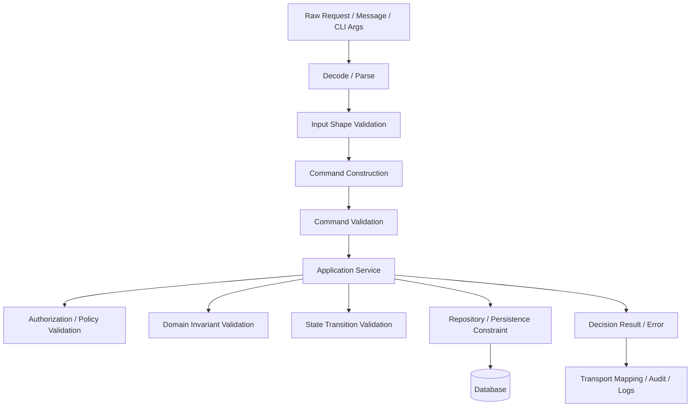
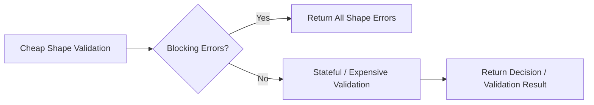
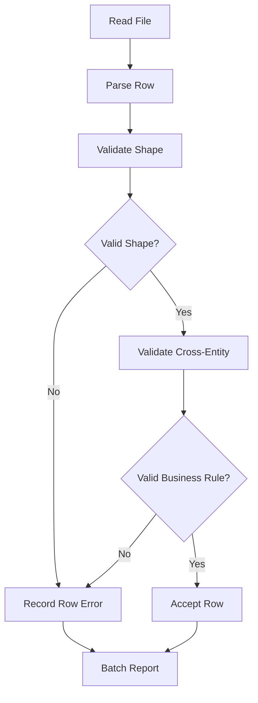

# learn-go-design-patterns-common-patterns-anti-patterns-part-019.md

# Part 019 — Validation Pattern

## Status Seri

- Seri: `learn-go-design-patterns-common-patterns-anti-patterns`
- Part: `019`
- Topik: `Validation Pattern`
- Status seri: **belum selesai**
- Posisi: **part 019 dari 035**

---

## 1. Tujuan Part Ini

Bagian ini membahas **validation pattern** dalam Go untuk codebase production-grade.

Fokus utamanya bukan sekadar “cara mengecek field kosong”, tetapi bagaimana mendesain validasi sebagai bagian dari sistem yang:

- mudah dipahami;
- mudah dites;
- tidak menyebar tanpa kontrol;
- membedakan input invalid dari business rejection;
- menjaga invariant domain;
- tidak menggantungkan correctness hanya pada transport layer;
- bisa menghasilkan response API yang baik;
- bisa mendukung audit dan decision trace;
- bisa bertahan ketika workflow, rule, dan entity makin kompleks.

Dalam sistem kecil, validasi sering hanya berupa beberapa `if` di handler. Dalam sistem besar, terutama sistem regulatory, financial, workflow, enforcement, case management, approval, entitlement, atau compliance, validasi adalah salah satu pusat desain paling penting.

Validasi yang salah tempat biasanya menghasilkan bug seperti:

- data invalid masuk database;
- handler berbeda menerapkan rule berbeda;
- batch import melewati validasi API;
- background worker membuat state yang tidak mungkin;
- policy rejection dianggap error teknis;
- audit trail tidak bisa menjelaskan kenapa request ditolak;
- rule tersebar di service, repository, handler, dan frontend;
- perubahan rule kecil menyebabkan regression besar.

Tujuan part ini adalah membangun mental model bahwa validasi bukan satu lapisan tunggal, tetapi beberapa boundary dengan makna berbeda.

---

## 2. Core Mental Model

Validasi dalam sistem Go yang baik perlu dijawab dengan lima pertanyaan:

1. **Apa yang sedang divalidasi?**
   - raw input?
   - command?
   - entity?
   - transition?
   - policy?
   - persistence constraint?

2. **Siapa pemilik rule?**
   - transport handler?
   - application service?
   - domain package?
   - repository?
   - external policy engine?

3. **Apakah kegagalan validasi adalah error teknis atau hasil bisnis yang valid?**
   - malformed JSON adalah error input;
   - missing required field adalah validation failure;
   - “application tidak eligible untuk approval” adalah decision result;
   - database timeout adalah technical error.

4. **Apakah validasi harus fail-fast atau accumulate-all?**
   - API form biasanya butuh semua error field;
   - state transition kritikal mungkin fail-fast;
   - batch import mungkin butuh partial success.

5. **Apakah rule stateless atau stateful?**
   - `amount > 0` stateless;
   - `email already exists` stateful;
   - `cannot approve if previous inspection pending` cross-entity;
   - `user can only perform this action if delegated authority is active` policy + state.

---

## 3. Validation Is Not One Thing

Salah satu kesalahan umum adalah memakai kata “validation” untuk semua bentuk penolakan. Akibatnya desain menjadi kabur.

Dalam sistem besar, minimal ada beberapa jenis validasi:

| Jenis | Pertanyaan | Contoh | Biasanya Dimiliki Oleh |
|---|---|---|---|
| Syntax validation | Apakah input bisa dibaca? | JSON malformed, invalid UUID format | transport/decoder |
| Shape validation | Apakah field wajib ada? | `name` kosong, `amount` missing | command/input layer |
| Type/range validation | Apakah nilai dalam range valid? | `age >= 18`, `limit <= 100` | command/domain |
| Domain invariant | Apakah entity tetap sah? | approved case harus punya approver | domain |
| Cross-field validation | Apakah kombinasi field sah? | `startDate <= endDate` | command/domain |
| Cross-entity validation | Apakah relasi data sah? | cannot close case with open action items | application/domain service |
| Policy validation | Apakah actor boleh melakukan ini? | role, delegation, jurisdiction | authorization/policy layer |
| State transition validation | Apakah lifecycle transition sah? | Draft → Approved boleh, Closed → Draft tidak | state machine/domain |
| Persistence constraint | Apakah storage menerima? | unique key, FK, not null | database/repository |
| External constraint | Apakah sistem eksternal menerima? | payment gateway rejects token | adapter/application |

Anti-pattern utamanya adalah memperlakukan semua jenis validasi ini dengan cara yang sama.

---

## 4. Java Mindset vs Go Mindset

### 4.1 Java Mindset yang Sering Terbawa

Java engineer sering terbiasa dengan:

- Bean Validation annotation seperti `@NotNull`, `@Size`, `@Pattern`;
- framework-driven validation;
- validation otomatis di controller;
- entity validation via ORM lifecycle hook;
- exception-based validation failure;
- class hierarchy untuk validation rule;
- generic validator framework internal;
- DTO annotation sebagai pusat rule.

Ini tidak selalu salah di Java, tetapi jika dibawa mentah-mentah ke Go, sering menghasilkan desain yang tidak idiomatis.

### 4.2 Masalah Ketika Mindset Itu Dipindahkan ke Go

Di Go, annotation-driven magic bukan idiom utama. Go lebih mengutamakan:

- explicit function call;
- explicit error/result return;
- small package boundary;
- local reasoning;
- minimal abstraction;
- clear ownership.

Jika validasi dibuat seperti Java framework clone, codebase Go bisa jatuh ke pola seperti:

```go
// Anti-pattern: framework-ish reflection validator everywhere.
type CreateUserRequest struct {
    Name  string `validate:"required,min=3,max=100"`
    Email string `validate:"required,email"`
    Role  string `validate:"required,oneof=admin user manager"`
}
```

Tag-based validation boleh dipakai untuk input shape sederhana, tetapi berbahaya jika menjadi pusat domain rule. Tag tidak cocok untuk rule seperti:

- actor harus punya jurisdiction aktif;
- case tidak boleh di-close jika masih ada pending enforcement action;
- renewal hanya boleh dibuat dalam window tertentu;
- approval butuh dual control;
- amount melebihi threshold harus escalation;
- policy berubah berdasarkan effective date.

Rule seperti itu butuh model eksplisit, bukan tag.

### 4.3 Go Mindset

Go cenderung lebih baik dengan:

```go
func (cmd CreateApplicationCommand) Validate() ValidationResult {
    var v Validator

    v.Required("applicant_name", cmd.ApplicantName)
    v.Required("license_type", string(cmd.LicenseType))
    v.ValidDateRange("operation_period", cmd.StartDate, cmd.EndDate)

    return v.Result()
}
```

Lalu rule yang membutuhkan state dipisah:

```go
func (s *ApplicationService) validateCreate(
    ctx context.Context,
    actor Actor,
    cmd CreateApplicationCommand,
) ValidationResult {
    result := cmd.Validate()
    if result.HasBlockingErrors() {
        return result
    }

    if !actor.CanCreateApplication(cmd.LicenseType) {
        result.Add("actor", "not_authorized_for_license_type", "Actor cannot create this license type")
    }

    return result
}
```

Mental model Go: **validasi adalah code biasa yang eksplisit, ditempatkan di boundary yang tepat, dan menghasilkan value yang jelas**.

---

## 5. Validation Boundary Diagram



Interpretasi:

- decode gagal sebelum command terbentuk;
- input validation mengecek request shape;
- command validation mengecek command sebagai intent;
- application service mengecek stateful/cross-entity rule;
- domain menjaga invariant internal;
- repository/database menjaga constraint persistensi;
- hasil validasi harus dipetakan ke response/audit secara konsisten.

---

## 6. Pattern 1 — Decode Then Validate

Handler tidak boleh mencampur semua concern menjadi satu blob besar.

### 6.1 Bentuk yang Buruk

```go
func (h *Handler) Create(w http.ResponseWriter, r *http.Request) {
    var req CreateRequest
    json.NewDecoder(r.Body).Decode(&req)

    if req.Name == "" {
        http.Error(w, "name required", http.StatusBadRequest)
        return
    }
    if req.StartDate.After(req.EndDate) {
        http.Error(w, "invalid date", http.StatusBadRequest)
        return
    }

    // business logic, DB calls, response mapping, all mixed...
}
```

Masalah:

- decode error diabaikan;
- validasi tersebar di handler;
- tidak reusable untuk CLI/batch/worker;
- response error tidak konsisten;
- tidak ada structure untuk multiple field errors;
- business intent belum dipisah dari transport DTO.

### 6.2 Bentuk yang Lebih Baik

```go
type CreateApplicationRequest struct {
    ApplicantName string `json:"applicant_name"`
    LicenseType   string `json:"license_type"`
    StartDate     string `json:"start_date"`
    EndDate       string `json:"end_date"`
}

func (r CreateApplicationRequest) ToCommand() (CreateApplicationCommand, ValidationResult) {
    var v Validator

    v.Required("applicant_name", r.ApplicantName)
    v.Required("license_type", r.LicenseType)
    v.Required("start_date", r.StartDate)
    v.Required("end_date", r.EndDate)

    start, ok := v.Date("start_date", r.StartDate)
    end, ok2 := v.Date("end_date", r.EndDate)

    if ok && ok2 {
        v.BeforeOrEqual("date_range", start, end)
    }

    if v.HasBlockingErrors() {
        return CreateApplicationCommand{}, v.Result()
    }

    return CreateApplicationCommand{
        ApplicantName: r.ApplicantName,
        LicenseType:   LicenseType(r.LicenseType),
        StartDate:     start,
        EndDate:       end,
    }, v.Result()
}
```

Handler menjadi tipis:

```go
func (h *ApplicationHandler) Create(w http.ResponseWriter, r *http.Request) {
    ctx := r.Context()

    var req CreateApplicationRequest
    if err := json.NewDecoder(r.Body).Decode(&req); err != nil {
        writeProblem(w, invalidJSONProblem(err))
        return
    }

    cmd, validation := req.ToCommand()
    if validation.HasBlockingErrors() {
        writeValidationProblem(w, validation)
        return
    }

    result, err := h.create.Handle(ctx, cmd)
    if err != nil {
        writeError(w, err)
        return
    }

    writeJSON(w, http.StatusCreated, result)
}
```

Keuntungan:

- transport parsing tetap di transport layer;
- command hanya terbentuk jika input cukup valid;
- validation result terstruktur;
- application service menerima intent, bukan raw JSON DTO;
- CLI/batch bisa membentuk command dengan cara sendiri.

---

## 7. Pattern 2 — Validation Result as Value

Untuk validasi input, sering kali `error` saja kurang kaya.

Misalnya:

```go
if err != nil {
    return err
}
```

Tidak cukup menjawab:

- field mana yang salah?
- code error apa?
- user message apa?
- apakah blocking atau warning?
- apakah bisa dikumpulkan banyak sekaligus?
- apakah boleh lanjut sebagai partial success?
- apakah perlu audit?

### 7.1 ValidationResult Shape

```go
type ValidationSeverity string

const (
    SeverityError   ValidationSeverity = "error"
    SeverityWarning ValidationSeverity = "warning"
)

type ValidationIssue struct {
    Field    string             `json:"field,omitempty"`
    Code     string             `json:"code"`
    Message  string             `json:"message"`
    Severity ValidationSeverity `json:"severity"`
}

type ValidationResult struct {
    Issues []ValidationIssue `json:"issues"`
}

func (r ValidationResult) IsValid() bool {
    return !r.HasBlockingErrors()
}

func (r ValidationResult) HasBlockingErrors() bool {
    for _, issue := range r.Issues {
        if issue.Severity == SeverityError {
            return true
        }
    }
    return false
}
```

### 7.2 Builder Style Validator

```go
type Validator struct {
    issues []ValidationIssue
}

func (v *Validator) Add(field, code, message string) {
    v.issues = append(v.issues, ValidationIssue{
        Field:    field,
        Code:     code,
        Message:  message,
        Severity: SeverityError,
    })
}

func (v *Validator) Warn(field, code, message string) {
    v.issues = append(v.issues, ValidationIssue{
        Field:    field,
        Code:     code,
        Message:  message,
        Severity: SeverityWarning,
    })
}

func (v *Validator) Required(field, value string) {
    if strings.TrimSpace(value) == "" {
        v.Add(field, "required", "This field is required")
    }
}

func (v *Validator) Result() ValidationResult {
    out := make([]ValidationIssue, len(v.issues))
    copy(out, v.issues)
    return ValidationResult{Issues: out}
}

func (v *Validator) HasBlockingErrors() bool {
    return v.Result().HasBlockingErrors()
}
```

### 7.3 Why Not Just `error`?

`error` cocok untuk operasi gagal. `ValidationResult` cocok untuk hasil validasi yang memang bagian dari flow normal.

Contoh:

```go
type CreateApplicationResult struct {
    ApplicationID ApplicationID
    Validation    ValidationResult
}
```

Tetapi jangan overuse. Untuk malformed JSON, tetap pakai `error`. Untuk DB timeout, tetap pakai `error`. Untuk business validation, pakai result jika caller perlu memahami issue secara terstruktur.

---

## 8. Pattern 3 — Fail-Fast vs Accumulate-All

Tidak semua validasi harus mengumpulkan semua error.

### 8.1 Accumulate-All

Cocok untuk:

- API form submission;
- admin UI;
- batch import row validation;
- file upload validation;
- user correction workflow.

Tujuannya memberi feedback lengkap.

```go
func (cmd CreateUserCommand) Validate() ValidationResult {
    var v Validator
    v.Required("name", cmd.Name)
    v.Required("email", cmd.Email)
    v.Email("email", cmd.Email)
    v.MaxLen("name", cmd.Name, 100)
    return v.Result()
}
```

### 8.2 Fail-Fast

Cocok untuk:

- security-sensitive path;
- invalid state transition;
- expensive validation chain;
- operation yang setelah satu kondisi gagal tidak punya makna;
- invariant violation internal.

```go
func (m Machine) CanTransition(from, to State) error {
    allowed, ok := m.transitions[from]
    if !ok {
        return ErrUnknownState
    }
    if !allowed[to] {
        return ErrIllegalTransition
    }
    return nil
}
```

### 8.3 Mixed Mode

Sering kali validasi production memakai dua tahap:



Contoh:

1. kumpulkan semua missing/format error dulu;
2. jika shape valid, baru query database;
3. jika cross-entity rule gagal, kembalikan decision/validation issue.

Ini menghindari query database untuk input yang jelas rusak.

---

## 9. Pattern 4 — Command Validation

Command merepresentasikan intent application-level. Ia bukan raw request dan bukan entity persistence.

```go
type SubmitApplicationCommand struct {
    ApplicationID ApplicationID
    ActorID       UserID
    SubmittedAt   time.Time
}

func (cmd SubmitApplicationCommand) Validate() ValidationResult {
    var v Validator

    if cmd.ApplicationID.IsZero() {
        v.Add("application_id", "required", "Application ID is required")
    }
    if cmd.ActorID.IsZero() {
        v.Add("actor_id", "required", "Actor ID is required")
    }
    if cmd.SubmittedAt.IsZero() {
        v.Add("submitted_at", "required", "Submitted time is required")
    }

    return v.Result()
}
```

Kenapa command punya validasi sendiri?

Karena command bisa datang dari:

- HTTP request;
- gRPC request;
- CLI;
- batch job;
- queue consumer;
- test;
- internal orchestration.

Jika validasi hanya di HTTP DTO, caller lain bisa melewati rule.

---

## 10. Pattern 5 — Domain Invariant Validation

Domain invariant adalah rule yang harus selalu benar agar entity tidak berada dalam state yang tidak sah.

Contoh:

- approved application harus punya approver;
- closed case harus punya closure reason;
- paid invoice tidak boleh amount negatif;
- revoked license harus punya revocation date;
- enforcement action tidak boleh active tanpa case id.

Invariant tidak boleh hanya berada di handler.

### 10.1 Entity Method Guard

```go
type Application struct {
    id          ApplicationID
    status      ApplicationStatus
    submittedAt *time.Time
    approvedAt  *time.Time
    approvedBy  *UserID
}

func (a *Application) Approve(actor UserID, now time.Time) error {
    if a.status != StatusSubmitted {
        return ErrInvalidTransition
    }
    if actor.IsZero() {
        return ErrMissingApprover
    }

    a.status = StatusApproved
    a.approvedAt = &now
    a.approvedBy = &actor
    return nil
}
```

Di sini `Approve` menjaga invariant: application tidak bisa menjadi approved tanpa actor dan waktu approval.

### 10.2 Avoid Anemic Mutation

Anti-pattern:

```go
app.Status = StatusApproved
repo.Save(ctx, app)
```

Masalah:

- semua caller bisa membuat state tidak sah;
- tidak ada pusat rule transition;
- audit event sulit konsisten;
- validation tersebar.

Lebih baik:

```go
if err := app.Approve(actor.ID, clock.Now()); err != nil {
    return Decision{}, err
}
```

---

## 11. Pattern 6 — Cross-Entity Validation

Banyak rule tidak bisa divalidasi oleh satu entity saja.

Contoh:

- case tidak boleh close jika masih ada active enforcement action;
- application tidak boleh approved jika payment belum settled;
- renewal tidak boleh dibuat jika license sedang suspended;
- user tidak boleh approve case miliknya sendiri;
- officer tidak boleh handle case di luar jurisdiction.

Rule seperti ini biasanya milik application service atau domain service.

```go
type CloseCasePolicy struct {
    actions ActionRepository
    clock   Clock
}

func (p *CloseCasePolicy) Evaluate(
    ctx context.Context,
    actor Actor,
    c Case,
) (ValidationResult, error) {
    var v Validator

    pending, err := p.actions.CountPendingByCase(ctx, c.ID())
    if err != nil {
        return ValidationResult{}, fmt.Errorf("count pending actions: %w", err)
    }

    if pending > 0 {
        v.Add("case", "pending_actions_exist", "Case cannot be closed while pending actions exist")
    }

    if !actor.CanCloseCase(c.Jurisdiction()) {
        v.Add("actor", "not_authorized", "Actor is not authorized to close this case")
    }

    return v.Result(), nil
}
```

Perhatikan perbedaan:

- rule gagal menghasilkan `ValidationResult`;
- query DB gagal menghasilkan `error`.

Ini adalah boundary yang sangat penting.

---

## 12. Pattern 7 — Policy Validation

Policy validation sering overlap dengan authorization. Bedanya:

- authorization menjawab “boleh atau tidak actor melakukan action ini?”;
- policy validation bisa menjawab “operation ini memenuhi rule internal/regulatory?”;
- hasilnya kadang butuh reason code, severity, escalation, atau audit trace.

Contoh:

```go
type ApprovalPolicy struct {
    threshold Money
}

type ApprovalPolicyInput struct {
    Actor       Actor
    Application Application
    RiskScore   int
    Amount      Money
}

type PolicyDecision struct {
    Allowed bool
    Reasons []PolicyReason
}

type PolicyReason struct {
    Code    string
    Message string
}

func (p ApprovalPolicy) Evaluate(input ApprovalPolicyInput) PolicyDecision {
    var reasons []PolicyReason

    if !input.Actor.HasPermission("application.approve") {
        reasons = append(reasons, PolicyReason{
            Code:    "missing_permission",
            Message: "Actor lacks approval permission",
        })
    }

    if input.RiskScore >= 80 && !input.Actor.HasPermission("application.high_risk.approve") {
        reasons = append(reasons, PolicyReason{
            Code:    "high_risk_requires_special_approval",
            Message: "High risk application requires special approval permission",
        })
    }

    return PolicyDecision{
        Allowed: len(reasons) == 0,
        Reasons: reasons,
    }
}
```

Policy result bukan error teknis.

---

## 13. Pattern 8 — State Transition Validation

State machine adalah salah satu bentuk validasi paling penting dalam workflow.

```go
type State string

const (
    Draft     State = "draft"
    Submitted State = "submitted"
    Approved  State = "approved"
    Rejected  State = "rejected"
    Closed    State = "closed"
)

type Transition struct {
    From State
    To   State
    Name string
}

var allowedTransitions = map[State]map[State]bool{
    Draft: {
        Submitted: true,
    },
    Submitted: {
        Approved: true,
        Rejected: true,
    },
    Approved: {
        Closed: true,
    },
}

func CanTransition(from, to State) bool {
    next, ok := allowedTransitions[from]
    if !ok {
        return false
    }
    return next[to]
}
```

Entity method:

```go
func (a *Application) TransitionTo(to State, actor UserID, now time.Time) error {
    if !CanTransition(a.status, to) {
        return ErrInvalidTransition
    }
    if actor.IsZero() {
        return ErrMissingActor
    }

    a.status = to
    a.updatedAt = now
    return nil
}
```

Untuk regulatory/workflow system, transition validation sebaiknya menghasilkan:

- from state;
- to state;
- actor;
- timestamp;
- reason;
- failed guard reason;
- audit event.

---

## 14. Pattern 9 — Validation as Specification

Kadang rule cukup kompleks sehingga lebih mudah dimodelkan sebagai specification.

```go
type Specification[T any] interface {
    IsSatisfiedBy(ctx context.Context, value T) (bool, error)
    Code() string
}
```

Namun hati-hati: generic specification framework bisa menjadi over-engineering.

Gunakan specification jika:

- rule dipakai ulang di banyak use case;
- rule bisa dikomposisi;
- rule perlu dinamai dan diaudit;
- rule bisa berubah berdasarkan policy version;
- rule perlu dievaluasi sebagai decision trace.

Jangan gunakan jika hanya ada 2–3 `if` lokal.

### 14.1 Explicit Specification Without Framework

```go
type CanApproveApplicationRule struct {
    threshold Money
}

func (r CanApproveApplicationRule) Evaluate(input ApprovalInput) PolicyReasonSet {
    var reasons PolicyReasonSet

    if input.Application.Status != StatusSubmitted {
        reasons.Add("not_submitted", "Only submitted applications can be approved")
    }

    if input.Application.Amount.GreaterThan(r.threshold) && !input.Actor.IsSeniorApprover() {
        reasons.Add("senior_approver_required", "Amount exceeds approval threshold")
    }

    return reasons
}
```

Ini sering lebih Go-like daripada membuat framework specification umum.

---

## 15. Pattern 10 — Validation in Constructor

Constructor bisa melakukan validasi untuk dependency dan config.

```go
type Service struct {
    repo Repository
    log  *slog.Logger
}

func NewService(repo Repository, log *slog.Logger) (*Service, error) {
    if repo == nil {
        return nil, errors.New("repo is required")
    }
    if log == nil {
        log = slog.Default()
    }

    return &Service{repo: repo, log: log}, nil
}
```

Constructor validation cocok untuk:

- required dependency;
- static config;
- option conflict;
- invalid timeout;
- invalid endpoint;
- missing clock/random/id generator dependency;
- dangerous insecure config.

Constructor tidak cocok untuk:

- request validation;
- DB query validation;
- external service check wajib;
- business policy check;
- operation-specific validation.

Anti-pattern:

```go
func NewService(cfg Config) (*Service, error) {
    if err := pingDatabase(cfg.DatabaseURL); err != nil {
        return nil, err
    }
    // Constructor now performs network I/O.
}
```

Lebih baik pisahkan build dan start/health check.

---

## 16. Pattern 11 — Persistence Constraint as Last Line of Defense

Database constraint tetap penting.

Code validation tidak menggantikan:

- unique constraint;
- foreign key;
- not null;
- check constraint;
- optimistic version;
- transactional isolation.

Contoh:

```go
func (r *UserRepository) Insert(ctx context.Context, u User) error {
    _, err := r.db.ExecContext(ctx, `
        INSERT INTO users (id, email, name)
        VALUES (?, ?, ?)
    `, u.ID(), u.Email(), u.Name())
    if err != nil {
        if isUniqueViolation(err) {
            return ErrEmailAlreadyExists
        }
        return fmt.Errorf("insert user: %w", err)
    }
    return nil
}
```

Database constraint error harus diterjemahkan ke domain/application error yang aman.

Jangan bocorkan:

```txt
ORA-00001: unique constraint (APP.USERS_UK_EMAIL) violated
```

ke public API.

---

## 17. Pattern 12 — Validation and Idempotency

Validation berinteraksi erat dengan idempotency.

Contoh:

- request create application dengan idempotency key sama dikirim dua kali;
- pertama berhasil;
- kedua harus return result yang sama, bukan gagal karena duplicate.

Jika validation tidak memahami idempotency, bug bisa muncul:

```txt
POST /applications
Idempotency-Key: abc

First request: 201 Created
Second request: 409 Duplicate Application
```

Padahal yang diinginkan:

```txt
Second request: 201 Created with same application id
```

Design:

```go
func (s *Service) Create(ctx context.Context, cmd CreateCommand) (CreateResult, error) {
    if v := cmd.Validate(); v.HasBlockingErrors() {
        return CreateResult{Validation: v}, nil
    }

    existing, err := s.idempotency.Find(ctx, cmd.IdempotencyKey)
    if err != nil {
        return CreateResult{}, err
    }
    if existing.Found {
        return existing.Result, nil
    }

    // Continue create.
}
```

Idempotency validation bukan sekadar field required; ia adalah operation semantics.

---

## 18. Pattern 13 — Validation for Batch and Partial Success

Batch import, async processing, dan file ingestion membutuhkan model validasi berbeda.

```go
type RowValidationResult struct {
    RowNumber int
    Issues    []ValidationIssue
}

type BatchValidationResult struct {
    TotalRows int
    ValidRows int
    InvalidRows int
    RowResults []RowValidationResult
}
```

Batch flow:



Batch validation harus menjawab:

- apakah seluruh batch ditolak jika satu row invalid?
- apakah valid row tetap diproses?
- apakah error dikumpulkan per row?
- apakah ada threshold reject?
- apakah duplicate row dalam file dianggap warning/error?
- apakah duplicate terhadap database dianggap idempotent/conflict?

---

## 19. Pattern 14 — Validation and Auditability

Dalam sistem regulatory atau enforcement, validasi bukan hanya untuk user feedback. Validasi juga menjelaskan **kenapa sistem menolak atau menerima keputusan**.

Audit-friendly validation issue perlu memiliki:

- stable code;
- field/entity reference;
- human-readable message;
- severity;
- rule version jika perlu;
- actor;
- timestamp;
- input snapshot terbatas/redacted;
- decision context.

Contoh:

```go
type DecisionTrace struct {
    DecisionID string
    ActorID    UserID
    Operation  string
    EntityID   string
    At         time.Time
    Rules      []RuleEvaluation
}

type RuleEvaluation struct {
    Code     string
    Passed   bool
    Severity string
    Message  string
}
```

Jangan hanya log:

```txt
validation failed
```

Itu tidak cukup untuk audit, troubleshooting, atau appeal/review process.

---

## 20. Pattern 15 — Validation and Observability

Validation failure perlu terlihat dalam observability, tetapi hati-hati dengan cardinality dan sensitive data.

### 20.1 Logging

Baik:

```go
log.InfoContext(ctx, "command validation failed",
    slog.String("operation", "create_application"),
    slog.Int("issue_count", len(result.Issues)),
)
```

Hati-hati:

```go
log.Info("validation failed", "issues", result.Issues)
```

Karena issue bisa mengandung PII atau user input.

### 20.2 Metrics

Gunakan code stabil, bukan raw message.

Baik:

```txt
validation_failures_total{operation="create_application",code="required"}
```

Buruk:

```txt
validation_failures_total{message="Applicant John Doe is invalid"}
```

Masalahnya high cardinality dan data sensitif.

### 20.3 Tracing

Trace attribute bisa menyimpan:

- operation;
- validation outcome;
- issue count;
- top-level reason code.

Jangan simpan full request body atau PII.

---

## 21. Pattern 16 — Validation and Security

Validation sering menjadi security boundary.

Contoh security-sensitive validation:

- input length limit;
- allowed file type;
- allowed MIME/content sniffing;
- path traversal prevention;
- SQL parameterization;
- SSRF prevention;
- redirect URL allowlist;
- numeric range limit;
- rate-limit key sanity;
- authorization scope validation;
- tenant boundary validation.

### 21.1 Validate Before Expensive Work

```go
func (h *UploadHandler) Upload(w http.ResponseWriter, r *http.Request) {
    r.Body = http.MaxBytesReader(w, r.Body, 10<<20) // 10 MiB

    if err := r.ParseMultipartForm(10 << 20); err != nil {
        writeProblem(w, invalidUploadProblem(err))
        return
    }

    // Continue only after bounded input.
}
```

### 21.2 Tenant Validation

```go
func (s *Service) GetCase(ctx context.Context, actor Actor, caseID CaseID) (Case, error) {
    c, err := s.repo.FindByID(ctx, caseID)
    if err != nil {
        return Case{}, err
    }

    if c.TenantID() != actor.TenantID() {
        return Case{}, ErrNotFound // Avoid leaking existence.
    }

    return c, nil
}
```

Security validation must consider information leakage.

---

## 22. Pattern 17 — Validation Rule Versioning

Regulatory and policy systems often need rule versioning.

Example:

- rule changed on 2026-01-01;
- application submitted before that date uses old rule;
- application submitted after that date uses new rule;
- audit must explain which rule version was applied.

Design:

```go
type RuleVersion string

type EligibilityPolicy struct {
    version RuleVersion
}

func NewEligibilityPolicy(effectiveDate time.Time) EligibilityPolicy {
    if effectiveDate.Before(time.Date(2026, 1, 1, 0, 0, 0, 0, time.UTC)) {
        return EligibilityPolicy{version: "2025-01"}
    }
    return EligibilityPolicy{version: "2026-01"}
}
```

Decision trace:

```go
type RuleEvaluation struct {
    Code    string
    Version string
    Passed  bool
}
```

Anti-pattern:

```go
if time.Now().After(ruleChangeDate) {
    // new rule
}
```

Masalah:

- tidak deterministic saat replay;
- test sulit;
- historical decision bisa berubah jika dievaluasi ulang;
- audit buruk.

Lebih baik gunakan effective date dari command/entity/clock yang jelas.

---

## 23. Pattern 18 — Validation for External API Boundary

External API adapter perlu validasi berbeda.

### 23.1 Outbound Request Validation

Sebelum memanggil sistem eksternal:

```go
func (c *PaymentClient) Charge(ctx context.Context, req ChargeRequest) (ChargeResult, error) {
    if req.Amount.IsZeroOrNegative() {
        return ChargeResult{}, ErrInvalidChargeRequest
    }
    if req.Token == "" {
        return ChargeResult{}, ErrMissingPaymentToken
    }

    // call external API
}
```

### 23.2 Inbound Response Validation

Jangan percaya response eksternal begitu saja.

```go
func decodePaymentResponse(body io.Reader) (PaymentResponse, error) {
    var resp PaymentResponse
    if err := json.NewDecoder(body).Decode(&resp); err != nil {
        return PaymentResponse{}, fmt.Errorf("decode payment response: %w", err)
    }

    if resp.TransactionID == "" {
        return PaymentResponse{}, ErrInvalidPaymentProviderResponse
    }

    return resp, nil
}
```

External adapter harus melindungi core dari:

- schema drift;
- missing field;
- unexpected enum;
- inconsistent status;
- partial response;
- unsafe error message;
- retryable vs non-retryable classification.

---

## 24. Pattern 19 — Validation and Generics

Generics bisa membantu untuk helper sederhana, tetapi jangan membuat validation framework terlalu abstrak.

### 24.1 Reasonable Generic Helper

```go
func OneOf[T comparable](value T, allowed ...T) bool {
    for _, candidate := range allowed {
        if value == candidate {
            return true
        }
    }
    return false
}
```

### 24.2 Over-Engineered Generic Validator

```go
// Anti-pattern if introduced too early.
type Rule[T any, C any, R any] interface {
    Validate(context.Context, T, C) (R, error)
}
```

Masalah:

- sulit dibaca;
- type parameter tidak menjelaskan domain;
- rule sederhana menjadi framework;
- caller sulit memahami control flow;
- debugging lebih berat.

Go design cenderung menang jika domain rule eksplisit.

---

## 25. Anti-Pattern Catalog

### 25.1 Validation Only in Handler

Gejala:

```go
func (h *Handler) Create(...) {
    if req.Name == "" { ... }
    if req.StartDate.After(req.EndDate) { ... }
}
```

Masalah:

- CLI, worker, batch bisa bypass rule;
- business logic tersebar;
- testing use case sulit;
- transport menjadi terlalu gemuk.

Refactor:

- pindahkan input shape ke DTO/command mapping;
- pindahkan domain invariant ke domain/entity;
- pindahkan cross-entity rule ke service/policy.

---

### 25.2 Validation Hidden in Repository

Gejala:

```go
func (r *Repo) Save(ctx context.Context, app Application) error {
    if app.Status == Approved && app.ApproverID == "" {
        return errors.New("invalid")
    }
    // save
}
```

Masalah:

- repository jadi domain rule owner;
- caller tidak bisa tahu rule sebelum DB path;
- error mapping kabur;
- rule sulit dipakai ulang.

Repository boleh menjaga persistence constraint, tetapi domain invariant sebaiknya berada di domain/application boundary.

---

### 25.3 Tag-Based Domain Rule

Gejala:

```go
type Application struct {
    Status string `validate:"oneof=draft submitted approved rejected"`
}
```

Masalah:

- tag hanya mengecek value set, bukan transition;
- tidak bisa cek actor, state lama, rule version;
- audit decision buruk;
- rule tersembunyi dalam string tag.

Gunakan tag untuk shape sederhana, bukan policy/domain lifecycle.

---

### 25.4 Panic for Validation

Gejala:

```go
func NewMoney(amount int64, currency string) Money {
    if amount < 0 {
        panic("negative amount")
    }
    return Money{amount: amount, currency: currency}
}
```

Kadang panic acceptable untuk programmer error internal, tetapi bukan untuk user input.

Jika input berasal dari luar, return error/result.

---

### 25.5 Boolean Without Reason

Gejala:

```go
func CanApprove(app Application, actor Actor) bool
```

Masalah:

- caller tidak tahu alasan;
- audit tidak bisa menjelaskan;
- API tidak bisa memberi feedback baik;
- debugging sulit.

Lebih baik:

```go
func EvaluateApproval(app Application, actor Actor) PolicyDecision
```

---

### 25.6 String Matching Validation Error

Gejala:

```go
if strings.Contains(err.Error(), "required") { ... }
```

Masalah:

- fragile;
- tidak refactor-safe;
- message localization merusak logic;
- behavior tergantung text.

Gunakan code/type/sentinel.

---

### 25.7 Duplicate Rule in FE and BE Without Contract

Frontend boleh melakukan validasi UX, tetapi backend tetap owner correctness.

Anti-pattern:

- FE punya rule A;
- BE punya rule B;
- tidak ada shared contract;
- user melihat error berbeda di tiap layer.

Solusi:

- backend sebagai source of truth;
- FE validation untuk fast feedback;
- error code stabil;
- dokumentasikan validation contract;
- contract test untuk API.

---

### 25.8 Over-General Validation Framework

Gejala:

- semua rule menjadi `Rule`, `Spec`, `Validator`, `Pipeline`, `Context`, `Engine`;
- rule sederhana sulit dilacak;
- stacktrace panjang;
- tidak ada domain language;
- developer baru harus belajar framework internal dulu.

Refactor:

- mulai dari explicit function;
- abstraksi hanya rule yang terbukti berulang;
- gunakan domain-specific types.

---

### 25.9 Mixing Validation and Mutation

Gejala:

```go
func ValidateAndNormalize(req *Request) error {
    req.Name = strings.TrimSpace(req.Name)
    if req.Name == "" { return ErrRequired }
    req.Status = "draft"
    return nil
}
```

Normalisasi boleh, tetapi harus jelas. Jika function bernama `Validate`, caller tidak mengharapkan mutation besar.

Pisahkan:

```go
normalized := NormalizeRequest(req)
validation := normalized.Validate()
```

---

### 25.10 Ignoring Database Race

Anti-pattern:

```go
exists, _ := repo.EmailExists(ctx, email)
if exists {
    return ErrDuplicateEmail
}
repo.Insert(ctx, user)
```

Masalah:

- race condition;
- dua request concurrent bisa lolos check;
- hanya DB unique constraint yang final.

Gunakan pre-check untuk user-friendly feedback, tetapi tetap handle unique violation saat insert.

---

## 26. Production Example — Case Closure Validation

### 26.1 Requirement

Sebuah case hanya boleh ditutup jika:

1. case berada dalam state `resolved`;
2. tidak ada pending action item;
3. tidak ada outstanding payment;
4. actor punya permission untuk close case;
5. closure reason wajib diisi;
6. close operation harus auditable;
7. repeated close request harus idempotent jika case sudah closed dengan request ID yang sama.

### 26.2 Command

```go
type CloseCaseCommand struct {
    CaseID         CaseID
    ActorID        UserID
    ClosureReason  string
    RequestID      string
    RequestedAt    time.Time
}

func (cmd CloseCaseCommand) Validate() ValidationResult {
    var v Validator

    if cmd.CaseID.IsZero() {
        v.Add("case_id", "required", "Case ID is required")
    }
    if cmd.ActorID.IsZero() {
        v.Add("actor_id", "required", "Actor ID is required")
    }
    v.Required("closure_reason", cmd.ClosureReason)
    v.Required("request_id", cmd.RequestID)
    if cmd.RequestedAt.IsZero() {
        v.Add("requested_at", "required", "Requested time is required")
    }

    return v.Result()
}
```

### 26.3 Policy

```go
type CloseCasePolicy struct {
    actions  ActionRepository
    payments PaymentRepository
}

func (p *CloseCasePolicy) Evaluate(
    ctx context.Context,
    actor Actor,
    c Case,
) (ValidationResult, error) {
    var v Validator

    if c.Status() != CaseResolved {
        v.Add("case", "case_not_resolved", "Only resolved cases can be closed")
    }

    if !actor.Can("case.close", c.Jurisdiction()) {
        v.Add("actor", "not_authorized", "Actor is not authorized to close this case")
    }

    pendingActions, err := p.actions.CountPendingByCase(ctx, c.ID())
    if err != nil {
        return ValidationResult{}, fmt.Errorf("count pending actions: %w", err)
    }
    if pendingActions > 0 {
        v.Add("case", "pending_actions_exist", "Case has pending actions")
    }

    outstandingPayment, err := p.payments.HasOutstandingByCase(ctx, c.ID())
    if err != nil {
        return ValidationResult{}, fmt.Errorf("check outstanding payment: %w", err)
    }
    if outstandingPayment {
        v.Add("case", "outstanding_payment_exists", "Case has outstanding payment")
    }

    return v.Result(), nil
}
```

### 26.4 Service Flow

```go
type CloseCaseService struct {
    cases       CaseRepository
    actors      ActorRepository
    idempotency IdempotencyRepository
    policy      *CloseCasePolicy
    tx          TransactionRunner
    clock       Clock
}

func (s *CloseCaseService) Close(ctx context.Context, cmd CloseCaseCommand) (CloseCaseResult, error) {
    if validation := cmd.Validate(); validation.HasBlockingErrors() {
        return CloseCaseResult{Validation: validation}, nil
    }

    existing, err := s.idempotency.Find(ctx, cmd.RequestID)
    if err != nil {
        return CloseCaseResult{}, fmt.Errorf("find idempotency record: %w", err)
    }
    if existing.Found {
        return existing.CloseCaseResult, nil
    }

    var result CloseCaseResult
    err = s.tx.WithinTx(ctx, func(ctx context.Context, tx Tx) error {
        c, err := s.cases.FindForUpdate(ctx, tx, cmd.CaseID)
        if err != nil {
            return fmt.Errorf("find case: %w", err)
        }

        actor, err := s.actors.FindByID(ctx, tx, cmd.ActorID)
        if err != nil {
            return fmt.Errorf("find actor: %w", err)
        }

        validation, err := s.policy.Evaluate(ctx, actor, c)
        if err != nil {
            return err
        }
        if validation.HasBlockingErrors() {
            result = CloseCaseResult{Validation: validation}
            return nil
        }

        if err := c.Close(cmd.ActorID, cmd.ClosureReason, s.clock.Now()); err != nil {
            return fmt.Errorf("close case entity: %w", err)
        }

        if err := s.cases.Save(ctx, tx, c); err != nil {
            return fmt.Errorf("save case: %w", err)
        }

        result = CloseCaseResult{
            CaseID:     c.ID(),
            Closed:     true,
            Validation: ValidationResult{},
        }

        return s.idempotency.StoreCloseCaseResult(ctx, tx, cmd.RequestID, result)
    })
    if err != nil {
        return CloseCaseResult{}, err
    }

    return result, nil
}
```

### 26.5 Important Observations

- command validates shape;
- service owns orchestration;
- policy owns cross-entity rule;
- entity owns state mutation invariant;
- repository owns persistence;
- transaction owns consistency;
- idempotency prevents duplicate side effects;
- validation result is not technical error;
- DB/system failure remains `error`.

---

## 27. Refactoring Playbook

### 27.1 From Handler Validation to Command Validation

Before:

```go
if req.Name == "" { ... }
```

After:

```go
cmd, validation := req.ToCommand()
if validation.HasBlockingErrors() { ... }
```

Steps:

1. introduce command type;
2. move field validation from handler to command mapping;
3. make handler map validation result to response;
4. add unit tests for command validation;
5. remove duplicated handler validation.

---

### 27.2 From Boolean Policy to Decision Result

Before:

```go
if !policy.CanApprove(app, actor) {
    return ErrForbidden
}
```

After:

```go
decision := policy.EvaluateApproval(app, actor)
if !decision.Allowed {
    return ApprovalResult{Decision: decision}, nil
}
```

Steps:

1. create `PolicyDecision`;
2. add reason codes;
3. map decision to API/audit;
4. update tests to assert reason;
5. remove boolean-only path.

---

### 27.3 From Repository Validation to Domain Invariant

Before:

```go
func (r Repo) Save(app Application) error {
    if app.Status == Approved && app.ApproverID == "" { ... }
}
```

After:

```go
func (a *Application) Approve(actor UserID, now time.Time) error
```

Steps:

1. identify invariant;
2. create entity method;
3. make fields private if possible;
4. update use cases to call method;
5. keep DB constraint as defense;
6. remove duplicated repository rule.

---

### 27.4 From String Error to Structured Validation Issue

Before:

```go
return errors.New("name is required")
```

After:

```go
v.Add("name", "required", "Name is required")
```

Steps:

1. create `ValidationIssue`;
2. create stable code list;
3. map to API problem format;
4. update tests to assert code, not message;
5. avoid logic based on message string.

---

## 28. Testing Strategy

### 28.1 Unit Test Command Validation

```go
func TestCreateApplicationCommandValidate(t *testing.T) {
    cmd := CreateApplicationCommand{}

    result := cmd.Validate()

    if !result.HasBlockingErrors() {
        t.Fatal("expected validation errors")
    }

    assertHasIssue(t, result, "applicant_name", "required")
    assertHasIssue(t, result, "license_type", "required")
}
```

### 28.2 Unit Test Policy

```go
func TestCloseCasePolicyRejectsPendingActions(t *testing.T) {
    actions := fakeActionRepo{pending: 2}
    payments := fakePaymentRepo{outstanding: false}
    policy := CloseCasePolicy{actions: actions, payments: payments}

    result, err := policy.Evaluate(context.Background(), authorizedActor(), resolvedCase())
    if err != nil {
        t.Fatal(err)
    }

    assertHasIssue(t, result, "case", "pending_actions_exist")
}
```

### 28.3 Test Technical Error Separately

```go
func TestCloseCasePolicyReturnsErrorWhenActionRepoFails(t *testing.T) {
    actions := fakeActionRepo{err: errors.New("db down")}
    policy := CloseCasePolicy{actions: actions}

    _, err := policy.Evaluate(context.Background(), authorizedActor(), resolvedCase())
    if err == nil {
        t.Fatal("expected error")
    }
}
```

Important distinction:

- validation failure is expected result;
- repository failure is error.

### 28.4 Table-Driven Tests

```go
func TestApprovalPolicy(t *testing.T) {
    tests := []struct {
        name      string
        actor     Actor
        app       Application
        wantCodes []string
    }{
        {
            name:      "missing permission",
            actor:     actorWithoutApproval(),
            app:       submittedApplication(),
            wantCodes: []string{"missing_permission"},
        },
        {
            name:      "not submitted",
            actor:     approverActor(),
            app:       draftApplication(),
            wantCodes: []string{"not_submitted"},
        },
    }

    for _, tt := range tests {
        t.Run(tt.name, func(t *testing.T) {
            got := EvaluateApproval(tt.actor, tt.app)
            assertReasonCodes(t, got, tt.wantCodes)
        })
    }
}
```

---

## 29. Review Checklist

Gunakan checklist ini saat review PR yang menyentuh validasi.

### 29.1 Ownership

- [ ] Rule ini milik transport, command, domain, policy, atau repository?
- [ ] Rule tidak hanya ada di frontend?
- [ ] Rule tidak tersebar di beberapa handler?
- [ ] Rule yang butuh state tidak disembunyikan sebagai tag?
- [ ] Domain invariant tidak hanya dijaga oleh repository?

### 29.2 Semantics

- [ ] Apakah kegagalan ini error teknis atau business validation result?
- [ ] Apakah caller butuh banyak issue sekaligus?
- [ ] Apakah reason code stabil?
- [ ] Apakah message aman untuk user?
- [ ] Apakah sensitive input tidak masuk log/metric?

### 29.3 Boundary

- [ ] Decode error dipisahkan dari validation error?
- [ ] Command terbentuk setelah parsing/normalisasi yang cukup?
- [ ] Context dipropagasi untuk stateful validation?
- [ ] External adapter memvalidasi response eksternal?
- [ ] DB constraint error diterjemahkan dengan aman?

### 29.4 Consistency

- [ ] Concurrent request tidak bisa bypass uniqueness?
- [ ] Idempotency dipertimbangkan?
- [ ] Transaction boundary jelas?
- [ ] State transition illegal tidak bisa terjadi lewat path lain?
- [ ] Batch/partial success semantics jelas?

### 29.5 Testability

- [ ] Command validation punya unit test?
- [ ] Policy validation punya unit test?
- [ ] Technical failure path punya test terpisah?
- [ ] Reason code diuji, bukan message string?
- [ ] Edge cases diuji?

---

## 30. Common Design Decisions

### 30.1 Should Validation Return `error` or `ValidationResult`?

Gunakan `ValidationResult` jika:

- multiple issue diperlukan;
- user perlu field-level feedback;
- rejection adalah bagian dari flow normal;
- audit/decision trace perlu reason code.

Gunakan `error` jika:

- operation secara teknis gagal;
- decode/parsing gagal secara fatal;
- dependency gagal;
- invariant internal dilanggar karena programmer error;
- caller tidak perlu structured issue.

Sering kali function return keduanya:

```go
func Evaluate(ctx context.Context, input Input) (ValidationResult, error)
```

Artinya:

- `ValidationResult` untuk rule outcome;
- `error` untuk kegagalan evaluasi.

---

### 30.2 Should Validation Be Method or Function?

Method cocok jika rule melekat pada type:

```go
func (cmd CreateCommand) Validate() ValidationResult
```

Function cocok jika rule butuh dependency atau policy version:

```go
func ValidateCreateCommand(cmd CreateCommand, policy CreatePolicy) ValidationResult
```

Service/policy object cocok jika rule butuh repository/config/clock:

```go
type EligibilityPolicy struct { repo Repo; clock Clock }
func (p *EligibilityPolicy) Evaluate(ctx context.Context, input Input) (Decision, error)
```

---

### 30.3 Should Validation Normalize Input?

Normalisasi boleh, tetapi harus eksplisit.

Baik:

```go
func NormalizeCreateRequest(req CreateRequest) CreateRequest {
    req.Name = strings.TrimSpace(req.Name)
    req.Email = strings.ToLower(strings.TrimSpace(req.Email))
    return req
}
```

Lalu:

```go
req = NormalizeCreateRequest(req)
cmd, validation := req.ToCommand()
```

Hindari function bernama `Validate` yang diam-diam mengubah banyak field.

---

## 31. Exercises

### Exercise 1 — Refactor Handler Validation

Ambil handler yang memiliki banyak `if req.X == ""`. Refactor menjadi:

- request DTO;
- `ToCommand()`;
- `ValidationResult`;
- handler response mapper;
- command validation unit test.

### Exercise 2 — Build Policy Decision

Buat `ApprovalPolicy` yang menghasilkan reason code untuk:

- actor tidak punya permission;
- application belum submitted;
- amount melewati threshold;
- actor mencoba approve miliknya sendiri.

Test semua reason code.

### Exercise 3 — Add Audit-Friendly Decision Trace

Tambahkan decision trace pada policy evaluation:

- rule code;
- passed/failed;
- rule version;
- evaluated at;
- actor id;
- entity id.

Pastikan tidak menyimpan PII berlebihan.

### Exercise 4 — Handle Unique Constraint Race

Desain create user flow yang:

- melakukan pre-check email untuk UX;
- tetap menangani unique constraint violation saat insert;
- mengembalikan validation issue `email_already_exists`;
- tidak membocorkan database error.

### Exercise 5 — Batch Import Validation

Desain batch import result untuk 1000 row dengan:

- per-row validation;
- partial success;
- duplicate within file;
- duplicate against database;
- fatal parse error;
- output report.

---

## 32. Summary

Validation pattern di Go bukan tentang membuat framework validator besar. Intinya adalah **menempatkan rule di boundary yang tepat** dan menghasilkan signal yang tepat.

Prinsip utama:

1. Decode error, validation failure, business rejection, policy decision, dan technical error harus dibedakan.
2. Handler boleh memvalidasi transport shape, tetapi tidak boleh menjadi satu-satunya penjaga business rule.
3. Command validation menjaga intent application-level.
4. Domain entity menjaga invariant yang harus selalu benar.
5. Cross-entity dan stateful validation biasanya milik application service atau policy object.
6. Repository/database tetap menjadi last line of defense untuk persistence constraint.
7. Validation result berguna ketika caller butuh issue terstruktur.
8. Reason code lebih stabil daripada message string.
9. Validation harus testable, auditable, dan observable.
10. Jangan membuat validation framework internal sebelum rule complexity benar-benar membutuhkannya.

Desain validasi yang baik membuat sistem lebih aman, lebih mudah diuji, lebih mudah diaudit, dan lebih tahan perubahan rule.

---

## 33. Hubungan dengan Part Berikutnya

Part berikutnya adalah:

**Part 020 — State Machine Pattern in Go**

Validation dan state machine sangat erat. Banyak bug workflow muncul karena state transition hanya berupa assignment field, bukan operasi eksplisit yang memvalidasi:

- state lama;
- state baru;
- actor;
- guard condition;
- side effect;
- audit event;
- idempotency.

Di part 020, kita akan masuk lebih dalam ke desain lifecycle, transition table, guard, event, audit trail, illegal transition, persistence, dan anti-pattern state machine dalam Go.

<!-- NAVIGATION_FOOTER -->
<div class="page-nav">
<a href="./learn-go-design-patterns-common-patterns-anti-patterns-part-018.md">⬅️ Part 018 — Result, Decision, and Policy Pattern</a>
<a href="./index.md">📚 Kategori</a>
<a href="../../index.md">🏠 Home</a>
<a href="./learn-go-design-patterns-common-patterns-anti-patterns-part-020.md">Part 020 — State Machine Pattern in Go ➡️</a>
</div>
