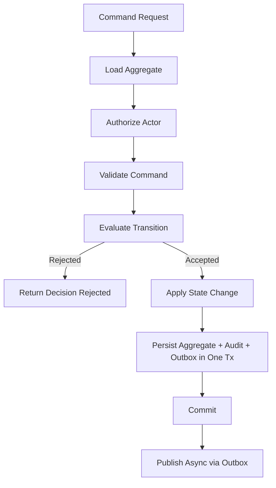
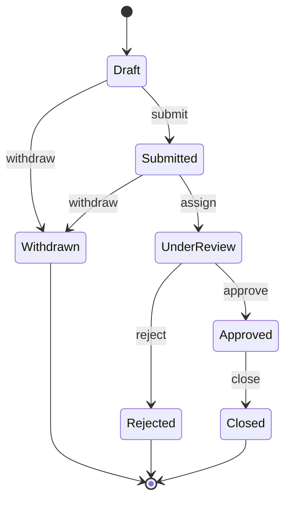
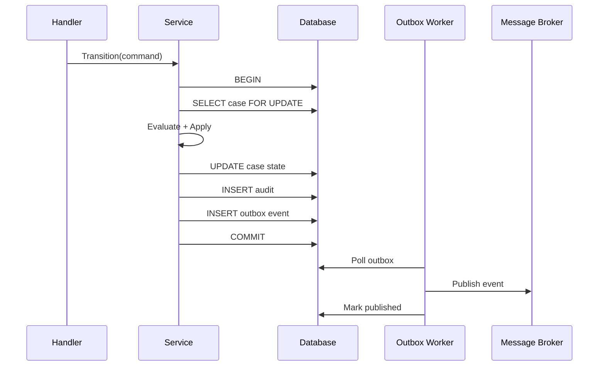
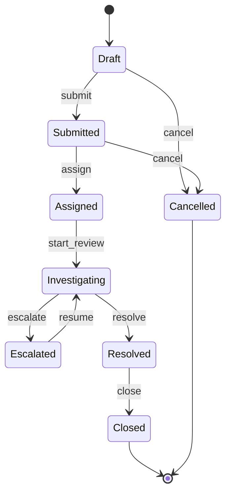

# learn-go-design-patterns-common-patterns-anti-patterns-part-020.md

# Part 020 — State Machine Pattern in Go

> Seri: **Go Design Patterns, Common Patterns, and Anti-Patterns**  
> Target pembaca: **Java software engineer yang ingin mendesain sistem Go production-grade**  
> Fokus: **explicit lifecycle, transition safety, guard, command/event, auditability, idempotency, transaction boundary, dan anti-pattern state mutation tersebar**  
> Baseline Go: **Go 1.26.x**

---

## 0. Posisi Part Ini Dalam Seri

Kita sudah membangun fondasi desain Go dari package boundary, API surface, interface placement, constructor, config, dependency wiring, adapter, repository, transaction boundary, service layer, handler, middleware, context, error translation, result/decision/policy, dan validation.

Part ini masuk ke salah satu pattern paling penting untuk sistem bisnis nyata: **state machine**.

Dalam banyak sistem enterprise/regulatory/case management, inti sistem bukan CRUD. Intinya adalah **lifecycle**:

- draft → submitted → under review → approved → issued
- open → assigned → investigated → escalated → closed
- pending payment → paid → reconciled → refunded
- scheduled → running → succeeded/failed → retried/dead-lettered
- active → suspended → revoked → expired

Kalau lifecycle ini hanya tersebar sebagai `if`, `switch`, flag boolean, dan update kolom `status` sembarangan, sistem akan cepat kehilangan sifat paling pentingnya: **dapat diprediksi**.

State machine pattern membantu membuat lifecycle menjadi:

- eksplisit,
- dapat dites,
- dapat diaudit,
- dapat dikontrol transaksinya,
- dapat diberi authorization,
- dapat diberi idempotency,
- dapat direview,
- dapat diobservasi,
- dan dapat dipertanggungjawabkan ketika terjadi dispute.

---

## 1. Tujuan Pembelajaran

Setelah menyelesaikan bagian ini, kamu harus mampu:

1. Mendesain state machine Go yang idiomatis tanpa framework berat.
2. Membedakan **state**, **transition**, **event**, **command**, **guard**, **effect**, dan **audit record**.
3. Menentukan apakah lifecycle cukup memakai switch sederhana, transition table, atau workflow engine.
4. Membuat illegal transition menjadi explicit domain decision, bukan bug tersembunyi.
5. Mendesain transition yang aman terhadap concurrency, retry, duplicate request, dan partial failure.
6. Mengintegrasikan state machine dengan repository, transaction boundary, authorization, validation, event/outbox, dan audit trail.
7. Menghindari anti-pattern seperti boolean lifecycle, scattered mutation, string state everywhere, side effect sebelum validasi, dan no idempotency.
8. Menulis test state machine secara sistematis memakai transition matrix dan property-oriented thinking.

---

## 2. Core Problem: CRUD Tidak Cukup Untuk Lifecycle

CRUD hanya menjawab:

- create data,
- read data,
- update data,
- delete data.

Tetapi lifecycle menjawab:

- operasi apa yang boleh dilakukan sekarang?
- siapa yang boleh melakukan operasi itu?
- apa precondition-nya?
- apa next state-nya?
- apa efek samping yang harus terjadi?
- apa yang harus diaudit?
- apakah request duplicate boleh dianggap sukses?
- apakah transition boleh diulang?
- apakah transition boleh di-retry?
- apakah state sudah berubah ketika event gagal dikirim?

Contoh buruk:

```go
func ApproveApplication(ctx context.Context, id string, user User) error {
    app, err := repo.Find(ctx, id)
    if err != nil {
        return err
    }

    if app.Status == "CLOSED" {
        return errors.New("cannot approve closed application")
    }

    app.Status = "APPROVED"
    app.ApprovedBy = user.ID
    app.ApprovedAt = time.Now()

    return repo.Save(ctx, app)
}
```

Masalahnya:

- `Status` string bebas typo.
- Rule illegal transition tidak lengkap.
- Tidak jelas previous state apa saja yang boleh approve.
- Tidak jelas apakah `REJECTED → APPROVED` legal.
- Tidak ada guard authorization/policy eksplisit.
- Tidak ada idempotency.
- Tidak ada audit transition.
- Tidak ada event.
- Tidak ada transaction boundary jelas.
- Tidak ada concurrency protection.
- Tidak ada reason code.
- Tidak ada domain decision trace.

CRUD membuat mutation mudah. State machine membuat mutation **terkendali**.

---

## 3. Mental Model: State Machine Sebagai Contract Lifecycle

State machine bukan sekadar enum status. State machine adalah kontrak:

```text
Given current state S
When command C is requested by actor A under context X
If guards G pass
Then transition to state S'
And produce decision D, audit record R, and effects E
Otherwise reject with explicit reason
```

Dalam bentuk Go:

```text
current aggregate + command + actor + clock + policy
        │
        ▼
transition evaluator
        │
        ├── accepted: next state + domain changes + audit + events
        └── rejected: reason codes + no mutation
```

Diagram:



State machine harus menjawab tiga pertanyaan:

1. **Can this happen?**  
   Apakah transition legal dari current state?

2. **Should this happen?**  
   Apakah guard/policy/authorization/context mengizinkan?

3. **What happens because of it?**  
   Apa state baru, audit, event, dan side effect?

---

## 4. Java Mindset vs Go Mindset

### 4.1 Java Mindset Yang Sering Terbawa

Java engineer sering mendesain state machine dengan:

- abstract base class per state,
- inheritance hierarchy,
- annotation-heavy workflow,
- reflection registry,
- enum dengan method besar,
- Spring StateMachine langsung dipakai walau rule sederhana,
- framework engine sebelum domain lifecycle dipahami,
- service layer yang mutasi status tanpa transition model.

Contoh gaya yang sering terlalu berat untuk Go:

```text
AbstractApplicationState
 ├── DraftState
 ├── SubmittedState
 ├── ApprovedState
 ├── RejectedState
 └── ClosedState
```

Lalu setiap state punya method override:

```text
approve()
reject()
withdraw()
close()
```

Model seperti ini bisa berguna dalam OOP tertentu, tetapi dalam Go sering menghasilkan:

- terlalu banyak file kecil,
- abstraction sebelum rule stabil,
- sulit melihat full transition matrix,
- banyak indirection,
- test menyebar,
- lifecycle sulit diaudit sebagai tabel.

### 4.2 Go Mindset

Go lebih cocok dengan:

- typed state constants,
- explicit command,
- explicit transition table atau switch,
- small pure evaluator,
- mutation terpisah dari evaluation,
- side effect keluar dari evaluator,
- repository transaction di application boundary,
- audit/outbox dalam transaction yang sama.

Go state machine sebaiknya mudah dibaca sebagai:

```go
CanTransition(from, command) -> bool/reason
ApplyTransition(aggregate, command) -> next aggregate + audit + events
```

Bukan sebagai framework magic.

---

## 5. Vocabulary Yang Harus Dibedakan

### 5.1 State

State adalah posisi lifecycle saat ini.

Contoh:

```go
type ApplicationState string

const (
    ApplicationStateDraft       ApplicationState = "draft"
    ApplicationStateSubmitted   ApplicationState = "submitted"
    ApplicationStateUnderReview ApplicationState = "under_review"
    ApplicationStateApproved    ApplicationState = "approved"
    ApplicationStateRejected    ApplicationState = "rejected"
    ApplicationStateWithdrawn   ApplicationState = "withdrawn"
    ApplicationStateClosed      ApplicationState = "closed"
)
```

State harus:

- finite,
- named clearly,
- punya semantic meaning,
- bukan sekadar UI label,
- bukan kumpulan boolean.

### 5.2 Command

Command adalah intent dari actor/sistem.

```go
type ApplicationCommand string

const (
    CommandSubmit   ApplicationCommand = "submit"
    CommandAssign   ApplicationCommand = "assign"
    CommandApprove  ApplicationCommand = "approve"
    CommandReject   ApplicationCommand = "reject"
    CommandWithdraw ApplicationCommand = "withdraw"
    CommandClose    ApplicationCommand = "close"
)
```

Command bukan event. Command adalah permintaan: “tolong lakukan X”.

### 5.3 Transition

Transition adalah perpindahan dari state lama ke state baru karena command/event tertentu.

```text
draft --submit--> submitted
submitted --assign--> under_review
under_review --approve--> approved
under_review --reject--> rejected
approved --close--> closed
```

### 5.4 Guard

Guard adalah precondition tambahan selain state.

Contoh:

- user punya role approver,
- semua mandatory document lengkap,
- no outstanding payment,
- current user bukan submitter,
- application not locked,
- deadline belum lewat,
- external risk check pass.

Guard menjawab: transition secara lifecycle mungkin legal, tetapi apakah dalam konteks ini boleh?

### 5.5 Effect

Effect adalah konsekuensi setelah transition diterima.

Contoh:

- update field `ApprovedAt`,
- create audit record,
- insert outbox event,
- send notification,
- schedule background job,
- invalidate cache.

Effect harus dipisah menjadi:

- **transactional effect**: harus commit bersama state.
- **external side effect**: tidak boleh terjadi sebelum commit; biasanya via outbox.

### 5.6 Event

Event adalah fakta bahwa sesuatu sudah terjadi.

```text
ApplicationSubmitted
ApplicationApproved
ApplicationRejected
```

Command: “Approve application.”  
Event: “Application was approved.”

### 5.7 Audit Record

Audit record adalah bukti durable untuk traceability.

Audit bukan log debug. Audit harus menjawab:

- siapa,
- kapan,
- dari state apa,
- ke state apa,
- command apa,
- reason apa,
- correlation id apa,
- decision/policy version apa,
- metadata penting apa.

---

## 6. Minimal State Machine Dalam Go

Untuk lifecycle kecil, switch eksplisit cukup baik.

```go
func NextState(from ApplicationState, cmd ApplicationCommand) (ApplicationState, bool) {
    switch from {
    case ApplicationStateDraft:
        switch cmd {
        case CommandSubmit, CommandWithdraw:
            if cmd == CommandSubmit {
                return ApplicationStateSubmitted, true
            }
            return ApplicationStateWithdrawn, true
        }
    case ApplicationStateSubmitted:
        switch cmd {
        case CommandAssign, CommandWithdraw:
            if cmd == CommandAssign {
                return ApplicationStateUnderReview, true
            }
            return ApplicationStateWithdrawn, true
        }
    case ApplicationStateUnderReview:
        switch cmd {
        case CommandApprove:
            return ApplicationStateApproved, true
        case CommandReject:
            return ApplicationStateRejected, true
        }
    case ApplicationStateApproved:
        if cmd == CommandClose {
            return ApplicationStateClosed, true
        }
    }

    return "", false
}
```

Ini sudah lebih baik daripada status mutation bebas, tetapi masih kurang:

- reason tidak jelas,
- guard tidak ada,
- metadata transition tidak ada,
- audit/event tidak terbentuk,
- idempotency belum dipikirkan.

---

## 7. Transition Table Pattern

Ketika state dan command mulai banyak, transition table membuat lifecycle lebih eksplisit.

```go
type TransitionKey struct {
    From    ApplicationState
    Command ApplicationCommand
}

type TransitionSpec struct {
    To          ApplicationState
    Name        string
    Description string
    Terminal    bool
}

var applicationTransitions = map[TransitionKey]TransitionSpec{
    {ApplicationStateDraft, CommandSubmit}: {
        To:          ApplicationStateSubmitted,
        Name:        "draft.submit",
        Description: "Submit draft application for review",
    },
    {ApplicationStateDraft, CommandWithdraw}: {
        To:          ApplicationStateWithdrawn,
        Name:        "draft.withdraw",
        Description: "Withdraw draft application",
        Terminal:    true,
    },
    {ApplicationStateSubmitted, CommandAssign}: {
        To:          ApplicationStateUnderReview,
        Name:        "submitted.assign",
        Description: "Assign submitted application for review",
    },
    {ApplicationStateUnderReview, CommandApprove}: {
        To:          ApplicationStateApproved,
        Name:        "under_review.approve",
        Description: "Approve reviewed application",
    },
    {ApplicationStateUnderReview, CommandReject}: {
        To:          ApplicationStateRejected,
        Name:        "under_review.reject",
        Description: "Reject reviewed application",
        Terminal:    true,
    },
    {ApplicationStateApproved, CommandClose}: {
        To:          ApplicationStateClosed,
        Name:        "approved.close",
        Description: "Close approved application lifecycle",
        Terminal:    true,
    },
}
```

Evaluator:

```go
func LookupTransition(from ApplicationState, cmd ApplicationCommand) (TransitionSpec, bool) {
    spec, ok := applicationTransitions[TransitionKey{From: from, Command: cmd}]
    return spec, ok
}
```

Keunggulan:

- full lifecycle terlihat sebagai data,
- mudah dibuat matrix test,
- mudah didokumentasikan,
- mudah diaudit,
- mudah dicek completeness,
- lebih mudah menghasilkan diagram.

Trade-off:

- table terlalu besar bisa sulit membaca behavior detail,
- guard yang kompleks tidak cocok dimasukkan semua ke table,
- mutation/effect tetap harus dikontrol di code.

---

## 8. Diagram Transition Table

Contoh lifecycle application:



Diagram ini bukan dokumentasi tambahan saja. Dalam sistem production, diagram harus selaras dengan transition table/code. Kalau diagram dan code berbeda, diagram menjadi liability.

---

## 9. Domain Types Untuk State Machine

### 9.1 State Type

```go
type CaseState string

const (
    CaseStateDraft         CaseState = "draft"
    CaseStateSubmitted     CaseState = "submitted"
    CaseStateAssigned      CaseState = "assigned"
    CaseStateInvestigating CaseState = "investigating"
    CaseStateEscalated     CaseState = "escalated"
    CaseStateResolved      CaseState = "resolved"
    CaseStateClosed        CaseState = "closed"
    CaseStateCancelled     CaseState = "cancelled"
)

func (s CaseState) IsTerminal() bool {
    switch s {
    case CaseStateClosed, CaseStateCancelled:
        return true
    default:
        return false
    }
}

func (s CaseState) Valid() bool {
    switch s {
    case CaseStateDraft,
        CaseStateSubmitted,
        CaseStateAssigned,
        CaseStateInvestigating,
        CaseStateEscalated,
        CaseStateResolved,
        CaseStateClosed,
        CaseStateCancelled:
        return true
    default:
        return false
    }
}
```

### 9.2 Command Type

```go
type CaseCommand string

const (
    CaseCommandSubmit       CaseCommand = "submit"
    CaseCommandAssign       CaseCommand = "assign"
    CaseCommandStartReview  CaseCommand = "start_review"
    CaseCommandEscalate     CaseCommand = "escalate"
    CaseCommandResolve      CaseCommand = "resolve"
    CaseCommandClose        CaseCommand = "close"
    CaseCommandCancel       CaseCommand = "cancel"
)
```

### 9.3 Transition Result

Jangan hanya return `(state, error)` kalau rejection adalah business decision yang valid.

```go
type TransitionDecision struct {
    Accepted bool
    From     CaseState
    To       CaseState
    Command  CaseCommand
    Reasons  []DecisionReason
}

type DecisionReason struct {
    Code    string
    Message string
    Field   string
}
```

### 9.4 Transition Request

```go
type TransitionRequest struct {
    CaseID       string
    Command      CaseCommand
    ActorID      string
    ActorRoles   []string
    Reason       string
    IdempotencyKey string
    OccurredAt   time.Time
    CorrelationID string
}
```

Ingat: `OccurredAt` sebaiknya berasal dari clock dependency, bukan `time.Now()` tersebar.

---

## 10. Pure Evaluator Pattern

Evaluator sebaiknya pure sejauh mungkin:

- tidak akses DB,
- tidak kirim HTTP,
- tidak publish Kafka,
- tidak mutate global state,
- tidak membaca env,
- tidak generate random secara tersembunyi,
- tidak memanggil `time.Now()` langsung kalau butuh deterministic test.

Contoh:

```go
type Case struct {
    ID          string
    State       CaseState
    AssigneeID  string
    CreatedBy   string
    UpdatedAt   time.Time
    Version     int64
}

type TransitionContext struct {
    ActorID    string
    ActorRoles map[string]bool
    Now        time.Time
    Reason     string
}

func EvaluateCaseTransition(c Case, cmd CaseCommand, tc TransitionContext) TransitionDecision {
    if !c.State.Valid() {
        return reject(c.State, "", cmd, "invalid_current_state", "Current state is invalid")
    }

    if c.State.IsTerminal() {
        return reject(c.State, "", cmd, "terminal_state", "Case is already terminal")
    }

    spec, ok := lookupCaseTransition(c.State, cmd)
    if !ok {
        return reject(c.State, "", cmd, "illegal_transition", "Command is not allowed from current state")
    }

    if reason := guardCaseTransition(c, spec, tc); reason != nil {
        return TransitionDecision{
            Accepted: false,
            From:     c.State,
            To:       spec.To,
            Command:  cmd,
            Reasons:  []DecisionReason{*reason},
        }
    }

    return TransitionDecision{
        Accepted: true,
        From:     c.State,
        To:       spec.To,
        Command:  cmd,
    }
}
```

Helper:

```go
func reject(from CaseState, to CaseState, cmd CaseCommand, code, message string) TransitionDecision {
    return TransitionDecision{
        Accepted: false,
        From:     from,
        To:       to,
        Command:  cmd,
        Reasons: []DecisionReason{{
            Code:    code,
            Message: message,
        }},
    }
}
```

Keuntungan pure evaluator:

- unit test cepat,
- deterministic,
- mudah fuzz/property test,
- mudah review,
- mudah dipakai ulang di HTTP/worker/CLI,
- efek samping bisa dikontrol di application service.

---

## 11. Guard Pattern

Transition legality dan guard harus dibedakan.

Legal transition:

```text
assigned --start_review--> investigating
```

Guard:

```text
Hanya assignee atau supervisor yang boleh start review.
```

Contoh:

```go
type CaseTransitionSpec struct {
    To       CaseState
    Name     string
    RequiredRole string
    RequiresAssignee bool
}

func guardCaseTransition(c Case, spec CaseTransitionSpec, tc TransitionContext) *DecisionReason {
    if spec.RequiredRole != "" && !tc.ActorRoles[spec.RequiredRole] {
        return &DecisionReason{
            Code:    "missing_role",
            Message: "Actor does not have required role",
        }
    }

    if spec.RequiresAssignee && c.AssigneeID != tc.ActorID && !tc.ActorRoles["supervisor"] {
        return &DecisionReason{
            Code:    "not_assignee",
            Message: "Only assignee or supervisor may perform this transition",
        }
    }

    return nil
}
```

Guard harus menghasilkan **reason code**, bukan hanya boolean.

Boolean membuat caller tahu “tidak boleh”, tetapi tidak tahu “kenapa”. Dalam sistem real, reason dibutuhkan untuk:

- response API,
- UI message,
- audit,
- support investigation,
- policy review,
- compliance evidence,
- debugging.

---

## 12. Apply Pattern: Evaluation Terpisah Dari Mutation

Evaluator hanya memutuskan. Mutation dilakukan setelah accepted.

```go
type AppliedTransition struct {
    Case   Case
    Audit  TransitionAudit
    Events []DomainEvent
}

func ApplyCaseTransition(c Case, cmd CaseCommand, tc TransitionContext) (AppliedTransition, TransitionDecision) {
    decision := EvaluateCaseTransition(c, cmd, tc)
    if !decision.Accepted {
        return AppliedTransition{}, decision
    }

    next := c
    next.State = decision.To
    next.UpdatedAt = tc.Now
    next.Version++

    switch cmd {
    case CaseCommandAssign:
        // assignment field should already be validated in command-level validation
    case CaseCommandClose:
        // set closed fields if the aggregate has them
    }

    audit := TransitionAudit{
        EntityID:      c.ID,
        EntityType:    "case",
        Command:       string(cmd),
        FromState:     string(decision.From),
        ToState:       string(decision.To),
        ActorID:       tc.ActorID,
        Reason:        tc.Reason,
        OccurredAt:    tc.Now,
        CorrelationID: tcCorrelationID(tc),
    }

    events := []DomainEvent{{
        Type:        eventTypeForCaseTransition(cmd),
        AggregateID: c.ID,
        OccurredAt:  tc.Now,
    }}

    return AppliedTransition{
        Case:   next,
        Audit:  audit,
        Events: events,
    }, decision
}
```

Kenapa dipisah?

- Rejection tidak boleh mutate aggregate.
- Evaluation bisa dites tanpa persistence.
- Mutation bisa dicek sebagai effect dari accepted decision.
- Audit/event bisa dibuat secara konsisten.

---

## 13. Application Service Pattern Untuk Transition

State machine biasanya dipanggil dari use case/application service.

```go
type CaseService struct {
    tx       TxRunner
    cases    CaseRepository
    audits   AuditRepository
    outbox   OutboxRepository
    authz    Authorizer
    clock    Clock
}

func (s *CaseService) Transition(ctx context.Context, req TransitionRequest) (TransitionDecision, error) {
    if err := req.Validate(); err != nil {
        return TransitionDecision{}, err
    }

    actor, err := s.authz.ActorFromContext(ctx)
    if err != nil {
        return TransitionDecision{}, err
    }

    now := s.clock.Now()

    var decision TransitionDecision

    err = s.tx.WithinTx(ctx, func(ctx context.Context, tx Tx) error {
        c, err := s.cases.GetForUpdate(ctx, tx, req.CaseID)
        if err != nil {
            return translateRepoErr(err)
        }

        tc := TransitionContext{
            ActorID:    actor.ID,
            ActorRoles: actor.RoleSet(),
            Now:        now,
            Reason:     req.Reason,
        }

        applied, d := ApplyCaseTransition(c, req.Command, tc)
        decision = d

        if !d.Accepted {
            return nil
        }

        if err := s.cases.Save(ctx, tx, applied.Case); err != nil {
            return translateRepoErr(err)
        }

        if err := s.audits.Insert(ctx, tx, applied.Audit); err != nil {
            return translateRepoErr(err)
        }

        for _, ev := range applied.Events {
            if err := s.outbox.Insert(ctx, tx, OutboxMessageFromEvent(ev)); err != nil {
                return translateRepoErr(err)
            }
        }

        return nil
    })
    if err != nil {
        return TransitionDecision{}, err
    }

    return decision, nil
}
```

Catatan penting:

- `GetForUpdate` atau optimistic locking harus mencegah lost update.
- Audit dan outbox disimpan dalam transaction yang sama dengan state update.
- External publish/send email tidak dilakukan di dalam transaction.
- Rejected decision bisa return tanpa error jika rejection adalah business result.

---

## 14. Transaction Boundary Untuk State Machine

Transition state adalah operasi consistency-critical.

Idealnya satu transaction mencakup:

1. read aggregate current state,
2. check idempotency record bila ada,
3. evaluate transition,
4. update aggregate,
5. insert audit record,
6. insert outbox event,
7. store idempotency result,
8. commit.

Diagram:



Kenapa external side effect tidak boleh sebelum commit?

Misalnya email approval dikirim sebelum commit, lalu commit gagal. Dunia luar melihat aplikasi approved, tetapi database tetap under_review. Ini menghasilkan split-brain business reality.

---

## 15. Concurrency Control: Lost Update dan Race Transition

Masalah klasik:

```text
T1 reads case state = under_review
T2 reads case state = under_review
T1 approves → approved
T2 rejects → rejected
```

Tanpa concurrency control, hasil akhir tergantung last write wins.

Ada dua pendekatan umum.

### 15.1 Pessimistic Locking

Repository menyediakan `GetForUpdate`.

```sql
SELECT * FROM cases WHERE id = ? FOR UPDATE
```

Cocok jika:

- conflict sering,
- transition critical,
- state row kecil,
- transaction pendek,
- database mendukung lock semantics jelas.

Risiko:

- lock wait,
- deadlock,
- throughput turun jika transaction panjang,
- tidak boleh ada network call saat lock dipegang.

### 15.2 Optimistic Locking

Aggregate punya version.

```sql
UPDATE cases
SET state = ?, version = version + 1, updated_at = ?
WHERE id = ? AND version = ?
```

Jika affected rows = 0, berarti conflict.

Cocok jika:

- conflict jarang,
- ingin throughput lebih tinggi,
- transition bisa di-retry dari fresh state.

Di Go:

```go
func (r *CaseRepo) SaveWithVersion(ctx context.Context, tx Tx, c Case, expectedVersion int64) error {
    res, err := tx.ExecContext(ctx, `
        UPDATE cases
        SET state = ?, version = ?, updated_at = ?
        WHERE id = ? AND version = ?
    `, c.State, c.Version, c.UpdatedAt, c.ID, expectedVersion)
    if err != nil {
        return err
    }

    rows, err := res.RowsAffected()
    if err != nil {
        return err
    }
    if rows == 0 {
        return ErrConcurrentModification
    }
    return nil
}
```

Concurrency conflict bukan sekadar technical error. Dalam state machine, conflict bisa berarti command harus dievaluasi ulang terhadap state terbaru.

---

## 16. Idempotency Untuk Transition

Transition sering dipanggil melalui HTTP, queue, retry worker, atau external integration. Duplicate request normal terjadi.

Tanpa idempotency:

- approval bisa dobel,
- audit dobel,
- event dobel,
- notification dobel,
- state version naik berkali-kali,
- user melihat hasil tidak konsisten.

### 16.1 Idempotency Key

Command mutasi sebaiknya punya idempotency key.

```go
type TransitionRequest struct {
    CaseID         string
    Command        CaseCommand
    ActorID        string
    IdempotencyKey string
    Reason         string
}
```

Idempotency record:

```go
type IdempotencyRecord struct {
    Key         string
    Scope       string
    RequestHash string
    Status      string
    ResultJSON  []byte
    CreatedAt   time.Time
}
```

Scope bisa:

```text
case:{caseID}:command:{command}:actor:{actorID}
```

### 16.2 Repeated Same Request

Jika idempotency key sama dan request hash sama:

- return previous decision/result.

Jika key sama tapi request hash beda:

- reject as conflict.

### 16.3 Natural Idempotency

Beberapa transition bisa natural idempotent:

```text
approve approved case by same command id -> return accepted previous result
approve rejected case -> reject illegal transition
```

Tetapi jangan mengandalkan natural idempotency tanpa audit/event design yang jelas.

---

## 17. Illegal Transition: Error Atau Decision?

Pertanyaan penting: illegal transition dikembalikan sebagai `error` atau `TransitionDecision{Accepted:false}`?

Jawabannya tergantung konteks.

### 17.1 Illegal Transition Sebagai Business Rejection

Jika user/system bisa secara normal meminta operasi yang tidak boleh karena state:

```text
User tries to approve already closed case.
```

Maka ini cocok menjadi decision rejection:

```go
TransitionDecision{
    Accepted: false,
    From: CaseStateClosed,
    Command: CaseCommandApprove,
    Reasons: []DecisionReason{{Code: "terminal_state"}},
}
```

### 17.2 Illegal Transition Sebagai Error

Jika illegal transition disebabkan oleh bug internal:

- transition table corrupt,
- unknown state dari DB,
- command tidak pernah boleh sampai service,
- invariant storage rusak,

maka return error.

Rule praktis:

```text
Expected business outcome -> decision
Unexpected system failure -> error
```

---

## 18. State Machine dan Authorization

Authorization bukan state machine, tetapi state machine harus sadar authorization boundary.

Ada tiga level:

1. **Transport-level auth**: apakah request authenticated?
2. **Use-case auth**: apakah actor boleh menjalankan command ini secara umum?
3. **State/aggregate-level auth**: apakah actor boleh menjalankan command ini pada entity ini dalam state ini?

Contoh:

```go
func guardCaseTransition(c Case, spec CaseTransitionSpec, tc TransitionContext) *DecisionReason {
    if spec.RequiredRole != "" && !tc.ActorRoles[spec.RequiredRole] {
        return &DecisionReason{Code: "missing_role"}
    }

    if spec.RequiresAssignee && c.AssigneeID != tc.ActorID && !tc.ActorRoles["supervisor"] {
        return &DecisionReason{Code: "not_assignee"}
    }

    if c.CreatedBy == tc.ActorID && spec.Name == "under_review.approve" {
        return &DecisionReason{Code: "submitter_cannot_approve"}
    }

    return nil
}
```

Jangan taruh authorization hanya di HTTP middleware, karena worker/CLI/internal API bisa memanggil use case yang sama.

---

## 19. State Machine dan Validation

Validation tetap perlu dipisah:

```text
request validation -> command shape valid?
domain validation -> aggregate invariant valid?
transition validation -> state command legal?
policy validation -> rule contextual pass?
persistence validation -> unique/constraint pass?
```

Contoh:

- `reason` wajib saat reject → command validation.
- `under_review → approve` legal → transition validation.
- all mandatory documents complete → guard/domain policy.
- duplicate certificate number → persistence constraint.

Jangan memasukkan semua rule ke satu fungsi `Validate()` tanpa taxonomy.

---

## 20. State Machine dan Audit Trail

Untuk sistem regulatory/enterprise, state transition tanpa audit adalah desain lemah.

Audit minimum:

```go
type TransitionAudit struct {
    ID            string
    EntityType    string
    EntityID      string
    Command       string
    FromState     string
    ToState       string
    Accepted      bool
    ReasonCode    string
    ReasonText    string
    ActorID       string
    ActorRoles    []string
    CorrelationID string
    IdempotencyKey string
    OccurredAt    time.Time
    PolicyVersion string
    Metadata      map[string]string
}
```

Pertanyaan audit yang harus bisa dijawab:

- Siapa yang melakukan transition?
- Dari state apa ke state apa?
- Command apa yang diminta?
- Apakah diterima atau ditolak?
- Jika ditolak, kenapa?
- Rule/policy versi apa yang berlaku?
- Apakah request duplicate?
- Correlation id-nya apa?
- Apakah event dikirim setelah commit?

Audit harus durable. Log tidak cukup.

---

## 21. State Machine dan Event/Outbox

Transition sering menghasilkan domain event.

```go
type DomainEvent struct {
    Type        string
    AggregateID string
    Version     int64
    OccurredAt  time.Time
    Payload     []byte
}
```

Contoh event:

```text
CaseSubmitted
CaseAssigned
CaseEscalated
CaseResolved
CaseClosed
```

Event harus dibuat setelah transition accepted, tetapi publish eksternal sebaiknya lewat outbox.

```go
func eventTypeForCaseTransition(cmd CaseCommand) string {
    switch cmd {
    case CaseCommandSubmit:
        return "case.submitted"
    case CaseCommandAssign:
        return "case.assigned"
    case CaseCommandEscalate:
        return "case.escalated"
    case CaseCommandResolve:
        return "case.resolved"
    case CaseCommandClose:
        return "case.closed"
    default:
        return "case.transitioned"
    }
}
```

Anti-pattern: publish event langsung dari evaluator.

Evaluator harus pure. Application service/outbox yang mengatur persistence effect.

---

## 22. State Machine dan Observability

State transition adalah event bisnis penting. Observability harus didesain sejak awal.

Metric berguna:

- transition attempted count,
- transition accepted count,
- transition rejected count,
- rejection by reason code,
- transition latency,
- concurrency conflict count,
- idempotency replay count,
- outbox lag,
- audit insert failure count.

Log berguna:

```json
{
  "event": "case.transition",
  "case_id": "CASE-123",
  "command": "approve",
  "from_state": "under_review",
  "to_state": "approved",
  "accepted": true,
  "actor_id": "u-42",
  "correlation_id": "req-abc"
}
```

Tracing:

```text
HTTP request span
  └── service transition span
      ├── db load aggregate
      ├── evaluate transition
      ├── db update aggregate
      ├── db insert audit
      └── db insert outbox
```

Jangan masukkan data sensitif ke log/metric label.

---

## 23. State Machine Implementation Shapes

Ada beberapa bentuk implementasi yang valid.

### 23.1 Switch-Based State Machine

Cocok untuk:

- lifecycle kecil,
- sedikit command,
- rule simple,
- ingin readability tinggi.

Kelebihan:

- sederhana,
- no indirection,
- mudah debug.

Kekurangan:

- matrix sulit dilihat jika besar,
- dokumentasi transition perlu manual,
- test completeness lebih sulit.

### 23.2 Table-Based State Machine

Cocok untuk:

- banyak state/command,
- ingin matrix test,
- ingin generate diagram/docs,
- transition metadata penting.

Kelebihan:

- explicit lifecycle as data,
- mudah inspect,
- mudah test legal/illegal.

Kekurangan:

- guard/effect tetap perlu code,
- table bisa besar,
- bisa menjadi data-driven terlalu jauh.

### 23.3 Method-Based Aggregate

Contoh:

```go
func (c Case) Approve(ctx TransitionContext) (Case, TransitionDecision) {
    return applyApprove(c, ctx)
}
```

Cocok jika:

- command sedikit,
- behavior kuat melekat ke aggregate,
- domain model ingin rich behavior.

Risiko:

- method aggregate terlalu gemuk,
- dependency masuk ke entity,
- side effect menyusup.

### 23.4 Workflow Engine

Cocok jika:

- lifecycle sangat dynamic,
- long-running workflow,
- human task orchestration,
- external callbacks,
- timer/saga complex,
- non-developer mengubah rule,
- audit/work item engine besar.

Tetapi workflow engine jangan dipakai hanya karena ada status field.

Rule praktis:

```text
If lifecycle fits in a readable transition table, start there.
If lifecycle needs durable timers, human tasks, compensation, and visual operations, consider workflow engine.
```

---

## 24. Terminal State Pattern

Terminal state adalah state akhir yang tidak boleh berubah lagi, kecuali ada explicit reopen/reversal policy.

```go
func (s CaseState) IsTerminal() bool {
    switch s {
    case CaseStateClosed, CaseStateCancelled:
        return true
    default:
        return false
    }
}
```

Anti-pattern:

```go
if c.State == "closed" && force {
    c.State = "open"
}
```

Jika reopen dibutuhkan, modelkan sebagai transition eksplisit:

```text
closed --reopen--> investigating
```

Dengan guard/audit/reason yang kuat.

---

## 25. Reversal dan Correction Pattern

Di sistem nyata, kadang keputusan perlu dikoreksi.

Jangan diam-diam update state balik.

Buruk:

```sql
UPDATE cases SET state = 'under_review' WHERE id = ?
```

Lebih baik:

```text
approved --revoke_approval--> under_review
rejected --appeal_accepted--> under_review
closed --reopen--> investigating
```

Reversal harus punya:

- command khusus,
- role khusus,
- reason wajib,
- audit kuat,
- event khusus,
- policy version,
- mungkin link ke previous decision.

---

## 26. Hierarchical State dan Substate

Kadang satu state terlalu kasar.

Contoh:

```text
under_review
  ├── screening
  ├── document_check
  ├── risk_assessment
  └── final_review
```

Pilihan desain:

### 26.1 Flat State

```text
submitted
screening
checking_documents
risk_assessment
final_review
approved
```

Kelebihan:

- simple query,
- transition jelas.

Kekurangan:

- jumlah state banyak,
- common rule under_review harus diulang.

### 26.2 State + Substate

```go
type Case struct {
    State    CaseState
    Substate CaseSubstate
}
```

Kelebihan:

- high-level lifecycle tetap jelas,
- detail workflow bisa dipisah.

Kekurangan:

- invariant kombinasi harus kuat,
- illegal pair harus dicegah,
- transition matrix jadi dua dimensi.

### 26.3 Separate Child Workflow

Jika subworkflow cukup kompleks, pisahkan entity.

```text
Case
 └── ReviewWorkflow
      ├── screening
      ├── document_check
      └── risk_assessment
```

Gunakan ketika subworkflow punya assignee, deadline, audit, dan event sendiri.

---

## 27. Boolean Flag Anti-Pattern

Buruk:

```go
type Application struct {
    IsSubmitted bool
    IsApproved  bool
    IsRejected  bool
    IsClosed    bool
}
```

Masalah:

- kombinasi invalid mudah terjadi,
- `IsApproved && IsRejected` mungkin muncul,
- lifecycle tidak eksplisit,
- query membingungkan,
- transition sulit diaudit.

Lebih baik:

```go
type Application struct {
    State ApplicationState
}
```

Boolean masih boleh untuk aspek orthogonal, bukan lifecycle utama.

Contoh valid:

```go
type Case struct {
    State      CaseState
    IsLocked   bool
    IsArchived bool
}
```

Tapi `IsLocked` dan `IsArchived` harus punya rule sendiri.

---

## 28. String State Everywhere Anti-Pattern

Buruk:

```go
if app.Status == "APPROVED" {
    // ...
}
```

Lebih baik:

```go
if app.State == ApplicationStateApproved {
    // ...
}
```

Lebih baik lagi jika behavior dibungkus:

```go
if app.State.IsTerminal() {
    // ...
}
```

Typed constants tidak membuat Go menjadi nominal enum penuh, tetapi sangat membantu:

- autocomplete,
- grepability,
- consistency,
- valid function,
- method behavior,
- safer API.

---

## 29. Side Effect Before Validation Anti-Pattern

Buruk:

```go
func Approve(ctx context.Context, id string) error {
    sendApprovalEmail(id)

    app, err := repo.Get(ctx, id)
    if err != nil {
        return err
    }
    if app.State != UnderReview {
        return ErrIllegalTransition
    }
    app.State = Approved
    return repo.Save(ctx, app)
}
```

Masalah:

- email dikirim sebelum transition valid,
- side effect terjadi walau DB gagal,
- tidak idempotent,
- tidak transactional.

Urutan yang benar:

1. validate command,
2. load aggregate,
3. evaluate transition,
4. persist state/audit/outbox in transaction,
5. external publish/send asynchronously after commit.

---

## 30. State Mutation Scattered Anti-Pattern

Buruk:

```go
// in handler
app.Status = "approved"

// in cron
app.Status = "closed"

// in repository
if expired {
    app.Status = "expired"
}

// in external callback
app.Status = payload.Status
```

Masalah:

- tidak ada satu tempat memahami lifecycle,
- illegal transition mudah lolos,
- audit tidak konsisten,
- event tidak konsisten,
- sulit test.

Solusi:

- semua lifecycle mutation harus melewati transition function/use case,
- repository tidak boleh diam-diam mengubah lifecycle,
- external callback diterjemahkan menjadi command/event internal,
- cron/worker juga memanggil use case yang sama.

---

## 31. Repository State Mutation Anti-Pattern

Repository seharusnya menyimpan/mengambil data, bukan memutuskan lifecycle.

Buruk:

```go
func (r *Repo) Approve(ctx context.Context, id string) error {
    _, err := r.db.ExecContext(ctx, `UPDATE cases SET state = 'approved' WHERE id = ?`, id)
    return err
}
```

Lebih baik:

```go
func (r *Repo) SaveTransition(ctx context.Context, tx Tx, c Case, audit TransitionAudit, events []OutboxMessage) error {
    // persistence only
}
```

Atau repository tetap granular, tetapi service yang orchestrate:

```go
cases.Save(ctx, tx, applied.Case)
audits.Insert(ctx, tx, applied.Audit)
outbox.Insert(ctx, tx, event)
```

Repository boleh menyediakan optimized conditional update, tetapi lifecycle decision tetap di domain/application layer.

---

## 32. Transition Matrix Test Pattern

State machine harus punya test matrix.

```go
func TestCaseTransitionMatrix(t *testing.T) {
    tests := []struct {
        name     string
        from     CaseState
        command  CaseCommand
        wantTo   CaseState
        accepted bool
    }{
        {"draft_submit", CaseStateDraft, CaseCommandSubmit, CaseStateSubmitted, true},
        {"draft_close_rejected", CaseStateDraft, CaseCommandClose, "", false},
        {"submitted_assign", CaseStateSubmitted, CaseCommandAssign, CaseStateAssigned, true},
        {"closed_submit_rejected", CaseStateClosed, CaseCommandSubmit, "", false},
    }

    for _, tt := range tests {
        t.Run(tt.name, func(t *testing.T) {
            c := Case{ID: "case-1", State: tt.from}
            d := EvaluateCaseTransition(c, tt.command, TransitionContext{
                ActorID: "u-1",
                ActorRoles: map[string]bool{"officer": true, "supervisor": true},
                Now: time.Unix(100, 0),
            })

            if d.Accepted != tt.accepted {
                t.Fatalf("accepted = %v, want %v", d.Accepted, tt.accepted)
            }
            if tt.accepted && d.To != tt.wantTo {
                t.Fatalf("to = %s, want %s", d.To, tt.wantTo)
            }
        })
    }
}
```

### 32.1 Completeness Test

Pastikan semua state valid ada di test.

```go
func allCaseStates() []CaseState {
    return []CaseState{
        CaseStateDraft,
        CaseStateSubmitted,
        CaseStateAssigned,
        CaseStateInvestigating,
        CaseStateEscalated,
        CaseStateResolved,
        CaseStateClosed,
        CaseStateCancelled,
    }
}
```

Test:

```go
func TestAllStatesAreValid(t *testing.T) {
    for _, s := range allCaseStates() {
        if !s.Valid() {
            t.Fatalf("state %q should be valid", s)
        }
    }
}
```

### 32.2 Terminal State Test

```go
func TestTerminalStatesRejectNormalCommands(t *testing.T) {
    terminalStates := []CaseState{CaseStateClosed, CaseStateCancelled}
    commands := []CaseCommand{
        CaseCommandSubmit,
        CaseCommandAssign,
        CaseCommandResolve,
        CaseCommandClose,
    }

    for _, state := range terminalStates {
        for _, cmd := range commands {
            t.Run(string(state)+"_"+string(cmd), func(t *testing.T) {
                d := EvaluateCaseTransition(Case{State: state}, cmd, TransitionContext{})
                if d.Accepted {
                    t.Fatalf("expected rejection for terminal state %s command %s", state, cmd)
                }
            })
        }
    }
}
```

---

## 33. Property-Oriented Invariants

State machine cocok untuk invariant tests.

Contoh invariant:

- terminal state tidak berubah oleh command normal,
- accepted decision selalu punya non-empty `To`,
- rejected decision tidak mengubah aggregate,
- transition from/to tidak sama kecuali explicit no-op/idempotent transition,
- audit from/to sama dengan decision,
- event only produced if accepted,
- version increment only if accepted.

Contoh:

```go
func TestRejectedTransitionDoesNotMutateCase(t *testing.T) {
    original := Case{
        ID:        "case-1",
        State:     CaseStateClosed,
        Version:   3,
        UpdatedAt: time.Unix(10, 0),
    }

    applied, decision := ApplyCaseTransition(original, CaseCommandAssign, TransitionContext{
        ActorID: "u-1",
        Now:     time.Unix(20, 0),
    })

    if decision.Accepted {
        t.Fatal("expected rejected decision")
    }
    if applied.Case != (Case{}) {
        t.Fatalf("rejected transition should not return applied case: %+v", applied.Case)
    }
}
```

---

## 34. Persistence Model

Relational schema minimal:

```sql
CREATE TABLE cases (
    id           VARCHAR(64) PRIMARY KEY,
    state        VARCHAR(64) NOT NULL,
    assignee_id  VARCHAR(64),
    created_by   VARCHAR(64) NOT NULL,
    version      BIGINT NOT NULL,
    created_at   TIMESTAMP NOT NULL,
    updated_at   TIMESTAMP NOT NULL
);

CREATE TABLE case_transition_audit (
    id              VARCHAR(64) PRIMARY KEY,
    case_id         VARCHAR(64) NOT NULL,
    command         VARCHAR(64) NOT NULL,
    from_state      VARCHAR(64) NOT NULL,
    to_state        VARCHAR(64),
    accepted        BOOLEAN NOT NULL,
    reason_code     VARCHAR(128),
    reason_text     TEXT,
    actor_id        VARCHAR(64) NOT NULL,
    correlation_id  VARCHAR(128),
    idempotency_key VARCHAR(128),
    occurred_at     TIMESTAMP NOT NULL
);

CREATE TABLE outbox_messages (
    id             VARCHAR(64) PRIMARY KEY,
    aggregate_type VARCHAR(64) NOT NULL,
    aggregate_id   VARCHAR(64) NOT NULL,
    event_type     VARCHAR(128) NOT NULL,
    payload        JSON NOT NULL,
    occurred_at    TIMESTAMP NOT NULL,
    published_at   TIMESTAMP NULL
);
```

Index penting:

```sql
CREATE INDEX idx_cases_state ON cases(state);
CREATE INDEX idx_case_audit_case_id_occurred_at ON case_transition_audit(case_id, occurred_at);
CREATE INDEX idx_outbox_unpublished ON outbox_messages(published_at, occurred_at);
```

Untuk audit besar, desain storage harus mempertimbangkan:

- retention,
- partitioning,
- immutable record,
- PII redaction,
- query pattern,
- export/reporting,
- compliance hold.

---

## 35. API Mapping

HTTP request:

```http
POST /cases/{id}/transitions
Content-Type: application/json
Idempotency-Key: abc-123

{
  "command": "approve",
  "reason": "All requirements satisfied"
}
```

HTTP response accepted:

```json
{
  "accepted": true,
  "from_state": "under_review",
  "to_state": "approved",
  "command": "approve"
}
```

HTTP response rejected:

```json
{
  "accepted": false,
  "from_state": "closed",
  "command": "approve",
  "reasons": [
    {
      "code": "terminal_state",
      "message": "Case is already terminal"
    }
  ]
}
```

Status code mapping:

- `200 OK` for accepted/rejected business decision if endpoint returns decision object.
- `409 Conflict` for state conflict/concurrent modification/idempotency request mismatch.
- `400 Bad Request` for malformed command.
- `401/403` for authentication/authorization failure.
- `404` for entity not found if caller is allowed to know.
- `500/503` for system failure.

Tidak semua business rejection harus HTTP error. Untuk workflow-heavy API, returning decision object often gives better UX and auditability.

---

## 36. Naming Pattern

Gunakan nama yang menyatakan domain intent:

Baik:

```go
SubmitApplication
ApproveApplication
RejectApplication
EscalateCase
CloseCase
```

Kurang baik:

```go
UpdateStatus
ChangeState
SetState
PatchApplication
ModifyCase
```

Kenapa?

- `UpdateStatus` tidak menjelaskan business intent.
- `SetState` membuka peluang bypass transition rule.
- Command name harus meaningful untuk audit/event.

Di repository, hindari method yang terdengar domain decision jika hanya persistence.

Lebih baik:

```go
Save(ctx, tx, c)
GetForUpdate(ctx, tx, id)
InsertAudit(ctx, tx, audit)
```

Daripada:

```go
Approve(ctx, id)
Reject(ctx, id)
```

Kecuali repository memang sengaja menyediakan atomic conditional update dengan semantics jelas.

---

## 37. Package Layout Contoh

Satu contoh layout:

```text
internal/caseapp/
  service.go              # application use cases
  transition.go           # transition request/result orchestration

internal/caseapp/casestate/
  state.go                # state constants
  command.go              # command constants
  transition_table.go     # transition specs
  evaluator.go            # pure transition evaluator
  apply.go                # apply accepted transition
  audit.go                # audit model
  event.go                # domain event model

internal/caseapp/caserepo/
  repository.go           # persistence implementation
  mapper.go

internal/caseapp/casehttp/
  handler.go              # HTTP adapter
  dto.go
```

Alternatif vertical slice:

```text
internal/cases/
  state.go
  command.go
  transition.go
  service.go
  repository.go
  http.go
```

Pilihan tergantung ukuran. Untuk lifecycle kompleks, subpackage `casestate` bisa membantu menjaga evaluator tetap fokus.

---

## 38. Review Checklist

Gunakan checklist ini saat review state machine code:

1. Apakah semua state didefinisikan sebagai typed constants?
2. Apakah semua command punya nama domain intent?
3. Apakah legal transition eksplisit?
4. Apakah illegal transition menghasilkan reason yang jelas?
5. Apakah guard menghasilkan reason code, bukan boolean kosong?
6. Apakah evaluator bebas side effect?
7. Apakah mutation hanya terjadi setelah accepted decision?
8. Apakah audit dibuat untuk accepted transition?
9. Apakah rejected transition perlu audit? Jika iya, apakah ada?
10. Apakah event dibuat hanya setelah accepted decision?
11. Apakah publish eksternal memakai outbox atau mekanisme after-commit aman?
12. Apakah transaction boundary mencakup state update, audit, outbox?
13. Apakah concurrency control jelas?
14. Apakah idempotency dipikirkan?
15. Apakah terminal state dilindungi?
16. Apakah reversal/reopen dimodelkan eksplisit?
17. Apakah authorization tidak hanya di handler?
18. Apakah validation taxonomy jelas?
19. Apakah API response membedakan decision rejection vs system error?
20. Apakah test matrix mencakup legal dan illegal transitions?

---

## 39. Anti-Pattern Catalog

### 39.1 Status Field As Free Text

Gejala:

```go
app.Status = req.Status
```

Risiko:

- caller bisa set state arbitrarily,
- transition bypass,
- audit hilang.

Solusi:

- command-based API,
- typed state,
- transition evaluator.

### 39.2 Boolean Lifecycle

Gejala:

```go
IsSubmitted bool
IsApproved bool
IsRejected bool
```

Risiko:

- invalid combination.

Solusi:

- single lifecycle state.

### 39.3 Transition Logic In Handler

Gejala:

```go
func approveHandler(w http.ResponseWriter, r *http.Request) {
    app.State = Approved
}
```

Risiko:

- worker/CLI bypass,
- test sulit,
- transport leaks into domain.

Solusi:

- handler delegates to use case.

### 39.4 Transition Logic In Repository

Gejala:

```go
repo.Approve(id)
```

Risiko:

- repository menjadi domain engine tersembunyi.

Solusi:

- repository persists; service/evaluator decides.

### 39.5 Side Effect Before Commit

Gejala:

```go
sendEmail()
repo.Save()
```

Risiko:

- external reality berbeda dari DB.

Solusi:

- outbox.

### 39.6 Missing Idempotency

Gejala:

- duplicate approval event,
- double audit,
- repeated email.

Solusi:

- idempotency key,
- request hash,
- result replay.

### 39.7 No Concurrency Control

Gejala:

- approve and reject race.

Solusi:

- `SELECT FOR UPDATE` or optimistic version.

### 39.8 Framework Before Model

Gejala:

- workflow engine introduced before transition table understood.

Risiko:

- accidental complexity.

Solusi:

- model lifecycle explicitly first.

---

## 40. Refactoring Playbook

Jika codebase sudah punya scattered status mutation, refactor bertahap.

### Step 1 — Inventory State Values

Cari semua status:

```text
grep "status" / "state" / literals
```

Buat daftar:

```text
DRAFT
SUBMITTED
APPROVED
REJECTED
CLOSED
```

Normalisasi nama.

### Step 2 — Define Typed State and Command

```go
type ApplicationState string
type ApplicationCommand string
```

Jangan langsung ubah semua flow.

### Step 3 — Build Transition Matrix From Existing Behavior

Dokumentasikan existing legal transition apa adanya.

Jangan langsung idealisasi. Pertama capture real behavior.

### Step 4 — Add Evaluator

Buat evaluator pure yang merepresentasikan behavior existing.

### Step 5 — Add Tests

Test legal/illegal transition sesuai existing behavior.

### Step 6 — Route One Use Case Through Evaluator

Mulai dari command paling critical, misalnya approve/reject.

### Step 7 — Add Audit/Outbox Transactionally

Jangan tunggu semua transition selesai untuk memperbaiki audit critical path.

### Step 8 — Remove Direct State Setters

Ubah mutation sembarangan menjadi compile error.

Contoh:

- unexport state field,
- expose getter,
- mutation via method/use case only.

### Step 9 — Add Idempotency and Concurrency Control

Critical mutation harus aman terhadap retry/race.

### Step 10 — Generate Documentation/Diagram From Table

Jika transition table sudah stabil, jadikan table sebagai source of truth.

---

## 41. Production Example: Enforcement Case Lifecycle

Kita modelkan case management sederhana.

### 41.1 Lifecycle

```text
draft → submitted → assigned → investigating → resolved → closed
                         │              │
                         └→ escalated ←─┘
```

Diagram:



### 41.2 Types

```go
type EnforcementCase struct {
    ID         string
    State      CaseState
    CreatedBy  string
    AssigneeID string
    Version    int64
    UpdatedAt  time.Time
}
```

### 41.3 Transition Table

```go
var caseTransitions = map[TransitionKey]CaseTransitionSpec{
    {CaseStateDraft, CaseCommandSubmit}: {
        To: CaseStateSubmitted,
        Name: "draft.submit",
        RequiredRole: "officer",
    },
    {CaseStateSubmitted, CaseCommandAssign}: {
        To: CaseStateAssigned,
        Name: "submitted.assign",
        RequiredRole: "supervisor",
    },
    {CaseStateAssigned, CaseCommandStartReview}: {
        To: CaseStateInvestigating,
        Name: "assigned.start_review",
        RequiresAssignee: true,
    },
    {CaseStateInvestigating, CaseCommandEscalate}: {
        To: CaseStateEscalated,
        Name: "investigating.escalate",
        RequiredRole: "officer",
    },
    {CaseStateEscalated, CaseCommandStartReview}: {
        To: CaseStateInvestigating,
        Name: "escalated.resume",
        RequiredRole: "supervisor",
    },
    {CaseStateInvestigating, CaseCommandResolve}: {
        To: CaseStateResolved,
        Name: "investigating.resolve",
        RequiresAssignee: true,
    },
    {CaseStateResolved, CaseCommandClose}: {
        To: CaseStateClosed,
        Name: "resolved.close",
        RequiredRole: "supervisor",
        Terminal: true,
    },
    {CaseStateDraft, CaseCommandCancel}: {
        To: CaseStateCancelled,
        Name: "draft.cancel",
        Terminal: true,
    },
    {CaseStateSubmitted, CaseCommandCancel}: {
        To: CaseStateCancelled,
        Name: "submitted.cancel",
        RequiredRole: "supervisor",
        Terminal: true,
    },
}
```

### 41.4 Design Properties

- Officer can submit draft.
- Supervisor assigns submitted case.
- Assignee starts review.
- Assignee can resolve.
- Supervisor closes.
- Cancel is explicit.
- Escalation is explicit.
- Resume from escalation is explicit.
- Terminal states stop normal lifecycle.

Ini bukan sekadar code. Ini adalah business contract yang bisa dibahas dengan BA, QA, architect, auditor, dan user.

---

## 42. When To Use State Machine Pattern

Gunakan state machine jika ada:

- finite lifecycle,
- allowed/forbidden transitions,
- approval/rejection/escalation,
- audit requirement,
- role-based action by state,
- retry/duplicate command,
- long-running entity,
- regulatory/case management process,
- payment/order/fulfillment lifecycle,
- background job lifecycle,
- integration callback lifecycle.

Tidak perlu state machine besar jika:

- hanya status display tanpa behavior,
- entity benar-benar CRUD sederhana,
- state tidak memengaruhi command validity,
- tidak ada audit/transition rule,
- rule hanya satu atau dua dan tidak berkembang.

Tetapi hati-hati: banyak sistem “CRUD sederhana” diam-diam berubah menjadi workflow setelah 6 bulan.

---

## 43. Decision Matrix: Switch, Table, atau Engine?

| Kondisi | Rekomendasi |
|---|---|
| 3–5 state, sedikit command | Switch eksplisit cukup |
| Banyak state/command, rule stabil | Transition table |
| Guard kompleks tapi finite | Table + guard functions |
| Need audit/event/idempotency | State machine + service boundary |
| Long-running workflow with timers/human tasks | Pertimbangkan workflow engine |
| Non-developer harus mengubah rule | Rule/workflow engine mungkin masuk akal |
| Rule sangat dynamic per tenant | Configurable transition table dengan governance ketat |

---

## 44. Common Design Questions

### 44.1 Apakah state machine harus generic?

Biasanya tidak.

Generic engine sering menggoda:

```go
type Machine[S comparable, C comparable] struct { ... }
```

Boleh untuk reusable library internal, tetapi domain state machine sering butuh:

- domain-specific guard,
- domain-specific audit,
- domain-specific event,
- domain-specific reason code,
- domain-specific idempotency.

Mulai concrete. Extract generic hanya setelah minimal dua atau tiga domain lifecycle punya shape benar-benar sama.

### 44.2 Apakah transition table harus disimpan di database?

Biasanya tidak untuk core lifecycle critical.

Database-driven transition cocok jika:

- rule benar-benar configurable,
- ada governance/versioning,
- ada validation tool,
- ada migration plan,
- ada audit rule version,
- ada rollback strategy.

Kalau tidak, code-based transition table lebih aman dan reviewable.

### 44.3 Apakah rejected transition perlu audit?

Tergantung domain.

Audit rejected transition jika:

- security-sensitive,
- regulatory-sensitive,
- user action penting,
- repeated invalid attempts perlu dilacak,
- policy decision harus explainable.

Tidak semua typo/malformed request perlu audit domain.

### 44.4 Apakah state boleh langsung diubah oleh admin?

Untuk emergency operation, sebaiknya tetap lewat explicit admin command:

```text
force_reopen
administrative_close
correct_state
```

Dengan:

- high privilege,
- mandatory reason,
- strong audit,
- maybe two-person approval.

---

## 45. Exercises

### Exercise 1 — Transition Matrix

Ambil domain sederhana:

```text
Document: draft, submitted, reviewed, approved, rejected, archived
```

Buat:

- state constants,
- command constants,
- transition table,
- diagram Mermaid,
- legal/illegal transition tests.

### Exercise 2 — Guard

Tambahkan rule:

- submitter cannot approve own document,
- reviewer role required for review,
- approver role required for approval,
- archived is terminal.

Buat reason code untuk setiap rejection.

### Exercise 3 — Audit

Buat audit record untuk accepted transition. Lalu putuskan apakah rejected transition perlu audit.

### Exercise 4 — Idempotency

Desain idempotency key scope untuk command `approve`.

Jawab:

- apa request hash-nya?
- apa result yang di-replay?
- apa yang terjadi jika key sama tapi request beda?

### Exercise 5 — Refactoring

Diberikan code lama:

```go
func UpdateStatus(ctx context.Context, id, status string) error
```

Refactor menjadi command-based transition API.

---

## 46. Ringkasan

State machine pattern adalah cara membuat lifecycle menjadi explicit, testable, auditable, dan safe.

Prinsip utama:

1. State bukan string bebas.
2. Command menyatakan intent.
3. Transition harus eksplisit.
4. Guard harus menghasilkan reason code.
5. Evaluation sebaiknya pure.
6. Mutation hanya terjadi setelah accepted decision.
7. Audit dan outbox harus transactional dengan state update.
8. External side effect tidak boleh terjadi sebelum commit.
9. Concurrency control wajib untuk transition critical.
10. Idempotency wajib untuk command yang bisa di-retry.
11. Illegal transition yang expected adalah decision rejection, bukan selalu system error.
12. Repository tidak boleh menjadi lifecycle brain tersembunyi.
13. Handler tidak boleh menyimpan business transition logic.
14. Terminal/reversal/correction harus dimodelkan eksplisit.
15. Test matrix adalah baseline kualitas state machine.

State machine yang baik bukan yang paling abstrak. State machine yang baik adalah yang membuat lifecycle domain bisa dibaca, diuji, dijelaskan, dan dipertanggungjawabkan.

---

## 47. Checklist Praktis Sebelum Menutup Part Ini

Sebelum melanjutkan ke part berikutnya, pastikan kamu bisa menjawab:

- Apa beda state, command, transition, guard, effect, event, dan audit?
- Kenapa evaluator sebaiknya pure?
- Kenapa side effect tidak boleh terjadi sebelum commit?
- Kapan illegal transition menjadi decision, bukan error?
- Bagaimana mencegah approve/reject race?
- Bagaimana membuat transition idempotent?
- Bagaimana menyimpan audit dan outbox secara transactional?
- Kenapa boolean lifecycle berbahaya?
- Kenapa repository tidak boleh punya method `Approve()` sembarangan?
- Bagaimana menulis transition matrix test?

Jika jawaban untuk pertanyaan ini sudah kuat, kamu siap masuk ke part berikutnya: **Command Pattern and Use Case Pattern**.

---

# Status Seri

Seri belum selesai. Ini adalah **Part 020 dari 035**.


<!-- NAVIGATION_FOOTER -->
<div class="page-nav">
<a href="./learn-go-design-patterns-common-patterns-anti-patterns-part-019.md">⬅️ Part 019 — Validation Pattern</a>
<a href="./index.md">📚 Kategori</a>
<a href="../../index.md">🏠 Home</a>
<a href="./learn-go-design-patterns-common-patterns-anti-patterns-part-021.md">Part 021 — Command Pattern and Use Case Pattern in Go ➡️</a>
</div>
