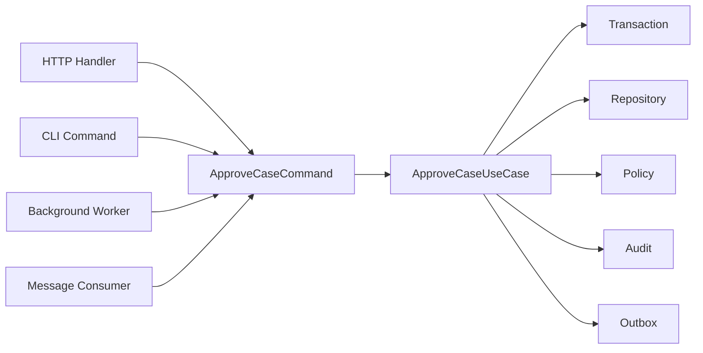
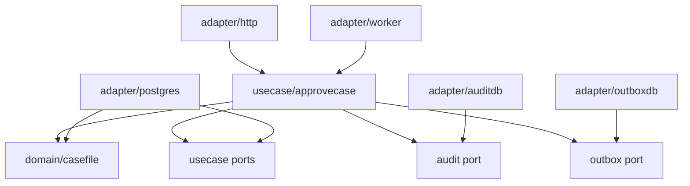
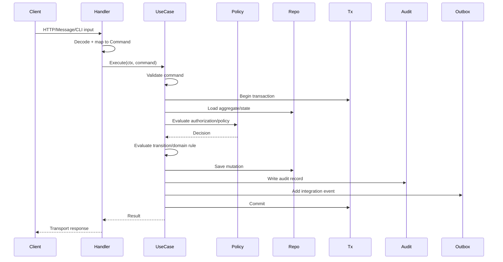

# learn-go-design-patterns-common-patterns-anti-patterns-part-021.md

# Part 021 — Command Pattern and Use Case Pattern in Go

> Seri: **Go Design Patterns, Common Patterns, and Anti-Patterns**  
> Target pembaca: **Java software engineer yang ingin mendesain sistem Go production-grade**  
> Fokus: **command sebagai boundary aksi, use case sebagai orchestration unit, dan hasil keputusan yang eksplisit**  
> Baseline bahasa: **Go 1.26.x**

---

## 0. Posisi Part Ini dalam Seri

Pada part sebelumnya kita sudah membahas:

- package boundary,
- API surface,
- interface placement,
- constructor,
- functional options,
- configuration,
- dependency wiring,
- adapter/port,
- repository,
- transaction boundary,
- service layer,
- handler,
- middleware,
- context propagation,
- error translation,
- decision/result/policy,
- validation,
- state machine.

Sekarang kita masuk ke pola yang mengikat banyak hal tersebut:

> **Command Pattern dan Use Case Pattern.**

Dalam sistem besar, banyak bug bukan terjadi karena kita tidak tahu cara `INSERT`, `UPDATE`, atau memanggil API. Bug sering muncul karena aksi bisnis tidak punya bentuk eksplisit.

Contoh aksi:

- submit application,
- approve enforcement case,
- reject appeal,
- assign officer,
- close investigation,
- regenerate invoice,
- cancel renewal,
- resend notification,
- import batch,
- retry failed integration.

Jika aksi seperti ini hanya tersebar sebagai parameter di HTTP handler, query string, service method yang ambigu, dan repository call acak, maka sistem menjadi sulit diaudit, dites, diamankan, dan diubah.

Command pattern membuat aksi menjadi object/data structure eksplisit.

Use case pattern membuat eksekusi aksi menjadi boundary orchestration yang jelas.

---

## 1. Inti Mental Model

### 1.1 Command adalah intensi, bukan transport DTO

Command bukan sekadar request body.

Command adalah representasi eksplisit dari:

- siapa melakukan aksi,
- aksi apa yang diminta,
- terhadap entity apa,
- dengan parameter apa,
- pada waktu/konteks apa,
- dengan idempotency/correlation/audit metadata apa,
- hasil apa yang diharapkan,
- constraint apa yang harus dipenuhi.

Contoh buruk:

```go
func (h *Handler) Approve(w http.ResponseWriter, r *http.Request) {
    id := chi.URLParam(r, "id")
    reason := r.FormValue("reason")
    user := r.Header.Get("X-User")

    err := h.svc.Approve(r.Context(), id, user, reason)
    if err != nil {
        // map error
    }
}
```

Contoh lebih jelas:

```go
type ApproveCaseCommand struct {
    CaseID         CaseID
    ActorID        UserID
    ActorRoles     []Role
    Reason         string
    IdempotencyKey string
    CorrelationID  string
    RequestedAt    time.Time
}
```

Command membuat aksi menjadi sesuatu yang bisa:

- divalidasi,
- diautorisasi,
- dites,
- dilog,
- diaudit,
- direplay secara aman jika memang didesain begitu,
- dipakai oleh HTTP, CLI, worker, atau consumer tanpa duplikasi logic.

---

### 1.2 Use case adalah boundary orkestrasi

Use case bukan “service besar”.

Use case adalah unit eksekusi yang biasanya melakukan:

1. menerima command,
2. validasi command,
3. authorization/policy check,
4. load state yang diperlukan,
5. evaluasi state machine/domain rule,
6. mulai transaksi bila perlu,
7. mutasi state,
8. simpan perubahan,
9. tulis audit/outbox,
10. commit,
11. return result/decision.

Bentuk umum:

```go
type ApproveCaseUseCase struct {
    tx        TxRunner
    cases     CaseRepository
    policies  ApprovalPolicy
    audit     AuditWriter
    outbox    OutboxWriter
    clock     Clock
}

func (u *ApproveCaseUseCase) Execute(ctx context.Context, cmd ApproveCaseCommand) (ApproveCaseResult, error) {
    // orchestration happens here
}
```

Use case adalah tempat yang tepat untuk menjawab:

- “Apa yang terjadi saat user menekan approve?”
- “Apa yang transactional?”
- “Apa yang hanya effect setelah commit?”
- “Apa yang harus diaudit?”
- “Apa yang idempotent?”
- “Apa policy yang memblokir?”

---

## 2. Java Mindset vs Go Mindset

### 2.1 Java-style command sering menjadi class hierarchy

Di Java, command pattern sering muncul seperti ini:

```java
interface Command<R> {
    R execute();
}

class ApproveCaseCommand implements Command<ApproveCaseResult> {
    public ApproveCaseResult execute() { ... }
}
```

Atau command bus/framework:

```java
commandBus.dispatch(new ApproveCaseCommand(...));
```

Di Go, desain seperti ini sering terlalu berat jika langsung diterjemahkan.

Go lebih sering memakai command sebagai **plain struct**, dan use case sebagai **explicit executor**.

```go
type ApproveCaseCommand struct {
    CaseID  CaseID
    ActorID UserID
    Reason  string
}

type ApproveCaseUseCase struct {
    // dependencies
}

func (u *ApproveCaseUseCase) Execute(ctx context.Context, cmd ApproveCaseCommand) (ApproveCaseResult, error) {
    // explicit logic
}
```

Command tidak perlu method `Execute`.

Command adalah data.

Use case adalah behavior.

---

### 2.2 Hindari generic command bus terlalu awal

Command bus terlihat elegan:

```go
type Command interface{}

type CommandBus interface {
    Dispatch(ctx context.Context, cmd Command) (any, error)
}
```

Masalahnya:

- type safety hilang,
- tracing call graph lebih sulit,
- dependency graph tersembunyi,
- handler resolution sering pakai reflection/map global,
- transaction boundary jadi tidak jelas,
- debugging production lebih sulit,
- code navigation buruk,
- test harus melewati indirection yang tidak memberi value.

Dalam Go, ini sering lebih baik:

```go
result, err := approveCase.Execute(ctx, cmd)
```

Sederhana, eksplisit, mudah dibaca.

Gunakan command bus hanya jika ada kebutuhan nyata seperti:

- middleware command lintas banyak use case,
- audit/telemetry uniform,
- plugin command system,
- workflow engine,
- async command routing,
- multi-tenant policy dispatch,
- domain scripting,
- product benar-benar butuh command registry.

Bukan karena “di enterprise harus ada command bus”.

---

## 3. Command vs Query

Command mengubah state.

Query membaca state.

Pemisahan ini bukan harus langsung CQRS ekstrem. Tetapi secara desain, perbedaan intensi penting.

```go
type ApproveCaseCommand struct {
    CaseID  CaseID
    ActorID UserID
    Reason  string
}

type GetCaseQuery struct {
    CaseID  CaseID
    ActorID UserID
}
```

Command biasanya butuh:

- validation,
- authorization,
- transaction,
- idempotency,
- audit,
- event/outbox,
- state transition,
- conflict detection.

Query biasanya butuh:

- filtering,
- pagination,
- authorization scope,
- projection/read model,
- caching,
- consistency statement,
- performance tuning.

Jangan menyatukan mental model command dan query hanya karena keduanya “method service”.

---

## 4. Bentuk Command yang Baik

### 4.1 Command harus menyatakan aksi spesifik

Buruk:

```go
type UpdateCaseCommand struct {
    CaseID string
    Status string
    Reason string
    Officer string
    DueDate string
    Priority string
}
```

Masalah:

- terlalu generic,
- bisa mewakili banyak aksi berbeda,
- authorization tidak jelas,
- audit tidak jelas,
- validation bercampur,
- state machine sulit dijaga.

Lebih baik:

```go
type AssignCaseCommand struct {
    CaseID   CaseID
    ActorID  UserID
    Officer  UserID
    Reason   string
    Trace     CommandTrace
}

type ApproveCaseCommand struct {
    CaseID CaseID
    ActorID UserID
    Reason string
    Trace  CommandTrace
}

type RejectCaseCommand struct {
    CaseID CaseID
    ActorID UserID
    Reason string
    Trace  CommandTrace
}
```

Command yang spesifik membuat sistem lebih eksplisit.

---

### 4.2 Command sebaiknya memakai tipe domain, bukan string mentah di core

Transport boleh menerima string.

Core sebaiknya menerima tipe yang lebih bermakna.

```go
type CaseID string
type UserID string
type Role string

type ApproveCaseCommand struct {
    CaseID  CaseID
    ActorID UserID
    Roles   []Role
    Reason  string
}
```

Ini tidak membuat Go menjadi Java. Ini membuat boundary lebih aman.

String mentah boleh di edge, tetapi semakin masuk ke core, makna sebaiknya makin eksplisit.

---

### 4.3 Command perlu metadata operasional

Dalam sistem production, command sering membutuhkan metadata:

```go
type CommandTrace struct {
    RequestID      string
    CorrelationID  string
    IdempotencyKey string
    Source         string
    RequestedAt    time.Time
}
```

Lalu:

```go
type ApproveCaseCommand struct {
    CaseID  CaseID
    ActorID UserID
    Roles   []Role
    Reason  string
    Trace   CommandTrace
}
```

Metadata ini berguna untuk:

- idempotency,
- audit,
- debugging,
- tracing,
- duplicate detection,
- user accountability,
- async handoff.

Tetapi jangan memasukkan seluruh `context.Context` ke command.

Command adalah data aksi.

Context adalah control plane eksekusi.

---

## 5. Command Tidak Sama dengan `context.Context`

Salah:

```go
type ApproveCaseCommand struct {
    Ctx context.Context
    CaseID string
}
```

Kenapa buruk?

- context punya lifecycle,
- command bisa disimpan/retry/replay,
- context bisa canceled,
- context bukan data bisnis,
- context value tidak boleh menjadi dependency bag,
- command menjadi sulit diserialisasi dan dites.

Benar:

```go
func (u *ApproveCaseUseCase) Execute(ctx context.Context, cmd ApproveCaseCommand) (ApproveCaseResult, error) {
    // ctx controls deadline/cancellation
    // cmd describes business intent
}
```

Pemisahan:

| Elemen | Tanggung jawab |
|---|---|
| `context.Context` | cancellation, deadline, request-scoped propagation |
| `Command` | intensi aksi bisnis |
| `UseCase` | orchestration |
| `Result` | hasil aksi/keputusan |
| `Error` | kegagalan teknis/operasional |

---

## 6. Command Validation

Validation command biasanya berlapis.

### 6.1 Syntactic validation

Apakah field ada dan formatnya benar?

```go
func (c ApproveCaseCommand) Validate() ValidationResult {
    var r ValidationResult

    if c.CaseID == "" {
        r.Add("case_id", "required")
    }
    if c.ActorID == "" {
        r.Add("actor_id", "required")
    }
    if strings.TrimSpace(c.Reason) == "" {
        r.Add("reason", "required")
    }
    if len(c.Reason) > 500 {
        r.Add("reason", "too_long")
    }

    return r
}
```

### 6.2 Semantic validation

Apakah aksi masuk akal terhadap data yang ada?

```go
if caseFile.Status != StatusPendingApproval {
    return ApproveCaseResult{
        Decision: DecisionRejected,
        Reasons: []Reason{{Code: "invalid_state"}},
    }, nil
}
```

### 6.3 Policy validation

Apakah actor boleh melakukan aksi?

```go
allowed := u.policy.CanApprove(ctx, ApprovalPolicyInput{
    ActorID: cmd.ActorID,
    Roles:   cmd.Roles,
    Case:    caseFile,
})
```

### 6.4 Cross-entity validation

Apakah entity lain membuat aksi ini valid/tidak valid?

Contoh:

- case tidak boleh approve jika ada pending investigation,
- appeal tidak boleh close jika invoice belum final,
- enforcement action tidak boleh escalate jika previous notice belum delivered.

Command pattern memaksa kita memikirkan validation ownership secara eksplisit.

---

## 7. Authorization dalam Command Use Case

Authorization tidak boleh hanya di HTTP middleware.

Middleware bisa melakukan authentication dan coarse-grained authorization.

Use case harus melakukan authorization yang bergantung pada domain state.

Contoh:

```go
func (u *ApproveCaseUseCase) Execute(ctx context.Context, cmd ApproveCaseCommand) (ApproveCaseResult, error) {
    if vr := cmd.Validate(); !vr.OK() {
        return ApproveCaseResult{Validation: vr}, nil
    }

    caseFile, err := u.cases.Get(ctx, cmd.CaseID)
    if err != nil {
        return ApproveCaseResult{}, err
    }

    decision := u.policy.EvaluateApproval(ctx, ApprovalPolicyInput{
        ActorID: cmd.ActorID,
        Roles:   cmd.Roles,
        Case:    caseFile,
    })
    if !decision.Allowed {
        return ApproveCaseResult{Decision: decision}, nil
    }

    // continue mutation
}
```

Kenapa authorization di use case?

Karena rule sering butuh state:

- owner case,
- team assignment,
- current status,
- delegation,
- conflict of interest,
- monetary threshold,
- risk category,
- previous action.

Middleware tidak punya cukup konteks domain untuk ini.

---

## 8. Command Result Pattern

Command result harus menjawab “apa yang terjadi”.

Buruk:

```go
func Approve(...) error
```

Kadang cukup. Tetapi untuk sistem kompleks, terlalu miskin.

Lebih baik:

```go
type ApproveCaseResult struct {
    CaseID       CaseID
    Previous     CaseStatus
    Current      CaseStatus
    Decision     Decision
    AuditID      AuditID
    EventID      EventID
    NoOp         bool
    Validation   ValidationResult
}
```

Result bisa membedakan:

- success,
- validation rejected,
- policy denied,
- idempotent duplicate,
- no-op,
- partial success,
- async accepted,
- conflict,
- technical failure.

`error` dipakai untuk hal yang membuat eksekusi gagal secara teknis/operasional.

Business rejection bisa menjadi result, bukan error.

---

## 9. Error vs Result dalam Command

### 9.1 Gunakan result untuk outcome bisnis yang valid

Contoh:

- user tidak boleh approve karena role tidak cukup,
- case belum siap approve,
- reason terlalu pendek,
- transition tidak valid,
- command duplicate dengan hasil sama.

Ini bukan error teknis.

```go
return ApproveCaseResult{
    Decision: Decision{
        Allowed: false,
        Reasons: []Reason{{Code: "actor_not_authorized"}},
    },
}, nil
```

### 9.2 Gunakan error untuk kegagalan eksekusi

Contoh:

- database down,
- context timeout,
- serialization error,
- repository tidak bisa load data,
- transaction commit gagal,
- outbox write gagal dalam transaksi,
- dependency tidak available.

```go
caseFile, err := u.cases.Get(ctx, cmd.CaseID)
if err != nil {
    return ApproveCaseResult{}, fmt.Errorf("load case %s: %w", cmd.CaseID, err)
}
```

---

## 10. Idempotency dalam Command Pattern

Command yang berasal dari HTTP/mobile/integration/worker sering bisa dikirim ulang.

Penyebab retry:

- client timeout,
- gateway retry,
- user double click,
- message redelivery,
- worker crash setelah commit sebelum ack,
- network split,
- upstream tidak menerima response.

Command harus mendesain idempotency secara eksplisit.

```go
type ApproveCaseCommand struct {
    CaseID         CaseID
    ActorID        UserID
    Reason         string
    IdempotencyKey string
}
```

Pattern umum:

1. command membawa idempotency key,
2. use case cek apakah key pernah diproses,
3. jika belum, proses dalam transaksi,
4. simpan result fingerprint,
5. jika duplicate, return result sebelumnya atau no-op yang aman.

```go
prev, found, err := u.idempotency.Get(ctx, cmd.IdempotencyKey)
if err != nil {
    return ApproveCaseResult{}, err
}
if found {
    return prev.ApproveCaseResult(), nil
}
```

Anti-pattern idempotency:

- hanya mengandalkan unique constraint tanpa result recovery,
- idempotency key global tanpa actor/scope,
- idempotency tidak transactional dengan mutation,
- duplicate dianggap error padahal harusnya safe result,
- idempotency key tidak diaudit.

---

## 11. Transaction Boundary dalam Use Case

Use case biasanya adalah pemilik transaction boundary.

```go
func (u *ApproveCaseUseCase) Execute(ctx context.Context, cmd ApproveCaseCommand) (ApproveCaseResult, error) {
    var result ApproveCaseResult

    err := u.tx.WithinTx(ctx, func(ctx context.Context, tx Tx) error {
        caseFile, err := u.cases.GetForUpdate(ctx, tx, cmd.CaseID)
        if err != nil {
            return err
        }

        evaluated := caseFile.EvaluateApproval(cmd)
        if !evaluated.Allowed {
            result = ApproveCaseResult{Decision: evaluated.Decision}
            return nil
        }

        event := caseFile.Approve(cmd.ActorID, cmd.Reason, u.clock.Now())

        if err := u.cases.Save(ctx, tx, caseFile); err != nil {
            return err
        }
        if err := u.audit.Write(ctx, tx, AuditFrom(event, cmd)); err != nil {
            return err
        }
        if err := u.outbox.Add(ctx, tx, IntegrationEventFrom(event)); err != nil {
            return err
        }

        result = ApproveCaseResult{
            CaseID:   cmd.CaseID,
            Previous: event.PreviousStatus,
            Current:  event.CurrentStatus,
            Decision: DecisionAllowed(),
            EventID:  event.ID,
        }
        return nil
    })
    if err != nil {
        return ApproveCaseResult{}, err
    }

    return result, nil
}
```

Hal penting:

- external network call jangan dilakukan di tengah transaction kecuali sangat terpaksa,
- event/outbox ditulis dalam transaction yang sama dengan state mutation,
- publish event dilakukan setelah commit oleh outbox publisher,
- result harus merepresentasikan state yang sudah committed.

---

## 12. Command dan State Machine

Command sering menjadi input state machine.

```go
type TransitionCommand string

const (
    TransitionApprove TransitionCommand = "approve"
    TransitionReject  TransitionCommand = "reject"
)
```

Tetapi di application layer, command sebaiknya tetap spesifik:

```go
type ApproveCaseCommand struct { ... }
type RejectCaseCommand struct { ... }
```

State machine mengevaluasi apakah command valid terhadap current state.

```go
transition, ok := transitionTable[TransitionKey{
    From: caseFile.Status,
    Cmd:  TransitionApprove,
}]
if !ok {
    return ApproveCaseResult{
        Decision: DecisionDenied("invalid_transition"),
    }, nil
}
```

Command + state machine memberikan trace yang kuat:

- command requested,
- actor,
- previous state,
- transition attempted,
- guard evaluated,
- decision reason,
- resulting state,
- audit event.

Ini sangat penting untuk sistem regulatory/enforcement.

---

## 13. Command dan Audit

Command pattern sangat cocok untuk audit karena command menjelaskan intensi.

Audit yang bagus menjawab:

- siapa,
- melakukan apa,
- terhadap apa,
- kapan,
- dari source mana,
- alasan apa,
- state sebelum/sesudah,
- rule apa yang dievaluasi,
- result apa,
- correlation/idempotency key apa.

Contoh audit event:

```go
type AuditRecord struct {
    ID             AuditID
    ActorID        UserID
    Action         string
    EntityType     string
    EntityID       string
    PreviousState  string
    NewState       string
    Reason         string
    DecisionCode   string
    CorrelationID  string
    IdempotencyKey string
    OccurredAt     time.Time
}
```

Jangan menyimpan audit sebagai log string bebas.

Audit harus menjadi data yang bisa dicari, dikorelasikan, dan dipertanggungjawabkan.

---

## 14. Command dan Outbox Event

Command yang mengubah state sering perlu menghasilkan event.

Contoh:

- `CaseApproved`,
- `OfficerAssigned`,
- `AppealRejected`,
- `InvoiceGenerated`,
- `NotificationRequested`.

Jangan publish event langsung sebelum commit.

Buruk:

```go
u.publisher.Publish(ctx, CaseApproved{...})
u.cases.Save(ctx, tx, caseFile)
```

Jika save gagal, event sudah keluar.

Lebih baik:

```go
u.cases.Save(ctx, tx, caseFile)
u.outbox.Add(ctx, tx, CaseApproved{...})
```

Lalu outbox publisher mengirim setelah commit.

Command pattern membantu karena use case punya semua informasi:

- command metadata,
- domain event,
- transaction boundary,
- result,
- audit.

---

## 15. Command dari Banyak Transport

Satu use case bisa dipanggil dari beberapa adapter.



Transport adapter hanya melakukan:

- decode input,
- authenticate/extract actor,
- map transport data ke command,
- call use case,
- map result/error ke transport response.

Use case berisi logic aksi.

Dengan begitu, approval dari HTTP dan approval dari worker tidak punya logic berbeda tanpa sengaja.

---

## 16. Contoh HTTP Handler ke Command

```go
type ApproveCaseHTTPHandler struct {
    usecase *ApproveCaseUseCase
    clock   Clock
}

func (h *ApproveCaseHTTPHandler) ServeHTTP(w http.ResponseWriter, r *http.Request) {
    ctx := r.Context()

    actor, ok := ActorFromContext(ctx)
    if !ok {
        writeError(w, ErrUnauthenticated)
        return
    }

    var body struct {
        Reason         string `json:"reason"`
        IdempotencyKey string `json:"idempotency_key"`
    }
    if err := decodeJSON(r, &body); err != nil {
        writeError(w, ErrBadRequest)
        return
    }

    cmd := ApproveCaseCommand{
        CaseID:  CaseID(r.PathValue("caseID")),
        ActorID: actor.ID,
        Roles:   actor.Roles,
        Reason:  body.Reason,
        Trace: CommandTrace{
            RequestID:      RequestIDFromContext(ctx),
            CorrelationID:  CorrelationIDFromContext(ctx),
            IdempotencyKey: body.IdempotencyKey,
            Source:         "http",
            RequestedAt:    h.clock.Now(),
        },
    }

    result, err := h.usecase.Execute(ctx, cmd)
    if err != nil {
        writeError(w, err)
        return
    }

    writeApproveResult(w, result)
}
```

Handler tidak memutuskan transition.

Handler tidak menulis audit.

Handler tidak membuka transaction.

Handler tidak tahu SQL.

Handler hanya adapter.

---

## 17. Contoh Worker ke Command

```go
type RetryApprovalWorker struct {
    usecase *ApproveCaseUseCase
    clock   Clock
}

func (w *RetryApprovalWorker) Handle(ctx context.Context, msg ApprovalRetryMessage) error {
    cmd := ApproveCaseCommand{
        CaseID: msg.CaseID,
        ActorID: msg.ActorID,
        Reason: msg.Reason,
        Trace: CommandTrace{
            CorrelationID:  msg.CorrelationID,
            IdempotencyKey: msg.IdempotencyKey,
            Source:         "worker:approval-retry",
            RequestedAt:    w.clock.Now(),
        },
    }

    result, err := w.usecase.Execute(ctx, cmd)
    if err != nil {
        return err // worker retry policy decides
    }
    if result.Decision.Denied() {
        // maybe ack, maybe dead-letter, depending on semantics
        return nil
    }
    return nil
}
```

Worker tidak harus menduplikasi approval logic.

---

## 18. Command Naming

Nama command sebaiknya berupa verb + target.

Baik:

- `SubmitApplicationCommand`
- `ApproveCaseCommand`
- `RejectAppealCommand`
- `AssignOfficerCommand`
- `CloseInvestigationCommand`
- `GenerateInvoiceCommand`
- `CancelRenewalCommand`
- `RetryNotificationCommand`

Kurang baik:

- `CaseCommand`
- `UpdateCommand`
- `SaveCommand`
- `ProcessCommand`
- `HandleCommand`
- `DoCommand`

Nama command harus membuat intensi jelas tanpa membaca seluruh isi struct.

---

## 19. Use Case Naming

Pola umum:

```go
type ApproveCaseUseCase struct {}
func (u *ApproveCaseUseCase) Execute(ctx context.Context, cmd ApproveCaseCommand) (ApproveCaseResult, error)
```

Atau lebih pendek dalam package yang sudah spesifik:

```go
package approvecase

type UseCase struct {}
func (u *UseCase) Execute(ctx context.Context, cmd Command) (Result, error)
```

Keduanya valid.

Jika package sudah bernama `approvecase`, tidak perlu mengulang nama berlebihan.

```go
approvecase.UseCase
approvecase.Command
approvecase.Result
```

Ini sering lebih bersih untuk vertical slice package.

---

## 20. Package Layout Pattern

### 20.1 Layered use case package

```text
internal/
  application/
    caseapproval/
      command.go
      result.go
      usecase.go
      policy.go
      errors.go
  domain/
    casefile/
      case.go
      state.go
      transition.go
  infra/
    postgres/
      case_repository.go
```

Cocok jika domain reusable dan use case banyak.

### 20.2 Vertical slice package

```text
internal/
  cases/
    approve/
      command.go
      result.go
      usecase.go
      http.go
      repository_port.go
      policy.go
    assign/
      command.go
      result.go
      usecase.go
```

Cocok jika sistem punya banyak action/use case dan ingin ownership jelas.

### 20.3 Hybrid

```text
internal/
  domain/
    casefile/
  usecase/
    approvecase/
    assigncase/
  adapter/
    httpapi/
    postgres/
    outbox/
```

Tidak ada layout universal. Yang penting:

- import graph jelas,
- domain tidak import transport,
- use case tidak bergantung ke framework HTTP,
- adapter bergantung ke use case/domain,
- dependency tidak melingkar.

---

## 21. Import Graph yang Sehat



Use case boleh mendefinisikan port kecil yang dibutuhkan.

Adapter mengimplementasikan port tersebut.

Jangan sampai domain import adapter.

Jangan sampai repository import HTTP request.

Jangan sampai use case menerima `*http.Request`.

---

## 22. Command Handler Interface: Kapan Perlu?

Kadang interface command handler berguna:

```go
type Handler[C any, R any] interface {
    Execute(context.Context, C) (R, error)
}
```

Tetapi jangan langsung membuat generic abstraction di semua tempat.

Gunakan jika:

- ada decorator generik untuk logging/metrics/retry,
- ada test harness lintas banyak command,
- ada command registry yang memang dibutuhkan,
- ada workflow engine internal,
- ada consistent middleware command-level.

Hindari jika:

- hanya ada 3 use case,
- tidak ada cross-cutting behavior nyata,
- generic membuat error message membingungkan,
- explicit call lebih mudah.

Go menyukai explicitness. Generic abstraction harus membayar dirinya sendiri.

---

## 23. Command Middleware

Kadang command-level middleware berguna.

Contoh:

- logging command start/end,
- metrics duration,
- panic recovery,
- idempotency wrapper,
- authorization wrapper,
- validation wrapper,
- tracing wrapper.

Tetapi hati-hati: middleware command bisa menyembunyikan flow.

Contoh sederhana:

```go
type CommandHandler[C any, R any] func(context.Context, C) (R, error)

func WithCommandLogging[C any, R any](name string, next CommandHandler[C, R], logger *slog.Logger) CommandHandler[C, R] {
    return func(ctx context.Context, cmd C) (R, error) {
        start := time.Now()
        res, err := next(ctx, cmd)
        logger.InfoContext(ctx, "command executed",
            "command", name,
            "duration_ms", time.Since(start).Milliseconds(),
            "error", err != nil,
        )
        return res, err
    }
}
```

Ini boleh, tetapi jangan mengubah semantic command di middleware tanpa terlihat.

---

## 24. Command Lifecycle Diagram



Diagram ini adalah bentuk ideal. Tidak semua command butuh semua langkah.

Tetapi untuk command kritikal, terutama regulatory/enforcement workflow, sebagian besar elemen ini sering relevan.

---

## 25. Command untuk Batch Operation

Batch command tidak sekadar `[]Command`.

Batch punya semantics:

- apakah all-or-nothing?
- apakah partial success boleh?
- apakah ordering penting?
- apakah idempotency per item atau per batch?
- apakah audit per item atau satu audit batch?
- apakah authorization per item?
- apakah transaction satu besar atau chunked?

Contoh:

```go
type BulkAssignOfficerCommand struct {
    ActorID        UserID
    OfficerID      UserID
    CaseIDs        []CaseID
    Reason         string
    Mode           BulkMode
    IdempotencyKey string
}

type BulkMode string

const (
    BulkAllOrNothing BulkMode = "all_or_nothing"
    BulkPartial      BulkMode = "partial"
)
```

Result:

```go
type BulkAssignOfficerResult struct {
    Total     int
    Succeeded int
    Failed    int
    Items     []BulkAssignOfficerItemResult
}
```

Batch command tanpa result detail adalah operational nightmare.

---

## 26. Command untuk Async Operation

Tidak semua command selesai sinkron.

Contoh:

- generate large report,
- import CSV,
- batch validation,
- external integration sync,
- notification fanout,
- archive process.

Command result bisa berupa accepted result.

```go
type StartCaseImportResult struct {
    JobID    JobID
    Accepted bool
}
```

Use case membuat job record dan outbox/job queue message dalam transaction.

```go
func (u *StartImportUseCase) Execute(ctx context.Context, cmd StartImportCommand) (StartCaseImportResult, error) {
    // validate file reference
    // authorize actor
    // create job row
    // enqueue job event in outbox
    // commit
    // return JobID
}
```

Jangan melakukan long-running process langsung dalam HTTP request jika melebihi request budget.

---

## 27. Command dan Retry Semantics

Command retry harus jelas.

Pertanyaan desain:

- apakah command aman diulang?
- retry siapa yang melakukan?
- retry error apa saja yang boleh?
- apakah command punya idempotency key?
- apakah external side effect sudah terjadi?
- apakah result duplicate bisa direkonstruksi?

Command yang tidak idempotent tidak aman untuk redelivery.

Misalnya:

```go
type SendNotificationCommand struct {
    Recipient UserID
    Template  string
    Payload   map[string]string
}
```

Jika command ini di-retry, user bisa menerima email dua kali.

Perbaiki:

```go
type SendNotificationCommand struct {
    NotificationID NotificationID
    Recipient      UserID
    Template       string
    Payload        map[string]string
    IdempotencyKey string
}
```

Atau gunakan outbox + delivery table.

---

## 28. Command dan Security

Command adalah boundary penting untuk security.

Command harus menghindari:

- trust pada actor ID dari body tanpa authentication,
- mass assignment,
- field yang tidak boleh dikontrol user,
- authorization hanya dari role string tanpa state,
- command replay tanpa idempotency/nonce,
- audit metadata palsu dari client,
- sensitive data dalam logs.

Contoh buruk:

```go
type ApproveCaseRequest struct {
    CaseID string `json:"case_id"`
    ActorID string `json:"actor_id"`
    Status string `json:"status"`
    ApprovedAt string `json:"approved_at"`
}
```

Client tidak boleh menentukan `ActorID`, `Status`, dan `ApprovedAt` secara bebas.

Lebih aman:

```go
type approveCaseRequest struct {
    Reason         string `json:"reason"`
    IdempotencyKey string `json:"idempotency_key"`
}

cmd := ApproveCaseCommand{
    CaseID:  CaseID(r.PathValue("caseID")),
    ActorID: actor.ID,       // from trusted auth context
    Roles:   actor.Roles,    // from trusted auth context
    Reason:  body.Reason,
    Trace:   traceFromRequest(r),
}
```

---

## 29. Observability untuk Command

Command-level observability sebaiknya menjawab:

- command apa dieksekusi,
- actor/source apa,
- entity apa,
- berapa lama,
- result apa,
- denied/success/no-op/error,
- error class apa,
- transition apa,
- idempotency duplicate atau bukan,
- correlation ID apa.

Log contoh:

```go
logger.InfoContext(ctx, "command completed",
    "command", "approve_case",
    "case_id", cmd.CaseID,
    "actor_id", cmd.ActorID,
    "result", result.Decision.Code,
    "previous_state", result.Previous,
    "current_state", result.Current,
    "duration_ms", duration.Milliseconds(),
    "correlation_id", cmd.Trace.CorrelationID,
)
```

Hati-hati:

- jangan log reason jika mengandung sensitive data,
- jangan log full payload sembarangan,
- jangan jadikan high-cardinality label sebagai metric label,
- jangan double log error di semua layer.

---

## 30. Metrics untuk Command

Metric yang umum:

- `command_executions_total{command,result}`
- `command_duration_seconds{command,result}`
- `command_validation_failures_total{command,reason}`
- `command_policy_denials_total{command,reason}`
- `command_idempotency_hits_total{command}`
- `command_errors_total{command,error_class}`

Jangan memasukkan `case_id`, `user_id`, `request_id`, atau `reason text` sebagai label metric.

Itu high cardinality.

Gunakan logs/traces/audit untuk entity-specific debugging.

---

## 31. Testing Command Use Case

Testing command use case biasanya jauh lebih mudah daripada testing handler besar.

### 31.1 Happy path

```go
func TestApproveCase_Success(t *testing.T) {
    uc := newApproveCaseUseCaseWithFakes()

    result, err := uc.Execute(context.Background(), ApproveCaseCommand{
        CaseID:  "CASE-1",
        ActorID: "USER-1",
        Roles:   []Role{"approver"},
        Reason:  "complete and compliant",
    })

    require.NoError(t, err)
    require.True(t, result.Decision.Allowed)
    require.Equal(t, StatusApproved, result.Current)
}
```

### 31.2 Validation denied

```go
func TestApproveCase_ReasonRequired(t *testing.T) {
    uc := newApproveCaseUseCaseWithFakes()

    result, err := uc.Execute(context.Background(), ApproveCaseCommand{
        CaseID:  "CASE-1",
        ActorID: "USER-1",
    })

    require.NoError(t, err)
    require.False(t, result.Validation.OK())
}
```

### 31.3 Policy denied

```go
func TestApproveCase_NotAuthorized(t *testing.T) {
    uc := newApproveCaseUseCaseWithFakes()

    result, err := uc.Execute(context.Background(), ApproveCaseCommand{
        CaseID:  "CASE-1",
        ActorID: "USER-2",
        Roles:   []Role{"viewer"},
        Reason:  "ok",
    })

    require.NoError(t, err)
    require.True(t, result.Decision.Denied())
    require.Equal(t, "not_authorized", result.Decision.PrimaryReason())
}
```

### 31.4 Repository error

```go
func TestApproveCase_RepositoryFailure(t *testing.T) {
    uc := newApproveCaseUseCaseWithRepoError(errors.New("db down"))

    _, err := uc.Execute(context.Background(), validApproveCommand())

    require.Error(t, err)
}
```

### 31.5 Idempotency duplicate

```go
func TestApproveCase_IdempotentDuplicate(t *testing.T) {
    uc := newApproveCaseUseCaseWithFakes()
    cmd := validApproveCommand()
    cmd.Trace.IdempotencyKey = "idem-1"

    first, err := uc.Execute(context.Background(), cmd)
    require.NoError(t, err)

    second, err := uc.Execute(context.Background(), cmd)
    require.NoError(t, err)

    require.Equal(t, first.Current, second.Current)
    require.True(t, second.NoOp || second.IdempotentReplay)
}
```

---

## 32. Anti-Pattern Catalog

### 32.1 Command as `map[string]any`

```go
func Execute(ctx context.Context, cmd map[string]any) error
```

Masalah:

- tidak type-safe,
- validasi sulit,
- refactor rentan,
- dokumentasi buruk,
- runtime panic mudah,
- IDE tidak membantu.

Gunakan struct eksplisit.

---

### 32.2 One Generic Update Command

```go
type UpdateEntityCommand struct {
    Entity string
    ID string
    Fields map[string]any
}
```

Masalah:

- authorization tidak spesifik,
- audit tidak bermakna,
- validation kacau,
- state machine bypass,
- mass assignment risk.

Gunakan command per aksi bisnis.

---

### 32.3 Command Menyimpan `context.Context`

```go
type Command struct {
    Context context.Context
}
```

Masalah:

- lifecycle tidak jelas,
- command tidak serializable,
- canceled context bisa ikut terbawa,
- data dan control plane bercampur.

Gunakan `Execute(ctx, cmd)`.

---

### 32.4 Command Mengeksekusi Dirinya Sendiri

```go
type ApproveCaseCommand struct {
    repo Repository
}

func (c *ApproveCaseCommand) Execute(ctx context.Context) error { ... }
```

Masalah:

- command bukan data lagi,
- dependency tersembunyi,
- test setup lebih berat,
- serialization/retry/audit lebih sulit,
- mendekati Java object-command yang tidak idiomatis untuk banyak kasus Go.

Pisahkan command data dan use case behavior.

---

### 32.5 Command Bus untuk Semua Hal

```go
bus.Dispatch(ctx, ApproveCaseCommand{})
```

Tanpa kebutuhan nyata, ini membuat call graph kabur.

Gunakan explicit use case call dulu.

---

### 32.6 Business Rejection sebagai Error

```go
return ErrNotAllowed
```

Untuk domain yang butuh reason/audit, error terlalu miskin.

Lebih baik:

```go
return Result{Decision: Denied("not_allowed")}, nil
```

---

### 32.7 Technical Failure sebagai Result Saja

Sebaliknya, jangan menyembunyikan DB down sebagai result bisnis.

Buruk:

```go
return Result{Decision: Denied("system_unavailable")}, nil
```

Lebih baik:

```go
return Result{}, fmt.Errorf("load case: %w", err)
```

---

### 32.8 Handler Melakukan Use Case Logic

```go
func (h *Handler) Approve(w http.ResponseWriter, r *http.Request) {
    // validate
    // load DB
    // check policy
    // update status
    // write audit
    // publish event
}
```

Masalah:

- susah dites,
- susah dipakai worker/CLI,
- transaction boundary kacau,
- transport concern bercampur domain.

Pindahkan ke use case.

---

### 32.9 Repository Melakukan Command Logic

```go
func (r *CaseRepository) ApproveCase(ctx context.Context, id string) error
```

Repository boleh menyimpan state, tetapi tidak sebaiknya memutuskan policy/state machine/use case.

Repository bukan application service.

---

### 32.10 No Audit Metadata

Command tanpa actor/source/correlation/idempotency membuat production debugging dan regulatory traceability lemah.

---

## 33. Refactoring Playbook

### Step 1 — Temukan aksi bisnis

Cari method seperti:

- `UpdateStatus`,
- `Process`,
- `Handle`,
- `Save`,
- `Submit`,
- `Approve`,
- `Reject`,
- `Assign`,
- `Close`.

Tanyakan:

- aksi bisnis apa sebenarnya?
- siapa actor?
- entity apa?
- state apa berubah?
- rule apa berlaku?
- audit apa diperlukan?

---

### Step 2 — Buat command struct eksplisit

```go
type ApproveCaseCommand struct {
    CaseID CaseID
    ActorID UserID
    Reason string
    Trace CommandTrace
}
```

Jangan langsung buat framework.

---

### Step 3 — Buat result struct

```go
type ApproveCaseResult struct {
    CaseID CaseID
    Previous CaseStatus
    Current CaseStatus
    Decision Decision
}
```

---

### Step 4 — Pindahkan orchestration ke use case

```go
type ApproveCaseUseCase struct { ... }
func (u *ApproveCaseUseCase) Execute(ctx context.Context, cmd ApproveCaseCommand) (ApproveCaseResult, error)
```

---

### Step 5 — Jadikan handler adapter tipis

Handler hanya decode → command → execute → response.

---

### Step 6 — Tambahkan validation/policy/audit/outbox bertahap

Jangan big bang.

Mulai dari satu use case paling kritikal.

---

### Step 7 — Tambahkan tests di use case

Test matrix:

- valid command,
- invalid command,
- unauthorized,
- invalid state,
- repository error,
- transaction rollback,
- idempotent duplicate,
- audit written,
- outbox written.

---

## 34. Production Example Lengkap

### 34.1 Domain Types

```go
type CaseID string
type UserID string
type AuditID string
type EventID string

type CaseStatus string

const (
    StatusDraft           CaseStatus = "draft"
    StatusPendingApproval CaseStatus = "pending_approval"
    StatusApproved        CaseStatus = "approved"
    StatusRejected        CaseStatus = "rejected"
)
```

---

### 34.2 Command

```go
type ApproveCaseCommand struct {
    CaseID CaseID
    ActorID UserID
    Roles []Role
    Reason string
    Trace CommandTrace
}

type CommandTrace struct {
    RequestID string
    CorrelationID string
    IdempotencyKey string
    Source string
    RequestedAt time.Time
}
```

---

### 34.3 Result

```go
type ApproveCaseResult struct {
    CaseID CaseID
    Previous CaseStatus
    Current CaseStatus
    Decision Decision
    AuditID AuditID
    EventID EventID
    IdempotentReplay bool
    Validation ValidationResult
}
```

---

### 34.4 Ports

```go
type TxRunner interface {
    WithinTx(ctx context.Context, fn func(context.Context, Tx) error) error
}

type Tx interface{}

type CaseRepository interface {
    GetForUpdate(ctx context.Context, tx Tx, id CaseID) (CaseFile, error)
    Save(ctx context.Context, tx Tx, c CaseFile) error
}

type AuditWriter interface {
    Write(ctx context.Context, tx Tx, record AuditRecord) (AuditID, error)
}

type OutboxWriter interface {
    Add(ctx context.Context, tx Tx, event IntegrationEvent) (EventID, error)
}

type ApprovalPolicy interface {
    Evaluate(ctx context.Context, input ApprovalPolicyInput) Decision
}
```

---

### 34.5 Use Case

```go
type ApproveCaseUseCase struct {
    tx TxRunner
    cases CaseRepository
    policy ApprovalPolicy
    audit AuditWriter
    outbox OutboxWriter
    clock Clock
}

func (u *ApproveCaseUseCase) Execute(ctx context.Context, cmd ApproveCaseCommand) (ApproveCaseResult, error) {
    if vr := validateApproveCaseCommand(cmd); !vr.OK() {
        return ApproveCaseResult{Validation: vr}, nil
    }

    var result ApproveCaseResult

    err := u.tx.WithinTx(ctx, func(ctx context.Context, tx Tx) error {
        caseFile, err := u.cases.GetForUpdate(ctx, tx, cmd.CaseID)
        if err != nil {
            return fmt.Errorf("load case for approval: %w", err)
        }

        decision := u.policy.Evaluate(ctx, ApprovalPolicyInput{
            ActorID: cmd.ActorID,
            Roles: cmd.Roles,
            Case: caseFile,
        })
        if decision.Denied() {
            result = ApproveCaseResult{
                CaseID: cmd.CaseID,
                Previous: caseFile.Status,
                Current: caseFile.Status,
                Decision: decision,
            }
            return nil
        }

        event, transitionDecision := caseFile.Approve(cmd.ActorID, cmd.Reason, u.clock.Now())
        if transitionDecision.Denied() {
            result = ApproveCaseResult{
                CaseID: cmd.CaseID,
                Previous: caseFile.Status,
                Current: caseFile.Status,
                Decision: transitionDecision,
            }
            return nil
        }

        if err := u.cases.Save(ctx, tx, caseFile); err != nil {
            return fmt.Errorf("save approved case: %w", err)
        }

        auditID, err := u.audit.Write(ctx, tx, AuditRecord{
            ActorID: cmd.ActorID,
            Action: "approve_case",
            EntityType: "case",
            EntityID: string(cmd.CaseID),
            PreviousState: string(event.PreviousStatus),
            NewState: string(event.CurrentStatus),
            Reason: cmd.Reason,
            CorrelationID: cmd.Trace.CorrelationID,
            IdempotencyKey: cmd.Trace.IdempotencyKey,
            OccurredAt: u.clock.Now(),
        })
        if err != nil {
            return fmt.Errorf("write approval audit: %w", err)
        }

        eventID, err := u.outbox.Add(ctx, tx, IntegrationEvent{
            Type: "CaseApproved",
            EntityID: string(cmd.CaseID),
            CorrelationID: cmd.Trace.CorrelationID,
            OccurredAt: u.clock.Now(),
        })
        if err != nil {
            return fmt.Errorf("write case approved outbox event: %w", err)
        }

        result = ApproveCaseResult{
            CaseID: cmd.CaseID,
            Previous: event.PreviousStatus,
            Current: event.CurrentStatus,
            Decision: DecisionAllowed(),
            AuditID: auditID,
            EventID: eventID,
        }
        return nil
    })
    if err != nil {
        return ApproveCaseResult{}, err
    }

    return result, nil
}
```

---

## 35. Design Checklist

Sebelum menyelesaikan desain command/use case, tanyakan:

### Command

- Apakah command merepresentasikan aksi spesifik?
- Apakah namanya verb + target?
- Apakah command hanya data, bukan behavior eksekusi?
- Apakah memakai tipe domain, bukan string mentah di core?
- Apakah actor/source/correlation/idempotency jelas?
- Apakah command tidak menyimpan `context.Context`?

### Use Case

- Apakah use case menjadi orchestration boundary?
- Apakah handler tetap tipis?
- Apakah transaction boundary jelas?
- Apakah repository tidak mengambil alih business logic?
- Apakah external side effect tidak terjadi sebelum commit?
- Apakah audit/outbox ditulis secara konsisten?

### Result/Error

- Apakah business rejection menjadi result/decision?
- Apakah technical failure menjadi error?
- Apakah result cukup informatif untuk API/audit/debugging?
- Apakah duplicate/idempotent behavior jelas?

### Security

- Apakah actor berasal dari trusted auth context?
- Apakah client tidak bisa mengontrol field sensitif?
- Apakah authorization stateful dilakukan di use case/policy?
- Apakah command replay diperhitungkan?

### Observability

- Apakah command execution dilog secara structured?
- Apakah metric tidak high-cardinality?
- Apakah correlation ID masuk ke audit/outbox/log?
- Apakah denial reason bisa dianalisis?

### Testing

- Apakah happy path dites?
- Apakah invalid command dites?
- Apakah unauthorized dites?
- Apakah invalid transition dites?
- Apakah repository/transaction failure dites?
- Apakah audit/outbox side effect dites?
- Apakah idempotency dites?

---

## 36. Exercise

### Exercise 1 — Refactor Handler ke Command

Ambil handler yang melakukan banyak logic.

Refactor menjadi:

- request DTO,
- command,
- use case,
- result,
- response mapper.

Pastikan handler tidak tahu repository.

---

### Exercise 2 — Pisahkan Business Rejection dari Error

Untuk satu use case:

- identifikasi outcome bisnis valid,
- ubah menjadi decision/result,
- sisakan error untuk technical failure.

---

### Exercise 3 — Tambahkan Idempotency

Untuk command yang bisa di-retry:

- tambahkan idempotency key,
- tentukan scope key,
- simpan result fingerprint,
- test duplicate command.

---

### Exercise 4 — Tambahkan Audit

Untuk command kritikal:

- simpan actor,
- action,
- entity,
- previous/new state,
- decision,
- correlation ID,
- reason.

---

### Exercise 5 — Command dari Dua Transport

Buat command yang bisa dipanggil dari:

- HTTP handler,
- background worker.

Pastikan logic tidak duplicate.

---

## 37. Ringkasan

Command pattern di Go bukan tentang membuat class hierarchy atau command bus framework.

Command pattern di Go adalah tentang membuat **aksi bisnis menjadi eksplisit**.

Use case pattern adalah tentang membuat **orchestration boundary menjadi jelas**.

Prinsip utama:

1. Command adalah data intensi.
2. Use case adalah behavior/orchestration.
3. Context adalah control plane, bukan bagian command.
4. Result menyatakan outcome bisnis.
5. Error menyatakan kegagalan teknis.
6. Handler hanya adapter.
7. Transaction dimiliki use case.
8. Audit dan outbox adalah bagian dari command lifecycle kritikal.
9. Idempotency harus eksplisit untuk command yang bisa di-retry.
10. Jangan membuat command bus/generic framework sebelum ada kebutuhan nyata.

Untuk sistem regulatory, enforcement, workflow, case management, approval, dan audit-heavy platform, command/use case pattern adalah salah satu cara paling kuat untuk membuat desain Go menjadi:

- defensible,
- testable,
- auditable,
- evolvable,
- observable,
- aman terhadap perubahan requirement.

---

## 38. Hubungan ke Part Berikutnya

Part berikutnya:

**Part 022 — Event Pattern: Domain Event, Integration Event, Outbox**

Kita akan memperdalam apa yang terjadi setelah command mengubah state:

- domain event,
- integration event,
- event schema,
- event versioning,
- outbox pattern,
- transactional publish boundary,
- at-least-once delivery,
- idempotent consumer,
- anti-pattern event sebagai database row dump.

Command adalah input aksi.

Event adalah fakta bahwa sesuatu sudah terjadi.

Keduanya harus dipisahkan dengan jelas.

---

## Status Seri

Seri belum selesai.

Saat ini kita telah menyelesaikan:

- Part 000 sampai Part 021

Total rencana:

- Part 000 sampai Part 035

<!-- NAVIGATION_FOOTER -->
<div class="page-nav">
<a href="./learn-go-design-patterns-common-patterns-anti-patterns-part-020.md">⬅️ Part 020 — State Machine Pattern in Go</a>
<a href="./index.md">📚 Kategori</a>
<a href="../../index.md">🏠 Home</a>
<a href="./learn-go-design-patterns-common-patterns-anti-patterns-part-022.md">Part 022 — Event Pattern: Domain Event, Integration Event, Outbox ➡️</a>
</div>
