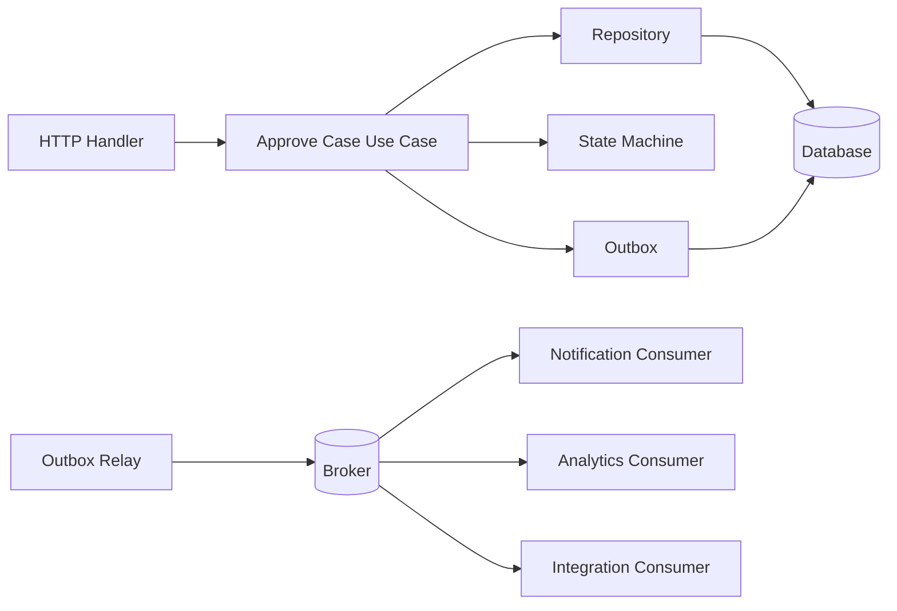
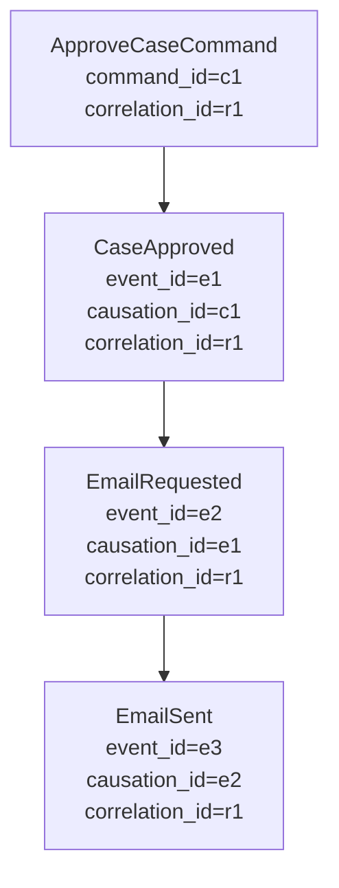
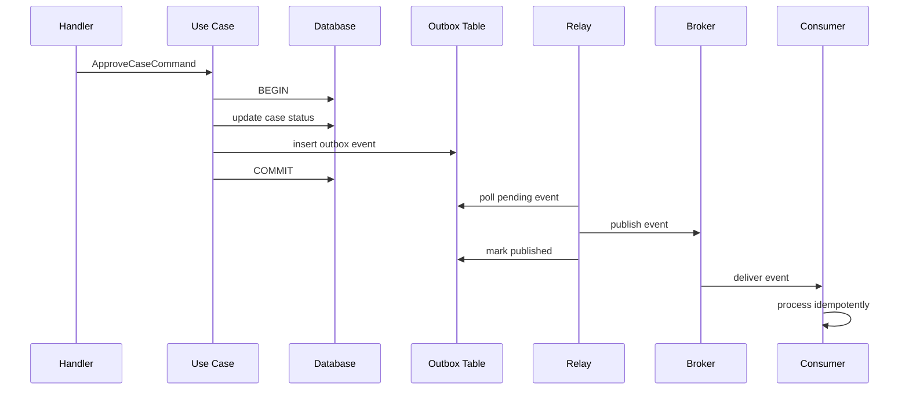
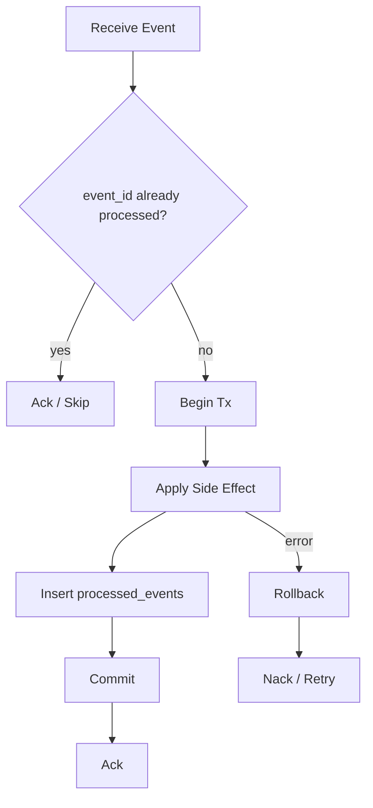
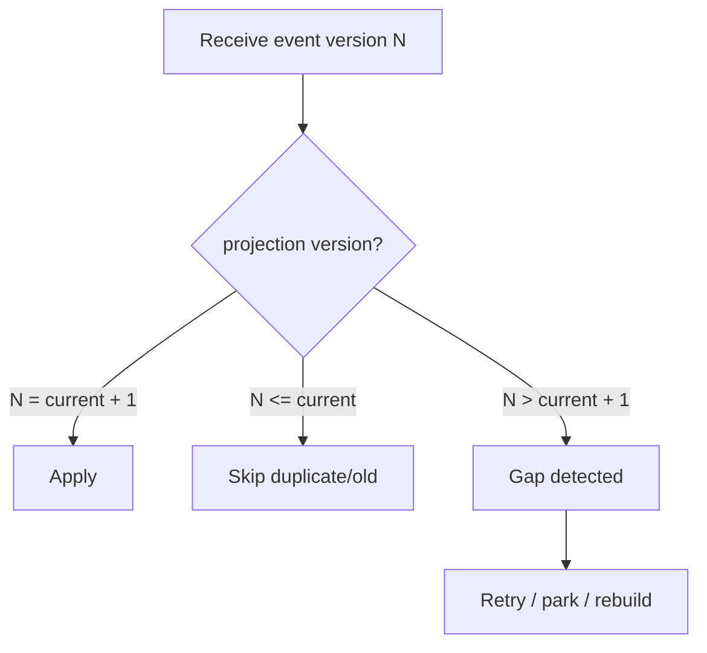
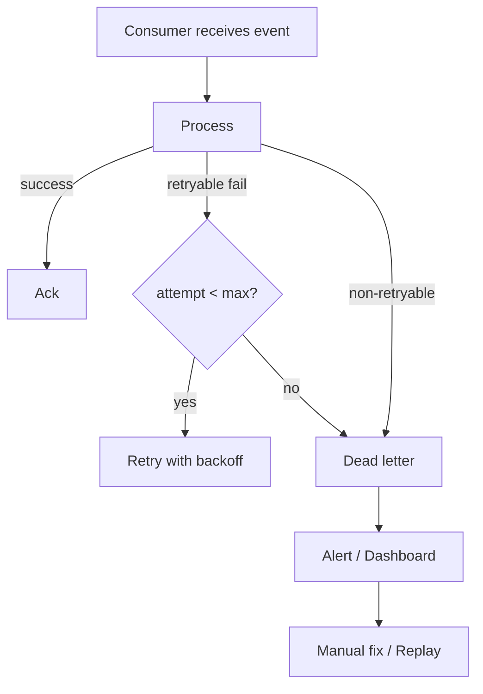
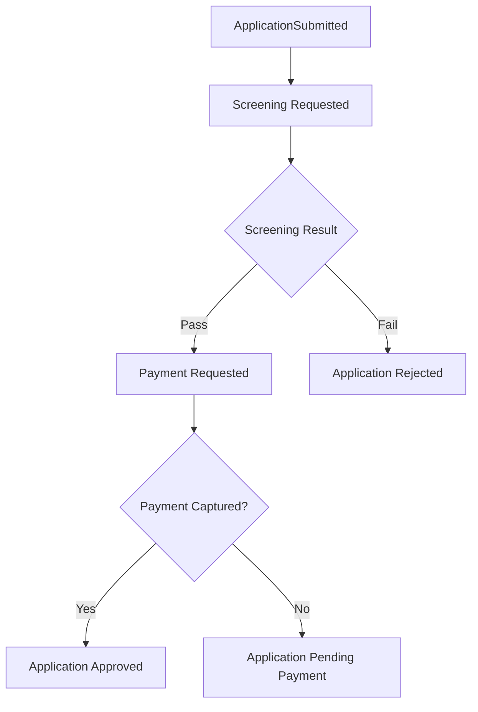
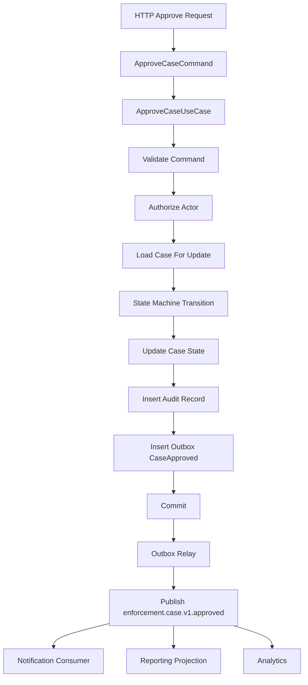

# learn-go-design-patterns-common-patterns-anti-patterns-part-022.md

# Part 022 — Event Pattern: Domain Event, Integration Event, Outbox

> Seri: **Go Design Patterns, Common Patterns, and Anti-Patterns**  
> Target pembaca: **Java software engineer yang ingin mendesain sistem Go production-grade**  
> Fokus: **event sebagai fakta bisnis, boundary konsistensi, integration contract, outbox, idempotent consumer, dan anti-pattern event-driven architecture**  
> Baseline: **Go 1.26.x**

---

## 0. Posisi Part Ini Dalam Seri

Sebelumnya kita sudah membahas:

- package boundary
- API surface
- interface placement
- constructor/config/wiring
- adapter/port
- repository dan transaction boundary
- service/use-case boundary
- handler/middleware/context/error/validation/state machine/command

Part ini menyambungkan semuanya ke satu tema besar:

> Bagaimana perubahan penting dalam sistem diubah menjadi **event** yang aman, eksplisit, konsisten, bisa diaudit, dan bisa dikonsumsi tanpa merusak reliability sistem.

Event pattern sering terlihat sederhana:

```go
Publish(Event{Type: "CaseApproved"})
```

Tetapi di production, event membawa risiko besar:

- publish terjadi sebelum commit
- event terkirim dua kali
- consumer tidak idempotent
- schema berubah tanpa versioning
- event terlalu mirip database row dump
- event dipakai untuk menyembunyikan coupling synchronous
- retry menghasilkan duplicate side effect
- ordering diasumsikan padahal broker tidak menjamin sesuai kebutuhan bisnis
- audit trail bercampur dengan integration event
- domain event, integration event, notification event, dan log event dicampur menjadi satu konsep

Part ini membangun mental model agar kamu bisa mendesain event-driven flow dengan disiplin.

---

## 1. Core Thesis

Event dalam sistem production bukan sekadar “pesan”.

Event adalah:

> **catatan fakta bahwa sesuatu yang signifikan sudah terjadi, memiliki waktu, sebab, identitas, semantic contract, dan konsekuensi bagi bagian lain dari sistem.**

Kalimat pentingnya adalah **sudah terjadi**.

Command bertanya:

> “Tolong lakukan aksi ini.”

Event menyatakan:

> “Aksi/fakta ini sudah terjadi.”

Contoh command:

```text
ApproveCaseCommand
SubmitApplicationCommand
AssignOfficerCommand
GenerateInvoiceCommand
```

Contoh event:

```text
CaseApproved
ApplicationSubmitted
OfficerAssigned
InvoiceGenerated
```

Kesalahan umum adalah membuat event yang masih berbentuk command:

```text
ApproveCaseEvent       // buruk: ini terdengar seperti instruksi
SendEmailEvent         // buruk jika maksudnya request ke worker
DoPaymentEvent         // buruk: imperative
```

Lebih baik:

```text
CaseApproved
EmailRequested         // jika event ini memang fakta request telah dibuat
PaymentCaptured
InvoiceIssued
```

---

## 2. Event Bukan Satu Jenis

Di sistem besar, “event” minimal perlu dibedakan menjadi beberapa kategori.

| Jenis | Scope | Audience | Stability | Contoh |
|---|---:|---|---|---|
| Domain Event | internal domain/use case | internal package/service | bisa lebih fleksibel | `CaseApproved` |
| Integration Event | antar service/system | external consumers | harus stabil/versioned | `enforcement.case.v1.approved` |
| Outbox Event | persistence record untuk publish | publisher/relay | internal technical contract | row di `outbox_events` |
| Audit Event | regulatory/human trace | auditor/user/admin | sangat stabil | `Officer X approved case Y` |
| Notification Event | delivery/UX concern | email/SMS/push worker | medium | `NotificationRequested` |
| Log Event | operational debugging | engineer/SRE | tidak boleh jadi business contract | structured log |
| Metric Event | aggregate signal | monitoring | low detail | counter/timer |

Anti-pattern paling berbahaya:

> Menggunakan satu event object untuk semua kebutuhan di atas.

Akibatnya:

- integration contract bocor detail domain internal
- audit kehilangan detail yang dibutuhkan manusia/regulator
- log berisi PII karena disamakan dengan event payload
- consumer bergantung ke field internal yang tidak stabil
- perubahan kecil di domain memecahkan integrasi eksternal

---

## 3. Mental Model: Event Sebagai Boundary Fact

Bayangkan use case seperti ini:



Hal penting:

1. Handler menerima request.
2. Use case memvalidasi command.
3. State machine mengevaluasi transition.
4. Repository menyimpan perubahan state.
5. Outbox menyimpan event dalam transaksi yang sama.
6. Relay membaca outbox setelah commit.
7. Broker menyebarkan event.
8. Consumer memproses secara idempotent.

Prinsipnya:

> Perubahan state dan pencatatan event yang mewakili perubahan itu harus berada dalam consistency boundary yang sama.

Karena itu, untuk database-backed service, outbox pattern sering lebih aman daripada publish langsung ke broker di tengah transaksi.

---

## 4. Domain Event vs Integration Event

### 4.1 Domain Event

Domain event menyatakan fakta penting di dalam domain model/use case.

Contoh:

```go
type CaseApproved struct {
    CaseID     CaseID
    ApprovedBy OfficerID
    ApprovedAt time.Time
    DecisionID DecisionID
    Reason     string
}
```

Domain event biasanya:

- dekat dengan language domain
- bisa memakai type domain internal
- tidak wajib JSON-ready
- tidak selalu dipublish keluar service
- bisa dipakai untuk audit, outbox mapping, atau internal hooks

Domain event menjawab:

> “Apa yang terjadi di domain?”

Bukan:

> “Bagaimana format pesan broker?”

### 4.2 Integration Event

Integration event adalah contract antar boundary sistem.

Contoh:

```go
type CaseApprovedV1 struct {
    EventID       string    `json:"event_id"`
    EventType     string    `json:"event_type"`
    EventVersion  int       `json:"event_version"`
    OccurredAt    time.Time `json:"occurred_at"`
    PublishedAt   time.Time `json:"published_at"`
    CorrelationID string    `json:"correlation_id,omitempty"`
    CaseID        string    `json:"case_id"`
    DecisionID    string    `json:"decision_id"`
    ApprovedBy    string    `json:"approved_by"`
}
```

Integration event biasanya:

- memakai primitive/portable type
- versioned
- backward compatible
- tidak bocor internal struct
- punya event ID
- punya occurred time
- punya event type yang stabil
- punya schema evolution strategy

Integration event menjawab:

> “Fakta apa yang boleh diketahui sistem lain, dalam contract apa?”

---

## 5. Naming Pattern

Event name sebaiknya memakai bentuk **past tense fact**.

Baik:

```text
CaseCreated
CaseSubmitted
CaseAssigned
CaseApproved
CaseRejected
CaseClosed
DocumentUploaded
PaymentCaptured
InvoiceIssued
```

Kurang baik:

```text
CreateCase
SubmitCase
ApproveCase
SendEmail
UpdateStatus
ProcessPayment
```

Kenapa?

Karena event bukan instruksi. Event adalah fakta.

### 5.1 Integration Event Naming

Untuk integration event, nama sering perlu namespace dan version.

Contoh:

```text
enforcement.case.v1.approved
enforcement.case.v1.rejected
enforcement.application.v2.submitted
billing.invoice.v1.issued
notification.email.v1.requested
```

Pola:

```text
<domain>.<entity-or-capability>.v<major>.<fact>
```

Aturan praktis:

- nama harus stabil
- hindari nama terlalu teknis
- jangan pakai nama table
- jangan pakai nama endpoint
- jangan pakai nama handler/function
- version major ada di event type atau schema metadata

---

## 6. Event Envelope Pattern

Event payload sering dibungkus envelope.

```go
type EventEnvelope[T any] struct {
    EventID       string    `json:"event_id"`
    EventType     string    `json:"event_type"`
    EventVersion  int       `json:"event_version"`
    OccurredAt    time.Time `json:"occurred_at"`
    PublishedAt   time.Time `json:"published_at"`
    CorrelationID string    `json:"correlation_id,omitempty"`
    CausationID   string    `json:"causation_id,omitempty"`
    Producer      string    `json:"producer"`
    Payload       T         `json:"payload"`
}
```

Envelope berisi metadata teknis/operasional.

Payload berisi fakta bisnis.

Contoh payload:

```go
type CaseApprovedPayloadV1 struct {
    CaseID     string `json:"case_id"`
    DecisionID string `json:"decision_id"`
    ApprovedBy string `json:"approved_by"`
}
```

Kenapa envelope berguna?

- consumer bisa deduplicate dengan `event_id`
- tracing memakai `correlation_id`
- causal chain memakai `causation_id`
- schema routing memakai `event_type` dan `event_version`
- observability memakai `producer`, `published_at`, lag, retry count

Anti-pattern:

```go
type CaseApproved struct {
    ID string
    Status string
    OfficerName string
    Email string
    DBUpdatedAt time.Time
    InternalWorkflowFlag bool
}
```

Masalah:

- tidak jelas mana metadata, mana fakta bisnis
- bisa bocor PII
- field internal ikut jadi contract
- consumer sulit versioning

---

## 7. OccurredAt vs PublishedAt

Dua timestamp ini sering tertukar.

| Field | Arti |
|---|---|
| `OccurredAt` | kapan fakta bisnis terjadi |
| `PublishedAt` | kapan event dikirim/diterbitkan |
| `ReceivedAt` | kapan consumer menerima |
| `ProcessedAt` | kapan consumer selesai proses |

Contoh:

- case disetujui pukul 10:00
- transaksi commit pukul 10:00:01
- outbox relay publish pukul 10:00:08
- consumer terima pukul 10:00:10
- consumer selesai pukul 10:00:15

`OccurredAt` tetap 10:00, bukan 10:00:08.

Kenapa penting?

- audit timeline
- SLA measurement
- event lag measurement
- replay semantics
- ordering analysis
- debugging incident

---

## 8. Event ID, Correlation ID, Causation ID

### 8.1 Event ID

`event_id` adalah identitas unik event.

Gunanya:

- deduplication
- idempotency
- tracing
- poison message tracking
- replay control

### 8.2 Correlation ID

`correlation_id` menghubungkan satu request/workflow besar.

Contoh:

```text
HTTP request -> ApproveCaseCommand -> CaseApproved -> EmailRequested -> EmailSent
```

Semua bisa punya correlation ID yang sama.

### 8.3 Causation ID

`causation_id` menjawab:

> Event/command mana yang menyebabkan event ini?

Contoh:

```text
CommandID: approve-case-123
  causes EventID: case-approved-456
    causes EventID: email-requested-789
```

Diagram:



---

## 9. Publish Before Commit Problem

Kesalahan paling klasik:

```go
func (s *Service) Approve(ctx context.Context, cmd ApproveCommand) error {
    tx, err := s.db.BeginTx(ctx, nil)
    if err != nil {
        return err
    }
    defer tx.Rollback()

    if err := s.repo.UpdateCaseStatus(ctx, tx, cmd.CaseID, "APPROVED"); err != nil {
        return err
    }

    // Buruk: publish sebelum commit.
    if err := s.publisher.Publish(ctx, CaseApproved{CaseID: cmd.CaseID}); err != nil {
        return err
    }

    return tx.Commit()
}
```

Failure mode:

1. DB update sukses.
2. Event publish sukses.
3. Commit gagal.
4. Consumer menerima `CaseApproved`.
5. Database sebenarnya tidak commit.
6. Sistem lain percaya case approved, padahal tidak.

Atau sebaliknya:

```go
if err := tx.Commit(); err != nil {
    return err
}
return s.publisher.Publish(ctx, event)
```

Failure mode:

1. Commit sukses.
2. Publish gagal.
3. State berubah di DB.
4. Event hilang.
5. Sistem lain tidak tahu perubahan terjadi.

Inilah dual-write problem.

---

## 10. Outbox Pattern

Outbox pattern menyimpan event dalam database yang sama dengan state change.



Dengan outbox:

- state change dan event record commit bersama
- jika relay mati, event tetap ada di DB
- jika publish gagal, relay retry
- jika publish sukses tapi mark published gagal, event mungkin dikirim ulang
- karena duplicate mungkin terjadi, consumer harus idempotent

Outbox tidak menghilangkan duplicate.

Outbox menghilangkan **lost event akibat dual write**.

---

## 11. Outbox Table Design

Contoh schema konseptual:

```sql
CREATE TABLE outbox_events (
    id              VARCHAR(64) PRIMARY KEY,
    aggregate_type  VARCHAR(100) NOT NULL,
    aggregate_id    VARCHAR(100) NOT NULL,
    event_type      VARCHAR(200) NOT NULL,
    event_version   INTEGER NOT NULL,
    occurred_at     TIMESTAMP NOT NULL,
    available_at    TIMESTAMP NOT NULL,
    payload_json    CLOB NOT NULL,
    headers_json    CLOB,
    status          VARCHAR(30) NOT NULL,
    attempt_count   INTEGER NOT NULL,
    last_error      CLOB,
    locked_by       VARCHAR(100),
    locked_until    TIMESTAMP,
    published_at    TIMESTAMP,
    created_at      TIMESTAMP NOT NULL,
    updated_at      TIMESTAMP NOT NULL
);
```

Index penting:

```sql
CREATE INDEX idx_outbox_pending
ON outbox_events (status, available_at, created_at);

CREATE INDEX idx_outbox_aggregate
ON outbox_events (aggregate_type, aggregate_id, occurred_at);
```

Field penting:

| Field | Fungsi |
|---|---|
| `id` | dedup key |
| `aggregate_type` | grouping bisnis |
| `aggregate_id` | ordering/lookup |
| `event_type` | routing/contract |
| `event_version` | schema version |
| `occurred_at` | waktu fakta bisnis |
| `available_at` | delayed/retry scheduling |
| `payload_json` | payload serialized |
| `headers_json` | metadata/correlation/security |
| `status` | pending/publishing/published/failed/dead |
| `attempt_count` | retry control |
| `locked_by/locked_until` | concurrent relay safety |
| `last_error` | troubleshooting |

---

## 12. Go Outbox Model

```go
package outbox

import "time"

type Status string

const (
    StatusPending   Status = "PENDING"
    StatusPublishing Status = "PUBLISHING"
    StatusPublished Status = "PUBLISHED"
    StatusFailed    Status = "FAILED"
    StatusDead      Status = "DEAD"
)

type Event struct {
    ID            string
    AggregateType string
    AggregateID   string
    EventType     string
    EventVersion  int
    OccurredAt    time.Time
    AvailableAt   time.Time
    PayloadJSON   []byte
    HeadersJSON   []byte
    Status        Status
    AttemptCount  int
    LastError     string
    LockedBy      string
    LockedUntil   time.Time
    PublishedAt   time.Time
    CreatedAt     time.Time
    UpdatedAt     time.Time
}
```

Repository:

```go
type Repository interface {
    Insert(ctx context.Context, tx Tx, e Event) error
    ClaimBatch(ctx context.Context, now time.Time, workerID string, limit int, lockFor time.Duration) ([]Event, error)
    MarkPublished(ctx context.Context, id string, publishedAt time.Time) error
    MarkFailed(ctx context.Context, id string, nextAvailableAt time.Time, errText string) error
    MarkDead(ctx context.Context, id string, errText string) error
}
```

Catatan:

- `Insert` ikut transaksi use case.
- `ClaimBatch`, `MarkPublished`, `MarkFailed` dipakai relay.
- `Tx` bisa berupa interface kecil yang membungkus `ExecContext/QueryContext`.

---

## 13. Use Case With Outbox

```go
type ApproveCaseService struct {
    txRunner TxRunner
    cases    CaseRepository
    outbox   OutboxRepository
    clock    Clock
    ids      IDGenerator
}

func (s *ApproveCaseService) Approve(ctx context.Context, cmd ApproveCaseCommand) (ApproveCaseResult, error) {
    now := s.clock.Now()

    var result ApproveCaseResult

    err := s.txRunner.WithinTx(ctx, func(ctx context.Context, tx Tx) error {
        c, err := s.cases.GetForUpdate(ctx, tx, cmd.CaseID)
        if err != nil {
            return err
        }

        decision := c.CanApprove(cmd.ActorID, now)
        if !decision.Allowed {
            result = ApproveCaseResult{Decision: decision}
            return nil
        }

        if err := s.cases.MarkApproved(ctx, tx, cmd.CaseID, cmd.ActorID, now); err != nil {
            return err
        }

        payload := CaseApprovedPayloadV1{
            CaseID:     cmd.CaseID.String(),
            DecisionID: decision.ID.String(),
            ApprovedBy: cmd.ActorID.String(),
        }

        b, err := json.Marshal(payload)
        if err != nil {
            return fmt.Errorf("marshal case approved payload: %w", err)
        }

        evt := OutboxEvent{
            ID:            s.ids.New(),
            AggregateType: "case",
            AggregateID:   cmd.CaseID.String(),
            EventType:     "enforcement.case.v1.approved",
            EventVersion:  1,
            OccurredAt:    now,
            AvailableAt:   now,
            PayloadJSON:   b,
            Status:        StatusPending,
            CreatedAt:     now,
            UpdatedAt:     now,
        }

        if err := s.outbox.Insert(ctx, tx, evt); err != nil {
            return err
        }

        result = ApproveCaseResult{Decision: decision, Approved: true}
        return nil
    })
    if err != nil {
        return ApproveCaseResult{}, err
    }

    return result, nil
}
```

Kunci desain:

- event dibentuk setelah state transition valid
- event disimpan dalam transaksi yang sama
- tidak publish ke broker dari use case
- result tetap dikembalikan ke caller
- outbox relay mengambil alih publish

---

## 14. Outbox Relay Pattern

Relay adalah worker yang:

1. claim batch event pending
2. publish ke broker
3. mark published jika publish sukses
4. mark failed/dead jika gagal
5. retry dengan backoff
6. expose metrics/log/trace
7. shutdown gracefully

```go
type Relay struct {
    repo      OutboxRepository
    publisher Publisher
    workerID  string
    clock     Clock
    cfg       RelayConfig
    logger    *slog.Logger
}

type Publisher interface {
    Publish(ctx context.Context, msg Message) error
}

type Message struct {
    ID      string
    Topic   string
    Key     string
    Headers map[string]string
    Body    []byte
}
```

Loop sederhana:

```go
func (r *Relay) Run(ctx context.Context) error {
    ticker := time.NewTicker(r.cfg.PollInterval)
    defer ticker.Stop()

    for {
        if err := r.tick(ctx); err != nil {
            r.logger.ErrorContext(ctx, "outbox relay tick failed", "error", err)
        }

        select {
        case <-ctx.Done():
            return ctx.Err()
        case <-ticker.C:
        }
    }
}
```

Tick:

```go
func (r *Relay) tick(ctx context.Context) error {
    now := r.clock.Now()

    events, err := r.repo.ClaimBatch(ctx, now, r.workerID, r.cfg.BatchSize, r.cfg.LockFor)
    if err != nil {
        return fmt.Errorf("claim outbox batch: %w", err)
    }

    for _, e := range events {
        if err := r.publishOne(ctx, e); err != nil {
            r.logger.ErrorContext(ctx, "publish outbox event failed",
                "event_id", e.ID,
                "event_type", e.EventType,
                "attempt", e.AttemptCount+1,
                "error", err,
            )
        }
    }

    return nil
}
```

Publish one:

```go
func (r *Relay) publishOne(ctx context.Context, e OutboxEvent) error {
    msg := Message{
        ID:    e.ID,
        Topic: topicFor(e.EventType),
        Key:   e.AggregateID,
        Headers: map[string]string{
            "event_type":    e.EventType,
            "event_version": strconv.Itoa(e.EventVersion),
        },
        Body: e.PayloadJSON,
    }

    err := r.publisher.Publish(ctx, msg)
    if err == nil {
        return r.repo.MarkPublished(ctx, e.ID, r.clock.Now())
    }

    next, dead := r.nextRetry(e.AttemptCount + 1)
    if dead {
        return r.repo.MarkDead(ctx, e.ID, err.Error())
    }

    return r.repo.MarkFailed(ctx, e.ID, next, err.Error())
}
```

---

## 15. Duplicate Publish Is Normal

Even with outbox, duplicate event delivery can happen.

Scenario:

1. Relay publishes event to broker successfully.
2. Relay crashes before `MarkPublished`.
3. Event remains pending/publishing lock expires.
4. Another relay publishes again.
5. Consumer receives duplicate.

Therefore:

> Outbox requires idempotent consumers.

Do not design consumer assuming exactly-once.

“Exactly once” semantics are often narrower than business people imagine. Even if a broker provides certain idempotent producer/transaction features, your external side effects, database writes, email sends, third-party calls, and retries still require idempotency design.

---

## 16. Idempotent Consumer Pattern

Consumer should record processed event IDs.

```sql
CREATE TABLE processed_events (
    event_id      VARCHAR(64) PRIMARY KEY,
    event_type    VARCHAR(200) NOT NULL,
    processed_at  TIMESTAMP NOT NULL
);
```

Processing flow:



Go shape:

```go
func (c *Consumer) Handle(ctx context.Context, msg Message) error {
    eventID := msg.ID

    return c.txRunner.WithinTx(ctx, func(ctx context.Context, tx Tx) error {
        seen, err := c.processed.Exists(ctx, tx, eventID)
        if err != nil {
            return err
        }
        if seen {
            return nil
        }

        evt, err := DecodeCaseApprovedV1(msg.Body)
        if err != nil {
            return NonRetryableError{Err: err}
        }

        if err := c.projection.ApplyCaseApproved(ctx, tx, evt); err != nil {
            return err
        }

        return c.processed.Insert(ctx, tx, ProcessedEvent{
            EventID:     eventID,
            EventType:   msg.EventType,
            ProcessedAt: c.clock.Now(),
        })
    })
}
```

Important:

- processed marker dan side effect harus commit bersama bila side effect database-local
- jika side effect external, butuh idempotency key ke external system
- duplicate harus safe

---

## 17. External Side Effect Idempotency

Jika consumer mengirim email:

```text
CaseApproved -> Send approval email
```

Idempotency tidak cukup dengan `processed_events` jika crash terjadi setelah email terkirim tapi sebelum marker commit.

Solusi:

1. Gunakan notification outbox lokal.
2. Gunakan idempotency key ke email provider jika tersedia.
3. Simpan `notification_requests` dengan unique key.
4. Dedup berdasarkan business key.

Contoh:

```sql
CREATE TABLE notification_requests (
    id              VARCHAR(64) PRIMARY KEY,
    idempotency_key VARCHAR(200) UNIQUE NOT NULL,
    channel         VARCHAR(30) NOT NULL,
    recipient       VARCHAR(300) NOT NULL,
    template        VARCHAR(100) NOT NULL,
    status          VARCHAR(30) NOT NULL,
    created_at      TIMESTAMP NOT NULL
);
```

Idempotency key:

```text
case-approved-email:<case_id>:<event_id>
```

Atau jika business rule hanya boleh satu approval email per case:

```text
case-approved-email:<case_id>
```

Pilih key sesuai semantics.

---

## 18. Event Schema Versioning

Event schema adalah contract.

Rule utama:

- additive field biasanya aman
- rename field adalah breaking change
- remove field adalah breaking change
- change type adalah breaking change
- change semantic adalah breaking change meskipun JSON shape sama
- consumer harus ignore unknown fields jika memungkinkan
- producer tidak boleh mengubah arti field diam-diam

### 18.1 Version in Type Name

```text
enforcement.case.v1.approved
enforcement.case.v2.approved
```

### 18.2 Version in Envelope

```json
{
  "event_type": "enforcement.case.approved",
  "event_version": 1,
  "payload": {}
}
```

Keduanya valid. Untuk operasi besar, versi di event type memudahkan routing.

### 18.3 Go Struct Versioning

```go
type CaseApprovedPayloadV1 struct {
    CaseID     string `json:"case_id"`
    DecisionID string `json:"decision_id"`
    ApprovedBy string `json:"approved_by"`
}

type CaseApprovedPayloadV2 struct {
    CaseID         string `json:"case_id"`
    DecisionID     string `json:"decision_id"`
    ApprovedBy      string `json:"approved_by"`
    ApprovalOutcome string `json:"approval_outcome"`
}
```

Jangan pakai satu struct yang terus berubah untuk semua versi.

---

## 19. Event Compatibility Matrix

| Perubahan | Compatibility | Catatan |
|---|---:|---|
| tambah optional field | biasanya compatible | consumer lama ignore |
| tambah required field | bisa breaking | producer/consumer coordination |
| rename field | breaking | buat versi baru |
| hapus field | breaking | deprecate dulu |
| ubah tipe string → object | breaking | buat versi baru |
| ubah semantic field | breaking | meski nama sama |
| ubah event meaning | breaking | event baru lebih aman |
| tambah event type baru | compatible | consumer bisa ignore |
| ganti ordering guarantee | breaking secara behavior | harus diumumkan jelas |

---

## 20. Event Payload Design

Payload harus membawa cukup informasi, tetapi tidak semua informasi.

Dua pendekatan ekstrem:

### 20.1 Thin Event

```json
{
  "case_id": "C-123"
}
```

Kelebihan:

- kecil
- tidak banyak data duplikat
- schema stabil

Kekurangan:

- consumer harus call back ke producer
- meningkatkan coupling synchronous
- state bisa berubah sebelum consumer fetch
- replay tidak deterministik

### 20.2 Fat Event

```json
{
  "case_id": "C-123",
  "status": "APPROVED",
  "approved_by": "O-9",
  "approved_at": "2026-06-23T03:00:00Z",
  "case_type": "ENFORCEMENT",
  "risk_level": "HIGH",
  "decision_id": "D-777"
}
```

Kelebihan:

- consumer bisa proses tanpa callback
- replay lebih stabil
- lebih cocok untuk projection/analytics

Kekurangan:

- schema lebih besar
- privacy/security risk
- data duplication
- compatibility lebih sulit

Rule praktis:

> Event harus membawa data yang dibutuhkan consumer untuk bereaksi terhadap fakta tersebut tanpa bergantung pada read-after-event synchronous call, tetapi tidak boleh membawa data yang tidak menjadi bagian dari contract.

---

## 21. Event as Fact, Not Row Dump

Buruk:

```json
{
  "table": "cases",
  "operation": "UPDATE",
  "before": { "status": "PENDING" },
  "after": { "status": "APPROVED" }
}
```

Untuk CDC internal mungkin berguna, tetapi untuk integration event bisnis biasanya buruk.

Lebih baik:

```json
{
  "case_id": "C-123",
  "decision_id": "D-777",
  "approved_by": "O-9",
  "approved_at": "2026-06-23T03:00:00Z"
}
```

Kenapa?

Karena consumer tidak peduli table. Consumer peduli fakta bisnis.

Anti-pattern:

> “Kita tidak perlu desain event. Pakai CDC semua table saja.”

CDC berguna, tetapi CDC bukan pengganti semantic event contract.

---

## 22. Ordering Pattern

Ordering sering disalahpahami.

Pertanyaan desain:

- ordering global dibutuhkan?
- ordering per aggregate cukup?
- consumer bisa handle out-of-order?
- event punya sequence number?
- broker partition key apa?
- retry bisa mengubah ordering?

Biasanya, ordering global mahal dan tidak perlu.

Untuk case lifecycle, ordering per case biasanya cukup.

```text
partition key = case_id
```

Event:

```text
CaseSubmitted(seq=1)
CaseAssigned(seq=2)
CaseApproved(seq=3)
CaseClosed(seq=4)
```

Payload bisa membawa aggregate version:

```go
type CaseApprovedPayloadV1 struct {
    CaseID           string `json:"case_id"`
    AggregateVersion int64  `json:"aggregate_version"`
    DecisionID       string `json:"decision_id"`
}
```

Consumer bisa menolak/menunda event out-of-order.

---

## 23. Aggregate Version Pattern

Tambahkan version di aggregate setiap perubahan state.

```sql
UPDATE cases
SET status = ?, version = version + 1
WHERE id = ? AND version = ?;
```

Event membawa version baru:

```json
{
  "case_id": "C-123",
  "aggregate_version": 7,
  "decision_id": "D-777"
}
```

Consumer projection bisa cek:

- jika version == current+1: apply
- jika version <= current: duplicate/old, skip
- jika version > current+1: gap, retry/defer/rebuild

Diagram:



---

## 24. Event Replay Pattern

Replay berarti memproses ulang event lama.

Kebutuhan replay:

- rebuild projection
- recover consumer bug
- migrate read model
- backfill analytics
- investigate incident

Replay-safe consumer harus:

- idempotent
- deterministic sebisa mungkin
- tidak mengirim side effect eksternal tanpa guard
- membedakan live processing vs replay jika perlu
- punya event version handling

Anti-pattern:

```go
func HandleCaseApproved(e Event) error {
    sendEmail(e.CaseID) // replay akan kirim email lagi
    updateProjection(e)
    return nil
}
```

Lebih aman:

```go
func HandleCaseApproved(ctx context.Context, e Event, mode ProcessingMode) error {
    if err := updateProjection(ctx, e); err != nil {
        return err
    }

    if mode == ProcessingModeLive {
        return requestNotificationIdempotently(ctx, e)
    }

    return nil
}
```

---

## 25. Event Consumer Error Classification

Consumer error harus diklasifikasi.

| Error | Retry? | Contoh |
|---|---:|---|
| transient infra | yes | DB timeout, broker temporary unavailable |
| rate limit | yes with backoff | external API 429 |
| invalid schema | no/dead-letter | JSON malformed |
| unknown event version | maybe park | producer lebih baru |
| business conflict | depends | duplicate, old version |
| authorization/config | no until fixed | missing credential |
| poison message | no after threshold | always failing event |

Go shape:

```go
type NonRetryableError struct { Err error }
func (e NonRetryableError) Error() string { return e.Err.Error() }
func (e NonRetryableError) Unwrap() error { return e.Err }

type RetryableError struct { Err error }
func (e RetryableError) Error() string { return e.Err.Error() }
func (e RetryableError) Unwrap() error { return e.Err }
```

Worker maps error:

```go
switch {
case errors.As(err, &nonRetryable):
    deadLetter(msg, err)
case errors.As(err, &retryable):
    retryWithBackoff(msg, err)
default:
    retryWithBackoff(msg, err)
}
```

---

## 26. Dead Letter Pattern

Dead letter bukan tempat sampah.

Dead letter adalah operational queue/table untuk event yang tidak bisa diproses otomatis setelah policy tertentu.

Dead letter record perlu:

- event ID
- event type/version
- payload
- headers
- error class
- last error
- attempt count
- first failed time
- last failed time
- consumer name/version
- correlation ID
- replay/reprocess status

Dead letter flow:



Anti-pattern:

- DLQ tanpa alert
- DLQ tanpa replay tool
- DLQ tanpa payload retention policy
- DLQ yang tidak pernah dimonitor
- DLQ digunakan sebagai normal flow

---

## 27. Event and Audit Are Different

Audit record menjawab:

> Siapa melakukan apa, kapan, dari mana, dengan alasan/otorisasi apa, sebelum/sesudah bagaimana, dan apakah berhasil?

Integration event menjawab:

> Fakta apa yang perlu diketahui consumer eksternal?

Contoh audit:

```json
{
  "actor_id": "O-9",
  "action": "APPROVE_CASE",
  "case_id": "C-123",
  "decision_id": "D-777",
  "from_state": "SUBMITTED",
  "to_state": "APPROVED",
  "reason": "requirements satisfied",
  "ip_address": "...",
  "user_agent": "...",
  "occurred_at": "2026-06-23T03:00:00Z"
}
```

Integration event:

```json
{
  "case_id": "C-123",
  "decision_id": "D-777",
  "approved_by": "O-9"
}
```

Jangan memakai integration event sebagai audit trail utama.

Kenapa?

- event bisa replay
- event bisa duplicate
- event retention mungkin berbeda
- event payload mungkin disanitasi
- event mungkin hanya untuk consumer tertentu
- audit butuh defensibility yang lebih tinggi

---

## 28. Event and Logs Are Different

Log:

```go
logger.InfoContext(ctx, "case approved",
    "case_id", caseID,
    "decision_id", decisionID,
    "actor_id", actorID,
)
```

Event:

```json
{
  "event_type": "enforcement.case.v1.approved",
  "payload": {
    "case_id": "C-123",
    "decision_id": "D-777",
    "approved_by": "O-9"
  }
}
```

Log bukan contract.

Event contract bukan sekadar log.

Metric juga berbeda:

```text
case_approved_total{case_type="enforcement"} 1
```

Metric untuk agregasi, bukan detail workflow.

---

## 29. Event Security and Privacy

Event sering tersebar ke banyak consumer. Karena itu payload harus minimal dan diklasifikasi.

Checklist:

- Apakah payload mengandung PII?
- Apakah payload mengandung secret/token?
- Apakah semua consumer berhak melihat field ini?
- Apakah event masuk log broker?
- Apakah event disimpan dalam DLQ?
- Apakah event direplay ke environment non-prod?
- Apakah retention sesuai kebijakan data?
- Apakah field perlu masking/tokenization?

Anti-pattern:

```json
{
  "case_id": "C-123",
  "applicant_name": "...",
  "nric": "...",
  "email": "...",
  "address": "...",
  "full_internal_notes": "..."
}
```

Jika consumer hanya butuh `case_id` dan status, jangan kirim semua data.

---

## 30. Event Authorization

Producer harus berpikir:

> Consumer mana yang boleh menerima event ini?

Pattern:

- topic per sensitivity class
- event filtering by capability
- separate public/private event
- payload redaction
- consumer ACL
- encryption for sensitive payload
- avoid broad “all-events” topic for sensitive domain

Contoh:

```text
enforcement.case.public.v1.approved
```

Payload minimal.

```text
enforcement.case.internal.v1.approved
```

Payload internal lebih kaya, tetapi hanya untuk consumer trusted.

---

## 31. Topic Design

Topic terlalu granular:

```text
case-approved-topic
case-rejected-topic
case-closed-topic
case-assigned-topic
```

Masalah:

- banyak topic
- sulit manage ACL
- consumer perlu subscribe banyak topic

Topic terlalu general:

```text
events
```

Masalah:

- noise tinggi
- ACL buruk
- retention sulit
- consumer harus filter banyak event

Middle ground:

```text
enforcement.case.events.v1
enforcement.application.events.v1
billing.invoice.events.v1
```

Key:

```text
case_id
application_id
invoice_id
```

Event type di header/envelope.

---

## 32. Event Mapping Layer

Jangan expose domain struct langsung sebagai integration payload.

Buruk:

```go
json.Marshal(domainCase)
```

Lebih baik:

```go
func ToCaseApprovedPayloadV1(e domain.CaseApproved) CaseApprovedPayloadV1 {
    return CaseApprovedPayloadV1{
        CaseID:     e.CaseID.String(),
        DecisionID: e.DecisionID.String(),
        ApprovedBy: e.ApprovedBy.String(),
    }
}
```

Mapping layer adalah anti-corruption boundary.

Keuntungan:

- field internal tidak bocor
- versioning lebih mudah
- privacy filtering jelas
- compatibility bisa dites
- domain bebas berubah tanpa memecahkan consumer

---

## 33. Event Registry Pattern

Untuk sistem dengan banyak event, registry membantu routing decode.

```go
type Decoder func([]byte) (any, error)

type Registry struct {
    decoders map[string]Decoder
}

func NewRegistry() *Registry {
    return &Registry{decoders: map[string]Decoder{}}
}

func (r *Registry) Register(eventType string, d Decoder) error {
    if _, exists := r.decoders[eventType]; exists {
        return fmt.Errorf("event decoder already registered: %s", eventType)
    }
    r.decoders[eventType] = d
    return nil
}

func (r *Registry) Decode(eventType string, body []byte) (any, error) {
    d, ok := r.decoders[eventType]
    if !ok {
        return nil, fmt.Errorf("unknown event type: %s", eventType)
    }
    return d(body)
}
```

Hindari global registry yang dimutasi dari `init()` kecuali benar-benar ada alasan kuat.

Lebih eksplisit:

```go
func NewEventRegistry() (*events.Registry, error) {
    r := events.NewRegistry()
    if err := r.Register("enforcement.case.v1.approved", DecodeCaseApprovedV1); err != nil {
        return nil, err
    }
    return r, nil
}
```

---

## 34. Event Handler Dispatch Pattern

```go
type Handler[T any] interface {
    Handle(ctx context.Context, event T) error
}
```

Untuk runtime dispatch:

```go
type RuntimeHandler interface {
    HandleMessage(ctx context.Context, msg Message) error
}

type TypedHandler[T any] struct {
    Decode func([]byte) (T, error)
    Handle func(context.Context, T) error
}

func (h TypedHandler[T]) HandleMessage(ctx context.Context, msg Message) error {
    evt, err := h.Decode(msg.Body)
    if err != nil {
        return NonRetryableError{Err: err}
    }
    return h.Handle(ctx, evt)
}
```

Dispatch map:

```go
type Dispatcher struct {
    handlers map[string]RuntimeHandler
}

func (d *Dispatcher) Dispatch(ctx context.Context, msg Message) error {
    h, ok := d.handlers[msg.EventType]
    if !ok {
        return NonRetryableError{Err: fmt.Errorf("unknown event type %q", msg.EventType)}
    }
    return h.HandleMessage(ctx, msg)
}
```

---

## 35. Event-Driven Does Not Mean Everything Async

Anti-pattern besar:

> “Supaya decoupled, semua komunikasi kita jadikan event.”

Tidak semua interaksi cocok async.

Gunakan synchronous call jika:

- caller butuh jawaban langsung
- invariant harus dipastikan sebelum lanjut
- flow pendek dan latency acceptable
- consistency strong diperlukan

Gunakan event jika:

- fakta sudah terjadi
- consumer bisa bereaksi belakangan
- eventual consistency acceptable
- retry/duplicate bisa ditangani
- ada kebutuhan fan-out
- ada kebutuhan audit/projection/integration asynchronous

Decision matrix:

| Pertanyaan | Jika ya |
|---|---|
| Caller perlu result langsung? | synchronous command/query |
| Consumer hanya perlu tahu fakta? | event |
| Perubahan harus atomic lintas service? | jangan pura-pura event menyelesaikan; butuh saga/transaction strategy |
| Consumer bisa tolerate duplicate? | event lebih feasible |
| Consumer bisa tolerate delay? | event lebih feasible |
| Side effect eksternal perlu retry? | event/worker/outbox cocok |

---

## 36. Saga and Process Manager Relationship

Event sering memicu saga/process manager.

Saga bukan sekadar chain event acak.

Saga adalah orchestration/choreography untuk workflow multi-step yang bisa gagal sebagian.

Contoh:



Di Go, process manager bisa berupa use case/worker yang consume event dan issue command.

Penting:

- event tetap fact
- command tetap instruction
- saga state harus persisted
- retry/idempotency wajib
- compensation harus eksplisit

---

## 37. Event Choreography vs Orchestration

### Choreography

Service bereaksi terhadap event tanpa central coordinator.

Kelebihan:

- loose coupling
- fan-out mudah
- autonomy tinggi

Kekurangan:

- flow sulit dilihat
- debugging sulit
- cyclic event chain risk
- ownership ambiguity

### Orchestration

Process manager mengatur step.

Kelebihan:

- flow eksplisit
- observability lebih mudah
- policy central

Kekurangan:

- coordinator bisa jadi bottleneck
- coupling ke process manager
- perlu state management

Rule praktis:

- simple fan-out: choreography
- regulated workflow kompleks: orchestration/process manager sering lebih defensible
- cross-entity lifecycle: orchestration lebih mudah diaudit

---

## 38. Event Loop and Feedback Loop Anti-Pattern

Contoh buruk:

```text
Service A publishes CaseUpdated
Service B consumes and updates case projection
Service B publishes CaseProjectionUpdated
Service A consumes and updates case
Service A publishes CaseUpdated again
```

Hasil:

- loop tidak jelas
- duplicate amplification
- broker storm
- inconsistent state

Mitigasi:

- jelas bedakan source of truth vs projection
- jangan publish event dari projection update kecuali ada fakta baru
- gunakan causation ID untuk detect loop
- buat ownership matrix
- batasi consumer side effect

---

## 39. Event Ownership Matrix

Sebelum publish event, buat matrix.

| Event | Producer | Source of Truth | Consumers | Payload Owner | Compatibility Owner |
|---|---|---|---|---|---|
| `enforcement.case.v1.approved` | case service | case DB | notification, analytics, reporting | case team | case team |
| `billing.invoice.v1.issued` | billing service | billing DB | payment, reporting | billing team | billing team |

Tanpa ownership, event contract akan membusuk.

---

## 40. Observability Pattern for Events

Metrics penting producer/outbox:

- outbox pending count
- oldest pending age
- publish success count
- publish failure count
- publish latency
- retry count
- dead letter count
- relay lock contention

Metrics consumer:

- consumed count by event type
- handler latency
- retry count
- duplicate count
- dead letter count
- processing lag
- schema decode failure
- unknown event type/version

Structured log fields:

```text
event_id
event_type
event_version
aggregate_id
correlation_id
causation_id
attempt
consumer
producer
```

Trace:

- producer span
- outbox insert span
- relay publish span
- broker receive span
- consumer process span

---

## 41. Example Observability Log

```go
logger.InfoContext(ctx, "outbox event published",
    "event_id", e.ID,
    "event_type", e.EventType,
    "event_version", e.EventVersion,
    "aggregate_type", e.AggregateType,
    "aggregate_id", e.AggregateID,
    "attempt", e.AttemptCount+1,
    "lag_ms", time.Since(e.OccurredAt).Milliseconds(),
)
```

Consumer:

```go
logger.InfoContext(ctx, "event consumed",
    "event_id", msg.ID,
    "event_type", msg.EventType,
    "consumer", c.name,
    "duplicate", duplicate,
    "duration_ms", duration.Milliseconds(),
)
```

Jangan log payload penuh jika mengandung data sensitif.

---

## 42. Testing Strategy

### 42.1 Unit Test Event Mapping

```go
func TestToCaseApprovedPayloadV1(t *testing.T) {
    domainEvent := domain.CaseApproved{
        CaseID:     domain.MustCaseID("C-123"),
        DecisionID: domain.MustDecisionID("D-1"),
        ApprovedBy: domain.MustOfficerID("O-9"),
    }

    got := ToCaseApprovedPayloadV1(domainEvent)

    if got.CaseID != "C-123" {
        t.Fatalf("CaseID = %q", got.CaseID)
    }
}
```

### 42.2 Transactional Outbox Test

Test bahwa state update dan outbox insert terjadi dalam transaksi yang sama.

Cases:

- state update gagal → no outbox row
- outbox insert gagal → state rollback
- commit sukses → both visible

### 42.3 Relay Test

Cases:

- pending event published → mark published
- publish fails → mark failed with backoff
- max attempts → mark dead
- context cancelled → stops
- duplicate relay lock handling

### 42.4 Consumer Idempotency Test

Cases:

- first event applies side effect
- duplicate event skipped
- side effect fails → processed marker not inserted
- invalid schema → non-retryable
- old aggregate version skipped
- future aggregate version parked/retried

### 42.5 Contract Test

Store sample JSON event as golden contract.

```json
{
  "event_id": "evt-1",
  "event_type": "enforcement.case.v1.approved",
  "event_version": 1,
  "occurred_at": "2026-06-23T03:00:00Z",
  "payload": {
    "case_id": "C-123",
    "decision_id": "D-1",
    "approved_by": "O-9"
  }
}
```

Test decode compatibility.

---

## 43. Anti-Pattern Catalog

### 43.1 Publish Before Commit

Symptom:

- consumer sees fact that later rolls back

Fix:

- use outbox or transactional messaging strategy

### 43.2 Commit Then Publish Without Recovery

Symptom:

- state changes but event missing

Fix:

- use outbox

### 43.3 Event as Command

Symptom:

```text
ProcessPaymentEvent
SendEmailEvent
ApproveCaseEvent
```

Fix:

- rename as fact or model it as command/job explicitly

### 43.4 Event as Table Dump

Symptom:

- payload mirrors DB row

Fix:

- design semantic integration event

### 43.5 No Event Version

Symptom:

- schema changes break consumer silently

Fix:

- event type/version, compatibility tests

### 43.6 Non-Idempotent Consumer

Symptom:

- duplicate email/payment/projection row

Fix:

- processed_events, idempotency key, unique constraints

### 43.7 Hidden Synchronous Coupling

Symptom:

- event contains only ID, every consumer calls producer API

Fix:

- enrich event with stable facts or provide projection/read model

### 43.8 Event Bus as God Object

Symptom:

- all services depend on generic `EventBus`
- no ownership
- no schema contract

Fix:

- typed publisher/consumer contracts, registry, ownership matrix

### 43.9 Global Event Publisher

Symptom:

```go
events.Publish(...)
```

from anywhere.

Fix:

- inject publisher/outbox dependency at use-case boundary

### 43.10 Event Handler Does Business Transaction Without Boundary

Symptom:

- consumer mutates many entities without transaction/idempotency

Fix:

- treat consumer handler as use case with transaction boundary

### 43.11 Infinite Event Chain

Symptom:

- A emits event, B emits event, A reacts, loop continues

Fix:

- ownership, causation ID, process manager, source-of-truth clarity

### 43.12 DLQ Without Operations

Symptom:

- dead messages accumulate silently

Fix:

- alerting, replay tooling, runbook, metrics

### 43.13 Sensitive Payload Broadcast

Symptom:

- PII/secret in broad topic

Fix:

- payload minimization, topic ACL, redaction, separate internal/public events

### 43.14 Event Version Reuse

Symptom:

- `v1` meaning changes over time

Fix:

- never change semantics in place; introduce v2

### 43.15 Assuming Ordering Globally

Symptom:

- consumer breaks when events arrive out of global order

Fix:

- partition key, aggregate version, out-of-order handling

---

## 44. Refactoring Playbook

### Step 1: Inventory Current Events

For each event:

- name
- producer
- consumers
- payload
- topic
- schema version
- idempotency strategy
- retry/DLQ policy
- ordering assumption
- sensitive fields

### Step 2: Classify Event Type

Is it:

- domain event?
- integration event?
- audit event?
- notification request?
- log/metric?
- command disguised as event?

### Step 3: Identify Dual Writes

Search for:

```go
Commit()
Publish()
```

or:

```go
Publish()
Commit()
```

Replace with outbox where needed.

### Step 4: Add Event Envelope

Introduce:

- event ID
- type
- version
- occurred at
- correlation ID
- causation ID
- producer

### Step 5: Add Idempotent Consumer

Introduce:

- processed_events table
- unique idempotency key
- duplicate metrics

### Step 6: Add Contract Tests

Freeze sample event JSON.

### Step 7: Add DLQ and Replay Runbook

Define:

- retry policy
- max attempts
- dead letter storage
- alert threshold
- replay command/tool

### Step 8: Split Audit From Integration Event

Audit should not depend on broker delivery.

### Step 9: Establish Ownership Matrix

Make producer responsible for compatibility.

---

## 45. Production Example: Case Approved Flow



Important separation:

- audit inserted in same transaction
- outbox inserted in same transaction
- event published after commit by relay
- notification consumer idempotent
- reporting projection handles duplicate/out-of-order

---

## 46. Review Checklist

Before approving event-driven code, ask:

### Event Semantics

- Is the event a fact, not command?
- Is the name past-tense and domain meaningful?
- Is domain event separated from integration event?
- Is payload not a DB row dump?

### Consistency

- Is event written atomically with state change?
- Is outbox needed?
- Is publish-before-commit avoided?
- Is commit-then-publish loss avoided?

### Schema

- Is event type stable?
- Is version explicit?
- Are compatibility rules defined?
- Are contract tests present?

### Idempotency

- Can consumer receive duplicate safely?
- Is processed event recorded?
- Are external side effects idempotent?
- Are unique constraints used where appropriate?

### Retry and Failure

- Are retryable/non-retryable errors separated?
- Is DLQ defined?
- Is replay safe?
- Are poison messages handled?

### Ordering

- Is ordering assumption documented?
- Is partition key correct?
- Is aggregate version included if needed?
- Can consumer handle out-of-order?

### Security

- Is payload minimal?
- Are sensitive fields excluded or protected?
- Are topic ACLs clear?
- Is DLQ retention safe?

### Observability

- Are event ID/type/version logged?
- Are outbox lag and consumer lag measured?
- Are duplicate/dead-letter metrics exposed?
- Is correlation ID propagated?

---

## 47. Exercises

### Exercise 1: Classify Events

Classify these as command, domain event, integration event, audit event, notification request, or log:

```text
ApproveCase
CaseApproved
SendApprovalEmail
ApprovalEmailRequested
OfficerLoggedIn
OfficerViewedCase
CaseStatusUpdated
DatabaseRowChanged
```

Then rename the bad ones.

### Exercise 2: Design Outbox Schema

Design an outbox table for:

```text
ApplicationSubmitted
ApplicationApproved
ApplicationRejected
DocumentUploaded
```

Include indexes, retry fields, lock fields, and retention strategy.

### Exercise 3: Idempotent Consumer

Implement a consumer that handles duplicate `CaseApproved` event safely.

Required:

- `processed_events` table
- transaction boundary
- decode error classification
- duplicate metric

### Exercise 4: Version Migration

You have `CaseApprovedV1`:

```json
{
  "case_id": "C-123",
  "approved_by": "O-9"
}
```

Now consumer needs `decision_id` and `approved_at`.

Design a migration plan without breaking old consumers.

### Exercise 5: Audit vs Event

For a regulatory case approval, define:

- audit record
- domain event
- integration event
- log fields
- metric names

Explain why each is different.

---

## 48. Key Takeaways

1. Event adalah fakta yang sudah terjadi, bukan command.
2. Domain event, integration event, audit event, log, dan metric harus dipisahkan.
3. Publish sebelum commit dan commit lalu publish tanpa recovery adalah dual-write problem.
4. Outbox pattern menyimpan state change dan event record dalam transaksi yang sama.
5. Outbox mengurangi lost event, tetapi duplicate tetap mungkin.
6. Consumer harus idempotent.
7. Event schema adalah contract; versioning wajib untuk integration event.
8. Payload harus cukup untuk consumer, tetapi tidak boleh menjadi database row dump atau data leak.
9. Ordering harus didesain eksplisit, biasanya per aggregate, bukan global.
10. Dead letter harus punya operasi, alert, dan replay strategy.
11. Audit trail bukan event bus, dan event bus bukan audit trail.
12. Event-driven architecture bukan alasan untuk membuat semua interaksi async.

---

## 49. Hubungan Dengan Part Berikutnya

Part berikutnya adalah:

```text
Part 023 — Worker, Job, and Background Processing Pattern
```

Event/outbox hampir selalu membutuhkan worker:

- outbox relay
- queue consumer
- retry processor
- dead-letter reprocessor
- notification worker
- projection updater
- scheduled job

Part 023 akan memperdalam lifecycle worker/job:

- ownership goroutine
- graceful shutdown
- retry/backoff
- poison message
- lease/lock
- job visibility timeout
- operational observability
- hidden goroutine anti-pattern

---

## 50. Status Seri

Seri belum selesai.

Kita sudah menyelesaikan:

```text
Part 000 — Series Map, Design Philosophy, and Pattern Taxonomy
Part 001 — Java-to-Go Pattern Reframing
Part 002 — Idiomatic Simplicity as a Design Pattern
Part 003 — Package-Oriented Design Pattern
Part 004 — API Surface Pattern
Part 005 — Interface Placement Pattern
Part 006 — Constructor and Initialization Patterns
Part 007 — Functional Options Pattern, Properly Used
Part 008 — Configuration Pattern
Part 009 — Dependency Wiring Pattern Without DI Container
Part 010 — Adapter and Port Pattern in Go
Part 011 — Repository Pattern: Useful, Dangerous, and Often Misused
Part 012 — Unit of Work and Transaction Boundary Pattern
Part 013 — Service Layer Pattern in Go
Part 014 — Handler Pattern: HTTP, CLI, Worker, Consumer
Part 015 — Middleware and Interceptor Pattern
Part 016 — Context Propagation Pattern
Part 017 — Error Translation and Boundary Error Pattern
Part 018 — Result, Decision, and Policy Pattern
Part 019 — Validation Pattern
Part 020 — State Machine Pattern in Go
Part 021 — Command Pattern and Use Case Pattern
Part 022 — Event Pattern: Domain Event, Integration Event, Outbox
```

Berikutnya:

```text
Part 023 — Worker, Job, and Background Processing Pattern
```

<!-- NAVIGATION_FOOTER -->
<div class="page-nav">
<a href="./learn-go-design-patterns-common-patterns-anti-patterns-part-021.md">⬅️ Part 021 — Command Pattern and Use Case Pattern in Go</a>
<a href="./index.md">📚 Kategori</a>
<a href="../../index.md">🏠 Home</a>
<a href="./learn-go-design-patterns-common-patterns-anti-patterns-part-023.md">Part 023 — Worker, Job, and Background Processing Pattern ➡️</a>
</div>
