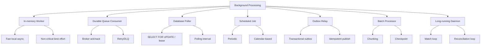
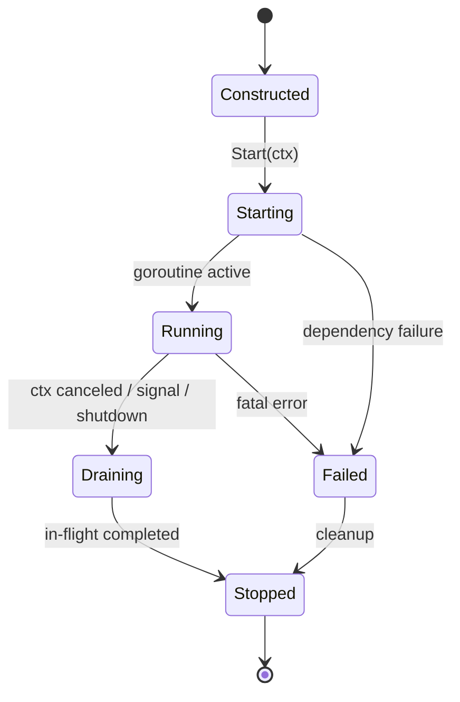
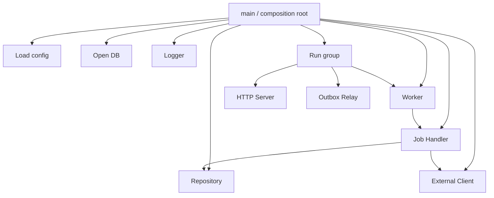
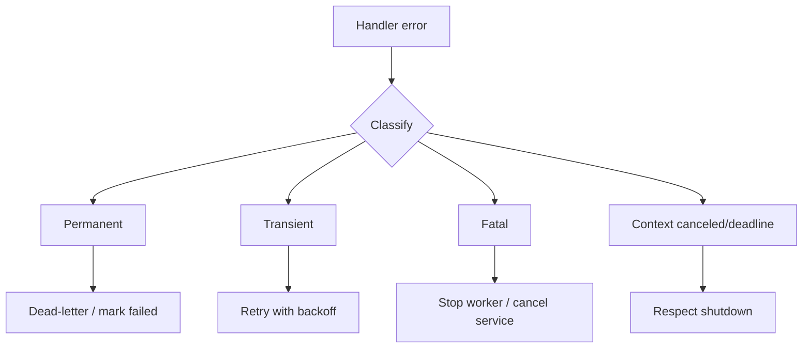
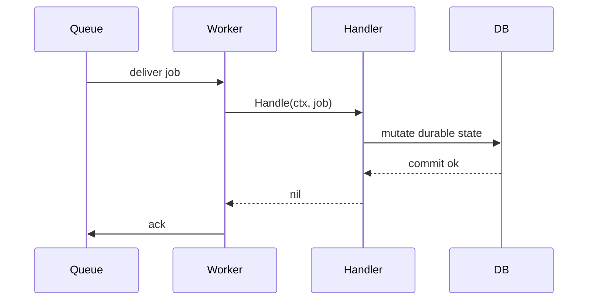
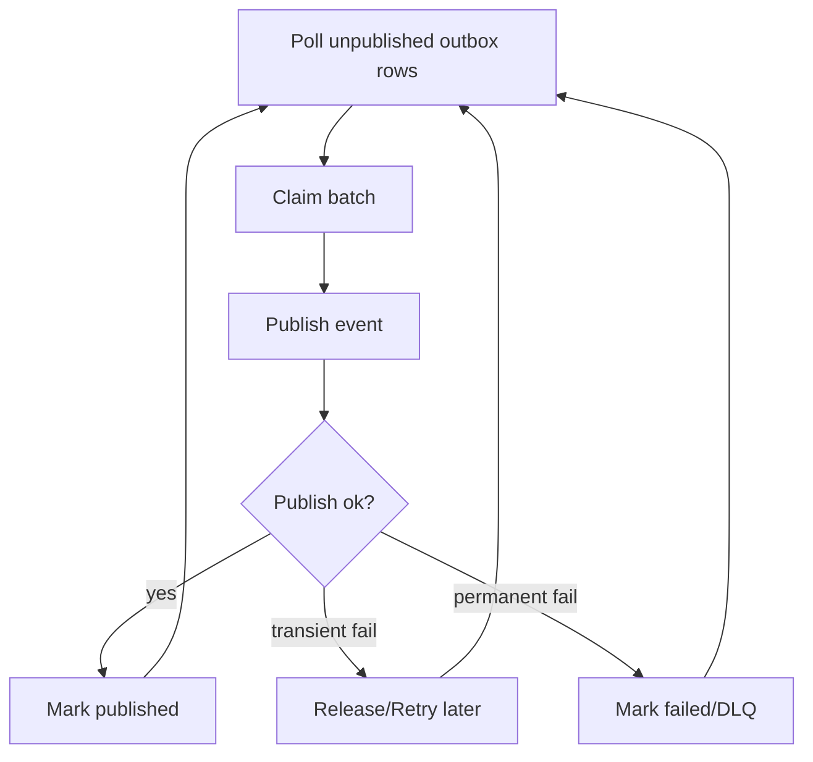
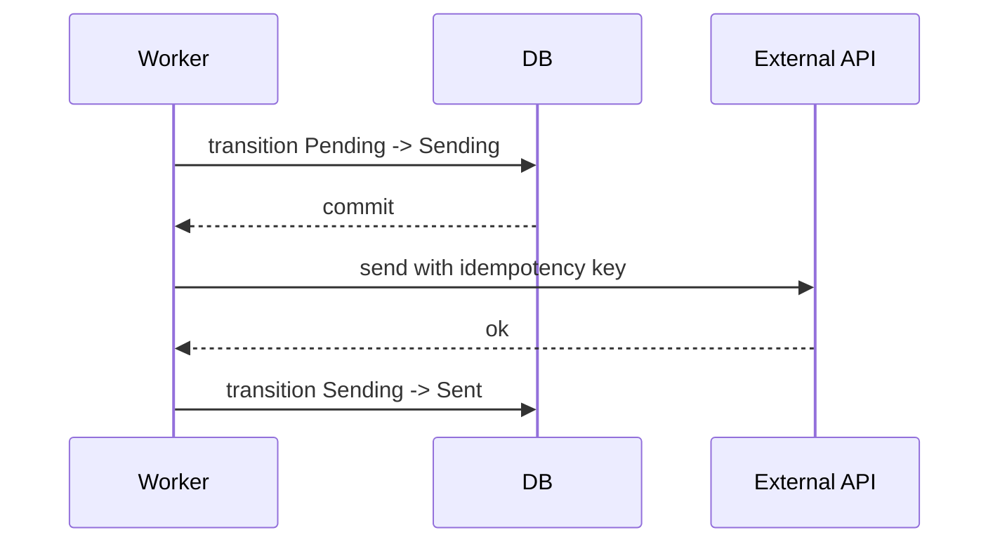

# learn-go-design-patterns-common-patterns-anti-patterns-part-023.md

# Part 023 — Worker, Job, and Background Processing Pattern

> Seri: **Go Design Patterns, Common Patterns, and Anti-Patterns**  
> Bagian: **023 dari 035**  
> Target pembaca: **Java software engineer yang ingin membangun mental model Go production-grade**  
> Fokus: **worker lifecycle, job ownership, retry, backoff, lease, idempotency, dead-letter, graceful shutdown, observability, dan anti-pattern background goroutine tanpa owner**

---

## 0. Posisi Part Ini Dalam Seri

Pada part sebelumnya kita sudah membahas:

- package boundary,
- API surface,
- interface placement,
- constructor,
- config,
- dependency wiring,
- adapter/port,
- repository,
- transaction boundary,
- service layer,
- handler,
- middleware,
- context propagation,
- error translation,
- result/decision/policy,
- validation,
- state machine,
- command/use-case,
- event/outbox.

Sekarang kita masuk ke pola yang hampir selalu muncul di service production:

- email sender,
- outbox relay,
- report generator,
- reconciliation job,
- scheduled sync,
- async import/export,
- queue consumer,
- retry worker,
- cleanup job,
- cache warmer,
- notification dispatcher,
- billing/settlement worker,
- regulatory batch processor,
- workflow escalation engine.

Di Go, pola ini terlihat sederhana karena cukup menulis:

```go
go worker.Run()
```

Namun dalam production, satu `go` statement yang tidak didesain dengan benar bisa menjadi sumber:

- goroutine leak,
- duplicate processing,
- retry storm,
- poison message loop,
- inconsistent state,
- shutdown hang,
- lost job,
- double side effect,
- deadlock,
- invisible failure,
- unbounded memory growth,
- high cardinality observability,
- operational incident yang sulit direproduksi.

Part ini membahas **background processing sebagai lifecycle design problem**, bukan sekadar concurrency syntax.

---

## 1. Core Thesis

**Worker bukan goroutine. Worker adalah owned runtime component yang memproses unit kerja dengan contract lifecycle, reliability, backpressure, idempotency, observability, dan shutdown yang jelas.**

Dalam Go, goroutine hanyalah mekanisme eksekusi ringan. Pattern production yang benar bukan “start goroutine”, tetapi:

1. siapa owner-nya,
2. kapan dimulai,
3. kapan berhenti,
4. bagaimana menerima work,
5. bagaimana memberi backpressure,
6. bagaimana menangani error,
7. bagaimana retry,
8. bagaimana mencegah duplicate side effect,
9. bagaimana mendeteksi poison job,
10. bagaimana mengukur health,
11. bagaimana shutdown tanpa kehilangan data,
12. bagaimana test deterministically.

---

## 2. Java Mindset vs Go Mindset

Sebagai Java engineer, kamu mungkin familiar dengan:

- `ExecutorService`,
- `ScheduledExecutorService`,
- Spring `@Scheduled`,
- Spring Batch,
- Quartz,
- Kafka listener container,
- JMS listener,
- `@Async`,
- managed lifecycle bean,
- dependency-injected worker component,
- framework-driven shutdown hook.

Di Go, banyak hal itu tidak datang otomatis dari framework.

Go memberi primitive:

- goroutine,
- channel,
- `context.Context`,
- `sync.WaitGroup`,
- `sync.Mutex`,
- `time.Timer`,
- `time.Ticker`,
- `os/signal.NotifyContext`,
- `database/sql`,
- HTTP client/server,
- explicit function calls.

Karena itu, desain worker Go biasanya lebih eksplisit.

### Perbandingan mental model

| Concern | Java/Spring mental model | Go mental model |
|---|---|---|
| Start lifecycle | container starts bean/listener | composition root calls `Start`/`Run` |
| Stop lifecycle | framework shutdown hook | parent context cancellation + `Wait` |
| Async execution | executor/container | goroutine owned by component |
| Scheduling | annotation/framework scheduler | ticker/timer/cron library/queue delay |
| Error handling | exception/listener error handler | explicit return/classification |
| Retry | framework policy | explicit retry/backoff loop |
| Transaction | framework annotation | explicit transaction runner |
| Dependency | injected bean graph | constructor wiring |
| Observability | AOP/interceptor | explicit logging/metrics/tracing |
| Worker health | actuator/container | explicit heartbeat/metrics/readiness |

Go tidak melarang framework, tetapi Go design biasanya lebih kuat ketika lifecycle dan failure behavior terlihat dari kode.

---

## 3. Vocabulary

Sebelum masuk pattern, kita definisikan istilah.

### 3.1 Worker

**Worker** adalah komponen runtime yang menjalankan loop pemrosesan unit kerja.

Contoh:

- queue consumer,
- outbox relay,
- report processor,
- scheduled cleanup,
- email dispatcher.

Worker punya lifecycle:

- start,
- run,
- stop,
- drain,
- wait,
- close.

### 3.2 Job

**Job** adalah unit kerja yang diproses worker.

Contoh:

```go
type SendEmailJob struct {
    ID          string
    Recipient   string
    TemplateID  string
    Payload     []byte
    Attempt     int
    CreatedAt   time.Time
}
```

Job harus punya identity yang cukup untuk:

- logging,
- metrics,
- retry,
- deduplication,
- idempotency,
- tracing,
- dead-letter.

### 3.3 Task

**Task** sering dipakai untuk unit eksekusi yang lebih kecil dari job. Dalam seri ini, kita gunakan:

- job = durable unit work,
- task = in-memory work item,
- worker = processor.

### 3.4 Queue Consumer

Consumer membaca job dari broker/queue:

- RabbitMQ,
- Kafka,
- SQS,
- Redis stream,
- database table,
- internal channel.

### 3.5 Scheduler

Scheduler membuat atau memilih job berdasarkan waktu.

Contoh:

- setiap 5 menit scan expired case,
- setiap malam generate report,
- polling outbox tiap 1 detik,
- delay retry sampai `next_attempt_at`.

### 3.6 Relay

Relay mengambil data durable dari storage lalu mengirim ke external system.

Contoh utama:

- outbox relay.

### 3.7 Lease

Lease adalah klaim temporal atas job agar tidak diproses dua worker bersamaan.

Contoh field:

- `locked_by`,
- `locked_until`,
- `attempt`,
- `status`.

### 3.8 Poison Job

Poison job adalah job yang terus gagal karena payload/rule/state salah sehingga retry biasa tidak akan menyelesaikan.

### 3.9 Dead-Letter

Dead-letter adalah tempat job gagal permanen dipindahkan untuk investigasi/manual handling.

---

## 4. Taxonomy Background Processing

Tidak semua worker sama. Desain tergantung tipe kerja.



### 4.1 In-memory worker

Cocok untuk:

- local CPU work,
- non-durable internal pipeline,
- request-scoped fan-out/fan-in,
- cache refresh yang boleh hilang.

Tidak cocok untuk:

- critical business side effect,
- payment/email/regulatory notification tanpa durability,
- job yang harus survive restart.

### 4.2 Durable queue consumer

Cocok untuk:

- asynchronous integration,
- workload leveling,
- retryable external call,
- decoupling producer/consumer.

Butuh:

- ack/nack semantics,
- idempotency,
- DLQ,
- observability,
- ordering decision.

### 4.3 Database poller

Cocok untuk:

- outbox relay,
- simple durable jobs tanpa broker,
- status-based work queue,
- scheduled delayed retry.

Butuh:

- lease/lock,
- pagination,
- index,
- concurrency control,
- cleanup.

### 4.4 Scheduled job

Cocok untuk:

- periodic cleanup,
- reconciliation,
- report generation,
- escalation scan.

Butuh:

- no-overlap policy,
- distributed lock jika multi-instance,
- catch-up semantics,
- observability.

### 4.5 Batch processor

Cocok untuk:

- large import/export,
- nightly report,
- migration,
- backfill,
- reindexing.

Butuh:

- checkpoint,
- chunking,
- retry per chunk,
- resumability,
- memory control.

---

## 5. Worker Lifecycle Model

Worker production-grade harus punya lifecycle eksplisit.



### 5.1 Lifecycle invariant

Worker yang baik menjawab:

| Question | Harus jelas? |
|---|---:|
| Siapa yang membuat worker? | yes |
| Siapa yang memulai worker? | yes |
| Apakah `Start` blocking atau non-blocking? | yes |
| Apakah `Run` blocking? | yes |
| Bagaimana cancel? | yes |
| Bagaimana menunggu selesai? | yes |
| Bagaimana error fatal dilaporkan? | yes |
| Apakah shutdown drain atau immediate? | yes |
| Apakah worker bisa restart? | explicit |
| Apakah worker idempotent saat start? | explicit |

### 5.2 Prefer `Run(ctx)` untuk worker sederhana

Pattern paling sederhana dan paling jelas:

```go
type Worker struct {
    jobs <-chan Job
    h    Handler
    log  *slog.Logger
}

func (w *Worker) Run(ctx context.Context) error {
    for {
        select {
        case <-ctx.Done():
            return ctx.Err()
        case job, ok := <-w.jobs:
            if !ok {
                return nil
            }
            if err := w.h.Handle(ctx, job); err != nil {
                w.log.Error("job failed", "job_id", job.ID, "err", err)
            }
        }
    }
}
```

Kelebihan:

- lifecycle jelas,
- caller menentukan goroutine,
- mudah dites,
- cancellation eksplisit,
- tidak ada hidden goroutine.

Di `main`:

```go
func main() {
    ctx, stop := signal.NotifyContext(context.Background(), os.Interrupt, syscall.SIGTERM)
    defer stop()

    worker := NewWorker(jobs, handler, logger)
    if err := worker.Run(ctx); err != nil && !errors.Is(err, context.Canceled) {
        logger.Error("worker stopped", "err", err)
        os.Exit(1)
    }
}
```

### 5.3 `Start/Stop` untuk worker yang lebih kompleks

Kadang worker perlu non-blocking start:

```go
type Worker struct {
    jobs <-chan Job
    h    Handler
    log  *slog.Logger

    cancel context.CancelFunc
    done   chan struct{}
    once   sync.Once
}

func (w *Worker) Start(parent context.Context) {
    ctx, cancel := context.WithCancel(parent)
    w.cancel = cancel
    w.done = make(chan struct{})

    go func() {
        defer close(w.done)
        _ = w.run(ctx)
    }()
}

func (w *Worker) Stop() {
    if w.cancel != nil {
        w.cancel()
    }
    if w.done != nil {
        <-w.done
    }
}
```

Namun `Start/Stop` mudah salah:

- `Start` dipanggil dua kali,
- `Stop` sebelum `Start`,
- error worker hilang,
- deadlock ketika `Stop` dipanggil dari goroutine worker,
- race pada field `cancel/done`.

Untuk worker library, sering lebih aman expose `Run(ctx)` dan biarkan composition root mengatur goroutine.

---

## 6. Composition Root Pattern for Workers

Background worker sebaiknya diwiring di composition root, bukan diam-diam dari constructor.



Constructor hanya membangun object graph:

```go
worker := jobs.NewWorker(jobs.WorkerConfig{
    Concurrency: 8,
    BatchSize:   100,
}, repo, handler, logger)
```

Worker dimulai eksplisit:

```go
g.Go(func() error { return worker.Run(ctx) })
```

Ini membuat runtime topology terlihat.

---

## 7. Run Group Pattern

Production service biasanya punya beberapa component yang berjalan bersama:

- HTTP server,
- metrics server,
- queue consumer,
- outbox relay,
- scheduler,
- signal handler.

Kita butuh run group:

- jika satu component fatal, cancel semua,
- tunggu semuanya selesai,
- propagate error yang relevan.

Minimal pattern:

```go
type Group struct {
    ctx    context.Context
    cancel context.CancelFunc
    wg     sync.WaitGroup
    errCh  chan error
}

func NewGroup(parent context.Context) *Group {
    ctx, cancel := context.WithCancel(parent)
    return &Group{
        ctx:    ctx,
        cancel: cancel,
        errCh:  make(chan error, 1),
    }
}

func (g *Group) Go(fn func(context.Context) error) {
    g.wg.Add(1)
    go func() {
        defer g.wg.Done()
        if err := fn(g.ctx); err != nil && !errors.Is(err, context.Canceled) {
            select {
            case g.errCh <- err:
                g.cancel()
            default:
            }
        }
    }()
}

func (g *Group) Wait() error {
    done := make(chan struct{})
    go func() {
        defer close(done)
        g.wg.Wait()
    }()

    select {
    case err := <-g.errCh:
        g.cancel()
        <-done
        return err
    case <-done:
        return nil
    }
}
```

Usage:

```go
g := NewGroup(rootCtx)

g.Go(func(ctx context.Context) error { return httpServer.Run(ctx) })
g.Go(func(ctx context.Context) error { return outboxRelay.Run(ctx) })
g.Go(func(ctx context.Context) error { return emailWorker.Run(ctx) })

if err := g.Wait(); err != nil {
    logger.Error("service stopped with error", "err", err)
}
```

In production, kamu bisa memakai package seperti `errgroup` bila sesuai, tetapi mental model-nya tetap sama:

- common context,
- cancel on fatal error,
- wait all goroutines,
- return root cause.

---

## 8. Job Shape Pattern

Job bukan sekadar payload.

Job production-grade biasanya butuh:

```go
type Job struct {
    ID            string
    Type          string
    Payload       json.RawMessage
    Attempt       int
    MaxAttempts   int
    CreatedAt     time.Time
    AvailableAt   time.Time
    CorrelationID string
    CausationID   string
    TraceID       string
    IdempotencyKey string
}
```

### 8.1 Job identity

Job harus punya ID stabil untuk:

- log,
- metrics,
- tracing,
- dedup,
- dead-letter,
- retry record,
- manual replay.

### 8.2 Job type

Job type harus meaningful:

```go
const (
    JobSendEmail       = "notification.email.send"
    JobPublishOutbox   = "outbox.publish"
    JobGenerateReport  = "report.generate"
    JobEscalateCase    = "case.escalate"
)
```

Hindari nama generic:

- `process`,
- `task`,
- `worker-job`,
- `event`,
- `async`.

### 8.3 Payload version

Untuk durable job, payload akan hidup lebih lama dari code version.

```go
type JobEnvelope struct {
    ID      string          `json:"id"`
    Type    string          `json:"type"`
    Version int             `json:"version"`
    Payload json.RawMessage `json:"payload"`
}
```

Tanpa version, replay job lama bisa gagal setelah deployment.

### 8.4 Metadata bukan business payload

Pisahkan:

- payload bisnis,
- metadata delivery.

```go
type JobEnvelope struct {
    Metadata JobMetadata     `json:"metadata"`
    Payload  json.RawMessage `json:"payload"`
}
```

Ini menghindari payload domain tercampur attempt/retry/trace concern.

---

## 9. Handler Pattern for Jobs

Worker sebaiknya tidak berisi business logic. Worker hanya orchestration runtime.

```go
type Handler interface {
    Handle(ctx context.Context, job Job) error
}
```

Atau function type:

```go
type HandlerFunc func(context.Context, Job) error

func (f HandlerFunc) Handle(ctx context.Context, job Job) error {
    return f(ctx, job)
}
```

Worker:

```go
func (w *Worker) handleOne(ctx context.Context, job Job) {
    start := time.Now()

    err := w.handler.Handle(ctx, job)
    if err != nil {
        w.onFailure(ctx, job, err)
        return
    }

    w.onSuccess(ctx, job, time.Since(start))
}
```

Handler:

```go
type SendEmailHandler struct {
    repo   EmailRepo
    client MailClient
    tx     TxRunner
}

func (h *SendEmailHandler) Handle(ctx context.Context, job Job) error {
    var payload SendEmailPayload
    if err := json.Unmarshal(job.Payload, &payload); err != nil {
        return PermanentError{Err: err}
    }

    return h.tx.WithinTx(ctx, func(ctx context.Context, tx Tx) error {
        msg, err := h.repo.GetPendingEmail(ctx, tx, payload.EmailID)
        if err != nil {
            return err
        }

        if msg.SentAt != nil {
            return nil // idempotent no-op
        }

        providerID, err := h.client.Send(ctx, msg.ToProviderRequest())
        if err != nil {
            return classifyEmailError(err)
        }

        return h.repo.MarkSent(ctx, tx, msg.ID, providerID)
    })
}
```

Notice:

- job decoding di handler,
- permanent decode error tidak diretly retry,
- idempotency checked before side effect,
- transaction ownership explicit,
- external call position harus dipikirkan hati-hati.

---

## 10. Error Classification Pattern

Worker tidak bisa memperlakukan semua error sama.

Minimal taxonomy:



### 10.1 Error classes

| Class | Meaning | Action |
|---|---|---|
| Permanent | Payload/rule/state invalid; retry tidak membantu | mark failed / DLQ |
| Transient | Network timeout, rate limit, temporary dependency issue | retry later |
| Fatal | Misconfiguration, schema mismatch, dependency unavailable at startup | stop worker/service |
| Canceled | Parent shutdown/cancellation | stop gracefully |
| Deadline | Operation exceeded budget | retry or fail depending policy |

### 10.2 Typed classification

```go
type Class string

const (
    ClassPermanent Class = "permanent"
    ClassTransient Class = "transient"
    ClassFatal     Class = "fatal"
)

type ClassifiedError struct {
    Class Class
    Err   error
}

func (e ClassifiedError) Error() string { return e.Err.Error() }
func (e ClassifiedError) Unwrap() error { return e.Err }
```

Helpers:

```go
func Permanent(err error) error {
    return ClassifiedError{Class: ClassPermanent, Err: err}
}

func Transient(err error) error {
    return ClassifiedError{Class: ClassTransient, Err: err}
}

func Fatal(err error) error {
    return ClassifiedError{Class: ClassFatal, Err: err}
}
```

Classifier:

```go
func Classify(err error) Class {
    if err == nil {
        return ""
    }

    if errors.Is(err, context.Canceled) {
        return ClassFatal // or shutdown path handled separately
    }

    var ce ClassifiedError
    if errors.As(err, &ce) {
        return ce.Class
    }

    return ClassTransient
}
```

Defaulting unknown error to transient or permanent depends on system risk:

- external API call often transient,
- invalid payload often permanent,
- data mutation error may require careful classification.

### 10.3 Anti-pattern: string matching

Bad:

```go
if strings.Contains(err.Error(), "timeout") {
    retry()
}
```

Better:

```go
if errors.Is(err, context.DeadlineExceeded) || isTemporary(err) {
    retry()
}
```

---

## 11. Retry Pattern

Retry adalah safety mechanism sekaligus risk amplifier.

Retry yang salah bisa memperburuk outage.

### 11.1 Retry decision

Retry hanya boleh dilakukan jika:

1. error retryable,
2. operation idempotent atau dilindungi idempotency key,
3. ada max attempts,
4. ada backoff,
5. ada jitter,
6. ada deadline/budget,
7. retry tidak melanggar ordering/consistency,
8. observability cukup.

### 11.2 Retry metadata

Durable job perlu field:

```sql
attempt_count
max_attempts
next_attempt_at
last_error_code
last_error_message
locked_by
locked_until
```

### 11.3 Exponential backoff with jitter

```go
func Backoff(attempt int, base, max time.Duration) time.Duration {
    if attempt < 1 {
        attempt = 1
    }

    d := base << min(attempt-1, 10)
    if d > max {
        d = max
    }

    // simple jitter: 50%-100%
    jitter := time.Duration(rand.Int63n(int64(d / 2)))
    return d/2 + jitter
}
```

Production notes:

- Use per-process randomness safely.
- Avoid deterministic synchronized retry across replicas.
- Cap max backoff.
- Record next attempt durably.

### 11.4 Retry budget

Retry budget prevents infinite recovery storms.

```go
type RetryPolicy struct {
    MaxAttempts int
    BaseDelay   time.Duration
    MaxDelay    time.Duration
}
```

Decision:

```go
func (p RetryPolicy) Next(attempt int) (time.Duration, bool) {
    if attempt >= p.MaxAttempts {
        return 0, false
    }
    return Backoff(attempt+1, p.BaseDelay, p.MaxDelay), true
}
```

### 11.5 Retry location

Retry can happen at different layers:

| Layer | Example | Risk |
|---|---|---|
| HTTP client | retry request | duplicate external side effect |
| job worker | retry whole job | slower but more controlled |
| queue broker | redelivery | can hide application semantics |
| database poller | `next_attempt_at` | explicit, debuggable |
| orchestrator | restart process | too coarse |

Prefer retry at the layer that understands idempotency and classification.

---

## 12. Idempotency Pattern

Background jobs are commonly at-least-once.

Therefore handler must assume:

- job can be delivered twice,
- worker can crash after side effect but before ack,
- broker can redeliver,
- retry can duplicate,
- operator can manually replay,
- deployment can restart midway.

### 12.1 Idempotency invariant

**Processing the same job more than once must not produce inconsistent or duplicate external state.**

### 12.2 Common idempotency strategies

| Strategy | Example |
|---|---|
| unique constraint | `job_id` unique in processed table |
| natural key | `case_id + transition_id` |
| external idempotency key | payment/email provider request key |
| state check | if already sent/closed, no-op |
| compare-and-swap | update only expected version/state |
| outbox state | publish only unpublished event ID |

### 12.3 Processed job table

```sql
CREATE TABLE processed_jobs (
    job_id          TEXT PRIMARY KEY,
    processed_at    TIMESTAMP NOT NULL,
    result_code     TEXT NOT NULL
);
```

Handler pattern:

```go
func (h *Handler) Handle(ctx context.Context, job Job) error {
    return h.tx.WithinTx(ctx, func(ctx context.Context, tx Tx) error {
        ok, err := h.repo.TryMarkProcessing(ctx, tx, job.ID)
        if err != nil {
            return err
        }
        if !ok {
            return nil // duplicate job; already processed
        }

        if err := h.process(ctx, tx, job); err != nil {
            return err
        }

        return h.repo.MarkProcessed(ctx, tx, job.ID)
    })
}
```

Caveat: if external side effect occurs inside this transaction, database cannot roll it back. For external side effects, use external idempotency key or state machine/outbox design.

### 12.4 State-check idempotency

```go
if invoice.Status == InvoicePaid {
    return nil
}
```

But state-check alone is not enough when two workers race. Add conditional update:

```sql
UPDATE invoices
SET status = 'paid', version = version + 1
WHERE id = $1 AND status = 'pending' AND version = $2;
```

If affected rows = 0, reload state and decide.

---

## 13. Queue Ack/Nack Pattern

Queue consumer harus mengatur ack dengan hati-hati.



### 13.1 Ack after durable success

Do not ack before side effect is durable.

Bad:

```go
msg.Ack()
err := handler.Handle(ctx, job)
```

If process crashes after ack, job is lost.

Better:

```go
if err := handler.Handle(ctx, job); err != nil {
    return handleFailure(msg, err)
}
return msg.Ack()
```

### 13.2 Nack vs retry later

For transient error:

- nack with requeue may cause immediate hot loop,
- better publish retry with delay or update `next_attempt_at`,
- use broker-specific delayed retry/DLQ if available.

### 13.3 Permanent error

Permanent error should not requeue infinitely.

Action:

- ack original,
- write to DLQ/failed table,
- emit alert/metric.

### 13.4 Ack failure

Ack itself can fail due to connection loss.

Implication:

- job may be redelivered,
- handler must be idempotent,
- logs should treat ack failure as delivery uncertainty.

---

## 14. Database Poller Pattern

Database-backed job queue is common and often good enough.

### 14.1 Table shape

```sql
CREATE TABLE jobs (
    id                TEXT PRIMARY KEY,
    type              TEXT NOT NULL,
    version           INT NOT NULL,
    payload           JSONB NOT NULL,
    status            TEXT NOT NULL,
    attempt_count     INT NOT NULL DEFAULT 0,
    max_attempts      INT NOT NULL,
    available_at      TIMESTAMP NOT NULL,
    locked_by         TEXT NULL,
    locked_until      TIMESTAMP NULL,
    last_error_code   TEXT NULL,
    last_error_message TEXT NULL,
    created_at        TIMESTAMP NOT NULL,
    updated_at        TIMESTAMP NOT NULL
);

CREATE INDEX idx_jobs_available
ON jobs (status, available_at, locked_until);
```

For Oracle/MySQL/PostgreSQL, SQL syntax differs, but model is similar.

### 14.2 Lease acquisition

High-level:

1. select available jobs,
2. lock/claim them,
3. process,
4. mark done/retry/failed.

PostgreSQL-ish example:

```sql
UPDATE jobs
SET locked_by = $1,
    locked_until = $2,
    updated_at = NOW()
WHERE id IN (
    SELECT id
    FROM jobs
    WHERE status = 'pending'
      AND available_at <= NOW()
      AND (locked_until IS NULL OR locked_until < NOW())
    ORDER BY available_at ASC
    LIMIT $3
    FOR UPDATE SKIP LOCKED
)
RETURNING *;
```

Important: database-specific semantics matter.

### 14.3 Lease duration

Lease must be:

- longer than normal processing time,
- shorter than acceptable recovery time,
- extendable for long jobs,
- observable.

### 14.4 Lease heartbeat

For long-running job:

```go
func (w *Worker) heartbeat(ctx context.Context, jobID string, stop <-chan struct{}) {
    ticker := time.NewTicker(w.heartbeatInterval)
    defer ticker.Stop()

    for {
        select {
        case <-ctx.Done():
            return
        case <-stop:
            return
        case <-ticker.C:
            if err := w.repo.ExtendLease(ctx, jobID, w.workerID, w.leaseTTL); err != nil {
                w.log.Warn("extend lease failed", "job_id", jobID, "err", err)
            }
        }
    }
}
```

But heartbeat itself needs careful shutdown and ownership.

### 14.5 Polling interval

Too short:

- DB pressure,
- noisy logs,
- CPU waste.

Too long:

- latency high,
- retry delayed.

Use adaptive polling:

- if batch found: poll immediately,
- if no job: sleep/backoff,
- cap max interval.

```go
idle := w.minIdle
for {
    n, err := w.pollOnce(ctx)
    if err != nil {
        idle = minDuration(idle*2, w.maxIdle)
    } else if n > 0 {
        idle = w.minIdle
    } else {
        idle = minDuration(idle*2, w.maxIdle)
    }

    timer := time.NewTimer(idle)
    select {
    case <-ctx.Done():
        timer.Stop()
        return ctx.Err()
    case <-timer.C:
    }
}
```

---

## 15. Scheduled Worker Pattern

Scheduled worker runs periodically.

### 15.1 Basic ticker loop

```go
func (s *Scheduler) Run(ctx context.Context) error {
    ticker := time.NewTicker(s.interval)
    defer ticker.Stop()

    for {
        select {
        case <-ctx.Done():
            return ctx.Err()
        case t := <-ticker.C:
            if err := s.runOnce(ctx, t); err != nil {
                s.log.Error("scheduled job failed", "err", err)
            }
        }
    }
}
```

### 15.2 No-overlap policy

If job takes longer than interval, should next run overlap?

Options:

| Policy | Meaning |
|---|---|
| skip if running | simple, avoids duplicate work |
| queue next run | preserves frequency, can backlog |
| run concurrently | only if safe |
| cancel previous | useful for refresh tasks |

No-overlap example:

```go
var running atomic.Bool

func (s *Scheduler) runOnce(ctx context.Context, t time.Time) error {
    if !running.CompareAndSwap(false, true) {
        s.log.Warn("scheduled run skipped; previous run still active")
        return nil
    }
    defer running.Store(false)

    return s.job.Run(ctx, t)
}
```

For multi-instance deployment, use distributed lock/lease, not process-local atomic flag.

### 15.3 Catch-up semantics

If service is down at 01:00 scheduled run, what happens at 01:30?

Choices:

- skip missed run,
- run once at startup,
- catch up all missed periods,
- generate durable scheduled job rows ahead of time.

Regulatory/reporting workflows often need explicit catch-up semantics.

---

## 16. Worker Pool Pattern

Worker pool limits concurrency.

### 16.1 Basic bounded worker pool

```go
func RunPool(ctx context.Context, jobs <-chan Job, n int, h Handler) error {
    var wg sync.WaitGroup

    for i := 0; i < n; i++ {
        wg.Add(1)
        go func(workerID int) {
            defer wg.Done()
            for {
                select {
                case <-ctx.Done():
                    return
                case job, ok := <-jobs:
                    if !ok {
                        return
                    }
                    _ = h.Handle(ctx, job)
                }
            }
        }(i)
    }

    done := make(chan struct{})
    go func() {
        defer close(done)
        wg.Wait()
    }()

    select {
    case <-ctx.Done():
        <-done
        return ctx.Err()
    case <-done:
        return nil
    }
}
```

### 16.2 Concurrency is resource policy

Concurrency should be chosen based on bottleneck:

| Bottleneck | Limit by |
|---|---|
| CPU-bound | CPU cores / profiling |
| DB-bound | DB pool size and query cost |
| external API | rate limit and latency |
| memory-heavy | memory budget |
| lock-heavy | contention |
| per-tenant fairness | per-tenant concurrency |

Do not choose `100` because it “feels fast”.

### 16.3 Worker pool anti-pattern

Bad:

```go
for _, job := range jobs {
    go process(job)
}
```

This is unbounded concurrency.

Better:

```go
sem := make(chan struct{}, maxConcurrency)
for _, job := range jobs {
    select {
    case <-ctx.Done():
        return ctx.Err()
    case sem <- struct{}{}:
    }

    go func(job Job) {
        defer func() { <-sem }()
        _ = process(ctx, job)
    }(job)
}
```

But for continuous workers, prefer explicit worker pool with job channel or durable queue claim size.

---

## 17. Backpressure Pattern

Backpressure answers: what happens when producers are faster than consumers?

### 17.1 Backpressure mechanisms

| Mechanism | Example |
|---|---|
| bounded channel | block producer when full |
| queue depth limit | reject/slow input |
| rate limit | token bucket |
| batch size | limit per poll |
| DB lease limit | claim max N jobs |
| circuit breaker | stop calling failing dependency |
| priority queue | serve critical work first |
| load shedding | drop best-effort work |

### 17.2 Bounded channel

```go
jobs := make(chan Job, 1000)
```

Bound is not arbitrary. It is memory and latency policy.

If each job can hold 100KB payload, 1000 buffered jobs means potential 100MB plus overhead.

### 17.3 Backpressure at durable queue

For durable queues:

- monitor queue depth,
- monitor oldest job age,
- monitor processing rate,
- scale consumers carefully,
- avoid scaling beyond downstream capacity.

---

## 18. Graceful Shutdown Pattern

Graceful shutdown means:

1. stop accepting new work,
2. allow in-flight work to finish within budget,
3. renew/return leases appropriately,
4. commit/rollback safely,
5. ack only completed work,
6. release resources,
7. report final status.

### 18.1 Signal to context

In Go, `os/signal.NotifyContext` is useful for creating a root context that cancels on OS signal.

```go
ctx, stop := signal.NotifyContext(context.Background(), os.Interrupt, syscall.SIGTERM)
defer stop()
```

### 18.2 Shutdown budget

Use separate shutdown timeout:

```go
<-ctx.Done()

shutdownCtx, cancel := context.WithTimeout(context.Background(), 30*time.Second)
defer cancel()

if err := app.Shutdown(shutdownCtx); err != nil {
    logger.Error("shutdown failed", "err", err)
}
```

### 18.3 Drain vs immediate stop

| Mode | Behavior | Use case |
|---|---|---|
| drain | finish current jobs | durable side effects |
| immediate | stop ASAP | stateless refresh/cache |
| checkpoint | persist progress then stop | batch job |
| abandon lease | allow other worker to retry | queue/DB jobs |

### 18.4 Shutdown-aware job handling

Handler should use context.

```go
func (h *Handler) Handle(ctx context.Context, job Job) error {
    req, err := http.NewRequestWithContext(ctx, http.MethodPost, h.url, body)
    if err != nil {
        return err
    }

    resp, err := h.client.Do(req)
    if err != nil {
        return err
    }
    defer resp.Body.Close()

    return nil
}
```

If handler ignores context, shutdown may hang.

---

## 19. Durable Batch Pattern

Batch job needs resumability.

### 19.1 Chunking

Bad:

```go
rows := loadAllRows()
for _, row := range rows {
    process(row)
}
```

Better:

```go
for {
    batch, err := repo.NextBatch(ctx, cursor, 1000)
    if err != nil {
        return err
    }
    if len(batch) == 0 {
        return nil
    }

    if err := processBatch(ctx, batch); err != nil {
        return err
    }

    cursor = batch[len(batch)-1].ID
    if err := repo.SaveCheckpoint(ctx, jobID, cursor); err != nil {
        return err
    }
}
```

### 19.2 Checkpoint invariant

Checkpoint must only advance after durable processing of previous chunk.

### 19.3 Batch partial failure

Options:

- fail whole chunk,
- record per-row failure,
- move failed rows to error table,
- continue if non-blocking,
- stop on invariant violation.

### 19.4 Regulatory batch

For regulatory workflows, batch output often needs:

- run ID,
- input snapshot time,
- rule version,
- operator/system actor,
- row-level decision reason,
- summary counts,
- reconciliation hash/checksum,
- replay command.

---

## 20. Outbox Relay Worker

Part 022 covered outbox concept. Here we focus on worker shape.

### 20.1 Relay lifecycle



### 20.2 Publish idempotency

Outbox event ID should be stable.

Consumer should dedupe by event ID.

Publisher should not generate a new event ID per retry.

### 20.3 Mark published after broker ack

```go
if err := publisher.Publish(ctx, event); err != nil {
    return repo.MarkRetry(ctx, event.ID, err)
}
return repo.MarkPublished(ctx, event.ID)
```

If crash occurs after publish before mark, event may be published again. Therefore consumer idempotency remains required.

---

## 21. Lease and Lock Pattern

### 21.1 Why lease, not permanent lock?

If worker crashes while holding permanent lock, job is stuck.

Lease expires.

### 21.2 Lease invariant

Worker may mutate job only if it still owns the lease.

```sql
UPDATE jobs
SET status = 'done', locked_by = NULL, locked_until = NULL
WHERE id = $1
  AND locked_by = $2
  AND locked_until > NOW();
```

If affected rows = 0, ownership is uncertain/lost.

### 21.3 Clock issue

Lease using database time avoids host clock skew:

```sql
locked_until = NOW() + INTERVAL '60 seconds'
```

Prefer DB time for DB lease.

### 21.4 Distributed lock warning

Distributed locks are easy to misuse.

Before using distributed lock, ask:

- Can I model this as idempotent conditional update?
- Can queue partitioning solve this?
- Can unique constraint solve this?
- Can state machine transition guard solve this?
- Is lock needed for correctness or just convenience?

---

## 22. Poison Message Pattern

Poison message is a job that will never succeed under current logic/state.

### 22.1 Detection

Signals:

- same job fails repeatedly,
- error class permanent,
- max attempts exceeded,
- invalid payload schema,
- missing required entity,
- invariant violation,
- unauthorized transition,
- non-retryable external response.

### 22.2 Dead-letter record

Dead-letter should preserve:

```go
type DeadLetter struct {
    JobID        string
    JobType      string
    Payload      json.RawMessage
    Attempts     int
    LastError    string
    ErrorClass   string
    FailedAt     time.Time
    CorrelationID string
}
```

### 22.3 Manual replay

Replay should be explicit and audited:

- who replayed,
- when,
- why,
- from which version,
- whether payload was modified,
- original job ID vs replay job ID.

### 22.4 Do not hide poison messages

Bad:

```go
if err != nil {
    log.Println(err)
    return nil // ack
}
```

This loses the job.

Better:

- classify,
- persist failure,
- alert if needed,
- support replay.

---

## 23. Observability Pattern

Worker observability must answer:

- Is worker running?
- Is it processing?
- Is queue depth growing?
- What is oldest job age?
- What is success/failure rate?
- What error classes dominate?
- Are retries increasing?
- Are jobs stuck leased?
- Are poison jobs accumulating?
- Which tenant/type is affected?

### 23.1 Logs

Good log fields:

```go
logger.Info("job started",
    "job_id", job.ID,
    "job_type", job.Type,
    "attempt", job.Attempt,
    "correlation_id", job.CorrelationID,
)
```

Failure:

```go
logger.Error("job failed",
    "job_id", job.ID,
    "job_type", job.Type,
    "attempt", job.Attempt,
    "class", class,
    "err", err,
)
```

Avoid logging full payload if it contains PII/secrets.

### 23.2 Metrics

Recommended metrics:

| Metric | Type | Labels |
|---|---|---|
| `worker_jobs_started_total` | counter | worker, job_type |
| `worker_jobs_completed_total` | counter | worker, job_type |
| `worker_jobs_failed_total` | counter | worker, job_type, error_class |
| `worker_job_duration_seconds` | histogram | worker, job_type |
| `worker_queue_depth` | gauge | worker, queue |
| `worker_oldest_job_age_seconds` | gauge | worker, queue |
| `worker_inflight_jobs` | gauge | worker |
| `worker_retries_total` | counter | worker, job_type |
| `worker_deadletters_total` | counter | worker, job_type |

Avoid high-cardinality labels:

- job ID,
- user ID,
- email,
- case number,
- error message.

### 23.3 Tracing

Worker trace should link to:

- producer trace,
- event causation,
- correlation ID,
- external calls,
- DB operations.

For async jobs, trace propagation requires carrying trace context in job metadata where appropriate.

### 23.4 Health/readiness

Worker health is not simply “process is alive”.

Consider:

- last successful poll,
- dependency availability,
- queue lag,
- stuck lease count,
- DLQ growth.

But do not make readiness fail for every transient downstream error, or Kubernetes may restart-loop and amplify outage.

---

## 24. Security Pattern

Background jobs often bypass HTTP auth middleware. That is dangerous.

### 24.1 Actor model

Every job should know actor context:

- user actor,
- system actor,
- service actor,
- scheduler actor,
- imported actor.

```go
type Actor struct {
    Type string
    ID   string
}
```

### 24.2 Authorization still applies

If job performs domain action, it must pass authorization/policy or use explicit system authority.

Bad:

```go
// worker can close any case because it bypasses handler auth
caseRepo.Close(ctx, caseID)
```

Better:

```go
cmd := CloseCaseCommand{
    CaseID: caseID,
    Actor:  SystemActor("case-escalation-worker"),
    Reason: "auto-escalation-timeout",
}
return usecase.CloseCase(ctx, cmd)
```

### 24.3 Payload secrecy

Avoid storing secrets in job payload.

Prefer storing reference IDs and fetch secrets from secure store at execution time.

### 24.4 Audit

For sensitive workflows, job execution should create audit trail:

- job ID,
- actor,
- action,
- input reference,
- decision,
- result,
- timestamp,
- rule version.

---

## 25. Transaction Boundary in Workers

Workers often combine:

- read job,
- validate,
- mutate DB,
- call external API,
- ack job.

This is where consistency bugs happen.

### 25.1 Never hold DB transaction across slow external call unless deliberately justified

Bad:

```go
return tx.WithinTx(ctx, func(ctx context.Context, tx Tx) error {
    order := repo.GetOrder(ctx, tx, id)
    resp := payment.Charge(ctx, order) // network call inside tx
    return repo.MarkPaid(ctx, tx, id, resp.ID)
})
```

Risk:

- long lock time,
- transaction timeout,
- deadlock,
- external side effect cannot rollback.

Better options:

- reserve/transition state in DB,
- commit,
- external call with idempotency key,
- mark result in another transaction,
- use outbox/saga pattern.

### 25.2 State transition before external side effect



If crash after external API before final DB update, retry sees `Sending` and can query provider or retry with same idempotency key.

---

## 26. Ordering Pattern

Some jobs require ordering.

### 26.1 Types of ordering

| Ordering | Example |
|---|---|
| none | email notifications |
| per aggregate | case state transitions |
| per tenant | tenant report generation |
| global | rare and expensive |
| partitioned | Kafka partition key |

### 26.2 Per-aggregate ordering

If jobs mutate same aggregate, use:

- partition key,
- optimistic version,
- state transition guard,
- single flight per key,
- queue partitioning.

Do not enforce global serial processing unless necessary.

### 26.3 Out-of-order event handling

Consumer should handle:

- duplicate event,
- older event,
- missing event,
- future version.

Common pattern:

```go
if event.AggregateVersion <= current.ProcessedVersion {
    return nil
}
if event.AggregateVersion != current.ProcessedVersion+1 {
    return RetryLater("missing prior event")
}
```

---

## 27. Priority and Fairness Pattern

Without fairness, one noisy tenant/job type can starve others.

### 27.1 Priority queues

Job field:

```go
type Priority int

const (
    PriorityLow Priority = iota
    PriorityNormal
    PriorityHigh
    PriorityCritical
)
```

But priority can cause starvation. Add aging or quota.

### 27.2 Tenant fairness

For multi-tenant systems:

- per-tenant concurrency limit,
- per-tenant queue depth,
- weighted fair scheduling,
- per-tenant backoff,
- noisy-neighbor metrics.

### 27.3 Regulatory fairness

For case management/regulatory systems, fairness may mean:

- SLA due date priority,
- severity priority,
- statutory deadline,
- manual override audit,
- officer workload distribution.

This is not just technical priority.

---

## 28. Testing Strategy

Worker tests must be deterministic.

### 28.1 Test handler separately

Most business behavior belongs in handler/use case.

```go
func TestSendEmailHandler_IdempotentWhenAlreadySent(t *testing.T) {
    // arrange repo with sent message
    // execute job
    // assert no external send
}
```

### 28.2 Test worker lifecycle

Test:

- exits on context cancel,
- drains jobs,
- does not leak goroutine,
- handles closed channel,
- calls failure policy,
- respects concurrency limit.

### 28.3 Fake clock

Avoid real sleep in tests.

Design time dependency:

```go
type Clock interface {
    Now() time.Time
    NewTimer(d time.Duration) Timer
}
```

But do not abstract time everywhere unnecessarily. Use fake clock for retry/scheduler-heavy components.

### 28.4 Fake queue

Queue fake should model ack/nack behavior, not just return payload.

### 28.5 Integration tests

For DB poller, test:

- claim does not double-claim,
- expired lease can be reclaimed,
- completed job not reclaimed,
- retry updates attempt and next time,
- failed job goes DLQ.

### 28.6 Chaos-style tests

Simulate:

- crash after side effect before ack,
- crash after publish before mark published,
- DB timeout,
- duplicate delivery,
- out-of-order event,
- long processing beyond lease,
- shutdown during processing.

---

## 29. Performance Considerations

### 29.1 Throughput formula

Approximate:

```text
throughput ≈ concurrency / average_job_latency
```

If job latency is 200ms and concurrency is 10:

```text
10 / 0.2s = 50 jobs/sec
```

But bottlenecks matter:

- DB pool,
- external API rate limit,
- CPU,
- lock contention,
- serialization,
- queue broker prefetch,
- network.

### 29.2 Batch size

Large batch:

- fewer round trips,
- better throughput,
- more memory,
- longer lease,
- worse fairness.

Small batch:

- better fairness,
- lower latency,
- more DB/broker overhead.

### 29.3 Prefetch

Queue prefetch too high can cause:

- unfair distribution,
- long in-memory backlog,
- delayed redelivery on crash,
- memory pressure.

### 29.4 Allocation

Job processing can allocate heavily due to:

- JSON decoding,
- logging fields,
- per-job clients,
- repeated buffer creation,
- reflection-heavy libraries.

Optimize only after measuring. For worker throughput, operational correctness usually matters before micro-optimization.

---

## 30. Common Anti-Patterns

### 30.1 Hidden goroutine in constructor

Bad:

```go
func NewCache() *Cache {
    c := &Cache{}
    go c.refreshLoop()
    return c
}
```

Problems:

- lifecycle hidden,
- cannot stop,
- hard to test,
- leaks after test,
- startup side effect invisible.

Better:

```go
func NewCache(...) *Cache { return &Cache{...} }
func (c *Cache) Run(ctx context.Context) error { ... }
```

### 30.2 Fire-and-forget critical work

Bad:

```go
go sendEmail(orderID)
return nil
```

If process crashes, email lost.

Better:

- persist job,
- outbox,
- durable queue.

### 30.3 Infinite retry without backoff

Bad:

```go
for {
    if err := process(job); err == nil {
        break
    }
}
```

This can burn CPU and hammer dependency.

### 30.4 Retry everything

Bad:

- invalid payload retried 100 times,
- authorization rejection retried,
- not-found due to bad ID retried forever.

### 30.5 Ignoring context

Bad:

```go
func (w *Worker) Run(ctx context.Context) error {
    for {
        job := <-w.jobs
        process(job)
    }
}
```

Worker cannot stop cleanly.

### 30.6 Unbounded goroutine per message

Bad:

```go
for msg := range messages {
    go handle(msg)
}
```

### 30.7 Ack before processing

Causes lost jobs.

### 30.8 No idempotency

At-least-once delivery causes duplicate side effects.

### 30.9 Transaction around external call

Long locks and unrollbackable side effects.

### 30.10 Logging only error string

Bad:

```go
log.Println(err)
```

No job ID, type, attempt, class, correlation.

### 30.11 Metrics with job ID label

High cardinality can destroy metrics backend.

### 30.12 Scheduler overlap accidentally

Periodic job starts again before previous run finishes.

### 30.13 Worker silently dies

Bad:

```go
go func() {
    _ = worker.Run(ctx)
}()
```

Error disappears.

### 30.14 Global worker state

Package-level worker makes tests and lifecycle unclear.

### 30.15 Payload as giant mutable blob

No schema/version, hard to migrate/replay.

---

## 31. Refactoring Playbook

### 31.1 From fire-and-forget to durable job

Before:

```go
go notifier.Send(ctx, userID)
```

After:

```go
job := CreateNotificationJob(userID, correlationID)
if err := jobRepo.Enqueue(ctx, tx, job); err != nil {
    return err
}
```

Worker sends later.

### 31.2 From hidden goroutine to explicit `Run(ctx)`

Before:

```go
func NewRelay(...) *Relay {
    r := &Relay{...}
    go r.loop()
    return r
}
```

After:

```go
func NewRelay(...) *Relay { return &Relay{...} }
func (r *Relay) Run(ctx context.Context) error { return r.loop(ctx) }
```

Composition root:

```go
g.Go(relay.Run)
```

### 31.3 From infinite retry to retry policy

Before:

```go
for err != nil {
    err = process()
}
```

After:

```go
class := Classify(err)
switch class {
case ClassPermanent:
    markFailed(job, err)
case ClassTransient:
    delay, ok := retry.Next(job.Attempt)
    if !ok { deadLetter(job, err); return }
    scheduleRetry(job, delay, err)
case ClassFatal:
    return err
}
```

### 31.4 From no observability to worker dashboard

Add:

- queue depth,
- oldest job age,
- success/failure rate,
- retry count,
- DLQ count,
- duration histogram,
- in-flight gauge.

### 31.5 From unsafe duplicate side effect to idempotent handler

Add:

- job ID,
- idempotency key,
- state check,
- unique constraint,
- external provider idempotency,
- processed job record.

---

## 32. Production Example: Case Escalation Worker

Scenario:

- Regulatory case has SLA due date.
- If no officer action before due date, system escalates case.
- Escalation must be auditable.
- Multiple app replicas may run worker.
- Job must not escalate same case twice.

### 32.1 Domain command

```go
type EscalateCaseCommand struct {
    CaseID        string
    Actor         Actor
    Reason        string
    CorrelationID string
}
```

### 32.2 Scheduler creates jobs

```go
type EscalationScanner struct {
    repo CaseRepo
    jobs JobRepo
    tx   TxRunner
    log  *slog.Logger
}

func (s *EscalationScanner) RunOnce(ctx context.Context, now time.Time) error {
    return s.tx.WithinTx(ctx, func(ctx context.Context, tx Tx) error {
        cases, err := s.repo.FindDueForEscalation(ctx, tx, now, 100)
        if err != nil {
            return err
        }

        for _, c := range cases {
            job := NewEscalationJob(c.ID, now)
            if err := s.jobs.EnqueueUnique(ctx, tx, job); err != nil {
                return err
            }
        }
        return nil
    })
}
```

### 32.3 Worker handler

```go
type EscalationHandler struct {
    usecase EscalateCaseUseCase
}

func (h *EscalationHandler) Handle(ctx context.Context, job Job) error {
    var p EscalationPayload
    if err := json.Unmarshal(job.Payload, &p); err != nil {
        return Permanent(err)
    }

    cmd := EscalateCaseCommand{
        CaseID: p.CaseID,
        Actor: Actor{Type: "system", ID: "case-escalation-worker"},
        Reason: "sla_due",
        CorrelationID: job.CorrelationID,
    }

    result, err := h.usecase.Escalate(ctx, cmd)
    if err != nil {
        return err
    }

    if result.Status == "already_escalated" {
        return nil
    }

    if result.Status == "not_eligible" {
        return Permanent(fmt.Errorf("case not eligible: %s", result.Reason))
    }

    return nil
}
```

### 32.4 Use case invariant

Inside use case:

- load case,
- validate state,
- authorize system actor,
- transition state using state machine,
- create audit record,
- create outbox event,
- commit transaction.

### 32.5 Idempotency

Use conditional transition:

```sql
UPDATE cases
SET status = 'escalated', version = version + 1
WHERE id = :case_id
  AND status = 'open'
  AND sla_due_at <= CURRENT_TIMESTAMP;
```

If rows affected = 0, reload and classify:

- already escalated → success no-op,
- closed → permanent no-op,
- not due → permanent/skip,
- version conflict → transient retry.

---

## 33. Design Checklist

Before approving a worker design, ask:

### Lifecycle

- [ ] Is worker started explicitly?
- [ ] Is worker stopped through context?
- [ ] Is shutdown behavior defined?
- [ ] Are in-flight jobs handled?
- [ ] Is fatal error propagated?
- [ ] Are goroutines waited?

### Job

- [ ] Does job have stable ID?
- [ ] Does job have type and version?
- [ ] Is payload schema explicit?
- [ ] Is metadata separated from payload?
- [ ] Is correlation/causation tracked?

### Reliability

- [ ] Is processing idempotent?
- [ ] Is retry bounded?
- [ ] Is backoff jittered?
- [ ] Are permanent errors DLQ/failed?
- [ ] Are poison messages visible?
- [ ] Are ack/nack semantics correct?

### Concurrency

- [ ] Is concurrency bounded?
- [ ] Is backpressure defined?
- [ ] Is ordering requirement explicit?
- [ ] Are leases safe?
- [ ] Is no-overlap policy defined for scheduled jobs?

### Transaction

- [ ] Is transaction boundary explicit?
- [ ] Are external calls outside long transaction?
- [ ] Are side effects idempotent?
- [ ] Is outbox used where needed?

### Observability

- [ ] Are logs structured?
- [ ] Are metrics low-cardinality?
- [ ] Is queue depth measured?
- [ ] Is oldest job age measured?
- [ ] Are retries and DLQ tracked?
- [ ] Is trace/correlation propagated?

### Security/Audit

- [ ] Is actor explicit?
- [ ] Is authorization/policy applied?
- [ ] Is PII avoided in logs/payload where possible?
- [ ] Is audit trail created for sensitive operations?

---

## 34. Exercises

### Exercise 1 — Identify hidden worker lifecycle

Find code like:

```go
go something()
```

inside:

- constructor,
- handler,
- repository,
- adapter,
- package `init`,
- test helper.

For each, answer:

1. Who owns it?
2. How does it stop?
3. What if it fails?
4. What if process shuts down?
5. What if it runs twice?

### Exercise 2 — Design a durable email worker

Design:

- job table,
- handler,
- retry policy,
- idempotency key,
- DLQ table,
- metrics.

### Exercise 3 — Refactor fire-and-forget

Given:

```go
go auditClient.Send(ctx, event)
```

Refactor into:

- transaction outbox,
- relay worker,
- retry with backoff,
- idempotent consumer.

### Exercise 4 — Model scheduler no-overlap

Build scheduled cleanup job with:

- single instance mode,
- multi-instance mode,
- distributed lease,
- catch-up policy.

### Exercise 5 — Failure matrix

For a job that calls external API and updates DB, describe behavior when crash happens:

1. before external call,
2. after external call before DB update,
3. after DB update before ack,
4. after ack,
5. during shutdown.

---

## 35. Summary

Worker/job/background processing in Go is not mainly about goroutines. It is about **owned asynchronous execution**.

A production-grade worker design should make these explicit:

- lifecycle ownership,
- context cancellation,
- bounded concurrency,
- backpressure,
- retry policy,
- error classification,
- idempotency,
- lease/lock semantics,
- ack/nack timing,
- dead-letter behavior,
- shutdown mode,
- transaction boundary,
- observability,
- security/audit.

The most dangerous Go worker anti-pattern is not complicated code. It is deceptively simple code:

```go
go doSomething()
```

without ownership, cancellation, error propagation, durability, or idempotency.

For serious systems, every background task should be treated as a runtime component with a contract.

---

## 36. Status Seri

Seri belum selesai.

Part yang sudah dibuat sampai titik ini:

- Part 000 — Series Map, Design Philosophy, and Pattern Taxonomy
- Part 001 — Java-to-Go Pattern Reframing
- Part 002 — Idiomatic Simplicity as a Design Pattern
- Part 003 — Package-Oriented Design Pattern
- Part 004 — API Surface Pattern
- Part 005 — Interface Placement Pattern
- Part 006 — Constructor and Initialization Patterns
- Part 007 — Functional Options Pattern, Properly Used
- Part 008 — Configuration Pattern
- Part 009 — Dependency Wiring Pattern Without DI Container
- Part 010 — Adapter and Port Pattern in Go
- Part 011 — Repository Pattern: Useful, Dangerous, and Often Misused
- Part 012 — Unit of Work and Transaction Boundary Pattern
- Part 013 — Service Layer Pattern in Go
- Part 014 — Handler Pattern: HTTP, CLI, Worker, Consumer
- Part 015 — Middleware and Interceptor Pattern
- Part 016 — Context Propagation Pattern
- Part 017 — Error Translation and Boundary Error Pattern
- Part 018 — Result, Decision, and Policy Pattern
- Part 019 — Validation Pattern
- Part 020 — State Machine Pattern in Go
- Part 021 — Command Pattern and Use Case Pattern
- Part 022 — Event Pattern: Domain Event, Integration Event, Outbox
- Part 023 — Worker, Job, and Background Processing Pattern

Berikutnya:

- Part 024 — Pipeline, Fan-Out/Fan-In, and Bounded Parallelism Pattern

<!-- NAVIGATION_FOOTER -->
<div class="page-nav">
<a href="./learn-go-design-patterns-common-patterns-anti-patterns-part-022.md">⬅️ Part 022 — Event Pattern: Domain Event, Integration Event, Outbox</a>
<a href="./index.md">📚 Kategori</a>
<a href="../../index.md">🏠 Home</a>
<a href="./learn-go-design-patterns-common-patterns-anti-patterns-part-024.md">Part 024 — Pipeline, Fan-Out/Fan-In, and Bounded Parallelism Pattern ➡️</a>
</div>
