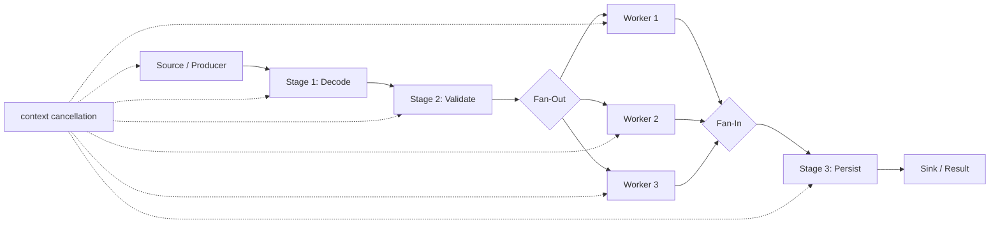
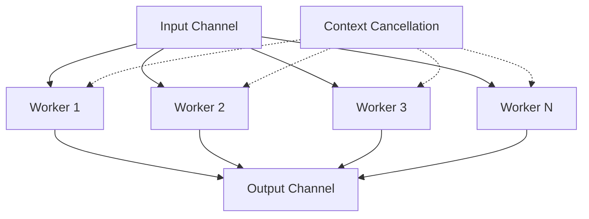
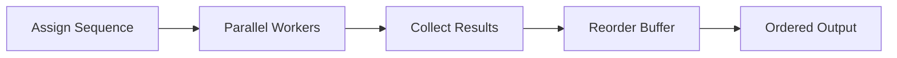
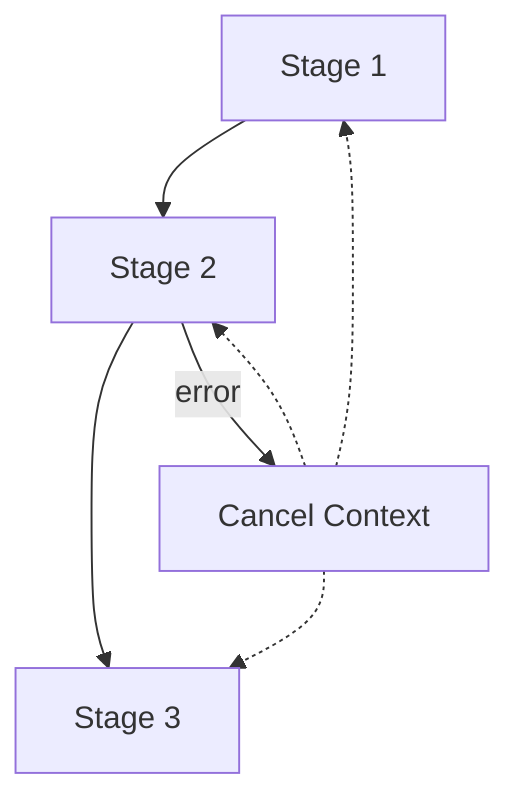
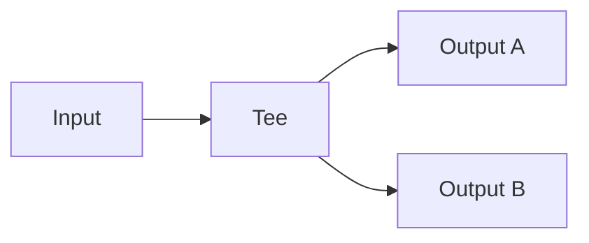

# learn-go-design-patterns-common-patterns-anti-patterns-part-024.md

# Part 024 — Pipeline, Fan-Out/Fan-In, and Bounded Parallelism Pattern

> Seri: **Go Design Patterns, Common Patterns, and Anti-Patterns**  
> Target pembaca: **Java software engineer yang ingin berpikir idiomatis Go pada level production/system design**  
> Baseline: **Go 1.26.x**  
> Status seri: **Part 024 dari 035 — belum selesai**

---

## 0. Ringkasan Eksekutif

Pipeline, fan-out/fan-in, dan bounded parallelism adalah pola yang sangat kuat di Go, tetapi juga salah satu sumber bug paling berbahaya jika dipakai tanpa ownership yang jelas.

Di Go, concurrency bukan sekadar “menjalankan banyak task sekaligus”. Concurrency adalah cara memodelkan **flow of work**, **ownership of cancellation**, **resource budget**, dan **coordination between stages**.

Part ini membahas bagaimana mendesain pipeline production-grade yang:

- tidak leak goroutine;
- tidak block selamanya;
- punya cancellation path yang eksplisit;
- punya batas parallelism;
- bisa mengembalikan error dengan benar;
- bisa menjaga ordering jika dibutuhkan;
- bisa menerapkan backpressure;
- bisa dites dan diobservasi;
- tidak menyalahgunakan channel hanya karena “Go punya channel”.

Mental model utama:

> Pipeline yang baik bukan rangkaian channel acak. Pipeline yang baik adalah **resource-controlled workflow graph** dengan ownership yang eksplisit.

---

## 1. Masalah yang Diselesaikan

Banyak sistem backend harus memproses banyak item:

- membaca file besar per baris;
- mengambil data dari database secara batch;
- memanggil API eksternal untuk banyak record;
- memvalidasi dokumen;
- mengirim notifikasi;
- melakukan enrichment data;
- memproses event dari queue;
- melakukan indexing ke search engine;
- melakukan migrasi data;
- menjalankan background reconciliation;
- melakukan geocoding banyak postal code;
- mengonversi format data;
- melakukan fan-out request ke beberapa service lalu menggabungkan hasil.

Pendekatan sequential sederhana:

```go
for _, item := range items {
    result, err := process(ctx, item)
    if err != nil {
        return err
    }
    save(result)
}
```

Kadang cukup. Tetapi ketika workload lambat karena I/O, external API, CPU task, atau batch besar, kita ingin parallelism.

Pendekatan buruk yang sering muncul:

```go
for _, item := range items {
    go process(item)
}
```

Masalahnya:

- tidak ada batas jumlah goroutine;
- tidak ada cancellation;
- tidak ada error propagation;
- tidak ada wait;
- tidak ada ordering;
- tidak ada backpressure;
- tidak ada resource budget;
- tidak ada ownership;
- bisa merusak dependency seperti DB pool, HTTP client, rate limit, memory, queue visibility timeout.

Pipeline pattern menyelesaikan masalah ini dengan memecah proses menjadi stage-stage eksplisit.

---

## 2. Java Mindset vs Go Mindset

### 2.1 Java Mindset yang Sering Terbawa

Java engineer biasanya familiar dengan:

- `ExecutorService`;
- `CompletableFuture`;
- thread pool;
- reactive stream;
- Spring Batch;
- queue listener container;
- fork/join pool;
- annotation-based async;
- managed lifecycle oleh framework.

Di Java, concurrency sering dimediasi oleh framework/container. Banyak detail lifecycle disembunyikan.

Di Go, primitive-nya lebih kecil:

- goroutine;
- channel;
- `context.Context`;
- `sync.WaitGroup`;
- `sync.Mutex`;
- `sync/atomic`;
- semaphore via buffered channel atau package lain;
- errgroup-style pattern;
- explicit close;
- explicit cancellation.

Artinya Go memberi kebebasan besar, tetapi juga menuntut ownership lebih jelas.

### 2.2 Reframing ke Go

Di Go, jangan mulai dari pertanyaan:

> “Bagaimana membuat pipeline dengan channel?”

Mulailah dari pertanyaan:

> “Apa stage-nya, siapa pemilik item, siapa boleh cancel, siapa menutup channel, apa batas parallelism, apa yang terjadi saat error, dan bagaimana resource dilepas?”

Channel hanyalah mekanisme. Desainnya adalah ownership.

---

## 3. Vocabulary Dasar

### 3.1 Pipeline

Pipeline adalah proses yang memecah pekerjaan menjadi beberapa stage.

Contoh:

```text
Read -> Parse -> Validate -> Enrich -> Persist -> Publish
```

Setiap stage menerima input, memprosesnya, lalu menghasilkan output.

### 3.2 Stage

Stage adalah unit processing.

```go
type Stage[I any, O any] func(ctx context.Context, in <-chan I) <-chan O
```

Namun di production, stage sering butuh error channel, metrics, logger, config, dependency, dan shutdown semantics.

### 3.3 Fan-Out

Fan-out adalah membagi pekerjaan ke beberapa worker paralel.

```text
input -> worker 1
      -> worker 2
      -> worker 3
      -> worker N
```

### 3.4 Fan-In

Fan-in adalah menggabungkan output dari banyak worker/stage menjadi satu stream.

```text
worker 1 ->
worker 2 -> output
worker 3 ->
```

### 3.5 Bounded Parallelism

Bounded parallelism adalah parallelism dengan batas eksplisit.

Bukan:

```go
go process(item)
```

Melainkan:

```go
workers := 16
```

atau:

```go
sem := make(chan struct{}, 16)
```

Tujuannya menjaga sistem tetap dalam budget.

### 3.6 Backpressure

Backpressure adalah mekanisme agar producer tidak menghasilkan pekerjaan lebih cepat daripada consumer mampu memproses.

Channel unbuffered atau buffered kecil dapat menjadi bentuk backpressure.

### 3.7 Ordering

Ordering adalah jaminan bahwa output mengikuti urutan input.

Tidak semua pipeline butuh ordering. Kalau butuh, desainnya lebih mahal.

### 3.8 Cancellation

Cancellation adalah sinyal untuk menghentikan pekerjaan yang tidak lagi dibutuhkan.

Di Go, ini umumnya memakai `context.Context`.

---

## 4. Diagram Mental Model Pipeline



Pipeline production-grade selalu punya:

- source;
- stages;
- fan-out jika perlu;
- fan-in jika perlu;
- sink;
- cancellation path;
- error path;
- cleanup path;
- capacity control.

---

## 5. Kapan Menggunakan Pipeline Pattern

Gunakan pipeline jika proses punya karakteristik berikut:

1. **Ada flow bertahap**

   Contoh: read → parse → validate → enrich → write.

2. **Stage bisa dipisah secara natural**

   Tiap stage punya input/output jelas.

3. **Ada peluang parallelism**

   Misalnya enrichment API eksternal dapat berjalan paralel.

4. **Volume data besar**

   Streaming lebih baik daripada load semua ke memory.

5. **Butuh backpressure**

   Producer harus tertahan jika consumer lambat.

6. **Butuh cancellation**

   Misalnya request timeout, shutdown, error fatal.

7. **Butuh resource control**

   DB pool, API quota, memory, CPU, network.

---

## 6. Kapan Tidak Menggunakan Pipeline

Jangan memakai pipeline jika:

1. **Data kecil dan proses linear cukup**

   Loop biasa lebih mudah dibaca.

2. **Stage tidak benar-benar independen**

   Kalau semua stage saling butuh state mutable yang sama, pipeline malah membuat desain kabur.

3. **Ordering ketat tetapi parallelism kecil**

   Kompleksitas reorder mungkin tidak sepadan.

4. **Error handling harus sangat kompleks per item**

   Batch/result object mungkin lebih baik.

5. **Tim belum jelas ownership channel/cancellation**

   Pipeline buruk lebih berbahaya daripada loop sederhana.

6. **Channel dipakai hanya agar terlihat idiomatis**

   Tidak semua concurrency di Go harus channel.

---

## 7. Prinsip Utama Pipeline Production-Grade

### 7.1 One Owner Closes the Channel

Aturan utama:

> Channel ditutup oleh sender, bukan receiver.

Jika banyak sender, harus ada koordinator yang menutup channel setelah semua sender selesai.

Buruk:

```go
func consumer(ch chan Item) {
    for item := range ch {
        if item.Done {
            close(ch) // buruk: receiver menutup channel yang mungkin masih dipakai sender
        }
    }
}
```

Baik:

```go
go func() {
    defer close(out)
    for _, item := range items {
        out <- item
    }
}()
```

### 7.2 Every Send Must Be Cancelable

Buruk:

```go
out <- result
```

Jika downstream berhenti, goroutine bisa block selamanya.

Lebih aman:

```go
select {
case out <- result:
case <-ctx.Done():
    return
}
```

### 7.3 Every Receive Must Handle Closure or Cancellation

```go
select {
case item, ok := <-in:
    if !ok {
        return
    }
    _ = item
case <-ctx.Done():
    return
}
```

### 7.4 Parallelism Must Be Bounded

Jangan spawn goroutine untuk setiap item tanpa batas.

```go
for item := range in {
    go process(item) // anti-pattern
}
```

Gunakan worker pool atau semaphore.

### 7.5 Error Must Have a Route

Pipeline tanpa error route akan gagal diam-diam.

Error route bisa berupa:

- return error dari runner;
- error channel;
- per-item result;
- cancellation cause;
- collector object;
- dead-letter sink.

### 7.6 Decide Fail-Fast vs Best-Effort

Dua mode besar:

1. **Fail-fast**
   - error pertama menghentikan pipeline;
   - cocok untuk job yang harus atomic/logically complete.

2. **Best-effort / partial success**
   - item gagal dicatat, item lain lanjut;
   - cocok untuk batch processing, notification, enrichment non-critical.

Jangan mencampur keduanya tanpa kontrak jelas.

### 7.7 Separate Work Result from Technical Error

Sering kali item bisa gagal secara bisnis tetapi pipeline tidak error.

Contoh:

```go
type ValidationResult struct {
    ItemID  string
    Valid   bool
    Reasons []Reason
}
```

Ini bukan `error` jika validation rejection adalah expected decision.

### 7.8 Pipeline Should Have a Lifecycle Owner

Siapa yang:

- membuat context;
- memulai goroutine;
- menutup input;
- menunggu selesai;
- mengumpulkan error;
- membatalkan jika gagal;
- expose metrics;
- cleanup resource?

Jika tidak jelas, pipeline akan sulit dioperasikan.

---

## 8. Pattern 1 — Simple Source Stage

Source stage membuat stream dari slice/input eksternal.

```go
func Source[T any](ctx context.Context, items []T) <-chan T {
    out := make(chan T)

    go func() {
        defer close(out)

        for _, item := range items {
            select {
            case out <- item:
            case <-ctx.Done():
                return
            }
        }
    }()

    return out
}
```

### Kenapa Ini Benar?

- sender menutup channel;
- send cancelable;
- tidak buffer besar tanpa alasan;
- ownership jelas.

### Trade-off

Untuk slice kecil, ini overkill. Loop biasa lebih baik.

---

## 9. Pattern 2 — Map Stage

Stage transformasi satu input menjadi satu output.

```go
func Map[I any, O any](
    ctx context.Context,
    in <-chan I,
    fn func(context.Context, I) (O, error),
    onError func(error),
) <-chan O {
    out := make(chan O)

    go func() {
        defer close(out)

        for {
            select {
            case item, ok := <-in:
                if !ok {
                    return
                }

                result, err := fn(ctx, item)
                if err != nil {
                    if onError != nil {
                        onError(err)
                    }
                    return
                }

                select {
                case out <- result:
                case <-ctx.Done():
                    return
                }

            case <-ctx.Done():
                return
            }
        }
    }()

    return out
}
```

Ini contoh sederhana. Di production, `onError` sebaiknya diganti dengan mekanisme yang lebih jelas: error channel, errgroup, atau result object.

---

## 10. Pattern 3 — Per-Item Result Instead of Error Channel

Untuk batch processing, sering lebih baik output berupa result per item.

```go
type ItemResult[T any] struct {
    Item T
    Err  error
}
```

Contoh:

```go
func ValidateStage(
    ctx context.Context,
    in <-chan CaseInput,
) <-chan ItemResult[CaseValidation] {
    out := make(chan ItemResult[CaseValidation])

    go func() {
        defer close(out)

        for {
            select {
            case item, ok := <-in:
                if !ok {
                    return
                }

                validation, err := ValidateCase(item)

                res := ItemResult[CaseValidation]{
                    Item: validation,
                    Err:  err,
                }

                select {
                case out <- res:
                case <-ctx.Done():
                    return
                }

            case <-ctx.Done():
                return
            }
        }
    }()

    return out
}
```

### Kapan Cocok?

- batch import;
- validation report;
- enrichment non-atomic;
- migration best effort;
- item-level failure tracking.

### Kapan Tidak Cocok?

- error fatal harus menghentikan semua;
- pipeline harus atomic;
- item failure menandakan dependency/system failure.

---

## 11. Pattern 4 — Fan-Out Worker Pool

Fan-out memakai banyak worker membaca dari input channel yang sama.

```go
func WorkerPool[I any, O any](
    ctx context.Context,
    in <-chan I,
    workers int,
    fn func(context.Context, I) (O, error),
) <-chan ItemResult[O] {
    out := make(chan ItemResult[O])

    var wg sync.WaitGroup
    wg.Add(workers)

    for i := 0; i < workers; i++ {
        go func() {
            defer wg.Done()

            for {
                select {
                case item, ok := <-in:
                    if !ok {
                        return
                    }

                    result, err := fn(ctx, item)
                    res := ItemResult[O]{Item: result, Err: err}

                    select {
                    case out <- res:
                    case <-ctx.Done():
                        return
                    }

                case <-ctx.Done():
                    return
                }
            }
        }()
    }

    go func() {
        wg.Wait()
        close(out)
    }()

    return out
}
```

### Properti Penting

- jumlah worker bounded;
- semua worker membaca dari `in`;
- output ditutup setelah semua worker selesai;
- send output cancelable;
- close dilakukan oleh goroutine koordinator setelah `wg.Wait()`.

---

## 12. Diagram Fan-Out/Fan-In



Worker pool adalah fan-out dari input dan fan-in ke output.

---

## 13. Pattern 5 — Bounded Parallelism with Semaphore

Kadang kita tidak perlu pipeline penuh. Kita hanya perlu membatasi goroutine.

```go
func ProcessBounded[T any](
    ctx context.Context,
    items []T,
    limit int,
    fn func(context.Context, T) error,
) error {
    if limit <= 0 {
        return fmt.Errorf("limit must be positive")
    }

    sem := make(chan struct{}, limit)
    errCh := make(chan error, 1)
    var wg sync.WaitGroup

    ctx, cancel := context.WithCancel(ctx)
    defer cancel()

    for _, item := range items {
        select {
        case sem <- struct{}{}:
        case <-ctx.Done():
            return ctx.Err()
        }

        wg.Add(1)
        go func(item T) {
            defer wg.Done()
            defer func() { <-sem }()

            if err := fn(ctx, item); err != nil {
                select {
                case errCh <- err:
                    cancel()
                default:
                }
            }
        }(item)
    }

    done := make(chan struct{})
    go func() {
        wg.Wait()
        close(done)
    }()

    select {
    case <-done:
        select {
        case err := <-errCh:
            return err
        default:
            return nil
        }
    case err := <-errCh:
        <-done
        return err
    case <-ctx.Done():
        <-done
        return ctx.Err()
    }
}
```

### Catatan

Pattern ini cocok untuk:

- operasi satu tahap;
- batch slice;
- ingin fail-fast;
- tidak perlu streaming output.

Worker pool lebih cocok jika:

- input stream panjang;
- pipeline multi-stage;
- output perlu dikonsumsi streaming;
- producer/consumer berjalan bersamaan.

---

## 14. Pattern 6 — Ordered Output

Fan-out biasanya tidak menjaga ordering.

Input:

```text
1, 2, 3, 4, 5
```

Output bisa:

```text
2, 1, 4, 3, 5
```

Jika ordering penting, tambahkan sequence number.

```go
type Sequenced[T any] struct {
    Index int
    Value T
}
```

### Ordered Fan-Out Shape



### Reorder Buffer Mental Model

- setiap item diberi index;
- worker output bisa datang acak;
- collector menyimpan output di map sementara;
- output hanya dilepas jika index berikutnya tersedia.

Contoh sederhana:

```go
func Reorder[T any](ctx context.Context, in <-chan Sequenced[T]) <-chan T {
    out := make(chan T)

    go func() {
        defer close(out)

        next := 0
        buffer := make(map[int]T)

        for {
            select {
            case item, ok := <-in:
                if !ok {
                    for {
                        v, exists := buffer[next]
                        if !exists {
                            return
                        }
                        delete(buffer, next)

                        select {
                        case out <- v:
                            next++
                        case <-ctx.Done():
                            return
                        }
                    }
                }

                buffer[item.Index] = item.Value

                for {
                    v, exists := buffer[next]
                    if !exists {
                        break
                    }
                    delete(buffer, next)

                    select {
                    case out <- v:
                        next++
                    case <-ctx.Done():
                        return
                    }
                }

            case <-ctx.Done():
                return
            }
        }
    }()

    return out
}
```

### Failure Mode Ordered Pipeline

Ordering bisa meningkatkan memory pressure.

Jika item index 10 sangat lambat, sedangkan 11 sampai 1.000.000 selesai dulu, reorder buffer membesar.

Karena itu tanyakan:

> Apakah ordering benar-benar business requirement, atau hanya kebiasaan?

---

## 15. Pattern 7 — Fail-Fast Pipeline

Fail-fast berarti error pertama menghentikan pipeline.



Shape umum:

```go
ctx, cancel := context.WithCancel(parent)
defer cancel()

errCh := make(chan error, 1)
```

Error pertama mengisi channel dan memanggil `cancel()`.

Hal penting:

- error channel harus buffered agar sender tidak deadlock;
- hanya error pertama yang perlu menang;
- semua stage harus listen `ctx.Done()`;
- runner harus wait semua goroutine selesai sebelum return.

---

## 16. Pattern 8 — Best-Effort Pipeline

Best-effort berarti item gagal tidak menghentikan item lain.

Cocok untuk:

- sending notification;
- batch validation;
- optional enrichment;
- data quality report;
- reconciliation;
- indexing ulang.

Gunakan result object.

```go
type ProcessResult struct {
    ID        string
    Success   bool
    ErrorCode string
    Error     error
}
```

Jangan return `error` untuk expected per-item failure.

---

## 17. Pattern 9 — Hybrid Pipeline: Fatal Error + Item Error

Production pipeline sering butuh dua jenis error:

1. **Item error**
   - item invalid;
   - item not found;
   - business rejection;
   - transform gagal untuk satu record.

2. **Fatal error**
   - database down;
   - context canceled;
   - schema mismatch;
   - auth expired;
   - dependency unavailable;
   - bug invariant violated.

Model:

```go
type PipelineItemResult[T any] struct {
    Item T
    Err  error
}

type PipelineFatalError struct {
    Stage string
    Err   error
}
```

Fatal error membatalkan pipeline. Item error tetap mengalir sebagai result.

---

## 18. Pattern 10 — Backpressure by Channel Capacity

Channel capacity adalah desain, bukan angka acak.

```go
jobs := make(chan Job, 100)
```

Pertanyaan:

- mengapa 100?
- berapa ukuran tiap job?
- berapa memory maksimum?
- berapa latency yang diterima?
- apakah buffer besar menyembunyikan downstream lambat?
- apakah producer harus block?

### Unbuffered Channel

```go
ch := make(chan Item)
```

Producer dan consumer rendezvous langsung. Backpressure kuat, throughput bisa lebih rendah.

### Small Buffered Channel

```go
ch := make(chan Item, workers*2)
```

Sedikit smoothing tanpa menyembunyikan bottleneck terlalu jauh.

### Large Buffered Channel

Bisa cocok untuk burst absorption, tetapi berbahaya jika:

- item besar;
- downstream lambat lama;
- cancellation lambat terasa;
- memory naik tanpa terlihat.

---

## 19. Pattern 11 — Source from Iterator/Pager

Banyak pipeline membaca data dari DB/API secara page.

```go
func SourcePages[T any](
    ctx context.Context,
    fetch func(context.Context, string) ([]T, string, error),
) (<-chan T, <-chan error) {
    out := make(chan T)
    errCh := make(chan error, 1)

    go func() {
        defer close(out)
        defer close(errCh)

        var cursor string
        for {
            items, next, err := fetch(ctx, cursor)
            if err != nil {
                errCh <- err
                return
            }

            for _, item := range items {
                select {
                case out <- item:
                case <-ctx.Done():
                    errCh <- ctx.Err()
                    return
                }
            }

            if next == "" {
                return
            }
            cursor = next
        }
    }()

    return out, errCh
}
```

### Catatan

Ini masih sederhana. Production source perlu:

- checkpoint;
- retry fetch;
- rate limit;
- page size tuning;
- metrics per page;
- deadline budget;
- authorization;
- partial failure semantics.

---

## 20. Pattern 12 — Sink Stage

Sink mengonsumsi output.

```go
func Sink[T any](ctx context.Context, in <-chan T, fn func(context.Context, T) error) error {
    for {
        select {
        case item, ok := <-in:
            if !ok {
                return nil
            }
            if err := fn(ctx, item); err != nil {
                return err
            }
        case <-ctx.Done():
            return ctx.Err()
        }
    }
}
```

Sink sering menjadi tempat:

- write DB;
- write file;
- publish event;
- aggregate result;
- produce report.

Sink harus jelas apakah:

- fail-fast;
- best-effort;
- transactional;
- idempotent;
- ordered;
- batch flush.

---

## 21. Pattern 13 — Batch Sink

Writing satu per satu bisa mahal. Batch sink mengumpulkan item.

```go
func BatchSink[T any](
    ctx context.Context,
    in <-chan T,
    size int,
    flush func(context.Context, []T) error,
) error {
    if size <= 0 {
        return fmt.Errorf("batch size must be positive")
    }

    batch := make([]T, 0, size)

    flushBatch := func() error {
        if len(batch) == 0 {
            return nil
        }
        err := flush(ctx, batch)
        batch = batch[:0]
        return err
    }

    for {
        select {
        case item, ok := <-in:
            if !ok {
                return flushBatch()
            }

            batch = append(batch, item)
            if len(batch) >= size {
                if err := flushBatch(); err != nil {
                    return err
                }
            }

        case <-ctx.Done():
            return ctx.Err()
        }
    }
}
```

### Production Enhancement

Batch sink sering juga butuh time-based flush:

- flush setiap 100 item;
- atau setiap 1 detik;
- mana yang lebih dulu.

---

## 22. Pattern 14 — Time-Based Batch Flush

```go
func TimedBatchSink[T any](
    ctx context.Context,
    in <-chan T,
    size int,
    interval time.Duration,
    flush func(context.Context, []T) error,
) error {
    if size <= 0 {
        return fmt.Errorf("batch size must be positive")
    }
    if interval <= 0 {
        return fmt.Errorf("interval must be positive")
    }

    ticker := time.NewTicker(interval)
    defer ticker.Stop()

    batch := make([]T, 0, size)

    flushBatch := func() error {
        if len(batch) == 0 {
            return nil
        }
        cp := make([]T, len(batch))
        copy(cp, batch)
        batch = batch[:0]
        return flush(ctx, cp)
    }

    for {
        select {
        case item, ok := <-in:
            if !ok {
                return flushBatch()
            }
            batch = append(batch, item)
            if len(batch) >= size {
                if err := flushBatch(); err != nil {
                    return err
                }
            }

        case <-ticker.C:
            if err := flushBatch(); err != nil {
                return err
            }

        case <-ctx.Done():
            return ctx.Err()
        }
    }
}
```

### Why Copy Batch?

Jika `flush` menyimpan slice untuk async use, reuse backing array dapat menimbulkan bug. Copy defensive kadang perlu. Namun copy punya cost.

Design decision:

- jika `flush` synchronous dan tidak retain slice, copy tidak perlu;
- jika kontrak tidak jelas, copy lebih aman;
- kontrak harus didokumentasikan.

---

## 23. Pattern 15 — Cancellation-Aware Merge

Merge/fan-in menggabungkan banyak channel.

```go
func Merge[T any](ctx context.Context, inputs ...<-chan T) <-chan T {
    out := make(chan T)

    var wg sync.WaitGroup
    wg.Add(len(inputs))

    for _, in := range inputs {
        in := in
        go func() {
            defer wg.Done()
            for {
                select {
                case item, ok := <-in:
                    if !ok {
                        return
                    }
                    select {
                    case out <- item:
                    case <-ctx.Done():
                        return
                    }
                case <-ctx.Done():
                    return
                }
            }
        }()
    }

    go func() {
        wg.Wait()
        close(out)
    }()

    return out
}
```

### Pitfall

Jika send ke `out` tidak listen cancellation, merge bisa leak ketika downstream berhenti.

---

## 24. Pattern 16 — Tee/Broadcast

Tee mengirim item ke lebih dari satu output.



Tee tampak mudah tetapi punya risiko besar: satu consumer lambat bisa menahan semua.

Contoh sederhana:

```go
func Tee[T any](ctx context.Context, in <-chan T) (<-chan T, <-chan T) {
    out1 := make(chan T)
    out2 := make(chan T)

    go func() {
        defer close(out1)
        defer close(out2)

        for {
            select {
            case item, ok := <-in:
                if !ok {
                    return
                }

                select {
                case out1 <- item:
                case <-ctx.Done():
                    return
                }

                select {
                case out2 <- item:
                case <-ctx.Done():
                    return
                }

            case <-ctx.Done():
                return
            }
        }
    }()

    return out1, out2
}
```

### Warning

Jika `out2` tidak dibaca, pipeline block.

Broadcast production-grade butuh:

- buffer policy;
- drop policy;
- per-subscriber queue;
- backpressure semantics;
- cancellation per subscriber;
- metrics.

---

## 25. Pattern 17 — Drop Policy

Kadang tidak semua item wajib diproses, misalnya metrics sample atau telemetry internal.

```go
select {
case ch <- item:
default:
    dropped.Add(1)
}
```

Ini non-blocking send.

### Kapan Cocok?

- metrics;
- sampling;
- low-value background signal;
- health telemetry;
- best-effort notification internal.

### Kapan Berbahaya?

- business event;
- payment;
- audit;
- state transition;
- regulatory evidence;
- user-visible operation.

Drop policy harus eksplisit dan terukur.

---

## 26. Pattern 18 — Rate-Limited Pipeline Stage

Stage yang memanggil API eksternal perlu rate limiting.

```go
func RateLimitedMap[I any, O any](
    ctx context.Context,
    in <-chan I,
    interval time.Duration,
    fn func(context.Context, I) (O, error),
) <-chan ItemResult[O] {
    out := make(chan ItemResult[O])
    ticker := time.NewTicker(interval)

    go func() {
        defer close(out)
        defer ticker.Stop()

        for {
            select {
            case item, ok := <-in:
                if !ok {
                    return
                }

                select {
                case <-ticker.C:
                case <-ctx.Done():
                    return
                }

                result, err := fn(ctx, item)
                res := ItemResult[O]{Item: result, Err: err}

                select {
                case out <- res:
                case <-ctx.Done():
                    return
                }

            case <-ctx.Done():
                return
            }
        }
    }()

    return out
}
```

### Production Note

Ticker-per-item interval adalah simple limiter, tetapi tidak selalu cukup. Production limiter bisa butuh:

- token bucket;
- per-tenant limiter;
- per-endpoint limiter;
- distributed limiter;
- adaptive limiter;
- server-side 429 feedback;
- jitter.

---

## 27. Pattern 19 — Resource-Budgeted Worker Count

Worker count tidak boleh angka asal.

Pertimbangkan:

- CPU core;
- DB connection pool;
- HTTP max idle connections;
- external API rate limit;
- memory per item;
- downstream throughput;
- p99 latency;
- request deadline;
- queue visibility timeout;
- retry policy;
- lock contention.

### Rule of Thumb

Untuk CPU-bound:

```text
workers ~= GOMAXPROCS atau sedikit di atasnya
```

Untuk I/O-bound:

```text
workers bisa lebih besar, tetapi tetap dibatasi oleh dependency budget
```

Contoh:

Jika API rate limit 300/minute dan request latency rata-rata 200ms:

```text
300/min = 5/sec
latency = 0.2 sec
concurrency needed ~= rate * latency = 1
```

Tetapi untuk burst, retry, jitter, dan tail latency, mungkin pilih 3–10 worker dengan limiter 5/sec.

Jangan pilih 100 worker hanya karena “biar cepat”.

---

## 28. Pattern 20 — Error Aggregation

Untuk best-effort batch, kita bisa mengumpulkan error.

```go
type BatchSummary struct {
    Total     int
    Succeeded int
    Failed    int
    Errors    []ItemError
}

type ItemError struct {
    ID  string
    Err error
}
```

Batasi jumlah error yang disimpan.

```go
const maxErrors = 1000
```

Jika jutaan item gagal, jangan simpan semua error di memory.

Gunakan:

- capped sample;
- error count by code;
- external failure report file;
- database failure table;
- dead-letter queue.

---

## 29. Pattern 21 — Pipeline Runner Object

Untuk pipeline kompleks, function bebas bisa mulai sulit dikontrol. Buat runner object.

```go
type PipelineRunner struct {
    workers int
    logger  *slog.Logger
    metrics Metrics
    repo    CaseRepository
    client  EnrichmentClient
}

func (r *PipelineRunner) Run(ctx context.Context, req RunRequest) (RunSummary, error) {
    // build pipeline here
    // own cancellation, error collection, metrics, cleanup
    return RunSummary{}, nil
}
```

Runner bertugas sebagai lifecycle owner.

### Jangan Sampai Runner Menjadi God Object

Runner boleh mengorkestrasi, tetapi jangan menaruh semua business rule di dalamnya.

Pisahkan:

- validation policy;
- enrichment client;
- repository;
- event publisher;
- error classifier;
- audit writer.

---

## 30. Full Production Example — Case Enrichment Pipeline

### 30.1 Requirement

Kita punya job untuk memperkaya case regulatory:

1. Ambil pending cases dari database secara page.
2. Validasi eligibility per case.
3. Panggil external profile API untuk enrichment.
4. Simpan enrichment result.
5. Publish domain event melalui outbox.
6. Job harus bounded.
7. Jika satu case invalid, lanjutkan case lain.
8. Jika DB down, stop pipeline.
9. Jika external API 429, retry/backoff di client layer.
10. Harus ada summary.

### 30.2 Domain Types

```go
type CaseID string

type PendingCase struct {
    ID        CaseID
    Applicant string
    Version   int64
}

type EnrichedCase struct {
    ID        CaseID
    RiskScore int
    Version   int64
}

type CaseResult struct {
    CaseID CaseID
    Status string
    Err    error
}
```

### 30.3 Dependencies

```go
type CaseRepository interface {
    FetchPending(ctx context.Context, cursor string, limit int) ([]PendingCase, string, error)
    SaveEnrichment(ctx context.Context, c EnrichedCase) error
}

type ProfileClient interface {
    Enrich(ctx context.Context, c PendingCase) (EnrichedCase, error)
}
```

### 30.4 Runner

```go
type EnrichmentRunner struct {
    repo      CaseRepository
    profiles  ProfileClient
    workers   int
    pageSize  int
    logger    *slog.Logger
}

func NewEnrichmentRunner(
    repo CaseRepository,
    profiles ProfileClient,
    logger *slog.Logger,
    workers int,
    pageSize int,
) (*EnrichmentRunner, error) {
    if repo == nil {
        return nil, fmt.Errorf("repo is required")
    }
    if profiles == nil {
        return nil, fmt.Errorf("profiles is required")
    }
    if logger == nil {
        logger = slog.Default()
    }
    if workers <= 0 {
        return nil, fmt.Errorf("workers must be positive")
    }
    if pageSize <= 0 {
        return nil, fmt.Errorf("pageSize must be positive")
    }

    return &EnrichmentRunner{
        repo:     repo,
        profiles: profiles,
        logger:   logger,
        workers:  workers,
        pageSize: pageSize,
    }, nil
}
```

### 30.5 Source

```go
func (r *EnrichmentRunner) source(ctx context.Context) (<-chan PendingCase, <-chan error) {
    out := make(chan PendingCase)
    errCh := make(chan error, 1)

    go func() {
        defer close(out)
        defer close(errCh)

        var cursor string
        for {
            cases, next, err := r.repo.FetchPending(ctx, cursor, r.pageSize)
            if err != nil {
                errCh <- fmt.Errorf("fetch pending cases: %w", err)
                return
            }

            for _, c := range cases {
                select {
                case out <- c:
                case <-ctx.Done():
                    errCh <- ctx.Err()
                    return
                }
            }

            if next == "" {
                return
            }
            cursor = next
        }
    }()

    return out, errCh
}
```

### 30.6 Worker Pool

```go
func (r *EnrichmentRunner) enrich(
    ctx context.Context,
    in <-chan PendingCase,
) <-chan ItemResult[EnrichedCase] {
    return WorkerPool(ctx, in, r.workers, func(ctx context.Context, c PendingCase) (EnrichedCase, error) {
        if c.ID == "" {
            return EnrichedCase{}, fmt.Errorf("case id is empty")
        }
        return r.profiles.Enrich(ctx, c)
    })
}
```

### 30.7 Sink

```go
func (r *EnrichmentRunner) persist(
    ctx context.Context,
    in <-chan ItemResult[EnrichedCase],
) (RunSummary, error) {
    var summary RunSummary

    for {
        select {
        case res, ok := <-in:
            if !ok {
                return summary, nil
            }

            summary.Total++

            if res.Err != nil {
                summary.Failed++
                r.logger.WarnContext(ctx, "case enrichment failed", "error", res.Err)
                continue
            }

            if err := r.repo.SaveEnrichment(ctx, res.Item); err != nil {
                return summary, fmt.Errorf("save enrichment case_id=%s: %w", res.Item.ID, err)
            }

            summary.Succeeded++

        case <-ctx.Done():
            return summary, ctx.Err()
        }
    }
}
```

### 30.8 Run Method

```go
type RunSummary struct {
    Total     int
    Succeeded int
    Failed    int
}

func (r *EnrichmentRunner) Run(ctx context.Context) (RunSummary, error) {
    ctx, cancel := context.WithCancel(ctx)
    defer cancel()

    cases, sourceErr := r.source(ctx)
    enriched := r.enrich(ctx, cases)

    summary, err := r.persist(ctx, enriched)
    if err != nil {
        cancel()
        return summary, err
    }

    select {
    case err, ok := <-sourceErr:
        if ok && err != nil {
            return summary, err
        }
    default:
    }

    return summary, nil
}
```

### 30.9 Review of Example

Yang baik:

- source punya error channel;
- worker bounded;
- per-item error tidak selalu fatal;
- save error fatal;
- context dipropagasi;
- channel ditutup oleh sender;
- runner memiliki lifecycle.

Yang masih bisa ditingkatkan:

- source error harus dipastikan dikonsumsi setelah source selesai;
- error handling bisa pakai errgroup-style runner;
- persist bisa batch;
- external client harus punya timeout/retry/rate limit;
- summary error detail perlu bounded;
- metrics belum ada;
- outbox belum dimasukkan;
- transaction boundary belum ditunjukkan.

---

## 31. Common Anti-Patterns

### 31.1 Goroutine per Item Tanpa Batas

```go
for _, item := range items {
    go process(item)
}
```

Masalah:

- memory spike;
- DB pool exhaustion;
- HTTP overload;
- external API ban;
- scheduler pressure;
- no wait;
- no error path.

Refactor ke worker pool atau semaphore.

---

### 31.2 Channel Tanpa Owner

Gejala:

- tidak jelas siapa close;
- kadang panic `send on closed channel`;
- receiver menutup channel;
- banyak goroutine mengirim tanpa koordinator.

Aturan:

> Sender owns close. Multiple sender needs coordinator.

---

### 31.3 Send Tanpa Cancellation

```go
out <- item
```

Jika downstream stop, goroutine leak.

Gunakan:

```go
select {
case out <- item:
case <-ctx.Done():
    return
}
```

---

### 31.4 Receive Tanpa Closure Check

```go
item := <-in
```

Jika channel ditutup, zero value diterima dan bisa dianggap data valid.

Gunakan:

```go
item, ok := <-in
if !ok {
    return
}
```

---

### 31.5 Error Hilang di Goroutine

```go
go func() {
    if err := process(); err != nil {
        log.Println(err)
    }
}()
```

Error hanya log, caller tidak tahu.

Dalam production, tentukan:

- error fatal cancel pipeline;
- item error masuk result;
- error masuk DLQ;
- error count metrics;
- audit record.

---

### 31.6 Channel Dipakai Sebagai Queue Permanen

Channel bukan durable queue.

Jangan memakai channel sebagai pengganti:

- Kafka;
- RabbitMQ;
- SQS;
- database job table;
- outbox;
- durable scheduler.

Channel hilang saat process restart.

---

### 31.7 Buffer Besar Untuk Menutupi Bottleneck

```go
ch := make(chan Item, 1_000_000)
```

Ini sering menyembunyikan downstream lambat sampai memory habis.

Lebih baik ukur throughput dan tentukan buffer berdasarkan budget.

---

### 31.8 Fan-In yang Tidak Menunggu Semua Sender

```go
go func() {
    close(out)
}()
```

Jika `out` ditutup sebelum semua worker selesai, panic.

Gunakan `sync.WaitGroup`.

---

### 31.9 Worker Tidak Punya Shutdown Path

Worker yang hanya:

```go
for item := range jobs {
    process(item)
}
```

bisa block saat shutdown jika `jobs` tidak ditutup.

Tambahkan context jika lifecycle tidak hanya channel close.

---

### 31.10 Ordering Assumption Palsu

Developer mengira output worker pool tetap urut. Tidak.

Jika ordering penting, desain sequence + reorder.

---

### 31.11 Context Dibuat Deep Inside Stage

```go
ctx := context.Background()
```

di dalam stage adalah red flag.

Stage harus menerima context dari owner.

---

### 31.12 Panic Untuk Stop Pipeline

Panic bukan normal control flow.

Gunakan error/cancel/result kecuali benar-benar invariant corruption.

---

### 31.13 Close Error Channel Terlalu Cepat

Error channel yang ditutup sebelum semua sender selesai dapat panic jika sender masih menulis.

Sama seperti data channel: butuh owner dan coordinator.

---

### 31.14 Mixing Business Error and Fatal Error

Semua error diperlakukan sama:

```go
if err != nil {
    cancel()
}
```

Padahal beberapa error adalah per-item rejection.

Buat taxonomy:

- fatal;
- retryable;
- item invalid;
- business rejection;
- skipped;
- duplicate/no-op.

---

### 31.15 Channel Everywhere

Tidak semua problem butuh channel.

Kadang cukup:

- loop;
- function call;
- slice;
- iterator;
- mutex;
- semaphore;
- transaction closure;
- queue external.

Channel adalah coordination primitive, bukan default abstraction.

---

## 32. Failure Modeling

Pipeline production harus menjawab pertanyaan failure berikut.

### 32.1 Jika Source Gagal?

- stop seluruh pipeline?
- retry source?
- checkpoint?
- resume dari cursor?
- emit partial summary?

### 32.2 Jika Worker Gagal?

- item gagal saja?
- fatal?
- retry?
- DLQ?
- record failure reason?

### 32.3 Jika Sink Gagal?

- stop?
- retry?
- rollback?
- idempotent write?
- duplicate-safe?

### 32.4 Jika Context Cancel?

- return immediately?
- flush partial batch?
- commit processed item?
- mark job canceled?
- release lease?

### 32.5 Jika Downstream Lambat?

- backpressure?
- drop?
- queue?
- scale workers?
- reduce producer speed?

### 32.6 Jika Memory Naik?

- reduce buffer;
- reduce batch size;
- reduce workers;
- stream instead of collect;
- cap error list;
- investigate reorder buffer.

---

## 33. Observability Pattern

Pipeline tanpa observability akan sulit di-debug.

Minimal metrics:

- items read;
- items processed;
- items succeeded;
- items failed;
- items skipped;
- active workers;
- queue/channel depth if measurable;
- stage latency;
- batch flush size;
- fatal errors;
- retry count;
- cancellation count;
- dropped item count;
- in-flight count.

Structured logs:

```go
logger.InfoContext(ctx, "pipeline started",
    "pipeline", "case_enrichment",
    "workers", workers,
    "page_size", pageSize,
)
```

Avoid logging every item at info level for large pipeline.

Use debug/sample if necessary.

### Stage-Level Metrics

```text
pipeline_stage_duration_seconds{stage="enrich"}
pipeline_items_total{stage="enrich", status="success"}
pipeline_items_total{stage="enrich", status="failed"}
pipeline_fatal_errors_total{stage="source"}
```

### Trace

Distributed tracing per item can explode cardinality. Use carefully:

- trace per job;
- span per batch;
- sampled span per item;
- attach correlation ID.

---

## 34. Security and Compliance

Pipeline sering memproses data sensitif.

Prinsip:

- jangan log full payload;
- jangan log PII;
- redaction by design;
- reason code lebih baik daripada raw error;
- audit event untuk decision penting;
- retention policy untuk failure report;
- encrypt temporary files jika ada;
- avoid dumping item into panic/log;
- ensure idempotency key not sensitive;
- include actor/job identity.

Untuk regulatory system, pipeline yang memproses lifecycle case harus menghasilkan evidence:

- input source;
- command/job ID;
- timestamp;
- policy version;
- result per item;
- failure reason;
- retry attempt;
- final state;
- actor/system identity.

---

## 35. Testing Strategy

### 35.1 Unit Test Stage Function

Stage logic sebaiknya bisa dites tanpa goroutine.

```go
func enrichOne(ctx context.Context, c PendingCase) (EnrichedCase, error) {
    // pure-ish logic around client call
}
```

Lalu worker pool hanya orchestration.

### 35.2 Test Cancellation

Pastikan pipeline stop saat context cancel.

```go
ctx, cancel := context.WithCancel(context.Background())
cancel()
```

Test tidak boleh hang.

### 35.3 Test Channel Closure

Pastikan output channel tertutup saat input habis.

### 35.4 Test Bounded Parallelism

Gunakan atomic counter untuk memastikan active workers tidak melebihi limit.

```go
var active int64
var maxActive int64
```

### 35.5 Test Error Propagation

- item error;
- fatal source error;
- sink error;
- context cancellation;
- downstream stop.

### 35.6 Test No Goroutine Leak

Di unit test, ini sulit sempurna, tetapi bisa gunakan:

- timeout;
- deterministic fake;
- context cancellation;
- done channel;
- leak detection library jika allowed;
- avoid sleeping arbitrary.

### 35.7 Test Ordering

Jika output harus ordered, test with randomized delay.

### 35.8 Test Backpressure

Gunakan slow consumer dan pastikan producer tidak allocate tak terbatas.

---

## 36. Performance Considerations

### 36.1 Goroutine Cost Is Low, Not Zero

Goroutine ringan, tetapi jutaan goroutine tetap masalah.

### 36.2 Channel Cost Is Real

Channel operations punya overhead synchronization.

Untuk CPU-heavy tight loop, channel pipeline bisa lebih lambat daripada loop langsung.

### 36.3 Allocation

Pipeline generic wrapper seperti `ItemResult[T]` biasanya fine, tetapi per-item allocation besar bisa mahal.

Perhatikan:

- pointer vs value;
- slice copying;
- closure allocation;
- large struct passed by value;
- buffering;
- error object creation.

### 36.4 False Parallelism

Jika semua worker menunggu satu mutex/DB connection/API quota, menambah worker tidak menaikkan throughput.

### 36.5 Measure, Jangan Menebak

Gunakan:

- benchmark;
- pprof;
- runtime metrics;
- DB pool metrics;
- external API latency;
- queue lag;
- memory profile.

---

## 37. Design Decision Matrix

| Requirement | Prefer |
|---|---|
| Data kecil, logic sederhana | Plain loop |
| Satu tahap, butuh limit concurrency | Semaphore bounded parallelism |
| Multi-stage streaming | Pipeline |
| Banyak worker sama membaca job | Worker pool |
| Banyak source digabung | Fan-in/merge |
| Satu stream dibagi ke banyak consumer | Tee/broadcast, hati-hati backpressure |
| Output harus urut | Sequence + reorder buffer |
| Error pertama harus stop | Fail-fast + cancel |
| Item gagal boleh lanjut | Per-item result |
| Dependency punya rate limit | Rate-limited stage |
| Need durable async | External queue/outbox, bukan channel saja |
| Need batch write | Batch sink |
| Need checkpoint/resume | Job table/cursor/checkpoint, bukan memory-only pipeline |

---

## 38. Refactoring Playbook

### 38.1 Dari Goroutine Per Item ke Worker Pool

Before:

```go
for _, item := range items {
    go process(item)
}
```

After:

1. tentukan worker limit;
2. buat input channel;
3. start fixed workers;
4. close input setelah semua item dikirim;
5. wait workers;
6. collect result/error.

### 38.2 Dari Pipeline Tanpa Cancellation ke Context-Aware Pipeline

1. tambahkan `ctx` ke runner;
2. turunkan ctx ke semua stage;
3. ganti send dengan `select`;
4. ganti receive dengan `select`;
5. cancel saat fatal error;
6. wait semua goroutine sebelum return.

### 38.3 Dari Error Log-Only ke Error Contract

1. klasifikasikan error;
2. item error masuk result;
3. fatal error cancel pipeline;
4. sink error return ke caller;
5. tambah metrics;
6. tambah summary.

### 38.4 Dari Buffer Besar ke Backpressure Sadar Budget

1. ukur item size;
2. ukur throughput stage;
3. tentukan buffer kecil;
4. tambah metrics queue depth jika memungkinkan;
5. tambah batch sink jika write overhead tinggi;
6. jangan pakai buffer sebagai solusi bottleneck permanen.

### 38.5 Dari Channel Queue ke Durable Queue

Jika requirement:

- survive restart;
- retry after crash;
- DLQ;
- delayed retry;
- consumer scaling;
- audit;
- replay;

maka channel bukan jawaban. Gunakan external queue/job table/outbox.

---

## 39. Review Checklist

Sebelum merge pipeline/concurrency code, tanya:

### Ownership

- Siapa membuat channel?
- Siapa menulis channel?
- Siapa menutup channel?
- Apakah ada banyak sender?
- Jika banyak sender, siapa coordinator?

### Cancellation

- Apakah semua goroutine observe `ctx.Done()`?
- Apakah send bisa cancel?
- Apakah receive bisa cancel?
- Apakah context dibuat di owner, bukan deep stage?

### Parallelism

- Apakah jumlah goroutine bounded?
- Apa dasar angka worker?
- Apakah dependency budget cukup?
- Apakah worker count configurable?

### Error

- Ke mana error pergi?
- Error mana fatal?
- Error mana per item?
- Apakah error pertama cancel pipeline?
- Apakah error tidak hanya di-log?

### Backpressure

- Apakah buffer size masuk akal?
- Apakah producer bisa block?
- Apakah downstream lambat terlihat?
- Apakah ada drop policy? Jika ada, apakah aman?

### Ordering

- Apakah output order penting?
- Jika ya, bagaimana dijaga?
- Berapa memory risk reorder buffer?

### Resource

- Apakah DB pool/API limit/CPU/memory diperhitungkan?
- Apakah batch size reasonable?
- Apakah temporary object besar?

### Shutdown

- Apakah pipeline selesai bersih saat shutdown?
- Apakah worker release resource?
- Apakah lease/lock dilepas?
- Apakah partial batch di-flush atau dibuang sesuai policy?

### Observability

- Apakah ada metrics per stage?
- Apakah ada summary?
- Apakah logs aman dari PII?
- Apakah correlation/job ID dipropagasi?

---

## 40. Exercises

### Exercise 1 — Refactor Unbounded Goroutine

Diberikan kode:

```go
func NotifyAll(users []User) {
    for _, u := range users {
        go sendEmail(u)
    }
}
```

Refactor menjadi:

- bounded worker pool;
- context-aware;
- per-item result;
- summary;
- no goroutine leak.

### Exercise 2 — Add Fail-Fast

Buat pipeline:

```text
Read -> Validate -> Persist
```

Requirement:

- validation error per item tidak fatal;
- DB error fatal;
- context cancel harus stop;
- summary harus dikembalikan.

### Exercise 3 — Preserve Ordering

Buat worker pool yang menerima `[]int`, memproses paralel dengan random delay, tetapi output tetap urut.

### Exercise 4 — Detect Backpressure

Desain metrics untuk pipeline:

```text
Source -> Enrich API -> Save DB
```

Tentukan metrics apa yang menunjukkan:

- API lambat;
- DB lambat;
- worker terlalu banyak;
- buffer terlalu besar;
- error meningkat.

### Exercise 5 — Regulatory Batch Job

Desain pipeline untuk menutup case yang eligible otomatis:

- fetch candidate case;
- evaluate policy;
- transition state;
- write audit;
- publish event;
- generate report.

Tentukan:

- fatal error;
- item error;
- transaction boundary;
- idempotency key;
- audit evidence;
- worker limit.

---

## 41. Ringkasan

Pipeline pattern di Go sangat powerful, tetapi hanya aman jika desainnya jelas.

Hal terpenting:

1. Channel bukan arsitektur; ownership adalah arsitektur.
2. Sender menutup channel.
3. Multiple sender butuh coordinator.
4. Semua send/receive penting harus cancellation-aware.
5. Parallelism harus bounded.
6. Worker count harus berdasarkan resource budget.
7. Error harus punya route.
8. Pisahkan item error dari fatal error.
9. Backpressure harus disengaja.
10. Ordering tidak gratis.
11. Channel bukan durable queue.
12. Pipeline harus punya lifecycle owner.
13. Observability harus dirancang sejak awal.
14. Untuk regulatory workflow, result/audit/decision trace sama pentingnya dengan throughput.

Jika ada satu kalimat yang harus diingat:

> Production Go pipeline adalah workflow graph yang dikendalikan oleh context, dibatasi oleh resource budget, dan dijaga oleh ownership channel yang eksplisit.

---

## 42. Posisi dalam Seri

Part ini membangun fondasi untuk part berikutnya:

- **Part 025 — Rate Limiting, Bulkhead, Circuit Breaker, and Resilience Patterns**

Part berikutnya akan membahas bagaimana client-side resilience didesain: timeout, deadline, retry, backoff, jitter, rate limiting, bulkhead, circuit breaker, hedging, dan anti-pattern retry amplification.

---

# Status Seri

**Belum selesai.**  
Ini adalah **Part 024 dari 035**.


<!-- NAVIGATION_FOOTER -->
<div class="page-nav">
<a href="./learn-go-design-patterns-common-patterns-anti-patterns-part-023.md">⬅️ Part 023 — Worker, Job, and Background Processing Pattern</a>
<a href="./index.md">📚 Kategori</a>
<a href="../../index.md">🏠 Home</a>
<a href="./learn-go-design-patterns-common-patterns-anti-patterns-part-025.md">Part 025 — Rate Limiting, Bulkhead, Circuit Breaker, and Resilience Patterns ➡️</a>
</div>
