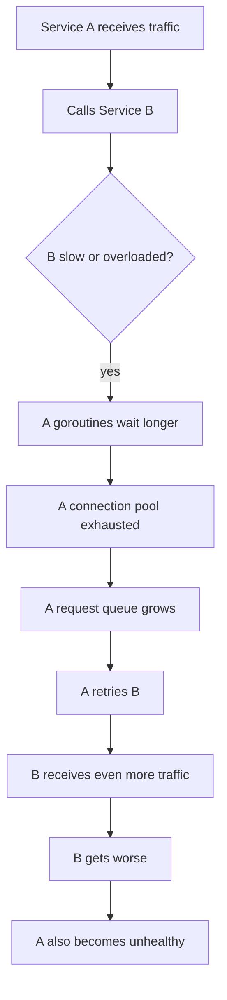
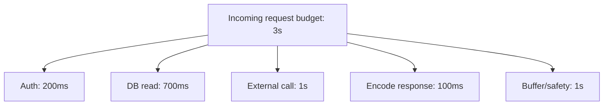
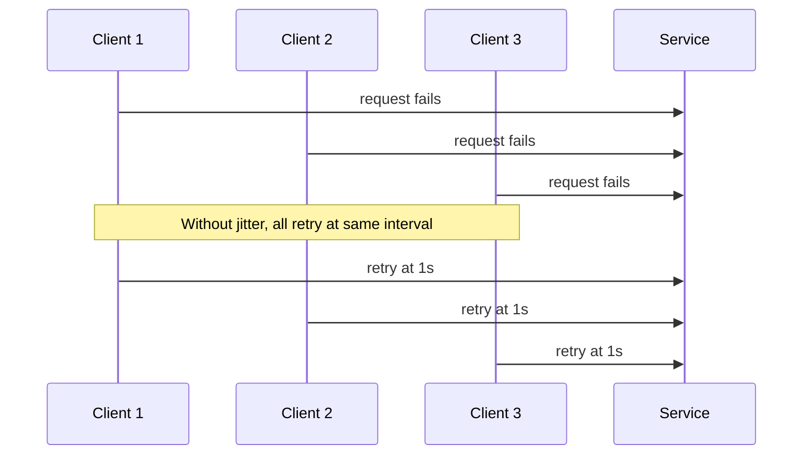
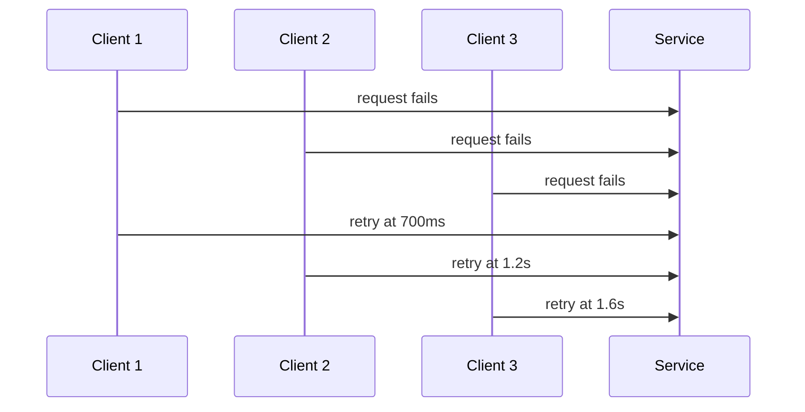
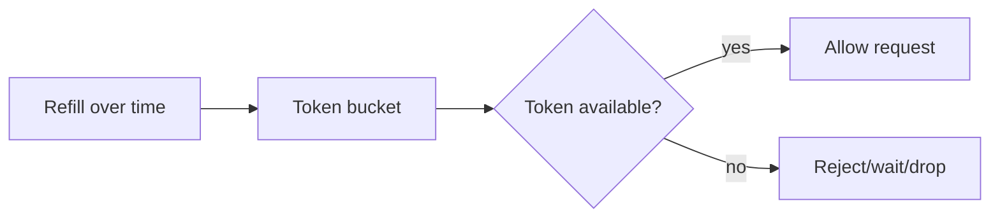
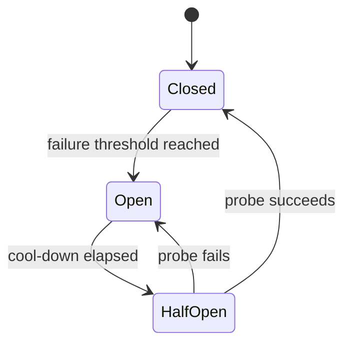
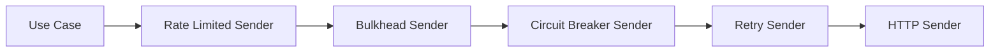

# learn-go-design-patterns-common-patterns-anti-patterns-part-025.md

# Part 025 — Rate Limiting, Bulkhead, Circuit Breaker, and Resilience Patterns

## Status Seri

- **Seri**: Go Design Patterns, Common Patterns, and Anti-Patterns
- **Part**: 025 dari 035
- **Status seri**: belum selesai
- **Target pembaca**: Java software engineer yang ingin mendesain sistem Go production-grade
- **Fokus part ini**: resilience pattern pada boundary eksternal/internal: timeout, deadline, retry, backoff, jitter, rate limiting, bulkhead, circuit breaker, hedging, load shedding, fallback, dan anti-pattern yang memperparah incident

---

## 1. Tujuan Part Ini

Pada part sebelumnya kita sudah membahas worker, job, background processing, pipeline, fan-out/fan-in, dan bounded parallelism. Semua itu mengatur **bagaimana pekerjaan dijalankan**.

Part ini membahas pertanyaan berikutnya:

> Bagaimana sistem Go tetap stabil ketika dependency lambat, down, overload, flaky, atau memberi sinyal error sementara?

Resilience pattern bukan tujuan estetika. Tujuannya adalah:

1. membatasi kerusakan,
2. menghindari retry storm,
3. menjaga resource lokal tetap sehat,
4. memberi waktu dependency pulih,
5. membuat failure terlihat secara observability,
6. mempertahankan sebagian kemampuan sistem saat sebagian dependency gagal,
7. mencegah satu alur bisnis merusak alur bisnis lain.

Dalam sistem distributed production, kegagalan bukan edge case. Kegagalan adalah **normal operating condition**.

---

## 2. Masalah Desain yang Diselesaikan

Tanpa resilience pattern, code biasanya terlihat sederhana:

```go
resp, err := client.Do(req)
if err != nil {
    return err
}
```

Atau lebih buruk:

```go
for {
    resp, err := client.Do(req)
    if err == nil {
        return nil
    }
}
```

Masalahnya bukan sekadar request gagal. Masalah sebenarnya adalah cascade:



Resilience pattern mencoba memutus siklus ini.

---

## 3. Mental Model: Resilience Is Control, Not Hope

Resilience bukan berarti “kita coba terus sampai berhasil”. Itu justru sering menjadi anti-pattern.

Resilience berarti:

- **control time**: timeout/deadline,
- **control concurrency**: bulkhead/semaphore/worker limit,
- **control rate**: token bucket/leaky bucket,
- **control retries**: max attempts, backoff, jitter, retryable classification,
- **control blast radius**: per dependency, per tenant, per endpoint, per workflow,
- **control degradation**: fallback, stale cache, partial result,
- **control recovery**: circuit breaker half-open probing,
- **control observability**: metrics, logs, traces, reason codes.

Jika pattern tidak mengontrol apa pun, ia bukan resilience pattern. Ia hanya dekorasi.

---

## 4. Java Mindset vs Go Mindset

Java ecosystem sering memiliki resilience library/framework besar: Resilience4j, Hystrix legacy, Spring Retry, Spring Cloud Circuit Breaker, annotations, AOP interceptor, declarative config.

Go cenderung lebih eksplisit:

| Area | Java/Spring style | Go style |
|---|---|---|
| Timeout | annotation/config/declarative client | explicit `context.WithTimeout`, client timeout, transport config |
| Retry | annotation/interceptor | small function/decorator around call |
| Circuit breaker | framework abstraction | explicit wrapper object per dependency/operation |
| Bulkhead | thread pool isolation | semaphore/worker pool/channel/connection pool |
| Rate limit | gateway/filter/library | token bucket/middleware/per-client limiter |
| Fallback | declarative fallback method | explicit branch with typed result |
| Metrics | auto instrumentation | explicit counters/histograms at boundary |

Go bukan anti-library. Tetapi Go mendorong kita memahami resource boundary secara langsung.

---

## 5. Core Principle: Every Remote Call Needs a Budget

Setiap remote call harus punya budget:

1. budget waktu,
2. budget retry,
3. budget concurrency,
4. budget rate,
5. budget memory,
6. budget observability cardinality,
7. budget side effect.

Contoh buruk:

```go
func (s *Service) Sync(ctx context.Context, id string) error {
    return s.external.Send(ctx, id)
}
```

Ini belum jelas:

- timeout siapa?
- retry siapa?
- error mana yang retryable?
- jika dependency lambat, berapa banyak goroutine boleh menunggu?
- apakah side effect idempotent?
- bagaimana jika context caller tidak punya deadline?
- apakah operation ini critical atau best-effort?

Contoh lebih baik:

```go
func (s *Service) Sync(ctx context.Context, id string) error {
    ctx, cancel := context.WithTimeout(ctx, s.cfg.External.SendTimeout)
    defer cancel()

    return s.sender.Send(ctx, SendRequest{
        ID:             id,
        IdempotencyKey: "sync:" + id,
    })
}
```

Tetapi ini pun belum cukup jika kita butuh retry, limiter, atau circuit breaker.

---

## 6. Timeout Pattern

Timeout adalah batas waktu lokal untuk operation.

Di Go, timeout sering muncul dalam beberapa layer:

1. request context deadline,
2. `http.Client.Timeout`,
3. transport dial timeout,
4. TLS handshake timeout,
5. response header timeout,
6. database query context,
7. custom operation timeout.

### 6.1 Timeout Minimal

```go
func call(ctx context.Context, c *http.Client, req *http.Request) (*http.Response, error) {
    ctx, cancel := context.WithTimeout(ctx, 2*time.Second)
    defer cancel()

    req = req.WithContext(ctx)
    return c.Do(req)
}
```

### 6.2 Timeout Anti-Pattern: Timeout Tanpa Budget Hierarchy

```go
func handler(w http.ResponseWriter, r *http.Request) {
    ctx := r.Context()
    a(ctx) // 5s
    b(ctx) // 5s
    c(ctx) // 5s
}
```

Jika HTTP request SLA adalah 3 detik, setiap downstream tidak boleh bebas punya 5 detik sendiri.

Lebih baik:



### 6.3 Deadline Budgeting

```go
func withChildTimeout(ctx context.Context, max time.Duration) (context.Context, context.CancelFunc) {
    if deadline, ok := ctx.Deadline(); ok {
        remaining := time.Until(deadline)
        if remaining <= 0 {
            child, cancel := context.WithCancel(ctx)
            cancel()
            return child, func() {}
        }
        if remaining < max {
            return context.WithTimeout(ctx, remaining)
        }
    }
    return context.WithTimeout(ctx, max)
}
```

Namun hati-hati: helper seperti ini harus dipakai konsisten dan tidak menyembunyikan policy penting.

---

## 7. Retry Pattern

Retry berguna untuk kegagalan sementara:

- transient network error,
- timeout singkat,
- 429 rate limited,
- 503 service unavailable,
- deadlock/serialization failure tertentu,
- leader election/failover sementara.

Retry berbahaya untuk:

- validation error,
- authorization error,
- permanent not found,
- duplicate non-idempotent operation,
- dependency overload tanpa backoff,
- deadline hampir habis.

### 7.1 Retry Harus Menjawab 7 Pertanyaan

1. Error apa yang retryable?
2. Berapa max attempt?
3. Berapa backoff?
4. Ada jitter?
5. Apakah operasi idempotent?
6. Apakah context deadline masih cukup?
7. Bagaimana observability attempt-nya?

### 7.2 Retry Function Sederhana

```go
type RetryConfig struct {
    MaxAttempts int
    BaseDelay   time.Duration
    MaxDelay    time.Duration
}

func Retry(ctx context.Context, cfg RetryConfig, isRetryable func(error) bool, fn func(context.Context) error) error {
    if cfg.MaxAttempts <= 0 {
        cfg.MaxAttempts = 1
    }

    var last error
    delay := cfg.BaseDelay
    if delay <= 0 {
        delay = 100 * time.Millisecond
    }

    for attempt := 1; attempt <= cfg.MaxAttempts; attempt++ {
        err := fn(ctx)
        if err == nil {
            return nil
        }
        last = err

        if attempt == cfg.MaxAttempts || !isRetryable(err) {
            return err
        }

        if cfg.MaxDelay > 0 && delay > cfg.MaxDelay {
            delay = cfg.MaxDelay
        }

        timer := time.NewTimer(delay)
        select {
        case <-ctx.Done():
            timer.Stop()
            return ctx.Err()
        case <-timer.C:
        }

        delay *= 2
    }

    return last
}
```

Ini belum memakai jitter. Untuk production, jitter penting agar banyak caller tidak retry bersamaan.

---

## 8. Backoff and Jitter Pattern

Backoff mengurangi frekuensi retry setelah kegagalan.

Jitter menyebarkan waktu retry agar tidak terjadi thundering herd.



Dengan jitter:



### 8.1 Simple Jittered Backoff

```go
func jitteredDelay(base, max time.Duration, attempt int, rnd *rand.Rand) time.Duration {
    if attempt < 1 {
        attempt = 1
    }

    delay := base << (attempt - 1)
    if max > 0 && delay > max {
        delay = max
    }

    // Full jitter: random [0, delay].
    if delay <= 0 {
        return 0
    }
    return time.Duration(rnd.Int63n(int64(delay)))
}
```

Production note:

- `math/rand.Rand` is not safe for concurrent use unless protected.
- For per-call jitter, either use a locked source, per-worker source, or a small wrapper.
- Avoid crypto randomness for ordinary retry jitter unless there is a security reason.

---

## 9. Retry Amplification

Retry amplification terjadi ketika satu inbound request memicu banyak downstream retry.

Misal:

- API gateway retry 2x,
- service A retry 3x,
- service B retry 3x,
- DB driver retry 2x.

Worst case:

```text
1 user request × 2 × 3 × 3 × 2 = 36 attempts
```

Jika traffic awal 1.000 RPS, dependency bisa menerima puluhan ribu attempt tambahan.

### Anti-Pattern

```go
Retry(ctx, RetryConfig{MaxAttempts: 5}, retryable, func(ctx context.Context) error {
    return client.Call(ctx, req)
})
```

Tanpa tahu apakah caller/gateway sudah retry.

### Pattern Lebih Baik

- Tetapkan retry ownership per boundary.
- Jangan semua layer retry.
- Propagate request deadline.
- Retry hanya operasi idempotent atau operasi dengan idempotency key.
- Catat attempt metric.
- Limit retry berdasarkan remaining time budget.

---

## 10. Idempotency Pattern for Retry

Retry aman hanya jika operation aman diulang.

Jenis operation:

| Operation | Retry safety |
|---|---|
| Pure read | biasanya aman |
| Read with side effect | perlu hati-hati |
| Create payment/order/case | tidak aman tanpa idempotency key |
| Update status with expected version | aman jika conditional |
| Send email/SMS | tidak aman tanpa dedup/outbox |
| Publish event | aman jika event ID dedup |

### 10.1 Idempotency Key

```go
type CreateCaseCommand struct {
    RequestID      string
    ApplicantID    string
    Payload        CasePayload
    IdempotencyKey string
}
```

Repository dapat menyimpan idempotency key:

```text
idempotency_key | command_hash | result_id | status | created_at
```

Pada retry:

- jika key sama dan command hash sama, return result lama,
- jika key sama tapi command berbeda, return conflict,
- jika operation sedang berjalan, return pending/locked depending policy.

---

## 11. Rate Limiting Pattern

Rate limiting membatasi jumlah operasi per waktu.

Tujuan:

1. melindungi service dari traffic berlebih,
2. mematuhi limit external API,
3. mencegah tenant/noisy neighbor menghabiskan kapasitas,
4. membuat overload predictable.

### 11.1 Token Bucket Mental Model



### 11.2 Simple Local Limiter Dengan Ticker

```go
type Limiter struct {
    tokens chan struct{}
    stop   chan struct{}
}

func NewLimiter(ratePerSecond int, burst int) *Limiter {
    if ratePerSecond <= 0 {
        panic("ratePerSecond must be positive")
    }
    if burst <= 0 {
        burst = 1
    }

    l := &Limiter{
        tokens: make(chan struct{}, burst),
        stop:   make(chan struct{}),
    }

    for i := 0; i < burst; i++ {
        l.tokens <- struct{}{}
    }

    interval := time.Second / time.Duration(ratePerSecond)
    ticker := time.NewTicker(interval)

    go func() {
        defer ticker.Stop()
        for {
            select {
            case <-l.stop:
                return
            case <-ticker.C:
                select {
                case l.tokens <- struct{}{}:
                default:
                }
            }
        }
    }()

    return l
}

func (l *Limiter) Allow() bool {
    select {
    case <-l.tokens:
        return true
    default:
        return false
    }
}

func (l *Limiter) Wait(ctx context.Context) error {
    select {
    case <-ctx.Done():
        return ctx.Err()
    case <-l.tokens:
        return nil
    }
}

func (l *Limiter) Close() {
    close(l.stop)
}
```

Important production caveat:

- This is a teaching implementation.
- Use well-tested primitives/libraries for serious high-throughput distributed limiting.
- Local limiter only protects one process.
- Distributed limiter requires shared state or upstream enforcement.

### 11.3 Rate Limit Scopes

Rate limit harus punya scope:

- global service limit,
- per endpoint,
- per tenant,
- per user,
- per API key,
- per downstream dependency,
- per operation type,
- per worker pool.

Tanpa scope, limiter sering salah sasaran.

---

## 12. Client-Side Rate Limiting

Client-side limiter melindungi dependency eksternal dari traffic kita sendiri.

Contoh:

```go
type LimitedClient struct {
    next    Sender
    limiter interface {
        Wait(context.Context) error
    }
}

func (c *LimitedClient) Send(ctx context.Context, req SendRequest) error {
    if err := c.limiter.Wait(ctx); err != nil {
        return err
    }
    return c.next.Send(ctx, req)
}
```

Ini bisa membatasi call ke provider yang punya quota 300/minute.

Namun jangan lupa:

- limiter harus shared antar worker dalam process,
- quota distributed antar replica perlu koordinasi,
- response `429` tetap harus di-handle,
- jika provider memberi `Retry-After`, hormati bila sesuai policy.

---

## 13. Server-Side Rate Limiting

Server-side limiter melindungi service kita.

```go
func RateLimitMiddleware(limiter interface{ Allow() bool }) func(http.Handler) http.Handler {
    return func(next http.Handler) http.Handler {
        return http.HandlerFunc(func(w http.ResponseWriter, r *http.Request) {
            if !limiter.Allow() {
                http.Error(w, "rate limit exceeded", http.StatusTooManyRequests)
                return
            }
            next.ServeHTTP(w, r)
        })
    }
}
```

Production considerations:

- Return structured error body.
- Add `Retry-After` where appropriate.
- Instrument rejected requests.
- Avoid high-cardinality tenant labels.
- Consider priority traffic.
- Consider authenticated identity before limiter scope.

---

## 14. Bulkhead Pattern

Bulkhead pattern berasal dari kapal: kerusakan di satu kompartemen tidak menenggelamkan seluruh kapal.

Dalam software:

> Batasi resource per dependency, per workflow, per tenant, atau per operation agar satu area gagal tidak menghabiskan semua resource.

### 14.1 Bulkhead Dengan Semaphore

```go
type Bulkhead struct {
    sem chan struct{}
}

func NewBulkhead(maxConcurrent int) *Bulkhead {
    if maxConcurrent <= 0 {
        panic("maxConcurrent must be positive")
    }
    return &Bulkhead{sem: make(chan struct{}, maxConcurrent)}
}

func (b *Bulkhead) Do(ctx context.Context, fn func(context.Context) error) error {
    select {
    case <-ctx.Done():
        return ctx.Err()
    case b.sem <- struct{}{}:
    }
    defer func() { <-b.sem }()

    return fn(ctx)
}
```

### 14.2 Bulkhead Placement

Bulkhead dapat diletakkan pada:

- external API client,
- DB-heavy workflow,
- report generation,
- email sending,
- background job type,
- tenant-specific operations,
- expensive CPU-bound transformation,
- file upload processing.

### 14.3 Bulkhead vs Rate Limit

| Pattern | Controls | Example |
|---|---|---|
| Rate limit | operations per time | max 100 requests/sec |
| Bulkhead | concurrent in-flight operations | max 20 concurrent calls |
| Timeout | duration per operation | max 2s per call |
| Circuit breaker | whether to allow calls based on health | open after repeated failures |

Production systems often need all four.

---

## 15. Connection Pool as Implicit Bulkhead

Go database/sql pool is a kind of bulkhead if configured correctly.

Example:

```go
db.SetMaxOpenConns(50)
db.SetMaxIdleConns(25)
db.SetConnMaxLifetime(30 * time.Minute)
db.SetConnMaxIdleTime(5 * time.Minute)
```

But pool alone is not enough.

If all endpoints share one DB pool, expensive report queries can starve latency-sensitive transaction queries.

Possible patterns:

- separate pool for report/read-heavy workload,
- separate replica for analytical read,
- application-level bulkhead around expensive operation,
- queue report generation asynchronously,
- require pagination/export job.

---

## 16. Circuit Breaker Pattern

Circuit breaker stops calling a dependency that appears unhealthy.

States:

1. **Closed**: calls allowed.
2. **Open**: calls rejected fast.
3. **Half-open**: limited probes allowed to check recovery.



### 16.1 What Circuit Breaker Solves

Circuit breaker helps when:

- dependency is down,
- dependency is overloaded,
- failure is persistent enough that retrying every request makes it worse,
- caller should fail fast to preserve its own resources.

Circuit breaker does not solve:

- bad timeout,
- non-idempotent retry,
- all overload cases,
- capacity planning,
- poor fallback design,
- wrong error classification.

### 16.2 Simple Circuit Breaker Skeleton

```go
type BreakerState int

const (
    BreakerClosed BreakerState = iota
    BreakerOpen
    BreakerHalfOpen
)

type CircuitBreaker struct {
    mu              sync.Mutex
    state           BreakerState
    failures        int
    failureThreshold int
    openedAt        time.Time
    coolDown        time.Duration
}

func NewCircuitBreaker(threshold int, coolDown time.Duration) *CircuitBreaker {
    if threshold <= 0 {
        threshold = 5
    }
    if coolDown <= 0 {
        coolDown = 5 * time.Second
    }
    return &CircuitBreaker{
        state:            BreakerClosed,
        failureThreshold: threshold,
        coolDown:         coolDown,
    }
}

func (b *CircuitBreaker) Allow() bool {
    b.mu.Lock()
    defer b.mu.Unlock()

    switch b.state {
    case BreakerClosed:
        return true
    case BreakerOpen:
        if time.Since(b.openedAt) >= b.coolDown {
            b.state = BreakerHalfOpen
            return true
        }
        return false
    case BreakerHalfOpen:
        return true
    default:
        return false
    }
}

func (b *CircuitBreaker) RecordSuccess() {
    b.mu.Lock()
    defer b.mu.Unlock()

    b.failures = 0
    b.state = BreakerClosed
}

func (b *CircuitBreaker) RecordFailure() {
    b.mu.Lock()
    defer b.mu.Unlock()

    b.failures++
    if b.state == BreakerHalfOpen || b.failures >= b.failureThreshold {
        b.state = BreakerOpen
        b.openedAt = time.Now()
    }
}
```

This is a teaching skeleton. Real production circuit breakers usually need:

- rolling window,
- error rate threshold,
- minimum request volume,
- separate half-open concurrency limit,
- failure classification,
- metrics,
- distributed behavior consideration,
- time source abstraction for tests.

### 16.3 Circuit Breaker Wrapper

```go
type BreakerClient struct {
    next    Sender
    breaker *CircuitBreaker
}

var ErrCircuitOpen = errors.New("circuit breaker open")

func (c *BreakerClient) Send(ctx context.Context, req SendRequest) error {
    if !c.breaker.Allow() {
        return ErrCircuitOpen
    }

    err := c.next.Send(ctx, req)
    if err == nil {
        c.breaker.RecordSuccess()
        return nil
    }

    if isBreakerFailure(err) {
        c.breaker.RecordFailure()
    }
    return err
}
```

Not all errors should open the circuit.

Do not count:

- validation errors,
- 400 bad request,
- 401/403 if caused by caller permission,
- 404 when valid business not found,
- user cancellation.

May count:

- connection refused,
- timeout,
- 503,
- 502,
- 504,
- reset by peer,
- provider overload.

---

## 17. Circuit Breaker Scope

Wrong scope can make breaker harmful.

Bad:

```text
One global breaker for all operations to Provider X
```

If `ProviderX.GeneratePDF` fails, `ProviderX.LookupAddress` may also be blocked even though healthy.

Better:

- per dependency,
- per endpoint/operation,
- per tenant if noisy neighbor matters,
- per credential/API key if provider throttles per credential,
- per region/zone if dependency is regional.

Scope breaker according to failure domain.

---

## 18. Load Shedding Pattern

Load shedding means rejecting work intentionally to preserve system health.

This feels harsh, but it is often better than letting all requests time out slowly.

Examples:

- reject low-priority requests when queue is full,
- reject expensive report generation during overload,
- serve stale cached result,
- return 503 with retry guidance,
- enqueue async job instead of synchronous processing,
- degrade optional feature.

### 18.1 Queue-Based Load Shedding

```go
type Submitter struct {
    queue chan Job
}

func (s *Submitter) Submit(ctx context.Context, job Job) error {
    select {
    case <-ctx.Done():
        return ctx.Err()
    case s.queue <- job:
        return nil
    default:
        return ErrQueueFull
    }
}
```

A bounded queue is a load shedding mechanism.

Unbounded queue is delayed failure.

---

## 19. Fallback Pattern

Fallback provides alternative behavior when primary dependency fails.

Examples:

- return cached stale data,
- use secondary provider,
- degrade non-critical enrichment,
- skip optional notification,
- queue for later processing,
- return partial result.

### 19.1 Good Fallback

A good fallback is:

- explicit,
- safe,
- observable,
- semantically honest,
- acceptable to product/business,
- not hiding corruption,
- not causing stronger inconsistency.

### 19.2 Bad Fallback

Bad fallback:

```go
if err != nil {
    return DefaultAddress{}, nil
}
```

This hides failure as success.

Better:

```go
type LookupAddressResult struct {
    Address Address
    Source  string
    Stale   bool
    Warning string
}
```

Or:

```go
return Address{}, fmt.Errorf("lookup address: %w", err)
```

Fallback is not an excuse to lie.

---

## 20. Stale Cache Fallback

Stale cache fallback can be useful for read-heavy non-critical data.

```go
type CacheEntry[T any] struct {
    Value     T
    ExpiresAt time.Time
    StoredAt  time.Time
}
```

Policy options:

- fresh only,
- stale-if-error,
- stale-while-revalidate,
- max stale age,
- no stale for sensitive/critical data.

### Example Decision

```go
type CachePolicy struct {
    FreshTTL    time.Duration
    MaxStaleTTL time.Duration
    StaleOnErr  bool
}
```

For regulatory decisions, stale fallback may be unacceptable unless explicitly allowed.

For display-only reference data, stale fallback may be acceptable.

---

## 21. Hedging Pattern

Hedging sends a duplicate request after a delay to reduce tail latency.

Example:

1. send request to replica A,
2. if no response after 100ms, send duplicate to replica B,
3. use first success,
4. cancel the loser.

This can improve tail latency but increases load.

Use only when:

- operation is idempotent/read-only,
- backend can tolerate extra load,
- tail latency matters,
- cancellation works,
- hedging rate is capped.

### Anti-Pattern

Hedging write operations without idempotency can duplicate side effects.

---

## 22. Timeout + Retry + Circuit Breaker Composition

Order matters.

Common client wrapper order:

```text
caller
  -> deadline/budget
  -> rate limiter
  -> bulkhead
  -> circuit breaker
  -> retry
  -> concrete client
```

But exact order depends on semantics.

### 22.1 Example Wrapper Chain



Potential issue: if retry is inside bulkhead, one caller holds bulkhead slot across retries. If retry is outside bulkhead, each attempt reacquires slot. Which one is right depends on desired capacity control.

### 22.2 Decision Table

| Composition | Effect | Risk |
|---|---|---|
| retry inside timeout | total operation bounded | attempts may be fewer |
| timeout inside retry | each attempt bounded | total time can exceed caller SLA |
| retry inside bulkhead | one logical request consumes one slot | slot held during backoff if implemented poorly |
| retry outside bulkhead | each attempt competes fairly | retry traffic can compete with original traffic |
| breaker outside retry | breaker sees final failure | may react slower |
| breaker inside retry | breaker sees each attempt | may open faster |

There is no universal answer. Define failure semantics first.

---

## 23. Resilience Decorator Pattern

In Go, resilience pattern often appears as decorators around small interfaces.

```go
type Sender interface {
    Send(ctx context.Context, req SendRequest) error
}
```

Concrete:

```go
type HTTPSender struct {
    client  *http.Client
    baseURL string
}
```

Decorators:

```go
type RetrySender struct { next Sender }
type MetricsSender struct { next Sender }
type BreakerSender struct { next Sender }
type LimitedSender struct { next Sender }
type BulkheadSender struct { next Sender }
```

Composition root wires order explicitly:

```go
var sender Sender = NewHTTPSender(httpClient, cfg.URL)
sender = NewRetrySender(sender, retryCfg, classify)
sender = NewBreakerSender(sender, breaker)
sender = NewBulkheadSender(sender, bulkhead)
sender = NewLimitedSender(sender, limiter)
sender = NewMetricsSender(sender, metrics)
```

This is explicit, testable, and reviewable.

Anti-pattern: decorator stack so deep nobody knows behavior.

Mitigation:

- centralize wiring,
- document order,
- keep each decorator small,
- expose metrics per decorator,
- avoid semantic mutation in decorators.

---

## 24. Failure Classification Pattern

Resilience depends on classification.

```go
type FailureKind string

const (
    FailureUnknown       FailureKind = "unknown"
    FailureTimeout       FailureKind = "timeout"
    FailureCanceled      FailureKind = "canceled"
    FailureRateLimited   FailureKind = "rate_limited"
    FailureUnavailable   FailureKind = "unavailable"
    FailureInvalidInput   FailureKind = "invalid_input"
    FailureUnauthorized  FailureKind = "unauthorized"
    FailureConflict      FailureKind = "conflict"
    FailureNonRetryable  FailureKind = "non_retryable"
)
```

```go
type ClassifiedError struct {
    Kind FailureKind
    Err  error
}

func (e *ClassifiedError) Error() string { return e.Err.Error() }
func (e *ClassifiedError) Unwrap() error { return e.Err }
```

Classifier:

```go
func IsRetryable(err error) bool {
    var ce *ClassifiedError
    if errors.As(err, &ce) {
        switch ce.Kind {
        case FailureTimeout, FailureRateLimited, FailureUnavailable:
            return true
        default:
            return false
        }
    }
    return false
}
```

Do not classify by string matching unless forced by a bad external library. If forced, isolate it inside adapter.

---

## 25. Server Timeout Pattern

HTTP server needs timeout configuration too.

```go
srv := &http.Server{
    Addr:              ":8080",
    Handler:           handler,
    ReadHeaderTimeout: 5 * time.Second,
    ReadTimeout:       10 * time.Second,
    WriteTimeout:      15 * time.Second,
    IdleTimeout:       60 * time.Second,
}
```

Without server timeouts, slow clients can consume resources.

But timeout values must consider:

- upload size,
- streaming response,
- reverse proxy timeout,
- load balancer timeout,
- downstream timeout,
- graceful shutdown duration.

---

## 26. HTTP Client Timeout Pattern

Avoid using default client blindly for production critical calls.

```go
transport := &http.Transport{
    MaxIdleConns:        100,
    MaxIdleConnsPerHost: 20,
    IdleConnTimeout:     90 * time.Second,
    TLSHandshakeTimeout: 5 * time.Second,
}

client := &http.Client{
    Transport: transport,
    Timeout:   5 * time.Second,
}
```

Still pass request context:

```go
req, err := http.NewRequestWithContext(ctx, http.MethodPost, url, body)
```

`http.Client.Timeout` caps the whole request. Context allows caller cancellation and finer budget control.

---

## 27. Database Resilience Pattern

Database calls need:

- context timeout,
- pool limits,
- transaction timeout,
- retry only for specific transient errors,
- idempotency for retried writes,
- careful isolation handling,
- query observability.

Anti-pattern:

```go
rows, err := db.Query("SELECT ...")
```

Better:

```go
ctx, cancel := context.WithTimeout(ctx, 500*time.Millisecond)
defer cancel()

rows, err := db.QueryContext(ctx, query, args...)
```

Also always close rows:

```go
defer rows.Close()
```

Connection pool saturation is a resilience signal, not just a database tuning issue.

---

## 28. Resilience in Worker Systems

Workers need resilience differently from synchronous HTTP handlers.

HTTP:

- fail fast to user,
- preserve request latency,
- avoid long queues.

Worker:

- retry later,
- dead-letter poison messages,
- checkpoint progress,
- avoid retry storm,
- respect shutdown.

Worker retry should often be queue-level retry, not tight loop retry.

Bad:

```go
for {
    err := process(job)
    if err == nil {
        return nil
    }
}
```

Better:

- record attempt count,
- exponential backoff,
- release job lease,
- reschedule later,
- dead-letter after max attempts,
- alert on poison rate.

---

## 29. Resilience in Regulatory/Workflow Systems

For lifecycle/regulatory systems, resilience has extra constraints:

1. Do not silently drop decisions.
2. Do not convert technical failure into business approval/rejection.
3. Preserve audit trail.
4. Make partial processing explicit.
5. Use idempotency keys for commands.
6. Avoid duplicate notifications unless acceptable.
7. Separate state transition commit from external publish via outbox.
8. Store decision trace and failure reason.

Example:

```text
Approve case
  - validate command
  - authorize actor
  - evaluate transition
  - persist state change in transaction
  - persist audit record
  - persist outbox event
  - commit
  - relay event asynchronously
```

If email sending fails after commit, state should not roll back accidentally. Instead, notification job retries independently with idempotency.

---

## 30. Observability Pattern

Resilience without observability is guessing.

Track at least:

- request count,
- success count,
- failure count by kind,
- timeout count,
- retry attempt count,
- retry exhausted count,
- circuit state,
- circuit open count,
- rate limited count,
- bulkhead rejected count,
- queue full count,
- fallback used count,
- stale fallback age,
- downstream latency histogram,
- in-flight operations,
- pool saturation.

### 30.1 Metrics Label Caution

Good labels:

- dependency name,
- operation name,
- failure kind,
- status class,
- circuit state.

Dangerous labels:

- user ID,
- request ID,
- raw URL with ID,
- full error message,
- tenant ID if high cardinality and many tenants,
- arbitrary external error detail.

---

## 31. Logging Pattern

Log resilience events at boundary:

- retry exhausted,
- circuit opened,
- circuit half-open failed,
- fallback used,
- queue full,
- request shed,
- dependency timeout above threshold.

Do not log every retry attempt at error level in high traffic systems. That can create log storms.

Better:

- debug for individual attempt if needed,
- warn for final failure/fallback,
- metric for count,
- trace event for per-request debugging.

---

## 32. Tracing Pattern

Trace downstream calls:

- dependency name,
- operation,
- attempt number,
- timeout budget,
- retry result,
- circuit state,
- fallback source.

But do not add sensitive payload.

Trace should explain why latency happened:

```text
approval.usecase
  db.load_case 42ms
  policy.evaluate 5ms
  external.lookup 1st attempt timeout 500ms
  external.lookup 2nd attempt success 120ms
  db.commit 30ms
```

---

## 33. Security and Abuse Considerations

Resilience controls can become security controls:

- rate limit brute force login,
- per-user/per-IP limiter,
- request body size limit,
- slowloris protection via server timeouts,
- job queue size limit,
- expensive operation quota,
- tenant isolation bulkhead.

But security-sensitive limiters need careful design:

- distributed enforcement,
- identity spoofing prevention,
- proxy header trust boundary,
- non-enumerating error messages,
- audit log for blocked attempts.

---

## 34. Configuration Pattern for Resilience

Resilience config should be explicit and validated.

```go
type ExternalClientConfig struct {
    BaseURL              string
    Timeout              time.Duration
    MaxAttempts          int
    BaseBackoff          time.Duration
    MaxBackoff           time.Duration
    RateLimitPerSecond   int
    Burst                int
    MaxConcurrent        int
    CircuitFailureRatio  float64
    CircuitMinRequests   int
    CircuitOpenDuration  time.Duration
}
```

Validation example:

```go
func (c ExternalClientConfig) Validate() error {
    switch {
    case c.BaseURL == "":
        return errors.New("base URL is required")
    case c.Timeout <= 0:
        return errors.New("timeout must be positive")
    case c.MaxAttempts <= 0:
        return errors.New("max attempts must be positive")
    case c.MaxConcurrent <= 0:
        return errors.New("max concurrent must be positive")
    case c.RateLimitPerSecond <= 0:
        return errors.New("rate limit must be positive")
    }
    return nil
}
```

Avoid magic constants buried in code.

---

## 35. Production Example: Resilient Address Lookup Client

### 35.1 Interface

```go
type AddressLookup interface {
    Lookup(ctx context.Context, postalCode string) (AddressResult, error)
}

type AddressResult struct {
    Address Address
    Source  string
    Stale   bool
}
```

### 35.2 Concrete HTTP Client

```go
type HTTPAddressLookup struct {
    client  *http.Client
    baseURL string
}

func (c *HTTPAddressLookup) Lookup(ctx context.Context, postalCode string) (AddressResult, error) {
    req, err := http.NewRequestWithContext(ctx, http.MethodGet, c.baseURL+"/address/"+postalCode, nil)
    if err != nil {
        return AddressResult{}, err
    }

    resp, err := c.client.Do(req)
    if err != nil {
        return AddressResult{}, classifyHTTPError(err)
    }
    defer resp.Body.Close()

    switch resp.StatusCode {
    case http.StatusOK:
        // decode body
        return AddressResult{Source: "provider"}, nil
    case http.StatusTooManyRequests:
        return AddressResult{}, &ClassifiedError{Kind: FailureRateLimited, Err: errors.New("provider rate limited")}
    case http.StatusServiceUnavailable, http.StatusBadGateway, http.StatusGatewayTimeout:
        return AddressResult{}, &ClassifiedError{Kind: FailureUnavailable, Err: fmt.Errorf("provider status %d", resp.StatusCode)}
    default:
        return AddressResult{}, &ClassifiedError{Kind: FailureNonRetryable, Err: fmt.Errorf("provider status %d", resp.StatusCode)}
    }
}
```

### 35.3 Timeout Decorator

```go
type TimeoutLookup struct {
    next    AddressLookup
    timeout time.Duration
}

func (l *TimeoutLookup) Lookup(ctx context.Context, postalCode string) (AddressResult, error) {
    ctx, cancel := context.WithTimeout(ctx, l.timeout)
    defer cancel()

    return l.next.Lookup(ctx, postalCode)
}
```

### 35.4 Retry Decorator

```go
type RetryLookup struct {
    next AddressLookup
    cfg  RetryConfig
}

func (l *RetryLookup) Lookup(ctx context.Context, postalCode string) (AddressResult, error) {
    var result AddressResult
    err := Retry(ctx, l.cfg, IsRetryable, func(ctx context.Context) error {
        r, err := l.next.Lookup(ctx, postalCode)
        if err != nil {
            return err
        }
        result = r
        return nil
    })
    return result, err
}
```

### 35.5 Stale Cache Fallback Decorator

```go
type AddressCache interface {
    Get(postalCode string) (Address, bool)
    Put(postalCode string, address Address)
}

type StaleFallbackLookup struct {
    next  AddressLookup
    cache AddressCache
}

func (l *StaleFallbackLookup) Lookup(ctx context.Context, postalCode string) (AddressResult, error) {
    result, err := l.next.Lookup(ctx, postalCode)
    if err == nil {
        l.cache.Put(postalCode, result.Address)
        return result, nil
    }

    if addr, ok := l.cache.Get(postalCode); ok && IsRetryable(err) {
        return AddressResult{
            Address: addr,
            Source:  "stale_cache",
            Stale:   true,
        }, nil
    }

    return AddressResult{}, err
}
```

### 35.6 Wiring

```go
func BuildAddressLookup(cfg AddressLookupConfig, metrics Metrics) AddressLookup {
    httpClient := &http.Client{Timeout: cfg.HTTPTimeout}

    var lookup AddressLookup = &HTTPAddressLookup{
        client:  httpClient,
        baseURL: cfg.BaseURL,
    }

    lookup = &RetryLookup{next: lookup, cfg: cfg.Retry}
    lookup = &TimeoutLookup{next: lookup, timeout: cfg.OperationTimeout}
    lookup = &StaleFallbackLookup{next: lookup, cache: NewMemoryAddressCache(cfg.CacheTTL)}
    lookup = NewMetricsAddressLookup(lookup, metrics)

    return lookup
}
```

Review the order. In this example, timeout wraps retry, meaning total retry operation is bounded by operation timeout. If you want per-attempt timeout plus total timeout, make that explicit.

---

## 36. Anti-Pattern Catalog

### 36.1 Retry Without Timeout

Retry without timeout can hang for a long time.

```go
for i := 0; i < 3; i++ {
    err := call(context.Background())
    if err == nil { return nil }
}
```

Problems:

- ignores caller cancellation,
- no deadline,
- background context hides lifecycle.

---

### 36.2 Retry Every Error

```go
if err != nil {
    retry()
}
```

Problems:

- retries validation error,
- retries authorization error,
- retries permanent conflict,
- wastes capacity.

---

### 36.3 Retry Non-Idempotent Writes

```go
CreatePayment(ctx, req)
// timeout
CreatePayment(ctx, req) // duplicate payment?
```

Use idempotency key or do not retry automatically.

---

### 36.4 No Jitter

All clients retry simultaneously.

---

### 36.5 Global Circuit Breaker With Wrong Scope

One endpoint failure blocks all operations.

---

### 36.6 Circuit Breaker Counts Caller Errors

If 400/validation error opens breaker, the dependency is punished for caller bug.

---

### 36.7 Bulkhead Too Large to Matter

`maxConcurrent = 10000` is not a useful bulkhead.

---

### 36.8 Bulkhead Too Small Without Priority

Critical traffic can be blocked behind low-priority traffic.

---

### 36.9 Unbounded Queue

Unbounded queue hides overload until memory pressure or latency explosion.

---

### 36.10 Fallback That Lies

Returning default data as if it is real success causes data quality issues.

---

### 36.11 Swallowing Context Cancellation

```go
if errors.Is(err, context.Canceled) {
    return nil
}
```

This can misreport failed operation as success.

---

### 36.12 Same Timeout Everywhere

Every operation gets 30 seconds. This ignores business SLA and dependency profile.

---

### 36.13 Hidden Resilience in Random Helper

```go
func CallProvider(...) {
    // hidden retries, hidden sleep, hidden fallback
}
```

The use case cannot reason about behavior.

---

### 36.14 Logging Every Retry as Error

Creates log storm during incident.

---

### 36.15 Rate Limit After Expensive Work

Limiter must be early enough to save resource.

---

## 37. Refactoring Playbook

### Step 1: Inventory External Calls

List:

- dependency,
- operation,
- caller use case,
- current timeout,
- current retry,
- current concurrency,
- current rate,
- idempotency,
- fallback,
- metrics.

### Step 2: Classify Failure Domain

For each operation:

- transient vs permanent,
- caller fault vs provider fault,
- retryable vs not,
- safe fallback vs no fallback,
- critical vs optional.

### Step 3: Add Timeout First

Without timeout, other patterns are unreliable.

### Step 4: Add Error Classification

Do not retry before you can classify.

### Step 5: Add Bounded Retry With Jitter

Limit max attempts and respect context.

### Step 6: Add Bulkhead for Expensive/Fragile Dependency

Prevent resource exhaustion.

### Step 7: Add Rate Limit Where Quota Exists

Especially external provider quota.

### Step 8: Add Circuit Breaker if Persistent Failure Hurts Caller

Only after classification and metrics exist.

### Step 9: Add Fallback Only if Semantically Valid

Fallback must be product/domain-approved.

### Step 10: Add Observability and Runbook

Operators need to know:

- what failed,
- what was rejected,
- what retried,
- what fell back,
- what circuit opened,
- what dependency is causing issue.

---

## 38. Review Checklist

Use this checklist in code review.

### Timeout

- [ ] Does every remote call have timeout/deadline?
- [ ] Does child timeout respect caller deadline?
- [ ] Are server/client timeouts configured?

### Retry

- [ ] Are retryable errors explicitly classified?
- [ ] Is max attempt bounded?
- [ ] Is there backoff and jitter?
- [ ] Is operation idempotent or protected by idempotency key?
- [ ] Does retry respect context cancellation?

### Rate Limiting

- [ ] Is rate limit scoped correctly?
- [ ] Does limiter reject/wait intentionally?
- [ ] Are rejected requests observable?
- [ ] Is distributed quota considered when multiple replicas exist?

### Bulkhead

- [ ] Is concurrency bounded for expensive/fragile operation?
- [ ] Is critical traffic isolated from low-priority traffic?
- [ ] Is queue bounded?

### Circuit Breaker

- [ ] Is breaker scope correct?
- [ ] Are only provider/system failures counted?
- [ ] Is half-open behavior safe?
- [ ] Are breaker state changes observable?

### Fallback

- [ ] Is fallback semantically valid?
- [ ] Is stale data marked stale?
- [ ] Is fallback usage tracked?
- [ ] Does fallback avoid hiding corruption?

### Observability

- [ ] Are retry/circuit/rate-limit/bulkhead metrics present?
- [ ] Are labels low-cardinality?
- [ ] Are logs rate-controlled?
- [ ] Are traces useful for latency explanation?

---

## 39. Exercises

### Exercise 1: Add Timeout Budgeting

Given a use case that calls three dependencies, design a 2-second total budget and allocate child deadlines.

Questions:

- Which call is critical?
- Which call can be skipped?
- Which call can use stale cache?
- What happens if first call consumes 1.8 seconds?

### Exercise 2: Retry Classification

Classify these errors:

- HTTP 400
- HTTP 401
- HTTP 409
- HTTP 429
- HTTP 500
- HTTP 503
- connection reset
- context canceled
- context deadline exceeded
- SQL serialization failure
- SQL unique constraint violation

For each, decide:

- retryable?
- count for circuit breaker?
- log level?
- public response?

### Exercise 3: Design Bulkhead

A service has:

- approval endpoint,
- report export endpoint,
- address lookup external provider,
- email sending worker.

Design concurrency limits for each.

### Exercise 4: Circuit Breaker Scope

Provider has three operations:

- lookup address,
- validate license,
- submit official filing.

Should they share one breaker? Why or why not?

### Exercise 5: Refactor Retry Storm

You find this code:

```go
for i := 0; i < 10; i++ {
    err := external.Submit(context.Background(), req)
    if err == nil {
        return nil
    }
    time.Sleep(time.Second)
}
return err
```

Refactor it with:

- caller context,
- timeout,
- retryable classification,
- idempotency key,
- jitter,
- metrics.

---

## 40. Key Takeaways

1. Resilience is about **control**, not blind persistence.
2. Timeout is the first resilience primitive.
3. Retry without timeout, classification, backoff, jitter, and idempotency is dangerous.
4. Rate limiting controls throughput.
5. Bulkhead controls concurrency and blast radius.
6. Circuit breaker avoids repeatedly calling unhealthy dependencies.
7. Fallback must be semantically honest.
8. Bounded queues are resilience tools; unbounded queues are delayed failure.
9. Observability is part of the pattern, not an add-on.
10. In Go, resilience is usually expressed through explicit wrappers, context, small interfaces, and composition root wiring.

---

## 41. Hubungan dengan Part Sebelumnya dan Berikutnya

Part ini melanjutkan:

- Part 016: context propagation,
- Part 017: error classification,
- Part 022: event/outbox,
- Part 023: worker retry/dead-letter,
- Part 024: bounded parallelism/backpressure.

Part berikutnya akan membahas:

> **Part 026 — Cache Pattern**

Cache akan dibahas bukan sebagai “map dengan TTL”, tetapi sebagai pattern desain: cache-aside, read-through, write-through, negative cache, stale-if-error, stampede protection, singleflight/in-flight dedup, consistency boundary, cache key design, invalidation, dan anti-pattern cache sebagai source of truth tidak sengaja.

---

# Status Akhir Part 025

- **Part 025 selesai.**
- **Seri belum selesai.**
- Lanjut ke **Part 026 — Cache Pattern**.


<!-- NAVIGATION_FOOTER -->
<div class="page-nav">
<a href="./learn-go-design-patterns-common-patterns-anti-patterns-part-024.md">⬅️ Part 024 — Pipeline, Fan-Out/Fan-In, and Bounded Parallelism Pattern</a>
<a href="./index.md">📚 Kategori</a>
<a href="../../index.md">🏠 Home</a>
<a href="./learn-go-design-patterns-common-patterns-anti-patterns-part-026.md">Part 026 — Cache Pattern ➡️</a>
</div>
