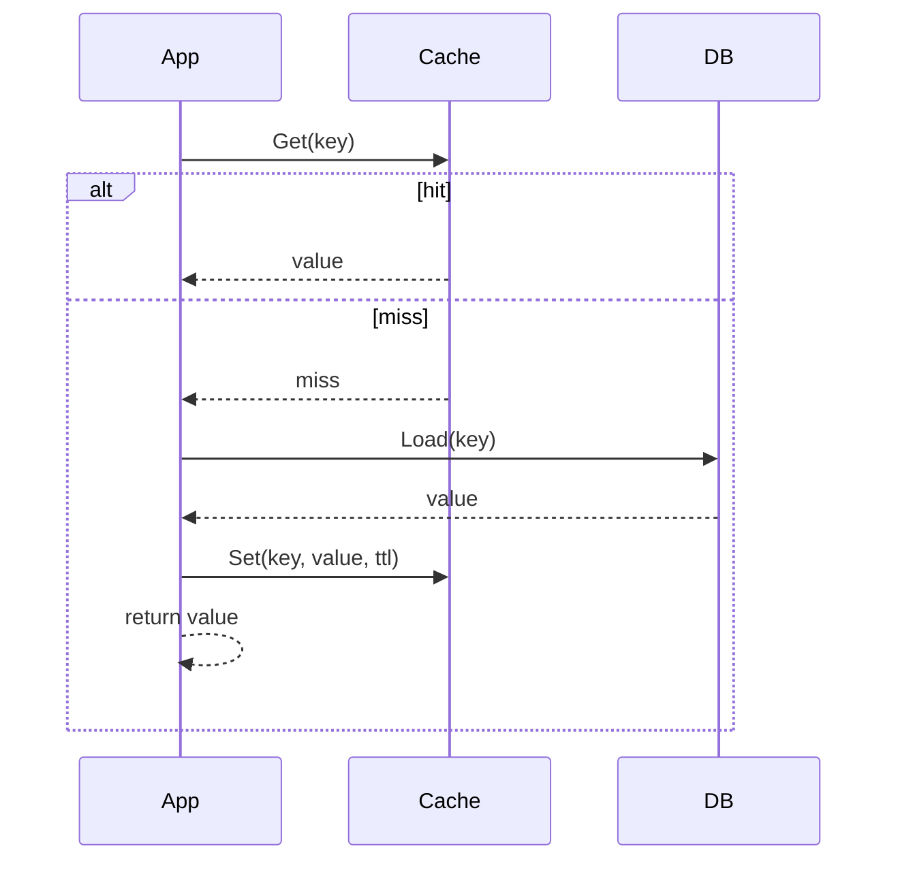
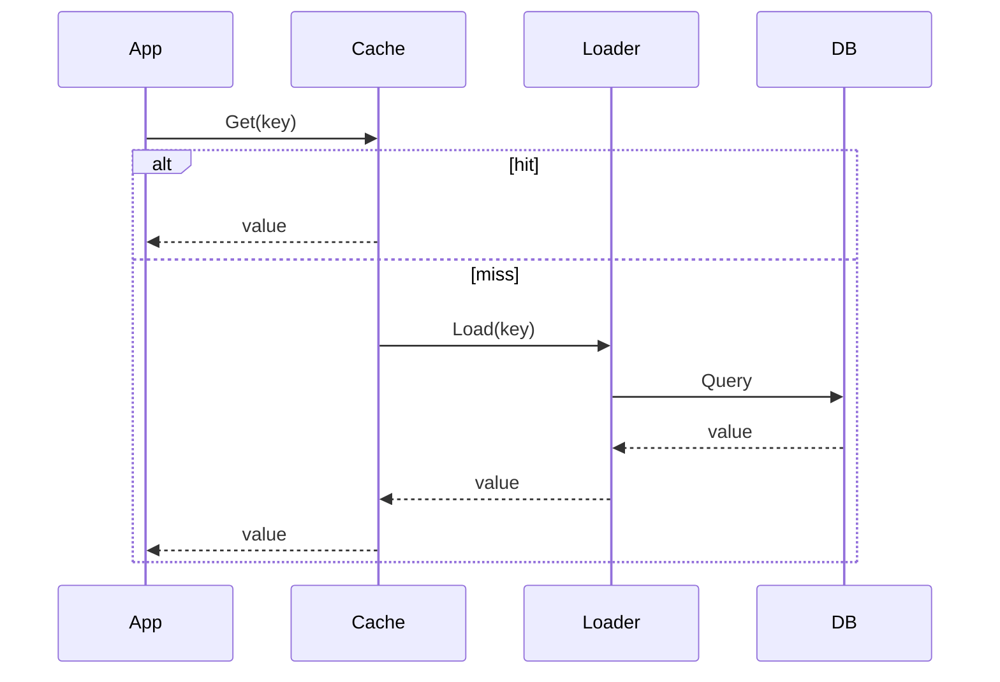
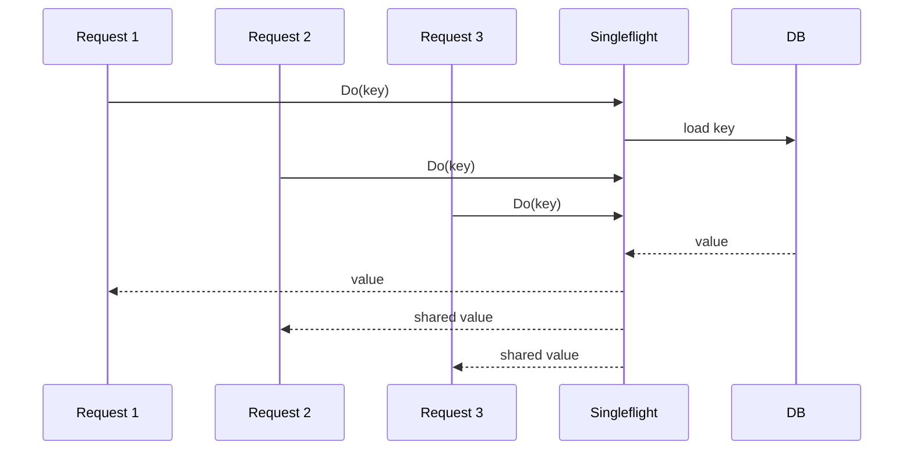
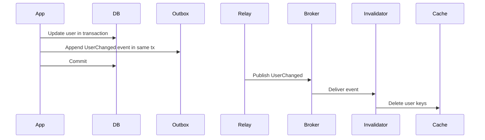
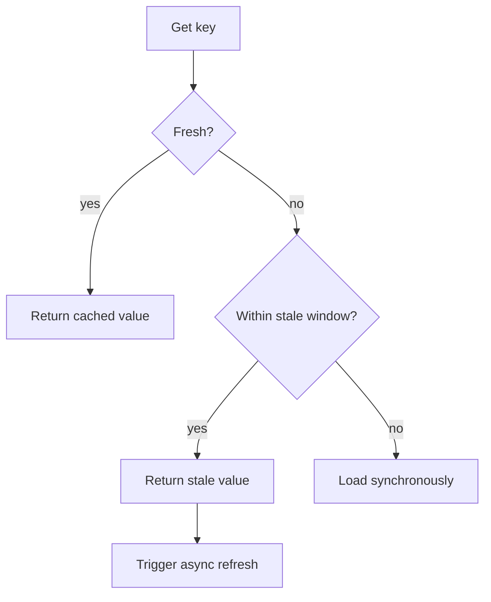
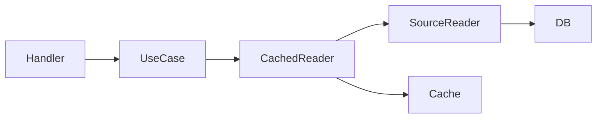

# learn-go-design-patterns-common-patterns-anti-patterns-part-026.md

# Part 026 — Cache Pattern

> Seri: **Go Design Patterns, Common Patterns, and Anti-Patterns**  
> Target pembaca: **Java software engineer yang ingin menulis Go production-grade**  
> Fokus: **cache sebagai desain consistency/performance boundary, bukan sekadar map yang mempercepat akses**

---

## 0. Posisi Part Ini Dalam Seri

Sampai part sebelumnya, kita sudah membangun mental model untuk:

- package boundary;
- API surface;
- interface placement;
- constructor dan initialization;
- config;
- dependency wiring;
- adapter/port;
- repository;
- transaction boundary;
- service/use case;
- handler/middleware/context/error;
- validation/result/state machine/command/event;
- worker/background processing;
- pipeline/bounded parallelism;
- resilience pattern.

Part ini masuk ke area yang sering tampak sederhana tetapi berbahaya: **cache**.

Di Go, cache sering dimulai dari sesuatu seperti:

```go
var cache = map[string]User{}
```

atau:

```go
var cache sync.Map
```

Lalu perlahan berubah menjadi:

- data stale;
- race condition;
- cache stampede;
- inconsistent authorization;
- memory leak;
- sulit di-debug;
- invisible dependency;
- production incident karena cache menjadi sumber kebenaran palsu.

Part ini akan membahas cache sebagai **pattern desain**:

- apa yang boleh dan tidak boleh dicache;
- siapa owner cache;
- bagaimana mendesain key;
- bagaimana TTL dipilih;
- bagaimana invalidation dilakukan;
- bagaimana cache berinteraksi dengan context, transaction, retry, circuit breaker, worker, event, dan observability;
- bagaimana menulis cache in-memory Go yang aman;
- kapan memakai Redis/external cache;
- bagaimana mencegah cache menjadi semantic bug tersembunyi.

---

## 1. Mental Model: Cache Bukan Storage, Cache Adalah Derived View

Prinsip pertama:

> Cache adalah **derived view** dari sumber kebenaran lain.

Artinya, cache seharusnya bisa dibuang kapan saja tanpa mengubah kebenaran sistem.

Jika cache hilang dan sistem menjadi salah secara bisnis, maka cache bukan lagi cache. Ia sudah menjadi storage, state machine, atau materialized view yang harus diperlakukan sebagai data source dengan durability, consistency, migration, dan recovery model.

### 1.1 Cache Menjawab Pertanyaan Berbeda dari Database

Database biasanya menjawab:

- apa state terbaru yang sah;
- apa transaksi yang sudah committed;
- apa relasi antar-entity;
- apa constraint yang harus dipertahankan.

Cache menjawab:

- apakah kita bisa menghindari expensive lookup;
- apakah data yang sedikit stale masih acceptable;
- apakah kita bisa mengurangi tekanan ke dependency;
- apakah kita bisa meningkatkan latency percentile;
- apakah kita bisa menahan traffic spike.

Cache bukan solusi utama untuk desain data yang buruk.

Jika query lambat karena schema buruk, index buruk, atau access pattern tidak jelas, cache hanya menyembunyikan masalah sampai suatu hari invalidation gagal dan incident terjadi.

---

## 2. Java Mindset vs Go Mindset

Sebagai Java engineer, kamu mungkin terbiasa dengan:

- Spring Cache annotation;
- Hibernate second-level cache;
- interceptors/proxies;
- cache abstraction framework;
- `@Cacheable`, `@CacheEvict`, `@CachePut`;
- implicit key generation;
- automatic serialization;
- framework-driven lifecycle.

Go cenderung lebih eksplisit:

- cache biasanya adalah dependency biasa;
- key dibentuk secara eksplisit;
- TTL dipilih secara eksplisit;
- cache miss/hit terlihat dalam code path;
- invalidation dipanggil sebagai bagian dari use case atau event handler;
- observability dipasang eksplisit;
- serialization/deserialization menjadi keputusan adapter.

Perbedaan penting:

| Java-style cache habit | Go-style cache habit |
|---|---|
| Annotation hides cache behavior | Cache call visible in use case/adapter |
| Framework generates key | Key is explicit and reviewed |
| Proxy intercepts method call | Decorator wraps dependency explicitly |
| Eviction hidden in annotation | Invalidation belongs to owner/use case/event |
| Cache abstraction often global | Cache is scoped dependency |
| Generic cache used everywhere | Cache is designed per access pattern |

Go tidak melarang abstraction. Namun cache abstraction yang terlalu generik biasanya cepat menjadi tempat bocornya semua concern:

- serialization;
- TTL;
- metrics;
- error policy;
- fallback;
- consistency;
- security;
- key namespace;
- stampede protection.

Akibatnya, abstraction terlihat bersih di awal tetapi menjadi opaque operationally.

---

## 3. Taxonomy Cache Pattern

Kita akan pakai taxonomy berikut:

```mermaid
flowchart TD
    CachePattern[Cache Pattern]

    CachePattern --> Placement[Placement]
    CachePattern --> Access[Access Pattern]
    CachePattern --> Consistency[Consistency Pattern]
    CachePattern --> Lifecycle[Lifecycle Pattern]
    CachePattern --> Failure[Failure Pattern]
    CachePattern --> Observability[Observability Pattern]

    Placement --> InProc[In-process cache]
    Placement --> External[External cache Redis/Memcached]
    Placement --> CDN[Edge/CDN cache]
    Placement --> Materialized[Materialized view]

    Access --> Aside[Cache-aside]
    Access --> ReadThrough[Read-through]
    Access --> WriteThrough[Write-through]
    Access --> WriteBehind[Write-behind]
    Access --> Negative[Negative cache]
    Access --> Singleflight[In-flight dedup]

    Consistency --> TTL[TTL-based freshness]
    Consistency --> Evict[Explicit invalidation]
    Consistency --> Version[Versioned key]
    Consistency --> EventInvalidation[Event-driven invalidation]

    Lifecycle --> Warmup[Warmup]
    Lifecycle --> Refresh[Refresh ahead]
    Lifecycle --> Stale[Stale-while-revalidate]
    Lifecycle --> MaxSize[Bounded size]

    Failure --> FailOpen[Fail open]
    Failure --> FailClosed[Fail closed]
    Failure --> Fallback[Fallback to source]
    Failure --> Degrade[Degraded mode]

    Observability --> HitRate[Hit/miss rate]
    Observability --> Latency[Cache latency]
    Observability --> ErrorRate[Cache error rate]
    Observability --> Staleness[Staleness]
    Observability --> Cardinality[Key cardinality]
```



---

## 4. Cache Placement Pattern

### 4.1 In-Process Cache

In-process cache hidup di memory proses Go.

Contoh:

```go
type PostalCache struct {
    mu    sync.RWMutex
    items map[string]postalEntry
}
```

Kelebihan:

- latency sangat rendah;
- tidak ada network hop;
- mudah untuk data kecil;
- cocok untuk static-ish reference data;
- cocok untuk computed value lokal;
- cocok untuk dedup request lokal.

Kekurangan:

- tidak shared antar instance;
- hilang saat restart;
- invalidation sulit di multi-instance;
- bisa menyebabkan memory leak;
- cache hit rate tergantung traffic per instance;
- rolling deployment bisa menyebabkan warmup storm;
- tidak cocok untuk consistency kuat.

Gunakan untuk:

- lookup kecil yang jarang berubah;
- config/reference data dengan TTL pendek;
- permission metadata yang bukan source-of-truth final;
- expensive pure computation;
- token cache lokal dengan TTL aman;
- singleflight lokal.

Hindari untuk:

- mutable business state kritikal;
- authorization decision final tanpa revalidation;
- workflow state;
- distributed lock;
- idempotency key yang harus survive restart;
- rate limiter global.

### 4.2 External Cache

External cache seperti Redis/Memcached berada di luar proses.

Kelebihan:

- shared antar instance;
- dapat dipakai untuk koordinasi ringan;
- TTL native;
- memory lebih besar;
- survival terhadap app restart;
- cocok untuk token/session/cache API response.

Kekurangan:

- network latency;
- dependency tambahan;
- failure mode baru;
- serialization issue;
- operational cost;
- consistency tetap tidak otomatis benar;
- bisa menjadi hidden database.

Gunakan untuk:

- shared API response cache;
- distributed token cache;
- short-lived idempotency marker;
- rate limiting distributed;
- session-like ephemeral state jika desainnya memang ephemeral;
- cache hasil external API yang expensive/rate-limited.

Hindari untuk:

- data yang harus durable tanpa persistence strategy;
- transaksi bisnis utama;
- audit trail;
- legal/regulatory source of truth;
- workflow state utama.

### 4.3 CDN/Edge Cache

CDN/edge cache berada di depan sistem.

Cocok untuk:

- static asset;
- public read-only content;
- GET response yang aman dicache;
- expensive public API response;
- geo-distributed latency reduction.

Tidak cocok untuk:

- personalized response tanpa keying benar;
- data rahasia;
- authorization-dependent response yang tidak memakai `Vary`/key scoping benar;
- workflow mutation.

### 4.4 Materialized View Bukan Cache Biasa

Materialized view sering dianggap cache, tetapi secara desain ia lebih dekat ke **derived data store**.

Contoh:

- read model CQRS;
- search index;
- reporting table;
- denormalized projection;
- OLAP aggregate.

Ia butuh:

- rebuild strategy;
- schema versioning;
- lag monitoring;
- replay mechanism;
- consistency expectation;
- reconciliation;
- ownership.

Jangan menyebut materialized view sebagai cache biasa jika ia dipakai untuk keputusan bisnis yang harus bisa diaudit.

---

## 5. Access Pattern: Cara Cache Dipakai

## 5.1 Cache-Aside Pattern

Cache-aside adalah pattern paling umum.

Flow:

1. Cek cache.
2. Jika hit, return.
3. Jika miss, load dari source of truth.
4. Simpan ke cache.
5. Return value.



Contoh Go:

```go
type UserReader interface {
    FindByID(ctx context.Context, id UserID) (User, error)
}

type UserCache interface {
    Get(ctx context.Context, key string) (User, bool, error)
    Set(ctx context.Context, key string, value User, ttl time.Duration) error
}

type CachedUserReader struct {
    next  UserReader
    cache UserCache
    ttl   time.Duration
}

func (r *CachedUserReader) FindByID(ctx context.Context, id UserID) (User, error) {
    key := userCacheKey(id)

    user, ok, err := r.cache.Get(ctx, key)
    if err == nil && ok {
        return user, nil
    }

    // For many read paths, cache failure should not make source unavailable.
    user, loadErr := r.next.FindByID(ctx, id)
    if loadErr != nil {
        return User{}, loadErr
    }

    // Set failure is often non-fatal. Observe it, do not hide it silently.
    if setErr := r.cache.Set(ctx, key, user, r.ttl); setErr != nil {
        // log/metric here in real code
    }

    return user, nil
}
```

Keputusan penting:

- apakah cache get error fatal?
- apakah cache set error fatal?
- TTL berapa?
- key mencakup tenant/user/locale/version?
- value boleh stale?
- apakah cache miss boleh memicu concurrent load massal?

### 5.1.1 Kapan Cache-Aside Cocok

Cocok saat:

- source of truth dapat dibaca langsung;
- cache miss acceptable;
- stale data bisa dibatasi TTL;
- cache failure tidak boleh menjatuhkan sistem;
- invalidation tidak terlalu kompleks.

Tidak cocok saat:

- read harus strongly consistent;
- cache harus selalu terisi sebelum read;
- update harus atomic dengan cache;
- stale data berbahaya.

---

## 5.2 Read-Through Pattern

Read-through menyembunyikan load source di balik cache abstraction.

```go
type Loader[K comparable, V any] interface {
    Load(ctx context.Context, key K) (V, error)
}

type ReadThroughCache[K comparable, V any] interface {
    Get(ctx context.Context, key K) (V, error)
}
```

Flow:



Kelebihan:

- caller lebih sederhana;
- cache policy tersentral;
- reusable untuk access pattern tertentu.

Kekurangan:

- source dependency tersembunyi di cache;
- error policy bisa tidak jelas;
- mudah menjadi generic framework internal;
- observability ownership ambigu.

Gunakan hanya jika loading semantics benar-benar seragam.

---

## 5.3 Write-Through Pattern

Write-through berarti write ke source dan cache dilakukan dalam path write.

Pseudo-flow:

1. Update database.
2. Update cache.
3. Return.

Masalahnya: database dan cache bukan satu transaksi atomik.

Jika DB commit sukses tetapi cache set gagal, state diverge.

Jika cache set sukses tetapi DB commit gagal, cache bisa berisi data yang tidak valid.

Karena itu write-through harus didesain hati-hati.

Lebih aman:

- commit DB terlebih dahulu;
- invalidate cache setelah commit;
- atau publish event/outbox untuk invalidation;
- atau gunakan versioned key sehingga stale key tidak dipakai.

```go
func (s *UserService) UpdateEmail(ctx context.Context, cmd UpdateEmailCommand) error {
    err := s.tx.WithinTx(ctx, func(ctx context.Context, tx Tx) error {
        user, err := s.users.FindForUpdate(ctx, tx, cmd.UserID)
        if err != nil {
            return err
        }

        if err := user.ChangeEmail(cmd.Email); err != nil {
            return err
        }

        if err := s.users.Save(ctx, tx, user); err != nil {
            return err
        }

        return s.outbox.Append(ctx, tx, UserEmailChangedEvent{
            UserID: user.ID,
            Version: user.Version,
        })
    })
    if err != nil {
        return err
    }

    // Best-effort immediate invalidation can be okay, but outbox remains the durable path.
    _ = s.userCache.Delete(ctx, userCacheKey(cmd.UserID))

    return nil
}
```

---

## 5.4 Write-Behind Pattern

Write-behind berarti aplikasi menulis ke cache/queue terlebih dahulu, lalu asynchronous writer menulis ke storage.

Ini bukan cache pattern biasa. Ini adalah durability design.

Risiko:

- data loss jika cache hilang;
- ordering issue;
- retry complexity;
- duplicate writes;
- recovery complexity;
- audit gap.

Gunakan hanya jika:

- kehilangan data acceptable, atau ada durable queue/log;
- write latency sangat kritikal;
- eventual consistency acceptable;
- reconciliation tersedia;
- semantics sangat jelas.

Untuk regulatory workflow, write-behind untuk state utama hampir selalu salah kecuali didukung durable log/outbox/event sourcing yang matang.

---

## 5.5 Negative Cache Pattern

Negative cache menyimpan “tidak ditemukan” atau “tidak eligible” sementara.

Contoh:

- postal code tidak ditemukan;
- external API return 404;
- user tidak punya feature flag;
- permission metadata tidak tersedia;
- validation reference tidak ada.

Tanpa negative cache, request untuk key tidak valid bisa menghantam dependency terus-menerus.

```go
type LookupResult[V any] struct {
    Value V
    Found bool
}
```

Contoh:

```go
func (r *CachedPostalLookup) Find(ctx context.Context, postalCode string) (PostalAddress, bool, error) {
    key := "postal:" + postalCode

    cached, ok, err := r.cache.Get(ctx, key)
    if err == nil && ok {
        return cached.Value, cached.Found, nil
    }

    addr, found, err := r.next.Find(ctx, postalCode)
    if err != nil {
        return PostalAddress{}, false, err
    }

    ttl := r.positiveTTL
    if !found {
        ttl = r.negativeTTL
    }

    _ = r.cache.Set(ctx, key, LookupResult[PostalAddress]{
        Value: addr,
        Found: found,
    }, ttl)

    return addr, found, nil
}
```

Negative cache TTL harus biasanya **lebih pendek** daripada positive cache TTL.

Kenapa?

Karena “tidak ada” bisa berubah menjadi “ada”. Jika negative TTL terlalu lama, sistem menolak data baru secara salah.

---

## 5.6 Singleflight / In-Flight Deduplication Pattern

Cache miss yang sama secara bersamaan dapat menyebabkan stampede.

Contoh:

- 100 request datang untuk key yang sama;
- cache miss semua;
- semua menembak database/external API;
- dependency overload;
- latency naik;
- retry memperparah.

Singleflight menggabungkan concurrent request dengan key sama sehingga hanya satu load berjalan.



Basic implementation shape:

```go
type call[V any] struct {
    wg  sync.WaitGroup
    val V
    err error
}

type Singleflight[K comparable, V any] struct {
    mu sync.Mutex
    m  map[K]*call[V]
}

func NewSingleflight[K comparable, V any]() *Singleflight[K, V] {
    return &Singleflight[K, V]{m: make(map[K]*call[V])}
}

func (g *Singleflight[K, V]) Do(ctx context.Context, key K, fn func(context.Context) (V, error)) (V, error) {
    g.mu.Lock()
    if c, ok := g.m[key]; ok {
        g.mu.Unlock()

        done := make(chan struct{})
        go func() {
            c.wg.Wait()
            close(done)
        }()

        select {
        case <-ctx.Done():
            var zero V
            return zero, ctx.Err()
        case <-done:
            return c.val, c.err
        }
    }

    c := &call[V]{}
    c.wg.Add(1)
    g.m[key] = c
    g.mu.Unlock()

    c.val, c.err = fn(ctx)
    c.wg.Done()

    g.mu.Lock()
    delete(g.m, key)
    g.mu.Unlock()

    return c.val, c.err
}
```

Catatan: implementation di atas menunjukkan mental model. Untuk production, perhatikan goroutine per waiter, panic safety, memory cleanup, shared cancellation semantics, dan package matang bila tersedia.

---

## 6. Cache Key Design Pattern

Cache key adalah API contract tersembunyi.

Key buruk menyebabkan:

- data salah dibaca;
- cross-tenant leakage;
- permission leakage;
- cache miss tinggi;
- invalidation sulit;
- metric cardinality meledak;
- Redis memory bengkak;
- debugging sulit.

### 6.1 Anatomy of Good Cache Key

Contoh key:

```text
aceas:v1:tenant:{tenantID}:user:{userID}:profile
```

Komponen:

| Komponen | Fungsi |
|---|---|
| service/domain prefix | mencegah collision |
| version | migration/invalidation massal |
| tenant/scope | mencegah data leakage |
| entity type | readability |
| entity ID | lookup identity |
| projection | membedakan shape data |
| policy dimension | locale/role/permission jika memengaruhi value |

### 6.2 Key Harus Memuat Semua Dimensi yang Mempengaruhi Value

Jika response berbeda berdasarkan:

- tenant;
- user;
- role;
- locale;
- feature flag;
- time window;
- permission;
- projection;
- API version;
- organization;
- environment;

maka dimensi itu harus masuk key atau cache tidak boleh dipakai.

Contoh salah:

```text
case:123
```

Jika case 123 memiliki view berbeda untuk officer, supervisor, agency admin, dan external user, key ini berbahaya.

Lebih benar:

```text
case:v2:tenant:cea:viewerRole:supervisor:case:123:view:summary
```

Namun jangan masukkan data high-cardinality tanpa pertimbangan jika membuat cache tidak efektif.

### 6.3 Key Versioning

Key versioning membantu invalidasi massal tanpa scan/delete semua key.

```go
func userProfileKey(userID UserID) string {
    return fmt.Sprintf("user-profile:v3:%s", userID)
}
```

Ketika schema value berubah, naikkan `v3` ke `v4`.

Trade-off:

- mudah deploy;
- old key akan expire via TTL;
- sementara memory meningkat karena key lama masih hidup.

### 6.4 Jangan Pakai Struct Serialization Acak Sebagai Key

Anti-pattern:

```go
key := fmt.Sprintf("%v", request)
```

Masalah:

- ordering map tidak stabil;
- field baru mengubah key diam-diam;
- sensitive data bisa masuk key;
- key terlalu panjang;
- debugging sulit;
- compatibility buruk.

Buat key builder eksplisit.

```go
type SearchKey struct {
    TenantID TenantID
    Query    string
    Page     int
    Limit    int
}

func (k SearchKey) CacheKey() string {
    q := normalizeQuery(k.Query)
    sum := sha256.Sum256([]byte(q))
    return fmt.Sprintf(
        "search:v1:tenant:%s:q:%x:page:%d:limit:%d",
        k.TenantID,
        sum[:8],
        k.Page,
        k.Limit,
    )
}
```

---

## 7. TTL Pattern

TTL adalah contract freshness.

TTL bukan angka random.

Pertanyaan desain:

- seberapa cepat data berubah?
- seberapa berbahaya stale data?
- berapa cost reload?
- apakah ada invalidation event?
- apakah cache dipakai untuk fallback saat dependency down?
- apakah data mengandung permission/security?
- apakah ada regulatory/legal implication?

### 7.1 TTL Panjang vs Pendek

TTL pendek:

- lebih fresh;
- hit rate lebih rendah;
- dependency lebih sering diakses;
- stampede lebih mungkin.

TTL panjang:

- hit rate lebih tinggi;
- dependency pressure turun;
- stale risk meningkat;
- invalidation lebih penting.

### 7.2 TTL Berdasarkan Data Class

Contoh klasifikasi:

| Data | Typical TTL | Catatan |
|---|---:|---|
| static reference code | jam/hari | jika ada version/invalidation |
| external postal lookup | menit/jam | depends pada update source |
| access token | token expiry minus safety margin | jangan melebihi expiry |
| user profile | detik/menit | depends pada update frequency |
| permission decision | sangat pendek / avoid | security-sensitive |
| case workflow state | avoid atau sangat pendek | state correctness penting |
| search result | detik/menit | key harus memuat filter/page |
| negative result | pendek | karena absent bisa berubah |

### 7.3 Jittered TTL

Jika semua key expire bersamaan, sistem bisa mengalami thundering herd.

Tambahkan jitter.

```go
func jitterTTL(base time.Duration, percent int) time.Duration {
    if percent <= 0 {
        return base
    }
    delta := int64(base) * int64(percent) / 100
    if delta <= 0 {
        return base
    }
    n := rand.Int63n(2*delta + 1) - delta
    return base + time.Duration(n)
}
```

Untuk production, hindari global `math/rand` tanpa pertimbangan concurrency/performance. Bisa gunakan per-instance random source atau crypto randomness hanya jika perlu security. Untuk TTL jitter biasa, pseudo-random cukup.

### 7.4 Absolute vs Sliding TTL

Absolute TTL:

- expire setelah durasi fixed sejak set;
- predictable;
- cocok untuk freshness.

Sliding TTL:

- diperpanjang saat access;
- cocok untuk session-like data;
- bisa membuat stale data hidup terlalu lama;
- berbahaya untuk data bisnis yang harus refresh periodik.

Untuk cache data reference/business read, absolute TTL lebih mudah dipahami.

---

## 8. Invalidation Pattern

Ada joke klasik: dua hal tersulit dalam computer science adalah cache invalidation, naming things, dan off-by-one errors.

Joke tersebut benar secara operasional.

### 8.1 TTL-Only Invalidation

Value expire otomatis setelah TTL.

Kelebihan:

- simple;
- tidak perlu event;
- mudah dioperasikan.

Kekurangan:

- stale sampai TTL habis;
- tidak cocok untuk perubahan kritikal;
- sulit untuk immediate correctness.

### 8.2 Explicit Delete on Write

Setelah data berubah, hapus key terkait.

```go
func (s *UserService) ChangeName(ctx context.Context, cmd ChangeNameCommand) error {
    if err := s.updateUserInDB(ctx, cmd); err != nil {
        return err
    }

    _ = s.cache.Delete(ctx, userProfileKey(cmd.UserID))
    return nil
}
```

Masalah:

- jika delete gagal, stale data bertahan;
- jika delete dilakukan sebelum commit lalu commit gagal, cache terhapus tanpa perlu;
- jika ada banyak derived key, sulit hapus semua;
- multi-instance external cache lebih mudah, in-process cache lebih sulit.

### 8.3 Event-Driven Invalidation

Write path mem-publish event setelah commit, consumer cache invalidator menghapus key.



Kelebihan:

- decoupled;
- reliable jika outbox benar;
- bisa multi-instance;
- bagus untuk derived read model/cache.

Kekurangan:

- eventual consistency;
- duplicate event harus idempotent;
- lag harus dimonitor;
- key mapping harus diketahui;
- event schema harus stabil.

### 8.4 Versioned Key Invalidation

Alih-alih delete key lama, naikkan version dimension.

Contoh:

```text
case-summary:v42:case:123
```

Jika case version naik ke 43, key baru otomatis berbeda.

Kelebihan:

- tidak perlu delete;
- stale key tidak dibaca;
- cocok jika caller tahu version terbaru.

Kekurangan:

- perlu version source;
- old keys hidup sampai TTL;
- key cardinality naik.

### 8.5 Invalidate by Namespace

Redis sering memakai pattern namespace version:

```text
tenant:cea:user-cache-version -> 17
user-profile:tenant:cea:v17:user:123
```

Untuk invalidate semua user profile dalam tenant, increment version.

Kelebihan:

- invalidasi massal murah;
- tidak scan key.

Kekurangan:

- perlu extra read version;
- version key menjadi dependency;
- memory old namespace bertahan sampai TTL.

---

## 9. Consistency Patterns

### 9.1 Strong Consistency and Cache Usually Conflict

Jika read harus melihat write terbaru immediately, cache biasa sulit.

Pilihan:

1. jangan cache path itu;
2. gunakan versioned key dengan version terbaru dari source;
3. gunakan read-through yang aware transaction/version;
4. gunakan cache hanya untuk immutable data;
5. gunakan short TTL + explicit invalidation dengan risiko residual;
6. gunakan materialized view dengan consistency SLA jelas.

### 9.2 Read-Your-Writes

Problem:

- user update profile;
- redirect ke profile page;
- cache masih stale;
- user melihat data lama.

Solusi:

- invalidate setelah commit;
- bypass cache untuk request setelah write;
- include version in response and cache key;
- write-through with careful semantics;
- local request context carrying updated value, not global cache mutation.

### 9.3 Monotonic Reads

User tidak boleh melihat state mundur.

Contoh:

- pertama lihat case status `Approved`;
- request berikutnya lihat `Pending` karena cache lama.

Solusi:

- version-aware read;
- reject stale cache if version lower than known version;
- do not cache lifecycle state;
- use source-of-truth for critical workflow read.

### 9.4 Permission-Sensitive Cache

Cache authorization/permission sangat berbahaya.

Jika permission dicache:

- TTL harus pendek;
- key harus mencakup user/role/tenant/resource/policy version;
- revoke harus invalidasi cepat;
- keputusan final sebaiknya masih enforce di source/domain boundary;
- audit harus mencatat policy version.

Anti-pattern:

```go
key := "can-approve:" + caseID
```

Benar minimal:

```text
authz:v3:tenant:{tenant}:user:{user}:rolever:{roleVersion}:policy:{policyVersion}:action:approve:case:{caseID}
```

Namun walaupun key benar, caching authorization decision tetap harus dipertanyakan.

---

## 10. Cache Value Design

### 10.1 Cache DTO, Not Mutable Domain Object

Jangan cache pointer mutable yang sama dipakai caller.

Salah:

```go
type MemoryCache struct {
    mu sync.RWMutex
    m  map[string]*User
}
```

Masalah:

- caller dapat mutate cached object;
- race condition;
- stale/corrupt data;
- test flaky.

Lebih aman:

- cache immutable value;
- deep copy on set/get;
- cache serialized bytes;
- expose read-only projection.

```go
type CachedUser struct {
    ID    string
    Name  string
    Email string
}
```

### 10.2 Cache Projection, Not Entire Aggregate

Jika caller hanya perlu summary, cache summary.

Jangan cache seluruh aggregate besar jika:

- ada field sensitive;
- field tidak diperlukan;
- invalidation sulit;
- serialization mahal;
- schema sering berubah.

Contoh:

```go
type CaseSummaryCacheValue struct {
    CaseID      string
    ReferenceNo string
    Status      string
    UpdatedAt   time.Time
    Version     int64
}
```

### 10.3 Include Metadata

Cache value sering perlu metadata:

- source version;
- generatedAt;
- expiresAt;
- policy version;
- schema version;
- data classification;
- trace/audit fields jika perlu.

```go
type CacheEnvelope[V any] struct {
    Value       V
    Version     int64
    GeneratedAt time.Time
}
```

Jangan overdo untuk semua cache, tetapi untuk regulatory/decision read path, metadata sangat membantu.

---

## 11. In-Memory Cache Implementation in Go

Mari desain in-memory TTL cache sederhana tetapi production-aware.

Kebutuhan:

- generic key comparable;
- value any;
- TTL per entry;
- concurrency safe;
- no mutation leak minimal;
- size bound optional;
- cleanup path;
- context not needed untuk memory operation kecuali API uniform.

### 11.1 Basic TTL Cache

```go
type TTLCache[K comparable, V any] struct {
    mu    sync.RWMutex
    items map[K]ttlItem[V]
    now   func() time.Time
}

type ttlItem[V any] struct {
    value     V
    expiresAt time.Time
}

func NewTTLCache[K comparable, V any]() *TTLCache[K, V] {
    return &TTLCache[K, V]{
        items: make(map[K]ttlItem[V]),
        now:   time.Now,
    }
}

func (c *TTLCache[K, V]) Get(key K) (V, bool) {
    c.mu.RLock()
    item, ok := c.items[key]
    c.mu.RUnlock()

    var zero V
    if !ok {
        return zero, false
    }

    if !item.expiresAt.IsZero() && !c.now().Before(item.expiresAt) {
        c.mu.Lock()
        // Re-check before delete to avoid deleting refreshed value.
        current, stillThere := c.items[key]
        if stillThere && current.expiresAt.Equal(item.expiresAt) {
            delete(c.items, key)
        }
        c.mu.Unlock()
        return zero, false
    }

    return item.value, true
}

func (c *TTLCache[K, V]) Set(key K, value V, ttl time.Duration) {
    expiresAt := time.Time{}
    if ttl > 0 {
        expiresAt = c.now().Add(ttl)
    }

    c.mu.Lock()
    c.items[key] = ttlItem[V]{value: value, expiresAt: expiresAt}
    c.mu.Unlock()
}

func (c *TTLCache[K, V]) Delete(key K) {
    c.mu.Lock()
    delete(c.items, key)
    c.mu.Unlock()
}
```

### 11.2 Important Notes

This cache is still basic.

Missing:

- max size;
- eviction policy;
- background cleanup;
- metrics;
- copy semantics;
- memory accounting;
- shard locks;
- singleflight;
- loader;
- stop lifecycle.

Untuk small cache/reference data, ini cukup sebagai mental model. Untuk high-scale cache, gunakan implementation yang matang atau desain khusus.

### 11.3 Cleanup Loop Lifecycle

Jika ingin background cleanup, jangan start goroutine diam-diam tanpa owner.

Lebih baik expose `Run`:

```go
func (c *TTLCache[K, V]) RunJanitor(ctx context.Context, interval time.Duration) {
    ticker := time.NewTicker(interval)
    defer ticker.Stop()

    for {
        select {
        case <-ctx.Done():
            return
        case <-ticker.C:
            c.DeleteExpired()
        }
    }
}

func (c *TTLCache[K, V]) DeleteExpired() int {
    now := c.now()
    deleted := 0

    c.mu.Lock()
    defer c.mu.Unlock()

    for key, item := range c.items {
        if !item.expiresAt.IsZero() && !now.Before(item.expiresAt) {
            delete(c.items, key)
            deleted++
        }
    }

    return deleted
}
```

Composition root owns it:

```go
g, ctx := errgroup.WithContext(rootCtx)

g.Go(func() error {
    cache.RunJanitor(ctx, time.Minute)
    return nil
})
```

Pattern:

> Constructor constructs. Lifecycle owner starts/stops.

---

## 12. Bounded Cache Pattern

Unbounded cache adalah memory leak dengan nama bagus.

Jika key cardinality tidak terbatas, cache harus punya bound.

Bound bisa berupa:

- max entry count;
- max approximate bytes;
- per-tenant max;
- per-prefix max;
- TTL only jika key cardinality bounded;
- LRU/LFU/ARC-like policy.

### 12.1 Simple Max Entries

```go
type BoundedCache[K comparable, V any] struct {
    mu       sync.Mutex
    maxItems int
    items    map[K]ttlItem[V]
    order    []K // simple example, not efficient LRU
}
```

Untuk production, jangan pakai slice order naive jika item besar/high churn. Gunakan linked list atau library matang.

### 12.2 Per-Tenant Bound

Multi-tenant system butuh fairness.

Tanpa per-tenant bound, satu tenant bisa mengisi cache dan menurunkan hit rate tenant lain.

Key prefix saja tidak cukup; eviction policy juga perlu aware tenant jika fairness penting.

---

## 13. Cache Stampede Protection

Stampede terjadi saat banyak request miss key yang sama.

Mitigasi:

1. singleflight;
2. TTL jitter;
3. stale-while-revalidate;
4. refresh-ahead;
5. request coalescing;
6. rate limit load path;
7. negative cache;
8. circuit breaker fallback.

### 13.1 Stale-While-Revalidate

Jika value expired tetapi masih dalam stale window, return stale value dan refresh di background.



Trade-off:

- latency bagus;
- dependency terlindungi;
- stale data bisa bertahan lebih lama;
- refresh worker harus bounded;
- tidak cocok untuk critical state.

### 13.2 Refresh-Ahead

Refresh sebelum TTL habis jika item populer.

Cocok untuk:

- expensive reference data;
- homepage/public content;
- token refresh;
- external lookup with rate limit.

Tidak cocok untuk:

- high-cardinality low-reuse key;
- data sensitive;
- data yang berubah unpredictable.

---

## 14. External Cache Adapter Pattern

Cache sebagai port:

```go
type Cache[K comparable, V any] interface {
    Get(ctx context.Context, key K) (V, bool, error)
    Set(ctx context.Context, key K, value V, ttl time.Duration) error
    Delete(ctx context.Context, key K) error
}
```

Namun external cache biasanya key string dan value bytes.

Lebih realistis:

```go
type ByteCache interface {
    Get(ctx context.Context, key string) ([]byte, bool, error)
    Set(ctx context.Context, key string, value []byte, ttl time.Duration) error
    Delete(ctx context.Context, key string) error
}
```

Codec decorator:

```go
type JSONCache[V any] struct {
    next ByteCache
}

func (c *JSONCache[V]) Get(ctx context.Context, key string) (V, bool, error) {
    var zero V

    b, ok, err := c.next.Get(ctx, key)
    if err != nil || !ok {
        return zero, ok, err
    }

    var v V
    if err := json.Unmarshal(b, &v); err != nil {
        return zero, false, err
    }

    return v, true, nil
}

func (c *JSONCache[V]) Set(ctx context.Context, key string, value V, ttl time.Duration) error {
    b, err := json.Marshal(value)
    if err != nil {
        return err
    }
    return c.next.Set(ctx, key, b, ttl)
}
```

Design decision:

- codec error on get: treat as miss or fatal?
- corrupt cache value: delete key?
- schema version mismatch: miss?
- timeout: fallback to source?

For most cache-aside read path:

- cache unavailable -> miss/fallback;
- cache corrupt -> delete + miss;
- cache set failed -> non-fatal metric/log;
- source failed -> fatal unless stale fallback allowed.

---

## 15. Cache Decorator Pattern

Cache sering paling bersih sebagai decorator atas dependency read.



Contoh:

```go
type CaseSummaryReader interface {
    GetSummary(ctx context.Context, id CaseID) (CaseSummary, error)
}

type CachedCaseSummaryReader struct {
    next  CaseSummaryReader
    cache ByteCache
    ttl   time.Duration
}
```

Keuntungan:

- use case tidak penuh detail caching;
- cache policy dekat read dependency;
- mudah test hit/miss;
- mudah compose metrics/retry/cache;
- source reader tetap bisa dipakai tanpa cache.

Risiko:

- decorator stack menjadi opaque;
- error semantics berubah tanpa terlihat;
- authorization dimension bisa terlupakan;
- transaction-aware read tidak cocok didecorate global.

Rule:

> Cache decorator boleh mengoptimalkan read, tetapi tidak boleh mengubah contract semantik dependency.

---

## 16. Cache and Transaction Boundary

Cache tidak ikut transaction database.

Jangan set cache berisi state baru sebelum commit.

Salah:

```go
err := tx.WithinTx(ctx, func(ctx context.Context, tx Tx) error {
    user := updateUser(...)
    if err := repo.Save(ctx, tx, user); err != nil {
        return err
    }

    // Dangerous: tx may still rollback later.
    _ = cache.Set(ctx, key, user, ttl)
    return nil
})
```

Lebih aman:

```go
err := tx.WithinTx(ctx, func(ctx context.Context, tx Tx) error {
    user := updateUser(...)
    if err := repo.Save(ctx, tx, user); err != nil {
        return err
    }
    return outbox.Append(ctx, tx, UserChanged{UserID: user.ID})
})
if err != nil {
    return err
}

_ = cache.Delete(ctx, key)
```

Best practice umum:

- write path update source of truth;
- after commit invalidate cache;
- durable outbox/event untuk reliable invalidation;
- cache repopulated on next read;
- do not rely solely on immediate best-effort delete.

---

## 17. Cache and Context Boundary

Cache operation yang melibatkan network harus menerima `context.Context`.

```go
Get(ctx context.Context, key string) ([]byte, bool, error)
```

In-memory cache tidak wajib memakai context, tetapi jika interface shared dengan external cache, context bisa diterima demi uniformity.

Namun jangan gunakan context sebagai cache storage.

Anti-pattern:

```go
ctx = context.WithValue(ctx, "user", user)
```

Lalu deep function membaca user dari context sebagai cache.

Context value hanya untuk request-scoped value yang melintasi boundary, bukan general cache atau dependency bag.

---

## 18. Cache and Error Policy

Cache error policy harus eksplisit.

Pertanyaan:

- Jika cache get gagal, apakah read gagal?
- Jika cache set gagal, apakah request gagal?
- Jika cache delete gagal setelah write, apakah write gagal?
- Jika deserialize gagal, apakah treat as miss?
- Jika cache timeout, apakah fallback ke DB?
- Jika source gagal, boleh return stale?

### 18.1 Common Policy Matrix

| Operation | Common Policy | Exception |
|---|---|---|
| Get cache fails | Treat as miss + metric | If cache is required for security/session |
| Set cache fails | Non-fatal + metric | If write-through durability required, but then it is not normal cache |
| Delete cache fails | Usually non-fatal but alert/repair | If stale data dangerous, use versioned key/outbox |
| Decode cache fails | Delete + miss + metric | If corruption indicates security issue |
| Source load fails | Return error | Or stale fallback if explicitly allowed |

### 18.2 Fail Open vs Fail Closed

Fail open:

- cache unavailable -> load source;
- good for performance cache.

Fail closed:

- cache unavailable -> reject/fail;
- only if cache is security/session/control-plane dependency.

Do not accidentally fail closed because Redis was used for optional cache but every code path returns Redis error.

---

## 19. Cache and Security

Cache can leak data.

Security questions:

- Is value user-specific?
- Is value tenant-specific?
- Does key include tenant/user/role dimensions?
- Is sensitive data serialized into external cache?
- Is cache encrypted at rest/in transit?
- Who can access Redis/Memcached?
- Are logs printing keys with PII?
- Are metrics labels using raw keys?
- Is TTL too long after permission revocation?
- Does cache bypass authorization?

### 19.1 Never Cache Raw Secrets Carelessly

Access token cache is common, but must include:

- TTL less than actual token expiry;
- no logging token;
- secure storage;
- refresh lock/singleflight;
- scope/audience in key;
- deletion on credential rotation if possible.

Key example:

```text
token:v1:provider:onemap:audience:geocode:scope:read
```

Do not include token value in key/log.

### 19.2 Authorization Cache

If caching authorization metadata, prefer caching **input metadata**, not final decision.

For example:

- role membership version;
- policy document version;
- resource assignment summary.

Then evaluate decision at request time.

Final decision caching is riskier.

---

## 20. Observability Pattern

Cache without observability becomes superstition.

Metrics:

- cache hit count;
- cache miss count;
- hit ratio;
- get latency;
- set latency;
- delete latency;
- error count by operation;
- load latency;
- singleflight shared count;
- eviction count;
- item count;
- approximate bytes;
- stale served count;
- refresh failures;
- invalidation lag.

Logs:

- cache backend unavailable;
- decode corruption;
- invalidation failures;
- stampede protection triggered;
- fallback to stale;
- excessive cardinality warning.

Traces:

- annotate cache hit/miss;
- annotate key namespace, not raw key;
- include source load span;
- include fallback reason.

### 20.1 Avoid High-Cardinality Metrics

Do not use raw cache key as metric label.

Bad:

```text
cache_hit_total{key="user-profile:v1:user:123"}
```

Good:

```text
cache_hit_total{cache="user_profile", result="hit"}
```

If debugging needs raw key, use sampled logs with redaction and access controls.

---

## 21. Testing Strategy

### 21.1 Test Hit Path

- source is not called;
- returned value equals cached value;
- metrics hit incremented;
- context respected if external.

### 21.2 Test Miss Path

- source is called once;
- cache set called;
- returned value from source;
- set failure does not fail if policy says non-fatal.

### 21.3 Test Source Error

- source error returned;
- cache not populated;
- stale fallback if configured.

### 21.4 Test Decode Error

- corrupt cache value treated as miss or error according to policy;
- corrupt key deleted if policy says so;
- metric emitted.

### 21.5 Test TTL

Use injected clock.

```go
type fakeClock struct {
    now time.Time
}

func (c *fakeClock) Now() time.Time { return c.now }
func (c *fakeClock) Add(d time.Duration) { c.now = c.now.Add(d) }
```

Avoid `time.Sleep` in unit tests.

### 21.6 Test Stampede Protection

- many goroutines request same key;
- source called once;
- all receive same value;
- cancellation path works;
- load error shared consistently.

### 21.7 Contract Test for Cache Adapter

For `ByteCache` implementations:

- set/get/delete;
- TTL expiry;
- binary value;
- missing key;
- context cancellation;
- large value behavior;
- connection error behavior;
- key prefix behavior.

---

## 22. Production Example: External Postal Lookup Cache

Scenario:

- application needs postal code lookup from external API;
- external API has rate limit;
- postal code result changes rarely;
- missing postal code should be negative cached briefly;
- duplicate concurrent lookup should be deduplicated;
- external failure should return error unless stale fallback exists;
- token is cached separately.

### 22.1 Interfaces

```go
type PostalLookup interface {
    Find(ctx context.Context, postalCode string) (PostalAddress, bool, error)
}

type PostalAddress struct {
    PostalCode string
    Block      string
    Street     string
    Building   string
}

type PostalCacheValue struct {
    Address     PostalAddress
    Found       bool
    GeneratedAt time.Time
}
```

### 22.2 Cached Decorator

```go
type CachedPostalLookup struct {
    next        PostalLookup
    cache       Cache[string, PostalCacheValue]
    group       *Singleflight[string, PostalCacheValue]
    positiveTTL time.Duration
    negativeTTL time.Duration
    now         func() time.Time
}

func NewCachedPostalLookup(
    next PostalLookup,
    cache Cache[string, PostalCacheValue],
    positiveTTL time.Duration,
    negativeTTL time.Duration,
) *CachedPostalLookup {
    return &CachedPostalLookup{
        next:        next,
        cache:       cache,
        group:       NewSingleflight[string, PostalCacheValue](),
        positiveTTL: positiveTTL,
        negativeTTL: negativeTTL,
        now:         time.Now,
    }
}

func (l *CachedPostalLookup) Find(ctx context.Context, postalCode string) (PostalAddress, bool, error) {
    normalized, err := normalizePostalCode(postalCode)
    if err != nil {
        return PostalAddress{}, false, err
    }

    key := postalKey(normalized)

    cached, ok, err := l.cache.Get(ctx, key)
    if err == nil && ok {
        return cached.Address, cached.Found, nil
    }

    loaded, err := l.group.Do(ctx, key, func(ctx context.Context) (PostalCacheValue, error) {
        // Double-check after winning singleflight to avoid unnecessary source load.
        cached, ok, err := l.cache.Get(ctx, key)
        if err == nil && ok {
            return cached, nil
        }

        addr, found, err := l.next.Find(ctx, normalized)
        if err != nil {
            return PostalCacheValue{}, err
        }

        value := PostalCacheValue{
            Address:     addr,
            Found:       found,
            GeneratedAt: l.now(),
        }

        ttl := l.positiveTTL
        if !found {
            ttl = l.negativeTTL
        }

        _ = l.cache.Set(ctx, key, value, jitterTTL(ttl, 10))
        return value, nil
    })
    if err != nil {
        return PostalAddress{}, false, err
    }

    return loaded.Address, loaded.Found, nil
}

func postalKey(postalCode string) string {
    return "postal:v1:sg:" + postalCode
}
```

### 22.3 Why This Design Works

- cache key is explicit;
- positive/negative TTL separated;
- singleflight prevents stampede;
- external API remains source for miss;
- cache get failure is treated as miss;
- invalid postal code validation happens before cache;
- generatedAt enables observability/debug;
- decorator does not pollute use case;
- fallback policy is visible.

---

## 23. Production Example: Token Cache With Refresh Lock

Token cache berbeda dari normal data cache karena token has expiry.

Rules:

- never use token after expiry;
- refresh before expiry with safety margin;
- prevent concurrent refresh storm;
- key includes provider/audience/scope;
- do not log token;
- if refresh fails and token still valid, maybe use existing token;
- if token expired and refresh fails, fail.

```go
type Token struct {
    AccessToken string
    ExpiresAt   time.Time
}

type TokenSource interface {
    Fetch(ctx context.Context) (Token, error)
}

type CachedTokenSource struct {
    next   TokenSource
    cache  Cache[string, Token]
    group  *Singleflight[string, Token]
    key    string
    margin time.Duration
    now    func() time.Time
}

func (s *CachedTokenSource) Token(ctx context.Context) (Token, error) {
    token, ok, err := s.cache.Get(ctx, s.key)
    if err == nil && ok && s.now().Add(s.margin).Before(token.ExpiresAt) {
        return token, nil
    }

    return s.group.Do(ctx, s.key, func(ctx context.Context) (Token, error) {
        // Double-check after becoming leader.
        token, ok, err := s.cache.Get(ctx, s.key)
        if err == nil && ok && s.now().Add(s.margin).Before(token.ExpiresAt) {
            return token, nil
        }

        fresh, err := s.next.Fetch(ctx)
        if err != nil {
            // If old token still technically valid, choose policy explicitly.
            if ok && s.now().Before(token.ExpiresAt) {
                return token, nil
            }
            return Token{}, err
        }

        ttl := time.Until(fresh.ExpiresAt.Add(-s.margin))
        if ttl <= 0 {
            return Token{}, errors.New("token expiry too short")
        }

        _ = s.cache.Set(ctx, s.key, fresh, ttl)
        return fresh, nil
    })
}
```

This is cache, but with stricter correctness constraints.

---

## 24. Anti-Pattern Catalog

## 24.1 Cache as Source of Truth

Symptom:

- write only updates cache;
- database lags or absent;
- restart loses business state;
- no audit trail;
- no recovery.

Fix:

- reclassify as storage or materialized view;
- add durability model;
- define source of truth;
- add rebuild/replay/reconciliation;
- do not call it simple cache.

## 24.2 Global Cache Singleton

Bad:

```go
var UserCache = map[string]User{}
```

Problems:

- hidden dependency;
- test contamination;
- no lifecycle;
- no config;
- no observability;
- race risk;
- impossible multi-tenant policy.

Fix:

- inject cache dependency;
- define owner;
- add interface at consumer;
- create in composition root.

## 24.3 Unbounded Map Cache

Bad:

```go
cache[key] = value
```

with no TTL, no size bound, no cleanup.

Fix:

- TTL;
- max entries/bytes;
- eviction;
- metrics;
- key cardinality review.

## 24.4 Caching Mutable Pointer

Bad:

```go
cache.Set(key, &user)
```

Then caller mutates `user`.

Fix:

- cache immutable value;
- copy on set/get;
- cache serialized bytes;
- avoid pointer to mutable aggregate.

## 24.5 Permission-Unsafe Key

Bad:

```text
report:monthly:2026-06
```

If report differs per tenant/user/role, this leaks data.

Fix:

- include scope dimensions;
- avoid caching sensitive personalized response;
- use server-side authorization on every read.

## 24.6 Caching Before Commit

Bad:

- transaction saves row;
- cache set happens;
- later transaction rollback;
- cache contains uncommitted state.

Fix:

- invalidate after commit;
- outbox event;
- versioned key;
- transaction-aware design.

## 24.7 Cache Set Failure Fails Critical Request Accidentally

If cache is optional performance optimization, Redis outage should not take down read path.

Fix:

- decide fail-open policy;
- metric cache errors;
- fallback source;
- circuit breaker for cache if needed.

## 24.8 No Stampede Protection

Symptom:

- DB/external API spike when TTL expires;
- latency wave;
- retries amplify;
- autoscaling worsens dependency pressure.

Fix:

- singleflight;
- TTL jitter;
- stale-while-revalidate;
- rate limit load path;
- negative cache.

## 24.9 Cache Key Contains PII or Secret

Bad:

```text
user-search:email:john@example.com
```

or:

```text
token:actual-token-value
```

Fix:

- hash sensitive dimensions;
- avoid raw PII in logs/metrics;
- use scoped opaque identifiers.

## 24.10 Metrics With Raw Key Label

Bad:

```text
cache_hit{key="case:v1:123"}
```

Fix:

```text
cache_hit{cache="case_summary", result="hit"}
```

## 24.11 Generic Cache Abstraction That Hides Semantics

Symptom:

```go
cache.GetOrSet(ctx, key, func() any { ... })
```

used everywhere with different consistency/security/error semantics.

Fix:

- use domain-specific decorator;
- expose policy explicitly;
- split cache per access pattern.

## 24.12 Cache Invalidation by Redis SCAN in Hot Path

Bad:

- write path scans thousands of keys;
- latency spike;
- Redis load;
- partial delete.

Fix:

- versioned namespace;
- explicit key index with care;
- event-driven invalidation;
- avoid fan-out key explosion.

---

## 25. Refactoring Playbook

### Step 1: Identify Source of Truth

For each cached value:

- where is canonical data?
- can cache be deleted safely?
- how is cache rebuilt?
- what is allowed staleness?

If no answer, cache is probably hidden storage.

### Step 2: Classify Cache Purpose

- latency reduction;
- dependency protection;
- rate-limit mitigation;
- stale fallback;
- computed value reuse;
- session/token storage;
- materialized read model.

Each has different semantics.

### Step 3: Make Key Builder Explicit

Replace scattered string concatenation with function/type.

```go
func caseSummaryKey(tenant TenantID, caseID CaseID, version int64) string {
    return fmt.Sprintf("case-summary:v2:tenant:%s:case:%s:ver:%d", tenant, caseID, version)
}
```

### Step 4: Move Cache to Decorator/Adapter

Before:

```go
func (s *Service) GetUser(...) {
    // cache, db, validation, response mapping all mixed
}
```

After:

```go
UseCase -> CachedReader -> DBReader
```

### Step 5: Add TTL and Bound

- TTL based on data class;
- jitter;
- max size;
- negative TTL;
- cleanup lifecycle.

### Step 6: Define Error Policy

Document:

- cache get error;
- cache set error;
- cache delete error;
- source error;
- stale fallback.

### Step 7: Add Observability

- hit/miss/error metrics;
- source load metrics;
- stale served count;
- invalidation lag;
- no raw key labels.

### Step 8: Add Tests

- hit;
- miss;
- source error;
- set failure;
- TTL expiry;
- invalidation;
- stampede.

### Step 9: Revisit Security

- tenant/user/role in key;
- no raw secrets;
- no PII in key/log;
- permission revocation path;
- data classification.

---

## 26. Decision Matrix

| Question | If yes | If no |
|---|---|---|
| Can value be stale? | Cache possible | Avoid cache or version-aware design |
| Can value be rebuilt? | Cache possible | It is storage, not cache |
| Is key cardinality bounded? | In-memory may work | Need bound/external/avoid |
| Is data tenant/user-specific? | Key must include scope | Simpler key possible |
| Is data security-sensitive? | Short TTL/avoid/fail closed | Normal policy possible |
| Is source expensive/rate-limited? | Cache + singleflight useful | Cache may be unnecessary |
| Is invalidation easy? | Longer TTL possible | Short TTL/versioned key |
| Is cache shared across instances needed? | External cache | In-process may suffice |
| Is read after write strict? | Bypass/invalidate/version | TTL-only okay |
| Is value high mutation? | Avoid or short TTL | Longer TTL possible |

---

## 27. Review Checklist

Use this during PR review.

### 27.1 Source of Truth

- [ ] Clear source of truth exists.
- [ ] Cache can be deleted without losing business correctness.
- [ ] Rebuild path exists.
- [ ] Staleness tolerance is documented.

### 27.2 Key

- [ ] Key has namespace/version.
- [ ] Key includes tenant/user/role/locale/policy dimensions if needed.
- [ ] Key does not leak PII/secrets.
- [ ] Key builder is centralized.
- [ ] Metric labels do not use raw key.

### 27.3 TTL and Bound

- [ ] TTL selected based on data class.
- [ ] Negative TTL separated.
- [ ] Jitter considered.
- [ ] Cache size/cardinality bounded.
- [ ] Cleanup lifecycle exists if in-memory.

### 27.4 Consistency

- [ ] Write path does not set cache before commit.
- [ ] Invalidation strategy exists.
- [ ] Read-your-writes considered.
- [ ] Permission revocation considered.
- [ ] Versioning considered for critical data.

### 27.5 Failure

- [ ] Cache get failure policy explicit.
- [ ] Cache set failure policy explicit.
- [ ] Cache delete failure policy explicit.
- [ ] Source failure policy explicit.
- [ ] Stale fallback, if any, is explicit.

### 27.6 Concurrency

- [ ] Data race avoided.
- [ ] Mutable pointer not leaked.
- [ ] Stampede protection considered.
- [ ] Background goroutine has owner/shutdown.
- [ ] External cache timeouts respect context.

### 27.7 Observability

- [ ] Hit/miss metrics.
- [ ] Cache error metrics.
- [ ] Load latency metrics.
- [ ] Stale served metric if applicable.
- [ ] Invalidation lag metric if event-driven.

---

## 28. Exercises

### Exercise 1: Cache Key Review

Given this key:

```go
key := "application:" + applicationID
```

Assume application view differs by:

- tenant;
- applicant vs officer;
- language;
- API version;
- redaction policy.

Design a safer key.

### Exercise 2: Negative Cache

Implement a cached reference lookup where:

- found values TTL = 1 hour;
- not found TTL = 2 minutes;
- cache get error is miss;
- cache set error is non-fatal;
- invalid input is not cached.

### Exercise 3: Transaction and Cache

Given a use case that updates case status and immediately updates cache inside transaction, refactor it to:

- update DB in transaction;
- append outbox event;
- invalidate cache after commit best-effort;
- rely on event invalidator for durable invalidation.

### Exercise 4: Stampede

Write a test where 100 goroutines request the same missing key and source loader must be called once.

### Exercise 5: Observability

Design metric names and labels for:

- hit/miss;
- get/set/delete error;
- source load latency;
- stale fallback served;
- invalidation lag.

Avoid raw key labels.

---

## 29. Summary

Cache pattern dalam Go bukan hanya soal menyimpan value di map, Redis, atau CDN.

Cache adalah desain boundary yang mengubah:

- latency;
- dependency pressure;
- consistency;
- observability;
- security;
- failure mode;
- memory behavior;
- operational complexity.

Prinsip utama:

1. Cache adalah derived view, bukan source of truth.
2. Cache key adalah contract; buat eksplisit dan reviewable.
3. TTL adalah freshness policy, bukan angka random.
4. Invalidation harus didesain, bukan disisipkan belakangan.
5. Cache failure policy harus eksplisit.
6. Jangan cache mutable pointer tanpa copy/immutability.
7. Jangan mengabaikan tenant/user/role/security dimension.
8. Jangan set cache sebelum transaction commit.
9. Lindungi dependency dari stampede.
10. Observability wajib; cache tanpa metrics hanyalah asumsi.

Pada part berikutnya, kita akan lanjut ke **Part 027 — Plugin, Registry, and Strategy Pattern**: bagaimana mendesain extensibility di Go dengan strategy, registry, factory, codec/rule/plugin registry, tanpa jatuh ke global mutable registry dan `init()` side effect yang sulit dikendalikan.

---

## 30. Status Seri

- Part ini: **Part 026 — Cache Pattern**
- Status seri: **belum selesai**
- Berikutnya: **Part 027 — Plugin, Registry, and Strategy Pattern**
- Target akhir: **Part 035 — Capstone: Designing a Production-Grade Go Service from Zero**

<!-- NAVIGATION_FOOTER -->
<div class="page-nav">
<a href="./learn-go-design-patterns-common-patterns-anti-patterns-part-025.md">⬅️ Part 025 — Rate Limiting, Bulkhead, Circuit Breaker, and Resilience Patterns</a>
<a href="./index.md">📚 Kategori</a>
<a href="../../index.md">🏠 Home</a>
<a href="./learn-go-design-patterns-common-patterns-anti-patterns-part-027.md">Part 027 — Plugin, Registry, and Strategy Pattern ➡️</a>
</div>
