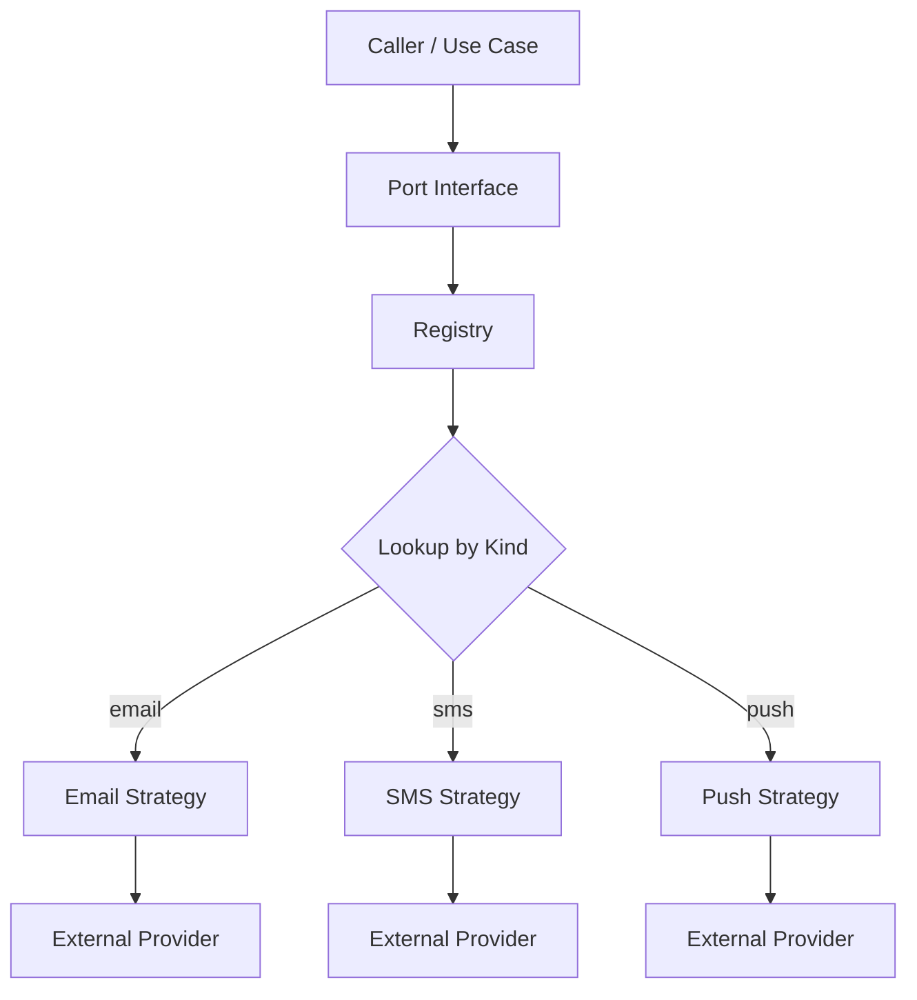
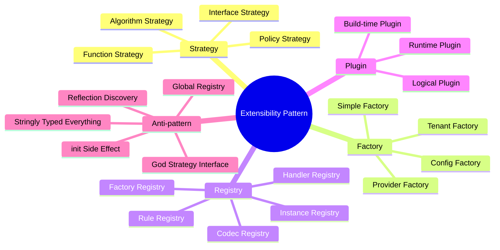
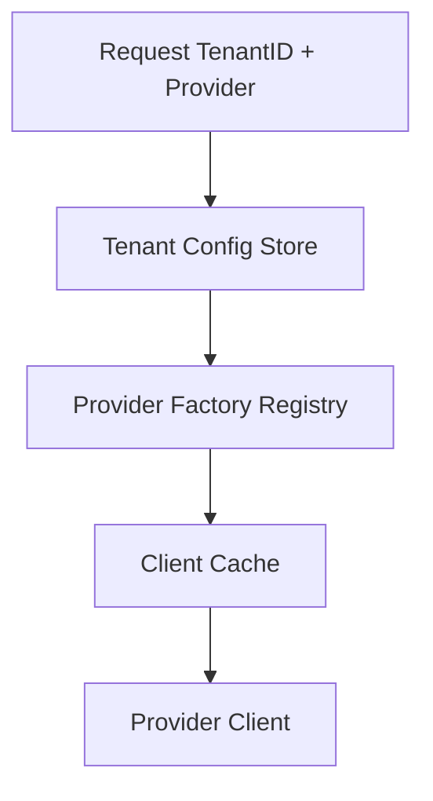
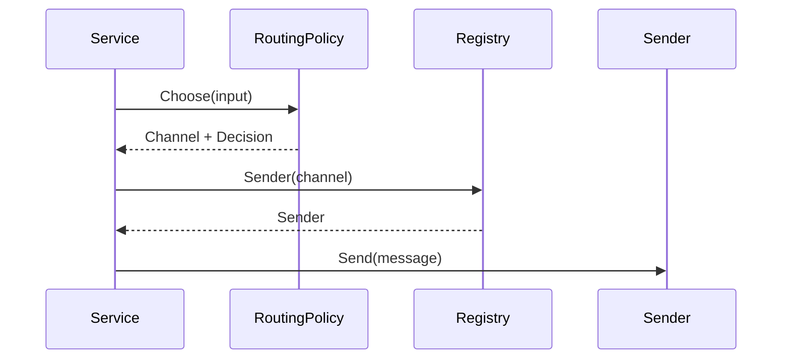
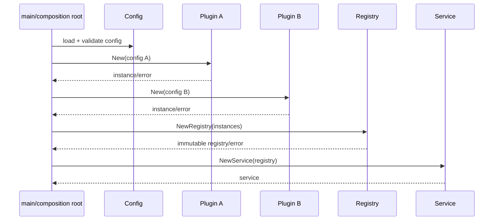
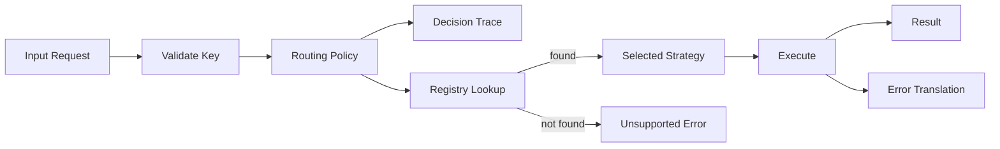

# learn-go-design-patterns-common-patterns-anti-patterns-part-027.md

# Part 027 — Plugin, Registry, and Strategy Pattern

> Seri: **Go Design Patterns, Common Patterns, and Anti-Patterns**  
> Target: Go 1.26.x  
> Pembaca: Java software engineer yang ingin berpikir idiomatis dalam desain Go production-grade  
> Status seri: **belum selesai** — ini adalah part 027 dari 035

---

## 0. Ringkasan Eksekutif

Dalam codebase besar, cepat atau lambat kita akan membutuhkan desain yang bisa diperluas:

- format encoder/decoder bertambah;
- provider external bertambah;
- rule/policy bertambah;
- payment channel bertambah;
- delivery channel bertambah;
- notification renderer bertambah;
- import/export format bertambah;
- workflow action bertambah;
- validation rule bertambah;
- integration adapter bertambah.

Di Java, kebutuhan seperti ini sering diarahkan ke:

- inheritance hierarchy;
- abstract factory;
- Spring bean registry;
- annotation scanning;
- reflection;
- classpath plugin;
- service loader;
- runtime discovery;
- dependency injection container;
- dynamic proxy;
- framework extension point.

Di Go, pendekatan idiomatis biasanya lebih sederhana dan eksplisit:

- **Strategy**: pilih perilaku melalui interface kecil atau function type.
- **Factory**: buat instance berdasarkan key/kind/type.
- **Registry**: simpan mapping dari key ke factory/strategy.
- **Plugin**: pisahkan implementasi yang bisa ditambahkan tanpa mengubah caller utama.
- **Composition Root**: wiring semua implementasi secara eksplisit pada startup.

Pattern ini bukan tentang membuat sistem “fleksibel selamanya”. Pattern ini tentang mengelola variasi yang memang nyata, dengan cara yang:

- mudah dibaca;
- mudah dites;
- aman terhadap startup failure;
- tidak menyembunyikan dependency;
- tidak menciptakan global mutable state yang sulit diprediksi;
- tidak membuat import graph kacau;
- tidak membuat plugin mengeksekusi side effect melalui `init()` tanpa terlihat.

Kalimat inti part ini:

> Di Go, extensibility yang sehat biasanya eksplisit, kecil, typed, dan dimiliki oleh boundary yang membutuhkan variasi tersebut.

---

## 1. Masalah yang Diselesaikan

Tanpa strategy/registry/plugin pattern, codebase sering berubah menjadi kumpulan `switch` besar:

```go
func Send(ctx context.Context, channel string, msg Message) error {
    switch channel {
    case "email":
        return sendEmail(ctx, msg)
    case "sms":
        return sendSMS(ctx, msg)
    case "whatsapp":
        return sendWhatsApp(ctx, msg)
    default:
        return fmt.Errorf("unknown channel: %s", channel)
    }
}
```

Ini tidak selalu salah. Untuk dua variasi sederhana, `switch` mungkin pilihan terbaik.

Namun setelah variasi bertambah, masalah mulai muncul:

1. **Central file churn**  
   Setiap implementasi baru harus mengubah file pusat.

2. **Dependency melebar**  
   Package pusat harus meng-import semua adapter.

3. **Testing makin berat**  
   Unit test fungsi pusat harus tahu semua case.

4. **Deployment risk membesar**  
   Satu perubahan provider dapat memengaruhi provider lain.

5. **Ownership kabur**  
   Tim channel email, SMS, WhatsApp, push notification semua menyentuh file sama.

6. **Configuration sulit divalidasi**  
   App bisa menerima `channel=telegram`, tetapi implementasinya belum diregister.

7. **Extensibility palsu**  
   Terlalu banyak `interface{}`/`any`/reflection membuat sistem terlihat fleksibel, tetapi runtime error meningkat.

Pattern yang benar membantu kita mengubah ini menjadi bentuk yang lebih modular:

```go
type Sender interface {
    Send(ctx context.Context, msg Message) error
}

type Registry struct {
    senders map[Channel]Sender
}

func (r *Registry) Sender(ch Channel) (Sender, bool) {
    s, ok := r.senders[ch]
    return s, ok
}
```

Tetapi registry juga bisa menjadi anti-pattern kalau dibuat global, mutable, implicit, dan penuh side effect.

---

## 2. Mental Model

### 2.1 Strategy

Strategy adalah pattern untuk memilih algoritma/perilaku di runtime atau wiring time.

Dalam Go, strategy biasanya berbentuk:

1. interface kecil;
2. function type;
3. struct konkret dengan method;
4. closure;
5. map dari key ke function/interface.

Contoh function strategy:

```go
type PriceRule func(ctx context.Context, order Order) (Money, error)
```

Contoh interface strategy:

```go
type PriceCalculator interface {
    Calculate(ctx context.Context, order Order) (Money, error)
}
```

Function type cocok ketika perilaku kecil dan stateless. Interface cocok ketika perilaku punya state/dependency/lifecycle.

---

### 2.2 Registry

Registry adalah mapping terkontrol dari identitas ke implementasi.

Contoh:

```go
type CodecRegistry struct {
    codecs map[string]Codec
}
```

Registry menjawab pertanyaan:

> Untuk kind/type/name ini, implementasi mana yang harus dipakai?

Registry bukan tempat business logic utama. Registry hanya tempat lookup dan validasi variasi.

---

### 2.3 Factory

Factory membuat instance.

```go
type Factory func(Config) (Handler, error)
```

Factory berbeda dari strategy:

- strategy melakukan perilaku;
- factory membuat object yang melakukan perilaku.

Registry sering menyimpan factory, bukan instance:

```go
type Registry struct {
    factories map[string]Factory
}
```

Ini berguna ketika setiap tenant/request/job perlu instance berbeda, atau dependency dibuat berdasarkan config.

---

### 2.4 Plugin

Plugin adalah implementasi yang bisa “dicolokkan” ke extension point.

Di Go, kata plugin bisa berarti beberapa hal:

1. **Logical plugin**  
   Implementasi biasa yang diregister secara eksplisit di composition root.

2. **Build-time plugin**  
   Implementasi dipilih lewat build tag, generated code, atau import list.

3. **Runtime plugin package**  
   Menggunakan package `plugin` untuk load shared object `.so`. Ini jarang dipakai untuk service production umum karena portability, lifecycle, versioning, dan deployment complexity.

Dalam seri ini, fokus utama adalah **logical plugin** dan **build-time plugin**, karena inilah yang paling idiomatis dan paling sering masuk akal dalam service Go.

---

## 3. Diagram Mental Model



Registry menjadi decision point untuk memilih implementasi, tetapi caller tetap bergantung pada interface kecil.

---

## 4. Java Mindset vs Go Mindset

### 4.1 Java Mindset

Di Java enterprise codebase, extensibility sering dibangun dengan:

```java
public interface NotificationSender {
    void send(Message message);
}

@Component("email")
public class EmailSender implements NotificationSender { }

@Component("sms")
public class SmsSender implements NotificationSender { }

@Service
public class NotificationService {
    private final Map<String, NotificationSender> senders;

    public NotificationService(Map<String, NotificationSender> senders) {
        this.senders = senders;
    }
}
```

Spring dapat meng-inject semua bean yang implement interface tertentu. Ini convenient, tetapi ada konsekuensi:

- wiring tersembunyi;
- registration terjadi karena annotation/classpath;
- key sering stringly typed;
- startup failure bisa muncul dari magic binding;
- dependency graph tidak selalu jelas dari code lokal;
- test bisa memakai container besar hanya untuk wiring sederhana.

---

### 4.2 Go Mindset

Di Go, bentuk yang lebih umum:

```go
emailSender := email.NewSender(email.Config{ /* ... */ })
smsSender := sms.NewSender(sms.Config{ /* ... */ })

senders := notification.NewRegistry(map[notification.Channel]notification.Sender{
    notification.ChannelEmail: emailSender,
    notification.ChannelSMS:   smsSender,
})

svc := notification.NewService(senders)
```

Kelebihan:

- wiring terlihat;
- dependency terlihat;
- failure startup eksplisit;
- test bisa membuat registry kecil;
- import graph bisa dipahami;
- tidak perlu reflection;
- tidak perlu annotation;
- tidak perlu container.

Trade-off:

- lebih banyak code wiring;
- developer harus disiplin menjaga composition root;
- registry harus divalidasi manual;
- tidak ada magic auto-discovery.

Dalam Go, explicitness sering lebih bernilai daripada convenience.

---

## 5. Taxonomy Pattern



---

## 6. Strategy Pattern in Go

### 6.1 Interface Strategy

Gunakan interface ketika strategy:

- punya dependency;
- punya state;
- butuh lifecycle;
- butuh observability;
- punya beberapa method yang secara semantik satu capability;
- perlu fake dalam test.

Contoh:

```go
type RiskScorer interface {
    Score(ctx context.Context, input RiskInput) (RiskScore, error)
}
```

Implementasi:

```go
type RuleBasedScorer struct {
    rules []Rule
}

func NewRuleBasedScorer(rules []Rule) *RuleBasedScorer {
    return &RuleBasedScorer{rules: append([]Rule(nil), rules...)}
}

func (s *RuleBasedScorer) Score(ctx context.Context, input RiskInput) (RiskScore, error) {
    var total int
    for _, rule := range s.rules {
        score, err := rule.Apply(ctx, input)
        if err != nil {
            return RiskScore{}, err
        }
        total += score
    }
    return RiskScore{Value: total}, nil
}
```

Catatan desain:

- `RiskScorer` kecil.
- Interface dimiliki caller/use case, bukan package provider generic.
- Constructor return concrete type.
- Dependency tidak hidden.

---

### 6.2 Function Strategy

Gunakan function strategy ketika perilaku kecil.

```go
type EligibilityRule func(ctx context.Context, app Application) (Decision, error)
```

Contoh:

```go
func MinimumAgeRule(min int) EligibilityRule {
    return func(ctx context.Context, app Application) (Decision, error) {
        if app.ApplicantAge < min {
            return Decision{
                Allowed: false,
                Reason:  "applicant_below_minimum_age",
            }, nil
        }
        return Decision{Allowed: true}, nil
    }
}
```

Keuntungan:

- sangat ringan;
- mudah dikomposisi;
- tidak perlu struct kecil yang tidak membawa state;
- cocok untuk rule/predicate/transformer.

Risiko:

- function anonim berlebihan bisa sulit dibaca;
- closure bisa menangkap state tanpa terlihat;
- observability bisa tersebar;
- sulit memberi nama behavior jika tidak disiplin.

---

### 6.3 Struct Strategy

Kadang tidak perlu interface sama sekali.

```go
type FixedWindowLimiter struct {
    limit int
    now   func() time.Time
}

func (l *FixedWindowLimiter) Allow(key string) bool {
    // implementation
    return true
}
```

Kalau hanya ada satu implementasi nyata dan tidak ada caller yang butuh polymorphism, concrete struct cukup.

Anti-pattern umum:

```go
type Limiter interface {
    Allow(key string) bool
}

type LimiterImpl struct { }
```

Interface dibuat sebelum ada variasi nyata.

---

## 7. Registry Pattern in Go

### 7.1 Instance Registry

Instance registry menyimpan object siap pakai.

```go
type Channel string

const (
    ChannelEmail Channel = "email"
    ChannelSMS   Channel = "sms"
    ChannelPush  Channel = "push"
)

type Sender interface {
    Send(ctx context.Context, msg Message) error
}

type Registry struct {
    senders map[Channel]Sender
}

func NewRegistry(senders map[Channel]Sender) (*Registry, error) {
    if len(senders) == 0 {
        return nil, errors.New("notification registry requires at least one sender")
    }

    copied := make(map[Channel]Sender, len(senders))
    for ch, sender := range senders {
        if ch == "" {
            return nil, errors.New("notification registry contains empty channel")
        }
        if sender == nil {
            return nil, fmt.Errorf("notification sender for channel %q is nil", ch)
        }
        if _, exists := copied[ch]; exists {
            return nil, fmt.Errorf("duplicate notification sender for channel %q", ch)
        }
        copied[ch] = sender
    }

    return &Registry{senders: copied}, nil
}

func (r *Registry) Sender(ch Channel) (Sender, bool) {
    sender, ok := r.senders[ch]
    return sender, ok
}
```

Important details:

- map di-copy agar caller tidak bisa mutasi setelah constructor;
- nil dicegah;
- empty key dicegah;
- registry immutable setelah construction;
- lookup mengembalikan `(value, bool)`.

---

### 7.2 Factory Registry

Factory registry menyimpan constructor.

```go
type Provider string

type Client interface {
    Call(ctx context.Context, req Request) (Response, error)
}

type ClientFactory func(ctx context.Context, cfg ProviderConfig) (Client, error)

type ClientRegistry struct {
    factories map[Provider]ClientFactory
}

func NewClientRegistry(factories map[Provider]ClientFactory) (*ClientRegistry, error) {
    copied := make(map[Provider]ClientFactory, len(factories))
    for provider, factory := range factories {
        if provider == "" {
            return nil, errors.New("provider must not be empty")
        }
        if factory == nil {
            return nil, fmt.Errorf("factory for provider %q is nil", provider)
        }
        copied[provider] = factory
    }
    return &ClientRegistry{factories: copied}, nil
}

func (r *ClientRegistry) NewClient(ctx context.Context, provider Provider, cfg ProviderConfig) (Client, error) {
    factory, ok := r.factories[provider]
    if !ok {
        return nil, fmt.Errorf("unsupported provider %q", provider)
    }
    return factory(ctx, cfg)
}
```

Gunakan factory registry ketika:

- object dibuat berdasarkan config;
- object mahal dan tidak selalu diperlukan;
- tiap tenant butuh instance berbeda;
- lifecycle berbeda per instance;
- dependency validation dilakukan saat create.

---

### 7.3 Codec Registry

Codec registry adalah contoh umum.

```go
type Codec interface {
    Encode(v any) ([]byte, error)
    Decode(data []byte, v any) error
}

type CodecRegistry struct {
    codecs map[string]Codec
}

func (r *CodecRegistry) Decode(contentType string, data []byte, out any) error {
    codec, ok := r.codecs[contentType]
    if !ok {
        return fmt.Errorf("unsupported content type %q", contentType)
    }
    return codec.Decode(data, out)
}
```

Namun hati-hati dengan `any`. Untuk codec generic, `any` masuk akal karena codec memang bekerja lintas type. Untuk business service, `any` sering tanda desain bocor.

---

## 8. Plugin Pattern in Go

### 8.1 Logical Plugin

Logical plugin adalah implementasi normal yang diregister eksplisit.

Struktur package:

```text
internal/notification/
  service.go
  registry.go
  types.go

internal/notification/email/
  sender.go

internal/notification/sms/
  sender.go

internal/app/
  wire.go
```

`notification` tidak meng-import `email` atau `sms`. Composition root yang menggabungkan semuanya.

```go
func BuildNotificationService(cfg Config) (*notification.Service, error) {
    emailSender, err := email.NewSender(cfg.Email)
    if err != nil {
        return nil, err
    }

    smsSender, err := sms.NewSender(cfg.SMS)
    if err != nil {
        return nil, err
    }

    registry, err := notification.NewRegistry(map[notification.Channel]notification.Sender{
        notification.ChannelEmail: emailSender,
        notification.ChannelSMS:   smsSender,
    })
    if err != nil {
        return nil, err
    }

    return notification.NewService(registry), nil
}
```

Ini sederhana, eksplisit, dan aman.

---

### 8.2 Build-Time Plugin

Build-time plugin digunakan ketika implementasi dipilih pada build/deployment.

Contoh:

- enterprise build vs community build;
- cloud provider A vs B;
- feature spesifik environment;
- platform-specific implementation.

Go mendukung build constraints/build tags.

Contoh konseptual:

```go
//go:build aws

package storage

func NewDefaultStore(cfg Config) (Store, error) {
    return NewS3Store(cfg.S3)
}
```

```go
//go:build gcp

package storage

func NewDefaultStore(cfg Config) (Store, error) {
    return NewGCSStore(cfg.GCS)
}
```

Kelebihan:

- tidak ada runtime branching;
- binary hanya membawa implementasi yang dipilih;
- cocok untuk platform-specific implementation.

Risiko:

- matrix build/test lebih kompleks;
- behavior tergantung build flag;
- developer lokal bisa salah build;
- dokumentasi harus jelas.

---

### 8.3 Runtime Plugin Package

Go memiliki package `plugin` untuk membuka plugin `.so`. Namun untuk service backend umum, ini jarang menjadi pilihan default.

Masalah yang perlu dipertimbangkan:

- portability OS/architecture;
- version compatibility;
- symbol loading error;
- deployment artifact lebih kompleks;
- lifecycle plugin sulit;
- security boundary tidak sama dengan process isolation;
- debugging dan observability lebih sulit;
- plugin tidak mudah unload seperti module biasa;
- interface versioning sangat rapuh.

Untuk kebanyakan sistem production, pilihan yang lebih aman:

1. explicit registry;
2. build-time plugin;
3. separate process plugin melalui RPC;
4. WASM sandbox bila memang perlu isolation;
5. external service adapter.

---

## 9. Registry Ownership

Pertanyaan penting:

> Package mana yang harus memiliki registry?

Jawaban idiomatis:

> Registry dimiliki oleh boundary yang membutuhkan lookup/pemilihan implementasi.

Contoh buruk:

```go
package email

var GlobalRegistry = map[string]Sender{}
```

Kenapa buruk?

- email package menjadi pusat dunia;
- mutasi global sulit dilacak;
- test saling bocor;
- import side effect berbahaya.

Contoh lebih baik:

```go
package notification

type Registry struct {
    senders map[Channel]Sender
}
```

Karena notification service yang butuh memilih sender berdasarkan channel.

---

## 10. Registration Style

### 10.1 Explicit Constructor Registration

Recommended default.

```go
registry, err := notification.NewRegistry(map[notification.Channel]notification.Sender{
    notification.ChannelEmail: emailSender,
    notification.ChannelSMS:   smsSender,
})
```

Kelebihan:

- jelas;
- testable;
- no hidden side effect;
- startup validation mudah;
- dependency graph terlihat.

---

### 10.2 Register Method

Kadang registry perlu dibangun incremental.

```go
type Registry struct {
    senders map[Channel]Sender
}

func NewRegistry() *Registry {
    return &Registry{senders: make(map[Channel]Sender)}
}

func (r *Registry) Register(ch Channel, sender Sender) error {
    if ch == "" {
        return errors.New("channel must not be empty")
    }
    if sender == nil {
        return fmt.Errorf("sender for %q is nil", ch)
    }
    if _, exists := r.senders[ch]; exists {
        return fmt.Errorf("sender for %q already registered", ch)
    }
    r.senders[ch] = sender
    return nil
}
```

Kelemahan:

- mutable;
- perlu aturan kapan registration ditutup;
- risk race jika register setelah serving;
- perlu lock jika concurrent.

Lebih baik jika registry mutable hanya saat startup, lalu dibekukan:

```go
func (r *Registry) Freeze() *FrozenRegistry {
    copied := make(map[Channel]Sender, len(r.senders))
    for k, v := range r.senders {
        copied[k] = v
    }
    return &FrozenRegistry{senders: copied}
}
```

---

### 10.3 Package init Registration

Contoh yang sering muncul:

```go
func init() {
    notification.Register("email", NewSender())
}
```

Ini biasanya anti-pattern.

Masalah:

- dependency tersembunyi oleh blank import;
- registration order implicit;
- failure handling buruk karena `init()` tidak bisa return error;
- testing sulit karena global registry tercemar;
- side effect import tidak terlihat dari call site;
- config belum tersedia saat `init()`.

Kadang pattern ini dipakai di standard library style tertentu, misalnya codec/driver registration. Tetapi untuk application code, default-nya hindari.

---

### 10.4 Blank Import Plugin

Contoh:

```go
import _ "example.com/app/internal/notification/email"
```

Ini membuat side effect package berjalan. Dalam Go, blank import bisa valid untuk driver/codec style, tetapi harus dipakai sangat selektif.

Gunakan hanya jika:

- memang extension mechanism package-level;
- dokumentasi jelas;
- registration tidak butuh runtime config;
- failure tidak perlu error return;
- dipakai di package boundary yang memang bertugas mengaktifkan plugin.

Untuk business app biasa, explicit wiring lebih baik.

---

## 11. Key Type Design

Jangan terlalu cepat memakai raw string.

Buruk:

```go
registry.Get("email")
```

Lebih baik:

```go
type Channel string

const (
    ChannelEmail Channel = "email"
    ChannelSMS   Channel = "sms"
)
```

Lebih baik lagi jika key perlu validasi:

```go
func ParseChannel(s string) (Channel, error) {
    switch Channel(s) {
    case ChannelEmail, ChannelSMS:
        return Channel(s), nil
    default:
        return "", fmt.Errorf("unsupported channel %q", s)
    }
}
```

Key design harus mempertimbangkan:

- external representation;
- API compatibility;
- config value;
- database value;
- audit value;
- metrics label cardinality;
- migration/versioning;
- case sensitivity;
- normalization.

---

## 12. Registry Validation

Registry production harus gagal cepat saat startup jika konfigurasi invalid.

Contoh:

```go
func (r *Registry) ValidateRequired(required []Channel) error {
    var missing []Channel
    for _, ch := range required {
        if _, ok := r.senders[ch]; !ok {
            missing = append(missing, ch)
        }
    }
    if len(missing) > 0 {
        return fmt.Errorf("missing notification senders: %v", missing)
    }
    return nil
}
```

Validasi yang umum:

- no nil implementation;
- no duplicate key;
- all required keys registered;
- unsupported config rejected;
- no disabled-but-referenced provider;
- feature flag konsisten dengan registry;
- plugin version compatible;
- lifecycle dependency tersedia;
- health check provider tersedia.

---

## 13. Immutable Registry

Registry sebaiknya immutable setelah startup.

Mutable registry di runtime bisa masuk akal untuk plugin marketplace atau dynamic tenant config, tetapi jauh lebih sulit:

- perlu lock/atomic snapshot;
- perlu versioning;
- perlu rollback;
- perlu observability;
- perlu consistency model;
- perlu audit perubahan;
- perlu lifecycle cleanup.

Default production service:

```go
func NewRegistry(input map[Channel]Sender) (*Registry, error) {
    copied := make(map[Channel]Sender, len(input))
    for k, v := range input {
        copied[k] = v
    }
    return &Registry{senders: copied}, nil
}
```

Tidak ada `Register` setelah service start.

---

## 14. Dynamic Registry Dengan Atomic Snapshot

Jika memang perlu dynamic reload, hindari map mutable yang dibaca/tulis bebas.

Gunakan copy-on-write snapshot.

```go
type DynamicRegistry struct {
    current atomic.Value // stores map[Channel]Sender
}

func NewDynamicRegistry(initial map[Channel]Sender) *DynamicRegistry {
    r := &DynamicRegistry{}
    r.current.Store(copySenders(initial))
    return r
}

func (r *DynamicRegistry) Sender(ch Channel) (Sender, bool) {
    m := r.current.Load().(map[Channel]Sender)
    s, ok := m[ch]
    return s, ok
}

func (r *DynamicRegistry) Replace(next map[Channel]Sender) {
    r.current.Store(copySenders(next))
}

func copySenders(src map[Channel]Sender) map[Channel]Sender {
    dst := make(map[Channel]Sender, len(src))
    for k, v := range src {
        dst[k] = v
    }
    return dst
}
```

Caveat:

- sender instance harus thread-safe;
- lifecycle cleanup versi lama perlu dipikirkan;
- replacement harus divalidasi sebelum publish;
- metric harus membawa registry version;
- audit perubahan config wajib jika high-risk.

---

## 15. Factory Registry Untuk Multi-Tenant

Contoh problem:

- setiap tenant punya credential provider berbeda;
- setiap tenant bisa memakai notification channel berbeda;
- credential rotate;
- config reload;
- provider client mahal;
- instance perlu cache.

Desain:



Contoh:

```go
type TenantProviderKey struct {
    TenantID string
    Provider Provider
}

type ClientCache struct {
    mu      sync.RWMutex
    clients map[TenantProviderKey]Client
    reg     *ClientRegistry
    configs TenantConfigStore
}

func (c *ClientCache) Client(ctx context.Context, tenantID string, provider Provider) (Client, error) {
    key := TenantProviderKey{TenantID: tenantID, Provider: provider}

    c.mu.RLock()
    client, ok := c.clients[key]
    c.mu.RUnlock()
    if ok {
        return client, nil
    }

    cfg, err := c.configs.ProviderConfig(ctx, tenantID, provider)
    if err != nil {
        return nil, err
    }

    created, err := c.reg.NewClient(ctx, provider, cfg)
    if err != nil {
        return nil, err
    }

    c.mu.Lock()
    defer c.mu.Unlock()

    if existing, ok := c.clients[key]; ok {
        closeIfNeeded(created)
        return existing, nil
    }

    c.clients[key] = created
    return created, nil
}
```

Perhatikan double-check setelah lock write untuk menghindari duplicate create.

Namun desain ini masih perlu diperdalam untuk:

- close stale client;
- TTL;
- credential rotation;
- backpressure;
- max tenant client;
- metrics cardinality;
- memory leak;
- shutdown.

---

## 16. Strategy Selection Policy

Registry hanya memilih berdasarkan key. Tetapi kadang pemilihan strategy butuh policy.

Contoh:

- pilih payment provider berdasarkan country, amount, risk, availability;
- pilih notification channel berdasarkan user preference dan SLA;
- pilih fraud rule set berdasarkan product dan tenant;
- pilih routing adapter berdasarkan feature flag.

Jangan masukkan policy kompleks ke registry lookup.

Buruk:

```go
func (r *Registry) SenderForUser(user User, msg Message, risk RiskScore) Sender {
    // lots of business policy here
}
```

Lebih baik:

```go
type RoutingPolicy interface {
    Choose(ctx context.Context, input RoutingInput) (Channel, Decision, error)
}

type Service struct {
    policy   RoutingPolicy
    registry *Registry
}
```

Flow:



Dengan ini:

- policy bisa diaudit;
- registry tetap sederhana;
- testing lebih bersih;
- decision trace tidak hilang;
- routing logic tidak tersembunyi dalam map lookup.

---

## 17. Rule Registry

Rule registry sering dipakai untuk validation/policy engines.

```go
type RuleID string

type Rule interface {
    ID() RuleID
    Evaluate(ctx context.Context, input Input) (Decision, error)
}

type RuleRegistry struct {
    rules map[RuleID]Rule
}
```

Namun rule registry berbahaya jika rule menjadi terlalu generic.

Anti-pattern:

```go
type Rule interface {
    Evaluate(ctx context.Context, input any) (any, error)
}
```

Ini menghapus type safety.

Lebih baik per domain:

```go
type EligibilityRule interface {
    ID() RuleID
    Evaluate(ctx context.Context, app Application) (Decision, error)
}
```

Kalau butuh banyak domain, buat registry per domain, bukan satu universal rule engine.

---

## 18. Handler Registry

Handler registry sering muncul di command/event/message processing.

```go
type EventType string

type EventHandler interface {
    Handle(ctx context.Context, event EventEnvelope) error
}

type EventRouter struct {
    handlers map[EventType]EventHandler
}

func (r *EventRouter) Handle(ctx context.Context, event EventEnvelope) error {
    handler, ok := r.handlers[event.Type]
    if !ok {
        return fmt.Errorf("unsupported event type %q", event.Type)
    }
    return handler.Handle(ctx, event)
}
```

Problem: `EventEnvelope` generic. Handler harus decode payload.

Better shape:

```go
type EventDecoder[T any] interface {
    Decode(EventEnvelope) (T, error)
}

type TypedHandler[T any] interface {
    Handle(ctx context.Context, event T) error
}
```

Tetapi generic router dapat menjadi terlalu kompleks. Kadang explicit switch per event lebih mudah.

Decision rule:

- jika event type sedikit dan stabil: switch cukup;
- jika event type banyak dan owned oleh tim berbeda: registry masuk akal;
- jika decoding schema kompleks: pisahkan decoder registry dan handler registry;
- jika handler harus idempotent: router jangan menyembunyikan idempotency boundary.

---

## 19. Decorator + Registry

Registry dapat menyimpan implementation yang sudah didekorasi.

```go
emailSender := email.NewSender(cfg.Email)
emailSender = notification.WithMetrics(emailSender, metrics)
emailSender = notification.WithRetry(emailSender, retryPolicy)
emailSender = notification.WithLogging(emailSender, logger)
```

Namun ordering penting:

```text
logging(retry(metrics(sender)))
```

berbeda dengan:

```text
retry(logging(metrics(sender)))
```

Guideline:

1. timeout/deadline biasanya outer boundary atau context dari caller;
2. tracing/logging sering outer untuk capture semua attempt;
3. retry harus jelas apakah metrics per attempt atau per operation;
4. auth credential injection sebelum transport call;
5. circuit breaker scope harus per provider/operation;
6. rate limit biasanya sebelum expensive work;
7. error translation biasanya dekat adapter boundary.

---

## 20. Registry and Observability

Registry harus membantu observability, bukan mengaburkan.

Minimal fields/log attributes:

- strategy kind;
- provider;
- plugin version;
- operation;
- tenant jika aman dan cardinality terkendali;
- success/failure;
- error class;
- retryable;
- latency;
- registry version jika dynamic.

Contoh:

```go
logger.InfoContext(ctx, "notification sender selected",
    slog.String("channel", string(ch)),
    slog.String("message_id", msg.ID),
)
```

Hati-hati:

- jangan log secret/config sensitive;
- jangan jadikan user ID sebagai metric label high-cardinality;
- jangan log payload penuh;
- jangan menyembunyikan error provider.

---

## 21. Registry and Security

Registry adalah control point. Salah memilih plugin bisa jadi security issue.

Pertimbangan:

1. **Allowlist**  
   Hanya key yang diketahui yang boleh diregister/dipakai.

2. **Config validation**  
   Config tidak boleh menunjuk provider yang tidak aktif.

3. **Credential scope**  
   Plugin hanya menerima credential yang dibutuhkan.

4. **Data classification**  
   Tidak semua plugin boleh menerima PII/sensitive data.

5. **Audit**  
   Untuk workflow penting, catat strategy yang dipakai.

6. **Tenant isolation**  
   Tenant A tidak boleh memakai provider credential tenant B.

7. **Safe fallback**  
   Fallback tidak boleh menurunkan security posture tanpa explicit decision.

Contoh audit:

```go
type DispatchAudit struct {
    MessageID string
    Channel   Channel
    Provider  Provider
    Decision  string
    ActorID   string
    Time      time.Time
}
```

---

## 22. Registry and Testing

### 22.1 Unit Test Registry

Test constructor validation:

```go
func TestNewRegistryRejectsNilSender(t *testing.T) {
    _, err := NewRegistry(map[Channel]Sender{
        ChannelEmail: nil,
    })
    if err == nil {
        t.Fatal("expected error")
    }
}
```

Test lookup:

```go
func TestRegistrySender(t *testing.T) {
    sender := fakeSender{}
    reg, err := NewRegistry(map[Channel]Sender{
        ChannelEmail: sender,
    })
    if err != nil {
        t.Fatal(err)
    }

    got, ok := reg.Sender(ChannelEmail)
    if !ok {
        t.Fatal("expected sender")
    }
    if got == nil {
        t.Fatal("sender is nil")
    }
}
```

---

### 22.2 Unit Test Strategy

Test strategy independently, not through registry when possible.

```go
func TestMinimumAgeRuleRejectsUnderageApplicant(t *testing.T) {
    rule := MinimumAgeRule(18)

    decision, err := rule(context.Background(), Application{ApplicantAge: 17})
    if err != nil {
        t.Fatal(err)
    }
    if decision.Allowed {
        t.Fatal("expected rejection")
    }
}
```

---

### 22.3 Integration Test Wiring

Test composition root once.

```go
func TestBuildNotificationService(t *testing.T) {
    cfg := testConfig()
    svc, err := BuildNotificationService(cfg)
    if err != nil {
        t.Fatal(err)
    }
    if svc == nil {
        t.Fatal("service is nil")
    }
}
```

Tujuan wiring test:

- required dependency tersedia;
- registry lengkap;
- config valid;
- no nil implementation;
- startup failure kelihatan.

---

### 22.4 Contract Test Plugin

Setiap plugin harus memenuhi contract sama.

```go
func SenderContract(t *testing.T, newSender func(t *testing.T) Sender) {
    t.Helper()

    t.Run("send valid message", func(t *testing.T) {
        sender := newSender(t)
        err := sender.Send(context.Background(), Message{ID: "m1", Body: "hello"})
        if err != nil {
            t.Fatal(err)
        }
    })
}
```

Lalu tiap implementation menjalankan contract test:

```go
func TestEmailSenderContract(t *testing.T) {
    SenderContract(t, func(t *testing.T) notification.Sender {
        return NewFakeEmailSender()
    })
}
```

---

## 23. Performance Implication

Registry lookup map biasanya murah. Performance risk justru datang dari:

- reflection discovery;
- excessive allocation pada factory;
- per-request client creation;
- missing cache untuk expensive provider client;
- lock contention pada mutable registry;
- dynamic reload dengan coarse lock;
- high-cardinality metrics per plugin;
- decorator stack terlalu tebal;
- generic `any` decode/encode berlebihan;
- strategy selection policy yang melakukan I/O.

Guideline:

1. registry immutable: no lock on read;
2. map lookup cukup untuk kebanyakan use case;
3. heavy client dibuat saat startup atau cached;
4. dynamic registry pakai atomic snapshot;
5. strategy selection jangan melakukan I/O kecuali memang explicit;
6. benchmark hanya jika path high-throughput.

---

## 24. Error Handling Pattern

Error registry/strategy harus jelas dibedakan:

1. unsupported key;
2. missing registration;
3. invalid config;
4. plugin initialization failure;
5. plugin runtime failure;
6. plugin contract violation;
7. dependency unavailable;
8. retryable provider failure;
9. non-retryable business rejection.

Contoh typed error:

```go
type UnsupportedChannelError struct {
    Channel Channel
}

func (e UnsupportedChannelError) Error() string {
    return fmt.Sprintf("unsupported notification channel %q", e.Channel)
}
```

Transport mapping:

- unsupported channel from user input → 400;
- missing internal registration → 500/startup failure;
- provider timeout → 502/504 depending boundary;
- policy rejection → domain result, not error;
- disabled feature → 403/409/422 depending semantics.

---

## 25. Versioning Plugin Contract

Jika plugin contract berubah, semua implementation terdampak.

Contoh interface awal:

```go
type Sender interface {
    Send(ctx context.Context, msg Message) error
}
```

Kemudian ingin menambah method:

```go
type Sender interface {
    Send(ctx context.Context, msg Message) error
    Health(ctx context.Context) error
}
```

Ini breaking change untuk semua implementation.

Alternatif:

1. Buat interface tambahan:

```go
type HealthChecker interface {
    Health(ctx context.Context) error
}
```

2. Cek optional capability:

```go
if hc, ok := sender.(HealthChecker); ok {
    return hc.Health(ctx)
}
```

3. Atau registry menyimpan metadata:

```go
type Registration struct {
    Sender Sender
    Health HealthChecker
}
```

Pattern ini disebut capability extension.

---

## 26. Capability Interface Pattern

Capability interface kecil memungkinkan evolusi.

```go
type Sender interface {
    Send(ctx context.Context, msg Message) error
}

type BatchSender interface {
    SendBatch(ctx context.Context, msgs []Message) error
}

type TemplateSender interface {
    SendTemplate(ctx context.Context, msg TemplateMessage) error
}
```

Service dapat memilih capability:

```go
func SendMany(ctx context.Context, sender Sender, msgs []Message) error {
    if batch, ok := sender.(BatchSender); ok {
        return batch.SendBatch(ctx, msgs)
    }

    for _, msg := range msgs {
        if err := sender.Send(ctx, msg); err != nil {
            return err
        }
    }
    return nil
}
```

Hati-hati: optional capability jangan menjadi logic tersembunyi yang mengubah semantic besar tanpa audit.

---

## 27. Anti-Pattern Catalog

### 27.1 Global Mutable Registry

```go
var registry = map[string]Handler{}

func Register(name string, h Handler) {
    registry[name] = h
}
```

Masalah:

- race risk;
- test pollution;
- unclear ownership;
- no startup validation;
- hidden dependency;
- mutation after serving.

Refactor:

- jadikan `Registry` struct;
- pass sebagai dependency;
- immutable after construction;
- validate on startup.

---

### 27.2 `init()` Side Effect Registration

```go
func init() {
    Register("foo", NewFoo())
}
```

Masalah:

- no error return;
- order implicit;
- config unavailable;
- blank import magic;
- sulit dites.

Refactor:

- explicit registration di composition root.

---

### 27.3 Stringly Typed Everything

```go
handler := registry.Get(req.Type)
```

tanpa parse/validate.

Masalah:

- typo runtime;
- no central allowed values;
- bad API error;
- metrics cardinality tidak terkendali.

Refactor:

- typed constants;
- parse function;
- validation boundary.

---

### 27.4 God Strategy Interface

```go
type Provider interface {
    SendEmail(...)
    SendSMS(...)
    Validate(...)
    Render(...)
    Health(...)
    Metrics(...)
    Close(...)
}
```

Masalah:

- implementation dipaksa method tidak relevan;
- fake sulit;
- contract terlalu luas;
- evolusi breaking.

Refactor:

- pecah capability interface;
- consumer-owned interface;
- composition over mega-interface.

---

### 27.5 Reflection-Based Discovery

```go
// scan package, find types by naming convention, instantiate dynamically
```

Masalah:

- fragile;
- slow startup;
- no compile-time safety;
- hard to debug;
- unnecessary in Go for most apps.

Refactor:

- explicit map registration;
- generated code jika jumlah plugin besar;
- build-time list.

---

### 27.6 Universal Plugin Engine

```go
type Plugin interface {
    Execute(ctx context.Context, input map[string]any) (map[string]any, error)
}
```

Masalah:

- type safety hilang;
- domain semantics hilang;
- error taxonomy kabur;
- validation runtime semua;
- documentation buruk.

Refactor:

- plugin interface per domain;
- typed command/result;
- explicit payload schema.

---

### 27.7 Registry With Business Policy

Registry melakukan lookup + decision + validation + mutation.

Masalah:

- registry menjadi god object;
- policy tidak bisa diaudit;
- testing sulit;
- responsibility kacau.

Refactor:

- pisahkan routing policy;
- registry hanya lookup.

---

### 27.8 Per-Request Factory Without Cache

```go
client, _ := registry.NewClient(ctx, provider, cfg)
return client.Call(ctx, req)
```

Jika client mahal, ini buruk.

Masalah:

- connection churn;
- TLS handshake berulang;
- latency tinggi;
- resource leak;
- provider overload.

Refactor:

- startup client;
- client cache;
- lifecycle owner;
- close on shutdown.

---

### 27.9 Over-Pluginization

Semua hal dijadikan plugin padahal variasi belum nyata.

Masalah:

- cognitive load;
- debugging sulit;
- architecture terlalu abstrak;
- test matrix meledak;
- feature sederhana jadi lambat.

Refactor:

- mulai dari switch/concrete implementation;
- extract strategy ketika variasi nyata;
- keep extension point narrow.

---

## 28. Refactoring Playbook

### Stage 1 — Identify Variation Axis

Tanya:

- apa yang bervariasi?
- berdasarkan apa dipilih?
- variasi bertambah seberapa sering?
- siapa owner tiap variasi?
- apakah variasi runtime atau startup?
- apakah variasi butuh config berbeda?
- apakah variasi butuh credential/lifecycle?

---

### Stage 2 — Extract Consumer-Owned Interface

Dari:

```go
func Process(ctx context.Context, provider string, input Input) error {
    switch provider {
    case "a":
        return callA(ctx, input)
    case "b":
        return callB(ctx, input)
    }
    return errors.New("unsupported provider")
}
```

Menjadi:

```go
type ProviderClient interface {
    Call(ctx context.Context, input Input) (Output, error)
}
```

---

### Stage 3 — Create Typed Key

```go
type Provider string

const (
    ProviderA Provider = "a"
    ProviderB Provider = "b"
)
```

---

### Stage 4 — Build Immutable Registry

```go
type Registry struct {
    providers map[Provider]ProviderClient
}
```

---

### Stage 5 — Move Wiring to Composition Root

```go
registry, err := NewRegistry(map[Provider]ProviderClient{
    ProviderA: aClient,
    ProviderB: bClient,
})
```

---

### Stage 6 — Add Startup Validation

Validate config references all exist.

---

### Stage 7 — Add Observability

Log selected provider. Add metrics by low-cardinality provider key.

---

### Stage 8 — Add Contract Tests

Each provider implementation must pass same contract.

---

### Stage 9 — Remove Old Switch

Keep switch only if it is now redundant and less expressive.

---

## 29. Production Example: Document Renderer Registry

### 29.1 Problem

System harus render dokumen dalam beberapa format:

- PDF;
- HTML;
- plain text;
- email template;
- regulatory notice.

Setiap renderer punya dependency berbeda.

---

### 29.2 Domain Types

```go
type DocumentKind string

const (
    DocumentKindNotice DocumentKind = "notice"
    DocumentKindInvoice DocumentKind = "invoice"
)

type Format string

const (
    FormatPDF  Format = "pdf"
    FormatHTML Format = "html"
    FormatText Format = "text"
)

type RenderRequest struct {
    Kind   DocumentKind
    Format Format
    Data   DocumentData
}

type RenderedDocument struct {
    ContentType string
    Body        []byte
}
```

---

### 29.3 Renderer Interface

```go
type Renderer interface {
    Render(ctx context.Context, req RenderRequest) (RenderedDocument, error)
}
```

---

### 29.4 Registry Key

```go
type RendererKey struct {
    Kind   DocumentKind
    Format Format
}
```

---

### 29.5 Registry

```go
type RendererRegistry struct {
    renderers map[RendererKey]Renderer
}

func NewRendererRegistry(renderers map[RendererKey]Renderer) (*RendererRegistry, error) {
    if len(renderers) == 0 {
        return nil, errors.New("renderer registry requires at least one renderer")
    }

    copied := make(map[RendererKey]Renderer, len(renderers))
    for key, renderer := range renderers {
        if key.Kind == "" {
            return nil, errors.New("renderer key kind must not be empty")
        }
        if key.Format == "" {
            return nil, errors.New("renderer key format must not be empty")
        }
        if renderer == nil {
            return nil, fmt.Errorf("renderer for key %+v is nil", key)
        }
        copied[key] = renderer
    }

    return &RendererRegistry{renderers: copied}, nil
}

func (r *RendererRegistry) Renderer(key RendererKey) (Renderer, bool) {
    renderer, ok := r.renderers[key]
    return renderer, ok
}
```

---

### 29.6 Service

```go
type RenderService struct {
    registry *RendererRegistry
    logger   *slog.Logger
}

func NewRenderService(registry *RendererRegistry, logger *slog.Logger) *RenderService {
    if logger == nil {
        logger = slog.Default()
    }
    return &RenderService{registry: registry, logger: logger}
}

func (s *RenderService) Render(ctx context.Context, req RenderRequest) (RenderedDocument, error) {
    key := RendererKey{Kind: req.Kind, Format: req.Format}

    renderer, ok := s.registry.Renderer(key)
    if !ok {
        return RenderedDocument{}, UnsupportedRendererError{Key: key}
    }

    s.logger.InfoContext(ctx, "renderer selected",
        slog.String("document_kind", string(req.Kind)),
        slog.String("format", string(req.Format)),
    )

    doc, err := renderer.Render(ctx, req)
    if err != nil {
        return RenderedDocument{}, fmt.Errorf("render %s/%s: %w", req.Kind, req.Format, err)
    }

    return doc, nil
}
```

---

### 29.7 Error

```go
type UnsupportedRendererError struct {
    Key RendererKey
}

func (e UnsupportedRendererError) Error() string {
    return fmt.Sprintf("unsupported renderer for kind %q and format %q", e.Key.Kind, e.Key.Format)
}
```

---

### 29.8 Wiring

```go
func BuildRenderService(cfg Config, logger *slog.Logger) (*RenderService, error) {
    noticePDF, err := noticepdf.NewRenderer(cfg.NoticePDF)
    if err != nil {
        return nil, err
    }

    noticeHTML, err := noticehtml.NewRenderer(cfg.NoticeHTML)
    if err != nil {
        return nil, err
    }

    registry, err := NewRendererRegistry(map[RendererKey]Renderer{
        {Kind: DocumentKindNotice, Format: FormatPDF}:  noticePDF,
        {Kind: DocumentKindNotice, Format: FormatHTML}: noticeHTML,
    })
    if err != nil {
        return nil, err
    }

    return NewRenderService(registry, logger), nil
}
```

---

## 30. Mermaid: Registry Lifecycle



---

## 31. Mermaid: Runtime Strategy Selection



---

## 32. Review Checklist

Gunakan checklist ini saat code review.

### Variation

- [ ] Apakah variasi nyata, bukan spekulatif?
- [ ] Axis variasi jelas?
- [ ] Key pemilihan jelas?
- [ ] Owner tiap implementation jelas?

### Interface

- [ ] Interface kecil?
- [ ] Interface dimiliki consumer?
- [ ] Constructor return concrete type?
- [ ] Tidak ada god interface?
- [ ] Optional capability dipisah?

### Registry

- [ ] Registry immutable setelah startup?
- [ ] Map di-copy?
- [ ] Nil dicegah?
- [ ] Duplicate dicegah?
- [ ] Required implementation divalidasi?
- [ ] Unsupported key memiliki error jelas?

### Wiring

- [ ] Registration eksplisit di composition root?
- [ ] Tidak ada hidden `init()` side effect?
- [ ] Tidak ada global mutable registry?
- [ ] Dependency graph bisa dibaca?
- [ ] Startup failure jelas?

### Runtime

- [ ] Strategy selection tidak melakukan hidden I/O?
- [ ] Error strategy diklasifikasi?
- [ ] Observability mencatat selected strategy?
- [ ] Metrics label low-cardinality?
- [ ] Sensitive config tidak bocor?

### Testing

- [ ] Registry constructor ditest?
- [ ] Strategy ditest independent?
- [ ] Wiring ditest?
- [ ] Contract test ada untuk plugin sejenis?
- [ ] Tidak ada test pollution dari global registry?

### Evolution

- [ ] Contract versioning dipikirkan?
- [ ] Interface addition tidak breaking tanpa rencana?
- [ ] Dynamic reload jika ada punya consistency model?
- [ ] Plugin lifecycle jelas?

---

## 33. Exercises

### Exercise 1 — Replace Switch With Registry

Ambil fungsi yang memakai `switch type` untuk memilih handler. Refactor menjadi:

- typed key;
- small interface;
- immutable registry;
- explicit wiring;
- unsupported key error.

Bandingkan import graph sebelum/sesudah.

---

### Exercise 2 — Contract Test

Buat contract test untuk tiga implementation strategy yang berbeda.

Pertanyaan:

- apa behavior minimal yang harus sama?
- apa behavior yang boleh beda?
- apakah error semantics konsisten?
- apakah context cancellation dihormati?

---

### Exercise 3 — Remove Global Registry

Jika punya package global registry, refactor ke dependency-injected registry.

Langkah:

1. buat `Registry` struct;
2. pindahkan `Register` ke constructor/wiring;
3. pass registry ke service;
4. hapus blank import;
5. isolasi test.

---

### Exercise 4 — Capability Interface

Ambil interface besar. Pecah menjadi beberapa capability interface.

Contoh:

- `Sender`;
- `BatchSender`;
- `HealthChecker`;
- `Closer`.

Lalu tentukan caller mana yang benar-benar membutuhkan capability tersebut.

---

### Exercise 5 — Plugin Security Review

Untuk setiap plugin/strategy, dokumentasikan:

- data yang diterima;
- credential yang digunakan;
- external call yang dilakukan;
- timeout;
- retry policy;
- audit field;
- failure class;
- sensitive data handling.

---

## 34. Common Interview/Design Discussion Questions

### Q1. Kapan memakai switch dan kapan memakai registry?

Gunakan switch jika variasi sedikit, stabil, dan satu owner. Gunakan registry jika variasi banyak, bertambah, dimiliki bagian berbeda, atau dependency setiap variasi membuat package pusat terlalu berat.

---

### Q2. Apakah registry berarti global map?

Tidak. Registry yang sehat biasanya struct dependency yang dibuat di composition root, divalidasi, lalu dipass ke service. Global map mutable adalah anti-pattern untuk application code.

---

### Q3. Apakah `init()` registration selalu salah?

Tidak selalu. Untuk driver/codec extension style tertentu bisa valid. Namun untuk business application, default-nya hindari karena failure handling, hidden dependency, dan test pollution.

---

### Q4. Apakah Go cocok untuk plugin architecture?

Cocok jika plugin dimaknai sebagai explicit implementation of extension point. Untuk dynamic runtime loading `.so`, Go mendukung package `plugin`, tetapi itu bukan default terbaik untuk kebanyakan service production.

---

### Q5. Kenapa tidak pakai reflection auto-discovery?

Karena Go memberi compile-time safety, simple maps, interface kecil, dan explicit wiring. Reflection auto-discovery sering menambah complexity tanpa manfaat sepadan.

---

## 35. Ringkasan

Plugin, registry, dan strategy pattern dalam Go harus dirancang dengan prinsip berikut:

1. Strategy memilih perilaku.
2. Factory membuat instance.
3. Registry melakukan lookup implementasi.
4. Plugin adalah implementasi extension point.
5. Interface harus kecil dan dimiliki caller.
6. Registry sebaiknya immutable setelah startup.
7. Registration sebaiknya eksplisit di composition root.
8. Hindari global mutable registry.
9. Hindari `init()` side effect untuk business app.
10. Gunakan typed key, bukan raw string sembarangan.
11. Pisahkan routing policy dari registry lookup.
12. Tambahkan startup validation.
13. Tambahkan observability untuk selected strategy.
14. Pertimbangkan security dan data classification per plugin.
15. Gunakan contract test untuk implementasi sejenis.
16. Jangan membuat universal plugin engine berbasis `any` kecuali benar-benar perlu.
17. Mulai sederhana; extract registry setelah variasi nyata.

Pattern ini sangat kuat untuk service Go besar, tetapi hanya jika dipakai dengan disiplin. Extensibility yang terlalu awal menciptakan architecture theater. Extensibility yang terlalu terlambat menciptakan switch monster dan import graph berantakan. Tujuannya adalah menemukan titik tengah: explicit, typed, observable, testable, dan evolvable.

---

## 36. Koneksi ke Part Berikutnya

Part berikutnya adalah:

**Part 028 — Decorator Pattern in Go**

Kita akan membahas bagaimana menambahkan behavior lintas-cutting seperti logging, metrics, tracing, retry, timeout, circuit breaker, cache, authorization, dan audit tanpa mengotori core implementation.

Decorator sering dipakai bersama registry/strategy:

- registry menyimpan strategy;
- decorator membungkus strategy;
- composition root menentukan urutan wrapper;
- service tetap melihat interface yang sama.

---

## Status Seri

**Belum selesai.**  
Ini adalah **Part 027 dari 035**.

<!-- NAVIGATION_FOOTER -->
<div class="page-nav">
<a href="./learn-go-design-patterns-common-patterns-anti-patterns-part-026.md">⬅️ Part 026 — Cache Pattern</a>
<a href="./index.md">📚 Kategori</a>
<a href="../../index.md">🏠 Home</a>
<a href="./learn-go-design-patterns-common-patterns-anti-patterns-part-028.md">Part 028 — Decorator Pattern in Go ➡️</a>
</div>
