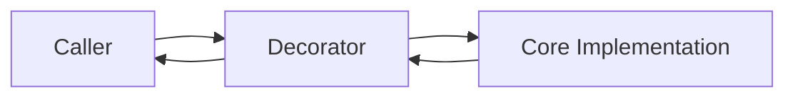
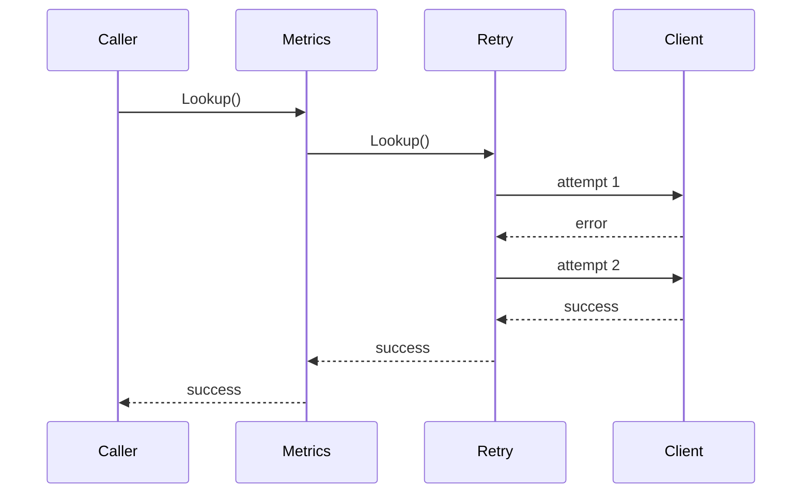
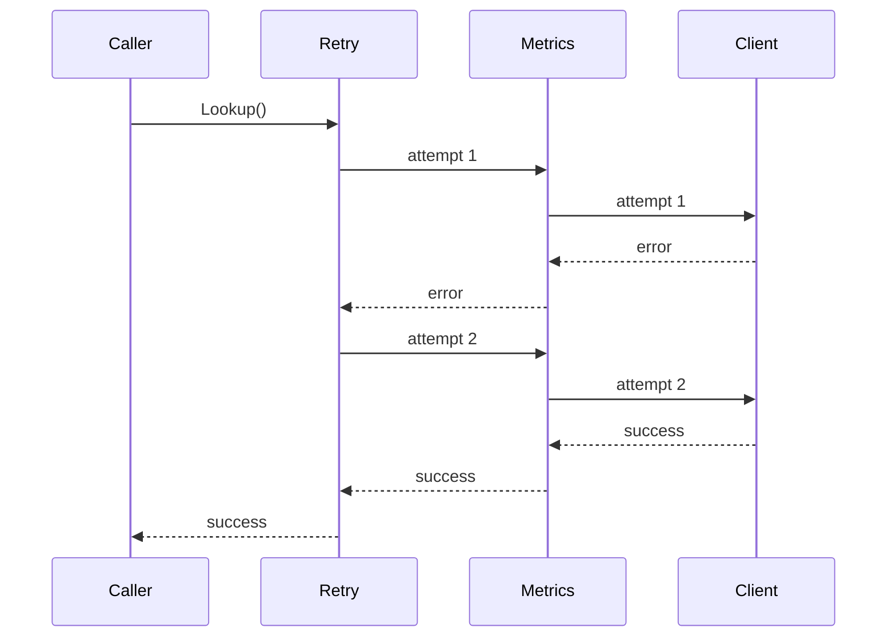
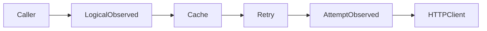
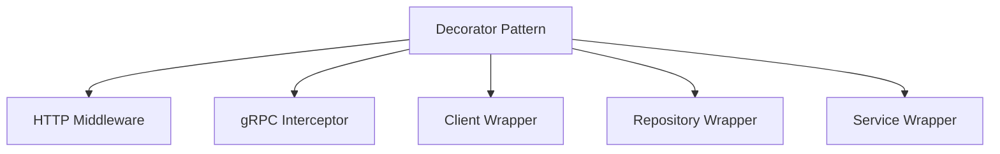
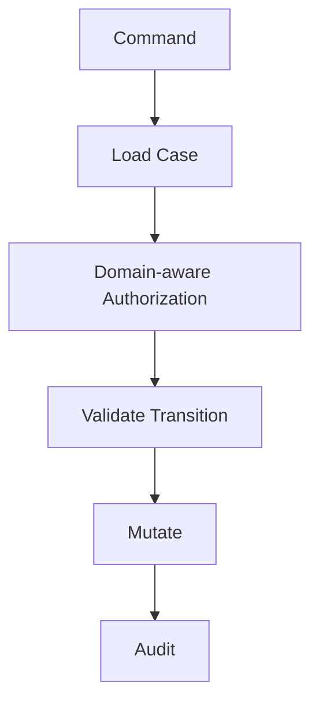
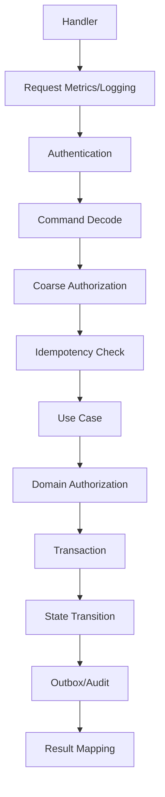
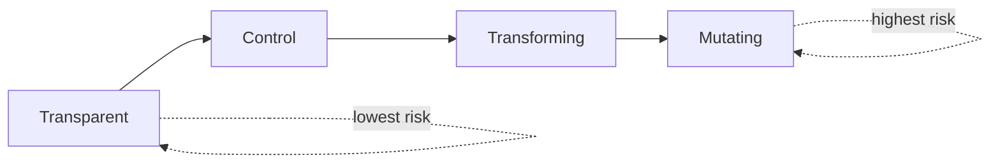
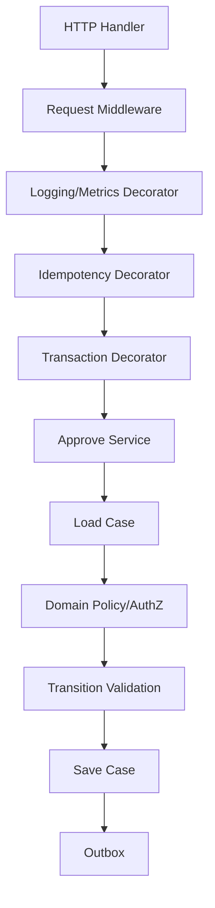
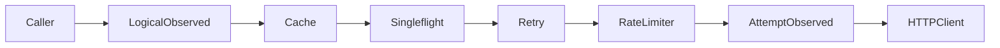

# learn-go-design-patterns-common-patterns-anti-patterns-part-028.md

# Part 028 — Decorator Pattern in Go

## Status Seri

- Seri: **Go Design Patterns, Common Patterns, and Anti-Patterns**
- Part: **028 dari 035**
- Status seri: **belum selesai**
- Lanjutan dari:
  - Part 027 — Plugin, Registry, and Strategy Pattern
- Setelah ini:
  - Part 029 — Template Method, Hook, and Callback Pattern Without Inheritance

---

## Tujuan Part Ini

Di part ini kita membahas **Decorator Pattern** dalam Go.

Decorator adalah pola desain untuk menambahkan behavior pada dependency atau function tanpa mengubah implementasi core-nya. Dalam Go, decorator sering muncul sebagai:

- wrapper interface
- wrapper function
- middleware
- interceptor
- client wrapper
- repository wrapper
- service wrapper
- handler wrapper
- cache layer
- retry layer
- logging layer
- metrics layer
- tracing layer
- authorization layer
- rate limiting layer
- transaction wrapper
- idempotency wrapper

Namun decorator juga sangat mudah berubah menjadi design smell jika:

- terlalu banyak layer wrapping
- ordering tidak jelas
- semantic contract berubah diam-diam
- side effect tersembunyi
- observability terduplikasi
- error diubah tanpa aturan
- context dipakai sebagai dependency bag
- decorator menjadi tempat business logic utama

Target part ini adalah membuat kamu mampu membedakan:

- decorator yang memperjelas cross-cutting concern
- decorator yang menyembunyikan kompleksitas berbahaya
- decorator yang menjaga contract
- decorator yang merusak contract
- decorator yang cocok di boundary infra
- decorator yang tidak cocok untuk domain decision

---

## 1. Mental Model: Decorator Adalah Contract-Preserving Wrapper

Decorator yang baik harus menjaga contract dari dependency yang dibungkus.



Secara konseptual:

```go
type Reader interface {
    Read(ctx context.Context, key string) ([]byte, error)
}

type loggingReader struct {
    next Reader
}

func (r *loggingReader) Read(ctx context.Context, key string) ([]byte, error) {
    start := time.Now()
    value, err := r.next.Read(ctx, key)
    logRead(ctx, key, time.Since(start), err)
    return value, err
}
```

Decorator di atas:

- tidak mengubah arti `Read`
- tidak mengubah input secara tidak terduga
- tidak mengubah output secara tidak terduga
- menambah behavior observability
- tetap memanggil `next`
- tetap mengembalikan result/error sesuai contract

Decorator bukan inheritance.

Decorator bukan subclass.

Decorator bukan AOP magic.

Decorator di Go biasanya hanyalah struct atau function yang memegang `next`.

---

## 2. Java Mindset vs Go Mindset

### Java Mindset

Di Java, decorator sering terlihat seperti:

```java
interface PaymentClient {
    PaymentResult charge(PaymentRequest request);
}

class LoggingPaymentClient implements PaymentClient {
    private final PaymentClient next;
}
```

Atau melalui:

- Spring proxy
- annotation
- aspect
- interceptor
- dynamic proxy
- BeanPostProcessor
- transaction annotation
- caching annotation
- retry annotation

Contoh umum:

```java
@Retryable
@Cacheable
@Transactional
@Timed
public PaymentResult charge(PaymentRequest request) {
    ...
}
```

Masalahnya: behavior final sering tidak terlihat dari kode fungsi itu sendiri.

### Go Mindset

Di Go, decorator lebih sering dibuat secara eksplisit:

```go
client := NewPaymentClient(httpClient, cfg)

client = payment.WithMetrics(client, meter)
client = payment.WithTracing(client, tracer)
client = payment.WithRetry(client, retryPolicy)
client = payment.WithLogging(client, logger)
```

Atau:

```go
handler := http.HandlerFunc(handleApprove)

handler = middleware.Recover(logger)(handler)
handler = middleware.RequestID()(handler)
handler = middleware.Auth(authenticator)(handler)
handler = middleware.Timeout(2 * time.Second)(handler)
handler = middleware.AccessLog(logger)(handler)
```

Perbedaan penting:

| Aspek | Java/Spring Style | Go Style |
|---|---|---|
| Composition | annotation/proxy/container | explicit wrapping |
| Visibility | sering implicit | terlihat di wiring |
| Ordering | framework-defined/order annotation | urutan wrapping terlihat |
| Runtime behavior | bisa tersembunyi | lebih local-reasonable |
| Testability | sering perlu framework test | bisa test decorator langsung |
| Failure mode | proxy surprise | ordering/config surprise |

Go tidak melarang framework. Namun secara idiom, behavior cross-cutting lebih sehat jika wiring-nya eksplisit.

---

## 3. Apa yang Diselesaikan oleh Decorator?

Decorator menyelesaikan masalah ketika kamu ingin:

1. Menambahkan concern lintas fungsi tanpa mengubah core implementation.
2. Menjaga dependency tetap kecil.
3. Memisahkan logic domain dari logic operational.
4. Membuat concern bisa dikombinasikan.
5. Membuat behavior bisa dites terpisah.
6. Mengurangi duplikasi logging/metrics/retry/cache di setiap method.
7. Membuat boundary infra dapat diperkaya tanpa mengotori application logic.

Contoh concern yang cocok:

- logging
- metrics
- tracing
- retry
- timeout
- rate limit
- circuit breaker
- cache
- idempotency
- authorization
- audit
- redaction
- validation ringan di boundary
- transaction wrapping
- panic recovery
- request correlation

Concern yang sering **tidak cocok** menjadi decorator:

- core business decision
- state transition utama
- domain invariant utama
- persistence mutation yang mengubah contract
- policy engine kompleks
- workflow orchestration utama
- security rule yang harus eksplisit di use case
- cross-aggregate side effect yang mengubah meaning

Decorator cocok untuk behavior tambahan yang menjaga contract, bukan untuk menyembunyikan inti sistem.

---

## 4. Bentuk Decorator di Go

Decorator di Go biasanya muncul dalam beberapa bentuk.

---

### 4.1 Interface Decorator

Pola paling umum.

```go
type UserRepository interface {
    FindByID(ctx context.Context, id UserID) (User, error)
    Save(ctx context.Context, user User) error
}

type observedUserRepository struct {
    next   UserRepository
    logger *slog.Logger
}

func NewObservedUserRepository(next UserRepository, logger *slog.Logger) UserRepository {
    if next == nil {
        panic("next repository is nil")
    }
    if logger == nil {
        logger = slog.Default()
    }
    return &observedUserRepository{
        next:   next,
        logger: logger,
    }
}

func (r *observedUserRepository) FindByID(ctx context.Context, id UserID) (User, error) {
    start := time.Now()

    user, err := r.next.FindByID(ctx, id)

    r.logger.InfoContext(ctx, "user repository find by id",
        slog.String("user_id", id.String()),
        slog.Duration("duration", time.Since(start)),
        slog.Bool("success", err == nil),
    )

    return user, err
}

func (r *observedUserRepository) Save(ctx context.Context, user User) error {
    start := time.Now()

    err := r.next.Save(ctx, user)

    r.logger.InfoContext(ctx, "user repository save",
        slog.String("user_id", user.ID.String()),
        slog.Duration("duration", time.Since(start)),
        slog.Bool("success", err == nil),
    )

    return err
}
```

Kelebihan:

- sederhana
- eksplisit
- mudah dites
- cocok untuk repository/client/service kecil

Kekurangan:

- butuh implement semua method interface
- interface besar membuat decorator membengkak
- bisa jadi pass-through boilerplate

Signal penting: kalau decorator terasa terlalu berat, mungkin interface terlalu besar.

---

### 4.2 Function Decorator

Cocok untuk handler, policy function, validator, command handler, atau function kecil.

```go
type ApproveFunc func(ctx context.Context, cmd ApproveCommand) (ApproveResult, error)

func WithApproveLogging(next ApproveFunc, logger *slog.Logger) ApproveFunc {
    return func(ctx context.Context, cmd ApproveCommand) (ApproveResult, error) {
        start := time.Now()

        result, err := next(ctx, cmd)

        logger.InfoContext(ctx, "approve command handled",
            slog.String("case_id", cmd.CaseID.String()),
            slog.Duration("duration", time.Since(start)),
            slog.Bool("success", err == nil),
            slog.String("decision", result.Decision.String()),
        )

        return result, err
    }
}
```

Function decorator sangat idiomatis untuk behavior kecil.

Kelebihan:

- ringan
- tidak perlu struct
- cocok untuk pipeline behavior
- mudah compose

Kekurangan:

- bisa sulit dibaca jika nesting terlalu panjang
- function signature harus stabil
- tidak cocok jika ada banyak method terkait

---

### 4.3 HTTP Middleware Decorator

HTTP middleware adalah decorator untuk `http.Handler`.

```go
func RequestID(next http.Handler) http.Handler {
    return http.HandlerFunc(func(w http.ResponseWriter, r *http.Request) {
        requestID := r.Header.Get("X-Request-ID")
        if requestID == "" {
            requestID = newRequestID()
        }

        ctx := context.WithValue(r.Context(), requestIDKey{}, requestID)
        w.Header().Set("X-Request-ID", requestID)

        next.ServeHTTP(w, r.WithContext(ctx))
    })
}
```

Bentuk composable:

```go
type Middleware func(http.Handler) http.Handler

func Chain(middlewares ...Middleware) Middleware {
    return func(final http.Handler) http.Handler {
        for i := len(middlewares) - 1; i >= 0; i-- {
            final = middlewares[i](final)
        }
        return final
    }
}
```

Pemakaian:

```go
handler := Chain(
    Recover(logger),
    RequestID(),
    AccessLog(logger),
    Authenticate(authenticator),
    Timeout(2*time.Second),
)(routes)
```

Middleware sudah dibahas di Part 015. Di part ini, kita melihatnya sebagai instance dari decorator.

---

### 4.4 Client Decorator

Cocok untuk external dependency.

```go
type AddressClient interface {
    LookupPostal(ctx context.Context, postalCode string) (Address, error)
}
```

Core client:

```go
type httpAddressClient struct {
    baseURL string
    client  *http.Client
}

func (c *httpAddressClient) LookupPostal(ctx context.Context, postalCode string) (Address, error) {
    // perform HTTP request
    return Address{}, nil
}
```

Retry decorator:

```go
type retryAddressClient struct {
    next   AddressClient
    policy RetryPolicy
}

func NewRetryAddressClient(next AddressClient, policy RetryPolicy) AddressClient {
    return &retryAddressClient{
        next:   next,
        policy: policy,
    }
}

func (c *retryAddressClient) LookupPostal(ctx context.Context, postalCode string) (Address, error) {
    var lastErr error

    for attempt := 0; attempt <= c.policy.MaxRetries; attempt++ {
        address, err := c.next.LookupPostal(ctx, postalCode)
        if err == nil {
            return address, nil
        }

        if !IsRetryable(err) {
            return Address{}, err
        }

        lastErr = err

        delay := c.policy.Delay(attempt)
        timer := time.NewTimer(delay)

        select {
        case <-ctx.Done():
            timer.Stop()
            return Address{}, ctx.Err()
        case <-timer.C:
        }
    }

    return Address{}, fmt.Errorf("address lookup failed after retry: %w", lastErr)
}
```

Cache decorator:

```go
type cachedAddressClient struct {
    next  AddressClient
    cache AddressCache
}

func (c *cachedAddressClient) LookupPostal(ctx context.Context, postalCode string) (Address, error) {
    key := "postal:" + postalCode

    if cached, ok := c.cache.Get(key); ok {
        return cached, nil
    }

    address, err := c.next.LookupPostal(ctx, postalCode)
    if err != nil {
        return Address{}, err
    }

    c.cache.Set(key, address, time.Hour)
    return address, nil
}
```

Wiring:

```go
var addressClient AddressClient
addressClient = NewHTTPAddressClient(httpClient, cfg.AddressAPI)
addressClient = NewRetryAddressClient(addressClient, retryPolicy)
addressClient = NewCachedAddressClient(addressClient, cache)
addressClient = NewObservedAddressClient(addressClient, logger, meter)
```

Tetapi ordering ini perlu dipikirkan serius.

---

## 5. Ordering: Bagian Paling Berbahaya dari Decorator

Decorator stack bukan hanya susunan kosmetik. Urutan mengubah behavior.

Contoh:

```go
client = WithRetry(client)
client = WithMetrics(client)
```

Berbeda dari:

```go
client = WithMetrics(client)
client = WithRetry(client)
```

Mari kita lihat.

### Case A: Metrics di luar Retry



Metrics melihat satu logical call.

- `request_count = 1`
- `success = true`
- duration mencakup semua retry

Ini cocok untuk SLI user-facing.

### Case B: Metrics di dalam Retry



Metrics melihat tiap attempt.

- `request_count = 2`
- satu failure
- satu success

Ini cocok untuk dependency-attempt-level metrics.

Keduanya valid, tapi maknanya berbeda.

Production-grade system sering butuh dua level metric:

- logical operation metric
- dependency attempt metric

Jangan mencampurnya tanpa naming jelas.

---

## 6. Decorator Ordering Matrix

Berikut aturan umum.

| Concern | Bias Ordering | Reason |
|---|---|---|
| Panic recovery | paling luar untuk handler | menangkap panic dari layer bawah |
| Request ID | awal boundary | semua log dapat correlation ID |
| AuthN | sebelum business handler | reject unauthenticated early |
| AuthZ | dekat use case/resource | butuh domain/resource context |
| Timeout | cukup luar untuk membatasi kerja | memastikan downstream dapat cancellation |
| Logging logical op | luar dari retry/cache | melihat user-visible operation |
| Metrics logical op | luar dari retry/cache | menghitung operasi logical |
| Metrics attempt | dalam retry | menghitung attempt dependency |
| Retry | luar dari raw client | mengulang external call |
| Circuit breaker | biasanya luar atau sekitar retry | tergantung apakah breaker melihat logical failure atau attempt failure |
| Rate limiter | sebelum call mahal | mencegah load terlalu dini |
| Cache | sering luar dari retry/client | hit cache menghindari retry/client call |
| Tracing | cukup luar agar span mencakup child spans | span structure jelas |
| Redaction | sebelum logging/export | mencegah leak |
| Transaction | melingkupi mutation DB yang konsisten | tidak boleh melingkupi network call sembarangan |
| Idempotency | luar dari use case mutation | mencegah double execution |

Contoh external client stack:

```go
base := NewHTTPAddressClient(httpClient, cfg)

attemptObserved := NewAttemptObservedAddressClient(base, meter)
retried := NewRetryAddressClient(attemptObserved, retryPolicy)
cached := NewCachedAddressClient(retried, cache)
logicalObserved := NewLogicalObservedAddressClient(cached, logger, meter)

addressClient := logicalObserved
```

Mermaid:



Interpretasi:

- caller melihat satu logical client
- cache bisa bypass retry/http
- retry hanya berlaku pada cache miss
- attempt metric menghitung setiap HTTP attempt
- logical metric menghitung operasi caller

---

## 7. Contract Preservation

Decorator harus menjaga contract.

Misalnya contract `AddressClient`:

```go
type AddressClient interface {
    LookupPostal(ctx context.Context, postalCode string) (Address, error)
}
```

Contract semantic:

- mengembalikan address jika lookup sukses
- error jika lookup gagal
- menghormati cancellation context
- tidak mutate input
- tidak menyimpan PII tanpa aturan
- tidak panic untuk invalid external response
- not found mungkin error typed `ErrAddressNotFound`
- timeout harus bisa dikenali
- retry tidak boleh dilakukan untuk non-retryable error

Decorator tidak boleh diam-diam mengubah ini.

### Contoh Bad Decorator

```go
type badCache struct {
    next AddressClient
}

func (c *badCache) LookupPostal(ctx context.Context, postalCode string) (Address, error) {
    address, err := c.next.LookupPostal(ctx, postalCode)
    if err != nil {
        return Address{}, nil // BAD: error hilang
    }
    return address, nil
}
```

Masalah:

- caller mengira address kosong adalah sukses
- error semantic hilang
- audit dan metrics misleading
- retry/circuit breaker layer luar tidak bisa bekerja

### Better

```go
func (c *cachedAddressClient) LookupPostal(ctx context.Context, postalCode string) (Address, error) {
    if postalCode == "" {
        return Address{}, ErrInvalidPostalCode
    }

    if address, ok := c.cache.Get(postalCode); ok {
        return address, nil
    }

    address, err := c.next.LookupPostal(ctx, postalCode)
    if err != nil {
        return Address{}, err
    }

    c.cache.Set(postalCode, address, c.ttl)
    return address, nil
}
```

Contract tetap jelas.

---

## 8. Decorator vs Middleware vs Interceptor vs Adapter

Istilah sering tumpang tindih.

| Istilah | Makna |
|---|---|
| Decorator | pola umum wrapper yang menambah behavior |
| Middleware | decorator untuk handler/request pipeline |
| Interceptor | decorator untuk RPC/client/server invocation |
| Adapter | mengubah interface/format/protocol |
| Proxy | representasi pengganti object lain, sering remote/lazy/access control |
| Wrapper | istilah umum untuk membungkus object/function |

Dalam Go, jangan terlalu terobsesi nama. Lihat shape dan contract-nya.



Yang penting:

- apakah wrapper menjaga interface?
- apakah wrapper menambah behavior tanpa mengubah meaning?
- apakah order jelas?
- apakah failure mode jelas?

---

## 9. Repository Decorator

Repository decorator sering dipakai untuk:

- metrics
- tracing
- logging
- cache read model
- read-through cache
- authorization guard
- audit read access
- circuit breaker database
- timeout/deadline enforcement
- query comment injection

Contoh metrics decorator:

```go
type measuredCaseRepository struct {
    next  CaseRepository
    meter Meter
}

func (r *measuredCaseRepository) FindByID(ctx context.Context, id CaseID) (Case, error) {
    start := time.Now()

    c, err := r.next.FindByID(ctx, id)

    r.meter.RecordDuration(ctx, "case_repository_find_by_id_duration", time.Since(start),
        "success", strconv.FormatBool(err == nil),
    )
    r.meter.Increment(ctx, "case_repository_find_by_id_total",
        "success", strconv.FormatBool(err == nil),
    )

    return c, err
}
```

### Cache Repository Decorator

Cache repository decorator harus hati-hati.

```go
type cachedCaseReader struct {
    next  CaseReader
    cache CaseCache
}

func (r *cachedCaseReader) FindByID(ctx context.Context, id CaseID) (Case, error) {
    if cached, ok := r.cache.Get(id); ok {
        return cached, nil
    }

    c, err := r.next.FindByID(ctx, id)
    if err != nil {
        return Case{}, err
    }

    r.cache.Set(id, c, 5*time.Minute)
    return c, nil
}
```

Ini cocok untuk read-only atau eventually consistent read model.

Namun untuk write model enforcement/regulatory workflow, cache decorator bisa berbahaya jika:

- stale state dipakai untuk transition decision
- authorization memakai stale ownership
- compliance decision memakai data kadaluarsa
- transaction consistency dilanggar
- cache invalidation tidak kuat

Rule:

> Jangan memakai cache decorator pada path yang membutuhkan strong consistency kecuali consistency contract-nya eksplisit dan teruji.

---

## 10. Service Decorator

Service decorator cocok untuk concern di use case boundary:

- idempotency
- audit
- logical metrics
- logical tracing
- authorization
- transaction wrapping
- input normalization ringan
- panic shield di boundary tertentu
- feature flag guard
- dry-run mode

Contoh:

```go
type Approver interface {
    Approve(ctx context.Context, cmd ApproveCommand) (ApproveResult, error)
}
```

Core service:

```go
type approveService struct {
    cases CaseRepository
    clock Clock
}

func (s *approveService) Approve(ctx context.Context, cmd ApproveCommand) (ApproveResult, error) {
    // core use case
    return ApproveResult{}, nil
}
```

Audit decorator:

```go
type auditedApprover struct {
    next  Approver
    audit AuditWriter
}

func (a *auditedApprover) Approve(ctx context.Context, cmd ApproveCommand) (ApproveResult, error) {
    result, err := a.next.Approve(ctx, cmd)

    record := AuditRecord{
        Action:    "case.approve",
        SubjectID: cmd.ActorID.String(),
        ObjectID:  cmd.CaseID.String(),
        Success:   err == nil,
        Time:      time.Now(),
    }

    if err != nil {
        record.ErrorClass = ClassifyError(err).String()
    } else {
        record.Decision = result.Decision.String()
    }

    auditErr := a.audit.Write(ctx, record)
    if auditErr != nil {
        // This policy must be explicit.
        // For some systems audit failure must fail closed.
        // For others it may be best-effort but alerted.
    }

    return result, err
}
```

Important policy decision:

- Should audit failure fail the operation?
- Should audit be in same DB transaction?
- Should audit be outbox event?
- Should audit happen before or after commit?
- Can audit contain sensitive fields?
- Can audit be retried?
- Does audit need idempotency?

Decorator membuat insertion point, bukan menggantikan policy thinking.

---

## 11. Transaction Decorator

Transaction decorator cukup umum, tapi mudah berbahaya.

```go
type TxRunner interface {
    WithinTx(ctx context.Context, fn func(ctx context.Context, tx Tx) error) error
}
```

Misalnya:

```go
type txApprover struct {
    next ApproverInTx
    txs  TxRunner
}

func (a *txApprover) Approve(ctx context.Context, cmd ApproveCommand) (ApproveResult, error) {
    var result ApproveResult

    err := a.txs.WithinTx(ctx, func(ctx context.Context, tx Tx) error {
        var err error
        result, err = a.next.ApproveInTx(ctx, tx, cmd)
        return err
    })
    if err != nil {
        return ApproveResult{}, err
    }

    return result, nil
}
```

Namun perhatikan: jika `next.ApproveInTx` melakukan network call ke external service, transaction decorator bisa membuat transaksi terlalu panjang.

Bad:

```go
func (s *approveService) ApproveInTx(ctx context.Context, tx Tx, cmd ApproveCommand) (ApproveResult, error) {
    c, err := s.cases.FindByID(ctx, tx, cmd.CaseID)
    if err != nil {
        return ApproveResult{}, err
    }

    // BAD if this is inside DB transaction.
    profile, err := s.externalProfileClient.GetProfile(ctx, c.OwnerID)
    if err != nil {
        return ApproveResult{}, err
    }

    return s.cases.Approve(ctx, tx, c.ID, profile.Name)
}
```

Better:

- fetch external data before transaction if it is not strongly tied
- or store required data beforehand
- or split workflow
- or use outbox
- or use saga/process manager
- or keep transaction scope minimal

Transaction decorator is powerful but must not hide transaction boundaries from design review.

---

## 12. Idempotency Decorator

Idempotency is a good service-level decorator when command has an idempotency key.

```go
type IdempotencyStore interface {
    Load(ctx context.Context, key string) (StoredResult, bool, error)
    Begin(ctx context.Context, key string) (Lock, error)
    Save(ctx context.Context, key string, result StoredResult) error
}
```

Decorator:

```go
type idempotentApprover struct {
    next  Approver
    store IdempotencyStore
}

func (a *idempotentApprover) Approve(ctx context.Context, cmd ApproveCommand) (ApproveResult, error) {
    if cmd.IdempotencyKey == "" {
        return ApproveResult{}, ErrMissingIdempotencyKey
    }

    if stored, ok, err := a.store.Load(ctx, cmd.IdempotencyKey); err != nil {
        return ApproveResult{}, err
    } else if ok {
        return stored.ApproveResult, nil
    }

    lock, err := a.store.Begin(ctx, cmd.IdempotencyKey)
    if err != nil {
        return ApproveResult{}, err
    }
    defer lock.Release(ctx)

    result, err := a.next.Approve(ctx, cmd)
    if err != nil {
        return ApproveResult{}, err
    }

    if err := a.store.Save(ctx, cmd.IdempotencyKey, StoredResult{
        ApproveResult: result,
    }); err != nil {
        return ApproveResult{}, err
    }

    return result, nil
}
```

Caveats:

- key scope harus jelas
- payload hash perlu dicek untuk mencegah key reuse dengan request berbeda
- concurrency harus ditangani
- partial failure harus dimodelkan
- result serialization harus kompatibel
- expiry policy harus jelas
- idempotency store failure policy harus jelas

Decorator membantu lokasi, tetapi bukan menggantikan desain idempotency.

---

## 13. Authorization Decorator

Authorization bisa menjadi decorator jika rule-nya generic dan contract-nya jelas.

```go
type authorizedApprover struct {
    next Approver
    auth Authorizer
}

func (a *authorizedApprover) Approve(ctx context.Context, cmd ApproveCommand) (ApproveResult, error) {
    decision, err := a.auth.Authorize(ctx, AuthorizationRequest{
        ActorID:  cmd.ActorID,
        Action:   "case.approve",
        Resource: "case",
        ObjectID: cmd.CaseID.String(),
    })
    if err != nil {
        return ApproveResult{}, err
    }
    if !decision.Allowed {
        return ApproveResult{}, ErrForbidden.WithReasons(decision.Reasons)
    }

    return a.next.Approve(ctx, cmd)
}
```

Namun authorization decorator bisa terlalu dangkal jika rule butuh domain data.

Misalnya:

- hanya supervisor assigned case yang bisa approve
- case dalam state tertentu
- user region harus sama dengan case region
- delegation active pada tanggal command
- conflict-of-interest rule
- role berbeda untuk transition tertentu

Kalau authorizer butuh load case, rule ordering menjadi penting:



Dalam kasus seperti ini, authorization mungkin lebih baik eksplisit di use case, bukan decorator generik.

Rule:

> Authorization decorator cocok untuk coarse-grained boundary checks. Fine-grained domain authorization sering lebih jelas sebagai bagian eksplisit dari use case.

---

## 14. Retry Decorator

Retry decorator paling sering dipakai pada external client.

```go
type retryClient struct {
    next   ExternalClient
    policy RetryPolicy
    clock  Clock
}
```

Hal yang wajib jelas:

- error mana yang retryable
- method mana yang idempotent
- max attempts
- delay/backoff/jitter
- respect context cancellation
- total timeout budget
- metrics per attempt
- final error wrapping
- no retry on validation/auth error
- no retry on non-idempotent mutation kecuali idempotency key tersedia

Bad:

```go
for {
    result, err := c.next.Call(ctx, req)
    if err == nil {
        return result, nil
    }
}
```

Masalah:

- infinite retry
- ignores context
- retry storm
- no jitter
- no classification
- incident amplifier

Better:

```go
func (c *retryClient) Call(ctx context.Context, req Request) (Response, error) {
    var lastErr error

    for attempt := 0; attempt < c.policy.MaxAttempts; attempt++ {
        resp, err := c.next.Call(ctx, req)
        if err == nil {
            return resp, nil
        }

        if !c.policy.CanRetry(req, err) {
            return Response{}, err
        }

        lastErr = err
        delay := c.policy.NextDelay(attempt)

        timer := time.NewTimer(delay)
        select {
        case <-ctx.Done():
            timer.Stop()
            return Response{}, ctx.Err()
        case <-timer.C:
        }
    }

    return Response{}, fmt.Errorf("call failed after %d attempts: %w", c.policy.MaxAttempts, lastErr)
}
```

Retry decorator harus dibahas bersama Part 025 resilience pattern.

---

## 15. Cache Decorator

Cache decorator sudah dibahas di Part 026. Di sini kita tekankan contract preservation.

Cache decorator dapat mengubah property sistem:

| Property | Tanpa Cache | Dengan Cache |
|---|---|---|
| Freshness | latest from source | possibly stale |
| Latency | higher | lower |
| Availability | depends on source | may improve |
| Consistency | stronger | weaker |
| Failure mode | source failure visible | stale/negative cache possible |
| Security risk | lower storage spread | cached sensitive data risk |

Contoh cache decorator yang baik harus eksplisit soal:

- TTL
- stale behavior
- negative caching
- key normalization
- sensitive data
- invalidation
- cache miss metric
- source failure behavior
- deep copy or immutable value
- singleflight/stampede protection

Bad decorator:

```go
func (c *cache) GetUser(ctx context.Context, id UserID) (User, error) {
    if u, ok := c.cache[id]; ok {
        return u, nil
    }

    u, err := c.next.GetUser(ctx, id)
    if err != nil {
        c.cache[id] = User{} // BAD negative cache without semantics
    }
    return u, err
}
```

Better:

- store typed negative entry with TTL
- do not cache permission-sensitive missing unless safe
- separate `ErrNotFound` from infra error
- no caching on transient failures

---

## 16. Observability Decorator

Observability is one of the safest decorator use cases.

### Logging Decorator

```go
type loggedApprover struct {
    next   Approver
    logger *slog.Logger
}

func (a *loggedApprover) Approve(ctx context.Context, cmd ApproveCommand) (ApproveResult, error) {
    start := time.Now()

    result, err := a.next.Approve(ctx, cmd)

    attrs := []slog.Attr{
        slog.String("operation", "approve"),
        slog.String("case_id", cmd.CaseID.String()),
        slog.String("actor_id", cmd.ActorID.String()),
        slog.Duration("duration", time.Since(start)),
        slog.Bool("success", err == nil),
    }

    if err != nil {
        attrs = append(attrs, slog.String("error_class", ClassifyError(err).String()))
    } else {
        attrs = append(attrs, slog.String("decision", result.Decision.String()))
    }

    a.logger.LogAttrs(ctx, slog.LevelInfo, "approve handled", attrs...)

    return result, err
}
```

Rules:

- log decision, not sensitive payload
- classify error, do not dump raw vendor messages
- include correlation ID via context/log handler
- avoid double logging same error at every layer
- distinguish logical operation log from dependency attempt log
- log cardinality-safe fields
- avoid high cardinality in metrics

### Metrics Decorator

```go
type measuredApprover struct {
    next  Approver
    meter Meter
}

func (a *measuredApprover) Approve(ctx context.Context, cmd ApproveCommand) (ApproveResult, error) {
    start := time.Now()

    result, err := a.next.Approve(ctx, cmd)

    status := "success"
    if err != nil {
        status = ClassifyError(err).MetricLabel()
    }

    a.meter.Increment(ctx, "approve_total", "status", status)
    a.meter.Duration(ctx, "approve_duration", time.Since(start), "status", status)

    return result, err
}
```

Metrics decorator must not use unbounded labels:

Bad labels:

- `case_id`
- `user_id`
- raw error message
- raw URL
- postal code
- email

Good labels:

- operation
- status class
- error class
- dependency name
- retryable true/false
- cache hit/miss
- state transition name if bounded

---

## 17. Tracing Decorator

Tracing decorator wraps operation in span.

Pseudo:

```go
type tracedApprover struct {
    next   Approver
    tracer Tracer
}

func (a *tracedApprover) Approve(ctx context.Context, cmd ApproveCommand) (ApproveResult, error) {
    ctx, span := a.tracer.Start(ctx, "Approve")
    defer span.End()

    span.SetAttributes(
        "case.id", cmd.CaseID.String(),
        "actor.id", cmd.ActorID.String(),
    )

    result, err := a.next.Approve(ctx, cmd)
    if err != nil {
        span.RecordError(err)
        span.SetStatus("error", ClassifyError(err).String())
    }

    return result, err
}
```

Trace caution:

- attribute cardinality can explode
- sensitive data must be redacted
- span nesting should reflect logical execution
- retry attempts may need child spans
- cache hit should be attribute/event
- cancelled context should propagate

---

## 18. Decorator With Generics

Generics can help for function decorators when signature is generic.

Example:

```go
type Handler[C any, R any] func(context.Context, C) (R, error)

func WithGenericLogging[C any, R any](
    name string,
    next Handler[C, R],
    logger *slog.Logger,
) Handler[C, R] {
    return func(ctx context.Context, cmd C) (R, error) {
        start := time.Now()

        result, err := next(ctx, cmd)

        logger.InfoContext(ctx, "handler completed",
            slog.String("operation", name),
            slog.Duration("duration", time.Since(start)),
            slog.Bool("success", err == nil),
        )

        return result, err
    }
}
```

This can reduce boilerplate, but avoid over-generic architecture.

Danger:

```go
type GenericService[C any, R any] interface {
    Execute(context.Context, C) (R, error)
}
```

If every use case becomes generic `Execute`, domain clarity may drop.

Prefer generics when:

- behavior is truly reusable
- type safety remains strong
- operation name/metadata remain explicit
- debugging remains easy

Avoid generics when:

- it hides domain semantics
- constraints become clever
- error/result model differs significantly
- code review becomes harder

---

## 19. Decorator and Nil

Decorator constructor should validate `next`.

```go
func NewLoggedApprover(next Approver, logger *slog.Logger) Approver {
    if next == nil {
        panic("nil Approver")
    }
    if logger == nil {
        logger = slog.Default()
    }
    return &loggedApprover{next: next, logger: logger}
}
```

Should it panic or return error?

Guideline:

- For programmer error in wiring: panic is acceptable during startup.
- For runtime user input/config problem: return error.
- For library API consumed broadly: consider returning error if nil is plausible.
- For internal app composition root: panic fast may be fine.

Be consistent.

Bad:

```go
func NewLoggedApprover(next Approver, logger *slog.Logger) Approver {
    return &loggedApprover{next: next, logger: logger}
}
```

If `next` nil, panic happens later in production traffic, not startup.

---

## 20. Decorator Construction Style

### Direct Constructor

```go
repo := NewSQLCaseRepository(db)
repo = NewMeasuredCaseRepository(repo, meter)
repo = NewLoggedCaseRepository(repo, logger)
```

Good for small graph.

### Helper Function

```go
func DecorateCaseRepository(repo CaseRepository, obs Observability) CaseRepository {
    repo = NewMeasuredCaseRepository(repo, obs.Meter)
    repo = NewTracedCaseRepository(repo, obs.Tracer)
    repo = NewLoggedCaseRepository(repo, obs.Logger)
    return repo
}
```

Good for repeated stack.

### Options

```go
func NewCaseRepository(db *sql.DB, opts ...RepositoryOption) CaseRepository {
    repo := NewSQLCaseRepository(db)

    cfg := defaultRepositoryOptions()
    for _, opt := range opts {
        opt(&cfg)
    }

    if cfg.metrics != nil {
        repo = NewMeasuredCaseRepository(repo, cfg.metrics)
    }
    if cfg.logger != nil {
        repo = NewLoggedCaseRepository(repo, cfg.logger)
    }

    return repo
}
```

Caution: options may hide order. For ordering-sensitive decorators, explicit composition may be better.

---

## 21. Decorator Stack as Architecture

Decorator stack is not just implementation. It is architecture.

Example service wiring:

```go
approver := NewApproveService(caseRepo, policy, clock)

approver = NewTransactionalApprover(approver, txRunner)
approver = NewIdempotentApprover(approver, idempotencyStore)
approver = NewAuthorizedApprover(approver, authorizer)
approver = NewAuditedApprover(approver, auditWriter)
approver = NewMeasuredApprover(approver, meter)
approver = NewLoggedApprover(approver, logger)
```

This might look nice, but order matters.

Question: should authorization happen before idempotency?

- If unauthorized request reuses idempotency key, what happens?
- Should idempotency store reveal previous result to unauthorized actor?
- Should audit log unauthorized attempts?
- Should audit run if idempotency returns cached result?
- Should transaction wrap idempotency store and core mutation together?
- Should metrics measure idempotency hits separately?

Better design might be:



Some concerns should be middleware, some use case logic, some transaction logic, some repository logic.

Decorator pattern should not flatten all design decisions into anonymous wrappers.

---

## 22. Semantic Decorator Categories

A practical taxonomy:

### Transparent Decorator

Does not alter observable semantics.

Examples:

- logging
- metrics
- tracing
- panic recovery at boundary

### Control Decorator

Controls whether/when next is called.

Examples:

- rate limiter
- circuit breaker
- timeout
- auth
- idempotency
- cache
- feature flag

### Transforming Decorator

Transforms input/output/error.

Examples:

- error mapping
- redaction
- compression
- serialization
- DTO adaptation

### Mutating Decorator

Has side effects in addition to next.

Examples:

- audit
- outbox
- transaction
- write-through cache
- idempotency record

Risk increases from transparent to mutating.



Rule:

> The more a decorator controls, transforms, or mutates, the more explicit its contract and tests must be.

---

## 23. Anti-Pattern: Decorator Changes Semantic Contract

Bad:

```go
type forgivingRepo struct {
    next CaseRepository
}

func (r *forgivingRepo) FindByID(ctx context.Context, id CaseID) (Case, error) {
    c, err := r.next.FindByID(ctx, id)
    if errors.Is(err, ErrNotFound) {
        return Case{ID: id}, nil
    }
    return c, err
}
```

This hides not found.

Maybe valid for a very specific use case, but not as general repository decorator.

Better:

```go
type CaseReaderWithDefault struct {
    next CaseRepository
}

func (r *CaseReaderWithDefault) FindOrDefault(ctx context.Context, id CaseID) (Case, bool, error) {
    c, err := r.next.FindByID(ctx, id)
    if errors.Is(err, ErrNotFound) {
        return Case{ID: id}, false, nil
    }
    if err != nil {
        return Case{}, false, err
    }
    return c, true, nil
}
```

Different semantic should have different method/type.

---

## 24. Anti-Pattern: Business Logic Hidden in Decorator

Bad:

```go
type approvalDecorator struct {
    next Approver
}

func (d *approvalDecorator) Approve(ctx context.Context, cmd ApproveCommand) (ApproveResult, error) {
    if cmd.Amount > 100000 {
        cmd.RequiresDirectorApproval = true
    }
    return d.next.Approve(ctx, cmd)
}
```

Problem:

- core approval rule hidden in wrapper
- tests of core service may miss behavior
- order with validation matters
- future maintainer may not know rule exists

Better:

- put rule in policy evaluator
- call policy explicitly in use case
- return decision trace

```go
decision := s.policy.EvaluateApproval(ctx, ApprovalPolicyInput{
    CaseID: cmd.CaseID,
    Amount: cmd.Amount,
})
```

Decorator is not a trash bin for rules.

---

## 25. Anti-Pattern: Over-Decorated Graph

Example:

```go
repo := NewSQLRepo(db)
repo = NewTracingRepo(repo)
repo = NewMetricsRepo(repo)
repo = NewLoggingRepo(repo)
repo = NewCacheRepo(repo)
repo = NewSingleflightRepo(repo)
repo = NewRateLimitedRepo(repo)
repo = NewCircuitBreakerRepo(repo)
repo = NewRetryRepo(repo)
repo = NewTimeoutRepo(repo)
repo = NewRedactingRepo(repo)
repo = NewAuditRepo(repo)
```

Symptoms:

- impossible to know final behavior
- stack order bugs
- same error logged multiple times
- metrics disagree
- tests mock wrong layer
- performance cost unclear
- code review becomes ritual
- debugging requires mental stack trace

Better:

- merge purely observational decorators into one observed wrapper
- keep retry/rate-limit/cache as explicit named layer
- move domain logic into use case
- move transport concern into middleware
- keep repository simple

Example:

```go
repo := NewSQLCaseRepository(db)
repo = NewObservedCaseRepository(repo, obs)
repo = NewCachedCaseReader(repo, cache) // read-only path only
```

Simplicity wins.

---

## 26. Anti-Pattern: Decorator Uses Context as Dependency Bag

Bad:

```go
func (a *approver) Approve(ctx context.Context, cmd ApproveCommand) (ApproveResult, error) {
    logger := ctx.Value("logger").(*slog.Logger)
    db := ctx.Value("db").(*sql.DB)
    authorizer := ctx.Value("authorizer").(Authorizer)
    ...
}
```

Problem:

- hidden dependencies
- runtime panic
- hard to test
- violates context purpose
- no compile-time contract

Better:

```go
type loggedApprover struct {
    next   Approver
    logger *slog.Logger
}
```

Context values are for request-scoped data crossing boundaries, not dependencies.

Good context values:

- request ID
- trace ID
- authenticated principal
- locale
- tenant ID
- request-scoped auth claims

Even these should be typed keys and accessed through helper functions.

---

## 27. Anti-Pattern: Decorator Swallows Error

Bad:

```go
func (d *loggingDecorator) Do(ctx context.Context) error {
    err := d.next.Do(ctx)
    if err != nil {
        d.logger.Error("failed", "error", err)
        return nil
    }
    return nil
}
```

Unless explicitly named as best-effort behavior, this is dangerous.

Better:

```go
func (d *loggingDecorator) Do(ctx context.Context) error {
    err := d.next.Do(ctx)
    if err != nil {
        d.logger.ErrorContext(ctx, "operation failed",
            slog.String("error_class", ClassifyError(err).String()),
            slog.String("error", err.Error()),
        )
    }
    return err
}
```

Logging is not error handling.

---

## 28. Anti-Pattern: Double Logging

Common stack:

```go
repo logs error
service logs error
handler logs error
middleware logs error
```

Result:

- one failure creates four logs
- noisy incident
- harder debugging
- duplicate alerts
- cost increases
- privacy risk increases

Better:

- log at boundary where context is complete
- lower layer may add structured error/context but not log
- dependency attempts can be debug-level or metric/span event
- handler/middleware logs final request outcome
- audit separately records business action

Rule:

> Return errors upward. Log once at the boundary that can explain the operation.

---

## 29. Anti-Pattern: Decorator That Starts Goroutine Silently

Bad:

```go
func NewAsyncAuditApprover(next Approver, audit AuditWriter) Approver {
    ch := make(chan AuditRecord, 100)

    go func() {
        for record := range ch {
            _ = audit.Write(context.Background(), record)
        }
    }()

    return &asyncAuditApprover{
        next: next,
        ch:   ch,
    }
}
```

Problems:

- no lifecycle owner
- no shutdown
- dropped audit on process exit
- background context ignores cancellation
- backpressure unclear
- error ignored
- audit reliability unknown

Better:

- explicit worker component
- start/stop lifecycle
- outbox table
- durable queue
- bounded channel with policy
- shutdown drain with deadline

Decorator should not secretly own long-running goroutine unless its lifecycle is explicit.

---

## 30. Anti-Pattern: Decorator With Hidden Network Call

Bad:

```go
type enrichedApprover struct {
    next    Approver
    profile ProfileClient
}

func (a *enrichedApprover) Approve(ctx context.Context, cmd ApproveCommand) (ApproveResult, error) {
    profile, err := a.profile.Get(ctx, cmd.ActorID)
    if err != nil {
        return ApproveResult{}, err
    }

    cmd.ActorName = profile.Name
    return a.next.Approve(ctx, cmd)
}
```

Problem:

- caller thinks Approve is local/business operation
- now external profile system affects approval
- transaction/retry/timeout semantics unclear
- testing core approver misses network dependency
- performance surprise

Better:

- explicit use case orchestration
- prefetch required data in application service
- use cache/client with visible dependency
- model failure policy explicitly

---

## 31. Decorator and Performance

Decorator adds overhead:

- function call
- interface dispatch
- allocation if closure captures heap
- log attribute allocation
- metric recording cost
- tracing span cost
- lock/cache cost
- retry delay
- cache serialization
- context wrapping

Usually small, but not free.

Performance-sensitive paths:

- high-QPS HTTP middleware
- per-row repository methods
- per-message stream processing
- per-byte IO
- hot loop pipeline
- in-memory engine access
- serialization/deserialization

Guidelines:

- avoid decorator per item in extremely hot loops unless measured
- batch metrics/logs where appropriate
- avoid logging per row
- avoid high-cardinality metrics
- avoid allocating attrs unnecessarily on disabled log level
- use benchmark for critical decorators
- keep core path simple
- collapse observation decorators if needed

Example micro-optimization:

```go
if !logger.Enabled(ctx, slog.LevelDebug) {
    return next(ctx, cmd)
}
```

But do not over-optimize before measuring.

---

## 32. Decorator Testing Strategy

Test decorator separately from core.

### Test That It Calls Next

```go
type fakeApprover struct {
    called bool
    cmd    ApproveCommand
    res    ApproveResult
    err    error
}

func (f *fakeApprover) Approve(ctx context.Context, cmd ApproveCommand) (ApproveResult, error) {
    f.called = true
    f.cmd = cmd
    return f.res, f.err
}
```

Test:

```go
func TestLoggedApproverCallsNext(t *testing.T) {
    fake := &fakeApprover{
        res: ApproveResult{Decision: DecisionApproved},
    }

    approver := NewLoggedApprover(fake, slog.New(slog.NewTextHandler(io.Discard, nil)))

    _, err := approver.Approve(context.Background(), ApproveCommand{
        CaseID: CaseID("C-1"),
    })

    if err != nil {
        t.Fatal(err)
    }
    if !fake.called {
        t.Fatal("expected next to be called")
    }
}
```

### Test That It Preserves Error

```go
func TestLoggedApproverReturnsNextError(t *testing.T) {
    expected := errors.New("boom")

    fake := &fakeApprover{err: expected}
    approver := NewLoggedApprover(fake, slog.New(slog.NewTextHandler(io.Discard, nil)))

    _, err := approver.Approve(context.Background(), ApproveCommand{})

    if !errors.Is(err, expected) {
        t.Fatalf("expected %v, got %v", expected, err)
    }
}
```

### Test Control Decorator

For retry decorator:

- attempts count
- stops on success
- stops on non-retryable error
- respects context cancellation
- uses max attempts
- wraps final error
- does not retry non-idempotent request

### Test Cache Decorator

- hit bypasses next
- miss calls next
- transient error not cached
- not found cached only if policy says so
- TTL honored
- stale behavior clear
- key normalization works

### Test Ordering

For important stacks, write explicit integration-style tests.

```go
func TestDecoratorOrder_LogicalMetricsOutsideRetry(t *testing.T) {
    // verify logical metric increments once
    // verify attempt metric increments per retry
}
```

Decorator bugs are often ordering bugs.

---

## 33. Production Example: Case Approval Use Case Decorators

Suppose we have regulatory case approval.

Core contract:

```go
type CaseApprover interface {
    Approve(ctx context.Context, cmd ApproveCaseCommand) (ApproveCaseResult, error)
}
```

Core implementation:

```go
type approveCaseService struct {
    cases   CaseRepository
    policy  ApprovalPolicy
    outbox  Outbox
    clock   Clock
}

func (s *approveCaseService) Approve(ctx context.Context, cmd ApproveCaseCommand) (ApproveCaseResult, error) {
    c, err := s.cases.FindByID(ctx, cmd.CaseID)
    if err != nil {
        return ApproveCaseResult{}, err
    }

    decision := s.policy.Evaluate(ApprovalPolicyInput{
        Case:    c,
        ActorID: cmd.ActorID,
        Now:     s.clock.Now(),
    })
    if !decision.Allowed {
        return ApproveCaseResult{
            Decision: DecisionRejected,
            Reasons:  decision.Reasons,
        }, nil
    }

    transition, err := c.Approve(cmd.ActorID, s.clock.Now())
    if err != nil {
        return ApproveCaseResult{}, err
    }

    if err := s.cases.Save(ctx, c); err != nil {
        return ApproveCaseResult{}, err
    }

    if err := s.outbox.Add(ctx, transition.Event()); err != nil {
        return ApproveCaseResult{}, err
    }

    return ApproveCaseResult{
        Decision:     DecisionApproved,
        TransitionID: transition.ID,
    }, nil
}
```

Decorators:

```go
approver := NewApproveCaseService(caseRepo, policy, outbox, clock)

approver = NewTransactionalCaseApprover(approver, txRunner)
approver = NewIdempotentCaseApprover(approver, idempotencyStore)
approver = NewMeasuredCaseApprover(approver, meter)
approver = NewLoggedCaseApprover(approver, logger)
```

But we decide authorization is inside core use case because it needs loaded case.



This is more honest than hiding all checks in generic wrappers.

---

## 34. Production Example: External Address Client Decorator Stack

Core:

```go
type AddressClient interface {
    LookupPostal(ctx context.Context, postalCode string) (Address, error)
}
```

Stack:

```go
base := NewHTTPAddressClient(httpClient, cfg.Address)

attemptObserved := NewAttemptObservedAddressClient(base, meter)
rateLimited := NewRateLimitedAddressClient(attemptObserved, limiter)
retried := NewRetryAddressClient(rateLimited, retryPolicy)
singleflighted := NewSingleflightAddressClient(retried)
cached := NewCachedAddressClient(singleflighted, cache, cachePolicy)
logicalObserved := NewLogicalObservedAddressClient(cached, logger, meter)

addressClient := logicalObserved
```

Flow:



Behavior:

- cache hit avoids all downstream work
- singleflight deduplicates concurrent misses
- retry handles transient external failure
- rate limiter protects upstream
- attempt observation measures each actual call
- logical observation measures caller-facing lookup

This is a legitimate decorator stack because each layer has a clear role.

---

## 35. Review Checklist for Decorator

Gunakan checklist ini saat review code.

### Contract

- Apakah decorator menjaga semantic contract?
- Apakah input/output/error tetap bermakna sama?
- Apakah not found/validation/forbidden/timeout tetap bisa dibedakan?
- Apakah decorator mengubah expected business decision menjadi error?

### Ordering

- Apakah order decorator jelas?
- Apakah order dites?
- Apakah metrics/logging logical vs attempt dibedakan?
- Apakah auth sebelum idempotency atau sebaliknya memang disengaja?
- Apakah cache berada di posisi yang benar?

### Side Effect

- Apakah decorator melakukan side effect?
- Apakah side effect idempotent?
- Apakah side effect transactional?
- Apakah side effect retryable?
- Apakah failure policy jelas?

### Context

- Apakah context diteruskan ke `next`?
- Apakah context cancellation dihormati?
- Apakah context tidak dipakai untuk dependency bag?
- Apakah timeout decorator tidak mengganti parent context sembarangan?

### Observability

- Apakah error tidak dilog berkali-kali?
- Apakah metric label bounded?
- Apakah sensitive data tidak bocor?
- Apakah tracing span tidak terlalu noisy?

### Performance

- Apakah decorator ada di hot path?
- Apakah allocation/logging/metrics cost masuk akal?
- Apakah stack terlalu tebal?
- Apakah perlu benchmark?

### Test

- Apakah decorator dites sendiri?
- Apakah error preservation dites?
- Apakah `next` call behavior dites?
- Apakah bypass/control behavior dites?
- Apakah ordering penting dites?

---

## 36. Refactoring Playbook

### 36.1 Dari Duplicated Logging ke Decorator

Before:

```go
func (s *service) A(ctx context.Context) error {
    start := time.Now()
    err := s.repo.A(ctx)
    s.logger.Info("A", "duration", time.Since(start), "err", err)
    return err
}

func (s *service) B(ctx context.Context) error {
    start := time.Now()
    err := s.repo.B(ctx)
    s.logger.Info("B", "duration", time.Since(start), "err", err)
    return err
}
```

After:

```go
repo := NewSQLRepo(db)
repo = NewObservedRepo(repo, logger, meter)
service := NewService(repo)
```

### 36.2 Dari Hidden Business Rule Decorator ke Policy

Before:

```go
approver = NewDirectorApprovalDecorator(approver)
```

After:

```go
policy := NewApprovalPolicy(rules)
approver := NewApproveService(repo, policy)
```

### 36.3 Dari Over-Decorated Stack ke Named Composite

Before:

```go
client = A(B(C(D(E(F(client))))))
```

After:

```go
client = NewResilientObservedAddressClient(client, ResilientObservedConfig{
    Retry:  retryPolicy,
    Limit:  limiter,
    Meter:  meter,
    Logger: logger,
})
```

But be careful: composite must not hide important order. Document it.

### 36.4 Dari Global Middleware Stack ke Per-Route Decorator

Before:

```go
allRoutes.Use(AdminOnly)
```

After:

```go
adminHandler := Chain(
    Authenticate(auth),
    RequireRole("admin"),
)(adminRoutes)
```

Security policy becomes explicit.

---

## 37. Design Heuristics

Use decorator when:

- behavior is cross-cutting
- contract can be preserved
- order can be made explicit
- behavior can be tested independently
- concern is orthogonal to core logic
- wrapper improves local reasoning

Avoid decorator when:

- behavior is core domain logic
- wrapper changes semantic meaning
- order is non-obvious and untested
- wrapper needs many hidden dependencies
- stack becomes harder to debug than duplicated code
- side effect requires transactional policy not represented
- security/compliance decision becomes invisible

A good decorator makes the core simpler without making the system mysterious.

A bad decorator makes code look clean while hiding the actual system behavior.

---

## 38. Exercises

### Exercise 1: Metrics Decorator

Buat `MeasuredPaymentClient` untuk interface:

```go
type PaymentClient interface {
    Charge(ctx context.Context, req ChargeRequest) (ChargeResult, error)
}
```

Rules:

- record duration
- record success/failure
- do not use raw user ID as metric label
- preserve original error
- respect context naturally by passing it to next

### Exercise 2: Retry Decorator

Buat retry decorator untuk external client.

Rules:

- max attempts configurable
- retry only retryable error
- no retry after context cancellation
- exponential backoff with jitter
- final error wraps last error
- test attempt count

### Exercise 3: Cache Decorator

Buat read-through cache decorator.

Rules:

- cache only successful result
- optionally cache not found for short TTL
- never cache transient error
- use normalized key
- add hit/miss metrics

### Exercise 4: Decorator Ordering

Given stack:

```go
client := NewHTTPClient()
client = NewRetryClient(client)
client = NewMetricsClient(client)
client = NewCacheClient(client)
```

Jawab:

- metric menghitung apa?
- retry terjadi pada cache hit atau miss?
- apakah ordering sudah benar?
- bagaimana jika ingin metric logical dan attempt sekaligus?

### Exercise 5: Refactor Hidden Rule

Temukan business rule yang disisipkan dalam decorator dan pindahkan ke policy object.

---

## 39. Ringkasan

Decorator pattern di Go adalah pola wrapping eksplisit untuk menambahkan behavior tanpa mengubah core implementation.

Decorator yang baik:

- menjaga contract
- jelas urutannya
- jelas side effect-nya
- menghormati context
- tidak menyembunyikan business logic
- mudah dites
- memperjelas cross-cutting concern
- tidak membuat stack terlalu misterius

Decorator yang buruk:

- menelan error
- mengubah semantic diam-diam
- memindahkan business rule ke wrapper
- memakai context sebagai dependency bag
- memulai goroutine tersembunyi
- membuat logging/metrics duplikatif
- menyembunyikan network call
- membuat ordering sulit dipahami

Mental model terpenting:

> Decorator bukan cara untuk membuat code terlihat bersih. Decorator adalah cara untuk menambahkan behavior tambahan sambil tetap menjaga contract utama tetap benar.

---

## 40. Koneksi ke Part Berikutnya

Part berikutnya membahas:

# Part 029 — Template Method, Hook, and Callback Pattern Without Inheritance

Di Java, template method sering dibuat dengan abstract class dan inheritance. Di Go, kita akan menggantinya dengan:

- function parameter
- hook interface
- callback
- lifecycle function
- before/after hook
- policy injection
- workflow skeleton eksplisit
- composition tanpa inheritance

Kita juga akan membahas callback hell, hook ordering ambiguity, dan framework lifecycle yang terlalu dini.

<!-- NAVIGATION_FOOTER -->
<div class="page-nav">
<a href="./learn-go-design-patterns-common-patterns-anti-patterns-part-027.md">⬅️ Part 027 — Plugin, Registry, and Strategy Pattern</a>
<a href="./index.md">📚 Kategori</a>
<a href="../../index.md">🏠 Home</a>
<a href="./learn-go-design-patterns-common-patterns-anti-patterns-part-029.md">Part 029 — Template Method, Hook, and Callback Pattern Without Inheritance ➡️</a>
</div>
