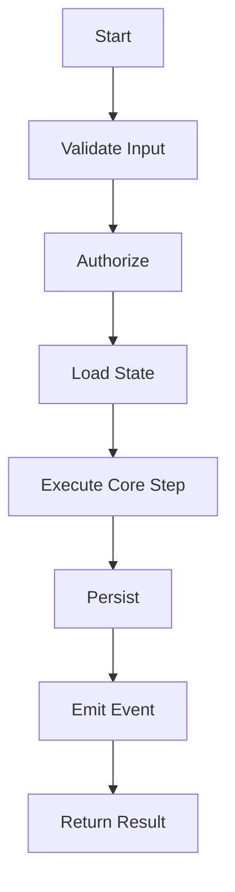
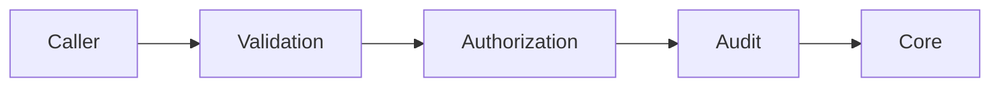
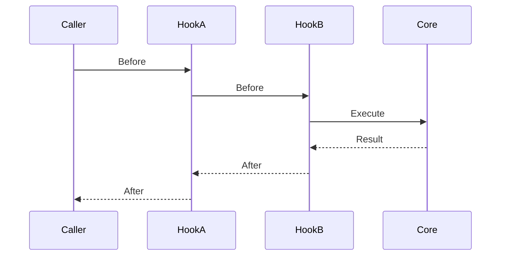
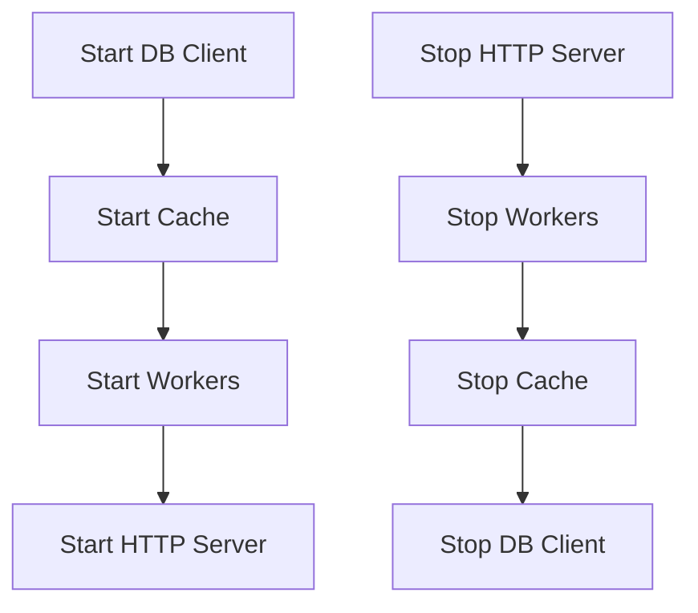
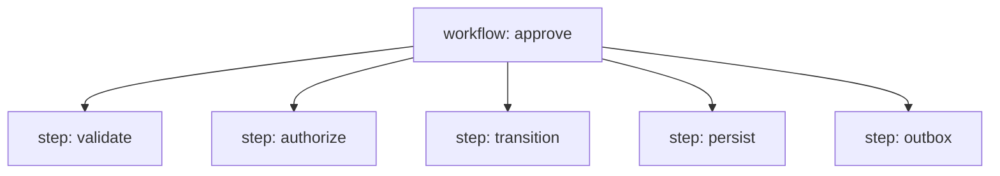

# learn-go-design-patterns-common-patterns-anti-patterns-part-029.md

# Part 029 — Template Method, Hook, and Callback Pattern Without Inheritance

## Status Seri

- Seri: **Go Design Patterns, Common Patterns, and Anti-Patterns**
- Part: **029 dari 035**
- Status seri: **belum selesai**
- Lanjutan dari:
  - Part 028 — Decorator Pattern in Go
- Setelah ini:
  - Part 030 — Generics-Based Pattern Design

---

## Tujuan Part Ini

Di part ini kita membahas bagaimana mengganti pola **Template Method**, **Hook**, dan **Callback** dari dunia inheritance/abstract class ke desain Go yang berbasis composition.

Di Java, pola template method biasanya terlihat seperti:

```java
abstract class ImportJob {
    public final void run() {
        validate();
        beforeImport();
        importRows();
        afterImport();
    }

    protected abstract void validate();
    protected void beforeImport() {}
    protected abstract void importRows();
    protected void afterImport() {}
}
```

Di Go, tidak ada inheritance class. Maka kita tidak membuat base class. Kita membuat:

- function parameter
- hook interface kecil
- explicit workflow function
- callback struct
- lifecycle object
- policy injection
- strategy injection
- runner/orchestrator eksplisit
- decorator jika concern-nya cross-cutting
- template via composition, bukan inheritance

Part ini penting karena banyak engineer Java ketika masuk Go mencoba membangun:

- base service
- abstract handler
- generic processor superclass
- embedded struct sebagai pseudo-inheritance
- framework lifecycle sendiri
- hook registry global
- callback chain yang sulit dilacak

Di Go, kita tetap bisa punya workflow skeleton yang reusable, tetapi harus dibuat dengan cara yang:

- eksplisit
- testable
- tidak menyembunyikan lifecycle
- tidak memaksa inheritance mental model
- tidak mengorbankan readability
- tidak menciptakan framework internal terlalu dini

---

## 1. Mental Model: Template Method Adalah Workflow Skeleton

Template method menyelesaikan masalah ini:

> Beberapa operasi punya urutan langkah yang sama, tetapi detail sebagian langkah berbeda.

Contoh workflow umum:



Yang reusable adalah skeleton:

- validasi
- authorization
- load
- execute
- persist
- emit
- observe

Yang berbeda:

- tipe command
- domain object
- policy
- persistence target
- event shape
- result shape

Dalam Java, skeleton sering dikodekan sebagai abstract superclass.

Dalam Go, skeleton biasanya lebih baik dikodekan sebagai:

1. function yang menerima callback
2. struct runner yang menerima hook interface
3. use case orchestrator eksplisit
4. generic function jika tipe stabil
5. small strategy interface
6. decorator untuk cross-cutting concern

---

## 2. Java Mindset vs Go Mindset

### Java Mindset

Java sering memakai abstract class karena:

- method overriding
- protected hook
- final algorithm method
- inheritance reuse
- framework lifecycle
- template superclass
- annotation-driven callbacks

Contoh:

```java
abstract class BaseCommandHandler<C, R> {
    public final R handle(C command) {
        validate(command);
        authorize(command);
        beforeExecute(command);
        R result = execute(command);
        afterExecute(command, result);
        return result;
    }

    protected abstract void validate(C command);
    protected abstract void authorize(C command);
    protected abstract R execute(C command);
    protected void beforeExecute(C command) {}
    protected void afterExecute(C command, R result) {}
}
```

Masalah jika dibawa ke Go:

- Go tidak punya protected
- embedding bukan inheritance
- override tidak ada
- method dispatch tidak bekerja seperti virtual inheritance
- base struct mudah menjadi god struct
- dependency jadi tersembunyi
- lifecycle sulit dites
- urutan hook tidak selalu jelas
- internal framework cepat tumbuh

### Go Mindset

Go lebih memilih explicit composition:

```go
type CommandHandler[C any, R any] func(context.Context, C) (R, error)

func WithValidation[C any, R any](
    validate func(context.Context, C) error,
    next CommandHandler[C, R],
) CommandHandler[C, R] {
    return func(ctx context.Context, cmd C) (R, error) {
        var zero R

        if err := validate(ctx, cmd); err != nil {
            return zero, err
        }

        return next(ctx, cmd)
    }
}
```

Atau:

```go
type ImportRunner struct {
    validator RowValidator
    importer  RowImporter
    observer  ImportObserver
}

func (r *ImportRunner) Run(ctx context.Context, input ImportInput) (ImportResult, error) {
    if err := r.validator.Validate(ctx, input); err != nil {
        return ImportResult{}, err
    }

    if r.observer != nil {
        r.observer.BeforeImport(ctx, input)
    }

    result, err := r.importer.Import(ctx, input)

    if r.observer != nil {
        r.observer.AfterImport(ctx, input, result, err)
    }

    return result, err
}
```

Go tidak memaksa kamu menghapus skeleton. Go memaksa kamu membuat skeleton itu eksplisit.

---

## 3. Template Method, Hook, Callback: Bedanya Apa?

Istilah sering tumpang tindih.

| Istilah | Makna Praktis |
|---|---|
| Template Method | Skeleton algorithm tetap, beberapa step bisa diganti |
| Hook | Extension point opsional sebelum/sesudah/selama workflow |
| Callback | Function yang dipanggil oleh framework/runner saat event tertentu |
| Strategy | Behavior utama yang dipilih/inject |
| Decorator | Wrapper yang menambah behavior sambil menjaga contract |
| Policy | Decision logic yang mengevaluasi aturan |
| Observer | Hook yang menerima notifikasi tanpa mengubah flow utama |

Dalam Go, implementasinya bisa sama-sama function/interface. Yang membedakan adalah semantic contract.

Contoh:

```go
type BeforeHook func(context.Context, Command) error
type AfterHook func(context.Context, Command, Result, error)
type Policy interface {
    Evaluate(context.Context, Input) Decision
}
type Strategy interface {
    Execute(context.Context, Input) (Output, error)
}
```

Naming harus menunjukkan niat, bukan sekadar bentuk teknis.

---

## 4. Kapan Template/Hook/Callback Layak Dipakai?

Gunakan pola ini jika:

- ada workflow skeleton yang benar-benar berulang
- urutan step punya invariant kuat
- extension point terbatas dan stabil
- variasi behavior kecil tetapi nyata
- testability meningkat
- duplicate workflow code mulai menimbulkan bug
- framework kecil dibutuhkan dalam package internal
- lifecycle step perlu diobservasi konsisten

Hindari jika:

- hanya ada satu use case
- variasi workflow masih belum stabil
- abstraction lebih sulit dibaca daripada duplikasi
- hook akan mengubah business semantics
- order hook belum jelas
- error handling hook ambigu
- callback akan memanggil callback lain tanpa batas
- kamu sedang membangun framework internal karena “terlihat rapi”

Heuristic:

> Jangan membuat template sebelum kamu punya minimal 2–3 concrete workflows dengan urutan sama dan perbedaan yang jelas.

---

## 5. Pattern 1: Function Parameter as Template Step

Ini bentuk paling sederhana.

### Problem

Kamu punya operasi yang selalu butuh transaction:

```go
func CreateUser(ctx context.Context, db *sql.DB, cmd CreateUserCommand) error {
    tx, err := db.BeginTx(ctx, nil)
    if err != nil {
        return err
    }
    defer tx.Rollback()

    // core mutation

    return tx.Commit()
}
```

Banyak use case mengulang transaction wrapper.

### Template Function

```go
type TxRunner struct {
    db *sql.DB
}

func (r *TxRunner) WithinTx(ctx context.Context, fn func(context.Context, *sql.Tx) error) error {
    tx, err := r.db.BeginTx(ctx, nil)
    if err != nil {
        return err
    }

    defer func() {
        _ = tx.Rollback()
    }()

    if err := fn(ctx, tx); err != nil {
        return err
    }

    if err := tx.Commit(); err != nil {
        return err
    }

    return nil
}
```

Usage:

```go
func (s *UserService) Create(ctx context.Context, cmd CreateUserCommand) error {
    return s.txs.WithinTx(ctx, func(ctx context.Context, tx *sql.Tx) error {
        if err := s.users.Insert(ctx, tx, cmd.User); err != nil {
            return err
        }

        if err := s.outbox.Add(ctx, tx, UserCreatedEvent{
            UserID: cmd.User.ID,
        }); err != nil {
            return err
        }

        return nil
    })
}
```

Ini adalah template method tanpa inheritance.

Skeleton:

- begin tx
- defer rollback
- execute callback
- commit

Variable step:

- mutation function

### Keunggulan

- explicit
- testable
- no inheritance
- no base service
- ownership clear
- transaction boundary terlihat

### Failure Mode

- callback terlalu besar
- network call masuk callback
- callback menyimpan `tx` untuk dipakai setelah commit
- nested transaction tidak ditangani
- panic handling tidak jelas
- rollback error diabaikan tanpa policy

### Review Checklist

- Apakah callback menghormati context?
- Apakah callback tidak memulai goroutine memakai tx?
- Apakah callback tidak melakukan network call lambat?
- Apakah commit failure dimodelkan?
- Apakah rollback defer aman?
- Apakah nested transaction dilarang atau didukung eksplisit?

---

## 6. Pattern 2: Higher-Order Command Handler

Workflow command sering:

1. validate
2. authorize
3. execute
4. audit
5. observe

Daripada abstract base handler, kita bisa compose function.

```go
type Handler[C any, R any] func(context.Context, C) (R, error)
```

Validation wrapper:

```go
func WithValidation[C any, R any](
    validate func(context.Context, C) error,
    next Handler[C, R],
) Handler[C, R] {
    return func(ctx context.Context, cmd C) (R, error) {
        var zero R

        if err := validate(ctx, cmd); err != nil {
            return zero, err
        }

        return next(ctx, cmd)
    }
}
```

Authorization wrapper:

```go
func WithAuthorization[C any, R any](
    authorize func(context.Context, C) error,
    next Handler[C, R],
) Handler[C, R] {
    return func(ctx context.Context, cmd C) (R, error) {
        var zero R

        if err := authorize(ctx, cmd); err != nil {
            return zero, err
        }

        return next(ctx, cmd)
    }
}
```

Audit wrapper:

```go
func WithAudit[C any, R any](
    action string,
    audit func(context.Context, C, R, error) error,
    next Handler[C, R],
) Handler[C, R] {
    return func(ctx context.Context, cmd C) (R, error) {
        result, err := next(ctx, cmd)

        auditErr := audit(ctx, cmd, result, err)
        if auditErr != nil {
            var zero R
            return zero, auditErr
        }

        return result, err
    }
}
```

Usage:

```go
approve := Handler[ApproveCommand, ApproveResult](approveCore)

approve = WithValidation(validateApprove, approve)
approve = WithAuthorization(authorizeApprove, approve)
approve = WithAudit("case.approve", auditApprove, approve)
```

### Diagram



Note: depending wrapper order, audit may or may not see validation/auth failures.

If you want audit to see all attempts:

```go
approve = WithAudit("case.approve", auditApprove, approve)
approve = WithAuthorization(authorizeApprove, approve)
approve = WithValidation(validateApprove, approve)
```

But now audit placement differs.

Ordering must be explicit.

---

## 7. Pattern 3: Hook Interface

Hook interface cocok jika ada beberapa lifecycle events.

```go
type ImportHooks interface {
    BeforeValidate(context.Context, ImportInput) error
    AfterValidate(context.Context, ImportInput, error) error
    BeforeImport(context.Context, ImportInput) error
    AfterImport(context.Context, ImportInput, ImportResult, error) error
}
```

Namun interface seperti ini cepat menjadi besar.

Lebih baik mulai kecil.

```go
type BeforeImportHook interface {
    BeforeImport(context.Context, ImportInput) error
}

type AfterImportHook interface {
    AfterImport(context.Context, ImportInput, ImportResult, error) error
}
```

Runner:

```go
type ImportRunner struct {
    importer Importer
    before   []BeforeImportHook
    after    []AfterImportHook
}

func (r *ImportRunner) Run(ctx context.Context, input ImportInput) (ImportResult, error) {
    for _, hook := range r.before {
        if err := hook.BeforeImport(ctx, input); err != nil {
            return ImportResult{}, err
        }
    }

    result, err := r.importer.Import(ctx, input)

    for _, hook := range r.after {
        hookErr := hook.AfterImport(ctx, input, result, err)
        if hookErr != nil && err == nil {
            err = hookErr
        }
    }

    return result, err
}
```

### Hook Error Policy

Hook error policy harus eksplisit.

Untuk before hook:

- jika gagal, apakah workflow berhenti?
- apakah error dianggap validation/business/technical?
- apakah after hook tetap dijalankan?

Untuk after hook:

- jika core sukses tapi after hook gagal, apakah operation dianggap gagal?
- apakah after hook best-effort?
- apakah after hook harus durable?
- apakah after hook boleh retry?
- apakah after hook harus masuk outbox?

Bad:

```go
_ = hook.AfterImport(ctx, input, result, err)
```

Kecuali hook memang best-effort dan punya observability/alerting sendiri.

---

## 8. Pattern 4: Callback Struct

Jika callback banyak, function parameters bisa berantakan.

Bad:

```go
func RunImport(
    ctx context.Context,
    input ImportInput,
    validate func(context.Context, ImportInput) error,
    before func(context.Context, ImportInput) error,
    process func(context.Context, ImportInput) (ImportResult, error),
    after func(context.Context, ImportInput, ImportResult, error) error,
) (ImportResult, error) {
    ...
}
```

Better:

```go
type ImportCallbacks struct {
    Validate func(context.Context, ImportInput) error
    Before   func(context.Context, ImportInput) error
    Process  func(context.Context, ImportInput) (ImportResult, error)
    After    func(context.Context, ImportInput, ImportResult, error) error
}
```

Runner:

```go
func RunImport(ctx context.Context, input ImportInput, cb ImportCallbacks) (ImportResult, error) {
    if cb.Process == nil {
        return ImportResult{}, errors.New("import process callback is required")
    }

    if cb.Validate != nil {
        if err := cb.Validate(ctx, input); err != nil {
            return ImportResult{}, err
        }
    }

    if cb.Before != nil {
        if err := cb.Before(ctx, input); err != nil {
            return ImportResult{}, err
        }
    }

    result, err := cb.Process(ctx, input)

    if cb.After != nil {
        if afterErr := cb.After(ctx, input, result, err); afterErr != nil && err == nil {
            err = afterErr
        }
    }

    return result, err
}
```

### When Good

Callback struct cocok jika:

- callback optional banyak
- workflow cukup lokal
- tidak perlu polymorphism besar
- ingin dependency eksplisit
- cocok untuk test helper atau internal package

### Risk

- struct terlalu generic
- callbacks punya hidden dependencies via closure
- nil callback semantics tidak jelas
- error policy tidak jelas
- callback saling bergantung melalui shared mutable variable

---

## 9. Pattern 5: Strategy Injection Inside Template

Jika step utama berbeda, pakai strategy interface.

```go
type RowProcessor interface {
    ProcessRow(context.Context, Row) (RowResult, error)
}
```

Runner:

```go
type BatchRunner struct {
    processor RowProcessor
    observer  BatchObserver
}

func (r *BatchRunner) Run(ctx context.Context, rows []Row) (BatchResult, error) {
    result := BatchResult{
        Total: len(rows),
    }

    for _, row := range rows {
        rowResult, err := r.processor.ProcessRow(ctx, row)
        if err != nil {
            result.Failed++
            r.observer.RowFailed(ctx, row, err)
            continue
        }

        result.Succeeded++
        r.observer.RowSucceeded(ctx, row, rowResult)
    }

    return result, nil
}
```

Different processors:

```go
type UserImportProcessor struct {
    users UserRepository
}

func (p *UserImportProcessor) ProcessRow(ctx context.Context, row Row) (RowResult, error) {
    // user-specific logic
    return RowResult{}, nil
}
```

This is template + strategy.

Skeleton:

- iterate rows
- process row
- accumulate result
- observe success/failure

Variable strategy:

- row processor

---

## 10. Pattern 6: Observer Hook

Observer hook receives notification but should not alter main flow.

```go
type BatchObserver interface {
    BatchStarted(context.Context, BatchInput)
    RowSucceeded(context.Context, Row, RowResult)
    RowFailed(context.Context, Row, error)
    BatchFinished(context.Context, BatchResult)
}
```

No-op observer:

```go
type NoopBatchObserver struct{}

func (NoopBatchObserver) BatchStarted(context.Context, BatchInput) {}
func (NoopBatchObserver) RowSucceeded(context.Context, Row, RowResult) {}
func (NoopBatchObserver) RowFailed(context.Context, Row, error) {}
func (NoopBatchObserver) BatchFinished(context.Context, BatchResult) {}
```

Runner:

```go
type BatchRunner struct {
    processor RowProcessor
    observer  BatchObserver
}

func NewBatchRunner(processor RowProcessor, observer BatchObserver) *BatchRunner {
    if processor == nil {
        panic("nil RowProcessor")
    }
    if observer == nil {
        observer = NoopBatchObserver{}
    }

    return &BatchRunner{
        processor: processor,
        observer:  observer,
    }
}
```

Observer is good for:

- logs
- metrics
- traces
- progress reporting
- test capture
- low-risk notification

Observer is dangerous for:

- mutation
- authorization
- persistence
- core business decision
- required audit unless durable/fail policy explicit

Rule:

> If hook failure must affect outcome, it is not a passive observer. Model it as a step or policy.

---

## 11. Pattern 7: Before/After Hook List

Hook list is tempting.

```go
type Hook[C any, R any] interface {
    Before(context.Context, C) error
    After(context.Context, C, R, error) error
}
```

Runner:

```go
type HookedHandler[C any, R any] struct {
    next  Handler[C, R]
    hooks []Hook[C, R]
}

func (h *HookedHandler[C, R]) Handle(ctx context.Context, cmd C) (R, error) {
    var zero R

    for _, hook := range h.hooks {
        if err := hook.Before(ctx, cmd); err != nil {
            return zero, err
        }
    }

    result, err := h.next(ctx, cmd)

    for i := len(h.hooks) - 1; i >= 0; i-- {
        hookErr := h.hooks[i].After(ctx, cmd, result, err)
        if hookErr != nil && err == nil {
            err = hookErr
        }
    }

    return result, err
}
```

Why reverse order after?

Because it mirrors stack unwinding.



If you implement hook list, document ordering.

### Hook Ordering Problems

- auth before validation or validation before auth?
- audit before idempotency or after?
- metrics before retry or after?
- cleanup hook after failed before hook?
- panic handling?
- short-circuit behavior?

When ordering becomes central, explicit decorator stack may be clearer than generic hook list.

---

## 12. Pattern 8: Lifecycle Interface

Some components need lifecycle:

```go
type Lifecycle interface {
    Start(context.Context) error
    Stop(context.Context) error
}
```

Server:

```go
type Server struct {
    components []Lifecycle
}

func (s *Server) Start(ctx context.Context) error {
    for _, c := range s.components {
        if err := c.Start(ctx); err != nil {
            return err
        }
    }
    return nil
}

func (s *Server) Stop(ctx context.Context) error {
    var err error

    for i := len(s.components) - 1; i >= 0; i-- {
        if stopErr := s.components[i].Stop(ctx); stopErr != nil {
            err = errors.Join(err, stopErr)
        }
    }

    return err
}
```

This is template/lifecycle pattern.

### Start/Stop Ordering



Start forward, stop reverse.

### Failure Policy

If start fails at component 3:

- should already-started components be stopped?
- should errors be joined?
- should startup fail fast?
- should health endpoint remain down?
- should metrics record startup failure?

Production-grade lifecycle runner handles partial startup cleanup:

```go
func (s *Server) Start(ctx context.Context) error {
    started := make([]Lifecycle, 0, len(s.components))

    for _, c := range s.components {
        if err := c.Start(ctx); err != nil {
            stopCtx, cancel := context.WithTimeout(context.Background(), 10*time.Second)
            defer cancel()

            for i := len(started) - 1; i >= 0; i-- {
                _ = started[i].Stop(stopCtx)
            }

            return err
        }

        started = append(started, c)
    }

    return nil
}
```

This is template method in operational lifecycle form.

---

## 13. Pattern 9: Workflow Skeleton with Explicit Steps

For important business workflow, avoid too-generic hook system. Make steps explicit.

```go
type ApprovalWorkflow struct {
    loader      CaseLoader
    authorizer  ApprovalAuthorizer
    validator   ApprovalValidator
    transition  ApprovalTransitioner
    persister   CasePersister
    outbox      Outbox
    audit       AuditWriter
}

func (w *ApprovalWorkflow) Approve(ctx context.Context, cmd ApproveCommand) (ApproveResult, error) {
    c, err := w.loader.LoadCase(ctx, cmd.CaseID)
    if err != nil {
        return ApproveResult{}, err
    }

    authz, err := w.authorizer.AuthorizeApproval(ctx, cmd.ActorID, c)
    if err != nil {
        return ApproveResult{}, err
    }
    if !authz.Allowed {
        return ApproveResult{Decision: DecisionDenied, Reasons: authz.Reasons}, nil
    }

    validation := w.validator.ValidateApproval(ctx, c, cmd)
    if !validation.Valid {
        return ApproveResult{Decision: DecisionRejected, Reasons: validation.Reasons}, nil
    }

    transition, err := w.transition.Approve(ctx, c, cmd)
    if err != nil {
        return ApproveResult{}, err
    }

    if err := w.persister.SaveCase(ctx, c); err != nil {
        return ApproveResult{}, err
    }

    if err := w.outbox.Add(ctx, transition.Event()); err != nil {
        return ApproveResult{}, err
    }

    if err := w.audit.Write(ctx, transition.AuditRecord()); err != nil {
        return ApproveResult{}, err
    }

    return ApproveResult{
        Decision:     DecisionApproved,
        TransitionID: transition.ID,
    }, nil
}
```

This is also template-like, but without generic hook magic.

For regulatory/business-critical systems, explicit workflow is often better than callback abstraction.

---

## 14. Pattern 10: Policy Injection Instead of Hook Mutation

Bad hook:

```go
type BeforeApproveHook interface {
    BeforeApprove(context.Context, *Case, ApproveCommand) error
}
```

Then someone implements:

```go
func (h *DirectorApprovalHook) BeforeApprove(ctx context.Context, c *Case, cmd ApproveCommand) error {
    if c.Amount > 100000 {
        c.State = StatePendingDirector
    }
    return nil
}
```

This is dangerous:

- hook mutates case state
- hidden transition
- no audit event
- unclear validation order
- hard to test
- violates state machine

Better:

```go
type ApprovalPolicy interface {
    Evaluate(context.Context, ApprovalPolicyInput) ApprovalDecision
}
```

Decision:

```go
type ApprovalDecision struct {
    Allowed bool
    TargetState CaseState
    Reasons []DecisionReason
}
```

Use case:

```go
decision := s.policy.Evaluate(ctx, ApprovalPolicyInput{
    Case: c,
    Command: cmd,
})

if !decision.Allowed {
    return ApproveResult{Decision: DecisionRejected, Reasons: decision.Reasons}, nil
}

transition, err := c.TransitionTo(decision.TargetState, cmd.ActorID)
```

Policy returns decision. State machine applies transition. Audit records transition.

Do not let hook mutate domain silently.

---

## 15. Pattern 11: Functional Hook

For small cases, function hooks are enough.

```go
type BeforeFunc[C any] func(context.Context, C) error
type AfterFunc[C any, R any] func(context.Context, C, R, error) error
```

Runner:

```go
type HookedFunc[C any, R any] struct {
    before []BeforeFunc[C]
    next   Handler[C, R]
    after  []AfterFunc[C, R]
}
```

This can be useful for internal tooling, test harness, import pipeline, benchmark harness, or CLI workflow.

But if many hooks need dependencies, named structs may be clearer.

---

## 16. Pattern 12: Callback for Resource Management

Go often uses callback templates for resource scoping:

```go
func WithFile(path string, fn func(*os.File) error) error {
    f, err := os.Open(path)
    if err != nil {
        return err
    }
    defer f.Close()

    return fn(f)
}
```

Usage:

```go
err := WithFile("data.txt", func(f *os.File) error {
    // use f only inside scope
    return nil
})
```

This pattern ensures resource lifetime.

Examples:

- `WithinTx`
- `WithLock`
- `WithTempDir`
- `WithSpan`
- `WithTimeout`
- `WithSemaphore`
- `WithLease`
- `WithAdvisoryLock`
- `WithTenantContext`
- `WithAuditContext`

### WithLock Example

```go
func WithLock(mu *sync.Mutex, fn func() error) error {
    mu.Lock()
    defer mu.Unlock()

    return fn()
}
```

Caution:

- callback must not call function that tries same lock unless reentrancy is handled
- callback must not run long operation under lock
- panic behavior should be considered
- context cannot cancel `sync.Mutex` lock acquisition

### WithSemaphore Example

```go
type Semaphore chan struct{}

func NewSemaphore(n int) Semaphore {
    return make(Semaphore, n)
}

func (s Semaphore) With(ctx context.Context, fn func(context.Context) error) error {
    select {
    case s <- struct{}{}:
        defer func() { <-s }()
        return fn(ctx)
    case <-ctx.Done():
        return ctx.Err()
    }
}
```

Good for bounded concurrency.

---

## 17. Pattern 13: Template for Retrying Operation

Retry as template:

```go
func Retry[T any](
    ctx context.Context,
    policy RetryPolicy,
    operation func(context.Context, int) (T, error),
) (T, error) {
    var zero T
    var lastErr error

    for attempt := 0; attempt < policy.MaxAttempts; attempt++ {
        result, err := operation(ctx, attempt)
        if err == nil {
            return result, nil
        }

        if !policy.CanRetry(err) {
            return zero, err
        }

        lastErr = err

        delay := policy.Delay(attempt)
        timer := time.NewTimer(delay)

        select {
        case <-ctx.Done():
            timer.Stop()
            return zero, ctx.Err()
        case <-timer.C:
        }
    }

    return zero, fmt.Errorf("retry exhausted: %w", lastErr)
}
```

Usage:

```go
address, err := Retry(ctx, retryPolicy, func(ctx context.Context, attempt int) (Address, error) {
    return client.LookupPostal(ctx, postalCode)
})
```

This is a generic template function.

Caveats:

- only retry idempotent operation
- classify error carefully
- respect total deadline
- add jitter
- instrument attempts
- do not create generic retry that hides policy

---

## 18. Pattern 14: Template for Batch Processing

Batch processing often needs skeleton.

```go
type BatchProcessor[I any, O any] struct {
    Process func(context.Context, I) (O, error)
    OnSuccess func(context.Context, I, O)
    OnFailure func(context.Context, I, error)
}

func (p BatchProcessor[I, O]) Run(ctx context.Context, items []I) BatchResult[O] {
    result := BatchResult[O]{
        Total: len(items),
    }

    for _, item := range items {
        output, err := p.Process(ctx, item)
        if err != nil {
            result.Failed++
            if p.OnFailure != nil {
                p.OnFailure(ctx, item, err)
            }
            continue
        }

        result.Succeeded++
        result.Outputs = append(result.Outputs, output)

        if p.OnSuccess != nil {
            p.OnSuccess(ctx, item, output)
        }
    }

    return result
}
```

Good for:

- import validation
- file processing
- report generation
- migration scripts
- reconciliation
- data repair tools

But for critical production workflows, use explicit domain workflow if semantics are complex.

---

## 19. Pattern 15: Template for State Transition

State machine transition skeleton:

1. load aggregate
2. check current state
3. evaluate guard
4. apply transition
5. persist aggregate
6. emit event
7. audit

Generic-ish runner:

```go
type TransitionRunner struct {
    cases CaseRepository
    outbox Outbox
    audit  AuditWriter
}

func (r *TransitionRunner) Run(
    ctx context.Context,
    caseID CaseID,
    apply func(context.Context, *Case) (Transition, error),
) (TransitionResult, error) {
    c, err := r.cases.FindByID(ctx, caseID)
    if err != nil {
        return TransitionResult{}, err
    }

    transition, err := apply(ctx, &c)
    if err != nil {
        return TransitionResult{}, err
    }

    if err := r.cases.Save(ctx, c); err != nil {
        return TransitionResult{}, err
    }

    if err := r.outbox.Add(ctx, transition.Event); err != nil {
        return TransitionResult{}, err
    }

    if err := r.audit.Write(ctx, transition.Audit); err != nil {
        return TransitionResult{}, err
    }

    return TransitionResult{TransitionID: transition.ID}, nil
}
```

Usage:

```go
result, err := runner.Run(ctx, cmd.CaseID, func(ctx context.Context, c *Case) (Transition, error) {
    return c.Approve(cmd.ActorID, cmd.Comment)
})
```

This can be good if many transitions share exactly same persistence/event/audit skeleton.

But beware:

- some transitions need different authorization
- some need different events
- some need different transaction handling
- some need pre/post side effects
- generic transition runner may become too powerful

---

## 20. Pattern 16: Hook for Test Harness

Hooks are often useful in tests.

Example worker:

```go
type WorkerHooks struct {
    BeforeJob func(Job)
    AfterJob  func(Job, error)
}
```

Worker:

```go
type Worker struct {
    jobs  <-chan Job
    hooks WorkerHooks
}

func (w *Worker) Run(ctx context.Context) error {
    for {
        select {
        case <-ctx.Done():
            return ctx.Err()

        case job, ok := <-w.jobs:
            if !ok {
                return nil
            }

            if w.hooks.BeforeJob != nil {
                w.hooks.BeforeJob(job)
            }

            err := w.process(ctx, job)

            if w.hooks.AfterJob != nil {
                w.hooks.AfterJob(job, err)
            }
        }
    }
}
```

Test can wait for hook signal.

```go
done := make(chan struct{})

worker := Worker{
    jobs: jobs,
    hooks: WorkerHooks{
        AfterJob: func(Job, error) {
            close(done)
        },
    },
}
```

This avoids sleeps in tests.

Caution:

- hooks for tests should not leak into public production API unless useful
- avoid making production behavior depend on test-only hook
- consider internal package

---

## 21. Anti-Pattern: Embedded Struct as Fake Inheritance

Bad:

```go
type BaseService struct {
    logger *slog.Logger
    db     *sql.DB
}

func (b *BaseService) Validate(ctx context.Context) error {
    return nil
}

type UserService struct {
    BaseService
}
```

This looks like inheritance but is not.

Problems:

- dependencies inherited implicitly
- method promotion may expose unwanted API
- no override semantics
- base struct becomes dumping ground
- zero-value behavior unclear
- tests must understand base internals
- package API becomes accidental

Better:

```go
type UserService struct {
    users  UserRepository
    logger *slog.Logger
}
```

Share helpers as functions or small dependencies, not base class.

```go
func validateActor(actor ActorID) error {
    ...
}
```

Or:

```go
type ActorValidator struct {
    directory ActorDirectory
}
```

Embedding is useful for composition in some cases, but not as inheritance substitute.

---

## 22. Anti-Pattern: Base Handler Framework

Bad:

```go
type BaseHandler struct {
    decoder ValidatorDecoder
    auth    Authorizer
    logger  *slog.Logger
}

func (h *BaseHandler) Handle(w http.ResponseWriter, r *http.Request) {
    cmd := h.Decode(r)
    h.Authorize(r.Context(), cmd)
    h.Execute(r.Context(), cmd)
}
```

Then every handler embeds BaseHandler and overrides behavior via fields/function pointers.

Problems:

- HTTP-specific framework grows
- command types become erased
- error mapping becomes generic but wrong
- authorization becomes too coarse
- business flow hidden
- tests harder
- reflection likely appears

Better:

- use HTTP middleware for transport concerns
- use typed handler per command
- use explicit decoder/mapper
- use application service for business flow
- share small functions

```go
func ApproveCaseHandler(service CaseApprover) http.Handler {
    return http.HandlerFunc(func(w http.ResponseWriter, r *http.Request) {
        cmd, err := decodeApproveCommand(r)
        if err != nil {
            writeError(w, err)
            return
        }

        result, err := service.Approve(r.Context(), cmd)
        if err != nil {
            writeError(w, err)
            return
        }

        writeJSON(w, http.StatusOK, result)
    })
}
```

---

## 23. Anti-Pattern: Hook Hell

Hook hell happens when system has too many extension points.

Example:

```go
BeforeValidate
AfterValidate
BeforeAuthorize
AfterAuthorize
BeforeLoad
AfterLoad
BeforePolicy
AfterPolicy
BeforeMutation
AfterMutation
BeforePersist
AfterPersist
BeforeEvent
AfterEvent
BeforeAudit
AfterAudit
OnError
OnPanic
OnCancel
```

Symptoms:

- nobody knows actual order
- hooks depend on side effects from other hooks
- hook naming becomes lifecycle taxonomy debate
- adding feature means adding hook
- test matrix explodes
- production bug depends on registration order
- business behavior hidden in plugin ecosystem

Better:

- make core workflow explicit
- use decorator for cross-cutting concern
- use policy for decision
- use observer for passive telemetry
- use event/outbox for asynchronous extension
- avoid arbitrary mutation hook

---

## 24. Anti-Pattern: Callback Hell

Bad:

```go
Run(ctx, input,
    func(ctx context.Context) error {
        return Validate(ctx, input, func(ctx context.Context) error {
            return Authorize(ctx, input, func(ctx context.Context) error {
                return Execute(ctx, input, func(ctx context.Context) error {
                    return Audit(ctx, input)
                })
            })
        })
    },
)
```

This is unreadable.

Better:

- linear workflow
- small runner
- explicit steps
- decorator stack where appropriate

```go
if err := validate(ctx, input); err != nil {
    return err
}
if err := authorize(ctx, input); err != nil {
    return err
}
result, err := execute(ctx, input)
if err != nil {
    return err
}
return audit(ctx, input, result)
```

Simplicity beats clever callback composition.

---

## 25. Anti-Pattern: Hook Mutates Shared State

Bad:

```go
var currentTenant TenantID

hooks.Before = func(ctx context.Context, cmd Command) error {
    currentTenant = cmd.TenantID
    return nil
}
```

Problems:

- data race
- cross-request leak
- impossible in concurrent server
- tests flaky
- security bug

Better:

- pass tenant explicitly
- use context value only for request-scoped immutable metadata
- avoid global mutable state
- make dependency per request if needed

---

## 26. Anti-Pattern: Optional Hook Required for Correctness

Bad:

```go
runner := NewRunner(processor)

runner.OnBeforeProcess = func(ctx context.Context, item Item) error {
    item.Normalize()
    return nil
}
```

If hook is missing, correctness breaks.

If normalization is required, it is not an optional hook. It is part of core workflow.

Better:

```go
func (p *Processor) Process(ctx context.Context, item Item) error {
    item = NormalizeItem(item)
    ...
}
```

Or inject required dependency:

```go
type Processor struct {
    normalizer Normalizer
}
```

---

## 27. Anti-Pattern: Hook Swallows Error

Bad:

```go
for _, hook := range hooks {
    _ = hook.After(ctx, result)
}
```

If hook is audit or persistence, this loses required failure.

Better:

```go
for _, hook := range hooks {
    if err := hook.After(ctx, result); err != nil {
        return err
    }
}
```

Or explicitly best-effort:

```go
for _, hook := range hooks {
    if err := hook.After(ctx, result); err != nil {
        logger.ErrorContext(ctx, "best-effort hook failed",
            slog.String("hook", hook.Name()),
            slog.String("error", err.Error()),
        )
        metrics.Increment(ctx, "hook_failure_total", "hook", hook.Name())
    }
}
```

The policy must be visible.

---

## 28. Anti-Pattern: Framework Lifecycle Too Early

Some teams build internal framework:

```go
type AppModule interface {
    Configure(Container)
    BeforeStart()
    Start()
    AfterStart()
    BeforeStop()
    Stop()
    AfterStop()
}
```

Before they have enough services to justify it.

Costs:

- every new feature conforms to framework
- debugging startup is harder
- lifecycle dependency hidden
- module order becomes magic
- container appears
- reflection appears
- test startup becomes heavy
- simple code becomes ceremony

Better start with:

```go
func main() {
    cfg := LoadConfig()
    db := OpenDB(cfg.DB)
    repo := NewRepo(db)
    service := NewService(repo)
    handler := NewHandler(service)

    server := &http.Server{
        Addr:    cfg.Addr,
        Handler: handler,
    }

    RunServer(server)
}
```

Add lifecycle abstraction only when duplication and operational complexity demand it.

---

## 29. Error Policy in Hooks and Callbacks

A hook can fail in several ways.

### Error Policy Types

| Policy | Meaning | Example |
|---|---|---|
| Fail-fast | stop immediately | validation before core |
| Best-effort | log/metric but continue | optional telemetry |
| Accumulate | collect multiple errors | validation report |
| Compensate | undo previous step | partial workflow |
| Retry | retry hook | transient external audit |
| Defer | emit event/outbox | async notification |
| Fail-closed | deny if hook fails | authorization/security |
| Fail-open | allow if hook fails | non-critical enrichment |

Never leave hook error policy implicit.

### Example

```go
type HookPolicy int

const (
    HookFailFast HookPolicy = iota
    HookBestEffort
)
```

But do not over-engineer policy enum unless needed.

Often clearer:

```go
if err := requiredAudit.Write(ctx, record); err != nil {
    return err
}

if err := optionalNotifier.Notify(ctx, event); err != nil {
    logger.WarnContext(ctx, "notification failed", slog.String("error", err.Error()))
}
```

---

## 30. Concurrency in Hooks

Hooks can run:

- sequentially
- concurrently
- fire-and-forget
- via queue
- via worker pool

Default should be sequential unless there is a reason.

### Concurrent Hooks

```go
func RunHooksConcurrently(ctx context.Context, hooks []AfterHook, event Event) error {
    var wg sync.WaitGroup
    errCh := make(chan error, len(hooks))

    for _, hook := range hooks {
        hook := hook
        wg.Add(1)

        go func() {
            defer wg.Done()
            if err := hook.After(ctx, event); err != nil {
                errCh <- err
            }
        }()
    }

    wg.Wait()
    close(errCh)

    var err error
    for e := range errCh {
        err = errors.Join(err, e)
    }

    return err
}
```

Caution:

- hook order lost
- shared state unsafe
- resource spike
- cancellation policy unclear
- error order nondeterministic
- panic handling needed
- context deadline shared
- log order confusing

Use concurrent hooks only when independence and cost justify it.

---

## 31. Panic Policy

Should template runner recover panic?

Depends.

Boundary-level recovery:

- HTTP middleware
- worker main loop
- goroutine supervisor

Internal business workflow:

- usually should not recover and continue silently
- panic indicates bug/invariant violation
- transaction rollback via defer still needed
- audit/log at boundary

Example:

```go
func (r *Runner) Run(ctx context.Context, input Input) (Result, error) {
    defer func() {
        // maybe metrics cleanup, not silent recovery
    }()

    return r.run(ctx, input)
}
```

If recovering:

```go
func RecoveringHook(next Hook, logger *slog.Logger) Hook {
    return HookFunc(func(ctx context.Context, event Event) (err error) {
        defer func() {
            if v := recover(); v != nil {
                logger.ErrorContext(ctx, "hook panic", slog.Any("panic", v))
                err = fmt.Errorf("hook panic: %v", v)
            }
        }()

        return next.Handle(ctx, event)
    })
}
```

Do not swallow panic without observability.

---

## 32. Observability for Template/Hook Systems

If you introduce template/hook system, observe it.

Useful metrics:

- workflow duration
- step duration
- hook duration
- hook failure count
- hook skipped count
- callback panic count
- retry count
- success/failure by bounded class

Useful logs:

- workflow start/end at debug/info depending volume
- step failure with operation and error class
- hook failure with hook name
- lifecycle startup/shutdown sequence

Avoid:

- raw payload logs
- high-cardinality metric labels
- logging every row at info level
- duplicate logs at every hook
- hidden best-effort failure

Trace shape:



---

## 33. Security and Compliance Concerns

Hooks/callbacks are extension points. Extension points are risk.

Risks:

- unauthorized hook sees sensitive data
- hook logs PII
- hook mutates command
- hook bypasses authorization
- hook introduces network exfiltration
- hook failure policy fail-open accidentally
- plugin registration order changes control
- audit hook best-effort when legally required
- decision trace incomplete

For compliance-sensitive systems:

- keep authorization explicit
- keep audit required/durable
- avoid arbitrary mutation hooks
- use typed event/outbox for extension
- review hook implementations as privileged code
- redact hook inputs
- restrict hook registration
- version decision policy
- test failure policy

In regulatory workflow, a hook is not “just extension”; it can change evidentiary integrity.

---

## 34. Performance Considerations

Template/hook/callback overhead can include:

- function call
- interface dispatch
- closure allocation
- hook list iteration
- logging/metrics per step
- extra allocations for generic result
- goroutine overhead for concurrent hooks
- synchronization
- context derivation
- trace span creation

Usually negligible for business operations, but important for:

- per-row import with millions of rows
- high-QPS middleware
- streaming pipeline
- low-latency client
- in-memory hot path
- serialization loops

Optimization guidance:

- avoid per-item hook if batch-level hook sufficient
- avoid info log per item
- avoid trace span per row unless sampling
- avoid generic callback abstraction in hot loops if simple loop is better
- benchmark critical path
- keep hook list immutable after construction
- avoid closure capture causing heap allocation in hot path

---

## 35. Testing Strategy

### Test Template Order

```go
func TestRunnerOrder(t *testing.T) {
    var calls []string

    runner := Runner{
        Validate: func(context.Context, Input) error {
            calls = append(calls, "validate")
            return nil
        },
        Execute: func(context.Context, Input) (Result, error) {
            calls = append(calls, "execute")
            return Result{}, nil
        },
        After: func(context.Context, Input, Result, error) error {
            calls = append(calls, "after")
            return nil
        },
    }

    _, err := runner.Run(context.Background(), Input{})
    if err != nil {
        t.Fatal(err)
    }

    want := []string{"validate", "execute", "after"}
    if !reflect.DeepEqual(calls, want) {
        t.Fatalf("calls = %v, want %v", calls, want)
    }
}
```

### Test Short-Circuit

```go
func TestRunnerStopsOnValidationError(t *testing.T) {
    expected := errors.New("invalid")
    executed := false

    runner := Runner{
        Validate: func(context.Context, Input) error {
            return expected
        },
        Execute: func(context.Context, Input) (Result, error) {
            executed = true
            return Result{}, nil
        },
    }

    _, err := runner.Run(context.Background(), Input{})
    if !errors.Is(err, expected) {
        t.Fatalf("expected validation error, got %v", err)
    }
    if executed {
        t.Fatal("execute should not be called")
    }
}
```

### Test After Hook Error Policy

```go
func TestAfterHookErrorReturnedWhenCoreSucceeds(t *testing.T) {
    expected := errors.New("audit failed")

    runner := Runner{
        Execute: func(context.Context, Input) (Result, error) {
            return Result{}, nil
        },
        After: func(context.Context, Input, Result, error) error {
            return expected
        },
    }

    _, err := runner.Run(context.Background(), Input{})
    if !errors.Is(err, expected) {
        t.Fatalf("expected after error, got %v", err)
    }
}
```

### Test Best-Effort Hook

If hook is best-effort, test that:

- core result still returned
- hook error logged/metric emitted
- no panic
- no silent loss without observability

### Test Callback Resource Scope

For `WithinTx`, test:

- commit on success
- rollback on callback error
- rollback on panic if supported
- no commit after error
- callback receives tx
- context cancellation handled

---

## 36. Production Example: Import Workflow

Suppose we build CSV import for regulatory records.

Requirements:

- validate file metadata
- parse rows
- validate row
- process row
- accumulate result
- write audit summary
- continue on row-level validation error
- fail on storage/system error
- emit event when complete

Types:

```go
type ImportRunner struct {
    parser    RowParser
    validator RowValidator
    processor RowProcessor
    audit     AuditWriter
    outbox    Outbox
    observer  ImportObserver
}

type ImportInput struct {
    FileID   string
    ActorID  string
    TenantID string
}

type ImportResult struct {
    FileID    string
    Total     int
    Succeeded int
    Failed    int
    Errors    []RowError
}
```

Run:

```go
func (r *ImportRunner) Run(ctx context.Context, input ImportInput) (ImportResult, error) {
    if err := validateImportInput(input); err != nil {
        return ImportResult{}, err
    }

    r.observer.ImportStarted(ctx, input)

    rows, err := r.parser.Parse(ctx, input.FileID)
    if err != nil {
        r.observer.ImportFailed(ctx, input, err)
        return ImportResult{}, err
    }

    result := ImportResult{FileID: input.FileID, Total: len(rows)}

    for _, row := range rows {
        if err := r.validator.ValidateRow(ctx, row); err != nil {
            result.Failed++
            result.Errors = append(result.Errors, RowError{
                RowNumber: row.Number,
                Reason:    err.Error(),
            })
            r.observer.RowRejected(ctx, row, err)
            continue
        }

        if err := r.processor.ProcessRow(ctx, row); err != nil {
            if IsSystemError(err) {
                r.observer.ImportFailed(ctx, input, err)
                return result, err
            }

            result.Failed++
            result.Errors = append(result.Errors, RowError{
                RowNumber: row.Number,
                Reason:    err.Error(),
            })
            continue
        }

        result.Succeeded++
    }

    if err := r.audit.Write(ctx, ImportAuditRecord{
        FileID:    input.FileID,
        ActorID:   input.ActorID,
        Total:     result.Total,
        Succeeded: result.Succeeded,
        Failed:    result.Failed,
    }); err != nil {
        return result, err
    }

    if err := r.outbox.Add(ctx, ImportCompletedEvent{
        FileID: input.FileID,
        Total:  result.Total,
    }); err != nil {
        return result, err
    }

    r.observer.ImportFinished(ctx, input, result)

    return result, nil
}
```

This is a template workflow, but readable.

No base class.

No hidden hook mutation.

No generic framework.

---

## 37. Production Example: Lifecycle Runner

```go
type Component interface {
    Name() string
    Start(context.Context) error
    Stop(context.Context) error
}

type LifecycleRunner struct {
    components []Component
    logger     *slog.Logger
}

func (r *LifecycleRunner) Start(ctx context.Context) error {
    started := make([]Component, 0, len(r.components))

    for _, c := range r.components {
        r.logger.InfoContext(ctx, "starting component", slog.String("component", c.Name()))

        if err := c.Start(ctx); err != nil {
            r.logger.ErrorContext(ctx, "component start failed",
                slog.String("component", c.Name()),
                slog.String("error", err.Error()),
            )

            r.stopStarted(context.Background(), started)
            return fmt.Errorf("start %s: %w", c.Name(), err)
        }

        started = append(started, c)
    }

    return nil
}

func (r *LifecycleRunner) Stop(ctx context.Context) error {
    return r.stopStarted(ctx, r.components)
}

func (r *LifecycleRunner) stopStarted(ctx context.Context, components []Component) error {
    var err error

    for i := len(components) - 1; i >= 0; i-- {
        c := components[i]

        r.logger.InfoContext(ctx, "stopping component", slog.String("component", c.Name()))

        if stopErr := c.Stop(ctx); stopErr != nil {
            r.logger.ErrorContext(ctx, "component stop failed",
                slog.String("component", c.Name()),
                slog.String("error", stopErr.Error()),
            )
            err = errors.Join(err, fmt.Errorf("stop %s: %w", c.Name(), stopErr))
        }
    }

    return err
}
```

This is template/lifecycle done explicitly.

---

## 38. Decision Matrix

| Situation | Better Pattern |
|---|---|
| Need shared resource scope | callback template: `WithX` |
| Need cross-cutting behavior | decorator |
| Need optional passive notification | observer hook |
| Need required decision | policy |
| Need alternative algorithm | strategy |
| Need repeated workflow skeleton | explicit runner |
| Need domain-critical workflow | explicit use case |
| Need startup/shutdown ordering | lifecycle runner |
| Need high-QPS handler concern | middleware |
| Need async extension | event/outbox |
| Need test synchronization | test hook/internal callback |
| Need arbitrary plugin mutation | usually avoid |

---

## 39. Review Checklist

### Skeleton

- Apakah workflow skeleton benar-benar berulang?
- Apakah urutan step jelas?
- Apakah abstraction lebih mudah dibaca daripada duplikasi?
- Apakah business-critical step tetap eksplisit?

### Hook

- Apakah hook optional atau required?
- Apakah hook boleh mutate state?
- Apakah hook error policy jelas?
- Apakah hook ordering terdokumentasi?
- Apakah hook bisa menyebabkan security/compliance issue?

### Callback

- Apakah callback lifetime jelas?
- Apakah callback boleh menyimpan resource setelah scope selesai?
- Apakah callback menghormati context?
- Apakah callback terlalu besar?

### Lifecycle

- Apakah Start/Stop order jelas?
- Apakah partial startup cleanup ada?
- Apakah Stop reverse order?
- Apakah shutdown deadline dipakai?

### Observability

- Apakah hook failure visible?
- Apakah step duration terukur jika penting?
- Apakah sensitive data tidak bocor?
- Apakah log tidak duplikatif?

### Simplicity

- Apakah ini framework internal terlalu dini?
- Apakah ordinary linear code lebih baik?
- Apakah generic type membuat API lebih sulit?
- Apakah base struct dipakai sebagai pseudo-inheritance?

---

## 40. Refactoring Playbook

### 40.1 Dari Abstract Base Service ke Explicit Composition

Before:

```go
type BaseService struct {
    db     *sql.DB
    logger *slog.Logger
}

type UserService struct {
    BaseService
}
```

After:

```go
type UserService struct {
    users  UserRepository
    txs    TxRunner
    logger *slog.Logger
}
```

Shared transaction behavior:

```go
s.txs.WithinTx(ctx, func(ctx context.Context, tx *sql.Tx) error {
    return s.users.Save(ctx, tx, user)
})
```

### 40.2 Dari Hook Mutation ke Policy

Before:

```go
runner.AddBeforeHook(DirectorApprovalHook{})
```

After:

```go
decision := approvalPolicy.Evaluate(ctx, input)
transition := stateMachine.Apply(decision)
```

### 40.3 Dari Callback Hell ke Linear Workflow

Before nested callbacks.

After:

```go
if err := validate(ctx, cmd); err != nil {
    return err
}
if err := authorize(ctx, cmd); err != nil {
    return err
}
result, err := execute(ctx, cmd)
if err != nil {
    return err
}
return audit(ctx, cmd, result)
```

### 40.4 Dari Generic Hook Framework ke Explicit Runner

Before:

```go
framework.Register("before_approve", hook)
framework.Register("after_approve", hook)
framework.Run("approve", payload)
```

After:

```go
workflow := ApprovalWorkflow{
    loader: loader,
    authorizer: authorizer,
    validator: validator,
    transitioner: transitioner,
    persister: persister,
    outbox: outbox,
    audit: audit,
}
```

---

## 41. Practical Heuristics

1. Prefer linear code until duplication becomes harmful.
2. Prefer explicit dependency over hidden hook.
3. Prefer policy for decision.
4. Prefer observer for passive notification.
5. Prefer decorator for cross-cutting behavior.
6. Prefer callback template for resource scope.
7. Prefer lifecycle runner for start/stop ordering.
8. Avoid base struct as inheritance substitute.
9. Avoid hooks that mutate domain state.
10. Avoid hook system before stable extension points exist.
11. Make hook error policy explicit.
12. Make ordering explicit.
13. Test ordering and short-circuit behavior.
14. Observe hook failure.
15. Keep regulatory workflows explicit and auditable.

---

## 42. Ringkasan

Template method, hook, dan callback tetap berguna di Go, tetapi bentuknya berbeda dari Java.

Di Go:

- tidak ada abstract class
- tidak ada protected hook
- tidak ada inheritance override
- embedding bukan inheritance
- template dibuat dengan function, interface kecil, runner, decorator, atau explicit workflow
- hook harus punya semantic contract jelas
- callback cocok untuk resource scope dan lifecycle
- policy lebih cocok untuk business decision
- observer cocok untuk passive notification
- decorator cocok untuk cross-cutting concern

Kesalahan terbesar adalah membangun framework internal yang terlihat rapi tetapi menyembunyikan behavior penting.

Mental model utama:

> Di Go, template bukan base class. Template adalah workflow yang eksplisit, dengan variasi yang diinjeksi secara jelas melalui function, interface kecil, atau dependency bernama.

---

## 43. Koneksi ke Part Berikutnya

Part berikutnya:

# Part 030 — Generics-Based Pattern Design

Kita akan membahas bagaimana generics memengaruhi design pattern Go:

- kapan generic function benar-benar membantu
- kapan interface lebih tepat
- generic result type
- generic handler
- generic collection/helper
- constraint design
- generic repository warning
- generic abstraction over stable algorithm vs unstable domain
- anti-pattern “generics because Java”

<!-- NAVIGATION_FOOTER -->
<div class="page-nav">
<a href="./learn-go-design-patterns-common-patterns-anti-patterns-part-028.md">⬅️ Part 028 — Decorator Pattern in Go</a>
<a href="./index.md">📚 Kategori</a>
<a href="../../index.md">🏠 Home</a>
<a href="./learn-go-design-patterns-common-patterns-anti-patterns-part-030.md">Part 030 — Generics-Based Pattern Design ➡️</a>
</div>
