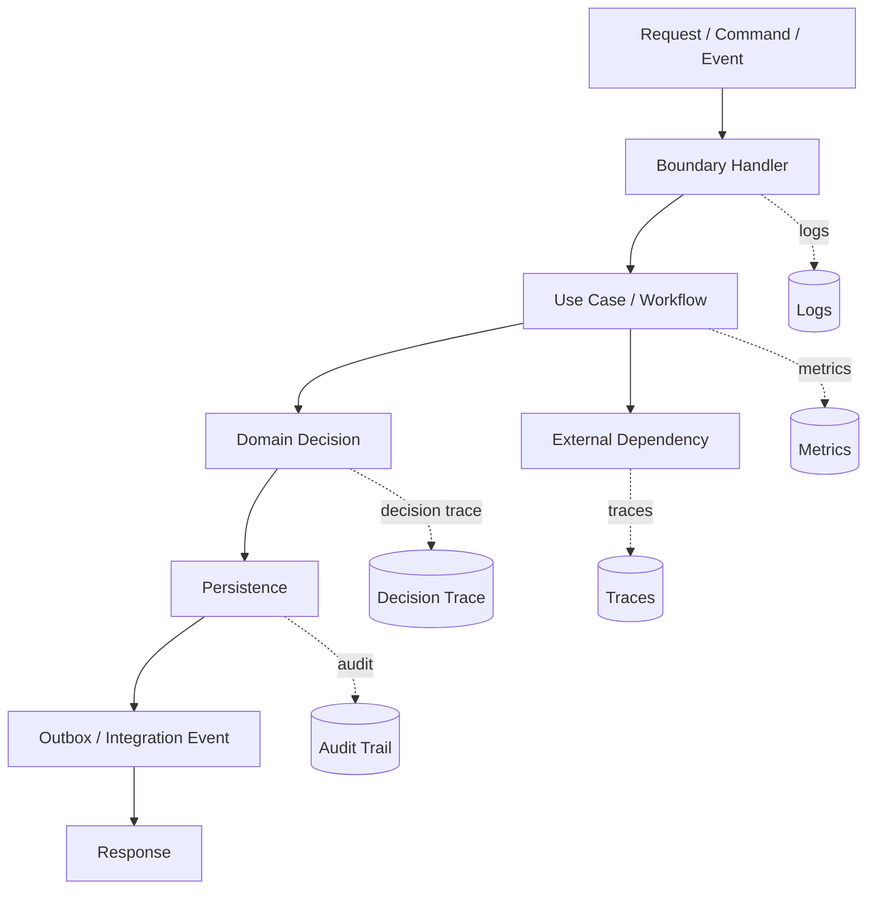
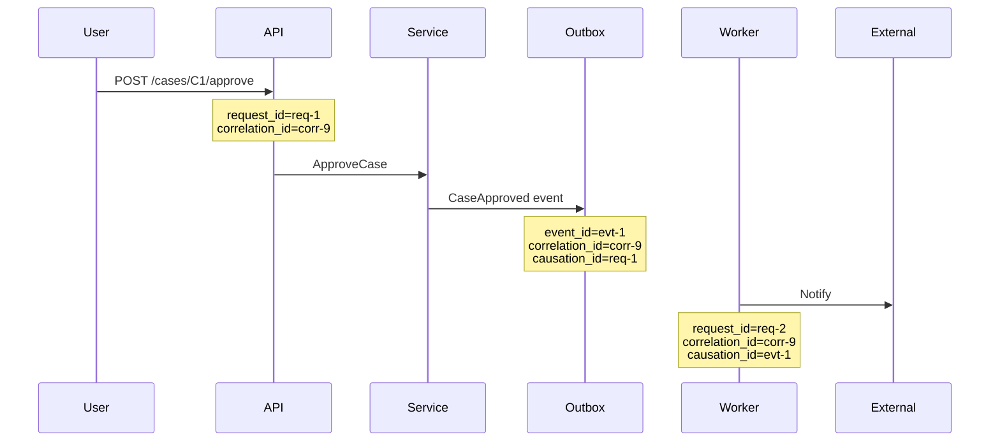
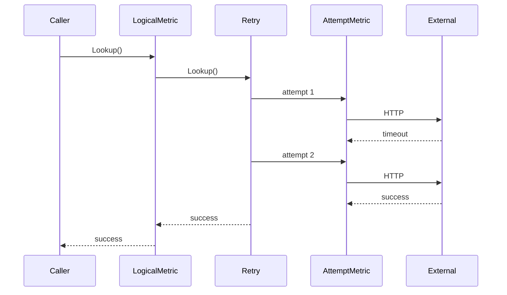

# learn-go-design-patterns-common-patterns-anti-patterns-part-031.md

# Part 031 — Observability Pattern: Logs, Metrics, Traces, and Audit

## Status Seri

- Seri: **Go Design Patterns, Common Patterns, and Anti-Patterns**
- Part: **031 dari 035**
- Status seri: **belum selesai**
- Lanjutan dari:
  - Part 030 — Generics-Based Pattern Design
- Setelah ini:
  - Part 032 — Testing Seam Pattern

---

## Tujuan Part Ini

Di part ini kita membahas **observability sebagai design pattern**, bukan sekadar “tambahkan logging”.

Dalam sistem production, terutama sistem backend, workflow, financial/regulatory, case management, enforcement lifecycle, dan microservices, observability adalah kemampuan untuk menjawab pertanyaan:

- Apa yang terjadi?
- Kapan terjadi?
- Siapa yang memicu?
- Request mana yang terkait?
- Dependency mana yang lambat/gagal?
- Apakah failure terjadi di validation, authorization, persistence, external API, queue, worker, atau state transition?
- Apakah error ini retryable?
- Apakah user-facing impact?
- Apakah data berubah?
- Apakah event dipublish?
- Apakah audit evidence lengkap?
- Apakah keputusan sistem dapat dipertanggungjawabkan?
- Apakah SLO/SLA terdampak?
- Apakah incident bisa didiagnosis tanpa membaca seluruh database?

Observability bukan hanya log. Observability terdiri dari beberapa signal berbeda:

- logs
- metrics
- traces
- audit records
- events
- decision trace
- error taxonomy
- health/readiness
- profiling
- runtime signals
- queue/job telemetry
- dependency telemetry

Part ini fokus ke design pattern untuk:

- structured logs
- metric boundary
- trace propagation
- correlation ID
- causation ID
- audit trail
- decision trace
- redaction
- error cardinality
- SLO-oriented metrics
- observability decorator/middleware
- anti-pattern seperti log spam, high-cardinality metrics, audit as debug log, sensitive data leak, dan double logging

---

## 1. Mental Model: Observability Adalah Evidence System

Observability bukan dekorasi setelah fitur selesai.

Observability adalah **evidence system**.



Setiap signal menjawab pertanyaan berbeda.

| Signal | Menjawab |
|---|---|
| Log | Apa yang terjadi di titik tertentu? |
| Metric | Seberapa sering, seberapa lambat, seberapa banyak? |
| Trace | Jalur request melewati service/dependency mana? |
| Audit | Siapa melakukan apa terhadap objek apa, kapan, dan hasilnya? |
| Decision trace | Kenapa sistem mengambil keputusan tertentu? |
| Event | Perubahan bisnis apa yang perlu diketahui sistem lain? |
| Health | Apakah service siap menerima traffic? |
| Profile | Kenapa CPU/memory/latency tinggi? |

Kesalahan umum: memakai satu signal untuk semua.

Contoh salah:

- log dipakai sebagai audit
- audit dipakai sebagai debug log
- metric dipakai dengan label raw user ID
- trace dipakai untuk menyimpan payload sensitif
- event dipakai sebagai database dump
- error string dipakai sebagai classifier

---

## 2. Observability vs Monitoring vs Logging

Istilah sering tercampur.

| Istilah | Makna |
|---|---|
| Logging | Merekam event tekstual/structured |
| Monitoring | Mengawasi metric/alert/dashboard |
| Observability | Kemampuan menginfer internal state dari external signals |
| Auditability | Kemampuan membuktikan aksi/keputusan untuk accountability |
| Traceability | Kemampuan menelusuri flow lintas component |
| Forensics | Kemampuan rekonstruksi kejadian setelah incident |
| Profiling | Kemampuan melihat resource/runtime behavior |

Observability yang baik memungkinkan:

- incident response cepat
- root cause analysis
- capacity planning
- SLO/SLA reporting
- fraud/security investigation
- regulatory audit
- debugging distributed flow
- validation of deployment impact
- detecting regression

Observability yang buruk menghasilkan:

- log banyak tapi tidak berguna
- dashboard cantik tapi tidak actionable
- alert noisy
- trace tanpa context
- audit tidak defensible
- error tidak bisa diklasifikasi
- incident bergantung pada “feeling”

---

## 3. Observability Design Starts from Questions

Sebelum menambah log/metric/trace, tanya:

### Request-Level Questions

- Berapa jumlah request?
- Berapa latency p50/p95/p99?
- Berapa error rate?
- Endpoint/use case mana bermasalah?
- Tenant/user segment mana terdampak?
- Apakah retry meningkat?
- Apakah timeout meningkat?

### Dependency-Level Questions

- Dependency mana lambat?
- Dependency mana error?
- Apakah connection pool exhausted?
- Apakah external API rate-limited?
- Apakah DB query tertentu lambat?
- Apakah queue backlog meningkat?

### Workflow-Level Questions

- State transition mana gagal?
- Policy rule mana menolak?
- Validation issue apa yang dominan?
- Berapa case stuck di state tertentu?
- Berapa job retry/dead-letter?
- Apakah outbox relay tertinggal?

### Audit/Compliance Questions

- Siapa approve case ini?
- Kapan approve terjadi?
- Dari state mana ke state mana?
- Rule apa yang dievaluasi?
- Data apa yang digunakan?
- Apakah decision reason tersimpan?
- Apakah event emitted?
- Apakah ada override/manual correction?

Observability design harus menjawab pertanyaan nyata, bukan sekadar menambah signal.

---

## 4. Four Core IDs: Request, Correlation, Causation, Entity

Distributed system perlu identifier.

### Request ID

ID untuk satu inbound request di service boundary.

```text
request_id = req-abc
```

Digunakan untuk:

- log grouping
- HTTP response header
- debugging one request

### Correlation ID

ID untuk satu business flow end-to-end, bisa melewati banyak service/event/job.

```text
correlation_id = corr-123
```

Digunakan untuk:

- trace flow lintas service
- group logs/events/jobs
- incident reconstruction

### Causation ID

ID yang menunjukkan event/command penyebab event/command baru.

```text
causation_id = event-789
```

Digunakan untuk:

- event chain
- outbox/inbox flow
- debugging async propagation

### Entity ID

ID objek bisnis.

```text
case_id = CASE-2026-0001
application_id = APP-42
```

Digunakan untuk:

- audit
- business investigation
- domain debugging

Mermaid:



Rule:

- request ID changes per boundary request
- correlation ID stays across whole flow
- causation ID links cause-effect
- entity ID identifies business object
- trace ID may come from tracing system and can coexist with correlation ID

---

## 5. Context Propagation for Observability

In Go, request-scoped metadata commonly flows through `context.Context`.

But do not use context as dependency bag.

Good request-scoped values:

- request ID
- correlation ID
- trace/span context
- authenticated principal
- tenant ID
- locale
- causation ID

Bad context values:

- logger dependency
- database handle
- repository
- service
- config
- mutable state
- transaction object unless very intentionally scoped and internal

Typed key:

```go
package requestctx

import "context"

type requestIDKey struct{}
type correlationIDKey struct{}
type actorIDKey struct{}

func WithRequestID(ctx context.Context, id string) context.Context {
    return context.WithValue(ctx, requestIDKey{}, id)
}

func RequestID(ctx context.Context) (string, bool) {
    id, ok := ctx.Value(requestIDKey{}).(string)
    return id, ok
}

func WithCorrelationID(ctx context.Context, id string) context.Context {
    return context.WithValue(ctx, correlationIDKey{}, id)
}

func CorrelationID(ctx context.Context) (string, bool) {
    id, ok := ctx.Value(correlationIDKey{}).(string)
    return id, ok
}
```

Middleware:

```go
func RequestContext(next http.Handler) http.Handler {
    return http.HandlerFunc(func(w http.ResponseWriter, r *http.Request) {
        requestID := r.Header.Get("X-Request-ID")
        if requestID == "" {
            requestID = NewRequestID()
        }

        correlationID := r.Header.Get("X-Correlation-ID")
        if correlationID == "" {
            correlationID = requestID
        }

        ctx := r.Context()
        ctx = requestctx.WithRequestID(ctx, requestID)
        ctx = requestctx.WithCorrelationID(ctx, correlationID)

        w.Header().Set("X-Request-ID", requestID)
        w.Header().Set("X-Correlation-ID", correlationID)

        next.ServeHTTP(w, r.WithContext(ctx))
    })
}
```

This enables all downstream logs/traces/audit to include IDs.

---

## 6. Structured Logging Pattern

In production Go, prefer structured logging.

Instead of:

```go
log.Printf("failed to approve case %s: %v", caseID, err)
```

Use structured fields:

```go
logger.ErrorContext(ctx, "approve case failed",
    slog.String("operation", "case.approve"),
    slog.String("case_id", caseID.String()),
    slog.String("actor_id", actorID.String()),
    slog.String("error_class", ClassifyError(err).String()),
    slog.String("error", err.Error()),
)
```

Benefits:

- searchable
- filterable
- machine-readable
- dashboard-friendly
- less brittle than string parsing
- consistent across services

### Log Levels

| Level | Use |
|---|---|
| Debug | developer/debug details, usually off in prod |
| Info | important lifecycle/business operation summary |
| Warn | unexpected but recoverable condition |
| Error | operation failed and needs attention |
| Fatal | process cannot continue; often avoid in libraries |

### Good Log Event

A good log event has:

- stable message
- operation name
- bounded error class
- request/correlation ID
- entity ID where safe
- actor/tenant where safe
- duration if operation-level
- result/decision if relevant
- no raw sensitive payload

Example:

```go
logger.InfoContext(ctx, "case approval completed",
    slog.String("operation", "case.approve"),
    slog.String("case_id", result.CaseID.String()),
    slog.String("actor_id", cmd.ActorID.String()),
    slog.String("decision", result.Decision.String()),
    slog.Duration("duration", duration),
)
```

---

## 7. Logging Once at the Right Boundary

Anti-pattern:

```go
repo logs error
service logs error
handler logs error
middleware logs error
```

One failure becomes four errors.

Better:

- lower layer returns error with classification/context
- boundary logs final operation outcome
- dependency layer may emit metrics/span events
- audit separately records business action
- debug logs can be sampled or behind level

Rule:

> Return errors upward. Log once where you have enough context to explain the operation.

Example:

Repository:

```go
func (r *SQLCaseRepository) FindByID(ctx context.Context, id CaseID) (Case, error) {
    c, err := r.find(ctx, id)
    if err != nil {
        return Case{}, fmt.Errorf("find case %s: %w", id, err)
    }
    return c, nil
}
```

Service/handler boundary logs:

```go
result, err := s.approver.Approve(ctx, cmd)
if err != nil {
    logger.ErrorContext(ctx, "approve case failed",
        slog.String("operation", "case.approve"),
        slog.String("case_id", cmd.CaseID.String()),
        slog.String("error_class", ClassifyError(err).String()),
        slog.String("error", err.Error()),
    )
    return ApproveResult{}, err
}
```

---

## 8. Log Message Stability

Bad log messages:

```go
logger.Info("case " + id + " approved by " + user)
```

Search becomes hard.

Good:

```go
logger.InfoContext(ctx, "case approved",
    slog.String("case_id", id),
    slog.String("actor_id", user),
)
```

Stable message:

- `"case approved"`
- `"case approval failed"`
- `"outbox relay published event"`
- `"external address lookup failed"`

Variable data goes into fields.

This makes log query easier:

```text
message = "case approval failed" AND error_class = "timeout"
```

---

## 9. Redaction Pattern

Never log sensitive data casually.

Sensitive examples:

- password
- token
- authorization header
- session cookie
- IC/passport/national ID
- email/phone/address depending context
- payment info
- PII
- raw request body
- raw external API response
- internal secrets
- signed URLs
- database connection string
- private key
- JWT full value

Redaction helper:

```go
type Redacted string

func (r Redacted) LogValue() slog.Value {
    return slog.StringValue("[REDACTED]")
}
```

Example:

```go
logger.InfoContext(ctx, "external request prepared",
    slog.String("operation", "address.lookup"),
    slog.Any("token", Redacted(token)),
)
```

Better: do not include token at all.

### Safe Identifiers

Even identifiers can be sensitive. Prefer:

- internal case ID if not personally identifying
- hashed user ID for metric/log if needed
- actor role instead of full identity for metrics
- bounded classes over raw values

### Redaction by Type

```go
type Email string

func (e Email) Redacted() string {
    s := string(e)
    parts := strings.Split(s, "@")
    if len(parts) != 2 {
        return "[REDACTED_EMAIL]"
    }
    return parts[0][:1] + "***@" + parts[1]
}
```

Be cautious: even masked data may be sensitive under policy.

---

## 10. Metrics Pattern

Metrics answer aggregate questions:

- how many
- how fast
- how often
- how full
- how delayed
- how many errors
- how much backlog
- how many retries

Metric types:

| Type | Use |
|---|---|
| Counter | monotonically increasing count |
| Gauge | current value |
| Histogram | distribution, latency/size |
| Summary | client-side distribution, less common in distributed aggregation |

### Operation Metrics

```text
case_approval_total{status="approved"}
case_approval_total{status="rejected"}
case_approval_total{status="error", error_class="db_timeout"}
case_approval_duration_seconds_bucket{...}
```

### Dependency Metrics

```text
external_request_total{dependency="onemap", status="success"}
external_request_total{dependency="onemap", status="timeout"}
external_request_duration_seconds_bucket{dependency="onemap"}
external_retry_total{dependency="onemap", reason="429"}
```

### Worker Metrics

```text
job_processed_total{job_type="outbox_relay", status="success"}
job_retry_total{job_type="outbox_relay", reason="publish_timeout"}
job_deadletter_total{job_type="outbox_relay"}
job_processing_duration_seconds_bucket{job_type="outbox_relay"}
queue_backlog{queue="outbox"}
```

### DB Metrics

```text
db_query_duration_seconds_bucket{query="find_case_for_approval"}
db_query_total{query="find_case_for_approval", status="error"}
db_pool_in_use
db_pool_wait_count
```

---

## 11. Metric Cardinality

Cardinality is one of the biggest production observability risks.

Bad labels:

```text
case_approval_total{case_id="CASE-123"}
http_request_total{user_id="U-999"}
error_total{error="ORA-00001 unique constraint ..."}
external_request_total{url="/users/123/profile"}
```

Why bad?

- too many time series
- memory blow-up
- query slow
- cost high
- dashboards unusable
- alerts noisy

Good labels:

```text
case_approval_total{status="approved"}
case_approval_total{status="error", error_class="db_conflict"}
http_request_total{route="/cases/{id}/approve", method="POST", status_class="5xx"}
external_request_total{dependency="profile_service", operation="get_profile", status="timeout"}
```

Rule:

> Metrics need bounded labels. Logs/traces can carry specific IDs. Audit can carry entity IDs. Metrics should not.

---

## 12. Metrics Boundary: Logical vs Attempt

As seen in decorator part, metrics can measure different layers.

### Logical Operation Metric

Counts one user/business operation.

```text
address_lookup_total{status="success"}
```

One lookup even if internally retried 3 times.

### Attempt Metric

Counts dependency attempts.

```text
address_lookup_attempt_total{dependency="onemap", status="timeout"}
```

Three attempts if retried 3 times.

Mermaid:



Both metrics are useful, but must be named differently.

---

## 13. SLI/SLO-Oriented Metrics

Observability should support SLO.

Example service:

- SLI: successful approval command latency
- SLO: 99% approval commands complete under 1s over 30 days
- Error budget: allowed failures/latency violations

Useful metrics:

```text
case_approval_request_total{outcome="success"}
case_approval_request_total{outcome="business_rejection"}
case_approval_request_total{outcome="technical_error"}
case_approval_duration_seconds_bucket{outcome="success"}
```

Important distinction:

- business rejection may be successful system behavior
- technical error is failure
- validation rejection may be expected
- forbidden may be expected or suspicious depending context
- timeout is technical failure

If you count business rejection as error, SLO becomes misleading.

---

## 14. Error Taxonomy as Observability Foundation

Error classification should be stable.

Example:

```go
type ErrorClass string

const (
    ErrorClassValidation     ErrorClass = "validation"
    ErrorClassUnauthorized   ErrorClass = "unauthorized"
    ErrorClassForbidden      ErrorClass = "forbidden"
    ErrorClassNotFound       ErrorClass = "not_found"
    ErrorClassConflict       ErrorClass = "conflict"
    ErrorClassTimeout        ErrorClass = "timeout"
    ErrorClassCanceled       ErrorClass = "canceled"
    ErrorClassDependency     ErrorClass = "dependency"
    ErrorClassDatabase       ErrorClass = "database"
    ErrorClassInternal       ErrorClass = "internal"
    ErrorClassRateLimited    ErrorClass = "rate_limited"
)
```

Classifier:

```go
func ClassifyError(err error) ErrorClass {
    switch {
    case err == nil:
        return ""
    case errors.Is(err, context.Canceled):
        return ErrorClassCanceled
    case errors.Is(err, context.DeadlineExceeded):
        return ErrorClassTimeout
    case errors.Is(err, ErrValidation):
        return ErrorClassValidation
    case errors.Is(err, ErrForbidden):
        return ErrorClassForbidden
    case errors.Is(err, ErrNotFound):
        return ErrorClassNotFound
    case errors.Is(err, ErrConflict):
        return ErrorClassConflict
    default:
        return ErrorClassInternal
    }
}
```

Use error class in:

- logs
- metrics
- traces
- response mapping
- alerting
- retry policy
- incident grouping

Do not use raw error message as metric label.

---

## 15. Tracing Pattern

Tracing answers:

- where did time go?
- what services were called?
- what dependency failed?
- what was the critical path?
- where did cancellation happen?

Trace structure:

```mermaid
flowchart TD
    Root[HTTP POST /cases/{id}/approve]
    Decode[decode request]
    Auth[authorize]
    UseCase[case.approve usecase]
    DB1[db find case]
    Policy[policy evaluate]
    DB2[db save case]
    Outbox[db insert outbox]
    Response[encode response]

    Root --> Decode
    Root --> Auth
    Root --> UseCase
    UseCase --> DB1
    UseCase --> Policy
    UseCase --> DB2
    UseCase --> Outbox
    Root --> Response
```

### Span Naming

Good span names:

- `HTTP POST /cases/{id}/approve`
- `CaseApprover.Approve`
- `SQL FindCaseForApproval`
- `ApprovalPolicy.Evaluate`
- `Outbox.Add`
- `AddressClient.LookupPostal`

Bad span names:

- `do`
- `execute`
- `handler`
- `query`
- raw URL with ID
- raw SQL with parameters

### Trace Attributes

Good:

- operation
- dependency name
- route pattern
- status class
- error class
- retry attempt
- cache hit/miss
- state transition name
- bounded tenant segment if safe

Risky:

- raw payload
- PII
- auth token
- user email
- raw SQL parameter
- high-cardinality entity ID on every span

Entity IDs can be added selectively, but know your storage/privacy policy.

---

## 16. Trace Propagation

For HTTP clients, propagate trace context and correlation ID.

```go
func InjectOutboundHeaders(ctx context.Context, req *http.Request) {
    if correlationID, ok := requestctx.CorrelationID(ctx); ok {
        req.Header.Set("X-Correlation-ID", correlationID)
    }

    if requestID, ok := requestctx.RequestID(ctx); ok {
        req.Header.Set("X-Parent-Request-ID", requestID)
    }
}
```

External client:

```go
func (c *AddressClient) LookupPostal(ctx context.Context, postal string) (Address, error) {
    req, err := http.NewRequestWithContext(ctx, http.MethodGet, c.url(postal), nil)
    if err != nil {
        return Address{}, err
    }

    InjectOutboundHeaders(ctx, req)

    resp, err := c.http.Do(req)
    if err != nil {
        return Address{}, mapHTTPError(err)
    }
    defer resp.Body.Close()

    ...
}
```

Worker consuming event:

```go
func (w *OutboxWorker) Handle(ctx context.Context, event OutboxEvent) error {
    ctx = requestctx.WithCorrelationID(ctx, event.CorrelationID)
    ctx = requestctx.WithCausationID(ctx, event.ID.String())

    return w.publisher.Publish(ctx, event)
}
```

Async boundaries must rehydrate observability context.

---

## 17. Audit Trail Pattern

Audit is not log.

Audit records accountability.

Audit asks:

- who did what
- to which object
- when
- from where
- with what outcome
- under what authority
- what changed
- what decision reasons
- what evidence/version
- whether action was system/user/admin
- whether action was manual/automatic

Example audit record:

```go
type AuditRecord struct {
    ID            AuditID
    Time          time.Time
    ActorID       ActorID
    ActorType     ActorType
    Action        string
    ObjectType    string
    ObjectID      string
    Outcome       string
    RequestID     string
    CorrelationID string
    BeforeState   string
    AfterState    string
    Reasons       []DecisionReason
    Metadata      map[string]string
}
```

Write:

```go
record := AuditRecord{
    ID:            NewAuditID(),
    Time:          clock.Now(),
    ActorID:       cmd.ActorID,
    ActorType:     ActorUser,
    Action:        "case.approve",
    ObjectType:    "case",
    ObjectID:      cmd.CaseID.String(),
    Outcome:       "approved",
    RequestID:     mustRequestID(ctx),
    CorrelationID: mustCorrelationID(ctx),
    BeforeState:   string(before.State),
    AfterState:    string(after.State),
    Reasons:       decision.Reasons,
}
```

Audit storage should usually be:

- append-only
- immutable or tamper-evident
- access-controlled
- redacted/minimized
- queryable by object/actor/time/action
- retention-managed
- consistent with transaction where required

---

## 18. Audit vs Log vs Event

| Aspect | Log | Audit | Event |
|---|---|---|---|
| Purpose | debugging/ops | accountability/evidence | integration/domain propagation |
| Audience | engineers/SRE | auditors/security/business | other systems |
| Retention | operational | often longer/legal | business/integration |
| Mutability | append log stream | append-only evidence | immutable event |
| Payload | technical context | action/outcome/evidence | business fact |
| Sensitive data | avoid/minimize | controlled/minimized | schema-defined |
| Query | incident/debug | actor/object/action/time | consumers/replay |
| Failure policy | usually best effort? | often must succeed/durable | depends but often outbox |

Do not use debug log as audit.

Bad:

```go
logger.Info("user approved case")
```

This is not enough audit.

Better:

```go
audit.Write(ctx, AuditRecord{
    ActorID: cmd.ActorID,
    Action: "case.approve",
    ObjectID: cmd.CaseID.String(),
    Outcome: "approved",
})
```

---

## 19. Decision Trace Pattern

For regulatory/workflow systems, audit says what happened; decision trace says why.

Example:

```go
type DecisionTrace struct {
    DecisionID    string
    PolicyName    string
    PolicyVersion string
    InputVersion  string
    Result        string
    Reasons       []DecisionReason
    EvaluatedAt   time.Time
}

type DecisionReason struct {
    Code     string
    Message  string
    Severity string
    Evidence map[string]string
}
```

Approval policy:

```go
decision := ApprovalDecision{
    Allowed: true,
    Trace: DecisionTrace{
        DecisionID:    NewDecisionID(),
        PolicyName:    "case_approval_policy",
        PolicyVersion: "2026-06-01",
        EvaluatedAt:   clock.Now(),
    },
}
```

Rule evaluation:

```go
if c.State != StatePendingApproval {
    decision.Allowed = false
    decision.Trace.Reasons = append(decision.Trace.Reasons, DecisionReason{
        Code:     "invalid_state",
        Severity: "blocking",
        Evidence: map[string]string{
            "current_state": string(c.State),
            "required_state": string(StatePendingApproval),
        },
    })
}
```

Decision trace should be:

- structured
- versioned
- bounded in size
- safe to persist
- linked to audit record
- linked to entity/transition
- understandable by humans
- stable enough for reporting

---

## 20. State Transition Observability

State machine operations need specific observability.

Metrics:

```text
case_transition_total{from="pending", to="approved", command="approve", outcome="success"}
case_transition_total{from="pending", command="approve", outcome="rejected", reason="missing_permission"}
case_transition_duration_seconds_bucket{command="approve"}
```

Logs:

```go
logger.InfoContext(ctx, "case transition completed",
    slog.String("case_id", caseID.String()),
    slog.String("command", "approve"),
    slog.String("from_state", string(before.State)),
    slog.String("to_state", string(after.State)),
    slog.String("transition_id", transition.ID.String()),
)
```

Audit:

```go
AuditRecord{
    Action:      "case.approve",
    ObjectType:  "case",
    ObjectID:    caseID.String(),
    BeforeState: string(before.State),
    AfterState:  string(after.State),
    Outcome:     "success",
}
```

Decision trace:

```go
DecisionTrace{
    PolicyName: "approval_policy",
    Result: "allowed",
    Reasons: []DecisionReason{...},
}
```

Event:

```go
CaseApproved{
    CaseID: caseID,
    TransitionID: transition.ID,
}
```

Each signal has different purpose.

---

## 21. Observability Decorator Pattern

Decorator is useful for logs/metrics/traces.

```go
type Approver interface {
    Approve(context.Context, ApproveCommand) (ApproveResult, error)
}

type observedApprover struct {
    next   Approver
    logger *slog.Logger
    meter  Meter
}

func (a *observedApprover) Approve(ctx context.Context, cmd ApproveCommand) (ApproveResult, error) {
    start := time.Now()

    result, err := a.next.Approve(ctx, cmd)

    duration := time.Since(start)
    outcome := classifyOutcome(result, err)

    a.meter.Increment(ctx, "case_approval_total",
        "outcome", outcome.MetricLabel(),
    )
    a.meter.Duration(ctx, "case_approval_duration", duration,
        "outcome", outcome.MetricLabel(),
    )

    attrs := []slog.Attr{
        slog.String("operation", "case.approve"),
        slog.String("case_id", cmd.CaseID.String()),
        slog.String("actor_id", cmd.ActorID.String()),
        slog.String("outcome", outcome.String()),
        slog.Duration("duration", duration),
    }

    if err != nil {
        attrs = append(attrs,
            slog.String("error_class", ClassifyError(err).String()),
            slog.String("error", err.Error()),
        )
        a.logger.LogAttrs(ctx, slog.LevelError, "case approval failed", attrs...)
    } else {
        attrs = append(attrs,
            slog.String("decision", result.Decision.String()),
        )
        a.logger.LogAttrs(ctx, slog.LevelInfo, "case approval completed", attrs...)
    }

    return result, err
}
```

Good because:

- core service not polluted with logging/metrics
- operation-level signal consistent
- error classification centralized
- contract preserved

But decision trace/audit may still belong in core workflow if required for correctness.

---

## 22. Middleware Observability Pattern

HTTP middleware can observe request boundary.

```go
func AccessLog(logger *slog.Logger) func(http.Handler) http.Handler {
    return func(next http.Handler) http.Handler {
        return http.HandlerFunc(func(w http.ResponseWriter, r *http.Request) {
            start := time.Now()
            ww := NewStatusCapturingResponseWriter(w)

            next.ServeHTTP(ww, r)

            logger.InfoContext(r.Context(), "http request completed",
                slog.String("method", r.Method),
                slog.String("route", RoutePattern(r)),
                slog.Int("status", ww.Status()),
                slog.Duration("duration", time.Since(start)),
            )
        })
    }
}
```

Important:

- log route pattern, not raw path with ID
- capture status
- include duration
- include request ID/correlation ID
- avoid raw query string if sensitive
- do not log body by default
- do not double log application error unless needed

Metrics middleware:

```text
http_request_total{method="POST", route="/cases/{id}/approve", status_class="2xx"}
http_request_duration_seconds_bucket{method="POST", route="/cases/{id}/approve"}
```

---

## 23. Worker Observability Pattern

Worker needs different signals.

```go
type Worker struct {
    jobs   JobSource
    handle JobHandler
    logger *slog.Logger
    meter  Meter
}
```

On each job:

```go
func (w *Worker) process(ctx context.Context, job Job) {
    start := time.Now()

    ctx = requestctx.WithCorrelationID(ctx, job.CorrelationID)
    ctx = requestctx.WithCausationID(ctx, job.ID.String())

    err := w.handle.Handle(ctx, job)

    status := "success"
    if err != nil {
        status = ClassifyError(err).MetricLabel()
    }

    w.meter.Increment(ctx, "job_processed_total",
        "job_type", job.Type,
        "status", status,
    )
    w.meter.Duration(ctx, "job_processing_duration", time.Since(start),
        "job_type", job.Type,
        "status", status,
    )

    if err != nil {
        w.logger.ErrorContext(ctx, "job processing failed",
            slog.String("job_id", job.ID.String()),
            slog.String("job_type", job.Type),
            slog.String("error_class", ClassifyError(err).String()),
            slog.String("error", err.Error()),
        )
        return
    }

    w.logger.InfoContext(ctx, "job processed",
        slog.String("job_id", job.ID.String()),
        slog.String("job_type", job.Type),
        slog.Duration("duration", time.Since(start)),
    )
}
```

Worker-specific metrics:

- claimed jobs
- processed jobs
- retry count
- dead-letter count
- lease expired
- processing duration
- queue lag
- backlog
- oldest unprocessed age
- publish failure

---

## 24. Outbox Observability Pattern

Outbox is a critical reliability mechanism.

Metrics:

```text
outbox_pending_total
outbox_oldest_pending_age_seconds
outbox_publish_total{event_type="case.approved", status="success"}
outbox_publish_total{event_type="case.approved", status="error", error_class="dependency_timeout"}
outbox_retry_total{event_type="case.approved"}
outbox_deadletter_total{event_type="case.approved"}
```

Logs:

```go
logger.InfoContext(ctx, "outbox event published",
    slog.String("event_id", event.ID.String()),
    slog.String("event_type", event.Type),
    slog.Int("event_version", event.Version),
    slog.String("correlation_id", event.CorrelationID),
)
```

Trace:

- outbox relay span
- publish dependency span
- retry attempt spans

Audit?

Not every outbox event is audit. But audit record may link to event ID.

Important questions:

- Is outbox growing?
- How old is oldest pending event?
- Are certain event types failing?
- Are retries increasing?
- Are duplicate publishes happening?
- Are consumers idempotent?

---

## 25. Database Observability Pattern

At repository/query boundary, track:

- query duration
- query error count
- rows affected where meaningful
- transaction duration
- commit/rollback error
- pool stats
- slow query logs
- lock wait symptoms

Metric labels should use query name, not raw SQL.

```go
const queryFindCaseForApproval = "find_case_for_approval"
```

```go
start := time.Now()
c, err := r.queryFindCaseForApproval(ctx, id)
duration := time.Since(start)

meter.Duration(ctx, "db_query_duration",
    duration,
    "query", queryFindCaseForApproval,
    "status", dbStatus(err),
)
```

Log slow query:

```go
if duration > r.slowQueryThreshold {
    logger.WarnContext(ctx, "slow database query",
        slog.String("query", queryFindCaseForApproval),
        slog.Duration("duration", duration),
        slog.String("case_id", id.String()),
    )
}
```

Avoid logging raw SQL with values if it may contain sensitive data.

---

## 26. External Client Observability Pattern

External dependency wrapper:

```go
type observedAddressClient struct {
    next   AddressClient
    logger *slog.Logger
    meter  Meter
}

func (c *observedAddressClient) LookupPostal(ctx context.Context, postal string) (Address, error) {
    start := time.Now()

    address, err := c.next.LookupPostal(ctx, postal)

    status := "success"
    if err != nil {
        status = ClassifyError(err).MetricLabel()
    }

    c.meter.Increment(ctx, "external_request_total",
        "dependency", "address_api",
        "operation", "lookup_postal",
        "status", status,
    )

    c.meter.Duration(ctx, "external_request_duration",
        time.Since(start),
        "dependency", "address_api",
        "operation", "lookup_postal",
        "status", status,
    )

    if err != nil {
        c.logger.WarnContext(ctx, "external address lookup failed",
            slog.String("dependency", "address_api"),
            slog.String("operation", "lookup_postal"),
            slog.String("error_class", ClassifyError(err).String()),
            slog.String("error", err.Error()),
        )
    }

    return address, err
}
```

Do not label metrics by postal code. Postal code may be high-cardinality and potentially sensitive.

---

## 27. Health, Readiness, and Liveness

Health endpoints are part of operability.

### Liveness

“Should process be restarted?”

Should be shallow.

- process alive
- event loop not deadlocked
- maybe basic self-check

### Readiness

“Should this instance receive traffic?”

Checks dependencies required for serving.

- DB reachable
- migrations compatible
- config loaded
- required external client configured
- worker ready
- cache optional or required depending policy

### Startup

“Has app initialized?”

Useful in orchestration.

Pattern:

```go
type HealthChecker interface {
    Name() string
    Check(context.Context) HealthStatus
}
```

```go
type HealthStatus struct {
    Name    string
    Status  string
    Message string
}
```

Avoid:

- health check that performs heavy queries
- health check that mutates state
- health check that depends on optional downstream and causes traffic drop
- exposing secret/config in health response
- liveness checking DB and restarting healthy process due to DB outage

Readiness can fail during DB outage. Liveness usually should not.

---

## 28. Profiling and Runtime Observability

Go systems should expose runtime observability where appropriate:

- CPU profile
- heap profile
- goroutine profile
- mutex profile
- block profile
- runtime metrics
- GC pauses
- memory allocation
- goroutine count
- file descriptors
- connection pool stats

In production, protect access.

Do not expose pprof publicly without authentication/network controls.

Runtime metrics can reveal:

- goroutine leak
- memory leak
- allocation regression
- GC pressure
- lock contention
- blocked goroutines
- thread explosion
- high syscall cost

For high-performance systems, logs/metrics/traces are not enough; profiles are evidence.

---

## 29. Observability and Privacy

Observability can become data leak.

Privacy guardrails:

- classify fields before logging
- minimize PII
- avoid raw body logging
- avoid token/header logging
- redact secrets at source
- use allowlist fields rather than denylist
- separate audit access from engineering logs
- encrypt audit storage if needed
- define retention
- define access control
- test redaction
- review logs during security review

Bad:

```go
logger.InfoContext(ctx, "request body", slog.String("body", string(body)))
```

Better:

```go
logger.InfoContext(ctx, "request decoded",
    slog.String("operation", "case.approve"),
    slog.String("case_id", cmd.CaseID.String()),
)
```

If you need payload for debugging, use:

- sampling
- redacted payload
- secure debug mode
- non-production only
- explicit approval process

---

## 30. Observability and Security

Security-relevant events need dedicated signals.

Examples:

- login success/failure
- permission denied
- role assignment changed
- admin override
- token refresh failed
- suspicious rate limit
- repeated forbidden attempts
- audit export
- data access by privileged role
- config/secret rotation
- webhook signature failure

Do not bury security signals in generic logs.

Security event:

```go
type SecurityEvent struct {
    Time          time.Time
    ActorID       string
    EventType     string
    Resource      string
    Outcome       string
    Reason        string
    RequestID     string
    CorrelationID string
    RemoteIPClass string
}
```

Metrics:

```text
auth_attempt_total{outcome="failure", reason="invalid_token"}
authorization_denied_total{action="case.approve", reason="missing_role"}
```

Again: bounded labels.

---

## 31. Observability in Multi-Tenant Systems

Multi-tenant observability is tricky.

Useful:

- tenant ID in logs/audit if allowed
- tenant class/segment in metrics
- per-tenant dashboards if cardinality controlled
- noisy tenant detection
- tenant-specific rate limit metrics

Dangerous:

- raw tenant ID as metric label if many tenants
- cross-tenant log access
- leaking tenant data in shared logs
- missing tenant ID in audit
- confusing tenant context in async jobs

Pattern:

- logs/audit can include tenant ID with access control
- metrics use bounded tenant tier/region/category unless tenant count small and approved
- traces follow privacy policy
- async jobs carry tenant ID explicitly
- repository enforces tenant boundary

---

## 32. Observability for Rate Limit, Retry, Circuit Breaker

Resilience patterns must be observable.

Retry metrics:

```text
retry_attempt_total{dependency="onemap", reason="timeout"}
retry_exhausted_total{dependency="onemap"}
```

Rate limiter:

```text
rate_limited_total{scope="address_lookup"}
rate_limiter_tokens{scope="address_lookup"}
```

Circuit breaker:

```text
circuit_breaker_state{dependency="onemap", state="open"}
circuit_breaker_rejected_total{dependency="onemap"}
```

Bulkhead:

```text
bulkhead_in_use{dependency="onemap"}
bulkhead_rejected_total{dependency="onemap"}
```

Without these signals, resilience components silently change system behavior.

---

## 33. Observability for Cache

Cache metrics:

```text
cache_request_total{cache="postal_lookup", outcome="hit"}
cache_request_total{cache="postal_lookup", outcome="miss"}
cache_request_total{cache="postal_lookup", outcome="stale"}
cache_request_total{cache="postal_lookup", outcome="error"}
cache_eviction_total{cache="postal_lookup", reason="ttl"}
cache_size{cache="postal_lookup"}
cache_fill_duration_seconds_bucket{cache="postal_lookup"}
```

Important questions:

- Is cache hit ratio healthy?
- Is stale fallback happening?
- Is cache stampede happening?
- Is negative cache hiding real changes?
- Is cache memory growing?
- Are invalidations failing?

Log cache errors rarely and carefully; metrics are usually better.

---

## 34. Anti-Pattern Catalog

### Anti-Pattern 1: Log Everything

Symptoms:

- massive log volume
- expensive storage
- important events buried
- PII leaks
- slow request path
- incident debugging still hard

Fix:

- log significant events
- use structured fields
- sample debug logs
- use metrics for volume
- use traces for path
- use audit for accountability

### Anti-Pattern 2: Log Nothing Until Error

Symptoms:

- no success baseline
- cannot compare normal vs abnormal
- no business operation trace
- audit missing

Fix:

- log operation completion for important workflows
- metrics for aggregate success
- audit for business-critical actions

### Anti-Pattern 3: Raw Error as Metric Label

Bad:

```text
errors_total{error="dial tcp 10.0.1.3:443: i/o timeout"}
```

Fix:

```text
errors_total{error_class="timeout", dependency="address_api"}
```

### Anti-Pattern 4: Audit as Debug Log

Bad:

```go
logger.Info("user clicked approve")
```

Fix:

- audit record with actor/action/object/outcome/time/reason
- append-only storage
- access control

### Anti-Pattern 5: Debug Log as Event Bus

Bad:

- downstream system parses logs for business events

Fix:

- emit integration event/outbox

### Anti-Pattern 6: Trace Contains Sensitive Payload

Bad:

- span attribute with request body/token/PII

Fix:

- store safe metadata only
- link to secure audit if needed

### Anti-Pattern 7: Missing Correlation ID Across Async Boundary

Symptoms:

- request logs and worker logs cannot be connected
- outbox event lacks causation

Fix:

- persist correlation ID and causation ID in outbox/job payload

### Anti-Pattern 8: Double Logging Errors

Fix:

- log once at boundary
- lower layers wrap/classify
- use spans/metrics for dependency detail

### Anti-Pattern 9: Metrics Without SLO Meaning

Bad:

```text
things_total
stuff_duration
```

Fix:

- operation-specific metrics
- outcome labels
- latency histograms
- error class

### Anti-Pattern 10: High-Cardinality Entity Metrics

Bad:

```text
case_transition_total{case_id="..."}
```

Fix:

- put case ID in log/audit
- use bounded metric labels

### Anti-Pattern 11: No Decision Trace

Symptoms:

- “Why was this case rejected?” cannot be answered
- engineers read code manually
- audit only says rejected

Fix:

- persist decision reason codes and policy version

### Anti-Pattern 12: Best-Effort Audit

If audit is required evidence, best-effort is wrong.

Fix:

- write audit in transaction
- or durable outbox
- define fail-closed policy

---

## 35. Production Example: Case Approval Observability

Command:

```go
type ApproveCaseCommand struct {
    CaseID   CaseID
    ActorID  ActorID
    Comment  string
}
```

Result:

```go
type ApproveCaseResult struct {
    CaseID       CaseID
    Decision     Decision
    TransitionID TransitionID
    Reasons      []DecisionReason
}
```

Use case observability:

```go
func (s *ApproveCaseService) Approve(ctx context.Context, cmd ApproveCaseCommand) (ApproveCaseResult, error) {
    c, err := s.cases.FindForApproval(ctx, cmd.CaseID)
    if err != nil {
        return ApproveCaseResult{}, err
    }

    before := c.State

    decision := s.policy.EvaluateApproval(ctx, ApprovalInput{
        Case:    c,
        ActorID: cmd.ActorID,
    })

    if !decision.Allowed {
        record := AuditRecord{
            ID:            NewAuditID(),
            Time:          s.clock.Now(),
            ActorID:       cmd.ActorID,
            Action:        "case.approve",
            ObjectType:    "case",
            ObjectID:      cmd.CaseID.String(),
            Outcome:       "rejected",
            BeforeState:   string(before),
            AfterState:    string(before),
            Reasons:       decision.Reasons,
            CorrelationID: correlationIDOrEmpty(ctx),
        }

        if err := s.audit.Write(ctx, record); err != nil {
            return ApproveCaseResult{}, err
        }

        return ApproveCaseResult{
            CaseID:   cmd.CaseID,
            Decision: DecisionRejected,
            Reasons:  decision.Reasons,
        }, nil
    }

    transition, err := c.Approve(cmd.ActorID, s.clock.Now())
    if err != nil {
        return ApproveCaseResult{}, err
    }

    if err := s.cases.SaveApproved(ctx, c, c.Version); err != nil {
        return ApproveCaseResult{}, err
    }

    if err := s.outbox.Add(ctx, transition.Event()); err != nil {
        return ApproveCaseResult{}, err
    }

    if err := s.audit.Write(ctx, AuditRecord{
        ID:            NewAuditID(),
        Time:          s.clock.Now(),
        ActorID:       cmd.ActorID,
        Action:        "case.approve",
        ObjectType:    "case",
        ObjectID:      cmd.CaseID.String(),
        Outcome:       "approved",
        BeforeState:   string(before),
        AfterState:    string(c.State),
        Reasons:       decision.Reasons,
        CorrelationID: correlationIDOrEmpty(ctx),
    }); err != nil {
        return ApproveCaseResult{}, err
    }

    return ApproveCaseResult{
        CaseID:       cmd.CaseID,
        Decision:     DecisionApproved,
        TransitionID: transition.ID,
    }, nil
}
```

Observed decorator logs/metrics final outcome.

```go
approver := NewApproveCaseService(...)
approver = NewObservedApprover(approver, logger, meter)
```

This splits responsibility:

- use case writes audit/decision evidence
- decorator records operational signal
- handler maps response
- middleware records HTTP request

---

## 36. Production Example: Outbox Relay Observability

Relay:

```go
func (w *OutboxRelay) RunOnce(ctx context.Context) error {
    events, err := w.store.ClaimBatch(ctx, w.workerID, w.batchSize)
    if err != nil {
        w.meter.Increment(ctx, "outbox_claim_total", "status", "error")
        return err
    }

    w.meter.Gauge(ctx, "outbox_claimed_batch_size", float64(len(events)))

    for _, event := range events {
        eventCtx := requestctx.WithCorrelationID(ctx, event.CorrelationID)
        eventCtx = requestctx.WithCausationID(eventCtx, event.ID.String())

        start := time.Now()

        err := w.publisher.Publish(eventCtx, event)

        status := "success"
        if err != nil {
            status = ClassifyError(err).MetricLabel()
        }

        w.meter.Increment(eventCtx, "outbox_publish_total",
            "event_type", event.Type,
            "status", status,
        )
        w.meter.Duration(eventCtx, "outbox_publish_duration",
            time.Since(start),
            "event_type", event.Type,
            "status", status,
        )

        if err != nil {
            w.logger.WarnContext(eventCtx, "outbox publish failed",
                slog.String("event_id", event.ID.String()),
                slog.String("event_type", event.Type),
                slog.String("error_class", ClassifyError(err).String()),
                slog.String("error", err.Error()),
            )
            _ = w.store.MarkFailed(ctx, event.ID, err)
            continue
        }

        if err := w.store.MarkPublished(ctx, event.ID); err != nil {
            return err
        }

        w.logger.InfoContext(eventCtx, "outbox event published",
            slog.String("event_id", event.ID.String()),
            slog.String("event_type", event.Type),
        )
    }

    return nil
}
```

---

## 37. Observability Review Checklist

### Logs

- Are logs structured?
- Are messages stable?
- Are request/correlation IDs included?
- Are sensitive fields redacted?
- Is error logged once at correct boundary?
- Are success events logged for critical workflows?
- Are debug logs disabled/sampled in production?

### Metrics

- Are metrics tied to SLI/SLO?
- Are labels bounded?
- Are business rejection and technical error separated?
- Are logical operation and attempt metrics separated?
- Are latency histograms used for important paths?
- Are queue/job/backlog metrics present?

### Traces

- Are spans named meaningfully?
- Are trace contexts propagated across HTTP/jobs/events?
- Are dependency calls represented?
- Are sensitive attributes avoided?
- Are async boundaries connected via correlation/causation?

### Audit

- Is audit separate from log?
- Does audit include actor/action/object/outcome/time?
- Does audit include before/after state where relevant?
- Is audit failure policy explicit?
- Is audit durable and access-controlled?
- Is audit linked to decision trace/event/correlation ID?

### Decision Trace

- Are reason codes structured?
- Is policy version stored?
- Are rule outcomes explainable?
- Are expected business rejections not modeled as technical error?
- Can support/audit explain why a decision happened?

### Privacy/Security

- Are PII/secrets excluded or redacted?
- Are logs access-controlled?
- Is pprof protected?
- Are security events separately observable?
- Is tenant boundary visible and safe?

---

## 38. Refactoring Playbook

### 38.1 From Printf Logs to Structured Logs

Before:

```go
log.Printf("approve failed case=%s err=%v", caseID, err)
```

After:

```go
logger.ErrorContext(ctx, "case approval failed",
    slog.String("operation", "case.approve"),
    slog.String("case_id", caseID.String()),
    slog.String("error_class", ClassifyError(err).String()),
    slog.String("error", err.Error()),
)
```

### 38.2 From Many Error Logs to Boundary Logging

Before:

- repo logs
- service logs
- handler logs
- middleware logs

After:

- repo wraps error
- service classifies if needed
- boundary logs operation outcome once
- metrics/spans capture lower-layer detail

### 38.3 From Raw Error Metrics to Error Class

Before:

```text
errors_total{error="pq: duplicate key value violates unique constraint users_email_key"}
```

After:

```text
errors_total{operation="user.create", error_class="conflict"}
```

### 38.4 From Log Audit to Audit Table/Event

Before:

```go
logger.Info("case approved")
```

After:

```go
audit.Write(ctx, AuditRecord{
    ActorID: cmd.ActorID,
    Action: "case.approve",
    ObjectID: cmd.CaseID.String(),
    Outcome: "approved",
})
```

### 38.5 From No Async Trace to Correlation/Causation

Before:

```go
outbox.Add(ctx, Event{Payload: payload})
```

After:

```go
outbox.Add(ctx, Event{
    ID: NewEventID(),
    CorrelationID: correlationIDOrNew(ctx),
    CausationID: requestIDOrEmpty(ctx),
    Payload: payload,
})
```

---

## 39. Practical Heuristics

1. Design observability from questions.
2. Use logs for specific events.
3. Use metrics for aggregate behavior.
4. Use traces for path and latency.
5. Use audit for accountability.
6. Use decision trace for why.
7. Use events for business propagation.
8. Keep metric labels bounded.
9. Keep log messages stable.
10. Redact sensitive data by default.
11. Log errors once at the right boundary.
12. Separate business rejection from technical error.
13. Preserve correlation across async boundaries.
14. Make audit failure policy explicit.
15. Protect profiling and debug endpoints.
16. Make observability part of API/use case design, not afterthought.

---

## 40. Exercises

### Exercise 1: Operation Observability Decorator

Create `ObservedApprover` for:

```go
type Approver interface {
    Approve(context.Context, ApproveCommand) (ApproveResult, error)
}
```

Requirements:

- log final outcome
- metric total by outcome
- metric duration by outcome
- classify technical error
- do not log raw comment/payload
- preserve original error

### Exercise 2: Decision Trace

Design `DecisionTrace` for case closure policy.

Include:

- policy name
- policy version
- decision ID
- allowed/rejected
- reason codes
- evidence
- evaluated time

### Exercise 3: Outbox Metrics

Define metric set for outbox relay.

Include:

- pending count
- oldest pending age
- publish total
- publish duration
- retry count
- dead-letter count

### Exercise 4: Audit vs Log

Given a handler that logs:

```go
logger.Info("user approved case")
```

Refactor into:

- structured log
- audit record
- event record

Explain difference.

### Exercise 5: Cardinality Review

Classify these labels as safe/unsafe for metrics:

- `route="/cases/{id}/approve"`
- `case_id="CASE-123"`
- `error_class="timeout"`
- `error="dial tcp 10.0.1.1:443 i/o timeout"`
- `dependency="onemap"`
- `user_email="a@example.com"`
- `status_class="5xx"`

---

## 41. Ringkasan

Observability adalah design pattern untuk membuat sistem bisa dijelaskan saat normal, lambat, gagal, diserang, diaudit, atau mengalami incident.

Signal berbeda punya fungsi berbeda:

- logs menjelaskan kejadian spesifik
- metrics menjelaskan agregat dan SLO
- traces menjelaskan path dan latency
- audit menjelaskan accountability
- decision trace menjelaskan alasan keputusan
- events menjelaskan fakta bisnis yang dipropagasikan
- profiles menjelaskan runtime/resource behavior

Observability yang baik:

- structured
- bounded
- privacy-aware
- SLO-aligned
- correlated
- decision-aware
- audit-defensible
- not noisy
- testable
- designed with workflows

Mental model utama:

> Jangan tanya “log apa yang harus ditambahkan?”. Tanya “pertanyaan production apa yang harus bisa dijawab sistem ini?”.

---

## 42. Koneksi ke Part Berikutnya

Part berikutnya:

# Part 032 — Testing Seam Pattern

Kita akan membahas bagaimana mendesain seam untuk testing:

- dependency injection seam
- interface seam
- function seam
- fake vs mock vs stub
- contract test
- integration boundary
- golden test
- package test strategy
- anti-pattern over-mocking
- testability sebagai hasil desain, bukan afterthought


<!-- NAVIGATION_FOOTER -->
<div class="page-nav">
<a href="./learn-go-design-patterns-common-patterns-anti-patterns-part-030.md">⬅️ Part 030 — Generics-Based Pattern Design</a>
<a href="./index.md">📚 Kategori</a>
<a href="../../index.md">🏠 Home</a>
<a href="./learn-go-design-patterns-common-patterns-anti-patterns-part-032.md">Part 032 — Testing Seam Pattern ➡️</a>
</div>
