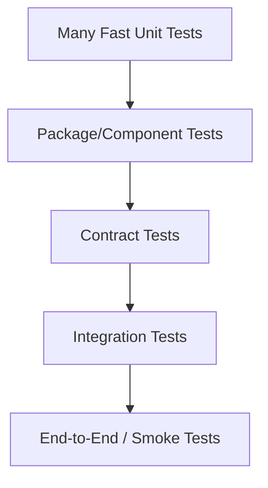

# learn-go-design-patterns-common-patterns-anti-patterns-part-032.md

# Part 032 — Testing Seam Pattern

## Status Seri

- Seri: **Go Design Patterns, Common Patterns, and Anti-Patterns**
- Part: **032 dari 035**
- Status seri: **belum selesai**
- Lanjutan dari:
  - Part 031 — Observability Pattern: Logs, Metrics, Traces, and Audit
- Setelah ini:
  - Part 033 — Codebase Architecture Pattern for Large Go Services

---

## Tujuan Part Ini

Di part ini kita membahas **Testing Seam Pattern**.

Testing seam adalah titik desain yang memungkinkan sebagian sistem diuji secara terkontrol tanpa harus menjalankan seluruh dunia nyata: database, network, clock, file system, queue, external API, random generator, runtime scheduler, environment variable, config store, dan sebagainya.

Seam yang baik bukan dibuat dengan mocking berlebihan. Seam yang baik muncul dari desain yang punya boundary jelas.

Target part ini:

- memahami testability sebagai hasil desain, bukan afterthought
- membedakan fake, mock, stub, spy, dummy, simulator
- menentukan kapan interface seam tepat
- menentukan kapan function seam lebih sederhana
- menentukan kapan concrete integration test lebih baik
- membangun contract test untuk adapter
- membangun repository/service/handler testing boundary
- menghindari over-mocking dan interface pollution
- membuat test yang tahan refactor
- membuat test untuk workflow, state machine, event, outbox, worker, cache, retry, dan observability
- memahami package test strategy (`package x` vs `package x_test`)
- membuat testing architecture yang cocok untuk codebase Go besar

Mental model utama:

> Testability bukan berarti semua dependency harus interface dan semua hal harus di-mock. Testability berarti behavior penting bisa diverifikasi pada boundary yang tepat dengan biaya dan risiko yang masuk akal.

---

## 1. Apa Itu Testing Seam?

Testing seam adalah titik di mana test bisa mengganti, mengontrol, atau mengobservasi dependency.

Contoh seam:

```go
type Clock interface {
    Now() time.Time
}
```

Dengan seam ini, production memakai real clock:

```go
type RealClock struct{}

func (RealClock) Now() time.Time {
    return time.Now()
}
```

Test memakai fake clock:

```go
type FakeClock struct {
    now time.Time
}

func (c *FakeClock) Now() time.Time {
    return c.now
}

func (c *FakeClock) Advance(d time.Duration) {
    c.now = c.now.Add(d)
}
```

Seam memungkinkan test untuk:

- mengontrol waktu
- menghindari sleep
- menguji expiry/timeout
- membuat test deterministic

Tanpa seam, test sering menjadi:

```go
time.Sleep(2 * time.Second)
```

Itu lambat dan flaky.

---

## 2. Seam Bukan Selalu Interface

Di Go, seam bisa berupa:

1. interface
2. function parameter
3. concrete test helper
4. package-level variable internal
5. adapter boundary
6. filesystem abstraction
7. temp directory
8. in-memory implementation
9. fake server
10. test database/container
11. clock object
12. random source
13. context cancellation
14. channel
15. hook/callback test point
16. build tag
17. dependency wiring/composition root

Contoh function seam:

```go
type TokenGenerator func() string

type SessionService struct {
    generateToken TokenGenerator
}
```

Test:

```go
svc := SessionService{
    generateToken: func() string {
        return "fixed-token"
    },
}
```

Tidak perlu interface.

Rule:

> Gunakan seam terkecil yang cukup untuk mengontrol behavior yang ingin diuji.

---

## 3. Java Testing Mindset vs Go Testing Mindset

### Java Mindset yang Sering Terbawa

Dalam Java/Spring codebase, testing sering bergantung pada:

- DI container
- mocking framework
- annotation test runner
- proxy
- reflection
- `@Mock`
- `@InjectMocks`
- `@SpringBootTest`
- layered mocks
- repository/service/controller mock chain

Akibatnya, banyak engineer membawa pola ini ke Go:

```go
type IUserRepository interface { ... }
type IUserService interface { ... }
type IUserValidator interface { ... }
type IUserMapper interface { ... }
type IUserFactory interface { ... }
```

Lalu semua dites dengan mock.

### Go Mindset

Go cenderung:

- test behavior lewat public API package
- gunakan small interface di sisi consumer
- gunakan fake sederhana
- gunakan table-driven test
- gunakan real implementation jika murah
- gunakan integration test untuk boundary penting
- hindari framework magic
- hindari mock untuk setiap function call
- gunakan temp dir, httptest, net/http test server, test DB jika perlu
- test state/result, bukan internal call sequence kecuali memang contract

Go testing bukan anti-mock. Go testing anti-mock-by-default.

---

## 4. Taxonomy: Dummy, Stub, Fake, Mock, Spy, Simulator

Istilah penting.

| Test Double | Makna |
|---|---|
| Dummy | object hanya untuk memenuhi parameter, tidak dipakai |
| Stub | mengembalikan jawaban tetap |
| Fake | implementasi ringan yang bekerja, biasanya in-memory |
| Mock | memverifikasi expected interaction/call |
| Spy | merekam call untuk diperiksa setelah test |
| Simulator | meniru behavior sistem eksternal lebih realistis |
| Fixture | data/setup untuk test |
| Harness | wrapper untuk menjalankan/mengobservasi sistem dalam test |

Contoh stub:

```go
type StubClock struct {
    NowValue time.Time
}

func (c StubClock) Now() time.Time {
    return c.NowValue
}
```

Contoh fake:

```go
type FakeCaseRepository struct {
    cases map[CaseID]Case
}

func NewFakeCaseRepository() *FakeCaseRepository {
    return &FakeCaseRepository{
        cases: make(map[CaseID]Case),
    }
}

func (r *FakeCaseRepository) FindByID(ctx context.Context, id CaseID) (Case, error) {
    c, ok := r.cases[id]
    if !ok {
        return Case{}, ErrNotFound
    }
    return c, nil
}

func (r *FakeCaseRepository) Save(ctx context.Context, c Case) error {
    r.cases[c.ID] = c
    return nil
}
```

Contoh spy:

```go
type SpyAuditWriter struct {
    Records []AuditRecord
}

func (w *SpyAuditWriter) Write(ctx context.Context, record AuditRecord) error {
    w.Records = append(w.Records, record)
    return nil
}
```

Contoh mock-like strict expectation:

```go
type MockNotifier struct {
    ExpectedCaseID CaseID
    Called         bool
}

func (m *MockNotifier) NotifyApproved(ctx context.Context, caseID CaseID) error {
    m.Called = true
    if caseID != m.ExpectedCaseID {
        return fmt.Errorf("unexpected case id: %s", caseID)
    }
    return nil
}
```

Use the right double for the question.

---

## 5. Testing Pyramid for Go Services

A useful shape:



### Unit Tests

- pure domain logic
- state transitions
- validation
- policies
- error classification
- small helpers
- deterministic behavior

### Package/Component Tests

- service with fake repository
- handler with fake service
- worker with fake queue
- repository helper with fake DB interface where appropriate
- cache behavior
- retry behavior

### Contract Tests

- ensure fake and real implementation obey same contract
- adapter contract
- repository contract
- external client contract against fake server
- event schema contract

### Integration Tests

- real database
- real filesystem
- real HTTP server/client
- real serialization
- transaction behavior
- migration compatibility
- outbox relay behavior

### E2E/Smoke

- critical path only
- expensive
- few
- not for exhaustive logic

Anti-pattern: inverted pyramid.

Too many slow E2E tests, too few unit/contract tests.

---

## 6. Table-Driven Test Pattern

Go favors table-driven tests.

Example validation:

```go
func TestValidateApproveCommand(t *testing.T) {
    tests := []struct {
        name    string
        cmd     ApproveCommand
        wantErr error
    }{
        {
            name: "valid",
            cmd: ApproveCommand{
                CaseID:  "CASE-1",
                ActorID: "USER-1",
            },
            wantErr: nil,
        },
        {
            name: "missing case id",
            cmd: ApproveCommand{
                ActorID: "USER-1",
            },
            wantErr: ErrMissingCaseID,
        },
        {
            name: "missing actor id",
            cmd: ApproveCommand{
                CaseID: "CASE-1",
            },
            wantErr: ErrMissingActorID,
        },
    }

    for _, tt := range tests {
        t.Run(tt.name, func(t *testing.T) {
            err := ValidateApproveCommand(tt.cmd)
            if !errors.Is(err, tt.wantErr) {
                t.Fatalf("got %v, want %v", err, tt.wantErr)
            }
        })
    }
}
```

Good table tests have:

- clear case name
- minimal fields
- expected output
- expected error
- subtests
- no hidden global state
- deterministic data

Bad table tests:

- huge table with unreadable setup
- expected value built by same logic as system under test
- no case name
- too many dimensions in one test
- modifies shared table values in parallel

---

## 7. Interface Seam Pattern

Use interface seam when the consumer needs behavior substitution.

Example:

```go
type CaseRepository interface {
    FindForApproval(context.Context, CaseID) (Case, error)
    SaveApproved(context.Context, Case, Version) error
}
```

Service:

```go
type ApproveCaseService struct {
    cases CaseRepository
    clock Clock
}
```

Test fake:

```go
type FakeCaseRepository struct {
    Case Case
    Saved []Case
    FindErr error
    SaveErr error
}

func (r *FakeCaseRepository) FindForApproval(ctx context.Context, id CaseID) (Case, error) {
    if r.FindErr != nil {
        return Case{}, r.FindErr
    }
    return r.Case, nil
}

func (r *FakeCaseRepository) SaveApproved(ctx context.Context, c Case, expected Version) error {
    if r.SaveErr != nil {
        return r.SaveErr
    }
    r.Saved = append(r.Saved, c)
    return nil
}
```

Test:

```go
func TestApproveCaseSavesApprovedCase(t *testing.T) {
    repo := &FakeCaseRepository{
        Case: NewPendingCase("CASE-1"),
    }

    svc := NewApproveCaseService(repo, FixedClock(time.Date(2026, 1, 1, 0, 0, 0, 0, time.UTC)))

    result, err := svc.Approve(context.Background(), ApproveCommand{
        CaseID:  "CASE-1",
        ActorID: "USER-1",
    })
    if err != nil {
        t.Fatal(err)
    }

    if result.Decision != DecisionApproved {
        t.Fatalf("decision = %s", result.Decision)
    }

    if len(repo.Saved) != 1 {
        t.Fatalf("saved count = %d", len(repo.Saved))
    }
}
```

### When Interface Seam Is Good

- external behavior varies
- dependency is slow/unreliable
- dependency crosses process boundary
- dependency has many failure modes to simulate
- dependency should be consumer-owned
- test needs observe interaction/result
- production has multiple implementations

### When Interface Seam Is Bad

- interface mirrors concrete type for no reason
- interface belongs to provider package prematurely
- interface exists only because mocking framework habit
- interface has 20 methods
- test asserts call sequence instead of outcome
- concrete dependency is cheap and deterministic

---

## 8. Function Seam Pattern

Function seam is simpler for one behavior.

Example:

```go
type PasswordResetService struct {
    token func() string
    send  func(context.Context, Email, string) error
}
```

Use:

```go
func (s *PasswordResetService) RequestReset(ctx context.Context, email Email) error {
    token := s.token()
    return s.send(ctx, email, token)
}
```

Test:

```go
func TestPasswordResetUsesGeneratedToken(t *testing.T) {
    var sentToken string

    svc := PasswordResetService{
        token: func() string {
            return "fixed-token"
        },
        send: func(ctx context.Context, email Email, token string) error {
            sentToken = token
            return nil
        },
    }

    err := svc.RequestReset(context.Background(), "a@example.com")
    if err != nil {
        t.Fatal(err)
    }

    if sentToken != "fixed-token" {
        t.Fatalf("sent token = %s", sentToken)
    }
}
```

Good for:

- clock-ish functions
- ID generation
- random generation
- one callback
- small transformation
- test hooks
- strategy with one method

Avoid if:

- behavior has multiple methods
- lifecycle needed
- stateful fake needed
- contract should be named
- dependency is important domain concept

---

## 9. Clock Seam

Time is one of the most important seams.

Bad:

```go
func (s *TokenService) Expired(token Token) bool {
    return time.Now().After(token.ExpiresAt)
}
```

Hard to test.

Better:

```go
type Clock interface {
    Now() time.Time
}

type RealClock struct{}

func (RealClock) Now() time.Time {
    return time.Now()
}
```

Use:

```go
type TokenService struct {
    clock Clock
}

func (s *TokenService) Expired(token Token) bool {
    return s.clock.Now().After(token.ExpiresAt)
}
```

Test:

```go
func TestTokenExpired(t *testing.T) {
    now := time.Date(2026, 1, 1, 12, 0, 0, 0, time.UTC)

    svc := TokenService{
        clock: FixedClock{Time: now},
    }

    token := Token{
        ExpiresAt: now.Add(-time.Second),
    }

    if !svc.Expired(token) {
        t.Fatal("expected token expired")
    }
}
```

Avoid real sleep in tests.

---

## 10. Randomness and ID Seam

Bad:

```go
func NewSession() Session {
    return Session{ID: uuid.NewString()}
}
```

Hard to test exact output.

Better:

```go
type IDGenerator interface {
    NewID() string
}
```

Or function:

```go
type IDGeneratorFunc func() string
```

Use:

```go
type SessionService struct {
    newID func() string
}
```

Test:

```go
svc := SessionService{
    newID: func() string { return "S-1" },
}
```

Rules:

- production randomness stays real
- test randomness deterministic
- ID generator failure modeled if real generator can fail
- do not assert exact random ID unless seam controls it

---

## 11. Environment and Config Seam

Bad:

```go
func NewClient() *Client {
    baseURL := os.Getenv("ADDRESS_API_URL")
    return &Client{baseURL: baseURL}
}
```

Hard to test and hides dependency.

Better:

```go
type ClientConfig struct {
    BaseURL string
}

func NewClient(cfg ClientConfig, httpClient *http.Client) (*Client, error) {
    if cfg.BaseURL == "" {
        return nil, errors.New("base url is required")
    }
    return &Client{baseURL: cfg.BaseURL, httpClient: httpClient}, nil
}
```

Testing config loading separately:

```go
func TestLoadConfigFromEnv(t *testing.T) {
    t.Setenv("ADDRESS_API_URL", "https://example.test")

    cfg, err := LoadConfigFromEnv()
    if err != nil {
        t.Fatal(err)
    }

    if cfg.Address.BaseURL != "https://example.test" {
        t.Fatal("unexpected base url")
    }
}
```

Rule:

- read env at boundary
- pass typed config inward
- use `t.Setenv` for env tests
- do not read env everywhere

---

## 12. Filesystem Seam

Often no interface is needed. Use temp directory.

```go
func TestWriteReport(t *testing.T) {
    dir := t.TempDir()

    path := filepath.Join(dir, "report.txt")

    err := WriteReport(path, Report{Title: "Daily"})
    if err != nil {
        t.Fatal(err)
    }

    b, err := os.ReadFile(path)
    if err != nil {
        t.Fatal(err)
    }

    if !strings.Contains(string(b), "Daily") {
        t.Fatal("missing title")
    }
}
```

Use real filesystem when:

- behavior is filesystem behavior
- temp dir is cheap
- no need to fake file semantics

Use interface seam when:

- code must support multiple storage backends
- filesystem is slow/remote
- failure injection needed
- path abstraction important
- read-only embedded FS

Go has `fs.FS` as useful seam for read-only filesystem-like access.

---

## 13. HTTP Client Seam

For outbound HTTP, often better to test with `httptest.Server` than mock every call.

Client:

```go
type AddressClient struct {
    baseURL string
    http    *http.Client
}

func NewAddressClient(baseURL string, httpClient *http.Client) *AddressClient {
    if httpClient == nil {
        httpClient = http.DefaultClient
    }
    return &AddressClient{baseURL: baseURL, http: httpClient}
}
```

Test:

```go
func TestAddressClientLookupPostal(t *testing.T) {
    server := httptest.NewServer(http.HandlerFunc(func(w http.ResponseWriter, r *http.Request) {
        if r.URL.Path != "/lookup" {
            t.Fatalf("unexpected path %s", r.URL.Path)
        }

        if r.URL.Query().Get("postal") != "123456" {
            t.Fatalf("unexpected postal")
        }

        w.Header().Set("Content-Type", "application/json")
        _, _ = w.Write([]byte(`{"street":"Main Street"}`))
    }))
    defer server.Close()

    client := NewAddressClient(server.URL, server.Client())

    address, err := client.LookupPostal(context.Background(), "123456")
    if err != nil {
        t.Fatal(err)
    }

    if address.Street != "Main Street" {
        t.Fatalf("street = %s", address.Street)
    }
}
```

This tests:

- URL construction
- headers
- query
- JSON decode
- status handling
- context integration
- real HTTP mechanics

Use interface fake at service layer, real `httptest.Server` at client adapter layer.

---

## 14. Handler Testing Seam

HTTP handler can be tested with `httptest`.

Service interface:

```go
type Approver interface {
    Approve(context.Context, ApproveCommand) (ApproveResult, error)
}
```

Fake service:

```go
type FakeApprover struct {
    Command ApproveCommand
    Result  ApproveResult
    Err     error
}

func (a *FakeApprover) Approve(ctx context.Context, cmd ApproveCommand) (ApproveResult, error) {
    a.Command = cmd
    return a.Result, a.Err
}
```

Test:

```go
func TestApproveHandler(t *testing.T) {
    approver := &FakeApprover{
        Result: ApproveResult{Decision: DecisionApproved},
    }

    handler := NewApproveHandler(approver)

    req := httptest.NewRequest(http.MethodPost, "/cases/CASE-1/approve", strings.NewReader(`{"comment":"ok"}`))
    rr := httptest.NewRecorder()

    handler.ServeHTTP(rr, req)

    if rr.Code != http.StatusOK {
        t.Fatalf("status = %d", rr.Code)
    }

    if approver.Command.CaseID != "CASE-1" {
        t.Fatalf("case id = %s", approver.Command.CaseID)
    }
}
```

Handler test should verify:

- request decoding
- path/query mapping
- status code
- response shape
- error mapping
- context propagation if important
- service called with command

Handler test should not verify service business logic.

---

## 15. Repository Testing Seam

Repository is often best tested with real database integration, not fake DB mocks.

Why?

- SQL syntax
- transaction behavior
- constraints
- isolation
- scanning nulls
- indexes
- migration compatibility
- driver behavior
- connection behavior
- error codes

Fake repository is useful for service tests.

Real repository integration test is useful for repository contract.

Pattern:

```go
func TestSQLCaseRepository_FindForApproval(t *testing.T) {
    db := OpenTestDB(t)
    ApplyMigrations(t, db)

    repo := NewSQLCaseRepository(db)

    InsertCase(t, db, CaseRow{
        ID: "CASE-1",
        State: "pending_approval",
    })

    c, err := repo.FindForApproval(context.Background(), "CASE-1")
    if err != nil {
        t.Fatal(err)
    }

    if c.ID != "CASE-1" {
        t.Fatalf("case id = %s", c.ID)
    }
}
```

Avoid mocking `*sql.DB` unless you are testing generated SQL in a narrow way. Many SQL mocks test your assumptions more than real behavior.

---

## 16. Contract Test Pattern

Contract test ensures multiple implementations obey same behavior.

Example repository contract:

```go
type CaseRepositoryContract struct {
    NewRepo func(t *testing.T) CaseRepository
    Seed    func(t *testing.T, repo CaseRepository, c Case)
}

func (c CaseRepositoryContract) TestFindMissing(t *testing.T) {
    repo := c.NewRepo(t)

    _, err := repo.FindForApproval(context.Background(), "MISSING")
    if !errors.Is(err, ErrNotFound) {
        t.Fatalf("expected ErrNotFound, got %v", err)
    }
}

func (c CaseRepositoryContract) TestSaveAndFind(t *testing.T) {
    repo := c.NewRepo(t)

    original := NewPendingCase("CASE-1")
    c.Seed(t, repo, original)

    found, err := repo.FindForApproval(context.Background(), "CASE-1")
    if err != nil {
        t.Fatal(err)
    }

    if found.ID != original.ID {
        t.Fatalf("id = %s", found.ID)
    }
}
```

Run contract against fake:

```go
func TestFakeCaseRepositoryContract(t *testing.T) {
    contract := CaseRepositoryContract{
        NewRepo: func(t *testing.T) CaseRepository {
            return NewFakeCaseRepository()
        },
        Seed: func(t *testing.T, repo CaseRepository, c Case) {
            repo.(*FakeCaseRepository).Seed(c)
        },
    }

    t.Run("find missing", contract.TestFindMissing)
    t.Run("save and find", contract.TestSaveAndFind)
}
```

Run contract against SQL:

```go
func TestSQLCaseRepositoryContract(t *testing.T) {
    contract := CaseRepositoryContract{
        NewRepo: func(t *testing.T) CaseRepository {
            db := OpenTestDB(t)
            ApplyMigrations(t, db)
            return NewSQLCaseRepository(db)
        },
        Seed: func(t *testing.T, repo CaseRepository, c Case) {
            InsertCase(t, ExtractDB(repo), c)
        },
    }

    t.Run("find missing", contract.TestFindMissing)
    t.Run("save and find", contract.TestSaveAndFind)
}
```

Contract test prevents fake from drifting away from real behavior.

---

## 17. External API Contract with Fake Server

For external API adapter, use fake server.

```go
type AddressAPIServer struct {
    Server *httptest.Server
    Calls  []string
}

func NewAddressAPIServer(t *testing.T) *AddressAPIServer {
    s := &AddressAPIServer{}

    s.Server = httptest.NewServer(http.HandlerFunc(func(w http.ResponseWriter, r *http.Request) {
        s.Calls = append(s.Calls, r.URL.String())

        switch r.URL.Query().Get("postal") {
        case "123456":
            w.Header().Set("Content-Type", "application/json")
            _, _ = w.Write([]byte(`{"street":"Main Street"}`))
        case "404000":
            http.Error(w, "not found", http.StatusNotFound)
        default:
            http.Error(w, "server error", http.StatusInternalServerError)
        }
    }))

    t.Cleanup(s.Server.Close)
    return s
}
```

Tests:

- success decode
- 404 mapping to `ErrNotFound`
- 500 mapping to dependency error
- timeout
- invalid JSON
- auth header
- retry behavior if wrapper included
- context cancellation

This is stronger than mocking `http.Client.Do`.

---

## 18. Fake vs Mock: Outcome vs Interaction

Prefer outcome-based test when possible.

Outcome test:

```go
result, err := svc.Approve(ctx, cmd)
if result.Decision != DecisionApproved { ... }
if repo.SavedState("CASE-1") != StateApproved { ... }
```

Interaction test:

```go
if !repo.SaveCalled {
    t.Fatal("expected Save called")
}
```

Interaction test is useful when interaction is the behavior:

- notifier called
- audit written
- event emitted
- transaction committed
- retry attempted exactly N times
- cache bypassed on hit
- external call not made on validation failure

But if interaction is implementation detail, avoid it.

Bad:

```go
expect(repo.FindByID).Once()
expect(policy.Evaluate).Once()
expect(repo.Save).Once()
```

This makes refactoring painful.

Better:

- assert final state/result/event/audit
- assert critical side effects only

---

## 19. State Machine Testing Pattern

State machine should have table tests.

```go
func TestCaseTransitions(t *testing.T) {
    tests := []struct {
        name    string
        from    CaseState
        command Command
        want    CaseState
        wantErr error
    }{
        {
            name:    "pending approve becomes approved",
            from:    StatePendingApproval,
            command: CommandApprove,
            want:    StateApproved,
        },
        {
            name:    "closed cannot approve",
            from:    StateClosed,
            command: CommandApprove,
            wantErr: ErrIllegalTransition,
        },
    }

    for _, tt := range tests {
        t.Run(tt.name, func(t *testing.T) {
            c := Case{State: tt.from}

            err := c.Apply(tt.command)

            if !errors.Is(err, tt.wantErr) {
                t.Fatalf("error = %v, want %v", err, tt.wantErr)
            }

            if tt.wantErr == nil && c.State != tt.want {
                t.Fatalf("state = %s, want %s", c.State, tt.want)
            }
        })
    }
}
```

Also test:

- idempotency
- audit record generation
- transition event
- guard reasons
- illegal transition
- terminal states
- correction/reversal if supported

---

## 20. Policy and Decision Testing Pattern

Policy test should assert decision reasons, not just bool.

```go
func TestApprovalPolicyRejectsWrongState(t *testing.T) {
    policy := NewApprovalPolicy()

    decision := policy.EvaluateApproval(context.Background(), ApprovalInput{
        Case: Case{
            State: StateDraft,
        },
        ActorID: "USER-1",
    })

    if decision.Allowed {
        t.Fatal("expected rejected")
    }

    if !HasReason(decision.Reasons, "invalid_state") {
        t.Fatalf("missing invalid_state reason: %#v", decision.Reasons)
    }
}
```

For compliance-sensitive system, test:

- reason code
- severity
- evidence
- policy version
- multiple reasons accumulation
- fail-fast vs collect-all behavior
- boundary cases
- dates/time with fake clock

---

## 21. Event and Outbox Testing Pattern

Service test should assert event created.

```go
type SpyOutbox struct {
    Events []OutboxEvent
}

func (o *SpyOutbox) Add(ctx context.Context, event OutboxEvent) error {
    o.Events = append(o.Events, event)
    return nil
}
```

Test:

```go
func TestApproveEmitsCaseApprovedEvent(t *testing.T) {
    outbox := &SpyOutbox{}
    svc := NewApproveService(repo, policy, outbox, clock)

    _, err := svc.Approve(ctx, ApproveCommand{CaseID: "CASE-1"})
    if err != nil {
        t.Fatal(err)
    }

    if len(outbox.Events) != 1 {
        t.Fatalf("events = %d", len(outbox.Events))
    }

    event := outbox.Events[0]
    if event.Type != "case.approved" {
        t.Fatalf("event type = %s", event.Type)
    }
}
```

Integration test should assert:

- event and state saved in same transaction
- rollback removes event
- event version/payload valid
- relay publishes and marks done
- duplicate publish safe
- consumer idempotent

---

## 22. Retry Testing Pattern

Retry tests need fake operation and fake clock/timer when possible.

Simple version:

```go
func TestRetryStopsAfterSuccess(t *testing.T) {
    attempts := 0

    result, err := Retry(context.Background(), RetryPolicy{
        MaxAttempts: 3,
        Delay: func(int) time.Duration { return 0 },
    }, func(ctx context.Context, attempt int) (string, error) {
        attempts++
        if attempts < 2 {
            return "", ErrTemporary
        }
        return "ok", nil
    })

    if err != nil {
        t.Fatal(err)
    }
    if result != "ok" {
        t.Fatalf("result = %s", result)
    }
    if attempts != 2 {
        t.Fatalf("attempts = %d", attempts)
    }
}
```

Test cases:

- no retry on success
- retry temporary error
- stop on non-retryable error
- stop at max attempts
- context cancellation stops retry
- final error wraps last error
- delay function called expected times

Avoid real long sleeps.

---

## 23. Cache Testing Pattern

Cache tests should cover semantics.

```go
func TestCacheHitBypassesSource(t *testing.T) {
    sourceCalls := 0

    cache := NewMemoryCache[string, Address]()
    cache.Set("postal:123456", Address{Street: "Cached"}, time.Hour)

    client := CachedAddressClient{
        cache: cache,
        next: AddressClientFunc(func(ctx context.Context, postal string) (Address, error) {
            sourceCalls++
            return Address{}, nil
        }),
    }

    address, err := client.LookupPostal(context.Background(), "123456")
    if err != nil {
        t.Fatal(err)
    }

    if address.Street != "Cached" {
        t.Fatalf("street = %s", address.Street)
    }
    if sourceCalls != 0 {
        t.Fatalf("source calls = %d", sourceCalls)
    }
}
```

Test:

- hit
- miss
- TTL expiry with fake clock
- negative cache
- transient errors not cached
- key normalization
- mutable value copy
- stampede protection
- context cancellation

---

## 24. Worker Testing Pattern

Worker tests are prone to flakiness.

Avoid arbitrary sleep.

Bad:

```go
go worker.Run(ctx)
time.Sleep(100 * time.Millisecond)
```

Better with hooks/channels.

```go
processed := make(chan Job, 1)

worker := Worker{
    Handler: JobHandlerFunc(func(ctx context.Context, job Job) error {
        processed <- job
        return nil
    }),
}
```

Test:

```go
select {
case job := <-processed:
    if job.ID != "JOB-1" {
        t.Fatalf("job id = %s", job.ID)
    }
case <-time.After(time.Second):
    t.Fatal("timeout waiting for job")
}
```

Use timeout in tests to avoid hanging forever, but do not rely on sleep for correctness.

Test:

- graceful shutdown
- context cancellation
- retry
- dead-letter
- ack/nack
- lease expiry
- poison message
- concurrency limit
- panic recovery if supported

---

## 25. Observability Testing Pattern

Do not test every log string. Test important observability contracts.

### Testing Logs

Use a handler that captures records.

```go
type CapturingHandler struct {
    Records []slog.Record
}

func (h *CapturingHandler) Enabled(context.Context, slog.Level) bool {
    return true
}

func (h *CapturingHandler) Handle(ctx context.Context, r slog.Record) error {
    h.Records = append(h.Records, r.Clone())
    return nil
}

func (h *CapturingHandler) WithAttrs(attrs []slog.Attr) slog.Handler {
    return h
}

func (h *CapturingHandler) WithGroup(name string) slog.Handler {
    return h
}
```

Assert important fields:

- operation
- outcome
- error_class
- no sensitive data
- correlation ID if handler injects it

Avoid brittle assertion on full rendered log line.

### Testing Metrics

Use fake meter:

```go
type RecordedMetric struct {
    Name   string
    Labels map[string]string
}

type FakeMeter struct {
    Counts []RecordedMetric
}

func (m *FakeMeter) Increment(ctx context.Context, name string, labels ...string) {
    m.Counts = append(m.Counts, RecordedMetric{
        Name: name,
        Labels: LabelsFromPairs(labels...),
    })
}
```

Assert bounded labels and outcome.

### Testing Audit

Audit is behavior, not optional observability. Test it explicitly.

---

## 26. Package Test Strategy: `package x` vs `package x_test`

### Same Package Test

```go
package approval
```

Can access unexported identifiers.

Use for:

- internal invariants
- unexported helpers
- complex edge cases
- white-box tests
- state machine internals

### External Package Test

```go
package approval_test
```

Only sees exported API.

Use for:

- public API behavior
- package contract
- documentation-like examples
- avoiding coupling to internals

Heuristic:

- domain core: mix both if needed
- public library: external tests important
- application internal packages: same-package tests acceptable
- if tests require too much private access, maybe API or design boundary needs review

---

## 27. Test Data Builder Pattern

For complex domain objects, test builders help.

Bad:

```go
caseObj := Case{
    ID: "CASE-1",
    State: StatePendingApproval,
    Version: 3,
    Applicant: Applicant{
        Name: "A",
        Address: Address{
            Postal: "123456",
        },
    },
    ...
}
```

Repeated everywhere.

Builder:

```go
type CaseBuilder struct {
    c Case
}

func NewCaseBuilder() CaseBuilder {
    return CaseBuilder{
        c: Case{
            ID:      "CASE-1",
            State:   StatePendingApproval,
            Version: 1,
        },
    }
}

func (b CaseBuilder) WithState(state CaseState) CaseBuilder {
    b.c.State = state
    return b
}

func (b CaseBuilder) WithVersion(v Version) CaseBuilder {
    b.c.Version = v
    return b
}

func (b CaseBuilder) Build() Case {
    return b.c
}
```

Usage:

```go
c := NewCaseBuilder().
    WithState(StateClosed).
    Build()
```

Builder should:

- have valid defaults
- keep test intent clear
- not hide important setup
- live in test package/internal test helper
- avoid becoming production domain builder unless needed

---

## 28. Golden Test Pattern

Golden tests compare output to stored expected file.

Good for:

- generated JSON
- rendered templates
- CLI output
- serialized schema
- documentation snippets
- report output

Example:

```go
func TestRenderReportGolden(t *testing.T) {
    got := RenderReport(Report{Title: "Daily"})

    golden := filepath.Join("testdata", "daily_report.golden")
    want, err := os.ReadFile(golden)
    if err != nil {
        t.Fatal(err)
    }

    if diff := cmpDiff(string(want), got); diff != "" {
        t.Fatalf("report mismatch (-want +got):\n%s", diff)
    }
}
```

Cautions:

- golden files can ossify bad output
- update process must be deliberate
- avoid huge unreadable golden files
- normalize timestamps/IDs
- keep format deterministic
- review golden diffs carefully

Use `testdata` directory.

---

## 29. Fuzz Testing Seam

Go supports fuzz testing. Useful for:

- parsers
- decoders
- validators
- state transition input
- serialization round trip
- string processing
- security-sensitive input
- normalization

Example:

```go
func FuzzNormalizePostalCode(f *testing.F) {
    f.Add("123456")
    f.Add(" 123456 ")
    f.Add("abc")

    f.Fuzz(func(t *testing.T, input string) {
        normalized, err := NormalizePostalCode(input)
        if err == nil && len(normalized) != 6 {
            t.Fatalf("normalized length = %d", len(normalized))
        }
    })
}
```

Fuzz tests need invariants.

Examples:

- parser never panics
- normalized output valid
- marshal/unmarshal roundtrip
- invalid input returns error not panic
- state machine never reaches impossible state

---

## 30. Property-Like Testing

Even without fuzz, define properties.

For state machine:

- terminal state cannot transition
- approve cannot move backwards
- every successful transition emits event
- every rejected decision has reason
- version increments on mutation
- invalid transition does not mutate state

Example:

```go
func TestInvalidTransitionDoesNotMutate(t *testing.T) {
    states := []CaseState{
        StateDraft,
        StateClosed,
        StateApproved,
    }

    for _, state := range states {
        t.Run(string(state), func(t *testing.T) {
            c := NewCaseBuilder().WithState(state).Build()
            before := c

            err := c.Approve("USER-1")

            if err == nil && state != StatePendingApproval {
                t.Fatal("expected error")
            }

            if err != nil && !reflect.DeepEqual(c, before) {
                t.Fatal("case mutated on failed transition")
            }
        })
    }
}
```

Properties often catch bugs better than example tests.

---

## 31. Snapshot Testing vs Golden Testing

Snapshot testing often means “record output and compare later.” Golden test is a form of snapshot.

Danger:

- developer blindly updates snapshots
- tests assert incidental structure
- output change requires large diff
- brittle to harmless formatting

Use snapshot/golden for stable public output, not internal objects that change often.

---

## 32. Testing Concurrency

Concurrency tests are hard. Avoid relying on timing.

Prefer:

- controlled channels
- barriers
- context cancellation
- fake clock/timer
- wait groups
- race detector
- deterministic worker inputs
- explicit hooks

Example barrier:

```go
started := make(chan struct{})
release := make(chan struct{})

worker := func() {
    close(started)
    <-release
    // continue
}

go worker()

<-started
// assert worker is waiting
close(release)
```

Run race detector regularly:

```bash
go test -race ./...
```

Test concurrency invariants:

- no goroutine leak
- no data race
- cancellation exits
- channel closed by owner
- no send on closed channel
- bounded worker count
- ordering if required
- duplicate suppression works

---

## 33. Testing Context Cancellation

Context is part of contract.

Example:

```go
func TestClientRespectsCanceledContext(t *testing.T) {
    ctx, cancel := context.WithCancel(context.Background())
    cancel()

    _, err := client.LookupPostal(ctx, "123456")

    if !errors.Is(err, context.Canceled) {
        t.Fatalf("expected context.Canceled, got %v", err)
    }
}
```

For blocking fake:

```go
type BlockingClient struct {
    started chan struct{}
}

func (c BlockingClient) Call(ctx context.Context) error {
    close(c.started)
    <-ctx.Done()
    return ctx.Err()
}
```

Test:

```go
ctx, cancel := context.WithCancel(context.Background())
started := make(chan struct{})

client := BlockingClient{started: started}

errCh := make(chan error, 1)
go func() {
    errCh <- client.Call(ctx)
}()

<-started
cancel()

select {
case err := <-errCh:
    if !errors.Is(err, context.Canceled) {
        t.Fatalf("err = %v", err)
    }
case <-time.After(time.Second):
    t.Fatal("timeout")
}
```

---

## 34. Integration Test Boundary

Integration tests are valuable but expensive.

Use integration tests for:

- SQL repository
- transaction rollback
- DB constraints
- migration
- external API adapter with fake server
- file format compatibility
- outbox relay
- message serialization
- HTTP routing
- auth middleware
- concurrency with real locks if needed

Keep them:

- deterministic
- isolated
- cleanup after run
- not dependent on shared external state
- clearly marked if slow
- runnable in CI where possible

Common pattern:

```go
func TestIntegrationSQLCaseRepository(t *testing.T) {
    if testing.Short() {
        t.Skip("skip integration test in short mode")
    }

    db := OpenTestDB(t)
    ApplyMigrations(t, db)

    ...
}
```

But avoid making all important tests skipped by default.

---

## 35. Anti-Pattern Catalog

### Anti-Pattern 1: Interface for Every Struct

```go
type UserService interface { ... }
type userService struct { ... }
```

Created only for mocks.

Fix:

- define interface at consumer side
- use concrete type if no substitution needed
- use function seam for small dependency

### Anti-Pattern 2: Mocking Everything

Symptoms:

- tests assert call order
- refactor breaks tests without behavior change
- fake behavior does not match real dependency
- low confidence

Fix:

- test outcomes
- use fake for stateful dependency
- use integration test for adapters
- use contract tests

### Anti-Pattern 3: Testing Implementation Detail

Bad:

```go
expect(repo.FindByID).Once()
expect(repo.Save).Once()
```

when behavior is “case becomes approved”.

Fix:

```go
assert case state approved
assert event emitted
assert audit written
```

### Anti-Pattern 4: Real Sleep in Tests

Bad:

```go
time.Sleep(time.Second)
```

Fix:

- fake clock
- channel synchronization
- context cancellation
- polling with timeout only as last resort

### Anti-Pattern 5: Shared Mutable Test State

Bad:

```go
var repo = NewFakeRepo()
```

Tests affect each other.

Fix:

- create fresh per test
- use `t.Cleanup`
- avoid globals

### Anti-Pattern 6: Test Depends on Map Iteration Order

Fix:

- sort before compare
- compare as set
- use deterministic output

### Anti-Pattern 7: Fake That Lies

Fake repository does not enforce same constraints as SQL.

Fix:

- contract tests
- make fake enforce important constraints
- add integration tests

### Anti-Pattern 8: Overly Generic Test Helper

Test helper hides important setup.

Fix:

- keep setup visible
- builder with valid defaults
- override only relevant fields

### Anti-Pattern 9: No Error Path Tests

Only happy path tested.

Fix:

- table tests for error classes
- dependency failures
- context cancellation
- transaction rollback
- invalid input
- authorization failure

### Anti-Pattern 10: Golden Files Updated Blindly

Fix:

- review diffs
- keep golden readable
- normalize nondeterminism

### Anti-Pattern 11: Flaky External Dependency

Test calls real external API.

Fix:

- fake server
- contract fixture
- controlled sandbox only in explicit integration suite

### Anti-Pattern 12: Test Knows Too Much About SQL Implementation

If service test asserts query count/order, it's too coupled.

Fix:

- repository integration tests for SQL
- service tests use repository contract/fake

---

## 36. Production Example: Approval Service Test Suite

### Domain State Machine Tests

- valid transitions
- invalid transitions
- terminal state
- idempotency
- event generation

### Policy Tests

- approve allowed
- missing permission rejected
- wrong state rejected
- conflict-of-interest rejected
- multiple reasons accumulated
- policy version present

### Service Tests With Fakes

- approval saves state
- rejection does not save mutation
- audit written
- outbox event emitted
- repository error returned
- audit failure policy
- context cancellation
- optimistic conflict

### Repository Integration Tests

- find for approval
- save approved increments version
- optimistic conflict returns `ErrConflict`
- not found maps to `ErrNotFound`
- transaction rollback
- null scanning

### Handler Tests

- valid request maps to command
- invalid JSON returns 400
- forbidden maps 403
- conflict maps 409
- technical error maps 500
- response shape

### Outbox Relay Tests

- publishes event
- marks published
- retry on transient error
- dead-letter after max retry
- preserves correlation ID
- idempotent publish

### Observability Tests

- metric outcome labels
- audit fields
- no sensitive comment in logs
- error class recorded

This layered suite gives high confidence without requiring full E2E for every scenario.

---

## 37. Refactoring Playbook

### 37.1 From Mock-Heavy Service Test to Fake Repository

Before:

```go
mockRepo.EXPECT().FindByID(ctx, id).Return(caseObj, nil)
mockPolicy.EXPECT().Evaluate(...).Return(allowed)
mockRepo.EXPECT().Save(ctx, approvedCase).Return(nil)
```

After:

```go
repo := NewFakeCaseRepository()
repo.Seed(NewPendingCase("CASE-1"))

svc := NewApproveService(repo, policy, outbox, audit, clock)

result, err := svc.Approve(ctx, cmd)

assert result approved
assert repo case state approved
assert outbox has CaseApproved
```

### 37.2 From Real Sleep to Fake Clock

Before:

```go
cache.Set("k", v, time.Second)
time.Sleep(2 * time.Second)
_, ok := cache.Get("k")
```

After:

```go
clock := NewFakeClock(now)
cache := NewCache(clock)

cache.Set("k", v, time.Second)
clock.Advance(2 * time.Second)

_, ok := cache.Get("k")
```

### 37.3 From Provider-Owned Interface to Consumer-Owned Interface

Before:

```go
package repository

type CaseRepository interface { ... }
```

Used everywhere.

After:

```go
package approval

type CaseReader interface {
    FindForApproval(context.Context, CaseID) (Case, error)
}
```

SQL package exports concrete:

```go
type SQLCaseRepository struct { ... }
```

### 37.4 From Fake Drift to Contract Test

Before:

- fake repository behavior differs from SQL

After:

- shared contract test for fake and SQL
- fake enforces important constraints

### 37.5 From E2E-Only to Layered Tests

Before:

- every scenario boots full app and DB

After:

- domain/policy unit tests
- service fake tests
- repository integration tests
- few E2E smoke tests

---

## 38. Test Review Checklist

### Design

- Is seam at the right boundary?
- Is interface consumer-owned?
- Is function seam sufficient?
- Is real implementation cheap enough to use?
- Is fake behavior faithful?

### Behavior

- Does test assert behavior, not implementation detail?
- Are error paths covered?
- Is context cancellation tested?
- Are side effects verified where important?
- Is audit/event behavior tested?

### Determinism

- No real sleeps?
- No dependence on current time?
- No random values without seam?
- No map order dependency?
- No shared mutable state?
- No real external API?

### Maintainability

- Are test names clear?
- Are table cases readable?
- Are builders not hiding intent?
- Are golden files reviewed?
- Are mocks not over-specific?

### Coverage Quality

- State transitions?
- Policy decisions?
- Repository constraints?
- Transaction rollback?
- Outbox behavior?
- Worker retry/dead-letter?
- Observability contracts?
- Security/authorization failures?

---

## 39. Practical Heuristics

1. Test behavior, not structure.
2. Put interface at consumer side.
3. Use fake for stateful dependencies.
4. Use stub for fixed response.
5. Use spy for side effect capture.
6. Use mock only when interaction itself is contract.
7. Use real filesystem with `t.TempDir`.
8. Use `httptest.Server` for HTTP clients.
9. Use real DB integration for repository semantics.
10. Use contract tests to keep fake honest.
11. Use fake clock instead of sleep.
12. Use table tests for state/policy/validation.
13. Use fuzz for parsers/normalizers.
14. Keep test data builders valid by default.
15. Avoid global state.
16. Run race detector for concurrency-sensitive code.
17. Make observability/audit testable if it is a requirement.
18. Avoid giant test frameworks before duplication is real.
19. Prefer clear boring tests.
20. Test boundaries where failure modes actually happen.

---

## 40. Exercises

### Exercise 1: Clock Seam

Refactor this:

```go
func Expired(exp time.Time) bool {
    return time.Now().After(exp)
}
```

Into a testable design using `Clock`.

Write tests for:

- expired
- not expired
- exactly equal boundary

### Exercise 2: Fake Repository Contract

Create a repository contract for:

```go
type UserRepository interface {
    FindByEmail(context.Context, Email) (User, error)
    Save(context.Context, User) error
}
```

Run the same contract against:

- fake repository
- SQL repository

### Exercise 3: Handler Test

Create HTTP handler test for `POST /cases/{id}/approve`.

Verify:

- invalid JSON returns 400
- service conflict maps 409
- success returns 200
- command contains case ID from path

### Exercise 4: Retry Test

Implement retry test that verifies:

- max 3 attempts
- no retry on validation error
- context cancellation stops retry

### Exercise 5: Audit Spy

Create `SpyAuditWriter`.

Test that case approval writes audit with:

- actor ID
- action
- object ID
- before state
- after state
- outcome

---

## 41. Ringkasan

Testing seam adalah pola desain untuk membuat behavior penting bisa diuji secara deterministic dan murah.

Seam tidak selalu interface. Seam bisa berupa:

- interface
- function
- fake implementation
- fake server
- temp directory
- fake clock
- contract test
- test hook
- composition root

Testing yang baik di Go:

- lebih banyak outcome-based daripada interaction-based
- memakai small interface di sisi consumer
- memakai fake sederhana
- memakai integration test untuk adapter penting
- memakai contract test untuk menjaga fake tetap jujur
- menghindari sleep dan global state
- menguji error path, cancellation, audit, event, transaction, dan worker behavior
- menjaga test tetap readable dan refactor-friendly

Mental model utama:

> Jangan desain code agar mudah di-mock. Desain code agar boundary behavior jelas. Dari boundary yang jelas, test seam yang sehat akan muncul.

---

## 42. Koneksi ke Part Berikutnya

Part berikutnya:

# Part 033 — Codebase Architecture Pattern for Large Go Services

Kita akan membahas bagaimana menyusun codebase Go besar:

- package layout
- vertical slice vs layered package
- `cmd`, `internal`, `pkg`
- domain/application/adapter/platform boundary
- import graph sebagai arsitektur aktual
- shared library risk
- multi-module consideration
- migration strategy
- anti-pattern mega common package, micro-package fragmentation, dan architecture diagram yang tidak cocok dengan import graph


<!-- NAVIGATION_FOOTER -->
<div class="page-nav">
<a href="./learn-go-design-patterns-common-patterns-anti-patterns-part-031.md">⬅️ Part 031 — Observability Pattern: Logs, Metrics, Traces, and Audit</a>
<a href="./index.md">📚 Kategori</a>
<a href="../../index.md">🏠 Home</a>
<a href="./learn-go-design-patterns-common-patterns-anti-patterns-part-033.md">Part 033 — Codebase Architecture Pattern for Large Go Services ➡️</a>
</div>
