# learn-go-design-patterns-common-patterns-anti-patterns-part-033.md

# Part 033 — Codebase Architecture Pattern for Large Go Services

## Status Seri

- Seri: **Go Design Patterns, Common Patterns, and Anti-Patterns**
- Part: **033 dari 035**
- Status seri: **belum selesai**
- Lanjutan dari:
  - Part 032 — Testing Seam Pattern
- Setelah ini:
  - Part 034 — Anti-Pattern Catalog and Refactoring Playbook

---

## Tujuan Part Ini

Di part ini kita membahas **arsitektur codebase Go besar**.

Bukan arsitektur sebagai gambar indah di slide, tetapi arsitektur sebagai sesuatu yang benar-benar dikompilasi oleh Go compiler:

- package boundary
- import graph
- exported API
- internal package
- command wiring
- dependency direction
- test boundary
- shared library boundary
- module boundary
- ownership boundary
- migration boundary

Di Go, arsitektur aktual sebuah codebase bukan terutama “layer diagram”, tetapi:

> Siapa meng-import siapa, siapa mengekspos apa, dan siapa boleh berubah tanpa merusak siapa.

Jika diagram mengatakan domain tidak bergantung ke infra, tetapi import graph menunjukkan domain meng-import SQL package, maka import graph yang benar. Diagram hanya aspirasi.

Target part ini:

- memahami package layout untuk service besar
- membandingkan vertical slice vs layered package
- memahami `cmd`, `internal`, dan `pkg`
- mendesain domain/application/adapter/platform boundary tanpa ceremony berlebihan
- menghindari `common`, `utils`, `models`, `services`, dan mega shared library
- mengelola import graph sebagai arsitektur
- memahami multi-module trade-off
- membuat migration strategy tanpa big-bang rewrite
- menyusun codebase agar testable, operable, dan evolvable

---

## 1. Mental Model: Codebase Architecture Is Import Graph

Go architecture dapat dibaca dari import graph.

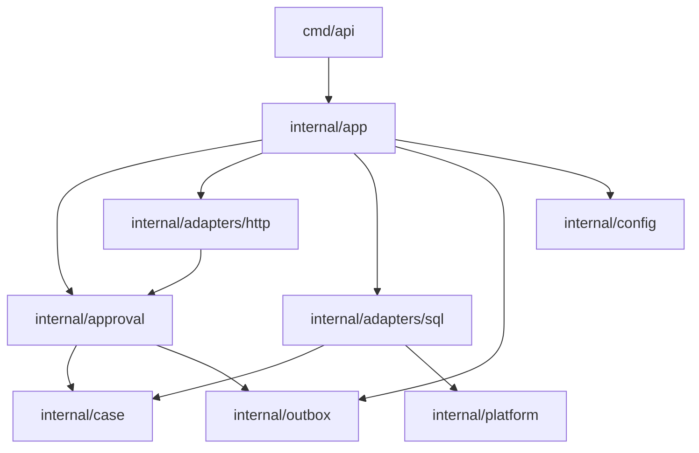

Arsitektur yang sehat:

- dependency direction jelas
- domain/application tidak bergantung ke transport framework
- adapter bergantung ke use case/domain, bukan sebaliknya
- platform package tidak tahu business domain
- wiring berada di composition root
- shared package kecil dan stabil
- tidak ada import cycle
- API surface kecil

Arsitektur yang buruk:

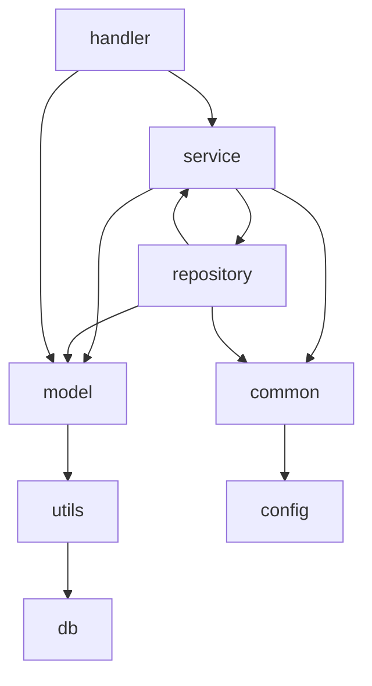

Symptoms:

- package cycle
- `common` imports half the app
- `model` depends on DB/JSON/framework
- repository calls service
- business logic everywhere
- tests need whole app
- small change breaks unrelated packages

---

## 2. Go Package Is a Design Boundary

Dalam Go, package bukan folder kosmetik. Package adalah:

- namespace
- compilation unit
- visibility boundary
- dependency boundary
- testing boundary
- documentation boundary
- ownership boundary

Package harus menjawab:

- apa tanggung jawab package ini?
- siapa consumer-nya?
- apa exported API-nya?
- apa yang sengaja disembunyikan?
- dependency apa yang diizinkan?
- apakah package ini business/domain/adapter/platform?
- apakah package ini stabil atau experimental?
- apakah package ini bisa dites mandiri?

Jika kamu tidak bisa menjelaskan package dalam satu kalimat, package itu mungkin tidak cohesive.

Contoh package description:

```go
// Package approval implements case approval use cases and policies.
package approval
```

Bad:

```go
// Package common contains common stuff.
package common
```

---

## 3. Common Layout Terms: `cmd`, `internal`, `pkg`

Go tidak memaksa satu layout, tetapi ada convention yang sering dipakai.

### `cmd`

Berisi executable entry points.

```text
cmd/
  api/
    main.go
  worker/
    main.go
  migrate/
    main.go
```

Rules:

- `cmd/.../main.go` harus tipis
- tidak berisi business logic
- memanggil app wiring
- parse config/flags
- start server/worker
- handle shutdown

Example:

```go
package main

func main() {
    ctx := context.Background()

    app, err := app.New(ctx)
    if err != nil {
        log.Fatal(err)
    }

    if err := app.Run(ctx); err != nil {
        log.Fatal(err)
    }
}
```

### `internal`

Package yang hanya bisa di-import oleh parent tree. Cocok untuk application code yang tidak ingin diekspos sebagai library publik.

```text
internal/
  approval/
  case/
  adapters/
  platform/
  config/
```

Use `internal` liberally for application code.

### `pkg`

Sering dipakai untuk package yang sengaja reusable oleh module lain.

```text
pkg/
  retry/
  idempotency/
  pagination/
```

Caution:

- jangan taruh semua di `pkg`
- `pkg` berarti kamu siap menjaga API
- kalau hanya internal app, pakai `internal`

Rule:

> Default ke `internal`. Pindah ke `pkg` hanya jika ada consumer eksternal nyata dan API cukup stabil.

---

## 4. Minimal Service Layout

Untuk service kecil-menengah:

```text
myservice/
  go.mod
  cmd/
    api/
      main.go
    worker/
      main.go
  internal/
    app/
      app.go
      wire.go
    config/
      config.go
    approval/
      service.go
      policy.go
      command.go
      result.go
      errors.go
    case/
      case.go
      state.go
      transition.go
    adapters/
      http/
        approval_handler.go
        routes.go
      sql/
        case_repository.go
        outbox_repository.go
      external/
        address_client.go
    outbox/
      relay.go
      event.go
    platform/
      logging/
      metrics/
      database/
      httpserver/
```

This is not a universal template. It is a starting shape.

Key ideas:

- `cmd` starts binaries
- `internal/app` wires dependencies
- business packages are named by domain/use case
- adapters are separated
- platform packages are technical helpers
- no global `models`
- no global `services`
- no generic `common`

---

## 5. Composition Root Pattern

Composition root is where object graph is built.

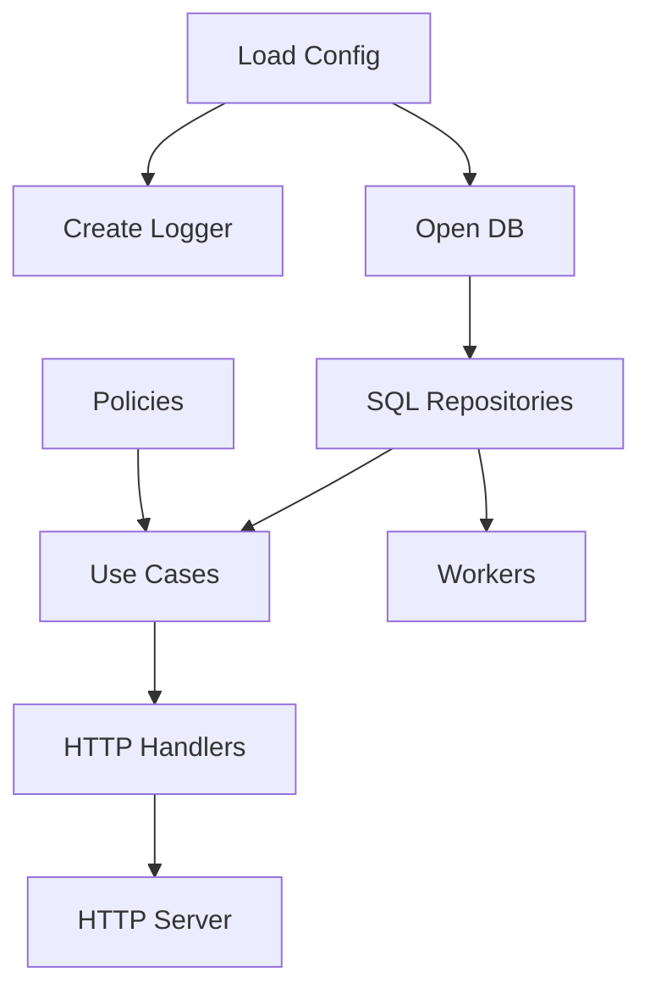

Composition root should be explicit.

```go
package app

type App struct {
    server *http.Server
    relay  *outbox.Relay
    db     *sql.DB
    logger *slog.Logger
}

func New(ctx context.Context, cfg config.Config) (*App, error) {
    logger := logging.New(cfg.Logging)

    db, err := database.Open(ctx, cfg.Database)
    if err != nil {
        return nil, err
    }

    caseRepo := sqladapter.NewCaseRepository(db)
    outboxRepo := sqladapter.NewOutboxRepository(db)

    approvalPolicy := approval.NewPolicy()
    approver := approval.NewService(caseRepo, approvalPolicy, outboxRepo, systemClock{})

    handler := httpadapter.NewApprovalHandler(approver)
    router := httpadapter.NewRouter(handler)

    server := httpserver.New(cfg.HTTP, router)

    relay := outbox.NewRelay(outboxRepo, publisher, logger)

    return &App{
        server: server,
        relay:  relay,
        db:     db,
        logger: logger,
    }, nil
}
```

This wiring is architecture documentation.

Anti-pattern:

- hidden dependency in package variable
- service locator
- global registry
- `init()` builds graph
- DI container hides graph for no strong reason

---

## 6. Layered Architecture

Classic layered:

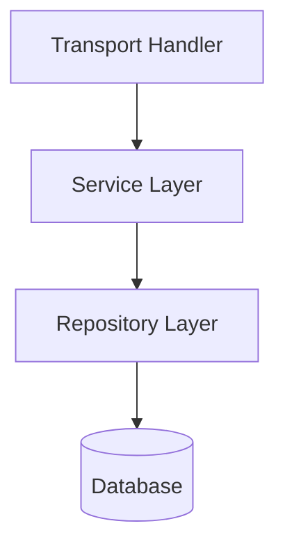

Go package layout:

```text
internal/
  handler/
  service/
  repository/
  model/
```

This is common, but often becomes weak.

Problems:

- packages grouped by technical role, not business cohesion
- `service` becomes huge
- `repository` becomes huge
- `model` becomes dumping ground
- unrelated domains share packages
- changes touch many packages
- import graph becomes broad
- names become generic

Layered architecture is not wrong. But package-by-layer often weakens cohesion for large apps.

---

## 7. Vertical Slice Architecture

Vertical slice groups by business capability.

```text
internal/
  approval/
    command.go
    service.go
    policy.go
    repository.go
    handler.go
  renewal/
    command.go
    service.go
    policy.go
    repository.go
    handler.go
  appeal/
    command.go
    service.go
    policy.go
    repository.go
    handler.go
```

This improves cohesion, but can mix adapter/business if not careful.

A better vertical slice variant:

```text
internal/
  approval/
    command.go
    result.go
    service.go
    policy.go
    ports.go
  adapters/
    http/
      approval_handler.go
    sql/
      approval_repository.go
```

Business capability package owns use case and ports; adapters implement them.

Mermaid:

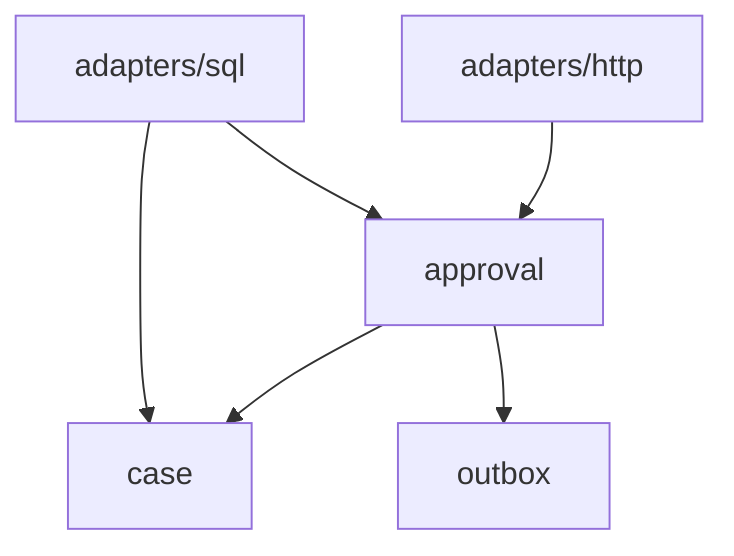

---

## 8. Layered vs Vertical Slice Decision

| Situation | Prefer |
|---|---|
| Very small app | Simple layered or flat |
| Many independent business capabilities | Vertical slice |
| Strong shared domain model | Domain-centered |
| CRUD admin app | Layered may be fine |
| Complex workflows/state machines | Vertical/domain-centered |
| Many transports same use case | Use case package + adapters |
| Heavy platform/infrastructure reuse | Platform package |
| Team ownership by feature | Vertical slice |
| Team ownership by technical specialty | Layered may appear but be careful |
| Regulatory workflow | Domain/use-case explicit |

A healthy large service often uses hybrid:

```text
internal/
  approval/          # use case/business capability
  case/              # shared aggregate/domain
  outbox/            # event/outbox domain infra
  adapters/
    http/
    sql/
    external/
  platform/
    logging/
    metrics/
    database/
```

---

## 9. Domain-Centered Package Pattern

For business-heavy systems, domain concepts deserve packages.

```text
internal/
  case/
    case.go
    state.go
    transition.go
    event.go
    errors.go
  approval/
    command.go
    service.go
    policy.go
  assignment/
    service.go
    policy.go
  escalation/
    service.go
    policy.go
```

`case` package owns aggregate behavior:

```go
package casework

type Case struct {
    ID      ID
    State   State
    Version Version
}

func (c *Case) Approve(actor ActorID, now time.Time) (Transition, error) {
    if c.State != StatePendingApproval {
        return Transition{}, ErrIllegalTransition
    }

    before := c.State
    c.State = StateApproved
    c.Version++

    return Transition{
        From: before,
        To:   c.State,
    }, nil
}
```

Approval package orchestrates:

```go
package approval

func (s *Service) Approve(ctx context.Context, cmd Command) (Result, error) {
    c, err := s.cases.FindForApproval(ctx, cmd.CaseID)
    if err != nil {
        return Result{}, err
    }

    decision := s.policy.Evaluate(ctx, c, cmd.ActorID)
    if !decision.Allowed {
        return Rejected(decision.Reasons), nil
    }

    transition, err := c.Approve(cmd.ActorID, s.clock.Now())
    if err != nil {
        return Result{}, err
    }

    ...
}
```

This keeps lifecycle behavior near domain.

---

## 10. Adapter Package Pattern

Adapters connect external world to internal use cases.

```text
internal/adapters/
  http/
  grpc/
  sql/
  redis/
  kafka/
  external/
```

HTTP adapter:

- decode request
- map auth context
- call use case
- map result/error to response

SQL adapter:

- execute SQL
- scan rows
- map DB errors
- implement repository ports

External adapter:

- call external API
- map status/errors
- handle auth token
- enforce timeouts/retries via decorator

Adapters should depend inward.

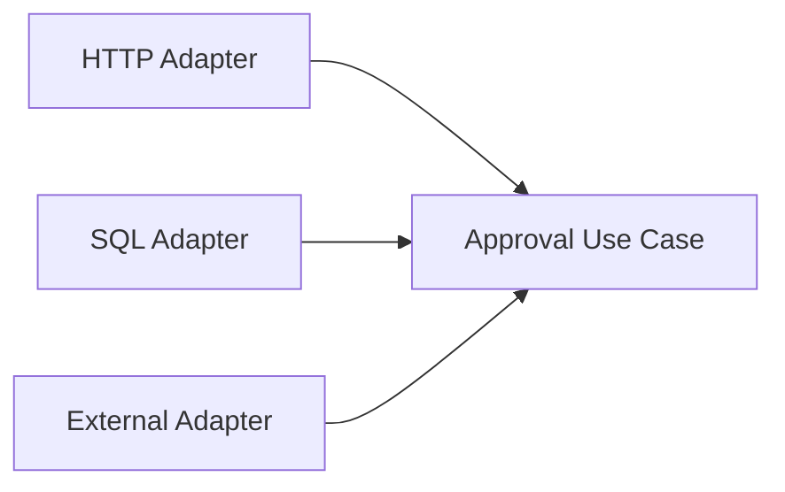

Use case should not import HTTP/SQL/external packages.

Bad:

```go
package approval

import "net/http"
import "database/sql"
```

Sometimes `database/sql` in repository interface might appear, but avoid leaking `*sql.Tx` into domain packages unless explicitly internal and accepted.

---

## 11. Platform Package Pattern

Platform package is for technical infrastructure shared across domain.

```text
internal/platform/
  logging/
  metrics/
  tracing/
  database/
  httpserver/
  config/
  clock/
  idgen/
  retry/
```

Rules:

- platform must not import business packages
- platform package should have stable, small API
- platform should not become `common`
- platform should be capability-specific

Good:

```text
internal/platform/retry
internal/platform/httpserver
internal/platform/database
```

Bad:

```text
internal/platform/common
internal/platform/utils
```

Dependency direction:

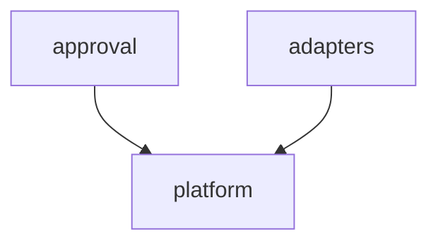

But be careful: if domain imports platform logging/metrics directly, domain may become operationally coupled. Sometimes use decorator outside domain instead.

---

## 12. The `common` Package Anti-Pattern

`common` starts innocent.

```text
internal/common/
  response.go
  errors.go
  validator.go
  constants.go
  helper.go
  db.go
  auth.go
  model.go
```

Then everything imports `common`.

Problems:

- no cohesive meaning
- import magnet
- hidden coupling
- hard to refactor
- package cycles
- unrelated changes break many packages
- impossible ownership
- names become generic
- business and infra mix

Better split by responsibility:

```text
internal/apperror/
internal/pagination/
internal/requestctx/
internal/validation/
internal/platform/database/
internal/platform/httpresponse/
```

But do not create micro-packages for every function.

Rule:

> Package name should describe a capability, not popularity.

---

## 13. The `models` Package Anti-Pattern

Common Java/Spring carryover:

```text
models/
  user.go
  case.go
  approval.go
  request.go
  response.go
  dto.go
  entity.go
```

Problems:

- domain models, DB models, HTTP DTOs mixed
- no behavior
- everybody imports models
- package becomes global dependency
- persistence annotations/tags leak everywhere
- transport shape leaks into domain
- domain invariants weak

Better:

```text
internal/case/
  case.go
  state.go
internal/adapters/http/dto/
  approval_request.go
internal/adapters/sql/dbmodel/
  case_row.go
```

Or keep DTO near handler and row mapping near repository.

Data shape belongs near boundary that owns it.

---

## 14. The `services` Package Anti-Pattern

```text
services/
  user_service.go
  case_service.go
  approval_service.go
  notification_service.go
```

Often becomes:

- god package
- many dependencies
- unclear import direction
- service-to-service spaghetti
- no domain cohesion

Better:

```text
internal/approval/
internal/assignment/
internal/notification/
internal/casework/
```

Name package by capability, not layer.

---

## 15. The `utils` Package Anti-Pattern

`utils` means “I didn’t name this abstraction.”

Bad:

```text
utils/
  string.go
  date.go
  http.go
  db.go
  auth.go
  file.go
```

Better:

```text
internal/postalcode/
internal/timeutil/      # if truly time helpers
internal/httpx/         # if truly HTTP helpers
internal/validation/
internal/idgen/
```

But even better: keep helper near use until repeated.

Do not extract helper too early.

---

## 16. Import Cycle as Design Smell

Go forbids import cycles.

If you hit import cycle:

```text
approval imports case
case imports approval
```

Usually architecture is wrong.

Common fixes:

### 1. Move Shared Type Down

If both need type, move it to lower package.

```text
case imports actor?
approval imports case and actor
```

### 2. Define Interface at Consumer Side

Instead of provider importing consumer.

### 3. Split Package

If package has two responsibilities, split.

### 4. Invert Dependency via Event/Command

Instead of direct call, emit event.

### 5. Move Orchestration Up

If two packages call each other, create higher-level package that coordinates both.

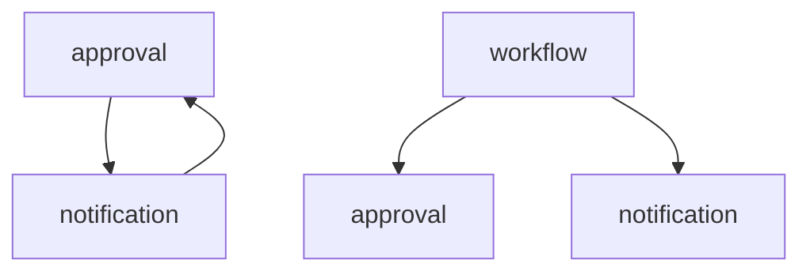

Import cycle is compiler telling you boundary is confused.

---

## 17. Dependency Direction Pattern

For large service, decide allowed direction.

Example:

```text
cmd -> app -> adapters -> usecase -> domain
app -> platform
adapters -> platform
usecase -> platform? limited
domain -> no platform or very limited
```

Mermaid:

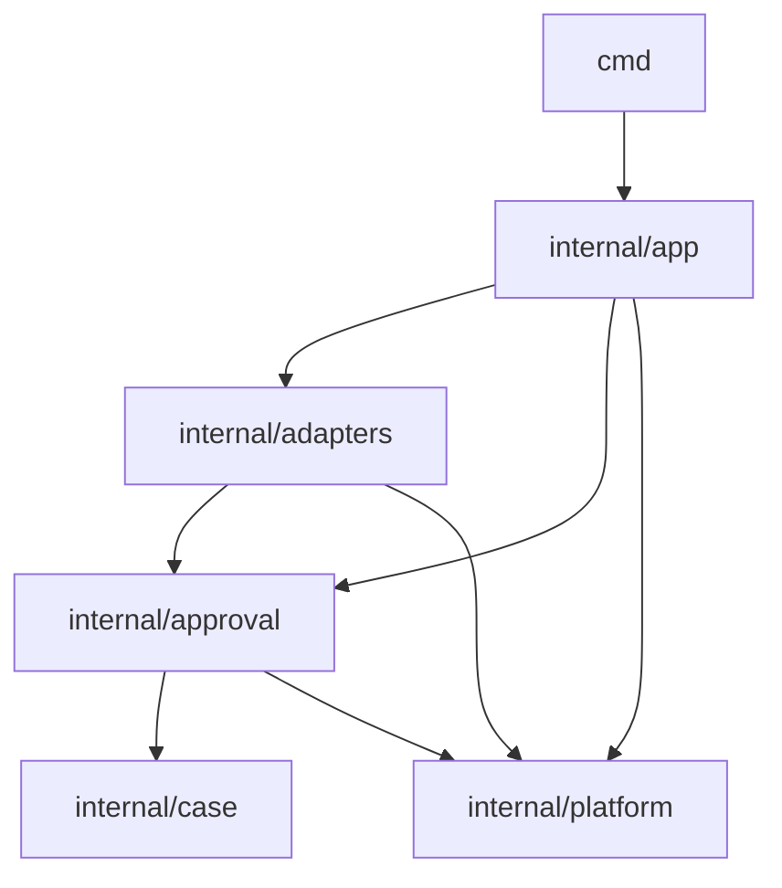

Strict purist clean architecture may forbid use case importing platform. Practical Go may allow `context`, `time`, small error package, maybe logging via decorator not core.

The rule should be explicit.

---

## 18. Import Graph Review

You can review architecture by asking:

- Which packages have too many imports?
- Which packages are imported by too many?
- Does domain import adapter?
- Does adapter import adapter?
- Does platform import business?
- Is `common` imported everywhere?
- Are there near cycles?
- Are tests importing internals awkwardly?
- Are public APIs too broad?
- Are package names generic?

A package with high fan-in must be stable.

A package with high fan-out may be doing too much.

Mermaid concept:

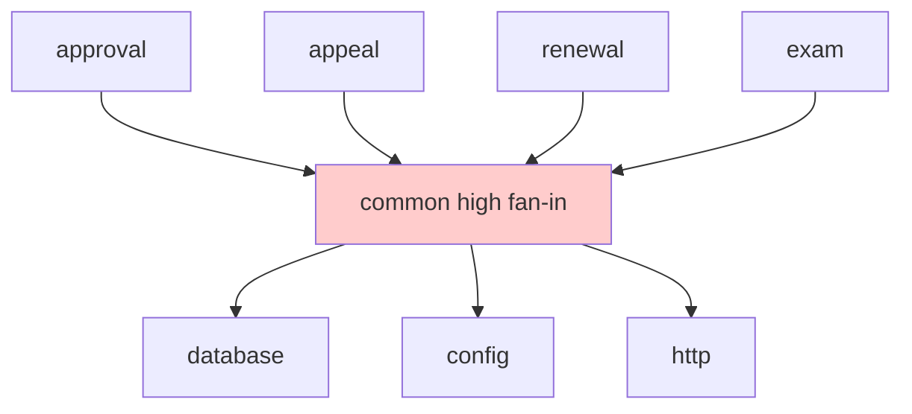

Danger: high fan-in plus high fan-out.

---

## 19. Public API Surface Inside Monorepo

Even internal packages need API discipline.

Exported names are easier to misuse.

Bad:

```go
type Service struct {
    Repo Repository
    Logger *slog.Logger
    Config Config
}
```

Anyone can mutate fields.

Better:

```go
type Service struct {
    repo Repository
    logger *slog.Logger
    config Config
}

func NewService(repo Repository, logger *slog.Logger, config Config) *Service {
    return &Service{repo: repo, logger: logger, config: config}
}
```

Expose:

- constructors
- command/result types
- interfaces needed by consumers
- errors/classifiers
- public methods

Hide:

- internal helper
- mutable fields
- SQL row struct
- HTTP DTO unless adapter package
- cache implementation detail
- registry maps
- global config

---

## 20. Package Naming Pattern

Good package names:

- short
- lower-case
- no underscore
- meaningful at call site
- not redundant with exported names

Example:

```go
approval.NewService()
casework.StateApproved
outbox.NewRelay()
requestctx.CorrelationID(ctx)
```

Bad:

```go
approvalservice.NewApprovalService()
commonutils.FormatString()
models.CaseModel
```

Package name should make selector readable.

---

## 21. One Package or Many?

Too few packages:

```text
internal/app/
  everything.go
```

Problems:

- no boundary
- hard to test
- huge files
- unclear ownership

Too many packages:

```text
internal/approval/command
internal/approval/result
internal/approval/service
internal/approval/policy
internal/approval/errors
```

Problems:

- micro-package ceremony
- many imports
- cycles
- low cohesion
- hard navigation

Heuristic:

Package should have enough cohesion and size.

A package can contain multiple files:

```text
internal/approval/
  command.go
  result.go
  service.go
  policy.go
  errors.go
  ports.go
  service_test.go
```

Do not create package per class/file.

---

## 22. File Organization Pattern

Within package, files can be organized by concern.

```text
internal/approval/
  command.go
  result.go
  service.go
  policy.go
  repository.go
  errors.go
  metrics.go
  service_test.go
  policy_test.go
```

Rules:

- files do not define visibility boundary
- package does
- don't create huge files
- don't split too mechanically
- keep related tests near logic
- use `testdata` for fixtures/golden files

Bad:

```text
approval_service_interface.go
approval_service_impl.go
approval_service_constants.go
approval_service_utils.go
```

This often signals Java file-per-class habit.

---

## 23. DTO, Domain, DB Row Separation

Important pattern:

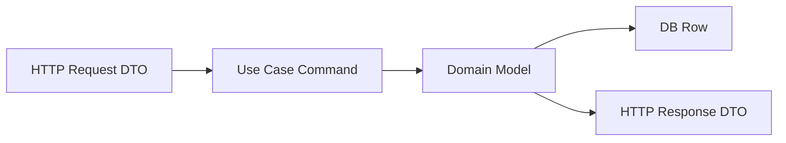

But not every small app needs all shapes.

### When Separate Shapes Matter

- API schema differs from domain
- DB schema differs from domain
- sensitive fields
- versioned public API
- partial update
- validation differs
- backward compatibility
- external integration
- audit/regulatory evidence
- persistence tags would pollute domain

### When Same Struct Is Acceptable

- small internal tool
- simple data transfer
- no separate invariant
- no public API compatibility need
- prototype/admin-only

For production systems, avoid putting JSON and DB tags on core domain object by default.

---

## 24. Internal Platform vs Shared Module

Suppose multiple services need retry/cache/requestctx.

Options:

1. duplicate small code
2. internal platform package per service
3. shared module/library
4. copy later into shared module
5. generate code
6. use third-party library

Shared module has cost:

- versioning
- compatibility
- release process
- cross-service coupling
- dependency conflicts
- ownership
- slow change propagation
- breaking many services

Do not create shared library too early.

Rule:

> Shared library is product. If nobody owns it like product, it becomes shared liability.

Good shared library candidates:

- stable infrastructure utility
- logging bootstrap
- metrics conventions
- request context propagation
- auth token verification
- retry policy standard
- pagination type
- error taxonomy if organization-wide
- test harness if mature

Bad shared candidates:

- domain model
- business service
- repository abstraction
- giant common package
- half-baked helpers
- code that changes every sprint

---

## 25. Multi-Module Consideration

Single module:

```text
go.mod
cmd/
internal/
```

Good for:

- one service
- simple dependency management
- easier refactor
- one version
- fewer replace directives

Multi-module:

```text
services/approval/go.mod
services/appeal/go.mod
libs/platform/go.mod
libs/auth/go.mod
```

Good when:

- independent release lifecycle
- clear library ownership
- large monorepo
- separate deployables
- dependency isolation
- organization-wide platform libs

Costs:

- module version management
- local replace complexity
- CI complexity
- cross-module refactor harder
- compatibility burden
- duplicated tooling

Heuristic:

Start single module for one service unless there is strong reason.

Use `internal` before multi-module if boundary is inside same service.

---

## 26. Monorepo vs Polyrepo for Go Services

### Monorepo Benefits

- atomic changes across services/libs
- shared tooling
- easier global refactor
- consistent CI
- code search
- dependency update coordination

### Monorepo Costs

- CI scalability
- ownership complexity
- accidental coupling
- shared library abuse
- huge clone/build
- versioning ambiguity

### Polyrepo Benefits

- service autonomy
- clear ownership
- independent lifecycle
- smaller CI scope
- access control

### Polyrepo Costs

- cross-repo changes hard
- shared library version drift
- duplicated tooling
- discoverability issues

Go works with both. Architecture discipline still required.

---

## 27. Binaries: API, Worker, Migration, CLI

Large services often have multiple binaries.

```text
cmd/
  api/
  worker/
  migrate/
  admincli/
```

Shared app wiring can be split.

```text
internal/app/
  api.go
  worker.go
  migrate.go
  dependencies.go
```

Avoid:

- API binary starting workers accidentally
- migration importing HTTP server
- worker importing HTTP handler
- all binaries sharing huge app object unnecessarily

Better:

```go
func NewAPI(ctx context.Context, cfg Config) (*APIApp, error)
func NewWorker(ctx context.Context, cfg Config) (*WorkerApp, error)
func NewMigrator(ctx context.Context, cfg Config) (*Migrator, error)
```

Each binary wires only what it needs.

---

## 28. Configuration Package Boundary

Config package should:

- load raw config
- apply defaults
- validate
- redact
- produce typed config

It should not:

- open DB connections
- create clients
- start goroutines
- import business packages
- become global singleton

```go
type Config struct {
    HTTP     HTTPConfig
    Database DatabaseConfig
    Logging  LoggingConfig
    AddressAPI AddressAPIConfig
}

func Load() (Config, error) {
    ...
}

func (c Config) Validate() error {
    ...
}
```

App wiring uses config:

```go
db, err := database.Open(ctx, cfg.Database)
```

Do not read env deep inside repository/client.

---

## 29. Error Package Boundary

Error taxonomy can be central, but be careful.

Option:

```text
internal/apperror/
  error.go
  classify.go
```

Use for stable cross-package error classes.

But domain-specific errors may belong in domain package:

```go
package casework

var ErrIllegalTransition = errors.New("illegal transition")
```

Application classifier can map:

```go
func Classify(err error) ErrorClass {
    switch {
    case errors.Is(err, casework.ErrIllegalTransition):
        return ErrorClassConflict
    ...
    }
}
```

Avoid one massive `errors` package with all domain errors. That creates coupling.

---

## 30. Auth Boundary

Auth concerns cross layers:

- authentication at transport/middleware
- principal in request context
- authorization in use case/policy
- security audit on sensitive actions

Package shape:

```text
internal/auth/
  principal.go
  middleware.go? maybe adapter/http/auth
  authorizer.go
internal/approval/
  authorization.go
```

Better split:

- HTTP auth middleware in adapter
- principal type in small auth package
- domain authorization policy near use case

Avoid:

- global `auth.CurrentUser()`
- domain reading HTTP headers
- repository enforcing role unless data access policy
- context as giant auth bag

---

## 31. Event and Outbox Boundary

Event/outbox often central.

```text
internal/outbox/
  event.go
  relay.go
  repository.go
internal/adapters/sql/
  outbox_repository.go
internal/approval/
  events.go
```

Domain/use case can define event payload:

```go
package approval

type CaseApprovedPayload struct { ... }
```

Outbox package defines envelope/relay mechanics.

SQL adapter persists outbox records.

Publisher adapter sends to Kafka/Rabbit/etc.

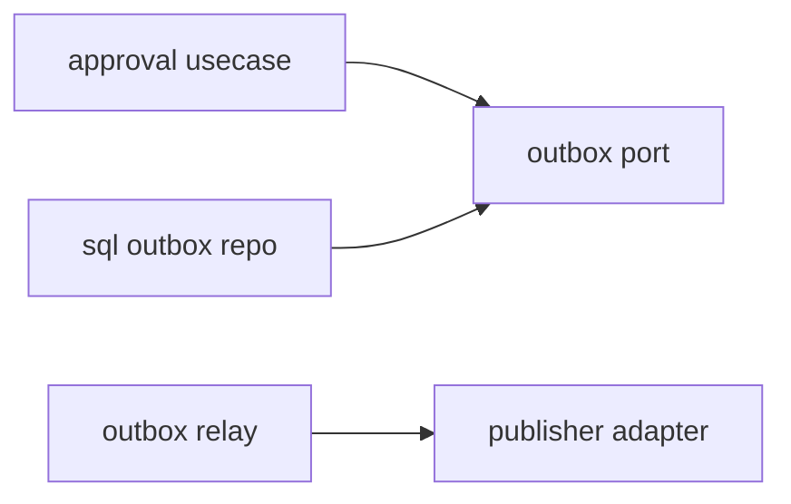

Avoid event package importing every domain package.

---

## 32. API Versioning Boundary

For public API:

```text
internal/adapters/http/v1/
  approval_handler.go
  dto.go
internal/adapters/http/v2/
  approval_handler.go
  dto.go
```

Or route-level versioning.

Do not make domain package versioned by API version unless domain actually differs.

DTO mapping:

```go
func toApproveCommand(req ApproveRequestV1, caseID string, actor auth.Principal) approval.Command {
    return approval.Command{
        CaseID:  casework.ID(caseID),
        ActorID: actor.ID,
        Comment: req.Comment,
    }
}
```

Versioning belongs at boundary.

---

## 33. Testing Architecture

Tests mirror boundaries.

```text
internal/approval/
  service_test.go
  policy_test.go
internal/case/
  state_test.go
internal/adapters/http/
  approval_handler_test.go
internal/adapters/sql/
  case_repository_integration_test.go
internal/outbox/
  relay_test.go
```

Test helper packages:

```text
internal/testutil/
```

Be careful: `testutil` can become `common` for tests.

Good testutil:

- fixed clock
- fake logger
- test DB setup
- HTTP response helper
- golden diff helper
- domain builders

Bad testutil:

- hides all setup
- shared mutable state
- giant magical app bootstrap for every test

---

## 34. Migration Strategy: From Messy to Structured

Do not big-bang rewrite.

### Step 1: Identify Import Graph Hotspots

Find:

- `common`
- `utils`
- `models`
- `services`
- package cycles
- high fan-in/fan-out packages

### Step 2: Define Target Direction

Example:

```text
adapters -> usecase -> domain
app wires all
platform no business imports
```

### Step 3: Extract One Capability

Pick one use case, e.g. approval.

Create:

```text
internal/approval/
```

Move:

- command
- result
- service
- policy
- ports

Keep adapters where they are initially.

### Step 4: Move Adapter Implementations

Move HTTP handler and SQL repository into adapter packages or capability-specific adapter files.

### Step 5: Replace Common Dependencies

Split `common` gradually:

- `requestctx`
- `apperror`
- `pagination`
- `validation`
- `platform/database`

### Step 6: Add Contract Tests

Before moving repository behavior, capture tests.

### Step 7: Prevent Regression

Add lint/import rules if possible.

### Step 8: Repeat Per Capability

Do not stop the world.

---

## 35. Import Boundary Enforcement

Options:

- code review checklist
- package comments
- architecture tests
- custom lint
- `go list` scripts
- dependency graph visualization
- forbid certain imports by script

Simple script idea:

```bash
go list -deps ./internal/approval
```

Check that `internal/approval` does not import:

- `net/http`
- adapter SQL package
- external client implementation
- config loader

In Go tests, you can run architecture checks by parsing `go list -json`.

Even without tooling, review import diffs.

---

## 36. Architecture Decision Records

For large codebase, record decisions.

Example ADR:

```text
ADR-001: Use internal/approval as use-case package
Status: Accepted
Decision:
- Approval use case owns command/result/policy/ports.
- HTTP and SQL implementations live in adapters.
- approval package must not import net/http or database/sql.
Reason:
- Keep business workflow testable and transport-independent.
```

ADR prevents repeated debates.

Keep ADR short.

---

## 37. Production Example: Enforcement Case Service Layout

Example codebase:

```text
enforcement/
  go.mod
  cmd/
    api/
      main.go
    worker/
      main.go
    migrate/
      main.go

  internal/
    app/
      api.go
      worker.go
      dependencies.go
      lifecycle.go

    config/
      config.go
      env.go
      validate.go

    auth/
      principal.go
      authorizer.go

    casework/
      case.go
      state.go
      transition.go
      event.go
      errors.go

    approval/
      command.go
      result.go
      service.go
      policy.go
      ports.go
      errors.go

    escalation/
      command.go
      service.go
      policy.go
      ports.go

    assignment/
      command.go
      service.go
      ports.go

    outbox/
      event.go
      relay.go
      ports.go

    audit/
      record.go
      writer.go

    adapters/
      http/
        router.go
        middleware.go
        approval_handler.go
        escalation_handler.go
        dto.go
      sql/
        case_repository.go
        outbox_repository.go
        audit_repository.go
        tx.go
      external/
        profile_client.go
        address_client.go
      messaging/
        publisher.go

    platform/
      database/
      httpserver/
      logging/
      metrics/
      tracing/
      retry/
      requestctx/
      idgen/
```

Dependency direction:

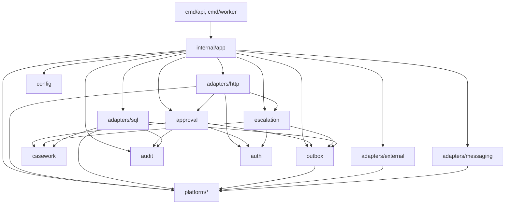

Important:

- domain does not import HTTP
- approval does not import SQL adapter
- SQL adapter can import domain types to map rows
- app wires concrete implementations
- platform does not import business packages

---

## 38. Production Example: Approval Package

```text
internal/approval/
  command.go
  result.go
  service.go
  policy.go
  ports.go
  errors.go
```

`ports.go`:

```go
package approval

type CaseRepository interface {
    FindForApproval(context.Context, casework.ID) (casework.Case, error)
    SaveApproved(context.Context, casework.Case, casework.Version) error
}

type AuditWriter interface {
    Write(context.Context, audit.Record) error
}

type Outbox interface {
    Add(context.Context, outbox.Event) error
}
```

`service.go`:

```go
type Service struct {
    cases  CaseRepository
    policy Policy
    audit  AuditWriter
    outbox Outbox
    clock  Clock
}

func NewService(cases CaseRepository, policy Policy, audit AuditWriter, outbox Outbox, clock Clock) *Service {
    return &Service{
        cases:  cases,
        policy: policy,
        audit:  audit,
        outbox: outbox,
        clock:  clock,
    }
}
```

No HTTP. No SQL. No config loading.

---

## 39. Production Example: SQL Adapter

```text
internal/adapters/sql/
  case_repository.go
```

```go
package sqladapter

type CaseRepository struct {
    db *sql.DB
}

func NewCaseRepository(db *sql.DB) *CaseRepository {
    return &CaseRepository{db: db}
}

func (r *CaseRepository) FindForApproval(ctx context.Context, id casework.ID) (casework.Case, error) {
    row := r.db.QueryRowContext(ctx, queryFindForApproval, id)

    c, err := scanCase(row)
    if err != nil {
        return casework.Case{}, mapDBError(err)
    }

    return c, nil
}
```

SQL adapter imports `casework` because it maps DB rows to domain.

`approval` depends on interface, app wires:

```go
caseRepo := sqladapter.NewCaseRepository(db)
approver := approval.NewService(caseRepo, policy, auditWriter, outboxWriter, clock)
```

---

## 40. Production Example: HTTP Adapter

```go
package httpadapter

type ApprovalHandler struct {
    approver interface {
        Approve(context.Context, approval.Command) (approval.Result, error)
    }
}

func NewApprovalHandler(approver interface {
    Approve(context.Context, approval.Command) (approval.Result, error)
}) *ApprovalHandler {
    return &ApprovalHandler{approver: approver}
}
```

Handler:

```go
func (h *ApprovalHandler) ServeHTTP(w http.ResponseWriter, r *http.Request) {
    cmd, err := decodeApproveCommand(r)
    if err != nil {
        writeError(w, err)
        return
    }

    result, err := h.approver.Approve(r.Context(), cmd)
    if err != nil {
        writeError(w, err)
        return
    }

    writeJSON(w, http.StatusOK, toApproveResponse(result))
}
```

HTTP owns DTO and mapping.

---

## 41. Anti-Pattern Catalog

### Anti-Pattern 1: Blindly Copying `cmd/internal/pkg`

Copying layout without understanding.

Fix:

- choose layout based on dependency and ownership
- `internal` by default
- `pkg` only for stable external API

### Anti-Pattern 2: Mega `common`

Fix:

- split by capability
- delete unused helpers
- keep helper local until repeated

### Anti-Pattern 3: Global `models`

Fix:

- domain model near domain
- DTO near transport
- DB row near repository

### Anti-Pattern 4: Layer Packages with No Cohesion

Fix:

- group by business capability where complexity grows

### Anti-Pattern 5: Service-to-Service Spaghetti

Fix:

- use orchestration package
- events
- explicit dependencies
- avoid circular use cases

### Anti-Pattern 6: Domain Imports Framework

Fix:

- move HTTP/SQL/Kafka details to adapter

### Anti-Pattern 7: Shared Library Too Early

Fix:

- duplicate small code until abstraction stabilizes
- treat shared libs as products

### Anti-Pattern 8: Micro-Package Fragmentation

Fix:

- package by cohesive responsibility, not class/file

### Anti-Pattern 9: App Wiring Hidden in `init`

Fix:

- explicit composition root

### Anti-Pattern 10: Architecture Diagram Lies

Fix:

- review import graph
- enforce dependency direction
- update ADRs

### Anti-Pattern 11: Multi-Module Prematurely

Fix:

- start single module
- split only with independent lifecycle/ownership

### Anti-Pattern 12: Platform Imports Business

Fix:

- invert dependency
- move business-specific behavior out of platform

---

## 42. Review Checklist

### Package

- Is package name meaningful?
- Can package responsibility be explained in one sentence?
- Is API surface small?
- Are exported names intentional?
- Does package have cohesive tests?

### Dependency

- Does dependency direction match architecture?
- Any import cycles or near-cycles?
- Does domain import adapter/framework?
- Does platform import business?
- Does `common` have high fan-in/fan-out?

### Layout

- Is `cmd` thin?
- Is app wiring explicit?
- Is `internal` used for app-private code?
- Is `pkg` only for stable external packages?
- Are DTO/domain/DB rows separated where needed?

### Evolution

- Can one capability evolve without touching unrelated packages?
- Can adapters be tested independently?
- Can shared libraries be versioned?
- Is migration possible incrementally?
- Are architecture decisions documented?

### Operations

- Are config/logging/metrics/tracing wired centrally?
- Are API and worker binaries separated?
- Are lifecycle start/stop dependencies clear?
- Are health/readiness boundaries clear?

---

## 43. Refactoring Playbook

### 43.1 Split `common`

1. List files in `common`.
2. Group by responsibility.
3. Create named packages.
4. Move one group at a time.
5. Update imports.
6. Delete unused helpers.
7. Prevent new common additions.

### 43.2 Extract Use Case Package

1. Pick one use case.
2. Create `internal/<capability>`.
3. Move command/result/policy/service.
4. Define consumer-owned ports.
5. Keep adapters outside.
6. Wire in app.
7. Add tests.

### 43.3 Move DTOs Out of Domain

1. Identify structs with JSON+DB+domain behavior mixed.
2. Create HTTP DTO near handler.
3. Create DB row near repository.
4. Add mapping functions.
5. Keep domain clean.
6. Add contract tests.

### 43.4 Replace Service-to-Service Calls

1. Identify service cycles.
2. Move orchestration up.
3. Extract shared domain behavior down.
4. Use events for async side effects.
5. Use policy interfaces for decisions.

### 43.5 Modularize Without Multi-Module

1. Use `internal` packages first.
2. Reduce import coupling.
3. Stabilize APIs.
4. Only then consider separate module.

---

## 44. Exercises

### Exercise 1: Import Graph Review

Take a Go service and list packages with:

```bash
go list ./...
```

Then identify:

- high fan-in package
- high fan-out package
- generic package names
- adapter importing domain or domain importing adapter
- possible `common` split

### Exercise 2: Redesign Layout

Given:

```text
internal/
  models/
  services/
  repositories/
  handlers/
  utils/
```

Redesign into capability/domain/adapter/platform layout.

### Exercise 3: Extract Approval Use Case

Create:

```text
internal/approval/
```

Include:

- command
- result
- service
- policy
- ports

Move HTTP and SQL to adapters.

### Exercise 4: Define Import Rules

Write allowed dependency rules for:

- `internal/approval`
- `internal/casework`
- `internal/adapters/http`
- `internal/adapters/sql`
- `internal/platform`

### Exercise 5: Shared Library Decision

For each candidate, decide internal package vs shared module:

- retry helper
- domain `Case`
- request context ID propagation
- SQL case repository
- pagination type
- approval policy
- logging bootstrap

---

## 45. Ringkasan

Arsitektur codebase Go besar tidak ditentukan oleh nama folder populer, tetapi oleh package boundary dan import graph.

Prinsip utama:

- package adalah design boundary
- import graph adalah arsitektur aktual
- `cmd` harus tipis
- `internal` adalah default untuk application code
- `pkg` hanya untuk API yang sengaja reusable/stabil
- composition root harus eksplisit
- domain/use case tidak boleh bergantung pada adapter/framework
- adapter menghubungkan dunia luar ke use case
- platform package tidak boleh menjadi common dump
- shared library punya biaya produk
- multi-module perlu alasan kuat
- refactor arsitektur harus incremental

Mental model utama:

> Jangan tanya “folder layout Go yang benar apa?”. Tanya “dependency mana yang boleh mengetahui dependency mana, dan perubahan apa yang harus bisa dilokalisasi?”.

---

## 46. Koneksi ke Part Berikutnya

Part berikutnya:

# Part 034 — Anti-Pattern Catalog and Refactoring Playbook

Kita akan mengumpulkan anti-pattern besar yang sering muncul di codebase Go production:

- god package
- god service
- global state
- context abuse
- channel abuse
- interface pollution
- generic repository
- framework obsession
- over-mocking
- config sprawl
- hidden goroutine lifecycle
- repository illusion
- inconsistent error taxonomy
- refactoring strategy tanpa big-bang rewrite

<!-- NAVIGATION_FOOTER -->
<div class="page-nav">
<a href="./learn-go-design-patterns-common-patterns-anti-patterns-part-032.md">⬅️ Part 032 — Testing Seam Pattern</a>
<a href="./index.md">📚 Kategori</a>
<a href="../../index.md">🏠 Home</a>
<a href="./learn-go-design-patterns-common-patterns-anti-patterns-part-034.md">Part 034 — Anti-Pattern Catalog and Refactoring Playbook ➡️</a>
</div>
