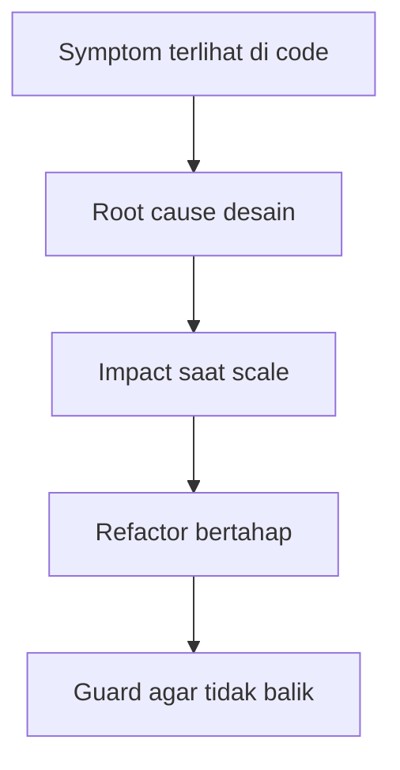
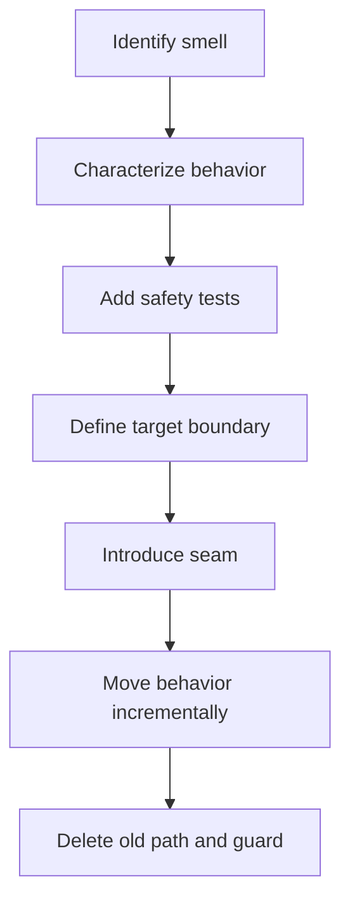
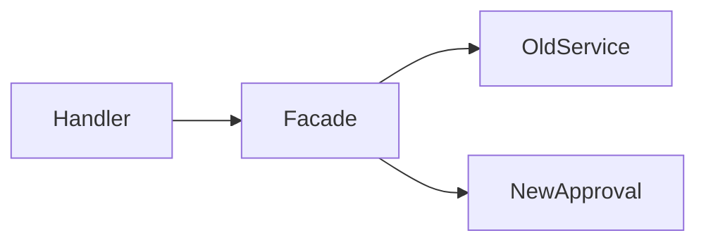

# learn-go-design-patterns-common-patterns-anti-patterns-part-034.md

# Part 034 — Anti-Pattern Catalog and Refactoring Playbook

## Status Seri

- Seri: **Go Design Patterns, Common Patterns, and Anti-Patterns**
- Part: **034 dari 035**
- Status seri: **belum selesai**
- Lanjutan dari:
  - Part 033 — Codebase Architecture Pattern for Large Go Services
- Setelah ini:
  - Part 035 — Capstone: Designing a Production-Grade Go Service from Zero

---

## Tujuan Part Ini

Part ini adalah katalog besar **anti-pattern Go production** dan playbook refactoring-nya.

Kita sudah membahas pattern satu per satu:

- package-oriented design
- API surface
- interface placement
- constructor/init
- functional options
- config
- dependency wiring
- adapter/port
- repository
- transaction boundary
- service layer
- handler
- middleware
- context
- error boundary
- result/decision/policy
- validation
- state machine
- command/use case
- event/outbox
- worker
- pipeline
- resilience
- cache
- plugin/registry/strategy
- decorator
- template/hook/callback
- generics
- observability
- testing seam
- codebase architecture

Sekarang kita gabungkan semuanya dalam bentuk:

- symptom
- root cause
- why it hurts
- detection signal
- refactoring strategy
- before/after shape
- review checklist
- migration sequence

Anti-pattern bukan berarti “selalu salah”. Anti-pattern adalah bentuk yang sering terlihat masuk akal di awal, tetapi dalam konteks tertentu menghasilkan biaya besar: sulit diuji, sulit dioperasikan, rawan incident, rawan coupling, sulit refactor, atau tidak defensible.

Mental model utama:

> Anti-pattern bukan hanya code jelek. Anti-pattern adalah desain yang menyembunyikan biaya sampai sistem cukup besar untuk membuat biaya itu mahal.

---

## 1. Cara Membaca Anti-Pattern

Setiap anti-pattern harus dianalisis dengan empat pertanyaan:

1. **Apa gejalanya?**
2. **Apa akar penyebabnya?**
3. **Apa dampaknya ketika sistem membesar?**
4. **Bagaimana refactor tanpa big-bang rewrite?**

Mermaid:



Contoh:

- Symptom: package `common` di-import semua package.
- Root cause: abstraction belum dinamai berdasarkan capability.
- Impact: coupling, cycle, sulit ownership.
- Refactor: split jadi `requestctx`, `apperror`, `pagination`, `platform/database`.
- Guard: review rule “no new common helpers”.

---

## 2. Refactoring Principles

Sebelum katalog, kita butuh prinsip refactoring.

### 2.1 Jangan Big-Bang Rewrite

Big-bang rewrite berisiko:

- fitur tertunda
- bug parity
- tim kehilangan confidence
- dua sistem berjalan paralel terlalu lama
- old bug ditulis ulang
- new bug muncul
- tidak ada value sampai selesai

Lebih baik:

- strangler pattern
- branch by abstraction
- extract one capability
- add tests before moving
- move boundary first
- keep behavior stable
- use adapter shim temporarily
- measure progress

### 2.2 Stabilize Before Refactor

Sebelum refactor critical code:

- tambah characterization tests
- capture current behavior
- dokumentasikan weird behavior
- tambahkan logging/metrics jika perlu
- pahami data migration impact
- pahami backward compatibility

### 2.3 Refactor Toward Boundary, Not Beauty

Tujuan refactor bukan code “lebih cantik”.

Tujuan:

- dependency direction lebih jelas
- behavior lebih testable
- failure mode lebih eksplisit
- API lebih kecil
- lifecycle lebih terkontrol
- observability lebih baik
- domain invariant lebih kuat

### 2.4 Keep Migration Seams

Saat migrasi:

```go
type OldServiceAdapter struct {
    old *old.Service
}

func (a *OldServiceAdapter) Approve(ctx context.Context, cmd approval.Command) (approval.Result, error) {
    return mapOldResult(a.old.Approve(ctx, mapCommand(cmd)))
}
```

Temporary adapter boleh jelek jika:

- scope jelas
- diberi TODO/migration owner
- tidak menjadi permanen
- test menjaga behavior
- timeline realistis

---

# Catalog A — Package and Architecture Anti-Patterns

---

## 3. Anti-Pattern: God Package

### Symptom

Satu package berisi terlalu banyak hal.

```text
internal/app/
  user.go
  case.go
  approval.go
  repository.go
  email.go
  worker.go
  http.go
  config.go
  utils.go
```

Atau:

```text
internal/service/
  everything
```

### Root Cause

- takut membuat package boundary
- package dibuat berdasarkan “aplikasi” bukan capability
- tidak ada ownership
- refactor ditunda
- semua butuh akses ke unexported things

### Why It Hurts

- compile/test lambat
- sulit memahami responsibility
- konflik merge tinggi
- tests saling bergantung
- no local reasoning
- private state terlalu luas
- API boundary tidak ada
- semua orang bisa sentuh semua

### Detection

- package punya puluhan file tidak terkait
- banyak type unrelated
- test setup berat
- perubahan kecil menyentuh package besar
- sulit menjelaskan package dalam satu kalimat

### Refactoring Playbook

1. Identifikasi capability di dalam package.
2. Pilih satu capability paling stabil.
3. Buat package baru.
4. Pindahkan command/result/policy/service terkait.
5. Buat interface kecil untuk dependency.
6. Update import.
7. Tambah tests.
8. Ulangi.

Before:

```text
internal/app/
  approval_service.go
  approval_policy.go
  approval_handler.go
  case_state.go
```

After:

```text
internal/approval/
  command.go
  result.go
  service.go
  policy.go
internal/casework/
  case.go
  state.go
internal/adapters/http/
  approval_handler.go
```

---

## 4. Anti-Pattern: Mega `common`

### Symptom

```text
internal/common/
  errors.go
  constants.go
  dates.go
  strings.go
  db.go
  http.go
  auth.go
  validation.go
  models.go
```

Everything imports `common`.

### Root Cause

- helper extracted before meaning clear
- no package taxonomy
- “shared” confused with “common”
- fear of duplication
- Java-style utility class habit

### Why It Hurts

- high fan-in + high fan-out
- package cycles
- unrelated changes break many packages
- no ownership
- hidden coupling
- hard to delete unused code
- common becomes dumping ground

### Detection

- `common` imports config/database/http/business package
- `common` has many unrelated files
- PRs frequently add to common
- common has domain constants from multiple domains

### Refactoring Playbook

Split by capability:

```text
internal/requestctx/
internal/apperror/
internal/pagination/
internal/validation/
internal/platform/database/
internal/platform/httpresponse/
internal/idgen/
```

Keep local if only used once.

Rule:

> A helper deserves extraction only after it has a name better than `util`.

---

## 5. Anti-Pattern: Global `models` Package

### Symptom

```text
internal/models/
  user.go
  case.go
  approval.go
  dto.go
  entity.go
  response.go
```

Struct has mixed tags:

```go
type Case struct {
    ID string `json:"id" db:"case_id" validate:"required"`
}
```

### Root Cause

- Java entity/DTO/model habit
- desire to avoid mapping code
- ORM-like thinking
- domain behavior not modeled

### Why It Hurts

- HTTP contract tied to DB schema
- DB migration breaks API
- API versioning hard
- domain invariants weak
- everything imports models
- sensitive fields leak
- no place for behavior

### Refactoring Playbook

Separate shapes by owner:

```text
internal/casework/
  case.go
internal/adapters/http/
  approval_dto.go
internal/adapters/sql/
  case_row.go
```

Mapping is not waste. Mapping is boundary protection.

---

## 6. Anti-Pattern: Layered Packages Without Cohesion

### Symptom

```text
internal/
  handlers/
  services/
  repositories/
  models/
```

Every business capability spread across all packages.

### Root Cause

- copying Spring architecture
- package by technical role
- no capability ownership
- use cases not explicit

### Why It Hurts

- one feature touches 5 packages
- `services` becomes god package
- `repositories` becomes god package
- business cohesion weak
- hard to assign ownership
- import graph broad

### Refactoring Playbook

Move toward capability packages:

```text
internal/approval/
internal/appeal/
internal/renewal/
internal/adapters/http/
internal/adapters/sql/
```

Do it one capability at a time.

---

## 7. Anti-Pattern: Architecture Diagram That Lies

### Symptom

Diagram says:

```text
handler -> service -> repository -> db
```

But import graph shows:

```text
domain imports sql
repository imports service
common imports everything
```

### Root Cause

- architecture discussed as slide, not enforced as code
- no import graph review
- no boundary rules
- no ADR

### Why It Hurts

- team believes false model
- refactoring surprises
- cycles appear
- tests require whole app
- onboarding confusing

### Refactoring Playbook

1. Generate actual import graph.
2. Document intended dependency rules.
3. Pick one violation category.
4. Fix incrementally.
5. Add review checklist or automated check.

Architecture is what compiles, not what is drawn.

---

# Catalog B — Interface and Abstraction Anti-Patterns

---

## 8. Anti-Pattern: Interface for Every Struct

### Symptom

```go
type UserService interface {
    Create(context.Context, CreateUserCommand) (UserResult, error)
}

type userService struct {
    ...
}
```

Only one implementation exists. Interface is in same provider package.

### Root Cause

- Java habit
- mocking framework habit
- “always program to interface”
- misunderstanding Go implicit interfaces

### Why It Hurts

- interface pollution
- extra names
- mock-driven design
- harder navigation
- false extensibility
- provider-owned interface becomes too broad

### Refactoring Playbook

If no consumer needs substitution:

```go
type Service struct {
    ...
}

func NewService(...) *Service
```

If consumer needs small behavior, define interface at consumer side:

```go
type Approver interface {
    Approve(context.Context, approval.Command) (approval.Result, error)
}
```

---

## 9. Anti-Pattern: God Interface

### Symptom

```go
type CaseService interface {
    Create(...)
    Update(...)
    Delete(...)
    Approve(...)
    Reject(...)
    Assign(...)
    Escalate(...)
    Close(...)
    Reopen(...)
    Export(...)
    Import(...)
}
```

### Root Cause

- service as role bucket
- interface mirrors large concrete type
- consumer-specific needs ignored
- mock convenience

### Why It Hurts

- implementers forced to support methods they don't need
- tests create huge mocks
- package coupling
- changes break many consumers
- violates interface segregation

### Refactoring Playbook

Split by consumer capability:

```go
type CaseApprover interface {
    Approve(context.Context, ApproveCommand) (ApproveResult, error)
}

type CaseAssigner interface {
    Assign(context.Context, AssignCommand) (AssignResult, error)
}
```

Keep concrete service with multiple methods if cohesive, but consumers should depend on small interfaces.

---

## 10. Anti-Pattern: Premature Generic Abstraction

### Symptom

```go
type Manager[T any] struct {
    repo Repository[T]
}

type Processor[I any, O any, P Policy[I], R Repository[O]] struct { ... }
```

### Root Cause

- desire to eliminate duplication before semantics stabilize
- Java generics habit
- internal framework ambition
- confusing shape similarity with semantic similarity

### Why It Hurts

- domain language erased
- call sites unreadable
- error semantics vague
- difficult public API evolution
- type parameter soup
- generic repository appears

### Refactoring Playbook

Move generics down to mechanics.

Before:

```go
type Service[T Entity] struct { ... }
```

After:

```go
type ApproveCaseService struct { ... }
```

Keep generic helpers:

```go
func IndexBy[T any, K comparable](items []T, key func(T) K) map[K]T
```

---

## 11. Anti-Pattern: Base Struct as Inheritance

### Symptom

```go
type BaseService struct {
    db *sql.DB
    logger *slog.Logger
}

type ApprovalService struct {
    BaseService
}
```

### Root Cause

- trying to recreate abstract superclass
- sharing fields instead of dependencies
- misunderstanding embedding

### Why It Hurts

- hidden dependencies
- method promotion surprises
- base grows endlessly
- no override semantics
- tests need base setup
- accidental exported API

### Refactoring Playbook

Use explicit fields:

```go
type ApprovalService struct {
    cases CaseRepository
    audit AuditWriter
    logger *slog.Logger
}
```

Share behavior with functions or small collaborators:

```go
type AuditRecorder struct { ... }
```

---

# Catalog C — Dependency and Lifecycle Anti-Patterns

---

## 12. Anti-Pattern: Global State

### Symptom

```go
var DB *sql.DB
var Logger *slog.Logger
var Config Config
var CurrentUser User
```

### Root Cause

- convenience
- avoiding wiring
- singleton habit
- package init doing too much

### Why It Hurts

- tests interfere
- race conditions
- hidden dependencies
- hard lifecycle
- impossible multi-instance
- config reload unsafe
- initialization order bugs

### Refactoring Playbook

1. Move globals into `App`/composition root.
2. Pass dependencies through constructors.
3. Use package-level constants only for immutable values.
4. For truly global process-level object, wrap carefully and avoid mutation.
5. In tests, create fresh instances per test.

Before:

```go
func FindCase(id string) (Case, error) {
    return DB.Query(...)
}
```

After:

```go
type CaseRepository struct {
    db *sql.DB
}
```

---

## 13. Anti-Pattern: Hidden Dependency

### Symptom

Function looks pure but reads env/global/network.

```go
func ValidateCase(c Case) error {
    threshold := os.Getenv("CASE_THRESHOLD")
    ...
}
```

### Root Cause

- convenience
- config not modeled
- dependency not passed
- package function abused

### Why It Hurts

- tests flaky
- behavior changes by environment
- impossible reasoning
- hard observability
- hard reproducibility

### Refactoring Playbook

Move config to typed dependency:

```go
type CaseValidator struct {
    threshold int
}
```

Or pass parameter:

```go
func ValidateCase(c Case, threshold int) error
```

---

## 14. Anti-Pattern: Constructor Does Work

### Symptom

```go
func NewClient(cfg Config) *Client {
    c := &Client{}
    c.login()
    go c.refreshToken()
    return c
}
```

### Root Cause

- constructor used as lifecycle
- desire to hide setup
- no explicit Start/Stop

### Why It Hurts

- construction can hang
- hidden network call
- hidden goroutine
- no shutdown
- tests slow
- startup failure unclear

### Refactoring Playbook

Separate construction and start:

```go
client, err := NewClient(cfg)
if err != nil { ... }

if err := client.Start(ctx); err != nil { ... }
defer client.Stop(shutdownCtx)
```

Or explicit `Open` if resource acquisition is expected:

```go
db, err := database.Open(ctx, cfg)
```

---

## 15. Anti-Pattern: `init()` Abuse

### Symptom

```go
func init() {
    db = connect()
    registerPlugin()
    startWorker()
}
```

### Root Cause

- wanting auto-registration
- avoiding explicit wiring
- plugin pattern misunderstood

### Why It Hurts

- hidden side effects
- import order surprise
- tests cannot control setup
- package import starts network/goroutine
- difficult error handling
- cycles via blank imports

### Refactoring Playbook

Use explicit registration:

```go
registry.Register("json", jsonCodec{})
```

called in composition root.

Use `init` only for simple deterministic registration when carefully justified, not I/O or goroutines.

---

## 16. Anti-Pattern: Hidden Goroutine Lifecycle

### Symptom

```go
func NewCache() *Cache {
    c := &Cache{}
    go c.cleanupLoop()
    return c
}
```

No stop.

### Root Cause

- background work hidden
- no lifecycle pattern
- constructor side effect

### Why It Hurts

- goroutine leak
- tests hang
- shutdown loses work
- no error reporting
- no backpressure
- impossible ownership

### Refactoring Playbook

Add lifecycle:

```go
func (c *Cache) Start(ctx context.Context) error
func (c *Cache) Stop(ctx context.Context) error
```

Or require caller to run:

```go
go cache.Run(ctx)
```

with context ownership visible.

---

# Catalog D — Context and Error Anti-Patterns

---

## 17. Anti-Pattern: Context as Dependency Bag

### Symptom

```go
db := ctx.Value("db").(*sql.DB)
logger := ctx.Value("logger").(*slog.Logger)
repo := ctx.Value("repo").(Repository)
```

### Root Cause

- avoiding constructor wiring
- misunderstanding context
- service locator through context

### Why It Hurts

- runtime panic
- hidden dependency
- no compile-time contract
- hard tests
- security leak
- context values become global state

### Refactoring Playbook

Dependencies go in struct fields:

```go
type Service struct {
    repo Repository
    logger *slog.Logger
}
```

Context only for request-scoped metadata:

- request ID
- correlation ID
- principal
- tenant
- deadline/cancellation
- trace context

---

## 18. Anti-Pattern: Ignoring Context Cancellation

### Symptom

```go
func (c *Client) Call(ctx context.Context) error {
    req, _ := http.NewRequest("GET", url, nil)
    _, err := http.DefaultClient.Do(req)
    return err
}
```

Context not used.

### Root Cause

- treating context as optional
- old API habits
- worker loops not cancellation-aware

### Why It Hurts

- shutdown hangs
- requests continue after client disconnect
- wasted resources
- slow incident recovery
- retries exceed budget

### Refactoring Playbook

Use context-aware APIs:

```go
req, err := http.NewRequestWithContext(ctx, http.MethodGet, url, nil)
db.QueryContext(ctx, query)
select {
case <-ctx.Done():
    return ctx.Err()
case item := <-ch:
}
```

Add cancellation tests.

---

## 19. Anti-Pattern: String Matching Errors

### Symptom

```go
if strings.Contains(err.Error(), "not found") {
    ...
}
```

### Root Cause

- no error taxonomy
- vendor errors leaked
- no sentinel/typed errors
- quick patch

### Why It Hurts

- brittle
- localization/message changes break logic
- security leak
- wrong retry/response
- hard metrics

### Refactoring Playbook

Define sentinel/typed errors at boundary:

```go
var ErrNotFound = errors.New("not found")
```

Map vendor errors in adapter:

```go
if errors.Is(err, sql.ErrNoRows) {
    return Case{}, ErrNotFound
}
```

Use `errors.Is` / `errors.As`.

---

## 20. Anti-Pattern: Logging and Returning Everywhere

### Symptom

```go
if err != nil {
    logger.Error("failed", "err", err)
    return err
}
```

Repeated at every layer.

### Root Cause

- fear of losing context
- no boundary logging strategy
- no error wrapping/classification

### Why It Hurts

- duplicate logs
- noisy incident
- higher cost
- privacy risk
- root cause harder

### Refactoring Playbook

Lower layers wrap/classify:

```go
return fmt.Errorf("find case for approval: %w", err)
```

Boundary logs once:

```go
logger.ErrorContext(ctx, "approve case failed", ...)
```

---

# Catalog E — Domain and Workflow Anti-Patterns

---

## 21. Anti-Pattern: Business Logic in Handler

### Symptom

HTTP handler:

```go
func Approve(w http.ResponseWriter, r *http.Request) {
    // decode
    // check state
    // query DB
    // mutate case
    // insert audit
    // publish event
}
```

### Root Cause

- route-first development
- no use case boundary
- small feature grew large
- framework/controller habit

### Why It Hurts

- impossible reuse from worker/CLI
- hard unit test
- transport leaks
- transaction unclear
- error mapping mixed with business
- audit/event consistency risk

### Refactoring Playbook

Move business flow to use case:

```go
result, err := approver.Approve(ctx, cmd)
```

Handler only:

- decode
- authenticate principal
- map command
- call use case
- map response/error

---

## 22. Anti-Pattern: God Service

### Symptom

```go
type CaseService struct {
    ...
}

func (s *CaseService) Create(...)
func (s *CaseService) Update(...)
func (s *CaseService) Approve(...)
func (s *CaseService) Reject(...)
func (s *CaseService) Assign(...)
func (s *CaseService) Escalate(...)
func (s *CaseService) Close(...)
func (s *CaseService) Reopen(...)
func (s *CaseService) Export(...)
```

### Root Cause

- service named after entity
- use cases not separated
- CRUD mindset
- no capability ownership

### Why It Hurts

- many dependencies
- huge tests
- unrelated changes conflict
- hidden coupling
- service-to-service calls
- hard authorization/policy separation

### Refactoring Playbook

Split by use case/capability:

```text
approval.Service
assignment.Service
escalation.Service
closure.Service
```

Or keep one concrete if small, but expose smaller use-case interfaces.

---

## 23. Anti-Pattern: State Mutation Scattered in If/Else

### Symptom

```go
if action == "approve" {
    c.State = "APPROVED"
}
```

Across handlers/services/jobs.

### Root Cause

- no state machine
- state represented as string
- no transition API
- audit added afterthought

### Why It Hurts

- illegal transitions
- missing audit
- inconsistent events
- no idempotency
- hard compliance
- impossible reasoning

### Refactoring Playbook

Centralize transition:

```go
transition, err := c.Approve(actorID, now)
```

State machine owns:

- allowed from/to
- guard
- event
- audit data
- version increment

---

## 24. Anti-Pattern: Error for Expected Business Decision

### Symptom

```go
if !allowed {
    return ErrApprovalRejected
}
```

Then handler returns HTTP 500 or metrics count error.

### Root Cause

- no result/decision model
- all non-success treated as error
- Java exception habit

### Why It Hurts

- business rejection counted as system failure
- poor API semantics
- no reason trace
- SLO polluted
- retry may be wrong

### Refactoring Playbook

Use result:

```go
return ApproveResult{
    Decision: DecisionRejected,
    Reasons: decision.Reasons,
}, nil
```

Use error for technical failure.

---

## 25. Anti-Pattern: Validation Everywhere and Nowhere

### Symptom

Same rule copied in:

- handler
- service
- repository
- frontend
- DB constraint

Or no clear owner.

### Root Cause

- no validation taxonomy
- syntactic/domain/policy validation mixed
- no result model

### Why It Hurts

- inconsistent behavior
- duplicated bugs
- wrong error messages
- invalid state persists
- hard audit

### Refactoring Playbook

Separate:

- transport decoding validation
- command validation
- domain invariant
- policy validation
- persistence constraint

Keep each at correct boundary.

---

# Catalog F — Persistence, Transaction, Event Anti-Patterns

---

## 26. Anti-Pattern: Generic Repository for Core Domain

### Symptom

```go
type Repository[T any, ID comparable] interface {
    FindByID(context.Context, ID) (T, error)
    Save(context.Context, T) error
}
```

Used for approval, audit, outbox, user, case.

### Root Cause

- CRUD abstraction
- Java Spring Data habit
- shape reuse confused with semantic reuse

### Why It Hurts

- hides query semantics
- transaction semantics vague
- error semantics vague
- domain intent lost
- hard optimize
- wrong fake behavior

### Refactoring Playbook

Use domain-specific repository:

```go
type CaseRepository interface {
    FindForApproval(context.Context, CaseID) (Case, error)
    SaveApproved(context.Context, Case, Version) error
}
```

Generic helpers can exist below.

---

## 27. Anti-Pattern: Transaction Hidden Inside Repository

### Symptom

```go
func (r *Repo) SaveCase(c Case) error {
    tx := r.db.Begin()
    defer tx.Rollback()
    ...
    tx.Commit()
}
```

Service also needs save audit/outbox in same transaction, but repository commits too early.

### Root Cause

- repository owns too much
- no unit-of-work boundary
- transaction treated as persistence detail only

### Why It Hurts

- partial updates
- outbox inconsistency
- audit inconsistency
- impossible multi-repository transaction
- retry semantics unclear

### Refactoring Playbook

Transaction owned by use case/unit-of-work.

```go
txRunner.WithinTx(ctx, func(ctx context.Context, tx Tx) error {
    repo.Save(ctx, tx, c)
    audit.Write(ctx, tx, record)
    outbox.Add(ctx, tx, event)
    return nil
})
```

---

## 28. Anti-Pattern: Network Call Inside DB Transaction

### Symptom

```go
tx := db.Begin()
profile := profileClient.Get(ctx, userID)
repo.Save(ctx, tx, profile)
tx.Commit()
```

### Root Cause

- transaction boundary too broad
- orchestration not separated
- external data dependency unclear

### Why It Hurts

- long locks
- deadlocks
- connection starvation
- transaction timeout
- external outage blocks DB
- retry dangerous

### Refactoring Playbook

Options:

- fetch external data before transaction
- use cached snapshot
- store external data via prior workflow
- split with outbox/saga
- minimize transaction scope

---

## 29. Anti-Pattern: Publish Before Commit

### Symptom

```go
repo.Save(ctx, tx, c)
publisher.Publish(CaseApproved{...})
tx.Commit()
```

### Root Cause

- event publishing treated as side effect
- no outbox
- transaction/event consistency not modeled

### Why It Hurts

- event says approved but DB rolled back
- DB committed but publish failed
- duplicate/lost events
- consumers inconsistent

### Refactoring Playbook

Use transactional outbox:

```go
txRunner.WithinTx(ctx, func(ctx context.Context, tx Tx) error {
    repo.Save(ctx, tx, c)
    outbox.Add(ctx, tx, event)
    return nil
})
```

Relay publishes after commit.

---

## 30. Anti-Pattern: Event as Database Row Dump

### Symptom

```json
{
  "id": "...",
  "state": "...",
  "created_at": "...",
  "updated_at": "...",
  "all_columns": "..."
}
```

### Root Cause

- no event schema design
- convenience serialization
- consumers treated as replica readers

### Why It Hurts

- leaks internal schema
- breaks consumers on DB change
- exposes sensitive data
- no semantic event meaning
- versioning hard

### Refactoring Playbook

Define semantic event:

```go
type CaseApprovedPayload struct {
    CaseID string
    ApprovedBy string
    ApprovedAt time.Time
    TransitionID string
}
```

Version it.

---

# Catalog G — Concurrency, Worker, Pipeline Anti-Patterns

---

## 31. Anti-Pattern: Unbounded Goroutines

### Symptom

```go
for _, item := range items {
    go process(item)
}
```

### Root Cause

- goroutine seen as free
- no resource budget
- no backpressure

### Why It Hurts

- memory spike
- DB/API overload
- scheduler pressure
- rate limit violation
- incident amplification

### Refactoring Playbook

Use bounded worker pool/semaphore:

```go
sem := make(chan struct{}, maxConcurrent)
```

Respect context.

---

## 32. Anti-Pattern: Channel Ownership Confusion

### Symptom

Multiple senders close channel.

```go
close(ch)
```

from receiver or arbitrary goroutine.

### Root Cause

- channel lifecycle not documented
- no owner
- fan-in/fan-out unclear

### Why It Hurts

- panic send on closed channel
- goroutine leak
- deadlock
- flaky tests

### Refactoring Playbook

Rule:

> Sender that owns production closes channel. Receiver does not close channel unless it created/owns it.

Document ownership.

---

## 33. Anti-Pattern: Retry Storm

### Symptom

Every layer retries:

- HTTP client retry
- service retry
- worker retry
- queue redelivery retry
- external SDK retry

### Root Cause

- no retry budget
- no central resilience policy
- error retryability not classified
- panic during incident

### Why It Hurts

- dependency overload
- cascading failure
- latency spike
- rate limit
- cost explosion

### Refactoring Playbook

Define retry owner and budget:

- one layer retries
- bounded attempts
- exponential backoff + jitter
- context deadline
- retryable error classification
- idempotency required for mutation

---

## 34. Anti-Pattern: Worker Without Shutdown

### Symptom

```go
for {
    job := <-jobs
    process(job)
}
```

No context.

### Root Cause

- background process not lifecycle-managed
- no graceful shutdown design

### Why It Hurts

- deploy loses jobs
- process hangs
- partial writes
- no lease release
- tests hang

### Refactoring Playbook

```go
func (w *Worker) Run(ctx context.Context) error {
    for {
        select {
        case <-ctx.Done():
            return ctx.Err()
        case job := <-w.jobs:
            ...
        }
    }
}
```

Add shutdown tests.

---

# Catalog H — Resilience, Cache, External Dependency Anti-Patterns

---

## 35. Anti-Pattern: Timeout Missing

### Symptom

External call has no timeout/deadline.

### Root Cause

- default client used
- context ignored
- no latency budget

### Why It Hurts

- requests hang
- connection leak
- worker stuck
- cascading outage

### Refactoring Playbook

- use context deadline
- configure HTTP client timeout carefully
- set DB timeouts where applicable
- propagate budget
- test cancellation

---

## 36. Anti-Pattern: Cache as Source of Truth

### Symptom

Code writes cache and treats it as canonical.

```go
cache.Set(caseID, state)
```

No DB/source update.

### Root Cause

- performance shortcut
- unclear ownership
- write-behind misunderstood

### Why It Hurts

- data loss
- stale decisions
- inconsistency
- hard recovery
- audit gap

### Refactoring Playbook

Define cache role:

- derived view
- TTL
- invalidation
- source of truth
- fallback policy
- consistency requirement

For strong workflows, source of truth remains DB/event log.

---

## 37. Anti-Pattern: Circuit Breaker Without Semantics

### Symptom

Global breaker wraps all calls.

### Root Cause

- resilience library dropped in
- no operation/dependency scoping
- no failure classification

### Why It Hurts

- unrelated operations blocked
- breaker opens on validation errors
- no observability
- hard tune

### Refactoring Playbook

Scope breaker by dependency/operation.

Only count relevant failure classes.

Expose metrics.

---

# Catalog I — Observability and Testing Anti-Patterns

---

## 38. Anti-Pattern: Log Spam Without Signal

### Symptom

Every function logs entry/exit.

### Root Cause

- lack of tracing
- debugging by print
- no observability design

### Why It Hurts

- cost
- noise
- PII risk
- incident harder

### Refactoring Playbook

- structured operation logs
- metrics for volume
- traces for call path
- log once at boundary
- debug sampling

---

## 39. Anti-Pattern: High-Cardinality Metrics

### Symptom

Metric labels contain:

- user ID
- case ID
- raw error
- raw URL
- email
- postal code

### Root Cause

- confusing logs with metrics
- no cardinality review

### Why It Hurts

- metric backend overload
- cost spike
- slow dashboard
- alert failure

### Refactoring Playbook

Use bounded labels:

- route pattern
- status class
- error class
- operation
- dependency

Put IDs in logs/audit/traces according to policy.

---

## 40. Anti-Pattern: Over-Mocking

### Symptom

Tests assert every call.

```go
repo.EXPECT().Find()
policy.EXPECT().Evaluate()
repo.EXPECT().Save()
audit.EXPECT().Write()
```

### Root Cause

- Java mocking habit
- no fake/contract tests
- testing implementation not behavior

### Why It Hurts

- brittle tests
- refactor pain
- low confidence
- fake behavior absent

### Refactoring Playbook

Use fakes/spies and assert outcomes:

- state changed
- event emitted
- audit written
- result decision
- error class

Use mock only when interaction is contract.

---

## 41. Anti-Pattern: Flaky Tests with Sleep

### Symptom

```go
time.Sleep(100 * time.Millisecond)
```

### Root Cause

- no synchronization seam
- no fake clock
- worker not designed for tests

### Why It Hurts

- nondeterministic CI
- slow suite
- false failures

### Refactoring Playbook

Use:

- fake clock
- channels
- context
- hooks
- wait groups
- `httptest`
- `t.TempDir`

---

# Catalog J — Security and Compliance Anti-Patterns

---

## 42. Anti-Pattern: Sensitive Data in Logs

### Symptom

Logs contain:

- token
- password
- raw body
- national ID
- full email/phone
- secret config

### Root Cause

- debug convenience
- no redaction policy
- structured logging without field classification

### Why It Hurts

- privacy breach
- compliance violation
- incident expansion
- log access risk

### Refactoring Playbook

- allowlist log fields
- redact type wrappers
- no raw request body logs
- scan logs/tests
- separate audit with access control
- define retention

---

## 43. Anti-Pattern: Audit as Best-Effort Debug Event

### Symptom

```go
_ = audit.Write(ctx, record)
```

### Root Cause

- audit treated as logging
- no failure policy
- no transaction/outbox design

### Why It Hurts

- missing legal evidence
- cannot prove action
- compliance failure
- fraud investigation gap

### Refactoring Playbook

Define audit requirement:

- if required, fail closed or transactional
- if async, use durable outbox
- if optional, metric/log failure
- test audit failure path

---

## 44. Anti-Pattern: Authorization Hidden in Middleware Only

### Symptom

Middleware checks role:

```go
RequireRole("officer")
```

But use case needs domain-specific authorization.

### Root Cause

- authz oversimplified
- role-based thinking only
- no resource policy

### Why It Hurts

- user with role can act on wrong resource
- delegation/ownership ignored
- policy not auditable
- business rule hidden

### Refactoring Playbook

Split:

- middleware: authentication/coarse access
- use case: domain/resource authorization
- policy returns decision trace
- audit denied attempts if needed

---

# Refactoring Systematically

---

## 45. The 7-Step Refactoring Loop



### Step 1: Identify Smell

Use catalog.

### Step 2: Characterize Behavior

Before changing, know current behavior.

### Step 3: Add Safety Tests

Unit/contract/integration depending boundary.

### Step 4: Define Target Boundary

Write target dependency direction.

### Step 5: Introduce Seam

Adapter/interface/function.

### Step 6: Move Incrementally

One use case/file/path at a time.

### Step 7: Delete Old Path and Guard

Remove old package/helper. Add review rule.

---

## 46. Strangler Refactoring Pattern

Useful when replacing old service/package.



Facade routes some commands to new implementation.

```go
type ApprovalFacade struct {
    old *old.CaseService
    new *approval.Service
    useNew bool
}

func (f *ApprovalFacade) Approve(ctx context.Context, cmd approval.Command) (approval.Result, error) {
    if f.useNew {
        return f.new.Approve(ctx, cmd)
    }
    return adaptOld(f.old.Approve(ctx, adaptCmd(cmd)))
}
```

Use feature flag carefully for migration, not permanent complexity.

---

## 47. Branch by Abstraction

Useful for changing dependency without changing all callers.

1. Define interface at consumer boundary.
2. Wrap old implementation.
3. Introduce new implementation.
4. Switch wiring.
5. Delete old.

Example:

```go
type CaseRepository interface {
    FindForApproval(...)
}
```

Old repo adapter and new SQL repo both implement it.

---

## 48. Golden Master / Characterization Test

For legacy behavior, write tests that capture current output.

Especially useful for:

- response mapping
- report generation
- migration transformation
- validation legacy rules
- decision table

Caution: characterization test captures bugs too. Mark known weirdness.

---

## 49. Risk-Based Refactoring Order

Prioritize anti-patterns by risk:

1. Security/compliance risk
2. Data consistency risk
3. Incident/reliability risk
4. Testability blocker
5. Architecture coupling
6. Readability
7. Cosmetic

Do not spend weeks renaming packages while publish-before-commit loses events.

---

## 50. Refactoring Review Checklist

### Safety

- Are there tests around behavior?
- Is migration incremental?
- Is rollback possible?
- Is data compatibility considered?
- Are observability signals present?

### Boundary

- Is dependency direction improved?
- Is API surface smaller?
- Is interface consumer-owned?
- Is transaction ownership clearer?
- Is context used correctly?

### Semantics

- Are business decisions explicit?
- Are errors classified?
- Are expected rejections not technical errors?
- Are audit/event semantics preserved?

### Operations

- Are lifecycle/shutdown paths clear?
- Are retries bounded?
- Are metrics/logs safe?
- Are sensitive fields redacted?

### Completion

- Is old path deleted?
- Are temporary adapters marked?
- Is documentation/ADR updated?
- Are new anti-patterns prevented?

---

## 51. Production Refactoring Example: From Handler Logic to Use Case

### Before

```go
func ApproveHandler(w http.ResponseWriter, r *http.Request) {
    caseID := mux.Vars(r)["id"]
    actor := currentUser(r)

    c, err := dbFindCase(caseID)
    if err != nil {
        http.Error(w, err.Error(), 500)
        return
    }

    if c.State != "PENDING" {
        http.Error(w, "bad state", 400)
        return
    }

    c.State = "APPROVED"
    if err := dbSaveCase(c); err != nil {
        http.Error(w, err.Error(), 500)
        return
    }

    log.Printf("approved %s by %s", caseID, actor.ID)
    publish("case.approved", c)
    w.WriteHeader(200)
}
```

### Problems

- business logic in handler
- raw DB functions
- no transaction
- publish before/after consistency unclear
- log as audit
- string state
- HTTP status wrong for business rejection
- no decision trace
- no context propagation
- no test seam

### After

Handler:

```go
func (h *ApproveHandler) ServeHTTP(w http.ResponseWriter, r *http.Request) {
    cmd, err := decodeApproveCommand(r)
    if err != nil {
        writeError(w, err)
        return
    }

    result, err := h.approver.Approve(r.Context(), cmd)
    if err != nil {
        writeError(w, err)
        return
    }

    writeJSON(w, statusForDecision(result.Decision), toResponse(result))
}
```

Use case:

```go
func (s *Service) Approve(ctx context.Context, cmd Command) (Result, error) {
    var result Result

    err := s.txs.WithinTx(ctx, func(ctx context.Context, tx Tx) error {
        c, err := s.cases.FindForApproval(ctx, tx, cmd.CaseID)
        if err != nil {
            return err
        }

        decision := s.policy.Evaluate(ctx, c, cmd.ActorID)
        if !decision.Allowed {
            result = Rejected(cmd.CaseID, decision.Reasons)
            return s.audit.Write(ctx, tx, AuditRejected(cmd, c, decision))
        }

        transition, err := c.Approve(cmd.ActorID, s.clock.Now())
        if err != nil {
            return err
        }

        if err := s.cases.Save(ctx, tx, c); err != nil {
            return err
        }

        if err := s.outbox.Add(ctx, tx, transition.Event()); err != nil {
            return err
        }

        if err := s.audit.Write(ctx, tx, transition.AuditRecord()); err != nil {
            return err
        }

        result = Approved(cmd.CaseID, transition.ID)
        return nil
    })

    return result, err
}
```

Incremental migration:

1. Extract command/result.
2. Move logic to service but keep old DB functions.
3. Add transaction.
4. Add audit writer.
5. Add outbox.
6. Replace string state with typed state.
7. Add tests.
8. Remove old handler logic.

---

## 52. Production Refactoring Example: Splitting `common`

Before:

```text
internal/common/
  context.go
  error.go
  response.go
  db.go
  retry.go
  date.go
  audit.go
```

After:

```text
internal/requestctx/
internal/apperror/
internal/adapters/http/response.go
internal/platform/database/
internal/platform/retry/
internal/timeutil/
internal/audit/
```

Migration steps:

1. Move `context.go` to `requestctx`.
2. Update imports.
3. Move `error.go` to `apperror`.
4. Move HTTP response helper into HTTP adapter.
5. Move DB helper into platform/database.
6. Move audit domain to audit package.
7. Delete common.
8. Add review rule.

---

## 53. Production Refactoring Example: Generic Repository Removal

Before:

```go
type Repository[T any, ID comparable] interface {
    FindByID(context.Context, ID) (T, error)
    Save(context.Context, T) error
}
```

Used by approval:

```go
type Service struct {
    cases Repository[Case, CaseID]
}
```

After:

```go
type CaseRepository interface {
    FindForApproval(context.Context, CaseID) (Case, error)
    SaveWithVersion(context.Context, Case, Version) error
}
```

Benefits:

- query intent explicit
- optimistic locking explicit
- transition use case clear
- tests meaningful
- fake can enforce version

Migration:

1. Define new interface in approval package.
2. Make old repo adapter implement it.
3. Update service to depend on new interface.
4. Add contract tests.
5. Remove generic repository from core path.

---

## 54. Anti-Pattern Prevention System

Refactoring once is not enough. Prevent regression.

### Code Review Prompts

- Why is this interface needed?
- Who owns this package?
- Is this helper named by capability?
- Is context used only for request-scoped data?
- Where is transaction boundary?
- Is this business rejection or technical error?
- Are metrics labels bounded?
- Is audit required?
- Does this start goroutine? Who stops it?
- Does this retry have budget?
- Is this generic because algorithm is stable?

### Lightweight Architecture Rules

Document:

```text
- internal/approval must not import net/http or adapters/sql.
- internal/platform must not import business packages.
- no new internal/common package.
- use context only as first arg for operation control.
- no package-level mutable DB/config.
```

### Automated Checks

Possible checks:

- grep for `package common`
- grep for `context.WithValue` outside requestctx/auth/tracing
- `go list` import graph
- lint for forbidden imports
- tests for high-level package dependency

---

## 55. Final Anti-Pattern Heatmap

| Anti-Pattern | Risk Type | Priority |
|---|---|---|
| Publish before commit | Data consistency | Critical |
| Missing audit durability | Compliance | Critical |
| Sensitive data in logs | Security/privacy | Critical |
| Network call in transaction | Reliability/performance | High |
| Hidden goroutine lifecycle | Reliability | High |
| Context ignored | Reliability | High |
| Global state | Testability/reliability | High |
| Generic repository | Evolvability | Medium-High |
| God service | Maintainability | Medium-High |
| Mega common | Architecture coupling | Medium |
| Over-mocking | Test maintainability | Medium |
| Premature generics | Readability/evolution | Medium |
| Utils package | Naming/cohesion | Medium |
| File-per-class package split | Noise | Low-Medium |

Prioritize by system risk, not aesthetic preference.

---

## 56. Exercises

### Exercise 1: Anti-Pattern Diagnosis

Given a package layout:

```text
internal/
  common/
  models/
  services/
  repositories/
  handlers/
```

Identify at least 8 likely anti-patterns and propose a migration plan.

### Exercise 2: Refactor Handler Logic

Take an HTTP handler with DB/state/event logic. Refactor into:

- command
- use case
- repository port
- audit writer
- outbox
- handler adapter

### Exercise 3: Remove Generic Repository

Replace generic CRUD repository with domain-specific repository for approval workflow.

### Exercise 4: Context Abuse Scan

Find all `context.WithValue` usage. Classify:

- valid request-scoped metadata
- invalid dependency bag
- unclear

Refactor invalid usages.

### Exercise 5: Retry Storm Review

Given call chain:

```text
worker retry -> service retry -> HTTP client retry -> SDK retry
```

Design one retry budget and owner.

---

## 57. Ringkasan

Anti-pattern Go production sering berasal dari beberapa akar:

- membawa Java/Spring habits tanpa reframing
- takut explicit wiring
- abstraction terlalu awal
- package boundary tidak dipikirkan
- context disalahgunakan
- lifecycle disembunyikan
- transaction/event consistency tidak dimodelkan
- observability/audit dianggap afterthought
- tests terlalu mock-heavy
- generic dibuat sebelum semantics stabil

Refactoring yang baik:

- incremental
- test-backed
- boundary-oriented
- risk-based
- behavior-preserving
- observable
- punya guard agar tidak regress

Mental model utama:

> Jangan refactor untuk membuat code terlihat “clean”. Refactor untuk membuat dependency, lifecycle, transaction, error, audit, dan business decision menjadi eksplisit.

---

## 58. Koneksi ke Part Berikutnya

Part berikutnya adalah part terakhir seri ini:

# Part 035 — Capstone: Designing a Production-Grade Go Service from Zero

Kita akan menggabungkan seluruh seri dalam satu exercise end-to-end:

- requirements
- package architecture
- command/use case
- domain state machine
- repository and transaction
- event/outbox
- worker
- handler
- middleware
- config
- observability
- testing
- failure model
- review checklist

Part 035 akan menjadi penutup seri dan akan menandai bahwa seri selesai.

<!-- NAVIGATION_FOOTER -->
<div class="page-nav">
<a href="./learn-go-design-patterns-common-patterns-anti-patterns-part-033.md">⬅️ Part 033 — Codebase Architecture Pattern for Large Go Services</a>
<a href="./index.md">📚 Kategori</a>
<a href="../../index.md">🏠 Home</a>
<a href="./learn-go-design-patterns-common-patterns-anti-patterns-part-035.md">Part 035 — Capstone: Designing a Production-Grade Go Service from Zero ➡️</a>
</div>
