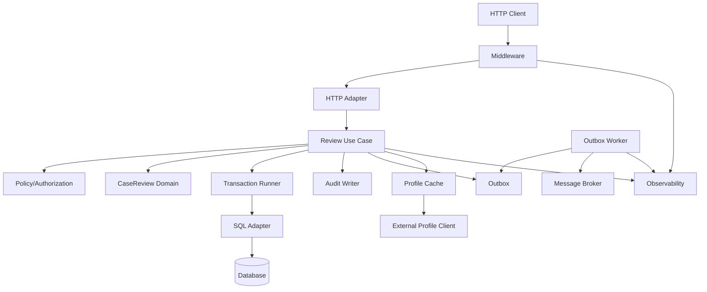
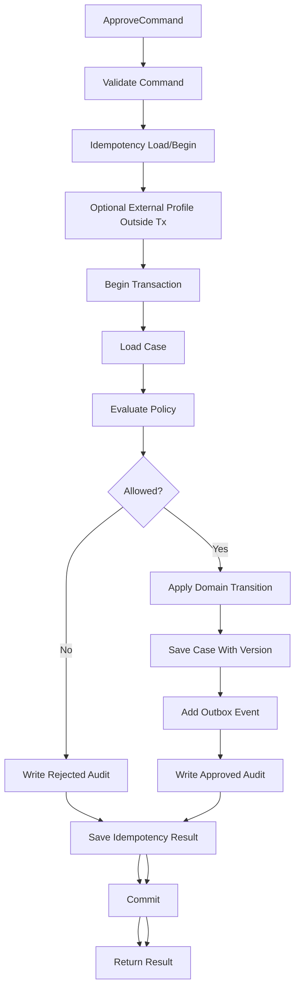
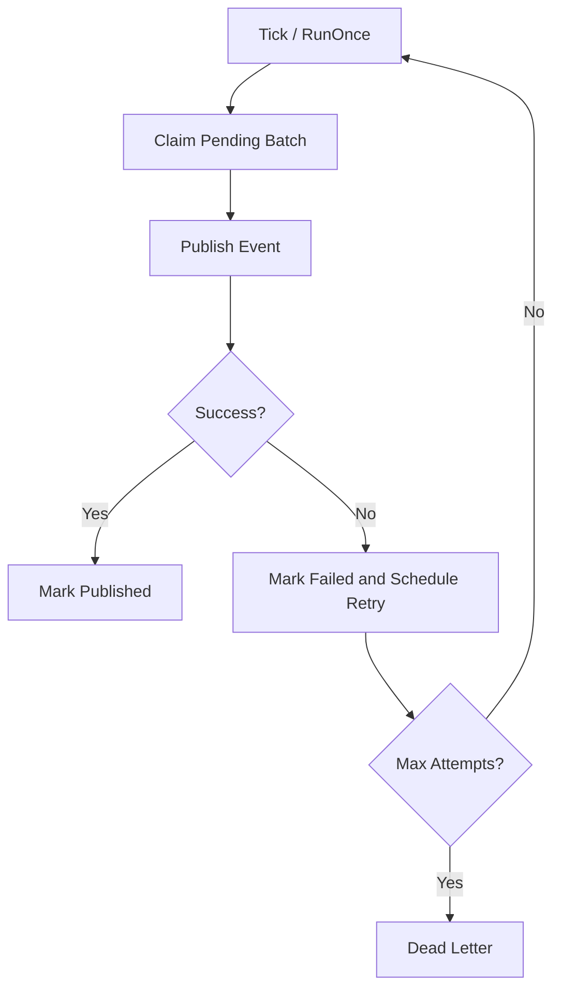
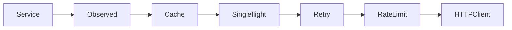
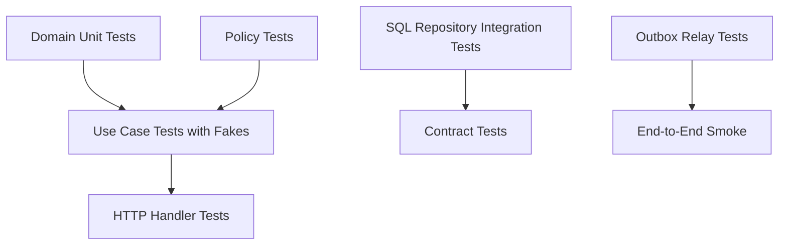
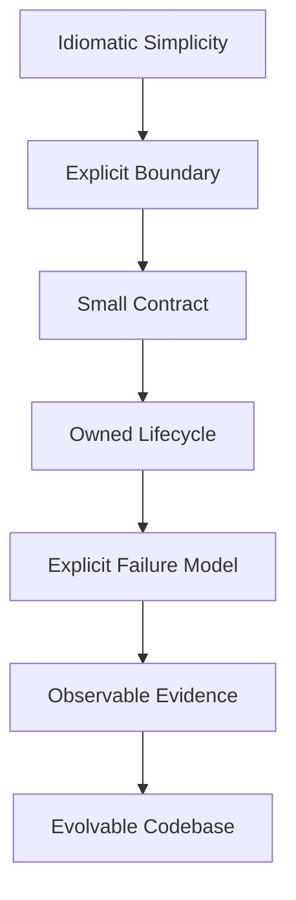

# learn-go-design-patterns-common-patterns-anti-patterns-part-035.md

# Part 035 — Capstone: Designing a Production-Grade Go Service from Zero

## Status Seri

- Seri: **Go Design Patterns, Common Patterns, and Anti-Patterns**
- Part: **035 dari 035**
- Status seri: **selesai**
- Lanjutan dari:
  - Part 034 — Anti-Pattern Catalog and Refactoring Playbook
- Ini adalah bagian terakhir dari seri.

---

## Tujuan Part Ini

Part ini adalah **capstone**: kita menyatukan seluruh seri menjadi satu desain service Go production-grade dari nol.

Kita tidak akan membuat contoh CRUD dangkal. Kita akan mendesain service yang punya karakteristik nyata:

- business workflow
- state machine
- authorization
- validation
- transaction boundary
- optimistic locking
- audit trail
- decision trace
- outbox event
- background worker
- external dependency
- retry/rate limit/cache
- structured logs
- metrics
- trace/correlation
- HTTP handler
- config
- graceful shutdown
- testing strategy
- package architecture
- failure model
- anti-pattern avoidance

Konteks contoh: **Regulatory Case Review Service**.

Service ini mengelola workflow review case enforcement/regulatory.

Use case utama:

1. Create case review.
2. Assign reviewer.
3. Approve case review.
4. Reject case review.
5. Escalate case review.
6. Close case review.
7. Publish integration event via outbox.
8. Worker mengirim event ke external message broker.

Fokus utama capstone:

> Bagaimana menyusun codebase Go yang explicit, testable, observable, resilient, auditable, dan evolvable tanpa jatuh ke Java-style over-engineering atau Go-style under-design.

---

## 1. Requirements

### 1.1 Functional Requirements

Service harus mendukung:

- Officer membuat case review.
- Supervisor assign reviewer.
- Reviewer approve/reject review.
- Reviewer bisa escalate ke supervisor.
- Supervisor bisa close case.
- Setiap state transition harus divalidasi.
- Setiap action harus diaudit.
- Setiap decision harus punya reason/trace.
- Integration event harus dipublish setelah transaksi commit.
- Duplicate command dengan idempotency key tidak boleh menghasilkan double mutation.
- Concurrent approval/rejection pada case yang sama harus aman.
- External profile service dipakai untuk enrichment actor display name, tetapi tidak boleh membuat DB transaction panjang.
- HTTP API menjadi transport utama.
- Worker memproses outbox event.
- Semua operasi harus observable.

### 1.2 Non-Functional Requirements

- Go 1.26.x compatible.
- No hidden global mutable state.
- Explicit dependency wiring.
- Context cancellation respected.
- SQL persistence via adapter.
- Strong transaction boundary.
- Outbox for event reliability.
- Structured logs.
- Bounded metrics labels.
- Audit durable.
- Testable with fake repositories and SQL integration tests.
- Graceful shutdown.
- No business logic in HTTP handler.
- No generic repository for core workflow.
- No context dependency bag.
- No publish-before-commit.
- No unbounded goroutines.

---

## 2. High-Level Architecture



Key decision:

- HTTP adapter only maps transport to command/result.
- Use case owns workflow.
- Domain owns lifecycle transition rules.
- SQL adapter implements repository ports.
- Transaction runner owns commit/rollback.
- Outbox persists event in same transaction.
- Worker publishes event after commit.
- Audit is durable and part of transaction for critical actions.
- Observability wraps boundary and critical components.

---

## 3. Package Layout

```text
reviewservice/
  go.mod

  cmd/
    api/
      main.go
    worker/
      main.go
    migrate/
      main.go

  internal/
    app/
      api.go
      worker.go
      dependencies.go
      lifecycle.go

    config/
      config.go
      env.go
      validate.go

    requestctx/
      request_id.go
      correlation_id.go
      principal.go

    auth/
      principal.go
      middleware.go
      authorizer.go

    review/
      command.go
      result.go
      service.go
      policy.go
      ports.go
      errors.go
      idempotency.go

    reviewcase/
      case.go
      state.go
      transition.go
      event.go
      errors.go

    audit/
      record.go
      writer.go

    outbox/
      event.go
      relay.go
      ports.go
      errors.go

    adapters/
      http/
        router.go
        middleware.go
        review_handler.go
        dto.go
        error_mapping.go
      sql/
        tx.go
        review_repository.go
        audit_repository.go
        outbox_repository.go
        migrations/
      external/
        profile_client.go
        profile_cache.go
      messaging/
        publisher.go

    platform/
      database/
        open.go
        health.go
      httpserver/
        server.go
      logging/
        logger.go
      metrics/
        meter.go
      tracing/
        tracer.go
      retry/
        retry.go
      clock/
        clock.go
      idgen/
        idgen.go

    testutil/
      fixed_clock.go
      builders.go
      fake_meter.go
```

### Boundary Rules

```text
cmd -> internal/app only
app -> everything needed for wiring
adapters/http -> review, auth, requestctx, platform
adapters/sql -> review, reviewcase, audit, outbox, platform
review -> reviewcase, audit, outbox, auth-like principal types
reviewcase -> no adapters, no HTTP, no SQL
platform -> no business imports
config -> no business imports
```

Forbidden:

- `reviewcase` importing `net/http`
- `review` importing `adapters/sql`
- `platform` importing `review`
- `config` opening DB connections
- `cmd` containing business logic
- `context.WithValue` outside requestctx/auth/tracing packages except with clear reason

---

## 4. Domain Model: Case Review State Machine

Package:

```text
internal/reviewcase/
```

### State

```go
package reviewcase

type State string

const (
    StateDraft              State = "draft"
    StatePendingAssignment  State = "pending_assignment"
    StateAssigned           State = "assigned"
    StatePendingDecision    State = "pending_decision"
    StateApproved           State = "approved"
    StateRejected           State = "rejected"
    StateEscalated          State = "escalated"
    StateClosed             State = "closed"
)
```

### Commands

Domain-level transition methods:

```go
type Case struct {
    ID          ID
    State       State
    Version     Version
    ReviewerID  string
    SupervisorID string
    CreatedAt   time.Time
    UpdatedAt   time.Time
}

func (c *Case) Assign(reviewerID string, actorID string, now time.Time) (Transition, error) {
    if c.State != StatePendingAssignment {
        return Transition{}, ErrIllegalTransition
    }
    if reviewerID == "" {
        return Transition{}, ErrMissingReviewer
    }

    before := c.State

    c.ReviewerID = reviewerID
    c.State = StateAssigned
    c.UpdatedAt = now
    c.Version++

    return Transition{
        ID:        NewTransitionID(),
        CaseID:    c.ID,
        Command:   "assign",
        From:      before,
        To:        c.State,
        ActorID:   actorID,
        OccurredAt: now,
    }, nil
}
```

Approve:

```go
func (c *Case) Approve(actorID string, now time.Time) (Transition, error) {
    if c.State != StatePendingDecision && c.State != StateAssigned {
        return Transition{}, ErrIllegalTransition
    }

    before := c.State

    c.State = StateApproved
    c.UpdatedAt = now
    c.Version++

    return Transition{
        ID:        NewTransitionID(),
        CaseID:    c.ID,
        Command:   "approve",
        From:      before,
        To:        c.State,
        ActorID:   actorID,
        OccurredAt: now,
    }, nil
}
```

Reject:

```go
func (c *Case) Reject(actorID string, now time.Time) (Transition, error) {
    if c.State != StatePendingDecision && c.State != StateAssigned {
        return Transition{}, ErrIllegalTransition
    }

    before := c.State

    c.State = StateRejected
    c.UpdatedAt = now
    c.Version++

    return Transition{
        ID:        NewTransitionID(),
        CaseID:    c.ID,
        Command:   "reject",
        From:      before,
        To:        c.State,
        ActorID:   actorID,
        OccurredAt: now,
    }, nil
}
```

### Transition

```go
type Transition struct {
    ID         TransitionID
    CaseID     ID
    Command    string
    From       State
    To         State
    ActorID    string
    OccurredAt time.Time
}

func (t Transition) Event() Event {
    return Event{
        ID:           NewEventID(),
        Type:         "review.case.transitioned",
        Version:      1,
        CaseID:       t.CaseID,
        TransitionID: t.ID,
        From:         t.From,
        To:           t.To,
        Command:      t.Command,
        ActorID:      t.ActorID,
        OccurredAt:   t.OccurredAt,
    }
}
```

### Domain Rules

Domain owns:

- allowed transitions
- state mutation
- version increment
- transition record
- event shape at domain level

Domain does not own:

- HTTP status
- SQL row scanning
- external API calls
- logging side effects
- transaction commit
- authorization policy that depends on actor role/assignment, unless modeled as domain policy
- audit persistence

---

## 5. Command and Result Types

Package:

```text
internal/review/
```

### Command

```go
package review

type ApproveCommand struct {
    CaseID         reviewcase.ID
    ActorID        string
    ActorRoles     []string
    IdempotencyKey string
    Comment        string
}
```

### Result

```go
type Decision string

const (
    DecisionApproved Decision = "approved"
    DecisionRejected Decision = "rejected"
    DecisionDenied   Decision = "denied"
    DecisionNoop     Decision = "noop"
)

type ApproveResult struct {
    CaseID       reviewcase.ID
    Decision     Decision
    TransitionID reviewcase.TransitionID
    Reasons      []DecisionReason
}
```

### Decision Reason

```go
type DecisionReason struct {
    Code     string
    Severity string
    Message  string
    Evidence map[string]string
}
```

Expected business rejection/denial is result, not technical error.

---

## 6. Ports

Package:

```go
package review
```

Use case owns the interfaces it consumes.

```go
type CaseRepository interface {
    FindForDecision(context.Context, reviewcase.ID) (reviewcase.Case, error)
    SaveWithVersion(context.Context, reviewcase.Case, reviewcase.Version) error
}

type AuditWriter interface {
    Write(context.Context, audit.Record) error
}

type OutboxWriter interface {
    Add(context.Context, outbox.Event) error
}

type IdempotencyStore interface {
    Load(context.Context, string) (StoredResult, bool, error)
    Begin(context.Context, string) (IdempotencyLock, error)
    Save(context.Context, string, StoredResult) error
}

type ProfileClient interface {
    GetProfile(context.Context, string) (Profile, error)
}

type TxRunner interface {
    WithinTx(context.Context, func(context.Context) error) error
}

type Clock interface {
    Now() time.Time
}
```

Note: This example keeps `TxRunner` simple. Real implementation may pass explicit tx/executor through context or typed unit-of-work. Avoid context dependency bag unless constrained inside repository/tx package with discipline. A more explicit variant is shown later.

---

## 7. Policy Design

### Approval Policy

```go
type ApprovalPolicy struct{}

type ApprovalInput struct {
    Case       reviewcase.Case
    ActorID    string
    ActorRoles []string
    Now        time.Time
}

type ApprovalDecision struct {
    Allowed bool
    Reasons []DecisionReason
    Trace   DecisionTrace
}
```

Evaluate:

```go
func (p ApprovalPolicy) Evaluate(ctx context.Context, in ApprovalInput) ApprovalDecision {
    trace := DecisionTrace{
        PolicyName:    "review_approval_policy",
        PolicyVersion: "2026-06-01",
        DecisionID:    NewDecisionID(),
        EvaluatedAt:   in.Now,
    }

    decision := ApprovalDecision{
        Allowed: true,
        Trace:   trace,
    }

    if !contains(in.ActorRoles, "reviewer") {
        decision.Allowed = false
        decision.Reasons = append(decision.Reasons, DecisionReason{
            Code:     "missing_reviewer_role",
            Severity: "blocking",
            Message:  "actor must have reviewer role",
        })
    }

    if in.Case.ReviewerID != "" && in.Case.ReviewerID != in.ActorID {
        decision.Allowed = false
        decision.Reasons = append(decision.Reasons, DecisionReason{
            Code:     "not_assigned_reviewer",
            Severity: "blocking",
            Message:  "actor is not assigned reviewer",
            Evidence: map[string]string{
                "assigned_reviewer": in.Case.ReviewerID,
            },
        })
    }

    return decision
}
```

Policy returns structured decision, not error, unless evaluation itself fails technically.

---

## 8. Use Case Service

```go
type Service struct {
    cases       CaseRepository
    audit       AuditWriter
    outbox      OutboxWriter
    idempotency IdempotencyStore
    profiles    ProfileClient
    policy      ApprovalPolicy
    txs         TxRunner
    clock       Clock
}

func NewService(
    cases CaseRepository,
    audit AuditWriter,
    outbox OutboxWriter,
    idempotency IdempotencyStore,
    profiles ProfileClient,
    policy ApprovalPolicy,
    txs TxRunner,
    clock Clock,
) *Service {
    if cases == nil {
        panic("nil CaseRepository")
    }
    if audit == nil {
        panic("nil AuditWriter")
    }
    if outbox == nil {
        panic("nil OutboxWriter")
    }
    if txs == nil {
        panic("nil TxRunner")
    }
    if clock == nil {
        panic("nil Clock")
    }

    return &Service{
        cases:       cases,
        audit:       audit,
        outbox:      outbox,
        idempotency: idempotency,
        profiles:    profiles,
        policy:      policy,
        txs:         txs,
        clock:       clock,
    }
}
```

Constructor validates required dependencies. Optional dependencies should have explicit null object or documented behavior.

---

## 9. Approve Use Case Flow



Important:

- External profile call happens before transaction if not required for consistency.
- Transaction contains state mutation, outbox, audit, idempotency save.
- Expected denial returns result, not technical error.
- Optimistic locking handles concurrent mutation.
- Outbox event is persisted before commit, published later.

---

## 10. Approve Implementation

```go
func (s *Service) Approve(ctx context.Context, cmd ApproveCommand) (ApproveResult, error) {
    if err := ValidateApproveCommand(cmd); err != nil {
        return ApproveResult{}, err
    }

    if s.idempotency != nil && cmd.IdempotencyKey != "" {
        if stored, ok, err := s.idempotency.Load(ctx, cmd.IdempotencyKey); err != nil {
            return ApproveResult{}, err
        } else if ok {
            return stored.ApproveResult, nil
        }
    }

    var actorProfile Profile
    if s.profiles != nil {
        profile, err := s.profiles.GetProfile(ctx, cmd.ActorID)
        if err == nil {
            actorProfile = profile
        }
        // Explicit policy: profile enrichment failure is non-blocking.
        // If profile is required for authorization, this must become blocking before transaction.
    }

    now := s.clock.Now()
    var result ApproveResult

    err := s.txs.WithinTx(ctx, func(ctx context.Context) error {
        c, err := s.cases.FindForDecision(ctx, cmd.CaseID)
        if err != nil {
            return err
        }

        beforeVersion := c.Version
        beforeState := c.State

        decision := s.policy.Evaluate(ctx, ApprovalInput{
            Case:       c,
            ActorID:    cmd.ActorID,
            ActorRoles: cmd.ActorRoles,
            Now:        now,
        })

        if !decision.Allowed {
            result = ApproveResult{
                CaseID:   cmd.CaseID,
                Decision: DecisionDenied,
                Reasons:  decision.Reasons,
            }

            return s.audit.Write(ctx, audit.Record{
                ID:          audit.NewID(),
                Time:        now,
                ActorID:     cmd.ActorID,
                ActorName:   actorProfile.DisplayName,
                Action:      "review.approve",
                ObjectType:  "review_case",
                ObjectID:    cmd.CaseID.String(),
                Outcome:     "denied",
                BeforeState: string(beforeState),
                AfterState:  string(beforeState),
                Reasons:     auditReasons(decision.Reasons),
                Metadata: map[string]string{
                    "policy":         decision.Trace.PolicyName,
                    "policy_version": decision.Trace.PolicyVersion,
                },
            })
        }

        transition, err := c.Approve(cmd.ActorID, now)
        if err != nil {
            return err
        }

        if err := s.cases.SaveWithVersion(ctx, c, beforeVersion); err != nil {
            return err
        }

        event := outbox.Event{
            ID:            outbox.NewEventID(),
            Type:          "review.case.approved",
            Version:       1,
            AggregateID:   cmd.CaseID.String(),
            CorrelationID: correlationIDOrEmpty(ctx),
            CausationID:   requestIDOrEmpty(ctx),
            OccurredAt:    now,
            Payload: map[string]any{
                "case_id":       cmd.CaseID.String(),
                "transition_id": transition.ID.String(),
                "actor_id":      cmd.ActorID,
                "approved_at":   now.Format(time.RFC3339Nano),
            },
        }

        if err := s.outbox.Add(ctx, event); err != nil {
            return err
        }

        if err := s.audit.Write(ctx, audit.Record{
            ID:          audit.NewID(),
            Time:        now,
            ActorID:     cmd.ActorID,
            ActorName:   actorProfile.DisplayName,
            Action:      "review.approve",
            ObjectType:  "review_case",
            ObjectID:    cmd.CaseID.String(),
            Outcome:     "approved",
            BeforeState: string(beforeState),
            AfterState:  string(c.State),
            Metadata: map[string]string{
                "transition_id": transition.ID.String(),
            },
        }); err != nil {
            return err
        }

        result = ApproveResult{
            CaseID:       cmd.CaseID,
            Decision:     DecisionApproved,
            TransitionID: transition.ID,
        }

        if s.idempotency != nil && cmd.IdempotencyKey != "" {
            if err := s.idempotency.Save(ctx, cmd.IdempotencyKey, StoredResult{
                ApproveResult: result,
            }); err != nil {
                return err
            }
        }

        return nil
    })

    if err != nil {
        return ApproveResult{}, err
    }

    return result, nil
}
```

This code is intentionally explicit. It is not the shortest possible code. It is designed for defensibility.

---

## 11. Transaction Boundary: Explicit Alternative

The previous example used a simplified `TxRunner` where repositories implicitly know current transaction. A stricter pattern passes explicit unit-of-work.

```go
type UnitOfWork interface {
    Cases() CaseRepository
    Audit() AuditWriter
    Outbox() OutboxWriter
    Idempotency() IdempotencyStore
}

type TxRunner interface {
    WithinTx(context.Context, func(context.Context, UnitOfWork) error) error
}
```

Use:

```go
err := s.txs.WithinTx(ctx, func(ctx context.Context, uow UnitOfWork) error {
    c, err := uow.Cases().FindForDecision(ctx, cmd.CaseID)
    if err != nil {
        return err
    }

    if err := uow.Cases().SaveWithVersion(ctx, c, beforeVersion); err != nil {
        return err
    }

    if err := uow.Outbox().Add(ctx, event); err != nil {
        return err
    }

    return uow.Audit().Write(ctx, record)
})
```

This avoids hiding transaction in context. It makes transaction ownership explicit.

Trade-off:

- more code
- clearer transaction scope
- better test seam
- less magical

For critical systems, explicit UoW is often worth it.

---

## 12. SQL Adapter

Package:

```text
internal/adapters/sql/
```

### Repository

```go
type ReviewRepository struct {
    db Queryer
}

type Queryer interface {
    QueryRowContext(context.Context, string, ...any) Row
    ExecContext(context.Context, string, ...any) (sql.Result, error)
}
```

This allows `*sql.DB` or `*sql.Tx`.

```go
func (r *ReviewRepository) FindForDecision(ctx context.Context, id reviewcase.ID) (reviewcase.Case, error) {
    row := r.db.QueryRowContext(ctx, `
        SELECT id, state, version, reviewer_id, supervisor_id, created_at, updated_at
        FROM review_cases
        WHERE id = ?
    `, id.String())

    c, err := scanCase(row)
    if err != nil {
        return reviewcase.Case{}, mapDBError(err)
    }

    return c, nil
}
```

### Optimistic Save

```go
func (r *ReviewRepository) SaveWithVersion(ctx context.Context, c reviewcase.Case, expected reviewcase.Version) error {
    res, err := r.db.ExecContext(ctx, `
        UPDATE review_cases
        SET state = ?, reviewer_id = ?, supervisor_id = ?, version = ?, updated_at = ?
        WHERE id = ? AND version = ?
    `,
        c.State,
        c.ReviewerID,
        c.SupervisorID,
        c.Version,
        c.UpdatedAt,
        c.ID.String(),
        expected,
    )
    if err != nil {
        return mapDBError(err)
    }

    rows, err := res.RowsAffected()
    if err != nil {
        return mapDBError(err)
    }

    if rows == 0 {
        return ErrConflict
    }

    return nil
}
```

Important:

- no generic repository
- query intent explicit
- version conflict explicit
- DB errors mapped at adapter boundary
- repository does not start transaction itself

---

## 13. Outbox Schema and Repository

### Table Concept

```text
outbox_events
- id
- type
- version
- aggregate_id
- correlation_id
- causation_id
- occurred_at
- payload_json
- status
- attempts
- next_attempt_at
- locked_by
- locked_until
- published_at
- last_error
```

### Add

```go
func (r *OutboxRepository) Add(ctx context.Context, event outbox.Event) error {
    payload, err := json.Marshal(event.Payload)
    if err != nil {
        return err
    }

    _, err = r.db.ExecContext(ctx, `
        INSERT INTO outbox_events (
            id, type, version, aggregate_id, correlation_id, causation_id,
            occurred_at, payload_json, status, attempts
        ) VALUES (?, ?, ?, ?, ?, ?, ?, ?, 'pending', 0)
    `,
        event.ID.String(),
        event.Type,
        event.Version,
        event.AggregateID,
        event.CorrelationID,
        event.CausationID,
        event.OccurredAt,
        payload,
    )

    if err != nil {
        return mapDBError(err)
    }

    return nil
}
```

Outbox add is inside same transaction as case mutation and audit.

---

## 14. Outbox Relay Worker

Package:

```text
internal/outbox/
```

### Flow



### Relay

```go
type Relay struct {
    store     Store
    publisher Publisher
    logger    *slog.Logger
    meter     Meter
    clock     Clock
    workerID  string
    batchSize int
}

type Store interface {
    ClaimBatch(context.Context, string, int, time.Time) ([]Event, error)
    MarkPublished(context.Context, EventID, time.Time) error
    MarkFailed(context.Context, EventID, error, time.Time) error
}

type Publisher interface {
    Publish(context.Context, Event) error
}
```

### RunOnce

```go
func (r *Relay) RunOnce(ctx context.Context) error {
    now := r.clock.Now()

    events, err := r.store.ClaimBatch(ctx, r.workerID, r.batchSize, now)
    if err != nil {
        return err
    }

    for _, event := range events {
        eventCtx := withEventContext(ctx, event)

        start := time.Now()
        err := r.publisher.Publish(eventCtx, event)
        duration := time.Since(start)

        status := "success"
        if err != nil {
            status = classifyPublishError(err)
        }

        r.meter.Increment(eventCtx, "outbox_publish_total",
            "event_type", event.Type,
            "status", status,
        )
        r.meter.Duration(eventCtx, "outbox_publish_duration",
            duration,
            "event_type", event.Type,
            "status", status,
        )

        if err != nil {
            r.logger.WarnContext(eventCtx, "outbox publish failed",
                slog.String("event_id", event.ID.String()),
                slog.String("event_type", event.Type),
                slog.String("error", err.Error()),
            )

            if markErr := r.store.MarkFailed(ctx, event.ID, err, r.clock.Now()); markErr != nil {
                return markErr
            }
            continue
        }

        if err := r.store.MarkPublished(ctx, event.ID, r.clock.Now()); err != nil {
            return err
        }

        r.logger.InfoContext(eventCtx, "outbox event published",
            slog.String("event_id", event.ID.String()),
            slog.String("event_type", event.Type),
        )
    }

    return nil
}
```

### Worker Loop

```go
func (r *Relay) Run(ctx context.Context, interval time.Duration) error {
    ticker := time.NewTicker(interval)
    defer ticker.Stop()

    for {
        if err := r.RunOnce(ctx); err != nil {
            r.logger.ErrorContext(ctx, "outbox relay run failed",
                slog.String("error", err.Error()),
            )
        }

        select {
        case <-ctx.Done():
            return ctx.Err()
        case <-ticker.C:
        }
    }
}
```

---

## 15. HTTP Adapter

Package:

```text
internal/adapters/http/
```

### DTO

```go
type ApproveRequest struct {
    Comment string `json:"comment"`
}

type ApproveResponse struct {
    CaseID       string   `json:"case_id"`
    Decision     string   `json:"decision"`
    TransitionID string   `json:"transition_id,omitempty"`
    Reasons      []Reason `json:"reasons,omitempty"`
}

type Reason struct {
    Code     string `json:"code"`
    Severity string `json:"severity"`
    Message  string `json:"message"`
}
```

### Handler

```go
type Approver interface {
    Approve(context.Context, review.ApproveCommand) (review.ApproveResult, error)
}

type ApproveHandler struct {
    approver Approver
}

func NewApproveHandler(approver Approver) *ApproveHandler {
    if approver == nil {
        panic("nil Approver")
    }
    return &ApproveHandler{approver: approver}
}

func (h *ApproveHandler) ServeHTTP(w http.ResponseWriter, r *http.Request) {
    caseID := pathValue(r, "caseID")

    var req ApproveRequest
    if err := decodeJSON(r.Body, &req); err != nil {
        writeError(w, err)
        return
    }

    principal, ok := requestctx.Principal(r.Context())
    if !ok {
        writeError(w, ErrUnauthenticated)
        return
    }

    cmd := review.ApproveCommand{
        CaseID:         reviewcase.ID(caseID),
        ActorID:        principal.ID,
        ActorRoles:     principal.Roles,
        IdempotencyKey: r.Header.Get("Idempotency-Key"),
        Comment:        req.Comment,
    }

    result, err := h.approver.Approve(r.Context(), cmd)
    if err != nil {
        writeError(w, err)
        return
    }

    status := http.StatusOK
    if result.Decision == review.DecisionDenied {
        status = http.StatusForbidden
    }

    writeJSON(w, status, toApproveResponse(result))
}
```

Handler does not:

- query DB
- change state
- publish event
- audit
- retry external dependency
- decide policy

---

## 16. Middleware

Middleware stack:

```go
handler := Chain(
    Recover(logger),
    RequestID(),
    CorrelationID(),
    AccessLog(logger, meter),
    Timeout(cfg.HTTP.RequestTimeout),
    Authenticate(authenticator),
)(router)
```

Ordering reasoning:

1. Recover outer enough to catch panic.
2. Request/correlation ID early.
3. Access log measures entire request.
4. Timeout wraps authenticated/business operation.
5. Authentication before handlers.
6. Handler maps request to command.

Do not put domain authorization only in middleware. Domain/resource authorization belongs in use case/policy.

---

## 17. External Profile Client With Cache and Retry

Profile enrichment is non-critical in this design.

### Interface

```go
type ProfileClient interface {
    GetProfile(context.Context, string) (Profile, error)
}
```

### Stack



Wiring:

```go
profileClient := external.NewHTTPProfileClient(httpClient, cfg.Profile)
profileClient = external.NewRateLimitedProfileClient(profileClient, limiter)
profileClient = external.NewRetryProfileClient(profileClient, retryPolicy)
profileClient = external.NewSingleflightProfileClient(profileClient)
profileClient = external.NewCachedProfileClient(profileClient, profileCache)
profileClient = external.NewObservedProfileClient(profileClient, logger, meter)
```

Policy:

- profile failure does not block approval
- profile is not used for authorization
- profile display name may be absent in audit metadata
- metric records dependency failure
- no raw profile payload in logs

If profile becomes required for authorization, design must change.

---

## 18. Configuration

```go
type Config struct {
    HTTP     HTTPConfig
    Database DatabaseConfig
    Logging  LoggingConfig
    Outbox   OutboxConfig
    Profile  ProfileConfig
}

type HTTPConfig struct {
    Addr           string
    RequestTimeout time.Duration
}

type OutboxConfig struct {
    PollInterval time.Duration
    BatchSize    int
}
```

Load:

```go
func Load() (Config, error) {
    raw := loadRawFromEnv()
    cfg := applyDefaults(raw)
    if err := cfg.Validate(); err != nil {
        return Config{}, err
    }
    return cfg, nil
}
```

Rules:

- config package loads/validates only
- no DB open in config package
- no business imports
- redacted config can be logged
- required values fail startup

---

## 19. App Wiring

Package:

```text
internal/app/
```

```go
func NewAPI(ctx context.Context, cfg config.Config) (*API, error) {
    logger := logging.New(cfg.Logging)
    meter := metrics.New()

    db, err := database.Open(ctx, cfg.Database)
    if err != nil {
        return nil, err
    }

    txRunner := sqladapter.NewTxRunner(db)

    caseRepo := sqladapter.NewReviewRepository(db)
    auditRepo := sqladapter.NewAuditRepository(db)
    outboxRepo := sqladapter.NewOutboxRepository(db)
    idempotencyRepo := sqladapter.NewIdempotencyRepository(db)

    profileClient := buildProfileClient(cfg.Profile, logger, meter)

    service := review.NewService(
        caseRepo,
        auditRepo,
        outboxRepo,
        idempotencyRepo,
        profileClient,
        review.ApprovalPolicy{},
        txRunner,
        clock.Real{},
    )

    service = review.NewObservedService(service, logger, meter)

    router := httpadapter.NewRouter(httpadapter.RouterDeps{
        Approver: service,
        Logger:   logger,
        Meter:    meter,
    })

    server := httpserver.New(cfg.HTTP, router)

    return &API{
        server: server,
        db:     db,
        logger: logger,
    }, nil
}
```

This is explicit. The composition root reveals architecture.

---

## 20. Lifecycle and Graceful Shutdown

```go
type API struct {
    server *http.Server
    db     *sql.DB
    logger *slog.Logger
}

func (a *API) Run(ctx context.Context) error {
    errCh := make(chan error, 1)

    go func() {
        a.logger.InfoContext(ctx, "http server starting",
            slog.String("addr", a.server.Addr),
        )

        if err := a.server.ListenAndServe(); err != nil && !errors.Is(err, http.ErrServerClosed) {
            errCh <- err
            return
        }

        errCh <- nil
    }()

    select {
    case <-ctx.Done():
        shutdownCtx, cancel := context.WithTimeout(context.Background(), 30*time.Second)
        defer cancel()

        if err := a.server.Shutdown(shutdownCtx); err != nil {
            return err
        }

        return a.db.Close()

    case err := <-errCh:
        return err
    }
}
```

Worker app similar:

```go
func (w *WorkerApp) Run(ctx context.Context) error {
    return w.relay.Run(ctx, w.cfg.Outbox.PollInterval)
}
```

No hidden goroutine without owner.

---

## 21. Observability Design

### Logs

Operation logs:

```text
case approval completed
case approval failed
outbox event published
outbox publish failed
external profile lookup failed
```

Fields:

- operation
- request_id
- correlation_id
- actor_id
- case_id
- decision
- error_class
- duration
- transition_id

No raw comment. No token. No raw payload.

### Metrics

HTTP:

```text
http_request_total{method, route, status_class}
http_request_duration_seconds_bucket{method, route}
```

Use case:

```text
review_approval_total{outcome}
review_approval_duration_seconds_bucket{outcome}
```

Outbox:

```text
outbox_pending_total
outbox_oldest_pending_age_seconds
outbox_publish_total{event_type,status}
outbox_publish_duration_seconds_bucket{event_type,status}
```

External:

```text
external_request_total{dependency,operation,status}
external_request_duration_seconds_bucket{dependency,operation,status}
external_retry_total{dependency,operation,reason}
```

No labels:

- case_id
- actor_id
- raw error
- email
- comment

### Audit

Audit record includes:

- actor
- action
- object
- outcome
- before/after state
- reasons
- policy version
- transition ID
- correlation ID
- timestamp

### Decision Trace

Decision trace stored with audit metadata or separate decision table.

---

## 22. Error Taxonomy

```go
type ErrorClass string

const (
    ErrorValidation   ErrorClass = "validation"
    ErrorUnauthorized ErrorClass = "unauthorized"
    ErrorForbidden    ErrorClass = "forbidden"
    ErrorNotFound     ErrorClass = "not_found"
    ErrorConflict     ErrorClass = "conflict"
    ErrorTimeout      ErrorClass = "timeout"
    ErrorCanceled     ErrorClass = "canceled"
    ErrorDependency   ErrorClass = "dependency"
    ErrorDatabase     ErrorClass = "database"
    ErrorInternal     ErrorClass = "internal"
)
```

Classifier:

```go
func Classify(err error) ErrorClass {
    switch {
    case err == nil:
        return ""
    case errors.Is(err, context.Canceled):
        return ErrorCanceled
    case errors.Is(err, context.DeadlineExceeded):
        return ErrorTimeout
    case errors.Is(err, ErrValidation):
        return ErrorValidation
    case errors.Is(err, ErrForbidden):
        return ErrorForbidden
    case errors.Is(err, ErrNotFound):
        return ErrorNotFound
    case errors.Is(err, ErrConflict):
        return ErrorConflict
    default:
        return ErrorInternal
    }
}
```

HTTP mapping:

```go
func statusForError(err error) int {
    switch Classify(err) {
    case ErrorValidation:
        return http.StatusBadRequest
    case ErrorUnauthorized:
        return http.StatusUnauthorized
    case ErrorForbidden:
        return http.StatusForbidden
    case ErrorNotFound:
        return http.StatusNotFound
    case ErrorConflict:
        return http.StatusConflict
    case ErrorTimeout:
        return http.StatusGatewayTimeout
    default:
        return http.StatusInternalServerError
    }
}
```

---

## 23. Testing Strategy



### Domain Tests

- valid transitions
- illegal transitions
- version increment
- no mutation on failed transition
- event generation

### Policy Tests

- reviewer allowed
- missing role denied
- unassigned reviewer denied
- reason codes
- policy version
- decision trace

### Service Tests with Fakes

Use fake case repo, spy audit, spy outbox, fake idempotency, fake clock.

Test:

- approval success
- denied result
- audit written
- outbox event added
- optimistic conflict returned
- idempotent duplicate returns stored result
- profile failure non-blocking
- repository failure returns error
- audit failure fails transaction
- context cancellation

### Handler Tests

Use fake approver.

Test:

- decode request
- actor mapping
- idempotency header
- decision response
- error mapping

### Repository Integration Tests

Use real DB/test container/local test DB.

Test:

- find missing maps not found
- save with version success
- save with wrong version conflict
- audit insert
- outbox insert
- transaction rollback

### Outbox Relay Tests

Use fake store/publisher or test DB + fake publisher.

Test:

- publish success
- mark failed on transient error
- dead-letter
- correlation propagation
- duplicate safety

---

## 24. Example Service Test

```go
func TestApproveSuccess(t *testing.T) {
    now := time.Date(2026, 6, 23, 10, 0, 0, 0, time.UTC)

    cases := NewFakeCaseRepository()
    cases.Seed(reviewcase.Case{
        ID:         "CASE-1",
        State:      reviewcase.StateAssigned,
        Version:    1,
        ReviewerID: "USER-1",
    })

    auditWriter := &SpyAuditWriter{}
    outboxWriter := &SpyOutboxWriter{}
    clock := FixedClock{NowValue: now}

    svc := review.NewService(
        cases,
        auditWriter,
        outboxWriter,
        nil,
        nil,
        review.ApprovalPolicy{},
        NoopTxRunner{},
        clock,
    )

    result, err := svc.Approve(context.Background(), review.ApproveCommand{
        CaseID:     "CASE-1",
        ActorID:    "USER-1",
        ActorRoles: []string{"reviewer"},
    })
    if err != nil {
        t.Fatal(err)
    }

    if result.Decision != review.DecisionApproved {
        t.Fatalf("decision = %s", result.Decision)
    }

    saved := cases.MustGet("CASE-1")
    if saved.State != reviewcase.StateApproved {
        t.Fatalf("state = %s", saved.State)
    }

    if len(auditWriter.Records) != 1 {
        t.Fatalf("audit records = %d", len(auditWriter.Records))
    }

    if len(outboxWriter.Events) != 1 {
        t.Fatalf("outbox events = %d", len(outboxWriter.Events))
    }
}
```

This test asserts behavior, not internal call sequence.

---

## 25. Failure Model

Production-grade design requires failure model.

### Failure: Duplicate Approve Request

Defense:

- idempotency key
- optimistic lock
- state transition idempotency if desired
- conflict response if different command

### Failure: Approve and Reject Race

Defense:

- optimistic version in save
- one wins
- loser receives conflict
- no double event

### Failure: DB Commit Fails

Defense:

- transaction returns error
- no response success
- no external publish before commit

### Failure: Event Publish Fails

Defense:

- outbox event remains pending
- relay retries
- metrics/alerts on backlog

### Failure: Audit Write Fails

Defense:

- fail transaction if audit required
- or durable audit outbox if async
- never silently ignore required audit

### Failure: Profile Service Down

Defense:

- non-critical enrichment
- timeout/retry/cache
- failure metric
- approval still proceeds without display name

### Failure: Worker Crashes After Publish Before Mark Published

Defense:

- at-least-once delivery
- consumer idempotency
- event ID stable
- MarkPublished retried next run may republish

### Failure: Context Canceled

Defense:

- DB/HTTP calls use context
- transaction rolls back
- worker exits on shutdown
- no goroutine leak

### Failure: Metrics Backend Down

Defense:

- metrics failure should not block business path
- use non-blocking client or fail-safe meter

### Failure: Logger Fails

Defense:

- logging failure should not crash business path normally
- audit is separate if required

---

## 26. Anti-Pattern Avoidance Checklist

This design avoids:

| Anti-Pattern | Avoidance |
|---|---|
| Business logic in handler | Handler only maps command/result |
| Generic repository | Domain-specific repository ports |
| Publish before commit | Transactional outbox |
| Audit as log | Durable audit writer |
| Context dependency bag | Dependencies in structs |
| Hidden goroutines | Worker lifecycle explicit |
| Constructor side effect | Start/Run explicit |
| Global config | Typed config passed through wiring |
| Interface everywhere | Interfaces only at consumer boundaries |
| God service | Use case package per capability |
| State mutation scattered | Domain transition methods |
| Error for business rejection | Result decision |
| High-cardinality metrics | Bounded labels |
| Over-mocking | Fakes/spies/contract tests |
| Network call in transaction | Profile fetched before transaction or non-blocking |
| Retry storm | Retry only in external client decorator |
| Cache as source of truth | Cache only enrichment/profile |

---

## 27. Review Checklist for New Feature

When adding a new workflow:

### API / Handler

- Is request DTO separate from command?
- Is handler thin?
- Is error mapping centralized?
- Is auth principal mapped safely?

### Use Case

- Is command explicit?
- Is result explicit?
- Are business rejections results, not technical errors?
- Is authorization in correct layer?
- Is validation separated by boundary?
- Is transaction boundary clear?

### Domain

- Is state transition method centralized?
- Is illegal transition modeled?
- Is version/concurrency handled?
- Is event/audit data generated consistently?

### Persistence

- Is repository domain-specific?
- Does save use optimistic lock if needed?
- Are DB errors mapped?
- Is transaction owner correct?

### Events

- Is outbox used?
- Is event semantic and versioned?
- Is consumer idempotency considered?

### Observability

- Are logs structured?
- Are metrics bounded?
- Is correlation propagated?
- Is audit durable?
- Is decision trace recorded if needed?

### Testing

- Are domain/policy tests added?
- Are use case tests using fakes?
- Are repository integration tests added?
- Are handler tests added?
- Are failure paths covered?

### Operations

- Does context cancellation work?
- Is shutdown safe?
- Are retries bounded?
- Is config validated?
- Are health checks updated?

---

## 28. Evolution Strategy

Production systems evolve. This design supports evolution.

### Add New Transition

1. Add domain method or transition table entry.
2. Add command/result.
3. Add policy.
4. Add service method.
5. Add audit action.
6. Add event type/version.
7. Add handler route.
8. Add tests.

### Add gRPC Transport

1. Create `adapters/grpc`.
2. Map protobuf request to command.
3. Reuse use case.
4. Map result/error to gRPC status.
5. No domain change.

### Add New Database

1. Implement repository ports in new adapter.
2. Run contract tests.
3. Switch wiring.
4. No use case change.

### Add Event Consumer

1. Define consumer adapter.
2. Use event ID idempotency.
3. Rehydrate correlation/causation.
4. Call use case command if needed.

### Split Service Later

1. Identify package boundary already isolated.
2. Promote ports to API contracts.
3. Replace internal calls with network/event boundary.
4. Keep domain semantics.

Good modular monolith can become services more safely than messy microservices.

---

## 29. Why This Is Not Over-Engineered

This design may look large. But each piece exists because of a real requirement:

| Requirement | Design Element |
|---|---|
| State lifecycle | domain state machine |
| Concurrent mutation | optimistic version |
| Reliable event publish | outbox |
| Accountability | audit |
| Explainable rejection | decision trace |
| Multiple transports | command/use case boundary |
| Testability | ports/fakes/contract tests |
| Operability | logs/metrics/traces |
| Graceful deploy | lifecycle/shutdown |
| External dependency | adapter + retry/cache |
| Idempotency | idempotency store |
| Privacy | redaction/log policy |

If you do not need a requirement, do not add its pattern.

Pattern selection must be requirement-driven.

---

## 30. Minimal Version for Smaller Service

For a smaller internal tool, simplify:

- no outbox if no integration event
- no idempotency if no duplicate risk
- no profile client if no enrichment
- no audit if not accountability-critical
- no separate policy package if rule trivial
- no worker binary
- real filesystem/temp DB in tests

But keep:

- thin handler
- explicit command/result
- typed config
- clear repository boundary
- context propagation
- structured errors
- package cohesion
- tests

Simplicity does not mean mixing everything in handler.

---

## 31. Final Mental Model of the Whole Series

Across 35 parts, the recurring theme is:



Top-tier Go engineering is not about memorizing pattern names.

It is about repeatedly asking:

- What is the boundary?
- Who owns this behavior?
- What is the contract?
- What can fail?
- Who observes failure?
- Who retries?
- Who cancels?
- Who commits?
- Who audits?
- Who publishes?
- Who can change this without breaking others?
- Does the code make those answers obvious?

---

## 32. Final Series Checklist

You should now be able to evaluate a Go codebase through these dimensions:

### Package

- cohesive?
- meaningful name?
- small API?
- import direction sane?

### API

- exported intentionally?
- concrete vs interface decision clear?
- options/config stable?

### Interface

- consumer-owned?
- small?
- behavior-based?

### Construction

- dependencies explicit?
- lifecycle not hidden?
- no `init()` abuse?

### Config

- typed?
- validated?
- no env read everywhere?

### Use Case

- command/result explicit?
- business decision not error?
- transaction clear?

### Domain

- state/invariant centralized?
- transition auditable?
- invalid mutation prevented?

### Persistence

- repository semantic?
- no generic CRUD illusion?
- transaction owned by use case?

### Events

- outbox?
- semantic versioned event?
- idempotent consumer?

### Worker

- bounded?
- cancellable?
- observable?
- retry/dead-letter?

### Resilience

- timeout?
- retry budget?
- rate limit?
- cache policy?

### Observability

- log/metric/trace/audit separated?
- bounded labels?
- correlation propagated?
- decision trace?

### Testing

- seam at right boundary?
- fakes honest?
- contract tests?
- integration where needed?

### Anti-Pattern

- global state?
- common package?
- god service?
- context abuse?
- over-mocking?
- hidden goroutine?
- sensitive logs?

---

## 33. Exercises

### Exercise 1: Design Review

Take this requirement:

> Officer can reopen a rejected case if they have supervisor approval, but only within 7 days.

Design:

- command
- policy
- state transition
- audit record
- event
- repository method
- tests
- metrics

### Exercise 2: Add Escalation Workflow

Add `Escalate` use case.

Include:

- command/result
- authorization
- domain transition
- audit
- outbox event
- handler
- tests

### Exercise 3: Failure Model

For `Approve`, write failure model for:

- DB not found
- DB conflict
- audit failure
- outbox failure
- idempotency store failure
- profile service timeout
- context cancellation

Decide response/error/metric/audit behavior.

### Exercise 4: Import Graph Rule

Write forbidden import rules for this codebase and propose how to check them in CI.

### Exercise 5: Testing Plan

Create complete test plan for approval workflow:

- unit
- service fake
- handler
- repository integration
- outbox relay
- observability
- concurrency
- cancellation

---

## 34. Penutup Seri

Seri **Go Design Patterns, Common Patterns, and Anti-Patterns** selesai di part ini.

Kita telah membangun pemahaman dari:

- design philosophy
- Java-to-Go reframing
- package/API/interface design
- construction/config/wiring
- adapter/repository/transaction
- handler/middleware/context/error
- decision/validation/state machine
- command/event/worker/pipeline
- resilience/cache/plugin/decorator
- template/hook/generics
- observability/testing/codebase architecture
- anti-pattern/refactoring
- capstone service design

Kesimpulan terbesar:

> Go design yang kuat bukan berasal dari banyak pattern. Go design yang kuat berasal dari boundary yang jelas, dependency yang eksplisit, failure yang dimodelkan, dan code yang cukup sederhana untuk dipahami saat production sedang gagal.

Jika kamu bisa membuat sistem Go yang:

- mudah dibaca
- mudah dites
- mudah dioperasikan
- aman terhadap failure
- jelas auditnya
- jelas transaction/event consistency-nya
- tidak over-abstracted
- tidak under-designed
- evolvable tanpa rewrite

maka kamu sudah berada jauh di atas rata-rata engineer yang hanya tahu syntax dan template.

---

## 35. Seri Selesai

Status:

# Seri selesai — Part 035 dari 035

Rekomendasi lanjutan setelah seri ini:

1. **Go Clean Architecture vs Modular Monolith in Practice**
   - bukan teori, tapi import graph, deployment boundary, transaction/event boundary.

2. **Go Distributed Systems Patterns**
   - idempotency, saga, outbox/inbox, leasing, consensus-adjacent patterns, distributed locks, message ordering.

3. **Go Production Runtime Engineering**
   - GC behavior, pprof, runtime metrics, scheduler, memory pressure, CPU profiling, latency debugging.

4. **Go Security Architecture**
   - authentication, authorization, secure session, OAuth/OIDC, token validation, signing, secrets, audit, threat modeling.

5. **Go Data-Intensive Backend**
   - SQL consistency, read models, event sourcing trade-offs, CQRS, CDC, streaming, OLTP/OLAP integration.

6. **Go Platform Engineering**
   - config, deployment, health, readiness, graceful shutdown, Kubernetes, observability, SLO, incident readiness.

7. **Go Code Review Masterclass**
   - reviewing Go PRs for architecture, correctness, concurrency, error handling, observability, and operability.

<!-- NAVIGATION_FOOTER -->
<div class="page-nav">
<a href="./learn-go-design-patterns-common-patterns-anti-patterns-part-034.md">⬅️ Part 034 — Anti-Pattern Catalog and Refactoring Playbook</a>
<a href="./index.md">📚 Kategori</a>
<a href="../../index.md">🏠 Home</a>
<span></span>
</div>
