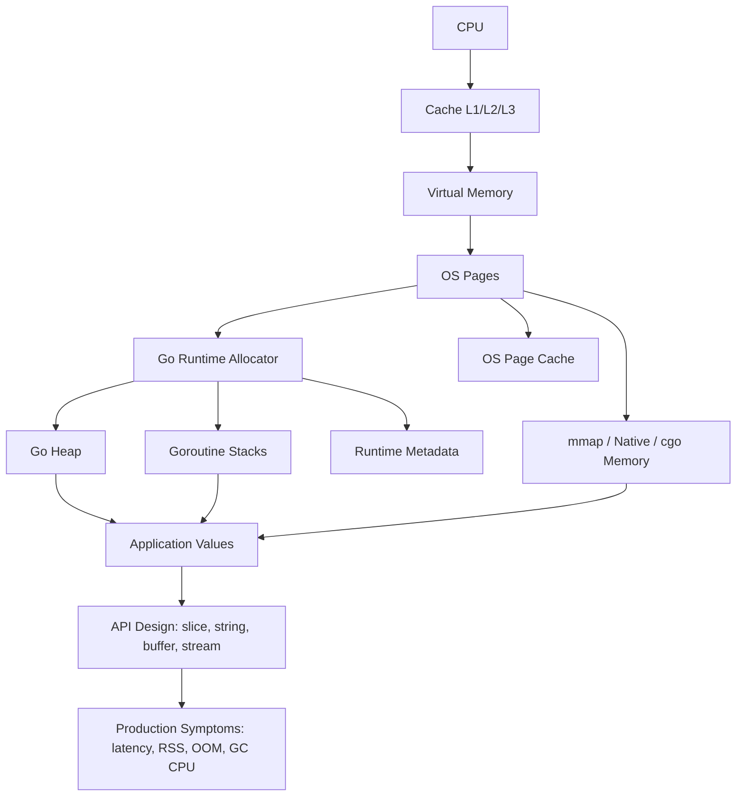
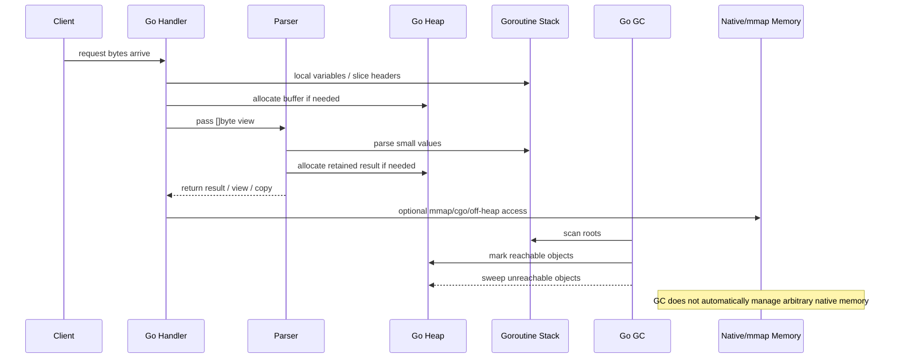
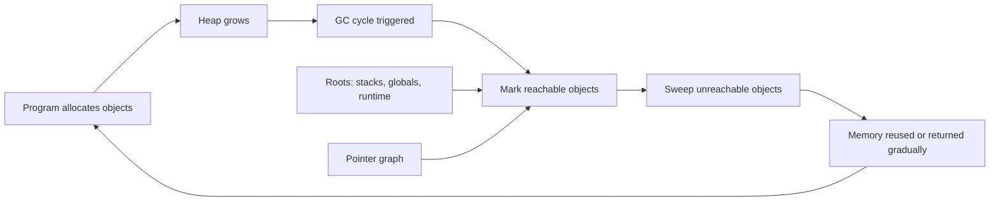
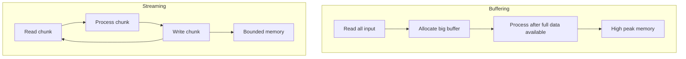
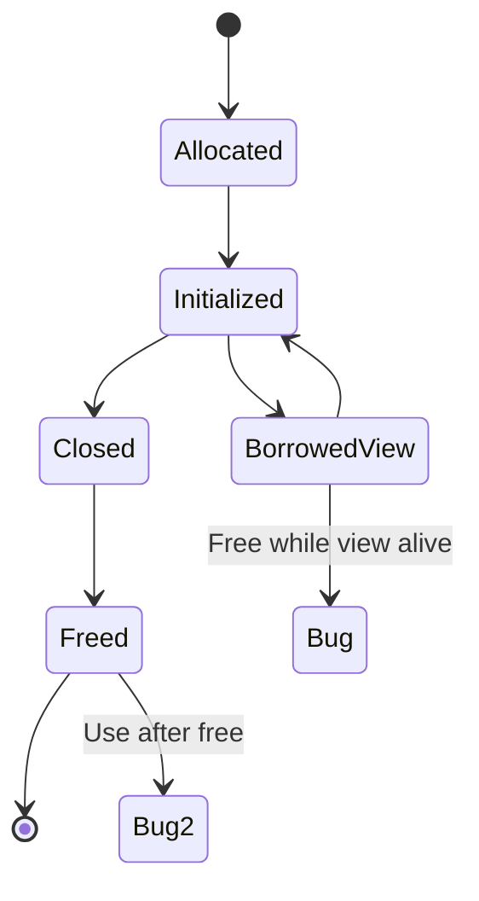
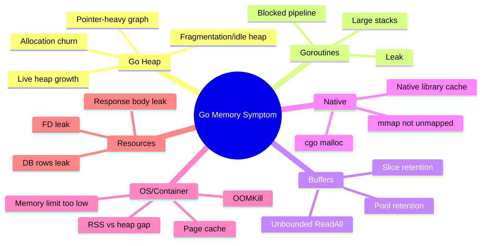
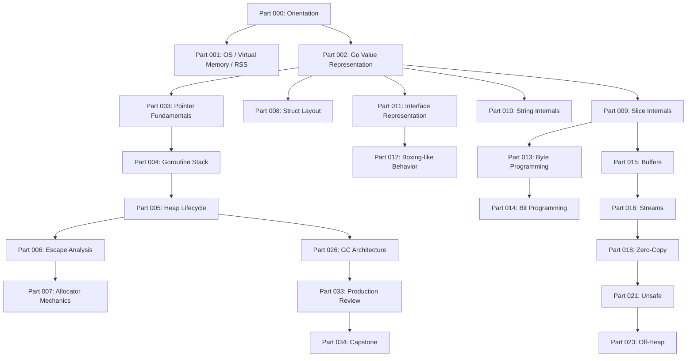

# learn-go-memory-systems-part-000.md

# Part 000 — Orientation: Mental Model Go Memory Systems untuk Java Engineer

> Series: `learn-go-memory-systems`  
> Target: Go 1.26.x  
> Audience: Java engineer yang ingin memahami Go memory, pointer, byte/bit, buffer, stream, off-heap, zero-copy, dan garbage collection secara production-grade.  
> Status: Part 000 dari 035. Seri **belum selesai**.

---

## 0. Peta Besar

Part ini adalah fondasi. Kita belum akan langsung masuk ke teknik seperti `unsafe`, `sync.Pool`, mmap, zero-copy string conversion, atau tuning `GOGC`. Itu semua akan datang nanti. Tetapi sebelum menyentuh teknik rendah level, kita harus menyepakati satu mental model:

> Di Go, performa memory bukan terutama soal “pakai pointer biar cepat” atau “kurangi GC saja”. Performa memory adalah hasil dari kombinasi representasi value, lifetime, ownership informal, escape analysis, allocation rate, pointer graph, retention, buffering, stream boundary, dan observability.

Sebagai Java engineer, beberapa intuisi lama akan membantu, tetapi beberapa perlu dikoreksi:

- Java object hampir selalu berarti heap object dengan identity, header, reference, dan GC-managed lifetime.
- Go value tidak otomatis berarti heap object.
- Go pointer bukan reference Java yang sama persis.
- Slice, map, channel, string, interface adalah value kecil yang sering membawa pointer ke struktur lain.
- Go punya GC, tetapi tuning GC tanpa mengerti allocation dan retention sering menghasilkan perbaikan palsu.
- Go bisa sangat efisien, tetapi juga mudah membuat hidden allocation melalui interface, closure, append, string/byte conversion, reflection, atau API boundary yang salah.

Part 000 bertujuan memberi bahasa, peta, dan prinsip kerja untuk seluruh seri.

---

## 1. Learning Objectives

Setelah menyelesaikan part ini, kamu harus bisa:

1. Menjelaskan perbedaan mental model memory Java dan Go tanpa jatuh ke simplifikasi “Java heap, Go stack”.
2. Membedakan value, pointer, object, allocation, escape, lifetime, reachability, retention, copy, zero-copy, dan off-heap.
3. Membaca kode Go dengan pertanyaan memory yang benar:
   - value ini hidup di mana?
   - siapa yang masih memegang referensi?
   - apakah data ini di-copy atau hanya header-nya?
   - apakah value ini masuk interface?
   - apakah data besar tertahan oleh slice kecil?
   - apakah stream ini bounded atau unbounded?
4. Memahami kenapa “stack vs heap” bukan keputusan manual programmer, melainkan hasil analisis compiler dan runtime constraints.
5. Memahami kenapa masalah memory production sering muncul sebagai gejala yang berbeda:
   - RSS naik,
   - heap profile kecil,
   - GC CPU tinggi,
   - latency spike,
   - OOMKill,
   - goroutine leak,
   - buffer retention,
   - native/off-heap leak.
6. Mengetahui urutan belajar yang benar untuk masuk ke pointer, byte-level programming, buffer, zero-copy, unsafe, off-heap, dan GC.

---

## 2. Kenapa Seri Ini Penting?

Go sering dipilih karena kombinasi berikut:

- binary sederhana,
- startup cepat,
- concurrency murah,
- standard library kuat,
- deployment relatif mudah,
- runtime lebih ringan dibanding banyak managed runtime lain,
- performa cukup dekat ke sistem level untuk banyak workload backend.

Namun banyak service Go yang buruk performanya bukan karena Go lambat, melainkan karena engineer-nya salah membaca memory behavior.

Contoh masalah nyata:

```go
func Handler(w http.ResponseWriter, r *http.Request) {
    body, err := io.ReadAll(r.Body)
    if err != nil {
        http.Error(w, err.Error(), http.StatusBadRequest)
        return
    }
    defer r.Body.Close()

    process(body)
}
```

Kode ini terlihat sederhana. Tetapi dari sisi memory systems, banyak pertanyaan muncul:

- Apakah request body punya batas ukuran?
- Apa yang terjadi jika client mengirim 2 GB body?
- Apakah body perlu dibaca seluruhnya?
- Apakah `process` menyimpan subslice dari body?
- Apakah body dikonversi ke string?
- Apakah buffer ini masuk log?
- Apakah request body ditutup cukup awal?
- Apakah handler bisa dibatalkan ketika client disconnect?
- Apakah allocation besar ini menekan GC?
- Apakah latency meningkat karena heap growth?
- Apakah container terkena OOMKill sebelum heap profile terlihat jelas?

Engineering level tinggi bukan sekadar tahu `io.ReadAll` bisa besar. Level tinggi adalah mampu melihat **lifetime**, **upper bound**, **ownership**, **backpressure**, **failure mode**, dan **observability** sejak desain API.

---

## 3. Go Version Target: 1.26.x

Seri ini menargetkan Go 1.26.x. Secara praktis, ini berarti:

- contoh kode akan mengikuti perilaku Go modern,
- API modern seperti `unsafe.String`, `unsafe.Slice`, `unsafe.StringData`, dan `unsafe.SliceData` akan dibahas pada part unsafe,
- perubahan runtime dan compiler modern akan diperhatikan,
- fitur atau eksperimen yang belum stabil akan diberi label jelas,
- materi akan menghindari rekomendasi lama yang sudah tidak ideal.

Namun ada hal penting: Go menjamin kompatibilitas bahasa dan library pada level tertentu, tetapi **detail optimasi compiler, escape analysis, allocator, dan runtime dapat berubah antar versi**. Karena itu, untuk performa memory, prinsipnya:

> Treat mental model as stable, but validate mechanical behavior with your Go version, your architecture, your workload, and your benchmark.

Jangan menghafal “kode X pasti stack” atau “kode Y pasti heap” sebagai dogma. Gunakan:

```bash
go build -gcflags='all=-m=2' ./...
go test -bench=. -benchmem ./...
go test -run=^$ -bench=BenchmarkX -memprofile=mem.out ./...
go tool pprof mem.out
```

---

## 4. Java vs Go: Perbedaan Mental Model Utama

### 4.1 Java Mental Model Umum

Di Java, mayoritas object application-level dibuat dengan `new` dan hidup di heap JVM.

```java
User user = new User("Fajar");
```

`user` adalah reference. Object `User` hidup di heap. JVM GC mengelola object tersebut. Walaupun JIT escape analysis bisa melakukan scalar replacement atau stack allocation secara internal, model bahasa yang dirasakan programmer tetap object-reference-heavy.

Banyak optimasi Java modern berputar di sekitar:

- object allocation rate,
- object header overhead,
- reference chasing,
- boxed primitive,
- GC generation,
- young/old generation pressure,
- direct buffer/off-heap,
- object pooling yang sering anti-pattern,
- JIT warmup dan profiling.

### 4.2 Go Mental Model Umum

Di Go, kamu sering bekerja dengan **value**.

```go
type User struct {
    Name string
}

u := User{Name: "Fajar"}
```

`u` adalah value. Value ini bisa berada di stack atau heap, tergantung analisis compiler dan kebutuhan lifetime. Programmer tidak memilih stack/heap secara eksplisit.

Saat kamu menulis:

```go
p := &u
```

kamu membuat pointer ke value. Jika pointer itu membuat lifetime `u` melampaui frame fungsi, compiler dapat memindahkan storage `u` ke heap.

Go bukan “manual memory management” seperti C, tetapi juga bukan JVM dengan object model yang sama. Go berada di area menarik:

- punya GC,
- punya pointer,
- punya value semantics,
- punya stack goroutine yang tumbuh,
- punya escape analysis,
- punya `unsafe`,
- punya cgo dan mmap untuk memory di luar heap,
- punya runtime scheduler dan allocator sendiri.

### 4.3 Tabel Perbandingan Mental Model

| Aspek | Java | Go |
|---|---|---|
| Unit umum | object reference | value |
| Allocation eksplisit | `new` hampir selalu heap secara model bahasa | composite literal/local value bisa stack atau heap |
| Pointer/reference | reference tidak bisa arithmetic | pointer eksplisit, tanpa arithmetic kecuali `unsafe` |
| Primitive boxing | autoboxing ke wrapper object | tidak ada wrapper primitive otomatis, tetapi interface conversion bisa mirip boxing |
| GC | JVM-specific, sering generational | Go runtime GC, concurrent, non-moving dalam standard toolchain saat ini |
| Stack | thread stack relatif besar | goroutine stack kecil dan bisa tumbuh |
| Off-heap | DirectByteBuffer, Unsafe, Panama, native | cgo, mmap, syscall/native memory, `unsafe` view |
| Zero-copy | ByteBuffer/slice-like APIs, NIO | slice/string/view, `io.Copy`, sendfile/mmap, unsafe APIs |
| Tuning | heap size, GC algorithm, generations | `GOGC`, `GOMEMLIMIT`, allocation rate, pointer graph, memory limit |
| Common trap | boxed objects, allocation churn, old-gen retention | slice retention, hidden escape, interface allocation, unbounded buffering |

---

## 5. Layered Mental Model: Dari CPU sampai Go API

Memory problem tidak bisa dipahami hanya dari satu layer. Service Go berjalan di atas banyak layer:



Ketika production memory naik, penyebabnya bisa berada di banyak tempat:

- Go heap live object naik.
- Allocation rate naik sehingga GC lebih sering bekerja.
- Goroutine leak menahan stack dan object references.
- `[]byte` kecil menahan backing array besar.
- Map/cache tidak pernah dibatasi.
- `sync.Pool` menyimpan object besar lebih lama dari dugaan.
- cgo memory bocor dan tidak muncul di heap profile.
- mmap belum di-unmap.
- OS page cache terlihat sebagai memory process/system.
- Container memory limit terlalu dekat dengan RSS puncak.

Engineer top-level harus bisa membedakan semuanya.

---

## 6. Vocabulary Inti

Bagian ini penting. Banyak diskusi memory kacau karena istilahnya tidak presisi.

### 6.1 Value

Value adalah data sesuai tipe Go.

Contoh:

```go
var x int = 10
var s string = "hello"
var b []byte = []byte{1, 2, 3}
```

`x`, `s`, dan `b` semuanya value. Tetapi representasinya berbeda:

- `int` menyimpan angka langsung.
- `string` adalah descriptor kecil yang menunjuk ke byte data immutable.
- `[]byte` adalah slice header kecil yang menunjuk ke backing array mutable.

Kesalahan umum: menganggap semua value berarti “data penuh ada di variabel itu”. Tidak selalu.

### 6.2 Object

Dalam konteks runtime/GC, object biasanya berarti blok memory yang dialokasikan dan dilacak runtime. Tetapi dalam pembahasan desain, kita sering menyebut “object” secara informal sebagai entity data.

Untuk presisi seri ini:

- **value**: konsep bahasa Go.
- **heap object**: blok memory di heap Go yang dikelola GC.
- **native object/off-heap block**: memory di luar heap Go.
- **business object**: konsep domain, bukan istilah memory.

### 6.3 Pointer

Pointer menyimpan alamat value bertipe tertentu.

```go
x := 10
p := &x
fmt.Println(*p)
```

Pointer memberi kemampuan aliasing: dua tempat bisa menunjuk data sama.

```go
func inc(p *int) {
    *p++
}
```

Pointer bukan ownership. Go tidak punya ownership checker seperti Rust. Ownership di Go adalah kontrak desain dan dokumentasi API, bukan enforced by compiler.

### 6.4 Reference-like Value

Go punya beberapa tipe yang sering disebut “reference type” secara informal:

- slice,
- map,
- channel,
- function,
- interface dalam beberapa konteks.

Istilah ini berguna, tetapi bisa menyesatkan. Slice misalnya adalah value kecil. Ketika slice di-copy, header-nya di-copy, tetapi backing array tetap sama.

```go
a := []int{1, 2, 3}
b := a
b[0] = 99
fmt.Println(a[0]) // 99
```

Yang di-copy bukan seluruh array, melainkan slice header.

### 6.5 Allocation

Allocation adalah pemberian storage untuk value/object.

Allocation bisa terjadi di:

- stack goroutine,
- heap Go,
- runtime metadata,
- OS/native memory,
- mmap region,
- C heap melalui cgo.

Saat orang bilang “kode ini allocation”, biasanya yang dimaksud adalah heap allocation yang terlihat di `-benchmem` atau heap profile. Tetapi untuk produksi, native allocation dan mmap juga penting.

### 6.6 Escape

Escape berarti compiler tidak bisa membuktikan bahwa sebuah value aman disimpan hanya di stack frame saat ini, sehingga storage-nya perlu ditempatkan di heap atau lifetime-nya diperpanjang.

Contoh sederhana:

```go
func newInt() *int {
    x := 10
    return &x
}
```

Ini aman di Go. Compiler akan memastikan `x` tetap hidup setelah fungsi return, biasanya dengan membuatnya escape ke heap.

Escape bukan bug. Escape adalah mekanisme keselamatan dan correctness.

Bug performa muncul ketika escape terjadi terlalu sering di hot path dan menghasilkan allocation rate tinggi.

### 6.7 Lifetime

Lifetime adalah periode di mana data harus tetap valid.

Contoh:

```go
func parseLine(line []byte) string {
    return string(line)
}
```

`string(line)` membuat copy. Copy ini punya lifetime sendiri dan aman setelah `line` berubah.

Kalau memakai zero-copy unsafe conversion, lifetime string akan bergantung pada lifetime backing array `line`. Jika `line` reused, string bisa korup secara logis.

### 6.8 Reachability

Reachability adalah apakah object masih bisa dijangkau dari root GC.

GC tidak tahu “data ini sudah tidak dibutuhkan secara bisnis”. GC hanya tahu apakah ada path referensi.

```go
var cache = map[string][]byte{}

func store(k string, v []byte) {
    cache[k] = v
}
```

Selama `cache` memegang `v`, backing array `v` reachable. GC tidak akan membebaskannya.

### 6.9 Retention

Retention adalah data tetap tertahan lebih lama dari yang diperlukan.

Retention bisa valid atau bug.

Contoh bug klasik:

```go
func firstKB(data []byte) []byte {
    return data[:1024]
}
```

Jika `data` berukuran 1 GB, return value `data[:1024]` tetap menunjuk backing array 1 GB. Yang terlihat hanya 1 KB, tetapi yang tertahan bisa 1 GB.

Solusi:

```go
func firstKBCopy(data []byte) []byte {
    out := make([]byte, 1024)
    copy(out, data[:1024])
    return out
}
```

Copy kecil bisa lebih murah daripada retention besar.

### 6.10 Copy

Copy berarti bytes/value dipindahkan atau diduplikasi.

Tetapi di Go, copy bisa terjadi pada beberapa level:

```go
s2 := s          // copy slice header only
arr2 := arr      // copy full array
st2 := st        // copy full struct fields
str2 := str      // copy string header only
b2 := []byte(str) // copy string data into new byte slice
```

Pertanyaan yang benar bukan “apakah ini copy?”, tetapi:

- copy apa?
- seberapa besar?
- apakah copy membuat ownership lebih aman?
- apakah copy menghindari retention?
- apakah copy meningkatkan cache locality?
- apakah copy mengurangi GC pointer graph?

### 6.11 Zero-Copy

Zero-copy berarti data tidak disalin pada boundary tertentu.

Namun istilah ini sering disalahgunakan. Ada beberapa jenis:

1. **Zero allocation**: tidak membuat heap allocation baru.
2. **Zero language-level copy**: Go tidak menyalin bytes antara slice/string/view.
3. **Zero runtime copy**: runtime tidak membuat buffer intermediate.
4. **Zero kernel-user copy**: OS mengirim data dari file ke socket tanpa melewati user-space buffer, misalnya sendfile-like path.
5. **Zero semantic copy**: API berbagi ownership data yang sama.

Zero-copy bisa mempercepat, tetapi juga bisa memperpanjang lifetime data besar, menyebabkan data corruption jika mutability dilanggar, atau membuat API sulit dipakai aman.

### 6.12 Off-Heap

Off-heap berarti memory tidak berada di heap Go yang dikelola GC.

Contoh:

- memory dari `C.malloc`,
- mmap region,
- memory native library,
- file mapping,
- OS allocation melalui syscall tertentu.

Off-heap bukan magic performance. Off-heap mengurangi beban scanning GC untuk data tertentu, tetapi menambah beban manual:

- siapa free?
- kapan free?
- bagaimana mencegah use-after-free?
- bagaimana accounting memory?
- bagaimana observability?
- bagaimana behavior di container?
- bagaimana handle crash consistency?

---

## 7. Diagram: Lifecycle Sebuah Data di Go Service



Diagram ini menunjukkan bahwa Go service bukan hanya stack dan heap. Ada boundary penting:

- network input,
- buffer,
- parser,
- retained result,
- GC roots,
- native memory,
- API ownership.

---

## 8. Prinsip Dasar: Memory Bug Bukan Selalu Leak

Di Java, istilah “memory leak” sering berarti object masih reachable padahal tidak dibutuhkan. Di Go juga bisa begitu. Tetapi dalam Go production, gejala memory bisa berasal dari pola lain.

### 8.1 Allocation Churn

Allocation churn adalah banyak allocation sementara yang cepat mati.

Ciri:

- live heap tidak terlalu tinggi,
- allocation rate tinggi,
- GC sering berjalan,
- CPU GC naik,
- latency bisa memburuk.

Contoh:

```go
func encode(items []Item) []string {
    out := make([]string, 0, len(items))
    for _, item := range items {
        out = append(out, fmt.Sprintf("%d:%s", item.ID, item.Name))
    }
    return out
}
```

`fmt.Sprintf` nyaman, tetapi di hot path bisa menghasilkan allocation dan overhead interface/reflect-like formatting. Solusi bukan selalu rewrite manual; ukur dulu.

### 8.2 Retention Leak

Retention leak adalah memory besar tertahan karena masih reachable.

Contoh:

```go
var lastErrorPayload []byte

func handle(data []byte) {
    if invalid(data) {
        lastErrorPayload = data[:128]
    }
}
```

Jika `data` 100 MB, `lastErrorPayload` hanya len 128 tetapi backing array bisa tetap 100 MB.

### 8.3 Goroutine Leak

Goroutine leak sering menjadi memory leak tidak langsung karena goroutine stack dan local variables-nya tetap menjadi GC roots.

```go
func start(ch <-chan []byte) {
    go func() {
        buf := make([]byte, 10<<20)
        for data := range ch {
            _ = data
        }
        _ = buf
    }()
}
```

Jika channel tidak pernah ditutup dan goroutine tidak pernah selesai, `buf` bisa tertahan.

### 8.4 Resource Leak

Resource leak bukan hanya memory Go:

- file descriptor,
- socket,
- database rows,
- response body,
- mmap mapping,
- native handle.

Contoh:

```go
resp, err := http.Get(url)
if err != nil {
    return err
}
// lupa resp.Body.Close()
```

Ini bisa menyebabkan connection leak dan memory/resource pressure.

### 8.5 Native Memory Leak

Native memory leak tidak selalu terlihat di Go heap profile.

Misalnya:

- C library allocation,
- mmap region tidak di-unmap,
- image/video/compression native buffer,
- OS resource yang memegang memory.

Gejala:

- RSS naik,
- heap profile tidak naik signifikan,
- GC tuning tidak membantu,
- container OOMKill.

---

## 9. Core Invariants untuk Engineer Level Tinggi

Bagian ini adalah inti part 000. Simpan sebagai checklist mental.

### Invariant 1 — Go Passes Values

Go passing adalah by value. Tetapi value bisa kecil dan menunjuk data besar.

```go
func f(b []byte) {
    b[0] = 99
}
```

Parameter `b` adalah copy dari slice header. Tetapi header itu menunjuk backing array yang sama.

Implikasi:

- passing slice murah secara header,
- mutasi elemen terlihat oleh caller,
- append bisa tetap memakai backing array lama atau membuat baru,
- API harus menjelaskan apakah callee boleh menyimpan slice.

### Invariant 2 — Pointer Means Aliasing, Not Ownership

Pointer membuat dua pihak bisa melihat data sama. Pointer tidak menjelaskan siapa pemiliknya.

```go
type Config struct {
    Timeout time.Duration
}

func NewClient(cfg *Config) *Client {
    return &Client{cfg: cfg}
}
```

Pertanyaan desain:

- bolehkah caller mengubah `cfg` setelah `NewClient`?
- apakah `Client` harus copy config?
- apakah concurrent access aman?
- apakah pointer ini membuat config hidup selama client hidup?

### Invariant 3 — Heap Allocation Is a Lifetime Consequence

Heap bukan hukuman. Heap adalah konsekuensi lifetime dan compiler proof.

```go
func makeCounter() func() int {
    n := 0
    return func() int {
        n++
        return n
    }
}
```

`n` perlu hidup setelah `makeCounter` return karena closure masih memakainya. Escape adalah benar.

Pertanyaannya bukan “bagaimana memaksa stack?”, tetapi “apakah desain ini memang membutuhkan lifetime tersebut?”.

### Invariant 4 — GC Sees Reachability, Not Intent

GC tidak tahu object “sudah tidak diperlukan”. Jika masih reachable, object hidup.

```go
type Server struct {
    recent [][]byte
}
```

Jika `recent` tidak dibatasi, memory bisa tumbuh. GC hanya melihat bahwa `recent` masih memegang references.

### Invariant 5 — Copy Can Be Optimization

Engineer sering menghindari copy karena dianggap mahal. Tetapi copy kadang optimal:

- copy kecil untuk melepas backing array besar,
- copy ke contiguous memory untuk cache locality,
- copy untuk menghindari shared mutable state,
- copy untuk mengurangi pointer graph,
- copy untuk API safety.

Contoh:

```go
func storeKey(k []byte) string {
    return string(k) // copy, safe immutable key
}
```

Ini mungkin lebih baik daripada unsafe zero-copy string yang rawan rusak jika `k` reused.

### Invariant 6 — Zero-Copy Extends Lifetime Coupling

Zero-copy tidak menghilangkan biaya. Ia memindahkan biaya ke kontrak lifetime.

```go
// pseudo unsafe: string view over []byte
s := bytesToStringNoCopy(buf)
```

Pertanyaan:

- apakah `buf` immutable setelah ini?
- apakah `buf` berasal dari pool?
- apakah `buf` akan reused?
- apakah string disimpan lebih lama dari buffer?
- apakah data bisa berubah setelah dijadikan map key?

Jika jawaban tidak jelas, zero-copy adalah bug tertunda.

### Invariant 7 — Allocation Rate Can Hurt More Than Live Heap

Service dengan live heap 100 MB bisa tetap lambat jika mengalokasikan beberapa GB per detik. GC harus mengejar allocation rate.

Optimization sering fokus ke object yang bertahan lama, padahal hot path allocation sementara bisa lebih merusak latency.

### Invariant 8 — Pointer Density Matters

GC perlu menelusuri pointer graph. Dua struktur dengan ukuran byte sama bisa punya cost GC berbeda.

```go
type PointerHeavy struct {
    A *int
    B *int
    C *int
    D *int
}

type PointerLight struct {
    A int64
    B int64
    C int64
    D int64
}
```

Pointer-heavy object membuat GC scanning lebih mahal daripada data plain numeric yang pointer-free.

### Invariant 9 — Stream Beats Buffer When Size Is Unbounded

Jika ukuran input tidak bounded, default design sebaiknya streaming.

Buruk:

```go
data, _ := io.ReadAll(r.Body)
```

Lebih baik dalam banyak kasus:

```go
dec := json.NewDecoder(io.LimitReader(r.Body, maxBytes))
err := dec.Decode(&dst)
```

Atau pipeline chunked:

```go
buf := make([]byte, 32*1024)
_, err := io.CopyBuffer(dst, src, buf)
```

### Invariant 10 — Observability Before Tuning

Jangan tuning `GOGC` sebelum tahu masalahnya.

Pertanyaan awal:

- inuse heap naik atau allocation rate naik?
- RSS naik atau Go heap naik?
- goroutine count naik?
- native memory ada?
- container limit berapa?
- GC CPU berapa?
- pprof diambil saat gejala terjadi atau setelahnya?

---

## 10. Memory Systems Question Set

Saat review kode Go, gunakan pertanyaan ini.

### 10.1 Untuk Value dan Pointer

- Apakah tipe ini kecil dan immutable secara semantik?
- Apakah pointer diperlukan untuk mutasi atau menghindari copy besar?
- Apakah pointer memperpanjang lifetime object?
- Apakah pointer membuat data sharing antar goroutine?
- Apakah value receiver lebih aman?
- Apakah struct punya field pointer yang membuat GC scanning mahal?

### 10.2 Untuk Slice

- Siapa pemilik backing array?
- Apakah callee boleh menyimpan slice?
- Apakah caller boleh mutate setelah call?
- Apakah append bisa mengubah backing array bersama?
- Apakah subslice kecil menahan buffer besar?
- Apakah perlu full slice expression untuk membatasi capacity?

```go
view := data[:n:n] // len=n, cap=n, append berikutnya forced allocate
```

### 10.3 Untuk String dan `[]byte`

- Apakah konversi `string(b)` berada di hot path?
- Apakah string perlu immutable lifetime terpisah?
- Apakah `[]byte(s)` membuat copy besar?
- Apakah parsing bisa dilakukan di bytes tanpa string intermediate?
- Apakah unsafe conversion benar-benar aman?

### 10.4 Untuk Interface

- Apakah value masuk `any` atau interface di hot path?
- Apakah variadic `...any` memicu allocation?
- Apakah `fmt` dipakai di tight loop?
- Apakah generic bisa lebih tepat?
- Apakah interface membuat dynamic dispatch yang menghambat inline?

### 10.5 Untuk Buffer

- Apakah buffer punya max size?
- Apakah buffer reusable?
- Apakah reset cukup atau perlu release?
- Apakah buffer dari pool dikembalikan setelah tidak dipakai?
- Apakah data dari pooled buffer bocor keluar?
- Apakah buffer besar masuk pool dan membuat memory retained?

### 10.6 Untuk Stream

- Apakah input bounded?
- Apakah ada backpressure?
- Apakah partial read/write ditangani?
- Apakah cancellation menutup pipeline?
- Apakah `io.Pipe` bisa leak goroutine?
- Apakah downstream lambat membuat upstream menumpuk memory?

### 10.7 Untuk Off-Heap

- Siapa allocate?
- Siapa free?
- Apakah free idempotent?
- Apakah ada finalizer sebagai safety net, bukan primary cleanup?
- Apakah memory masuk observability?
- Apakah `GOMEMLIMIT` mencakup memory ini? Biasanya tidak untuk arbitrary native memory.
- Apakah pointer Go disimpan di memory C/off-heap? Ini sangat berbahaya dan tunduk aturan cgo/GC.

### 10.8 Untuk GC

- Berapa live heap?
- Berapa allocation rate?
- Berapa GC CPU?
- Berapa pause distribution?
- Berapa object count?
- Apakah data pointer-heavy?
- Apakah tuning limit atau redesign allocation lebih tepat?

---

## 11. Salah Kaprah yang Harus Dibuang dari Awal

### Myth 1 — “Pointer Selalu Lebih Cepat”

Salah.

Pointer bisa menghindari copy besar, tetapi juga bisa:

- membuat heap allocation,
- menambah indirection,
- memperburuk cache locality,
- memperbesar pointer graph untuk GC,
- menambah aliasing dan race risk.

Value kecil sering lebih cepat dan lebih aman.

```go
type Point struct {
    X, Y int64
}

func Move(p Point, dx, dy int64) Point {
    p.X += dx
    p.Y += dy
    return p
}
```

Struct 16 byte seperti ini sering tidak perlu pointer kecuali ada alasan mutability atau API semantics.

### Myth 2 — “Stack Good, Heap Bad”

Terlalu simplistik.

Stack allocation memang murah dan tidak perlu GC heap tracing seperti heap object. Tetapi heap allocation diperlukan untuk lifetime yang valid. Desain yang memaksa menghindari heap bisa membuat API buruk.

Yang benar:

> Avoid unnecessary heap allocation in hot paths, but do not fight correctness and clarity blindly.

### Myth 3 — “Go Pasti Tidak Perlu Tuning GC”

Sering benar untuk service kecil-menengah, tetapi tidak selalu.

Untuk workload besar:

- high allocation rate,
- large live heap,
- latency-sensitive service,
- Kubernetes memory limit ketat,
- batch processing,
- cache-heavy service,
- native memory heavy,

GC behavior harus dipahami dan diobservasi.

### Myth 4 — “Zero-Copy Selalu Lebih Baik”

Salah.

Zero-copy bisa:

- memperpanjang retention,
- mengikat lifetime antar layer,
- membuat data immutable contract sulit dijamin,
- membuat bug use-after-free pada off-heap,
- membuat map key corrupt secara logis jika backing bytes berubah,
- memperbesar blast radius jika buffer dipool.

### Myth 5 — “Off-Heap Menghindari Semua Masalah GC”

Off-heap menghindari sebagian scanning GC untuk data tertentu, tetapi menambah masalah:

- manual lifecycle,
- observability gap,
- container RSS pressure,
- SIGSEGV risk,
- finalizer nondeterminism,
- portability,
- cgo overhead,
- pointer safety rules.

### Myth 6 — “Heap Profile Menunjukkan Semua Memory”

Tidak.

Heap profile Go terutama menunjukkan Go heap allocation. RSS bisa naik karena:

- native memory,
- mmap,
- thread/goroutine stacks,
- runtime metadata,
- page cache effects,
- allocator reserved/idle memory,
- C libraries.

---

## 12. Cara Membaca Kode Go dari Sisi Memory

Ambil contoh sederhana:

```go
type Event struct {
    ID      string
    Payload []byte
}

func BuildEvent(id string, raw []byte) Event {
    return Event{
        ID:      id,
        Payload: raw[:128],
    }
}
```

Secara bisnis, ini membangun event. Secara memory, banyak hal terjadi:

1. `Event` adalah struct value.
2. `ID string` adalah string header, bukan bytes ID penuh di struct.
3. `Payload []byte` adalah slice header, bukan copy 128 byte.
4. `raw[:128]` mempertahankan backing array `raw`.
5. Jika `raw` besar, event kecil bisa menahan buffer besar.
6. Jika `raw` berasal dari pool dan kemudian reused, `Payload` bisa berubah.
7. Jika `Event` dikirim ke goroutine lain, ownership `raw` harus jelas.

Versi lebih aman:

```go
func BuildEventCopy(id string, raw []byte) Event {
    payload := make([]byte, 128)
    copy(payload, raw[:128])

    return Event{
        ID:      id,
        Payload: payload,
    }
}
```

Versi ini melakukan allocation dan copy 128 byte. Itu mungkin benar jika event disimpan lama.

Versi lain, jika event hanya diproses sinkron dan tidak disimpan:

```go
type EventView struct {
    ID      string
    Payload []byte // borrowed; valid only during callback
}

func WithEventView(id string, raw []byte, fn func(EventView) error) error {
    return fn(EventView{ID: id, Payload: raw[:128]})
}
```

Di sini kontraknya adalah borrowed view. Ini efisien tetapi perlu disiplin.

Pelajaran:

> Performa tinggi bukan hanya menghilangkan copy. Performa tinggi adalah memilih copy atau view berdasarkan lifetime dan ownership.

---

## 13. Ownership di Go: Tidak Ada Compiler, Harus Ada Kontrak

Go tidak punya ownership checker. Tetapi sistem besar tetap membutuhkan ownership model.

Kita akan memakai istilah berikut sepanjang seri.

### 13.1 Owned

Function/object memiliki data dan boleh menyimpan/mengubah/membebaskannya sesuai kontrak.

```go
type Store struct {
    data []byte
}

func NewStore(data []byte) *Store {
    owned := append([]byte(nil), data...)
    return &Store{data: owned}
}
```

`Store` memiliki copy.

### 13.2 Borrowed

Function menerima view sementara dan tidak boleh menyimpan setelah return.

```go
func ParseHeader(buf []byte) (Header, error) {
    // borrowed; no retention
}
```

Kontrak harus jelas: `ParseHeader` tidak menyimpan `buf`.

### 13.3 Shared Mutable

Beberapa pihak bisa mengubah data sama. Ini paling berbahaya.

```go
func Update(buf []byte) {
    buf[0] = 1
}
```

Jika shared antar goroutine, perlu synchronization.

### 13.4 Shared Immutable

Data boleh dibagi karena tidak berubah.

```go
var lookup = map[string]int{
    "A": 1,
    "B": 2,
}
```

Tapi map Go tidak aman untuk concurrent write. Immutable harus benar-benar tidak ditulis setelah publikasi.

### 13.5 Transferred

Ownership berpindah dari caller ke callee.

```go
func (q *Queue) EnqueueOwned(buf []byte) {
    q.items = append(q.items, buf)
}
```

Setelah memanggil `EnqueueOwned`, caller tidak boleh mutate/reuse `buf`.

Nama function bisa membantu:

- `AppendCopy`
- `SetBytesCopy`
- `SetBytesBorrowed`
- `WriteOwned`
- `View`
- `Clone`

---

## 14. API Boundary: Tempat Memory Bug Dilahirkan

Memory bug sering lahir bukan di algoritma internal, tetapi di boundary antar function/package.

Contoh API ambigu:

```go
func (s *Store) Put(key string, value []byte)
```

Pertanyaan:

- Apakah `Store` menyalin `value`?
- Apakah caller boleh mengubah `value` setelah `Put`?
- Apakah `Store` menyimpan slice apa adanya?
- Apakah `Store` menyimpan subslice?
- Apakah `value` boleh berasal dari pool?

API lebih jelas:

```go
func (s *Store) PutCopy(key string, value []byte)
func (s *Store) PutOwned(key string, value []byte)
func (s *Store) PutView(key string, value []byte, ttl time.Duration)
```

Atau dokumentasi eksplisit:

```go
// Put stores a copy of value. The caller may reuse or mutate value after Put returns.
func (s *Store) Put(key string, value []byte)
```

Untuk library production-grade, kontrak memory adalah bagian dari API, bukan detail implementasi.

---

## 15. Escape Analysis: Jangan Dihafal, Diinvestigasi

Escape analysis adalah proses compiler menentukan apakah sebuah value bisa hidup di stack atau harus punya lifetime lebih panjang.

Contoh:

```go
func A() *int {
    x := 1
    return &x
}
```

Kemungkinan `x` escape.

Contoh lain:

```go
func B() any {
    x := 1
    return x
}
```

`x` masuk interface. Tergantung representasi dan optimasi, bisa ada allocation atau tidak. Jangan menebak membabi buta.

Gunakan:

```bash
go build -gcflags='all=-m=2' ./...
```

Output escape analysis harus dibaca sebagai sinyal, bukan sebagai satu-satunya metrik.

Misalnya output bisa berkata:

```text
./main.go:10:6: moved to heap: x
./main.go:20:14: make([]byte, n) escapes to heap
```

Interpretasinya:

- value tertentu dipindah ke heap,
- allocation site tertentu escape,
- alasan detail bisa panjang,
- optimasi dapat berubah antar versi Go.

Workflow benar:

1. Lihat gejala production atau benchmark.
2. Ambil profile allocation.
3. Identifikasi allocation site penting.
4. Gunakan escape report untuk memahami penyebab.
5. Ubah desain minimum.
6. Benchmark ulang.
7. Pastikan readability dan correctness tidak rusak.

---

## 16. GC Mental Model Awal

Go memiliki garbage collector. Untuk part 000, cukup pegang model ini:



Yang penting:

- GC bekerja berdasarkan reachability.
- GC cost dipengaruhi live heap, allocation rate, dan pointer graph.
- Object pointer-free lebih murah untuk scanning dibanding object pointer-heavy.
- Allocation kecil berulang bisa membuat GC sering bekerja.
- Mengurangi live bytes tidak selalu sama dengan mengurangi GC cost jika pointer graph masih padat.
- Go memory yang sudah tidak dipakai tidak selalu langsung terlihat turun di RSS.

GC tuning baru masuk akal setelah tahu:

- heap live,
- heap goal,
- allocation rate,
- GC CPU,
- pause,
- goroutine count,
- RSS vs Go heap,
- native memory.

---

## 17. Buffer dan Stream: Dua Dunia Berbeda

Banyak engineer menyamakan buffer dan stream. Ini sumber banyak memory incident.

### 17.1 Buffer

Buffer adalah storage data sementara.

```go
var buf bytes.Buffer
buf.WriteString("hello")
```

Buffer punya ukuran. Bisa tumbuh. Bisa retained. Bisa di-pool. Bisa bocor.

### 17.2 Stream

Stream adalah aliran data bertahap.

```go
func Copy(dst io.Writer, src io.Reader) error {
    _, err := io.Copy(dst, src)
    return err
}
```

Stream memungkinkan bounded memory walaupun total data besar.

### 17.3 Kapan Buffer?

Gunakan buffer jika:

- data kecil dan bounded,
- perlu random access,
- perlu membangun output sebelum dikirim,
- format membutuhkan length prefix dan ukuran diketahui,
- simplicity lebih penting dan ukuran aman.

### 17.4 Kapan Stream?

Gunakan stream jika:

- data bisa besar,
- data dari network/file,
- pipeline transform bisa incremental,
- perlu backpressure,
- ingin menghindari peak memory besar,
- ingin cancellation bekerja lebih baik.

### 17.5 Diagram Buffer vs Stream



---

## 18. Byte dan Bit: Kenapa Penting untuk Backend Engineer

Byte/bit bukan hanya untuk embedded atau systems programming. Di backend, byte-level skill penting untuk:

- binary protocol,
- compression,
- serialization,
- hashing,
- checksum,
- network framing,
- file format,
- database storage format,
- log ingestion,
- high-throughput parsers,
- memory-efficient state representation,
- protocol gateway,
- security-sensitive parsing.

Contoh byte-level bug:

```go
func readLen(b []byte) int {
    return int(b[0])<<8 | int(b[1])
}
```

Pertanyaan:

- apakah `len(b) >= 2`?
- endian-nya benar?
- max length dibatasi?
- apakah conversion ke int aman di semua architecture?
- apakah length dipakai untuk allocation?
- apakah input malicious bisa menyebabkan OOM?

Byte-level programming selalu harus dikaitkan dengan safety dan resource bound.

---

## 19. Unsafe: Bukan Skill Pamer, Tapi Boundary Berisiko

`unsafe` memungkinkan melewati sebagian type safety Go. Ini berguna untuk:

- high-performance conversion tertentu,
- memory layout introspection,
- syscall/native interop,
- specialized serialization,
- mmap view,
- avoiding copy in controlled internal paths.

Namun `unsafe` bukan shortcut umum.

Pertanyaan sebelum memakai unsafe:

1. Apakah profile membuktikan copy/allocation ini bottleneck?
2. Apakah data immutable selama view hidup?
3. Apakah lifetime bisa dibuktikan lokal?
4. Apakah kode terisolasi dalam package internal kecil?
5. Apakah ada safe fallback?
6. Apakah test mencakup race, fuzz, architecture, dan Go version?
7. Apakah dokumentasi invariant jelas?
8. Apakah keuntungan performa sebanding dengan risiko maintenance?

Unsafe yang baik biasanya sangat kecil, sangat terdokumentasi, dan berada di boundary yang mudah diaudit.

---

## 20. Off-Heap: Kapan Layak Dipikirkan?

Off-heap layak dipikirkan jika:

- data sangat besar dan pointer-free,
- data mostly immutable,
- perlu memory-mapped file,
- perlu interop native,
- perlu mengurangi GC scanning untuk buffer besar,
- ingin storage engine/cache khusus,
- perlu format persistent yang bisa diakses sebagai byte region.

Off-heap tidak layak jika alasanmu hanya:

- “biar cepat”,
- “biar tidak kena GC”,
- “Java punya DirectByteBuffer jadi Go harus begitu”,
- “ingin terlihat low-level”.

Off-heap membutuhkan model lifecycle:



Jika kamu tidak bisa menjelaskan state machine-nya, kamu belum siap memakai off-heap di production.

---

## 21. Production Memory Taxonomy

Gunakan taxonomy ini saat incident.



Saat memory naik, jangan langsung bilang “GC leak”. Gunakan taxonomy.

---

## 22. Diagnostic-First Workflow

Top engineer tidak mulai dari opini. Mereka mulai dari observability.

### 22.1 Jika Latency Naik

Cek:

- CPU profile,
- allocation profile,
- GC pause/CPU,
- mutex/block profile,
- goroutine count,
- request size distribution,
- downstream latency.

Memory bisa menyebabkan latency melalui:

- GC assist,
- cache miss,
- allocation contention,
- large buffer zeroing,
- backpressure,
- swapping/OOM pressure.

### 22.2 Jika RSS Naik

Cek:

- Go heap inuse,
- Go heap idle/released,
- goroutine stack,
- native memory,
- mmap,
- file/page cache context,
- container cgroup memory,
- recent traffic pattern.

### 22.3 Jika OOMKill

Cek:

- container limit,
- peak RSS,
- heap profile sebelum mati jika ada,
- request payload besar,
- batch job memory peak,
- native memory,
- unbounded queue/channel,
- cache eviction policy,
- GC memory limit.

### 22.4 Jika GC CPU Tinggi

Cek:

- allocation rate,
- live heap,
- object count,
- pointer density,
- hot allocation sites,
- `GOGC`,
- `GOMEMLIMIT`,
- object pooling misuse,
- interface/formatting/reflection in hot path.

---

## 23. Minimum Toolbelt

Sepanjang seri, kita akan memakai tool berikut.

### 23.1 Build Escape Report

```bash
go build -gcflags='all=-m=2' ./...
```

Untuk package tertentu:

```bash
go build -gcflags='example.com/project/pkg=-m=2' ./pkg
```

### 23.2 Benchmark dengan Allocation

```bash
go test -bench=. -benchmem ./...
```

Contoh output:

```text
BenchmarkParse-16     5000000     240 ns/op     64 B/op     2 allocs/op
```

Interpretasi:

- `ns/op`: waktu per operasi,
- `B/op`: bytes allocated per operasi,
- `allocs/op`: jumlah allocation per operasi.

### 23.3 Heap Profile dari Test

```bash
go test -run=^$ -bench=BenchmarkParse -memprofile=mem.out ./pkg
go tool pprof mem.out
```

### 23.4 CPU Profile dari Test

```bash
go test -run=^$ -bench=BenchmarkParse -cpuprofile=cpu.out ./pkg
go tool pprof cpu.out
```

### 23.5 Runtime pprof HTTP

```go
import _ "net/http/pprof"
```

Biasanya exposed pada admin port internal, bukan public internet.

### 23.6 Runtime Metrics

Nanti kita akan memakai:

```go
import "runtime/metrics"
```

Untuk dashboard production.

---

## 24. Design Style yang Akan Dipakai Seri Ini

Seri ini tidak akan hanya memberi pattern. Kita akan menilai setiap teknik dengan matrix:

| Teknik | Benefit | Cost | Failure Mode | Observability | Kapan Dipakai |
|---|---|---|---|---|---|
| Pointer | avoid copy / mutate | aliasing / GC scan | race, retention | escape/profile | large mutable state |
| Copy | ownership safety | CPU/memory copy | high copy cost | bench/profile | boundary safety |
| Pool | reduce allocation churn | retention/complexity | stale data, huge retained buf | heap/profile | hot repeated temp objects |
| Stream | bounded memory | complexity | goroutine leak/partial write | trace/profile | large/unbounded data |
| Zero-copy | avoid copy | lifetime coupling | corruption/retention | hard | controlled immutable path |
| Off-heap | reduce GC scan | manual lifecycle | leak/SIGSEGV | RSS/native tools | large pointer-free data |
| GC tuning | memory/latency control | thrash risk | worse throughput | runtime metrics | after profiling |

---

## 25. Example: Same Feature, Different Memory Design

Misal kita ingin menerima file upload, hitung checksum, dan simpan metadata.

### 25.1 Naive Full Buffer

```go
func Upload(r io.Reader) ([32]byte, error) {
    data, err := io.ReadAll(r)
    if err != nil {
        return [32]byte{}, err
    }
    return sha256.Sum256(data), nil
}
```

Masalah:

- memory peak sebesar file,
- tidak ada batas ukuran,
- attacker bisa kirim input besar,
- GC pressure tinggi,
- latency buruk untuk file besar.

### 25.2 Bounded Full Buffer

```go
func UploadBounded(r io.Reader, max int64) ([32]byte, error) {
    lr := io.LimitReader(r, max+1)
    data, err := io.ReadAll(lr)
    if err != nil {
        return [32]byte{}, err
    }
    if int64(len(data)) > max {
        return [32]byte{}, fmt.Errorf("payload too large")
    }
    return sha256.Sum256(data), nil
}
```

Lebih aman, tetapi masih buffering penuh sampai `max`.

### 25.3 Streaming

```go
func UploadStreaming(r io.Reader) ([32]byte, error) {
    h := sha256.New()
    if _, err := io.Copy(h, r); err != nil {
        return [32]byte{}, err
    }

    var sum [32]byte
    copy(sum[:], h.Sum(nil))
    return sum, nil
}
```

Lebih bounded. Tetapi masih perlu:

- batas ukuran,
- timeout/cancellation,
- error handling,
- storage sink,
- backpressure,
- observability.

### 25.4 Streaming dengan Limit

```go
func UploadStreamingBounded(r io.Reader, max int64) ([32]byte, error) {
    h := sha256.New()
    lr := &limitedReaderWithError{R: r, N: max}

    if _, err := io.Copy(h, lr); err != nil {
        return [32]byte{}, err
    }

    var sum [32]byte
    copy(sum[:], h.Sum(nil))
    return sum, nil
}
```

Ini mulai mendekati production direction. Tetapi production-grade masih perlu lebih dari kode ini:

- context cancellation,
- metrics bytes read,
- structured error,
- body close policy,
- storage atomicity,
- partial upload cleanup,
- rate limit,
- slow client protection.

Pelajaran:

> Memory-conscious design bukan hanya memilih API hemat allocation. Ia menggabungkan resource bound, lifecycle, failure handling, dan observability.

---

## 26. Apa yang Tidak Akan Kita Ulang dari Seri Sebelumnya

Karena kamu sudah menyelesaikan beberapa seri Go dasar dan intermediate, seri ini tidak akan mengulang panjang lebar:

- syntax dasar Go,
- control flow,
- package/module dasar,
- interface dasar kecuali representasi memory,
- goroutine/channel dasar kecuali memory/goroutine leak/backpressure,
- error handling dasar kecuali resource cleanup,
- generics dasar kecuali relasi dengan allocation/interface,
- reflection dasar kecuali allocation dan representation cost.

Kita akan fokus pada sisi memory systems.

---

## 27. Peta Hubungan Part 000 dengan Part Berikutnya



---

## 28. Review Checklist Part 000

Sebelum lanjut ke part 001, pastikan kamu bisa menjawab ini.

### 28.1 Concept Check

1. Mengapa “Go pass-by-value” tidak berarti semua data selalu di-copy penuh?
2. Mengapa pointer bukan ownership?
3. Apa beda allocation churn dan retention leak?
4. Mengapa subslice kecil bisa menahan backing array besar?
5. Mengapa zero-copy bisa memperburuk memory retention?
6. Mengapa heap profile bisa kecil tetapi RSS besar?
7. Mengapa GC tidak bisa membebaskan object yang “secara bisnis” sudah tidak dipakai?
8. Mengapa copy kecil kadang lebih optimal daripada view?
9. Apa beda buffer dan stream?
10. Kapan off-heap justru memperbesar risiko production?

### 28.2 Code Review Drill

Analisis kode berikut.

```go
var recent [][]byte

func Remember(data []byte) {
    if len(data) > 1024 {
        recent = append(recent, data[:1024])
    }
}
```

Pertanyaan:

- Apa yang salah?
- Apakah `recent` bounded?
- Apakah `data[:1024]` copy?
- Apa yang terjadi jika `data` 100 MB?
- Bagaimana jika `data` berasal dari buffer pool?
- Bagaimana memperbaiki sesuai kebutuhan business?

Salah satu perbaikan jika ingin menyimpan snapshot 1 KB:

```go
var recent [][]byte
const maxRecent = 1000

func Remember(data []byte) {
    if len(data) <= 1024 {
        return
    }

    snapshot := make([]byte, 1024)
    copy(snapshot, data[:1024])

    if len(recent) == maxRecent {
        copy(recent, recent[1:])
        recent[len(recent)-1] = snapshot
        return
    }

    recent = append(recent, snapshot)
}
```

Masih ada pertanyaan lanjutan:

- apakah global variable aman concurrent?
- apakah eviction policy tepat?
- apakah memory budget jelas?
- apakah ring buffer lebih baik?
- apakah data sensitif boleh disimpan?

Memory systems selalu bersinggungan dengan correctness dan security.

---

## 29. Latihan Praktik

Buat file kecil `main.go`:

```go
package main

import "fmt"

func returnPointer() *int {
    x := 42
    return &x
}

func returnSliceView(data []byte) []byte {
    return data[:1]
}

func toAny(x int) any {
    return x
}

func main() {
    p := returnPointer()
    fmt.Println(*p)

    big := make([]byte, 10<<20)
    view := returnSliceView(big)
    fmt.Println(len(view))

    a := toAny(123)
    fmt.Println(a)
}
```

Jalankan:

```bash
go build -gcflags='all=-m=2' .
```

Amati:

- variable mana yang escape?
- apakah output sesuai intuisi?
- apakah `view` menahan `big`?
- apakah `fmt.Println` menambah noise escape?

Lalu benchmark variasi kecil:

```go
package main

import "testing"

func BenchmarkCopySmall(b *testing.B) {
    src := make([]byte, 1024)
    for i := 0; i < b.N; i++ {
        dst := make([]byte, 1024)
        copy(dst, src)
    }
}

func BenchmarkViewSmall(b *testing.B) {
    src := make([]byte, 1024)
    for i := 0; i < b.N; i++ {
        _ = src[:128]
    }
}
```

Jalankan:

```bash
go test -bench=. -benchmem
```

Tujuan latihan bukan membuktikan copy selalu buruk. Tujuannya adalah membangun kebiasaan mengukur.

---

## 30. Prinsip Pembelajaran untuk Seri Ini

Seluruh seri akan memakai pola berikut:

1. **Mental model dulu**  
   Kita jelaskan konsep dengan benar sebelum masuk kode.

2. **Representation-aware**  
   Kita akan tanya: value ini direpresentasikan sebagai apa?

3. **Lifetime-aware**  
   Kita akan tanya: data ini harus hidup sampai kapan?

4. **Ownership-aware**  
   Kita akan tanya: siapa boleh menyimpan, mutate, free, atau reuse?

5. **Failure-aware**  
   Kita akan tanya: bagaimana ini gagal di production?

6. **Measurement-aware**  
   Kita akan tanya: bagaimana membuktikan ini dengan benchmark/profile?

7. **Operationally-aware**  
   Kita akan tanya: metric apa yang harus ada di dashboard?

---

## 31. Ringkasan Eksekutif

Go memory systems harus dipahami sebagai hubungan antara value semantics, pointer aliasing, compiler escape analysis, runtime allocator, GC reachability, buffer/stream design, dan OS/native memory.

Untuk Java engineer, perpindahan terbesar adalah dari object-reference-first thinking ke value-lifetime-ownership thinking.

Kalimat kunci:

- Go passes values, but values can contain pointers.
- Pointer gives aliasing, not ownership.
- Heap allocation is a lifetime consequence, not always a mistake.
- GC sees reachability, not business intent.
- Copy can be a performance optimization if it breaks harmful retention.
- Zero-copy is a lifetime contract, not a free lunch.
- Off-heap moves problems from GC to lifecycle management.
- Buffering needs bounds; streaming needs cancellation and backpressure.
- Observability must come before tuning.

---

## 32. Referensi Resmi dan Bacaan Lanjutan

Referensi ini akan sering muncul sepanjang seri:

1. Go 1.26 Release Notes  
   https://go.dev/doc/go1.26

2. Go Release History  
   https://go.dev/doc/devel/release

3. A Guide to the Go Garbage Collector  
   https://go.dev/doc/gc-guide

4. The Go Memory Model  
   https://go.dev/ref/mem

5. Diagnostics  
   https://go.dev/doc/diagnostics

6. Package `runtime`  
   https://pkg.go.dev/runtime

7. Package `runtime/debug`  
   https://pkg.go.dev/runtime/debug

8. Package `unsafe`  
   https://pkg.go.dev/unsafe

9. Go compiler README, termasuk fase middle-end seperti inlining, devirtualization, dan escape analysis  
   https://go.dev/src/cmd/compile/README

---

## 33. Apa Berikutnya?

Part berikutnya:

```text
learn-go-memory-systems-part-001.md
```

Topik:

```text
Memory model besar: virtual memory, stack, heap, OS pages, cache line, process RSS
```

Kita akan turun satu level ke OS dan runtime boundary:

- virtual memory,
- address space,
- page,
- page fault,
- RSS,
- VSZ,
- Go heap vs OS memory,
- mmap,
- page cache,
- container memory,
- kenapa heap profile dan RSS bisa berbeda.

Seri belum selesai. Ini baru part 000 dari 035.


<!-- NAVIGATION_FOOTER -->
<div class="page-nav">
<span></span>
<a href="./index.md">📚 Kategori</a>
<a href="../../index.md">🏠 Home</a>
<a href="./learn-go-memory-systems-part-001.md">Go Memory Systems — Part 001: Memory Model Besar ➡️</a>
</div>
