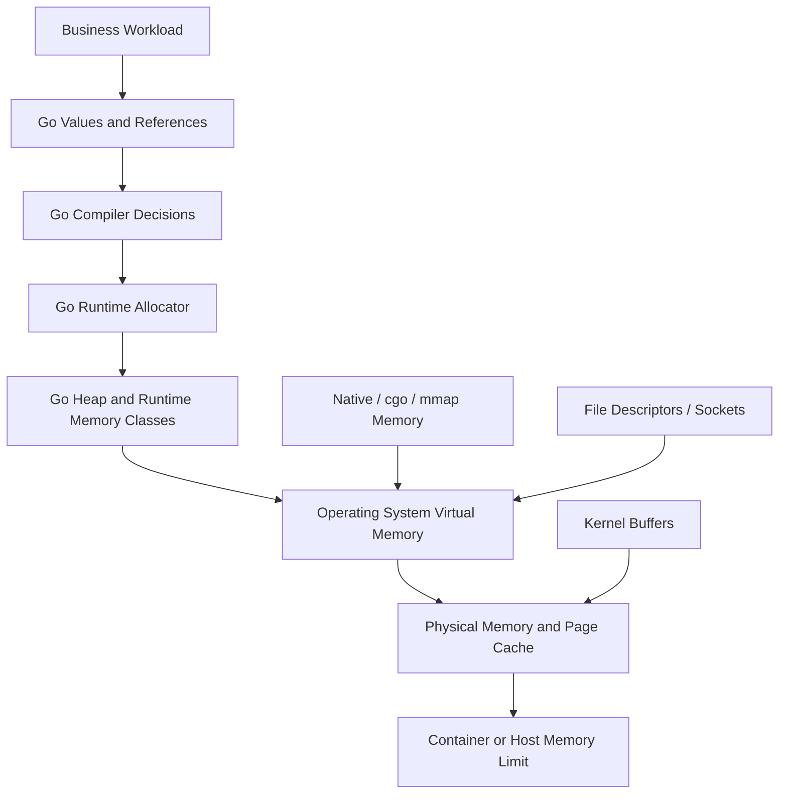
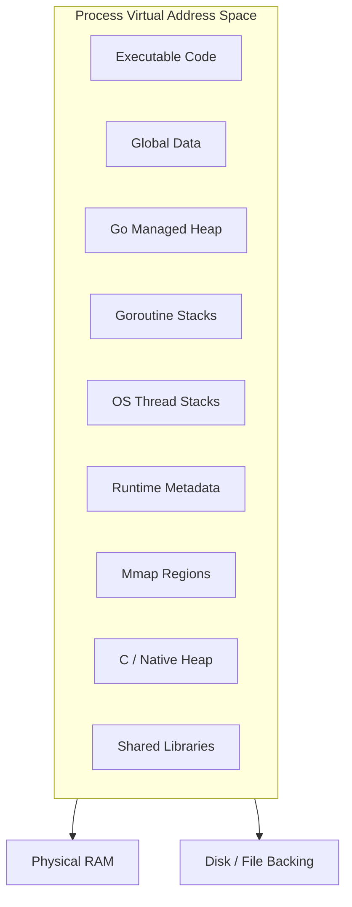
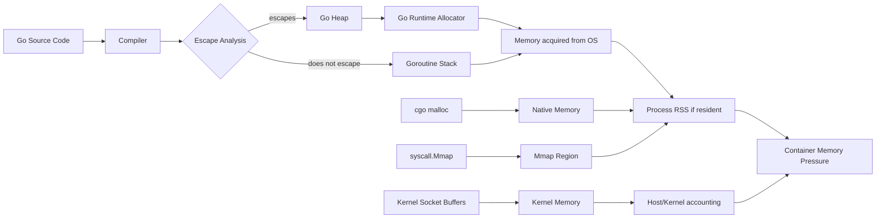
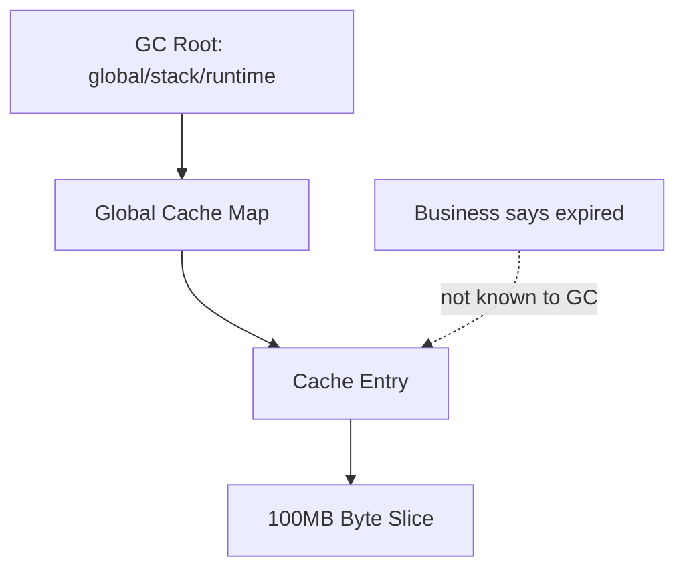
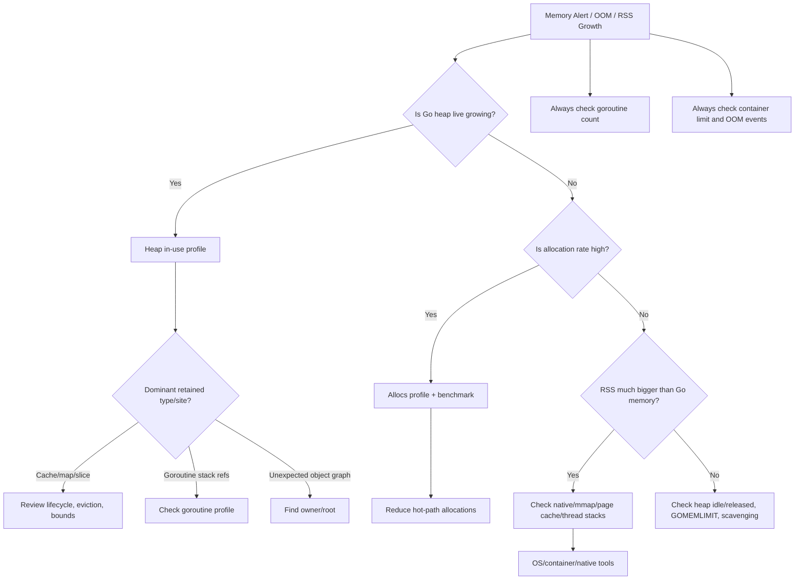
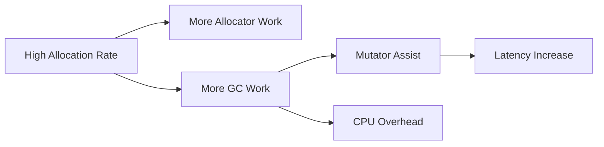
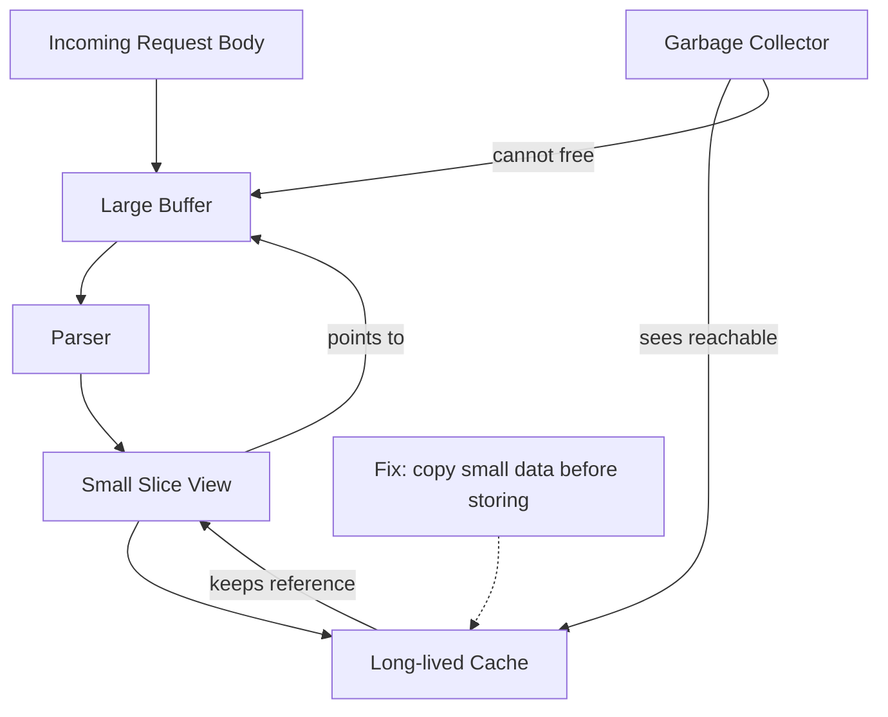

# learn-go-memory-systems-part-001.md

# Go Memory Systems — Part 001: Memory Model Besar

> Seri: `learn-go-memory-systems`  
> Part: `001`  
> Topik: Virtual Memory, Stack, Heap, OS Pages, Cache Line, RSS  
> Target: Java Software Engineer yang ingin memahami Go memory system sampai level production engineering  
> Versi target: Go 1.26.x  

---

## Status Seri

- Part sebelumnya: `learn-go-memory-systems-part-000.md` — Orientation: mental model Go memory systems untuk Java engineer.
- Part sekarang: `learn-go-memory-systems-part-001.md` — Memory model besar dari OS sampai Go runtime.
- Seri belum selesai.
- Part berikutnya: `learn-go-memory-systems-part-002.md` — Go value representation: scalar, array, struct, pointer, slice, string, map, chan, interface.

---

## Sumber Resmi Utama

Materi ini menggunakan fondasi dari dokumentasi resmi Go dan dokumentasi runtime Go, terutama:

- Go 1.26 Release Notes: `https://go.dev/doc/go1.26`
- Go Release History: `https://go.dev/doc/devel/release`
- A Guide to the Go Garbage Collector: `https://go.dev/doc/gc-guide`
- Go Memory Model: `https://go.dev/ref/mem`
- Go Diagnostics: `https://go.dev/doc/diagnostics`
- Package `runtime`: `https://pkg.go.dev/runtime`
- Package `runtime/debug`: `https://pkg.go.dev/runtime/debug`
- Package `runtime/metrics`: `https://pkg.go.dev/runtime/metrics`
- Runtime metrics source documentation: `https://go.dev/src/runtime/metrics/doc.go`

Catatan penting: Go runtime detail bisa berubah antar versi. Karena itu, bagian ini membedakan antara:

1. kontrak yang relatif stabil untuk programmer,
2. observasi runtime yang tersedia melalui API resmi,
3. detail implementasi internal yang berguna untuk mental model tetapi tidak boleh dijadikan API contract.

---

# 1. Tujuan Part Ini

Part 001 menjawab pertanyaan besar:

> Ketika sebuah process Go terlihat memakai banyak memory di production, apa sebenarnya yang sedang terjadi?

Jawaban yang buruk biasanya berbentuk:

- “GC Go bocor.”
- “Heap Go besar.”
- “RSS naik berarti leak.”
- “Pakai `sync.Pool` saja.”
- “Pakai pointer supaya hemat.”
- “Pakai zero-copy supaya cepat.”
- “Pakai off-heap supaya GC tidak berat.”

Jawaban yang matang harus memisahkan beberapa lapisan:



Agar bisa melakukan diagnosis dan desain yang benar, kita harus tahu bedanya:

- logical object vs memory region,
- Go heap vs process memory,
- live heap vs allocated heap,
- allocated heap vs RSS,
- RSS vs container limit,
- page cache vs application heap,
- Go-managed memory vs unmanaged/native memory,
- allocation leak vs retention leak vs resource leak,
- stack memory vs heap memory,
- object lifetime vs reachability,
- memory footprint vs memory pressure.

Part ini belum masuk detail layout slice/string/interface. Itu masuk Part 002 dan seterusnya. Di sini kita membangun peta besar.

---

# 2. Mental Model Utama

## 2.1 Memory bukan satu angka

Di production, “memory usage” bukan satu angka. Minimal ada beberapa angka berbeda:

| Istilah | Makna Sederhana | Yang Sering Salah Dipahami |
|---|---|---|
| Virtual memory / address space | Ruang alamat yang bisa dipetakan process | Dikira selalu memakai RAM fisik |
| RSS | Resident Set Size, memory process yang resident di RAM | Dikira sama dengan Go heap live |
| Go heap live | Object Go yang masih reachable setelah GC | Dikira sama dengan total process memory |
| Heap allocated | Memory heap yang sedang dipakai allocator | Dikira semuanya masih business-live |
| Heap idle | Memory heap yang tidak sedang dipakai object aktif | Dikira leak padahal bisa reusable/releasable |
| Heap released | Memory yang sudah dikembalikan ke OS | Dikira hilang dari proses secara instan di semua tool |
| Page cache | Cache file oleh OS | Dikira app leak ketika proses file besar |
| Native memory | Memory dari cgo/syscall/mmap | Dikira terlihat di heap profile Go |
| Kernel buffers | Buffer socket/file/kernel | Dikira dikontrol GC |

Engineer yang kuat tidak bertanya:

> “Memory Go saya berapa?”

Tapi bertanya:

> “Memory class mana yang naik, siapa pemiliknya, apakah reachable, apakah reusable, apakah reclaimable, apakah terlihat oleh GC, apakah dihitung oleh limit container, dan apakah menyebabkan pressure?”

---

## 2.2 Process Go hidup di atas OS, bukan di atas abstraksi Go saja

Program Go adalah process OS. Process ini punya virtual address space. Go runtime mengelola sebagian dari address space itu untuk:

- goroutine stacks,
- heap object,
- runtime metadata,
- span metadata,
- scheduler state,
- GC metadata,
- executable code,
- global variables,
- profiling/trace structures,
- memory yang diminta runtime dari OS.

Namun process juga bisa memakai memory di luar heap Go:

- cgo allocation,
- mmap,
- memory dari native library,
- file mapping,
- kernel socket buffer,
- thread stack OS,
- page cache effects,
- memory dari plugin/native dependency.

Go GC hanya mengelola object yang berada dalam Go-managed heap dan struktur yang dikenal runtime. GC bukan penghapus universal untuk semua memory process.

---

# 3. Dari Java ke Go: Perbedaan Cara Membaca Memory

Sebagai Java engineer, kemungkinan besar Anda terbiasa dengan istilah:

- heap,
- young generation,
- old generation,
- metaspace,
- direct buffer,
- thread stack,
- native memory,
- GC pause,
- GC logs,
- committed vs used heap,
- RSS container,
- NMT atau native memory tracking.

Go berbeda dalam beberapa hal penting.

## 3.1 Go GC bukan JVM GC

Go menggunakan garbage collector pada standard toolchain. Dokumentasi resmi Go GC menjelaskan model biaya GC sebagai kombinasi live heap, new allocation, dan CPU yang dipakai GC. Fokusnya adalah mengelola trade-off CPU vs memory melalui parameter seperti `GOGC` dan memory limit.

Yang perlu Anda ubah dari mental model JVM:

| Java/JVM | Go |
|---|---|
| Banyak JVM modern punya generational GC | Go historically non-generational; detail implementasi runtime bisa berkembang, tetapi programmer tidak mendesain berdasarkan young/old generation seperti JVM |
| Heap JVM biasanya punya boundary eksplisit seperti `-Xmx` | Go memakai soft memory limit (`GOMEMLIMIT` / `debug.SetMemoryLimit`) dan `GOGC`, bukan model `-Xmx` yang identik |
| Direct buffer adalah konsep umum di Java | Go tidak punya public direct buffer abstraction idiomatik yang sama |
| Object Java hampir selalu heap object | Go value bisa stack atau heap tergantung escape analysis |
| Banyak alokasi kecil di Java sering diserap young-gen | Di Go, alokasi tetap memberi tekanan pada allocator dan GC; object pointer-heavy dapat meningkatkan scan cost |
| GC log sangat dominan dalam diagnosis JVM | Go diagnosis sering gabungan `pprof`, `runtime/metrics`, traces, `GODEBUG=gctrace=1`, dan observability process/container |

---

## 3.2 Go punya stack goroutine yang berbeda dari Java thread stack

Java thread stack biasanya cukup besar dan jumlah thread relatif lebih mahal. Go goroutine punya stack yang kecil dan dapat tumbuh. Ini memungkinkan banyak goroutine, tetapi tidak berarti “free”.

Konsekuensi:

- goroutine leak bisa menjadi memory leak,
- setiap goroutine punya stack dan metadata,
- stack bisa tumbuh jika call chain/frame besar,
- stack juga menjadi root scanning area untuk GC,
- goroutine yang blocked tetapi masih memegang reference ke buffer besar dapat menahan memory.

Contoh retention klasik:

```go
func worker(ch <-chan []byte) {
    for b := range ch {
        // Jika goroutine blocked di call lain sambil masih memegang b,
        // backing array b tidak bisa direclaim.
        process(b)
    }
}
```

Masalahnya bukan sekadar “ada goroutine”. Masalahnya adalah goroutine tersebut membawa reachable references.

---

# 4. Layer Memory dari Bawah ke Atas

## 4.1 Physical memory

Physical memory adalah RAM aktual di machine/node. Container, process, dan OS berbagi physical memory yang sama.

Ketika process memakai memory, belum tentu semua virtual memory-nya punya physical page resident. OS bisa melakukan demand paging, lazy allocation, page cache, dan reclaim.

---

## 4.2 Virtual address space

Setiap process melihat address space virtual. Pointer dalam program adalah alamat virtual, bukan nomor chip RAM fisik.

Process bisa punya mapping untuk:

- executable code,
- shared libraries,
- heap,
- stacks,
- mmap file,
- anonymous mmap,
- memory-mapped device,
- runtime reserved regions.

Diagram sederhana:



Poin penting:

- Virtual address space besar tidak otomatis berarti RAM dipakai.
- Mapping bisa ada tetapi belum resident.
- RSS mengukur resident memory, bukan seluruh address space.
- Memory-mapped file bisa terlihat sebagai mapped memory tetapi belum tentu seluruh file berada di RAM.

---

## 4.3 Page

OS mengelola memory dalam unit page. Page size umum di banyak sistem adalah 4 KiB, meskipun huge pages atau platform lain bisa berbeda.

Saat program menyentuh alamat virtual yang belum resident, page fault bisa terjadi. OS kemudian memetakan page fisik atau membaca data dari file backing.

Pola akses memory bisa memengaruhi performa:

- sequential access biasanya ramah prefetch dan page cache,
- random access bisa menyebabkan banyak cache miss/page fault,
- working set lebih besar dari RAM memicu pressure,
- mmap besar tidak selalu mahal sampai page disentuh.

---

## 4.4 Cache line

CPU membaca memory dalam unit cache line. Ukuran cache line umum adalah 64 byte pada banyak arsitektur modern, tetapi tidak boleh dianggap kontrak universal.

Kenapa penting untuk Go?

- struct layout memengaruhi locality,
- array/slice contiguous lebih cache-friendly daripada pointer chasing,
- false sharing bisa terjadi saat field berbeda yang sering ditulis oleh goroutine berbeda berada di cache line yang sama,
- pointer-heavy graph bisa meningkatkan cache miss dan GC scan overhead.

Contoh false sharing konseptual:

```go
type Counters struct {
    A uint64 // sering ditulis goroutine 1
    B uint64 // sering ditulis goroutine 2
}
```

Walaupun `A` dan `B` berbeda field, jika berada dalam cache line sama, CPU core berbeda bisa saling invalidasi cache line.

Namun jangan langsung padding semua struct. Padding menambah memory footprint. Gunakan hanya setelah terbukti hot path.

---

# 5. Go Runtime Memory: Apa Saja yang Bisa Ada dalam Process

## 5.1 Go heap

Go heap adalah area yang dikelola Go runtime allocator dan GC untuk object yang hidup di heap.

Object masuk heap ketika compiler/runtime tidak bisa membuktikan lifetime-nya cukup pendek untuk stack, atau karena alasan lain seperti size/dynamic behavior.

Contoh sederhana:

```go
func newUser(name string) *User {
    u := User{Name: name}
    return &u // u kemungkinan escape ke heap
}
```

Penting:

- `return &u` tidak membuat dangling pointer seperti C.
- Compiler Go akan memindahkan `u` ke heap jika perlu.
- Aman secara memory safety, tetapi ada konsekuensi allocation dan GC.

---

## 5.2 Goroutine stacks

Setiap goroutine punya stack. Stack menyimpan:

- local variable yang tidak escape,
- return address/call frame metadata,
- temporary values,
- pointer roots yang harus dilihat GC.

Stack goroutine bisa tumbuh. Karena itu Go bisa punya banyak goroutine, tetapi goroutine tetap punya biaya.

Goroutine leak contoh:

```go
func leak(ch <-chan struct{}, payload []byte) {
    go func() {
        <-ch
        // payload tetap reachable selama goroutine hidup,
        // walaupun tidak pernah dipakai lagi.
        _ = payload
    }()
}
```

Jika `payload` adalah `[]byte` 100 MB dan channel tidak pernah ditutup, backing array 100 MB tertahan.

---

## 5.3 Runtime metadata

Go runtime membutuhkan metadata untuk:

- allocator,
- GC bitmap,
- span state,
- type metadata,
- stack maps,
- scheduler,
- timers,
- profiling,
- finalizers,
- maps/channels internals.

Memory ini bukan selalu terlihat sebagai “heap object business”. Tetapi tetap bagian dari process memory.

---

## 5.4 OS thread stacks

Go scheduler menjalankan goroutine di atas OS threads. OS thread juga punya stack. Jika program membuat banyak thread melalui cgo atau blocking behavior tertentu, memory thread stack bisa menjadi signifikan.

---

## 5.5 Native/cgo memory

Jika program memakai cgo atau native library, memory bisa dialokasikan di luar Go heap.

Contoh konseptual:

```go
// pseudo only
ptr := C.malloc(1024 * 1024)
// harus C.free(ptr) secara eksplisit
```

Go GC tidak otomatis mengetahui ownership dan lifetime memory native tersebut. Heap profile Go tidak akan memberi gambaran lengkap untuk native leak.

---

## 5.6 mmap memory

Memory-mapped file atau anonymous mmap juga bisa berada di luar Go heap. Ini sering dipakai untuk:

- large file processing,
- embedded storage,
- index file,
- shared memory,
- custom allocator,
- zero-copy file view.

Tetapi mmap punya konsekuensi:

- page fault,
- lifecycle unmap,
- crash consistency,
- platform difference,
- RSS bisa naik saat page disentuh,
- tidak terlihat sebagai Go heap object biasa.

---

# 6. Diagram Besar: Dari Object Go ke RSS



Hal penting dari diagram ini:

- Go heap bukan satu-satunya penyebab RSS naik.
- Stack goroutine bisa menambah memory.
- Native/mmap memory bisa tidak terlihat di Go heap profile.
- Kernel memory dan page cache bisa memengaruhi pressure sistem/container.
- Escape analysis memengaruhi stack vs heap, tetapi bukan satu-satunya faktor footprint.

---

# 7. RSS, VSZ, Heap Live, Heap Idle, Heap Released

## 7.1 VSZ / virtual size

VSZ adalah ukuran virtual address space yang dipetakan process. Angka ini bisa besar dan tidak selalu berarti RAM benar-benar dipakai.

Kapan VSZ besar tidak terlalu mengkhawatirkan?

- runtime reserve address space,
- mmap file besar yang belum disentuh,
- shared libraries mapped,
- sparse mapping.

Kapan VSZ relevan?

- address space exhaustion pada platform tertentu,
- mapping terlalu banyak,
- mmap lifecycle leak,
- 32-bit process limitation.

Untuk production Go modern di 64-bit, RSS biasanya lebih actionable daripada VSZ, tetapi VSZ tetap berguna untuk mmap investigation.

---

## 7.2 RSS

RSS adalah Resident Set Size: bagian memory process yang resident di RAM.

RSS bisa naik karena:

- Go heap growth,
- goroutine stack growth,
- runtime metadata,
- native allocation,
- mmap pages touched,
- thread stacks,
- shared library pages,
- allocator fragmentation/reuse behavior.

RSS bisa tetap tinggi walaupun Go heap live turun karena:

- runtime menyimpan idle heap untuk reuse,
- OS belum reclaim page,
- memory belum released,
- native/mmap memory tetap resident,
- page cache/accounting behavior.

---

## 7.3 Go live heap

Live heap adalah object yang masih reachable setelah GC. Ini lebih dekat ke “business data yang masih dipegang program”, tetapi tidak selalu sama dengan business lifetime yang diinginkan.

Contoh: cache map yang lupa eviction.

```go
var cache = map[string][]byte{}

func put(id string, b []byte) {
    cache[id] = b
}
```

Semua `[]byte` dalam map reachable. Dari sudut pandang GC, itu bukan garbage. Dari sudut pandang bisnis, bisa jadi retention leak.

---

## 7.4 Heap allocated vs heap live

Heap allocated bisa mencakup object yang dialokasikan saat ini. Setelah GC, yang tidak reachable akan bebas dipakai ulang oleh allocator.

Namun angka yang terlihat di metrics bisa berbeda tergantung tool:

- allocated bytes saat ini,
- cumulative allocated bytes,
- in-use heap profile,
- allocation profile,
- heap system memory,
- idle/released memory.

Karena itu jangan mendiagnosis dari satu angka.

---

## 7.5 Heap idle dan heap released

Go runtime dapat punya heap memory yang idle tetapi belum dikembalikan ke OS. Ini bisa reusable untuk allocation berikutnya.

Jika workload bursty, menyimpan idle heap bisa efisien karena menghindari bolak-balik meminta memory ke OS. Tetapi dalam container, idle memory yang masih resident bisa menimbulkan pressure.

`GOMEMLIMIT`/`debug.SetMemoryLimit` membantu runtime menyesuaikan perilaku GC dan scavenging untuk soft memory limit, tetapi dokumentasi runtime/debug menjelaskan bahwa memory limit tidak mencakup memory eksternal seperti memory yang dikelola di luar Go, termasuk beberapa memory dari syscall/mmap/cgo.

---

# 8. Memory Classes dalam Runtime Metrics

Package `runtime/metrics` menyediakan interface stabil untuk membaca metrics runtime. Untuk memory, Go mengekspos metric classes seperti `/memory/classes/...`.

Konsep besarnya:

```mermaid
flowchart TD
    A[Process Memory Observed] --> B[Go Runtime Metrics]
    A --> C[OS / Container Metrics]

    B --> D[/memory/classes/heap/objects]
    B --> E[/memory/classes/heap/free]
    B --> F[/memory/classes/heap/released]
    B --> G[/memory/classes/metadata]
    B --> H[/memory/classes/stacks]
    B --> I[/memory/classes/other]

    C --> J[RSS]
    C --> K[Working Set]
    C --> L[Page Cache]
    C --> M[OOM Events]

    N[cgo / syscall mmap] --> C
    N -. not always included in Go runtime classes .-> B
```

Poin kritis:

- Runtime metrics sangat membantu untuk memecah Go-managed memory.
- OS/container metrics tetap diperlukan untuk melihat total process/container pressure.
- Gap antara RSS dan Go runtime memory classes bisa mengarah ke native/mmap/kernel/page-cache issue.

Contoh kode membaca sebagian metrics:

```go
package main

import (
    "fmt"
    "runtime/metrics"
)

func main() {
    names := []string{
        "/memory/classes/heap/objects:bytes",
        "/memory/classes/heap/free:bytes",
        "/memory/classes/heap/released:bytes",
        "/memory/classes/metadata/other:bytes",
        "/memory/classes/os-stacks:bytes",
        "/sched/goroutines:goroutines",
        "/gc/heap/live:bytes",
        "/gc/heap/goal:bytes",
    }

    samples := make([]metrics.Sample, len(names))
    for i, name := range names {
        samples[i].Name = name
    }

    metrics.Read(samples)

    for _, s := range samples {
        switch s.Value.Kind() {
        case metrics.KindUint64:
            fmt.Printf("%s = %d\n", s.Name, s.Value.Uint64())
        case metrics.KindFloat64:
            fmt.Printf("%s = %f\n", s.Name, s.Value.Float64())
        default:
            fmt.Printf("%s = %v\n", s.Name, s.Value.Kind())
        }
    }
}
```

Catatan: nama metric bisa berevolusi antar versi Go. Selalu cek `metrics.All()` atau dokumentasi package untuk versi Go yang dipakai.

---

# 9. Memory Leak: Istilah yang Terlalu Sering Dipakai

Dalam Go production, “memory leak” bisa berarti beberapa kasus yang berbeda.

## 9.1 True unreachable native leak

Contoh:

- `C.malloc` tanpa `C.free`,
- mmap tidak pernah di-unmap,
- native library menyimpan memory internal.

Go GC tidak bisa membebaskan memory ini.

Diagnosis:

- RSS naik,
- Go heap profile tidak naik signifikan,
- runtime metrics tidak menjelaskan seluruh gap,
- native profiler atau OS tools diperlukan.

---

## 9.2 Reachable retention leak

Memory masih reachable dari root, jadi GC tidak boleh membebaskannya.

Contoh:

```go
var retained [][]byte

func handle(req []byte) {
    retained = append(retained, req)
}
```

Dari sudut pandang GC: bukan leak.
Dari sudut pandang bisnis: leak.

Diagnosis:

- heap in-use naik,
- object reachable dari map/slice/global/goroutine,
- pprof heap menunjukkan allocation site atau retention site.

---

## 9.3 Accidental retention through small view

Contoh:

```go
func firstLine(data []byte) []byte {
    for i, b := range data {
        if b == '\n' {
            return data[:i]
        }
    }
    return data
}
```

Jika `data` berukuran 100 MB dan hasil `firstLine` hanya 20 byte tetapi disimpan lama, backing array 100 MB tetap tertahan.

Solusi jika perlu menyimpan kecil dalam jangka panjang:

```go
line := append([]byte(nil), firstLine(data)...)
```

Copy kecil ini justru menghemat memory besar.

---

## 9.4 Goroutine leak retaining memory

```go
func start(payload []byte) {
    ch := make(chan struct{})
    go func() {
        <-ch
        _ = payload
    }()
}
```

Goroutine tidak selesai. `payload` tetap reachable dari stack/closure goroutine.

Diagnosis:

- goroutine count naik,
- heap in-use naik,
- goroutine profile menunjukkan lokasi blocked,
- heap profile mungkin menunjukkan payload allocation.

---

## 9.5 Unbounded buffer/queue

```go
type Queue struct {
    items [][]byte
}

func (q *Queue) Enqueue(b []byte) {
    q.items = append(q.items, b)
}
```

Jika producer lebih cepat dari consumer dan tidak ada bound, memory tumbuh.

Ini bukan GC problem. Ini backpressure problem.

---

## 9.6 Idle heap mistaken as leak

Program menerima burst traffic, heap naik. Setelah traffic turun, live heap turun, tetapi RSS tidak langsung turun.

Bisa jadi runtime menyimpan memory idle untuk reuse atau OS belum reclaim. Ini belum tentu leak.

Diagnosis harus melihat:

- live heap,
- heap objects,
- heap idle,
- heap released,
- RSS,
- allocation rate,
- GC cycles.

---

# 10. Stack vs Heap: Bukan Soal “Pointer atau Bukan Pointer”

Pemahaman populer yang salah:

> “Kalau pakai pointer berarti heap, kalau value berarti stack.”

Lebih benar:

> Compiler menentukan apakah sebuah value dapat hidup di stack berdasarkan escape analysis dan batasan implementasi. Pointer adalah salah satu sinyal, bukan aturan tunggal.

Contoh:

```go
func f() *int {
    x := 10
    return &x
}
```

`x` harus tetap hidup setelah `f` return, maka kemungkinan escape ke heap.

Contoh lain:

```go
func g() int {
    x := 10
    return x
}
```

`x` bisa hidup di stack/register.

Tetapi ini bisa lebih kompleks:

```go
func h(v any) {
    fmt.Println(v)
}
```

Melewatkan value ke interface/variadic/logging/reflection dapat membuat allocation tergantung konteks.

---

# 11. Reachability vs Lifetime

Salah satu mental model paling penting:

> GC mengerti reachability, bukan business lifetime.

Object boleh direclaim jika tidak reachable dari root. Tetapi jika masih reachable walaupun secara bisnis sudah tidak dibutuhkan, GC tidak boleh membebaskannya.



Jika cache tidak menghapus entry, GC melihat `BigBuffer` masih reachable.

Maka memory management production bukan hanya tentang GC tuning, tetapi tentang lifecycle policy:

- kapan data dibuat,
- siapa owner,
- kapan dipakai,
- kapan dilepas,
- apakah ada TTL,
- apakah ada bound,
- apakah ada cancellation,
- apakah reference kecil menahan object besar.

---

# 12. Process Memory dan Container

Dalam Kubernetes/container, memory problem sering terlihat sebagai OOMKill.

Namun OOMKill tidak memberi tahu langsung apakah penyebabnya:

- Go heap live tinggi,
- allocation burst,
- RSS tidak turun,
- native memory leak,
- mmap touched pages,
- page cache,
- goroutine leak,
- kernel buffer,
- container limit terlalu rendah,
- `GOMEMLIMIT` tidak diset sesuai limit,
- memory limit menghitung hal yang tidak dikontrol Go.

## 12.1 Rule of thumb untuk container

Untuk service Go, jangan menyamakan `GOMEMLIMIT` dengan container limit secara mentah.

Kenapa?

Karena process membutuhkan memory di luar Go heap:

- stacks,
- runtime metadata,
- code/data sections,
- native/mmap memory,
- socket buffers,
- TLS buffers,
- OS overhead,
- observability/profiling overhead.

Contoh pendekatan:

```text
container limit: 1024 MiB
reserve non-Go/headroom: 20-30%
GOMEMLIMIT: 700-800 MiB
```

Angka final harus dibuktikan load test dan observability, bukan disalin dari template.

---

# 13. `GOGC` dan `GOMEMLIMIT` dalam Peta Besar

## 13.1 `GOGC`

`GOGC` mengatur target pertumbuhan heap relatif terhadap live heap setelah GC sebelumnya. Default umum adalah `100`, artinya target heap kira-kira mengizinkan pertumbuhan 100% dari live heap sebelum GC berikutnya, dengan detail aktual dikendalikan pacer.

Interpretasi sederhana:

- `GOGC` lebih tinggi: GC lebih jarang, memory lebih tinggi, CPU GC lebih rendah.
- `GOGC` lebih rendah: GC lebih sering, memory lebih rendah, CPU GC lebih tinggi.

Jangan langsung menurunkan `GOGC` jika tidak tahu penyebab memory naik. Jika masalahnya native memory leak, `GOGC` tidak menyelesaikan root cause.

---

## 13.2 `GOMEMLIMIT`

`GOMEMLIMIT` memberi soft memory limit kepada Go runtime. Runtime dapat bekerja lebih agresif agar penggunaan memory Go-managed mendekati limit.

Tetapi limit ini bukan pengganti desain lifecycle. Jika program menyimpan cache tanpa bound, runtime bisa melakukan GC lebih sering tetapi object tetap reachable.

Masalah yang bisa terjadi jika limit terlalu rendah:

- GC thrashing,
- CPU naik,
- latency naik,
- throughput turun,
- tetap OOM jika memory eksternal tinggi.

---

# 14. Page Cache: Sering Disalahpahami

Saat service membaca file besar, OS bisa menyimpan data file di page cache. Ini mempercepat akses berikutnya, tetapi bisa membuat memory host terlihat tinggi.

Dalam container, page cache accounting bisa membingungkan tergantung environment dan metric yang dipakai.

Contoh kasus:

- service Go membaca file 10 GB secara streaming,
- Go heap tetap kecil,
- RSS process mungkin tidak naik banyak jika hanya read biasa,
- node memory used naik karena page cache,
- dashboard awam menyebut “memory leak”.

Diagnosis harus memisahkan:

- process RSS,
- container working set,
- node page cache,
- Go heap,
- mmap pages.

---

# 15. mmap: Ketika File Terlihat Seperti Memory

mmap membuat file atau anonymous memory tampak seperti memory addressable region.

Keuntungan:

- bisa menghindari explicit read copy tertentu,
- OS melakukan paging on demand,
- cocok untuk index besar/read-heavy,
- bisa share memory antar process.

Risiko:

- page fault latency,
- SIGBUS jika file berubah/truncated,
- unmap lifecycle,
- flush consistency,
- byte order dan layout compatibility,
- memory tidak terlihat sebagai Go heap biasa,
- pointer ke mmap region bukan Go pointer ke Go heap object.

mmap akan dibahas detail di Part 024. Di part ini, cukup pahami: mmap bisa membuat RSS naik tanpa heap Go naik.

---

# 16. Cache Locality dan Pointer Chasing

Memory performance bukan hanya alokasi. Layout juga penting.

Bandingkan dua desain:

```go
type Node struct {
    Key   string
    Value []byte
    Next  *Node
}
```

versus:

```go
type Entry struct {
    KeyOffset   uint32
    ValueOffset uint32
    NextIndex   uint32
}
```

Desain pertama:

- mudah,
- pointer-heavy,
- GC harus scan banyak pointer,
- traversal bisa cache-unfriendly,
- object tersebar di heap.

Desain kedua:

- lebih kompleks,
- lebih compact,
- pointer lebih sedikit,
- locality lebih baik,
- GC scan cost bisa lebih rendah.

Top engineer tidak selalu memilih desain kedua. Tetapi mereka tahu kapan desain pertama cukup dan kapan desain kedua layak.

---

# 17. Memory Pressure bukan Selalu Leak

Memory pressure terjadi saat kebutuhan memory mendekati batas sistem/container atau menyebabkan reclaim/GC intensif.

Sumber pressure:

1. live heap tinggi,
2. allocation rate tinggi,
3. heap fragmentation/idle resident,
4. goroutine stacks banyak,
5. native memory,
6. mmap touched pages,
7. page cache,
8. kernel buffers,
9. container limit rendah,
10. workload burst.

Setiap sumber butuh respons berbeda.

| Symptom | Kemungkinan | Respons Awal |
|---|---|---|
| Heap live naik terus | retention leak/cache unbounded | heap profile, object graph, cache policy |
| Alloc rate tinggi, live heap stabil | allocation churn | alloc profile, benchmark, reduce hot-path allocation |
| RSS tinggi, Go heap kecil | native/mmap/page cache | OS tools, runtime memory class gap |
| Goroutine count naik | goroutine leak | goroutine profile, cancellation audit |
| OOMKill saat traffic burst | buffer/queue burst, limit rendah | backpressure, bounds, load test, GOMEMLIMIT |
| GC CPU tinggi | live heap/allocation pressure/limit too low | metrics, GOGC/GOMEMLIMIT review |

---

# 18. Diagnostic Flow: Dari Alert ke Root Cause



---

# 19. Practical Observability Baseline

Untuk service production, minimal punya:

## 19.1 Go runtime metrics

- goroutine count,
- heap live,
- heap goal,
- heap objects,
- allocation bytes/sec,
- GC cycles,
- GC CPU fraction atau equivalent,
- pause distribution,
- memory classes.

## 19.2 Process/container metrics

- RSS,
- container working set,
- container limit,
- OOMKill count,
- CPU throttling,
- page fault rate jika tersedia,
- file descriptor count,
- network buffer pressure jika relevan.

## 19.3 Profiling endpoint

- pprof heap,
- pprof allocs,
- pprof goroutine,
- pprof block/mutex jika contention relevan,
- CPU profile.

Endpoint pprof harus diamankan. Jangan expose bebas ke internet.

---

# 20. Mini Lab: Melihat Perbedaan Heap dan RSS

## 20.1 Program alokasi Go heap

```go
package main

import (
    "fmt"
    "runtime"
    "time"
)

var sink [][]byte

func printMem(label string) {
    var m runtime.MemStats
    runtime.ReadMemStats(&m)
    fmt.Printf("%s: Alloc=%d MiB HeapSys=%d MiB HeapIdle=%d MiB HeapReleased=%d MiB NumGC=%d\n",
        label,
        m.Alloc/1024/1024,
        m.HeapSys/1024/1024,
        m.HeapIdle/1024/1024,
        m.HeapReleased/1024/1024,
        m.NumGC,
    )
}

func main() {
    printMem("start")

    for i := 0; i < 100; i++ {
        sink = append(sink, make([]byte, 1<<20)) // 1 MiB
    }

    printMem("after alloc")

    sink = nil
    runtime.GC()
    printMem("after GC")

    time.Sleep(30 * time.Second)
}
```

Observasi yang diharapkan:

- `Alloc` naik setelah allocation.
- Setelah `sink = nil` dan `runtime.GC()`, `Alloc` turun.
- `HeapSys`, `HeapIdle`, `HeapReleased` memberi cerita berbeda.
- RSS OS mungkin tidak langsung turun sesuai `Alloc`.

## 20.2 Pelajaran

Jangan menyimpulkan leak hanya dari RSS. Jangan juga mengabaikan RSS karena “heap Go kecil”. Keduanya perlu dibaca bersama.

---

# 21. Mini Lab: Retention Leak karena Subslice

```go
package main

import (
    "bytes"
    "fmt"
    "runtime"
)

var retained [][]byte

func keepPrefixBad(b []byte) {
    idx := bytes.IndexByte(b, '\n')
    if idx < 0 {
        idx = len(b)
    }
    retained = append(retained, b[:idx])
}

func keepPrefixGood(b []byte) {
    idx := bytes.IndexByte(b, '\n')
    if idx < 0 {
        idx = len(b)
    }
    small := append([]byte(nil), b[:idx]...)
    retained = append(retained, small)
}

func printMem(label string) {
    var m runtime.MemStats
    runtime.ReadMemStats(&m)
    fmt.Printf("%s: Alloc=%d MiB HeapObjects=%d\n", label, m.Alloc/1024/1024, m.HeapObjects)
}

func main() {
    for i := 0; i < 50; i++ {
        big := make([]byte, 10<<20) // 10 MiB
        copy(big, []byte("hello\n"))
        keepPrefixBad(big)
    }
    runtime.GC()
    printMem("bad")

    retained = nil
    runtime.GC()
    printMem("after clear")

    for i := 0; i < 50; i++ {
        big := make([]byte, 10<<20)
        copy(big, []byte("hello\n"))
        keepPrefixGood(big)
    }
    runtime.GC()
    printMem("good")
}
```

Pelajaran:

- View kecil bisa menahan backing array besar.
- Copy kecil kadang lebih hemat daripada zero-copy.
- “Zero-copy” tanpa lifetime control bisa menjadi memory disaster.

---

# 22. Mini Lab: Goroutine Leak Retaining Buffer

```go
package main

import (
    "fmt"
    "runtime"
    "time"
)

func printState(label string) {
    var m runtime.MemStats
    runtime.ReadMemStats(&m)
    fmt.Printf("%s: goroutines=%d alloc=%d MiB\n", label, runtime.NumGoroutine(), m.Alloc/1024/1024)
}

func main() {
    blocker := make(chan struct{})

    for i := 0; i < 100; i++ {
        payload := make([]byte, 1<<20)
        go func() {
            <-blocker
            _ = payload
        }()
    }

    runtime.GC()
    printState("leaking")

    time.Sleep(30 * time.Second)
}
```

Pelajaran:

- Goroutine yang blocked bisa menjadi root yang menahan memory.
- Goroutine leak dan memory leak sering datang bersamaan.
- Heap profile saja tidak cukup; goroutine profile penting.

---

# 23. Membaca `runtime.MemStats` dengan Hati-hati

`runtime.MemStats` berguna, tetapi jangan hanya melihat satu field.

Beberapa field yang sering dipakai:

| Field | Arti Ringkas |
|---|---|
| `Alloc` | Bytes object heap yang sedang allocated dan belum freed |
| `TotalAlloc` | Cumulative bytes allocated sejak program start |
| `Sys` | Total bytes memory yang diperoleh runtime dari OS |
| `HeapAlloc` | Sama makna praktis dengan allocated heap bytes |
| `HeapSys` | Bytes heap memory diperoleh dari OS |
| `HeapIdle` | Heap memory idle |
| `HeapReleased` | Heap memory yang dikembalikan ke OS |
| `HeapObjects` | Jumlah allocated heap objects |
| `StackInuse` | Bytes stack spans in use |
| `MSpanInuse` | Runtime span metadata in use |
| `MCacheInuse` | Runtime mcache metadata in use |
| `NumGC` | Jumlah GC cycles |
| `PauseTotalNs` | Total pause time |

Namun untuk metric production modern, `runtime/metrics` sering lebih cocok karena lebih stabil untuk observability dan memiliki memory classes yang lebih eksplisit.

---

# 24. Engineering Invariants untuk Memory Review

Saat review desain Go service, gunakan invariant berikut.

## 24.1 Bound every untrusted input

Tidak boleh ada input eksternal yang bisa menyebabkan allocation tak terbatas.

Checklist:

- request body limit,
- file size limit,
- frame size limit,
- header size limit,
- queue size limit,
- decompression ratio limit,
- batch size limit.

## 24.2 Every long-lived reference must have a reason

Jika object disimpan di map/global/cache/goroutine/channel, harus ada jawaban:

- siapa owner,
- kapan dihapus,
- berapa maksimum ukuran,
- apakah ada TTL,
- apa yang terjadi saat eviction,
- apakah reference kecil menahan backing object besar.

## 24.3 Streams should stay streams

Jangan ubah stream menjadi full buffer kecuali ada alasan kuat.

Buruk:

```go
body, err := io.ReadAll(r.Body)
```

Lebih baik untuk data besar:

```go
n, err := io.CopyBuffer(dst, r.Body, buf)
_ = n
_ = err
```

Tetap butuh limit dan error handling.

## 24.4 Zero-copy requires lifetime contract

Zero-copy aman hanya jika jelas:

- siapa pemilik buffer,
- apakah buffer immutable selama view hidup,
- kapan buffer boleh reuse,
- apakah view bisa keluar dari scope aman,
- apakah ada concurrent mutation,
- apakah small view menahan large backing storage.

## 24.5 Off-heap requires explicit ownership

Off-heap bukan “free performance”. Ia mengganti GC problem dengan manual lifecycle problem.

Harus jelas:

- allocate di mana,
- free di mana,
- siapa owner,
- bagaimana mencegah use-after-free,
- bagaimana observability memory-nya,
- bagaimana recovery jika panic,
- apakah memory dihitung container.

---

# 25. Go Memory Symptoms: Decision Table

| Gejala | Jangan Langsung Asumsi | Periksa |
|---|---|---|
| RSS naik | “GC leak” | Go heap live, runtime memory classes, native/mmap, page cache |
| GC sering | “GC buruk” | allocation rate, live heap, `GOGC`, `GOMEMLIMIT`, object count |
| Heap live naik | “Allocator bocor” | cache/map/global/goroutine retention |
| Heap profile kecil tapi OOM | “pprof salah” | native memory, mmap, container working set, page cache |
| Latency naik saat traffic | “CPU kurang” | GC assist, allocation burst, buffer growth, backpressure |
| Goroutine naik | “normal karena Go” | blocked stack, channel leak, context cancellation |
| Memory turun setelah restart | “fixed” | state cleared, root cause belum tentu hilang |
| `sync.Pool` menurunkan alloc | “selalu bagus” | retained memory, reset correctness, tail latency |

---

# 26. Production Incident Example

## 26.1 Symptom

Service Go di Kubernetes OOMKilled setiap traffic upload besar.

Dashboard:

- container memory naik sampai 1 GiB limit,
- Go heap profile tidak menunjukkan 1 GiB live heap,
- goroutine count naik perlahan,
- GC cycle meningkat,
- latency upload naik sebelum OOM.

## 26.2 Kemungkinan penyebab

Beberapa kandidat:

1. request body dibaca penuh dengan `io.ReadAll`,
2. multipart parsing menyimpan file di memory,
3. goroutine upload worker blocked sambil memegang buffer,
4. response queue unbounded,
5. native compression library leak,
6. page cache atau tmp file behavior,
7. `GOMEMLIMIT` tidak diset dengan headroom,
8. buffer pool menyimpan buffer besar.

## 26.3 Investigation sequence

1. Cek OOM event dan container limit.
2. Cek RSS vs Go heap live.
3. Cek `/memory/classes/...`.
4. Cek goroutine count/profile.
5. Cek heap `inuse_space` dan `alloc_space`.
6. Cek code path upload: apakah ada `io.ReadAll`.
7. Cek body size limit.
8. Cek buffer pool: apakah buffer besar dikembalikan ke pool.
9. Cek native/mmap/temp file usage.
10. Reproduce dengan load test upload besar.

## 26.4 Fix yang mungkin

- gunakan streaming pipeline,
- tambahkan `MaxBytesReader` atau limit di ingress/reverse proxy,
- gunakan bounded worker queue,
- jangan pool buffer di atas threshold tertentu,
- pastikan body ditutup,
- set `GOMEMLIMIT` dengan headroom,
- expose runtime metrics,
- tambahkan test untuk large upload.

---

# 27. Why “Pointer Everywhere” Bisa Memburuk

Sebagai Java engineer, object reference terasa natural. Di Go, pointer memang sering dipakai, tetapi pointer berlebihan punya biaya.

Biaya pointer-heavy design:

- lebih banyak heap object,
- lebih banyak pointer yang harus discan GC,
- cache locality lebih buruk,
- lebih banyak indirection,
- lebih mudah accidental sharing,
- lebih sulit reason about ownership,
- lebih banyak nil handling.

Kadang value lebih baik:

```go
type Point struct {
    X, Y int64
}

func Distance(a, b Point) float64 {
    // Copy 16 byte mungkin lebih murah daripada pointer chasing.
    return 0
}
```

Jangan otomatis gunakan `*T` hanya karena “menghindari copy”. Untuk small immutable values, copy bisa lebih murah dan lebih aman.

---

# 28. Why “Copy Everything” Juga Bisa Memburuk

Sebaliknya, copy besar juga mahal.

Contoh buruk:

```go
type Payload struct {
    Data [1 << 20]byte
}

func Handle(p Payload) {
    // Passing by value menyalin 1 MiB.
}
```

Untuk large data, pointer/slice/reference-like value lebih masuk akal.

Intinya bukan pointer vs value secara ideologis. Intinya:

- berapa besar value,
- apakah mutable,
- apakah long-lived,
- apakah pointer-heavy,
- apakah hot path,
- apakah crossing API boundary,
- apakah ownership jelas,
- apakah copy mencegah retention besar.

---

# 29. Large Object Policy

Production Go system sebaiknya punya policy untuk object besar.

Contoh policy:

```text
Any allocation above 1 MiB must be justified.
Any request body above 10 MiB must be streamed.
Any cache entry above 512 KiB must have TTL and max total bytes.
Any buffer returned to pool above 256 KiB must be discarded instead of pooled.
Any API returning []byte must document ownership and mutation rules.
```

Policy ini bukan angka universal. Angka harus disesuaikan workload. Tetapi keberadaan policy penting.

---

# 30. Allocation Rate vs Live Heap

Dua service bisa punya live heap sama tetapi performa berbeda.

Service A:

- live heap 200 MiB,
- allocation rate 10 MiB/s,
- GC ringan.

Service B:

- live heap 200 MiB,
- allocation rate 2 GiB/s,
- GC sibuk,
- CPU tinggi,
- tail latency buruk.

Live heap bukan satu-satunya biaya. Allocation churn menciptakan kerja untuk allocator dan GC.



---

# 31. Live Heap Composition Lebih Penting dari Total Bytes Saja

GC cost dipengaruhi oleh object graph dan pointer scanning. Dua heap sama-sama 1 GiB bisa punya karakter berbeda:

## Heap A

- sedikit object besar,
- mostly pointer-free byte arrays,
- graph sederhana.

## Heap B

- jutaan object kecil,
- banyak pointer,
- map/list/tree tersebar,
- graph kompleks.

Heap B sering lebih berat untuk GC dan CPU cache walaupun total bytes sama.

Ini alasan mengapa desain data compact sering penting di high-performance Go.

---

# 32. Latihan Mental: Menebak Sumber Memory

## Kasus 1

Gejala:

- RSS 2 GiB,
- `/gc/heap/live` 300 MiB,
- `/memory/classes/heap/released` kecil,
- service baru selesai burst traffic besar.

Kemungkinan:

- heap idle belum direlease,
- allocator menyimpan memory untuk reuse,
- limit/scavenging behavior,
- bukan otomatis leak.

Langkah:

- cek heap idle/free/released,
- cek apakah live heap stabil,
- cek RSS turun setelah waktu tertentu,
- cek `GOMEMLIMIT`,
- cek burst allocation profile.

## Kasus 2

Gejala:

- RSS naik terus,
- Go heap live stabil 100 MiB,
- service pakai library image processing via cgo.

Kemungkinan:

- native memory leak,
- C allocation tidak dibebaskan,
- native internal cache.

Langkah:

- audit cgo lifecycle,
- OS/native profiler,
- expose native stats jika library punya,
- cek finalizer misuse.

## Kasus 3

Gejala:

- heap live naik sejalan jumlah request,
- goroutine count juga naik,
- goroutine profile banyak blocked send ke channel.

Kemungkinan:

- backpressure rusak,
- worker downstream berhenti/lambat,
- goroutine memegang request payload.

Langkah:

- channel bound,
- context cancellation,
- worker lifecycle,
- drop/timeout policy,
- heap + goroutine profile correlation.

---

# 33. Checklist Part 001

Setelah part ini, Anda harus bisa menjelaskan:

- [ ] Kenapa RSS tidak sama dengan Go heap live.
- [ ] Kenapa Go heap kecil tidak membuktikan memory aman.
- [ ] Kenapa memory yang masih reachable tidak bisa dibebaskan GC.
- [ ] Kenapa subslice kecil bisa menahan backing array besar.
- [ ] Kenapa goroutine leak bisa menjadi memory leak.
- [ ] Kenapa page cache bisa membingungkan memory dashboard.
- [ ] Kenapa mmap/native memory perlu observability di luar heap profile.
- [ ] Kenapa `GOMEMLIMIT` bukan pengganti lifecycle policy.
- [ ] Kenapa pointer-heavy design bisa memperberat GC dan cache miss.
- [ ] Kenapa allocation rate bisa bermasalah walaupun live heap stabil.
- [ ] Kenapa zero-copy tanpa lifetime contract bisa lebih buruk daripada copy.

---

# 34. Review Questions

Jawab dengan reasoning, bukan hafalan.

1. Jika RSS naik tetapi heap profile kecil, apa saja kemungkinan penyebabnya?
2. Mengapa Go GC tidak bisa membebaskan object yang secara bisnis sudah expired tetapi masih ada di map global?
3. Apa beda allocation leak dan retention leak?
4. Mengapa `io.ReadAll` terhadap request body eksternal berbahaya?
5. Mengapa small subslice dari large buffer bisa menyebabkan memory retention?
6. Apa perbedaan `GOGC` dan `GOMEMLIMIT`?
7. Mengapa native memory leak tidak terlihat di pprof heap?
8. Mengapa banyak goroutine blocked bisa meningkatkan memory usage?
9. Kapan copy kecil lebih baik daripada zero-copy?
10. Mengapa pointer-free data structure bisa lebih ramah GC?

---

# 35. Jawaban Ringkas Review Questions

## 1. RSS naik tetapi heap profile kecil

Kemungkinan:

- native/cgo memory,
- mmap pages,
- goroutine stacks,
- OS thread stacks,
- runtime metadata,
- heap idle resident,
- page cache/accounting,
- kernel buffers,
- profiler diambil pada waktu salah.

## 2. Object expired bisnis tetapi masih di map

GC hanya tahu reachability. Jika map global masih menunjuk object, object reachable. GC tidak tahu TTL bisnis kecuali program menghapus reference tersebut.

## 3. Allocation leak vs retention leak

Allocation leak biasanya berarti allocation terus terjadi tanpa pembebasan efektif. Retention leak berarti object masih reachable padahal tidak lagi dibutuhkan secara bisnis.

## 4. `io.ReadAll` berbahaya

Karena membaca seluruh stream ke memory. Jika input tidak bounded, attacker atau workload besar bisa memaksa allocation besar dan OOM.

## 5. Small subslice menahan large buffer

Slice header menunjuk backing array. Subslice kecil tetap mereferensikan array asli. Selama subslice hidup, backing array tidak bisa direclaim.

## 6. `GOGC` vs `GOMEMLIMIT`

`GOGC` mengatur target pertumbuhan heap relatif terhadap live heap. `GOMEMLIMIT` memberi soft memory limit kepada runtime agar mengelola memory Go-managed lebih agresif.

## 7. Native memory tidak terlihat di pprof heap

pprof heap melacak allocation Go heap. Memory dari C allocator/mmap/syscall tidak otomatis tercatat sebagai Go heap object.

## 8. Blocked goroutine menaikkan memory

Goroutine punya stack dan metadata. Stack/closure bisa memegang reference ke object besar sehingga object tetap reachable.

## 9. Copy kecil lebih baik dari zero-copy

Jika zero-copy view kecil menahan buffer besar atau menimbulkan lifecycle hazard, copy kecil bisa mengurangi retention dan membuat ownership jelas.

## 10. Pointer-free data ramah GC

GC tidak perlu menelusuri pointer yang tidak ada. Data compact pointer-free juga sering lebih baik untuk cache locality.

---

# 36. Kesalahan Umum yang Harus Dihindari

1. Menganggap RSS = heap Go.
2. Menganggap heap kecil = tidak ada memory problem.
3. Menganggap GC bisa membersihkan cache yang masih punya reference.
4. Menggunakan `sync.Pool` sebelum tahu allocation profile.
5. Menggunakan pointer untuk semua hal.
6. Menggunakan `io.ReadAll` untuk input besar/tidak dipercaya.
7. Menyimpan subslice tanpa copy saat backing array besar.
8. Mengabaikan goroutine profile.
9. Menggunakan mmap/off-heap tanpa lifecycle model.
10. Menyetel `GOMEMLIMIT` sama persis dengan container limit tanpa headroom.
11. Menganggap zero-copy selalu lebih cepat.
12. Mengabaikan allocation rate karena live heap stabil.
13. Mengabaikan native memory karena pprof heap bersih.
14. Mendiagnosis memory hanya dari satu dashboard panel.

---

# 37. Production Memory Review Template

Gunakan template ini saat review service Go.

```text
Service:
Owner:
Workload:
Peak RPS / throughput:
Largest request size:
Largest response size:
Streaming or buffering:
Known large allocations:
Cache policy:
Queue/backpressure policy:
GOMEMLIMIT:
Container memory limit:
Expected RSS headroom:
Runtime metrics exposed:
pprof availability:
Native/cgo/mmap usage:
Known goroutine lifecycle:
Known buffer ownership contracts:
OOM behavior tested:
Load test profile captured:
```

Pertanyaan wajib:

1. Apa object terbesar yang bisa dibuat service ini?
2. Apa input eksternal terbesar yang bisa diterima?
3. Apa struktur data yang long-lived?
4. Apa yang membatasi pertumbuhan cache/queue?
5. Apakah ada path yang membaca stream penuh ke memory?
6. Apakah ada goroutine yang bisa blocked sambil memegang buffer besar?
7. Apakah ada native/mmap memory yang tidak terlihat di heap profile?
8. Apakah runtime metrics bisa menjelaskan RSS?
9. Apa yang terjadi saat downstream lambat?
10. Apa yang terjadi saat client upload lambat?

---

# 38. Mermaid: Memory Ownership dan Retention



Pelajaran:

- Root cause bukan GC.
- Root cause adalah ownership/lifetime contract yang salah.
- Copy kecil di boundary long-lived bisa menyelamatkan memory besar.

---

# 39. Mermaid: Stream vs Buffer

```mermaid
flowchart LR
    subgraph Bad[Bad: Full Buffering]
        A1[Network Body] --> B1[io.ReadAll]
        B1 --> C1[Huge []byte]
        C1 --> D1[Process]
        D1 --> E1[Write Output]
    end

    subgraph Good[Better: Streaming Pipeline]
        A2[Network Body] --> B2[Limited Reader]
        B2 --> C2[Decoder / Parser]
        C2 --> D2[Small Reusable Buffer]
        D2 --> E2[Writer]
    end
```

---

# 40. Part 001 Summary

Memory engineering di Go dimulai dengan membedakan layer:

- Go value,
- compiler escape decision,
- stack,
- heap,
- runtime allocator,
- GC reachability,
- runtime memory classes,
- OS virtual memory,
- physical memory,
- RSS,
- container limit,
- native/mmap/kernel memory.

Kesimpulan utama:

1. RSS bukan Go heap.
2. Go heap bukan seluruh process memory.
3. Live heap bukan seluruh allocated memory.
4. GC membersihkan unreachable object, bukan business-expired object.
5. Memory leak sering berupa retention, bukan GC failure.
6. Goroutine leak bisa menjadi memory leak.
7. Subslice/string/view kecil bisa menahan object besar.
8. Page cache, mmap, dan native memory harus dipisahkan dari heap Go.
9. `GOGC` dan `GOMEMLIMIT` adalah tuning tools, bukan pengganti desain lifecycle.
10. Observability harus mencakup Go runtime metrics dan OS/container metrics.

---

# 41. Preview Part 002

Part berikutnya akan masuk ke representasi value di Go:

- scalar,
- array,
- struct,
- pointer,
- slice,
- string,
- map,
- channel,
- interface.

Fokusnya adalah menjawab:

> Ketika kita menulis assignment, pass argument, return value, append slice, convert string/byte, atau menyimpan value ke interface, apa yang sebenarnya dikopi, apa yang dialiaskan, dan apa yang mungkin menjadi pointer graph untuk GC?

File berikutnya:

```text
learn-go-memory-systems-part-002.md
```

---

## End of Part 001

Seri belum selesai. Lanjut ke Part 002.

<!-- NAVIGATION_FOOTER -->
<div class="page-nav">
<a href="./learn-go-memory-systems-part-000.md">⬅️ Part 000 — Orientation: Mental Model Go Memory Systems untuk Java Engineer</a>
<a href="./index.md">📚 Kategori</a>
<a href="../../index.md">🏠 Home</a>
<a href="./learn-go-memory-systems-part-002.md">Go Memory Systems — Part 002: Go Value Representation ➡️</a>
</div>
