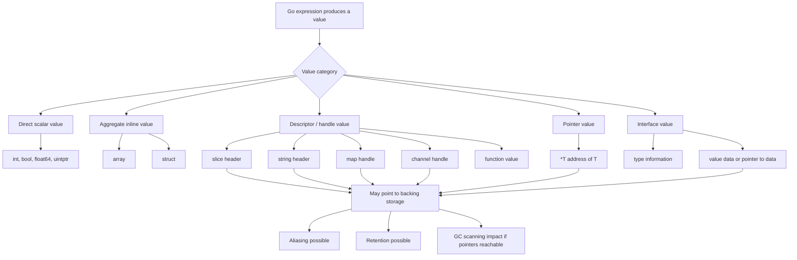
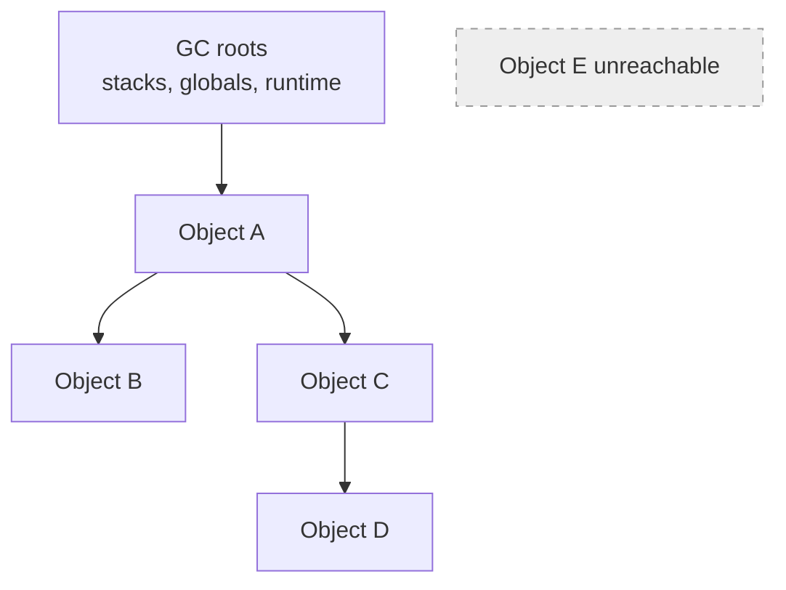
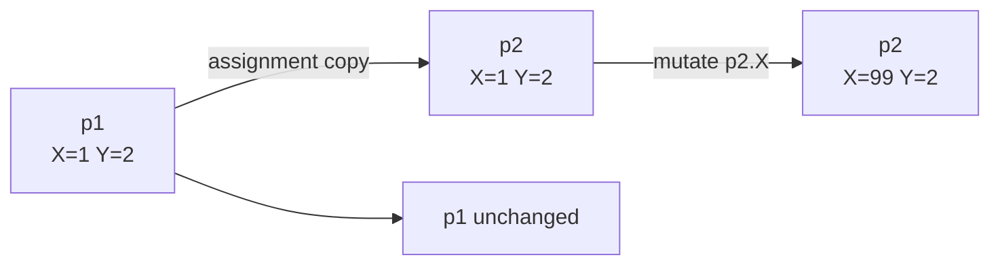
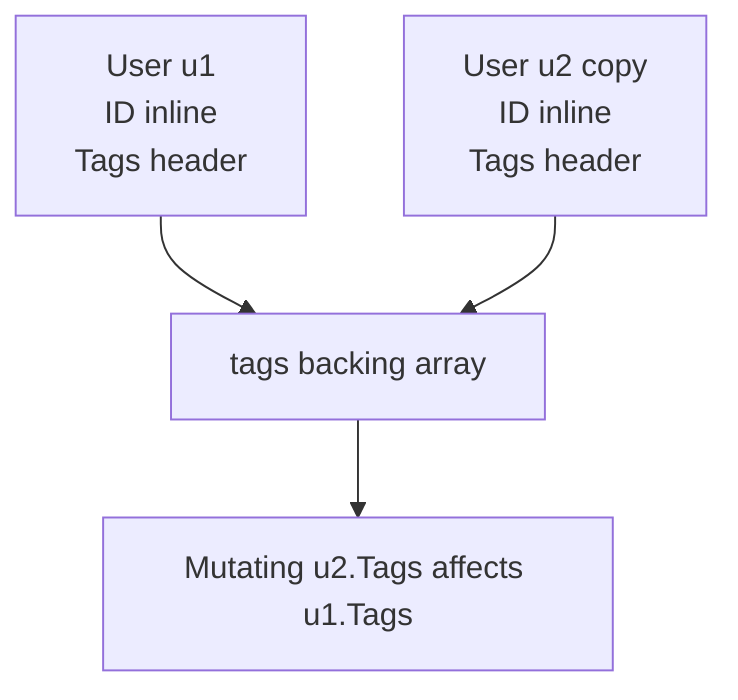
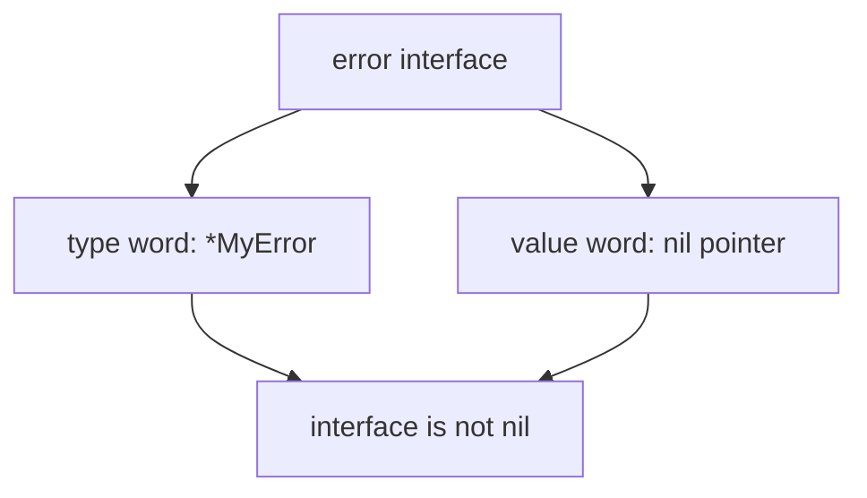

# learn-go-memory-systems-part-002.md

# Go Memory Systems — Part 002: Go Value Representation

> Seri: `learn-go-memory-systems`  
> Bagian: `002`  
> Topik: **Go value representation: scalar, array, struct, pointer, slice, string, map, chan, interface**  
> Target pembaca: Java software engineer yang ingin memahami Go sampai level internal engineering handbook  
> Versi acuan: Go 1.26.x

---

## Status Seri

Kita berada di:

```text
learn-go-memory-systems-part-002.md
```

Seri **belum selesai**.

Part sebelumnya:

```text
learn-go-memory-systems-part-000.md
learn-go-memory-systems-part-001.md
```

Part berikutnya:

```text
learn-go-memory-systems-part-003.md
```

Topik berikutnya:

```text
Pointer fundamentals: addressability, nil, aliasing, pass-by-value, pointer receiver
```

---

# 1. Tujuan Part Ini

Part ini menjawab satu pertanyaan besar:

> Ketika kita menulis value di Go, sebenarnya apa yang sedang kita pindahkan, copy, alias-kan, tahan di memory, dan lihat oleh GC?

Ini bukan hanya soal sintaks. Ini adalah fondasi untuk memahami:

- kenapa `append` bisa mengubah slice lain,
- kenapa `string` terlihat ringan tapi bisa menahan memory,
- kenapa `map` terlihat seperti reference padahal tetap pass-by-value,
- kenapa interface bisa menjadi sumber allocation tersembunyi,
- kenapa struct kecil sering lebih baik dicopy daripada dipointer-kan,
- kenapa pointer field membuat GC scanning lebih mahal,
- kenapa buffer API yang salah bisa membuat memory retention besar,
- kenapa zero-copy tanpa ownership contract sering berubah menjadi bug,
- kenapa Go tidak punya “object reference” seperti Java, tetapi tetap punya value yang membawa pointer internal.

Part ini sengaja tidak masuk terlalu dalam ke GC algorithm, escape analysis, unsafe, atau zero-copy. Semua itu punya part sendiri. Di sini kita membangun bahasa mental yang akan dipakai sepanjang seri.

---

# 2. Premis Utama: Go Adalah Bahasa Value

Kalimat paling penting:

> Di Go, assignment, argument passing, dan return pada level bahasa bekerja dengan **copy value**.

Tetapi ini sering disalahpahami.

Copy value tidak selalu berarti copy seluruh data bisnis.

Contoh:

```go
package main

import "fmt"

func mutate(s []int) {
    s[0] = 99
}

func main() {
    xs := []int{1, 2, 3}
    mutate(xs)
    fmt.Println(xs) // [99 2 3]
}
```

Apakah Go pass-by-reference?

Tidak.

Yang terjadi:

- `xs` adalah slice value.
- Slice value berisi descriptor kecil: pointer ke backing array, length, capacity.
- Saat dipass ke `mutate`, descriptor itu dicopy.
- Descriptor copy tetap menunjuk backing array yang sama.
- Mutasi elemen terjadi pada backing array yang sama.

Jadi:

```text
function call copies the slice header, not the backing array
```

Inilah pola umum di Go:

| Bentuk Value | Saat Dicopy | Data Besar Ikut Dicopy? | Bisa Alias Data Sama? |
|---|---:|---:|---:|
| `int` | nilai integer | ya, tapi kecil | tidak |
| `struct{A int; B int}` | semua field | ya, sesuai ukuran struct | tergantung field |
| `[1024]byte` | seluruh array | ya | tidak, kecuali elemen pointer |
| `[]byte` | slice header | tidak | ya |
| `string` | string header | tidak | ya, ke byte storage immutable |
| `map[K]V` | map header/pointer runtime | tidak | ya |
| `chan T` | channel handle | tidak | ya |
| `interface{}` | interface pair | tidak selalu | ya, tergantung dynamic value |
| `*T` | alamat pointer | tidak | ya |

Mental model Java sering membuat developer berpikir:

```text
primitive = value
object = reference
```

Go tidak dibagi sesederhana itu. Di Go:

```text
semua expression menghasilkan value,
tetapi beberapa value membawa pointer internal ke storage lain.
```

---

# 3. Bahasa Resmi vs Bahasa Informal

Spesifikasi Go mendefinisikan type seperti array, struct, pointer, function, interface, slice, map, dan channel sebagai composite types. Tetapi spesifikasi tidak mewajibkan semua detail layout runtime sebagai kontrak portable untuk program biasa.

Artinya, kita boleh memakai model mental untuk reasoning, tetapi harus hati-hati membedakan:

1. **kontrak bahasa**,
2. **representasi runtime yang lazim**,
3. **implementation detail yang bisa berubah**,
4. **hack unsafe yang tidak portable**.

Contoh:

- Kontrak bahasa: slice punya length dan capacity; `append` bisa mengalokasikan backing array baru.
- Model runtime umum: slice direpresentasikan sebagai pointer, len, cap.
- API reflect lama: `reflect.SliceHeader` memperlihatkan bentuk mirip pointer, len, cap.
- Tetapi dokumentasi `reflect.SliceHeader` menyatakan bentuk ini tidak aman/portable dan deprecated untuk pemakaian unsafe langsung.

Jadi dalam seri ini kita akan memakai dua lapis bahasa:

```text
Contract model  = yang boleh diandalkan oleh kode Go biasa.
Runtime model   = yang membantu diagnosis performa, selama tidak disalahgunakan sebagai kontrak ABI.
```

---

# 4. Diagram Besar Value Representation



---

# 5. Definisi Kerja yang Akan Dipakai Sepanjang Seri

## 5.1 Value

Value adalah isi dari sebuah variable/expression pada level bahasa.

Contoh:

```go
x := 10
s := []byte("abc")
p := &x
```

`x`, `s`, dan `p` semuanya menyimpan value.

Tetapi bentuk value-nya berbeda:

- `x` menyimpan integer langsung,
- `s` menyimpan descriptor slice,
- `p` menyimpan alamat object/value lain.

## 5.2 Object

Dalam diskusi memory, kita sering memakai kata object untuk menyebut region memory yang punya identity/lifetime tertentu.

Contoh:

```go
p := new(int)
```

`p` adalah pointer value. Memory yang ditunjuk oleh `p` bisa kita sebut object heap.

Namun Go bukan Java. Tidak semua value adalah heap object. `struct` bisa hidup inline di stack, di heap sebagai bagian object lain, di array, atau di backing storage slice.

## 5.3 Descriptor / Header / Handle

Beberapa value di Go adalah value kecil yang mendeskripsikan storage lain.

Contoh:

```go
s := []int{1, 2, 3}
```

`s` bukan array `[3]int`. `s` adalah descriptor yang menunjuk backing array.

Istilah yang akan sering muncul:

- slice header,
- string header,
- map handle,
- channel handle,
- interface pair.

## 5.4 Inline Storage

Inline storage berarti data berada langsung sebagai bagian dari value/container.

Contoh:

```go
type Point struct {
    X int
    Y int
}

p := Point{X: 10, Y: 20}
```

`X` dan `Y` berada inline di dalam `p`.

Kalau `Point` dicopy, dua integer ikut dicopy.

## 5.5 Indirect Storage

Indirect storage berarti value menyimpan pointer/handle ke storage lain.

Contoh:

```go
type User struct {
    Name string
    Tags []string
}
```

`User` memiliki field inline:

- string header untuk `Name`,
- slice header untuk `Tags`.

Tetapi bytes string dan backing array slice berada di storage lain.

## 5.6 Aliasing

Aliasing terjadi ketika dua atau lebih value dapat mengakses storage yang sama.

Contoh:

```go
a := []int{1, 2, 3}
b := a
b[0] = 99
```

`a` dan `b` adalah dua slice header berbeda, tetapi menunjuk backing array sama.

## 5.7 Retention

Retention terjadi ketika sebuah value kecil tetap membuat storage besar reachable oleh GC.

Contoh:

```go
big := make([]byte, 100<<20) // 100 MiB
small := big[:10]
_ = small
```

`small` hanya length 10, tetapi dapat tetap menahan backing array 100 MiB jika `big` tidak lagi dipakai tetapi backing array masih reachable melalui `small`.

## 5.8 Copy

Copy berarti byte-level movement/copy dari representation value.

Tetapi akibat copy tergantung representation:

```go
a := [3]int{1, 2, 3}
b := a // copy all elements

s1 := []int{1, 2, 3}
s2 := s1 // copy slice header only
```

## 5.9 Ownership

Go tidak punya ownership system seperti Rust.

Tetapi production code tetap perlu ownership contract.

Contoh kontrak:

```text
Caller owns input buffer and may reuse it after function returns.
Callee must copy if it needs to retain data.
```

atau:

```text
Function returns a borrowed view valid only until next Read call.
```

Ownership di Go adalah desain API, bukan fitur type system bawaan.

---

# 6. Scalar Values

Scalar value adalah value sederhana yang biasanya disimpan langsung.

Contoh:

```go
var a int64 = 10
var b bool = true
var c float64 = 3.14
var d byte = 0xff
```

Saat dicopy:

```go
x := a
```

nilai integer dicopy langsung.

Tidak ada backing storage tersembunyi.

## 6.1 Scalar dan GC

Scalar non-pointer tidak memberi GC graph tambahan.

Contoh:

```go
type Counter struct {
    A int64
    B int64
    C uint64
}
```

Struct ini pointer-free. GC tidak perlu menelusuri field-fieldnya sebagai pointer.

Bandingkan:

```go
type CounterWithName struct {
    A    int64
    B    int64
    Name string
}
```

`Name` adalah string header yang mengandung pointer ke data bytes. Object yang memuat struct ini memiliki pointer metadata yang perlu diketahui GC.

## 6.2 Scalar dan Cache

Scalar kecil biasanya bagus untuk locality.

Contoh array counter:

```go
counts := make([]uint64, 1024)
```

Backing array berisi angka-angka inline, berdekatan di memory.

Ini berbeda dengan:

```go
counts := make([]*uint64, 1024)
```

Sekarang backing array berisi pointer. Tiap pointer bisa menunjuk lokasi berbeda. Ini menambah pointer chasing, pressure ke cache, dan scanning GC.

## 6.3 Java Comparison

Di Java:

```java
long[] xs = new long[1024];
```

mirip dengan Go:

```go
xs := make([]int64, 1024)
```

Keduanya menyimpan scalar secara dense.

Tetapi Java:

```java
Long[] xs = new Long[1024];
```

berbeda besar. Itu array reference ke object `Long`, bukan inline long.

Di Go, tidak ada autoboxing scalar ke wrapper object seperti `Long`. Tetapi scalar bisa masuk ke interface, dan pada kondisi tertentu representation/interface conversion bisa menyebabkan allocation. Itu akan dibahas lebih dalam di Part 011 dan Part 012.

---

# 7. Array Representation

Array di Go adalah fixed-length sequence, dan length adalah bagian dari type.

```go
var a [3]int
var b [4]int
```

`[3]int` dan `[4]int` adalah type berbeda.

Array menyimpan elemen secara inline.

```go
a := [3]int{1, 2, 3}
b := a
b[0] = 99

fmt.Println(a) // [1 2 3]
fmt.Println(b) // [99 2 3]
```

Assignment array mencopy seluruh array.

## 7.1 Array Sebagai Field Struct

```go
type Packet struct {
    Header [16]byte
    Body   [1024]byte
}
```

`Header` dan `Body` berada inline di dalam `Packet`.

Saat `Packet` dicopy, seluruh array ikut dicopy.

Ini bisa bagus atau buruk.

Bagus:

- locality tinggi,
- tidak ada pointer ke backing storage terpisah,
- GC scanning bisa lebih murah jika elemen pointer-free.

Buruk:

- copy besar,
- stack frame bisa besar,
- function argument bisa mahal,
- accidental copy bisa mahal.

## 7.2 Array vs Slice

```go
func takesArray(a [1024]byte) {}
func takesSlice(s []byte) {}
```

Calling:

```go
var buf [1024]byte

takesArray(buf)  // copies 1024 bytes
takesSlice(buf[:]) // copies slice header only
```

Array cocok ketika:

- ukuran kecil/fixed,
- value semantics diinginkan,
- tidak ingin aliasing,
- data harus inline.

Slice cocok ketika:

- ukuran dinamis,
- ingin view ke array/backing storage,
- ingin menghindari copy besar,
- ingin API umum untuk sequence.

## 7.3 Array Copy Trap

```go
type Large struct {
    Data [1 << 20]byte
}

func process(x Large) {
    // copies 1 MiB into parameter
}
```

Lebih baik:

```go
func process(x *Large) {
    // copies pointer only
}
```

atau:

```go
func process(data []byte) {
    // copies slice header only
}
```

Tetapi jangan membuat semua struct menjadi pointer hanya karena takut copy. Struct kecil sering lebih baik dicopy.

---

# 8. Struct Representation

Struct adalah aggregate inline dari field-fieldnya.

```go
type Point struct {
    X int64
    Y int64
}
```

Secara mental:

```text
Point value
+---------+---------+
| X int64 | Y int64 |
+---------+---------+
```

Saat dicopy, field-fieldnya dicopy.

```go
p1 := Point{X: 1, Y: 2}
p2 := p1
p2.X = 99
```

`p1` tidak berubah karena `Point` dicopy.

## 8.1 Struct dengan Field Descriptor

```go
type User struct {
    ID   int64
    Name string
    Tags []string
}
```

Secara mental:

```text
User value
+---------+----------------+----------------+
| ID      | Name header    | Tags header    |
+---------+----------------+----------------+
             |                  |
             v                  v
       string bytes       backing array of strings
```

Saat `User` dicopy:

- `ID` dicopy langsung,
- string header dicopy,
- slice header dicopy,
- bytes string tidak dicopy,
- backing array `Tags` tidak dicopy.

Jadi copy struct tidak selalu deep copy.

## 8.2 Shallow Copy vs Deep Copy

Go assignment adalah shallow copy pada representation value.

Contoh:

```go
type Config struct {
    Name string
    Args []string
}

c1 := Config{Name: "app", Args: []string{"--debug"}}
c2 := c1
c2.Args[0] = "--prod"

fmt.Println(c1.Args[0]) // --prod
```

Kenapa?

`Args` slice header dicopy, backing array sama.

Deep copy perlu eksplisit:

```go
func CloneConfig(c Config) Config {
    out := c
    out.Args = append([]string(nil), c.Args...)
    return out
}
```

## 8.3 Struct dengan Pointer Field

```go
type Node struct {
    Key   string
    Value []byte
    Next  *Node
}
```

Struct ini punya beberapa indirect references:

- `Key` menunjuk string data,
- `Value` menunjuk backing array,
- `Next` menunjuk node lain.

GC harus mampu menelusuri pointer graph ini.

Semakin banyak pointer field pada hot object, semakin besar potensi:

- GC scanning overhead,
- pointer chasing,
- cache miss,
- accidental retention.

## 8.4 Struct Layout Preview

Field order mempengaruhi padding dan ukuran struct.

Contoh:

```go
type Bad struct {
    A bool
    B int64
    C bool
}

type Better struct {
    B int64
    A bool
    C bool
}
```

Kita akan membahas layout, alignment, padding, cache line, dan false sharing secara detail di Part 008.

Untuk sekarang cukup pahami:

> Struct adalah inline aggregate, tetapi field-nya bisa mengandung pointer/descriptor ke storage lain.

---

# 9. Pointer Representation

Pointer value menyimpan address dari value/object lain.

```go
x := 10
p := &x
```

Secara mental:

```text
p
+----------+
| address  | ----> x
+----------+       +----+
                   | 10 |
                   +----+
```

Saat pointer dicopy:

```go
q := p
```

alamat dicopy. `p` dan `q` menunjuk target yang sama.

```go
*q = 99
fmt.Println(*p) // 99
```

## 9.1 Pointer Bukan Reference Java

Di Java:

```java
User u = new User();
```

`u` adalah reference ke object heap.

Di Go:

```go
u := User{}
```

`u` adalah value `User`, bukan pointer.

Kalau ingin pointer:

```go
u := &User{}
```

Tetapi Go compiler/runtime bisa menempatkan value di stack atau heap tergantung escape analysis. Jadi kita tidak menyimpulkan lokasi memory hanya dari sintaks.

```go
func makeUser() *User {
    u := User{}
    return &u
}
```

Ini aman di Go. Compiler akan memastikan lifetime `u` valid setelah function return, biasanya dengan membuatnya escape ke heap.

## 9.2 Pointer Cost

Pointer mengurangi copy besar tetapi menambah indirect access.

Trade-off:

| Pilihan | Kelebihan | Risiko |
|---|---|---|
| Copy small struct | locality bagus, tanpa aliasing | copy cost jika struct membesar |
| Pointer to struct | menghindari copy besar, bisa mutasi shared | aliasing, nil, GC scanning, cache miss |
| Slice of struct | data dense | moving/copy saat append realloc |
| Slice of pointer | stable identity, polymorphic-ish | pointer chasing, GC overhead |

## 9.3 Pointer dan Nil

Zero value pointer adalah `nil`.

```go
var p *int
fmt.Println(p == nil) // true
```

Dereference nil pointer panic:

```go
fmt.Println(*p) // panic
```

Pointer membuat state space lebih besar:

```text
value exists
value absent
pointer exists but target invalid? generally no in safe Go, possible with unsafe/cgo misuse
```

Part 003 akan fokus khusus pada pointer fundamentals.

---

# 10. Slice Representation

Slice adalah salah satu value terpenting di Go memory systems.

Secara mental, slice value terdiri dari:

```text
slice header
+---------+-----+-----+
| data*   | len | cap |
+---------+-----+-----+
```

Data pointer menunjuk elemen pertama dari view slice pada backing array.

Contoh:

```go
xs := []int{10, 20, 30, 40}
ys := xs[1:3]
```

Diagram:

```mermaid
flowchart LR
    xs[xs header<br/>ptr=&array[0]<br/>len=4 cap=4] --> arr
    ys[ys header<br/>ptr=&array[1]<br/>len=2 cap=3] --> arr

    arr[backing array<br/>10 | 20 | 30 | 40]
```

`ys` melihat elemen `20, 30`, tetapi capacity-nya masih bisa menjangkau sampai `40`.

## 10.1 Slice Assignment

```go
xs := []int{1, 2, 3}
ys := xs
ys[0] = 99

fmt.Println(xs) // [99 2 3]
```

Yang dicopy hanya header.

## 10.2 Slice Append

`append` punya dua kemungkinan:

1. capacity cukup: tulis ke backing array yang sama,
2. capacity tidak cukup: alokasi backing array baru, copy elemen lama.

Contoh capacity cukup:

```go
a := make([]int, 2, 4)
a[0], a[1] = 1, 2
b := append(a, 3)
b[0] = 99

fmt.Println(a[0]) // 99
```

`a` dan `b` masih share backing array.

Contoh capacity tidak cukup:

```go
a := make([]int, 2, 2)
a[0], a[1] = 1, 2
b := append(a, 3)
b[0] = 99

fmt.Println(a[0]) // 1
```

`b` memakai backing array baru.

## 10.3 Slice sebagai View, Bukan Owner Otomatis

Slice tidak tahu apakah ia “memiliki” backing array.

```go
func parseLine(buf []byte) []byte {
    return buf[:10]
}
```

Apakah returned slice aman disimpan?

Tergantung:

- apakah `buf` akan direuse?
- apakah backing array besar?
- apakah caller mengharapkan copy?
- apakah returned slice hanya borrowed view?

Karena Go tidak punya ownership annotation, API harus menjelaskan contract.

## 10.4 Slice Retention

```go
func first10MBAsSmallView() []byte {
    big := make([]byte, 100<<20)
    return big[:10]
}
```

Return value length 10, tetapi bisa menahan 100 MiB.

Solusi kalau hanya ingin 10 byte:

```go
func first10Copy() []byte {
    big := make([]byte, 100<<20)
    out := make([]byte, 10)
    copy(out, big[:10])
    return out
}
```

Copy kecil bisa menyelamatkan memory besar.

Inilah salah satu pelajaran terpenting:

> Zero-copy kadang lebih boros memory daripada copy kecil.

---

# 11. String Representation

String di Go adalah immutable sequence of bytes.

Secara mental:

```text
string header
+---------+-----+
| data*   | len |
+---------+-----+
```

Tidak ada capacity karena string immutable.

```go
s := "hello"
t := s
```

`t` mencopy string header. Byte data tidak dicopy.

## 11.1 String Bukan `[]rune`

```go
s := "é"
fmt.Println(len(s)) // 2, because UTF-8 encoded bytes
```

String length adalah byte length, bukan jumlah karakter manusia.

## 11.2 String Immutability

Kita tidak bisa mengubah isi string:

```go
s := "abc"
// s[0] = 'x' // compile error
```

Kalau perlu mutasi:

```go
b := []byte(s)
b[0] = 'x'
s2 := string(b)
```

Konversi normal `string` <-> `[]byte` melakukan copy agar immutability aman.

## 11.3 String dan Retention

String kecil bisa menunjuk storage besar jika dibuat sebagai substring/view dalam implementasi tertentu atau melalui unsafe. Dalam Go modern, detail substring allocation/retention adalah area yang tidak sebaiknya dijadikan kontrak performa tanpa profiling. Yang penting secara desain:

- string header kecil,
- data bytes bisa berada terpisah,
- string bisa menahan data yang ditunjuk selama reachable,
- unsafe string view terhadap buffer mutable berbahaya.

## 11.4 String API Boundary

Pertanyaan desain:

```go
func Parse(s string) Result
func ParseBytes(b []byte) Result
```

Gunakan `string` jika:

- input logically text immutable,
- ingin map key,
- caller tidak perlu reuse buffer mutable,
- data kecil/medium.

Gunakan `[]byte` jika:

- input dari stream/network/file,
- parsing binary/text hot path,
- ingin menghindari konversi berulang,
- caller mengelola buffer lifecycle.

Tetapi API `[]byte` harus menjelaskan apakah function menyimpan slice atau hanya membaca selama call.

---

# 12. Map Representation

Map value adalah handle ke runtime hash table.

```go
m1 := map[string]int{"a": 1}
m2 := m1
m2["a"] = 99

fmt.Println(m1["a"]) // 99
```

Assignment map mencopy handle, bukan seluruh isi map.

Secara mental:

```text
m1 handle ----+
              v
          runtime map buckets
              ^
m2 handle ----+
```

## 12.1 Map Nil vs Empty

```go
var m map[string]int
fmt.Println(m == nil) // true
fmt.Println(len(m))   // 0

// m["x"] = 1 // panic: assignment to entry in nil map
```

Empty map:

```go
m := map[string]int{}
m["x"] = 1
```

or:

```go
m := make(map[string]int)
```

Nil map can be read but not written.

## 12.2 Map Copy is Not Deep Copy

```go
func cloneMap[K comparable, V any](in map[K]V) map[K]V {
    out := make(map[K]V, len(in))
    for k, v := range in {
        out[k] = v
    }
    return out
}
```

Tetapi ini pun hanya deep copy level map entries. Jika `V` adalah slice/pointer/map, isi internalnya masih shallow.

Contoh:

```go
m1 := map[string][]int{"x": {1, 2}}
m2 := cloneMap(m1)
m2["x"][0] = 99

fmt.Println(m1["x"][0]) // 99
```

Perlu clone nested slice juga kalau ownership harus terpisah.

## 12.3 Map Growth dan Retention

Map bisa tumbuh dan mempertahankan bucket memory. Menghapus entries tidak selalu berarti memory langsung kembali kecil.

```go
m := make(map[int][]byte)
for i := 0; i < 1_000_000; i++ {
    m[i] = make([]byte, 128)
}
for k := range m {
    delete(m, k)
}
```

Setelah delete:

- entries hilang,
- value slice mungkin tidak lagi reachable,
- tetapi struktur bucket map bisa tetap besar sampai map tidak reachable atau diganti.

Pattern untuk reset besar:

```go
m = make(map[int][]byte)
```

atau biarkan map lama unreachable.

## 12.4 Map dan GC

Map dengan key/value pointer-containing lebih mahal discan daripada pointer-free data.

Contoh lebih ringan:

```go
map[uint64]uint64
```

Contoh lebih berat:

```go
map[string][]byte
```

Karena:

- string key mengandung pointer ke bytes,
- slice value mengandung pointer ke backing array,
- buckets berisi pointer-bearing entries.

Ini tidak berarti hindari map string. Tetapi pada hot path besar, desain key/value representation penting.

---

# 13. Channel Representation

Channel value adalah handle ke runtime channel object.

```go
ch1 := make(chan int, 10)
ch2 := ch1

ch1 <- 1
fmt.Println(<-ch2) // 1
```

Assignment channel mencopy handle. Kedua variable menunjuk channel runtime yang sama.

## 13.1 Channel Contains Buffer

Buffered channel:

```go
ch := make(chan []byte, 1000)
```

Channel ini bisa menahan sampai 1000 slice headers. Jika tiap slice header menunjuk buffer 1 MiB, channel dapat menahan 1 GiB backing arrays.

```text
buffered channel is a memory queue
```

Banyak incident memory di Go bukan karena GC buruk, tetapi karena channel dijadikan queue tak terbatas secara konseptual.

## 13.2 Channel Ownership

Saat mengirim value melalui channel, value dicopy ke channel buffer atau langsung ke receiver.

```go
ch := make(chan []byte, 1)
b := []byte{1, 2, 3}
ch <- b
b[0] = 99

x := <-ch
fmt.Println(x[0]) // 99
```

Yang dikirim adalah slice header copy. Backing array tetap sama.

Jika ingin transfer ownership buffer, convention harus jelas:

```text
After sending b on channel, sender must not mutate or reuse b.
Receiver becomes owner.
```

Go tidak memaksa aturan ini. Tim harus mendesain dan mereviewnya.

## 13.3 Channel Close dan Retention

Menutup channel tidak otomatis membuang buffered values sampai values tidak lagi reachable.

```go
close(ch)
```

Jika channel object masih reachable dan buffer masih berisi values, values tersebut masih bisa ditahan.

---

# 14. Function Value Representation

Function juga bisa menjadi value.

```go
f := func(x int) int { return x + 1 }
fmt.Println(f(10))
```

Closure bisa menangkap variable.

```go
func adder(base int) func(int) int {
    return func(x int) int {
        return base + x
    }
}
```

`base` harus tetap hidup setelah `adder` return, sehingga biasanya captured environment perlu dialokasikan di heap.

## 14.1 Closure Retention

```go
func makeProcessor(big []byte) func() int {
    return func() int {
        return int(big[0])
    }
}
```

Function value yang dikembalikan menahan `big`. Jika `big` 100 MiB, closure kecil menahan memory besar.

Solusi:

```go
func makeProcessor(big []byte) func() int {
    first := big[0]
    return func() int {
        return int(first)
    }
}
```

Sekarang closure hanya menangkap satu byte, bukan slice header yang menahan backing array besar.

## 14.2 Function Values in Hot Path

Function values/callbacks bisa baik untuk desain, tetapi di hot path perlu memahami:

- apakah closure capture menyebabkan allocation,
- apakah dynamic dispatch menghambat inline,
- apakah callback menahan object besar,
- apakah closure lifecycle lebih panjang dari request.

Kita tidak menghindari closure secara dogmatis. Kita ukur dan desain lifecycle-nya.

---

# 15. Interface Representation

Interface value secara mental terdiri dari dua hal:

```text
interface value
+------------------+-------------------+
| dynamic type info | dynamic value data |
+------------------+-------------------+
```

Untuk non-empty interface, type info juga terkait method set.

Contoh:

```go
type Stringer interface {
    String() string
}

var x any = 42
```

`x` menyimpan:

- dynamic type: `int`,
- dynamic value: `42` atau pointer/data representation internal.

## 15.1 Interface Copy

```go
var a any = []int{1, 2, 3}
b := a
```

Interface pair dicopy.

Dynamic value-nya adalah slice header. Slice header itu menunjuk backing array. Jadi `a` dan `b` dapat mengarah ke data yang sama.

## 15.2 Nil Interface Trap

```go
type MyError struct{}

func (*MyError) Error() string { return "x" }

func returnsError() error {
    var e *MyError = nil
    return e
}

func main() {
    err := returnsError()
    fmt.Println(err == nil) // false
}
```

Kenapa?

Interface `err` berisi:

```text
dynamic type = *MyError
dynamic value = nil pointer
```

Interface-nya sendiri tidak nil karena type word ada.

Nil interface berarti kedua komponen kosong:

```text
type = nil
value = nil
```

## 15.3 Interface dan Allocation

Passing value ke interface tidak selalu allocate. Tetapi interface bisa membuat allocation terjadi ketika:

- value perlu disimpan di heap karena escape,
- value besar/dynamic harus ditempatkan indirect,
- interface disimpan ke long-lived structure,
- variadic `...any` membuat slice interface,
- reflection/logging/formatting memperpanjang lifetime.

Contoh hot path:

```go
func Log(args ...any) {}

func handle(id int64, name string) {
    Log("id", id, "name", name)
}
```

`args ...any` membentuk `[]any`; setiap argumen dikonversi ke interface. Ini sering acceptable untuk logging, tetapi bisa mahal jika dilakukan di loop jutaan kali.

## 15.4 Interface vs Generic vs Concrete

Pilihan desain:

| Bentuk | Kelebihan | Risiko |
|---|---|---|
| Concrete type | cepat, inline-friendly | kurang fleksibel |
| Interface | decoupling, polymorphism | dynamic dispatch, allocation tersembunyi |
| Generic | type-safe abstraction | code complexity, tidak selalu lebih cepat |
| `any` map | fleksibel | allocation, reflection, type assertion |

Part 011 dan 012 akan masuk sangat dalam ke interface dan boxing-like behavior.

---

# 16. Map, Slice, Channel Disebut Reference Type? Hati-Hati

Banyak materi menyebut slice/map/channel sebagai “reference types”. Ini berguna secara informal, tetapi bisa menyesatkan.

Lebih tepat:

> Slice, map, dan channel adalah value yang membawa reference/handle ke runtime storage.

Kenapa istilah “reference type” berbahaya?

Karena developer bisa lupa bahwa header/handle-nya tetap dicopy.

Contoh slice:

```go
func grow(s []int) {
    s = append(s, 1)
}

func main() {
    s := []int{}
    grow(s)
    fmt.Println(len(s)) // 0
}
```

Jika slice benar-benar pass-by-reference, len caller akan berubah. Tetapi tidak.

Yang terjadi:

- slice header caller dicopy ke parameter,
- `append` mengubah local header `s`,
- caller header tetap sama.

Agar caller menerima header baru:

```go
func grow(s []int) []int {
    s = append(s, 1)
    return s
}

s = grow(s)
```

Map berbeda karena operasi insert/delete memodifikasi runtime map yang ditunjuk handle. Tetapi jika function mengganti map handle, caller tidak melihat kecuali return atau pointer to map.

```go
func reset(m map[string]int) {
    m = make(map[string]int)
}

func main() {
    m := map[string]int{"a": 1}
    reset(m)
    fmt.Println(m) // still map[a:1]
}
```

---

# 17. Representation Matrix

| Type | Representation Mental | Assignment Copy | Mutasi Isi Terlihat oleh Copy Lain? | Bisa Retain Memory Besar? | GC Relevance |
|---|---|---|---|---|---|
| `int` | value langsung | integer | tidak | tidak | no pointer |
| `bool` | value langsung | bool | tidak | tidak | no pointer |
| `[N]T` | elemen inline | semua elemen | tidak, kecuali elemen pointer mengarah sama | jika elemen pointer | depends T |
| `struct` | field inline | semua field | field descriptor/pointer bisa alias | ya jika field menunjuk data besar | depends fields |
| `*T` | address | address | ya | ya | pointer root/edge |
| `[]T` | ptr,len,cap | header | ya untuk backing array | ya | ptr to array |
| `string` | ptr,len | header | immutable | ya | ptr to bytes |
| `map[K]V` | runtime map handle | handle | ya | ya | depends K/V |
| `chan T` | runtime channel handle | handle | ya | ya via buffered values | depends T |
| `func` | code + env | function value | env shared | ya via captured vars | closure env |
| `interface` | type + data | pair | depends dynamic value | ya | depends dynamic value |

---

# 18. Copy Depth: A Practical Taxonomy

Untuk review kode, gunakan taxonomy ini.

## 18.1 Level 0: Direct Copy

```go
x := 10
y := x
```

Tidak ada aliasing.

## 18.2 Level 1: Shallow Aggregate Copy

```go
type Point struct { X, Y int }
p2 := p1
```

Tidak ada aliasing jika semua field direct scalar.

## 18.3 Level 2: Descriptor Copy

```go
s2 := s1
```

Header dicopy, backing storage shared.

## 18.4 Level 3: Nested Shallow Copy

```go
type User struct {
    Tags []string
}

u2 := u1
```

Struct dicopy, slice header field dicopy, backing array shared.

## 18.5 Level 4: Deep Copy Manual

```go
func CloneUser(u User) User {
    out := u
    out.Tags = append([]string(nil), u.Tags...)
    return out
}
```

Deep copy harus dirancang eksplisit per field.

## 18.6 Level 5: Semantic Copy

Kadang deep copy byte-level belum cukup.

Contoh:

```go
type Session struct {
    ID     string
    Cache  map[string][]byte
    Socket net.Conn
}
```

Apa arti clone `Session`?

- Apakah socket ikut diclone? Tidak mungkin secara sederhana.
- Apakah cache dicopy?
- Apakah ID sama?
- Apakah ownership pindah?

Production API harus membedakan:

- clone data,
- snapshot state,
- transfer ownership,
- share handle,
- reset resource.

---

# 19. GC Scanning Mental Model

GC tidak peduli tipe bisnis seperti `User`, `Order`, `Packet`. GC peduli pointer graph.

Simplified:



Object reachable tetap hidup.

Object unreachable bisa dikumpulkan.

## 19.1 Pointer-Free Data

```go
type Page struct {
    Data [4096]byte
}
```

Jika object `Page` reachable, GC perlu tahu object hidup, tetapi tidak perlu scan isi `Data` sebagai pointer.

## 19.2 Pointer-Rich Data

```go
type Page struct {
    Rows []*Row
}
```

GC perlu scan slice backing array berisi pointer ke `Row`.

## 19.3 Dense Byte Buffer vs Object Graph

Dua desain untuk 1 juta records:

```go
type Record struct {
    Key   string
    Value []byte
    Next  *Record
}
```

versus:

```go
type Segment struct {
    Data []byte
    Index []uint32
}
```

Desain pertama pointer-rich.

Desain kedua bisa lebih pointer-light:

- satu `[]byte` besar,
- satu `[]uint32` dense,
- offset-based addressing.

Trade-off:

- lebih sulit diprogram,
- lebih manual encoding,
- tetapi bisa jauh lebih baik untuk cache dan GC.

Ini pola penting untuk storage engine, parsers, high-throughput networking, dan telemetry pipelines.

---

# 20. Representation dan Escape Analysis

Escape analysis menjawab pertanyaan:

> Apakah value bisa tetap di stack, atau harus hidup lebih lama sehingga dialokasikan di heap?

Representation mempengaruhi escape.

Contoh:

```go
func f() *int {
    x := 10
    return &x
}
```

`x` escape.

Contoh descriptor:

```go
func g() []byte {
    b := make([]byte, 1024)
    return b
}
```

Slice header return by value, tetapi backing array harus tetap hidup setelah function return, sehingga backing array biasanya heap.

Contoh closure:

```go
func h() func() int {
    x := 10
    return func() int { return x }
}
```

Captured `x` harus tetap hidup.

## 20.1 Inspect Escape

Gunakan:

```bash
go build -gcflags=-m ./...
```

atau lebih detail:

```bash
go build -gcflags=-m=3 ./...
```

Part 006 akan membahas ini secara mendalam.

Di part ini cukup pahami:

> Value representation menjelaskan apa yang mungkin dicopy. Escape analysis menjelaskan di mana storage-nya hidup.

---

# 21. Representation dan API Design

API Go yang matang biasanya jelas tentang copy, aliasing, dan ownership.

## 21.1 Accepting `[]byte`

```go
func Parse(b []byte) (Message, error)
```

Pertanyaan review:

- Apakah `Parse` menyimpan `b` di result?
- Apakah `Message` berisi view ke `b`?
- Apakah caller boleh reuse `b` setelah `Parse` return?
- Apakah `Parse` perlu copy field tertentu?

Kontrak harus jelas:

```go
// Parse reads b during the call only. The returned Message does not retain b.
func Parse(b []byte) (Message, error)
```

atau:

```go
// ParseView returns a Message that borrows b. The caller must keep b unchanged
// and alive for as long as the Message is used.
func ParseView(b []byte) (MessageView, error)
```

## 21.2 Returning `[]byte`

```go
func Bytes() []byte
```

Pertanyaan:

- Apakah returned slice internal buffer?
- Boleh dimutasi caller?
- Valid sampai kapan?
- Apakah caller harus copy?

Pattern aman:

```go
func (m Message) Bytes() []byte {
    out := make([]byte, len(m.data))
    copy(out, m.data)
    return out
}
```

Pattern high-performance dengan kontrak:

```go
// BytesView returns a read-only view valid until the next mutation of m.
func (m *Message) BytesView() []byte {
    return m.data
}
```

Go tidak punya read-only slice. Jadi “read-only” adalah kontrak dokumentasi.

## 21.3 Accepting Struct by Value or Pointer

```go
func Handle(req Request)
func Handle(req *Request)
```

Gunakan value jika:

- struct kecil,
- immutability/value semantics diinginkan,
- tidak perlu mutate caller,
- field tidak membawa aliasing berbahaya.

Gunakan pointer jika:

- struct besar,
- method perlu mutate receiver,
- identity penting,
- copying dilarang karena field seperti mutex,
- ingin avoid large copy.

Tetapi pointer bukan default superior.

---

# 22. Representation dan Concurrency

Walaupun seri concurrency sudah selesai, memory representation tetap punya hubungan langsung dengan data race.

## 22.1 Copy Header, Share Backing Store

```go
func worker(b []byte) {
    b[0] = 1
}

buf := make([]byte, 10)
go worker(buf)
buf[0] = 2
```

Dua goroutine mengakses backing array sama tanpa sinkronisasi.

Slice header dicopy, tetapi storage shared.

## 22.2 Struct Copy dengan Pointer Field

```go
type State struct {
    Data []byte
}

s1 := State{Data: make([]byte, 10)}
s2 := s1
```

`s1` dan `s2` terlihat sebagai state berbeda, tetapi `Data` sama.

Kalau dipakai di goroutine berbeda, bisa race.

## 22.3 Map Handle Shared

```go
m := map[string]int{}
go func() { m["x"] = 1 }()
go func() { m["y"] = 2 }()
```

Map runtime sama. Concurrent write tanpa sinkronisasi adalah bug.

Representation menjelaskan kenapa.

---

# 23. Representation dan Serialization

Serialization sering menyembunyikan allocation.

Contoh:

```go
json.Marshal(v)
json.Unmarshal(data, &v)
```

Hal yang perlu dipahami:

- `string` field bisa allocate,
- `[]byte` field punya special JSON behavior tertentu,
- map/slice allocation bisa banyak,
- `interface{}` target menghasilkan dynamic maps/slices/numbers,
- reflection memperbesar overhead.

Untuk hot path:

- gunakan typed structs,
- hindari `map[string]any` jika schema diketahui,
- stream decode jika input besar,
- reuse buffer dengan hati-hati,
- pertimbangkan binary format jika cocok.

---

# 24. Representation dan Logging

Logging terlihat sederhana, tetapi sering menjadi allocation source.

Contoh:

```go
log.Printf("user=%v payload=%v", user, payload)
```

Potensi biaya:

- variadic `...any`,
- interface conversion,
- reflection formatting,
- string building,
- byte-to-string conversion,
- retention kalau logger async menyimpan fields.

Structured logger yang baik biasanya memperhatikan:

- typed fields,
- lazy formatting,
- bounded queue,
- copy policy untuk byte/string fields,
- drop/backpressure policy.

Representation membantu membaca apakah logging menyalin data atau hanya menahan reference ke data mutable.

---

# 25. Representation dan Cache Design

Cache adalah tempat bug retention sering muncul.

Contoh:

```go
cache[key] = value[:10]
```

Jika `value` backing array 10 MiB, cache menyimpan slice length 10 tetapi menahan 10 MiB.

Solusi:

```go
small := append([]byte(nil), value[:10]...)
cache[key] = small
```

Dalam cache, copy kecil sering benar.

## 25.1 Cache Key

`string` sering dipakai sebagai key.

Jika key berasal dari `[]byte`, konversi:

```go
key := string(b)
```

biasanya copy. Ini biaya, tetapi memberi immutable key aman.

Unsafe zero-copy key dari mutable buffer bisa menghancurkan map invariant jika buffer berubah. Jangan lakukan kecuali benar-benar menguasai lifetime dan immutability.

---

# 26. Diagrams: Copy vs Alias

## 26.1 Struct Scalar Copy



## 26.2 Slice Header Copy

```mermaid
flowchart TD
    S1[s1 header<br/>ptr,len,cap] --> ARR[backing array]
    S2[s2 header<br/>ptr,len,cap] --> ARR
    MUT[s2[0]=99] --> ARR
    ARR --> OBS[s1 observes changed element]
```

## 26.3 Struct with Slice Field Copy



## 26.4 Interface Nil Trap



---

# 27. Common Misconceptions

## 27.1 “Go is pass-by-reference for slices/maps/channels”

Lebih benar:

```text
Go passes everything by value.
Some values contain references/handles to shared storage.
```

## 27.2 “Pointer is always faster”

Tidak.

Pointer bisa:

- menyebabkan heap allocation,
- menambah GC scanning,
- menyebabkan cache miss,
- membuka aliasing,
- menambah nil state.

Struct kecil by value sering lebih cepat dan lebih aman.

## 27.3 “Zero-copy is always better”

Tidak.

Zero-copy bisa:

- menahan backing array besar,
- mengekspos mutable buffer,
- memperpanjang lifetime,
- membuat API sulit,
- menyebabkan data corruption jika buffer reused.

## 27.4 “Map delete frees memory”

Tidak selalu dalam arti RSS/structure shrink langsung.

Delete menghapus entry. Struktur map bisa tetap besar.

## 27.5 “String conversion is free”

Konversi aman `[]byte` ke `string` biasanya copy. Ini sengaja untuk menjaga immutability.

## 27.6 “Interface is just like Java Object”

Tidak.

Interface Go adalah pair dynamic type + dynamic value. Nil behavior, allocation behavior, dan method dispatch berbeda dari Java object reference.

---

# 28. Production Review Checklist

Gunakan checklist ini saat membaca PR Go yang sensitif memory.

## 28.1 Value Copy

- Apakah struct besar dipass by value?
- Apakah array besar tidak sengaja dicopy?
- Apakah struct mengandung mutex/atomic yang tidak boleh dicopy?
- Apakah return value menyalin data besar?

## 28.2 Aliasing

- Apakah slice hasil reslice masih share backing array?
- Apakah struct copy mengandung slice/map/pointer field?
- Apakah map handle dishare lintas component?
- Apakah channel mengirim slice yang masih dimutasi sender?

## 28.3 Retention

- Apakah small slice menahan big buffer?
- Apakah closure menangkap object besar?
- Apakah cache menyimpan view ke buffer besar?
- Apakah map/channel masih reachable setelah data tidak diperlukan?

## 28.4 Interface

- Apakah hot path memakai `any`, `fmt`, atau reflection?
- Apakah `...any` dipakai dalam loop besar?
- Apakah nil interface trap mungkin terjadi?
- Apakah generic/concrete type lebih cocok?

## 28.5 API Ownership

- Siapa pemilik buffer input?
- Bolehkan caller reuse setelah call?
- Apakah returned slice mutable?
- Valid sampai kapan view yang dikembalikan?
- Apakah function melakukan copy atau borrow?

## 28.6 GC Shape

- Apakah data bisa dibuat pointer-free?
- Apakah slice of pointer perlu diganti slice of struct/offset?
- Apakah map key/value pointer-rich pada skala besar?
- Apakah object graph terlalu granular?

---

# 29. Mini Lab 1: Predict Copy Behavior

Baca kode ini dan prediksi output.

```go
package main

import "fmt"

type Box struct {
    Name string
    Data []int
}

func main() {
    a := Box{Name: "A", Data: []int{1, 2, 3}}
    b := a

    b.Name = "B"
    b.Data[0] = 99

    fmt.Println(a.Name, a.Data)
    fmt.Println(b.Name, b.Data)
}
```

Output:

```text
A [99 2 3]
B [99 2 3]
```

Reasoning:

- `Box` dicopy.
- `Name` header dicopy lalu `b.Name` diganti ke string lain; `a.Name` tetap.
- `Data` slice header dicopy; backing array sama.
- Mutasi elemen terlihat melalui kedua slice.

---

# 30. Mini Lab 2: Fix Retention

Problem:

```go
func ExtractPrefix(payload []byte) []byte {
    if len(payload) > 16 {
        return payload[:16]
    }
    return payload
}
```

Jika caller menyimpan hasil ke cache, function ini bisa menahan full payload besar.

Versi copy-safe:

```go
func ExtractPrefixCopy(payload []byte) []byte {
    n := len(payload)
    if n > 16 {
        n = 16
    }
    out := make([]byte, n)
    copy(out, payload[:n])
    return out
}
```

Versi high-performance dengan kontrak:

```go
// ExtractPrefixView returns a view into payload. The caller must not retain
// the result beyond the lifetime of payload and must not mutate payload while
// the returned view is used.
func ExtractPrefixView(payload []byte) []byte {
    if len(payload) > 16 {
        return payload[:16]
    }
    return payload
}
```

Production lesson:

> Jangan hanya memberi nama `ExtractPrefix`. Beri nama atau dokumentasi yang membedakan copy vs view.

---

# 31. Mini Lab 3: Interface Nil

Problem:

```go
package main

import "fmt"

type AppError struct{}

func (*AppError) Error() string { return "app error" }

func maybeError() error {
    var err *AppError = nil
    return err
}

func main() {
    err := maybeError()
    fmt.Println(err == nil)
}
```

Output:

```text
false
```

Fix:

```go
func maybeError() error {
    var err *AppError = nil
    if err == nil {
        return nil
    }
    return err
}
```

Lesson:

> Nil concrete pointer inside interface is not nil interface.

---

# 32. Mini Lab 4: Channel Buffer Retention

Problem:

```go
ch := make(chan []byte, 1000)

for i := 0; i < 1000; i++ {
    ch <- make([]byte, 1<<20) // 1 MiB each
}
```

Channel dapat menahan kira-kira 1 GiB buffer.

Pertanyaan review:

- Apakah capacity 1000 memang bounded memory budget?
- Apakah consumer cukup cepat?
- Apakah buffer perlu dicopy atau ownership ditransfer?
- Apakah ada cancellation?
- Apakah channel drain saat shutdown?

---

# 33. Java Engineer Translation Table

| Java Concept | Go Equivalent-ish | Difference Penting |
|---|---|---|
| primitive local | scalar value | mirip direct value |
| object reference | pointer/descriptor/handle tergantung type | Go struct bisa inline, tidak semua heap object |
| object field references | pointer/slice/map/string fields | field bisa descriptor value |
| `byte[]` | `[]byte` | slice header + backing array, bukan array reference persis |
| `String` | `string` | immutable bytes, UTF-8 convention, header copy |
| `ArrayList<T>` | `[]T` | Go slice exposes capacity/backing array behavior |
| `HashMap<K,V>` | `map[K]V` | map handle, not safe concurrent writes |
| `Object` | `any` / interface | interface pair, nil trap, no class hierarchy |
| autoboxing | interface conversion sometimes | not same, but can allocate/hide cost |
| DirectByteBuffer | mmap/cgo/offheap patterns | no standard direct buffer equivalent |
| GC roots/object graph | GC roots/pointer graph | Go has value/inline aggregates too |

---

# 34. Internal Engineering Heuristics

## 34.1 Prefer Value Semantics Until There Is Evidence Otherwise

Default to simple value design for small immutable-ish data.

```go
type Point struct { X, Y int }
```

Do not write:

```go
type Point struct { X, Y *int }
```

unless identity/sharing is required.

## 34.2 Make Ownership Visible in Names

Good names:

```go
BytesCopy()
BytesView()
Clone()
Borrow()
AppendTo(dst []byte) []byte
ReadInto(buf []byte) (int, error)
```

Bad ambiguous names:

```go
Bytes()
Data()
Get()
Parse()
```

Ambiguous names are acceptable only when package convention is extremely clear.

## 34.3 Copy at Boundaries, Borrow Internally

A practical pattern:

- copy at trust/lifetime boundary,
- borrow within tight internal pipeline,
- never store borrowed data in long-lived structures without explicit contract.

Example:

```text
network read buffer -> parser view -> validate -> copy stable fields -> store/cache
```

## 34.4 Optimize Shape Before Tuning GC

Before tuning `GOGC`, inspect:

- Are we allocating too many tiny objects?
- Are we storing pointer-rich graph where dense bytes/offsets suffice?
- Are slices retaining huge arrays?
- Are channels acting as memory queues?
- Are maps never reset?
- Are interfaces/logging causing hot allocations?

GC tuning cannot fix bad object shape completely.

---

# 35. Key Takeaways

1. Go passes values by value.
2. Some values are descriptors/handles pointing to shared storage.
3. Array and struct are inline aggregates, but their fields may point elsewhere.
4. Slice is a header pointing to backing array.
5. String is an immutable byte sequence represented like a header pointing to bytes.
6. Map and channel values are handles to runtime structures.
7. Interface values carry dynamic type plus dynamic value.
8. Copying a value is usually shallow at representation level.
9. Aliasing is common and must be designed around.
10. Retention happens when small reachable values keep large storage alive.
11. Pointer-rich data increases GC and cache costs.
12. Zero-copy is not automatically better than copy.
13. API contracts must state copy/borrow/ownership semantics.
14. Java intuition helps, but Java’s primitive/reference split does not map directly to Go.
15. Top-tier Go performance starts with representation, not micro-optimization.

---

# 36. What You Should Be Able to Do After This Part

Setelah memahami part ini, kamu harus bisa:

- menjelaskan kenapa Go tetap pass-by-value walaupun slice mutation terlihat dari caller,
- membedakan array copy dan slice header copy,
- membaca struct dan mengidentifikasi field mana yang indirect,
- memprediksi kapan copy menyebabkan aliasing,
- mendeteksi retention risk dari slice/string/closure/cache/channel,
- menjelaskan nil interface trap,
- memilih pointer vs value dengan alasan memory dan lifecycle,
- mendesain API buffer dengan contract copy vs view,
- membaca PR dan menemukan memory bugs sebelum production.

---

# 37. Preview Part 003

Part berikutnya:

```text
learn-go-memory-systems-part-003.md
```

Topik:

```text
Pointer fundamentals: addressability, nil, aliasing, pass-by-value, pointer receiver
```

Kita akan masuk lebih dalam ke:

- `*T` dan `&T`,
- addressability,
- nil pointer,
- pointer receiver vs value receiver,
- pointer aliasing,
- pointer to local variable,
- pointer dan escape,
- kapan pointer memperbaiki desain,
- kapan pointer justru merusak performance dan correctness.

---

# 38. Referensi Utama

Referensi konseptual yang relevan untuk part ini:

- Go Language Specification — Types, values, assignment, composite types.
- Go `reflect` package documentation — `SliceHeader` and `StringHeader` deprecation notes.
- Go `unsafe` package documentation — modern unsafe helpers such as `unsafe.String`, `unsafe.Slice`, `StringData`, `SliceData`.
- Go GC guide — relation between pointers, heap, and GC behavior.
- Go diagnostics documentation — profiling and runtime observability.

<!-- NAVIGATION_FOOTER -->
<div class="page-nav">
<a href="./learn-go-memory-systems-part-001.md">⬅️ Go Memory Systems — Part 001: Memory Model Besar</a>
<a href="./index.md">📚 Kategori</a>
<a href="../../index.md">🏠 Home</a>
<a href="./learn-go-memory-systems-part-003.md">Go Memory Systems — Part 003: Pointer Fundamentals ➡️</a>
</div>
