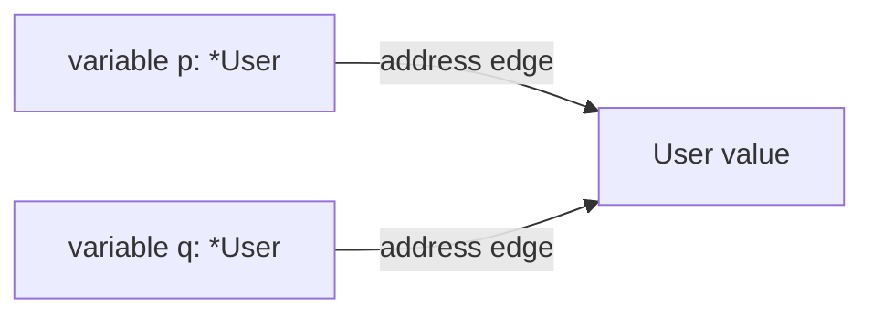
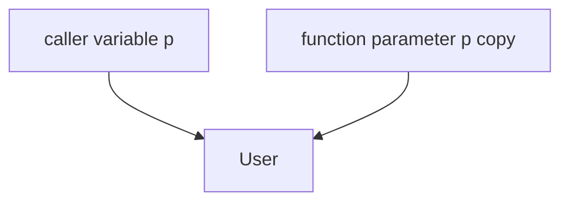
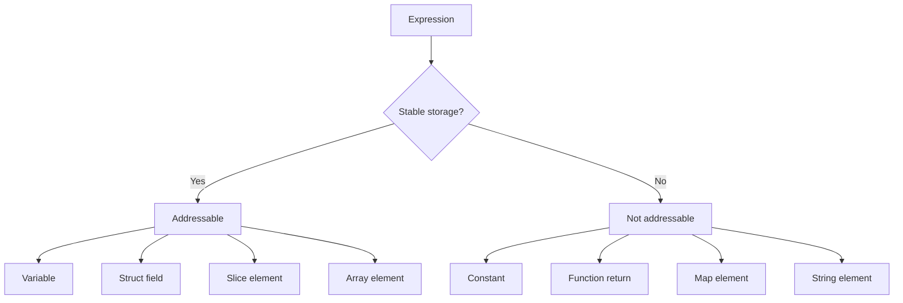
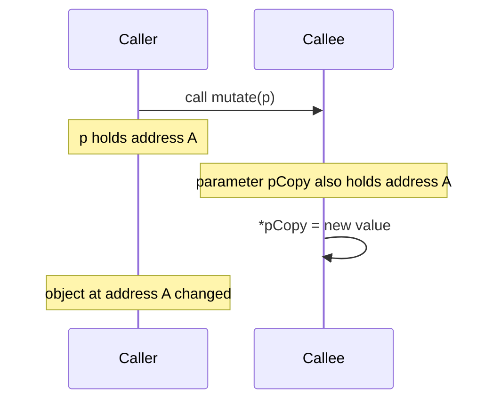
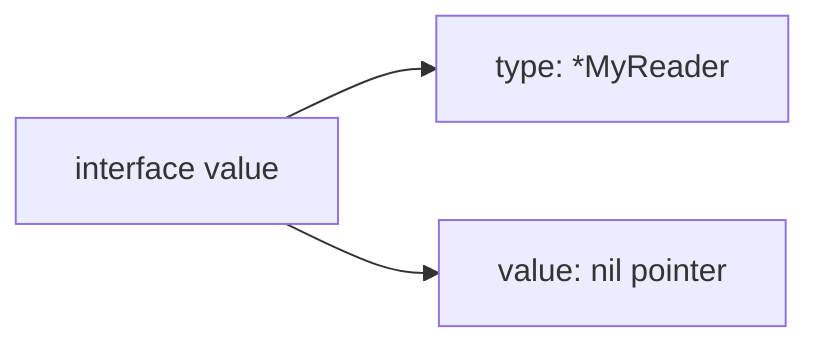
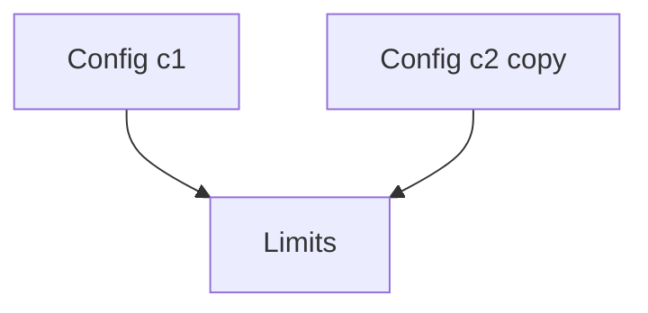
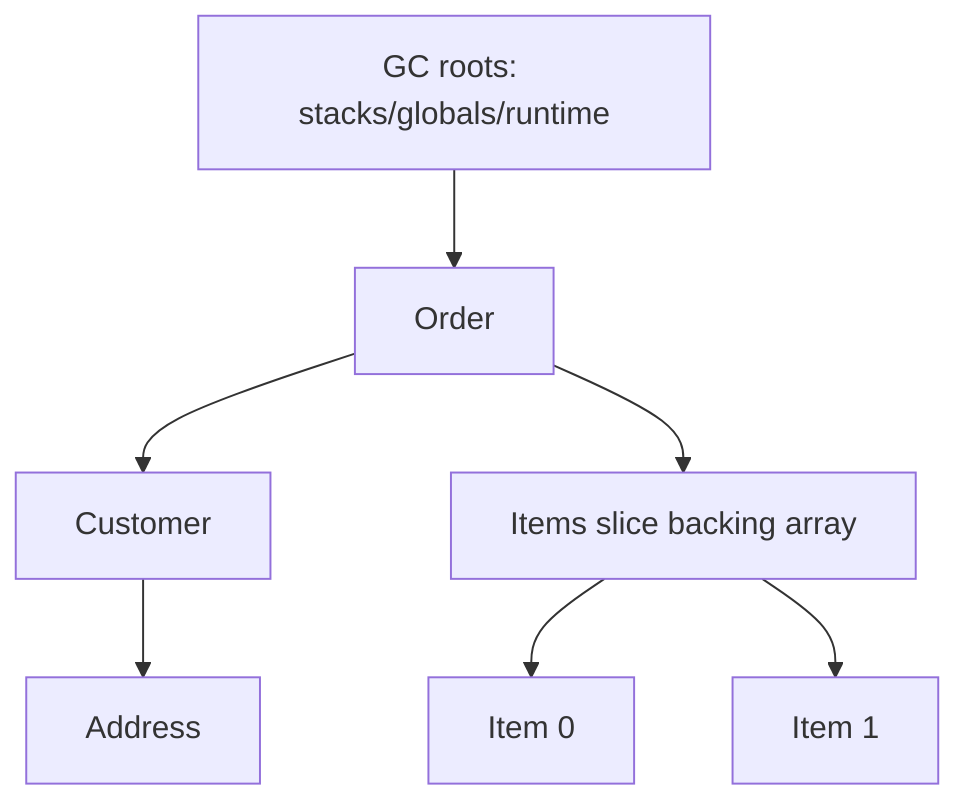

# learn-go-memory-systems-part-003.md

# Go Memory Systems — Part 003: Pointer Fundamentals

> Seri: `learn-go-memory-systems`  
> Part: `003`  
> Topik: **Pointer fundamentals: addressability, nil, aliasing, pass-by-value, pointer receiver**  
> Target pembaca: Java software engineer yang ingin memahami Go sampai level sistem/runtime/production engineering  
> Target versi: Go 1.26.x

---

## Status Seri

Part yang sudah dibuat:

```text
learn-go-memory-systems-part-000.md
learn-go-memory-systems-part-001.md
learn-go-memory-systems-part-002.md
learn-go-memory-systems-part-003.md  <-- bagian ini
```

Seri belum selesai. Masih ada part berikutnya.

Part berikutnya:

```text
learn-go-memory-systems-part-004.md
```

Topik berikutnya:

> Stack allocation, goroutine stack, stack growth, stack copying, frame layout.

---

## Daftar Isi

1. Tujuan Part Ini
2. Kenapa Pointer di Go Harus Dipahami Berbeda dari Java Reference
3. Mental Model Utama
4. Value, Address, Pointer, Object, dan Alias
5. Pointer Syntax: `&`, `*`, `nil`, `new`, dan `new(expr)`
6. Addressability: Tidak Semua Nilai Bisa Diambil Alamatnya
7. Pass-by-Value: Semua Argumen Dicopy, Termasuk Pointer
8. Pointer Bukan Ownership
9. Pointer Bukan Selalu Lebih Cepat
10. Nil Pointer: Zero Value, Absence, dan Failure Boundary
11. Aliasing: Sumber Banyak Bug Memory-Level di Go
12. Pointer Receiver vs Value Receiver
13. Method Set dan Interface Satisfaction
14. Pointer ke Struct Field
15. Pointer, Slice, Map, Channel, Interface: Jangan Campur Mental Model
16. Pointer dan Escape Analysis
17. Pointer dan Garbage Collector
18. Pointer dan Concurrency
19. Pointer dan API Design
20. Optional Value Pattern
21. Mutability Boundary Pattern
22. Copy Boundary Pattern
23. Ownership Contract Pattern
24. Anti-Pattern Umum
25. Production Review Checklist
26. Mini Lab
27. Ringkasan
28. Referensi

---

## 1. Tujuan Part Ini

Part ini membangun fondasi pointer Go yang benar.

Banyak developer Java masuk ke Go dengan membawa mental model seperti ini:

> “Object di Java direferensikan lewat reference. Berarti pointer di Go kira-kira sama dengan reference Java.”

Model itu **tidak cukup** dan sering menyesatkan.

Pointer Go memang menyimpan alamat sebuah value, tetapi konsekuensinya berbeda dari Java reference karena Go punya:

- value semantics yang lebih eksplisit,
- stack allocation yang signifikan,
- compiler escape analysis,
- non-moving garbage collector pada standard toolchain,
- pointer receiver dan value receiver,
- slice/string/map/interface yang masing-masing punya representasi berbeda,
- `unsafe.Pointer` yang bisa melewati sebagian safety boundary,
- data race model yang eksplisit.

Tujuan part ini bukan membuat Anda “bisa memakai pointer”. Itu terlalu dangkal.

Tujuan sebenarnya adalah membuat Anda mampu menjawab pertanyaan seperti:

- Ketika saya menulis `&x`, apa yang benar-benar saya ekspresikan?
- Apakah pointer ini menyebabkan `x` escape ke heap?
- Apakah pointer ini membuat object lebih lama hidup?
- Apakah pointer receiver ini dibutuhkan atau hanya kebiasaan?
- Apakah API ini memberi caller hak mutasi?
- Apakah pointer ini menciptakan aliasing yang sulit dikontrol?
- Apakah `nil` di sini merepresentasikan optional value, invalid state, atau bug?
- Apakah penggunaan pointer ini membantu performance atau justru menambah GC work?
- Apakah pointer ini aman dipakai lintas goroutine?

Dalam sistem produksi, pointer adalah alat untuk membuat hubungan antar value. Masalahnya, hubungan itu bisa menjadi:

- mutability relationship,
- lifetime relationship,
- retention relationship,
- concurrency relationship,
- API contract relationship,
- GC graph relationship.

Top engineer tidak hanya melihat `*T` sebagai “hemat copy”. Top engineer membaca pointer sebagai **edge dalam graph runtime**.

---

## 2. Kenapa Pointer di Go Harus Dipahami Berbeda dari Java Reference

Di Java, sebagian besar object biasa dibuat di heap dan variabel object menyimpan reference.

Contoh Java:

```java
User a = new User("alice");
User b = a;
b.name = "bob";
```

`a` dan `b` mengarah ke object yang sama.

Di Go, assignment default adalah copy value.

```go
type User struct {
    Name string
}

func main() {
    a := User{Name: "alice"}
    b := a
    b.Name = "bob"

    fmt.Println(a.Name) // alice
    fmt.Println(b.Name) // bob
}
```

Di sini `b := a` menyalin struct value.

Jika ingin aliasing eksplisit:

```go
a := User{Name: "alice"}
b := &a
b.Name = "bob"

fmt.Println(a.Name) // bob
```

Perbedaan mental model:

| Aspek | Java | Go |
|---|---|---|
| Object variable umum | reference ke object | value langsung atau value berisi pointer |
| Assignment object biasa | copy reference | copy value |
| Mutasi lewat variable lain | default umum | harus ada aliasing eksplisit atau backing store bersama |
| Local object | biasanya heap, JIT bisa optimize | bisa stack atau heap, tergantung escape analysis |
| Pointer langsung | tidak tersedia untuk aplikasi biasa | tersedia sebagai `*T` |
| Address operator | tidak ada | `&x` |
| Dereference eksplisit | tidak ada untuk reference biasa | `*p`, meski field access auto-deref |
| Null | `null` | `nil` untuk pointer/slice/map/chan/func/interface tertentu |

Go memberi Anda kontrol sintaksis lebih jelas atas aliasing. Tetapi kontrol itu berarti Anda harus disiplin.

---

## 3. Mental Model Utama

Pointer di Go sebaiknya dibaca sebagai:

> “Sebuah value kecil yang menyimpan alamat value lain dan menciptakan alias/lifetime edge ke value tersebut.”

Diagram sederhana:



Jika dua pointer menunjuk value yang sama, mutasi lewat salah satu pointer terlihat lewat pointer lain.

```go
u := User{Name: "alice"}
p := &u
q := &u

p.Name = "bob"
fmt.Println(q.Name) // bob
```

Pointer bukan object itu sendiri.

Pointer adalah value.

Karena pointer adalah value, pointer juga dicopy.

```go
func rename(p *User) {
    // p adalah copy dari pointer milik caller.
    // Tetapi copy itu menunjuk User yang sama.
    p.Name = "bob"
}
```

Diagram function call:



Parameter pointer dicopy, tetapi alamat yang dicopy tetap sama.

Itulah alasan function bisa memutasi object caller walaupun Go selalu pass-by-value.

---

## 4. Value, Address, Pointer, Object, dan Alias

Kita perlu menyamakan istilah.

### 4.1 Value

Value adalah representasi data dari suatu type.

```go
x := 10
u := User{Name: "alice"}
```

`10` adalah value `int`.  
`User{Name: "alice"}` adalah value `User`.

### 4.2 Variable

Variable adalah storage location bernama yang menyimpan value.

```go
var x int
```

`x` adalah variable. Ia menyimpan value `int`.

### 4.3 Address

Address adalah lokasi memory dari suatu storage.

```go
p := &x
```

`&x` menghasilkan alamat `x`.

### 4.4 Pointer

Pointer adalah value yang menyimpan address.

```go
var p *int = &x
```

`p` adalah variable bertipe `*int`. Value yang disimpan oleh `p` adalah address dari `x`.

### 4.5 Object

Dalam pembahasan runtime, object sering berarti unit alokasi yang dilacak runtime/GC.

```go
p := new(User)
```

`new(User)` mengalokasikan zero value `User` dan mengembalikan `*User`.

Namun dalam diskusi source code, orang sering longgar memakai “object” untuk struct instance.

Dalam seri ini:

- **value** = data berdasarkan type,
- **variable/storage** = lokasi yang menyimpan value,
- **pointer** = value berisi address,
- **heap object** = unit alokasi heap yang dilacak runtime,
- **alias** = dua atau lebih access path menuju storage yang sama.

### 4.6 Alias

Alias terjadi saat dua nama/path bisa mengakses storage sama.

```go
u := User{Name: "alice"}
p := &u

u.Name = "bob"
fmt.Println(p.Name) // bob
```

`u` dan `p.Name` adalah access path ke storage yang sama.

Aliasing juga bisa terjadi tanpa pointer eksplisit lewat slice/map/channel/function/interface.

```go
a := []int{1, 2, 3}
b := a
b[0] = 99
fmt.Println(a[0]) // 99
```

`a` dan `b` adalah slice header berbeda, tetapi backing array sama.

---

## 5. Pointer Syntax: `&`, `*`, `nil`, `new`, dan `new(expr)`

### 5.1 Address Operator `&`

```go
x := 42
p := &x
```

`&x` menghasilkan pointer ke `x`.

Type:

```go
x := 42        // int
p := &x        // *int
```

### 5.2 Dereference Operator `*`

```go
fmt.Println(*p) // 42
*p = 100
fmt.Println(x)  // 100
```

`*p` berarti value yang ditunjuk oleh pointer `p`.

### 5.3 Nil Pointer

```go
var p *int
fmt.Println(p == nil) // true
```

Zero value pointer adalah `nil`.

Dereference nil pointer panic:

```go
var p *int
fmt.Println(*p) // panic
```

### 5.4 `new(T)`

```go
p := new(int)
fmt.Println(*p) // 0
*p = 10
```

`new(T)` menghasilkan `*T` yang menunjuk zero value `T`.

Ini bukan seperti Java `new` yang memanggil constructor. Go tidak punya constructor built-in. Constructor biasanya function biasa:

```go
func NewUser(name string) *User {
    return &User{Name: name}
}
```

### 5.5 Composite Literal Address

```go
p := &User{Name: "alice"}
```

Ini idiomatik.

### 5.6 Go 1.26: `new(expr)`

Go 1.26 memperkenalkan bentuk `new(expr)` sehingga pointer ke hasil ekspresi bisa dibuat lebih langsung.

Contoh konseptual:

```go
p := new(42) // *int, menunjuk int bernilai 42
```

Ini mengurangi kebutuhan helper kecil seperti:

```go
func Ptr[T any](v T) *T { return &v }
```

Namun dari sisi mental model, `new(expr)` tetap berarti:

- ada value,
- value itu punya storage,
- hasilnya pointer ke storage tersebut,
- compiler menentukan apakah storage berada di stack atau heap berdasarkan escape analysis.

Jangan membaca `new(expr)` sebagai “pasti heap allocation”. Dalam Go, keputusan stack vs heap bukan ditentukan semata oleh sintaks `new`, melainkan oleh analisis compiler.

---

## 6. Addressability: Tidak Semua Nilai Bisa Diambil Alamatnya

Tidak semua ekspresi di Go addressable.

Addressable berarti ekspresi tersebut menunjuk storage location yang stabil sehingga bisa diambil alamatnya.

Contoh addressable:

```go
x := 10
p := &x
```

Variable local addressable.

```go
type User struct { Name string }
u := User{Name: "alice"}
p := &u.Name
```

Field dari struct variable addressable.

```go
s := []int{1, 2, 3}
p := &s[0]
```

Element slice addressable.

Contoh tidak addressable:

```go
p := &10 // invalid
```

Literal angka bukan storage variable.

```go
func value() int { return 10 }
p := &value() // invalid
```

Return value function tidak addressable.

```go
m := map[string]int{"a": 1}
p := &m["a"] // invalid
```

Map element tidak addressable.

Kenapa map element tidak addressable?

Karena map runtime bisa memindahkan bucket saat growth/rehash. Jika pointer ke element map diizinkan, pointer itu bisa menjadi invalid ketika map berubah. Maka Go melarang `&m[k]`.

Pola benar:

```go
v := m["a"]
p := &v // pointer ke copy, bukan ke map element
```

Tetapi ini tidak memutasi map.

Jika butuh mutasi object di map, simpan pointer sebagai value:

```go
type Counter struct {
    N int
}

m := map[string]*Counter{
    "a": {N: 1},
}

m["a"].N++
```

Atau update by value:

```go
v := m["a"]
v++
m["a"] = v
```

### 6.1 Addressability Table

| Ekspresi | Addressable? | Catatan |
|---|---:|---|
| local variable | ya | `&x` valid |
| pointer dereference | ya | `&(*p)` valid jika p valid |
| struct field of addressable struct | ya | `&u.Name` |
| array element of addressable array | ya | `&arr[0]` |
| slice element | ya | `&s[0]` jika len cukup |
| map element | tidak | map bucket bisa berubah |
| function return | tidak | temporary |
| constant/literal scalar | tidak | tidak punya storage variable |
| composite literal | special case | `&T{...}` valid |
| string byte element | tidak | string immutable |

### 6.2 Diagram Addressability



Addressability bukan sekadar aturan sintaks. Ini adalah proteksi terhadap pointer yang tidak stabil.

---

## 7. Pass-by-Value: Semua Argumen Dicopy, Termasuk Pointer

Go selalu pass-by-value.

```go
func inc(x int) {
    x++
}

func main() {
    n := 1
    inc(n)
    fmt.Println(n) // 1
}
```

Parameter `x` adalah copy dari `n`.

Untuk mutasi caller:

```go
func inc(p *int) {
    *p++
}

func main() {
    n := 1
    inc(&n)
    fmt.Println(n) // 2
}
```

Tetapi pointer itu sendiri tetap dicopy.

```go
func reassign(p *int) {
    other := 99
    p = &other // hanya mengganti copy parameter p
}

func main() {
    n := 1
    p := &n
    reassign(p)
    fmt.Println(*p) // 1
}
```

Jika ingin function mengganti pointer milik caller, gunakan pointer ke pointer atau return pointer baru.

Pointer ke pointer:

```go
func reassign(pp **int) {
    other := 99
    *pp = &other
}
```

Lebih idiomatik biasanya return:

```go
func replaced() *int {
    v := 99
    return &v
}

p = replaced()
```

### 7.1 Diagram Pass-by-Value Pointer



### 7.2 Consequence

Saat Anda melihat function:

```go
func Update(u *User)
```

Artinya:

- function menerima copy pointer,
- function bisa membaca/memutasi `User` yang ditunjuk,
- function tidak bisa mengganti variable pointer caller kecuali lewat return atau `**User`,
- `nil` mungkin diterima kecuali dikontrak tidak boleh,
- caller dan callee berbagi alias ke storage yang sama.

---

## 8. Pointer Bukan Ownership

Di bahasa seperti Rust, reference/borrow membawa kontrak ownership/lifetime yang dicek compiler.

Di Go, pointer tidak membawa ownership formal.

```go
func Process(buf *[]byte) {
    // Apakah function memiliki buffer ini?
    // Boleh mutate?
    // Boleh simpan untuk nanti?
    // Boleh dipakai setelah return?
}
```

Type `*[]byte` sendiri tidak menjawab.

Anda harus membuat kontrak eksplisit melalui:

- nama function,
- dokumentasi,
- API shape,
- copy boundary,
- lifecycle method,
- tests,
- code review convention.

Contoh buruk:

```go
func RegisterConfig(c *Config) {
    globalConfig = c
}
```

Apakah caller masih boleh mutate `c` setelah register?

```go
cfg := &Config{Timeout: time.Second}
RegisterConfig(cfg)
cfg.Timeout = 0 // apakah ini valid?
```

Jika global config seharusnya immutable, lebih baik copy:

```go
func RegisterConfig(c Config) {
    globalConfig = c
}
```

Atau defensive copy:

```go
func RegisterConfig(c *Config) error {
    if c == nil {
        return errors.New("nil config")
    }
    copied := *c
    globalConfig = copied
    return nil
}
```

Pointer hanya mengatakan “bisa mengarah ke storage yang sama”. Ia tidak mengatakan siapa yang memiliki storage itu.

---

## 9. Pointer Bukan Selalu Lebih Cepat

Premis umum yang sering salah:

> “Pakai pointer supaya tidak copy, berarti lebih cepat.”

Kadang benar. Sering tidak.

Pointer bisa mengurangi copy untuk struct besar. Tetapi pointer juga bisa menambah biaya:

- indirection,
- pointer chasing,
- cache miss,
- GC scanning,
- heap allocation akibat escape,
- aliasing yang menghalangi optimasi,
- complexity dan synchronization cost.

Contoh struct kecil:

```go
type Point struct {
    X, Y int64
}

func Move(p Point, dx, dy int64) Point {
    p.X += dx
    p.Y += dy
    return p
}
```

Ini sering lebih baik daripada:

```go
func Move(p *Point, dx, dy int64) {
    p.X += dx
    p.Y += dy
}
```

Kenapa?

- `Point` hanya 16 byte.
- Copy murah.
- Tidak ada nil handling.
- Tidak ada shared mutation.
- Lebih mudah reasoning.
- Bisa tetap di register/stack.

Contoh struct besar:

```go
type Big struct {
    Data [4096]byte
}

func Process(b *Big) { ... }
```

Pointer mungkin tepat jika copy 4 KiB berulang tidak diinginkan.

Namun jika `Big` berisi banyak pointer, menyimpan `*Big` lebih lama bisa memperpanjang lifetime semua object yang direferensikan.

### 9.1 Decision Table

| Kondisi | Cenderung value | Cenderung pointer |
|---|---:|---:|
| Struct kecil immutable | ya | tidak perlu |
| Struct besar | tergantung | sering |
| Perlu mutate caller | tidak | ya |
| Optional/nullable | tidak | bisa |
| Menghindari copy besar | tidak | bisa |
| Hot path pointer-free | ya | hati-hati |
| Object punya identity | tidak | ya |
| Object punya lifecycle `Close` | tidak | ya |
| Object mengandung mutex | pointer receiver | ya, jangan copy setelah dipakai |
| API immutable config | value/copy | pointer hanya input lalu copy |

### 9.2 Golden Rule

Gunakan pointer karena kontrak semantiknya benar, bukan karena asumsi performance.

Lalu ukur performance dengan benchmark dan profile.

---

## 10. Nil Pointer: Zero Value, Absence, dan Failure Boundary

Pointer zero value adalah `nil`.

```go
var u *User
fmt.Println(u == nil) // true
```

`nil` bisa berarti beberapa hal:

1. value tidak ada,
2. belum diinisialisasi,
3. optional field absent,
4. lazy initialization belum terjadi,
5. invalid state,
6. bug.

Masalah muncul jika satu API tidak jelas membedakan makna-makna ini.

### 10.1 Optional Value

```go
type UserPatch struct {
    DisplayName *string
}
```

Dalam patch request:

- `nil` berarti field tidak dikirim,
- non-nil pointer ke empty string berarti field dikirim sebagai empty.

```go
name := ""
patch := UserPatch{DisplayName: &name}
```

Ini valid jika domain membedakan absent vs empty.

Go 1.26 `new(expr)` membuat pattern pointer literal lebih mudah:

```go
patch := UserPatch{DisplayName: new("")}
```

Namun gunakan dengan hati-hati: optional pointer bisa memperbanyak allocation dan nil handling.

### 10.2 Invalid State

```go
type Service struct {
    repo *Repository
}

func (s *Service) Handle() error {
    return s.repo.Save() // panic jika repo nil
}
```

Jika `repo` wajib ada, jangan biarkan `Service` dibuat dalam state invalid.

Gunakan constructor:

```go
func NewService(repo *Repository) (*Service, error) {
    if repo == nil {
        return nil, errors.New("nil repository")
    }
    return &Service{repo: repo}, nil
}
```

Atau jika repository interface:

```go
type Service struct {
    repo Repository
}
```

Tetap perlu validasi nil interface dengan benar.

### 10.3 Nil Receiver

Go memungkinkan method dipanggil pada nil pointer receiver, selama method tidak dereference tanpa check.

```go
type Node struct {
    Value int
    Next  *Node
}

func (n *Node) Len() int {
    if n == nil {
        return 0
    }
    return 1 + n.Next.Len()
}
```

Ini bisa idiomatik untuk struktur rekursif.

Namun untuk service object, nil receiver biasanya bug.

```go
func (s *Service) Start() error {
    if s == nil {
        return errors.New("nil service") // boleh, tapi sering menutupi bug konstruksi
    }
    ...
}
```

### 10.4 Nil Pointer vs Nil Interface Trap

```go
type Reader interface {
    Read([]byte) (int, error)
}

type MyReader struct{}

func (*MyReader) Read(p []byte) (int, error) { return 0, io.EOF }

var r *MyReader = nil
var i Reader = r

fmt.Println(r == nil) // true
fmt.Println(i == nil) // false
```

Interface `i` tidak nil karena menyimpan dynamic type `*MyReader` walaupun dynamic value nil.

Diagram:



Interface nil hanya jika type word dan value word sama-sama nil.

---

## 11. Aliasing: Sumber Banyak Bug Memory-Level di Go

Aliasing adalah situasi ketika dua atau lebih path mengakses storage yang sama.

Pointer explicit:

```go
u := User{Name: "alice"}
p := &u
q := &u
p.Name = "bob"
fmt.Println(q.Name) // bob
```

Slice implicit:

```go
base := []int{1, 2, 3, 4}
a := base[:2]
b := base[1:3]

b[0] = 99
fmt.Println(a) // [1 99]
```

Struct field pointer:

```go
type Config struct {
    Limits *Limits
}

c1 := Config{Limits: &Limits{Max: 10}}
c2 := c1
c2.Limits.Max = 20
fmt.Println(c1.Limits.Max) // 20
```

Copy struct tidak deep copy pointer fields.

### 11.1 Aliasing Graph



### 11.2 Aliasing Hazards

Aliasing menyebabkan:

- unexpected mutation,
- data race,
- retained memory,
- stale view,
- invalid ownership boundary,
- hard-to-test side effects.

### 11.3 Aliasing Control Techniques

1. Copy by value for small immutable data.
2. Defensive copy at API boundary.
3. Full slice expression to limit append aliasing.
4. Do not store caller-provided mutable buffer unless documented.
5. Return read-only semantic value when possible.
6. Use unexported fields and methods for controlled mutation.
7. Avoid sharing pointer to internal state.

Example defensive copy:

```go
type Message struct {
    payload []byte
}

func NewMessage(payload []byte) Message {
    cp := append([]byte(nil), payload...)
    return Message{payload: cp}
}

func (m Message) Payload() []byte {
    return append([]byte(nil), m.payload...)
}
```

This prevents caller from mutating internal buffer.

But it costs copies. For hot path, you may expose ownership transfer:

```go
// NewMessageFromOwnedBytes takes ownership of payload.
// Caller must not mutate payload after passing it.
func NewMessageFromOwnedBytes(payload []byte) Message {
    return Message{payload: payload}
}
```

The contract must be explicit.

---

## 12. Pointer Receiver vs Value Receiver

Go methods can have value receiver or pointer receiver.

```go
type Counter struct {
    N int
}

func (c Counter) Value() int {
    return c.N
}

func (c *Counter) Inc() {
    c.N++
}
```

Value receiver receives copy.

Pointer receiver receives copy of pointer to original.

### 12.1 Value Receiver

```go
func (c Counter) Value() int {
    return c.N
}
```

Use value receiver when:

- type is small,
- method does not mutate receiver,
- value semantics are desired,
- receiver is immutable-like,
- copying is safe,
- type does not contain mutex or other no-copy state.

Example:

```go
type Point struct {
    X, Y int
}

func (p Point) Add(q Point) Point {
    return Point{X: p.X + q.X, Y: p.Y + q.Y}
}
```

### 12.2 Pointer Receiver

```go
func (c *Counter) Inc() {
    c.N++
}
```

Use pointer receiver when:

- method mutates receiver,
- receiver is large and copy should be avoided,
- receiver contains synchronization primitive,
- receiver represents identity/lifecycle,
- methods must satisfy interface with pointer receiver,
- nil receiver has intentional semantics.

Example service:

```go
type Server struct {
    ln net.Listener
}

func (s *Server) Close() error {
    return s.ln.Close()
}
```

### 12.3 Do Not Mix Randomly

If some methods require pointer receiver, often all methods should use pointer receiver for consistency, especially on mutable types.

```go
type Buffer struct {
    data []byte
}

func (b *Buffer) Write(p []byte) { ... }
func (b *Buffer) Len() int       { ... } // pointer receiver for consistency
```

But for immutable small value types, value receiver is better.

### 12.4 Receiver Copy Hazard with Mutex

```go
type SafeCounter struct {
    mu sync.Mutex
    n  int
}

func (c SafeCounter) Inc() { // BUG: copies mutex
    c.mu.Lock()
    defer c.mu.Unlock()
    c.n++
}
```

Correct:

```go
func (c *SafeCounter) Inc() {
    c.mu.Lock()
    defer c.mu.Unlock()
    c.n++
}
```

Types containing `sync.Mutex`, `sync.RWMutex`, `sync.WaitGroup`, `sync.Cond`, or similar no-copy state should not be copied after use.

---

## 13. Method Set dan Interface Satisfaction

Pointer receiver affects method set.

```go
type Flusher interface {
    Flush() error
}

type Buffer struct{}

func (b *Buffer) Flush() error { return nil }
```

`*Buffer` implements `Flusher`. `Buffer` does not.

```go
var b Buffer
var f Flusher

f = &b // OK
f = b  // compile error
```

Why?

Method with pointer receiver belongs to method set of `*Buffer`, not `Buffer` for interface satisfaction.

But method call syntax has auto-addressing in some cases:

```go
b.Flush() // OK if b addressable; compiler rewrites to (&b).Flush()
```

This convenience can hide interface mismatch.

### 13.1 Method Call vs Interface Assignment

```go
type T struct{}
func (t *T) M() {}

var x T
x.M() // OK, x addressable

var i interface{ M() }
i = x  // not OK
i = &x // OK
```

### 13.2 API Consequence

When designing interfaces, be aware:

```go
type Validator interface {
    Validate() error
}
```

If your concrete type uses pointer receiver:

```go
func (u *User) Validate() error { ... }
```

Then only `*User` satisfies `Validator`.

This is usually fine if validation may need nil handling or avoids copy. But if `User` is small and immutable, value receiver can be more flexible:

```go
func (u User) Validate() error { ... }
```

Then both `User` and `*User` satisfy the interface.

---

## 14. Pointer ke Struct Field

You can take pointer to struct field if struct is addressable.

```go
type User struct {
    Name string
}

u := User{Name: "alice"}
p := &u.Name
*p = "bob"
fmt.Println(u.Name) // bob
```

This creates alias to a sub-object/field.

### 14.1 Field Pointer Extends Reachability

```go
type Big struct {
    Header [1024]byte
    Name   string
    Data   []byte
}

func namePtr(b *Big) *string {
    return &b.Name
}
```

If caller keeps `*string`, the storage containing the field must remain valid. In practice, this can keep the larger containing object alive depending on compiler/runtime representation.

Better API often returns value:

```go
func name(b *Big) string {
    return b.Name
}
```

Returning pointer to internal field exposes mutation and lifetime coupling.

### 14.2 Field Pointer Breaks Encapsulation

```go
func (c *Config) TimeoutPtr() *time.Duration {
    return &c.timeout
}
```

Now caller can mutate internal config without validation.

Prefer:

```go
func (c *Config) Timeout() time.Duration {
    return c.timeout
}

func (c *Config) SetTimeout(v time.Duration) error {
    if v <= 0 {
        return errors.New("timeout must be positive")
    }
    c.timeout = v
    return nil
}
```

---

## 15. Pointer, Slice, Map, Channel, Interface: Jangan Campur Mental Model

Pointer is one way to share storage. But Go has several descriptor-like values.

### 15.1 Slice

```go
s2 := s1
```

Copies slice header, shares backing array.

No `*[]T` needed for element mutation.

```go
func Fill(s []byte) {
    for i := range s {
        s[i] = 0
    }
}
```

Caller sees element mutation.

But changing slice header itself is not visible:

```go
func AppendWrong(s []int) {
    s = append(s, 1)
}
```

Caller does not see new header.

Return it:

```go
func Append(s []int) []int {
    return append(s, 1)
}
```

Use `*[]T` rarely, usually when a method needs to mutate the slice header in place and return would be awkward.

### 15.2 Map

Map value is a descriptor to runtime map structure.

```go
func Put(m map[string]int) {
    m["a"] = 1
}
```

Caller sees mutation.

No `*map[K]V` needed for normal mutation.

Use `*map` rarely.

### 15.3 Channel

Channel value is descriptor/reference-like.

```go
func Send(ch chan<- int) {
    ch <- 1
}
```

No pointer to channel needed for send/receive.

### 15.4 Interface

Interface value can hold pointer or non-pointer dynamic value.

```go
var x any = User{Name: "alice"}
var y any = &User{Name: "bob"}
```

Mutation requires dynamic value to be mutable/reachable.

### 15.5 Table

| Type | Assignment copies | Shares underlying state? | Usually need pointer to mutate contents? |
|---|---:|---:|---:|
| `int` | value | no | yes, if caller mutation needed |
| `struct` | value | only pointer fields share | yes, if caller mutation needed |
| `array` | full array | no | yes, for large/caller mutation |
| `slice` | header | backing array | no for elements, yes/return for header |
| `map` | descriptor | map data | no |
| `chan` | descriptor | channel data | no |
| `string` | header | immutable bytes | not mutable |
| `interface` | type+data | depends dynamic value | depends |

---

## 16. Pointer dan Escape Analysis

A common misconception:

> “If I use pointer, it goes to heap.”

Not necessarily.

```go
func f() int {
    x := 10
    p := &x
    return *p
}
```

Compiler can keep `x` on stack because pointer does not escape.

But:

```go
func g() *int {
    x := 10
    return &x
}
```

`x` must outlive function call, so compiler can allocate it on heap.

This is safe in Go.

Unlike C, returning address of local variable is not inherently invalid in Go because compiler adjusts allocation.

### 16.1 Escape Causes

Pointer may escape when:

- returned from function,
- stored in heap object,
- captured by closure that outlives frame,
- passed to goroutine,
- stored in interface in a way compiler cannot prove local,
- passed to unknown function,
- used with reflection,
- object size/lifetime cannot be proven safe for stack.

Example goroutine capture:

```go
func start() {
    x := 10
    go func() {
        fmt.Println(x)
    }()
}
```

`x` must remain alive after `start` returns, so it may escape.

Example storing pointer:

```go
var global *int

func store() {
    x := 10
    global = &x
}
```

`x` escapes.

### 16.2 Inspecting Escape

Use:

```bash
go build -gcflags=-m ./...
```

More verbose:

```bash
go build -gcflags='-m=3' ./...
```

Look for messages like:

```text
moved to heap: x
x escapes to heap
```

Do not blindly fight every escape.

Some heap allocation is correct.

Focus on hot paths, allocation rate, and retained memory.

### 16.3 Pointer API and Escape

Function returning pointer often forces caller-visible lifetime:

```go
func NewBuffer() *Buffer {
    return &Buffer{}
}
```

This may be fine for long-lived object.

But for small temporary value:

```go
func NewPoint(x, y int) *Point {
    return &Point{x, y}
}
```

Maybe value return is better:

```go
func NewPoint(x, y int) Point {
    return Point{x, y}
}
```

---

## 17. Pointer dan Garbage Collector

The GC traces reachable objects through pointers.

More pointers can mean more graph edges to scan.

Pointer-heavy design can increase GC work even if total bytes are not huge.

### 17.1 Pointer-Free vs Pointer-Rich

Pointer-free:

```go
type Row struct {
    A int64
    B int64
    C int64
}
```

Pointer-rich:

```go
type Row struct {
    A *int64
    B *int64
    C *int64
}
```

Pointer-rich design has:

- more allocations,
- more indirections,
- more GC edges,
- worse locality,
- more nil states.

### 17.2 Object Graph



If `Order` remains reachable, all pointed objects remain live.

### 17.3 Retention Through Pointer

```go
type CacheEntry struct {
    User *User
}
```

Keeping `CacheEntry` retains entire `User` object graph.

Maybe cache only needs ID:

```go
type CacheEntry struct {
    UserID string
}
```

Pointer decisions are retention decisions.

---

## 18. Pointer dan Concurrency

Pointer sharing across goroutines creates shared memory.

Shared memory requires synchronization.

```go
var n int

func main() {
    p := &n

    go func() { *p++ }()
    go func() { *p++ }()
}
```

This is data race.

Pointer itself is not unsafe. Unsynchronized shared mutation is unsafe.

### 18.1 Data Race Model

A data race occurs when two goroutines access the same memory location concurrently, at least one access is write, and there is no synchronization ordering between them.

Pointer makes “same memory location” easier to accidentally share.

### 18.2 Safe Patterns

Mutex:

```go
type Counter struct {
    mu sync.Mutex
    n  int
}

func (c *Counter) Inc() {
    c.mu.Lock()
    defer c.mu.Unlock()
    c.n++
}
```

Channel ownership transfer:

```go
type Job struct {
    Buf []byte
}

jobs <- job // after send, sender should not mutate if ownership transferred
```

Atomic for specific primitive state:

```go
type Counter struct {
    n atomic.Int64
}

func (c *Counter) Inc() {
    c.n.Add(1)
}
```

Immutable sharing:

```go
cfg := Config{Timeout: time.Second}
go worker(cfg) // copy immutable value
```

### 18.3 Pointer Receiver Does Not Mean Thread-Safe

```go
func (c *Counter) Inc() { c.n++ }
```

This mutates receiver but is not thread-safe.

Thread-safety is not encoded by `*T`.

Document it or enforce it internally.

---

## 19. Pointer dan API Design

Pointer in an API communicates one or more of these:

1. method may mutate receiver/input,
2. input may be nil,
3. copying is expensive,
4. object has identity/lifecycle,
5. function may retain reference,
6. input/output represents optional value.

If none of those are true, prefer value.

### 19.1 Input Config

Bad if config should not mutate:

```go
func NewClient(cfg *Config) *Client
```

Better:

```go
func NewClient(cfg Config) (*Client, error) {
    cfg = cfg.withDefaults()
    return &Client{cfg: cfg}, nil
}
```

Caller can reuse/mutate original config without affecting client.

### 19.2 Large Mutable Object

```go
func Decode(dst *Message, r io.Reader) error
```

Pointer is appropriate because decoder fills caller-provided object.

### 19.3 Optional Field

```go
type Query struct {
    Limit *int
}
```

Good if absent vs zero matters.

Alternative:

```go
type OptionalInt struct {
    Value int
    Set   bool
}
```

This avoids pointer allocation and can be clearer in hot data structures.

### 19.4 Retention Contract

Dangerous:

```go
func (s *Store) Put(key string, value []byte) {
    s.data[key] = value
}
```

Does Store copy value or retain caller buffer?

Better options:

```go
func (s *Store) PutCopy(key string, value []byte) {
    s.data[key] = append([]byte(nil), value...)
}

func (s *Store) PutOwned(key string, value []byte) {
    s.data[key] = value
}
```

Names reveal memory contract.

---

## 20. Optional Value Pattern

Go does not have built-in `Optional<T>`.

Common options:

### 20.1 Pointer Optional

```go
type Patch struct {
    Age *int
}
```

Pros:

- simple,
- common with JSON/DB/domain patch,
- nil means absent.

Cons:

- nil handling,
- possible allocation,
- pointer scanning,
- can be overused.

### 20.2 Value + Bool

```go
type OptionalInt struct {
    Value int
    Ok    bool
}
```

Pros:

- no pointer,
- clear presence bit,
- cache-friendly for arrays,
- good for hot path.

Cons:

- more boilerplate,
- less idiomatic for simple API payloads.

### 20.3 Sentinel Value

```go
const Unlimited = -1
```

Pros:

- compact.

Cons:

- can collide with domain,
- weaker type safety,
- often unclear.

### 20.4 Interface Optional

```go
var x any = nil
```

Usually avoid for optional primitives due to nil-interface trap and allocation/interface overhead.

### 20.5 Decision

| Use Case | Good Choice |
|---|---|
| JSON PATCH absent vs zero | pointer field or custom optional |
| Hot numeric arrays | value + bool/bitset |
| Config with defaults | value + explicit defaulting |
| DB nullable field | `sql.NullX`-style value + valid bit |
| Internal hot path | avoid pointer optional unless measured |

---

## 21. Mutability Boundary Pattern

A pointer often crosses a mutability boundary.

### 21.1 Mutable Internal State

```go
type Counter struct {
    n int
}

func (c *Counter) Inc() {
    c.n++
}
```

Caller expects mutation.

### 21.2 Immutable Public View

```go
type Config struct {
    timeout time.Duration
}

func (c Config) Timeout() time.Duration {
    return c.timeout
}
```

No pointer needed.

### 21.3 Controlled Mutation

```go
func (c *Config) SetTimeout(v time.Duration) error {
    if v <= 0 {
        return errors.New("invalid timeout")
    }
    c.timeout = v
    return nil
}
```

Pointer receiver is used because mutation must be validated.

### 21.4 Do Not Leak Mutability Accidentally

Bad:

```go
func (c *Config) Limits() *Limits {
    return &c.limits
}
```

Better:

```go
func (c Config) Limits() Limits {
    return c.limits
}
```

Or:

```go
func (c *Config) SetLimits(l Limits) error { ... }
```

---

## 22. Copy Boundary Pattern

A copy boundary is an explicit point where you sever aliasing.

### 22.1 Incoming Copy

```go
func NewToken(secret []byte) Token {
    cp := append([]byte(nil), secret...)
    return Token{secret: cp}
}
```

Caller mutation after construction does not affect token.

### 22.2 Outgoing Copy

```go
func (t Token) Secret() []byte {
    return append([]byte(nil), t.secret...)
}
```

Caller cannot mutate internal secret.

### 22.3 No-Copy Fast Path with Contract

```go
// NewTokenOwned takes ownership of secret.
// The caller must not read or modify secret after this call.
func NewTokenOwned(secret []byte) Token {
    return Token{secret: secret}
}
```

This is acceptable in performance-sensitive code if documented and tested.

### 22.4 Copy Boundary Diagram

```mermaid
flowchart LR
    CallerBuf[caller []byte] -->|copy| InternalBuf[internal []byte]
    CallerBuf -. no alias .- InternalBuf
```

---

## 23. Ownership Contract Pattern

Since Go pointer has no ownership semantics, APIs must encode ownership.

### 23.1 Borrow During Call

```go
// Parse reads p during the call and does not retain it.
func Parse(p []byte) (Message, error)
```

The function may inspect `p`, but after return it should not keep reference.

### 23.2 Retain Copy

```go
// Store copies value before retaining it.
func (s *Store) Store(key string, value []byte)
```

### 23.3 Take Ownership

```go
// StoreOwned retains value directly. Caller must not mutate value after call.
func (s *Store) StoreOwned(key string, value []byte)
```

### 23.4 Mutate In Place

```go
// Normalize mutates p in place.
func Normalize(p []byte) error
```

### 23.5 Fill Destination

```go
// Decode writes decoded data into dst.
func Decode(dst *Message, r io.Reader) error
```

This pattern makes pointer semantics clear.

---

## 24. Anti-Pattern Umum

### 24.1 Pointer Everywhere

```go
type User struct {
    ID    *string
    Name  *string
    Age   *int
    Admin *bool
}
```

This may be right for patch payload, but terrible for core domain if fields are required.

Problems:

- nil checks everywhere,
- many allocations,
- more GC scanning,
- poor locality,
- invalid states.

Better:

```go
type User struct {
    ID    string
    Name  string
    Age   int
    Admin bool
}
```

Use optional only where absence is meaningful.

### 24.2 Returning Pointer to Internal Field

```go
func (u *User) NamePtr() *string {
    return &u.name
}
```

This leaks mutability and lifetime.

### 24.3 Pointer to Slice/Map Without Need

```go
func Add(xs *[]int, x int) {
    *xs = append(*xs, x)
}
```

Usually prefer:

```go
func Add(xs []int, x int) []int {
    return append(xs, x)
}
```

### 24.4 Nil as Normal Control Flow Everywhere

```go
func Process(u *User) {
    if u == nil { return }
    ...
}
```

If nil means bug, fail fast.

### 24.5 Copying Types with Mutex

```go
counter2 := counter1 // dangerous after use if contains mutex
```

Use pointer and prevent copying by convention/tooling.

### 24.6 Pointer to Interface

```go
func F(x *io.Reader) { ... }
```

Usually wrong. Interface value already holds dynamic value. Use:

```go
func F(r io.Reader) { ... }
```

Pointer to interface is rare and almost always signals confusion.

### 24.7 Using Pointer Only to Avoid “Large Copy” Without Measuring

```go
func Handle(req *SmallRequest)
```

If `SmallRequest` is small and immutable, value may be simpler/faster.

---

## 25. Production Review Checklist

When reviewing pointer usage, ask:

### 25.1 Semantic Questions

- Does this pointer mean mutation?
- Does this pointer mean optional/nullable?
- Does this pointer mean identity/lifecycle?
- Does this pointer mean large object copy avoidance?
- Does this pointer mean callee may retain input?
- Is nil valid or bug?
- Is aliasing intentional?

### 25.2 Lifetime Questions

- Can this pointer outlive the function frame?
- Does it escape to heap?
- Does it retain a larger object graph?
- Is it stored globally or in cache?
- Is it captured by goroutine/closure?

### 25.3 GC Questions

- Does this add many pointer fields in hot data?
- Can a value representation be pointer-free?
- Is retention bigger than expected?
- Does heap profile show many tiny pointer-rich objects?

### 25.4 Concurrency Questions

- Is pointed data shared across goroutines?
- Is mutation synchronized?
- Is ownership transferred via channel?
- Is object immutable after publish?
- Will race detector catch likely misuse?

### 25.5 API Questions

- Should this be value instead?
- Should this return value instead of pointer?
- Should this copy input?
- Should function name encode ownership?
- Does documentation say whether input is retained/mutated?

---

## 26. Mini Lab

### Lab 1: Pointer Copy

Create file:

```go
package main

import "fmt"

func changeValue(p *int) {
    *p = 20
}

func changePointer(p *int) {
    x := 30
    p = &x
}

func main() {
    n := 10
    p := &n

    changeValue(p)
    fmt.Println(n) // ?

    changePointer(p)
    fmt.Println(n) // ?
}
```

Expected:

```text
20
20
```

Why?

- `changeValue` mutates object pointed by copied pointer.
- `changePointer` only reassigns local copy of pointer.

### Lab 2: Addressability

Try:

```go
package main

func value() int { return 10 }

func main() {
    _ = &value()
}
```

Compile and observe error.

Try map element:

```go
package main

func main() {
    m := map[string]int{"a": 1}
    _ = &m["a"]
}
```

Observe why map element is not addressable.

### Lab 3: Receiver Method Set

```go
package main

type Flusher interface {
    Flush() error
}

type Buffer struct{}

func (b *Buffer) Flush() error { return nil }

func main() {
    var b Buffer
    b.Flush()

    var f Flusher
    f = b
    _ = f
}
```

Why does method call work but interface assignment fail?

Fix:

```go
f = &b
```

### Lab 4: Escape Analysis

```go
package main

func local() int {
    x := 10
    p := &x
    return *p
}

func escaping() *int {
    x := 10
    return &x
}

func main() {
    _ = local()
    _ = escaping()
}
```

Run:

```bash
go build -gcflags=-m .
```

Observe which value escapes.

### Lab 5: Pointer vs Value Benchmark

```go
package pointerbench

import "testing"

type Small struct {
    A, B int64
}

type Large struct {
    Data [4096]byte
}

func smallValue(s Small) int64 {
    return s.A + s.B
}

func smallPointer(s *Small) int64 {
    return s.A + s.B
}

func largeValue(l Large) byte {
    return l.Data[0]
}

func largePointer(l *Large) byte {
    return l.Data[0]
}

func BenchmarkSmallValue(b *testing.B) {
    s := Small{1, 2}
    for b.Loop() {
        _ = smallValue(s)
    }
}

func BenchmarkSmallPointer(b *testing.B) {
    s := Small{1, 2}
    for b.Loop() {
        _ = smallPointer(&s)
    }
}

func BenchmarkLargeValue(b *testing.B) {
    var l Large
    for b.Loop() {
        _ = largeValue(l)
    }
}

func BenchmarkLargePointer(b *testing.B) {
    var l Large
    for b.Loop() {
        _ = largePointer(&l)
    }
}
```

Run:

```bash
go test -bench . -benchmem
```

Interpret results carefully. Compiler optimization may remove or reduce copies in artificial benchmarks. Use this to learn, not to make universal claims.

---

## 27. Ringkasan

Pointer di Go adalah value yang menyimpan address.

Yang penting bukan hanya sintaks `*T`, `&x`, dan `nil`, tetapi konsekuensi sistemnya:

- pointer creates aliasing,
- aliasing creates mutation coupling,
- mutation coupling creates race risk,
- pointer fields create GC graph edges,
- GC graph edges affect scanning and retention,
- pointer-returning APIs affect lifetime,
- pointer receiver affects method set and interface satisfaction,
- nil pointer can encode absence or bug,
- pointer does not encode ownership,
- pointer is not always faster.

Mental model paling penting:

> Pointer adalah edge dalam graph runtime. Edge itu punya konsekuensi lifetime, mutability, retention, dan synchronization.

Untuk engineer Java, lompatan besarnya adalah berhenti melihat semua non-primitive sebagai heap object reference. Di Go, Anda harus melihat apakah sesuatu adalah:

- value copy,
- descriptor copy,
- pointer alias,
- backing store sharing,
- interface boxing-like representation,
- heap object retained through graph,
- stack value that did not escape.

Part berikutnya akan masuk ke stack secara mendalam:

```text
learn-go-memory-systems-part-004.md
```

Topik:

> Stack allocation, goroutine stack, stack growth, stack copying, frame layout.

---

## 28. Referensi

Referensi utama yang relevan untuk part ini:

1. Go Language Specification — address operators, pointer types, method sets, composite types, calls, assignments.  
   <https://go.dev/ref/spec>

2. The Go Memory Model — definition of data race and synchronization reasoning.  
   <https://go.dev/ref/mem>

3. Go 1.26 Release Notes — target versi seri, termasuk perubahan bahasa/runtime yang relevan seperti `new(expr)` dan peningkatan GC.  
   <https://go.dev/doc/go1.26>

4. Package `unsafe` documentation — pointer conversion, `unsafe.Pointer`, `unsafe.Add`, `unsafe.Slice`, `unsafe.String`, `StringData`, `SliceData`.  
   <https://pkg.go.dev/unsafe>

5. Go Diagnostics — profiling, tracing, runtime observability.  
   <https://go.dev/doc/diagnostics>

6. Go GC Guide — managed memory, garbage collection, GOGC, memory limit.  
   <https://go.dev/doc/gc-guide>

7. Package `runtime/debug` — `SetGCPercent`, `SetMemoryLimit`, GC-related controls.  
   <https://pkg.go.dev/runtime/debug>

<!-- NAVIGATION_FOOTER -->
<div class="page-nav">
<a href="./learn-go-memory-systems-part-002.md">⬅️ Go Memory Systems — Part 002: Go Value Representation</a>
<a href="./index.md">📚 Kategori</a>
<a href="../../index.md">🏠 Home</a>
<a href="./learn-go-memory-systems-part-004.md">Go Memory Systems — Part 004 ➡️</a>
</div>
