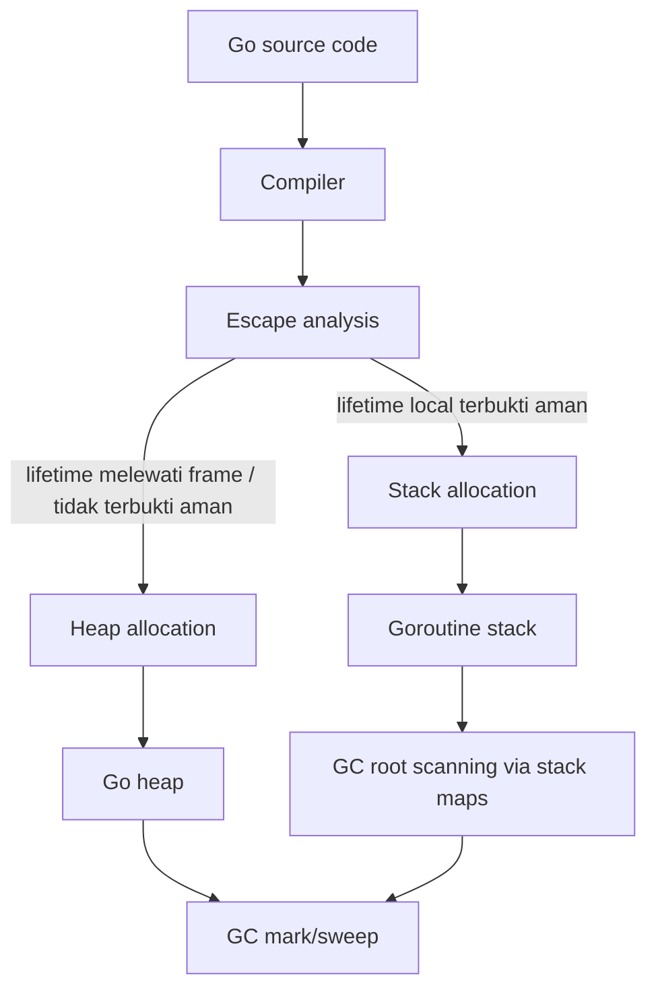
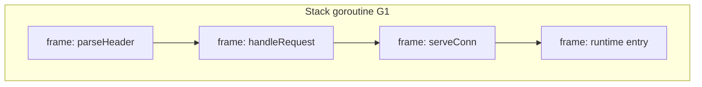
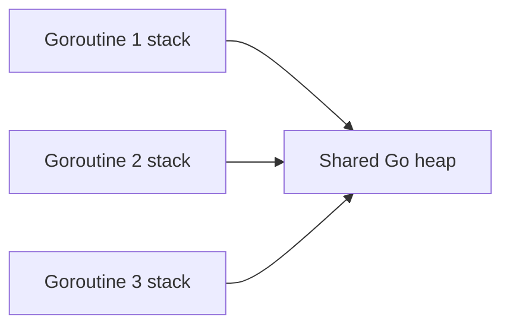
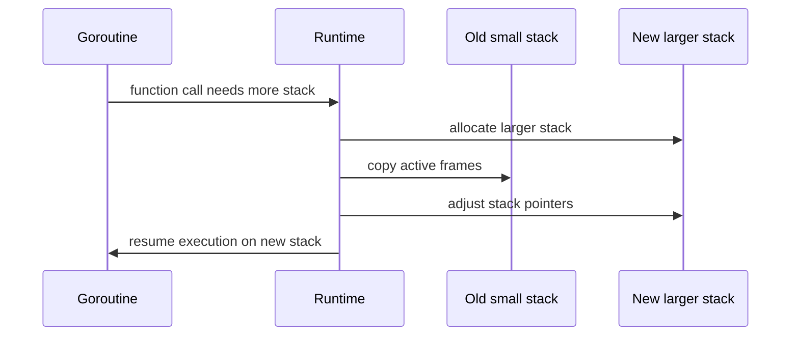
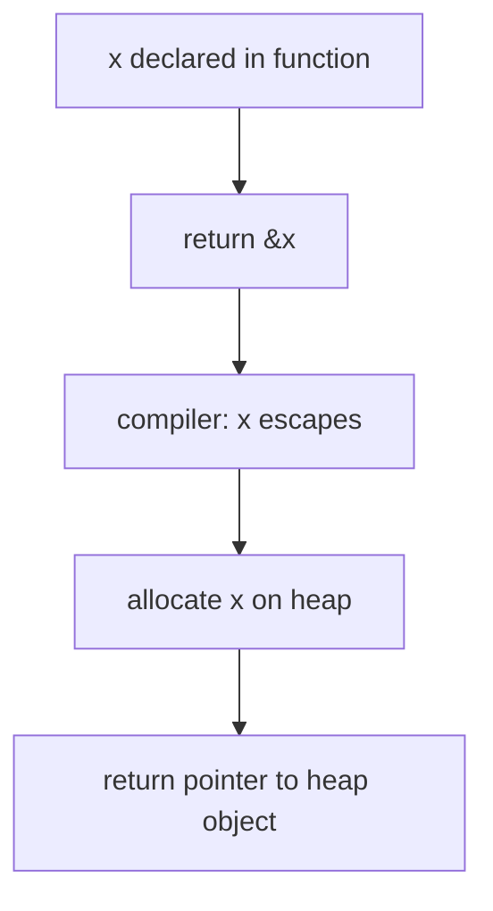
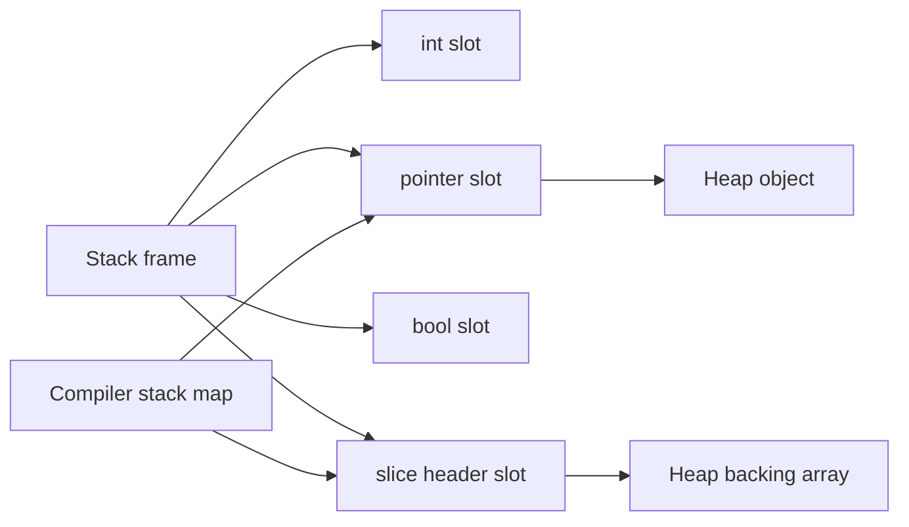
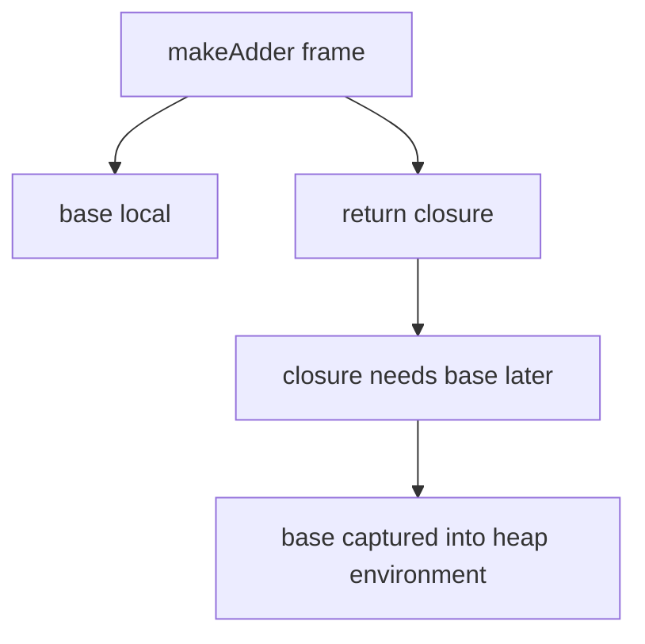
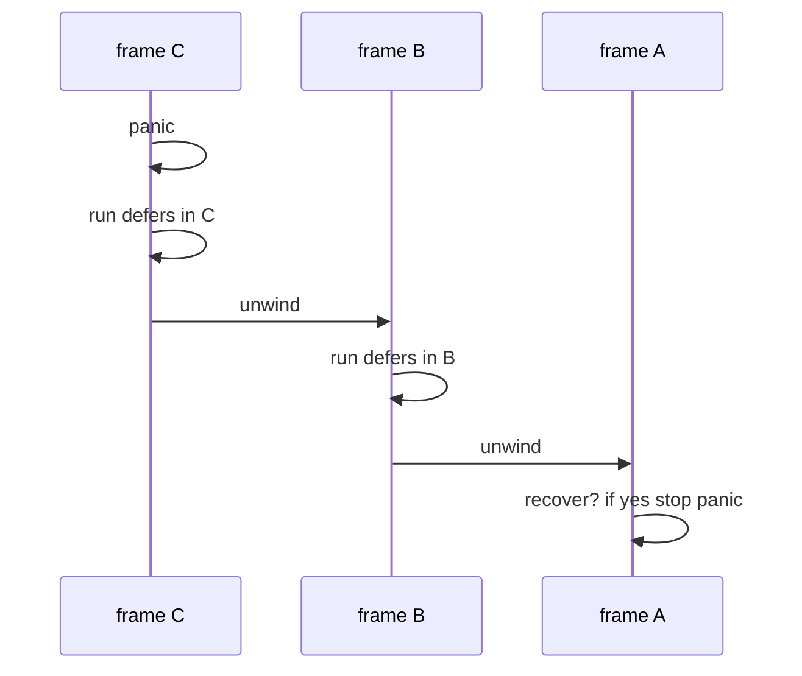
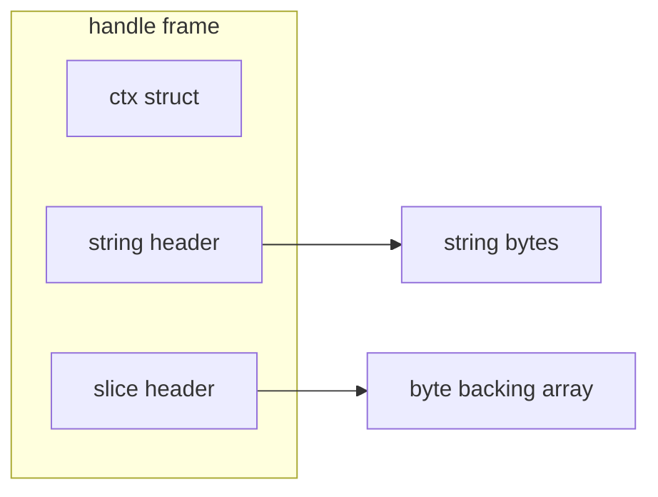

# learn-go-memory-systems-part-004.md

# Go Memory Systems — Part 004
# Stack Allocation, Goroutine Stack, Stack Growth, Stack Copying, Frame Layout

> Target pembaca: Java software engineer yang sedang membangun mental model Go sampai level production engineering.
>
> Fokus part ini: memahami stack Go bukan sekadar sebagai “tempat variable lokal”, tetapi sebagai struktur runtime yang hidup per goroutine, bisa tumbuh, bisa disalin, dipakai GC untuk menemukan pointer, dan memengaruhi keputusan allocation, latency, memory footprint, serta correctness.

---

## 0. Posisi Part Ini Dalam Seri

Sebelumnya kita sudah membangun fondasi:

- Part 000: peta besar memory systems.
- Part 001: virtual memory, heap, stack, RSS, pages, dan container memory.
- Part 002: representasi value di Go.
- Part 003: pointer, addressability, aliasing, receiver, dan ownership boundary.

Part ini masuk ke satu pertanyaan penting:

> Ketika sebuah variable tidak escape, di mana ia hidup, bagaimana stack goroutine menyimpannya, bagaimana stack bisa tumbuh, dan bagaimana GC tetap bisa menemukan pointer di dalam stack?

Di Java, engineer biasanya berpikir:

- object hampir selalu di heap;
- local variable/reference ada di stack frame;
- thread stack relatif besar dan fixed-ish;
- escape analysis/JIT bisa menghilangkan beberapa allocation, tapi programmer jarang memodelkan layout stack secara eksplisit.

Di Go, modelnya berbeda:

- goroutine sangat banyak;
- setiap goroutine memiliki stack sendiri;
- stack awal kecil dan bisa tumbuh;
- compiler menentukan variable mana yang aman tetap di stack;
- stack dapat dipindahkan/disalin oleh runtime;
- GC perlu stack maps untuk tahu slot mana yang berisi pointer;
- pointer ke local variable aman bila compiler memperpanjang lifetime variable ke heap;
- terlalu banyak pointer/large frame/closure/goroutine capture dapat mengubah cost model.

---

## 1. Tujuan Pembelajaran

Setelah menyelesaikan part ini, kamu harus mampu:

1. Menjelaskan perbedaan stack Go dengan Java thread stack.
2. Menjelaskan mengapa goroutine bisa murah secara memory dibanding OS thread tradisional.
3. Membaca hubungan antara local variable, stack frame, escape analysis, dan heap allocation.
4. Memahami mengapa pointer ke local variable bisa aman di Go.
5. Menjelaskan stack growth dan stack copying tanpa mitos.
6. Memahami bahwa pointer ke stack tidak boleh disimpan sembarangan oleh code unsafe/native.
7. Memahami stack map sebagai metadata GC.
8. Mengidentifikasi pola kode yang memperbesar stack frame atau menyebabkan escape.
9. Membuat review checklist untuk stack-sensitive Go code.
10. Mendesain API yang menjaga lifetime jelas tanpa overusing pointer.

---

## 2. Sumber Faktual Utama

Materi ini diselaraskan dengan sumber resmi Go:

- Go Language Specification: variable, addressability, function call, method, pointer, defer, goroutine.
- Go Memory Model: data race dan sinkronisasi; penting karena stack-local aman hanya selama tidak dishare tanpa sinkronisasi.
- Go GC Guide: GC cost mempertimbangkan live heap, goroutine stacks, dan global pointer roots.
- Go runtime package documentation: `GODEBUG` memiliki opsi seperti `gcshrinkstackoff`, yang menunjukkan runtime memang dapat memindahkan goroutine ke stack lebih kecil dalam kondisi tertentu.
- Go runtime source (`runtime/stack.go`, `runtime/HACKING`) sebagai referensi internal, bukan API kontrak publik.
- Go diagnostics documentation: pprof, trace, goroutine profile, dan heap diagnostics.

Catatan penting:

> Detail internal runtime bisa berubah antar versi Go. Materi ini menjelaskan mental model dan invariant yang relevan untuk Go 1.26.x, bukan menjanjikan layout internal byte-per-byte sebagai kontrak API.

---

## 3. Ringkasan Inti

Kalau harus diringkas dalam satu halaman:

1. Setiap goroutine punya stack sendiri.
2. Stack goroutine dimulai kecil dan bisa tumbuh ketika call chain membutuhkan ruang lebih besar.
3. Local variable dapat hidup di stack bila compiler bisa membuktikan lifetimenya tidak melewati frame secara tidak aman.
4. Bila local variable harus hidup lebih lama dari frame, compiler menaruhnya di heap.
5. Pointer ke local variable aman di Go karena compiler/runtime menjaga lifetime yang benar.
6. Stack Go dapat dipindahkan/disalin, sehingga menyimpan raw stack address di `uintptr`, C memory, atau unsafe structure dapat berbahaya.
7. GC menelusuri goroutine stack sebagai root set, tetapi perlu metadata compiler untuk tahu slot mana yang pointer.
8. Banyak goroutine berarti banyak stack, walaupun stack awal kecil.
9. Stack bukan tempat gratis tanpa batas; recursion, large local array, dan deep call chain tetap punya cost.
10. Optimasi stack harus dibuktikan dengan benchmark, escape report, pprof, dan trace.

---

## 4. Mental Model Utama: Stack Adalah Lifetime Region Per Goroutine

Secara konseptual, stack adalah region memory untuk eksekusi fungsi saat ini dan caller chain-nya.

Ketika fungsi dipanggil:

- runtime/compiler menyediakan frame untuk fungsi itu;
- frame menyimpan local variable tertentu;
- frame menyimpan spill temporary tertentu;
- frame menyimpan metadata call/return;
- frame dapat punya informasi untuk GC mengenai pointer slots.

Ketika fungsi selesai:

- frame tidak lagi valid;
- local variable di frame tidak boleh direferensikan lagi kecuali compiler memindahkannya ke heap;
- stack pointer mundur secara logis.

Dalam Go, programmer tidak memilih stack vs heap secara langsung.

Kamu tidak menulis:

```go
stack x := T{}
heap y := new(T)
```

Kamu menulis program biasa, lalu compiler menentukan.

---

## 5. Diagram Besar



Intinya:

- stack allocation adalah hasil pembuktian compiler;
- heap allocation adalah fallback bila lifetime/aliasing tidak bisa dibuktikan aman;
- GC tetap melihat stack karena stack dapat menyimpan pointer ke heap.

---

## 6. Java vs Go: Perbedaan Cara Berpikir

### 6.1 Java

Di Java:

```java
User u = new User();
```

Secara mental:

- `u` adalah reference local di stack frame;
- object `User` ada di heap;
- JIT mungkin melakukan escape analysis dan scalar replacement;
- tetapi bahasa Java tidak memberi model eksplisit bahwa object biasa bisa stack allocated secara source-level.

Thread Java tradisional juga punya stack OS/thread yang relatif besar dibanding goroutine stack.

### 6.2 Go

Di Go:

```go
u := User{Name: "A"}
```

`u` bisa:

- seluruhnya di stack;
- sebagian field menunjuk heap data;
- pindah ke heap bila escape;
- dipromosikan/dioptimasi oleh compiler;
- tidak ada jaminan source-level tentang lokasi fisiknya.

Mental model Go:

> Location is compiler decision. Lifetime and aliasing are what you design.

---

## 7. Apa Itu Stack Frame?

Stack frame adalah region memory untuk satu aktivasi fungsi.

Contoh:

```go
func add(a, b int) int {
    c := a + b
    return c
}
```

Secara konseptual, frame `add` dapat berisi:

- parameter `a`;
- parameter `b`;
- local `c`;
- temporary compiler;
- return slot;
- metadata untuk call/return;
- pointer map metadata untuk GC.

Jangan terlalu literal bahwa semua parameter pasti disimpan di memory stack. Modern Go ABI dapat memakai register. Tetapi secara lifetime model, frame tetap unit eksekusi fungsi.

---

## 8. Diagram Call Stack



Frame paling atas adalah fungsi yang sedang aktif. Ketika `parseHeader` return, frame itu hilang secara logis.

---

## 9. Stack Per Goroutine

Setiap goroutine punya stack sendiri.

```go
func main() {
    go worker(1)
    go worker(2)
}
```

Secara konseptual:



Setiap goroutine punya local call chain sendiri, tetapi semua goroutine dalam satu process berbagi heap.

Implikasi:

- local variable yang benar-benar hanya dipakai goroutine itu tidak butuh synchronization;
- heap object yang dishare antar goroutine butuh synchronization;
- pointer dari stack ke heap umum dan normal;
- pointer antar stack bukan model ownership publik yang boleh diandalkan secara unsafe.

---

## 10. Kenapa Goroutine Bisa Murah?

Goroutine murah bukan karena tidak punya stack.

Goroutine murah karena:

1. stack awal kecil;
2. stack bisa tumbuh sesuai kebutuhan;
3. scheduler Go multiplex banyak goroutine ke OS threads;
4. blocking operation tertentu diintegrasikan dengan runtime scheduler;
5. runtime punya metadata untuk mengelola stack dan GC.

Tetapi goroutine tetap punya cost:

- stack minimum;
- `g` runtime object;
- scheduler bookkeeping;
- pointer roots untuk GC;
- channel/timer/context/captured closure yang mungkin retained;
- stack growth/shrink overhead.

Jadi kalimat yang benar:

> Goroutine murah, bukan gratis.

---

## 11. Stack Growth: Mengapa Stack Bisa Tumbuh

Call chain bisa lebih dalam dari stack awal.

Contoh:

```go
func recurse(n int) int {
    if n == 0 {
        return 0
    }
    return 1 + recurse(n-1)
}
```

Semakin dalam recursion, semakin banyak frame aktif.

Runtime harus memastikan stack cukup.

Di Go modern, goroutine stack bisa tumbuh dengan menyalin stack ke area lebih besar ketika dibutuhkan.

Konseptual:



Yang penting:

- stack address dapat berubah;
- pointer internal dalam stack perlu disesuaikan;
- raw integer address tidak dapat otomatis disesuaikan;
- unsafe code harus sangat hati-hati.

---

## 12. Stack Copying: Kenapa Ini Penting Untuk Unsafe

Misalkan kamu melakukan ini:

```go
func dangerous() uintptr {
    x := 42
    return uintptr(unsafe.Pointer(&x))
}
```

Ini salah secara lifetime dan GC visibility.

Masalahnya bukan hanya `x` selesai setelah return.

Masalah lain:

- `uintptr` bukan pointer bagi GC;
- stack bisa dipindahkan;
- alamat lama bisa tidak valid;
- runtime tidak tahu bahwa integer itu perlu di-update;
- kalau dipakai lagi, hasilnya undefined/buggy/dangerous.

Rule penting:

> `uintptr` is not ownership. `uintptr` is not lifetime. `uintptr` is not a GC root.

---

## 13. Pointer Ke Local Variable: Kenapa Aman?

Contoh klasik:

```go
func NewCounter() *int {
    x := 0
    return &x
}
```

Di C, ini bug fatal bila `x` benar-benar local stack.

Di Go, ini aman karena compiler melihat `&x` keluar dari fungsi, sehingga `x` escape ke heap.

Secara konseptual:



Jadi bukan berarti Go mengizinkan pointer ke dead stack frame.

Yang terjadi:

> Compiler changes storage decision so the variable outlives the frame.

---

## 14. Stack Allocation vs Heap Allocation

Contoh stack-friendly:

```go
func sum(a, b int) int {
    x := a + b
    return x
}
```

`x` tidak keluar dari fungsi.

Contoh heap-promoted:

```go
func ptr() *int {
    x := 10
    return &x
}
```

`x` keluar dari fungsi.

Contoh ambiguous karena interface/logging:

```go
func logAny(v int) {
    fmt.Println(v)
}
```

Tergantung implementasi dan compiler, boxing-like interface path dapat menyebabkan allocation pada pola tertentu.

Kesimpulan:

- bukan keyword yang menentukan;
- bukan `new` vs literal saja yang menentukan;
- bukan pointer selalu heap;
- compiler proof yang menentukan.

---

## 15. Cara Melihat Escape Analysis

Gunakan:

```bash
go build -gcflags=-m ./...
```

Lebih detail:

```bash
go build -gcflags='-m=3' ./...
```

Contoh file:

```go
package main

func stackValue() int {
    x := 10
    return x
}

func heapValue() *int {
    x := 10
    return &x
}

func main() {
    _ = stackValue()
    _ = heapValue()
}
```

Kemungkinan output akan menyebut bahwa `x` pada `heapValue` moved to heap.

Catatan:

- output escape analysis dapat berubah antar versi Go;
- jangan menulis kode buruk hanya untuk memuaskan `-m`;
- gunakan benchmark dan profile untuk memastikan dampak nyata.

---

## 16. Stack Maps: Bagaimana GC Menemukan Pointer Di Stack

GC perlu tahu object heap mana yang masih reachable.

Salah satu root source adalah stack goroutine.

Tetapi stack berisi campuran:

- integer;
- float;
- bool;
- return address;
- spilled register;
- pointer ke heap;
- pointer internal;
- temporary.

GC tidak boleh menebak.

Compiler menghasilkan metadata yang memberi tahu runtime:

> Pada program counter tertentu, slot mana di frame yang berisi pointer.

Inilah mental model stack map.



GC scan stack berdasarkan metadata, bukan scanning byte secara buta.

---

## 17. Stack Sebagai GC Root

GC roots termasuk:

- goroutine stacks;
- globals;
- runtime structures;
- registers/active execution state;
- finalizer/special structures;
- cgo roots dalam aturan tertentu.

Part ini fokus ke stack.

Misalnya:

```go
func handle() {
    buf := make([]byte, 4096)
    process(buf)
}
```

`buf` adalah slice header di stack.

Backing array `make([]byte, 4096)` bisa di heap atau stack tergantung escape dan size/proof compiler.

Jika backing array di heap, slice header di stack menjadi root yang menjaga backing array tetap hidup selama frame aktif.

---

## 18. Frame Layout: Jangan Terlalu Literal, Tapi Pahami Kategori

Frame layout Go bukan API publik.

Tetapi secara konseptual frame punya kategori data:

```text
+-----------------------------+
| outgoing call args/spill     |
+-----------------------------+
| local variables              |
+-----------------------------+
| temporaries                  |
+-----------------------------+
| saved state / metadata       |
+-----------------------------+
```

Modern compiler/ABI dapat:

- menaruh argumen di register;
- spill register ke stack;
- menghapus variable sepenuhnya;
- melakukan inlining sehingga frame berubah;
- menggabungkan/menghilangkan temporary;
- memindahkan variable ke heap.

Jadi dalam review code, jangan bertanya:

> Variable ini pasti di offset berapa?

Tanya:

> Lifetime-nya apa? Escape tidak? Large object tidak? Pointer graph-nya bagaimana? Retention-nya bagaimana?

---

## 19. Inlining Dan Efek Terhadap Stack

Compiler dapat inline fungsi kecil.

Contoh:

```go
func add(a, b int) int { return a + b }

func compute() int {
    return add(1, 2)
}
```

Jika `add` di-inline, tidak ada call frame nyata untuk `add` saat runtime.

Dampaknya:

- call overhead turun;
- escape analysis bisa lebih presisi;
- stack frame total bisa berubah;
- debug/profiling stack trace bisa terlihat berbeda dengan source mental model;
- benchmark bisa berubah antar versi Go.

Inlining bisa membuat allocation hilang karena compiler melihat lifetime lebih jelas.

---

## 20. Large Stack Frame

Local variable besar dapat memperbesar frame.

Contoh:

```go
func process() {
    var buf [1 << 20]byte // 1 MiB local array
    use(buf[:])
}
```

Masalah potensial:

- frame besar;
- stack growth lebih sering/mahal;
- stack copy lebih mahal;
- memory footprint goroutine meningkat;
- recursive/deep calls makin berisiko;
- compiler mungkin memutuskan memindahkan ke heap.

Alternatif tergantung kebutuhan:

```go
func process() {
    buf := make([]byte, 64*1024)
    use(buf)
}
```

Atau caller-provided buffer:

```go
func process(buf []byte) error {
    if len(buf) < minSize {
        return ErrSmallBuffer
    }
    return nil
}
```

Atau streaming chunk kecil.

---

## 21. Deep Recursion Di Go

Go tidak melarang recursion.

Tetapi recursion memiliki stack cost.

Contoh buruk untuk input tidak terbatas:

```go
func walk(n *Node) {
    if n == nil {
        return
    }
    walk(n.Left)
    walk(n.Right)
}
```

Jika tree sangat dalam, stack dapat tumbuh besar.

Alternatif iterative:

```go
func walkIter(root *Node) {
    if root == nil {
        return
    }

    stack := []*Node{root}
    for len(stack) > 0 {
        n := stack[len(stack)-1]
        stack = stack[:len(stack)-1]

        if n.Right != nil {
            stack = append(stack, n.Right)
        }
        if n.Left != nil {
            stack = append(stack, n.Left)
        }
    }
}
```

Trade-off:

- recursive: simple, uses goroutine stack;
- iterative: explicit heap/slice stack, easier to bound/control;
- for untrusted input, prefer bounded explicit structure or depth limit.

---

## 22. Goroutine Stack Shrinking

Goroutine stack bisa tumbuh. Dalam kondisi tertentu runtime juga dapat mengecilkan stack yang terlalu besar.

Dokumentasi runtime menyediakan `GODEBUG=gcshrinkstackoff=1` untuk menonaktifkan pemindahan goroutine ke stack lebih kecil. Ini berguna sebagai bukti bahwa stack shrink/copy adalah bagian dari runtime behavior, tetapi bukan knob yang seharusnya dipakai untuk tuning normal.

Rule production:

> Jangan desain sistem yang bergantung pada stack tidak pernah berpindah.

---

## 23. Stack Growth Cost Model

Stack growth tidak terjadi di setiap function call.

Tetapi ketika terjadi, ada cost:

- allocate stack baru;
- copy active frames;
- adjust pointers dalam stack;
- update goroutine metadata;
- resume execution.

Cost biasanya acceptable karena jarang dibanding operasi normal.

Namun bisa menjadi masalah jika:

- banyak goroutine memulai deep call pattern bersamaan;
- local frame besar;
- recursion ekstrem;
- workload membuat stack tumbuh dan menyusut berulang;
- unsafe code membuat pointer adjustment tidak valid.

---

## 24. Stack Dan Closure Capture

Closure dapat menangkap variable dari outer scope.

Contoh:

```go
func makeAdder(base int) func(int) int {
    return func(x int) int {
        return base + x
    }
}
```

`base` harus hidup setelah `makeAdder` return.

Maka `base` kemungkinan escape.

Diagram:



Closure capture sering menjadi sumber allocation tersembunyi.

---

## 25. Stack Dan Goroutine Capture

Contoh umum:

```go
func start() {
    x := 42
    go func() {
        println(x)
    }()
}
```

Goroutine baru dapat berjalan setelah `start` return.

Maka captured `x` harus hidup lebih lama dari frame `start`.

Akibatnya `x`/closure environment dapat escape ke heap.

Ini bukan bug. Ini konsekuensi lifetime.

Bug muncul bila yang dicapture adalah variable loop yang berubah.

Modern Go sudah memperbaiki beberapa pola loop variable, tetapi prinsip review tetap:

> Periksa apa yang dicapture dan berapa lama ia hidup.

---

## 26. Stack Dan Defer

`defer` terkait frame karena defer dieksekusi ketika fungsi return.

Contoh:

```go
func f() {
    file := open()
    defer file.Close()
    work(file)
}
```

`defer` menyimpan call yang harus dijalankan saat frame keluar.

Cost `defer` sudah jauh lebih optimal di Go modern dibanding masa awal, tetapi tetap bukan nol.

Dalam hot loop:

```go
for _, item := range items {
    f, _ := os.Open(item)
    defer f.Close() // buruk jika loop panjang
}
```

Masalah:

- close tertunda sampai fungsi luar selesai;
- resource menumpuk;
- closure/defer record bertambah;
- memory/resource retention.

Lebih baik:

```go
for _, item := range items {
    if err := processFile(item); err != nil {
        return err
    }
}

func processFile(item string) error {
    f, err := os.Open(item)
    if err != nil {
        return err
    }
    defer f.Close()
    return use(f)
}
```

---

## 27. Stack Dan Panic/Recover

Panic melakukan stack unwinding.

Setiap deferred function dalam frame yang dilewati dapat dijalankan.

Konseptual:



Dampak memory:

- stack trace perlu menelusuri frames;
- defer bisa mempertahankan captured values;
- recover yang terlalu luas dapat menyembunyikan invariant violation;
- panic bukan mekanisme control-flow normal untuk hot path.

---

## 28. Stack Dan Register ABI

Go modern menggunakan ABI yang dapat melewatkan argument/return values via register untuk efisiensi.

Tetapi mental model stack tetap penting karena:

- tidak semua value muat di register;
- register dapat di-spill ke stack;
- stack tetap menyimpan frames;
- GC tetap butuh stack/register maps;
- inlining dan register allocation tidak mengubah lifetime semantics.

Jangan menyimpulkan dari source bahwa semua argumen “pasti di stack”. Yang benar:

> Source-level pass-by-value tetap berlaku; physical placement adalah keputusan compiler/ABI.

---

## 29. Stack, Heap, Dan Pointer Graph

Contoh:

```go
type RequestContext struct {
    UserID string
    Buf    []byte
}

func handle() {
    ctx := RequestContext{
        UserID: "u-1",
        Buf:    make([]byte, 4096),
    }
    process(ctx)
}
```

`ctx` bisa ada di stack.

Tetapi `ctx.Buf` adalah slice header yang menunjuk backing array.

`ctx.UserID` adalah string header yang menunjuk bytes string.

Jadi stack frame dapat berisi small headers yang menunjuk memory lain.

Diagram:



Ketika GC scan frame, pointer di header membuat target tetap live.

---

## 30. Stack-Local Tidak Sama Dengan Immutable

Variable stack-local bisa dimutasi.

```go
func f() int {
    x := 1
    x++
    return x
}
```

Aman karena hanya satu execution context mengakses `x`.

Tetapi jika alamatnya dishare:

```go
func f() *int {
    x := 1
    return &x
}
```

`x` tidak lagi stack-local secara storage.

Dan jika dishare antar goroutine:

```go
func f() {
    x := 1
    go func() { x++ }()
    x++
}
```

Ini bisa menjadi data race bila tidak disinkronkan.

Storage location tidak menghapus aturan memory model.

---

## 31. Stack Dan Data Race

Data race bukan hanya masalah heap.

Kalau variable local dicapture oleh goroutine lain, ia bisa menjadi shared state.

```go
func bad() {
    x := 0
    done := make(chan struct{})

    go func() {
        x++
        close(done)
    }()

    x++
    <-done
}
```

`x` mungkin escape, tetapi yang lebih penting: akses unsynchronized.

Perbaikan:

```go
func good() {
    ch := make(chan int, 1)

    go func() {
        x := 0
        x++
        ch <- x
    }()

    y := <-ch
    _ = y
}
```

Atau pakai mutex/atomic sesuai kebutuhan.

---

## 32. Stack Dan `sync.Pool`

Kadang orang memakai `sync.Pool` untuk menghindari stack/heap cost tanpa analisis.

Misalnya:

```go
var pool = sync.Pool{
    New: func() any { return make([]byte, 4096) },
}
```

Ini dapat berguna untuk buffer besar atau allocation rate tinggi.

Tetapi untuk value kecil yang bisa stack allocated, pool justru buruk:

- interface conversion;
- heap retention;
- reset risk;
- cross-goroutine ownership ambiguity;
- GC interaction;
- complexity.

Rule:

> Jangan pool sesuatu yang compiler sudah bisa stack allocate murah.

---

## 33. Stack Dan Large Local Arrays

Perhatikan bedanya:

```go
func a() {
    var buf [4096]byte
    use(buf[:])
}
```

vs

```go
func b() {
    buf := make([]byte, 4096)
    use(buf)
}
```

Yang pertama adalah array value local. Bila tidak escape dan size acceptable, bisa stack.

Yang kedua membuat slice; backing array bisa stack atau heap tergantung escape dan compiler optimization.

Jangan otomatis menganggap `make` berarti heap.

Go compiler modern dapat menempatkan backing store slice di stack dalam lebih banyak situasi dibanding versi lama, tetapi tetap bergantung pada analisis.

---

## 34. Stack Dan Function Return Value

Return value kecil sering efisien.

```go
type Point struct {
    X, Y int
}

func NewPoint(x, y int) Point {
    return Point{X: x, Y: y}
}
```

Tidak perlu langsung return pointer:

```go
func NewPointPtr(x, y int) *Point {
    return &Point{X: x, Y: y}
}
```

Pointer return dapat menyebabkan heap allocation dan GC work.

Kapan pointer return masuk akal?

- identity/mutability diperlukan;
- object besar dan copy cost signifikan;
- nil sebagai absence semantics;
- shared lifecycle memang diinginkan;
- interface/method set membutuhkan pointer receiver.

Kalau hanya ingin “lebih cepat”, ukur dulu.

---

## 35. Stack Dan Method Receiver

Value receiver:

```go
func (p Point) Move(dx, dy int) Point {
    p.X += dx
    p.Y += dy
    return p
}
```

Pointer receiver:

```go
func (p *Point) MoveInPlace(dx, dy int) {
    p.X += dx
    p.Y += dy
}
```

Memory perspective:

- value receiver menyalin receiver;
- pointer receiver menyalin pointer;
- pointer receiver menciptakan alias ke object asli;
- pointer receiver tidak otomatis heap, tetapi bisa memengaruhi escape;
- value receiver untuk small immutable-ish values sering bagus;
- pointer receiver untuk large/mutable/sync-containing object sering benar.

---

## 36. Stack Dan Interface Call

Ketika value masuk interface:

```go
func consume(v any) {}

func f() {
    x := 10
    consume(x)
}
```

Ada interface representation.

Apakah `x` heap allocated? Tergantung.

Faktor:

- apakah interface value escape;
- ukuran value;
- apakah disimpan di heap object;
- apakah dipakai reflection;
- apakah function inlined;
- compiler version.

Jangan simpulkan tanpa `-gcflags=-m` dan benchmark.

---

## 37. Stack Dan Map/Slice/Channel Headers

Map, slice, channel value sering kecil sebagai header/descriptor.

Contoh:

```go
func f() {
    s := make([]int, 10)
    m := make(map[string]int)
    ch := make(chan int)
    _ = s
    _ = m
    _ = ch
}
```

Local variables `s`, `m`, `ch` sebagai descriptors bisa di stack.

Tetapi backing storage/runtime structures bisa di heap.

Jadi ketika orang berkata “slice ada di stack”, harus diperjelas:

- slice header di stack?
- backing array di stack?
- backing array di heap?
- header disimpan di heap object?
- header dicapture closure?

Precise language matters.

---

## 38. Stack Dan Accidental Retention

Stack frame bisa mempertahankan object heap tetap live lebih lama dari yang kamu kira.

Contoh:

```go
func process() error {
    big := make([]byte, 100<<20)
    small := big[:10]

    err := useSmall(small)
    if err != nil {
        return err
    }

    doMoreWork()
    return nil
}
```

Selama `small` masih dianggap live, backing array besar bisa tetap reachable.

Mitigasi:

```go
smallCopy := append([]byte(nil), big[:10]...)
big = nil
```

Atau susun scope:

```go
func process() error {
    small, err := extractSmall()
    if err != nil {
        return err
    }
    return useSmall(small)
}
```

Scope dan liveness analysis penting.

---

## 39. Liveness: Lexical Scope vs Compiler Liveness

Lexical scope adalah wilayah source code di mana variable bisa diakses.

Liveness adalah apakah variable masih dibutuhkan pada titik program tertentu.

Compiler dapat mengetahui bahwa variable tidak lagi live sebelum akhir scope.

Tetapi jangan bergantung berlebihan pada detail ini untuk resource besar. Untuk memory besar, kadang eksplisit lebih jelas:

```go
buf = nil
runtime.GC() // biasanya bukan untuk production flow normal
```

Di production, desain scope/API lebih baik daripada memanggil GC manual.

---

## 40. Stack Dan `runtime.KeepAlive`

Dalam unsafe/cgo/finalizer scenario, kadang compiler dapat menganggap object tidak lagi digunakan sebelum titik yang secara native masih membutuhkannya.

`runtime.KeepAlive(x)` memastikan `x` dianggap live sampai titik itu.

Contoh konseptual:

```go
func useFD(f *os.File) {
    fd := f.Fd()
    syscallUse(fd)
    runtime.KeepAlive(f)
}
```

Tanpa `KeepAlive`, dalam pola tertentu finalizer/resource cleanup bisa terjadi lebih awal dari yang kamu bayangkan.

Ini advanced dan akan dibahas lebih dalam di Part 025.

---

## 41. Stack Dan cgo

Ketika berinteraksi dengan C:

- Go stack bisa grow/copy;
- C tidak boleh menyimpan Go pointer sembarangan;
- pointer passing rules harus dipatuhi;
- Go pointer ke stack lebih sensitif;
- C stack berbeda dengan goroutine stack;
- callback dari C ke Go melibatkan runtime machinery.

Rule sederhana:

> Jangan pernah menyimpan pointer ke Go stack di C memory.

Untuk production cgo, desain ownership secara eksplisit:

- C owns C memory;
- Go owns Go memory;
- copy boundary jelas;
- lifetime jelas;
- `runtime.KeepAlive` dipakai bila diperlukan;
- pointer rules dipatuhi.

---

## 42. Stack Dan Signal/Runtime System Stack

Go runtime juga punya konsep system stack untuk pekerjaan runtime tertentu.

User goroutine stack berbeda dari system stack yang dipakai runtime untuk operasi internal.

Sebagai application engineer, kamu jarang perlu detail ini.

Tetapi penting untuk tahu:

- runtime menjalankan beberapa operasi di stack khusus;
- jangan mengasumsikan semua eksekusi selalu di user goroutine stack;
- detail ini bukan API publik;
- relevan jika membaca source runtime atau crash dump.

---

## 43. Stack Overflow

Go stack bisa tumbuh, tetapi tidak infinite.

Stack overflow masih bisa terjadi.

Penyebab:

- recursion tak berbatas;
- cycle traversal tanpa visited set;
- parser recursive untuk input adversarial;
- large local frames;
- panic/recover recursion;
- Stringer/Error recursion.

Contoh bug:

```go
type Node struct {
    Next *Node
}

func length(n *Node) int {
    if n == nil {
        return 0
    }
    return 1 + length(n.Next)
}
```

Untuk linked list panjang, iterative lebih aman.

---

## 44. Stack Dan Parser Design

Recursive descent parser nyaman, tetapi input bisa adversarial.

Untuk production parser:

- tetapkan max depth;
- gunakan iterative parsing untuk struktur dalam;
- hindari local buffer besar per recursion;
- pisahkan parse state dari call stack;
- ukur stack growth di benchmark/trace;
- test nested input ekstrem.

Contoh max depth:

```go
func parseNode(depth int) error {
    if depth > maxDepth {
        return ErrTooDeep
    }
    // parse children with depth+1
    return nil
}
```

---

## 45. Stack Dan Error Wrapping

Error wrapping biasanya tidak stack-heavy, tetapi stack trace library bisa menangkap call stack.

Jika kamu memakai package yang menyimpan stack trace pada setiap error:

- allocation meningkat;
- frame capture cost meningkat;
- memory retention bisa naik;
- hot-path error construction mahal.

Policy:

- error biasa untuk expected domain failure;
- stack trace untuk boundary tertentu;
- jangan capture stack untuk setiap validation error massal.

---

## 46. Stack Dan Logging

Logging dengan `fmt`/structured logging dapat menyebabkan allocation dan interface conversion.

Contoh:

```go
log.Printf("request=%+v", req)
```

Risiko:

- reflection;
- interface boxing-like cost;
- string building;
- large object traversal;
- retention jika async logger menyimpan reference.

Stack perspective:

- local `req` mungkin stack;
- tetapi logging dapat membuat value escape;
- async logging harus copy data yang diperlukan, bukan simpan pointer ke mutable request object.

---

## 47. Stack Dan `defer` Dalam Loop: Resource Retention

Sudah disebut, tetapi ini sangat sering terjadi.

Buruk:

```go
func process(paths []string) error {
    for _, p := range paths {
        f, err := os.Open(p)
        if err != nil {
            return err
        }
        defer f.Close()
        // use f
    }
    return nil
}
```

Jika 100 ribu file:

- 100 ribu defer records;
- file descriptors tetap terbuka;
- memory/resource retention;
- frame `process` menahan semuanya sampai return.

Benar:

```go
func process(paths []string) error {
    for _, p := range paths {
        if err := processOne(p); err != nil {
            return err
        }
    }
    return nil
}
```

---

## 48. Stack Dan Goroutine Leak

Goroutine leak berarti stack leak juga.

Contoh:

```go
func leak(ch <-chan int) {
    go func() {
        v := <-ch
        _ = v
    }()
}
```

Jika `ch` tidak pernah menerima value, goroutine blocked selamanya.

Cost retained:

- goroutine stack;
- captured variables;
- channel reference;
- any heap object reachable dari frame;
- scheduler metadata.

Goroutine leak adalah memory leak.

---

## 49. Diagnosing Goroutine Stack/Leak

Tools:

```go
import _ "net/http/pprof"
```

Lalu:

```bash
go tool pprof http://localhost:6060/debug/pprof/goroutine
```

Atau raw:

```bash
curl http://localhost:6060/debug/pprof/goroutine?debug=2
```

Yang dicari:

- banyak goroutine blocked di lokasi sama;
- stack trace dengan channel receive/send;
- network read tanpa timeout;
- context cancellation tidak dipakai;
- worker tidak exit;
- timer/ticker loop leak.

---

## 50. Stack Memory Dalam Metrics

Beberapa metric runtime membantu membedakan heap vs stack.

Dengan `runtime/metrics`, kamu dapat mengamati memory class seperti:

- heap objects;
- heap free/released;
- stack memory;
- metadata;
- total classes.

Nama metric dapat berubah/bertambah antar versi, jadi pakai dokumentasi runtime/metrics versi Go yang dipakai.

Prinsip dashboard:

```text
RSS
- Go heap live/inuse
- Go stack memory
- Go runtime metadata
- mmap/native/cgo/page cache gap
```

Kalau goroutine count naik dan stack memory naik, curigai goroutine leak/deep stacks.

---

## 51. Stack Dan Execution Trace

Execution trace membantu melihat goroutine lifecycle:

```bash
go test -trace trace.out ./...
go tool trace trace.out
```

Untuk server, bisa expose trace via pprof endpoint dengan hati-hati.

Trace berguna untuk:

- goroutine creation storm;
- blocking pattern;
- scheduler latency;
- syscall blocking;
- network blocking;
- GC interaction;
- workload shape.

Trace bukan hanya concurrency tool; ia juga membantu memory analysis karena goroutine lifecycle memengaruhi stack retention.

---

## 52. Stack Dan Heap Profile: Kenapa Leak Tidak Selalu Terlihat Jelas

Heap profile menunjukkan heap allocation/in-use, bukan seluruh story.

Jika memory naik karena:

- goroutine stacks;
- cgo memory;
- mmap;
- page cache;
- runtime metadata;
- fragmented/idle memory;

heap profile mungkin tidak menjelaskan semua RSS.

Karena itu Part 001 menekankan RSS vs Go heap.

Dalam incident:

1. lihat RSS/container memory;
2. lihat heap inuse;
3. lihat goroutine count;
4. lihat stack memory metrics;
5. lihat cgo/mmap usage;
6. lihat pprof goroutine;
7. lihat trace bila perlu.

---

## 53. API Design: Caller-Owned Stack-Friendly Values

API yang baik sering memungkinkan caller mengontrol buffer/lifetime.

Contoh:

```go
func Encode(dst []byte, msg Message) ([]byte, error) {
    dst = append(dst, msg.Type)
    dst = binary.BigEndian.AppendUint32(dst, msg.ID)
    return dst, nil
}
```

Keunggulan:

- caller bisa menyediakan stack/local buffer;
- caller bisa reuse buffer;
- allocation dapat dikurangi;
- ownership jelas: returned slice mungkin memakai backing array dst.

Kontrak harus jelas:

> Returned slice may alias dst.

---

## 54. API Design: Jangan Return Pointer Jika Value Cukup

Kurang ideal:

```go
func ParseHeader(b []byte) (*Header, error) {
    h := Header{Version: b[0]}
    return &h, nil
}
```

Lebih stack-friendly:

```go
func ParseHeader(b []byte) (Header, error) {
    return Header{Version: b[0]}, nil
}
```

Jika `Header` kecil dan immutable-ish, return value lebih baik.

Pointer return perlu alasan:

- mutation;
- identity;
- large object;
- optional nil;
- polymorphic behavior;
- sharing lifecycle.

---

## 55. API Design: Avoid Hidden Long-Lived Captures

Buruk:

```go
func Register(req *Request) {
    callbacks = append(callbacks, func() {
        log.Println(req.UserID)
    })
}
```

Callback menyimpan seluruh request.

Lebih baik:

```go
func Register(req *Request) {
    userID := req.UserID
    callbacks = append(callbacks, func() {
        log.Println(userID)
    })
}
```

Atau copy field minimal.

Prinsip:

> Capture data yang diperlukan, bukan object besar beserta graph-nya.

---

## 56. Stack Dan Testing Escape

Kamu bisa membuat microbenchmark:

```go
package stackbench

import "testing"

type Point struct{ X, Y int }

func valuePoint(x, y int) Point {
    return Point{x, y}
}

func pointerPoint(x, y int) *Point {
    return &Point{x, y}
}

func BenchmarkValuePoint(b *testing.B) {
    var p Point
    for b.Loop() {
        p = valuePoint(1, 2)
    }
    _ = p
}

func BenchmarkPointerPoint(b *testing.B) {
    var p *Point
    for b.Loop() {
        p = pointerPoint(1, 2)
    }
    _ = p
}
```

Run:

```bash
go test -bench=. -benchmem
```

Catatan Go 1.26: `b.Loop()` adalah idiom modern benchmark yang menjaga compiler optimization lebih robust dibanding manual `for i := 0; i < b.N; i++` pada beberapa kasus.

---

## 57. Experiment: Large Frame

```go
package stackbench

import "testing"

func localArray() int {
    var buf [64 * 1024]byte
    buf[0] = 1
    return int(buf[0])
}

func heapSlice() int {
    buf := make([]byte, 64*1024)
    buf[0] = 1
    return int(buf[0])
}

func BenchmarkLocalArray(b *testing.B) {
    var x int
    for b.Loop() {
        x = localArray()
    }
    _ = x
}

func BenchmarkHeapSlice(b *testing.B) {
    var x int
    for b.Loop() {
        x = heapSlice()
    }
    _ = x
}
```

Lalu cek:

```bash
go test -bench=. -benchmem -gcflags=-m
```

Yang dipelajari:

- apakah allocation terjadi;
- apakah compiler menghilangkan buffer karena terlalu trivial;
- apakah benchmark perlu dibuat lebih realistis;
- apakah large frame masuk akal.

---

## 58. Experiment: Closure Capture

```go
package stackbench

import "testing"

func makeClosure(x int) func() int {
    return func() int { return x }
}

func noClosure(x int) int {
    return x
}

func BenchmarkClosure(b *testing.B) {
    var f func() int
    for b.Loop() {
        f = makeClosure(10)
    }
    _ = f
}

func BenchmarkNoClosure(b *testing.B) {
    var x int
    for b.Loop() {
        x = noClosure(10)
    }
    _ = x
}
```

Tujuan:

- melihat closure environment;
- memahami capture lifetime;
- tidak menyimpulkan semua closure buruk;
- mengukur hot path.

---

## 59. Experiment: Goroutine Capture

```go
package stackbench

import "testing"

func BenchmarkGoroutineCapture(b *testing.B) {
    for b.Loop() {
        done := make(chan int, 1)
        x := 10
        go func() {
            done <- x
        }()
        <-done
    }
}
```

Ini benchmark goroutine overhead, bukan hanya capture.

Tetapi escape report akan memperlihatkan lifetime yang melewati frame.

---

## 60. Common Misconceptions

### Mitos 1: “`new(T)` pasti heap”

Tidak selalu secara physical allocation. Compiler dapat mengoptimalkan jika tidak escape.

### Mitos 2: “Pointer lebih cepat karena tidak copy”

Pointer bisa mengurangi copy, tetapi menambah indirection, aliasing, dan GC scanning.

### Mitos 3: “Local variable selalu stack”

Tidak. Local variable bisa escape ke heap.

### Mitos 4: “Stack tidak dilihat GC”

Salah. Stack adalah root penting GC.

### Mitos 5: “Goroutine stack gratis”

Salah. Kecil dan growable, tapi tetap memory.

### Mitos 6: “Kalau heap profile kecil, memory pasti bukan Go”

Belum tentu. Bisa stack, runtime metadata, idle heap, mmap, cgo, page cache, fragmentation.

### Mitos 7: “`uintptr` bisa menyimpan pointer aman”

Tidak sebagai general rule. `uintptr` bukan GC root dan tidak ikut pointer adjustment.

---

## 61. Production Failure Mode 1: Goroutine Leak Menahan Stack Dan Heap Graph

Gejala:

- RSS naik perlahan;
- goroutine count naik;
- heap inuse naik atau stabil;
- latency memburuk;
- pprof goroutine menunjukkan blocked receive/send.

Root cause contoh:

```go
func waitForever(ch <-chan Event) {
    go func() {
        e := <-ch
        process(e)
    }()
}
```

Jika event tidak pernah datang, goroutine tertahan.

Jika closure juga capture request besar, retention makin besar.

Mitigasi:

- context cancellation;
- timeout;
- bounded worker lifecycle;
- close channel policy;
- goroutine ownership document;
- leak tests.

---

## 62. Production Failure Mode 2: Deep Recursive JSON/XML/AST Processing

Gejala:

- panic stack overflow pada input tertentu;
- CPU spike;
- memory spike;
- exploit via deeply nested payload.

Mitigasi:

- max depth;
- streaming decoder;
- iterative traversal;
- reject adversarial nested input;
- fuzz test nested structure.

---

## 63. Production Failure Mode 3: Large Local Buffers In Worker Goroutines

Contoh:

```go
func worker() {
    var scratch [1 << 20]byte
    for job := range jobs {
        process(job, scratch[:])
    }
}
```

Jika ada 10.000 workers, potensi stack/memory footprint sangat besar, tergantung compiler/runtime behavior.

Alternatif:

- kurangi worker count;
- gunakan chunk kecil;
- allocate per active job;
- bounded pool;
- streaming;
- per-P/per-worker buffer dengan budget jelas.

---

## 64. Production Failure Mode 4: Capturing Request Object In Async Callback

Contoh:

```go
func handle(req *Request) {
    go func() {
        audit(req)
    }()
}
```

Risiko:

- request object hidup lebih lama;
- body buffer tertahan;
- context tertahan;
- security data tertahan;
- data race jika request mutable.

Lebih baik:

```go
func handle(req *Request) {
    event := AuditEvent{
        UserID: req.UserID,
        Action: req.Action,
    }
    go func(e AuditEvent) {
        audit(e)
    }(event)
}
```

---

## 65. Production Failure Mode 5: Unsafe Stack Address Escape

Contoh anti-pattern:

```go
func register() {
    var x int
    nativeRegister(uintptr(unsafe.Pointer(&x)))
}
```

Jika native side menyimpan address itu, bug serius.

Mitigasi:

- allocate C memory untuk C ownership;
- copy data;
- jangan simpan Go stack pointer;
- gunakan cgo pointer rules;
- gunakan `runtime.KeepAlive` bila pattern valid membutuhkannya;
- isolate unsafe code.

---

## 66. Design Pattern: Stack-Friendly Parser

```go
type Header struct {
    Version byte
    Kind    byte
    Length  uint32
}

func ParseHeader(b []byte) (Header, error) {
    if len(b) < 6 {
        return Header{}, ErrShort
    }
    return Header{
        Version: b[0],
        Kind:    b[1],
        Length:  uint32(b[2])<<24 | uint32(b[3])<<16 | uint32(b[4])<<8 | uint32(b[5]),
    }, nil
}
```

Kenapa baik:

- return small value;
- no pointer ownership ambiguity;
- no retained input slice;
- no heap allocation necessary in common path;
- explicit bounds check.

---

## 67. Design Pattern: Caller-Provided Scratch

```go
type Encoder struct{}

func (Encoder) AppendFrame(dst []byte, payload []byte) []byte {
    dst = append(dst, 0x01)
    dst = append(dst, byte(len(payload)>>8), byte(len(payload)))
    dst = append(dst, payload...)
    return dst
}
```

Caller:

```go
var scratch [1500]byte
dst := scratch[:0]
dst = enc.AppendFrame(dst, payload)
```

Bisa stack-friendly untuk scratch kecil dan non-escaping.

Kontrak harus jelas:

- returned slice may alias `dst`;
- caller owns `dst`;
- payload is copied into dst;
- encoder does not retain references.

---

## 68. Design Pattern: Scoped Resource Function

Daripada defer dalam loop panjang, gunakan function scope kecil.

```go
func withFile(path string, fn func(*os.File) error) error {
    f, err := os.Open(path)
    if err != nil {
        return err
    }
    defer f.Close()
    return fn(f)
}
```

Pemakaian:

```go
for _, path := range paths {
    if err := withFile(path, processFile); err != nil {
        return err
    }
}
```

Keuntungan:

- frame kecil;
- defer release tepat waktu;
- resource lifetime jelas;
- error path aman.

---

## 69. Design Pattern: Minimal Capture

Buruk:

```go
go func() {
    publish(req)
}()
```

Baik:

```go
event := Event{
    ID:     req.ID,
    UserID: req.UserID,
}

go func(event Event) {
    publish(event)
}(event)
```

Prinsip:

- capture value kecil;
- jangan capture graph besar;
- jangan capture mutable object tanpa sync;
- buat lifetime eksplisit.

---

## 70. Review Checklist: Stack And Lifetime

Saat review Go code, tanyakan:

1. Apakah value ini perlu pointer atau cukup value?
2. Apakah local variable ini escape karena return pointer?
3. Apakah closure menangkap object besar?
4. Apakah goroutine menangkap variable yang lifetime-nya panjang?
5. Apakah ada recursion pada input tidak terpercaya?
6. Apakah ada local array besar?
7. Apakah defer dipakai dalam loop panjang?
8. Apakah pointer ke Go memory diberikan ke unsafe/cgo?
9. Apakah `uintptr` dipakai melewati expression boundary?
10. Apakah stack trace/goroutine profile menunjukkan leak?
11. Apakah heap profile menjelaskan RSS, atau ada stack/native gap?
12. Apakah benchmark menunjukkan allocation nyata?
13. Apakah escape report dibaca dengan benar?
14. Apakah API contract menjelaskan ownership/lifetime?
15. Apakah data dishare antar goroutine dengan synchronization jelas?

---

## 71. Code Review Red Flags

Red flags:

```go
return &local
```

Tidak selalu salah, tetapi harus sadar heap allocation.

```go
go func() { use(req) }()
```

Cek capture dan lifecycle.

```go
var buf [10 << 20]byte
```

Cek frame size dan worker count.

```go
defer f.Close()
```

di dalam loop panjang: cek resource retention.

```go
uintptr(unsafe.Pointer(&x))
```

Cek validity dan lifetime.

```go
func parse(depth int) { parse(depth + 1) }
```

Cek max depth.

```go
callbacks = append(callbacks, func() { use(big) })
```

Cek accidental retention.

---

## 72. Observability Playbook

Jika service OOM atau memory naik:

### Step 1: Cek process/container

- RSS;
- container working set;
- OOMKill events;
- memory limit;
- restart count.

### Step 2: Cek Go heap

- heap inuse;
- heap alloc;
- heap objects;
- alloc rate;
- GC cycles;
- GC CPU.

### Step 3: Cek goroutine

- goroutine count;
- goroutine profile;
- common blocking stack;
- stack memory metrics.

### Step 4: Cek gap

Jika RSS jauh lebih besar dari Go heap:

- goroutine stacks;
- runtime metadata;
- idle heap not released;
- mmap;
- cgo/native;
- page cache;
- allocator fragmentation.

### Step 5: Cek lifecycle

- unbounded goroutine creation;
- missing cancellation;
- recursive/deep processing;
- large captured object;
- deferred close in loop.

---

## 73. Mini Lab 1: Escape Report

Buat file `escape_stack.go`:

```go
package main

import "fmt"

type User struct {
    ID   int
    Name string
}

func valueUser() User {
    u := User{ID: 1, Name: "alice"}
    return u
}

func pointerUser() *User {
    u := User{ID: 1, Name: "alice"}
    return &u
}

func interfaceUser() any {
    u := User{ID: 1, Name: "alice"}
    return u
}

func main() {
    fmt.Println(valueUser())
    fmt.Println(pointerUser())
    fmt.Println(interfaceUser())
}
```

Run:

```bash
go build -gcflags='-m=3' escape_stack.go
```

Pertanyaan:

1. Variable mana yang escape?
2. Apakah return value selalu heap?
3. Apakah `fmt.Println` memengaruhi escape?
4. Apa yang berubah jika `main` tidak print?

---

## 74. Mini Lab 2: Goroutine Leak

```go
package main

import (
    "fmt"
    "runtime"
    "time"
)

func leak() {
    ch := make(chan struct{})
    go func() {
        <-ch
    }()
}

func main() {
    for i := 0; i < 100000; i++ {
        leak()
    }

    time.Sleep(time.Second)
    fmt.Println("goroutines:", runtime.NumGoroutine())
    select {}
}
```

Eksperimen:

- amati goroutine count;
- expose pprof;
- lihat memory;
- perbaiki dengan context/close channel.

---

## 75. Mini Lab 3: Recursion Depth

```go
package main

func recurse(n int) int {
    if n == 0 {
        return 0
    }
    return 1 + recurse(n-1)
}

func main() {
    println(recurse(1_000_000))
}
```

Eksperimen:

- coba depth berbeda;
- amati behavior;
- ubah menjadi iterative;
- bandingkan memory/latency.

Jangan jalankan di environment penting tanpa batas.

---

## 76. Mini Lab 4: Defer In Loop

```go
package main

import "os"

func bad(paths []string) error {
    for _, p := range paths {
        f, err := os.Open(p)
        if err != nil {
            return err
        }
        defer f.Close()
    }
    return nil
}

func good(paths []string) error {
    for _, p := range paths {
        if err := func() error {
            f, err := os.Open(p)
            if err != nil {
                return err
            }
            defer f.Close()
            return nil
        }(); err != nil {
            return err
        }
    }
    return nil
}
```

Pertanyaan:

- kapan file ditutup?
- apa resource retained?
- apa hubungan dengan frame function?

---

## 77. Mini Lab 5: Stack vs Heap In Benchmark

```go
package stacklab

import "testing"

type Small struct {
    A, B, C, D int64
}

func makeValue() Small {
    return Small{1, 2, 3, 4}
}

func makePointer() *Small {
    return &Small{1, 2, 3, 4}
}

func BenchmarkMakeValue(b *testing.B) {
    var x Small
    for b.Loop() {
        x = makeValue()
    }
    _ = x
}

func BenchmarkMakePointer(b *testing.B) {
    var x *Small
    for b.Loop() {
        x = makePointer()
    }
    _ = x
}
```

Run:

```bash
go test -bench=. -benchmem -gcflags=-m
```

Interpretasi:

- apakah pointer variant allocate?
- apakah value copy mahal?
- apakah compiler inline?
- apakah benchmark valid?

---

## 78. Internal Engineering Rule: Lifetime Before Location

Dalam review, jangan mulai dari:

> Ini stack atau heap?

Mulai dari:

1. Siapa owner data ini?
2. Berapa lama data harus hidup?
3. Apakah data dishare?
4. Apakah mutasi diperlukan?
5. Apakah object graph besar ikut tertahan?
6. Apakah caller boleh reuse buffer?
7. Apakah callee boleh retain reference?
8. Apakah ada goroutine boundary?
9. Apakah ada native/unsafe boundary?
10. Apakah ada cancellation boundary?

Setelah itu baru bicara stack/heap.

---

## 79. Internal Engineering Rule: Prefer Value Until Proven Otherwise

Untuk small data structure:

- prefer value;
- return value;
- pass value;
- avoid pointer unless mutability/identity/size demands it.

Contoh cocok value:

```go
type Money struct {
    Amount   int64
    Currency [3]byte
}
```

Contoh cocok pointer:

```go
type Connection struct {
    mu sync.Mutex
    fd int
    // internal mutable state
}
```

Karena `Connection` punya identity/resource/mutex.

---

## 80. Internal Engineering Rule: Stack-Friendly Does Not Mean Micro-Optimized

Kode stack-friendly harus tetap:

- jelas;
- benar;
- testable;
- maintainable;
- tidak unsafe tanpa alasan;
- tidak mengorbankan API ergonomics berlebihan.

Optimization ladder:

1. correct ownership;
2. bounded memory;
3. no accidental retention;
4. no unbounded goroutine/resource leak;
5. observe allocation;
6. reduce avoidable allocation;
7. optimize hot path;
8. consider unsafe/off-heap only after proof.

---

## 81. Relation To Upcoming Parts

Part ini akan dipakai oleh:

- Part 005: Heap allocation lifecycle.
- Part 006: Escape analysis deep dive.
- Part 007: Allocation mechanics.
- Part 008: Struct layout and cache locality.
- Part 009: Slice internals and backing array retention.
- Part 018: Zero-copy.
- Part 021: Unsafe fundamentals.
- Part 023: Off-heap.
- Part 026: GC architecture.
- Part 028-030: Profiling and allocation workflow.

Stack adalah fondasi untuk semua itu.

---

## 82. Decision Matrix

| Situation | Prefer | Why |
|---|---|---|
| Small immutable-ish value | Return/pass value | Avoid heap, simple ownership |
| Large mutable object | Pointer | Avoid large copy, identity needed |
| Object with mutex | Pointer | Copying mutex is bug-prone |
| Parser header result | Value | Small and no ownership ambiguity |
| Async task needs few fields | Copy minimal event value | Avoid retaining request graph |
| Deep untrusted input | Iterative or max depth | Avoid stack overflow |
| Large temporary buffer | Caller buffer / bounded pool / streaming | Avoid huge stack/heap spikes |
| Native library needs data after call | C-owned memory or copy | Do not store Go stack pointer |
| Hot path allocation issue | Benchmark + escape report | Avoid intuition-driven optimization |

---

## 83. Practical Rules For Java Engineers

1. Jangan menerjemahkan semua Java object menjadi Go pointer.
2. Jangan memakai pointer hanya karena terbiasa dengan Java references.
3. Anggap Go value sebagai real value yang bisa murah.
4. Ingat slice/string/map/interface adalah small headers/descriptors yang bisa menunjuk storage lain.
5. Bedakan header di stack dan backing storage di heap.
6. Jangan takut return struct kecil by value.
7. Jangan capture request besar dalam goroutine/closure.
8. Jangan mengandalkan finalizer atau GC untuk resource lifecycle.
9. Jangan menyimpan raw pointer address sebagai integer.
10. Gunakan benchmark dan profile sebagai hakim.

---

## 84. Glossary

### Stack

Memory region per goroutine untuk active function frames.

### Stack frame

Region untuk satu function invocation.

### Escape

Kondisi ketika value harus hidup lebih lama atau lebih luas daripada frame asalnya, sehingga compiler menaruhnya di heap atau memperluas lifetime.

### Stack map

Compiler metadata yang memberi tahu GC slot mana di frame/register yang berisi pointer.

### Goroutine stack

Stack milik goroutine, growable dan managed oleh Go runtime.

### Stack copying

Runtime memindahkan active stack frames ke stack baru yang lebih besar/kecil.

### Liveness

Apakah value masih diperlukan pada titik program tertentu.

### Retention

Kondisi ketika object tetap reachable walaupun secara business tidak lagi dibutuhkan.

### Frame size

Jumlah stack memory yang dibutuhkan oleh fungsi untuk local/spill/outgoing state secara internal.

---

## 85. Checklist Sebelum Lanjut

Kamu siap lanjut jika bisa menjawab:

1. Mengapa `return &x` aman di Go?
2. Mengapa `uintptr(unsafe.Pointer(&x))` berbahaya?
3. Apa beda slice header di stack dan backing array di heap?
4. Mengapa goroutine leak adalah memory leak?
5. Apa hubungan stack map dengan GC?
6. Mengapa pointer tidak selalu lebih cepat?
7. Mengapa local variable tidak selalu stack allocated?
8. Apa risiko large local array?
9. Apa risiko closure capture?
10. Bagaimana mendiagnosis stack/goroutine leak di production?

---

## 86. Summary

Go stack management adalah salah satu alasan goroutine bisa sangat praktis untuk concurrency. Tetapi stack bukan detail yang bisa diabaikan.

Model yang perlu dipegang:

- setiap goroutine punya stack;
- stack growable dan bisa dipindahkan;
- compiler menentukan stack vs heap melalui escape/lifetime analysis;
- pointer ke local variable aman karena compiler bisa memindahkan storage ke heap;
- GC melihat stack sebagai root menggunakan stack maps;
- closure/goroutine capture dapat memperpanjang lifetime;
- recursion dan large local frames tetap berbahaya;
- unsafe/cgo harus memperlakukan stack pointer dengan sangat hati-hati;
- production debugging harus membedakan heap, stack, RSS, native memory, dan goroutine leaks.

Part berikutnya akan masuk ke heap allocation lifecycle: bagaimana object heap hidup, reachable, retained, dan akhirnya dikoleksi.

---

## 87. Status Seri

Sudah selesai:

```text
learn-go-memory-systems-part-000.md
learn-go-memory-systems-part-001.md
learn-go-memory-systems-part-002.md
learn-go-memory-systems-part-003.md
learn-go-memory-systems-part-004.md
```

Belum selesai. Part berikutnya:

```text
learn-go-memory-systems-part-005.md
```

Topik berikutnya:

> Heap allocation lifecycle: allocation path, object graph, liveness, reachability.

<!-- NAVIGATION_FOOTER -->
<div class="page-nav">
<a href="./learn-go-memory-systems-part-003.md">⬅️ Go Memory Systems — Part 003: Pointer Fundamentals</a>
<a href="./index.md">📚 Kategori</a>
<a href="../../index.md">🏠 Home</a>
<a href="./learn-go-memory-systems-part-005.md">Go Memory Management, Pointer, Byte & Bit, Buffer, Stream, Boxing/Unboxing, Off-Heap, Zero Copy, Garbage Collection ➡️</a>
</div>
