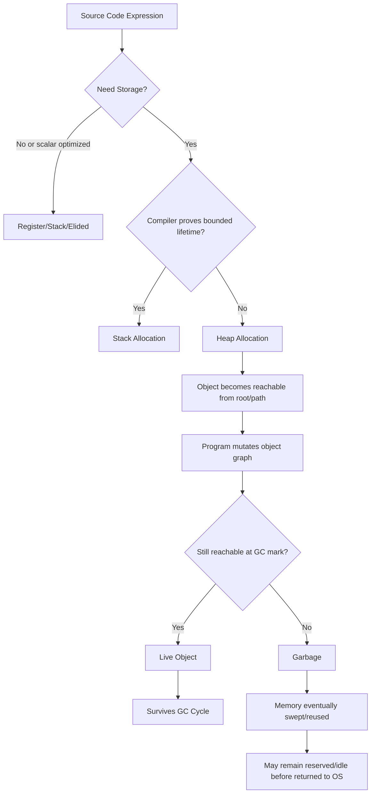
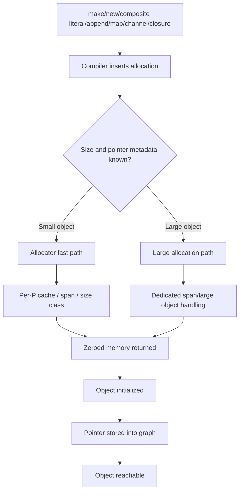
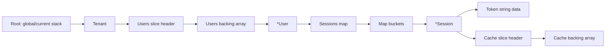
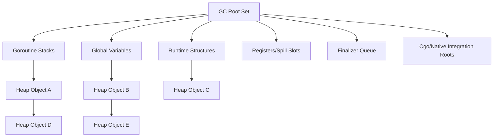
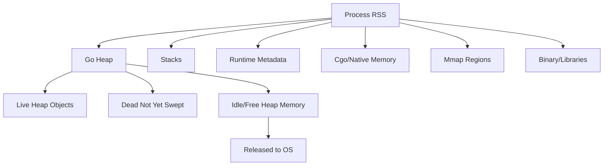
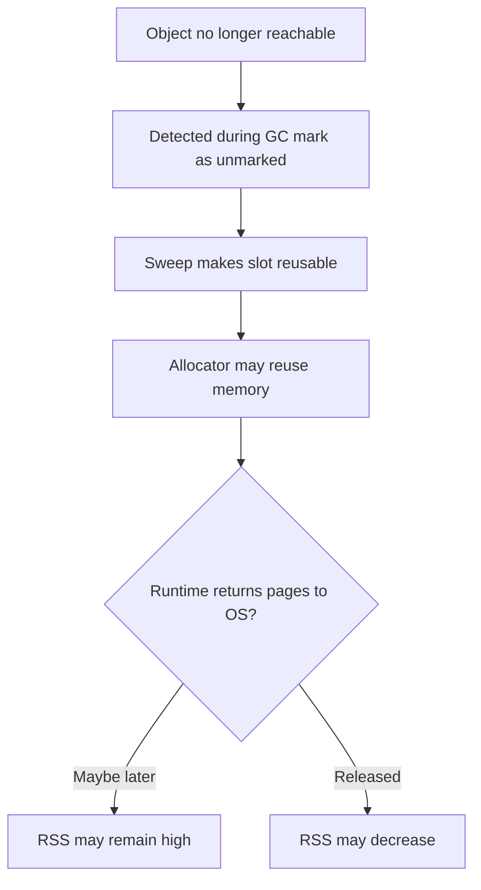

# learn-go-memory-systems-part-005.md

# Go Memory Management, Pointer, Byte & Bit, Buffer, Stream, Boxing/Unboxing, Off-Heap, Zero Copy, Garbage Collection

## Part 005 — Heap Allocation Lifecycle: Allocation Path, Object Graph, Liveness, Reachability

> Target pembaca: Java software engineer yang ingin memahami Go memory systems sampai level production engineering.
>
> Fokus part ini: memahami bagaimana object masuk heap, bagaimana runtime dan GC melihat object graph, mengapa reachable tidak sama dengan masih dibutuhkan bisnis, dan bagaimana membedakan allocation pressure, retention, leak, dan memory growth yang normal.

---

## Status Seri

File sebelumnya:

```text
learn-go-memory-systems-part-000.md
learn-go-memory-systems-part-001.md
learn-go-memory-systems-part-002.md
learn-go-memory-systems-part-003.md
learn-go-memory-systems-part-004.md
```

File ini:

```text
learn-go-memory-systems-part-005.md
```

File berikutnya:

```text
learn-go-memory-systems-part-006.md
```

Topik berikutnya:

```text
Escape analysis deep dive: why values escape, how to inspect, how not to over-optimize
```

Seri belum selesai.

---

## Prasyarat Mental Model Dari Part Sebelumnya

Sebelum masuk ke heap, kita sudah membangun beberapa invariant penting:

1. Go melakukan **pass-by-value**.
2. Value bisa berisi pointer ke storage lain.
3. Stack adalah tempat natural untuk local state yang lifetime-nya bisa dibuktikan pendek.
4. Heap dipakai ketika compiler/runtime perlu membuat object hidup lebih lama atau tidak bisa dibuktikan aman berada di stack.
5. Pointer bukan ownership.
6. Alias bukan bug otomatis, tetapi sumber retention dan coupling.
7. GC melihat **reachability**, bukan niat bisnis.

Part ini memperdalam poin 4 dan 7.

---

# 1. Kenapa Part Ini Penting?

Banyak engineer memulai diskusi heap dengan kalimat seperti:

> “Object ini ada di heap, berarti mahal.”

Kalimat itu terlalu dangkal.

Di production Go, pertanyaan yang lebih penting adalah:

1. **Mengapa object ini dialokasikan?**
2. **Berapa besar allocation rate-nya?**
3. **Berapa lama object ini reachable?**
4. **Dari root mana object ini reachable?**
5. **Apakah object ini masih berguna secara bisnis?**
6. **Apakah object ini hanya tertahan oleh cache, slice, closure, goroutine, map, channel, interface, atau global?**
7. **Apakah heap growth disebabkan oleh allocation pressure atau retention?**
8. **Apakah memory yang naik adalah Go heap, stack, metadata runtime, mmap, cgo, atau page cache?**

Tanpa pertanyaan ini, debugging memory hanya akan menjadi tebak-tebakan.

---

# 2. Definisi Inti

## 2.1 Allocation

**Allocation** adalah tindakan menyediakan storage untuk sebuah value/object.

Dalam Go, allocation bisa terjadi di:

1. Stack.
2. Heap.
3. Runtime-managed memory lain.
4. Native/unmanaged memory jika memakai cgo/mmap/syscall.

Part ini fokus ke heap Go.

---

## 2.2 Heap Object

Dalam konteks runtime Go, heap object adalah blok memory yang dikelola allocator dan GC Go.

Heap object bisa merepresentasikan:

1. Struct.
2. Array backing slice.
3. String backing data tertentu.
4. Closure environment.
5. Boxed/interface-related storage tertentu.
6. Map bucket.
7. Channel structure dan queue.
8. Runtime object internal.

Namun tidak semua value yang terlihat di source code adalah heap object.

Contoh:

```go
x := 10
```

`x` bisa tinggal di register atau stack.

Contoh lain:

```go
p := &User{Name: "A"}
```

`User` bisa masuk heap jika lifetime-nya escape dari frame fungsi atau compiler tidak bisa membuktikan sebaliknya.

---

## 2.3 Liveness

**Liveness** adalah status bahwa object masih dianggap hidup oleh runtime/GC karena masih reachable dari roots.

Liveness dalam konteks GC bukan berarti “masih akan dipakai oleh aplikasi”.

Object bisa:

- reachable, tetapi secara bisnis sudah tidak diperlukan;
- unreachable, tetapi memory-nya belum langsung dikembalikan ke OS;
- unreachable, tetapi belum disweep;
- dead secara bisnis, tetapi tetap live secara GC karena ada reference tertinggal.

---

## 2.4 Reachability

**Reachability** berarti ada path pointer dari root ke object.

Root dapat berupa:

1. Stack goroutine.
2. Global variable.
3. Runtime structure.
4. Register/spill slot yang diketahui compiler.
5. Finalizer queue.
6. Cgo-related roots tertentu.
7. Data structure internal runtime.

GC tidak bertanya:

> “Apakah object ini masih berguna?”

GC bertanya:

> “Apakah object ini masih bisa dicapai dari roots?”

---

## 2.5 Retention

**Retention** adalah kondisi ketika object tetap reachable lebih lama dari yang diperlukan.

Retention tidak selalu bug. Cache memang sengaja melakukan retention.

Retention menjadi masalah ketika:

1. Tidak dibatasi.
2. Tidak dipantau.
3. Tidak sesuai lifecycle bisnis.
4. Menahan backing array besar.
5. Menahan tree/map besar melalui pointer kecil.
6. Menghalangi GC mengurangi live heap.

---

## 2.6 Allocation Pressure

**Allocation pressure** adalah tekanan terhadap allocator dan GC akibat banyaknya byte/object baru yang dibuat per satuan waktu.

Service bisa punya:

- live heap kecil;
- memory leak tidak ada;
- tetapi CPU GC tinggi karena allocation rate besar.

Contoh:

```go
func handle(req Request) Response {
    buf := make([]byte, 0, 1024)
    // dibuat ribuan kali per detik
    _ = buf
    return Response{}
}
```

Jika `buf` selalu mati cepat, retained heap mungkin kecil. Tetapi allocation rate tetap besar.

---

# 3. Model Besar Heap Lifecycle

Diagram lifecycle umum:



Penting: heap allocation bukan akhir cerita. Setelah allocation, yang menentukan cost jangka panjang adalah:

1. Ukuran object.
2. Apakah object punya pointer.
3. Berapa lama object reachable.
4. Berapa banyak object sejenis dibuat per detik.
5. Apakah object menahan graph besar.
6. Bagaimana object terhubung ke roots.

---

# 4. Dari Source Code Ke Heap Object

## 4.1 Source Code Tidak Langsung Menentukan Stack/Heap

Di Java, `new User()` secara natural berarti object heap.

Di Go, ekspresi seperti ini:

```go
u := User{Name: "A"}
```

bisa berada di stack.

Ekspresi ini:

```go
u := &User{Name: "A"}
```

juga tidak otomatis berarti heap secara konseptual, walaupun sering escape dalam praktik tergantung pemakaian.

Compiler Go melakukan escape analysis untuk menentukan apakah storage perlu hidup lebih lama dari frame tertentu.

---

## 4.2 Contoh: Tidak Escape

```go
package main

type Point struct {
    X int
    Y int
}

func distanceSquared() int {
    p := Point{X: 3, Y: 4}
    return p.X*p.X + p.Y*p.Y
}
```

`p` tidak perlu heap. Compiler bisa menaruhnya di stack atau bahkan register/elide sepenuhnya.

---

## 4.3 Contoh: Escape Melalui Return Pointer

```go
func newPoint() *Point {
    p := Point{X: 3, Y: 4}
    return &p
}
```

`p` harus tetap valid setelah `newPoint` selesai. Karena frame `newPoint` hilang, storage untuk `p` harus dipindahkan ke heap atau dialokasikan di heap.

---

## 4.4 Contoh: Escape Melalui Interface

```go
func logAny(v any) {
    fmt.Println(v)
}

func f() {
    p := Point{X: 3, Y: 4}
    logAny(p)
}
```

Apakah `p` escape? Tergantung optimasi compiler, ukuran, penggunaan, inlining, dan apakah value perlu disimpan di interface dengan cara yang membutuhkan heap.

Yang penting bukan menghafal rule tunggal, tetapi memahami bahwa interface dapat menyembunyikan lifetime dan representasi concrete value.

---

## 4.5 Contoh: Escape Melalui Closure

```go
func counter() func() int {
    n := 0
    return func() int {
        n++
        return n
    }
}
```

`n` dipakai setelah `counter` selesai melalui closure. Karena itu environment closure perlu hidup di luar frame `counter`.

---

## 4.6 Contoh: Escape Melalui Goroutine

```go
func start() {
    buf := make([]byte, 1024)
    go func() {
        _ = buf
    }()
}
```

Goroutine bisa berjalan setelah `start` selesai. Closure menangkap `buf`, sehingga backing array dan header terkait bisa tertahan.

---

# 5. Allocation Path Secara Konseptual

Kita tidak perlu menghafal seluruh detail internal runtime, tetapi engineer production perlu tahu path konseptualnya.



Allocation path melibatkan beberapa konsep:

1. Size class.
2. Span.
3. Per-P cache.
4. Zeroing.
5. Pointer bitmap/type metadata.
6. Write barrier jika GC sedang berjalan.
7. Heap growth dan GC trigger.

Detail allocator akan dibahas lebih dalam di Part 007. Di part ini kita fokus lifecycle object setelah allocation.

---

# 6. Jenis Heap Object Yang Sering Muncul Di Go

## 6.1 Struct Object

```go
type User struct {
    ID   int64
    Name string
}

func NewUser(name string) *User {
    return &User{ID: 1, Name: name}
}
```

`User` berisi:

- `ID`: scalar non-pointer;
- `Name`: string header yang menunjuk byte data.

Jika `*User` masuk cache global, seluruh object tetap live. String data yang direferensikan oleh `Name` juga bisa ikut tertahan.

---

## 6.2 Slice Backing Array

```go
func load() []byte {
    b := make([]byte, 1<<20)
    return b[:10]
}
```

Walaupun return slice len 10, backing array 1 MiB tetap reachable karena slice header masih menunjuk ke array tersebut.

Ini contoh retention klasik.

---

## 6.3 Map Buckets

```go
var cache = map[string][]byte{}
```

Map adalah sumber retention yang kuat.

Jika entry tidak dihapus atau cache tidak dibatasi, object graph akan terus reachable dari global root `cache`.

---

## 6.4 Channel Queue

```go
jobs := make(chan []byte, 10000)
```

Buffered channel dapat menahan banyak object.

Jika setiap `[]byte` berisi backing array besar, channel menjadi retention queue.

---

## 6.5 Closure Environment

```go
func makeHandler(big []byte) func() {
    return func() {
        fmt.Println(len(big))
    }
}
```

Closure menyimpan captured variable. Selama function value reachable, `big` reachable.

---

## 6.6 Interface-Held Value

```go
var global any

type Payload struct {
    Data []byte
}

func store(p Payload) {
    global = p
}
```

`global` adalah root global. Concrete value di dalam interface bisa menahan `Data`, dan `Data` bisa menahan backing array besar.

---

## 6.7 Runtime/Internal Object

Contoh:

1. Goroutine descriptor.
2. Timer.
3. Channel internal.
4. Map bucket.
5. Stack memory classes.
6. Profiling/trace metadata.

Tidak semua memory Go terlihat sebagai object aplikasi langsung, tetapi tetap bagian dari memory process.

---

# 7. Object Graph

## 7.1 Apa Itu Object Graph?

Object graph adalah jaringan object yang saling menunjuk melalui pointer/reference-like field.

Contoh:

```go
type Tenant struct {
    ID    string
    Users []*User
}

type User struct {
    ID       string
    Sessions map[string]*Session
}

type Session struct {
    Token string
    Cache []byte
}
```

Jika ada root ke `Tenant`, maka path berikut membuat banyak object reachable:

```text
root -> Tenant -> Users slice -> User -> Sessions map -> Session -> Cache backing array
```

Diagram:



GC akan mempertahankan semua node reachable di graph itu.

---

## 7.2 Reachability Path Lebih Penting Daripada Ukuran Pointer

Satu pointer kecil bisa menahan object graph besar.

Contoh:

```go
type SmallHandle struct {
    id string
    ref *HugeIndex
}
```

Jika `SmallHandle` masuk global list, `HugeIndex` juga reachable.

Optimization yang hanya melihat ukuran struct `SmallHandle` akan salah. Yang penting adalah graph yang dipegangnya.

---

## 7.3 Object Graph Bisa Tidak Terlihat Dari API

```go
type Row struct {
    key []byte
}

func (r Row) Key() []byte {
    return r.key
}
```

API hanya terlihat mengembalikan key kecil. Namun `r.key` mungkin subslice dari buffer besar.

Retained graph:

```text
Row -> key slice -> huge input buffer
```

---

# 8. GC Roots

## 8.1 Apa Yang Termasuk Root?

Secara konseptual, roots adalah titik awal tracing GC.

Sumber root utama:

1. Stack goroutine aktif.
2. Global variables.
3. Runtime-managed structures.
4. Registers/spill slots yang diketahui compiler.
5. Finalizers.
6. Cgo handles/pointers tertentu.

Diagram:



---

## 8.2 Stack Sebagai Root

Local variable yang masih hidup di stack dapat menunjuk heap object.

```go
func handle() {
    data := make([]byte, 10<<20)
    doSomething(data)
    waitForSomething()
}
```

Jika compiler menganggap `data` masih live sampai akhir fungsi, backing array bisa tertahan lebih lama.

Kadang kita bisa membantu lifetime dengan memperkecil scope:

```go
func handle() {
    {
        data := make([]byte, 10<<20)
        doSomething(data)
    }
    waitForSomething()
}
```

Namun jangan mengandalkan block scope sebagai silver bullet. Compiler liveness analysis menentukan detail akhirnya.

---

## 8.3 Global Variable Sebagai Root

```go
var registry = map[string]*Handler{}
```

Selama program berjalan, `registry` reachable dari root global. Semua object yang tersambung dari map ini juga reachable.

Global map harus diperlakukan seperti long-lived heap root.

---

## 8.4 Goroutine Sebagai Retention Root

Goroutine yang blocked dapat menahan stack dan object yang direferensikan dari stack/closure.

```go
func leak(data []byte) {
    ch := make(chan struct{})
    go func() {
        <-ch
        fmt.Println(len(data))
    }()
}
```

Jika `ch` tidak pernah ditutup/dikirimi, goroutine tertahan. `data` juga tertahan.

Go 1.26 menambahkan deteksi runtime untuk beberapa pola leaked goroutine yang tidak mungkin unblock, tetapi itu bukan pengganti desain lifecycle yang benar.

---

# 9. Reachable Bukan Berarti Dibutuhkan

## 9.1 Contoh Cache Tidak Dibatasi

```go
var cache = map[string][]byte{}

func remember(key string, value []byte) {
    cache[key] = value
}
```

Dari sisi GC, tidak ada leak. Semua value masih reachable dari `cache`.

Dari sisi aplikasi, ini bisa memory leak karena tidak ada eviction policy.

---

## 9.2 Contoh Slice Retention

```go
func firstLine(file []byte) []byte {
    idx := bytes.IndexByte(file, '\n')
    if idx < 0 {
        return file
    }
    return file[:idx]
}
```

Jika `file` berukuran 500 MiB dan first line hanya 80 byte, return value tetap menahan backing array 500 MiB.

Solusi jika perlu memutus retention:

```go
func firstLineCopy(file []byte) []byte {
    idx := bytes.IndexByte(file, '\n')
    if idx < 0 {
        return bytes.Clone(file)
    }
    return bytes.Clone(file[:idx])
}
```

Copy kecil bisa lebih murah daripada retention besar.

---

## 9.3 Contoh Closure Retention

```go
func makeProcessor(buf []byte) func([]byte) error {
    return func(input []byte) error {
        // buf hanya dipakai untuk konfigurasi awal, tetapi tetap captured
        _ = len(buf)
        return nil
    }
}
```

Jika function value disimpan lama, `buf` ikut hidup lama.

Perbaikan: ekstrak informasi kecil yang benar-benar dibutuhkan.

```go
func makeProcessor(buf []byte) func([]byte) error {
    initialSize := len(buf)
    return func(input []byte) error {
        _ = initialSize
        return nil
    }
}
```

---

# 10. Empat Kategori Masalah Memory Yang Sering Tertukar

## 10.1 Allocation Pressure

Ciri:

- `alloc_space` tinggi.
- `alloc_objects` tinggi.
- `inuse_space` relatif stabil.
- GC CPU meningkat.
- Latency naik saat load tinggi.

Penyebab umum:

1. Banyak temporary object.
2. `fmt.Sprintf` di hot path.
3. Conversion `[]byte`/`string` berulang.
4. JSON encode/decode per request dengan `map[string]any`.
5. Membuat buffer baru per event.
6. Interface/reflect-heavy path.

Strategi:

1. Benchmark `-benchmem`.
2. Kurangi allocation di hot path.
3. Reuse buffer dengan ownership jelas.
4. Hindari conversion berulang.
5. Gunakan streaming decoder/encoder.

---

## 10.2 Retention Leak

Ciri:

- `inuse_space` naik terus.
- Heap object reachable dari root tertentu.
- GC berjalan tetapi tidak membebaskan banyak live heap.
- Ada cache/map/slice/goroutine/channel yang menahan object.

Penyebab umum:

1. Global map tidak dibersihkan.
2. Cache tanpa limit.
3. Subslice menahan backing array besar.
4. Goroutine leak.
5. Timer/ticker tidak dihentikan.
6. Context tidak dibatalkan.
7. Channel buffer menahan payload.

Strategi:

1. Ambil heap profile `inuse_space`.
2. Bandingkan snapshot before/after load.
3. Cari dominator/path retention secara konseptual.
4. Perbaiki ownership/lifecycle.
5. Tambahkan limit/eviction/cleanup.

---

## 10.3 Resource Leak

Ciri:

- Heap profile mungkin tidak besar.
- FD count naik.
- Connection count naik.
- Goroutine count naik.
- RSS naik karena native buffers/kernel resources.

Penyebab umum:

1. Response body tidak ditutup.
2. File tidak ditutup.
3. DB rows tidak ditutup.
4. Ticker tidak distop.
5. Native memory tidak di-free.
6. mmap tidak di-unmap.

Strategi:

1. Audit `Close` ownership.
2. Gunakan `defer` dengan hati-hati.
3. Monitor FD/goroutine/native memory.
4. Gunakan context timeout.

---

## 10.4 Normal Heap Growth / Runtime Reservation

Ciri:

- Heap pernah naik saat peak load.
- Setelah load turun, live heap turun, tetapi RSS tidak langsung turun.
- `heap_idle` dan `heap_released` perlu diperiksa.
- Tidak selalu leak.

Go runtime dapat menyimpan memory untuk reuse sebelum mengembalikannya ke OS.

Strategi:

1. Bedakan live heap vs RSS.
2. Lihat runtime metrics memory classes.
3. Jangan langsung menyimpulkan leak dari RSS.
4. Pahami container memory limit.

---

# 11. Live Heap vs Allocated Heap vs RSS

## 11.1 Live Heap

Live heap adalah object yang masih dianggap hidup oleh GC setelah mark phase.

Live heap dipengaruhi oleh reachability.

---

## 11.2 Allocated Heap / Allocation Rate

Allocation rate adalah total bytes/object yang dialokasikan dalam periode tertentu.

Object bisa mati cepat, tetapi allocation rate tetap membebani allocator dan GC.

---

## 11.3 RSS

RSS adalah physical memory process yang sedang resident menurut OS.

RSS mencakup lebih dari Go heap:

1. Go heap.
2. Goroutine stacks.
3. Runtime metadata.
4. Binary/text segment.
5. cgo/native memory.
6. mmap.
7. Thread stacks.
8. Page cache effects tertentu.

Karena itu:

```text
RSS != Go live heap
```

---

## 11.4 Diagram Perbedaan



---

# 12. Go GC Melihat Pointer, Bukan Object Semantik

## 12.1 Pointerful vs Pointer-Free Data

Object yang mengandung pointer perlu discan oleh GC.

Contoh pointerful:

```go
type User struct {
    Name string
    Tags []string
    Meta map[string]string
}
```

Contoh pointer-free:

```go
type Metric struct {
    Count uint64
    Sum   uint64
    Min   uint64
    Max   uint64
}
```

Pointer-free object biasanya lebih murah untuk scanning.

Ini bukan berarti semua harus dibuat pointer-free. Tetapi data structure hot path sebaiknya sadar pointer density.

---

## 12.2 Pointer Graph Density

Dua struktur bisa punya ukuran byte mirip tetapi cost GC berbeda.

```go
type A struct {
    X [1024]byte
}

type B struct {
    P [128]*byte
}
```

`B` memiliki banyak pointer yang perlu diproses sebagai bagian dari graph.

---

## 12.3 Pointer Chasing vs Locality

Object graph yang tersebar:

```text
Order -> Customer -> Address -> Country -> Config -> Metadata
```

bisa lebih buruk untuk cache locality dan GC scanning dibanding struktur yang lebih contiguous.

Untuk hot path, kadang desain data lebih penting daripada micro-optimization function.

---

# 13. Allocation Sources Dalam Kode Go

## 13.1 `new`

```go
p := new(User)
```

`new(T)` menghasilkan `*T` ke zero value `T`.

Apakah alokasi heap? Tergantung escape.

---

## 13.2 Composite Literal Dengan Pointer

```go
p := &User{Name: "A"}
```

Sering dipakai untuk constructor-like function.

Tetap tergantung escape.

---

## 13.3 `make` Slice

```go
b := make([]byte, 1024)
```

Slice header bisa di stack, tetapi backing array bisa stack atau heap tergantung escape dan ukuran.

---

## 13.4 `make` Map

```go
m := make(map[string]int)
```

Map runtime structure dan bucket allocation dikelola runtime. Map mudah menjadi sumber retention.

---

## 13.5 `make` Channel

```go
ch := make(chan []byte, 100)
```

Channel buffer dapat menahan element. Jika element berisi pointer/slice, graph bisa besar.

---

## 13.6 `append`

```go
s = append(s, x)
```

`append` bisa:

1. Menulis ke backing array lama jika kapasitas cukup.
2. Mengalokasikan backing array baru jika kapasitas tidak cukup.
3. Copy element lama ke backing array baru.

---

## 13.7 String/Byte Conversion

```go
s := string(b)
b2 := []byte(s)
```

Conversion umum ini biasanya copy untuk menjaga immutability dan safety.

---

## 13.8 Formatting

```go
msg := fmt.Sprintf("user=%s id=%d", name, id)
```

`fmt` fleksibel tetapi allocation-heavy untuk hot path.

---

## 13.9 JSON/XML/Reflection

```go
json.Marshal(v)
json.Unmarshal(data, &v)
```

Encoding/decoding sering membuat allocation untuk object graph, string, map, slice, reflect metadata path, dan temporary buffer.

---

## 13.10 Goroutine dan Closure

```go
go func() {
    use(x)
}()
```

Captured variable bisa membuat environment escape.

---

# 14. Retention Path Pattern

## 14.1 Global Cache

```go
var byID = map[string]*User{}
```

Path:

```text
global -> map -> buckets -> User -> fields -> more objects
```

Mitigasi:

1. TTL.
2. LRU/LFU.
3. Size limit.
4. Explicit delete.
5. Sharding dengan lifecycle clear.
6. Metrics cache size dan byte size.

---

## 14.2 Subslice Retention

```go
small := big[:10]
```

Path:

```text
small slice header -> big backing array
```

Mitigasi:

```go
small = append([]byte(nil), big[:10]...)
```

atau:

```go
small = bytes.Clone(big[:10])
```

---

## 14.3 Map Value Retention Setelah Delete Partial

```go
delete(m, key)
```

Delete menghapus entry, tetapi map bucket memory mungkin tidak menyusut seperti yang diharapkan. Jika banyak churn, map bisa mempertahankan bucket capacity.

Mitigasi:

1. Rebuild map periodik.
2. Gunakan bounded cache.
3. Shard dan rotate shard.
4. Ukur sebelum optimasi.

---

## 14.4 Channel Buffer Retention

```go
queue := make(chan *Request, 100000)
```

Jika consumer lambat, queue menahan banyak request.

Mitigasi:

1. Bounded queue kecil.
2. Backpressure.
3. Drop policy eksplisit.
4. Deadline/cancellation.
5. Per-request payload size limit.

---

## 14.5 Timer/Ticker Retention

```go
ticker := time.NewTicker(time.Second)
```

Ticker harus distop jika lifecycle selesai.

```go
defer ticker.Stop()
```

Timer/ticker yang tidak dihentikan bisa mempertahankan runtime resources dan goroutine/path tertentu.

---

## 14.6 Context Retention

```go
ctx = context.WithValue(ctx, "payload", hugePayload)
```

Context bukan tempat untuk payload besar.

Context chain dapat menahan value sampai seluruh chain tidak reachable.

Mitigasi:

1. Simpan hanya request-scoped metadata kecil.
2. Jangan simpan buffer besar.
3. Cancel context.
4. Jangan simpan context dalam struct long-lived sembarangan.

---

## 14.7 Logger Field Retention

Structured logger yang menyimpan field object besar dalam closure/context dapat menahan graph.

Contoh buruk:

```go
logger := base.With("request", req)
```

Lebih baik simpan scalar:

```go
logger := base.With("request_id", req.ID)
```

---

# 15. Liveness Dalam Fungsi

## 15.1 Local Variable Bisa Mati Sebelum Function Return

Compiler dapat menentukan variable tidak lagi live sebelum akhir fungsi.

Contoh:

```go
func process() {
    buf := make([]byte, 10<<20)
    parse(buf)
    compute()
}
```

Secara source code, `buf` masih berada dalam scope sampai function selesai. Tetapi compiler mungkin tahu `buf` tidak dipakai setelah `parse`.

Namun jangan bergantung pada asumsi manual. Jika memory penting, ukur dengan profile.

---

## 15.2 Scope Block Bisa Membantu Readability Lifetime

```go
func process() {
    {
        buf := make([]byte, 10<<20)
        parse(buf)
    }

    compute()
}
```

Block scope memberi sinyal kepada pembaca bahwa `buf` tidak boleh dipakai setelah parse.

Ini bagus untuk desain, walaupun bukan guarantee utama performa.

---

## 15.3 Set Nil Untuk Memutus Retention?

Kadang kita melihat:

```go
buf = nil
```

Ini bisa berguna dalam fungsi long-running atau loop besar jika reference tidak diperlukan lagi dan compiler tidak membuktikan liveness lebih pendek.

Namun ini bukan pattern default. Jika sering butuh `nil` manual, desain lifecycle mungkin kurang jelas.

Gunakan jika:

1. Buffer sangat besar.
2. Function masih berjalan lama setelah buffer selesai dipakai.
3. Profile menunjukkan retention.
4. Refactor scope tidak cukup atau tidak praktis.

---

# 16. Object Death Tidak Langsung Berarti Memory Kembali Ke OS

## 16.1 Tahapan Setelah Object Tidak Reachable



Unreachable object menjadi garbage. Tetapi memory fisik tidak selalu langsung turun.

Go runtime sering mempertahankan memory untuk reuse.

---

## 16.2 Kenapa RSS Tidak Turun?

Kemungkinan:

1. Memory masih live.
2. Memory sudah free di Go heap tetapi belum released ke OS.
3. Memory bukan Go heap.
4. Fragmentation.
5. Native/mmap memory.
6. Page cache/kernel accounting.
7. Container metric yang dilihat bukan metric yang tepat.

---

# 17. Contoh Kasus: Service Dengan Heap Stabil Tetapi GC Tinggi

## 17.1 Kode

```go
func handle(input []byte) error {
    for _, item := range strings.Split(string(input), "\n") {
        msg := fmt.Sprintf("item=%s", item)
        _ = msg
    }
    return nil
}
```

Masalah:

1. `string(input)` copy.
2. `strings.Split` membuat slice/string header banyak.
3. `fmt.Sprintf` allocation per item.
4. Temporary object mati cepat.

Symptom:

- `inuse_space` stabil.
- `alloc_space` tinggi.
- GC frequency tinggi.
- CPU naik saat throughput naik.

Perbaikan konseptual:

1. Parse `[]byte` langsung.
2. Hindari split full jika bisa streaming.
3. Hindari `fmt.Sprintf` di hot loop.
4. Reuse buffer jika benar-benar perlu.

---

# 18. Contoh Kasus: Service Dengan Heap Naik Karena Retention

## 18.1 Kode

```go
type Server struct {
    recent [][]byte
}

func (s *Server) Remember(payload []byte) {
    s.recent = append(s.recent, payload[:32])
}
```

Jika `payload` adalah buffer 5 MiB, maka setiap `payload[:32]` menahan 5 MiB.

Perbaikan:

```go
func (s *Server) Remember(payload []byte) {
    key := bytes.Clone(payload[:32])
    s.recent = append(s.recent, key)
}
```

Copy 32 byte menyelamatkan retention 5 MiB.

---

# 19. Contoh Kasus: Goroutine Leak Menahan Heap

```go
func watch(ctx context.Context, payload []byte) {
    go func() {
        <-ctx.Done()
        fmt.Println(len(payload))
    }()
}
```

Jika context tidak pernah dibatalkan, goroutine hidup lama dan `payload` tertahan.

Perbaikan:

1. Pastikan cancel dipanggil.
2. Jangan capture payload besar jika tidak perlu.
3. Capture scalar saja.
4. Monitor goroutine count.

```go
func watch(ctx context.Context, payload []byte) {
    size := len(payload)
    go func() {
        <-ctx.Done()
        fmt.Println(size)
    }()
}
```

---

# 20. Contoh Kasus: Channel Queue Menahan Request

```go
type Request struct {
    Body []byte
}

queue := make(chan Request, 10000)
```

Jika rata-rata `Body` 512 KiB, queue penuh bisa menahan:

```text
10000 * 512 KiB = sekitar 5 GiB
```

Walaupun service “hanya queue”, memory retention sangat besar.

Design yang lebih aman:

1. Limit body size.
2. Queue kecil.
3. Backpressure ke client/upstream.
4. Store large payload di file/object storage sementara.
5. Queue metadata, bukan body besar.

---

# 21. Java Engineer Translation

## 21.1 Java Object Heap vs Go Heap

Di Java, sebagian besar object hasil `new` berada di heap JVM.

Di Go:

- source-level object tidak otomatis heap;
- compiler bisa stack allocate;
- escape analysis lebih terlihat di workflow performance;
- value semantics membuat copy/aliasing perlu dibaca lebih teliti.

---

## 21.2 Java GC Root vs Go GC Root

Konsep root mirip:

- thread stack/goroutine stack;
- static/global variables;
- runtime structures;
- JNI/cgo related roots.

Namun detail runtime berbeda.

---

## 21.3 Java Retention Leak vs Go Retention Leak

Konsep sama:

```text
object masih reachable dari root, jadi GC tidak membebaskan
```

Perbedaannya, Go punya pattern retention yang sering muncul melalui:

1. Slice backing array.
2. Closure capture.
3. Goroutine leak.
4. Channel buffer.
5. Map bucket behavior.
6. Interface holding graph.
7. Context value misuse.

---

## 21.4 DirectByteBuffer vs Go Off-Heap

Java punya `ByteBuffer.allocateDirect` sebagai API umum off-heap-ish.

Go tidak punya direct equivalent yang idiomatis dalam standard library untuk semua use case. Go off-heap biasanya lewat mmap/cgo/syscall, dengan ownership manual dan risiko lebih besar.

Part off-heap akan dibahas khusus di Part 023.

---

# 22. Heap Allocation Dan API Design

## 22.1 API Yang Mengambil Ownership

```go
func Store(key string, value []byte)
```

Kontrak ini ambigu:

- Apakah `Store` akan copy `value`?
- Apakah caller boleh mutate setelah call?
- Apakah `Store` menyimpan slice header saja?
- Berapa lama value disimpan?

Kontrak lebih jelas:

```go
// Store copies value before retaining it.
func Store(key string, value []byte)
```

atau:

```go
// StoreOwned takes ownership of value. Caller must not mutate value after call.
func StoreOwned(key string, value []byte)
```

---

## 22.2 API Yang Mengembalikan Borrowed View

```go
func (p *Parser) CurrentFrame() []byte
```

Apakah return slice valid setelah `Next()`?

Lebih jelas:

```go
// CurrentFrame returns a borrowed view valid until the next call to Next.
func (p *Parser) CurrentFrame() []byte
```

atau:

```go
// CurrentFrameCopy returns an owned copy safe to retain.
func (p *Parser) CurrentFrameCopy() []byte
```

---

## 22.3 Copy Boundary Sebagai Desain

Copy bukan selalu buruk. Copy adalah boundary ownership.

Gunakan copy untuk:

1. Memutus retention dari buffer besar.
2. Melindungi immutability semantic.
3. Menghindari data race.
4. Menyederhanakan lifecycle.
5. Menstabilkan API publik.

Hindari copy ketika:

1. Data besar.
2. Lifetime pendek dan jelas.
3. API internal hot path.
4. Ownership bisa dibuktikan.
5. Profil menunjukkan copy dominan.

---

# 23. Heap Dan Concurrency

## 23.1 Shared Heap Object

```go
type State struct {
    Count int
}

var s = &State{}
```

Heap object shared antar goroutine perlu sinkronisasi jika mutable.

Memory management dan concurrency tidak bisa dipisah:

- shared pointer memperluas lifetime;
- shared mutable object butuh lock/atomic/channel;
- long-lived goroutine bisa menahan object;
- channel buffer bisa menjadi heap retention queue.

---

## 23.2 Ownership Transfer Via Channel

```go
ch <- buf
```

Apakah setelah mengirim `buf`, sender masih boleh mutate?

Harus ada kontrak:

1. Send transfers ownership.
2. Sender must not touch after send.
3. Receiver owns until returned/released.

Tanpa kontrak ini, zero-copy pipeline mudah menjadi data race/corruption.

---

## 23.3 Shared Cache

Cache long-lived adalah root kuat.

Cache harus punya:

1. Size limit.
2. Eviction.
3. Metrics.
4. Clear lifecycle.
5. Backpressure/fallback.
6. Key/value memory estimate.

---

# 24. Heap Dan GC Pacer Secara High-Level

Detail GC akan dibahas di Part 026, tetapi part ini perlu memahami trigger dasar.

Go GC dipengaruhi oleh:

1. Live heap.
2. Allocation rate.
3. GC roots.
4. `GOGC`.
5. Memory limit (`GOMEMLIMIT`/`SetMemoryLimit`).

Secara konseptual:

```text
semakin besar allocation rate -> GC lebih sering
semakin besar live heap -> mark work lebih besar
semakin banyak pointer/root -> scanning lebih mahal
```

Jadi optimasi heap bukan hanya mengurangi byte. Kadang yang lebih penting:

1. Mengurangi pointer count.
2. Mengurangi object count.
3. Mengurangi allocation churn.
4. Mengurangi graph retention.
5. Mengurangi goroutine stack roots.

---

# 25. Observability Dasar Untuk Heap Lifecycle

## 25.1 Pertanyaan Saat Memory Naik

Saat memory naik, jangan langsung bertanya:

> “GC kenapa tidak jalan?”

Tanya secara berurutan:

1. Memory apa yang naik? RSS, heap live, heap sys, stack, native, mmap?
2. Apakah allocation rate naik?
3. Apakah in-use heap naik?
4. Apakah goroutine count naik?
5. Apakah channel queue/map/cache membesar?
6. Apakah ada request body/file dibaca penuh?
7. Apakah ada native allocation?
8. Apakah terjadi peak load normal?
9. Apakah memory turun setelah traffic turun?
10. Apakah runtime mengembalikan memory ke OS?

---

## 25.2 Heap Profile Modes

Heap profile biasanya dianalisis dengan dua perspektif:

1. `inuse_space`: memory yang masih live/in-use saat profile.
2. `alloc_space`: total allocation historical/sample.

Gunakan:

- `inuse_space` untuk retention/leak.
- `alloc_space` untuk allocation pressure.

---

## 25.3 Minimal Debug Workflow

```text
1. Reproduce under realistic load.
2. Capture baseline heap profile.
3. Run workload.
4. Capture heap profile during/after pressure.
5. Compare inuse_space.
6. Compare alloc_space.
7. Check goroutine profile.
8. Check runtime metrics memory classes.
9. Inspect top retaining paths conceptually.
10. Fix lifecycle/ownership/allocation source.
11. Re-run and compare.
```

---

# 26. Practical Commands

## 26.1 Benchmark Allocation

```bash
go test ./... -bench . -benchmem
```

---

## 26.2 Escape Analysis Preview

```bash
go test ./... -gcflags='all=-m'
```

Lebih detail:

```bash
go test ./... -gcflags='all=-m=2'
```

Output escape analysis bisa noisy. Gunakan untuk investigasi, bukan sebagai satu-satunya sumber kebenaran.

---

## 26.3 Heap Profile Dari Test

```bash
go test ./... -run '^$' -bench BenchmarkX -benchmem -memprofile mem.out
```

Analyze:

```bash
go tool pprof mem.out
```

Dalam pprof:

```text
top
list FunctionName
web
```

---

## 26.4 Runtime pprof HTTP

```go
import _ "net/http/pprof"
```

Lalu expose server debug secara aman hanya untuk environment internal.

```go
go func() {
    _ = http.ListenAndServe("127.0.0.1:6060", nil)
}()
```

Ambil heap:

```bash
curl -o heap.out http://127.0.0.1:6060/debug/pprof/heap
```

Analyze:

```bash
go tool pprof heap.out
```

Jangan expose pprof publik tanpa proteksi.

---

# 27. Runtime Metrics Yang Relevan

Part 029 akan membahas runtime metrics mendalam. Untuk sekarang, tahu dulu kategori penting:

1. Heap objects bytes.
2. Heap free bytes.
3. Heap released bytes.
4. Heap stacks bytes.
5. Total memory classes.
6. GC cycles.
7. GC CPU fraction.
8. Goroutine count.
9. Allocation bytes/object.

Konseptual reading:

| Symptom | Kemungkinan |
|---|---|
| `alloc_space` tinggi, `inuse_space` stabil | allocation pressure |
| `inuse_space` naik terus | retention/leak |
| RSS naik, Go heap stabil | native/mmap/page cache/runtime memory |
| goroutine count naik | goroutine leak bisa menahan heap |
| heap released rendah | runtime belum mengembalikan memory ke OS |
| object count tinggi | banyak object kecil; GC metadata/scanning pressure |

---

# 28. Design Checklist: Heap Lifecycle

Gunakan checklist ini saat code review.

## 28.1 Allocation Source

Tanyakan:

1. Apakah allocation ini perlu?
2. Apakah terjadi per request/per item/per byte/per loop?
3. Apakah ada conversion `[]byte`/`string`?
4. Apakah ada `fmt` di hot path?
5. Apakah ada `map[string]any`/reflection?
6. Apakah buffer bisa diberikan caller?
7. Apakah streaming lebih tepat daripada buffering?

---

## 28.2 Lifetime

Tanyakan:

1. Siapa owner object ini?
2. Kapan object ini boleh mati?
3. Root apa yang membuat object reachable?
4. Apakah object disimpan di global/cache/map/channel?
5. Apakah goroutine/closure menahan object?
6. Apakah context menyimpan object besar?
7. Apakah object keluar dari scope terlalu luas?

---

## 28.3 Retention

Tanyakan:

1. Apakah slice kecil menahan backing array besar?
2. Apakah map/cache punya limit?
3. Apakah channel buffer bisa penuh dengan object besar?
4. Apakah field kecil menahan graph besar?
5. Apakah logger/context menyimpan request besar?
6. Apakah timer/ticker dihentikan?
7. Apakah response/file/body ditutup?

---

## 28.4 Observability

Tanyakan:

1. Apakah ada metric heap/RSS/goroutine?
2. Apakah ada pprof internal?
3. Apakah cache size terukur?
4. Apakah queue depth terukur?
5. Apakah allocation regression bisa diuji?
6. Apakah benchmark punya `-benchmem`?

---

# 29. Anti-Pattern Dalam Heap Lifecycle

## 29.1 “Pointer Supaya Tidak Copy”

Pointer mengurangi copy tertentu, tetapi:

1. Menambah aliasing.
2. Bisa menyebabkan escape.
3. Memperpanjang lifetime.
4. Menambah GC scanning.
5. Membuat concurrency lebih berisiko.

Untuk struct kecil, value copy sering lebih baik.

---

## 29.2 “GC Akan Bereskan Semuanya”

GC hanya membebaskan unreachable heap object.

GC tidak otomatis:

1. Menghapus cache.
2. Menutup file.
3. Menutup response body.
4. Meng-unmap mmap.
5. Menghentikan goroutine.
6. Mengurangi queue.
7. Membatalkan context.
8. Membebaskan native memory tanpa owner.

---

## 29.3 “Zero-Copy Selalu Lebih Baik”

Zero-copy sering berarti shared backing storage.

Shared backing storage berarti:

1. Retention lebih mungkin.
2. Mutability hazard.
3. Lifetime coupling.
4. Data race risk.
5. API contract lebih kompleks.

Copy kecil sering lebih production-safe.

---

## 29.4 “RSS Naik Berarti Leak”

Belum tentu.

Cek dulu:

1. Go live heap.
2. Heap idle/released.
3. Runtime memory classes.
4. Stack memory.
5. Native/mmap memory.
6. Workload peak.
7. Container metrics.

---

## 29.5 “sync.Pool Akan Mengurangi Semua Memory Problem”

`sync.Pool` bisa membantu allocation pressure, tetapi bisa memperburuk retention jika object besar dipool sembarangan atau reset tidak benar.

Part 031 akan membahas pool secara khusus.

---

# 30. Case Study Mini: Binary Parser

## 30.1 Versi Bermasalah

```go
type Frame struct {
    Header []byte
    Body   []byte
}

func Parse(input []byte) []Frame {
    var frames []Frame
    for len(input) > 0 {
        header := input[:8]
        size := int(binary.BigEndian.Uint32(header[4:8]))
        body := input[8 : 8+size]
        frames = append(frames, Frame{Header: header, Body: body})
        input = input[8+size:]
    }
    return frames
}
```

Masalah:

1. Setiap `Frame` menahan slice ke `input` besar.
2. Jika hanya butuh frame tertentu, seluruh input tetap tertahan.
3. `frames` bisa membesar tanpa batas.
4. Tidak ada validasi size.

---

## 30.2 Versi Dengan Ownership Lebih Jelas

```go
type Frame struct {
    Header [8]byte
    Body   []byte
}

func ParseCopy(input []byte) ([]Frame, error) {
    var frames []Frame

    for len(input) > 0 {
        if len(input) < 8 {
            return nil, io.ErrUnexpectedEOF
        }

        var header [8]byte
        copy(header[:], input[:8])

        size := int(binary.BigEndian.Uint32(header[4:8]))
        if size < 0 || size > 1<<20 {
            return nil, fmt.Errorf("invalid frame size: %d", size)
        }
        if len(input) < 8+size {
            return nil, io.ErrUnexpectedEOF
        }

        body := bytes.Clone(input[8 : 8+size])
        frames = append(frames, Frame{Header: header, Body: body})
        input = input[8+size:]
    }

    return frames, nil
}
```

Trade-off:

- Ada copy body.
- Tetapi setiap frame owned dan tidak menahan input besar.
- Lebih aman untuk disimpan lama.

---

## 30.3 Versi Streaming/Borrowed View

```go
type FrameView struct {
    Header []byte
    Body   []byte
}

type Handler func(FrameView) error

func WalkFrames(input []byte, h Handler) error {
    for len(input) > 0 {
        if len(input) < 8 {
            return io.ErrUnexpectedEOF
        }

        header := input[:8]
        size := int(binary.BigEndian.Uint32(header[4:8]))
        if size < 0 || size > 1<<20 {
            return fmt.Errorf("invalid frame size: %d", size)
        }
        if len(input) < 8+size {
            return io.ErrUnexpectedEOF
        }

        view := FrameView{
            Header: header,
            Body:   input[8 : 8+size],
        }

        if err := h(view); err != nil {
            return err
        }

        input = input[8+size:]
    }
    return nil
}
```

Kontrak:

- `FrameView` borrowed.
- Handler tidak boleh menyimpan view setelah return kecuali copy.
- Lebih efisien untuk streaming processing.
- Lebih berbahaya jika kontrak dilanggar.

---

# 31. Mental Model: Heap Sebagai Graph, Bukan Gudang Object

Cara pemula melihat heap:

```text
heap = tempat object besar tinggal
```

Cara engineer senior melihat heap:

```text
heap = graph object dengan lifetime, reachability, root path, allocation rate, pointer density, dan retention behavior
```

Cara production engineer melihat heap:

```text
heap = resource dinamis yang harus punya budget, observability, ownership contract, failure mode, dan operational playbook
```

---

# 32. Latihan Mandiri

## Latihan 1 — Identifikasi Retention

Apa masalah di kode ini?

```go
func ExtractToken(header []byte) []byte {
    parts := bytes.Split(header, []byte(" "))
    if len(parts) != 2 {
        return nil
    }
    return parts[1]
}
```

Pertanyaan:

1. Apakah return value menahan seluruh `header`?
2. Kapan itu masalah?
3. Apakah perlu copy?
4. Bagaimana kontrak API yang jelas?

---

## Latihan 2 — Allocation Pressure

Analisis kode berikut:

```go
func BuildLines(items []int) []string {
    out := make([]string, 0, len(items))
    for _, item := range items {
        out = append(out, fmt.Sprintf("item=%d", item))
    }
    return out
}
```

Pertanyaan:

1. Allocation apa saja yang mungkin terjadi?
2. Apakah ini buruk jika dipanggil jarang?
3. Apakah buruk jika dipanggil 100 ribu kali/detik?
4. Alternatif apa yang lebih baik untuk hot path?

---

## Latihan 3 — Goroutine Retention

```go
func Start(data []byte) chan struct{} {
    done := make(chan struct{})
    go func() {
        <-done
        fmt.Println(len(data))
    }()
    return done
}
```

Pertanyaan:

1. Siapa owner `data`?
2. Berapa lama `data` reachable?
3. Apa yang terjadi jika caller lupa close `done`?
4. Bagaimana memperbaiki desain?

---

## Latihan 4 — Cache Policy

Desain cache untuk response 1 MiB per key.

Pertanyaan:

1. Berapa maksimal entries?
2. Apakah TTL cukup?
3. Apakah perlu max byte size?
4. Apa metric wajib?
5. Apa yang terjadi saat cache miss storm?
6. Apakah cache menyimpan owned copy atau borrowed slice?

---

# 33. Jawaban Ringkas Latihan

## Jawaban Latihan 1

`parts[1]` adalah subslice dari `header`. Jika `header` besar dan token kecil disimpan lama, seluruh backing array `header` tertahan. Copy diperlukan jika return value akan disimpan melewati lifetime header.

API bisa dibagi:

```go
func ExtractTokenView(header []byte) []byte
func ExtractTokenCopy(header []byte) []byte
```

---

## Jawaban Latihan 2

`fmt.Sprintf` kemungkinan membuat allocation per item. Output `[]string` juga menyimpan banyak string. Jika dipanggil jarang, tidak masalah. Jika hot path, gunakan `strconv.AppendInt` dengan buffer, streaming writer, atau desain output yang tidak mengharuskan semua string disimpan.

---

## Jawaban Latihan 3

Closure menahan `data` sampai goroutine selesai. Jika `done` tidak pernah ditutup/dikirim, goroutine dan data tertahan. Perbaiki dengan context, timeout, explicit lifecycle, atau capture `len(data)` saja jika hanya size yang dibutuhkan.

---

## Jawaban Latihan 4

Cache wajib punya max entries dan max bytes. TTL saja tidak cukup jika traffic tinggi dalam window pendek. Metric wajib: entries, approximate bytes, hit/miss, eviction, load latency, inflight load, error. Cache harus jelas menyimpan owned copy atau mengambil ownership.

---

# 34. Production Review Template

Gunakan template ini untuk review desain yang menyentuh heap.

```markdown
## Heap Lifecycle Review

### Allocation Source
- Where are allocations created?
- Are allocations per request, per item, per byte, or per batch?
- Are there hidden allocations from conversions, formatting, reflection, interface, append?

### Ownership
- Who owns each buffer/object?
- Is ownership transferred, borrowed, or copied?
- Is mutation allowed after transfer?

### Lifetime
- How long should the object live semantically?
- What root/path can keep it alive?
- Is the source scope wider than necessary?

### Retention Risk
- Can a small view retain a large backing array?
- Can map/cache/channel/closure/goroutine retain it?
- Is there a cleanup or eviction path?

### Memory Budget
- What is max object size?
- What is max queue depth?
- What is max cache bytes?
- What happens at limit?

### Observability
- What metrics expose memory growth?
- Is pprof available internally?
- Are goroutine count and queue depth monitored?
- Is allocation regression tested?

### Failure Mode
- What happens under slow consumer?
- What happens under huge input?
- What happens under cancellation?
- What happens under repeated errors?
```

---

# 35. Key Takeaways

1. Heap object hidup karena reachable, bukan karena masih berguna.
2. Reachability path lebih penting daripada ukuran pointer.
3. Allocation pressure dan retention leak adalah masalah berbeda.
4. Live heap kecil tidak berarti allocation murah.
5. RSS naik tidak otomatis berarti Go heap leak.
6. Slice, map, channel, closure, goroutine, context, logger, dan cache adalah sumber retention umum.
7. Copy kecil kadang lebih murah daripada zero-copy yang menahan buffer besar.
8. API harus menjelaskan ownership: borrowed, copied, atau transferred.
9. GC tidak menutup resource dan tidak membersihkan cache semantik.
10. Production memory work dimulai dari observability, bukan tuning.

---

# 36. Koneksi Ke Part Berikutnya

Part ini menjelaskan apa yang terjadi setelah object masuk heap dan bagaimana object tetap hidup.

Part berikutnya akan menjawab pertanyaan:

```text
Mengapa object tertentu masuk heap sejak awal?
```

Kita akan masuk ke:

```text
learn-go-memory-systems-part-006.md
```

Topik:

```text
Escape analysis deep dive: why values escape, how to inspect, how not to over-optimize
```

Kita akan membahas:

1. Cara compiler membuktikan lifetime.
2. Pola umum escape.
3. Cara membaca `-gcflags=-m`.
4. Kenapa output escape analysis bisa berubah antar versi Go.
5. Bagaimana mengurangi heap allocation tanpa merusak desain.
6. Kapan menerima escape sebagai trade-off yang benar.

---

# 37. Referensi Resmi Dan Relevan

Referensi utama untuk bagian ini:

1. Go GC Guide — menjelaskan model tracing GC, live heap, allocation rate, roots, dan hubungan GC dengan memory limit.
   - https://go.dev/doc/gc-guide
2. Go Diagnostics — menjelaskan heap profile, goroutine profile, trace, dan tooling observability.
   - https://go.dev/doc/diagnostics
3. runtime/metrics — menyediakan metric memory classes, heap objects, heap released, heap stacks, dan runtime memory accounting.
   - https://pkg.go.dev/runtime/metrics
4. runtime/pprof — dokumentasi profiling Go program.
   - https://pkg.go.dev/runtime/pprof
5. Go 1.26 Release Notes — target versi seri ini dan perubahan runtime modern.
   - https://go.dev/doc/go1.26
6. Go 1.26 Blog — ringkasan release Go 1.26 termasuk perubahan runtime/GC.
   - https://go.dev/blog/go1.26

---

# 38. Checklist Sebelum Lanjut

Pastikan Anda bisa menjawab tanpa menghafal:

1. Apa bedanya allocation pressure dan retention leak?
2. Kenapa reachable tidak sama dengan useful?
3. Bagaimana slice kecil bisa menahan backing array besar?
4. Kenapa goroutine leak bisa menjadi memory leak?
5. Apa bedanya `alloc_space` dan `inuse_space`?
6. Kenapa RSS bisa tinggi walaupun Go heap tidak besar?
7. Kenapa copy kecil kadang lebih baik daripada zero-copy?
8. Apa saja root utama dalam tracing GC?
9. Mengapa map/cache/channel adalah retention source?
10. Bagaimana menulis API buffer dengan ownership yang jelas?

Jika sudah, lanjut ke Part 006.


<!-- NAVIGATION_FOOTER -->
<div class="page-nav">
<a href="./learn-go-memory-systems-part-004.md">⬅️ Go Memory Systems — Part 004</a>
<a href="./index.md">📚 Kategori</a>
<a href="../../index.md">🏠 Home</a>
<a href="./learn-go-memory-systems-part-006.md">Go Memory Systems Part 006 — Escape Analysis Deep Dive ➡️</a>
</div>
