# learn-go-memory-systems-part-006.md

# Go Memory Systems Part 006 — Escape Analysis Deep Dive

> Seri: `learn-go-memory-systems`  
> Part: `006`  
> Topik: Escape analysis deep dive: why values escape, how to inspect, how not to over-optimize  
> Target pembaca: Java software engineer yang ingin memahami Go memory behavior sampai level production engineering  
> Target versi: Go 1.26.x  

---

## 0. Posisi Part Ini Dalam Seri

Pada part sebelumnya kita sudah membangun fondasi:

1. **Part 000**: mental model umum Go memory systems.
2. **Part 001**: memory dari perspektif OS, virtual memory, RSS, stack, heap, page, container.
3. **Part 002**: representasi value Go: scalar, array, struct, pointer, slice, string, map, chan, interface.
4. **Part 003**: pointer fundamentals, addressability, nil, aliasing, receiver.
5. **Part 004**: goroutine stack, stack growth, frame layout, stack maps.
6. **Part 005**: heap allocation lifecycle, roots, reachability, retention.

Sekarang kita masuk ke salah satu topik yang paling sering disalahpahami di Go:

> **Escape analysis**.

Banyak engineer melihat escape analysis hanya sebagai output command:

```bash
 go build -gcflags=-m ./...
```

Lalu mencari kalimat seperti:

```text
moved to heap: x
x escapes to heap
```

Itu berguna, tetapi belum cukup.

Escape analysis bukan sekadar “compiler memindahkan variabel ke heap”. Lebih tepatnya:

> Escape analysis adalah proses compiler untuk membuktikan apakah lifetime suatu value dapat dibatasi pada stack frame tertentu atau harus diperpanjang ke lokasi yang bisa hidup lebih lama.

Kalau compiler tidak bisa membuktikan value aman tetap di stack, value tersebut dapat ditempatkan di heap.

---

## 1. Tujuan Pembelajaran

Setelah menyelesaikan part ini, kamu harus bisa:

1. Menjelaskan **apa yang sebenarnya dibuktikan escape analysis**.
2. Membedakan **stack allocation**, **heap allocation**, **retention**, dan **allocation pressure**.
3. Membaca output `-gcflags=-m` tanpa salah tafsir.
4. Mengenali pola umum yang membuat value escape:
   - return pointer,
   - closure capture,
   - goroutine capture,
   - interface conversion,
   - reflection,
   - dynamic size,
   - append ke escaping slice,
   - assignment ke heap object,
   - variadic `...any`,
   - method value,
   - defer tertentu,
   - cgo/unsafe boundary.
5. Mengetahui kapan escape itu normal dan tidak perlu diperbaiki.
6. Mengetahui kapan escape menjadi sinyal masalah desain API.
7. Menggunakan benchmark, `-benchmem`, `pprof`, dan compiler report secara berurutan.
8. Tidak melakukan micro-optimization yang merusak desain.

---

## 2. Mental Model Utama

### 2.1 Escape analysis bukan “stack vs heap preference”

Compiler tidak bertanya:

> “Mana yang lebih cepat, stack atau heap?”

Compiler bertanya:

> “Apakah value ini masih mungkin diakses setelah stack frame tempat value dibuat selesai?”

Kalau jawabannya **tidak mungkin**, value bisa stack-allocated.

Kalau jawabannya **mungkin**, atau compiler **tidak bisa membuktikan tidak mungkin**, value harus hidup lebih lama, sehingga dapat heap-allocated.

### 2.2 Stack frame punya lifetime pendek

Contoh:

```go
func f() int {
    x := 10
    return x
}
```

`x` hanya dipakai selama `f` berjalan. Setelah `f` selesai, caller hanya menerima copy `int`.

Secara mental:

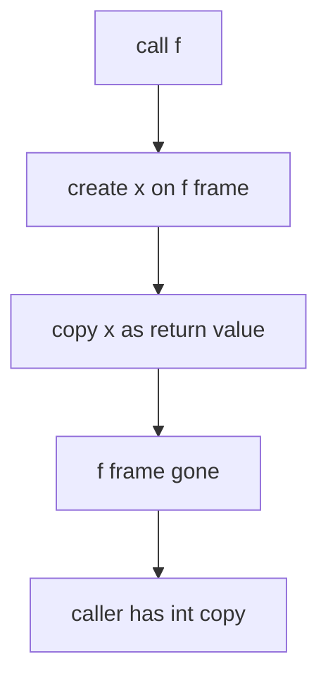

Tidak ada alasan `x` harus hidup setelah frame `f` hilang.

### 2.3 Pointer memperpanjang kemungkinan akses

Contoh klasik:

```go
func f() *int {
    x := 10
    return &x
}
```

Di bahasa seperti C, ini berbahaya jika `x` tetap di stack karena caller akan menerima pointer ke frame yang sudah hilang.

Di Go, ini aman karena compiler bisa memutuskan `x` harus hidup di heap.

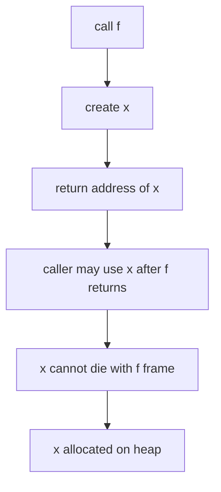

Kesimpulan penting:

> Mengembalikan pointer ke local variable di Go bukan bug. Itu adalah sinyal lifetime value harus diperpanjang.

---

## 3. Stack Allocation vs Heap Allocation

### 3.1 Stack allocation

Stack allocation biasanya murah karena:

1. alokasi mengikuti pergerakan stack pointer,
2. lifetime jelas,
3. tidak perlu dilacak lama oleh GC sebagai heap object,
4. cleanup terjadi bersama frame.

Tetapi stack bukan “gratis”:

1. stack tetap memory,
2. stack goroutine bisa tumbuh,
3. stack map tetap dibutuhkan untuk GC,
4. frame besar bisa mahal,
5. recursion dalam bisa bermasalah.

### 3.2 Heap allocation

Heap allocation biasanya lebih mahal karena:

1. object harus dialokasikan dari allocator,
2. jika berisi pointer, object perlu discan GC,
3. lifetime tidak otomatis selesai saat function return,
4. object bisa meningkatkan live heap,
5. allocation rate tinggi bisa memicu GC lebih sering.

Namun heap allocation juga tidak selalu masalah:

1. Banyak service normal melakukan heap allocation.
2. Banyak object memang harus hidup lintas call.
3. Clarity lebih penting daripada menghindari semua heap allocation.
4. Modern Go allocator cukup cepat untuk banyak workload.

### 3.3 Prinsip engineering

Jangan berpikir:

> “Heap allocation selalu buruk.”

Berpikirlah:

> “Apakah allocation ini ada di hot path, terjadi per request/per item/per packet, menghasilkan pressure, atau menyebabkan retention?”

---

## 4. Escape Analysis Sebagai Data-Flow Analysis

Compiler Go melakukan analisis aliran data untuk menentukan apakah referensi ke suatu value bisa mengalir ke tempat yang lifetime-nya lebih panjang.

Secara konseptual:

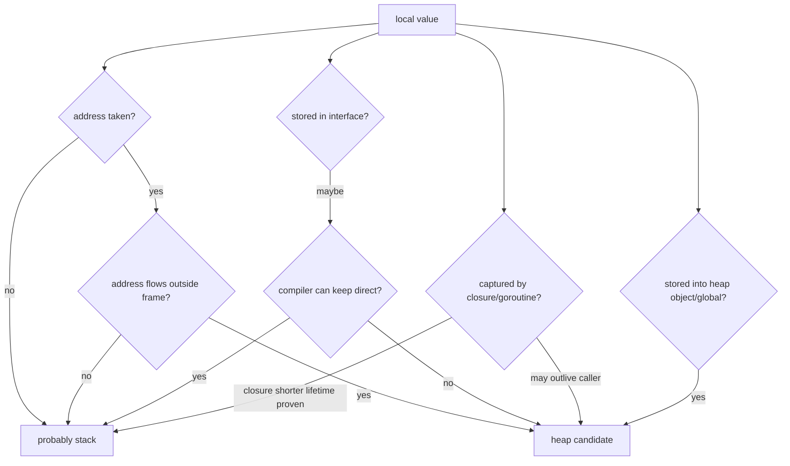

Go compiler implementation sendiri menjelaskan prinsip dasarnya: jika address variable tersimpan di heap atau lokasi lain yang mungkin hidup lebih lama, variable tersebut ditandai membutuhkan heap allocation. Compiler juga mencatat data-flow antar parameter, heap, dan result agar analisis bisa lintas fungsi.

---

## 5. Cara Melihat Escape Analysis

### 5.1 Command dasar

```bash
go build -gcflags=-m ./...
```

Untuk package tunggal:

```bash
go build -gcflags=-m .
```

Untuk detail lebih banyak:

```bash
go build -gcflags='-m=2' .
```

Atau:

```bash
go build -gcflags='-m=3' .
```

Untuk semua dependency:

```bash
go build -gcflags=all=-m ./...
```

Hati-hati: output akan sangat ramai.

### 5.2 Command untuk test/benchmark

Escape behavior bisa berbeda saat test karena inlining, test harness, dan code path berbeda.

```bash
go test -gcflags='-m=2' ./...
```

Untuk benchmark:

```bash
go test -run '^$' -bench . -benchmem ./...
```

### 5.3 Output umum

Contoh output:

```text
./main.go:7:2: moved to heap: x
./main.go:8:9: &x escapes to heap
./main.go:15:13: ... argument does not escape
./main.go:15:14: name escapes to heap
./main.go:22:6: can inline f
```

Makna umum:

| Output | Arti praktis |
|---|---|
| `moved to heap: x` | storage untuk `x` harus hidup di heap |
| `x escapes to heap` | value/reference `x` mengalir ke heap/lifetime lebih panjang |
| `does not escape` | compiler membuktikan tidak perlu heap karena jalur itu |
| `can inline` | function bisa di-inline |
| `inlining call` | call benar-benar di-inline |

Inlining penting karena setelah function di-inline, compiler sering punya visibility lebih baik untuk escape analysis.

---

## 6. Mini Lab 1 — Return Pointer

Buat file:

```go
package main

func Ptr() *int {
    x := 42
    return &x
}

func Val() int {
    x := 42
    return x
}

func main() {
    _ = Ptr()
    _ = Val()
}
```

Jalankan:

```bash
go build -gcflags='-m=2' .
```

Ekspektasi konseptual:

```text
moved to heap: x
```

pada function `Ptr`.

### 6.1 Kenapa `x` escape?

Karena caller menerima address `x`. Caller bisa memakai address itu setelah `Ptr` selesai.

### 6.2 Apakah ini buruk?

Belum tentu.

Kalau API memang ingin membuat object yang hidup setelah function selesai, heap allocation benar.

Contoh factory:

```go
type Config struct {
    TimeoutMS int
    Name      string
}

func NewConfig(name string) *Config {
    return &Config{
        TimeoutMS: 1000,
        Name:      name,
    }
}
```

Ini wajar.

Yang buruk adalah kalau terjadi jutaan kali di hot loop padahal tidak perlu.

---

## 7. Mini Lab 2 — Pointer Tidak Selalu Escape

```go
package main

func UseLocalPointer() int {
    x := 10
    p := &x
    *p++
    return x
}

func main() {
    _ = UseLocalPointer()
}
```

Mengambil address local variable tidak otomatis berarti heap.

Kalau pointer hanya dipakai di dalam frame dan tidak keluar, compiler bisa tetap menyimpan `x` di stack.

Mental model:

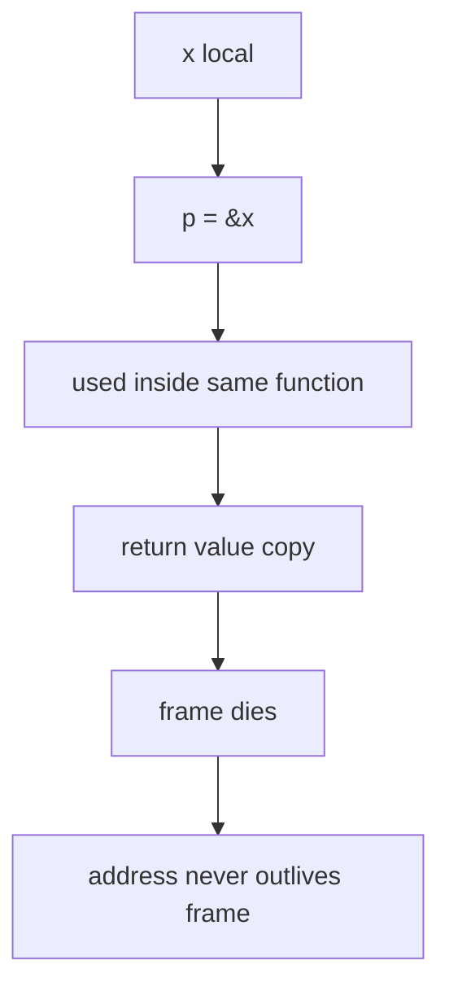

---

## 8. Pattern Escape Umum

Sekarang kita bahas pattern satu per satu.

---

# Pattern 1 — Return Pointer

## 8.1 Bentuk

```go
func NewCounter() *Counter {
    c := Counter{}
    return &c
}
```

## 8.2 Kenapa escape?

Pointer ke `c` keluar function.

## 8.3 Kapan normal?

Normal untuk:

1. constructor/factory,
2. object dengan identity,
3. shared mutable state,
4. object besar yang memang dipakai lintas call,
5. object yang memenuhi interface dengan pointer receiver.

## 8.4 Kapan mencurigakan?

Mencurigakan jika:

1. hanya untuk menghindari copy kecil,
2. dipakai di tight loop,
3. membuat API ownership kabur,
4. hanya supaya bisa return optional value,
5. object sebenarnya immutable dan kecil.

Contoh kurang baik:

```go
func ParseCode(s string) *int {
    if s == "" {
        return nil
    }
    n := len(s)
    return &n
}
```

Alternatif:

```go
func ParseCode(s string) (int, bool) {
    if s == "" {
        return 0, false
    }
    return len(s), true
}
```

Untuk scalar kecil, `(T, bool)` sering lebih baik daripada `*T` optional.

---

# Pattern 2 — Store Pointer Into Heap Object

## 9.1 Bentuk

```go
type Holder struct {
    P *int
}

func Fill(h *Holder) {
    x := 10
    h.P = &x
}
```

## 9.2 Kenapa escape?

`h` menunjuk object yang kemungkinan hidup setelah `Fill` selesai. Jika `h.P` menyimpan `&x`, maka `x` juga harus hidup setelah `Fill` selesai.

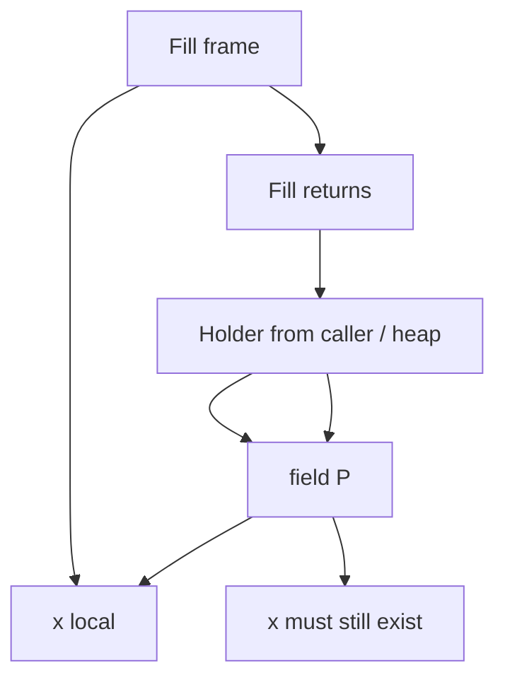

## 9.3 Design implication

Assignment pointer ke field sering berarti:

1. ownership berpindah,
2. lifetime diperpanjang,
3. GC graph bertambah,
4. object menjadi lebih sulit dipahami.

Jika value kecil, pertimbangkan simpan by value:

```go
type Holder struct {
    V int
}
```

Jika optional:

```go
type Holder struct {
    V  int
    Ok bool
}
```

---

# Pattern 3 — Closure Capture

## 10.1 Closure sederhana

```go
func MakeAdder(base int) func(int) int {
    return func(x int) int {
        return base + x
    }
}
```

`base` dicapture oleh closure yang dikembalikan. Closure hidup setelah `MakeAdder` selesai. Maka captured environment harus hidup lebih lama.

## 10.2 Closure yang tidak keluar

```go
func Use() int {
    base := 10
    f := func(x int) int {
        return base + x
    }
    return f(5)
}
```

Jika compiler bisa inline dan membuktikan closure tidak keluar, alokasi bisa dihindari.

## 10.3 Closure capture bukan hanya allocation issue

Closure capture juga bisa menjadi retention issue:

```go
func Handler(big []byte) func() int {
    return func() int {
        return len(big)
    }
}
```

Closure kecil bisa menahan backing array besar.

### 10.4 Hidden retention diagram

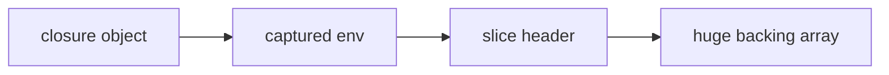

Walaupun closure hanya butuh `len(big)`, capture terhadap slice bisa menahan backing array.

Alternatif:

```go
func Handler(big []byte) func() int {
    n := len(big)
    return func() int {
        return n
    }
}
```

---

# Pattern 4 — Goroutine Capture

## 11.1 Bentuk umum

```go
func Start(data []byte) {
    go func() {
        process(data)
    }()
}
```

Goroutine bisa berjalan setelah `Start` return. Captured data harus tetap hidup.

## 11.2 Lifetime hazard

Goroutine capture memperpanjang lifetime secara eksplisit.

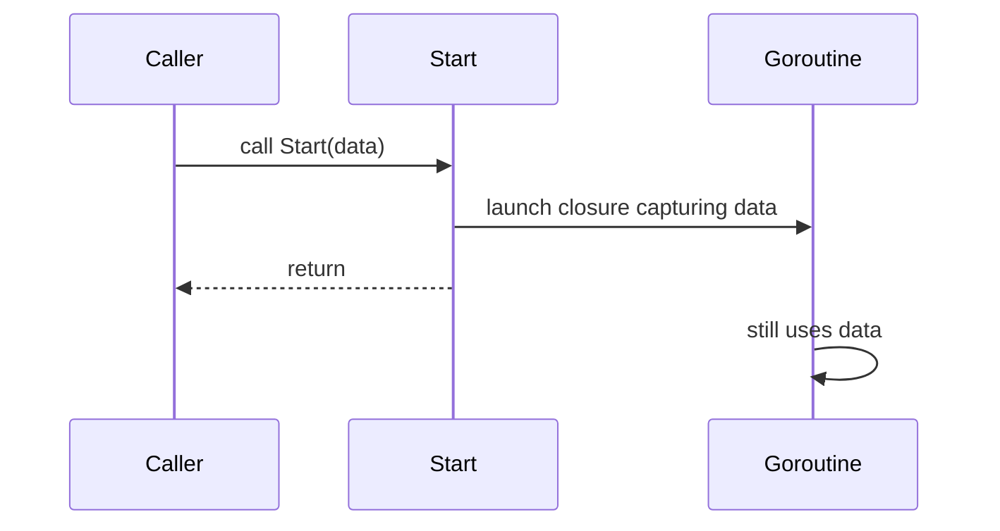

## 11.3 Loop variable capture

Modern Go sudah memperbaiki banyak jebakan range-loop variable capture, tetapi prinsip lifetime tetap penting.

Contoh aman secara eksplisit:

```go
for _, item := range items {
    item := item
    go func() {
        process(item)
    }()
}
```

Untuk hot path, launching goroutine per item juga punya cost memory:

1. goroutine stack,
2. closure environment,
3. captured values,
4. scheduler overhead,
5. possible retention.

---

# Pattern 5 — Interface Conversion

## 12.1 Interface sebagai boundary

```go
func Use(v any) {
    sink(v)
}
```

Ketika concrete value masuk interface, runtime representation interface membawa type info dan data.

Tidak semua interface conversion menyebabkan heap allocation. Namun interface sering membuat compiler kehilangan informasi atau memerlukan storage tambahan.

## 12.2 Variadic `...any`

```go
func Log(args ...any) {
    // ...
}

func Hot(n int, name string) {
    Log(n, name)
}
```

Variadic `...any` sering menjadi sumber allocation karena:

1. arguments harus dibungkus menjadi slice,
2. value masuk interface,
3. value bisa escape jika disimpan/diproses lebih jauh,
4. logging/formatting sering memakai reflection.

## 12.3 `fmt` sebagai contoh

```go
fmt.Sprintf("user=%s count=%d", name, count)
```

`fmt` sangat fleksibel, tetapi fleksibilitasnya membutuhkan interface dan reflection-like processing.

Untuk cold path, tidak masalah.

Untuk hot path, pertimbangkan:

1. `strconv.AppendInt`,
2. `strings.Builder`,
3. structured logger yang allocation-aware,
4. preallocated buffer,
5. menghindari formatting berulang.

---

# Pattern 6 — Reflection

## 13.1 Reflection mengaburkan type information

```go
func Encode(v any) []byte {
    rv := reflect.ValueOf(v)
    _ = rv
    return nil
}
```

Reflection sering membuat compiler tidak bisa membuktikan lifetime dan type secara statis.

## 13.2 Reflection tidak otomatis buruk

Reflection cocok untuk:

1. serialization umum,
2. validation framework,
3. ORM/mapper,
4. dependency injection,
5. generic tooling.

Tetapi pada hot path berfrekuensi tinggi, reflection bisa mahal karena:

1. allocation,
2. metadata traversal,
3. interface wrapping,
4. indirect access,
5. cache pressure.

## 13.3 Design alternative

Untuk hot path:

1. generated code,
2. hand-written encoder,
3. generics,
4. typed interface,
5. precomputed metadata.

---

# Pattern 7 — Dynamic Size

## 14.1 Array dengan constant size

```go
func Fixed() int {
    var buf [64]byte
    buf[0] = 1
    return int(buf[0])
}
```

Compiler bisa menaruh array kecil fixed-size di stack jika tidak escape.

## 14.2 Slice dengan runtime size

```go
func Dynamic(n int) []byte {
    b := make([]byte, n)
    return b
}
```

Backing array harus hidup setelah return, jadi heap.

Bahkan jika tidak return:

```go
func Work(n int) int {
    b := make([]byte, n)
    b[0] = 1
    return int(b[0])
}
```

Compiler mungkin tidak bisa stack allocate jika size runtime/dynamic atau terlalu besar.

## 14.3 Large local value

```go
func Work() {
    var big [1 << 20]byte
    _ = big
}
```

Walaupun tidak escape, object terlalu besar bisa membuat stack frame besar. Compiler/runtime dapat memilih strategi berbeda.

Prinsip:

> Stack allocation bukan berarti semua local array besar bagus.

---

# Pattern 8 — Append To Escaping Slice

## 15.1 Bentuk

```go
func Add(dst []byte, x byte) []byte {
    dst = append(dst, x)
    return dst
}
```

`dst` sendiri adalah slice header by value. Backing array bisa:

1. tetap sama,
2. diganti oleh backing array baru.

Jika result keluar, backing storage result harus valid setelah function return.

## 15.2 Allocation tergantung capacity

```go
b := make([]byte, 0, 1024)
b = Add(b, 1)
```

Jika capacity cukup, tidak allocate.

Jika capacity tidak cukup, `append` allocate backing array baru.

## 15.3 Escape analysis vs runtime allocation

Escape analysis menjawab:

> Storage ini perlu heap atau tidak?

Benchmark `allocs/op` menjawab:

> Pada eksekusi ini, berapa allocation yang benar-benar terjadi?

Keduanya berhubungan tetapi tidak identik.

---

# Pattern 9 — Assignment To Global

```go
var global *int

func Set() {
    x := 10
    global = &x
}
```

`global` hidup sepanjang process. Maka `x` harus heap.

Global assignment juga sering menciptakan retention yang sulit dideteksi karena root global membuat object selalu reachable.

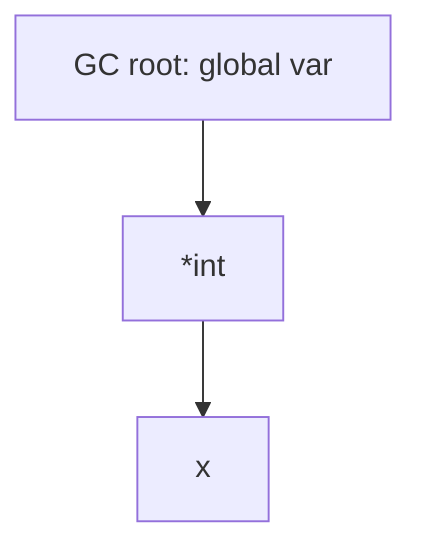

Guideline:

1. Hindari global mutable state.
2. Jika perlu cache global, batasi size dan lifetime.
3. Pastikan observability cache ada.
4. Jangan menyimpan pointer ke request-scoped object di global.

---

# Pattern 10 — Method Value

## 17.1 Method expression vs method value

```go
type Worker struct {
    id int
}

func (w *Worker) Do() {}

func Example(w *Worker) func() {
    return w.Do
}
```

`w.Do` sebagai method value membawa receiver `w` di dalam closure-like value.

Jika method value dikembalikan/disimpan, receiver ikut hidup.

## 17.2 Retention risk

Jika receiver besar atau memegang resource besar:

```go
type Service struct {
    cache map[string][]byte
}

func (s *Service) Handle() {}

func Register(s *Service) {
    callbacks = append(callbacks, s.Handle)
}
```

Callback menahan `s`, `s` menahan `cache`.

---

# Pattern 11 — Defer

`defer` modern sudah jauh lebih optimal dibanding Go lama untuk banyak kasus, tetapi tetap perlu dipahami.

```go
func Work() {
    f, _ := os.Open("x")
    defer f.Close()
}
```

Ini idiomatik.

Namun dalam hot loop:

```go
for i := 0; i < n; i++ {
    f, _ := os.Open(files[i])
    defer f.Close()
}
```

Ini salah secara lifecycle: semua close ditunda sampai function selesai. Bukan hanya allocation issue.

Lebih baik:

```go
for i := 0; i < n; i++ {
    if err := processFile(files[i]); err != nil {
        return err
    }
}

func processFile(name string) error {
    f, err := os.Open(name)
    if err != nil {
        return err
    }
    defer f.Close()
    return process(f)
}
```

---

# Pattern 12 — Map And Slice Retention

Escape analysis membantu allocation placement, tetapi tidak otomatis menyelesaikan retention.

```go
func KeepSmall(big []byte) []byte {
    return big[:10]
}
```

Slice header kecil keluar, tetapi backing array besar ikut tertahan.

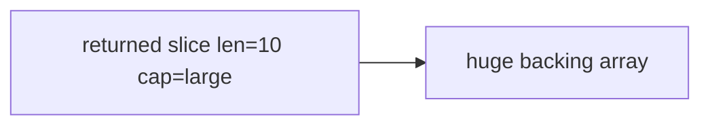

Perbaikan:

```go
func KeepSmall(big []byte) []byte {
    out := make([]byte, 10)
    copy(out, big[:10])
    return out
}
```

Ini menambah copy dan allocation kecil untuk membebaskan backing array besar.

Insight penting:

> Mengurangi allocation bukan selalu tujuan. Kadang allocation kecil justru mengurangi retention besar.

---

# Pattern 13 — Channel Retention

```go
ch := make(chan []byte, 1000)
```

Channel buffer menyimpan elements. Jika element adalah slice header, backing array tetap reachable.

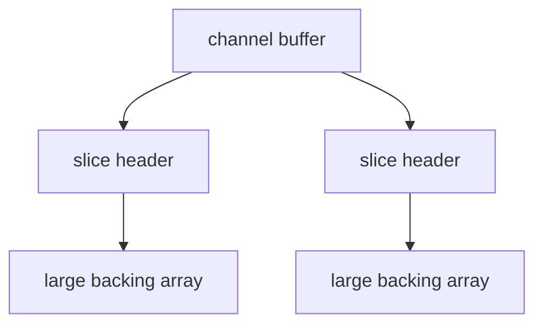

Unbounded-ish buffered channel bisa menjadi memory queue.

Guideline:

1. Batasi buffer.
2. Gunakan backpressure.
3. Jangan channel sebagai dump queue tanpa policy.
4. Jangan kirim buffer besar tanpa ownership contract.
5. Jika buffer pooled, pastikan receiver selesai sebelum buffer dikembalikan.

---

# Pattern 14 — Interface In Collections

```go
items := []any{1, "x", SomeStruct{}}
```

Collection of `any` menghilangkan type specificity.

Dampak:

1. possible allocation,
2. more pointer graph,
3. type assertions,
4. reflection-like usage,
5. harder compiler optimization.

Untuk hot path, prefer typed collection:

```go
items := []SomeStruct{}
```

atau generic:

```go
type Queue[T any] struct {
    items []T
}
```

Generics tidak otomatis zero allocation, tetapi memberi compiler informasi type lebih baik dibanding `any` dalam banyak desain.

---

# Pattern 15 — Error Values

Error handling bisa menjadi sumber allocation jika error dibuat di hot path.

```go
return fmt.Errorf("invalid id %d", id)
```

Untuk error exceptional, ini normal.

Untuk parser yang memproses jutaan record dan error adalah bagian dari control flow, desain perlu hati-hati.

Alternatif:

1. sentinel error,
2. typed error reused carefully,
3. error code,
4. result struct,
5. delayed formatting.

Contoh:

```go
type ParseResult struct {
    Value int
    Code  ParseCode
}
```

Jangan mengorbankan clarity jika error path jarang.

---

# Pattern 16 — JSON/SQL/Logging Boundary

Boundary umum yang sering membuat allocation:

1. `encoding/json`,
2. `database/sql`,
3. `fmt`,
4. logger dengan `...any`,
5. ORM/mapper,
6. validation library,
7. reflection-heavy framework.

Ini bukan berarti library tersebut buruk. Mereka menyelesaikan masalah umum.

Tetapi untuk path sangat panas:

1. streaming decoder,
2. custom marshaler,
3. generated code,
4. typed scanner,
5. buffer reuse,
6. fewer `map[string]any`,
7. fewer intermediate strings.

---

## 18. Escape vs Allocation vs Retention

Ini tiga konsep berbeda.

| Konsep | Pertanyaan | Tool utama |
|---|---|---|
| Escape | Apakah value perlu hidup di luar frame? | `-gcflags=-m` |
| Allocation | Berapa object dialokasikan saat runtime? | `-benchmem`, pprof allocs |
| Retention | Apa yang masih reachable dan menahan memory? | pprof inuse heap, object graph reasoning |

Contoh:

```go
func SmallView(big []byte) []byte {
    return big[:10]
}
```

Mungkin tidak membuat allocation baru, tetapi bisa menyebabkan retention besar.

Contoh lain:

```go
func CopySmall(big []byte) []byte {
    out := make([]byte, 10)
    copy(out, big[:10])
    return out
}
```

Membuat allocation kecil, tetapi menghindari retention besar.

Top engineer tidak bertanya “mana yang 0 alloc?”, tetapi:

> Mana yang paling benar untuk lifetime, memory budget, latency, dan maintainability?

---

## 19. Reading Escape Output Correctly

### 19.1 Jangan membaca satu baris terpisah

Output escape sering saling terkait.

Contoh:

```text
./x.go:10:6: can inline makeUser
./x.go:20:17: inlining call to makeUser
./x.go:11:9: &User{...} escapes to heap
```

Inlining bisa mengubah escape result. Kadang object escape sebelum inline, tetapi tidak setelah inline di call site tertentu.

### 19.2 `escapes to heap` bukan selalu lokasi final yang kamu bayangkan

Kadang yang escape adalah:

1. value,
2. address,
3. temporary object,
4. variadic slice,
5. interface wrapper,
6. closure environment.

### 19.3 Compiler report bukan performance verdict

Output:

```text
x escapes to heap
```

Belum menjawab:

1. berapa sering terjadi,
2. seberapa besar object,
3. apakah pointer-containing,
4. apakah di hot path,
5. apakah retained lama,
6. apakah berdampak ke latency.

Untuk performance verdict, lanjutkan ke benchmark dan profile.

---

## 20. Recommended Investigation Workflow

Gunakan urutan ini:

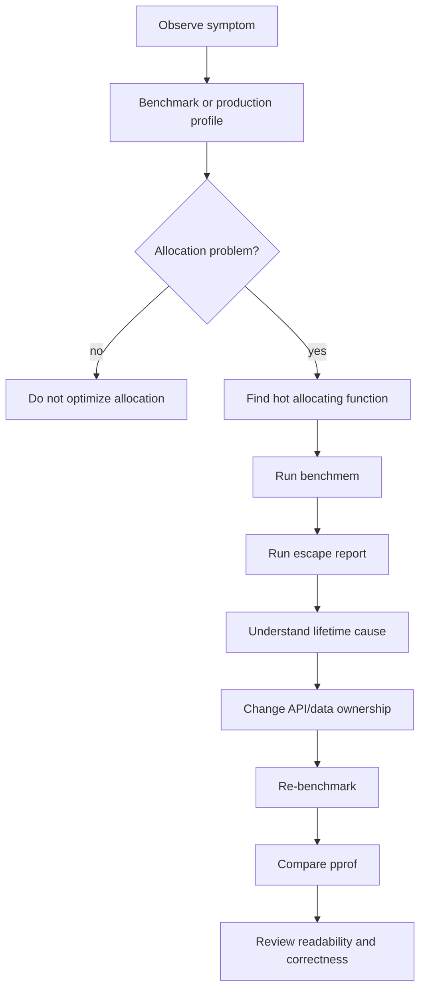

Jangan mulai dari escape report tanpa symptom. Itu seperti membaca warning compiler sebagai product requirement.

---

## 21. Benchmark Template

```go
package escape

import "testing"

type User struct {
    ID   int
    Name string
}

func NewUserPtr(id int, name string) *User {
    return &User{ID: id, Name: name}
}

func NewUserVal(id int, name string) User {
    return User{ID: id, Name: name}
}

func BenchmarkNewUserPtr(b *testing.B) {
    for i := 0; i < b.N; i++ {
        _ = NewUserPtr(i, "alice")
    }
}

func BenchmarkNewUserVal(b *testing.B) {
    for i := 0; i < b.N; i++ {
        _ = NewUserVal(i, "alice")
    }
}
```

Run:

```bash
go test -run '^$' -bench . -benchmem
```

But be careful: compiler can eliminate unused results.

Gunakan sink:

```go
var sinkUser User
var sinkUserPtr *User

func BenchmarkNewUserPtr(b *testing.B) {
    for i := 0; i < b.N; i++ {
        sinkUserPtr = NewUserPtr(i, "alice")
    }
}

func BenchmarkNewUserVal(b *testing.B) {
    for i := 0; i < b.N; i++ {
        sinkUser = NewUserVal(i, "alice")
    }
}
```

Tetapi sink global sendiri bisa membuat value escape. Benchmark harus dirancang sesuai pertanyaan.

---

## 22. Common Benchmark Lies

### 22.1 Dead-code elimination

```go
func BenchmarkX(b *testing.B) {
    for i := 0; i < b.N; i++ {
        compute(i)
    }
}
```

Jika result tidak dipakai, compiler bisa menghapus banyak kerja.

### 22.2 Global sink creates artificial escape

```go
var sink any

func BenchmarkX(b *testing.B) {
    for i := 0; i < b.N; i++ {
        sink = compute(i)
    }
}
```

Assign ke `any` global bisa membuat escape yang tidak terjadi di real code.

### 22.3 Benchmark terlalu kecil

Microbenchmark bisa membuat compiler sangat agresif mengoptimasi.

Tambahkan benchmark yang lebih mirip real path.

### 22.4 Input terlalu konstan

Jika input constant, compiler bisa optimize berbeda dari real workload.

### 22.5 Membandingkan API yang tidak setara

Pointer API dan value API sering punya semantic berbeda. Jangan hanya benchmark, cek kontrak ownership.

---

## 23. API Design: Pointer vs Value Return

### 23.1 Return value

```go
func ParseHeader(b []byte) (Header, error)
```

Cocok jika:

1. `Header` kecil/menengah,
2. immutable-ish,
3. tidak butuh identity,
4. caller menerima copy,
5. no shared mutation.

### 23.2 Return pointer

```go
func ParseHeader(b []byte) (*Header, error)
```

Cocok jika:

1. object besar,
2. identity penting,
3. nil punya meaning,
4. mutation expected,
5. object harus memenuhi pointer receiver interface,
6. lifetime memang lintas component.

### 23.3 Fill caller-provided output

```go
func ParseHeaderInto(b []byte, dst *Header) error
```

Cocok untuk hot path jika:

1. caller mengontrol reuse,
2. allocation harus ditekan,
3. ownership jelas,
4. API complexity masih acceptable.

Trade-off:

1. lebih verbose,
2. lebih mudah misuse,
3. harus jelas apakah `dst` di-reset penuh,
4. concurrency harus dijaga.

---

## 24. API Design: Buffer Ownership

Escape analysis sering buruk jika ownership buffer kabur.

### 24.1 Bad contract

```go
func Encode(v Value) []byte
```

Tidak selalu buruk, tetapi caller tidak tahu:

1. apakah result baru,
2. apakah result view ke internal buffer,
3. apakah boleh disimpan,
4. apakah akan berubah.

### 24.2 Better explicit contract

```go
func AppendEncode(dst []byte, v Value) []byte
```

Contract:

1. function append ke `dst`,
2. result harus dipakai,
3. caller owns returned slice,
4. previous `dst` mungkin tidak lagi valid secara capacity ownership.

Ini pattern umum di Go untuk allocation-aware API.

Contoh:

```go
buf := make([]byte, 0, 1024)
buf = AppendEncode(buf, v1)
buf = AppendEncode(buf, v2)
```

---

## 25. Escape Analysis And Inlining

Inlining dapat membantu escape analysis.

```go
func makePair(a, b int) Pair {
    return Pair{A: a, B: b}
}

func use() int {
    p := makePair(1, 2)
    return p.A + p.B
}
```

Jika `makePair` di-inline, compiler melihat langsung bahwa `p` tidak escape.

Go compiler melakukan banyak optimasi lintas tahap, dan PGO/inlining dapat meningkatkan peluang optimasi. Go blog tentang PGO menjelaskan bahwa inlining sering membuka optimasi lanjutan seperti escape analysis yang lebih baik.

### 25.1 Jangan memaksa semua function kecil hanya demi inline

Faktor lain:

1. readability,
2. API boundary,
3. testability,
4. compile time,
5. binary size.

Inlining adalah compiler decision. Engineer cukup membuat code jelas dan mengukur hot path.

---

## 26. Escape Analysis And Generics

Generics bisa membantu menghindari `any` di beberapa API.

```go
type Stack[T any] struct {
    items []T
}

func (s *Stack[T]) Push(v T) {
    s.items = append(s.items, v)
}
```

Dibanding:

```go
type StackAny struct {
    items []any
}

func (s *StackAny) Push(v any) {
    s.items = append(s.items, v)
}
```

Versi generic mempertahankan type `T`, mengurangi interface wrapping di API.

Namun generics tidak otomatis:

1. menghilangkan semua allocation,
2. membuat semua code lebih cepat,
3. menghindari escape jika value disimpan ke heap-backed slice,
4. mengganti kebutuhan ownership design.

Generics adalah alat type-level, bukan magic allocation eraser.

---

## 27. Escape Analysis And `sync.Pool`

Kadang engineer melihat allocation lalu langsung memakai `sync.Pool`.

Ini sering premature.

### 27.1 Pool tidak menghilangkan lifetime problem

```go
var pool = sync.Pool{
    New: func() any { return new(bytes.Buffer) },
}
```

Pool bisa mengurangi allocation rate, tetapi:

1. object masih heap,
2. pool bisa dibersihkan saat GC,
3. object perlu reset benar,
4. retained capacity bisa besar,
5. ownership lebih kompleks,
6. misuse bisa data race/corruption.

### 27.2 Pool cocok jika

1. object mahal dibuat,
2. digunakan berulang,
3. high allocation rate terbukti,
4. object bisa di-reset penuh,
5. tidak ada reference yang bocor setelah Put,
6. benchmark menunjukkan benefit.

### 27.3 Pool tidak cocok jika

1. object kecil,
2. allocation tidak di hot path,
3. lifetime rumit,
4. buffer capacity tidak dibatasi,
5. correctness jadi kabur.

---

## 28. Escape Analysis And Unsafe

Jangan memakai `unsafe` hanya untuk “mengalahkan escape analysis”.

Contoh bahaya:

```go
func BytesToString(b []byte) string {
    return unsafe.String(unsafe.SliceData(b), len(b))
}
```

Ini bisa zero-copy, tetapi contract-nya berat:

1. `b` tidak boleh dimodifikasi selama string dipakai,
2. backing array harus tetap hidup,
3. data harus immutable secara semantic,
4. caller harus paham lifetime.

Jika `b` berasal dari pooled buffer lalu buffer dikembalikan:

```go
s := BytesToString(buf)
pool.Put(buf)
// s now may observe mutated memory later
```

Ini bug berat.

Unsafe yang mengurangi allocation bisa mengubah bug dari “lebih lambat” menjadi “memory corruption”.

---

## 29. Java Comparison: Escape Analysis Di JVM vs Go

Sebagai Java engineer, kamu mungkin familiar dengan JVM escape analysis.

### 29.1 JVM

Di HotSpot, escape analysis dapat memungkinkan:

1. scalar replacement,
2. lock elision,
3. stack allocation-like optimization,
4. allocation elimination JIT-time.

Karena JVM JIT, optimasi bisa bergantung pada runtime profiling.

### 29.2 Go

Go compiler AOT melakukan escape analysis saat compile time.

Dampaknya:

1. keputusan lebih statis,
2. tidak menunggu warm-up,
3. binary behavior lebih predictable,
4. tidak seadaptif JIT untuk beberapa pola runtime,
5. inlining compile-time sangat penting.

### 29.3 Mindset shift

Di Java, kamu kadang percaya JIT akan mengoptimasi object kecil.

Di Go, kamu lebih sering mendesain API supaya lifetime dan ownership jelas sejak source code.

---

## 30. Case Study 1 — Optional Scalar

### 30.1 Pointer optional

```go
func FindAge(name string) *int {
    if name == "" {
        return nil
    }
    age := 30
    return &age
}
```

Masalah:

1. `age` likely heap,
2. caller harus dereference,
3. nil handling,
4. optional value memakai pointer semantics.

### 30.2 Value plus bool

```go
func FindAge(name string) (int, bool) {
    if name == "" {
        return 0, false
    }
    return 30, true
}
```

Keuntungan:

1. no pointer needed,
2. clear optional contract,
3. likely no heap allocation,
4. idiomatic Go.

### 30.3 Kapan pointer optional tetap valid?

1. `T` besar,
2. nil semantic natural,
3. JSON/database nullable interop,
4. shared mutation intentional,
5. API compatibility.

---

## 31. Case Study 2 — Parser Result

### 31.1 Naive

```go
func Parse(b []byte) map[string]any {
    out := map[string]any{}
    out["id"] = string(b[:8])
    out["size"] = len(b)
    return out
}
```

Potential cost:

1. map allocation,
2. interface wrapping,
3. string conversion copy,
4. boxed-like scalar into `any`,
5. retention/copy ambiguity.

### 31.2 Typed result

```go
type Header struct {
    ID   [8]byte
    Size int
}

func ParseHeader(b []byte) (Header, bool) {
    if len(b) < 8 {
        return Header{}, false
    }
    var h Header
    copy(h.ID[:], b[:8])
    h.Size = len(b)
    return h, true
}
```

Trade-off:

1. fixed copy 8 bytes,
2. no map,
3. no `any`,
4. no dynamic key lookup,
5. clear memory ownership.

### 31.3 Append-style formatting

```go
func (h Header) AppendTo(dst []byte) []byte {
    dst = append(dst, "id="...)
    dst = append(dst, h.ID[:]...)
    dst = append(dst, " size="...)
    dst = strconv.AppendInt(dst, int64(h.Size), 10)
    return dst
}
```

Allocation-aware without unsafe.

---

## 32. Case Study 3 — Closure Retention In HTTP Middleware

### 32.1 Problem

```go
func Middleware(config []byte, next http.Handler) http.Handler {
    return http.HandlerFunc(func(w http.ResponseWriter, r *http.Request) {
        if len(config) > 0 {
            w.Header().Set("X-Config", "1")
        }
        next.ServeHTTP(w, r)
    })
}
```

If `config` is a huge slice but only `len(config) > 0` is needed, closure retains huge backing array.

### 32.2 Fix

```go
func Middleware(config []byte, next http.Handler) http.Handler {
    hasConfig := len(config) > 0
    return http.HandlerFunc(func(w http.ResponseWriter, r *http.Request) {
        if hasConfig {
            w.Header().Set("X-Config", "1")
        }
        next.ServeHTTP(w, r)
    })
}
```

Allocation may not be the main issue. Retention is.

---

## 33. Case Study 4 — Logging Hot Path

### 33.1 Flexible but expensive

```go
logger.Infof("processed user=%s count=%d", user, count)
```

Potential:

1. variadic `any`,
2. formatting,
3. allocation,
4. string creation even if log level disabled depending logger implementation.

### 33.2 Structured and level-aware

```go
if logger.Enabled(DebugLevel) {
    logger.Debug("processed", "user", user, "count", count)
}
```

Still can allocate depending logger, but avoids unnecessary formatting if disabled.

### 33.3 Hot path discipline

1. Avoid formatting disabled logs.
2. Avoid logging huge objects.
3. Avoid `fmt.Sprintf` before logger call.
4. Prefer typed fields if logger supports efficient API.
5. Benchmark with actual logger.

---

## 34. Case Study 5 — Caller-Provided Scratch

### 34.1 Allocating every call

```go
func Normalize(s string) string {
    b := make([]byte, 0, len(s))
    for i := 0; i < len(s); i++ {
        c := s[i]
        if c >= 'A' && c <= 'Z' {
            c += 'a' - 'A'
        }
        b = append(b, c)
    }
    return string(b)
}
```

This allocates buffer and string.

### 34.2 Append API

```go
func AppendNormalize(dst []byte, s string) []byte {
    for i := 0; i < len(s); i++ {
        c := s[i]
        if c >= 'A' && c <= 'Z' {
            c += 'a' - 'A'
        }
        dst = append(dst, c)
    }
    return dst
}
```

Caller can reuse:

```go
buf := make([]byte, 0, 1024)
buf = AppendNormalize(buf[:0], input)
```

Only convert to string if necessary.

---

## 35. Decision Framework: Should I Fix This Escape?

Gunakan pertanyaan ini:

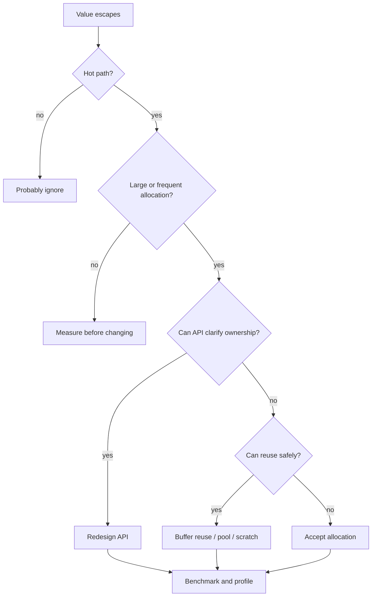

### 35.1 Fix if

1. allocation appears in top pprof allocs,
2. allocs/op is high in benchmark,
3. GC CPU is significant,
4. tail latency correlates with GC/allocation pressure,
5. object retains large backing storage,
6. API contract is wrong,
7. memory budget is exceeded.

### 35.2 Ignore if

1. cold path,
2. startup path,
3. error path,
4. rare admin operation,
5. clarity would suffer,
6. allocation is tiny and not retained,
7. benchmark shows no meaningful difference.

---

## 36. Practical Commands Cheat Sheet

### 36.1 Escape report

```bash
go build -gcflags='-m=2' ./...
```

### 36.2 Escape report for one package

```bash
go test -run '^$' -gcflags='-m=2' .
```

### 36.3 Benchmark allocation

```bash
go test -run '^$' -bench . -benchmem ./...
```

### 36.4 CPU and memory profile from benchmark

```bash
go test -run '^$' -bench BenchmarkX -benchmem -cpuprofile cpu.out -memprofile mem.out .
```

### 36.5 Inspect memory profile

```bash
go tool pprof -http=:0 mem.out
```

### 36.6 Show alloc space

```bash
go tool pprof -alloc_space mem.out
```

### 36.7 Show in-use space

```bash
go tool pprof -inuse_space mem.out
```

### 36.8 Compare old/new benchmark

```bash
go test -run '^$' -bench . -benchmem -count=10 > before.txt
# change code
go test -run '^$' -bench . -benchmem -count=10 > after.txt
benchstat before.txt after.txt
```

If `benchstat` is not installed:

```bash
go install golang.org/x/perf/cmd/benchstat@latest
```

---

## 37. Escape Analysis Output Interpretation Examples

### 37.1 Example: does not escape

Code:

```go
func Sum(xs []int) int {
    total := 0
    for _, x := range xs {
        total += x
    }
    return total
}
```

Likely no local heap allocation.

### 37.2 Example: parameter leaks to result

```go
func Identity[T any](x T) T {
    return x
}
```

For pointer-like T, parameter flows to result. This is not necessarily heap allocation; it is data-flow information.

### 37.3 Example: parameter leaks to heap

```go
var stored any

func Store(v any) {
    stored = v
}
```

Parameter flows to global, therefore heap/global lifetime.

### 37.4 Example: slice backing array escapes

```go
func MakeBytes() []byte {
    b := make([]byte, 1024)
    return b
}
```

Backing array must live after function return.

### 37.5 Example: local temporary for interface

```go
func Print(n int) {
    fmt.Println(n)
}
```

May show escape depending compiler version/context. Do not panic. Ask whether `Print` is hot path.

---

## 38. Deep Mental Model: Escape As Lifetime Widening

Consider lifetime scopes:

```text
statement < block < function call < goroutine < request < service < process
```

A value escapes when its needed lifetime is wider than the scope where it is created.

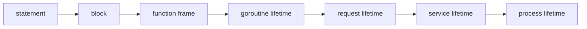

Examples:

| Created in | Used until | Likely placement/issue |
|---|---|---|
| function | function return | stack candidate |
| function | caller after return | heap candidate |
| request handler | goroutine async after response | heap + retention risk |
| request handler | global cache | heap + cache policy issue |
| loop iteration | channel buffer | heap/retention until consumed |
| pooled buffer | after returned to pool | correctness bug |

---

## 39. Heap Allocation Is Not The Same As GC Cost

GC cost depends heavily on:

1. amount of live heap,
2. number of objects,
3. pointer density,
4. allocation rate,
5. root size,
6. goroutine stacks,
7. write barrier activity,
8. memory limit pressure.

A large `[]byte` backing array may be pointer-free and cheaper to scan than a graph of many pointer-rich objects.

Example:

```go
type Node struct {
    Next *Node
    Data *Payload
}
```

Millions of `Node` objects create pointer graph.

Compare:

```go
buf := make([]byte, 100<<20)
```

Large bytes consume memory, but scanning pointer-free bytes is different from traversing pointer graph.

Optimization target depends on symptom:

1. RSS high?
2. GC CPU high?
3. pause high?
4. allocs/op high?
5. object count high?
6. live heap growing?

---

## 40. Pointer-Free Design

One advanced strategy is reducing pointer density.

### 40.1 Pointer-rich

```go
type Entry struct {
    Key   *string
    Value *[]byte
    Next  *Entry
}
```

### 40.2 Pointer-light

```go
type Entry struct {
    KeyOff   uint32
    KeyLen   uint32
    ValueOff uint32
    ValueLen uint32
    NextIdx  uint32
}
```

Data stored in large byte arena:

```go
type Store struct {
    entries []Entry
    data    []byte
}
```

Benefits:

1. fewer pointers,
2. better locality,
3. less GC scanning,
4. compact representation.

Costs:

1. more manual indexing,
2. harder debugging,
3. bounds and lifetime management,
4. compaction complexity.

This is an advanced design, not default style.

---

## 41. Escape And Concurrency

Concurrent code often widens lifetime.

### 41.1 Passing pointer to goroutine

```go
func Process(req *Request) {
    go audit(req)
}
```

Now `req` must remain valid after `Process` returns.

### 41.2 Passing value snapshot

```go
func Process(req *Request) {
    auditData := AuditData{
        ID:   req.ID,
        User: req.User,
    }
    go audit(auditData)
}
```

This copies only needed data and avoids retaining full request graph.

### 41.3 Channel ownership

```go
jobs <- buf
```

Question:

1. Who owns `buf` after send?
2. Can sender modify it?
3. Can sender return it to pool?
4. Does receiver copy before storing?

Without ownership rule, zero-copy becomes data race/corruption risk.

---

## 42. Escape And Request Lifecycle

In servers, request lifecycle is a natural ownership boundary.

Bad pattern:

```go
func handler(w http.ResponseWriter, r *http.Request) {
    body, _ := io.ReadAll(r.Body)
    go func() {
        asyncProcess(body, r.Header)
    }()
}
```

This can retain:

1. entire body,
2. request header map,
3. maybe request object graph,
4. goroutine stack,
5. closure environment.

Better:

```go
type AsyncJob struct {
    RequestID string
    UserID    string
    BodyRef   string // e.g. object storage key, not whole body
}
```

Create minimal snapshot:

```go
job := AsyncJob{
    RequestID: requestID,
    UserID:    userID,
    BodyRef:   storedBodyKey,
}
queue <- job
```

Principle:

> Async boundary should carry minimal immutable snapshot, not entire request graph.

---

## 43. Escape And Caches

Cache often intentionally extends lifetime.

```go
cache[key] = value
```

This is not accidental escape; it is product behavior.

But cache needs policy:

1. max entries,
2. max bytes,
3. TTL,
4. eviction,
5. copy-on-insert or ownership transfer,
6. copy-on-read or immutable value,
7. observability.

Without policy, cache becomes leak with a map.

### 43.1 Cache insert contract

Option A: cache takes ownership

```go
func (c *Cache) Set(key string, value []byte) {
    c.m[key] = value
}
```

Caller must not mutate value after Set.

Option B: cache copies

```go
func (c *Cache) Set(key string, value []byte) {
    cp := append([]byte(nil), value...)
    c.m[key] = cp
}
```

More allocation, clearer safety.

---

## 44. Escape And `context.Context`

Avoid storing large values in context.

```go
ctx = context.WithValue(ctx, key, hugeObject)
```

This extends lifetime through request chain and hides dependency.

Use context for:

1. cancellation,
2. deadline,
3. request-scoped small metadata,
4. auth/user id if project convention allows.

Avoid context for:

1. large buffers,
2. database handles hidden from API,
3. caches,
4. optional parameters,
5. business object graph.

Context values are interface-based and can contribute to allocation/retention.

---

## 45. Escape And Error Wrapping

```go
return fmt.Errorf("load user %s: %w", id, err)
```

This allocates, but error path is usually cold.

Do not optimize error wrapping away unless:

1. error is common control flow,
2. parsing millions of invalid records,
3. benchmark shows it dominates,
4. observability can be preserved.

Correctness and diagnosability matter.

---

## 46. Escape And Large Structs

### 46.1 Value copy can be expensive

```go
type Big struct {
    Data [4096]byte
}

func Process(b Big) int {
    return int(b.Data[0])
}
```

Passing by value copies large data.

### 46.2 Pointer avoids copy but may escape

```go
func Process(b *Big) int {
    return int(b.Data[0])
}
```

Pointer avoids large copy but introduces aliasing and possible heap/lifetime complexity.

### 46.3 Better question

Not “value or pointer?” but:

1. Is object logically immutable?
2. Is copy cost material?
3. Is aliasing safe?
4. Is object in hot path?
5. Does pointer increase GC scan?
6. Can data be represented compactly?
7. Can API accept `[]byte` or smaller view?

---

## 47. Escape And Arrays vs Slices

Array value contains all elements.

```go
var a [1024]byte
```

Slice value contains header pointing to backing array.

```go
s := make([]byte, 1024)
```

Returning array copies data:

```go
func MakeArray() [1024]byte {
    var a [1024]byte
    return a
}
```

Returning slice returns header; backing array must live:

```go
func MakeSlice() []byte {
    s := make([]byte, 1024)
    return s
}
```

Neither is universally better.

Arrays can be useful for fixed-size identifiers:

```go
type TraceID [16]byte
```

Slices are better for variable-size data.

---

## 48. Escape And Strings

String conversion from `[]byte` copies in safe Go:

```go
s := string(b)
```

This allocation can be good if it breaks retention from a large buffer.

Bad zero-copy instinct:

```go
// avoid copy by unsafe
```

But if `b` comes from reusable network buffer, zero-copy string is unsafe unless strict lifetime/immutability is guaranteed.

Guideline:

1. Copy small strings if they must outlive buffer.
2. Avoid converting repeatedly in hot loops.
3. Parse on bytes if possible.
4. Use string only at semantic boundary.

---

## 49. Escape And Maps

Map internals live on heap-like runtime structures. A map value is small header-like descriptor, but entries/buckets are managed internally.

```go
func MakeMap() map[string]int {
    m := make(map[string]int)
    m["x"] = 1
    return m
}
```

Map must live after return.

Maps also retain keys and values.

```go
m[string(big[:10])] = value
```

Safe string conversion copies 10 bytes, which may prevent retaining `big`.

Using unsafe no-copy key can be disastrous if backing bytes mutate.

---

## 50. Escape And Slices Of Pointers

```go
items := []*Item{}
```

This has two layers:

1. slice backing array,
2. pointed-to `Item` objects.

Alternative:

```go
items := []Item{}
```

This stores values contiguously.

Trade-off:

| Design | Pros | Cons |
|---|---|---|
| `[]Item` | locality, fewer allocations, fewer pointers | moving/copy on append, large value copy |
| `[]*Item` | stable object identity, cheap element copy | many allocations, pointer chasing, GC scan |

Use pointer slice only if identity/sharing/mutation requires it.

---

## 51. Escape And Builder Patterns

Java-style builder often uses heap objects.

```go
type Builder struct {
    parts []Part
}

func NewBuilder() *Builder {
    return &Builder{}
}
```

In Go, simple config can be value-based:

```go
type Config struct {
    Timeout int
    Retries int
}

func DefaultConfig() Config {
    return Config{Timeout: 1000, Retries: 3}
}
```

Functional options can allocate depending usage:

```go
type Option func(*Config)
```

Options are elegant but can involve closure capture.

Use them where API complexity needs them, not for every small struct.

---

## 52. Escape And Dependency Injection

Reflection-heavy DI containers often create allocation and obscure lifetimes.

Manual wiring:

```go
svc := NewService(repo, logger, clock)
```

is more explicit.

If using DI framework:

1. keep wiring at startup,
2. avoid reflection in request hot path,
3. avoid service locator via context,
4. understand lifecycle: singleton/request/transient.

Startup allocation usually irrelevant. Request-path allocation matters.

---

## 53. Escape Analysis Checklist For Code Review

When reviewing a hot function, ask:

1. Does any local address leave the function?
2. Does closure capture large values?
3. Does goroutine capture request object?
4. Does value enter `any`/interface unnecessarily?
5. Does code call `fmt` in tight loop?
6. Does code allocate dynamic buffer every iteration?
7. Does code return small subslice of large buffer?
8. Does map/cache retain unbounded data?
9. Does channel buffer hold large objects?
10. Does `sync.Pool` return object while references remain?
11. Does API define ownership clearly?
12. Does benchmark prove allocation matters?
13. Does pprof show this path matters?
14. Does optimization reduce readability too much?
15. Is unsafe being used to avoid a copy that is actually beneficial?

---

## 54. Anti-Patterns

### 54.1 Pointer optional everywhere

```go
type User struct {
    Age *int
}
```

Valid for JSON/database nullable semantics, but not always ideal internally.

### 54.2 `map[string]any` as internal model

Good at boundary/dynamic data. Bad as core hot representation.

### 54.3 Logging with formatting in hot disabled path

```go
logger.Debug(fmt.Sprintf("x=%d", x))
```

Formatting happens before logger can decide.

### 54.4 Goroutine per item with large capture

```go
for _, item := range items {
    go func() { process(big, item) }()
}
```

Can explode memory.

### 54.5 Pool without ownership

```go
buf := pool.Get().([]byte)
ch <- buf
pool.Put(buf)
```

Receiver may observe reused buffer.

### 54.6 Unsafe to silence allocation

Unsafe is not an allocation optimization tool by default. It is a contract escape hatch.

---

## 55. A Good Optimization Example

Before:

```go
func EncodeRecords(records []Record) []byte {
    var out []byte
    for _, r := range records {
        line := fmt.Sprintf("%d,%s\n", r.ID, r.Name)
        out = append(out, line...)
    }
    return out
}
```

Problems:

1. `fmt.Sprintf` per record,
2. string allocation per line,
3. repeated append growth if no capacity,
4. variadic/interface formatting.

After:

```go
func EncodeRecords(records []Record) []byte {
    out := make([]byte, 0, estimateRecordsSize(records))
    for _, r := range records {
        out = strconv.AppendInt(out, int64(r.ID), 10)
        out = append(out, ',')
        out = append(out, r.Name...)
        out = append(out, '\n')
    }
    return out
}
```

Why good:

1. no unsafe,
2. clear ownership,
3. fewer temporary strings,
4. fewer allocations,
5. semantically equivalent,
6. still readable.

---

## 56. A Bad Optimization Example

Before:

```go
func Key(b []byte) string {
    return string(b)
}
```

After:

```go
func Key(b []byte) string {
    return unsafe.String(unsafe.SliceData(b), len(b))
}
```

This may remove allocation but creates hazards:

1. string can change if `b` changes,
2. map key corruption if used as key,
3. pooled buffer bugs,
4. lifetime coupling,
5. data race if bytes modified concurrently.

Safe copy was probably correct.

---

## 57. Production Incident Lens

Escape-related issues show up as:

1. high allocation rate,
2. GC CPU spike,
3. tail latency spike,
4. RSS growth,
5. OOMKill,
6. goroutine leak retaining request buffers,
7. cache memory growth,
8. pprof showing many small objects,
9. heap profile dominated by logging/formatting/json,
10. memory retained by slices/maps/channels.

Incident triage flow:

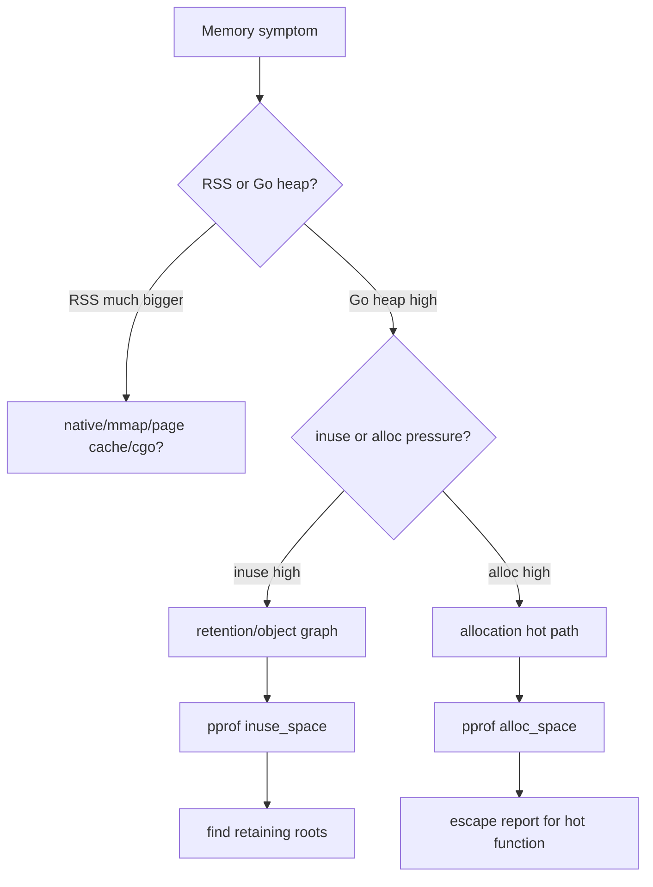

Escape report is part of triage, not the first or only tool.

---

## 58. Mini Lab Set

### Lab 1 — Pointer return

Write two functions:

```go
func MakePtr() *int
func MakeVal() int
```

Run escape analysis and benchmark.

Questions:

1. Which one escapes?
2. Does benchmark show allocation?
3. Is pointer API semantically required?

### Lab 2 — Closure retention

Create a 100 MB slice, return closure that only uses len.

Version A captures slice.

Version B captures len.

Use heap profile to observe retention.

### Lab 3 — `fmt.Sprintf` vs `strconv.AppendInt`

Encode 1 million records.

Compare:

1. `fmt.Sprintf`,
2. `strings.Builder`,
3. `[]byte` with `strconv.AppendInt`.

Measure:

1. ns/op,
2. B/op,
3. allocs/op.

### Lab 4 — `map[string]any` vs typed struct

Parse simulated records into:

1. `map[string]any`,
2. typed struct.

Compare allocation and readability.

### Lab 5 — Channel retention

Send large buffers into buffered channel and block consumer.

Observe heap inuse.

Then reduce channel size or send metadata only.

---

## 59. Review Rubric

Use this scoring for hot path code:

| Area | Good | Risky |
|---|---|---|
| Ownership | clear caller/callee ownership | ambiguous buffer sharing |
| Lifetime | scoped to request/operation | hidden global/goroutine retention |
| Interface | typed where hot | `any` everywhere |
| Allocation | measured and justified | guessed from intuition |
| Retention | copies when needed to release big data | small view retains huge data |
| Unsafe | isolated and proven | used casually for zero-copy |
| Pooling | reset + ownership safe | premature, capacity leak |
| Observability | benchmark/profile exists | no measurement |

---

## 60. Key Takeaways

1. Escape analysis is about **lifetime proof**, not merely performance.
2. Returning pointer to local variable is safe in Go because compiler can move storage to heap.
3. Taking address does not automatically mean heap allocation.
4. Interface, closure, goroutine, reflection, dynamic size, and global storage often widen lifetime.
5. Heap allocation is not automatically bad.
6. Zero allocation is not automatically good.
7. Small copy can be better than retaining huge memory.
8. Escape report must be combined with benchmark and pprof.
9. API ownership design is often the real fix.
10. Unsafe should not be used just to beat allocation.
11. For Java engineers, Go requires more explicit source-level lifetime reasoning than relying on JIT escape optimization.
12. The best memory optimization is often a clearer boundary, not a clever trick.

---

## 61. What Comes Next

Part 006 gave us the compiler/lifetime lens.

Part 007 will go deeper into what happens once allocation really happens:

```text
learn-go-memory-systems-part-007.md
```

Topic:

> Allocation mechanics: tiny allocator, size classes, spans, arenas, zeroing cost.

That part will explain why object size, pointer content, allocator path, span class, and zeroing cost affect performance even after escape analysis has already decided heap vs stack.

---

## 62. Appendix — Source Anchors

This part is aligned with the following official Go concepts and documents:

1. Go compiler escape analysis implementation comments in `cmd/compile/internal/escape`.
2. Go GC guide: stack allocation, heap allocation, live heap, allocation rate, GC cost model.
3. Go language specification: variables, addressability, function calls, method values, interface values, composite values.
4. Go diagnostics documentation: profiling, tracing, heap profile, runtime memory observation.
5. Go blog on PGO: inlining can enable additional optimization such as better escape analysis.
6. Go release notes around compiler escape precision and stack allocation improvements.

The practical rule remains:

> Treat compiler reports as evidence, benchmarks as measurement, profiles as system-level truth, and API ownership as the design lever.

<!-- NAVIGATION_FOOTER -->
<div class="page-nav">
<a href="./learn-go-memory-systems-part-005.md">⬅️ Go Memory Management, Pointer, Byte & Bit, Buffer, Stream, Boxing/Unboxing, Off-Heap, Zero Copy, Garbage Collection</a>
<a href="./index.md">📚 Kategori</a>
<a href="../../index.md">🏠 Home</a>
<a href="./learn-go-memory-systems-part-007.md">Go Memory Systems — Part 007: Allocation Mechanics ➡️</a>
</div>
