# learn-go-memory-systems-part-007.md

# Go Memory Systems — Part 007: Allocation Mechanics

> Seri: `learn-go-memory-systems`  
> Part: `007`  
> Topik: **Allocation mechanics: tiny allocator, size classes, spans, arenas, zeroing cost**  
> Target pembaca: Java software engineer yang ingin memahami Go memory runtime sampai level production engineering  
> Target Go: Go 1.26.x

---

## 0. Posisi Part Ini Dalam Seri

Pada part sebelumnya kita sudah membahas:

1. model besar memory process,
2. representasi value Go,
3. pointer dan aliasing,
4. stack goroutine,
5. heap lifecycle,
6. escape analysis.

Part ini menjawab pertanyaan berikut:

> Setelah compiler memutuskan suatu nilai harus dialokasikan di heap, apa yang sebenarnya dilakukan runtime Go?

Pertanyaan itu terlihat kecil, tetapi dampaknya besar untuk performance engineering.

Banyak engineer berhenti pada kalimat:

> “Kalau escape, masuk heap, lalu nanti di-GC.”

Kalimat itu benar, tetapi terlalu kasar.

Di sistem produksi, detail yang hilang dari kalimat itu adalah:

- object kecil tidak selalu diperlakukan sama dengan object besar,
- size object sering dibulatkan ke size class tertentu,
- allocator memakai struktur seperti span dan per-P cache,
- object pointer-free lebih murah untuk GC daripada object yang mengandung pointer,
- allocation bukan hanya mengambil memory, tetapi juga bisa menimbulkan zeroing, metadata, write barrier, scanning, pacer pressure, dan fragmentation,
- RSS process tidak selalu turun segera setelah object tidak reachable,
- pool atau custom arena-like design bisa membantu, tetapi juga bisa memperburuk retention.

Part ini adalah jembatan antara **escape analysis** dan **GC architecture**.

Escape analysis menjawab:

> “Apakah value ini perlu hidup di heap?”

Allocation mechanics menjawab:

> “Kalau iya, bagaimana runtime mengalokasikan, mengelompokkan, men-zero, mencatat, dan membuat object itu terlihat bagi GC?”

---

## 1. Learning Objectives

Setelah menyelesaikan part ini, Anda harus mampu:

1. membedakan allocation cost dari allocation visibility,
2. memahami mengapa object kecil banyak bisa mahal,
3. memahami mengapa object besar jarang tetapi jumbo bisa menghancurkan latency/RSS,
4. membaca Go allocator sebagai sistem bertingkat, bukan satu global heap lock,
5. memahami konsep size class, span, mcache, mcentral, mheap secara mental-model,
6. memahami tiny allocator dan batasannya,
7. memahami zeroing cost dan mengapa object reuse tidak selalu gratis,
8. memahami pointer-free vs pointer-containing object dalam hubungannya dengan GC scan,
9. memahami arena sebagai konsep internal/runtime dan sebagai design pattern, bukan fitur publik umum yang boleh digunakan sembarangan,
10. membuat keputusan production-level tentang struct layout, buffer ownership, pooling, allocation budget, dan observability.

---

## 2. Sumber Faktual Utama

Materi ini disusun dengan fondasi dari sumber resmi Go berikut:

- Go runtime allocator source: `runtime/malloc.go`
- Go heap source: `runtime/mheap.go`
- Go per-P allocator cache source: `runtime/mcache.go`
- Go heap bitmap source: `runtime/mbitmap.go`
- Go GC guide: `go.dev/doc/gc-guide`
- Go diagnostics: `go.dev/doc/diagnostics`
- Go runtime/debug documentation
- Go 1.26 release notes, termasuk perubahan GC Green Tea sebagai default

Catatan penting:

- runtime internals dapat berubah antar versi Go,
- mental model di part ini dipakai untuk reasoning, bukan untuk menulis kode yang bergantung pada layout internal runtime,
- kode aplikasi tidak boleh mengimpor package internal runtime,
- observasi performa tetap harus dibuktikan dengan benchmark dan profile pada versi Go yang dipakai.

---

## 3. Why Java Engineers Often Misread Go Allocation

Sebagai Java engineer, Anda mungkin terbiasa dengan model seperti:

- object selalu heap object kecuali scalar optimized by JIT,
- thread-local allocation buffer atau TLAB,
- generational GC,
- young generation,
- old generation,
- object header,
- compressed ordinary object pointer,
- escape analysis/JIT scalar replacement,
- direct buffer/off-heap,
- explicit heap sizing via `-Xms` dan `-Xmx`.

Go berbeda.

Go punya:

- ahead-of-time compiler,
- stack allocation agresif jika lifetime bisa dibuktikan,
- goroutine stack kecil dan growable,
- non-moving GC secara historis,
- runtime allocator dengan size classes,
- per-P cache untuk mengurangi contention,
- small object allocator,
- tiny allocator untuk object kecil pointer-free,
- memory limit berbasis soft limit (`GOMEMLIMIT`/`debug.SetMemoryLimit`), bukan `-Xmx` identik JVM,
- pointer metadata untuk precise GC,
- profile/metrics yang perlu dibaca dengan istilah Go, bukan JVM.

Jadi saat Anda melihat kode:

```go
func NewUser(id int64, name string) *User {
    return &User{ID: id, Name: name}
}
```

jangan langsung berpikir:

> “Ini sama seperti `new User()` di Java.”

Lebih tepat:

1. compiler menganalisis lifetime,
2. karena pointer dikembalikan, object kemungkinan escape,
3. runtime mengalokasikan object dengan ukuran tertentu,
4. ukuran dibulatkan ke size class jika small object,
5. object ditempatkan pada span yang sesuai,
6. memory di-zero sesuai kebutuhan,
7. pointer metadata object diketahui runtime,
8. object menjadi bagian dari heap graph,
9. GC akan men-scan object jika mengandung pointer,
10. object akan direclaim setelah tidak reachable dan setelah siklus GC/sweep sesuai mekanisme runtime.

Itu jauh lebih panjang daripada “new object”.

---

## 4. Big Picture: From Source Code to Heap Object

Diagram berikut menggambarkan pipeline allocation secara konseptual.

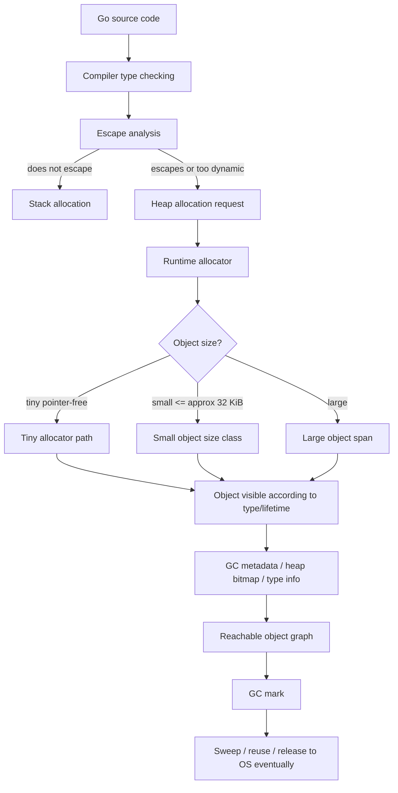

Ada tiga keputusan besar:

1. stack atau heap,
2. kalau heap: tiny, small, atau large,
3. kalau heap: pointer-free atau pointer-containing.

Ketiga keputusan ini memengaruhi:

- allocation latency,
- allocation throughput,
- GC scan cost,
- memory fragmentation,
- RSS behavior,
- profile interpretation.

---

## 5. Vocabulary: Istilah Wajib

Sebelum masuk detail, kita samakan istilah.

| Istilah | Makna |
|---|---|
| Allocation | Proses mendapatkan memory untuk object/value runtime |
| Heap object | Object yang lifetime-nya dikelola heap runtime |
| Small object | Object yang ukurannya masuk size class kecil runtime |
| Large object | Object yang terlalu besar untuk small object size class dan mendapat span khusus |
| Size class | Bucket ukuran yang dipakai allocator untuk membulatkan ukuran object kecil |
| Span / `mspan` | Sekumpulan page yang dikelola runtime untuk object ukuran tertentu atau large object |
| Page | Unit memory level runtime/OS; runtime Go punya page allocator sendiri di atas OS memory |
| `mcache` | Per-P allocation cache untuk fast-path allocation |
| `mcentral` | Central free list per size class untuk mengisi `mcache` |
| `mheap` | Heap global runtime yang mengelola span dan meminta/mengembalikan memory ke OS |
| Tiny allocator | Optimisasi untuk object sangat kecil yang tidak mengandung pointer |
| Zeroing | Mengisi memory dengan zero value sebelum digunakan sebagai Go object |
| Scannable object | Object yang mengandung pointer dan perlu dipertimbangkan GC scan |
| Noscan object | Object tanpa pointer sehingga GC tidak perlu men-scan isi object sebagai pointer |
| Fragmentation | Memory terpakai/tertahan karena layout allocator, bukan karena semua byte masih aktif |
| RSS | Resident Set Size: memory fisik process yang sedang resident menurut OS |
| Live heap | Heap object yang reachable setelah GC mark |

---

## 6. The Allocation Question Is Not Binary

Pertanyaan awam:

> “Ini allocation atau bukan?”

Pertanyaan yang lebih baik:

1. Apakah ini stack allocation atau heap allocation?
2. Jika heap, berapa ukuran object sebenarnya?
3. Ukuran itu masuk size class mana?
4. Apakah object mengandung pointer?
5. Apakah object menahan backing storage lain?
6. Apakah allocation terjadi di hot path?
7. Berapa allocation rate per second?
8. Berapa object yang live setelah request selesai?
9. Apakah object membuat GC harus men-scan lebih banyak pointer?
10. Apakah object menyebabkan RSS naik karena large span atau page retention?

Contoh:

```go
type A struct {
    X int64
    Y int64
}

type B struct {
    X *int64
    Y *int64
}
```

`A` dan `B` mungkin sama-sama kecil secara byte size, tetapi bagi GC berbeda:

- `A` pointer-free,
- `B` pointer-containing.

Object pointer-containing dapat menambah beban scanning, karena GC perlu memahami apakah field pointer tersebut menunjuk object lain.

Contoh lain:

```go
type View struct {
    Data []byte
}
```

`View` kecil secara ukuran struct, tetapi bisa menahan backing array ratusan MB jika `Data` adalah subslice dari buffer besar.

Jadi allocation cost tidak hanya ukuran object langsung.

---

## 7. Fast Path vs Slow Path

Allocator dirancang supaya allocation umum berjalan cepat.

Secara konseptual:

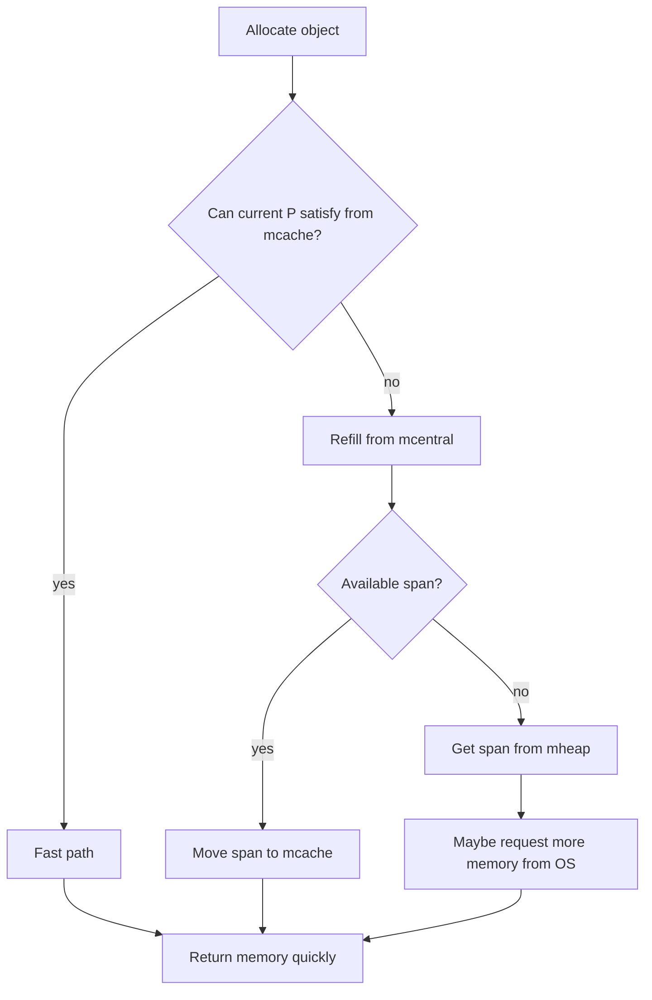

Fast path idealnya tidak perlu global lock berat.

Slow path muncul ketika:

- current per-P cache kehabisan slot untuk size class tertentu,
- central list perlu refill,
- heap perlu span baru,
- runtime perlu meminta memory ke OS,
- GC pacing/mutator assist terlibat,
- allocation besar perlu span khusus,
- memory pressure membuat runtime lebih agresif.

Dari sudut pandang application engineer, Anda tidak mengontrol path ini langsung. Tetapi Anda mengontrol pola allocation yang memicu path tersebut.

Contoh hot path buruk:

```go
func Handle(items []Item) int {
    total := 0
    for _, item := range items {
        payload := make([]byte, 0, 1024)
        payload = append(payload, item.Encode()...)
        total += len(payload)
    }
    return total
}
```

Jika loop ini berjalan jutaan kali, Anda membuat allocation pressure tinggi.

Versi lebih baik mungkin:

```go
func Handle(items []Item) int {
    total := 0
    buf := make([]byte, 0, 1024)
    for _, item := range items {
        buf = buf[:0]
        buf = item.AppendEncode(buf)
        total += len(buf)
    }
    return total
}
```

Tetapi versi kedua hanya aman jika `AppendEncode` tidak menyimpan `buf` untuk dipakai setelah iterasi.

---

## 8. Small Object Allocation

Runtime Go mengelompokkan small object ke size classes.

Secara konseptual, object kecil tidak selalu dialokasikan dengan ukuran persis.

Jika Anda allocate 33 bytes, runtime dapat membulatkannya ke size class tertentu, misalnya 48 bytes atau ukuran lain sesuai tabel internal versi Go tersebut.

Contoh konseptual:

| Requested size | Allocated size class | Internal slack |
|---:|---:|---:|
| 1 byte | 8 bytes | 7 bytes |
| 9 bytes | 16 bytes | 7 bytes |
| 17 bytes | 24/32 bytes | tergantung size class |
| 33 bytes | 48 bytes | 15 bytes |
| 1000 bytes | class sekitar 1024/1152 | tergantung runtime |

Angka persis size class adalah detail runtime dan dapat berubah. Prinsipnya:

> Small object dibulatkan ke kelas ukuran tertentu supaya allocator bisa reuse slot secara efisien.

Dampaknya:

- mengurangi kompleksitas allocator,
- meningkatkan reuse,
- mempercepat allocation,
- tetapi menciptakan internal fragmentation.

### 8.1 Mengapa Size Class Ada?

Tanpa size class, allocator harus menangani ukuran arbitrary:

```text
13 bytes, 17 bytes, 29 bytes, 31 bytes, 37 bytes, ...
```

Itu menyulitkan reuse memory.

Dengan size class:

```text
8, 16, 24, 32, 48, 64, ...
```

runtime bisa mengelola slot-slot seragam dalam span tertentu.

### 8.2 Analogi Java

Di JVM, allocation sering terasa seperti bump pointer dalam TLAB untuk young generation.

Go allocator tidak identik dengan JVM generational allocation. Namun konsep fast allocation tetap ada melalui per-P cache dan free slot dalam span.

Perbandingan mental:

| Aspek | JVM umum | Go |
|---|---|---|
| Fast allocation | TLAB/bump pointer | per-P mcache/span free slot |
| Generational | Umumnya ya | Secara tradisional tidak generational; Go 1.26 default Green Tea GC tetap harus dilihat dari docs/runtime versi terkait |
| Object movement | Banyak GC JVM dapat moving/compacting | Go GC historis non-moving |
| Heap sizing | `-Xms`, `-Xmx` | `GOGC`, `GOMEMLIMIT`, runtime memory behavior |
| Stack allocation | JIT escape/scalar replacement | compile-time escape analysis + stack allocation |

---

## 9. Span Mental Model

Span adalah blok memory runtime yang dipakai untuk mengelola object.

Untuk small object, satu span biasanya dipakai untuk banyak object dengan size class yang sama.

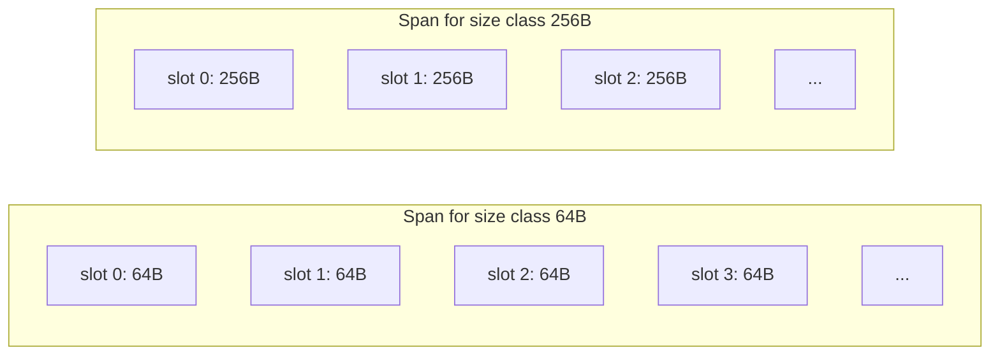

Object ukuran 64B tidak dicampur bebas dengan object ukuran 256B di slot yang sama. Ini memudahkan allocator mengetahui slot kosong dan reuse.

### 9.1 Span Lifecycle

Secara konseptual:

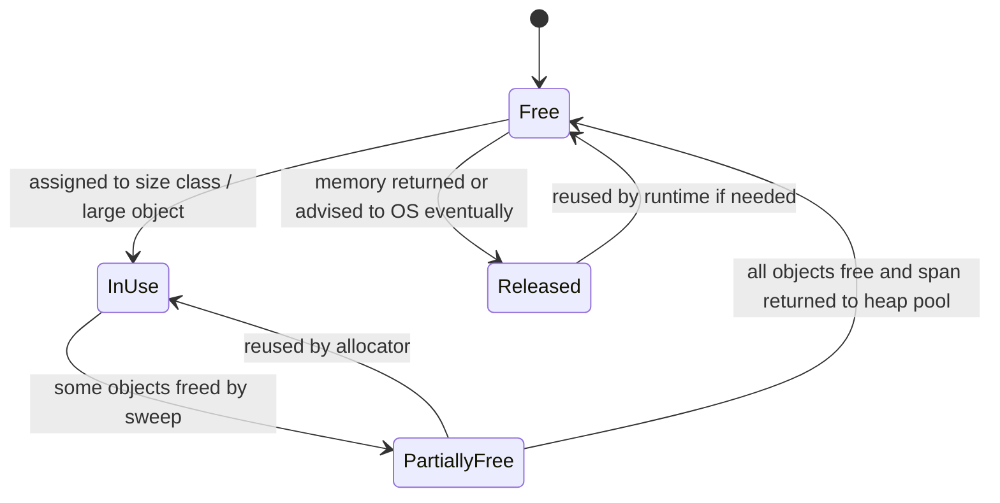

Tidak semua memory yang tidak lagi dipakai aplikasi langsung kembali ke OS. Runtime bisa menyimpan memory idle untuk reuse.

Ini penyebab umum observasi:

> “Heap profile turun, tetapi RSS belum turun.”

Itu belum tentu leak. Bisa saja runtime mempertahankan page untuk allocation berikutnya atau OS belum reclaim.

---

## 10. `mcache`, `mcentral`, `mheap`: Hierarki Allocator

Go runtime memakai struktur bertingkat.

Secara mental:

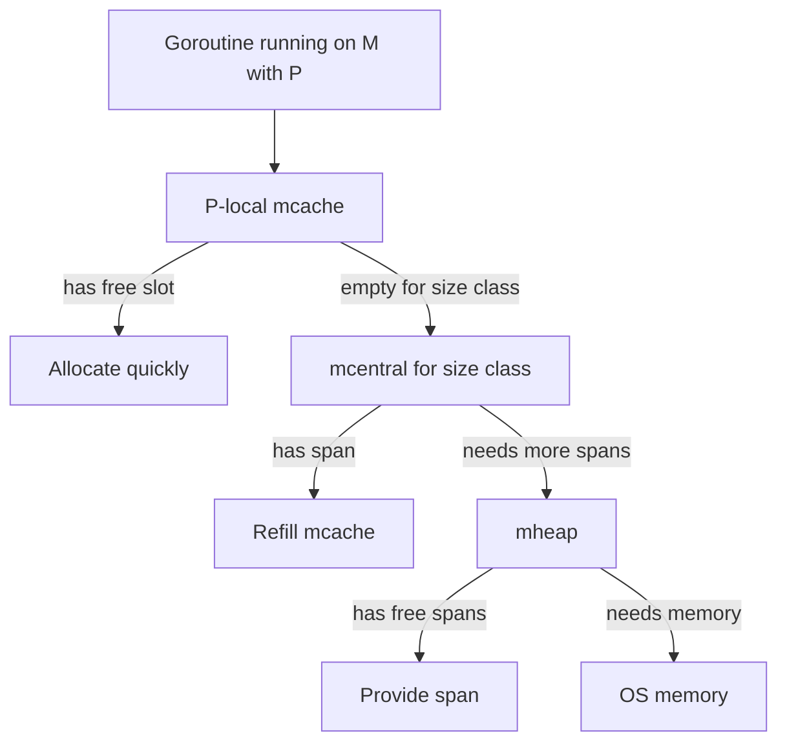

Penjelasan:

- Goroutine berjalan pada M yang memegang P.
- P punya cache allocator (`mcache`).
- `mcache` menyimpan span siap pakai untuk size class tertentu.
- Jika `mcache` kosong, runtime refill dari `mcentral`.
- `mcentral` mengelola span untuk size class tertentu.
- Jika `mcentral` butuh span baru, ia meminta ke `mheap`.
- `mheap` mengelola heap global dan interaksi dengan OS memory.

Tujuannya:

- fast path allocation tidak selalu kena global lock,
- contention berkurang,
- object kecil bisa dialokasikan sangat cepat,
- memory tetap bisa dikelola global untuk GC/sweep/release.

### 10.1 Apa Hubungannya Dengan `GOMAXPROCS`?

Karena `mcache` terkait P, jumlah P memengaruhi jumlah cache allocator aktif.

Jika `GOMAXPROCS` besar, runtime dapat memiliki lebih banyak per-P cache. Ini bisa meningkatkan throughput allocation, tetapi juga bisa memengaruhi memory footprint karena cache tersebar di lebih banyak P.

Ini bukan alasan untuk menurunkan `GOMAXPROCS` sembarangan. Ini hanya menjelaskan bahwa runtime memory behavior adalah hasil interaksi scheduler, allocator, dan workload.

---

## 11. Tiny Allocator

Tiny allocator adalah optimisasi untuk object sangat kecil yang tidak mengandung pointer.

Contoh kandidat konseptual:

```go
type Tiny struct {
    A byte
    B byte
}
```

Jika object kecil, pointer-free, dan memenuhi kriteria runtime, beberapa object dapat dipaketkan dalam satu tiny allocation block.

Tujuan tiny allocator:

- mengurangi overhead allocation banyak object kecil,
- mengurangi fragmentasi untuk object sangat kecil,
- mempercepat allocation pointer-free.

Namun tiny allocator bukan sesuatu yang harus Anda targetkan secara manual dalam desain API.

Prinsip yang lebih berguna:

> Object kecil tanpa pointer sering lebih murah daripada object kecil yang mengandung pointer.

### 11.1 Tiny Allocator Bukan Alasan Membuat Banyak Object

Buruk:

```go
type Token struct {
    Kind byte
    Pos  uint32
}

func Lex(input []byte) []*Token {
    tokens := make([]*Token, 0)
    for i := 0; i < len(input); i++ {
        tokens = append(tokens, &Token{Kind: input[i], Pos: uint32(i)})
    }
    return tokens
}
```

Lebih baik dalam banyak kasus:

```go
type Token struct {
    Kind byte
    Pos  uint32
}

func Lex(input []byte) []Token {
    tokens := make([]Token, 0, len(input))
    for i := 0; i < len(input); i++ {
        tokens = append(tokens, Token{Kind: input[i], Pos: uint32(i)})
    }
    return tokens
}
```

Versi kedua:

- mengurangi heap object per token,
- mengurangi pointer chasing,
- lebih cache-friendly,
- lebih sedikit GC metadata/scanning,
- ownership lebih jelas.

Tiny allocator tidak mengubah fakta bahwa `[]*Token` membuat graph pointer yang lebih mahal daripada `[]Token`.

---

## 12. Size Class and Internal Fragmentation

Internal fragmentation terjadi saat requested size lebih kecil dari allocated size class.

Misalnya secara konseptual:

```text
requested: 33 bytes
class:     48 bytes
slack:     15 bytes
```

Jika Anda membuat jutaan object seperti ini, slack menjadi signifikan.

### 12.1 Struct Layout Bisa Mengubah Size Class

Perhatikan:

```go
type Bad struct {
    A bool
    B int64
    C bool
    D int64
}

type Good struct {
    B int64
    D int64
    A bool
    C bool
}
```

Karena alignment dan padding, `Bad` bisa lebih besar daripada `Good`.

Jika perbedaan itu melompati boundary size class, dampaknya bisa jauh lebih besar daripada beberapa byte.

Misalnya:

```text
Good: 24 bytes -> class 24/32
Bad:  32 bytes -> class 32
```

atau dalam kasus lain:

```text
Good: 48 bytes -> class 48
Bad:  56 bytes -> class 64
```

Untuk satu object tidak penting. Untuk 50 juta object, penting.

### 12.2 Jangan Obsesif, Tapi Ukur Hot Type

Field ordering semua struct di codebase tidak perlu dibuat aneh demi micro-optimization.

Fokus pada:

- hot structs,
- objects dalam cache besar,
- per-request object yang dibuat banyak,
- telemetry/log event volume tinggi,
- parser token/AST/internal representation,
- state machine yang menyimpan jutaan entry,
- index/in-memory data structure.

Gunakan:

```go
fmt.Println(unsafe.Sizeof(MyStruct{}))
```

atau benchmark/profiling untuk memvalidasi.

---

## 13. Zeroing Cost

Go menjamin zero value.

Saat memory menjadi Go object baru, runtime harus memastikan object berada dalam kondisi zero value sebelum dipakai, kecuali compiler/runtime dapat membuktikan initialization penuh membuat zeroing tidak perlu atau bisa dieliminasi sebagian.

Contoh:

```go
buf := make([]byte, 1024*1024)
```

Ini bukan hanya “reserve 1 MiB”. Secara semantik, isi `buf` harus zero.

### 13.1 Kenapa Zeroing Penting?

Zeroing memberi safety:

- pointer field default `nil`,
- integer default `0`,
- bool default `false`,
- slice/map/channel/function default `nil`,
- tidak ada uninitialized memory terbaca oleh program aman.

Tanpa zeroing, Go akan seperti C dalam risiko membaca memory sampah.

### 13.2 Zeroing and Large Buffers

Contoh hot path buruk:

```go
func Process() {
    buf := make([]byte, 4<<20) // 4 MiB
    use(buf)
}
```

Jika `Process` dipanggil ratusan kali per detik, zeroing 4 MiB per call menjadi biaya besar.

Alternatif:

```go
type Worker struct {
    buf []byte
}

func NewWorker() *Worker {
    return &Worker{buf: make([]byte, 4<<20)}
}

func (w *Worker) Process() {
    buf := w.buf[:0]
    use(buf)
}
```

Tetapi ini hanya benar jika:

- buffer tidak bocor ke luar worker,
- data lama tidak terbaca sebagai data baru,
- concurrency aman,
- memory footprint worker bounded,
- lifetime worker jelas.

Object reuse mengurangi zeroing/allocation, tetapi meningkatkan risiko stale data dan retention.

### 13.3 Security Concern

Jika buffer berisi data sensitif:

- token,
- password,
- private key,
- PII,
- session data,

reuse buffer bisa berbahaya jika data lama tidak dibersihkan.

Kadang zeroing eksplisit diperlukan:

```go
for i := range buf {
    buf[i] = 0
}
```

Namun compiler optimization dan lifetime harus dipahami untuk kasus kriptografi. Untuk security-grade memory wiping, Go punya keterbatasan karena compiler dan runtime dapat mengoptimasi atau memindahkan data. Gunakan library yang tepat dan pahami threat model.

---

## 14. Pointer-Free vs Pointer-Containing Objects

Ini salah satu mental model terpenting.

```go
type NoPtr struct {
    A int64
    B int64
    C [16]byte
}

type HasPtr struct {
    A int64
    B *int64
    C []byte
}
```

`NoPtr` tidak mengandung pointer Go.

`HasPtr` mengandung pointer langsung dan slice header yang berisi pointer ke backing array.

Dampaknya:

| Aspek | Pointer-free | Pointer-containing |
|---|---|---|
| GC scan | Lebih murah / noscan | Perlu metadata dan scanning |
| Cache locality | Sering lebih baik | Bisa pointer chasing |
| Object graph | Datar | Bercabang |
| Retention risk | Lebih kecil | Lebih besar |
| Copy semantics | Bisa murah jika kecil | Copy menyalin alias |

### 14.1 GC Scan Cost Is Not Just Bytes

Dua struktur bisa punya ukuran byte mirip tetapi beban GC berbeda.

```go
type Flat struct {
    IDs [8]int64
}

type Graph struct {
    IDs []*int64
}
```

`Flat` menyimpan data langsung.

`Graph` menyimpan delapan pointer ke object lain.

Bagi CPU cache dan GC, `Flat` sering jauh lebih ramah.

### 14.2 Data-Oriented Design in Go

Untuk hot path, sering lebih baik:

```go
type Event struct {
    ID        uint64
    Timestamp int64
    Kind      uint16
    Flags     uint16
}

var events []Event
```

daripada:

```go
type Event struct {
    ID        *uint64
    Timestamp *int64
    Kind      *uint16
    Flags     *uint16
}

var events []*Event
```

Kecuali ada alasan kuat untuk pointer identity, sharing, optional field kompleks, atau mutation via alias, struktur flat lebih mudah diprediksi.

---

## 15. Allocation Rate vs Live Heap

Allocation rate adalah berapa banyak memory dialokasikan per satuan waktu.

Live heap adalah memory reachable setelah GC.

Dua service bisa punya live heap sama tetapi performa GC berbeda.

```text
Service A:
Live heap:       500 MiB
Allocation rate: 50 MiB/s

Service B:
Live heap:       500 MiB
Allocation rate: 3 GiB/s
```

Service B akan memberi tekanan GC jauh lebih tinggi.

### 15.1 Request-Scoped Garbage

Contoh:

```go
func Handle(req Request) Response {
    tmp1 := make([]byte, 64<<10)
    tmp2 := make([]byte, 64<<10)
    tmp3 := make([]byte, 64<<10)
    _ = tmp1
    _ = tmp2
    _ = tmp3
    return Response{}
}
```

Setelah request selesai, memory tidak live. Tetapi allocation rate tinggi.

GC tetap harus bekerja karena heap tumbuh akibat allocation.

### 15.2 Why Low Live Heap Can Still Have Bad Latency

Jika allocation rate tinggi:

- allocator sering bekerja,
- GC pacer menargetkan heap growth,
- mutator assist bisa terjadi,
- CPU untuk GC meningkat,
- tail latency bisa naik,
- cache locality memburuk.

Maka metrik penting bukan hanya `heap inuse`, tetapi juga:

- allocation bytes/op,
- allocation objects/op,
- alloc_space profile,
- GC CPU fraction,
- pause distribution,
- p99 latency saat load.

---

## 16. Large Object Allocation

Object besar diperlakukan berbeda dari small object.

Contoh:

```go
buf := make([]byte, 10<<20) // 10 MiB
```

Object ini tidak cocok dimasukkan ke slot small size class. Runtime perlu mengelola span besar.

Dampak large object:

- bisa meningkatkan RSS cepat,
- bisa menciptakan fragmentation lebih terlihat,
- zeroing cost besar,
- allocation/free pattern bisa membuat memory sulit turun segera,
- jika disimpan di slice/map/cache, retention sangat mahal.

### 16.1 Large Object in Request Path

Buruk:

```go
func Upload(w http.ResponseWriter, r *http.Request) {
    body, err := io.ReadAll(r.Body)
    if err != nil {
        http.Error(w, err.Error(), http.StatusBadRequest)
        return
    }
    process(body)
}
```

Jika request body bisa 500 MiB, Anda baru saja membuat large allocation dan mungkin OOM.

Lebih baik:

```go
func Upload(w http.ResponseWriter, r *http.Request) {
    limited := http.MaxBytesReader(w, r.Body, 100<<20)
    defer limited.Close()

    if err := processStream(limited); err != nil {
        http.Error(w, err.Error(), http.StatusBadRequest)
        return
    }
}
```

Streaming sering lebih penting daripada zero-copy.

---

## 17. Allocation and Write Barriers

Ketika object mengandung pointer dan pointer field diubah, GC write barrier dapat terlibat ketika GC sedang berjalan.

Contoh:

```go
type Node struct {
    Next *Node
    Data []byte
}

func Link(a, b *Node) {
    a.Next = b
}
```

Assignment pointer bukan hanya CPU store biasa dalam semua fase runtime. Saat concurrent GC, runtime perlu menjaga invariant marking.

Sebagai application engineer, Anda tidak memanggil write barrier. Tetapi Anda dapat mengurangi pointer mutation yang tidak perlu di hot path.

### 17.1 Pointer Churn

Contoh hot graph mutation:

```go
for i := range nodes {
    nodes[i].Next = computeNext(i)
}
```

Jika dilakukan terus menerus pada object heap yang besar, pointer churn bisa menambah biaya runtime.

Alternatif desain bisa memakai index:

```go
type Node struct {
    NextIndex int32
    DataStart int32
    DataLen   int32
}
```

Index bukan pointer. Ini bisa mengurangi GC scanning dan pointer write barrier, tetapi menambah kompleksitas bounds/lookup.

Tidak ada jawaban universal. Ini design trade-off.

---

## 18. Allocation Metadata and GC Bitmap

Runtime perlu tahu word mana dalam object yang merupakan pointer.

Untuk precise GC, runtime tidak boleh menganggap semua integer sebagai pointer.

Secara konseptual:

```text
Object memory words:
+-------+-------+-------+-------+
| int64 | *Obj  | int64 | []byte |
+-------+-------+-------+-------+

Pointer bitmap:
  0       1       0       1/metadata for slice pointer field
```

GC memakai metadata tipe/bitmap untuk men-scan object.

Dampak bagi engineer:

- pointer field menambah scan responsibility,
- pointer-free object bisa masuk noscan path,
- `uintptr` bukan pointer bagi GC,
- menyimpan pointer sebagai integer via unsafe bisa membuat GC tidak melihat object tersebut,
- unsafe pointer tricks dapat menyebabkan use-after-free atau memory corruption.

---

## 19. `make` vs `new` vs Composite Literal

Dari sisi allocation mechanics, pertanyaan bukan hanya syntax.

```go
p := new(T)
```

membuat zero value `T` dan menghasilkan `*T`.

```go
p := &T{A: 1}
```

membuat `T` dan mengambil address-nya.

```go
s := make([]byte, 1024)
```

membuat slice header dan backing array.

```go
m := make(map[string]int, 1024)
```

membuat map runtime structure dan bucket sesuai kebutuhan.

```go
ch := make(chan int, 128)
```

membuat channel runtime structure dan buffer jika buffered.

Pertanyaan penting:

- Apakah hasilnya escape?
- Apakah backing storage besar?
- Apakah object pointer-containing?
- Apakah kapasitas awal tepat?
- Apakah object akan live lama?
- Apakah object masuk hot path?

### 19.1 Composite Literal Does Not Mean Heap

```go
func F() T {
    return T{A: 1, B: 2}
}
```

Ini tidak otomatis heap allocation.

```go
func G() *T {
    return &T{A: 1, B: 2}
}
```

Ini kemungkinan heap karena pointer keluar.

Tapi keputusan final tetap compiler escape analysis.

---

## 20. Allocation by Slices

Slice adalah salah satu sumber allocation paling umum.

```go
s := make([]int, 0, 10)
```

Ini membuat backing array kapasitas 10.

```go
s = append(s, x)
```

Jika capacity cukup, tidak allocate backing array baru.

Jika capacity tidak cukup, runtime allocate backing array baru dan copy element lama.

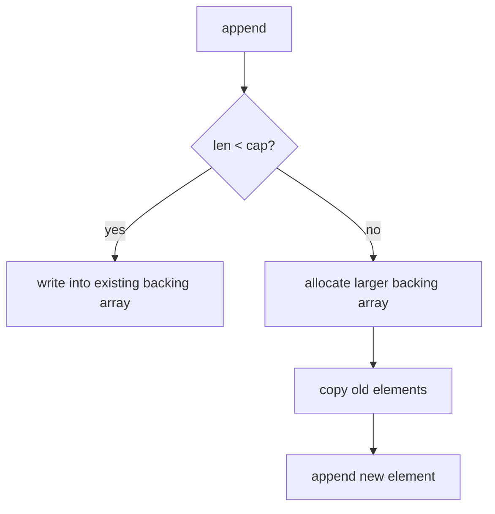

### 20.1 Capacity Planning

Buruk:

```go
var out []Item
for _, row := range rows {
    out = append(out, convert(row))
}
```

Lebih baik jika jumlah diketahui:

```go
out := make([]Item, 0, len(rows))
for _, row := range rows {
    out = append(out, convert(row))
}
```

Tetapi jangan asal preallocate sangat besar jika jumlah tidak reliable.

```go
out := make([]Item, 0, userProvidedCount)
```

Jika `userProvidedCount` bisa jutaan karena input eksternal, ini membuka memory abuse.

### 20.2 Slice of Value vs Slice of Pointer

```go
[]User
```

vs

```go
[]*User
```

Trade-off:

| Aspek | `[]User` | `[]*User` |
|---|---|---|
| Locality | Lebih baik | Pointer chasing |
| GC scan | Tergantung fields; tidak ada pointer per element jika field flat | Slice berisi banyak pointer |
| Mutation sharing | Harus lewat index/pointer ke element | Mudah share object |
| Stable address | Bisa berubah jika backing array reallocated | Object address stabil |
| Copy on append grow | Copy semua element | Copy pointer saja |

Tidak ada rule “selalu value” atau “selalu pointer”.

Untuk large struct, `[]*T` mungkin menghindari copy besar. Untuk hot read-only small struct, `[]T` sering lebih baik.

---

## 21. Allocation by Maps

Map allocation punya karakteristik khusus:

```go
m := make(map[string]int, 1024)
```

Hint capacity membantu runtime menyiapkan bucket, tetapi bukan kontrak ukuran final.

Map dapat allocate bucket tambahan saat tumbuh.

### 21.1 Map Retention

Map sering menjadi sumber retention:

```go
cache := map[string][]byte{}
cache[key] = hugeBuffer
```

Selama entry ada, backing array `hugeBuffer` reachable.

Menghapus entry:

```go
delete(cache, key)
```

membuat value tidak reachable jika tidak ada referensi lain. Tetapi struktur bucket map tidak selalu segera shrink seperti ekspektasi naive.

Jika cache besar mengalami churn, memory behavior harus diprofile.

### 21.2 Map Key Allocation

String key bisa menyebabkan allocation jika dibuat dari `[]byte`:

```go
key := string(buf[start:end])
m[key]++
```

Konversi `[]byte` ke `string` normalnya copy.

Di parser hot path, ini bisa mahal.

Alternatif:

- intern key secara sadar,
- gunakan hash dari bytes,
- gunakan trie/state machine,
- gunakan unsafe string hanya jika immutable/lifetime contract benar,
- copy secara eksplisit jika ownership boundary perlu aman.

---

## 22. Allocation by Interfaces and Variadic `any`

Interface dapat menyembunyikan allocation.

```go
func Log(args ...any) {}

func F(x int, s string) {
    Log(x, s)
}
```

Variadic `...any` membuat slice of interface values. Dalam beberapa kondisi, value concrete juga dapat escape.

`fmt.Sprintf`, structured logging, `encoding/json`, reflection-heavy code sering menjadi sumber allocation tinggi.

### 22.1 Hot Path Logging

Buruk:

```go
logger.Debugf("user=%v payload=%v", user, payload)
```

Jika debug disabled tetapi formatting tetap terjadi, allocation/cost tetap mungkin ada tergantung logger.

Lebih baik:

```go
if logger.Enabled(DebugLevel) {
    logger.Debug("user", "id", user.ID, "payload_size", len(payload))
}
```

Namun structured logging juga bisa allocate tergantung implementasi.

Selalu ukur.

---

## 23. Allocation by Closures and Method Values

Closure dapat allocate jika capture escape.

```go
func MakeAdder(base int) func(int) int {
    return func(x int) int {
        return base + x
    }
}
```

`base` harus hidup selama function value hidup.

Method value juga bisa capture receiver:

```go
type Worker struct{}

func (w *Worker) Run() {}

func F(w *Worker) func() {
    return w.Run
}
```

Function value menyimpan receiver.

Jika receiver besar atau menahan graph besar, function value bisa mempertahankan memory.

---

## 24. Allocation by Channels

Channel sendiri adalah runtime object.

```go
ch := make(chan []byte, 1024)
```

Buffered channel menyimpan slot untuk element.

Jika element adalah `[]byte`, channel buffer menyimpan slice headers yang menahan backing arrays.

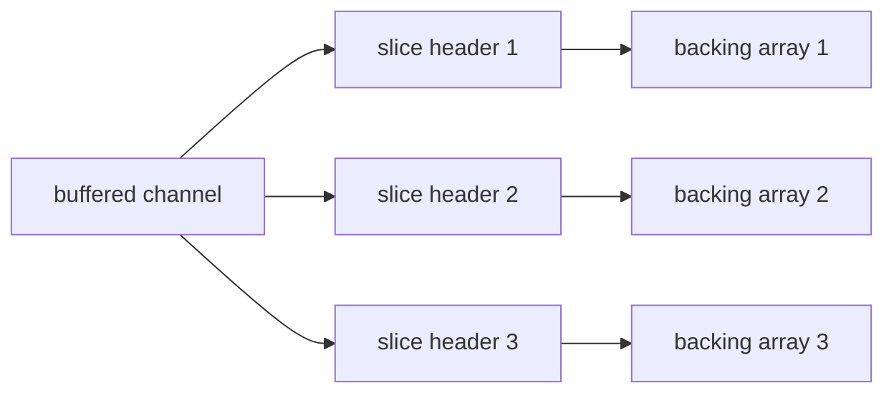

Jika channel panjang dan consumer lambat, memory naik.

Channel bukan queue tak terbatas, tetapi buffered channel besar bisa menjadi retention mechanism.

---

## 25. Allocation and `sync.Pool`

`sync.Pool` sering dipakai untuk mengurangi allocation.

Namun `sync.Pool` bukan free list deterministik.

Karakteristik penting:

- cocok untuk temporary object,
- item dalam pool bisa hilang saat GC,
- pool dapat mengurangi allocation rate,
- pool dapat meningkatkan retention jika object besar disimpan sembarangan,
- object harus di-reset dengan benar,
- object tidak boleh dipakai setelah dikembalikan ke pool,
- pooled buffer tidak boleh bocor ke caller yang menyimpannya.

Contoh:

```go
var bufPool = sync.Pool{
    New: func() any {
        b := make([]byte, 0, 64<<10)
        return &b
    },
}

func Use() {
    p := bufPool.Get().(*[]byte)
    buf := (*p)[:0]
    defer func() {
        if cap(buf) <= 1<<20 {
            *p = buf[:0]
            bufPool.Put(p)
        }
    }()

    // use buf without storing it globally
}
```

Perhatikan guard `cap(buf) <= 1<<20`. Tanpa guard, satu request besar bisa membuat pool menyimpan buffer raksasa dan menaikkan baseline memory.

### 25.1 Pool Anti-Pattern

Buruk:

```go
func Encode(v Value) []byte {
    b := bufPool.Get().(*bytes.Buffer)
    b.Reset()
    defer bufPool.Put(b)

    encodeInto(b, v)
    return b.Bytes() // BUG: returning pooled buffer view
}
```

Setelah function return, buffer dikembalikan ke pool. Caller memegang view ke memory yang bisa dipakai ulang.

Lebih aman:

```go
func Encode(v Value) []byte {
    b := bufPool.Get().(*bytes.Buffer)
    b.Reset()
    defer bufPool.Put(b)

    encodeInto(b, v)
    out := append([]byte(nil), b.Bytes()...)
    return out
}
```

Copy di boundary bisa lebih benar daripada zero-copy palsu.

---

## 26. Arenas: Concept vs Public API Reality

Istilah arena berarti memory region tempat banyak object dialokasikan bersama dan dibebaskan bersama.

Konsep arena:

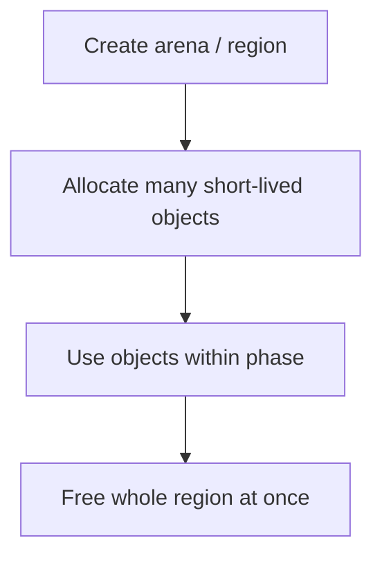

Arena cocok untuk fase seperti:

- parsing request besar,
- building temporary graph,
- compiling query plan,
- per-batch processing,
- temporary AST,
- simulation step.

Tetapi Go tidak menyediakan arena sebagai fitur publik stabil umum untuk aplikasi biasa dalam cara seperti allocator manual C.

Ada eksperimen/internal runtime yang tidak boleh dianggap API production stabil kecuali dokumentasi versi Go menyatakan demikian.

### 26.1 Arena-Like Design Without Unsafe

Anda bisa membuat arena-like design memakai slices.

Contoh:

```go
type Node struct {
    Kind  uint16
    Left  int32
    Right int32
    Value int64
}

type Region struct {
    nodes []Node
}

func NewRegion(capacity int) *Region {
    return &Region{nodes: make([]Node, 0, capacity)}
}

func (r *Region) NewNode(n Node) int32 {
    r.nodes = append(r.nodes, n)
    return int32(len(r.nodes) - 1)
}

func (r *Region) Reset() {
    r.nodes = r.nodes[:0]
}
```

Ini bukan off-heap. Ini tetap Go heap. Tetapi:

- allocation jumlah object per node hilang,
- object menjadi flat array,
- GC graph lebih sederhana,
- reset murah,
- lifetime phase jelas.

Kelemahannya:

- index harus divalidasi,
- references bukan pointer langsung,
- data bisa invalid setelah reset,
- capacity bisa retain memory besar.

### 26.2 Region Capacity Guard

```go
func (r *Region) ResetOrRelease(maxCap int) {
    if cap(r.nodes) > maxCap {
        r.nodes = nil
        return
    }
    r.nodes = r.nodes[:0]
}
```

Pattern ini penting untuk mencegah batch besar sekali membuat memory besar tertahan selamanya.

---

## 27. Fragmentation: Internal and External

Fragmentation berarti memory tersedia tidak selalu cocok dengan kebutuhan allocation berikutnya.

### 27.1 Internal Fragmentation

Terjadi karena size class rounding.

```text
request 49 bytes -> class 64 bytes -> 15 bytes slack
```

### 27.2 External Fragmentation

Terjadi ketika memory free tersebar dalam bentuk yang tidak mudah dipakai untuk allocation tertentu.

Runtime allocator mengurangi ini dengan span/size class/page management, tetapi tidak bisa menghilangkan semua efek workload.

### 27.3 Production Symptom

- heap live tidak besar,
- RSS tetap tinggi,
- heap idle tinggi,
- heap released tidak secepat harapan,
- large object churn.

Gunakan runtime metrics dan pprof untuk membedakan:

- live object retention,
- allocator idle memory,
- OS page cache,
- cgo/native memory,
- mmap memory,
- goroutine stack memory.

---

## 28. Allocation and RSS

Heap allocation meningkatkan memory yang dikelola runtime, tetapi RSS process adalah konsep OS.

Memory bisa berada dalam beberapa kelas:

- heap live,
- heap idle,
- heap released,
- goroutine stacks,
- runtime metadata,
- mmap,
- cgo allocation,
- OS page cache effect,
- thread stacks,
- code/data segments.

Jangan menyimpulkan leak hanya dari RSS.

### 28.1 Better Diagnostic Questions

Jika RSS naik:

1. Apakah Go heap live naik?
2. Apakah allocation rate naik?
3. Apakah heap idle naik?
4. Apakah heap released rendah?
5. Apakah goroutine count naik?
6. Apakah stack memory naik?
7. Apakah ada mmap/cgo/native allocation?
8. Apakah process membaca file besar dan page cache berubah?
9. Apakah container melihat total RSS + page cache?
10. Apakah memory limit terlalu dekat dengan steady-state?

---

## 29. Zero-Cost Myth

Beberapa operasi terlihat murah tetapi tidak selalu zero-cost.

| Operasi | Potensi cost |
|---|---|
| `append` | allocate + copy jika cap habis |
| `string([]byte)` | copy allocation |
| `[]byte(string)` | copy allocation |
| `fmt.Sprintf` | allocation, interface, reflection-like formatting |
| `json.Marshal` | allocation buffer/result |
| `json.Unmarshal` ke map | many allocations |
| `make([]T, n)` | allocation + zeroing |
| `map` grow | allocate buckets + evacuation |
| closure return | capture allocation |
| goroutine capture | captured values escape |
| channel buffer | retains elements |

Go syntax ringkas bukan berarti memory behavior ringkas.

---

## 30. Case Study: Parser Token Representation

Misal kita membangun parser log high-throughput.

### 30.1 Naive Design

```go
type Token struct {
    Kind string
    Text string
    Pos  int
}

func Parse(input []byte) []*Token {
    var tokens []*Token
    for len(input) > 0 {
        kind, text, pos, rest := next(input)
        tokens = append(tokens, &Token{
            Kind: string(kind),
            Text: string(text),
            Pos:  pos,
        })
        input = rest
    }
    return tokens
}
```

Masalah:

- `[]*Token`: satu heap object per token,
- `string(kind)`: copy/allocation,
- `string(text)`: copy/allocation,
- slice growth jika tidak preallocated,
- banyak pointer untuk GC,
- tokens bisa retain string data,
- poor locality.

### 30.2 Better Value-Oriented Design

```go
type TokenKind uint16

type Token struct {
    Kind  TokenKind
    Start uint32
    End   uint32
}

func Parse(input []byte) []Token {
    tokens := make([]Token, 0, estimateTokenCount(input))
    offset := 0
    for offset < len(input) {
        kind, start, end := next(input, offset)
        tokens = append(tokens, Token{
            Kind:  kind,
            Start: uint32(start),
            End:   uint32(end),
        })
        offset = end
    }
    return tokens
}
```

Keuntungan:

- token flat,
- lebih sedikit allocation,
- pointer-free jika dirancang demikian,
- string materialization ditunda,
- ownership input jelas.

Kelemahan:

- token hanya valid selama input tersedia,
- jika input buffer reused, token menjadi invalid,
- API harus menyatakan lifetime contract.

### 30.3 Safe Boundary

Jika token harus keluar dari lifetime input:

```go
type OwnedToken struct {
    Kind TokenKind
    Text string
}

func OwnToken(input []byte, t Token) OwnedToken {
    return OwnedToken{
        Kind: t.Kind,
        Text: string(input[t.Start:t.End]),
    }
}
```

Copy dilakukan sadar di boundary, bukan acak di hot path.

---

## 31. Case Study: Batch Processing and Region Reuse

Misal batch job memproses 10 juta row.

Naive:

```go
func Process(rows []Row) []Result {
    results := make([]Result, 0)
    for _, row := range rows {
        tmp := buildTemporaryGraph(row)
        result := compute(tmp)
        results = append(results, result)
    }
    return results
}
```

Jika `buildTemporaryGraph` allocate banyak object per row, allocation rate tinggi.

Region-like:

```go
type Scratch struct {
    nodes []Node
    edges []Edge
    buf   []byte
}

func (s *Scratch) Reset() {
    s.nodes = s.nodes[:0]
    s.edges = s.edges[:0]
    s.buf = s.buf[:0]
}

func Process(rows []Row) []Result {
    results := make([]Result, 0, len(rows))
    scratch := &Scratch{
        nodes: make([]Node, 0, 1024),
        edges: make([]Edge, 0, 2048),
        buf:   make([]byte, 0, 64<<10),
    }

    for _, row := range rows {
        scratch.Reset()
        buildTemporaryGraph(row, scratch)
        result := compute(scratch)
        results = append(results, result)
    }
    return results
}
```

Keuntungan:

- allocation rate turun,
- cache locality lebih baik,
- lifetime jelas per row,
- GC pressure turun.

Risiko:

- result tidak boleh menyimpan pointer/slice ke scratch,
- scratch cap bisa tumbuh besar,
- concurrency harus dikontrol,
- stale data bug jika reset tidak benar.

---

## 32. Allocation Profiling Workflow

Saat mencurigai allocation problem, jangan mulai dari opini.

Mulai dari data.

### 32.1 Micro Level

Gunakan benchmark:

```go
func BenchmarkParse(b *testing.B) {
    input := []byte("...")
    b.ReportAllocs()
    for b.Loop() {
        _ = Parse(input)
    }
}
```

atau untuk versi Go lama:

```go
for i := 0; i < b.N; i++ {
    _ = Parse(input)
}
```

Jalankan:

```bash
go test -bench=BenchmarkParse -benchmem ./...
```

Lihat:

- ns/op,
- B/op,
- allocs/op.

### 32.2 Profile Level

```bash
go test -bench=BenchmarkParse -benchmem -memprofile=mem.out ./...
go tool pprof -http=:0 mem.out
```

Bedakan:

- `alloc_space`: total allocation historis,
- `inuse_space`: memory masih live saat profile.

### 32.3 Compiler Level

```bash
go build -gcflags='-m=2' ./...
```

Cari:

- `escapes to heap`,
- `moved to heap`,
- `inlining call`,
- closure capture,
- interface conversion.

### 32.4 Production Level

Ambil:

- heap profile,
- alloc profile,
- goroutine profile,
- runtime metrics,
- RSS/container metrics,
- request rate,
- p99 latency,
- GC CPU/pause.

Jangan optimasi microbenchmark jika production bottleneck ada di unbounded queue atau cache retention.

---

## 33. Allocation Budgeting

Top engineer tidak hanya bertanya:

> “Bisa lebih cepat?”

Mereka bertanya:

> “Berapa budget allocation per operation?”

Contoh service HTTP:

```text
Target throughput:       20,000 req/s
Allocation budget:       8 KiB/request
Total allocation rate:   ~156 MiB/s
Live heap target:        < 1.5 GiB
Container limit:         3 GiB
GC CPU budget:           < 10%
P99 latency budget:      80 ms
```

Jika satu perubahan menaikkan allocation dari 8 KiB/request ke 80 KiB/request:

```text
20,000 req/s * 80 KiB = ~1.5 GiB/s allocation rate
```

Itu bisa mengubah karakter runtime total.

### 33.1 Allocation Budget Review Checklist

Untuk endpoint hot:

- berapa allocs/op?
- berapa B/op?
- apakah body dibaca penuh?
- apakah response dibangun penuh?
- apakah JSON decode ke `map[string]any`?
- apakah logging allocate meskipun disabled?
- apakah context menyimpan object besar?
- apakah channel buffer menahan request data?
- apakah pool retain buffer besar?
- apakah cache bounded?
- apakah map key conversion allocate?

---

## 34. Common Allocation Anti-Patterns

### 34.1 Pointer Everywhere

```go
type Config struct {
    Timeout *time.Duration
    Retries *int
    Enabled *bool
}
```

Kadang pointer dipakai untuk optional. Tetapi jika semua field pointer:

- object graph membesar,
- GC scan bertambah,
- nil handling rumit,
- locality buruk.

Alternatif:

```go
type OptionalDuration struct {
    Value time.Duration
    Set   bool
}
```

atau gunakan pointer hanya di boundary config/JSON, lalu normalize ke runtime config flat.

### 34.2 `[]*T` by Default

Banyak codebase Java-minded membuat slice pointer default.

```go
var users []*User
```

Padahal `[]User` sering lebih baik untuk data read-heavy.

### 34.3 Unbounded `io.ReadAll`

```go
body, _ := io.ReadAll(r.Body)
```

Tanpa limit, ini memory bomb.

### 34.4 Returning Pooled Memory

Sudah dibahas: fatal correctness bug.

### 34.5 Large Buffer Retention in Pool

```go
pool.Put(buf[:0]) // cap may be 512 MiB
```

Gunakan cap guard.

### 34.6 Map as Forever Cache

```go
var cache = map[string]*Entry{}
```

Tanpa eviction, TTL, max size, atau observability, ini retention by design.

### 34.7 Subslice Leak

```go
func Header(packet []byte) []byte {
    return packet[:16]
}
```

Jika `packet` 10 MiB dan header disimpan lama, 10 MiB tertahan.

Copy jika lifetime berbeda:

```go
func Header(packet []byte) []byte {
    return append([]byte(nil), packet[:16]...)
}
```

---

## 35. Mermaid: Allocation Decision Tree

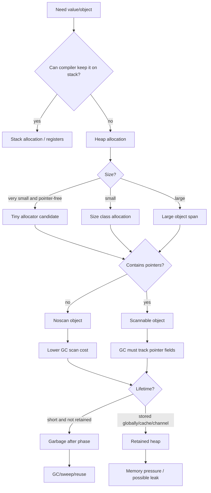

---

## 36. Mermaid: Runtime Allocator Hierarchy

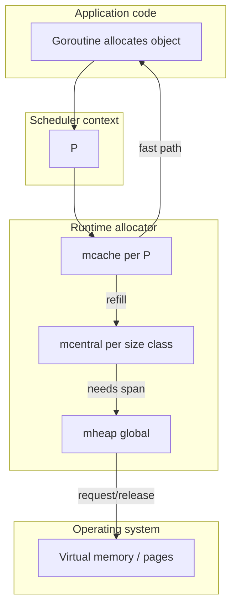

---

## 37. Mermaid: Allocation Cost Layers

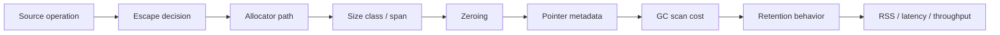

Ini alasan optimasi allocation tidak boleh hanya melihat satu layer.

---

## 38. Practical Heuristics

### 38.1 Prefer Flat Data in Hot Paths

Gunakan value slice jika:

- object kecil/sedang,
- identity tidak penting,
- mutation sharing tidak diperlukan,
- jumlah object besar,
- data read-heavy.

### 38.2 Use Pointers for Semantics, Not Habit

Pointer masuk akal jika:

- object besar dan copy mahal,
- mutability/shared identity diperlukan,
- optional field benar-benar perlu tri-state,
- object harus memenuhi interface via pointer receiver,
- lifecycle dikelola eksplisit.

### 38.3 Preallocate with Bounded Knowledge

Preallocation bagus jika size diketahui dan trusted.

Buruk jika size berasal dari input eksternal tanpa batas.

### 38.4 Stream Large Data

Untuk data besar:

- stream,
- chunk,
- limit,
- backpressure,
- avoid `io.ReadAll`,
- avoid building full output jika bisa write incrementally.

### 38.5 Pool Only After Measuring

Gunakan pool jika:

- allocation rate terbukti bottleneck,
- object reusable,
- reset aman,
- max retained size dikontrol,
- lifetime tidak bocor.

### 38.6 Copy at Ownership Boundary

Zero-copy internal boleh jika lifetime jelas.

API public lebih aman dengan copy eksplisit jika ownership berbeda.

---

## 39. Mini Lab 1: Melihat Allocation per Operation

Buat file:

```go
package alloclab

import "testing"

type User struct {
    ID   int64
    Name string
}

func BuildPointer(n int) []*User {
    out := make([]*User, 0, n)
    for i := 0; i < n; i++ {
        out = append(out, &User{ID: int64(i), Name: "alice"})
    }
    return out
}

func BuildValue(n int) []User {
    out := make([]User, 0, n)
    for i := 0; i < n; i++ {
        out = append(out, User{ID: int64(i), Name: "alice"})
    }
    return out
}

func BenchmarkBuildPointer(b *testing.B) {
    b.ReportAllocs()
    for b.Loop() {
        _ = BuildPointer(1000)
    }
}

func BenchmarkBuildValue(b *testing.B) {
    b.ReportAllocs()
    for b.Loop() {
        _ = BuildValue(1000)
    }
}
```

Jalankan:

```bash
go test -bench=. -benchmem
```

Amati:

- allocs/op,
- B/op,
- ns/op.

Ekspektasi umum:

- `BuildPointer` lebih banyak allocation karena satu heap object per user,
- `BuildValue` biasanya allocation utama hanya backing array slice.

Jangan hafal angka. Angka tergantung versi Go, arsitektur, dan optimisasi compiler.

---

## 40. Mini Lab 2: Slice Capacity Growth

```go
package main

import "fmt"

func main() {
    var s []int
    last := cap(s)
    for i := 0; i < 10_000; i++ {
        s = append(s, i)
        if cap(s) != last {
            fmt.Printf("len=%d cap=%d\n", len(s), cap(s))
            last = cap(s)
        }
    }
}
```

Observasi:

- capacity tidak naik satu per satu,
- growth policy adalah detail runtime,
- append dapat allocate dan copy saat capacity habis.

Pelajaran:

> Preallocate ketika jumlah element diketahui dan bounded.

---

## 41. Mini Lab 3: Subslice Retention

```go
package main

import (
    "runtime"
)

var keep [][]byte

func leakLike() {
    big := make([]byte, 100<<20)
    small := big[:16]
    keep = append(keep, small)
}

func copyBoundary() {
    big := make([]byte, 100<<20)
    small := append([]byte(nil), big[:16]...)
    keep = append(keep, small)
}

func main() {
    leakLike()
    runtime.GC()

    // inspect with pprof or runtime metrics in real lab
}
```

`small := big[:16]` tetap menunjuk backing array `big`.

Copy boundary memutus retention.

---

## 42. Mini Lab 4: Struct Size and Padding

```go
package main

import (
    "fmt"
    "unsafe"
)

type Bad struct {
    A bool
    B int64
    C bool
    D int64
}

type Good struct {
    B int64
    D int64
    A bool
    C bool
}

func main() {
    fmt.Println("Bad ", unsafe.Sizeof(Bad{}))
    fmt.Println("Good", unsafe.Sizeof(Good{}))
}
```

Pelajaran:

- layout memengaruhi ukuran,
- ukuran memengaruhi size class,
- size class memengaruhi memory footprint saat object banyak.

---

## 43. Mini Lab 5: Allocation Hidden in String Conversion

```go
package stringlab

import "testing"

var sink string

func BenchmarkStringConversion(b *testing.B) {
    data := []byte("hello-world")
    b.ReportAllocs()
    for b.Loop() {
        sink = string(data)
    }
}
```

Jalankan:

```bash
go test -bench=. -benchmem
```

Konversi aman `[]byte` ke `string` membuat copy. Itu benar untuk safety, tetapi bisa mahal di hot parser.

---

## 44. Production Review Checklist

Gunakan checklist berikut saat review code hot path.

### 44.1 Allocation Source

- Apakah function ini allocate?
- Apakah allocation terlihat atau tersembunyi?
- Apakah ada `make`, `append`, `string([]byte)`, `fmt`, `json`, `map`, `interface`, closure, goroutine?
- Apakah escape analysis menunjukkan heap allocation?
- Apakah benchmark membuktikan allocs/op?

### 44.2 Object Shape

- Apakah object pointer-free atau pointer-containing?
- Apakah `[]T` lebih cocok daripada `[]*T`?
- Apakah struct layout boros padding?
- Apakah object menyimpan slice/string yang menahan backing storage besar?
- Apakah map/channel/cache menahan object lebih lama dari lifecycle bisnis?

### 44.3 Buffer and Stream

- Apakah data besar dibaca penuh ke memory?
- Apakah ada limit input?
- Apakah buffer reused dengan ownership aman?
- Apakah pooled buffer punya cap guard?
- Apakah zero-copy view keluar dari lifetime aman?

### 44.4 GC and Runtime

- Apakah allocation rate sesuai budget?
- Apakah live heap naik?
- Apakah GC CPU/pause naik?
- Apakah heap profile menunjukkan alloc_space atau inuse_space?
- Apakah RSS naik karena heap, stack, mmap, cgo, atau OS?

### 44.5 Correctness

- Apakah object reuse membawa stale data?
- Apakah pointer/slice ke scratch keluar function?
- Apakah pooled object dipakai setelah Put?
- Apakah unsafe menyembunyikan pointer dari GC?
- Apakah cleanup deterministik?

---

## 45. Common Production Incident Patterns

### 45.1 High Allocation Rate, Low Live Heap

Symptom:

- RSS relatif stabil,
- GC CPU tinggi,
- p99 latency naik,
- heap live tidak besar,
- alloc_space profile besar.

Kemungkinan:

- request-scoped garbage terlalu banyak,
- formatting/logging hot path,
- JSON/map/interface allocation,
- buffer dibuat ulang terus,
- append growth tidak preallocated.

Solusi:

- reduce allocation per request,
- reuse buffer dengan aman,
- preallocate bounded,
- optimize parser/serialization,
- avoid reflection-heavy hot path.

### 45.2 Live Heap Growth

Symptom:

- inuse_space naik,
- heap objects naik,
- RSS naik,
- GC tidak menurunkan heap live.

Kemungkinan:

- cache unbounded,
- map retention,
- goroutine leak,
- channel backlog,
- slice subslice retention,
- context/global references.

Solusi:

- heap profile by inuse,
- inspect dominators/retainers,
- bound cache/queue,
- close goroutines,
- copy small slices at boundary,
- remove references explicitly if needed.

### 45.3 RSS High, Heap Profile Small

Symptom:

- pprof heap kecil,
- RSS tinggi.

Kemungkinan:

- mmap,
- cgo/native memory,
- goroutine stacks,
- heap idle not released,
- OS page cache interaction,
- thread stacks,
- runtime metadata.

Solusi:

- inspect runtime metrics memory classes,
- inspect goroutine count,
- inspect native/mmap usage,
- container metrics,
- OS tools,
- avoid assuming Go heap leak.

### 45.4 Pool Retains Jumbo Buffer

Symptom:

- memory baseline jumps after one large request,
- heap live retains large buffer through pool.

Solusi:

- cap guard before Put,
- release large buffers,
- separate small/large pools,
- bound request size,
- stream instead of buffer.

---

## 46. What Not To Memorize

Jangan menghafal:

- exact size class table,
- exact allocator implementation line by line,
- exact slice growth formula,
- exact span state details,
- internal runtime struct fields.

Hal-hal itu bisa berubah.

Yang perlu dipahami:

- allocation small/large berbeda,
- object size dibulatkan,
- per-P cache mengurangi contention,
- span adalah unit manajemen object/page,
- pointer-free object lebih murah untuk GC scanning,
- zeroing punya cost,
- allocation rate dan live heap adalah dua masalah berbeda,
- RSS bukan sama dengan live heap,
- pooling dan arena-like design adalah trade-off ownership/lifetime, bukan magic.

---

## 47. Strong Mental Models

### 47.1 Allocation Is a Lifecycle Event

Allocation bukan hanya “ambil bytes”.

Allocation berarti:

1. menentukan lokasi memory,
2. memenuhi alignment/size class,
3. zeroing,
4. membuat object valid menurut type system,
5. membuat object masuk heap graph jika heap,
6. menambah allocation pressure,
7. memengaruhi GC pacing,
8. mungkin memengaruhi RSS.

### 47.2 Object Shape Matters

Ukuran byte penting, tetapi shape lebih penting:

- flat atau graph,
- pointer-free atau pointer-rich,
- contiguous atau scattered,
- bounded atau unbounded,
- owned atau borrowed,
- short-lived atau retained.

### 47.3 Copy Is Sometimes the Optimization

Zero-copy bukan selalu lebih baik.

Copy kecil bisa:

- memutus retention besar,
- menyederhanakan ownership,
- menghindari data race,
- mengurangi lifetime coupling,
- membuat GC lebih mudah.

### 47.4 Pools Trade Allocation for Lifetime Complexity

Pool mengurangi allocation, tetapi menambah:

- lifecycle complexity,
- stale data risk,
- memory retention risk,
- concurrency risk,
- API misuse risk.

Gunakan pool setelah data membuktikan perlu.

---

## 48. Java Comparison: Allocation Mechanics

| Konsep | Java/JVM | Go |
|---|---|---|
| Allocation decision | Hampir semua object semantic heap; JIT bisa optimize | Compiler escape analysis stack/heap sebelum runtime |
| Fast allocation | TLAB/bump pointer umum | per-P `mcache`, span free slots |
| Object header | Ada object header | Go object layout tidak sama seperti Java object header publik |
| Generational GC | Umum | Go GC historically non-generational; Go 1.26 Green Tea default perlu dibaca sesuai release/runtime docs |
| Direct buffer | Public API off-heap | Tidak ada direct equivalent idiomatik umum |
| Heap sizing | `-Xms`, `-Xmx` | `GOGC`, `GOMEMLIMIT`, runtime behavior |
| Pointer graph | Object references | Go pointers/slices/maps/interfaces/function values |
| Value arrays | Primitive arrays/object arrays | `[]T` bisa menyimpan value contiguous |
| Escape analysis | JIT/runtime optimizations | Compile-time escape analysis visible via `-gcflags=-m` |

Key insight:

> Go memberi Anda lebih banyak kesempatan membuat data flat dan stack-resident, tetapi juga lebih banyak tanggung jawab memahami aliasing dan lifetime.

---

## 49. Suggested Exercises

1. Ambil satu endpoint/service Go.
2. Jalankan benchmark untuk function hot path.
3. Catat `B/op` dan `allocs/op`.
4. Jalankan `-gcflags=-m=2`.
5. Identifikasi tiga allocation terbesar.
6. Klasifikasikan:
   - slice growth,
   - string conversion,
   - interface/formatting,
   - map growth,
   - closure/goroutine capture,
   - JSON/reflection,
   - large buffer.
7. Buat satu perubahan kecil.
8. Jalankan benchmark ulang.
9. Pastikan correctness tidak rusak.
10. Jika allocation turun tetapi latency tidak berubah, jelaskan kenapa.

---

## 50. Summary

Part ini membangun fondasi mekanisme allocation Go.

Inti yang harus dibawa:

1. Heap allocation bukan satu operasi sederhana; runtime memakai allocator bertingkat.
2. Small object dibulatkan ke size class dan dikelola lewat span.
3. `mcache`, `mcentral`, dan `mheap` membentuk hierarki fast path sampai OS memory.
4. Tiny allocator mengoptimalkan object sangat kecil pointer-free, tetapi bukan alasan membuat banyak object.
5. Zeroing adalah bagian dari safety Go dan bisa menjadi cost untuk large/frequent allocation.
6. Pointer-free object biasanya lebih murah bagi GC daripada pointer-rich object.
7. Allocation rate dan live heap adalah dua dimensi yang berbeda.
8. Large object dan unbounded buffering adalah risiko production besar.
9. Pooling dan arena-like design membantu hanya jika ownership/lifetime benar.
10. RSS harus dibaca bersama runtime metrics, bukan disamakan dengan heap leak.

Part berikutnya akan membahas:

```text
learn-go-memory-systems-part-008.md
```

Topik:

```text
Struct layout: alignment, padding, cache locality, false sharing, field ordering
```

Di sana kita akan turun lebih detail ke layout data: bagaimana urutan field, alignment, cache line, pointer density, dan false sharing dapat mengubah performa sistem Go secara signifikan.

---

## 51. Reference Links

- Go runtime allocator source: https://go.dev/src/runtime/malloc.go
- Go heap source: https://go.dev/src/runtime/mheap.go
- Go mcache source: https://go.dev/src/runtime/mcache.go
- Go heap bitmap source: https://go.dev/src/runtime/mbitmap.go
- Go GC Guide: https://go.dev/doc/gc-guide
- Go Diagnostics: https://go.dev/doc/diagnostics
- Go runtime/debug: https://pkg.go.dev/runtime/debug
- Go runtime package: https://pkg.go.dev/runtime
- Go 1.26 Release Notes: https://go.dev/doc/go1.26

<!-- NAVIGATION_FOOTER -->
<div class="page-nav">
<a href="./learn-go-memory-systems-part-006.md">⬅️ Go Memory Systems Part 006 — Escape Analysis Deep Dive</a>
<a href="./index.md">📚 Kategori</a>
<a href="../../index.md">🏠 Home</a>
<a href="./learn-go-memory-systems-part-008.md">Part 008 — Struct Layout: Alignment, Padding, Cache Locality, False Sharing, Field Ordering ➡️</a>
</div>
