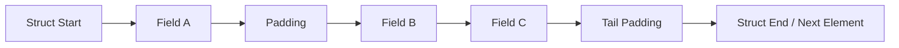
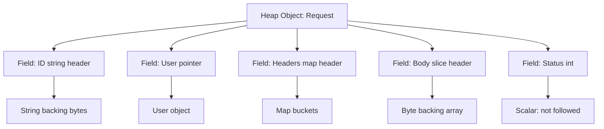
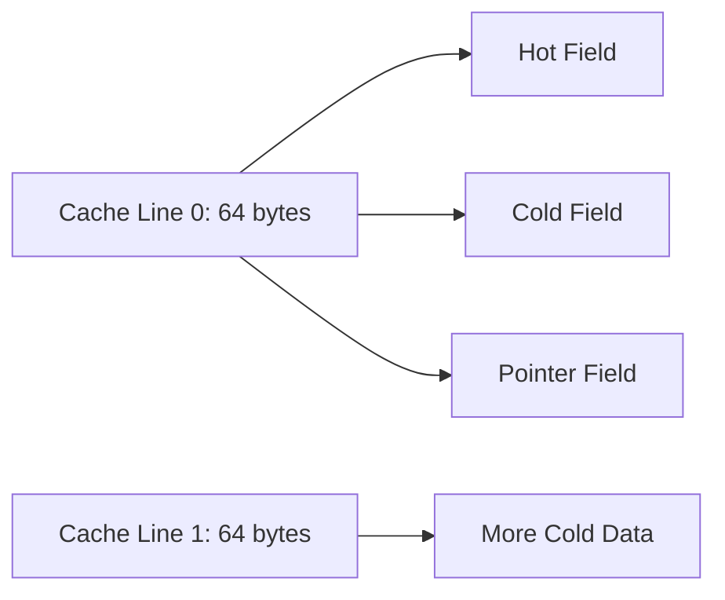
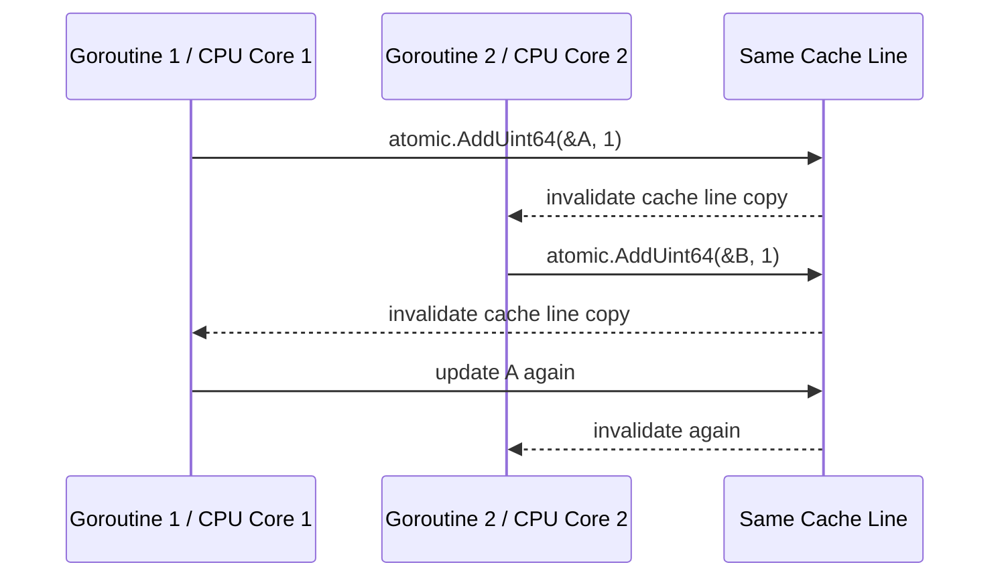
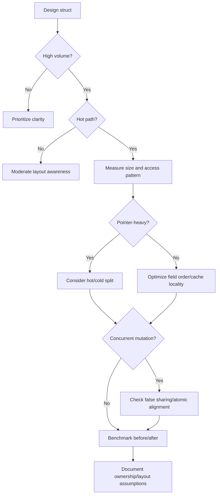

# learn-go-memory-systems-part-008.md

# Part 008 — Struct Layout: Alignment, Padding, Cache Locality, False Sharing, Field Ordering

> Seri: `learn-go-memory-systems`  
> Target pembaca: Java software engineer yang ingin menguasai Go memory systems sampai level production/internal engineering handbook  
> Target versi: Go 1.26.x  
> Status seri: **belum selesai** — ini adalah Part 008 dari 35

---

## 0. Executive Summary

Part ini membahas salah satu area yang sering tampak “kecil”, tetapi punya dampak besar pada performa, memory footprint, GC cost, cache locality, dan correctness concurrent code: **layout struct di Go**.

Di Java, object layout sering terasa jauh dari source code karena JVM memiliki object header, compressed references, class metadata, alignment VM-level, dan optimisasi JIT. Di Go, struct adalah value type dengan layout yang jauh lebih eksplisit. Urutan field di source code memengaruhi:

1. ukuran struct,
2. jumlah padding,
3. alignment,
4. cache locality,
5. jumlah memory yang dipindahkan saat copy,
6. jumlah pointer word yang perlu discan GC,
7. false sharing pada data concurrent,
8. ABI/API stability bila struct diekspos,
9. binary serialization bila layout dipakai secara keliru,
10. cost saat struct disimpan dalam slice/map/channel/interface.

Mental model utama:

```text
struct layout bukan cosmetic detail.
struct layout adalah kontrak memory representation.
```

Namun, ini bukan berarti semua struct harus diurutkan berdasarkan size secara membabi buta. Production-grade design harus menyeimbangkan:

- semantic grouping,
- readability,
- API stability,
- pointer scanning cost,
- hot/cold data separation,
- cache locality,
- false sharing,
- correctness,
- profile evidence.

---

## 1. Tujuan Pembelajaran

Setelah menyelesaikan bagian ini, kamu diharapkan mampu:

1. Menjelaskan mengapa struct di Go memiliki padding.
2. Menggunakan `unsafe.Sizeof`, `unsafe.Alignof`, dan `unsafe.Offsetof` secara aman untuk inspeksi layout.
3. Membedakan **size**, **alignment**, **offset**, dan **stride**.
4. Mendesain field ordering untuk mengurangi padding tanpa merusak domain clarity.
5. Menjelaskan dampak pointer field terhadap GC scanning.
6. Menjelaskan mengapa pointer-free struct bisa lebih murah untuk GC.
7. Membedakan **memory footprint** vs **cache locality** vs **GC cost**.
8. Memahami false sharing dan mengapa masalah ini dapat terjadi walaupun tidak ada data race.
9. Mendesain struct untuk hot path, cache, ring buffer, metrics counter, dan protocol frame.
10. Menentukan kapan harus memakai struct-of-arrays vs array-of-structs.
11. Menghindari anti-pattern seperti over-padding, exposing layout-sensitive struct, dan unsafe serialization.
12. Membuat review checklist untuk struct yang dipakai di production hot path.

---

## 2. Fondasi Resmi dan Batas Klaim

Materi ini berdiri di atas beberapa fakta resmi Go:

- Package `unsafe` menyediakan `Sizeof`, `Alignof`, dan `Offsetof` untuk menginspeksi ukuran, alignment, dan offset field.
- Dokumentasi `unsafe.Sizeof` menyatakan bahwa size struct termasuk padding yang ditambahkan karena field alignment.
- Spesifikasi Go menyatakan bahwa `Sizeof`, `Alignof`, dan `Offsetof` dapat menjadi compile-time constant untuk type berukuran konstan.
- Runtime Go memiliki heap bitmap/type metadata yang membedakan word pointer dan scalar; pointer-containing object perlu informasi untuk GC scanning.
- Go memory model mendefinisikan data race sebagai concurrent write dengan read/write pada lokasi memory yang sama tanpa synchronization/atomic.
- False sharing bukan data race secara definisi Go, tetapi performance contention pada cache coherence hardware.

Sumber resmi yang relevan:

- Go Specification: https://go.dev/ref/spec
- Go Memory Model: https://go.dev/ref/mem
- Package unsafe: https://pkg.go.dev/unsafe
- Runtime heap bitmap source: https://go.dev/src/runtime/mbitmap.go
- Runtime allocator overview: https://go.dev/src/runtime/malloc.go
- Runtime metrics: https://pkg.go.dev/runtime/metrics

---

## 3. Mental Model: Struct sebagai Sequence of Fields + Padding

Secara konseptual, struct di Go adalah kumpulan field yang ditempatkan berurutan sesuai deklarasi, dengan padding yang mungkin disisipkan agar setiap field berada pada alamat yang memenuhi alignment requirement.

Contoh:

```go
package main

type Bad struct {
    A bool  // 1 byte
    B int64 // 8 bytes, but must be aligned
    C bool  // 1 byte
}
```

Secara naif, seseorang mungkin mengira ukurannya:

```text
bool  = 1
int64 = 8
bool  = 1
-----------
total = 10 bytes
```

Tetapi CPU dan ABI membutuhkan alignment. `int64` biasanya perlu berada pada offset kelipatan 8 pada arsitektur 64-bit. Maka layout aktual bisa menjadi:

```text
offset 0: A bool      1 byte
offset 1: padding     7 bytes
offset 8: B int64     8 bytes
offset16: C bool      1 byte
offset17: tail pad    7 bytes
-----------------------------
total: 24 bytes
```

Jika field diurutkan ulang:

```go
type Better struct {
    B int64
    A bool
    C bool
}
```

Layoutnya bisa menjadi:

```text
offset 0: B int64     8 bytes
offset 8: A bool      1 byte
offset 9: C bool      1 byte
offset10: tail pad    6 bytes
-----------------------------
total: 16 bytes
```

Penghematan 8 byte per object tampak kecil. Tetapi jika ada 10 juta object:

```text
8 bytes * 10,000,000 = 80,000,000 bytes ≈ 76.3 MiB
```

Dan itu belum menghitung cache pressure, GC scan metadata, map bucket overhead, pointer indirection, dan allocator size class rounding.

---

## 4. Empat Istilah Dasar: Size, Alignment, Offset, Stride

### 4.1 Size

Size adalah jumlah byte yang dibutuhkan value dari type tertentu, termasuk padding internal dan tail padding untuk struct.

Di Go:

```go
unsafe.Sizeof(x)
```

Untuk slice, string, map, channel, dan function value, `Sizeof` mengukur descriptor/header value, bukan semua memory yang direferensikan.

Contoh:

```go
var b []byte
fmt.Println(unsafe.Sizeof(b))
```

Pada arsitektur 64-bit, slice header biasanya 3 machine words:

```text
pointer + len + cap = 8 + 8 + 8 = 24 bytes
```

Tetapi backing array tidak termasuk.

### 4.2 Alignment

Alignment adalah requirement alamat. Jika suatu type punya alignment 8, address value itu harus kelipatan 8.

Di Go:

```go
unsafe.Alignof(x)
```

Alignment membantu CPU membaca value secara efisien dan sesuai ABI.

### 4.3 Offset

Offset adalah posisi field dari awal struct.

Di Go:

```go
unsafe.Offsetof(s.Field)
```

Offset penting untuk:

- memahami padding,
- binary layout debugging,
- unsafe pointer arithmetic,
- interop dengan C,
- diagnosing false sharing,
- cache-aware design.

### 4.4 Stride

Stride adalah jarak antar element dalam array/slice.

Untuk `[]T`, element berikutnya berada pada:

```text
address(element[i+1]) = address(element[i]) + sizeof(T)
```

Karena itu, tail padding struct tetap berpengaruh ketika struct disimpan dalam array/slice.

Contoh:

```go
type X struct {
    A bool
    B int64
}
```

Jika `unsafe.Sizeof(X{}) == 16`, maka `[]X` dengan 1 juta element membutuhkan kira-kira 16 MiB hanya untuk backing array, bukan 9 MiB.

---

## 5. Diagram Layout Sederhana



Padding bukan field. Padding tidak bisa diakses sebagai data Go normal. Padding adalah ruang kosong yang dimasukkan untuk memenuhi alignment.

---

## 6. Kenapa Padding Diperlukan?

Ada tiga alasan utama.

### 6.1 CPU Alignment

Banyak CPU lebih efisien membaca data yang aligned. Misalnya, membaca `uint64` dari alamat kelipatan 8 dapat lebih efisien daripada membaca dari alamat sembarang.

Pada beberapa arsitektur, unaligned access bisa:

- lebih lambat,
- membutuhkan beberapa memory access,
- menyebabkan trap,
- atau harus diperbaiki oleh compiler/runtime.

Go mencoba menjaga layout agar value berada pada alignment yang benar.

### 6.2 ABI Consistency

Compiler, runtime, linker, debugger, dan package lain perlu sepakat tentang posisi field.

Jika field offset berubah tanpa kontrol, method, reflection, unsafe, cgo, serialization tertentu, dan binary compatibility internal bisa rusak.

### 6.3 Array/Slice Element Correctness

Struct dalam array/slice harus membuat setiap element berikutnya juga aligned.

Itulah sebabnya ada tail padding.

Contoh:

```text
struct size tanpa tail pad = 10
alignment struct = 8
array element berikutnya akan mulai di offset 10, tidak aligned ke 8
```

Maka size struct dibulatkan agar stride memenuhi alignment.

---

## 7. Field Ordering: Dari Naif ke Sadar Layout

### 7.1 Contoh Buruk

```go
type EventBad struct {
    Active bool
    ID     int64
    Kind   byte
    Time   int64
    Retry  bool
}
```

Kemungkinan layout 64-bit:

```text
Active bool  offset 0  size 1
padding      offset 1  size 7
ID int64     offset 8  size 8
Kind byte    offset16  size 1
padding      offset17  size 7
Time int64   offset24  size 8
Retry bool   offset32  size 1
tail padding offset33  size 7
Total: 40 bytes
```

### 7.2 Versi Lebih Kompak

```go
type EventBetter struct {
    ID     int64
    Time   int64
    Active bool
    Kind   byte
    Retry  bool
}
```

Kemungkinan layout:

```text
ID int64      offset 0   size 8
Time int64    offset 8   size 8
Active bool   offset16   size 1
Kind byte     offset17   size 1
Retry bool    offset18   size 1
tail padding  offset19   size 5
Total: 24 bytes
```

Penghematan:

```text
40 -> 24 bytes = 40% lebih kecil
```

Namun, field ordering tidak boleh hanya size-driven. Jika `Active`, `Kind`, dan `Retry` adalah hot fields yang selalu dibaca bersama, grouping semantic tetap masuk akal. Jika struct public API, reordering field adalah breaking change untuk code yang memakai composite literal tanpa field name.

---

## 8. Cara Mengukur Layout dengan Program Kecil

Gunakan `unsafe` untuk inspeksi, bukan untuk produksi logic.

```go
package main

import (
    "fmt"
    "unsafe"
)

type EventBad struct {
    Active bool
    ID     int64
    Kind   byte
    Time   int64
    Retry  bool
}

type EventBetter struct {
    ID     int64
    Time   int64
    Active bool
    Kind   byte
    Retry  bool
}

func main() {
    fmt.Println("EventBad size:", unsafe.Sizeof(EventBad{}))
    fmt.Println("EventBetter size:", unsafe.Sizeof(EventBetter{}))

    var b EventBad
    fmt.Println("EventBad.Active", unsafe.Offsetof(b.Active))
    fmt.Println("EventBad.ID    ", unsafe.Offsetof(b.ID))
    fmt.Println("EventBad.Kind  ", unsafe.Offsetof(b.Kind))
    fmt.Println("EventBad.Time  ", unsafe.Offsetof(b.Time))
    fmt.Println("EventBad.Retry ", unsafe.Offsetof(b.Retry))

    var g EventBetter
    fmt.Println("EventBetter.ID    ", unsafe.Offsetof(g.ID))
    fmt.Println("EventBetter.Time  ", unsafe.Offsetof(g.Time))
    fmt.Println("EventBetter.Active", unsafe.Offsetof(g.Active))
    fmt.Println("EventBetter.Kind  ", unsafe.Offsetof(g.Kind))
    fmt.Println("EventBetter.Retry ", unsafe.Offsetof(g.Retry))
}
```

Jalankan:

```bash
go run main.go
```

Catatan:

- Angka dapat berbeda antar arsitektur.
- Jangan hard-code offset untuk logic biasa.
- Offset berguna untuk pemahaman, debugging, unsafe/cgo yang sangat terbatas, dan review layout.

---

## 9. Alignment Type Umum pada 64-bit

Tabel konseptual berikut umum pada Go 64-bit, tetapi selalu verifikasi bila target arsitektur berbeda.

| Type | Size Umum | Alignment Umum | Catatan |
|---|---:|---:|---|
| `bool` | 1 | 1 | Tidak otomatis bit-packed |
| `byte` / `uint8` | 1 | 1 | Alias `uint8` |
| `int16` | 2 | 2 |  |
| `int32` / `rune` | 4 | 4 | `rune` alias `int32` |
| `int64` | 8 | 8 atau tergantung arch | Perhatikan 32-bit arch |
| `int` | 8 pada 64-bit | 8 | 4 pada 32-bit |
| `uintptr` | pointer width | pointer width | Integer, bukan GC pointer |
| `*T` | 8 pada 64-bit | 8 | GC-visible pointer |
| `string` | 16 pada 64-bit | 8 | pointer + len |
| `[]T` | 24 pada 64-bit | 8 | pointer + len + cap |
| `map[K]V` | 8 pada 64-bit | 8 | descriptor pointer |
| `chan T` | 8 pada 64-bit | 8 | descriptor pointer |
| `func` | 8 pada 64-bit | 8 | implementation detail; may capture environment |
| `interface{}` / `any` | 16 pada 64-bit | 8 | type word + data word |

Poin penting: `bool` di Go tidak bit-packed otomatis. Delapan field `bool` bisa memakai delapan byte plus padding, bukan satu byte bitset.

---

## 10. Struct Layout dan GC Scanning

Ukuran struct bukan satu-satunya hal penting. Ada juga apakah struct mengandung pointer.

Contoh pointer-free:

```go
type Point struct {
    X int64
    Y int64
}
```

Contoh pointer-containing:

```go
type User struct {
    ID   int64
    Name string // contains pointer to bytes
}
```

`string` value tidak terlihat seperti `*byte` di source code, tetapi representasinya memiliki pointer ke data string. Itu berarti object yang mengandung string adalah object yang memiliki pointer word.

GC harus tahu word mana yang pointer dan word mana yang scalar. Runtime menyimpan bitmap/type metadata untuk object heap agar GC bisa menelusuri pointer graph.

### 10.1 Pointer-Free Struct

```go
type Metric struct {
    Count uint64
    Sum   uint64
    Max   uint64
}
```

Jika `[]Metric` besar berada di heap, GC tidak perlu menelusuri pointer di dalam setiap element karena tidak ada pointer.

### 10.2 Pointer-Heavy Struct

```go
type Request struct {
    ID      string
    User    *User
    Headers map[string][]string
    Body    []byte
    Error   error
}
```

Struct ini berisi banyak pointer-like fields. GC perlu memproses graph lebih banyak.

### 10.3 Design Implication

Untuk hot path memory-heavy structure:

- Pisahkan pointer-free data dari pointer-rich metadata.
- Jangan menaruh string/map/slice pointer-heavy field di setiap element jika tidak selalu dibutuhkan.
- Pertimbangkan ID numeric atau offset ke table lain untuk data sangat besar.
- Gunakan contiguous numeric arrays untuk high-volume telemetry/metrics/codec state.

---

## 11. Diagram GC Scan View



GC tidak peduli nama field. GC peduli apakah word tertentu adalah pointer yang perlu ditelusuri.

---

## 12. Struct Size vs Allocator Size Class

Struct size juga berinteraksi dengan allocator size class.

Misalnya:

```text
Struct A size: 33 bytes
Allocator mungkin membulatkan ke size class 48 bytes
```

Jika kamu mengurangi struct dari 33 bytes menjadi 32 bytes, penghematan aktual bisa lebih besar daripada 1 byte karena object masuk size class lebih kecil.

Sebaliknya, mengurangi dari 40 ke 39 bytes mungkin tidak mengubah size class, tetapi masih membantu array/slice stride.

Mental model:

```text
individual heap allocation: struct size -> rounded allocator size class
slice backing array: len * sizeof(T) contiguous
GC scan: pointer map/type metadata, not just byte count
CPU cache: cache lines touched, not just object count
```

---

## 13. Struct dalam Slice: Layout Lebih Penting

Struct layout paling terasa ketika banyak struct disimpan dalam slice.

```go
type Order struct {
    ID        int64
    CreatedAt int64
    Amount    int64
    Status    byte
    Retry     bool
}

orders := make([]Order, 10_000_000)
```

Jika `Order` 32 byte:

```text
10,000,000 * 32 = 320 MB
```

Jika bisa menjadi 24 byte:

```text
10,000,000 * 24 = 240 MB
```

Selisih 80 MB. Lebih penting lagi:

- lebih sedikit cache line,
- lebih sedikit memory bandwidth,
- lebih sedikit page fault,
- lebih kecil RSS,
- lebih baik prefetching,
- lebih sedikit pressure untuk allocator/GC bila backing array di-allocate ulang.

---

## 14. Array of Structs vs Struct of Arrays

### 14.1 Array of Structs

```go
type Point struct {
    X float64
    Y float64
    Z float64
}

points := []Point{...}
```

Layout:

```text
X Y Z | X Y Z | X Y Z | ...
```

Baik jika kamu selalu membaca `X`, `Y`, dan `Z` bersama.

### 14.2 Struct of Arrays

```go
type Points struct {
    X []float64
    Y []float64
    Z []float64
}
```

Layout:

```text
X X X X ...
Y Y Y Y ...
Z Z Z Z ...
```

Baik jika kamu sering membaca hanya satu field, misalnya hanya `X`.

### 14.3 Trade-off

| Model | Kuat Untuk | Lemah Untuk |
|---|---|---|
| Array of Structs | entity-centric access | membaca satu field dari banyak entity |
| Struct of Arrays | vectorized/columnar scan | menjaga invariant antar field |
| Hybrid | hot/cold split | kompleksitas lebih tinggi |

### 14.4 Contoh Hot/Cold Split

```go
type SessionHot struct {
    LastSeenUnix int64
    State        uint32
    Flags        uint32
}

type SessionCold struct {
    UserAgent string
    IP        string
    Metadata  map[string]string
}
```

Hot data kecil dan pointer-light. Cold data pointer-rich dan jarang disentuh.

---

## 15. Cache Line Mental Model

CPU tidak membaca memory satu byte per satu byte. CPU bekerja dengan cache line, sering 64 byte pada banyak platform modern.

Jika struct 64 byte dan kamu membaca satu field kecil, kamu tetap mungkin membawa satu cache line penuh.

Jika struct 128 byte dan hot loop hanya membaca field pertama, setiap element bisa menyentuh banyak cache line secara tidak perlu.

### 15.1 Diagram Cache Line



Idealnya, hot fields yang dibaca bersama ditempatkan berdekatan.

---

## 16. Locality: Spatial dan Temporal

### 16.1 Spatial Locality

Jika program membaca memory address tertentu, kemungkinan address di dekatnya akan dibaca juga.

Struct yang compact dan slice contiguous memanfaatkan spatial locality.

### 16.2 Temporal Locality

Jika program membaca data sekarang, kemungkinan data itu akan dibaca lagi dalam waktu dekat.

Cache, reused buffer, dan per-worker state memanfaatkan temporal locality.

### 16.3 Pointer Chasing Buruk untuk Locality

```go
type Node struct {
    Next *Node
    Key  int64
    Val  int64
}
```

Linked structure sering buruk untuk cache karena setiap `Next` bisa berada di lokasi heap yang jauh.

Slice of struct biasanya lebih cache-friendly:

```go
type Entry struct {
    Key int64
    Val int64
}

entries := []Entry{...}
```

---

## 17. False Sharing

False sharing terjadi ketika dua goroutine/thread memodifikasi variable berbeda, tetapi variable tersebut berada pada cache line yang sama. Tidak ada data race secara logical, tetapi hardware cache coherence membuat performa turun.

Contoh buruk:

```go
type Counters struct {
    A uint64
    B uint64
}
```

Jika goroutine 1 terus update `A` dan goroutine 2 terus update `B`, keduanya bisa berebut cache line yang sama.

### 17.1 False Sharing Diagram



Tidak ada data race jika memakai atomic. Tetapi performanya tetap buruk.

### 17.2 Padding untuk Menghindari False Sharing

```go
type PaddedCounter struct {
    Value uint64
    _     [56]byte // asumsi cache line 64 byte dan uint64 8 byte
}
```

Atau:

```go
type Counters struct {
    A PaddedCounter
    B PaddedCounter
}
```

Catatan penting:

- Cache line size tidak dijamin selalu 64 byte.
- Padding manual adalah optimization khusus hot path.
- Jangan menambahkan padding besar ke semua struct.
- Ukur dengan benchmark dan profile.

---

## 18. False Sharing vs Data Race

| Aspek | Data Race | False Sharing |
|---|---|---|
| Correctness | Salah/undefined-ish dalam Go memory model | Correct tetapi lambat |
| Lokasi memory | Sama | Berbeda tetapi satu cache line |
| Deteksi | `go test -race` | benchmark/profile/perf counters |
| Solusi | mutex/atomic/channel/synchronization | padding/sharding/per-core/per-P aggregation |
| Gejala | hasil salah, race detector warning | throughput buruk, CPU tinggi |

Race detector tidak dirancang untuk mendeteksi false sharing. False sharing adalah problem performance hardware-level.

---

## 19. Atomic Alignment

Atomic operation membutuhkan alignment yang benar. Pada 64-bit architecture modern, `uint64` biasanya aligned secara natural jika field layout benar. Pada 32-bit architecture, perhatian alignment untuk 64-bit atomic lebih penting.

Pattern aman:

```go
type Stats struct {
    Requests uint64 // put 64-bit atomic fields first
    Errors   uint64
    Flags    uint32
}
```

Hindari menyisipkan byte kecil sebelum field atomic 64-bit jika target platform luas.

```go
type Risky struct {
    Flag byte
    N    uint64
}
```

Compiler akan menambahkan padding agar `N` aligned dalam struct, tetapi struct embedded/unsafe/cgo/custom binary layout bisa memperbesar risiko jika kamu mengabaikan alignment.

---

## 20. Pointer Field Placement: Size vs GC vs Hot Path

Ada saran umum: urutkan field dari alignment terbesar ke terkecil. Itu sering mengurangi padding.

Namun untuk Go production hot path, ada dimensi lain:

1. pointer fields membuat GC scan lebih relevan,
2. hot fields sebaiknya dekat,
3. cold pointer-rich fields bisa dipisahkan,
4. semantic grouping membantu maintainability,
5. public API tidak boleh diubah sembarangan.

### 20.1 Contoh Mixed Field

```go
type Task struct {
    ID        int64
    Deadline  int64
    Attempts  int32
    State     int32
    Payload   []byte
    Metadata  map[string]string
    Owner     *User
}
```

Jika hot path scheduler hanya membaca `ID`, `Deadline`, `Attempts`, `State`, maka pointer fields `Payload`, `Metadata`, `Owner` tidak perlu berada di hot struct.

Lebih baik:

```go
type TaskHot struct {
    ID       int64
    Deadline int64
    Attempts int32
    State    int32
}

type TaskCold struct {
    Payload  []byte
    Metadata map[string]string
    Owner    *User
}

type Task struct {
    Hot  TaskHot
    Cold *TaskCold
}
```

Trade-off:

- tambah indirection untuk cold data,
- hot scan lebih compact,
- GC graph bisa lebih terkontrol,
- cold allocation bisa lazy.

---

## 21. Embedded Struct dan Padding

Embedded struct tidak menghilangkan padding. Layout embedded struct tetap mengikuti alignment.

```go
type Header struct {
    Version byte
    Flags   byte
}

type Message struct {
    Header
    ID int64
}
```

Kemungkinan:

```text
Header.Version offset 0
Header.Flags   offset 1
padding        offset 2..7
ID             offset 8
```

Jika ingin compact:

```go
type Message struct {
    ID int64
    Header
}
```

Tetapi perhatikan readability dan semantic order.

---

## 22. Empty Struct Field

`struct{}` berukuran nol. Namun dalam struct, zero-size field punya aturan layout yang bisa menghasilkan alamat yang unik atau padding tertentu pada kasus tail field.

Contoh umum penggunaan:

```go
type Set map[string]struct{}
```

Ini hemat karena value map tidak membawa payload meaningful.

Namun, jangan berasumsi bahwa semua zero-size field selalu tidak memengaruhi layout dalam semua kombinasi. Ukur jika layout penting.

---

## 23. Boolean Packing Manual

Go tidak bit-pack `bool` field.

```go
type FlagsBad struct {
    Read    bool
    Write   bool
    Execute bool
    Admin   bool
}
```

Lebih compact bila volume sangat besar:

```go
type Flags uint8

const (
    FlagRead Flags = 1 << iota
    FlagWrite
    FlagExecute
    FlagAdmin
)

func (f Flags) Has(mask Flags) bool {
    return f&mask != 0
}
```

Tetapi trade-off:

- readability turun,
- debugging lebih sulit,
- perlu helper method,
- risiko bit bug,
- cocok untuk high-volume hot data atau protocol field.

---

## 24. Struct Copy Cost

Struct adalah value. Assignment menyalin seluruh struct.

```go
type Big struct {
    A [1024]byte
    B int64
}

func Process(x Big) { // copy Big
    _ = x.B
}
```

Passing `Big` by value bisa mahal.

Tetapi pointer bukan jawaban otomatis:

```go
func Process(x *Big) {
    _ = x.B
}
```

Pointer mengurangi copy, tetapi:

- menambah aliasing,
- dapat membuat value escape,
- menambah GC root/object graph,
- membuat mutation risk,
- bisa memperburuk cache locality jika object tersebar.

Rule yang lebih baik:

```text
small immutable value -> pass by value
large mutable or non-copyable value -> pointer
large immutable hot data -> benchmark value vs pointer
struct containing sync.Mutex/atomic state -> do not copy after use
```

---

## 25. Non-Copyable Struct by Convention

Beberapa struct tidak boleh dicopy setelah digunakan, misalnya yang mengandung mutex.

```go
type SafeCounter struct {
    mu sync.Mutex
    n  int64
}
```

Jika struct ini dicopy, mutex state ikut tercopy dan correctness bisa rusak.

Pattern:

```go
type noCopy struct{}

func (*noCopy) Lock()   {}
func (*noCopy) Unlock() {}

type SafeCounter struct {
    _  noCopy
    mu sync.Mutex
    n  int64
}
```

`go vet` dapat mengenali pola tertentu untuk mencegah copy lock.

---

## 26. Struct Public API dan Field Reordering

Jika struct diekspor:

```go
type Config struct {
    Timeout time.Duration
    Retries int
    Name    string
}
```

Mengubah urutan field bisa memengaruhi user yang memakai positional composite literal dari package yang sama atau internal code. Untuk exported struct lintas package, pengguna package lain harus memakai keyed literal jika field diekspor, tetapi API readability tetap terpengaruh.

Guideline:

- Untuk public config struct, utamakan semantic grouping.
- Untuk internal hot struct, layout optimization lebih agresif boleh dilakukan.
- Untuk wire format, jangan bergantung pada memory layout struct Go.
- Untuk persistence format, encode secara eksplisit.

---

## 27. Struct Layout Bukan Serialization Format

Anti-pattern:

```go
// Jangan lakukan ini untuk protocol portable.
ptr := unsafe.Pointer(&msg)
bytes := unsafe.Slice((*byte)(ptr), unsafe.Sizeof(msg))
```

Masalah:

- padding berisi byte tidak bermakna,
- endianness tidak didefinisikan untuk wire compatibility,
- layout dapat berbeda antar arsitektur,
- pointer field tidak bisa diserialisasi sebagai alamat,
- alignment berbeda,
- versi struct berubah,
- security leak dari padding/uninitialized-ish area dapat menjadi risiko di bahasa lain; Go zeroing membantu, tetapi pattern tetap salah.

Gunakan encoding eksplisit:

```go
binary.LittleEndian.PutUint64(buf[0:8], msg.ID)
buf[8] = msg.Flags
```

Atau gunakan codec/protobuf/JSON sesuai kebutuhan.

---

## 28. cgo dan Struct Layout

Interop dengan C membutuhkan perhatian khusus.

Go struct layout tidak otomatis sama dengan C struct jika:

- type berbeda size,
- padding berbeda,
- packing pragma C berbeda,
- alignment berbeda,
- pointer rule cgo dilanggar,
- bool size berbeda.

Untuk cgo:

- gunakan C type dari cgo jika perlu interop langsung,
- hindari cast sembarang antara Go struct dan C struct,
- copy field eksplisit bila bisa,
- verifikasi `sizeof` dan offset di kedua sisi,
- hindari menyimpan Go pointer di C memory.

---

## 29. Layout dan Map Value

Map menyimpan key/value dalam bucket internal. Jika value struct besar, operasi map dapat melibatkan copy value lebih besar.

```go
map[string]LargeStruct
```

Trade-off dengan:

```go
map[string]*LargeStruct
```

### 29.1 `map[string]LargeStruct`

Kelebihan:

- fewer heap objects jika value inline di map bucket,
- locality bisa lebih baik,
- tidak ada pointer indirection untuk value object terpisah.

Kekurangan:

- value besar dicopy saat assign/read,
- update field langsung tidak bisa pada map element,
- bucket lebih besar,
- rehash/growth lebih mahal.

### 29.2 `map[string]*LargeStruct`

Kelebihan:

- value kecil di bucket,
- update via pointer mudah,
- copy pointer murah.

Kekurangan:

- banyak heap object,
- pointer chasing,
- GC scan lebih besar,
- allocation lebih banyak,
- aliasing/mutation risk.

Tidak ada jawaban universal. Ukur berdasarkan access pattern.

---

## 30. Layout dan Channel

Mengirim struct lewat channel menyalin value.

```go
ch := make(chan Event, 1024)
ch <- event // copy Event into channel buffer
```

Jika `Event` besar, copy cost besar.

Pilihan:

```go
chan *Event
```

Trade-off:

- pointer copy lebih kecil,
- tetapi object harus hidup lebih lama,
- aliasing antar producer/consumer,
- GC pressure,
- ownership contract harus jelas.

Untuk pipeline high-throughput, sering lebih baik memakai immutable event kecil atau buffer ownership transfer eksplisit.

---

## 31. Layout dan Interface

Ketika struct masuk interface:

```go
var x any = largeStruct
```

Value bisa dicopy dan mungkin dialokasikan tergantung escape/context.

Struct besar dalam `[]any`, `map[string]any`, logging `...any`, atau reflection-heavy code bisa menimbulkan overhead.

Guideline:

- Hindari `any` di hot path data plane.
- Gunakan concrete type/generic jika bisa.
- Jangan masukkan large struct by value ke variadic `...any` dalam loop panas.
- Log field kecil atau pointer immutable jika perlu.

---

## 32. Layout dan Reflection

Reflection bekerja dengan metadata type dan value representation. Field offset digunakan runtime/reflect untuk mengakses field.

Reflection-heavy code sering:

- menyentuh pointer-rich data,
- memakai interface,
- membuat allocation,
- sulit di-inline,
- lebih mahal untuk hot path.

Untuk performance-critical codec, pertimbangkan:

- generated code,
- manual encoder,
- table-driven parser yang pointer-light,
- precomputed field metadata,
- avoiding `map[string]any`.

---

## 33. Layout dan Generics

Generics tidak otomatis mengubah layout type. `struct` tetap layout konkret sesuai field.

Namun generic container dapat memengaruhi memory:

```go
type Box[T any] struct {
    V T
}
```

`Box[int64]` dan `Box[string]` punya layout berbeda karena `T` berbeda.

Generics bisa membantu menghindari interface boxing-like overhead:

```go
func Sum[T ~int64 | ~uint64](xs []T) T {
    var total T
    for _, x := range xs {
        total += x
    }
    return total
}
```

Dibanding `[]any`, generic slice tetap contiguous dengan element type konkret.

---

## 34. Layout dan Pointer Density

Pointer density adalah proporsi word dalam object yang merupakan pointer.

Contoh low pointer density:

```go
type Record struct {
    ID     uint64
    Amount int64
    Flags  uint32
    Kind   uint16
    _      uint16
}
```

Contoh high pointer density:

```go
type RichRecord struct {
    ID       string
    Tags     []string
    Metadata map[string]string
    Owner    *User
    Err      error
}
```

Pointer density tinggi berarti:

- lebih banyak GC scan work,
- lebih banyak object graph traversal,
- lebih banyak retention path,
- lebih banyak cache miss karena indirection,
- lebih sulit reason about ownership.

---

## 35. Hot/Cold Splitting Pattern

Hot/cold splitting adalah teknik memisahkan field yang sering dipakai dari field yang jarang dipakai.

### 35.1 Sebelum

```go
type Connection struct {
    ID          uint64
    LastSeen    int64
    State       uint32
    Retry       uint32
    RemoteAddr  string
    UserAgent   string
    TLSInfo     *TLSInfo
    Metadata    map[string]string
    DebugBuffer []byte
}
```

Hot path heartbeat hanya butuh:

- `ID`,
- `LastSeen`,
- `State`,
- `Retry`.

### 35.2 Sesudah

```go
type ConnectionHot struct {
    ID       uint64
    LastSeen int64
    State    uint32
    Retry    uint32
}

type ConnectionCold struct {
    RemoteAddr  string
    UserAgent   string
    TLSInfo     *TLSInfo
    Metadata    map[string]string
    DebugBuffer []byte
}

type Connection struct {
    Hot  ConnectionHot
    Cold *ConnectionCold
}
```

Manfaat:

- scan hot slice lebih ringan,
- hot struct lebih compact,
- cold allocation bisa lazy,
- cold pointer graph tidak selalu disentuh.

Biaya:

- tambahan indirection,
- lebih banyak type,
- perlu lifecycle cold object,
- potential nil handling.

---

## 36. Field Ordering Heuristic

Heuristic dasar:

1. Tempatkan field alignment besar lebih dulu.
2. Kelompokkan field yang diakses bersama.
3. Pisahkan hot/cold jika volume besar.
4. Pisahkan pointer-rich dari pointer-free hot arrays jika GC cost penting.
5. Letakkan atomic counters yang sering diupdate pada cache line terpisah jika perlu.
6. Jangan mengubah public struct hanya demi padding kecil tanpa alasan kuat.
7. Ukur size dan benchmark sebelum/after.

Contoh ordering umum:

```go
type Example struct {
    // 8-byte aligned fields
    ID      uint64
    Created int64
    Ptr     *Payload
    Data    []byte
    Name    string

    // 4-byte fields
    State uint32
    Flags uint32

    // 2-byte fields
    Code uint16

    // 1-byte fields
    Kind byte
    OK   bool
}
```

Namun, jangan menjadikan ini dogma. Kadang semantic grouping lebih penting.

---

## 37. Tooling untuk Layout

### 37.1 `unsafe.Sizeof`, `Alignof`, `Offsetof`

Tool paling langsung.

### 37.2 `go vet -copylocks`

Mendeteksi copy value yang mengandung lock pada pola tertentu.

```bash
go vet ./...
```

### 37.3 `go test -bench -benchmem`

Melihat allocation/op dan bytes/op.

```bash
go test -bench=. -benchmem ./...
```

### 37.4 pprof

Melihat allocation hotspot.

```bash
go test -bench=BenchmarkX -benchmem -memprofile=mem.out
 go tool pprof mem.out
```

### 37.5 Race Detector

Bukan untuk false sharing, tetapi wajib untuk concurrency correctness.

```bash
go test -race ./...
```

### 37.6 Field Alignment Analyzer

Go ecosystem memiliki analyzer seperti `fieldalignment` pada `x/tools`, namun availability/usage bisa berubah antar versi toolchain. Gunakan sebagai advisory, bukan kebenaran absolut.

---

## 38. Benchmark: Field Ordering Impact

Contoh benchmark sederhana:

```go
package layout

import "testing"

type Bad struct {
    A bool
    B int64
    C bool
    D int64
}

type Good struct {
    B int64
    D int64
    A bool
    C bool
}

func BenchmarkBadScan(b *testing.B) {
    xs := make([]Bad, 1_000_000)
    for i := range xs {
        xs[i].B = int64(i)
        xs[i].D = int64(i * 2)
    }

    b.ResetTimer()
    var sum int64
    for n := 0; n < b.N; n++ {
        for i := range xs {
            sum += xs[i].B + xs[i].D
        }
    }
    _ = sum
}

func BenchmarkGoodScan(b *testing.B) {
    xs := make([]Good, 1_000_000)
    for i := range xs {
        xs[i].B = int64(i)
        xs[i].D = int64(i * 2)
    }

    b.ResetTimer()
    var sum int64
    for n := 0; n < b.N; n++ {
        for i := range xs {
            sum += xs[i].B + xs[i].D
        }
    }
    _ = sum
}
```

Jalankan:

```bash
go test -bench=. -benchmem
```

Interpretasi:

- Jika `Good` lebih kecil, backing array lebih kecil.
- Jika scan hot fields menyentuh lebih sedikit cache line, throughput bisa naik.
- Jika working set muat cache lebih baik, hasil bisa signifikan.
- Jika data kecil, bedanya bisa tidak terlihat.

---

## 39. Benchmark: False Sharing

```go
package falsesharing

import (
    "sync/atomic"
    "testing"
)

type Shared struct {
    A uint64
    B uint64
}

type Padded struct {
    A uint64
    _ [56]byte
    B uint64
    _ [56]byte
}

func BenchmarkShared(b *testing.B) {
    var x Shared
    b.RunParallel(func(pb *testing.PB) {
        for pb.Next() {
            atomic.AddUint64(&x.A, 1)
            atomic.AddUint64(&x.B, 1)
        }
    })
}

func BenchmarkPadded(b *testing.B) {
    var x Padded
    b.RunParallel(func(pb *testing.PB) {
        for pb.Next() {
            atomic.AddUint64(&x.A, 1)
            atomic.AddUint64(&x.B, 1)
        }
    })
}
```

Benchmark ini belum ideal karena tiap worker mengupdate kedua counter. Untuk false sharing yang lebih jelas, pisahkan worker yang update A dan B. Namun contoh ini menunjukkan bahwa layout counter concurrent harus dipikirkan.

---

## 40. Mini Lab 1: Inspect Layout

Buat file `layout_inspect/main.go`:

```go
package main

import (
    "fmt"
    "unsafe"
)

type A struct {
    Flag bool
    N    int64
    Kind byte
}

type B struct {
    N    int64
    Flag bool
    Kind byte
}

func main() {
    var a A
    var b B

    fmt.Println("A size", unsafe.Sizeof(a), "align", unsafe.Alignof(a))
    fmt.Println("A.Flag", unsafe.Offsetof(a.Flag))
    fmt.Println("A.N   ", unsafe.Offsetof(a.N))
    fmt.Println("A.Kind", unsafe.Offsetof(a.Kind))

    fmt.Println("B size", unsafe.Sizeof(b), "align", unsafe.Alignof(b))
    fmt.Println("B.N   ", unsafe.Offsetof(b.N))
    fmt.Println("B.Flag", unsafe.Offsetof(b.Flag))
    fmt.Println("B.Kind", unsafe.Offsetof(b.Kind))
}
```

Tugas:

1. Jalankan di mesin 64-bit.
2. Catat size dan offset.
3. Prediksi padding internal dan tail padding.
4. Ubah field order.
5. Ulangi pengukuran.

---

## 41. Mini Lab 2: Slice Memory Footprint

```go
package main

import (
    "fmt"
    "runtime"
    "unsafe"
)

type Bad struct {
    A bool
    B int64
    C bool
    D int64
}

type Good struct {
    B int64
    D int64
    A bool
    C bool
}

func printMem(label string) {
    runtime.GC()
    var m runtime.MemStats
    runtime.ReadMemStats(&m)
    fmt.Printf("%s HeapAlloc=%d MiB\n", label, m.HeapAlloc/1024/1024)
}

func main() {
    fmt.Println("Bad size", unsafe.Sizeof(Bad{}))
    fmt.Println("Good size", unsafe.Sizeof(Good{}))

    printMem("start")
    bad := make([]Bad, 10_000_000)
    _ = bad
    printMem("after bad")

    good := make([]Good, 10_000_000)
    _ = good
    printMem("after good")
}
```

Catatan:

- Pastikan compiler tidak mengoptimalkan terlalu agresif; gunakan data agar tetap live.
- Hasil dipengaruhi runtime, OS, dan GC.
- Tujuan lab adalah melihat magnitude, bukan angka absolut.

---

## 42. Mini Lab 3: Hot/Cold Split

Buat dua model:

```go
type SessionFlat struct {
    ID        uint64
    LastSeen  int64
    State     uint32
    Flags     uint32
    UserAgent string
    IP        string
    Metadata  map[string]string
}

type SessionHot struct {
    ID       uint64
    LastSeen int64
    State    uint32
    Flags    uint32
}

type SessionCold struct {
    UserAgent string
    IP        string
    Metadata  map[string]string
}

type SessionSplit struct {
    Hot  SessionHot
    Cold *SessionCold
}
```

Benchmark scan `LastSeen` untuk 10 juta session.

Pertanyaan:

1. Mana yang lebih kecil untuk hot scan?
2. Mana yang lebih banyak pointer?
3. Mana yang lebih mudah dipahami?
4. Mana yang lebih cocok untuk scheduler heartbeat?
5. Mana yang lebih cocok untuk request detail API?

---

## 43. Mini Lab 4: Struct of Arrays

Bandingkan:

```go
type Trade struct {
    Price  float64
    Volume float64
    Ts     int64
}

type TradesColumnar struct {
    Price  []float64
    Volume []float64
    Ts     []int64
}
```

Benchmark:

- sum semua `Price`,
- sum semua `Price*Volume`,
- filter by `Ts`,
- update `Volume` saja.

Analisis:

- Access pattern mana yang cocok AoS?
- Access pattern mana yang cocok SoA?
- Bagaimana readability berubah?
- Bagaimana validation invariant berubah?

---

## 44. Production Review Checklist

Gunakan checklist ini saat review struct di hot path.

### 44.1 Size & Padding

- [ ] Apakah struct disimpan dalam slice/map/channel besar?
- [ ] Apakah `unsafe.Sizeof` sudah diperiksa untuk type hot?
- [ ] Apakah ada padding besar karena field order buruk?
- [ ] Apakah pengurangan size melewati allocator size class penting?
- [ ] Apakah field order masih readable?

### 44.2 Pointer & GC

- [ ] Apakah struct mengandung string/slice/map/interface/pointer?
- [ ] Apakah pointer-rich field benar-benar dibutuhkan di hot object?
- [ ] Apakah bisa dipisahkan menjadi hot/cold?
- [ ] Apakah pointer-free representation lebih cocok?
- [ ] Apakah ada retention path dari field pointer?

### 44.3 Copy Semantics

- [ ] Apakah struct besar dipass by value?
- [ ] Apakah struct mengandung mutex/atomic state?
- [ ] Apakah map/channel/interface membuat copy tidak terlihat?
- [ ] Apakah pointer dipakai hanya untuk menghindari copy tetapi malah membuat escape?

### 44.4 Cache Locality

- [ ] Apakah hot fields berdekatan?
- [ ] Apakah cold field memperbesar cache footprint?
- [ ] Apakah access pattern entity-centric atau columnar?
- [ ] Apakah pointer chasing bisa diganti contiguous slice?

### 44.5 Concurrency

- [ ] Apakah counter hot diupdate banyak goroutine?
- [ ] Apakah ada false sharing?
- [ ] Apakah atomic field aligned?
- [ ] Apakah sharding/per-worker aggregation lebih baik daripada global counter?

### 44.6 API Stability

- [ ] Apakah struct exported?
- [ ] Apakah field order bagian dari readability/API expectation?
- [ ] Apakah ada unsafe/cgo/serialization yang bergantung pada layout?
- [ ] Apakah perubahan layout perlu migration atau benchmark proof?

---

## 45. Design Pattern: Compact Internal Record

Cocok untuk high-volume internal record.

```go
type RecordID uint64

type Status uint8

const (
    StatusNew Status = iota
    StatusRunning
    StatusDone
    StatusFailed
)

type Record struct {
    ID        RecordID
    CreatedAt int64
    UpdatedAt int64
    Amount    int64
    Flags     uint32
    Status    Status
    Retry     uint8
    _         [2]byte // explicit reserved/padding for future/alignment clarity
}
```

Catatan:

- Explicit padding kadang dipakai untuk clarity/future binary format internal, tetapi jangan gunakan untuk wire format portable.
- Jika tidak ada alasan, biarkan compiler padding implicit.
- Untuk public API, explicit reserved field bisa membingungkan.

---

## 46. Design Pattern: Pointer-Free Index + External Store

```go
type UserID uint64

type UserIndexEntry struct {
    ID        UserID
    NameOff   uint32
    NameLen   uint32
    EmailOff  uint32
    EmailLen  uint32
    CreatedAt int64
}

type UserStore struct {
    entries []UserIndexEntry // pointer-free hot index
    blob    []byte           // names/emails packed here
}
```

Manfaat:

- index compact,
- fewer GC pointers,
- contiguous scan,
- good for read-heavy data.

Risiko:

- manual offset validation,
- blob lifetime coupling,
- harder mutation,
- string conversion must be controlled,
- not worth it for normal CRUD unless scale/hot path jelas.

---

## 47. Design Pattern: Sharded Counter with Padding

```go
type paddedUint64 struct {
    value uint64
    _     [56]byte
}

type ShardedCounter struct {
    shards []paddedUint64
}

func NewShardedCounter(n int) *ShardedCounter {
    return &ShardedCounter{shards: make([]paddedUint64, n)}
}

func (c *ShardedCounter) Add(shard int, delta uint64) {
    atomic.AddUint64(&c.shards[shard%len(c.shards)].value, delta)
}

func (c *ShardedCounter) Sum() uint64 {
    var total uint64
    for i := range c.shards {
        total += atomic.LoadUint64(&c.shards[i].value)
    }
    return total
}
```

Manfaat:

- mengurangi contention,
- mengurangi false sharing,
- cocok untuk metrics high-throughput.

Risiko:

- memory lebih besar,
- sum lebih mahal,
- cache line assumption,
- shard selection harus benar.

---

## 48. Design Pattern: API DTO vs Runtime Hot Object

Jangan paksa satu struct melayani semua kebutuhan.

```go
type OrderDTO struct {
    ID          string            `json:"id"`
    CustomerID  string            `json:"customer_id"`
    Amount      string            `json:"amount"`
    Status      string            `json:"status"`
    Metadata    map[string]string `json:"metadata,omitempty"`
    CreatedAt   string            `json:"created_at"`
}

type OrderRuntime struct {
    ID         uint64
    CustomerID uint64
    AmountCents int64
    CreatedUnix int64
    Status     uint8
    Flags      uint8
}
```

DTO optimized for boundary clarity. Runtime object optimized for internal processing.

Mapping cost sering lebih murah daripada membawa DTO pointer-rich di seluruh hot path.

---

## 49. Anti-Pattern: Pointer Everywhere

```go
type User struct {
    ID    *int64
    Age   *int
    Name  *string
    Email *string
}
```

Alasan biasanya:

- ingin represent optional,
- meniru Java nullability,
- menghindari copy.

Masalah:

- banyak allocation,
- banyak pointer scan,
- pointer chasing,
- nil checks everywhere,
- ownership blur,
- cache locality buruk.

Alternatif:

```go
type User struct {
    ID    int64
    Age   int
    Name  string
    Email string
    Flags UserFlags
}

type UserFlags uint8

const (
    HasAge UserFlags = 1 << iota
    HasEmail
)
```

Atau optional generic type bila semantic benar:

```go
type OptionalInt struct {
    Value int
    Valid bool
}
```

---

## 50. Anti-Pattern: Premature Packing

Packing semua boolean menjadi bitset tidak selalu baik.

Buruk jika:

- data volume kecil,
- code menjadi sulit dibaca,
- bug risk naik,
- tidak ada profile evidence,
- field sering dimutasi concurrent tanpa atomic design.

Baik jika:

- jutaan/miliaran record,
- wire/protocol format butuh bit flags,
- hot cache-sensitive path,
- helper method jelas,
- test kuat.

---

## 51. Anti-Pattern: Layout-Coupled Persistence

```go
// Bad idea: write raw struct memory to disk.
```

Masalah:

- versioning buruk,
- padding berubah,
- endianness,
- pointer invalid,
- architecture dependency,
- debugging sulit.

Lebih baik:

- explicit binary encoding,
- protobuf/flatbuffers/capnproto sesuai kebutuhan,
- versioned schema,
- checksum,
- length prefix,
- field tags.

---

## 52. Incident Pattern: Heap Profile Kecil, RSS Besar

Struct layout bisa berkontribusi secara tidak langsung.

Contoh:

- Service menyimpan `[]BigStruct` besar.
- BigStruct punya padding besar dan pointer-rich cold fields.
- Heap profile menunjukkan allocation dari slice backing array besar.
- RSS naik karena backing array besar dan page touched.
- GC CPU naik karena pointer graph besar.

Remediation:

1. Ukur `unsafe.Sizeof(BigStruct{})`.
2. Periksa field order.
3. Pisah hot/cold.
4. Ganti pointer-heavy metadata menjadi lazy external map jika jarang dipakai.
5. Batasi cache size.
6. Tambah runtime metrics.
7. Benchmark before/after.

---

## 53. Incident Pattern: Counter Throughput Drop

Gejala:

- CPU tinggi.
- Atomic counter update mahal.
- Tidak ada data race.
- Scaling buruk saat GOMAXPROCS naik.

Kemungkinan:

- false sharing,
- global atomic contention,
- cache line ping-pong.

Remediation:

- shard counter,
- per-worker aggregation,
- padded counter,
- reduce update frequency,
- batch metrics,
- use channel aggregation bila throughput cocok.

---

## 54. Incident Pattern: GC CPU Naik Setelah Field Ditambahkan

Sebelum:

```go
type Entry struct {
    ID    uint64
    Score int64
}
```

Sesudah:

```go
type Entry struct {
    ID       uint64
    Score    int64
    Metadata map[string]string
}
```

Efek:

- `Entry` sekarang pointer-containing.
- `[]Entry` besar punya pointer word per element.
- GC harus scan lebih banyak.
- Metadata map mungkin nil untuk sebagian besar element, tetapi pointer slot tetap ada.

Alternatif:

```go
type Entry struct {
    ID    uint64
    Score int64
}

type EntryMetadataStore struct {
    byID map[uint64]map[string]string
}
```

Trade-off harus diuji.

---

## 55. Go vs Java: Object Layout Perspective

### 55.1 Java

Java object umumnya:

- punya object header,
- berada di heap,
- field layout dikelola JVM,
- reference type by default,
- primitive arrays contiguous,
- object arrays berisi references,
- JIT dapat melakukan scalar replacement/escape analysis,
- off-heap via DirectByteBuffer/Unsafe/Panama.

### 55.2 Go

Go struct:

- value type,
- bisa stack atau heap,
- layout mengikuti field order,
- slice of struct contiguous,
- pointer eksplisit,
- GC scanning tergantung pointer bitmap,
- escape analysis compile-time,
- tidak ada automatic object header per struct value seperti Java object biasa.

### 55.3 Mental Shift

Java engineer sering berpikir:

```text
class instance = heap object with references
```

Go engineer harus berpikir:

```text
struct value = bytes with alignment, copied by value, may contain pointer words, may live on stack or heap
```

---

## 56. Decision Framework

Saat mendesain struct, tanya berurutan:



---

## 57. Review Rubric: Top 1% Engineer Lens

A strong engineer does not say:

```text
Put big fields first, done.
```

A strong engineer asks:

1. What is the access pattern?
2. How many instances exist at peak?
3. Is it stored contiguously?
4. Is it copied frequently?
5. Does it contain pointers?
6. Does GC scan it often?
7. Are hot fields close?
8. Are cold fields bloating the hot path?
9. Is there false sharing?
10. Is the struct part of public API?
11. Is layout being abused as binary format?
12. Did benchmark/profile prove the change?

---

## 58. Practical Rules of Thumb

1. For normal business structs, prefer clarity first.
2. For high-volume slices, inspect `unsafe.Sizeof`.
3. For hot loops, optimize locality, not just allocation count.
4. For concurrent counters, suspect false sharing when scaling is bad.
5. For pointer-heavy fields, consider hot/cold split.
6. For optional small scalar fields, avoid pointer by default.
7. For wire format, never rely on struct memory layout.
8. For cgo/unsafe, verify size/offset/alignment explicitly.
9. For public structs, avoid layout churn unless justified.
10. For performance claims, require benchmark and production-like data shape.

---

## 59. What Not To Memorize

Jangan hafal ukuran semua type secara dogmatis. Ukuran dapat bergantung pada architecture dan implementation detail.

Yang harus dikuasai:

- cara mengukur,
- cara berpikir,
- trade-off,
- failure mode,
- kapan layout penting,
- kapan layout optimization hanya noise.

---

## 60. Summary

Struct layout di Go adalah fondasi penting untuk memory-conscious engineering.

Hal yang harus tertanam:

- Struct field order memengaruhi padding dan size.
- Size struct memengaruhi slice stride, map/channel copy, allocation size class, dan cache footprint.
- Pointer field memengaruhi GC scanning dan retention graph.
- Hot/cold splitting sering lebih powerful daripada sekadar field reordering.
- False sharing adalah performance bug walaupun data-race-free.
- `unsafe.Sizeof`, `Alignof`, dan `Offsetof` adalah alat inspeksi, bukan alasan untuk membuat logic rapuh.
- Public API dan readability tetap penting.
- Struct memory layout bukan format serialization.
- Optimization harus mengikuti access pattern dan evidence.

---

## 61. Latihan Mandiri

### Latihan 1

Ambil 5 struct dari codebase kamu. Untuk masing-masing:

1. Ukur `unsafe.Sizeof`.
2. Ukur offset field.
3. Identifikasi padding.
4. Reorder field secara internal.
5. Bandingkan size.
6. Tentukan apakah perubahan layak secara readability.

### Latihan 2

Buat benchmark `[]Struct` dengan 10 juta element.

Bandingkan:

- field order buruk,
- field order baik,
- hot/cold split,
- struct-of-arrays.

Catat:

- ns/op,
- B/op,
- allocs/op,
- RSS jika mungkin,
- pprof heap.

### Latihan 3

Buat counter concurrent:

- satu global atomic,
- beberapa shard tanpa padding,
- beberapa shard dengan padding.

Bandingkan throughput saat `-cpu=1,2,4,8`.

### Latihan 4

Ambil DTO JSON pointer-rich. Buat runtime representation pointer-light. Benchmark pipeline:

```text
JSON decode -> map to runtime -> process hot loop
```

Bandingkan dengan langsung memakai DTO di hot loop.

---

## 62. Koneksi ke Part Berikutnya

Part berikutnya adalah:

```text
learn-go-memory-systems-part-009.md
```

Topik:

```text
Slice internals: header, backing array, capacity, append growth, aliasing hazards
```

Koneksi dengan Part 008:

- Struct size menentukan stride dalam `[]T`.
- Slice header kecil, tetapi backing array bisa sangat besar.
- Subslice dapat mempertahankan backing array besar.
- Append dapat membuat copy atau aliasing tergantung capacity.
- Slice of struct vs slice of pointer adalah keputusan layout + ownership + GC.

Jika Part 008 menjawab “bagaimana satu value disusun di memory”, Part 009 menjawab “bagaimana banyak value dikelola melalui slice dan backing array”.

---

## 63. Appendix A — Layout Template untuk Review

Gunakan template ini saat mendokumentasikan struct hot path.

```markdown
## Struct Layout Review: <TypeName>

### Purpose

- Domain role:
- Hot path usage:
- Estimated max instances:
- Stored in slice/map/channel/interface:

### Current Layout

| Field | Type | Size | Offset | Hot/Cold | Pointer? |
|---|---:|---:|---:|---|---|
| | | | | | |

### Memory Properties

- `unsafe.Sizeof`:
- Alignment:
- Pointer-containing:
- Expected GC scan impact:
- Expected copy frequency:

### Risk

- Padding waste:
- False sharing:
- Accidental retention:
- Public API compatibility:
- Serialization/layout coupling:

### Alternatives

1. Field reorder:
2. Hot/cold split:
3. Struct-of-arrays:
4. Pointer vs value:
5. Packed flags:

### Evidence

- Benchmark:
- pprof:
- production metric:

### Decision

- Chosen layout:
- Why:
- Revisit condition:
```

---

## 64. Appendix B — Common Struct Layout Smells

| Smell | Why It Matters | Possible Fix |
|---|---|---|
| `bool`, `int64`, `bool`, `int64` | padding besar | reorder fields |
| Banyak `*int`, `*bool`, `*string` | pointer density tinggi | optional value/flags |
| DTO dipakai di hot loop | pointer-heavy, string-heavy | runtime model |
| Struct besar dikirim via channel | copy besar | pointer with ownership or smaller event |
| Global atomic counters berdekatan | false sharing | shard/pad/batch |
| Slice of pointers untuk data kecil | pointer chasing + GC | slice of values |
| Slice of huge structs scan one field | cache waste | struct-of-arrays/hot split |
| Raw struct written to disk | non-portable | explicit encoding |
| Public struct reordered casually | API churn | semantic stability |
| `unsafe.Offsetof` used in business logic | brittle | remove layout dependency |

---

## 65. Appendix C — Small Reference Program

```go
package main

import (
    "fmt"
    "unsafe"
)

func dump(name string, size, align uintptr) {
    fmt.Printf("%-20s size=%2d align=%d\n", name, size, align)
}

type Mixed struct {
    A bool
    B int64
    C byte
    D string
    E []byte
    F uint32
}

type MixedReordered struct {
    D string
    E []byte
    B int64
    F uint32
    A bool
    C byte
}

func main() {
    dump("bool", unsafe.Sizeof(bool(false)), unsafe.Alignof(bool(false)))
    dump("byte", unsafe.Sizeof(byte(0)), unsafe.Alignof(byte(0)))
    dump("int64", unsafe.Sizeof(int64(0)), unsafe.Alignof(int64(0)))
    dump("string", unsafe.Sizeof(""), unsafe.Alignof(""))
    dump("[]byte", unsafe.Sizeof([]byte(nil)), unsafe.Alignof([]byte(nil)))
    dump("Mixed", unsafe.Sizeof(Mixed{}), unsafe.Alignof(Mixed{}))
    dump("MixedReordered", unsafe.Sizeof(MixedReordered{}), unsafe.Alignof(MixedReordered{}))

    var m Mixed
    fmt.Println("Mixed offsets")
    fmt.Println("A", unsafe.Offsetof(m.A))
    fmt.Println("B", unsafe.Offsetof(m.B))
    fmt.Println("C", unsafe.Offsetof(m.C))
    fmt.Println("D", unsafe.Offsetof(m.D))
    fmt.Println("E", unsafe.Offsetof(m.E))
    fmt.Println("F", unsafe.Offsetof(m.F))

    var r MixedReordered
    fmt.Println("MixedReordered offsets")
    fmt.Println("D", unsafe.Offsetof(r.D))
    fmt.Println("E", unsafe.Offsetof(r.E))
    fmt.Println("B", unsafe.Offsetof(r.B))
    fmt.Println("F", unsafe.Offsetof(r.F))
    fmt.Println("A", unsafe.Offsetof(r.A))
    fmt.Println("C", unsafe.Offsetof(r.C))
}
```

---

## 66. Closing Note

Struct layout adalah salah satu tempat Go memberi kamu kontrol yang lebih dekat ke mesin dibanding banyak Java code sehari-hari. Tetapi kontrol ini harus dipakai dengan disiplin.

Kamu tidak sedang mengejar “struct terkecil” sebagai tujuan absolut. Kamu mengejar representasi yang sesuai dengan:

- lifetime,
- ownership,
- access pattern,
- concurrency model,
- GC behavior,
- cache behavior,
- API boundary,
- maintainability.

Itulah bedanya micro-optimization dengan memory systems engineering.


<!-- NAVIGATION_FOOTER -->
<div class="page-nav">
<a href="./learn-go-memory-systems-part-007.md">⬅️ Go Memory Systems — Part 007: Allocation Mechanics</a>
<a href="./index.md">📚 Kategori</a>
<a href="../../index.md">🏠 Home</a>
<a href="./learn-go-memory-systems-part-009.md">Go Memory Systems — Part 009: Slice Internals ➡️</a>
</div>
