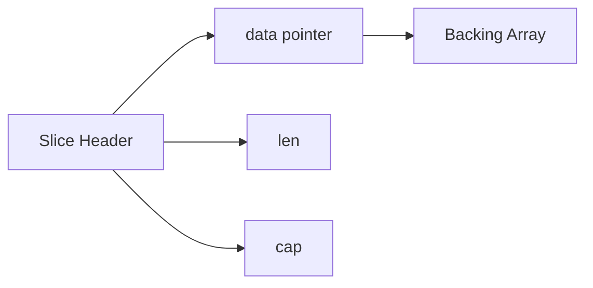
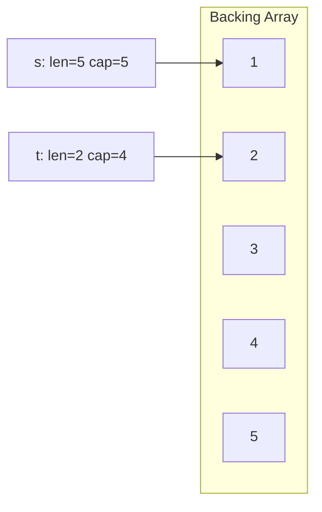
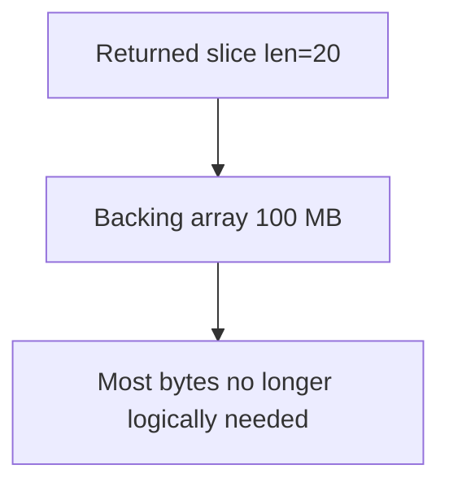
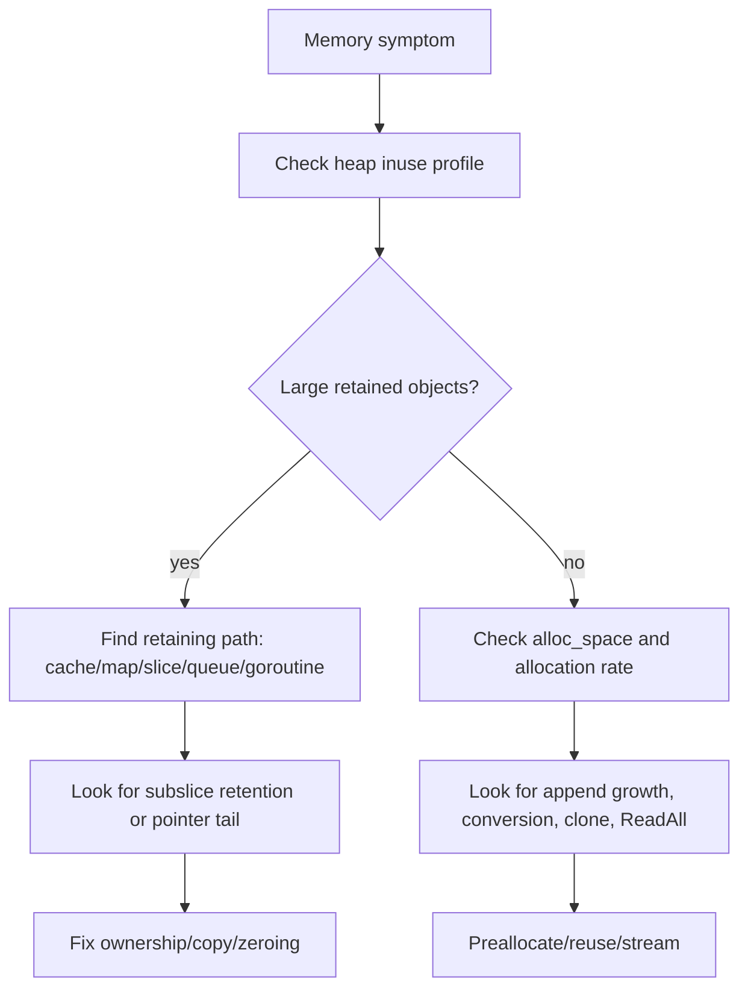
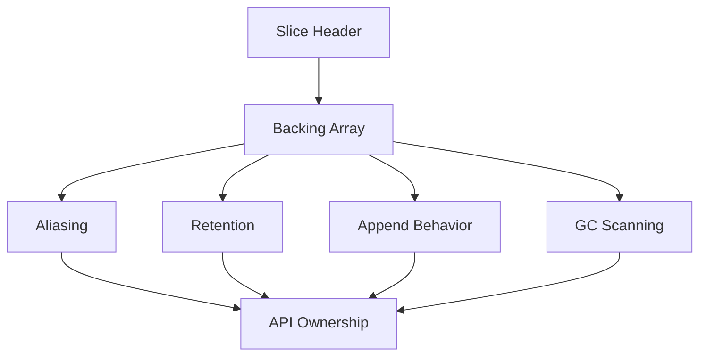

# learn-go-memory-systems-part-009.md

# Go Memory Systems — Part 009: Slice Internals

> Seri: `learn-go-memory-systems`  
> Part: `009`  
> Topik: **Slice internals: header, backing array, capacity, append growth, aliasing hazards**  
> Target pembaca: Java software engineer yang ingin memahami Go memory behavior sampai level production engineering  
> Target Go: **Go 1.26.x**

---

## Daftar Isi

1. [Tujuan Part Ini](#1-tujuan-part-ini)
2. [Kenapa Slice Adalah Salah Satu Konsep Memory Terpenting di Go](#2-kenapa-slice-adalah-salah-satu-konsep-memory-terpenting-di-go)
3. [Mental Model Utama: Slice Bukan Array](#3-mental-model-utama-slice-bukan-array)
4. [Slice Header: Pointer, Length, Capacity](#4-slice-header-pointer-length-capacity)
5. [Backing Array: Tempat Data Sebenarnya Hidup](#5-backing-array-tempat-data-sebenarnya-hidup)
6. [Nil Slice, Empty Slice, dan Zero Value](#6-nil-slice-empty-slice-dan-zero-value)
7. [Length vs Capacity: Batas Logis vs Batas Pertumbuhan](#7-length-vs-capacity-batas-logis-vs-batas-pertumbuhan)
8. [Slicing Operation: Membuat View, Bukan Copy](#8-slicing-operation-membuat-view-bukan-copy)
9. [Full Slice Expression: Mengunci Capacity View](#9-full-slice-expression-mengunci-capacity-view)
10. [Append Semantics: Mutate Existing Array atau Allocate New Array](#10-append-semantics-mutate-existing-array-atau-allocate-new-array)
11. [Growth Behavior: Jangan Mengandalkan Formula Capacity](#11-growth-behavior-jangan-mengandalkan-formula-capacity)
12. [Copy Semantics: `copy`, `append`, `slices.Clone`](#12-copy-semantics-copy-append-slicesclone)
13. [Aliasing Hazard: Dua Slice, Satu Backing Array](#13-aliasing-hazard-dua-slice-satu-backing-array)
14. [Retention Leak: Slice Kecil Menahan Array Besar](#14-retention-leak-slice-kecil-menahan-array-besar)
15. [Slice of Pointers vs Slice of Values](#15-slice-of-pointers-vs-slice-of-values)
16. [Deletion, Filtering, dan GC Visibility](#16-deletion-filtering-dan-gc-visibility)
17. [Slice dan Interface: `[]T` Bukan `[]any`](#17-slice-dan-interface-t-bukan-any)
18. [Slice dan Function Boundary: Ownership Contract](#18-slice-dan-function-boundary-ownership-contract)
19. [API Design: Borrowed View, Owned Copy, Mutable Buffer](#19-api-design-borrowed-view-owned-copy-mutable-buffer)
20. [Buffer Reuse Pattern: Benar, Salah, dan Berbahaya](#20-buffer-reuse-pattern-benar-salah-dan-berbahaya)
21. [Slice dalam Parser dan Protocol Processing](#21-slice-dalam-parser-dan-protocol-processing)
22. [Slice dalam Cache, Queue, dan Batch Processing](#22-slice-dalam-cache-queue-dan-batch-processing)
23. [Concurrency Hazard: Slice Header Copy Tidak Membuat Data Aman](#23-concurrency-hazard-slice-header-copy-tidak-membuat-data-aman)
24. [Bounds Check dan Compiler Optimization](#24-bounds-check-dan-compiler-optimization)
25. [Observability: Cara Menemukan Masalah Slice di Production](#25-observability-cara-menemukan-masalah-slice-di-production)
26. [Mini Lab](#26-mini-lab)
27. [Production Review Checklist](#27-production-review-checklist)
28. [Anti-Pattern Catalog](#28-anti-pattern-catalog)
29. [Decision Framework](#29-decision-framework)
30. [Ringkasan](#30-ringkasan)
31. [Referensi](#31-referensi)

---

## 1. Tujuan Part Ini

Part ini membahas slice sebagai struktur data yang kelihatannya sederhana, tetapi sangat menentukan performa, safety, dan memory behavior aplikasi Go.

Setelah menyelesaikan part ini, kamu harus bisa menjawab pertanyaan berikut dengan presisi:

1. Apa sebenarnya isi sebuah slice value?
2. Apa bedanya slice header dan backing array?
3. Kenapa passing slice ke function tetap pass-by-value, tetapi datanya bisa berubah?
4. Kapan `append` menulis ke array lama dan kapan mengalokasikan array baru?
5. Kenapa subslice kecil bisa menahan memory ratusan MB?
6. Bagaimana mendesain API agar jelas siapa pemilik buffer?
7. Kapan harus copy, kapan boleh share, kapan harus limit capacity?
8. Bagaimana slice berinteraksi dengan GC scanning?
9. Kenapa slice sering menjadi akar bug di parser, cache, queue, batch processing, dan network protocol code?

Part ini bukan sekadar “cara menggunakan slice”. Fokusnya adalah **slice sebagai memory view**.

---

## 2. Kenapa Slice Adalah Salah Satu Konsep Memory Terpenting di Go

Dalam Go, slice ada di mana-mana:

- byte buffer: `[]byte`
- request payload
- response payload
- parser token
- batch records
- query results
- queue internal array
- log buffer
- serialization buffer
- network frame
- file chunk
- cache entry
- temporary scratch memory

Karena slice sering dipakai sebagai representasi data mentah, kesalahan kecil pada slice bisa berubah menjadi:

- memory retention besar,
- data corruption karena aliasing,
- allocation spike karena append tidak dipahami,
- GC pressure karena slice of pointers,
- race condition karena shared backing array,
- security bug karena buffer reuse,
- API contract ambiguity.

Di Java, kamu sering berpikir menggunakan object reference, array object, `ByteBuffer`, `String`, dan collection abstraction. Di Go, slice lebih dekat dengan **view descriptor** atas contiguous memory.

Slice tidak memiliki data secara konseptual seperti `ArrayList` memiliki internal array. Slice hanya menunjuk ke array.

Mental model yang benar:

```text
slice value = small descriptor
backing array = actual storage
```

---

## 3. Mental Model Utama: Slice Bukan Array

Slice bukan array.

Array di Go memiliki ukuran sebagai bagian dari type:

```go
var a [4]int
var b [8]int
```

`[4]int` dan `[8]int` adalah type berbeda.

Slice memiliki ukuran dinamis:

```go
var s []int
```

`[]int` tidak menyimpan panjang dalam type. Panjangnya disimpan dalam runtime value.

Perbedaan fundamental:

| Aspek | Array | Slice |
|---|---|---|
| Type mencakup panjang? | Ya, `[N]T` | Tidak, `[]T` |
| Assignment | Copy seluruh array | Copy header slice |
| Passing ke function | Copy seluruh array | Copy header slice |
| Bisa tumbuh? | Tidak | Bisa via `append` |
| Menyimpan data langsung? | Ya | Tidak, menunjuk backing array |
| Zero value | Array zero-filled | `nil` slice |

Contoh:

```go
func mutateArray(a [3]int) {
    a[0] = 99
}

func mutateSlice(s []int) {
    s[0] = 99
}

func main() {
    a := [3]int{1, 2, 3}
    mutateArray(a)
    fmt.Println(a) // [1 2 3]

    s := []int{1, 2, 3}
    mutateSlice(s)
    fmt.Println(s) // [99 2 3]
}
```

Kenapa slice berubah?

Bukan karena Go pass-by-reference. Go tetap pass-by-value. Yang dicopy adalah **slice header**. Header lama dan header copy masih menunjuk backing array yang sama.

---

## 4. Slice Header: Pointer, Length, Capacity

Secara konseptual, slice terdiri dari tiga field:

```text
slice header:
  data pointer -> first visible element
  len          -> jumlah elemen yang terlihat
  cap          -> jumlah elemen dari data pointer sampai akhir capacity window
```

Diagram:



Contoh:

```go
s := []int{10, 20, 30, 40, 50}
t := s[1:4]
```

`t` melihat elemen index 1 sampai sebelum 4:

```text
s = [10 20 30 40 50]
t = [20 30 40]
```

Tapi backing array tetap sama.

```text
backing array:  [10] [20] [30] [40] [50]
                    ^
                    t.data

t.len = 3
t.cap = 4   // dari 20 sampai 50
```

Header slice adalah value kecil. Copy slice murah dari sisi byte movement, tetapi mahal secara konsekuensi kalau aliasing tidak dipahami.

---

## 5. Backing Array: Tempat Data Sebenarnya Hidup

Slice tidak menyimpan elemen secara inline. Elemen hidup di backing array.

Backing array bisa berasal dari:

1. array literal,
2. slice literal,
3. `make([]T, len, cap)`,
4. hasil `append`,
5. array existing yang dislice,
6. memory yang dibuat runtime/library.

Contoh:

```go
s := make([]byte, 0, 1024)
```

Ini membuat slice dengan:

```text
len = 0
cap = 1024
backing array = 1024 byte
```

Walaupun `len(s) == 0`, sudah ada storage untuk 1024 byte.

Contoh lain:

```go
arr := [5]int{1, 2, 3, 4, 5}
s := arr[1:4]
```

`s` menunjuk ke `arr`.

Mutasi melalui `s` memutasi `arr`:

```go
s[0] = 99
fmt.Println(arr) // [1 99 3 4 5]
```

Inilah penyebab banyak bug: secara visual `s` tampak seperti collection mandiri, tetapi secara memory ia hanyalah view.

---

## 6. Nil Slice, Empty Slice, dan Zero Value

Ada tiga keadaan yang sering tertukar:

```go
var a []int        // nil slice
b := []int{}       // empty non-nil slice
c := make([]int, 0) // empty non-nil slice
```

Perbandingan:

| Ekspresi | `len` | `cap` | `== nil` |
|---|---:|---:|---:|
| `var a []int` | 0 | 0 | true |
| `[]int{}` | 0 | 0 | false |
| `make([]int, 0)` | 0 | 0 | false |
| `make([]int, 0, 10)` | 0 | 10 | false |

Secara umum, nil slice aman untuk:

```go
len(s)
cap(s)
append(s, x)
range s
```

Contoh:

```go
var s []int
s = append(s, 1)
fmt.Println(s) // [1]
```

Guideline API:

- Gunakan nil slice sebagai zero value natural.
- Jangan membedakan nil dan empty kecuali ada semantic reason.
- Untuk JSON, nil slice dan empty slice bisa menghasilkan output berbeda:

```go
type Resp struct {
    Items []int `json:"items"`
}
```

Nil slice biasanya encode sebagai `null`, sedangkan empty non-nil slice sebagai `[]`.

Jadi pada API publik, tentukan contract:

```text
Apakah no items berarti null atau []?
```

Untuk internal hot path, perbedaan ini biasanya tidak penting. Untuk API contract, perbedaan ini bisa penting.

---

## 7. Length vs Capacity: Batas Logis vs Batas Pertumbuhan

`len` adalah jumlah elemen yang valid dilihat slice.

`cap` adalah jumlah elemen maksimal yang bisa dicapai dengan reslicing atau append sebelum perlu allocation baru.

Contoh:

```go
s := make([]int, 2, 5)
fmt.Println(len(s), cap(s)) // 2 5
```

Memory:

```text
visible:      [0] [0]
reserved:            [_] [_] [_]
backing arr: [0] [0] [_] [_] [_]
              ^
              s.data
```

Kamu boleh assign sampai `len-1`:

```go
s[1] = 10 // ok
s[2] = 20 // panic: index out of range
```

Tapi kamu bisa append:

```go
s = append(s, 20)
```

Sekarang:

```text
len = 3
cap = 5
```

Capacity adalah potensi pertumbuhan. Potensi itu berguna untuk performance, tetapi juga sumber aliasing.

---

## 8. Slicing Operation: Membuat View, Bukan Copy

Operasi slicing:

```go
t := s[i:j]
```

Membuat slice baru dengan:

```text
data pointer = &s[i]
len = j - i
cap = cap(s) - i
```

Ia tidak copy elemen.

Contoh:

```go
s := []int{1, 2, 3, 4, 5}
t := s[1:3]

fmt.Println(t)      // [2 3]
fmt.Println(len(t)) // 2
fmt.Println(cap(t)) // 4
```

Kenapa `cap(t)` 4?

Karena dari index 1 sampai akhir backing array masih ada 4 elemen: `2,3,4,5`.

Diagram:



Jika `t` di-append dan capacity masih cukup, `t` bisa menimpa elemen yang terlihat oleh `s`.

```go
s := []int{1, 2, 3, 4, 5}
t := s[1:3]
t = append(t, 99)
fmt.Println(s) // [1 2 3 99 5]
fmt.Println(t) // [2 3 99]
```

Ini sering mengejutkan developer Java karena di Java `subList` juga punya view behavior, tetapi banyak orang terbiasa dengan collection yang terlihat independen. Di Go, view behavior ini fundamental.

---

## 9. Full Slice Expression: Mengunci Capacity View

Go menyediakan full slice expression:

```go
t := s[i:j:k]
```

Artinya:

```text
len(t) = j - i
cap(t) = k - i
```

Contoh:

```go
s := []int{1, 2, 3, 4, 5}
t := s[1:3:3]

fmt.Println(t)      // [2 3]
fmt.Println(len(t)) // 2
fmt.Println(cap(t)) // 2
```

Karena `cap(t) == len(t)`, append ke `t` tidak bisa menulis ke backing array lama pada posisi setelah `t`; runtime harus allocate backing array baru.

```go
s := []int{1, 2, 3, 4, 5}
t := s[1:3:3]
t = append(t, 99)

fmt.Println(s) // [1 2 3 4 5]
fmt.Println(t) // [2 3 99]
```

Full slice expression sangat berguna untuk membatasi aliasing di API boundary.

Pattern:

```go
func exposeWindow(buf []byte, start, end int) []byte {
    return buf[start:end:end]
}
```

Artinya caller dapat membaca window dan mengubah elemen visible, tetapi append caller tidak akan merusak data setelah window.

Namun full slice expression bukan deep copy. Elemen visible tetap shared.

---

## 10. Append Semantics: Mutate Existing Array atau Allocate New Array

`append` memiliki dua kemungkinan besar:

1. Jika capacity cukup, append menulis ke backing array yang sama.
2. Jika capacity tidak cukup, append mengalokasikan backing array baru lalu copy elemen lama.

Contoh capacity cukup:

```go
s := make([]int, 0, 3)
s = append(s, 1)
t := s

s = append(s, 2)
fmt.Println(s) // [1 2]
fmt.Println(t) // [1]
```

`t` masih len 1, tetapi backing array sama.

Jika `t` direslice:

```go
fmt.Println(t[:2]) // [1 2]
```

Contoh capacity tidak cukup:

```go
s := make([]int, 0, 1)
s = append(s, 1)
t := s

s = append(s, 2) // allocate new backing array

fmt.Println(s) // [1 2]
fmt.Println(t) // [1]
```

Sekarang `s` dan `t` mungkin sudah menunjuk backing array berbeda.

Diagram append decision:

```mermaid
flowchart TD
    A[append(s, x)] --> B{len(s)+n <= cap(s)?}
    B -- yes --> C[Write into existing backing array]
    C --> D[Return new slice header]
    B -- no --> E[Allocate larger backing array]
    E --> F[Copy old visible elements]
    F --> G[Write new elements]
    G --> D
```

Hal penting:

```go
append returns a new slice header
```

Karena itu selalu assign hasil append:

```go
s = append(s, x)
```

Jangan:

```go
append(s, x) // compile error jika return tidak dipakai
```

Tetapi bug bisa muncul ketika append dilakukan ke copy header yang tidak dikembalikan.

```go
func addWrong(s []int) {
    s = append(s, 1)
}

func addRight(s []int) []int {
    return append(s, 1)
}
```

---

## 11. Growth Behavior: Jangan Mengandalkan Formula Capacity

Banyak tutorial menyederhanakan:

```text
append doubles capacity
```

Itu terlalu sederhana dan tidak boleh dijadikan kontrak.

Yang benar untuk production design:

```text
append may grow capacity according to runtime implementation details.
Do not rely on exact growth formula.
```

Yang boleh kamu andalkan:

1. Jika capacity cukup, backing array dapat dipakai ulang.
2. Jika capacity tidak cukup, backing array baru dialokasikan.
3. Hasil append harus dipakai sebagai slice baru.
4. Growth strategy adalah detail implementasi runtime.

Kalau kamu tahu ukuran akhir kira-kira, preallocate:

```go
out := make([]Item, 0, expected)
for _, x := range input {
    out = append(out, transform(x))
}
```

Keuntungan preallocation:

- mengurangi jumlah allocation,
- mengurangi copy saat growth,
- mengurangi GC pressure,
- memperbaiki locality.

Tetapi preallocation berlebihan bisa buruk:

```go
buf := make([]byte, 0, 1<<30) // 1 GiB capacity potential allocated
```

Kalau backing array benar-benar dialokasikan besar, RSS/heap bisa melonjak.

Rule:

```text
Preallocate based on bounded, justified estimate.
Never preallocate from untrusted user input without cap.
```

---

## 12. Copy Semantics: `copy`, `append`, `slices.Clone`

### 12.1 `copy`

Built-in `copy`:

```go
n := copy(dst, src)
```

Menyalin sebanyak minimum `len(dst)` dan `len(src)`.

```go
src := []byte{1, 2, 3}
dst := make([]byte, len(src))
n := copy(dst, src)
fmt.Println(n, dst) // 3 [1 2 3]
```

`copy` aman untuk overlap.

```go
s := []int{1, 2, 3, 4}
copy(s[1:], s)
fmt.Println(s) // [1 1 2 3]
```

### 12.2 Copy dengan append idiom

```go
clone := append([]T(nil), s...)
```

Untuk byte:

```go
clone := append([]byte(nil), buf...)
```

Ini membuat backing array baru.

### 12.3 `slices.Clone`

Go menyediakan package `slices` untuk helper generic slice.

```go
clone := slices.Clone(s)
```

Gunakan ini ketika ingin menyatakan intent dengan jelas.

### 12.4 Copy bukan selalu deep copy

Untuk slice of pointers:

```go
type User struct { Name string }

users := []*User{{Name: "A"}}
clone := slices.Clone(users)
clone[0].Name = "B"

fmt.Println(users[0].Name) // B
```

Yang dicopy hanya elemen pointer, bukan object yang ditunjuk.

Untuk deep copy, kamu harus copy elemen internalnya.

---

## 13. Aliasing Hazard: Dua Slice, Satu Backing Array

Aliasing terjadi ketika dua atau lebih reference/view menunjuk storage yang sama.

Pada slice, aliasing sering terjadi tanpa terlihat.

Contoh:

```go
func main() {
    base := []int{1, 2, 3, 4}
    a := base[:2]
    b := base[2:]

    a = append(a, 99)

    fmt.Println(base)
    fmt.Println(a)
    fmt.Println(b)
}
```

Output bisa mengejutkan:

```text
[1 2 99 4]
[1 2 99]
[99 4]
```

Karena `a` punya capacity untuk menulis ke posisi index 2 backing array, yang juga visible oleh `b`.

Cara mencegah:

```go
a := base[:2:2]
```

Atau copy:

```go
a := slices.Clone(base[:2])
```

Perbedaan:

| Teknik | Visible elements shared? | Append menimpa data setelah window? | Allocation? |
|---|---:|---:|---:|
| `base[:2]` | Ya | Bisa | Tidak |
| `base[:2:2]` | Ya | Tidak, append allocate | Tidak awalnya |
| `slices.Clone(base[:2])` | Tidak | Tidak | Ya |

---

## 14. Retention Leak: Slice Kecil Menahan Array Besar

Ini salah satu bug memory paling penting di Go.

Contoh:

```go
func firstLine(data []byte) []byte {
    i := bytes.IndexByte(data, '\n')
    if i < 0 {
        return data
    }
    return data[:i]
}
```

Jika `data` berukuran 100 MB dan first line hanya 20 byte, return value 20 byte masih menunjuk backing array 100 MB.

Selama return slice masih reachable, backing array 100 MB juga retained.

Diagram:



Fix:

```go
func firstLineCopy(data []byte) []byte {
    i := bytes.IndexByte(data, '\n')
    if i < 0 {
        return slices.Clone(data)
    }
    return slices.Clone(data[:i])
}
```

Atau:

```go
out := make([]byte, i)
copy(out, data[:i])
return out
```

Decision:

```text
If returned slice may outlive the large source buffer, copy it.
```

Retention leak sering muncul di:

- parsers,
- log processors,
- file chunk processing,
- HTTP body processing,
- message queue consumers,
- tokenizer,
- caches.

Contoh cache bug:

```go
func cacheKey(line []byte) []byte {
    return line[:16] // may retain huge line buffer
}
```

Fix:

```go
func cacheKey(line []byte) []byte {
    return slices.Clone(line[:16])
}
```

---

## 15. Slice of Pointers vs Slice of Values

Pilihan antara `[]T` dan `[]*T` sangat memengaruhi memory, GC, dan locality.

### 15.1 Slice of values

```go
type Event struct {
    ID   int64
    Code uint32
    Ts   int64
}

items := []Event{...}
```

Karakteristik:

- elemen contiguous,
- cache locality baik,
- lebih sedikit object heap,
- GC scanning lebih murah jika struct pointer-free,
- copy elemen bisa lebih mahal jika struct besar.

### 15.2 Slice of pointers

```go
items := []*Event{...}
```

Karakteristik:

- slice berisi pointer contiguous,
- object sebenarnya tersebar,
- pointer chasing,
- GC harus scan pointer,
- bisa menghindari copy struct besar,
- memungkinkan nil element,
- memungkinkan shared mutable object.

### 15.3 Decision

Gunakan `[]T` ketika:

- `T` kecil sampai sedang,
- data hot path,
- ingin locality,
- ownership jelas,
- tidak butuh polymorphism/nil.

Gunakan `[]*T` ketika:

- object sangat besar dan sering dipindah,
- identity penting,
- mutation shared memang diinginkan,
- nil meaningful,
- object punya lifecycle independen.

Tapi jangan default ke pointer hanya karena berasal dari Java.

Di Go, `[]T` sering lebih baik.

---

## 16. Deletion, Filtering, dan GC Visibility

Menghapus elemen dari slice sering dilakukan dengan reslicing.

Contoh delete index `i` tanpa preserve order:

```go
s[i] = s[len(s)-1]
s = s[:len(s)-1]
```

Preserve order:

```go
copy(s[i:], s[i+1:])
s = s[:len(s)-1]
```

Namun untuk slice of pointers atau elemen yang mengandung pointer, elemen yang terpotong bisa masih berada di backing array dan menahan object agar tetap reachable.

Contoh:

```go
s := []*Big{a, b, c}
s = s[:1]
```

Backing array masih memiliki pointer ke `b` dan `c` pada posisi di luar len tetapi dalam capacity.

GC scanning backing array bergantung pada object allocation dan pointer bitmap; dalam praktik, jika backing array tetap reachable, pointer di storage bisa menahan object lain.

Safe deletion pattern:

```go
var zero *Big
s[i] = zero
s = s[:len(s)-1]
```

Untuk preserve order:

```go
copy(s[i:], s[i+1:])
s[len(s)-1] = nil
s = s[:len(s)-1]
```

Untuk slice of structs containing pointers:

```go
var zero Item
copy(s[i:], s[i+1:])
s[len(s)-1] = zero
s = s[:len(s)-1]
```

Filtering pattern:

```go
n := 0
for _, x := range s {
    if keep(x) {
        s[n] = x
        n++
    }
}

var zero T
for i := n; i < len(s); i++ {
    s[i] = zero
}
s = s[:n]
```

Ini penting untuk long-lived slice.

Kalau slice hanya short-lived dalam function dan tidak retained, zeroing manual biasanya tidak perlu. Tapi untuk buffer/cache/pool long-lived, zeroing bisa penting.

---

## 17. Slice dan Interface: `[]T` Bukan `[]any`

Di Go, `[]T` tidak assignable ke `[]any`.

```go
xs := []int{1, 2, 3}
var ys []any = xs // compile error
```

Kenapa?

Karena layout `[]int` dan `[]any` berbeda.

`[]int` backing array:

```text
[int][int][int]
```

`[]any` backing array:

```text
[interface][interface][interface]
```

Setiap `interface` element memiliki type/value representation sendiri.

Konversi perlu per-elemen:

```go
ys := make([]any, len(xs))
for i, x := range xs {
    ys[i] = x
}
```

Ini bisa mahal:

- allocate backing array baru,
- box-like conversion per element,
- lebih banyak pointer/data metadata,
- GC scanning lebih berat.

Hot path guideline:

```text
Avoid converting large []T to []any in hot paths.
Prefer generic APIs or concrete typed APIs.
```

Contoh buruk:

```go
func LogValues(values ...any) { ... }

func hot(xs []int) {
    ys := make([]any, len(xs))
    for i := range xs {
        ys[i] = xs[i]
    }
    LogValues(ys...)
}
```

Lebih baik:

```go
func LogInts(xs []int) { ... }
```

Atau generic:

```go
func Process[T any](xs []T) { ... }
```

---

## 18. Slice dan Function Boundary: Ownership Contract

Function yang menerima atau mengembalikan slice harus punya contract.

Pertanyaan wajib:

1. Apakah callee boleh mutate elemen?
2. Apakah callee boleh append?
3. Apakah callee boleh retain slice setelah return?
4. Apakah returned slice independent dari input?
5. Apakah caller boleh mutate returned slice?
6. Apakah buffer akan dipakai ulang?

Contoh ambiguous API:

```go
func Parse(buf []byte) []byte
```

Tidak jelas:

- Apakah return view ke `buf`?
- Apakah return copy?
- Apakah parser menyimpan `buf`?
- Apakah caller boleh reuse `buf`?

Lebih jelas:

```go
// ParseToken returns a borrowed view into buf.
// The returned slice is valid only until buf is modified or reused.
func ParseToken(buf []byte) []byte
```

Atau:

```go
// ParseTokenCopy returns an owned copy independent from buf.
func ParseTokenCopy(buf []byte) []byte
```

Atau:

```go
// AppendToken appends the parsed token into dst and returns dst.
func AppendToken(dst, buf []byte) []byte
```

Production Go APIs sering menjadi lebih aman ketika ownership terlihat dari nama dan doc.

---

## 19. API Design: Borrowed View, Owned Copy, Mutable Buffer

Ada tiga model API utama.

### 19.1 Borrowed view

```go
func Header(frame []byte) []byte {
    return frame[:8]
}
```

Contract:

```text
Returned slice aliases input.
Do not retain after input is reused.
Do not mutate unless allowed.
```

Kelebihan:

- zero allocation,
- cepat,
- cocok untuk parser hot path.

Risiko:

- retention leak,
- data corruption jika buffer reused,
- lifetime ambiguity.

### 19.2 Owned copy

```go
func HeaderCopy(frame []byte) []byte {
    return slices.Clone(frame[:8])
}
```

Kelebihan:

- aman disimpan,
- tidak tergantung input,
- cocok untuk cache/map/event.

Biaya:

- allocation,
- copy.

### 19.3 Caller-provided destination

```go
func AppendHeader(dst, frame []byte) []byte {
    return append(dst, frame[:8]...)
}
```

Kelebihan:

- caller mengontrol allocation,
- mudah reuse buffer,
- bagus untuk high-performance code.

Risiko:

- caller harus memahami ownership,
- append dapat reallocate,
- returned dst wajib digunakan.

Pattern ini sangat idiomatis untuk encoder:

```go
func AppendUint32BE(dst []byte, v uint32) []byte {
    return append(dst,
        byte(v>>24),
        byte(v>>16),
        byte(v>>8),
        byte(v),
    )
}
```

---

## 20. Buffer Reuse Pattern: Benar, Salah, dan Berbahaya

### 20.1 Reuse benar

```go
buf := make([]byte, 0, 4096)
for _, item := range items {
    buf = buf[:0]
    buf = encode(buf, item)
    write(buf)
}
```

Ini reuse backing array.

### 20.2 Reuse berbahaya jika output disimpan

```go
var outputs [][]byte
buf := make([]byte, 0, 4096)

for _, item := range items {
    buf = buf[:0]
    buf = encode(buf, item)
    outputs = append(outputs, buf)
}
```

Semua output bisa menunjuk backing array yang sama.

Fix:

```go
outputs = append(outputs, slices.Clone(buf))
```

### 20.3 Reuse berbahaya dengan string unsafe

Jika nanti belajar unsafe zero-copy string, ini menjadi lebih berbahaya:

```go
// hypothetical unsafe conversion
str := unsafeString(buf)
buf = buf[:0]
```

`str` bisa berubah secara tidak terlihat ketika buffer reused.

Rule:

```text
Never retain a view into a reusable buffer unless lifetime is strictly bounded and documented.
```

---

## 21. Slice dalam Parser dan Protocol Processing

Parser sering ingin zero-copy.

Contoh frame:

```text
+--------+--------+--------------+
| type   | length | payload      |
| 1 byte | 4 byte | length bytes |
+--------+--------+--------------+
```

Parser zero-copy:

```go
type Frame struct {
    Type    byte
    Payload []byte // borrowed view
}

func ParseFrame(buf []byte) (Frame, bool) {
    if len(buf) < 5 {
        return Frame{}, false
    }
    n := int(binary.BigEndian.Uint32(buf[1:5]))
    if len(buf) < 5+n {
        return Frame{}, false
    }
    return Frame{
        Type:    buf[0],
        Payload: buf[5 : 5+n],
    }, true
}
```

Contract harus jelas:

```text
Payload aliases buf.
Caller must not reuse or mutate buf while Frame is used.
```

Jika frame akan masuk queue/cache/goroutine lain:

```go
f.Payload = slices.Clone(f.Payload)
```

Atau desain parser copy-aware:

```go
func ParseFrameCopy(buf []byte) (Frame, bool) {
    f, ok := ParseFrame(buf)
    if !ok {
        return Frame{}, false
    }
    f.Payload = slices.Clone(f.Payload)
    return f, true
}
```

Top engineer tidak bertanya “zero-copy atau copy?” secara abstrak. Mereka bertanya:

```text
Will this view outlive the source buffer?
Will it cross goroutine boundary?
Will the source buffer be reused?
Will it be retained in cache/map/log/event?
```

---

## 22. Slice dalam Cache, Queue, dan Batch Processing

### 22.1 Cache

Cache harus hampir selalu menyimpan owned copy.

Buruk:

```go
func (c *Cache) Put(key string, value []byte) {
    c.m[key] = value
}
```

Jika caller reuse `value`, cache corrupt.

Lebih aman:

```go
func (c *Cache) Put(key string, value []byte) {
    c.m[key] = slices.Clone(value)
}
```

Saat get:

```go
func (c *Cache) Get(key string) []byte {
    v := c.m[key]
    return slices.Clone(v)
}
```

Jika ingin high-performance zero-copy cache, contract harus eksplisit:

```go
// GetView returns an immutable borrowed view.
// Caller must not mutate returned slice.
func (c *Cache) GetView(key string) []byte
```

Tetapi Go tidak bisa enforce immutability pada `[]byte`.

### 22.2 Queue

Queue dengan slice sering retain old elements.

Naive queue:

```go
q := []*Job{}

func pop() *Job {
    x := q[0]
    q = q[1:]
    return x
}
```

Masalah:

- backing array lama masih menyimpan pointer,
- capacity window bergerak,
- memory bisa retained,
- eventually array besar tetap hidup.

Lebih baik zero popped slot:

```go
x := q[0]
q[0] = nil
q = q[1:]
return x
```

Untuk queue production, ring buffer sering lebih baik.

### 22.3 Batch processing

Pattern:

```go
batch := make([]Item, 0, maxBatch)
for {
    batch = batch[:0]
    batch = fill(batch)
    process(batch)
}
```

Jika `process` menyimpan slice, bug.

Contract:

```text
process must not retain batch beyond call.
```

Jika harus retain:

```go
owned := slices.Clone(batch)
store(owned)
```

---

## 23. Concurrency Hazard: Slice Header Copy Tidak Membuat Data Aman

Slice copy tidak deep copy.

```go
s := []int{1, 2, 3}
t := s
```

`s` dan `t` menunjuk backing array sama.

Jika dua goroutine mutate elemen yang sama tanpa sync:

```go
go func() { s[0] = 1 }()
go func() { t[0] = 2 }()
```

Itu data race.

Append juga berbahaya:

```go
s := make([]int, 0, 10)

go func() { s = append(s, 1) }()
go func() { s = append(s, 2) }()
```

Race pada slice header dan backing array.

Bahkan jika masing-masing goroutine menerima copy header:

```go
func worker(s []int) {
    s = append(s, 1)
}
```

Jika capacity shared cukup, append bisa menulis ke backing array yang sama.

Safe patterns:

1. Immutable slice after publish.
2. Copy before sending to goroutine.
3. Protect with mutex.
4. Ownership transfer through channel.
5. Use full slice expression to force append allocation when needed.

Example ownership transfer:

```go
ch <- slices.Clone(buf)
```

Or:

```go
// After sending, sender must not touch buf again.
ch <- buf
buf = nil
```

But this requires strict discipline.

---

## 24. Bounds Check dan Compiler Optimization

Go inserts bounds checks for slice indexing.

```go
x := s[i]
```

Compiler must ensure `i < len(s)`.

Bounds checks are safety feature. They prevent memory corruption.

In hot loops, compiler can eliminate some bounds checks if it can prove safety.

Example:

```go
for i := 0; i < len(s); i++ {
    _ = s[i]
}
```

Usually easy to prove.

More complex:

```go
for i := 0; i+4 <= len(s); i += 4 {
    a := s[i]
    b := s[i+1]
    c := s[i+2]
    d := s[i+3]
    _ = a + b + c + d
}
```

Compiler may or may not prove all checks depending on form.

Pattern to help:

```go
if len(s) < 4 {
    return
}
_ = s[3] // prove at least 4 elements

x0 := s[0]
x1 := s[1]
x2 := s[2]
x3 := s[3]
```

Do not write unreadable code only for bounds check elimination unless profiler shows it matters.

Review principle:

```text
Safety first, benchmark second, compiler trick last.
```

---

## 25. Observability: Cara Menemukan Masalah Slice di Production

Slice bugs often appear as memory symptoms:

- heap grows over time,
- GC CPU increases,
- RSS grows,
- pprof points to `bytes.Clone`, `append`, decoder, parser, cache, queue,
- large `[]byte` retained by small objects,
- goroutine profile shows workers holding buffers.

Workflow:



Things to inspect:

1. Functions returning subslices.
2. Cache storing `[]byte` without copy.
3. Queue implemented as `q = q[1:]`.
4. Batch reused but retained.
5. Parser returning payload view.
6. Logging storing buffer references.
7. `sync.Pool` returning buffers still referenced elsewhere.
8. `append` in hot loops without preallocation.
9. `[]T` to `[]any` conversions.
10. Long-lived slices of pointers not zeroed after delete.

---

## 26. Mini Lab

### Lab 1: Observe slice header copy

```go
package main

import "fmt"

func mutate(s []int) {
    s[0] = 99
}

func appendOnly(s []int) {
    s = append(s, 100)
    fmt.Println("inside", s, len(s), cap(s))
}

func main() {
    s := make([]int, 1, 3)
    s[0] = 1

    mutate(s)
    fmt.Println("after mutate", s)

    appendOnly(s)
    fmt.Println("after appendOnly", s, len(s), cap(s))
    fmt.Println("reslice", s[:2])
}
```

Pertanyaan:

1. Kenapa `mutate` terlihat oleh caller?
2. Kenapa `appendOnly` tidak mengubah `len(s)` caller?
3. Kenapa `s[:2]` bisa melihat elemen baru?

### Lab 2: Append aliasing

```go
package main

import "fmt"

func main() {
    base := []int{1, 2, 3, 4, 5}
    a := base[:2]
    b := base[2:]

    a = append(a, 99)

    fmt.Println("base", base)
    fmt.Println("a", a)
    fmt.Println("b", b)
}
```

Ubah:

```go
a := base[:2:2]
```

Bandingkan hasilnya.

### Lab 3: Retention leak

```go
package main

import (
    "bytes"
    "fmt"
    "runtime"
    "slices"
)

var sink [][]byte

func retainSmallView() {
    big := bytes.Repeat([]byte{'x'}, 100<<20)
    small := big[:10]
    sink = append(sink, small)
}

func retainSmallCopy() {
    big := bytes.Repeat([]byte{'x'}, 100<<20)
    small := slices.Clone(big[:10])
    sink = append(sink, small)
}

func printMem(label string) {
    runtime.GC()
    var m runtime.MemStats
    runtime.ReadMemStats(&m)
    fmt.Println(label, "HeapAlloc", m.HeapAlloc>>20, "MiB")
}

func main() {
    printMem("start")
    retainSmallView()
    printMem("after view")

    sink = nil
    printMem("after clear")

    retainSmallCopy()
    printMem("after copy")
}
```

Interpretasi:

- View kecil dapat menahan backing array besar.
- Copy kecil membebaskan backing array besar setelah tidak reachable.

### Lab 4: Delete and zero tail

```go
package main

import "fmt"

type Big struct {
    Data [1 << 20]byte
}

func deleteAt(s []*Big, i int) []*Big {
    copy(s[i:], s[i+1:])
    s[len(s)-1] = nil
    return s[:len(s)-1]
}

func main() {
    s := []*Big{&Big{}, &Big{}, &Big{}}
    s = deleteAt(s, 1)
    fmt.Println(len(s), cap(s))
}
```

Pertanyaan:

1. Kenapa slot terakhir perlu di-nil-kan?
2. Apakah ini selalu perlu?
3. Kapan zeroing manual paling penting?

---

## 27. Production Review Checklist

Gunakan checklist ini saat review kode yang memakai slice.

### 27.1 Ownership

- [ ] Apakah slice yang dikembalikan adalah view atau copy?
- [ ] Apakah caller boleh mutate returned slice?
- [ ] Apakah callee menyimpan input slice setelah return?
- [ ] Apakah buffer akan direuse setelah function call?
- [ ] Apakah slice crossing goroutine boundary sudah punya ownership jelas?

### 27.2 Capacity and append

- [ ] Apakah append result selalu dipakai?
- [ ] Apakah append ke subslice bisa menimpa data lain?
- [ ] Apakah perlu full slice expression?
- [ ] Apakah preallocation masuk akal?
- [ ] Apakah capacity berasal dari untrusted input?

### 27.3 Retention

- [ ] Apakah subslice kecil bisa menahan buffer besar?
- [ ] Apakah cache menyimpan copy atau view?
- [ ] Apakah queue melakukan `q = q[1:]` tanpa zeroing/compaction?
- [ ] Apakah slice long-lived berisi pointer yang sudah tidak dipakai?
- [ ] Apakah pooled buffer masih direferensikan setelah dikembalikan?

### 27.4 GC and layout

- [ ] Apakah `[]T` lebih baik daripada `[]*T`?
- [ ] Apakah elemen mengandung pointer yang memperbesar scanning cost?
- [ ] Apakah delete/filter zero tail untuk pointer-containing element?
- [ ] Apakah large backing array retained oleh object kecil?

### 27.5 API clarity

- [ ] Apakah nama function membedakan `View`, `Copy`, `Append`?
- [ ] Apakah doc menjelaskan lifetime?
- [ ] Apakah mutable `[]byte` diekspos sebagai immutable secara asumsi palsu?
- [ ] Apakah caller-provided dst pattern cocok?

---

## 28. Anti-Pattern Catalog

### Anti-pattern 1: Returning subslice of huge buffer

```go
return buf[:10]
```

Jika `buf` huge dan return long-lived, copy.

### Anti-pattern 2: Cache stores caller buffer directly

```go
cache[key] = value
```

Copy on write, copy on read, atau document zero-copy contract secara keras.

### Anti-pattern 3: Queue by reslicing only

```go
x := q[0]
q = q[1:]
```

Untuk pointer elements, zero slot. Untuk production queue, pertimbangkan ring buffer.

### Anti-pattern 4: Assuming append always allocates

```go
a := base[:2]
a = append(a, x) // may mutate base
```

Gunakan full slice expression atau clone.

### Anti-pattern 5: Assuming append never allocates

```go
func f(s []byte) {
    s = append(s, x)
    // caller length unchanged
}
```

Return new slice.

### Anti-pattern 6: Reusing buffer while retaining views

```go
records = append(records, parse(buf))
buf = buf[:0]
```

If parse returns views, records corrupt.

### Anti-pattern 7: `[]T` to `[]any` in hot path

```go
args := make([]any, len(xs))
```

Avoid unless needed.

### Anti-pattern 8: Slice of pointers by default

```go
items := []*SmallThing{}
```

Use `[]SmallThing` if identity/nil/shared mutation is not needed.

### Anti-pattern 9: Unbounded append from external input

```go
buf := make([]byte, 0, userLength)
```

Bound external sizes.

### Anti-pattern 10: Returning pooled buffer

```go
buf := pool.Get().([]byte)
defer pool.Put(buf)
return buf
```

Never return buffer that is already returned to pool.

---

## 29. Decision Framework

Ketika berhadapan dengan slice, gunakan pertanyaan berikut.

### 29.1 View or copy?

```text
Will the result outlive the source?
```

If yes: copy.  
If no: view may be OK.

### 29.2 Append or mutate?

```text
Can append mutate data visible elsewhere?
```

If yes: clone or cap-limit.

### 29.3 Retain or process immediately?

```text
Will this slice be stored in cache/map/queue/goroutine?
```

If yes: owned copy or strict ownership transfer.

### 29.4 Values or pointers?

```text
Is identity/shared mutation needed?
```

If no: prefer values for locality and lower GC cost.

### 29.5 Preallocate or stream?

```text
Is the final size bounded and known?
```

If yes: preallocate reasonably.  
If no: stream, chunk, or apply hard limit.

### 29.6 Pool or allocate?

```text
Is allocation actually hot, and can lifecycle be proven?
```

If no: allocate normally.

---

## 30. Ringkasan

Slice adalah descriptor kecil atas backing array. Semua konsekuensi memory-nya berasal dari pemisahan ini.

Ingat invariant utama:

```text
Copying a slice copies the header, not the backing array.
```

```text
Slicing creates a view, not a copy.
```

```text
Append may reuse the backing array or allocate a new one.
```

```text
A small subslice can retain a huge backing array.
```

```text
Capacity is both a performance tool and an aliasing hazard.
```

```text
API boundaries must define ownership and lifetime.
```

Slice yang dipahami dengan benar membuat Go code cepat, sederhana, dan memory-efficient. Slice yang dipahami secara dangkal membuat bug yang sulit: data berubah sendiri, memory tidak turun, cache korup, batch output sama semua, dan production OOM tanpa heap leak yang jelas.

Top-level mental model untuk part berikutnya:



Pada part berikutnya, kita akan masuk ke string internals. String dan slice sangat berhubungan, terutama pada `string`/`[]byte` conversion, immutability, UTF-8, retention, builder, parsing, dan zero-copy temptation.

---

## 31. Referensi

Referensi utama yang relevan untuk part ini:

1. Go Language Specification — Slice types, slicing expressions, `append`, `cap`, `make`.
2. Go Blog — “Go Slices: usage and internals”.
3. Go Blog — “Arrays, slices (and strings): The mechanics of append”.
4. Go Blog — “Robust generic functions on slices”.
5. Package `builtin` documentation — `append`, `copy`, `len`, `cap`, `make`.
6. Package `slices` documentation.
7. Go Memory Model — data race dan synchronization.
8. Go GC Guide — allocation, live heap, pointer scanning, memory pressure.
9. Runtime diagnostics documentation — heap profile, allocation profile, goroutine profile.
10. Go 1.26 Release Notes — target release seri.

<!-- NAVIGATION_FOOTER -->
<div class="page-nav">
<a href="./learn-go-memory-systems-part-008.md">⬅️ Part 008 — Struct Layout: Alignment, Padding, Cache Locality, False Sharing, Field Ordering</a>
<a href="./index.md">📚 Kategori</a>
<a href="../../index.md">🏠 Home</a>
<a href="./learn-go-memory-systems-part-010.md">Go Memory Systems — Part 010 ➡️</a>
</div>
