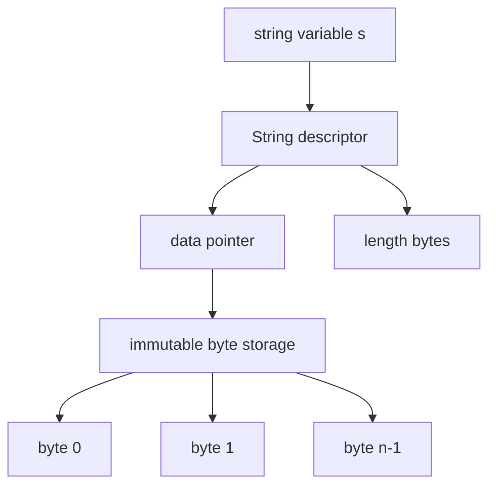
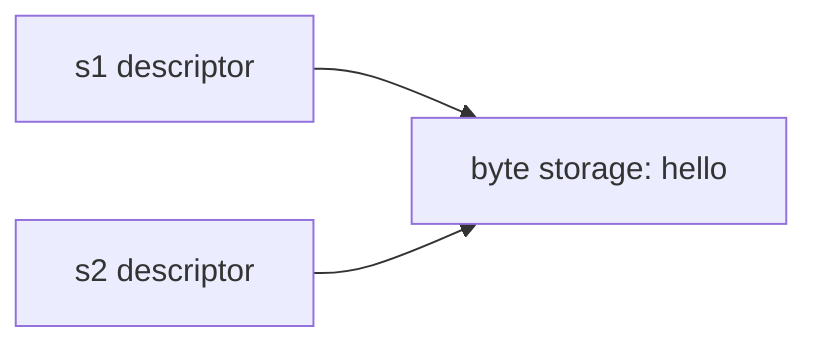

# learn-go-memory-systems-part-010.md

# Go Memory Systems — Part 010

## String Internals: Immutability, UTF-8, Conversion Cost, and `[]byte` Interaction

> Target pembaca: Java software engineer yang ingin memahami Go string bukan sebagai “String versi Go”, tetapi sebagai representasi memory yang punya konsekuensi langsung terhadap allocation, copy, parsing, buffer lifecycle, retention, GC, zero-copy, dan API design.

---

## 0. Posisi Part Ini Dalam Seri

Pada part sebelumnya kita sudah membahas slice sebagai header kecil yang menunjuk ke backing array. String tampak mirip: ia juga kecil, dapat dicopy murah, dan sering menunjuk ke byte storage yang lebih besar.

Namun string punya satu kontrak tambahan yang sangat kuat:

> **string bersifat immutable.**

Kontrak ini membuat string sangat berguna sebagai key, identifier, protocol token, log field, map key, dan boundary value. Tetapi kontrak yang sama juga membuat banyak operasi string menghasilkan copy atau allocation.

Part ini menjawab pertanyaan inti:

- Apa sebenarnya isi sebuah `string` di Go?
- Mengapa `len(s)` menghitung byte, bukan karakter?
- Bagaimana hubungan string dengan UTF-8?
- Kapan konversi `string` ↔ `[]byte` melakukan copy?
- Mengapa string bisa menyebabkan retention leak?
- Kapan `strings.Builder`, `bytes.Buffer`, dan `append` lebih tepat?
- Apa bahaya zero-copy string menggunakan `unsafe`?
- Bagaimana mendesain API yang memory-safe untuk parsing, logging, cache, dan network protocol?

---

## 1. Mental Model Utama

String di Go adalah:

```go
var s string = "hello"
```

Secara konseptual, string adalah descriptor atas sequence of bytes yang immutable.

```text
string value
+----------------+----------------+
| data pointer   | length in bytes |
+----------------+----------------+
        |
        v
+---+---+---+---+---+
| h | e | l | l | o |
+---+---+---+---+---+
```

Yang penting:

1. String value kecil dan murah dicopy.
2. Copy string value tidak meng-copy byte data.
3. Isi byte string tidak boleh diubah.
4. `len(s)` adalah jumlah byte.
5. String bukan `[]rune`.
6. String sering berisi UTF-8, tapi secara type ia adalah sequence of bytes.
7. Konversi `[]byte` ke `string` normalnya copy.
8. Konversi `string` ke `[]byte` normalnya copy.
9. Substring bisa mempertahankan memory lebih besar tergantung bagaimana string asal dibentuk dan dioptimasi compiler/runtime.
10. Zero-copy string hanya aman jika ownership dan immutability benar-benar dijaga.

---

## 2. String Bukan Java String

Java `String` adalah object di heap dengan metadata object, field internal, dan sejarah implementasi yang berubah dari `char[]`, compact string, substring sharing lama, dan sebagainya.

Go `string` lebih dekat ke value descriptor:

```text
Java mental model:
reference -> object -> internal byte/char array

Go mental model:
string value = pointer + length
```

Perbandingan:

| Aspek | Java | Go |
|---|---|---|
| Primitive/value? | Reference ke object | Value descriptor |
| Immutability | Ya | Ya |
| Encoding internal | Implementasi JVM | Byte sequence, umumnya UTF-8 |
| `length()` / `len()` | unit logis Java string implementation | byte length |
| Substring behavior | Tergantung era JVM | Harus dipahami dari copy/retention context |
| Conversion to bytes | explicit charset encode | copy byte sequence |
| Map key | `hashCode` object semantics | comparable by byte content |

Kesalahan Java engineer yang umum:

```go
// Salah mental model: mengira len menghitung character.
fmt.Println(len("é")) // 2, bukan 1
```

Karena `é` dalam UTF-8 biasanya memakai dua byte.

---

## 3. Spesifikasi: String Adalah Sequence of Bytes

Go specification mendefinisikan string sebagai sequence of bytes. Panjang string adalah jumlah byte, dan isi string immutable setelah dibuat.

Konsekuensinya:

```go
s := "hello"
s[0] = 'H' // compile error
```

Namun indexing string mengembalikan byte:

```go
s := "hé"
fmt.Println(len(s)) // 3: 'h' = 1 byte, 'é' = 2 bytes
fmt.Println(s[0])   // byte untuk 'h'
fmt.Println(s[1])   // byte pertama dari 'é'
```

String bukan array karakter. String adalah byte sequence dengan syntax dan tooling yang nyaman untuk text.

---

## 4. Diagram Representasi String



Jika string dicopy:

```go
s1 := "hello"
s2 := s1
```

Yang dicopy adalah descriptor, bukan byte storage.



Karena immutable, sharing storage ini aman.

---

## 5. String Literal

String literal seperti:

```go
const msg = "hello"
```

biasanya disimpan di read-only data segment atau area statis program. Ini bukan heap object biasa yang dialokasikan setiap kali function dipanggil.

Contoh:

```go
func greet() string {
    return "hello"
}
```

Tidak berarti setiap call membuat byte array baru. Descriptor string bisa mengacu ke static storage.

Namun:

```go
func greet(name string) string {
    return "hello, " + name
}
```

Ini membutuhkan string baru karena hasilnya bergantung pada runtime data.

---

## 6. Raw String vs Interpreted String

Go punya dua bentuk literal string:

```go
s1 := "line\nnext"
s2 := `line
next`
```

Interpreted string memproses escape sequence.

Raw string mempertahankan isi literal kecuali backtick tidak bisa langsung berada di dalamnya.

Perbedaan memory-nya bukan hal utama. Yang penting adalah semantik byte yang terbentuk.

```go
fmt.Println(len("\n")) // 1 byte newline
fmt.Println(len(`\n`)) // 2 bytes: backslash + n
```

Untuk protocol, SQL, regex, atau template, raw string bisa mengurangi noise escaping.

---

## 7. UTF-8: Konvensi Kuat, Bukan Struktur Type

String di Go bisa berisi bytes apa pun.

```go
s := string([]byte{0xff, 0xfe, 0xfd})
fmt.Println(len(s)) // 3
```

Ini valid string, meskipun bukan UTF-8 valid.

Namun banyak package Go mengasumsikan atau mendukung UTF-8:

- `strings`
- `unicode/utf8`
- `regexp`
- `fmt`
- `encoding/json`
- source code Go sendiri memakai UTF-8

Mental model:

```text
string type     = immutable byte sequence
text convention = often UTF-8
rune iteration  = decode UTF-8 into Unicode code points
```

---

## 8. Byte Length vs Rune Count vs Grapheme Cluster

Ada tiga ukuran berbeda:

```go
s := "aé😊"

fmt.Println(len(s))                    // bytes
fmt.Println(utf8.RuneCountInString(s)) // Unicode code points
fmt.Println([]rune(s))                 // decoded runes
```

Tetapi bahkan rune count belum tentu sama dengan “karakter yang terlihat manusia”.

Contoh:

```text
"e" + combining accent
```

Bisa terlihat sebagai satu karakter, tetapi terdiri dari lebih dari satu code point.

Untuk UI text processing, gunakan package yang sadar Unicode normalization/grapheme jika diperlukan. Untuk protocol binary/text backend, sering kali byte-level processing lebih tepat.

---

## 9. Iterasi String

### 9.1 Iterasi by byte

```go
for i := 0; i < len(s); i++ {
    b := s[i]
    _ = b
}
```

Ini membaca byte.

### 9.2 Iterasi by rune

```go
for offset, r := range s {
    fmt.Println(offset, r)
}
```

`range` atas string melakukan UTF-8 decoding.

`offset` adalah byte offset, bukan rune index.

Jika string mengandung invalid UTF-8, `range` menghasilkan replacement rune untuk invalid sequence.

---

## 10. String Indexing

Indexing string mengembalikan byte:

```go
s := "é"
fmt.Printf("%x\n", s[0])
fmt.Printf("%x\n", s[1])
```

Tidak bisa mengambil karakter Unicode dengan `s[i]` kecuali Anda memang bekerja di level byte.

Untuk protocol ASCII, indexing byte adalah efisien dan tepat:

```go
func isHTTPTokenStart(s string) bool {
    return len(s) >= 4 && s[0] == 'H' && s[1] == 'T' && s[2] == 'T' && s[3] == 'P'
}
```

Untuk text Unicode, jangan gunakan byte index sebagai character index.

---

## 11. Conversion: `string` ke `[]byte`

```go
s := "hello"
b := []byte(s)
```

Secara normal, ini membuat copy bytes baru karena `[]byte` mutable sedangkan string immutable.

Jika tidak copy, kode berikut akan merusak immutability:

```go
s := "hello"
b := []byte(s)
b[0] = 'H'
fmt.Println(s) // harus tetap "hello"
```

Jadi conversion ini adalah boundary dari immutable ke mutable.

### Implikasi performa

```go
func handle(s string) {
    b := []byte(s) // allocation/copy potensial
    process(b)
}
```

Jika hot path, conversion berulang bisa mahal.

Strategi:

- Hindari conversion jika function bisa menerima `string`.
- Jika perlu parsing byte, pertimbangkan input dari awal sebagai `[]byte`.
- Jika perlu immutable key, convert sekali di boundary.
- Benchmark sebelum mengganti desain.

---

## 12. Conversion: `[]byte` ke `string`

```go
b := []byte{'h', 'e', 'l', 'l', 'o'}
s := string(b)
```

Secara normal, ini copy juga karena setelah conversion, string harus immutable.

Jika string hanya view atas `b`, maka perubahan `b` akan mengubah string:

```go
b := []byte("hello")
s := string(b)
b[0] = 'H'
fmt.Println(s) // harus tetap "hello"
```

Maka normal conversion perlu copy.

### Kapan copy ini benar?

Copy ini benar ketika:

- data akan dijadikan map key,
- data akan disimpan di cache,
- data akan hidup lebih lama dari buffer,
- buffer akan direuse,
- data berasal dari network/file mutable buffer,
- data harus punya ownership sendiri.

---

## 13. Conversion Bisa Dioptimasi Compiler?

Compiler Go dapat melakukan optimasi tertentu dalam konteks terbatas. Namun desain program tidak boleh bergantung pada asumsi “conversion ini pasti zero allocation”.

Contoh yang sering dioptimasi:

```go
m := map[string]int{"hello": 1}
b := []byte("hello")
_, ok := m[string(b)]
_ = ok
```

Compiler/runtime dapat memiliki fast path untuk lookup tertentu. Tetapi sebagai rule engineering:

> Anggap conversion `[]byte` ↔ `string` melakukan copy kecuali Anda sudah membuktikan sebaliknya dengan benchmark dan escape/alloc profile.

Ini membuat desain API lebih aman.

---

## 14. Diagram Conversion Cost

```mermaid
flowchart TD
    A[mutable []byte] -->|string(b)| B[new immutable string bytes]
    B --> C[string descriptor]

    D[immutable string] -->|[]byte(s)| E[new mutable byte array]
    E --> F[slice header]
```

Boundary mutability hampir selalu berarti copy.

---

## 15. Substring dan Retention

Substring:

```go
s := loadHugeString()
small := s[:10]
```

Secara konseptual, `small` bisa menunjuk ke storage yang sama dengan `s`, hanya length-nya lebih kecil.

Risiko:

```text
small string 10 bytes
        |
        v
huge backing storage 100 MB tetap reachable
```

Jika `small` disimpan lama, storage besar bisa ikut tertahan.

Pattern aman:

```go
small := strings.Clone(s[:10])
```

atau:

```go
small := string([]byte(s[:10]))
```

Namun `strings.Clone` lebih ekspresif untuk “saya butuh copy string sendiri”.

---

## 16. Kapan Perlu `strings.Clone`

Gunakan `strings.Clone` ketika:

1. Anda mengambil substring kecil dari string besar.
2. Substring akan disimpan lama.
3. String besar berasal dari request/file/buffer besar.
4. Anda ingin memutus retention.
5. Anda ingin dokumentasi niat di kode.

Contoh:

```go
func extractTenantID(header string) string {
    tenant := parseTenant(header)
    return strings.Clone(tenant)
}
```

Ini memberi sinyal bahwa return value punya storage sendiri.

Jangan gunakan `Clone` secara buta di semua tempat, karena copy juga punya cost.

---

## 17. String as Map Key

String adalah comparable, sehingga bisa dipakai sebagai map key.

```go
m := map[string]int{
    "ok": 1,
}
```

Keuntungan:

- immutable
- hashable
- familiar untuk protocol token, ID, name, route, header key

Risiko:

- membuat key dari `[]byte` berarti copy
- key kecil dari string besar bisa retain storage jika bukan clone
- map bisa menjadi retention root besar

Contoh retention:

```go
func load(lines []string) map[string]struct{} {
    out := make(map[string]struct{})
    for _, line := range lines {
        key := line[:8]
        out[key] = struct{}{}
    }
    return out
}
```

Jika `line` besar dan `key` share storage, map bisa menahan memory besar.

Lebih aman:

```go
out[strings.Clone(line[:8])] = struct{}{}
```

---

## 18. String Building: Jangan Menggunakan `+` Secara Membabi Buta

Untuk sedikit concatenation, `+` baik:

```go
s := "hello " + name
```

Untuk loop, hati-hati:

```go
var s string
for _, part := range parts {
    s += part // sering menghasilkan allocation berulang
}
```

Gunakan `strings.Builder`:

```go
var b strings.Builder
for _, part := range parts {
    b.WriteString(part)
}
s := b.String()
```

Jika tahu ukuran final:

```go
var b strings.Builder
b.Grow(totalSize)
for _, part := range parts {
    b.WriteString(part)
}
return b.String()
```

---

## 19. `strings.Builder` Mental Model

`strings.Builder` adalah builder untuk membuat string secara efisien.

Properties penting:

- ditujukan untuk string output,
- mengurangi intermediate string,
- punya method `Grow`, `WriteString`, `WriteByte`, `WriteRune`, `String`, `Reset`,
- tidak boleh dicopy setelah digunakan.

Contoh:

```go
func join(parts []string) string {
    var b strings.Builder
    for _, p := range parts {
        b.WriteString(p)
    }
    return b.String()
}
```

Untuk output text, `strings.Builder` sering lebih tepat daripada `bytes.Buffer`.

---

## 20. `bytes.Buffer` vs `strings.Builder`

| Use Case | Pilihan Umum |
|---|---|
| membangun string text | `strings.Builder` |
| membangun bytes/binary | `bytes.Buffer` atau `[]byte` append |
| butuh `io.Writer` untuk bytes | `bytes.Buffer` |
| butuh final string | `strings.Builder` |
| mix binary + text | biasanya `bytes.Buffer` / `[]byte` |

Contoh binary-ish:

```go
var buf bytes.Buffer
buf.WriteByte(0x01)
buf.Write(payload)
```

Contoh text:

```go
var b strings.Builder
b.WriteString("HTTP/")
b.WriteString(version)
```

---

## 21. `fmt.Sprintf` Cost

`fmt.Sprintf` nyaman tetapi relatif mahal:

```go
s := fmt.Sprintf("user=%s status=%d", user, status)
```

Cost berasal dari:

- parsing format,
- interface boxing-like behavior via `...any`,
- reflection-ish formatting paths,
- allocation output string.

Untuk hot path:

```go
var b strings.Builder
b.WriteString("user=")
b.WriteString(user)
b.WriteString(" status=")
b.WriteString(strconv.Itoa(status))
s := b.String()
```

Namun jangan mengganti semua `fmt.Sprintf` sebelum terbukti bottleneck.

Rule:

```text
control path / admin / test = fmt acceptable
hot path / per packet / per log field = consider builder/append/strconv
```

---

## 22. `strconv` Untuk Conversion Numerik

Hindari `fmt.Sprintf` untuk conversion sederhana di hot path.

```go
s := strconv.Itoa(n)
```

Untuk append ke buffer:

```go
buf := make([]byte, 0, 64)
buf = strconv.AppendInt(buf, int64(n), 10)
```

Ini sangat berguna untuk membangun protocol, log line, metric label, atau response kecil dengan allocation minimal.

---

## 23. Building Bytes Lalu String

Kadang lebih efisien membangun `[]byte` lalu convert ke string sekali:

```go
buf := make([]byte, 0, 128)
buf = append(buf, "id="...)
buf = strconv.AppendInt(buf, id, 10)
s := string(buf)
```

Tetapi conversion terakhir copy ke immutable string.

Jika output akhirnya dikirim ke network sebagai bytes, jangan convert ke string:

```go
w.Write(buf)
```

Jika output akhirnya harus string, conversion sekali di akhir masih jauh lebih baik daripada banyak intermediate string.

---

## 24. `[]byte` Append Pattern Untuk Protocol

```go
func encode(dst []byte, id int64, status string) []byte {
    dst = append(dst, "id="...)
    dst = strconv.AppendInt(dst, id, 10)
    dst = append(dst, " status="...)
    dst = append(dst, status...)
    return dst
}
```

Keunggulan:

- caller bisa reuse buffer,
- capacity bisa dikontrol,
- allocation bisa mendekati nol,
- cocok untuk network/file output.

Kontrak ownership:

```text
Returned slice valid until caller mutates/reuses backing buffer.
Callee must not store dst unless explicitly documented.
```

---

## 25. String dan `io.Reader`

Untuk membaca string sebagai stream:

```go
r := strings.NewReader(s)
```

Ini tidak perlu membuat copy byte mutable. Reader menyimpan string dan offset.

Untuk bytes:

```go
r := bytes.NewReader(b)
```

Pilih berdasarkan sumber data.

Jika Anda sudah punya string dan butuh `io.Reader`, jangan convert ke `[]byte` dulu:

```go
// Buruk
r := bytes.NewReader([]byte(s))

// Baik
r := strings.NewReader(s)
```

---

## 26. Parsing: String atau `[]byte`?

Untuk parser, pilihan input type sangat penting.

### Input `string`

Cocok jika:

- data memang text immutable,
- caller sudah punya string,
- parser tidak perlu mutate,
- token output berupa string,
- data relatif kecil atau lifetime jelas.

### Input `[]byte`

Cocok jika:

- data datang dari network/file buffer,
- parser hot path,
- ingin avoid conversion,
- ingin caller control buffer reuse,
- output tidak harus disimpan lama.

### Dual API

```go
func ParseString(s string) (Result, error) { ... }
func ParseBytes(b []byte) (Result, error) { ... }
```

Namun dual API meningkatkan maintenance cost. Jangan buat dua API hanya karena terlihat lengkap.

---

## 27. Token View vs Token Copy

Parser sering menghasilkan token:

```go
type Token struct {
    Kind Kind
    Text string
}
```

Jika `Text` adalah substring dari input besar dan token disimpan lama, input besar bisa tertahan.

Alternatif:

```go
type TokenView struct {
    Kind  Kind
    Start int
    End   int
}
```

Token view menyimpan offset, bukan string copy.

Trade-off:

| Approach | Pro | Kontra |
|---|---|---|
| Token string copy | ownership jelas | allocation/copy |
| Token substring view | murah | retention risk |
| Token offset | murah dan explicit | caller harus punya source |
| Token `[]byte` view | murah | mutable aliasing risk |

---

## 28. API Ownership Contract Untuk String

Karena string immutable, API yang menerima string biasanya tidak perlu defensive copy.

```go
func SetName(name string) {
    globalName = name
}
```

Namun jika `name` adalah substring dari string besar, assignment ini bisa retain storage besar.

Jika API menyimpan string lama dan input mungkin substring, pertimbangkan:

```go
func SetName(name string) {
    globalName = strings.Clone(name)
}
```

Tetapi jangan clone semua input tanpa alasan. Clone adalah policy boundary.

Dokumentasikan:

```go
// SetName stores name for the lifetime of Config.
// It clones name to avoid retaining larger caller-owned strings.
func (c *Config) SetName(name string) {
    c.name = strings.Clone(name)
}
```

---

## 29. API Ownership Contract Untuk `[]byte`

Berbeda dengan string, `[]byte` mutable.

Jika API menyimpan data:

```go
func SetKey(key []byte) {
    globalKey = key // bahaya
}
```

Caller bisa mutate setelah call.

Aman:

```go
func SetKey(key []byte) {
    globalKey = append(globalKey[:0], key...)
}
```

atau jika perlu string key:

```go
func SetKey(key []byte) {
    globalKey = string(key) // copy ke immutable string
}
```

String sering menjadi ownership boundary yang baik untuk small immutable identifiers.

---

## 30. Zero-Copy String Dengan `unsafe`

Modern Go menyediakan API `unsafe.String` dan `unsafe.StringData`.

Contoh konsep:

```go
s := unsafe.String(&b[0], len(b))
```

Ini membuat string view atas memory byte tanpa copy.

Tetapi kontraknya sangat berat:

1. Memory harus valid selama string digunakan.
2. Bytes tidak boleh dimutasi selama string digunakan.
3. Jika buffer dipool/reuse, string bisa berubah diam-diam.
4. Jika memory off-heap dilepas, string bisa dangling.
5. Race detector belum tentu menyelamatkan semua pola unsafe.

Untuk kebanyakan aplikasi, normal `string(b)` lebih benar.

---

## 31. Zero-Copy Bug: Buffer Reuse

```go
func parseLine(buf []byte) string {
    return unsafe.String(unsafe.SliceData(buf), len(buf))
}
```

Jika caller melakukan:

```go
line := parseLine(buf)
buf[0] = 'X'
fmt.Println(line) // bisa berubah
```

Ini melanggar immutability string secara semantik.

Lebih berbahaya jika buffer dari pool:

```go
s := unsafeString(buf)
pool.Put(buf)
// buffer dipakai request lain
// s sekarang bisa menunjuk data request lain
```

Ini bisa menjadi data corruption atau data leak/security incident.

---

## 32. Kapan Zero-Copy String Layak?

Pertimbangkan hanya jika semua benar:

- hot path terbukti bottleneck oleh copy,
- data besar atau sangat sering,
- lifetime memory sangat jelas,
- bytes immutable setelah view dibuat,
- tidak berasal dari buffer pool yang akan reuse,
- ada benchmark dan fuzz/race test,
- unsafe diisolasi dalam package kecil,
- ada komentar kontrak ownership,
- fallback safe implementation tersedia jika perlu.

Contoh area yang kadang layak:

- parser internal read-only atas memory mapped immutable file,
- high-performance protocol decoder dengan strict lifetime,
- dictionary/interning subsystem yang mengontrol memory penuh.

Tidak layak untuk:

- request body umum,
- log message,
- user input kecil,
- kode bisnis,
- cache key dari buffer mutable,
- data security-sensitive.

---

## 33. Mermaid: Safe vs Unsafe Conversion

```mermaid
flowchart TD
    A[[]byte mutable input] --> B{Need store long-term?}
    B -->|Yes| C[string(b) copy]
    B -->|No| D{Need string API?}
    D -->|No| E[Process as []byte]
    D -->|Yes| F[string(b) usually OK]
    F --> G[Measure if hot path]
    G --> H{Copy proven bottleneck?}
    H -->|No| I[Keep safe copy]
    H -->|Yes| J{Can prove immutable lifetime?}
    J -->|No| I
    J -->|Yes| K[Isolate unsafe zero-copy]
```

---

## 34. Accidental Allocation Patterns

### 34.1 Repeated conversion in loop

```go
for _, b := range chunks {
    if strings.HasPrefix(string(b), "GET ") {
        ...
    }
}
```

Better:

```go
prefix := []byte("GET ")
for _, b := range chunks {
    if bytes.HasPrefix(b, prefix) {
        ...
    }
}
```

### 34.2 `fmt.Sprintf` for simple concat

```go
key := fmt.Sprintf("%s:%d", user, id)
```

For hot path:

```go
var b strings.Builder
b.Grow(len(user) + 1 + 20)
b.WriteString(user)
b.WriteByte(':')
b.WriteString(strconv.FormatInt(id, 10))
key := b.String()
```

### 34.3 `[]byte` for `io.Reader` from string

```go
bytes.NewReader([]byte(s)) // unnecessary copy
```

Use:

```go
strings.NewReader(s)
```

### 34.4 Storing substring from huge string

```go
cache[id] = huge[:16]
```

Use:

```go
cache[id] = strings.Clone(huge[:16])
```

---

## 35. Strings in Logging

Structured logging sering membuat banyak string:

```go
logger.Info("request", "user", string(userBytes), "path", path)
```

Jika `userBytes` berasal dari reusable buffer dan log framework menyimpan value async, conversion safe copy bisa benar.

Masalah muncul jika mencoba unsafe zero-copy untuk log:

```go
logger.Info("request", "user", unsafeString(userBytes))
```

Jika logger async dan buffer berubah setelah call, log bisa salah atau bocor data request lain.

Rule:

> Logging boundary biasanya lebih memilih correctness dan ownership jelas daripada zero-copy ekstrem.

---

## 36. Strings in JSON

`encoding/json` banyak bekerja dengan string karena JSON object key adalah string dan string value harus valid escaped JSON text.

Hot path issue:

- `map[string]any` membuat banyak dynamic value,
- string conversion dari `[]byte` berulang,
- building JSON manual dengan `fmt` mahal,
- escaping string perlu scan/copy.

Untuk high-performance path:

- gunakan struct typed,
- gunakan `json.Encoder` streaming jika output besar,
- hindari `map[string]any` untuk known schema,
- hindari convert bytes to string lalu marshal jika bisa write bytes dengan valid contract,
- benchmark alternative encoder hanya jika benar-benar perlu.

---

## 37. Strings in HTTP

HTTP banyak menggunakan string:

- method,
- path,
- host,
- header key,
- header value,
- query parameter.

Namun body adalah stream bytes.

Kesalahan umum:

```go
body, _ := io.ReadAll(r.Body)
s := string(body)
```

Jika body besar, ini double memory:

```text
[]byte body + string copy
```

Lebih baik streaming decode:

```go
dec := json.NewDecoder(r.Body)
err := dec.Decode(&payload)
```

Jika butuh logging body, batasi ukuran.

---

## 38. Strings and Security

String immutable berarti secret yang sudah menjadi string sulit dihapus dari memory secara deterministik.

Contoh:

```go
password := string(passwordBytes)
```

Sekarang ada immutable copy yang tidak bisa zeroed.

Untuk secret:

- pertahankan sebagai `[]byte` jika perlu bisa dihapus,
- hindari logging,
- hindari `fmt.Sprintf`,
- hindari map key string untuk secret,
- minimalkan copy,
- pahami bahwa Go GC tetap bisa meninggalkan salinan lama sampai memory reused.

Namun jangan mengklaim zeroization sempurna tanpa threat model kuat.

---

## 39. String Interning

Go tidak otomatis meng-intern semua runtime string seperti asumsi sebagian Java engineer.

String literal bisa berbagi storage, tetapi runtime string hasil parsing tidak otomatis masuk global intern pool.

Jika banyak string berulang dan lifetime panjang, Anda bisa membangun interning sendiri:

```go
type Interner struct {
    mu sync.Mutex
    m  map[string]string
}

func (in *Interner) Intern(s string) string {
    in.mu.Lock()
    defer in.mu.Unlock()
    if existing, ok := in.m[s]; ok {
        return existing
    }
    s = strings.Clone(s)
    in.m[s] = s
    return s
}
```

Trade-off:

- mengurangi duplicate memory,
- menambah map overhead,
- menambah lock contention,
- bisa menjadi memory leak jika unbounded,
- butuh eviction atau bounded domain.

---

## 40. Case Study: Header Parsing

Naive:

```go
func parseHeader(line []byte) (string, string, bool) {
    parts := strings.SplitN(string(line), ":", 2)
    if len(parts) != 2 {
        return "", "", false
    }
    return strings.TrimSpace(parts[0]), strings.TrimSpace(parts[1]), true
}
```

Masalah:

- `string(line)` copy seluruh line,
- `SplitN` menghasilkan substring,
- trim menghasilkan substring,
- jika disimpan, bisa retain string line,
- allocation lebih banyak.

Lebih sadar memory:

```go
func parseHeader(line []byte) (name, value []byte, ok bool) {
    i := bytes.IndexByte(line, ':')
    if i < 0 {
        return nil, nil, false
    }
    name = bytes.TrimSpace(line[:i])
    value = bytes.TrimSpace(line[i+1:])
    return name, value, true
}
```

Jika perlu store long-term:

```go
n, v, ok := parseHeader(line)
if ok {
    headers[string(n)] = string(v) // deliberate ownership copy
}
```

---

## 41. Case Study: Cache Key

Naive:

```go
func key(user string, id int64) string {
    return fmt.Sprintf("%s:%d", user, id)
}
```

Optimized when hot:

```go
func key(user string, id int64) string {
    var b strings.Builder
    b.Grow(len(user) + 1 + 20)
    b.WriteString(user)
    b.WriteByte(':')
    b.WriteString(strconv.FormatInt(id, 10))
    return b.String()
}
```

Even lower-level byte append:

```go
func appendKey(dst []byte, user string, id int64) []byte {
    dst = append(dst, user...)
    dst = append(dst, ':')
    dst = strconv.AppendInt(dst, id, 10)
    return dst
}
```

Pilih berdasarkan ownership final:

- map key needs string,
- network output can stay bytes,
- temporary metric label may need caution with cardinality.

---

## 42. Case Study: Scanner Token

`bufio.Scanner` mengembalikan token sebagai `[]byte` atau `string`.

```go
scanner := bufio.NewScanner(r)
for scanner.Scan() {
    text := scanner.Text()  // string
    bytes := scanner.Bytes() // []byte valid until next Scan
    _ = text
    _ = bytes
}
```

Memory contract penting:

- `Text()` returns string representation; may allocate.
- `Bytes()` avoids allocation but valid only until next scan.

Jika ingin menyimpan token dari `Bytes()`:

```go
saved := append([]byte(nil), scanner.Bytes()...)
```

atau:

```go
saved := string(scanner.Bytes())
```

Jangan simpan `scanner.Bytes()` langsung untuk jangka panjang.

---

## 43. Case Study: Large File Lines

Naive:

```go
data, _ := os.ReadFile(path)
lines := strings.Split(string(data), "\n")
```

Masalah:

- read seluruh file,
- convert seluruh bytes ke string copy,
- split menghasilkan banyak substring,
- retention besar,
- memory peak tinggi.

Streaming:

```go
f, err := os.Open(path)
if err != nil { return err }
defer f.Close()

scanner := bufio.NewScanner(f)
for scanner.Scan() {
    line := scanner.Bytes()
    process(line)
}
return scanner.Err()
```

Jika line bisa besar, gunakan `bufio.Reader.ReadSlice` atau custom chunk parser.

---

## 44. Bounds Check and String

String indexing melakukan bounds check.

```go
func hasPrefixGET(s string) bool {
    return len(s) >= 4 && s[0] == 'G' && s[1] == 'E' && s[2] == 'T' && s[3] == ' '
}
```

Pattern `len(s) >= 4` membantu compiler mengeliminasi bounds checks berikutnya.

Namun jangan menulis kode cryptic hanya demi bounds check elimination. Benchmark dan inspect assembly hanya untuk path sangat hot.

---

## 45. String Comparison

String comparison membandingkan bytes.

```go
if method == "GET" { ... }
```

Ini biasanya efisien, terutama untuk literal pendek.

Untuk case-insensitive compare:

```go
strings.EqualFold(a, b)
```

Jangan selalu `strings.ToLower` dulu karena membuat string baru.

```go
// Bisa allocation
if strings.ToLower(s) == "content-type" { ... }

// Lebih baik untuk compare
if strings.EqualFold(s, "content-type") { ... }
```

---

## 46. String Search

Package `strings` punya fungsi search:

- `Contains`
- `Index`
- `IndexByte`
- `HasPrefix`
- `HasSuffix`
- `Cut`
- `CutPrefix`
- `CutSuffix`

Untuk parsing sederhana, `strings.Cut` sering lebih baik daripada `SplitN`:

```go
name, value, ok := strings.Cut(line, ":")
```

Karena tidak membuat slice hasil split.

Namun hasil `name` dan `value` adalah substring view/copy semantics yang perlu dipahami untuk retention.

---

## 47. `strings.Cut` vs `strings.Split`

Naive:

```go
parts := strings.SplitN(s, ":", 2)
if len(parts) != 2 { ... }
```

Better:

```go
left, right, ok := strings.Cut(s, ":")
if !ok { ... }
```

Keuntungan:

- API lebih jelas,
- tidak membuat `[]string` result,
- lebih cocok untuk parsing delimiter tunggal.

Tetap ingat: `left` dan `right` bisa retain storage asal jika disimpan.

---

## 48. String and GC Scanning

String descriptor punya pointer ke byte storage dan length.

Byte storage string tidak berisi pointer ke heap object lain. Jadi dari sisi GC:

- string descriptor berisi pointer yang harus dipahami GC,
- bytes di balik string adalah pointer-free data,
- banyak string descriptors tetap menambah object graph jika disimpan di heap,
- map string key bisa membuat banyak string reachable,
- retention string besar meningkatkan live heap bytes.

Pointer-free bytes lebih murah di-scan daripada object graph penuh pointer, tetapi live bytes tetap memengaruhi heap goal dan memory footprint.

---

## 49. String Retention Taxonomy

| Pattern | Masalah | Fix |
|---|---|---|
| substring kecil dari string besar disimpan | backing storage besar tertahan | `strings.Clone` |
| map key dari substring | cache menahan input besar | clone key |
| async log unsafe string dari buffer | data corruption/leak | safe copy |
| scanner bytes disimpan | invalid setelah scan berikutnya | copy/string |
| `io.ReadAll` + `string` | double memory | stream decode |
| `fmt.Sprintf` hot path | allocation/format overhead | builder/append/strconv |
| secret converted to string | sulit dihapus | keep `[]byte` |

---

## 50. Production Checklist: String API

Saat review API yang menggunakan string:

1. Apakah input memang text immutable?
2. Apakah `len` dimaksudkan byte length atau character count?
3. Apakah function menyimpan string jangka panjang?
4. Apakah input bisa substring dari buffer besar?
5. Perlukah `strings.Clone` di boundary?
6. Apakah conversion `[]byte` ↔ `string` ada di hot loop?
7. Apakah `fmt.Sprintf` ada di path per request/per item?
8. Apakah `strings.Split` bisa diganti `Cut`?
9. Apakah output akhirnya bytes, bukan string?
10. Apakah secret pernah menjadi string?
11. Apakah unsafe string conversion benar-benar perlu?
12. Apakah lifetime buffer aman jika zero-copy?
13. Apakah benchmark memakai `-benchmem`?
14. Apakah heap profile membuktikan retention?
15. Apakah pprof membedakan alloc_space vs inuse_space?

---

## 51. Mini Lab 1: Byte vs Rune

Buat file:

```go
package main

import (
    "fmt"
    "unicode/utf8"
)

func main() {
    s := "aé😊"
    fmt.Println("string:", s)
    fmt.Println("len bytes:", len(s))
    fmt.Println("runes:", utf8.RuneCountInString(s))

    fmt.Println("bytes:")
    for i := 0; i < len(s); i++ {
        fmt.Printf("  [%d] 0x%x\n", i, s[i])
    }

    fmt.Println("range runes:")
    for offset, r := range s {
        fmt.Printf("  offset=%d rune=%q code=%U\n", offset, r, r)
    }
}
```

Ekspektasi:

- `len` lebih besar dari jumlah rune.
- offset range adalah byte offset.
- emoji memakai beberapa byte.

---

## 52. Mini Lab 2: Conversion Allocation

```go
package conv

func StringToBytes(s string) []byte {
    return []byte(s)
}

func BytesToString(b []byte) string {
    return string(b)
}
```

Benchmark:

```go
package conv

import "testing"

func BenchmarkStringToBytes(b *testing.B) {
    s := "abcdefghijklmnopqrstuvwxyz0123456789"
    b.ReportAllocs()
    for i := 0; i < b.N; i++ {
        _ = StringToBytes(s)
    }
}

func BenchmarkBytesToString(b *testing.B) {
    src := []byte("abcdefghijklmnopqrstuvwxyz0123456789")
    b.ReportAllocs()
    for i := 0; i < b.N; i++ {
        _ = BytesToString(src)
    }
}
```

Run:

```bash
go test -bench=. -benchmem
```

Amati allocation. Lalu ubah agar hasil disimpan ke package-level sink supaya compiler tidak menghilangkan pekerjaan.

---

## 53. Mini Lab 3: Builder vs Concatenation

```go
package build

import (
    "strconv"
    "strings"
    "testing"
)

var sink string

func concat(parts []int) string {
    var s string
    for _, p := range parts {
        s += strconv.Itoa(p)
        s += ","
    }
    return s
}

func builder(parts []int) string {
    var b strings.Builder
    b.Grow(len(parts) * 4)
    for _, p := range parts {
        b.WriteString(strconv.Itoa(p))
        b.WriteByte(',')
    }
    return b.String()
}

func BenchmarkConcat(b *testing.B) {
    xs := []int{1,2,3,4,5,6,7,8,9,10}
    b.ReportAllocs()
    for i := 0; i < b.N; i++ {
        sink = concat(xs)
    }
}

func BenchmarkBuilder(b *testing.B) {
    xs := []int{1,2,3,4,5,6,7,8,9,10}
    b.ReportAllocs()
    for i := 0; i < b.N; i++ {
        sink = builder(xs)
    }
}
```

Tujuan:

- lihat allocation count,
- lihat effect `Grow`,
- pahami bahwa builder mengurangi intermediate strings.

---

## 54. Mini Lab 4: Retention

Konsep eksperimen:

```go
package main

import (
    "fmt"
    "runtime"
    "strings"
)

var retained []string

func printMem(label string) {
    runtime.GC()
    var m runtime.MemStats
    runtime.ReadMemStats(&m)
    fmt.Println(label, "Alloc", m.Alloc/1024/1024, "MB")
}

func main() {
    printMem("start")

    huge := strings.Repeat("x", 100<<20)
    small := huge[:10]
    retained = append(retained, small)
    huge = ""

    printMem("after retain substring")

    retained = nil
    printMem("after clear")
}
```

Lalu bandingkan dengan:

```go
small := strings.Clone(huge[:10])
```

Catatan: hasil bisa dipengaruhi optimasi compiler/runtime dan environment. Fokus pada mental model dan profile, bukan angka absolut.

---

## 55. Mini Lab 5: Header Parser

Implementasikan dua versi:

1. `ParseHeaderString(line []byte) (string, string, bool)` menggunakan `string(line)` dan `strings.Cut`.
2. `ParseHeaderBytes(line []byte) ([]byte, []byte, bool)` menggunakan `bytes.IndexByte`.

Benchmark:

```bash
go test -bench=. -benchmem
```

Pertanyaan review:

- Versi mana allocation lebih kecil?
- Versi mana ownership lebih jelas?
- Jika output disimpan dalam map, di mana copy terbaik dilakukan?
- Jika output hanya dipakai sesaat, apakah string diperlukan?

---

## 56. Deep Review: Kapan String Tepat?

String tepat untuk:

- immutable identifier,
- map key,
- config value,
- route/method/header name yang stabil,
- business field text,
- error message,
- output final text,
- API boundary yang mengekspresikan immutability.

String kurang tepat untuk:

- mutable buffer,
- secret yang perlu dihapus,
- binary payload,
- streaming body besar,
- parser token sementara dari network buffer,
- hot path yang terus convert dari bytes.

---

## 57. Deep Review: Kapan `[]byte` Tepat?

`[]byte` tepat untuk:

- network/file buffer,
- binary protocol,
- mutable scratch space,
- reusable buffer,
- secret material,
- streaming chunk,
- encoder output,
- parser temporary view.

`[]byte` kurang tepat untuk:

- map key langsung,
- immutable long-term ID tanpa copy,
- API yang ingin menjamin caller tidak bisa mutate,
- value yang sering dibandingkan sebagai text stable.

---

## 58. Design Pattern: Boundary Copy

Boundary copy adalah prinsip:

> Copy dilakukan sekali di boundary ownership, bukan berkali-kali di setiap helper.

Contoh:

```go
func HandleRequest(buf []byte) error {
    name, value, ok := parseHeader(buf)
    if !ok { return errInvalid }

    // short-lived processing as []byte
    if bytes.EqualFold(name, []byte("authorization")) {
        // deliberate ownership copy only when storing
        authValue := string(value)
        storeAuth(authValue)
    }
    return nil
}
```

Jangan helper kecil sembarangan convert ke string jika caller belum tentu butuh string.

---

## 59. Design Pattern: Borrowed View

Borrowed view berarti result hanya valid selama source valid.

```go
type HeaderView struct {
    Name  []byte
    Value []byte
}
```

Dokumentasi wajib:

```go
// ParseHeaderView returns slices backed by line.
// The returned values are invalid after line is mutated or reused.
func ParseHeaderView(line []byte) (HeaderView, bool) { ... }
```

Ini mirip borrowing secara manual. Go tidak punya borrow checker, jadi kontrak harus jelas.

---

## 60. Design Pattern: Owned Value

Owned value berarti result aman disimpan.

```go
type Header struct {
    Name  string
    Value string
}

func ParseHeaderOwned(line []byte) (Header, bool) {
    n, v, ok := ParseHeaderView(line)
    if !ok { return Header{}, false }
    return Header{Name: string(n), Value: string(v)}, true
}
```

Pisahkan API borrowed dan owned jika domain membutuhkan keduanya.

---

## 61. Design Pattern: Append-to-Dst

Untuk encoder:

```go
func AppendHeader(dst []byte, name, value string) []byte {
    dst = append(dst, name...)
    dst = append(dst, ':', ' ')
    dst = append(dst, value...)
    dst = append(dst, '\r', '\n')
    return dst
}
```

Keuntungan:

- caller mengontrol buffer,
- mudah reuse,
- minim allocation,
- output bytes siap kirim.

Kontrak:

- function tidak menyimpan `dst`,
- returned slice mungkin reallocated,
- caller harus memakai returned slice.

---

## 62. Design Pattern: String Normalization Boundary

Jika input bisa bervariasi:

```go
func NormalizeHeaderName(s string) string {
    return strings.ToLower(strings.TrimSpace(s))
}
```

Ini membuat string baru. Lakukan di boundary, bukan setiap lookup.

Lebih baik untuk repeated lookup:

```go
type HeaderName string

func NewHeaderName(s string) HeaderName {
    return HeaderName(strings.ToLower(strings.TrimSpace(s)))
}
```

Lalu simpan normalized form.

Untuk case-insensitive compare one-off, gunakan `EqualFold`.

---

## 63. Common Anti-Patterns

### 63.1 “Convert early because string is convenient”

```go
func handle(buf []byte) {
    s := string(buf)
    parse(s)
}
```

Jika parse bisa byte-level, conversion ini premature.

### 63.2 “Use string for binary data”

```go
payload := string(binaryBytes)
```

Bisa valid secara Go, tapi membingungkan dan dapat menyebabkan encoding/logging bugs.

### 63.3 “Unsafe for everything”

```go
func b2s(b []byte) string { return unsafe.String(&b[0], len(b)) }
```

Ini sering salah untuk general utility karena tidak bisa menjamin lifetime dan immutability semua caller.

### 63.4 “Clone everything”

```go
func f(s string) string { return strings.Clone(s) }
```

Bisa membuang performa tanpa manfaat.

### 63.5 “Assume len == characters”

```go
if len(name) > 20 { ... }
```

Ini byte limit, bukan user-perceived character limit.

---

## 64. Incident Pattern: Memory Naik Setelah Parsing File Besar

Gejala:

- service membaca file besar,
- menyimpan beberapa field kecil ke map,
- heap tetap besar setelah file selesai,
- pprof menunjukkan banyak string kecil reachable,
- tetapi RSS/live heap tidak turun sesuai ekspektasi.

Kemungkinan root cause:

```go
field := line[start:end]
cache[field] = value
```

`field` mungkin menahan storage `line` yang jauh lebih besar.

Fix:

```go
field := strings.Clone(line[start:end])
```

atau jika input `[]byte`:

```go
field := string(line[start:end])
```

Boundary copy dilakukan saat field masuk cache.

---

## 65. Incident Pattern: Log Berisi Data Request Lain

Gejala:

- log async kadang berisi value salah,
- data antar request tercampur,
- bug sulit direproduksi,
- ada helper unsafe `BytesToString`.

Kemungkinan root cause:

```go
s := unsafeString(buf)
logger.Info("payload", "value", s)
pool.Put(buf)
```

Logger menulis setelah buffer reuse.

Fix:

```go
s := string(buf) // copy
logger.Info("payload", "value", s)
```

Untuk logging, correctness > micro-optimization.

---

## 66. Incident Pattern: High Allocation From Metrics Labels

Gejala:

- alloc_space tinggi,
- CPU GC naik,
- pprof menunjukkan `fmt.Sprintf`, `strconv`, `strings.Builder`, label creation,
- terjadi per request.

Root cause:

```go
label := fmt.Sprintf("%s:%d", tenant, routeID)
metrics.WithLabelValues(label).Inc()
```

Fix:

- precompute labels untuk bounded domain,
- hindari high-cardinality labels,
- gunakan stable route template, bukan raw path,
- jangan buat string baru per request jika bisa reuse stable dimension.

---

## 67. Observability Workflow

Untuk masalah string memory:

1. Jalankan benchmark dengan `-benchmem`.
2. Capture heap profile.
3. Bandingkan `alloc_space` vs `inuse_space`.
4. Cari `string`, `concatstrings`, `slicebytetostring`, `fmt.Sprintf`, `strings.Builder`, parser functions.
5. Lihat apakah issue allocation rate atau retention.
6. Tambahkan test/benchmark sebelum fix.
7. Terapkan boundary copy atau boundary no-copy.
8. Capture ulang profile.

Command contoh:

```bash
go test -bench=. -benchmem ./...
go test -run=^$ -bench=BenchmarkX -memprofile=mem.out
go tool pprof -http=:0 mem.out
```

---

## 68. Escape Analysis Untuk String

String descriptor sendiri bisa berada di stack atau heap tergantung lifetime.

Contoh:

```go
func f() string {
    s := "hello"
    return s
}
```

String literal storage static; descriptor return by value.

Contoh runtime string:

```go
func g(a, b string) string {
    return a + b
}
```

Hasil concatenation perlu storage baru. Jika return, storage hidup setelah function, sehingga allocation relevan.

Inspect:

```bash
go build -gcflags='-m=2' ./...
```

Cari istilah seperti:

- `escapes to heap`
- `moved to heap`
- `string(...) escapes`
- `[]byte(...) escapes`

Namun output escape analysis harus dibaca bersama benchmark, bukan sendiri.

---

## 69. Performance Decision Framework

Saat melihat string-heavy code, jangan langsung optimize. Tanyakan:

```mermaid
flowchart TD
    A[String-heavy code] --> B{Hot path?}
    B -->|No| C[Keep readable]
    B -->|Yes| D{Measured allocation?}
    D -->|No| E[Benchmark/profile first]
    D -->|Yes| F{Allocation or retention?}
    F -->|Allocation| G[Reduce conversions/building]
    F -->|Retention| H[Clone/copy at boundary]
    G --> I{Output should be string?}
    I -->|Yes| J[Builder/Grow/strconv]
    I -->|No| K[Append []byte / stream]
    H --> L[Clone small owned values]
```

---

## 70. Practical Rules of Thumb

1. `string` adalah immutable bytes, bukan character array.
2. `len(s)` adalah byte length.
3. `range s` decode UTF-8 menjadi rune.
4. `string(b)` biasanya copy.
5. `[]byte(s)` biasanya copy.
6. Jangan convert di hot loop tanpa alasan.
7. Jangan simpan substring kecil dari string besar tanpa mempertimbangkan clone.
8. Gunakan `strings.Builder` untuk membangun text dalam loop.
9. Gunakan `strconv.Append*` untuk append numerik ke buffer.
10. Gunakan `strings.Cut` untuk delimiter tunggal.
11. Gunakan `bytes` package jika input masih bytes.
12. Gunakan `strings.NewReader` untuk stream dari string.
13. Jangan gunakan unsafe zero-copy sebagai utility umum.
14. Untuk secret, hindari string jika perlu wipe.
15. Copy di boundary ownership, bukan di setiap helper.

---

## 71. What Top Engineers Notice

Engineer biasa melihat:

```go
s := string(b)
```

Top engineer bertanya:

- Apakah ini copy?
- Apakah copy ini boundary ownership?
- Apakah data akan disimpan?
- Apakah buffer akan direuse?
- Apakah input besar?
- Apakah string ini akan jadi map key?
- Apakah ini hot path?
- Apakah ada retention risk?
- Apakah hasil akhirnya benar-benar harus string?
- Apakah UTF-8 valid penting?
- Apakah secret masuk immutable storage?

Inilah bedanya optimasi berbasis pattern dengan engineering berbasis invariant.

---

## 72. Summary

String di Go adalah salah satu type paling penting untuk dipahami dari sisi memory.

Inti part ini:

- String adalah immutable byte sequence.
- String value kecil, tetapi bisa menunjuk ke storage besar.
- Copy descriptor murah; copy byte storage mahal tergantung ukuran.
- `len` menghitung byte, bukan character.
- UTF-8 adalah konvensi kuat, bukan struktur internal type.
- Conversion `string` ↔ `[]byte` normalnya copy untuk menjaga immutability/mutability boundary.
- String building dalam loop perlu `strings.Builder` atau byte append.
- Substring dan map key bisa menyebabkan retention leak.
- `unsafe` zero-copy string sangat berbahaya jika lifetime dan immutability tidak 100% jelas.
- Desain terbaik biasanya bukan “selalu copy” atau “selalu zero-copy”, tetapi copy tepat di boundary ownership.

---

## 73. Checklist Hafalan Pendek

```text
String = immutable bytes.
len = bytes.
range = runes.
string([]byte) = ownership copy.
[]byte(string) = mutable copy.
substring stored long-term = check retention.
builder for text loop.
append []byte for protocol output.
unsafe zero-copy = only with strict lifetime/immutability proof.
```

---

## 74. Referensi Resmi dan Bacaan Lanjutan

- Go Language Specification — string types, indexing, length, immutability.
- Package `strings` — string manipulation, `Builder`, `Reader`, `Cut`, `Clone`.
- Package `bytes` — byte slice manipulation parallel to strings.
- Package `strconv` — efficient numeric/string conversion.
- Package `unicode/utf8` — UTF-8 decoding and validation.
- Package `unsafe` — `String`, `StringData`, `Slice`, `SliceData`, and safety warnings.
- Go Diagnostics — profiling allocation and memory behavior.
- Go GC Guide — live heap, allocation rate, and GC cost model.

---

## 75. Status Seri

Part ini adalah:

```text
learn-go-memory-systems-part-010.md
```

Seri belum selesai.

Part berikutnya:

```text
learn-go-memory-systems-part-011.md
```

Topik berikutnya:

```text
Interface representation: type word, data word, dynamic dispatch, boxing-like behavior
```


<!-- NAVIGATION_FOOTER -->
<div class="page-nav">
<a href="./learn-go-memory-systems-part-009.md">⬅️ Go Memory Systems — Part 009: Slice Internals</a>
<a href="./index.md">📚 Kategori</a>
<a href="../../index.md">🏠 Home</a>
<a href="./learn-go-memory-systems-part-011.md">Go Memory Systems — Part 011: Interface Representation, Dynamic Dispatch, and Boxing-like Behavior ➡️</a>
</div>
