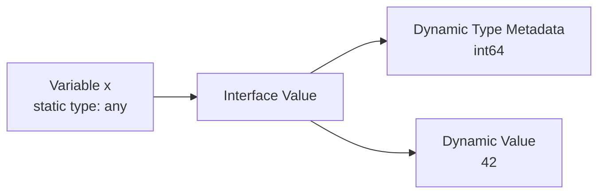
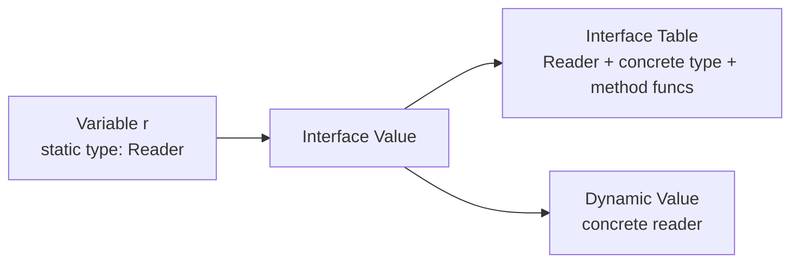
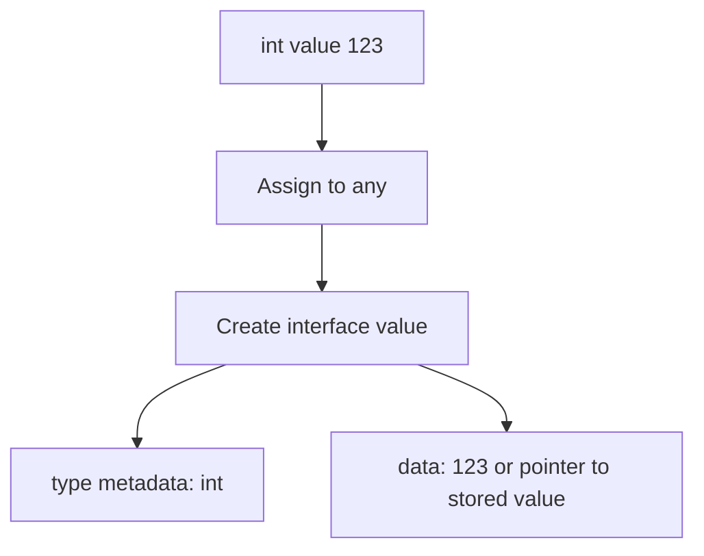
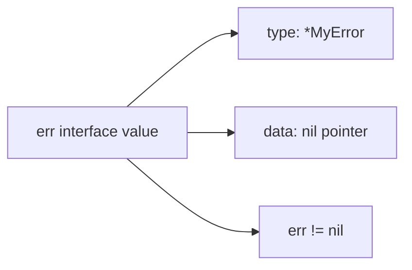
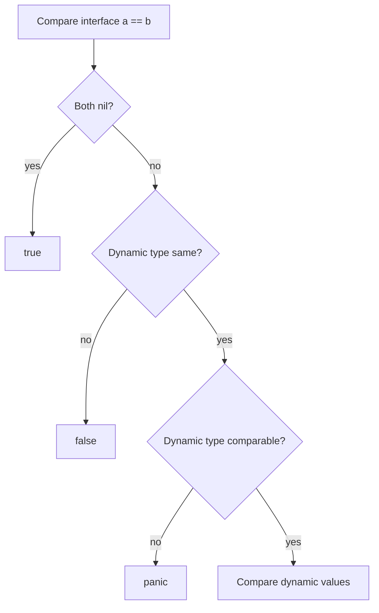
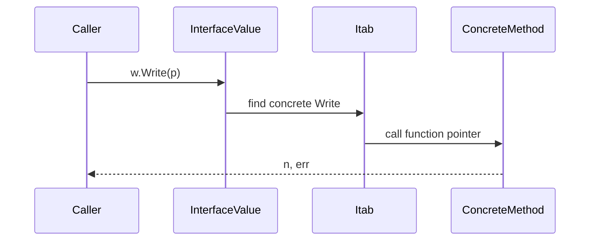
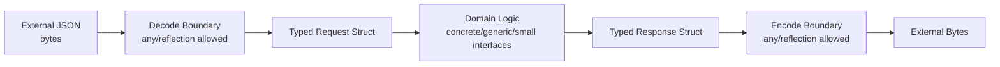
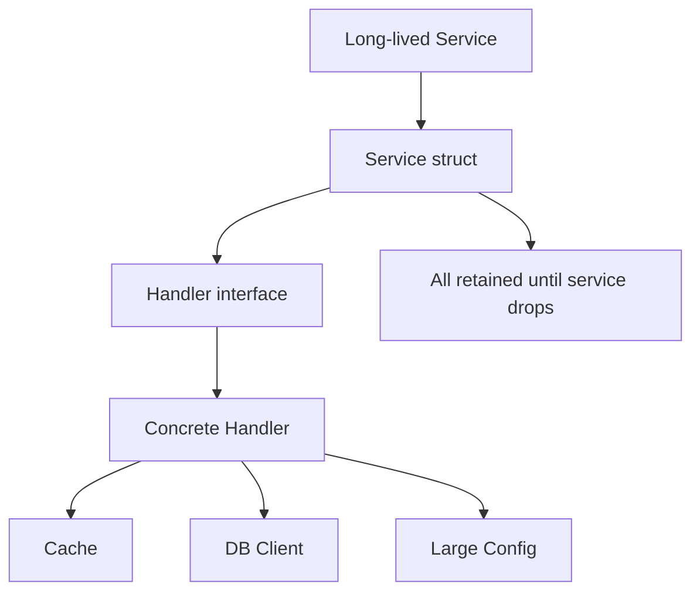
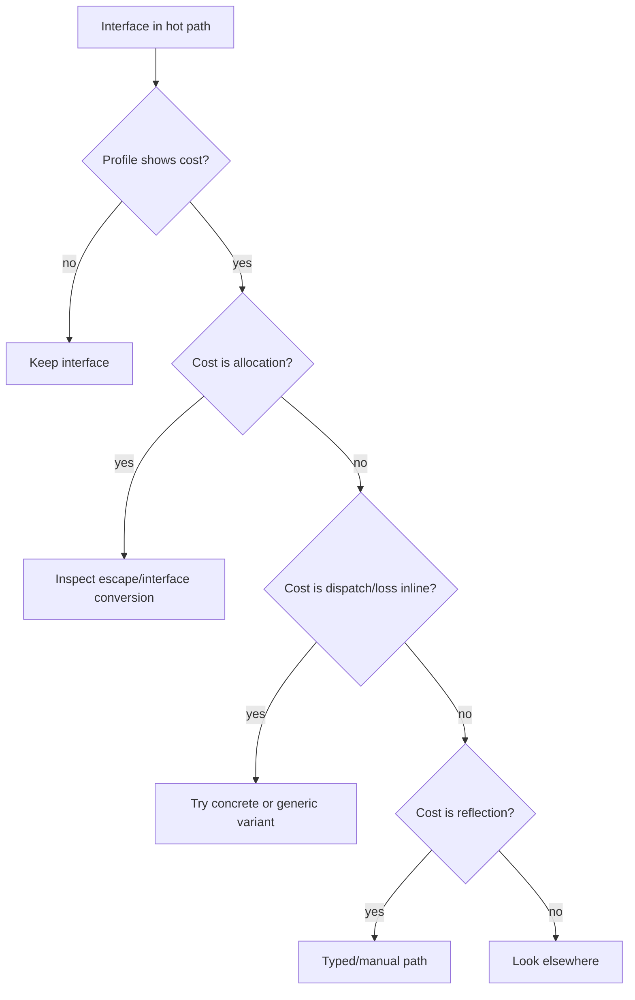
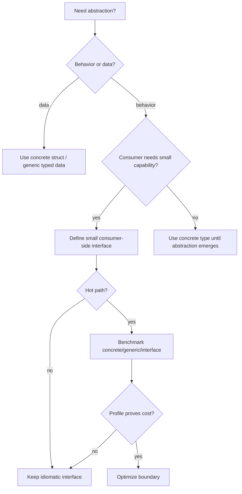

# learn-go-memory-systems-part-011.md

# Go Memory Systems — Part 011: Interface Representation, Dynamic Dispatch, and Boxing-like Behavior

> Series: `learn-go-memory-systems`  
> Part: `011`  
> Target Go version: Go 1.26.x  
> Audience: Java software engineer moving toward advanced Go runtime and memory engineering  
> Scope: interface runtime representation, nil traps, dynamic dispatch, allocation behavior, GC visibility, and production design trade-offs

---

## 0. Posisi Part Ini Dalam Series

Sebelumnya kita sudah membangun fondasi:

1. Go memory systems orientation.
2. Virtual memory, RSS, heap, stack, OS pages.
3. Value representation.
4. Pointer fundamentals.
5. Goroutine stack.
6. Heap allocation lifecycle.
7. Escape analysis.
8. Allocator mechanics.
9. Struct layout.
10. Slice internals.
11. String internals.

Sekarang kita masuk ke salah satu area yang sering membuat engineer Java salah menebak performa Go: **interface**.

Di Java, interface dipahami sebagai kontrak polymorphism dengan object reference sebagai default mental model. Hampir semua non-primitive adalah object reference. Primitive bisa masuk ke wrapper melalui boxing. Runtime/JIT kemudian bisa melakukan devirtualization, inline, escape analysis, scalar replacement, dan sebagainya.

Di Go, interface juga kontrak polymorphism, tetapi representasi memory-nya berbeda. Interface value adalah value kecil yang membawa informasi dynamic type dan dynamic value. Ia bisa terlihat ringan, tetapi bisa menyembunyikan allocation, indirection, nil trap, dynamic dispatch, dan retention.

Part ini menjawab pertanyaan besar:

- Apa isi interface value di runtime?
- Kenapa `var x any = 123` berbeda dari `var x int = 123`?
- Kenapa `nil` pointer dalam interface bisa membuat `err != nil`?
- Kapan interface menyebabkan heap allocation?
- Apa hubungan interface dengan escape analysis?
- Mengapa `[]T` tidak bisa langsung menjadi `[]any`?
- Kapan interface lebih baik daripada generic?
- Kapan generic lebih baik daripada interface?
- Bagaimana mendesain API agar tetap idiomatic, tetapi tidak boros allocation?

---

## 1. Tujuan Pembelajaran

Setelah menyelesaikan part ini, kamu harus mampu:

1. Menjelaskan perbedaan **static type**, **dynamic type**, dan **dynamic value**.
2. Menjelaskan representasi konseptual interface sebagai pasangan metadata type dan data.
3. Membedakan empty interface (`any`) dan non-empty interface.
4. Menjelaskan kenapa interface value bisa non-nil walaupun dynamic value-nya nil pointer.
5. Membaca allocation trap pada `fmt`, `log`, `json`, `map[string]any`, `[]any`, reflection, dan variadic `...any`.
6. Memilih interface, concrete type, function, atau generic secara sadar.
7. Menulis API boundary yang jelas dari sisi memory ownership.
8. Melakukan benchmark sederhana untuk membuktikan cost interface.
9. Menghindari premature optimization sambil tetap bisa mengidentifikasi hot-path yang benar.
10. Melakukan review production code yang memakai interface secara defensif.

---

## 2. Mental Model Utama

Interface di Go bukan object seperti Java interface reference.

Interface adalah **value container**.

Container ini membawa:

1. informasi dynamic type,
2. informasi dynamic value,
3. method table untuk non-empty interface,
4. cukup metadata agar runtime bisa melakukan type assertion, dynamic dispatch, equality check, hashing, dan GC scanning.

Secara mental:

```text
interface value = (dynamic type metadata, dynamic value storage/reference)
```

Untuk non-empty interface:

```text
interface value = (interface table / itab, dynamic value storage/reference)
```

Untuk empty interface:

```text
empty interface value = (type metadata, dynamic value storage/reference)
```

Nama internal runtime bisa berubah, tetapi model dua-word ini adalah model konseptual yang sangat berguna.

---

## 3. Interface Bukan Ownership

Kesalahan umum:

> “Kalau function menerima interface, berarti ia punya object itu.”

Tidak.

Interface tidak memberi ownership.

Interface hanya membawa dynamic value. Kalau dynamic value berisi pointer, slice header, map header, channel header, atau pointer ke struct, maka callee bisa saja mengamati/mengubah state yang sama dengan caller.

Contoh:

```go
package main

import "fmt"

type Counter struct {
	N int
}

func touch(x any) {
	c := x.(*Counter)
	c.N++
}

func main() {
	c := &Counter{}
	touch(c)
	fmt.Println(c.N) // 1
}
```

`any` tidak membuat copy object `Counter`. Yang masuk ke interface adalah pointer `*Counter`.

---

## 4. Static Type vs Dynamic Type vs Dynamic Value

Lihat kode berikut:

```go
var x any = int64(42)
```

Ada tiga konsep:

| Konsep | Nilai |
|---|---|
| Static type variable `x` | `any` |
| Dynamic type di dalam `x` | `int64` |
| Dynamic value di dalam `x` | `42` |

Static type adalah type yang diketahui compiler untuk variable expression.

Dynamic type adalah concrete type yang sedang tersimpan di dalam interface.

Dynamic value adalah data actual dari concrete type tersebut.

---

## 5. Diagram Interface Value



Untuk non-empty interface:

```go
type Reader interface {
	Read([]byte) (int, error)
}
```

Representasi mentalnya:



---

## 6. Empty Interface: `interface{}` dan `any`

Sejak Go 1.18, `any` adalah alias untuk `interface{}`.

```go
type any = interface{}
```

`any` berarti:

> nilai apa pun yang bukan interface constraint khusus dapat disimpan sebagai dynamic value.

Contoh:

```go
var a any

a = 10

a = "hello"

a = []byte{1, 2, 3}

a = map[string]int{"x": 1}
```

Namun “bisa menyimpan apa pun” bukan berarti “zero-cost untuk apa pun”.

`any` adalah boundary yang menghapus static type detail dari sisi caller/callee.

Konsekuensinya:

- operasi terhadap value sering butuh type assertion/type switch/reflection,
- compiler kehilangan beberapa peluang optimasi,
- value besar atau address-sensitive bisa escape,
- API menjadi kurang eksplisit.

---

## 7. Non-empty Interface

Non-empty interface memiliki method set.

Contoh:

```go
type Stringer interface {
	String() string
}
```

Sebuah type memenuhi interface secara implicit jika method set-nya sesuai.

```go
type User struct {
	Name string
}

func (u User) String() string {
	return u.Name
}

var s Stringer = User{Name: "Fajar"}
```

Tidak ada keyword `implements`.

Ini berbeda dengan Java.

Di Go, satisfaction bersifat structural dan implicit.

---

## 8. Method Set dan Receiver

Method set penting karena menentukan apakah type memenuhi interface.

Contoh:

```go
type Mutator interface {
	Mutate()
}

type Item struct {
	N int
}

func (i *Item) Mutate() {
	i.N++
}
```

`*Item` memenuhi `Mutator`.

`Item` tidak memenuhi `Mutator`, karena method `Mutate` punya pointer receiver.

```go
var _ Mutator = &Item{} // ok
// var _ Mutator = Item{} // compile error
```

Ini bukan sekadar aturan sintaks. Ini memory contract.

Pointer receiver berarti method membutuhkan addressable mutable object atau ingin menghindari copy.

---

## 9. Interface Assignment

Ketika concrete value dimasukkan ke interface, runtime perlu membentuk interface value.

Contoh:

```go
var x any = 123
```

Secara konseptual:



Hal penting:

- interface value sendiri kecil,
- dynamic value bisa disimpan langsung atau melalui indirect storage tergantung type dan compiler/runtime detail,
- dari sudut engineer, yang perlu dijaga adalah apakah assignment itu menyebabkan allocation atau escape.

Jangan menulis kode berdasarkan asumsi detail layout internal kecuali sedang menulis runtime/unsafe-level code.

---

## 10. `nil` Interface: Trap Paling Terkenal

Kode:

```go
package main

import "fmt"

type MyError struct{}

func (e *MyError) Error() string { return "boom" }

func maybeErr() error {
	var e *MyError = nil
	return e
}

func main() {
	err := maybeErr()
	fmt.Println(err == nil) // false
}
```

Kenapa `false`?

Karena interface `err` berisi:

```text
(dynamic type = *MyError, dynamic value = nil)
```

Interface value hanya benar-benar nil jika dua komponennya nil:

```text
(type = nil, data = nil)
```

Diagram:



---

## 11. Nil Interface yang Benar-Benar Nil

```go
var err error
fmt.Println(err == nil) // true
```

Di sini:

```text
(type = nil, data = nil)
```

Tidak ada dynamic type.

Tidak ada dynamic value.

---

## 12. Nil Concrete Pointer Dalam Interface

```go
type Reader struct{}

func (*Reader) Read(p []byte) (int, error) {
	return 0, nil
}

var r *Reader = nil
var x any = r

fmt.Println(x == nil) // false
```

`x` punya dynamic type `*Reader`.

Meskipun dynamic value-nya nil pointer, interface-nya tidak nil.

---

## 13. Production Rule untuk Error

Jangan return typed nil sebagai `error`.

Buruk:

```go
func validate() error {
	var e *ValidationError = nil
	return e
}
```

Baik:

```go
func validate() error {
	return nil
}
```

Atau:

```go
func validate() error {
	var e *ValidationError
	if e != nil {
		return e
	}
	return nil
}
```

Prinsip:

> Kalau tidak ada error, return untyped `nil`, bukan typed nil pointer yang dikemas ke interface `error`.

---

## 14. Interface Equality

Interface value bisa dibandingkan jika dynamic type-nya comparable.

Contoh:

```go
var a any = 10
var b any = 10
fmt.Println(a == b) // true
```

Namun:

```go
var a any = []int{1, 2}
var b any = []int{1, 2}
fmt.Println(a == b) // panic
```

Karena slice tidak comparable.

Panic ini sering muncul di generic utility, caching, atau test helper yang memakai `any` terlalu bebas.

---

## 15. Interface Equality Mental Model

Ketika membandingkan interface:

1. Kalau keduanya nil interface, equal.
2. Kalau dynamic type berbeda, not equal.
3. Kalau dynamic type sama dan comparable, compare dynamic value.
4. Kalau dynamic type sama tetapi not comparable, panic.

Diagram:



---

## 16. Interface Dynamic Dispatch

Ketika memanggil method lewat interface:

```go
func writeAll(w io.Writer, p []byte) error {
	_, err := w.Write(p)
	return err
}
```

Compiler tidak langsung tahu concrete implementation dari `w.Write` pada level source API.

Runtime menggunakan method table untuk memanggil method concrete.

Secara mental:



Cost dynamic dispatch biasanya kecil, tetapi bisa penting di hot loop dengan operasi kecil.

---

## 17. Dynamic Dispatch Bukan Selalu Masalah

Interface dispatch bukan musuh utama.

Masalah yang lebih sering:

- allocation karena value escape ke interface,
- loss of inlining,
- reflection di balik interface,
- `[]any`/`map[string]any` yang membuat banyak dynamic value,
- pointer-rich dynamic values yang memperbesar GC scan,
- API boundary yang tidak jelas ownership-nya.

Jangan menghapus interface hanya karena “interface lambat”.

Hapus interface hanya jika profil menunjukkan ia berada di hot path dan menjadi bottleneck melalui allocation/dispatch/loss of optimization.

---

## 18. Devirtualization

Compiler dapat mengoptimalkan beberapa interface call jika concrete target bisa diketahui.

Contoh:

```go
type Writer struct{}

func (Writer) Write(p []byte) (int, error) {
	return len(p), nil
}

func f() {
	var w interface{ Write([]byte) (int, error) } = Writer{}
	w.Write([]byte("x"))
}
```

Dalam beberapa kondisi, compiler bisa melihat concrete type dan menghilangkan sebagian overhead.

Namun ini bukan kontrak yang harus kamu andalkan untuk desain API.

Prinsip production:

> Desain berdasarkan clarity dan ownership, lalu validasi hot path dengan benchmark/profile.

---

## 19. Interface dan Escape Analysis

Interface sering muncul di escape report.

Contoh:

```go
func sink(any) {}

func f() {
	x := 10
	sink(x)
}
```

Apakah `x` escape?

Jawabannya tergantung detail function, inlining, compiler version, dan apakah value perlu disimpan di tempat yang hidup lebih lama.

Jika interface hanya dipakai lokal dan compiler bisa inline/membuktikan lifetime, allocation bisa hilang.

Jika interface disimpan ke global, slice, map, goroutine, closure, atau reflection, escape lebih mungkin terjadi.

---

## 20. Interface Menyembunyikan Lifetime

Contoh:

```go
var global any

func store(x any) {
	global = x
}

func f() {
	n := 123
	store(n)
}
```

`n` secara logical harus hidup setelah `f` selesai, karena dynamic value disimpan di `global`.

Maka compiler perlu memastikan data tersedia di luar stack frame `f`.

Ini bisa menyebabkan heap allocation.

---

## 21. Variadic `...any`

Banyak API Go memakai variadic interface:

```go
fmt.Printf("user=%s age=%d", name, age)
```

Signature konseptual:

```go
func Printf(format string, a ...any) (n int, err error)
```

Argumen variadic menjadi slice `[]any`.

Setiap argument dikemas sebagai interface value.

Ini sangat fleksibel, tetapi tidak gratis.

---

## 22. `fmt` di Hot Path

`fmt.Sprintf` sangat nyaman, tetapi sering mahal.

```go
s := fmt.Sprintf("%d:%s", id, name)
```

Potential cost:

- variadic `...any`,
- interface conversion,
- reflection-like formatting path,
- parsing format string,
- allocation output string,
- possible allocation for dynamic values.

Alternatif di hot path:

```go
var b strings.Builder
b.Grow(32 + len(name))
b.WriteString(strconv.FormatInt(id, 10))
b.WriteByte(':')
b.WriteString(name)
s := b.String()
```

Atau:

```go
buf := make([]byte, 0, 64)
buf = strconv.AppendInt(buf, id, 10)
buf = append(buf, ':')
buf = append(buf, name...)
```

Gunakan ini hanya jika path benar-benar hot.

---

## 23. `log/slog` dan Interface Boundary

Structured logging sering menerima `any`.

Contoh:

```go
logger.Info("request", "user_id", userID, "path", path)
```

Ini readable dan production-friendly.

Tetapi di path ekstrem:

- argumen masuk variadic,
- dynamic value dibungkus,
- attribute bisa dialokasikan,
- string/value conversion bisa mahal,
- logging disabled path harus diperhatikan.

Guideline:

1. Jangan log di tight loop tanpa guard.
2. Jangan formatting string mahal sebelum cek level.
3. Hindari object besar masuk log sebagai `any`.
4. Prefer field scalar sederhana.
5. Benchmark bila logging berada di hot path.

---

## 24. `encoding/json` dan `any`

`encoding/json` sering memakai `any`.

```go
var v any
json.Unmarshal(data, &v)
```

Hasil default biasanya:

- JSON object menjadi `map[string]any`,
- JSON array menjadi `[]any`,
- JSON number menjadi `float64` secara default,
- string menjadi `string`,
- bool menjadi `bool`,
- null menjadi `nil`.

Ini fleksibel, tetapi boros untuk domain model yang jelas.

Untuk production API yang stabil, prefer struct typed:

```go
type Request struct {
	UserID string `json:"user_id"`
	Amount int64  `json:"amount"`
}
```

Typed struct memberi:

- static schema,
- lebih sedikit type assertion,
- lebih mudah validasi,
- lebih mudah review memory,
- lebih baik untuk maintenance.

---

## 25. `map[string]any` Sebagai Boundary

`map[string]any` sering muncul untuk:

- dynamic JSON,
- metadata,
- logging context,
- template data,
- config free-form,
- event envelope.

Ia valid sebagai boundary, tetapi berbahaya sebagai domain model internal.

Masalah:

- type safety hilang,
- allocation tinggi,
- nested map/slice sulit dikontrol,
- numeric ambiguity,
- runtime panic karena wrong assertion,
- sulit mengukur memory ownership,
- sulit melakukan backward-compatible schema evolution.

Rule:

> Gunakan `map[string]any` di boundary yang benar-benar dynamic. Turunkan ke typed struct secepat mungkin ketika domain mulai stabil.

---

## 26. `[]T` Tidak Sama Dengan `[]any`

Kesalahan umum:

```go
func printAll(xs []any) {}

names := []string{"a", "b"}
// printAll(names) // compile error
```

Mengapa?

Karena `[]string` dan `[]any` memiliki layout backing array berbeda.

`[]string` backing array berisi string values.

`[]any` backing array berisi interface values.

Konversi perlu membungkus setiap element.

```go
ys := make([]any, len(names))
for i, v := range names {
	ys[i] = v
}
printAll(ys)
```

Ini O(n) dan bisa allocation.

---

## 27. Diagram `[]T` ke `[]any`

```mermaid
flowchart TD
    A[[]string backing array] --> A1[string header 0]
    A --> A2[string header 1]

    B[Convert manually] --> C[[]any backing array]
    C --> C1[interface value\ntype=string data=...]
    C --> C2[interface value\ntype=string data=...]
```

Ini bukan covariance seperti sebagian mental model Java array.

Go memilih explicit conversion agar layout dan cost terlihat.

---

## 28. Interface dan Slice of Interface Retention

Misalnya:

```go
items := make([]any, 0, 1000)
items = append(items, largeObject)
```

Jika `largeObject` adalah pointer ke object besar, slice `items` mempertahankan object tersebut reachable.

Jika `items` disimpan lama, object besar juga hidup lama.

Interface tidak menghapus retention.

Ia bisa menyembunyikannya.

---

## 29. Interface Value dan GC Scanning

GC perlu tahu apakah dynamic value mengandung pointer.

Interface metadata membantu runtime mengetahui layout dynamic type.

Jika interface berisi pointer-rich struct, GC harus menelusuri graph-nya.

Jika interface berisi pointer-free scalar, scanning lebih murah.

Contoh:

```go
type PointerHeavy struct {
	A *int
	B *string
	C []byte
	D map[string]string
}

var x any = PointerHeavy{}
```

Dynamic type membawa informasi pointer layout.

GC tidak hanya melihat `any`; GC perlu scan dynamic value sesuai type metadata.

---

## 30. Interface dan Pointer Density

Interface sering dipakai dalam collection heterogen:

```go
var xs []any
```

Collection heterogen seperti ini cenderung pointer-rich karena setiap element membawa metadata dan data slot.

Dampak:

- memory per element lebih besar,
- GC scan lebih kompleks,
- cache locality lebih buruk,
- type assertion dibutuhkan saat konsumsi.

Untuk hot path, hindari collection heterogen jika schema bisa dibuat typed.

---

## 31. Boxing-like Behavior

Go tidak punya boxing/unboxing seperti Java primitive wrapper.

Tetapi ketika value concrete dikemas ke interface, efeknya mirip pada level desain:

- static type information hilang di variable tersebut,
- value masuk ke dynamic container,
- operasi berikutnya perlu dynamic dispatch/assertion/reflection,
- allocation bisa terjadi tergantung lifetime dan representation,
- collection `[]any` mirip collection of boxed values dari sisi ergonomics dan overhead.

Karena itu kita menyebutnya **boxing-like**, bukan boxing yang identik dengan Java.

---

## 32. Java Boxing vs Go Interface Conversion

| Aspek | Java Boxing | Go Interface Conversion |
|---|---|---|
| Primitive/object split | Ada | Tidak sama |
| Wrapper object | `Integer`, `Long`, dll | Tidak ada wrapper type built-in |
| Container dynamic | Object reference | Interface value |
| Allocation | Boxing sering heap, JIT bisa eliminate | Tergantung escape/inlining/representation |
| Generic collection | `List<Integer>` boxed historically | `[]int` tetap concrete, `[]any` perlu conversion |
| Null trap | Null reference | typed nil inside interface |
| Dispatch | virtual/interface invoke | interface method table call |

---

## 33. Type Assertion

Untuk mengambil concrete value dari interface:

```go
v, ok := x.(int)
if !ok {
	// wrong dynamic type
}
```

Jika tidak memakai `ok`:

```go
v := x.(int) // panic if not int
```

Production guideline:

- gunakan `comma ok` untuk input eksternal,
- boleh direct assertion untuk invariant internal yang sudah dibuktikan,
- error message harus informatif jika dynamic boundary gagal.

---

## 34. Type Switch

```go
switch v := x.(type) {
case nil:
	fmt.Println("nil")
case int:
	fmt.Println("int", v)
case string:
	fmt.Println("string", v)
case []byte:
	fmt.Println("bytes", len(v))
default:
	fmt.Printf("unknown %T\n", v)
}
```

Type switch cocok untuk boundary heterogen.

Namun jika type switch muncul di banyak tempat domain internal, itu tanda desain mulai bocor.

---

## 35. Interface sebagai Boundary, Bukan Internal Data Dump

Interface ideal untuk:

- plugin boundary,
- dependency inversion,
- testing seam,
- standard library contracts seperti `io.Reader`, `io.Writer`, `error`, `fmt.Stringer`,
- capability-based API,
- dynamic external data boundary.

Interface buruk untuk:

- mengganti domain model typed,
- menyimpan semua field sebagai `map[string]any`,
- menghindari desain schema,
- membuat generic container heterogen tanpa kebutuhan,
- melewatkan object besar di hot path tanpa ownership contract.

---

## 36. Small Interface Principle

Go idiom sering memakai interface kecil.

Contoh klasik:

```go
type Reader interface {
	Read(p []byte) (n int, err error)
}
```

Interface kecil memberi:

- low coupling,
- composability,
- mudah di-test,
- implementasi implicit,
- API boundary jelas.

Interface besar seperti Java service interface dengan puluhan method sering kurang cocok di Go.

---

## 37. Accept Interfaces, Return Concrete Types?

Guideline populer:

> Accept interfaces, return concrete types.

Ini bukan hukum mutlak, tapi guideline bagus.

Terima interface jika function hanya butuh capability tertentu:

```go
func CopyTo(w io.Writer, data []byte) error
```

Return concrete type jika caller mungkin butuh operasi lengkap:

```go
func NewBuffer() *bytes.Buffer
```

Return interface jika kamu sengaja menyembunyikan implementation dan kontraknya stabil:

```go
func OpenStore(path string) (Store, error)
```

Tetapi return interface bisa menyembunyikan nil trap dan allocation. Harus disengaja.

---

## 38. Interface Placement: Consumer Side

Di Go, interface sering didefinisikan di package consumer, bukan producer.

Producer:

```go
package postgres

type Store struct{}

func (s *Store) GetUser(id string) (User, error) { ... }
```

Consumer:

```go
package service

type UserGetter interface {
	GetUser(id string) (User, error)
}

func New(g UserGetter) *Service { ... }
```

Manfaat:

- interface sesuai kebutuhan consumer,
- producer tidak memaksakan abstraction besar,
- testing lebih mudah,
- memory/performance review lebih lokal.

---

## 39. Interface dan API Ownership

Interface tidak menjelaskan ownership data.

Contoh:

```go
type Encoder interface {
	Encode([]byte) error
}
```

Pertanyaan:

- Apakah encoder boleh menyimpan slice setelah function return?
- Apakah caller boleh reuse buffer langsung setelah call?
- Apakah encoder akan mutate buffer?
- Apakah encoder copy data?

Signature tidak menjawab.

Dokumentasi kontrak harus menjawab.

Lebih baik:

```go
// Encode consumes p only for the duration of the call.
// It does not retain p after returning.
type Encoder interface {
	Encode(p []byte) error
}
```

Atau:

```go
// Submit may retain p until the returned future completes.
// Caller must not modify p until completion.
type AsyncSubmitter interface {
	Submit(p []byte) Future
}
```

---

## 40. Interface dan Mutability

Interface dapat menyembunyikan apakah dynamic value mutable.

```go
type Processor interface {
	Process([]byte) error
}
```

Apakah `Process` mengubah input?

Tidak jelas.

Untuk buffer-sensitive code, gunakan nama atau dokumentasi eksplisit:

```go
type Parser interface {
	// Parse reads p during the call and does not retain or mutate it.
	Parse(p []byte) error
}
```

Atau:

```go
type Normalizer interface {
	// Normalize may modify p in place.
	Normalize(p []byte) ([]byte, error)
}
```

---

## 41. Interface dan Method Value Allocation

Method value bisa menangkap receiver.

```go
type Handler struct {
	buf []byte
}

func (h *Handler) Handle() {}

func f(h *Handler) func() {
	return h.Handle
}
```

`h.Handle` adalah function value yang membawa receiver.

Jika function value hidup lebih lama, receiver ikut tertahan.

Interface + method value + closure bisa membuat retention sulit terlihat.

---

## 42. Interface dan Closure

```go
func makeProcessor(p Processor) func([]byte) error {
	return func(b []byte) error {
		return p.Process(b)
	}
}
```

Closure menangkap interface `p`.

Jika closure disimpan lama, dynamic value di dalam `p` ikut hidup lama.

Jangan hanya melihat closure kecil. Lihat graph yang ditangkapnya.

---

## 43. Interface dan Channel

```go
ch := make(chan any, 1000)
```

Ini sering muncul untuk generic event bus.

Masalah:

- setiap element dynamic,
- type assertion saat receive,
- producer/consumer schema longgar,
- object besar bisa tertahan di buffer channel,
- backpressure tidak jelas,
- panic bisa terjadi di consumer.

Prefer typed channel jika event type stabil:

```go
ch := make(chan Event, 1000)
```

Atau gunakan envelope typed:

```go
type Event struct {
	Kind EventKind
	Payload []byte
}
```

---

## 44. Interface dan Map

```go
cache := map[string]any{}
```

Pertanyaan review:

- Apakah value heterogen benar-benar dibutuhkan?
- Siapa yang melakukan type assertion?
- Apakah ada eviction?
- Apakah object besar bisa tertahan?
- Apakah nil typed pointer mungkin tersimpan?
- Apakah value mutable setelah disimpan?
- Apakah cache thread-safe?

Untuk cache production, typed cache sering lebih aman:

```go
type UserCache struct {
	mu sync.RWMutex
	m  map[string]User
}
```

---

## 45. Interface dan Reflection

Reflection bekerja melalui type/value metadata.

```go
func inspect(x any) {
	t := reflect.TypeOf(x)
	v := reflect.ValueOf(x)
	fmt.Println(t, v)
}
```

Reflection berguna untuk:

- encoding,
- decoding,
- validation,
- ORM-like mapping,
- dependency injection,
- generic tooling.

Namun reflection mahal karena:

- dynamic inspection,
- possible allocations,
- loss of static type,
- difficult inlining,
- runtime panic if misused,
- less readable invariants.

Gunakan reflection di boundary/tooling, bukan hot domain loop bila bisa dihindari.

---

## 46. Interface dan Generics

Generics memberi parametric polymorphism.

Interface memberi dynamic polymorphism.

Contoh generic:

```go
func Max[T constraints.Ordered](a, b T) T {
	if a > b {
		return a
	}
	return b
}
```

Contoh interface:

```go
type Reader interface {
	Read([]byte) (int, error)
}
```

Generic cocok untuk algoritma typed.

Interface cocok untuk behavior/capability runtime.

---

## 47. Generic vs Interface Decision Table

| Kebutuhan | Pilihan Lebih Cocok |
|---|---|
| Operasi pada banyak type tapi bentuk data sama | Generic |
| Dependency inversion/service capability | Interface |
| Collection typed | Generic/concrete |
| Heterogeneous values | Interface/union-like design |
| Hot numeric algorithm | Generic/concrete |
| Plugin runtime | Interface |
| Serialization boundary dynamic | Interface/reflection |
| Domain model stabil | Concrete struct |
| Testing seam kecil | Interface kecil |

---

## 48. Interface Constraint vs Runtime Interface

Dalam generics, interface bisa dipakai sebagai constraint.

```go
type Number interface {
	~int | ~int64 | ~float64
}

func Sum[T Number](xs []T) T {
	var total T
	for _, x := range xs {
		total += x
	}
	return total
}
```

Ini bukan berarti setiap `T` dibungkus ke runtime interface saat dieksekusi.

Constraint dipakai compiler untuk type checking generic code.

Jangan samakan generic constraint dengan `any` runtime container.

---

## 49. Interface dan `comparable`

`comparable` adalah constraint untuk type yang bisa dibandingkan dengan `==`/`!=`.

```go
func Contains[T comparable](xs []T, target T) bool {
	for _, x := range xs {
		if x == target {
			return true
		}
	}
	return false
}
```

Ini lebih aman daripada:

```go
func ContainsAny(xs []any, target any) bool {
	for _, x := range xs {
		if x == target { // may panic
			return true
		}
	}
	return false
}
```

---

## 50. Interface dan Inlining

Function concrete kecil sering mudah di-inline.

Interface call bisa menghambat inlining jika target tidak diketahui.

Contoh hot path:

```go
type Hasher interface {
	Hash([]byte) uint64
}

func process(h Hasher, xs [][]byte) uint64 {
	var total uint64
	for _, x := range xs {
		total ^= h.Hash(x)
	}
	return total
}
```

Jika `xs` besar dan `Hash` sangat kecil, dispatch/loss of inline bisa relevan.

Alternatif:

```go
func processConcrete(h *FastHasher, xs [][]byte) uint64
```

Atau generic:

```go
type HashFunc interface {
	Hash([]byte) uint64
}

func processGeneric[H HashFunc](h H, xs [][]byte) uint64
```

Tetap benchmark.

---

## 51. Interface di Standard Library: `io.Reader`

`io.Reader` adalah contoh interface kecil dan kuat.

```go
type Reader interface {
	Read(p []byte) (n int, err error)
}
```

Memory contract penting:

- caller menyediakan buffer,
- reader mengisi buffer,
- jumlah byte valid adalah `n`,
- buffer bisa digunakan ulang caller,
- reader tidak seharusnya retain buffer kecuali dokumentasi spesifik menyatakan demikian.

Ini contoh API yang mendukung streaming dan bounded memory.

---

## 52. Interface di Standard Library: `io.Writer`

```go
type Writer interface {
	Write(p []byte) (n int, err error)
}
```

Memory contract:

- writer membaca `p` selama call,
- caller tidak boleh mengubah `p` sampai call selesai,
- writer idealnya tidak retain `p` setelah return kecuali dokumentasi menyatakan async behavior,
- partial write harus ditangani.

Interface kecil, tetapi contract besar.

---

## 53. Interface di Standard Library: `error`

```go
type error interface {
	Error() string
}
```

`error` sangat kecil.

Tetapi karena ia interface, nil trap berlaku.

Production rule:

- return `nil` untuk no error,
- jangan return typed nil pointer,
- wrapper error harus menjaga chain,
- error value bisa membawa state dan mempertahankan object graph.

---

## 54. Error Retention

Contoh:

```go
type ParseError struct {
	Input []byte
	Msg   string
}

func (e *ParseError) Error() string { return e.Msg }
```

Jika `Input` besar dan error disimpan di log queue/retry state, byte besar tertahan.

Lebih baik simpan snippet atau metadata:

```go
type ParseError struct {
	Offset int
	Near   string
	Msg    string
}
```

Interface `error` bisa menyembunyikan retention.

---

## 55. Interface dan Observability

Untuk menemukan cost interface, gunakan:

```bash
go test -bench . -benchmem
```

Escape report:

```bash
go test -run '^$' -bench BenchmarkName -gcflags='-m=2'
```

Profile:

```bash
go test -bench BenchmarkName -benchmem -memprofile mem.out

go tool pprof -alloc_space ./pkg.test mem.out
```

Cari:

- allocation di `fmt`,
- allocation di reflection,
- allocation di interface conversion,
- `[]any` construction,
- map dynamic value,
- large object retention.

---

## 56. Mini Benchmark: Concrete vs Interface

```go
package ifacebench

import "testing"

type Adder interface {
	Add(int) int
}

type Inc struct{}

func (Inc) Add(x int) int { return x + 1 }

func concrete(a Inc, n int) int {
	sum := 0
	for i := 0; i < n; i++ {
		sum += a.Add(i)
	}
	return sum
}

func dynamic(a Adder, n int) int {
	sum := 0
	for i := 0; i < n; i++ {
		sum += a.Add(i)
	}
	return sum
}

func BenchmarkConcrete(b *testing.B) {
	a := Inc{}
	for b.Loop() {
		_ = concrete(a, 1000)
	}
}

func BenchmarkInterface(b *testing.B) {
	var a Adder = Inc{}
	for b.Loop() {
		_ = dynamic(a, 1000)
	}
}
```

Catatan:

- hasil bisa berubah antar Go version,
- compiler bisa optimize sebagian,
- benchmark harus dibuat agar kerja tidak dieliminasi,
- jangan generalisasi dari satu microbenchmark.

---

## 57. Mini Benchmark: `[]int` ke `[]any`

```go
package ifacebench

import "testing"

func toAny(xs []int) []any {
	out := make([]any, len(xs))
	for i, x := range xs {
		out[i] = x
	}
	return out
}

func BenchmarkToAny(b *testing.B) {
	xs := make([]int, 1024)
	for i := range xs {
		xs[i] = i
	}

	b.ReportAllocs()
	for b.Loop() {
		_ = toAny(xs)
	}
}
```

Pelajaran:

- `[]T` ke `[]any` bukan cast murah,
- ada allocation untuk backing array `[]any`,
- setiap element menjadi interface value,
- cost O(n).

---

## 58. Mini Benchmark: `fmt` vs `strconv`

```go
package ifacebench

import (
	"fmt"
	"strconv"
	"testing"
)

func BenchmarkFmt(b *testing.B) {
	for b.Loop() {
		_ = fmt.Sprintf("id=%d", 12345)
	}
}

func BenchmarkStrconv(b *testing.B) {
	buf := make([]byte, 0, 32)
	for b.Loop() {
		buf = buf[:0]
		buf = append(buf, "id="...)
		buf = strconv.AppendInt(buf, 12345, 10)
	}
}
```

`fmt` lebih fleksibel.

`strconv.Append*` lebih eksplisit dan sering lebih efisien.

Pilih sesuai path.

---

## 59. Benchmark Hygiene

Saat benchmarking interface:

1. Gunakan `b.ReportAllocs()`.
2. Hindari dead-code elimination.
3. Pisahkan setup dari loop.
4. Ukur concrete baseline.
5. Ukur interface version.
6. Ukur generic version jika relevan.
7. Jalankan beberapa kali.
8. Bandingkan dengan real workload.
9. Jangan mengoptimalkan code non-hot.
10. Simpan benchmark sebagai regression guard.

---

## 60. Interface dan `sync.Pool`

`sync.Pool` menyimpan `any`.

```go
var pool = sync.Pool{
	New: func() any { return new(bytes.Buffer) },
}

func use() {
	b := pool.Get().(*bytes.Buffer)
	b.Reset()
	defer pool.Put(b)
}
```

Karena `Get`/`Put` memakai `any`, type assertion dibutuhkan.

Risk:

- memasukkan type salah,
- pooled object retain buffer besar,
- object dikembalikan sebelum selesai dipakai,
- data race,
- pool dipakai untuk object murah sehingga malah memperumit.

---

## 61. Typed Wrapper untuk Pool

Buat wrapper typed:

```go
type BufferPool struct {
	p sync.Pool
}

func NewBufferPool() *BufferPool {
	return &BufferPool{
		p: sync.Pool{New: func() any { return new(bytes.Buffer) }},
	}
}

func (bp *BufferPool) Get() *bytes.Buffer {
	b := bp.p.Get().(*bytes.Buffer)
	b.Reset()
	return b
}

func (bp *BufferPool) Put(b *bytes.Buffer) {
	if b.Cap() > 64<<10 {
		return // avoid retaining huge backing array
	}
	b.Reset()
	bp.p.Put(b)
}
```

Interface tetap ada di bawah, tetapi boundary typed.

---

## 62. Interface dan Large Value

```go
type Big struct {
	Data [4096]byte
}

func consume(x any) {}

func f() {
	var b Big
	consume(b)
}
```

Apa yang terjadi?

- value besar perlu dikemas ke interface,
- copy bisa terjadi,
- escape bisa terjadi,
- stack/heap pressure bisa naik.

Untuk value besar, pikirkan:

- apakah harus pointer?
- apakah data bisa diproses sebagai `[]byte` streaming?
- apakah interface boundary diperlukan?
- apakah caller/callee ownership jelas?

---

## 63. Interface dan Pointer Receiver untuk Large Value

```go
type Big struct {
	Data [4096]byte
}

func (b *Big) Process() {}

type Processor interface {
	Process()
}

func run(p Processor) {
	p.Process()
}

func f() {
	b := &Big{}
	run(b)
}
```

Pointer menghindari copy besar, tetapi menambah indirection dan GC-visible pointer.

Trade-off:

- value copy mahal,
- pointer aliasing risk,
- pointer retention risk,
- GC graph bertambah,
- mutability harus jelas.

---

## 64. Interface dan Nil Pointer Method Call

Go membolehkan method dipanggil pada nil receiver jika method meng-handle nil.

```go
type Node struct {
	Name string
}

func (n *Node) String() string {
	if n == nil {
		return "<nil>"
	}
	return n.Name
}
```

Jika `var s fmt.Stringer = (*Node)(nil)`, maka `s != nil`, tetapi `s.String()` bisa aman jika method handle nil.

Ini bisa useful, tetapi jangan jadikan default pattern karena mudah membingungkan.

---

## 65. Interface dan Typed Nil Defensive Check

Helper:

```go
func isNilInterfaceValue(x any) bool {
	if x == nil {
		return true
	}

	v := reflect.ValueOf(x)
	switch v.Kind() {
	case reflect.Chan, reflect.Func, reflect.Map, reflect.Pointer, reflect.Interface, reflect.Slice:
		return v.IsNil()
	default:
		return false
	}
}
```

Gunakan hati-hati.

Reflection check seperti ini berguna untuk framework/boundary, tetapi tidak seharusnya menjadi pengganti desain return `nil` yang benar.

---

## 66. Interface dan `fmt.Stringer`

```go
type Stringer interface {
	String() string
}
```

`Stringer` bagus untuk human-readable representation.

Tetapi jangan membuat `String()` mahal atau allocation-heavy jika object sering di-log.

Buruk:

```go
func (u User) String() string {
	b, _ := json.Marshal(u)
	return string(b)
}
```

Lebih baik:

```go
func (u User) String() string {
	return u.ID
}
```

Atau gunakan method eksplisit:

```go
func (u User) DebugString() string
```

---

## 67. Interface dan Hashing/Map Key

Interface bisa menjadi map key jika dynamic type comparable.

```go
m := map[any]string{}
m[123] = "int"
m["123"] = "string"
```

Namun:

```go
m[[]byte{1, 2}] = "boom" // panic
```

Production warning:

- `map[any]T` jarang ideal,
- equality semantics bisa membingungkan,
- dynamic type menjadi bagian key,
- `int(1)` dan `int64(1)` berbeda key.

Prefer typed key.

---

## 68. Interface dan API Versioning

Interface menutup set method yang dibutuhkan.

Menambah method ke public interface adalah breaking change untuk implementer.

Contoh:

```go
type Store interface {
	Get(string) ([]byte, error)
}
```

Jika nanti ditambah:

```go
type Store interface {
	Get(string) ([]byte, error)
	Put(string, []byte) error
}
```

Semua implementer lama rusak.

Karena itu interface kecil dan consumer-side lebih aman.

---

## 69. Interface dan Optional Capability

Pattern:

```go
type Flusher interface {
	Flush() error
}

func maybeFlush(w io.Writer) error {
	if f, ok := w.(Flusher); ok {
		return f.Flush()
	}
	return nil
}
```

Ini capability detection.

Berguna untuk optional behavior tanpa memperbesar base interface.

Risiko:

- type assertion tersebar,
- behavior implicit,
- test harus mencakup kedua path,
- documentation harus jelas.

---

## 70. Interface Composition

```go
type ReadWriter interface {
	Reader
	Writer
}
```

Composition bagus jika capability memang dibutuhkan bersama.

Namun jangan membuat interface besar hanya karena semua implementation saat ini punya method tersebut.

Desain interface dari sisi kebutuhan function, bukan dari sisi object implementation.

---

## 71. Interface dan Dependency Injection

Go tidak butuh framework DI untuk interface.

```go
type EmailSender interface {
	SendEmail(ctx context.Context, to string, body []byte) error
}

type Service struct {
	sender EmailSender
}
```

Ini cukup.

Memory concern:

- dependency interface field menahan concrete implementation,
- implementation bisa menahan cache/client/pool besar,
- lifecycle `Close` harus jelas,
- jangan membuat per-request service baru jika dependency berat.

---

## 72. Interface Field vs Concrete Field

```go
type Service struct {
	store Store
}
```

Interface field fleksibel, tetapi:

- dynamic dispatch setiap call,
- dependency bisa nil typed pointer,
- implementation tidak terlihat dari struct layout,
- testing mudah.

Concrete field:

```go
type Service struct {
	store *PostgresStore
}
```

Lebih eksplisit, tetapi coupling lebih tinggi.

Gunakan interface field jika variasi implementation nyata atau testing seam penting.

Jangan otomatis semua dependency dibuat interface.

---

## 73. Interface dan Package Boundary

Package public API perlu hati-hati dengan interface.

Exported interface berarti kamu berjanji mempertahankan method set.

Alternative:

- export concrete type,
- accept small interface in function,
- use unexported interface internally,
- expose behavior via functions.

Contoh:

```go
func NewClient(opts Options) *Client
```

Bukan:

```go
func NewClient(opts Options) ClientInterface
```

Kecuali kamu benar-benar ingin menyembunyikan implementation.

---

## 74. Interface dan Compile-time Assertion

Gunakan compile-time assertion untuk dokumentasi dan guard.

```go
var _ io.Writer = (*MyWriter)(nil)
```

Artinya:

- `*MyWriter` harus memenuhi `io.Writer`,
- tidak membuat object runtime,
- membantu refactor.

Untuk value receiver:

```go
var _ fmt.Stringer = User{}
```

Untuk pointer receiver:

```go
var _ fmt.Stringer = (*User)(nil)
```

---

## 75. Interface dan Nil Compile-time Assertion

`(*T)(nil)` pada assertion bukan membuat interface runtime non-nil untuk digunakan.

Ini hanya compile-time pattern.

```go
var _ error = (*MyError)(nil)
```

Jangan salah paham bahwa return `(*MyError)(nil)` sebagai error aman.

Compile-time assertion dan runtime return adalah konteks berbeda.

---

## 76. Interface dan Serialization Boundary

Serializer umum sering menerima `any`:

```go
func Marshal(v any) ([]byte, error)
```

Ini cocok karena serializer perlu generic.

Tetapi internal domain service tidak harus ikut menjadi `any`.

Pattern sehat:

```go
func handle(req Request) Response {
	// typed domain
}

func transport(raw []byte) ([]byte, error) {
	var req Request
	if err := json.Unmarshal(raw, &req); err != nil { return nil, err }
	res := handle(req)
	return json.Marshal(res)
}
```

Dynamic boundary di pinggir, typed core di tengah.

---

## 77. Architecture Diagram: Dynamic Edge, Typed Core



Prinsip:

> Dynamic di edge, typed di core.

---

## 78. Interface dan Data Race

Interface tidak memberi thread safety.

```go
type Counter interface {
	Inc()
}
```

Jika dynamic value tidak aman concurrent, interface tidak mengubah itu.

```go
var c Counter = &UnsafeCounter{}

go c.Inc()
go c.Inc()
```

Tetap bisa race.

Concurrency contract harus didokumentasikan.

---

## 79. Interface dan Immutability Illusion

Jika interface menerima value, bukan berarti immutable.

```go
func f(x any) {}

buf := []byte{1, 2, 3}
f(buf)
```

Dynamic value adalah slice header yang menunjuk backing array mutable.

Jika callee menyimpan `x`, backing array bisa tetap mutable dari caller.

Interface tidak membuat deep copy.

---

## 80. Defensive Copy at Interface Boundary

Jika function perlu menyimpan data dari interface, copy jika ownership tidak jelas.

```go
func StoreBytes(x any) error {
	b, ok := x.([]byte)
	if !ok {
		return errors.New("expected []byte")
	}
	owned := bytes.Clone(b)
	_ = owned
	return nil
}
```

Copy bukan selalu buruk.

Copy bisa menjadi boundary safety.

---

## 81. Interface dan `context.Context`

`context.Context` adalah interface.

```go
type Context interface {
	Deadline() (deadline time.Time, ok bool)
	Done() <-chan struct{}
	Err() error
	Value(key any) any
}
```

`Value(key any) any` adalah dynamic escape hatch.

Guideline:

- jangan gunakan context sebagai generic bag,
- key harus typed dan unexported,
- value jangan object besar,
- value jangan mutable tanpa kontrol,
- context bisa hidup sepanjang request dan menahan graph.

---

## 82. Context Value Anti-pattern

Buruk:

```go
ctx = context.WithValue(ctx, "user", largeUserObject)
```

Masalah:

- string key collision,
- object besar tertahan,
- dependency tersembunyi,
- type assertion tersebar.

Lebih baik:

```go
type userIDKey struct{}
ctx = context.WithValue(ctx, userIDKey{}, userID)
```

Dan hanya untuk request-scoped metadata, bukan dependency injection.

---

## 83. Interface dan Error Wrapping

```go
fmt.Errorf("load user: %w", err)
```

`%w` menyimpan wrapped error.

Error chain bisa menahan object graph dari error asal.

Jika error custom menyimpan payload besar, wrapping memperpanjang retention.

Design error object kecil.

---

## 84. Interface dan `errors.Is` / `errors.As`

`errors.As` menggunakan interface/type matching.

```go
var ve *ValidationError
if errors.As(err, &ve) {
	// use ve
}
```

Ini powerful, tetapi typed nil dan pointer receiver tetap harus benar.

Custom error harus dirancang kecil, stable, dan tidak menyimpan object besar tanpa alasan.

---

## 85. Interface dan Plugin-like Design

Interface cocok untuk plugin:

```go
type Rule interface {
	Name() string
	Evaluate(ctx context.Context, input Input) (Decision, error)
}
```

Review memory:

- apakah `Input` besar?
- apakah plugin boleh retain `Input`?
- apakah `Decision` menyimpan pointer ke input?
- apakah plugin thread-safe?
- apakah plugin punya lifecycle `Close`?
- apakah plugin error menyimpan payload besar?

---

## 86. Interface dan State Machine

Dalam regulatory/enforcement lifecycle system, interface sering muncul sebagai state handler.

```go
type StateHandler interface {
	CanHandle(state State) bool
	Handle(ctx context.Context, c *Case) (Transition, error)
}
```

Memory risks:

- handler menyimpan pointer ke case,
- transition menyimpan snapshot besar,
- error menyimpan full case payload,
- context value menyimpan user/session besar,
- slice of handlers sebagai interface menahan dependencies besar.

Design lebih baik:

- handler stateless jika bisa,
- input immutable atau copied boundary,
- transition compact,
- errors metadata-only,
- observability explicit.

---

## 87. Interface dan Event Pipeline

```go
type EventHandler interface {
	Handle(ctx context.Context, e Event) error
}
```

Jika `Event` berisi `Payload any`, schema menjadi lemah.

Alternatif:

```go
type Event struct {
	Type    EventType
	Payload []byte
}
```

Decode payload typed di handler tertentu.

Atau:

```go
type UserCreated struct { ... }
type UserDeleted struct { ... }
```

Gunakan interface untuk behavior, bukan untuk menghindari schema design.

---

## 88. Interface dan State Retention Diagram



Interface field tidak terlihat besar di struct layout, tetapi dynamic implementation bisa menahan graph besar.

---

## 89. Interface dan Memory Leak Investigation

Ketika heap profile menunjukkan object besar retained oleh interface path, pertanyaan:

1. Interface field apa yang menahan implementation?
2. Slice/map/channel of interface apa yang menahan value?
3. Closure apa yang menangkap interface?
4. Error/log/context apa yang menyimpan `any`?
5. Apakah typed nil membuat lifecycle branch salah?
6. Apakah cache `map[string]any` tidak punya eviction?
7. Apakah dynamic payload harus segera di-decode dan dilepas?

---

## 90. Anti-pattern: Interface Sebelum Ada Variasi

Buruk:

```go
type UserService interface {
	CreateUser(...)
	UpdateUser(...)
	DeleteUser(...)
	FindUser(...)
	ListUsers(...)
}

type userService struct{}
```

Jika hanya ada satu implementation dan interface hanya meniru concrete methods, abstraction belum terbukti.

Lebih baik mulai concrete, lalu extract small consumer-side interface saat variasi/testing seam nyata muncul.

---

## 91. Anti-pattern: `interface{}` sebagai DTO

Buruk:

```go
type Request struct {
	Data map[string]any `json:"data"`
}
```

Jika schema diketahui, tulis schema.

Baik:

```go
type Request struct {
	UserID string `json:"user_id"`
	Amount int64  `json:"amount"`
	Items  []Item `json:"items"`
}
```

Dynamic schema hanya jika domain memang dynamic.

---

## 92. Anti-pattern: Returning Interface for Everything

Buruk:

```go
func NewStore() StoreInterface
```

Padahal caller butuh config, close, stats, instrumentation, atau testing bisa dilakukan dengan concrete fake.

Return concrete type memberi flexibility lebih besar untuk API evolution.

---

## 93. Anti-pattern: Hidden Retention Through `any`

```go
type AuditRecord struct {
	Data any
}
```

Jika `Data` diisi request object besar, audit queue bisa menahan seluruh graph.

Lebih baik:

```go
type AuditRecord struct {
	Action string
	Actor  string
	ID     string
	Meta   map[string]string
}
```

Audit record harus compact dan bounded.

---

## 94. Anti-pattern: Type Assertion Everywhere

Jika codebase banyak:

```go
x.(*User)
y.(map[string]any)
z.([]any)
```

maka static type system tidak dimanfaatkan.

Dynamic boundary mungkin terlalu masuk ke core.

Refactor:

- decode once,
- validate once,
- convert to typed model,
- pass typed model inside core.

---

## 95. Anti-pattern: Big Interface

Buruk:

```go
type Repository interface {
	GetUser(...)
	SaveUser(...)
	GetOrder(...)
	SaveOrder(...)
	BeginTx(...)
	Commit(...)
	Rollback(...)
	Health(...)
	Stats(...)
}
```

Masalah:

- implementer berat,
- testing fake berat,
- coupling tinggi,
- API evolution sulit,
- consumer menerima lebih dari yang dibutuhkan.

Pecah berdasarkan capability.

---

## 96. Anti-pattern: Interface for Constants/Enums

Jika hanya butuh state value, jangan interface.

Buruk:

```go
type Status interface {
	Code() string
}
```

Lebih baik:

```go
type Status string

const (
	StatusOpen   Status = "open"
	StatusClosed Status = "closed"
)
```

Interface untuk behavior, bukan untuk setiap variasi data.

---

## 97. Anti-pattern: Reflection-driven Domain Core

Framework internal yang semua operasi melalui `any` + reflection terlihat fleksibel, tetapi sering menghasilkan:

- runtime panic,
- allocation tinggi,
- sulit trace,
- sulit refactor,
- compile-time safety hilang,
- performance unpredictable.

Reflection boleh di edge/tooling. Core harus typed.

---

## 98. Interface Design Checklist

Sebelum membuat interface, jawab:

1. Siapa consumer interface ini?
2. Apakah ada lebih dari satu implementation nyata?
3. Apakah testing membutuhkan seam ini?
4. Apakah interface kecil?
5. Apakah method set stable?
6. Apakah return interface akan memicu nil trap?
7. Apakah ownership input/output jelas?
8. Apakah dynamic dispatch ada di hot loop?
9. Apakah value besar masuk interface?
10. Apakah interface menyembunyikan dependency besar?

---

## 99. Memory Checklist untuk Interface Boundary

Untuk setiap function yang menerima interface/`any`:

1. Apakah callee menyimpan value?
2. Apakah callee melakukan reflection?
3. Apakah callee membuat `[]any`?
4. Apakah input bisa besar?
5. Apakah input mutable?
6. Apakah perlu defensive copy?
7. Apakah typed nil harus ditangani?
8. Apakah type assertion bisa panic?
9. Apakah error/log menyimpan dynamic value?
10. Apakah profile menunjukkan allocation signifikan?

---

## 100. Hot Path Decision Framework

Jika interface muncul di hot path:



---

## 101. Practical Pattern: Typed Core with Interface Adapter

```go
type User struct {
	ID   string
	Name string
}

type UserStore interface {
	GetUser(ctx context.Context, id string) (User, error)
}

type Service struct {
	store UserStore
}

func (s *Service) Handle(ctx context.Context, id string) (User, error) {
	return s.store.GetUser(ctx, id)
}
```

Interface kecil untuk dependency.

Domain model typed.

No `map[string]any` in core.

---

## 102. Practical Pattern: Capability-specific Interface

```go
type HealthChecker interface {
	Health(ctx context.Context) error
}

type Closer interface {
	Close() error
}
```

Daripada satu interface besar:

```go
type Component interface {
	Health(ctx context.Context) error
	Close() error
	Stats() Stats
	Reload(Config) error
}
```

Gunakan capability yang benar-benar dibutuhkan.

---

## 103. Practical Pattern: `any` Only at Edge

```go
func DecodeJSON(data []byte) (Request, error) {
	var req Request
	if err := json.Unmarshal(data, &req); err != nil {
		return Request{}, err
	}
	return req, nil
}
```

Boundary dynamic ada di `json.Unmarshal`, tetapi setelah itu typed.

---

## 104. Practical Pattern: Avoid Retaining Dynamic Payload

```go
type EventEnvelope struct {
	Kind    string
	Payload json.RawMessage
}
```

`json.RawMessage` membuat boundary eksplisit sebagai bytes.

Handler spesifik decode payload sesuai kind.

Ini sering lebih jelas daripada `Payload any`.

---

## 105. Practical Pattern: Interface plus Explicit Lifecycle

```go
type Component interface {
	Start(ctx context.Context) error
	Close() error
}
```

Jika interface implementation memegang resource besar, lifecycle harus terlihat.

Jangan hanya mengandalkan GC.

---

## 106. Practical Pattern: Avoid Interface Return for Optional Error

Buruk:

```go
func NewValidationError(ok bool) error {
	var e *ValidationError
	if !ok {
		e = &ValidationError{Msg: "bad"}
	}
	return e
}
```

Jika `ok == true`, ini return typed nil sebagai error.

Baik:

```go
func NewValidationError(ok bool) error {
	if ok {
		return nil
	}
	return &ValidationError{Msg: "bad"}
}
```

---

## 107. Practical Pattern: Explicit Type Switch at Boundary

```go
func NormalizeValue(x any) (string, error) {
	switch v := x.(type) {
	case nil:
		return "", nil
	case string:
		return v, nil
	case []byte:
		return string(v), nil
	case fmt.Stringer:
		return v.String(), nil
	default:
		return "", fmt.Errorf("unsupported value type %T", x)
	}
}
```

Boundary jelas.

Error jelas.

Dynamic handling terkonsentrasi.

---

## 108. Interface and Security

`any` bisa membawa data sensitif tanpa terlihat di signature.

Contoh:

```go
logger.Info("auth failed", "request", req)
```

Jika `req` berisi token/password/PII, logger mungkin serialize semua field.

Security rule:

- jangan log arbitrary `any`,
- buat safe representation,
- redaction explicit,
- audit object compact,
- avoid dumping whole struct.

---

## 109. Interface and Regulatory Defensibility

Dalam sistem regulatory/case management, dynamic interface payload sering menggoda untuk fleksibilitas.

Tetapi auditability membutuhkan schema jelas.

Masalah `map[string]any` untuk regulatory record:

- field meaning tidak stabil,
- type berubah tanpa migration,
- validation runtime-only,
- audit replay sulit,
- evidence chain lemah,
- retention memory tidak jelas.

Gunakan typed event schema untuk core regulatory decision.

Dynamic metadata boleh, tetapi bounded dan versioned.

---

## 110. Mermaid: Interface Decision Architecture



---

## 111. Reading Escape Reports for Interface

Command:

```bash
go build -gcflags='-m=2' ./...
```

Look for lines like:

```text
x escapes to heap
... argument does not escape
... moved to heap: x
```

Interpretation rule:

- jangan hanya lihat satu line,
- lihat call chain,
- lihat apakah function inline,
- lihat apakah value disimpan ke interface yang hidup lama,
- bandingkan dengan benchmark allocation/op.

Escape report adalah evidence, bukan verdict final.

---

## 112. Example: Interface Stored in Struct

```go
type Holder struct {
	V any
}

func NewHolder(v any) *Holder {
	return &Holder{V: v}
}
```

Semua dynamic value yang masuk `Holder` hidup minimal selama `Holder` hidup.

Jika `v` adalah pointer ke graph besar, graph besar tertahan.

Review harus melihat dynamic callers, bukan hanya `Holder` kecil.

---

## 113. Example: Interface Passed Through Layers

```go
func A(v any) { B(v) }
func B(v any) { C(v) }
func C(v any) { global = v }
```

`A` terlihat harmless, tetapi lifetime ditentukan oleh `C`.

Untuk dynamic values, cari sink akhir:

- global,
- cache,
- queue,
- goroutine,
- closure,
- log buffer,
- error chain,
- context value.

---

## 114. Example: `any` in Retry Queue

```go
type RetryItem struct {
	Payload any
	Attempt int
}
```

Jika `Payload` menyimpan full request object, retry queue bisa menjadi memory retention hotspot.

Better:

```go
type RetryItem struct {
	Payload []byte
	Attempt int
}
```

Atau typed compact command:

```go
type RetryCommand struct {
	CaseID string
	Action string
	Version int64
}
```

---

## 115. Example: Interface and Large Slice

```go
func Keep(v any) {
	global = v
}

func f() {
	buf := make([]byte, 100<<20)
	Keep(buf[:10])
}
```

Dynamic value is a slice header with len 10 but cap may still point to large backing array.

`global` retains 100 MB backing array.

Fix:

```go
small := bytes.Clone(buf[:10])
Keep(small)
```

---

## 116. Example: Typed Nil Error in Interface Field

```go
type Result struct {
	Err error
}

func build() Result {
	var e *ValidationError = nil
	return Result{Err: e}
}
```

`Result.Err != nil`.

This can cause:

- false failure,
- retry loops,
- wrong audit status,
- confusing logs,
- error wrapping of nil-like value.

Always normalize error.

---

## 117. Example: Interface Method Hiding Copy

```go
type Processor interface {
	Process(Big)
}
```

Every call passes `Big` by value.

If `Big` is large, interface doesn't save you.

Better:

```go
type Processor interface {
	Process(*Big)
}
```

Or redesign Big into smaller immutable descriptor plus byte stream.

---

## 118. Interface and Mechanical Sympathy

Interface affects mechanical sympathy through:

1. indirection,
2. layout opacity,
3. potential allocation,
4. GC metadata scanning,
5. cache locality loss,
6. loss of static optimization,
7. dynamic type branching.

This matters in:

- parsers,
- codecs,
- networking loops,
- storage engines,
- metrics hot path,
- logging hot path,
- binary protocol processing,
- memory pools.

It usually does not matter in:

- request-level service orchestration,
- dependency boundaries,
- config loading,
- admin endpoints,
- CLI setup,
- tests.

---

## 119. Interface and Zero-copy

Zero-copy claims often fail at interface boundary.

Example:

```go
func Handle(v any) {}
```

If caller converts `[]byte` to `string` before passing, copy may already happened.

If callee stores `[]byte` view, backing array retained.

If callee uses `fmt.Sprintf`, conversion/formatting may allocate.

Zero-copy requires explicit contract:

- who owns buffer?
- how long view valid?
- who may mutate?
- when must copy?
- is retention allowed?

Interface alone cannot express this.

---

## 120. Interface and Off-heap

If dynamic value wraps off-heap memory:

```go
type OffheapBuffer struct {
	ptr unsafe.Pointer
	len int
}

var x any = &OffheapBuffer{...}
```

Interface keeps wrapper reachable, but GC does not manage off-heap memory itself.

Lifecycle must be explicit.

Risk:

- wrapper retained but memory freed,
- wrapper freed but memory leaked,
- finalizer nondeterminism,
- use-after-free hidden behind interface.

Avoid hiding unsafe/off-heap ownership behind vague `any`.

---

## 121. Interface and API Documentation Template

For interface method accepting buffer:

```go
// Processor transforms input bytes.
//
// Ownership contract:
//   - Process reads p only during the call.
//   - Process does not retain p after returning.
//   - Process does not mutate p.
//   - The returned slice is owned by the caller.
//   - Implementations must be safe for concurrent calls unless documented otherwise.
type Processor interface {
	Process(ctx context.Context, p []byte) ([]byte, error)
}
```

For async interface:

```go
// Submit may retain p until the returned Receipt is completed.
// Caller must not modify p until completion unless p was copied before calling.
type Submitter interface {
	Submit(ctx context.Context, p []byte) (Receipt, error)
}
```

---

## 122. Interface Review Example

Given:

```go
type Dispatcher interface {
	Dispatch(ctx context.Context, payload any) error
}
```

Review comments:

1. What payload types are allowed?
2. Is payload retained after return?
3. Is payload serialized synchronously or queued?
4. Can payload contain `[]byte` backed by large buffer?
5. Can payload contain sensitive fields?
6. How does caller know unsupported type?
7. Why not typed event or `json.RawMessage`?
8. Is dispatch hot path?
9. Can errors retain payload?
10. Is context value used for hidden dependencies?

Better:

```go
type Event struct {
	Type EventType
	Body []byte
}

type Dispatcher interface {
	Dispatch(ctx context.Context, event Event) error
}
```

---

## 123. Interface in Tests

Testing often creates interfaces too early.

Instead of defining huge interface for mocking, consider:

- real implementation with test database/fake server,
- small consumer-side interface,
- function injection for one behavior,
- concrete fake type implementing small interface,
- table tests over concrete functions.

Do not sacrifice production design only for mock framework convenience.

---

## 124. Function Type as Alternative

Sometimes function type is simpler than interface.

```go
type AuthorizerFunc func(ctx context.Context, userID string, action string) (bool, error)

func (f AuthorizerFunc) Authorize(ctx context.Context, userID string, action string) (bool, error) {
	return f(ctx, userID, action)
}
```

This can implement interface:

```go
type Authorizer interface {
	Authorize(ctx context.Context, userID string, action string) (bool, error)
}
```

Useful for tests and small behaviors.

Memory warning: function value can capture large objects.

---

## 125. Function Closure Retention

```go
func NewAuthz(rules []Rule) AuthorizerFunc {
	return func(ctx context.Context, userID, action string) (bool, error) {
		return evaluate(rules, userID, action)
	}
}
```

Returned function retains `rules`.

If `rules` is large, memory lives as long as function.

Interface field storing that function also retains it.

---

## 126. Interface and Pointer-free Fast Path

In hot data structures, concrete pointer-free values can reduce GC work.

Example:

```go
type Entry struct {
	KeyHash uint64
	Offset  uint32
	Length  uint32
}
```

If instead:

```go
type Entry struct {
	Key any
	Val any
}
```

You add dynamic metadata, possible pointers, type assertions, and GC scanning.

For storage/index hot path, avoid `any` unless absolutely needed.

---

## 127. Interface and Data-oriented Design

Data-oriented design prefers layout clarity.

Interface prefers behavior abstraction.

Both useful, but they optimize different forces.

For hot memory layout:

- concrete arrays,
- pointer-free structs,
- slices of value,
- separate hot/cold fields,
- no `any` in inner loop.

For orchestration boundary:

- small interface,
- concrete implementations,
- dependency injection,
- test seam.

---

## 128. Practical Lab 1: Nil Interface Trap

Create file `nil_interface_test.go`:

```go
package main

import "testing"

type MyErr struct{}

func (*MyErr) Error() string { return "my err" }

func bad() error {
	var e *MyErr = nil
	return e
}

func good() error {
	return nil
}

func TestNilInterface(t *testing.T) {
	if bad() == nil {
		t.Fatal("expected bad() to be non-nil")
	}
	if good() != nil {
		t.Fatal("expected good() to be nil")
	}
}
```

Run:

```bash
go test ./...
```

Explain why `bad()` is non-nil.

---

## 129. Practical Lab 2: `[]T` to `[]any`

Write:

```go
func ToAny[T any](xs []T) []any {
	out := make([]any, len(xs))
	for i, x := range xs {
		out[i] = x
	}
	return out
}
```

Benchmark for:

- `[]int`,
- `[]string`,
- `[]SmallStruct`,
- `[]LargeStruct`.

Observe:

- allocation count,
- bytes/op,
- effect of large value.

---

## 130. Practical Lab 3: `fmt` Hot Path

Compare:

1. `fmt.Sprintf`,
2. `strconv.AppendInt`,
3. `strings.Builder`,
4. `bytes.Buffer`.

Measure:

```bash
go test -bench . -benchmem
```

Hypothesis:

- `fmt` most flexible,
- append-based often lower allocation,
- builder useful for string construction,
- actual result depends on code.

---

## 131. Practical Lab 4: Interface Retention

Create:

```go
var global any

func keep(v any) { global = v }

func TestRetention(t *testing.T) {
	buf := make([]byte, 100<<20)
	keep(buf[:1])
}
```

Then inspect heap profile in a small program.

Modify with:

```go
keep(bytes.Clone(buf[:1]))
```

Compare retained heap.

---

## 132. Practical Lab 5: Interface vs Generic

Implement:

```go
type Equaler interface {
	Equal(other any) bool
}
```

Then compare with:

```go
func Contains[T comparable](xs []T, target T) bool
```

Observe:

- type safety,
- panic risk,
- allocation,
- readability,
- benchmark results.

---

## 133. Production Incident Pattern: Dynamic Metadata Leak

Symptom:

- RSS grows over hours.
- Heap profile shows many `map[string]interface {}` / `[]interface {}`.
- GC CPU rises.
- Latency tail worsens.

Likely causes:

- unbounded audit metadata,
- decoded JSON stored without normalization,
- retry queue stores full payload,
- context values retain request object,
- logs buffer dynamic fields.

Fix approach:

1. Identify retaining path in heap profile.
2. Replace `any` payload with typed compact representation.
3. Add eviction/bounds.
4. Copy small data out of large buffer.
5. Add benchmark and memory regression test.

---

## 134. Production Incident Pattern: Typed Nil Error

Symptom:

- operation considered failed even when no real error,
- logs show `<nil>` or confusing error,
- retry loop triggers,
- audit status wrong.

Cause:

```go
var e *MyError = nil
return e
```

Fix:

```go
if e == nil {
	return nil
}
return e
```

Add unit test:

```go
if err := fn(); err != nil {
	t.Fatalf("unexpected err: %#v", err)
}
```

---

## 135. Production Incident Pattern: `fmt` Allocation Spike

Symptom:

- allocation rate high,
- profile points to `fmt.Sprintf`,
- hot loop builds small strings repeatedly.

Fix:

- use `strconv.Append*`,
- preallocate buffer,
- avoid formatting when log level disabled,
- cache stable formatted fragments,
- avoid `[]any` for simple hot path.

---

## 136. Production Incident Pattern: Interface-based Queue Hoards Memory

```go
type Job struct {
	Payload any
}
```

Queue buffered 100k jobs.

Payload sometimes contains request object with body buffer.

Impact:

- huge heap,
- slow GC,
- OOM under backlog.

Fix:

- define bounded payload type,
- store IDs or compact command,
- externalize large blob,
- apply backpressure,
- document ownership.

---

## 137. Advanced Note: Runtime Internals Are Not API

You may see internal names like:

- `eface`,
- `iface`,
- `itab`,
- `_type`,
- `abi.Type`.

These are useful to understand runtime behavior.

But do not write application code that depends on exact internal layout.

Use official language semantics and public APIs.

Unsafe inspection of interface layout is fragile.

---

## 138. Advanced Note: Why Interface Value Is Usually Two Words

The common model:

```text
empty interface: (type, data)
non-empty interface: (itab, data)
```

This explains:

- nil interface trap,
- type assertion,
- dynamic dispatch,
- GC metadata,
- equality behavior,
- `[]any` layout.

But exact implementation details can change.

Use it as mental model, not ABI contract.

---

## 139. Advanced Note: Direct vs Indirect Interface Storage

Some values can conceptually fit in the data word; others require indirect storage.

The runtime/compiler may choose representation based on type properties.

From production perspective, what matters:

- does conversion allocate?
- does value escape?
- does dynamic value retain graph?
- is copy cost acceptable?
- is GC scanning cost acceptable?

Measure, don't guess.

---

## 140. Advanced Note: Interface and ABI

Interface calls participate in Go ABI and runtime method lookup.

As a Go application engineer, you rarely need ABI detail.

But you should know:

- interface call has different optimization profile from direct call,
- generic/concrete call can enable more compile-time optimization,
- PGO and compiler improvements may change results,
- microbenchmark conclusions can age across Go versions.

---

## 141. Advanced Note: PGO and Interface Calls

Profile-guided optimization can help compiler make workload-specific decisions.

For interface-heavy hot services, PGO may improve:

- inlining decisions,
- devirtualization opportunities,
- layout/code placement choices.

But PGO is not a substitute for good memory design.

Bad `any` payload retention remains bad.

---

## 142. Interface Review Rubric

Score each interface from 1 to 5:

| Dimension | 1 | 5 |
|---|---|---|
| Necessity | speculative | proven need |
| Size | huge | tiny/capability-based |
| Ownership | unclear | explicitly documented |
| Lifetime | hidden | bounded/clear |
| Hot-path risk | unmeasured | benchmarked/profiled |
| Evolution | brittle | stable/small |
| Testability | mock-driven | behavior-driven |
| Memory | dynamic/retaining | typed/bounded |

Interfaces scoring low should be redesigned or delayed.

---

## 143. Code Review Questions

Ask:

1. Why is this an interface?
2. Why is it defined here?
3. Is it consumer-side?
4. Is it small?
5. Does it accept `any`?
6. Does it return interface?
7. Is nil behavior tested?
8. Is ownership documented?
9. Does implementation retain arguments?
10. Is it in a hot path?
11. Has allocation been measured?
12. Does it hide large dependencies?
13. Can generic/concrete be simpler?
14. Can boundary be typed earlier?
15. Does this weaken auditability/schema?

---

## 144. Common Misconceptions

### Misconception 1: Interface is always slow

False. Interface dispatch is often fine.

### Misconception 2: Interface never allocates

False. Interface conversion can participate in escape/allocation.

### Misconception 3: `any` means no type cost

False. Type cost moves to runtime assertion/reflection.

### Misconception 4: `[]T` can become `[]any` cheaply

False. It requires per-element conversion.

### Misconception 5: nil pointer in interface equals nil interface

False.

### Misconception 6: Interface means immutable abstraction

False. Dynamic value can be mutable pointer/slice/map.

### Misconception 7: Return interface is always cleaner

False. It can hide useful concrete API and nil traps.

---

## 145. Comparison With Java Mental Model

Java:

```java
List<Object> xs = new ArrayList<>();
xs.add(123); // Integer boxing
```

Go:

```go
xs := []any{}
xs = append(xs, 123)
```

Similar feel, different mechanics.

Java has primitive wrapper object semantics.

Go has interface value semantics.

Java object identity/reference is default for non-primitives.

Go value semantics is default; interface wraps dynamic value.

Java JIT may aggressively optimize after warmup.

Go AOT compiler makes static decisions, with runtime/PGO support but different trade-offs.

---

## 146. What Top Engineers Internalize

Top Go engineers do not avoid interface. They use it precisely.

They know:

- interface is for capability boundaries,
- `any` is a dynamic escape hatch,
- data core should be typed,
- nil interface trap is real,
- `[]any` has layout/cost implications,
- allocation must be measured,
- ownership must be documented,
- performance and API clarity must be balanced.

---

## 147. Summary

Interface in Go is powerful because it combines:

- structural typing,
- implicit satisfaction,
- small capability contracts,
- runtime dynamic dispatch,
- flexible boundary design.

But it can hide:

- allocation,
- lifetime extension,
- nil traps,
- large object retention,
- loss of inlining,
- reflection overhead,
- schema weakness,
- mutable aliasing.

The correct mental model is not “interface is bad”.

The correct mental model is:

> Interface is a dynamic value boundary. Use it where behavior abstraction is worth the runtime and semantic cost. Keep data typed, ownership explicit, and hot paths measured.

---

## 148. Final Checklist

Before moving to the next part, make sure you can answer:

- What are static type, dynamic type, and dynamic value?
- Why can `err != nil` even when underlying pointer is nil?
- Why is `[]string` not assignable to `[]any`?
- Why can `fmt.Sprintf` allocate more than expected?
- When should `map[string]any` be avoided?
- When should interface be consumer-side?
- What does “accept interfaces, return concrete types” mean and when is it not absolute?
- How does interface affect GC retention?
- How do you benchmark interface allocation?
- How do you document ownership for interface methods that accept `[]byte`?

---

## 149. Sources and Further Reading

Primary references:

- Go Language Specification — interface types, method sets, assignability, type assertions, type switches.
- Go runtime source — `runtime/iface.go` for implementation-level interface mechanics.
- Go Diagnostics documentation — profiling and memory analysis workflow.
- Go 1.26 Release Notes — target version context.
- Go blog and release material on compiler optimization, PGO, and profiling.

---

## 150. Next Part

Next file:

```text
learn-go-memory-systems-part-012.md
```

Topic:

```text
Boxing/unboxing for Java engineers: why Go has no exact equivalent, but still has allocation traps
```

Part 012 will build directly on this part and compare Java boxing/unboxing with Go interface conversion, reflection, `any`, variadic calls, generic alternatives, and allocation profiling.


<!-- NAVIGATION_FOOTER -->
<div class="page-nav">
<a href="./learn-go-memory-systems-part-010.md">⬅️ Go Memory Systems — Part 010</a>
<a href="./index.md">📚 Kategori</a>
<a href="../../index.md">🏠 Home</a>
<a href="./learn-go-memory-systems-part-012.md">Go Memory Systems — Part 012 ➡️</a>
</div>
