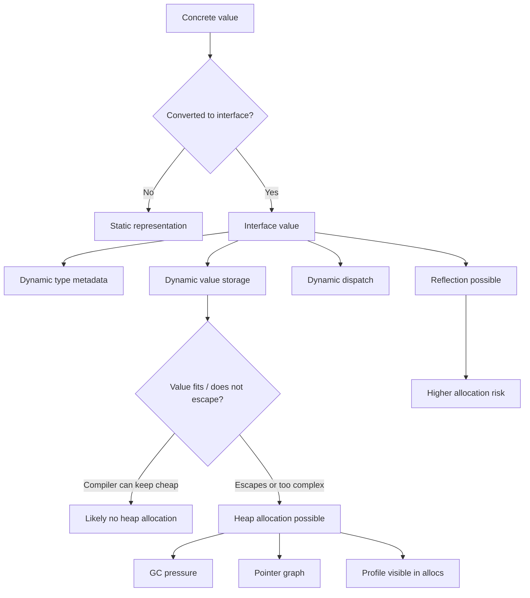
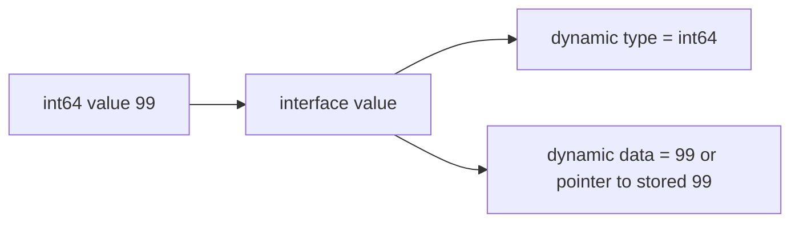
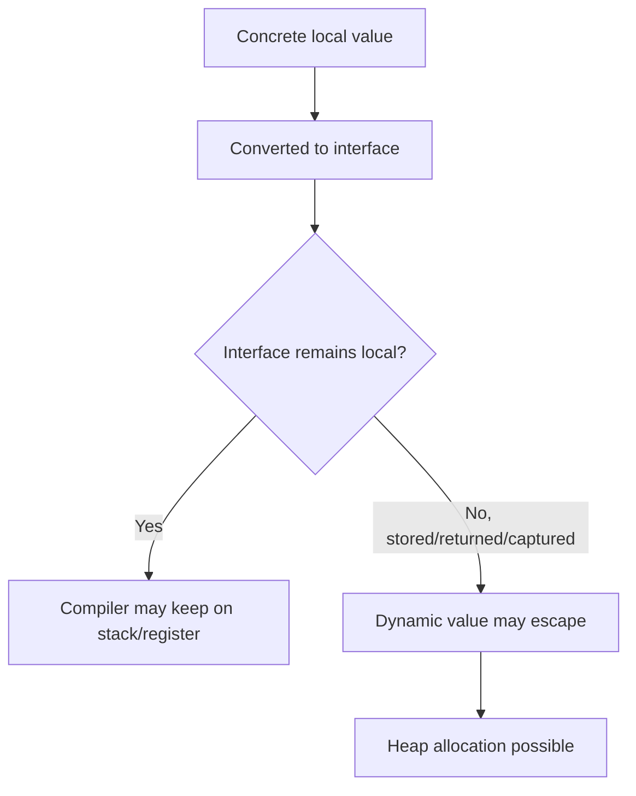
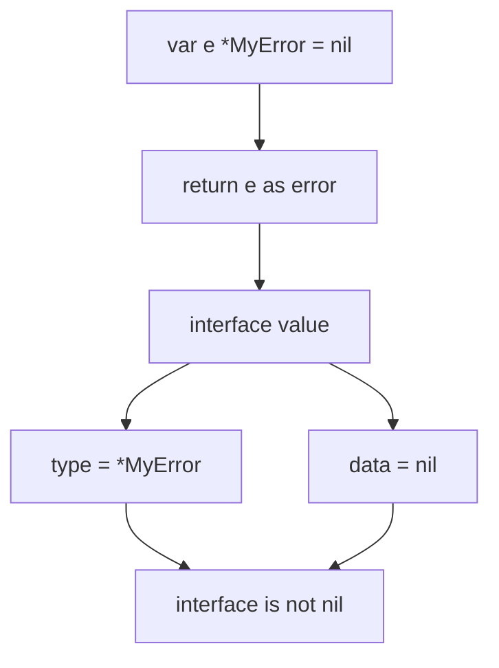
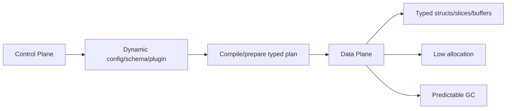
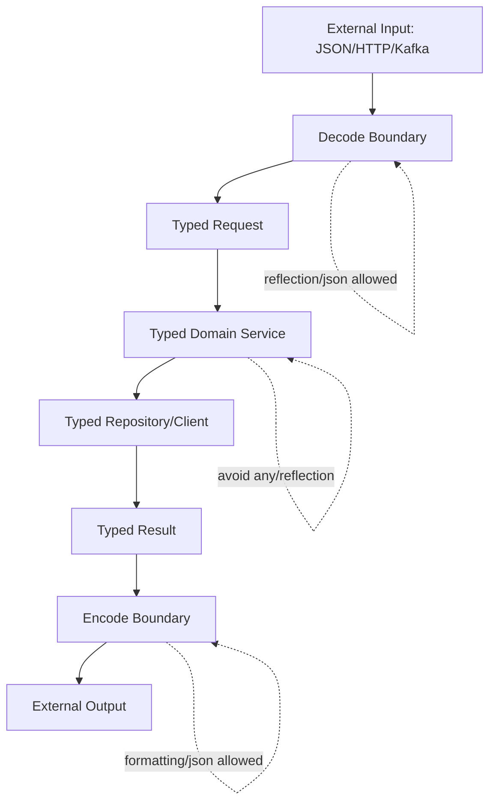
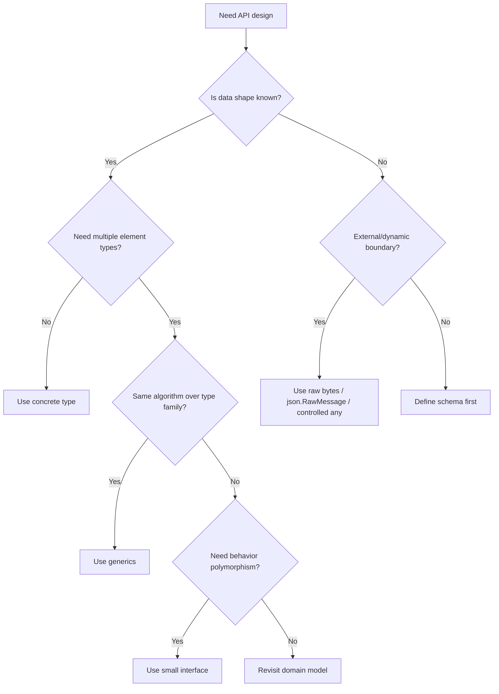

# learn-go-memory-systems-part-012.md

# Go Memory Systems — Part 012
# Boxing/Unboxing for Java Engineers: Why Go Has No Exact Equivalent, But Still Has Allocation Traps

> Target pembaca: Java software engineer yang sedang membangun mental model Go memory systems sampai level production engineering.
>
> Posisi seri: Part 012 dari 035.
>
> Fokus part ini: memahami bahwa Go tidak punya boxing/unboxing seperti Java primitive wrapper, tetapi Go tetap punya beberapa mekanisme yang secara efek mirip boxing: conversion ke interface, variadic `...any`, reflection, `fmt`, `encoding/json`, `map[string]any`, dan boundary generic/interface. Tujuannya bukan menghindari interface secara buta, tetapi mampu mendesain boundary yang jelas, mengukur allocation, dan menjaga hot path tetap efisien.

---

## 0. Ringkasan Eksekutif

Di Java, boxing biasanya berarti konversi dari primitive seperti `int` menjadi object wrapper seperti `Integer`. Ini bisa menciptakan object heap, pointer indirection, pressure ke GC, dan kadang overhead tidak terlihat karena autoboxing.

Di Go, tidak ada sistem primitive vs wrapper class seperti itu. `int`, `bool`, `float64`, struct kecil, pointer, slice, string, map, dan channel adalah value dengan representasi masing-masing. Namun, Go punya konsep yang sering terasa seperti boxing ketika sebuah concrete value dimasukkan ke dalam interface value, terutama `interface{}` atau aliasnya `any`.

Contoh sederhana:

```go
var x int = 42
var a any = x
```

Secara bahasa, `x` dikonversi menjadi interface value. Interface value membawa informasi dynamic type dan dynamic value. Untuk banyak kasus, compiler/runtime dapat merepresentasikan value tersebut tanpa heap allocation tambahan. Tetapi dalam banyak kasus lain, terutama ketika value perlu hidup lebih lama, disimpan ke heap object, masuk variadic `...any`, masuk `map[string]any`, melewati reflection, atau berpindah ke API umum seperti `fmt`, allocation bisa muncul.

Mental model yang benar:

```text
Go does not have Java-style boxing.
Go does have interface conversion and dynamic value packaging.
That packaging can be allocation-free or allocation-heavy depending on lifetime, size, escape, and API boundary.
```

Jadi target engineer bukan:

```text
Never use interface.
```

Target yang benar:

```text
Use interface at stable abstraction boundaries.
Avoid accidental interface conversion in high-frequency data paths.
Measure allocation with benchmarks and profiles.
Prefer concrete/generic/caller-owned APIs in hot paths.
```

---

## 1. Mengapa Part Ini Penting

Banyak engineer Java masuk ke Go dengan dua bias ekstrem:

1. Menganggap Go interface sama seperti Java interface dan overhead-nya selalu object dispatch biasa.
2. Menganggap setiap `interface{}` pasti sama dengan Java boxing dan harus dihindari total.

Keduanya kurang tepat.

Go interface adalah value runtime yang menyimpan pasangan informasi:

```text
(type information, data)
```

Untuk non-empty interface, runtime juga membutuhkan informasi method table agar method dynamic bisa dipanggil.

Akibatnya, interface memiliki beberapa biaya potensial:

- dynamic dispatch
- hilangnya static type detail
- escape analysis lebih sulit
- allocation untuk menyimpan dynamic value
- pointer graph lebih kompleks
- reflection path lebih mahal
- type assertion/type switch overhead
- GC scanning tergantung dynamic value

Tetapi interface juga sangat penting untuk desain Go yang idiomatis:

- `io.Reader`
- `io.Writer`
- `error`
- `context.Context`
- `http.Handler`
- `sort.Interface`
- capability-style API kecil
- plugin/adaptor boundary
- test seam

Jadi pertanyaannya bukan “interface baik atau buruk”, tetapi:

```text
Apakah interface berada di boundary abstraksi yang tepat,
atau bocor ke inner loop data path yang seharusnya concrete?
```

---

## 2. Peta Konsep



---

## 3. Java Boxing/Unboxing: Baseline Pembanding

Di Java:

```java
int x = 42;
Integer y = x;      // boxing
int z = y;          // unboxing
```

Boxing mengubah primitive menjadi object wrapper.

Konsekuensi umum:

- `Integer` adalah object, bukan primitive.
- Object biasanya berada di heap, kecuali compiler/JIT dapat mengeliminasi allocation.
- Ada object header.
- Ada pointer/reference indirection.
- Ada nullability.
- Ada identity semantics untuk object tertentu.
- Ada risiko `NullPointerException` saat unboxing `Integer null` ke `int`.
- Collection generic Java lama sering memaksa wrapper karena generic tidak menerima primitive langsung.

Contoh:

```java
List<Integer> xs = new ArrayList<>();
xs.add(42); // autoboxing int -> Integer
```

Untuk hot path, ini bisa mahal karena banyak object kecil.

Namun JVM modern punya banyak optimasi:

- scalar replacement
- escape analysis
- JIT inlining
- compressed oops
- autobox cache untuk beberapa value wrapper

Tetapi secara model bahasa, boxing adalah primitive-to-object wrapper conversion.

Go tidak punya model ini.

---

## 4. Go Tidak Punya Primitive Wrapper Model

Di Go:

```go
var x int = 42
```

`x` adalah value bertipe `int`.

Tidak ada class `Integer`.
Tidak ada implicit wrapper object.
Tidak ada autoboxing ke wrapper.
Tidak ada unboxing dari wrapper.

Jika Anda membuat pointer:

```go
p := &x
```

Itu pointer ke `int`, bukan wrapper object seperti `Integer`.

Jika Anda memasukkan ke interface:

```go
var a any = x
```

Ini juga bukan `Integer`. Ini adalah interface value yang membawa dynamic type `int` dan dynamic value `42`.

Perbedaan utamanya:

| Aspek | Java Boxing | Go Interface Conversion |
|---|---|---|
| Dari | primitive | concrete Go value |
| Ke | wrapper object | interface value |
| Contoh | `int -> Integer` | `int -> any` |
| Nullability | wrapper bisa null | interface bisa nil/non-nil, dynamic value bisa nil |
| Identity | wrapper adalah object | interface bukan wrapper class |
| Allocation pasti? | Tidak selalu karena JIT, tapi modelnya object | Tidak selalu; tergantung representasi, escape, lifetime |
| Dispatch | method virtual object | interface method dispatch bila non-empty interface |
| Reflection | object metadata/class | dynamic type metadata Go |

---

## 5. Apa Itu “Boxing-Like Behavior” di Go?

Istilah “boxing-like” berguna sebagai analogi, tetapi harus hati-hati.

Dalam seri ini, “boxing-like behavior” berarti:

```text
Concrete value dikemas ke representasi dynamic yang lebih umum,
sehingga compiler kehilangan sebagian informasi concrete,
dan runtime mungkin perlu menyimpan data/metadata tambahan,
yang dapat menyebabkan allocation, indirection, reflection cost, atau GC pressure.
```

Contoh umum:

```go
func Log(fields ...any) {
    // ...
}

Log("user_id", 123, "active", true)
```

Value `"user_id"`, `123`, `"active"`, dan `true` dimasukkan ke parameter variadic `...any`. Compiler membuat slice `[]any`, dan setiap argumen menjadi interface value.

Tidak semua argumen pasti heap allocate, tetapi pola ini punya beberapa biaya:

- pembuatan slice variadic bisa allocate jika escape
- setiap elemen adalah interface value
- dynamic type/value perlu dibawa
- downstream mungkin memakai reflection atau formatting
- hot path logging bisa menjadi allocation-heavy

---

## 6. Interface Value: Pengingat Representasi

Dari Part 011, interface value secara mental dapat dilihat sebagai:

```text
empty interface / any:
+------------------+
| dynamic type ptr |
+------------------+
| dynamic data     |
+------------------+

non-empty interface:
+------------------+
| itab ptr         |
+------------------+
| dynamic data     |
+------------------+
```

`any` adalah alias untuk `interface{}`.

```go
type any = interface{}
```

Non-empty interface:

```go
type Writer interface {
    Write([]byte) (int, error)
}
```

Interface value membawa cukup informasi agar runtime tahu concrete type dan, untuk non-empty interface, method implementation yang cocok.

---

## 7. Conversion ke `any`: Apa yang Terjadi?

Kode:

```go
var x int64 = 99
var a any = x
```

Secara konseptual:



Tetapi detail fisiknya tidak boleh diasumsikan sebagai kontrak bahasa. Compiler/runtime punya kebebasan implementasi selama observable behavior sesuai spec.

Yang penting secara engineering:

- interface value membawa dynamic type
- dynamic value harus tetap valid selama interface value hidup
- jika value tidak bisa disimpan langsung secara aman/murah, runtime/compiler dapat menyimpan copy di memory terpisah
- jika interface value escape, dynamic value mungkin ikut escape

---

## 8. Allocation Tidak Ditentukan Hanya oleh `any`

Contoh:

```go
func f() any {
    x := 42
    return x
}
```

`x` dimasukkan ke interface dan interface dikembalikan. Apakah ada heap allocation?

Jawaban yang benar:

```text
Jangan tebak. Periksa dengan escape analysis dan benchmark.
```

Command:

```bash
go build -gcflags='-m=2' ./...
go test -bench=. -benchmem ./...
```

Kenapa tidak boleh tebak?

Karena allocation dipengaruhi oleh:

- ukuran value
- apakah value mengandung pointer
- apakah interface escape
- apakah fungsi inline
- apakah compiler dapat melakukan devirtualization
- apakah dynamic value disimpan di heap object
- versi Go
- optimasi compiler saat itu

Go specification mendefinisikan semantik, bukan layout final di semua kasus.

---

## 9. Escape Analysis sebagai Penentu Utama

Escape analysis mencoba membuktikan apakah suatu value bisa hidup di stack atau harus heap.

Contoh:

```go
func local() {
    var x any = 42
    _ = x
}
```

Kemungkinan besar tidak perlu heap allocation karena interface value hanya lokal dan tidak escape.

Bandingkan:

```go
var global any

func store() {
    x := 42
    global = x
}
```

Sekarang dynamic value perlu hidup setelah fungsi selesai, karena disimpan ke global. Ini lebih mungkin menyebabkan heap allocation atau setidaknya membuat value/lifetime-nya keluar dari stack frame lokal.

Mental model:



---

## 10. Case: `[]int` Tidak Bisa Langsung Jadi `[]any`

Ini salah satu contoh paling penting bagi Java engineer.

Di Java:

```java
List<Integer> ints = List.of(1, 2, 3);
List<?> xs = ints;
```

Di Go:

```go
xs := []int{1, 2, 3}
var ys []any = xs // compile error
```

Kenapa?

Karena `[]int` dan `[]any` punya layout elemen berbeda.

`[]int` backing array:

```text
+-----+-----+-----+
| int | int | int |
+-----+-----+-----+
```

`[]any` backing array:

```text
+------------+------------+------------+
| interface  | interface  | interface  |
| type,data  | type,data  | type,data  |
+------------+------------+------------+
```

Untuk mengubah `[]int` menjadi `[]any`, setiap elemen harus dikonversi satu per satu:

```go
func intsToAny(xs []int) []any {
    ys := make([]any, len(xs))
    for i, x := range xs {
        ys[i] = x
    }
    return ys
}
```

Ini melakukan:

- allocation backing array `[]any`
- conversion setiap `int` ke interface
- potensi allocation tambahan tergantung escape/lifetime
- lebih banyak memory per element
- GC scanning lebih mahal karena interface elements membawa metadata/pointer-like fields

Diagram:

```mermaid
flowchart LR
    A[[]int backing array] -->|loop conversion| B[[]any backing array]
    B --> C[elem0: type,data]
    B --> D[elem1: type,data]
    B --> E[elem2: type,data]
```

Ini salah satu alasan API hot path sebaiknya tidak menerima `[]any` jika sebenarnya selalu memproses `[]int`, `[]byte`, `[]float64`, atau concrete struct tertentu.

---

## 11. Variadic `...any`: Allocation Trap yang Sangat Umum

Fungsi:

```go
func Debug(args ...any) {
    // ...
}
```

Call:

```go
Debug("id", id, "status", status, "latency", latency)
```

Compiler harus membentuk `[]any` untuk `args`.

Secara mental:

```text
Debug("id", id)

becomes roughly:
args := []any{"id", id}
Debug(args...)
```

Tidak selalu heap allocation, tetapi risiko meningkat jika:

- `args` disimpan
- diteruskan ke fungsi lain yang menyimpan
- masuk interface lagi
- dipakai oleh reflection
- call tidak inline
- jumlah argumen besar
- dilakukan di hot loop

Contoh buruk di hot path:

```go
for _, event := range events {
    logger.Debug("event", event, "payload", event.Payload, "tenant", event.TenantID)
}
```

Jika logger memakai `...any`, setiap iterasi bisa membuat allocation/formatting cost.

Alternatif lebih stabil:

```go
type EventLogFields struct {
    EventID  string
    TenantID string
    Size     int
}

func LogEvent(fields EventLogFields) {
    // concrete, predictable
}
```

Atau gunakan structured logging API yang memang dioptimalkan, tetapi tetap ukur dengan benchmark/profile.

---

## 12. `fmt`: Convenience Boundary yang Mahal di Hot Path

`fmt` sangat nyaman:

```go
s := fmt.Sprintf("user=%s count=%d", user, count)
```

Namun `fmt` menerima argumen sebagai `...any` dan melakukan formatting dynamic.

Biaya potensial:

- variadic `[]any`
- interface conversion setiap argumen
- reflection/type switch internal
- parsing format string
- allocation string result
- allocation intermediate tertentu

Untuk cold path, error message, CLI, admin tool, test, ini normal.

Untuk hot path, pertimbangkan:

```go
var b strings.Builder
b.Grow(64)
b.WriteString("user=")
b.WriteString(user)
b.WriteString(" count=")
b.WriteString(strconv.Itoa(count))
s := b.String()
```

Atau untuk `[]byte` output:

```go
buf := make([]byte, 0, 64)
buf = append(buf, "user="...)
buf = append(buf, user...)
buf = append(buf, " count="...)
buf = strconv.AppendInt(buf, int64(count), 10)
```

Rule:

```text
fmt is excellent for correctness and readability at human boundaries.
strconv/append/builder are better for repeated machine hot paths.
```

---

## 13. `encoding/json` dan `map[string]any`

Pola umum:

```go
var m map[string]any
err := json.Unmarshal(data, &m)
```

Ini fleksibel, tetapi mahal:

- JSON object menjadi map dynamic
- number default bisa menjadi `float64` jika tidak memakai decoder setting khusus
- array menjadi `[]any`
- nested object menjadi `map[string]any`
- banyak allocation kecil
- banyak interface values
- type assertion di downstream
- kehilangan schema

Contoh downstream:

```go
id, ok := m["id"].(string)
if !ok {
    return errors.New("missing id")
}
```

Untuk boundary yang schema-nya diketahui, gunakan struct:

```go
type CreateUserRequest struct {
    ID    string `json:"id"`
    Email string `json:"email"`
    Age   int    `json:"age"`
}

var req CreateUserRequest
err := json.Unmarshal(data, &req)
```

Keuntungan:

- field typed
- lebih sedikit assertion
- struktur memory lebih jelas
- lebih mudah validasi
- lebih mudah review API
- potensi allocation lebih rendah

Kapan `map[string]any` masuk akal?

- truly dynamic metadata
- schema-less ingestion
- audit/log payload yang tidak diproses intensif
- plugin boundary
- admin/debug tool
- migration temporary

Tetapi untuk business core hot path, `map[string]any` biasanya red flag.

---

## 14. Reflection: Amplifier dari Boxing-Like Cost

Reflection bekerja pada dynamic type/value.

Contoh:

```go
v := reflect.ValueOf(x)
```

`x` masuk ke interface parameter:

```go
func ValueOf(i any) Value
```

Jadi sebelum reflection bekerja, sudah ada conversion ke `any`.

Reflection kemudian menambah potensi biaya:

- dynamic inspection
- method/field lookup
- allocation saat membuat value baru
- loss of inlining
- loss of static type optimization
- type assertion/Kind switch
- lebih sulit untuk escape analysis

Reflection bukan haram. Banyak package penting memakainya:

- `encoding/json`
- `database/sql`
- validation libraries
- ORM/mapping
- config loader
- DI container
- test utilities

Tetapi prinsipnya:

```text
Reflection is acceptable at boundary and setup time.
Reflection is suspicious in inner loops.
```

Alternatif:

- generated code
- generics
- concrete encoder/decoder
- manual parser
- typed configuration struct
- one-time reflection cache

---

## 15. Interface vs Generic vs Concrete

Go modern memiliki generics. Ini memberi pilihan antara:

1. Concrete API
2. Interface API
3. Generic API

### 15.1 Concrete API

```go
func SumInt(xs []int) int {
    var sum int
    for _, x := range xs {
        sum += x
    }
    return sum
}
```

Keuntungan:

- representasi jelas
- mudah diinline
- allocation minimal
- tidak ada interface conversion
- sangat cocok untuk hot path

Kekurangan:

- kurang reusable
- perlu duplikasi untuk type berbeda

### 15.2 Interface API

```go
type IntSource interface {
    Next() (int, bool)
}

func Sum(src IntSource) int {
    var sum int
    for {
        x, ok := src.Next()
        if !ok {
            return sum
        }
        sum += x
    }
}
```

Keuntungan:

- abstraction boundary jelas
- test seam
- streaming source
- decoupling

Kekurangan:

- dynamic dispatch
- escape risk
- harder optimization

### 15.3 Generic API

```go
func Sum[T ~int | ~int64](xs []T) T {
    var sum T
    for _, x := range xs {
        sum += x
    }
    return sum
}
```

Keuntungan:

- type-safe reusable
- tidak perlu `any`
- bisa menghindari banyak assertion
- bagus untuk container/algorithm typed

Kekurangan:

- tidak selalu menggantikan interface behavior
- constraint design bisa kompleks
- binary/codegen trade-off bergantung implementasi compiler
- tidak cocok jika yang dibutuhkan adalah runtime polymorphism behavior

Decision table:

| Kebutuhan | Pilihan awal |
|---|---|
| Hot path, type jelas | Concrete |
| Reusable algorithm atas family type | Generic |
| Behavior boundary kecil | Interface |
| Dynamic schema | `any`/reflection, tetapi isolasi |
| Logging/debug convenience | `...any` boleh, ukur bila hot |
| Serialization core schema | Struct typed |

---

## 16. Interface Allocation Trap: Return `any`

Contoh API:

```go
func DecodeValue(data []byte) (any, error) {
    // returns string/int/map depending on data
}
```

Masalah:

- caller harus type assert
- allocation dan representation tidak jelas
- downstream sulit dioptimasi
- ownership tidak jelas
- error handling cenderung runtime, bukan compile-time

Alternatif bila schema diketahui:

```go
func DecodeUser(data []byte) (User, error)
```

Atau generic decode:

```go
func Decode[T any](data []byte) (T, error)
```

Tetapi generic decode masih bisa memakai reflection internal jika implementasinya dynamic. Generic signature tidak otomatis bebas allocation.

Rule:

```text
Generic API removes some dynamic typing at call site.
It does not magically remove reflection/allocation inside implementation.
```

---

## 17. Interface Allocation Trap: Store `any` in Struct

Contoh:

```go
type Event struct {
    Name string
    Data any
}
```

Ini fleksibel, tetapi field `Data any` membuat object graph tidak terprediksi.

Bisa berisi:

- int
- string
- `[]byte`
- map
- pointer ke object besar
- closure
- object dengan references ke graph besar

Masalah production:

- retention tidak terlihat dari type
- GC scan cost sulit diprediksi
- serialization behavior dynamic
- testing matrix melebar
- type assertion tersebar
- backwards compatibility sulit

Alternatif:

```go
type Event struct {
    Name    string
    Payload []byte
}
```

atau:

```go
type UserCreated struct {
    UserID string
    Email  string
}

type Event struct {
    Name        string
    UserCreated *UserCreated
    // oneof-like typed fields if needed
}
```

atau:

```go
type Event[T any] struct {
    Name string
    Data T
}
```

Gunakan `any` field hanya jika benar-benar dynamic dan boundary-nya jelas.

---

## 18. Interface Allocation Trap: `context.WithValue`

`context.WithValue` menerima key dan value sebagai `any`:

```go
ctx = context.WithValue(ctx, key, value)
```

Ini sengaja dynamic karena context adalah cross-boundary propagation.

Namun sering disalahgunakan:

```go
ctx = context.WithValue(ctx, "request", hugeRequestObject)
```

Masalah:

- value bisa mempertahankan graph besar
- lifetime mengikuti context
- type safety hilang
- key string raw bisa collision
- allocation/interface conversion
- sulit trace ownership

Pattern lebih baik:

```go
type requestIDKey struct{}

func WithRequestID(ctx context.Context, id string) context.Context {
    return context.WithValue(ctx, requestIDKey{}, id)
}

func RequestID(ctx context.Context) (string, bool) {
    id, ok := ctx.Value(requestIDKey{}).(string)
    return id, ok
}
```

Gunakan context value untuk metadata kecil dan request-scoped, bukan dependency injection container atau object carrier.

---

## 19. Interface Allocation Trap: `error` Wrapping

`error` adalah interface:

```go
type error interface {
    Error() string
}
```

Custom error:

```go
type ParseError struct {
    Offset int
    Msg    string
}

func (e *ParseError) Error() string {
    return e.Msg
}
```

Ketika return sebagai `error`:

```go
return &ParseError{Offset: off, Msg: msg}
```

Ada allocation untuk `ParseError` jika dibuat dengan address dan dikembalikan.

Ini biasanya normal. Error path bukan hot path utama.

Tetapi masalah muncul jika error dibuat di hot success path atau logging error menyimpan payload besar:

```go
type BadError struct {
    Payload []byte // retains huge buffer
    Msg     string
}
```

Better:

```go
type ParseError struct {
    Offset int
    Code   string
}
```

Jangan simpan buffer besar di error kecuali memang diperlukan.

---

## 20. Interface Allocation Trap: Method Values

Method value dapat capture receiver:

```go
type Handler struct {
    buf []byte
}

func (h *Handler) Serve() {}

func register(fn func()) {}

func f(h *Handler) {
    register(h.Serve)
}
```

`h.Serve` adalah function value yang membawa receiver `h`.

Efek:

- receiver bisa retained
- function value bisa escape
- object besar di receiver bisa ikut hidup

Ini bukan boxing, tetapi mirip dynamic packaging/capture.

Checklist:

- Apakah function value disimpan?
- Apakah receiver besar?
- Apakah receiver membawa buffer/cache/map besar?
- Apakah lifecycle callback lebih panjang dari request?

---

## 21. Type Assertion dan Type Switch Cost

Contoh:

```go
func Handle(v any) {
    switch x := v.(type) {
    case string:
        handleString(x)
    case int:
        handleInt(x)
    case []byte:
        handleBytes(x)
    default:
        handleUnknown(x)
    }
}
```

Type switch berguna di boundary dynamic.

Namun jika seluruh core logic dipenuhi type switch atas `any`, itu tanda schema hilang.

Masalah:

- logic runtime bukan compile-time
- missing case ditemukan saat runtime
- test matrix melebar
- optimasi compiler lebih terbatas
- allocation sudah terjadi sebelum switch jika value dikemas ke interface dan escape

Better bila domain fixed:

```go
type Command interface {
    Apply(*State) error
}
```

atau concrete enum + payload typed:

```go
type CommandKind uint8

const (
    CreateUser CommandKind = iota
    DisableUser
)

type Command struct {
    Kind CommandKind
    Create *CreateUserPayload
    Disable *DisableUserPayload
}
```

---

## 22. Nil Trap: Boxing-Like Confusion Paling Berbahaya

Classic bug:

```go
type MyError struct{}

func (e *MyError) Error() string { return "boom" }

func do() error {
    var e *MyError = nil
    return e
}

func main() {
    err := do()
    fmt.Println(err == nil) // false
}
```

Kenapa?

Interface `err` berisi dynamic type `*MyError` dan dynamic value nil.

Secara mental:

```text
err = (type: *MyError, data: nil)
```

Interface nil hanya jika type dan data sama-sama nil:

```text
nil interface = (type: nil, data: nil)
```

Diagram:



Fix:

```go
func do() error {
    var e *MyError = nil
    if e == nil {
        return nil
    }
    return e
}
```

Rule:

```text
Never return a typed nil concrete value as an interface unless you intentionally want non-nil interface.
```

---

## 23. `sync.Pool` dan Interface Boundary

`sync.Pool` API:

```go
func (p *Pool) Get() any
func (p *Pool) Put(x any)
```

Karena menerima/mengembalikan `any`, setiap object melewati interface boundary.

Contoh:

```go
var pool = sync.Pool{
    New: func() any { return new(bytes.Buffer) },
}

buf := pool.Get().(*bytes.Buffer)
buf.Reset()
// use buf
pool.Put(buf)
```

Ini idiomatis, tetapi harus hati-hati:

- object yang dipool sebaiknya pointer agar tidak copy besar
- reset harus membersihkan references agar tidak retain graph
- jangan return buffer ke caller lalu juga put ke pool
- jangan put object yang masih digunakan
- jangan pool object kecil tanpa bukti
- pool bisa dikosongkan oleh GC kapan saja

`sync.Pool` bukan arena deterministic.

---

## 24. API Smell: `func Process(v any) any`

API seperti ini sering terlihat fleksibel:

```go
func Process(v any) any
```

Tetapi dari sisi engineering, ini lemah:

- input schema tidak jelas
- output schema tidak jelas
- caller harus type assert
- compiler tidak membantu
- allocation risk tinggi
- documentation burden tinggi
- test matrix besar
- backward compatibility sulit

Lebih baik:

```go
func ProcessOrder(in OrderInput) (OrderResult, error)
```

atau:

```go
type Processor[I any, O any] interface {
    Process(context.Context, I) (O, error)
}
```

Gunakan `any` jika memang dynamic system:

- scripting runtime
- generic JSON tree
- plugin message bus
- reflection utility
- test assertion helper
- logging field value

Tetapi jangan jadikan `any` default untuk menghindari desain domain.

---

## 25. Hot Path Design: Hindari Dynamic Packaging Berulang

Misalnya parser binary protocol:

Buruk:

```go
func ParseField(raw []byte) (string, any, error) {
    // returns dynamic value
}

func HandleFrame(fields map[string]any) error {
    // type assert everything
}
```

Lebih baik:

```go
type Frame struct {
    TenantID uint64
    Kind     uint16
    Flags    uint32
    Payload  []byte
}

func ParseFrame(raw []byte) (Frame, error) {
    // typed parse
}
```

Untuk field yang benar-benar extension:

```go
type Frame struct {
    TenantID uint64
    Kind     uint16
    Flags    uint32
    Payload  []byte
    Ext      []Extension
}

type Extension struct {
    Type uint16
    Raw  []byte
}
```

Dynamic tetap ada, tetapi diisolasi sebagai raw extension, bukan menyebar ke seluruh pipeline sebagai `any`.

---

## 26. Observability: Cara Membuktikan Allocation Trap

Gunakan benchmark:

```go
package boxing

import "testing"

func BenchmarkConcrete(b *testing.B) {
    var sum int
    for b.Loop() {
        sum += concrete(42)
    }
    _ = sum
}

func concrete(x int) int {
    return x + 1
}

func BenchmarkAny(b *testing.B) {
    var sum int
    for b.Loop() {
        sum += viaAny(42)
    }
    _ = sum
}

func viaAny(v any) int {
    return v.(int) + 1
}
```

Run:

```bash
go test -bench=. -benchmem
```

Lalu cek escape:

```bash
go test -run=^$ -bench=BenchmarkAny -gcflags='-m=2'
```

Jangan hanya lihat ns/op. Lihat juga:

- B/op
- allocs/op
- inlining report
- escape report
- profile under realistic call chain

Kadang microbenchmark menunjukkan 0 alloc, tetapi real service path allocate karena value disimpan, diteruskan, logged, reflected, atau closure-captured.

---

## 27. Pprof Workflow

Jika service allocation-heavy, cari `any`/interface trap dengan workflow:

1. Capture heap alloc profile.
2. Lihat top allocation sites.
3. Cari pola:
   - `fmt.Sprintf`
   - `encoding/json`
   - `reflect.*`
   - `mapassign`
   - `convT*` runtime helpers
   - logger field builder
   - `append` to `[]any`
4. Periksa call path.
5. Buat benchmark kecil untuk suspected path.
6. Ubah API boundary jika perlu.
7. Bandingkan before/after.

Command contoh:

```bash
go test -bench=. -benchmem -memprofile=mem.out

go tool pprof -alloc_space ./pkg.test mem.out
```

Dalam pprof interactive:

```text
top
list FunctionName
web
```

Untuk production, gunakan endpoint pprof dengan proteksi akses.

---

## 28. Runtime Helper Names yang Sering Terlihat

Dalam profile/assembly/escape report, Anda mungkin melihat nama runtime/compiler helper seperti:

- conversion ke interface
- allocation helper
- map assignment
- slice growth
- string/byte conversion
- reflection calls

Contoh pola nama yang sering muncul di profile:

```text
runtime.convT64
runtime.convTstring
runtime.convTslice
runtime.newobject
runtime.makeslice
runtime.growslice
runtime.mapassign
reflect.Value.Interface
fmt.Sprintf
encoding/json.*
```

Jangan langsung menyimpulkan semua helper buruk.

Gunakan helper sebagai petunjuk:

```text
Helper name -> suspicious allocation site -> inspect source -> benchmark isolated change -> validate under load.
```

---

## 29. Concrete vs Interface: Contoh Review API

### 29.1 API yang Terlalu Dynamic

```go
type HandlerFunc func(ctx context.Context, payload any) (any, error)
```

Pertanyaan review:

- Payload schema apa?
- Siapa owner payload?
- Apakah payload mutable?
- Apakah output type fixed?
- Berapa frekuensi call?
- Apakah ini hot path?
- Apakah downstream memakai reflection?
- Apakah ada type assertion berulang?
- Apakah error runtime bisa jadi compile-time error?

### 29.2 API yang Lebih Typed

```go
type Handler[I any, O any] interface {
    Handle(context.Context, I) (O, error)
}
```

Atau concrete:

```go
type PaymentHandler interface {
    HandlePayment(context.Context, PaymentRequest) (PaymentResult, error)
}
```

Perhatikan: generic/interface typed bukan selalu lebih cepat, tetapi lebih jelas secara contract.

---

## 30. Dynamic Boundary Pattern

Kadang dynamic tidak bisa dihindari. Misalnya plugin system.

Pattern yang baik:

```go
type RawMessage struct {
    Type    string
    Version int
    Body    []byte
}

type Plugin interface {
    Handle(context.Context, RawMessage) (RawMessage, error)
}
```

Dynamic payload tetap raw bytes. Plugin boleh decode sesuai schema.

Lebih buruk:

```go
type Plugin interface {
    Handle(context.Context, map[string]any) (map[string]any, error)
}
```

Karena:

- semua boundary menjadi dynamic map
- allocation besar
- type assertion everywhere
- schema validation tersebar
- sulit audit compatibility

Prinsip:

```text
If dynamic is required, keep it serialized or explicitly typed at the boundary.
Do not turn the whole core into map[string]any soup.
```

---

## 31. `any` di Logging: Kapan Aman?

Structured logging sering memakai field dynamic.

Contoh:

```go
logger.Info("request completed",
    "method", r.Method,
    "path", r.URL.Path,
    "status", status,
    "duration_ms", duration.Milliseconds(),
)
```

Ini acceptable jika:

- frekuensi log tidak ekstrem
- level log dikontrol
- logger lazy/drop sebelum field formatting berat
- payload tidak besar
- tidak logging `[]byte` besar
- tidak logging object graph besar
- tidak membuat string mahal jika log level disabled

Hindari:

```go
logger.Debug("payload", string(body)) // conversion even if debug disabled in some APIs
```

Lebih baik jika logger mendukung lazy atau check level:

```go
if logger.Enabled(ctx, slog.LevelDebug) {
    logger.DebugContext(ctx, "payload", "size", len(body))
}
```

Atau log metadata, bukan payload.

---

## 32. Boxing-Like Trap dalam `database/sql`

`database/sql` banyak memakai `any` untuk value binding dan scanning.

Contoh:

```go
row.Scan(&id, &name, &createdAt)
```

atau:

```go
_, err := db.ExecContext(ctx,
    "insert into users(id, name) values(?, ?)",
    id, name,
)
```

Exec args biasanya `...any`.

Ini wajar karena database boundary memang dynamic-ish.

Optimasi yang lebih penting biasanya:

- query plan
- connection pool
- batch size
- network round trip
- transaction scope
- row scanning allocation
- avoiding `map[string]any` for each row

Untuk hot row processing, hindari:

```go
func scanRow(rows *sql.Rows) (map[string]any, error)
```

Lebih baik typed struct:

```go
type UserRow struct {
    ID   int64
    Name string
}
```

---

## 33. Boxing-Like Trap dalam Event Bus

Event bus sering didesain seperti:

```go
type Event struct {
    Topic string
    Data  any
}
```

Ini nyaman, tetapi untuk sistem besar bisa rapuh.

Masalah:

- producer dan consumer tidak punya schema kuat
- event compatibility runtime-only
- payload bisa pointer ke mutable object
- payload bisa retain graph besar
- serialization ambiguous
- observability sulit

Better:

```go
type EventEnvelope struct {
    Topic     string
    Version   int
    Key       []byte
    Payload   []byte
    Headers   []Header
    Timestamp time.Time
}
```

Lalu payload decode typed di consumer:

```go
type UserCreatedV1 struct {
    UserID string `json:"user_id"`
}
```

Dengan ini dynamic boundary tetap ada, tetapi memory ownership jelas: payload adalah bytes.

---

## 34. Boxing-Like Trap dalam Validation/Mapping Framework

Framework validation sering menerima `any`:

```go
func Validate(v any) error
```

Internal memakai reflection.

Ini acceptable untuk request boundary.

Namun jangan taruh di inner loop processing jutaan item jika bisa dihindari.

Alternatif:

- generated validators
- manual validation untuk hot entity
- compile schema once
- reuse decoder/validator state
- validate batch di boundary, bukan per-field dynamic repeated

Pattern:

```go
// Boundary
if err := ValidateCreateUser(req); err != nil {
    return err
}

// Core typed path
result := service.CreateUser(ctx, req)
```

---

## 35. Boxing-Like Trap dalam Collections

Generic collection yang buruk:

```go
type List struct {
    items []any
}
```

Semua elemen menjadi interface.

Untuk `int`:

```go
list.Add(1)
list.Add(2)
```

Biaya:

- `[]any` backing array
- dynamic type/value per element
- assertion saat read
- GC scanning lebih berat

Generic collection lebih baik:

```go
type List[T any] struct {
    items []T
}

func (l *List[T]) Add(v T) {
    l.items = append(l.items, v)
}

func (l *List[T]) Get(i int) T {
    return l.items[i]
}
```

Untuk primitive-heavy data, ini jauh lebih natural.

---

## 36. Pointer Density dan GC Scanning

`[]int`:

```text
[int][int][int][int]
```

GC tahu array ini tidak punya pointer jika elem type pointer-free. Scanning murah.

`[]any`:

```text
[type,data][type,data][type,data][type,data]
```

Interface values mengandung pointer-like metadata dan data word. GC harus memperlakukan representasi ini lebih hati-hati.

Akibat:

- memory footprint lebih besar
- cache locality lebih buruk
- GC scanning cost meningkat
- dynamic value bisa menunjuk graph lain

Jadi mengubah data numeric besar menjadi `[]any` adalah red flag besar.

---

## 37. Data-Oriented Design: Hindari `any` untuk Columnar Data

Buruk:

```go
type Row []any
```

Untuk analytical/hot path:

```go
type ColumnInt64 struct {
    Data []int64
    Nulls []uint64 // bitset
}

type ColumnString struct {
    Offsets []uint32
    Data    []byte
    Nulls   []uint64
}
```

Ini lebih dekat ke sistem high-performance:

- pointer lebih sedikit
- layout predictable
- cache locality lebih baik
- GC scanning lebih murah
- vectorization lebih mungkin
- serialization lebih mudah

Go memang bukan C, tetapi data layout tetap penting.

---

## 38. Micro Example: `[]any` vs Typed Slice

Typed:

```go
func SumTyped(xs []int64) int64 {
    var sum int64
    for _, x := range xs {
        sum += x
    }
    return sum
}
```

Dynamic:

```go
func SumAny(xs []any) int64 {
    var sum int64
    for _, v := range xs {
        sum += v.(int64)
    }
    return sum
}
```

Dynamic version punya:

- type assertion per element
- interface element per value
- larger memory footprint
- possible allocation saat build `[]any`
- worse cache locality

Jangan gunakan `[]any` untuk data numeric besar kecuali data memang heterogen.

---

## 39. When Interface Is the Right Tool

Interface tepat ketika abstraksi behavior lebih penting daripada representasi data.

Contoh bagus:

```go
type Reader interface {
    Read([]byte) (int, error)
}
```

Kenapa bagus?

- interface kecil
- behavior jelas
- data tetap caller-provided buffer
- tidak mengembalikan `any`
- streaming, bukan dynamic object graph
- boundary stabil

`io.Reader` adalah contoh interface yang sangat kuat karena tidak menjadikan data dynamic. Ia hanya mengabstraksi sumber data.

Bandingkan:

```go
type Reader interface {
    Read() (any, error)
}
```

Ini jauh lebih buruk untuk memory systems karena setiap read menghasilkan dynamic value.

Prinsip:

```text
Great Go interfaces abstract behavior, not arbitrary data shape.
```

---

## 40. `interface{}` vs Small Capability Interface

Buruk:

```go
func WriteTo(dst any, data []byte) error
```

Better:

```go
func WriteTo(dst io.Writer, data []byte) error
```

`io.Writer` memberi contract minimal:

```go
Write([]byte) (int, error)
```

Keuntungan:

- caller bisa pakai file, buffer, network conn
- tidak perlu type switch
- tidak perlu reflection
- compiler memastikan method ada
- data tetap `[]byte`

Small interface bukan sama dengan `any`. Small interface adalah typed behavior contract.

---

## 41. Boxing-Like Cost dan Inlining

Compiler Go dapat melakukan optimasi lebih baik jika fungsi inline dan concrete type terlihat.

Interface boundary bisa menghambat:

- inlining callee concrete
- escape analysis lintas boundary
- constant propagation
- bounds check elimination tertentu
- devirtualization jika type tidak diketahui

Namun compiler bisa melakukan devirtualization dalam beberapa kondisi ketika dynamic type diketahui.

Jangan bergantung pada asumsi. Ukur.

Pattern review:

```text
If this function is called millions of times per second,
check whether interface boundary blocks inlining or adds allocation.
```

---

## 42. Generics Tidak Selalu Menghapus Interface Internally

Contoh:

```go
func PrintAll[T any](xs []T) {
    for _, x := range xs {
        fmt.Println(x)
    }
}
```

Walau generic, `fmt.Println` tetap menerima `...any`. Jadi setiap `x` masuk interface boundary.

Generic signature tidak otomatis membuat seluruh path typed.

Better untuk hot output:

```go
func AppendInts(dst []byte, xs []int) []byte {
    for i, x := range xs {
        if i > 0 {
            dst = append(dst, ',')
        }
        dst = strconv.AppendInt(dst, int64(x), 10)
    }
    return dst
}
```

---

## 43. Code Generation vs Reflection vs Generics

Untuk performance-sensitive serialization/mapping:

| Pendekatan | Pros | Cons |
|---|---|---|
| Reflection | flexible, simple API | allocation, runtime errors, slower hot path |
| Generics | typed reusable algorithms | tidak otomatis solve schema introspection |
| Code generation | fastest/typed, explicit | build complexity, generated code maintenance |
| Manual code | maximum control | verbose, error-prone bila banyak schema |

Top engineer tidak memilih berdasarkan ideologi. Mereka memilih berdasarkan:

- hotness path
- schema stability
- team skill
- latency budget
- allocation budget
- debuggability
- build complexity
- correctness risk

---

## 44. Mini Lab 1: Lihat Conversion ke Interface

Buat file:

```go
package main

var sink any

func local() {
    var x any = 42
    _ = x
}

func global() {
    sink = 42
}

func ret() any {
    return 42
}

func main() {
    local()
    global()
    _ = ret()
}
```

Run:

```bash
go build -gcflags='-m=2' .
```

Amati:

- fungsi mana inline
- value mana escape
- apakah `42` dilaporkan escape
- bagaimana perubahan jika `sink` dihapus
- bagaimana perubahan jika return value dipakai lebih jauh

Latihan variasi:

```go
type Big struct {
    A, B, C, D, E, F, G, H int64
}

var sink any

func storeBig() {
    sink = Big{}
}
```

Bandingkan dengan small int.

---

## 45. Mini Lab 2: `[]int` ke `[]any`

```go
package boxing

import "testing"

func ToAny(xs []int) []any {
    ys := make([]any, len(xs))
    for i, x := range xs {
        ys[i] = x
    }
    return ys
}

func BenchmarkToAny(b *testing.B) {
    xs := make([]int, 1024)
    for i := range xs {
        xs[i] = i
    }
    b.ReportAllocs()
    for b.Loop() {
        _ = ToAny(xs)
    }
}
```

Run:

```bash
go test -bench=. -benchmem
```

Pertanyaan:

- Berapa B/op?
- Berapa allocs/op?
- Apa yang terjadi jika `ys` reuse dari caller?
- Apa yang terjadi jika elem type adalah struct besar?
- Apa yang terjadi jika elem type adalah pointer?

Caller-owned output buffer:

```go
func AppendAny(dst []any, xs []int) []any {
    for _, x := range xs {
        dst = append(dst, x)
    }
    return dst
}
```

Tetap ada interface conversion, tetapi allocation backing array bisa dikontrol caller.

---

## 46. Mini Lab 3: `fmt` vs `strconv.AppendInt`

```go
package format

import (
    "fmt"
    "strconv"
    "testing"
)

func FormatFmt(id int64) string {
    return fmt.Sprintf("id=%d", id)
}

func FormatAppend(id int64) []byte {
    buf := make([]byte, 0, 32)
    buf = append(buf, "id="...)
    buf = strconv.AppendInt(buf, id, 10)
    return buf
}

func BenchmarkFormatFmt(b *testing.B) {
    for b.Loop() {
        _ = FormatFmt(12345)
    }
}

func BenchmarkFormatAppend(b *testing.B) {
    for b.Loop() {
        _ = FormatAppend(12345)
    }
}
```

Lanjut optimasi caller-owned buffer:

```go
func AppendID(buf []byte, id int64) []byte {
    buf = append(buf, "id="...)
    buf = strconv.AppendInt(buf, id, 10)
    return buf
}
```

Benchmark:

```go
func BenchmarkAppendIDReuse(b *testing.B) {
    buf := make([]byte, 0, 32)
    for b.Loop() {
        buf = buf[:0]
        buf = AppendID(buf, 12345)
    }
    _ = buf
}
```

Tujuan lab:

- lihat allocation string result
- lihat variadic/interface overhead `fmt`
- lihat benefit append-style API
- pahami bahwa API shape menentukan allocation

---

## 47. Mini Lab 4: JSON Struct vs `map[string]any`

```go
package jsonbench

import (
    "encoding/json"
    "testing"
)

var data = []byte(`{"id":"u1","age":30,"active":true,"email":"a@example.com"}`)

type User struct {
    ID     string `json:"id"`
    Age    int    `json:"age"`
    Active bool   `json:"active"`
    Email  string `json:"email"`
}

func BenchmarkJSONStruct(b *testing.B) {
    for b.Loop() {
        var u User
        if err := json.Unmarshal(data, &u); err != nil {
            b.Fatal(err)
        }
    }
}

func BenchmarkJSONMapAny(b *testing.B) {
    for b.Loop() {
        var m map[string]any
        if err := json.Unmarshal(data, &m); err != nil {
            b.Fatal(err)
        }
    }
}
```

Bandingkan:

- B/op
- allocs/op
- type assertion needs
- downstream safety
- readability

Catatan: hasil bisa berbeda antar versi Go dan ukuran payload. Yang penting bukan angka absolut, tetapi pola.

---

## 48. Production Review Checklist

Saat melihat `any`, `interface{}`, `...any`, atau reflection, tanyakan:

### 48.1 Boundary

- Apakah ini boundary eksternal?
- Apakah data memang dynamic?
- Apakah schema diketahui?
- Apakah interface mengabstraksi behavior atau menyembunyikan data shape?

### 48.2 Lifetime

- Apakah interface value disimpan?
- Apakah masuk global/cache/context/channel?
- Apakah dynamic value membawa pointer ke buffer besar?
- Apakah value bisa retain request object?

### 48.3 Hotness

- Apakah dipanggil per request?
- Apakah dipanggil per row?
- Apakah dipanggil per byte/frame/event?
- Apakah ada di inner loop?

### 48.4 Allocation

- Sudah benchmark `-benchmem`?
- Sudah cek `-gcflags=-m=2`?
- Sudah cek pprof `alloc_space`?
- Apakah ada `fmt`, `reflect`, `encoding/json`, `map[string]any`, `[]any` di top allocation?

### 48.5 API Design

- Bisa diganti concrete type?
- Bisa diganti generic?
- Bisa diganti small capability interface?
- Bisa dipindah ke boundary saja?
- Bisa pakai raw `[]byte` envelope?
- Bisa gunakan caller-owned buffer?

### 48.6 Correctness

- Ada typed nil return ke interface?
- Ada type assertion tanpa ok?
- Ada panic dari wrong type?
- Ada mutability/ownership ambiguity?
- Ada data race karena dynamic value mutable?

---

## 49. Anti-Pattern Catalog

### 49.1 `map[string]any` as Domain Model

```go
type User map[string]any
```

Masalah:

- tidak ada compile-time schema
- type assertion everywhere
- allocation-heavy
- compatibility tidak jelas

### 49.2 `[]any` for Homogeneous Data

```go
func Sum(xs []any) int
```

Jika data selalu int, gunakan `[]int`.

### 49.3 `func(v any) any` Core API

Menunda desain type ke runtime.

### 49.4 Logging Object Graph

```go
logger.Info("request", "value", req)
```

Bisa reflection-heavy dan retain/print terlalu banyak.

### 49.5 Context as Object Bag

```go
ctx = context.WithValue(ctx, "service", service)
ctx = context.WithValue(ctx, "request", req)
```

Context bukan dependency injection container.

### 49.6 Error Retains Payload

```go
type ParseError struct {
    Raw []byte
}
```

Bisa retain large buffer.

### 49.7 Generic API That Calls `fmt` in Hot Loop

Generic outer shape typed, inner call tetap dynamic/formatting-heavy.

---

## 50. Better Pattern Catalog

### 50.1 Small Behavior Interface

```go
type Encoder interface {
    EncodeTo(dst []byte) ([]byte, error)
}
```

### 50.2 Typed Struct Boundary

```go
type CreateOrderRequest struct {
    CustomerID string
    Items      []OrderItem
}
```

### 50.3 Generic Collection

```go
type Queue[T any] struct {
    items []T
}
```

### 50.4 Raw Bytes for Dynamic Payload

```go
type Envelope struct {
    Type    string
    Payload []byte
}
```

### 50.5 Caller-Owned Buffer

```go
func AppendRecord(dst []byte, r Record) []byte
```

### 50.6 Explicit Oneof-like Domain

```go
type Event struct {
    Kind EventKind
    UserCreated *UserCreated
    UserDeleted *UserDeleted
}
```

### 50.7 Boundary Reflection, Core Typed

```text
HTTP JSON -> typed request -> validate -> typed service -> typed repository
```

---

## 51. Case Study: High-Throughput Metrics Ingestion

### 51.1 Naive Design

```go
type Metric struct {
    Name   string
    Tags   map[string]any
    Value  any
    Time   any
}
```

Problems:

- value dynamic
- timestamp dynamic
- tags dynamic
- map overhead
- interface conversion per field
- type assertion in aggregator
- poor cache locality

### 51.2 Better Design

```go
type Metric struct {
    Name      string
    Tags      []Tag
    Value     float64
    Timestamp int64
}

type Tag struct {
    Key   string
    Value string
}
```

Jika value type berbeda:

```go
type ValueKind uint8

const (
    ValueFloat ValueKind = iota
    ValueInt
)

type MetricValue struct {
    Kind ValueKind
    F64  float64
    I64  int64
}
```

Keuntungan:

- no `any`
- predictable layout
- fewer allocations
- easier aggregation
- clearer validation
- less GC pressure

---

## 52. Case Study: Rule Engine

Rule engine sering tergoda dynamic:

```go
type Fact map[string]any

type Rule func(Fact) bool
```

Ini fleksibel tetapi mahal dan rawan runtime error.

Alternatif hybrid:

```go
type FactSchema struct {
    Fields []FieldDef
}

type FactRow struct {
    Ints    []int64
    Floats  []float64
    Strings []string
    Bools   []bool
}
```

Rule compiled menjadi typed access:

```go
func evalAgeGreaterThan(row FactRow, idx int, threshold int64) bool {
    return row.Ints[idx] > threshold
}
```

Dynamic schema tetap ada di metadata, tetapi runtime row processing typed/columnar.

Ini contoh top-tier design: dynamic di control plane, typed di data plane.

---

## 53. Control Plane vs Data Plane

Konsep penting:

```text
Control plane can be dynamic.
Data plane should be predictable.
```

Control plane:

- config
- schema definition
- plugin registration
- admin tools
- one-time setup
- reflection cache building

Data plane:

- per request
- per event
- per row
- per packet
- per frame
- per byte/chunk

`any`, reflection, map dynamic sering acceptable di control plane.
Di data plane, gunakan typed layout, buffer, stream, dan explicit ownership.

Diagram:



---

## 54. Interface dan Cache Locality

Interface-heavy data structure cenderung lebih buruk untuk cache locality.

Contoh `[]any`:

```text
array element -> interface metadata/data -> maybe pointer to object -> object fields
```

Concrete `[]Record`:

```text
array element -> fields inline
```

Setiap pointer indirection bisa menyebabkan cache miss.

Untuk data volume kecil, ini tidak penting.
Untuk jutaan elemen, ini besar.

Memory systems thinking:

```text
Allocation cost is not only GC.
It is also cache locality, branch prediction, pointer chasing, and bandwidth.
```

---

## 55. Interface dan Mutability Contract

Ketika menerima `any`, apakah callee boleh mutate?

```go
func Normalize(v any) error
```

Jika caller memberi `*User`, mungkin callee mutate.
Jika caller memberi `User`, tidak mutate original.
Jika caller memberi `map[string]any`, map bisa dimutate.
Jika caller memberi `[]byte`, backing array bisa dimutate.

Kontrak tidak jelas.

Lebih baik explicit:

```go
func NormalizeUser(u *User) error
```

atau:

```go
func NormalizedUser(u User) (User, error)
```

atau:

```go
func NormalizeBytesInPlace(buf []byte) error
```

Nama dan type harus menyatakan mutability.

---

## 56. Interface dan Security Boundary

Dynamic values sering melemahkan audit security.

Contoh:

```go
type AuthContext struct {
    Claims map[string]any
}
```

Masalah:

- `exp` bisa `float64`, `int64`, `json.Number`, atau string
- role bisa `string` atau `[]any`
- type assertion bug bisa bypass logic
- missing claim runtime-only

Better:

```go
type Claims struct {
    Subject string
    Expiry  time.Time
    Roles   []string
    Tenant  string
}
```

Dynamic claim tetap bisa disimpan terpisah:

```go
type Claims struct {
    Subject string
    Expiry  time.Time
    Roles   []string
    Extra   map[string]json.RawMessage
}
```

Security-sensitive code sebaiknya typed dan explicit.

---

## 57. Interface dan Backward Compatibility

`any` sering terlihat future-proof:

```go
type Message struct {
    Payload any
}
```

Tetapi justru bisa membuat compatibility tidak jelas.

Lebih baik versioned envelope:

```go
type Message struct {
    Type    string
    Version int
    Payload []byte
}
```

Dengan decoder per version:

```go
func DecodeUserCreated(version int, payload []byte) (UserCreated, error)
```

Future-proof bukan berarti dynamic everywhere. Future-proof berarti schema evolution jelas.

---

## 58. Apakah Pointer ke Interface Berguna?

Biasanya tidak.

Buruk:

```go
func F(x *any) {}
```

atau:

```go
type Holder struct {
    V *interface{}
}
```

Interface sendiri sudah value kecil yang membawa dynamic type/data. Pointer ke interface menambah indirection dan kebingungan.

Gunakan pointer ke concrete type, atau interface langsung.

Valid case pointer ke interface sangat jarang, biasanya untuk mutation of interface slot, bukan dynamic value. Ini hampir selalu smell.

---

## 59. Interface vs Pointer Receiver Allocation

Misal:

```go
type Counter struct {
    n int64
}

func (c *Counter) Write(p []byte) (int, error) {
    c.n += int64(len(p))
    return len(p), nil
}
```

`*Counter` implements `io.Writer`, tetapi `Counter` value tidak.

```go
var c Counter
var w io.Writer = &c
```

Ini interface conversion dengan pointer dynamic value.

Allocation tergantung lifetime `w` dan `c`.

Jika `w` disimpan di heap lebih lama dari function, `c` bisa escape.

Jadi interface conversion bisa membuat receiver ikut escape:

```go
func NewWriter() io.Writer {
    var c Counter
    return &c // c must live after return
}
```

Ini benar secara semantik, tetapi allocation wajar.

---

## 60. Misleading Optimization: Menghindari Interface dengan Pointer Everywhere

Kadang engineer melihat interface allocation lalu mengganti semua dengan pointer concrete.

Tidak selalu lebih baik.

Pointer everywhere bisa:

- memperbesar aliasing
- memperumit ownership
- menambah GC roots/edges
- mengurangi locality
- membuat data race lebih mudah
- membuat nil handling lebih banyak
- membuat API mutable tanpa perlu

Bandingkan:

```go
func Process(v Value) Result
```

vs

```go
func Process(v *Value) *Result
```

Jika `Value` kecil dan immutable-ish, value API bisa lebih baik.

Optimization target bukan “no interface”; targetnya:

```text
minimal accidental allocation + clear ownership + predictable lifetime.
```

---

## 61. Cost Model Praktis

Urutan dari paling predictable ke paling dynamic:

```text
concrete scalar/value
concrete struct/slice
generic typed function
small behavior interface
any/interface{} value
[]any / map[string]any
reflection over any
fmt/json dynamic formatting/mapping
```

Bukan berarti bawah selalu buruk. Artinya semakin ke bawah, semakin perlu alasan kuat dan observability.

---

## 62. Checklist Saat Membaca Profile Allocation

Jika `alloc_space` tinggi, cari:

```text
fmt.Sprintf / fmt.Fprintf / fmt.Sprint
encoding/json.Unmarshal into map[string]interface {}
reflect.Value.Interface
runtime.convT...
runtime.makeslice for []interface {}
map[string]interface {} creation
logger field construction
context.WithValue
errors with captured payload
```

Lalu tanyakan:

- Apakah ini hot path?
- Apakah allocation proportional terhadap request size?
- Apakah bisa stream?
- Apakah bisa typed struct?
- Apakah bisa caller-owned buffer?
- Apakah bisa build once di control plane?
- Apakah bisa remove debug log?
- Apakah bisa avoid string conversion?

---

## 63. Latihan Desain: Refactor Dynamic Pipeline

Awal:

```go
type Step func(context.Context, any) (any, error)

type Pipeline []Step

func (p Pipeline) Run(ctx context.Context, v any) (any, error) {
    var err error
    for _, step := range p {
        v, err = step(ctx, v)
        if err != nil {
            return nil, err
        }
    }
    return v, nil
}
```

Masalah:

- setiap step dynamic
- runtime type mismatch
- allocation risk
- unclear schema

Typed generic version:

```go
type Step[I any, O any] func(context.Context, I) (O, error)
```

Tetapi composing heterogeneous steps with generics is non-trivial.

Untuk fixed domain, lebih baik concrete:

```go
type RequestPipeline struct {
    Decode   func(context.Context, []byte) (Request, error)
    Validate func(context.Context, Request) error
    Execute  func(context.Context, Request) (Response, error)
    Encode   func(context.Context, Response, []byte) ([]byte, error)
}
```

Ini lebih verbose tetapi jauh lebih jelas.

---

## 64. Design Principle: Dynamic at Edges, Typed at Core

Diagram:



Prinsip:

```text
Use dynamic machinery to cross the outside world.
Once inside the core, regain types as fast as possible.
```

---

## 65. Production Incident Pattern: Dynamic Metadata Retention

Scenario:

```go
type RequestInfo struct {
    ID       string
    Metadata map[string]any
}
```

Middleware menambahkan:

```go
info.Metadata["body"] = bodyBytes
info.Metadata["user"] = userObject
info.Metadata["debug"] = debugGraph
```

Kemudian `RequestInfo` disimpan di async audit queue.

Efek:

- body besar retained
- user object retained
- debug graph retained
- queue backlog memperbesar heap
- profile menunjukkan map/interface retention
- sulit tahu dari type `Metadata map[string]any` apa yang ditahan

Fix:

```go
type RequestAudit struct {
    ID        string
    BodySize  int
    UserID    string
    DebugKeys []string
}
```

Atau limit metadata:

```go
type MetadataValue struct {
    Kind MetadataKind
    S    string
    I    int64
    B    bool
}
```

---

## 66. Production Incident Pattern: `fmt.Sprintf` in Metric Label

Scenario:

```go
for _, item := range items {
    label := fmt.Sprintf("tenant=%s,type=%s,status=%d", item.Tenant, item.Type, item.Status)
    metrics.Count(label)
}
```

Symptoms:

- high allocation rate
- GC CPU naik
- p99 latency naik
- profile top: `fmt.Sprintf`

Fix options:

1. Precompute label if low cardinality.
2. Use structured metric labels instead of formatted string.
3. Use `strings.Builder`/`strconv.AppendInt` if string required.
4. Avoid per-item metric if cardinality explosive.

Better:

```go
metrics.Count("items_total",
    "tenant", item.Tenant,
    "type", item.Type,
    "status", strconv.Itoa(item.Status),
)
```

Tetap bisa allocate tergantung metrics library, tetapi design lebih semantik dan bisa dioptimasi library.

---

## 67. Production Incident Pattern: `[]any` Batch

Scenario:

```go
func PublishBatch(events []any) error
```

Callers membuat batch dari concrete events:

```go
batch := make([]any, 0, len(users))
for _, u := range users {
    batch = append(batch, u)
}
```

Symptoms:

- high allocation building batch
- type switches in publisher
- serialization dynamic
- event schema bugs runtime

Fix:

```go
type EventEnvelope struct {
    Topic   string
    Key     []byte
    Payload []byte
}

func PublishBatch(events []EventEnvelope) error
```

Producer bertanggung jawab encode typed event ke bytes.
Publisher hanya publish bytes.

---

## 68. Decision Framework

Saat memilih antara concrete, generic, interface, dan `any`, gunakan pertanyaan ini:



---

## 69. Rules of Thumb

1. `any` is a boundary tool, not a domain modeling default.
2. `[]any` is rarely appropriate for homogeneous data.
3. `map[string]any` is useful at dynamic edges, dangerous in core domain.
4. `fmt` is for human boundary, not tight loops.
5. Reflection belongs in setup/boundary unless measured acceptable.
6. Generics help typed reuse but do not automatically remove internal dynamic costs.
7. Interface should abstract behavior, not hide arbitrary data shape.
8. Use pprof and `-benchmem`; never optimize by folklore.
9. Beware typed nil inside interface.
10. Dynamic values can retain huge object graphs invisibly.

---

## 70. What Top Engineers Actually Do

Top engineers tidak sekadar berkata “interface lambat”. Mereka bisa menjelaskan:

- interface value membawa dynamic type/value
- allocation tergantung escape/lifetime
- variadic `...any` membentuk slice interface
- `[]T` tidak bisa menjadi `[]any` tanpa loop conversion
- `map[string]any` memperluas object graph
- reflection memperbesar dynamic cost
- `fmt` convenience punya cost di hot path
- generics membantu tetapi bukan magic
- data plane perlu layout predictable
- control plane boleh lebih dynamic
- observability menentukan prioritas

Mereka juga tahu kapan tidak perlu peduli:

- admin CLI
- test code
- one-time setup
- cold error path
- low-frequency config parsing
- clear plugin boundary
- logging yang tidak hot dan tidak membawa payload besar

Kematangan bukan anti-abstraction. Kematangan adalah menaruh abstraksi pada tempat yang benar.

---

## 71. Hubungan dengan Part Berikutnya

Part ini menyiapkan fondasi untuk topik byte-level programming.

Kenapa?

Karena banyak performa Go datang dari keputusan representasi:

- typed numeric slice vs `[]any`
- `[]byte` parsing vs string conversion
- explicit endian decoding vs dynamic map
- append-style buffer vs `fmt.Sprintf`
- raw bytes envelope vs `map[string]any`

Part berikutnya akan masuk ke:

```text
learn-go-memory-systems-part-013.md
Byte-level programming: byte, rune, endian, binary encoding, unsafe-free parsing
```

Di sana kita akan mulai mengolah data pada level bytes secara aman, tanpa langsung lompat ke `unsafe`.

---

## 72. Checklist Akhir Part 012

Anda dianggap memahami part ini jika bisa menjawab:

1. Mengapa Go tidak punya boxing/unboxing seperti Java?
2. Apa bedanya interface conversion dengan Java boxing?
3. Mengapa `[]int` tidak bisa langsung menjadi `[]any`?
4. Kenapa `...any` bisa menciptakan allocation trap?
5. Kapan `fmt.Sprintf` sebaiknya dihindari?
6. Kenapa `map[string]any` buruk untuk core domain model?
7. Bagaimana reflection memperbesar cost dynamic value?
8. Kapan generics lebih tepat daripada interface?
9. Kapan interface lebih tepat daripada generics?
10. Kenapa `io.Reader` adalah interface bagus dari sisi memory systems?
11. Apa itu typed nil interface trap?
12. Bagaimana mendiagnosis allocation akibat interface dengan benchmark dan pprof?
13. Apa bedanya control plane dynamic dan data plane typed?
14. Bagaimana mendesain event envelope agar tidak memakai `any` payload?
15. Bagaimana menilai apakah `any` di API adalah red flag atau boundary yang valid?

---

## 73. Referensi Utama

- Go Language Specification — interface types, assignability, type assertions, type switches, method sets.
- Effective Go — interface sebagai behavioral abstraction.
- Go compiler escape analysis source — model lifetime dan heap escape.
- Go diagnostics documentation — benchmark, pprof, runtime investigation.
- Go 1.26 release notes — target versi seri.


<!-- NAVIGATION_FOOTER -->
<div class="page-nav">
<a href="./learn-go-memory-systems-part-011.md">⬅️ Go Memory Systems — Part 011: Interface Representation, Dynamic Dispatch, and Boxing-like Behavior</a>
<a href="./index.md">📚 Kategori</a>
<a href="../../index.md">🏠 Home</a>
<a href="./learn-go-memory-systems-part-013.md">Go Memory Systems — Part 013 ➡️</a>
</div>
