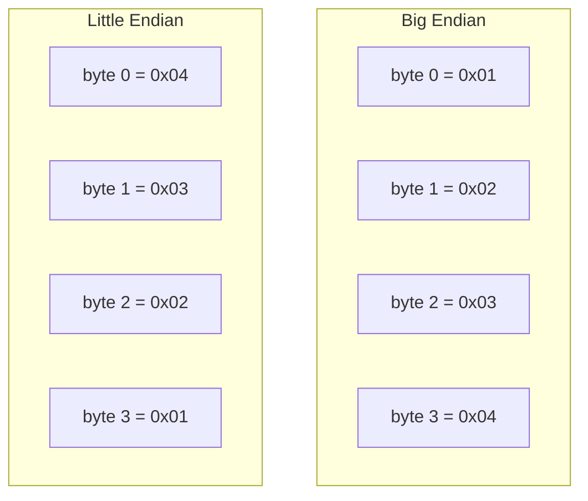
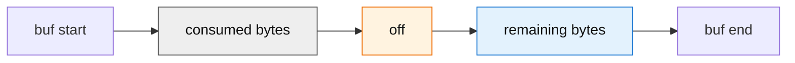
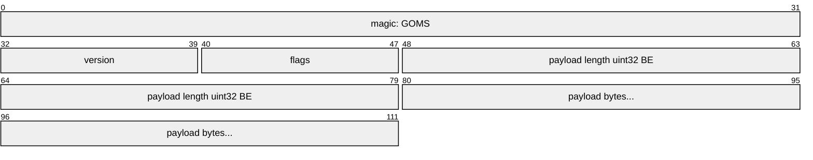
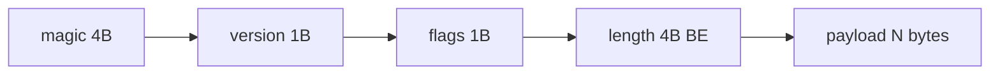
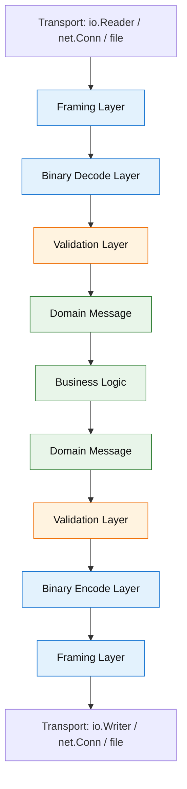

# learn-go-memory-systems-part-013.md

# Go Memory Systems — Part 013
# Byte-Level Programming: `byte`, `rune`, Endian, Binary Encoding, Unsafe-Free Parsing

> Series: `learn-go-memory-systems`  
> Part: `013`  
> Target Go Version: Go 1.26.x  
> Audience: Java software engineer moving into advanced Go memory/performance engineering  
> Status: Part 013 of 034

---

## 0. Posisi Part Ini Dalam Seri

Pada part sebelumnya kita sudah membangun mental model besar tentang:

1. representasi value,
2. pointer dan aliasing,
3. stack dan heap,
4. escape analysis,
5. allocator,
6. struct layout,
7. slice,
8. string,
9. interface,
10. boxing-like behavior.

Sekarang kita masuk ke lapisan yang lebih dekat dengan data mentah: **byte-level programming**.

Di Go, banyak sistem produksi akhirnya bergerak di sekitar `[]byte`:

- network payload,
- HTTP body,
- Kafka/RabbitMQ message,
- Redis value,
- database wire format,
- file format,
- log record,
- binary protocol,
- checksum,
- cryptographic input,
- compression block,
- serialization buffer,
- parser state machine.

Kalau engineer hanya memahami `[]byte` sebagai “array of bytes”, dia akan mudah menulis kode yang:

- banyak copy,
- banyak allocation,
- salah endian,
- salah decode UTF-8,
- salah batas frame,
- rentan panic karena bounds,
- membuat memory retention,
- terlalu cepat memakai `unsafe`,
- atau menulis parser binary yang tidak defensif.

Part ini membangun fondasi supaya kita bisa menulis parser dan encoder yang:

- benar,
- bounded,
- allocation-aware,
- aman tanpa `unsafe`,
- mudah diuji,
- mudah diobservasi,
- dan siap menjadi fondasi part berikutnya tentang bit-level programming, buffer, stream, zero-copy, network, file I/O, dan mmap.

---

## 1. Tujuan Pembelajaran

Setelah menyelesaikan part ini, kamu seharusnya mampu:

1. membedakan `byte`, `uint8`, `rune`, `int32`, string, dan `[]byte` secara benar;
2. memahami bahwa byte-level parsing tidak sama dengan text parsing;
3. mendesain binary format kecil dengan endian eksplisit;
4. membaca dan menulis integer ke/dari `[]byte` tanpa allocation;
5. menggunakan `encoding/binary` secara tepat;
6. menghindari conversion `[]byte` ↔ `string` yang tidak perlu;
7. mengenali boundary antara valid UTF-8 text dan arbitrary bytes;
8. membangun parser binary defensif berbasis cursor;
9. menghindari out-of-bounds panic dengan invariant yang jelas;
10. memahami bounds check elimination secara mental, tanpa memaksa micro-optimization prematur;
11. membuat API byte-level yang jelas ownership-nya;
12. menulis test untuk parser/encoder binary;
13. membandingkan pola Go dengan Java `byte[]`, `ByteBuffer`, `DataInputStream`, dan Netty `ByteBuf`.

---

## 2. Ringkasan Mental Model

Byte-level programming di Go berada di antara dua dunia:

```mermaid
flowchart LR
    A[External World] --> B[Bytes]
    B --> C[Parsing]
    C --> D[Typed Values]
    D --> E[Business Logic]
    E --> F[Encoding]
    F --> G[Bytes]
    G --> H[External World]

    A:::external
    H:::external
    B:::byte
    G:::byte
    C:::parse
    F:::parse
    D:::typed
    E:::typed

    classDef external fill:#f5f5f5,stroke:#555,color:#111
    classDef byte fill:#e3f2fd,stroke:#1976d2,color:#111
    classDef parse fill:#fff3e0,stroke:#ef6c00,color:#111
    classDef typed fill:#e8f5e9,stroke:#2e7d32,color:#111
```



External world hampir selalu mengirim **bytes**, bukan Go value.

Go value perlu dibangun melalui parsing:

- byte sequence menjadi integer,
- byte sequence menjadi string,
- byte sequence menjadi frame,
- byte sequence menjadi message,
- byte sequence menjadi checksum input,
- byte sequence menjadi typed struct.

Sebaliknya, saat keluar dari proses, typed value harus di-encode lagi menjadi bytes.

Kesalahan umum adalah memperlakukan bytes seolah-olah sudah punya semantic type.

Contoh:

```go
payload := []byte{0x00, 0x00, 0x01, 0x2c}
```

Apakah ini:

- integer 300 big-endian?
- integer 738263040 little-endian?
- empat byte raw?
- bagian dari UTF-8 string?
- compressed data?
- encrypted block?
- protobuf varint yang belum lengkap?

Jawabannya tidak ada di `[]byte`. Jawabannya ada di **protocol contract**.

---

## 3. `byte` di Go

Di Go:

```go
type byte = uint8
```

`byte` adalah alias untuk `uint8`.

Artinya:

```go
var b byte = 255
var u uint8 = b
```

Tidak ada conversion cost di sini karena `byte` bukan distinct defined type. Ia alias.

### 3.1 Kenapa Go Punya Nama `byte`?

Karena `uint8` menjelaskan representasi numerik, sedangkan `byte` menjelaskan peran data.

Gunakan `byte` ketika data adalah unit raw memory atau wire data:

```go
func parseFrame(buf []byte) error
func writeHeader(dst []byte, length uint32)
func checksum(payload []byte) uint32
```

Gunakan `uint8` ketika nilai benar-benar angka kecil:

```go
type Percent uint8

type RetryCount uint8
```

Perbedaannya bukan teknis runtime. Perbedaannya semantic readability.

---

## 4. `rune` di Go

Di Go:

```go
type rune = int32
```

`rune` adalah alias untuk `int32`, dan biasanya merepresentasikan Unicode code point.

Contoh:

```go
var r rune = '語'
fmt.Printf("%c %U\n", r, r)
```

Tetapi penting:

> `rune` bukan character visual.

Unicode code point belum tentu sama dengan grapheme cluster yang dilihat manusia sebagai satu karakter.

Contoh konseptual:

- `é` bisa satu code point,
- atau bisa `e` + combining accent.

Untuk part ini, kita cukup pegang invariant:

```text
byte  = raw 8-bit unit
rune  = Unicode code point representation
string = immutable byte sequence, often UTF-8 text by convention
[]byte = mutable byte sequence
```

---

## 5. String Bukan `[]rune`

Go string adalah sequence of bytes yang immutable.

String literal biasanya berisi UTF-8 valid, tapi string secara umum bisa berisi arbitrary bytes.

Contoh:

```go
s := "A語"
fmt.Println(len(s))        // byte length, not rune count
fmt.Println([]byte(s))     // raw UTF-8 bytes
fmt.Println([]rune(s))     // Unicode code points
```

`len(s)` menghitung byte, bukan jumlah karakter.

Ini sangat penting dalam protocol parsing.

Kalau protocol field menyatakan length = 10, pertanyaannya:

- 10 bytes?
- 10 runes?
- 10 UTF-16 code units?
- 10 grapheme clusters?

Untuk binary protocol, length hampir selalu harus berarti **bytes**, kecuali contract menyatakan lain.

---

## 6. `[]byte` Sebagai Data Plane Primitive

Dalam Go production systems, `[]byte` sering menjadi primitive utama untuk data plane.

Contoh:

```go
func HandleMessage(payload []byte) error
func Encode(dst []byte, msg Message) ([]byte, error)
func Decode(src []byte) (Message, error)
```

Kenapa `[]byte` begitu sentral?

Karena:

1. cocok dengan OS/network/file API;
2. mutable;
3. bisa dislice tanpa copy;
4. bisa di-append;
5. bisa dipakai sebagai scratch buffer;
6. bisa merepresentasikan arbitrary binary;
7. bisa menghindari string allocation;
8. bisa menjadi bridge antar layer.

Tetapi justru karena fleksibel, `[]byte` raw sangat mudah disalahgunakan.

### 6.1 Header Slice Kecil, Backing Array Bisa Besar

Dari part slice, kita sudah tahu:

```go
type sliceHeader struct {
    Data *T
    Len  int
    Cap  int
}
```

Ketika kita menulis:

```go
field := payload[10:20]
```

`field` hanya view ke backing array yang sama.

Tidak ada copy.

Ini bagus untuk parsing cepat, tetapi berbahaya kalau `field` disimpan lama.

```go
func ExtractID(payload []byte) []byte {
    return payload[10:20]
}
```

Kalau `payload` berukuran 50 MB, return 10 byte slice ini bisa membuat backing array 50 MB tetap live.

Untuk field kecil yang disimpan lama, copy adalah pilihan benar:

```go
func ExtractID(payload []byte) []byte {
    id := make([]byte, 10)
    copy(id, payload[10:20])
    return id
}
```

Top engineer tidak anti-copy. Top engineer tahu **copy mana yang membeli isolation dan lifetime correctness**.

---

## 7. Endianness

Endianness adalah urutan byte untuk merepresentasikan angka multi-byte.

Misal angka `0x01020304`.

Big-endian:

```text
01 02 03 04
```

Little-endian:

```text
04 03 02 01
```

Diagram:



### 7.1 Network Byte Order

Network byte order biasanya big-endian.

Tetapi jangan mengandalkan “biasanya”. Protocol harus eksplisit.

Contoh specification yang baik:

```text
Frame header:
- magic: 4 bytes ASCII "ACME"
- version: uint8
- flags: uint8
- length: uint32 big-endian
- checksum: uint32 big-endian
```

Specification yang buruk:

```text
length is an integer
```

Integer ukuran berapa? Signed atau unsigned? Endian apa? Overflow behavior bagaimana?

---

## 8. Manual Binary Encoding

Kita bisa membaca `uint32` big-endian secara manual:

```go
func readU32BE(b []byte) (uint32, bool) {
    if len(b) < 4 {
        return 0, false
    }
    v := uint32(b[0])<<24 |
        uint32(b[1])<<16 |
        uint32(b[2])<<8 |
        uint32(b[3])
    return v, true
}
```

Menulis `uint32` big-endian:

```go
func writeU32BE(dst []byte, v uint32) bool {
    if len(dst) < 4 {
        return false
    }
    dst[0] = byte(v >> 24)
    dst[1] = byte(v >> 16)
    dst[2] = byte(v >> 8)
    dst[3] = byte(v)
    return true
}
```

Pola manual seperti ini umum untuk hot path kecil, terutama ketika layout protocol sederhana.

Namun harus hati-hati:

- selalu cek length;
- selalu conversion sebelum shift;
- jangan shift signed integer tanpa sadar;
- jangan mengasumsikan native endian;
- jangan cast memory struct ke bytes dengan `unsafe` untuk protocol portable.

---

## 9. Mengapa `uint32(b[0]) << 24`, Bukan `b[0] << 24`?

`b[0]` bertipe `byte` alias `uint8`.

Kalau langsung shift, expression rules Go bisa mengejutkan bagi sebagian engineer, terutama bila constant dan untyped value terlibat.

Pola eksplisit ini paling jelas:

```go
uint32(b[0]) << 24
```

Artinya:

1. ubah byte ke `uint32`,
2. shift dalam domain 32-bit,
3. gabungkan dengan OR.

Pola ini juga membuat reviewer langsung tahu ukuran target integer.

---

## 10. `encoding/binary`

Go standard library menyediakan package `encoding/binary`.

Contoh decode:

```go
package main

import (
    "encoding/binary"
    "fmt"
)

func main() {
    b := []byte{0x00, 0x00, 0x01, 0x2c}
    n := binary.BigEndian.Uint32(b)
    fmt.Println(n) // 300
}
```

Encode:

```go
var buf [4]byte
binary.BigEndian.PutUint32(buf[:], 300)
```

### 10.1 Kapan Pakai `encoding/binary`?

Gunakan `encoding/binary` ketika:

- format fixed-width numeric;
- endian eksplisit;
- readability penting;
- risiko bug manual lebih besar daripada keuntungan micro-opt;
- kamu ingin API standar dan familiar.

Pola production yang baik:

```go
func readLength(header []byte) (uint32, error) {
    if len(header) < 4 {
        return 0, ErrShortHeader
    }
    return binary.BigEndian.Uint32(header[:4]), nil
}
```

### 10.2 Jangan Lupa Bounds

`binary.BigEndian.Uint32(b)` mengharuskan `len(b) >= 4`.

Kalau tidak, panic.

Jadi defensive parser tetap harus check length.

Buruk:

```go
func parse(b []byte) uint32 {
    return binary.BigEndian.Uint32(b[8:12])
}
```

Lebih baik:

```go
func parse(b []byte) (uint32, error) {
    if len(b) < 12 {
        return 0, ErrShortFrame
    }
    return binary.BigEndian.Uint32(b[8:12]), nil
}
```

---

## 11. Binary Format: Fixed Width vs Varint

Ada dua pendekatan umum untuk encoding angka:

1. fixed-width;
2. variable-length integer atau varint.

### 11.1 Fixed-Width

Contoh `uint32` selalu 4 byte.

Kelebihan:

- parsing sederhana;
- random access mudah;
- predictable;
- cocok untuk header;
- bounds check jelas.

Kekurangan:

- boros untuk angka kecil.

### 11.2 Varint

Varint menyimpan angka kecil dengan byte lebih sedikit.

Kelebihan:

- hemat space untuk angka kecil;
- umum di protobuf-style encoding.

Kekurangan:

- parsing lebih kompleks;
- length tidak langsung diketahui;
- butuh loop;
- harus punya batas maksimum byte;
- error handling lebih penting.

Go `encoding/binary` menyediakan fungsi varint seperti `PutUvarint`, `Uvarint`, `AppendUvarint`.

Contoh:

```go
buf := make([]byte, binary.MaxVarintLen64)
n := binary.PutUvarint(buf, 300)
encoded := buf[:n]

v, consumed := binary.Uvarint(encoded)
if consumed <= 0 {
    // 0 means buffer too small.
    // negative means overflow.
}
_ = v
```

### 11.3 Decision Framework

Gunakan fixed-width untuk:

- frame length,
- magic/version header,
- timestamp fixed layout,
- offsets,
- indexes,
- memory-mapped structures,
- places requiring random access.

Gunakan varint untuk:

- compact event stream,
- sparse numeric fields,
- protocol dengan banyak angka kecil,
- payload size lebih penting daripada decode simplicity.

---

## 12. Unsafe-Free Parsing

Unsafe-free parsing berarti kita tidak melakukan:

```go
(*Header)(unsafe.Pointer(&buf[0]))
```

untuk membaca bytes menjadi struct.

Kenapa?

Karena raw memory overlay rawan:

- alignment issue,
- padding issue,
- endian issue,
- portability issue,
- lifetime issue,
- Go pointer rule issue,
- compatibility issue antar architecture,
- silent bug ketika struct layout berubah.

### 12.1 Struct Overlay yang Berbahaya

Misal:

```go
type Header struct {
    Magic   [4]byte
    Version uint8
    Flags   uint8
    Length  uint32
}
```

Engineer tergoda melakukan:

```go
hdr := (*Header)(unsafe.Pointer(&buf[0]))
```

Masalah:

1. Apakah `Length` di file big-endian atau native endian?
2. Apakah struct punya padding antara `Flags` dan `Length`?
3. Apakah `buf[0]` aligned untuk `uint32` di semua architecture?
4. Apa yang terjadi kalau `len(buf)` kurang dari `unsafe.Sizeof(Header{})`?
5. Apakah format harus stabil jika field order berubah?

Untuk protocol portable, explicit parsing lebih benar:

```go
type Header struct {
    Version uint8
    Flags   uint8
    Length  uint32
}

func ParseHeader(buf []byte) (Header, error) {
    if len(buf) < 10 {
        return Header{}, ErrShortHeader
    }
    if string(buf[0:4]) != "ACME" {
        return Header{}, ErrBadMagic
    }
    return Header{
        Version: buf[4],
        Flags:   buf[5],
        Length:  binary.BigEndian.Uint32(buf[6:10]),
    }, nil
}
```

Namun perhatikan `string(buf[0:4]) != "ACME"` membuat conversion. Untuk hot path, bisa tanpa string:

```go
func hasMagicACME(buf []byte) bool {
    return len(buf) >= 4 &&
        buf[0] == 'A' &&
        buf[1] == 'C' &&
        buf[2] == 'M' &&
        buf[3] == 'E'
}
```

Atau:

```go
var magicACME = []byte{'A', 'C', 'M', 'E'}

func hasMagicACME(buf []byte) bool {
    return len(buf) >= 4 && bytes.Equal(buf[:4], magicACME)
}
```

---

## 13. Parser Berbasis Cursor

Untuk binary protocol yang lebih kompleks, lebih rapi memakai cursor.

Contoh minimal:

```go
type Cursor struct {
    buf []byte
    off int
}

func NewCursor(buf []byte) Cursor {
    return Cursor{buf: buf}
}

func (c *Cursor) Remaining() int {
    return len(c.buf) - c.off
}

func (c *Cursor) ReadByte() (byte, bool) {
    if c.Remaining() < 1 {
        return 0, false
    }
    b := c.buf[c.off]
    c.off++
    return b, true
}

func (c *Cursor) ReadU32BE() (uint32, bool) {
    if c.Remaining() < 4 {
        return 0, false
    }
    v := binary.BigEndian.Uint32(c.buf[c.off : c.off+4])
    c.off += 4
    return v, true
}

func (c *Cursor) ReadBytes(n int) ([]byte, bool) {
    if n < 0 || c.Remaining() < n {
        return nil, false
    }
    p := c.buf[c.off : c.off+n]
    c.off += n
    return p, true
}
```

### 13.1 Kenapa Cursor Membantu?

Cursor membuat invariant eksplisit:

```text
0 <= off <= len(buf)
remaining = len(buf) - off
setiap read harus membuktikan remaining cukup
setiap successful read menaikkan off
parser tidak boleh membaca melewati len(buf)
```

Diagram:



### 13.2 Parser Error Lebih Kaya

Daripada return `bool`, untuk production parser biasanya lebih baik return error domain:

```go
var (
    ErrShortFrame   = errors.New("short frame")
    ErrBadMagic     = errors.New("bad magic")
    ErrBadVersion   = errors.New("bad version")
    ErrLengthTooBig = errors.New("length too big")
)
```

Tetapi di hot path internal, `bool` bisa cukup jika caller sudah membungkus error.

---

## 14. Contoh Binary Frame Format

Kita desain format kecil:

```text
Frame:
- magic:      4 bytes ASCII "GOMS"
- version:    1 byte
- flags:      1 byte
- length:     uint32 big-endian, payload length in bytes
- payload:    length bytes
```

Total header = 10 byte.

```text
0       4       5      6          10
+-------+-------+------+----------+---------+
| GOMS  | ver   |flags | length   | payload |
|4 bytes|1 byte |1 byte|4 bytes BE|N bytes  |
+-------+-------+------+----------+---------+
```

Mermaid:



Kalau renderer Mermaid tidak support `packet-beta`, gunakan diagram biasa:



---

## 15. Implementasi Encoder Unsafe-Free

```go
package frame

import (
    "encoding/binary"
    "errors"
)

const (
    HeaderSize = 10
    MaxPayload = 16 << 20 // 16 MiB
)

var (
    ErrPayloadTooLarge = errors.New("payload too large")
)

type Frame struct {
    Version byte
    Flags   byte
    Payload []byte
}

func AppendFrame(dst []byte, f Frame) ([]byte, error) {
    if len(f.Payload) > MaxPayload {
        return nil, ErrPayloadTooLarge
    }

    start := len(dst)
    total := HeaderSize + len(f.Payload)

    dst = append(dst, make([]byte, total)...)
    out := dst[start:]

    out[0] = 'G'
    out[1] = 'O'
    out[2] = 'M'
    out[3] = 'S'
    out[4] = f.Version
    out[5] = f.Flags
    binary.BigEndian.PutUint32(out[6:10], uint32(len(f.Payload)))
    copy(out[10:], f.Payload)

    return dst, nil
}
```

### 15.1 Catatan Allocation

Baris ini:

```go
dst = append(dst, make([]byte, total)...)
```

mudah dibaca, tetapi membuat temporary zeroed slice.

Alternatif lebih allocation-aware:

```go
func AppendFrame(dst []byte, f Frame) ([]byte, error) {
    if len(f.Payload) > MaxPayload {
        return nil, ErrPayloadTooLarge
    }

    start := len(dst)
    total := HeaderSize + len(f.Payload)

    dst = append(dst, make([]byte, total)...)
    out := dst[start : start+total]

    // fill header + payload
    return dst, nil
}
```

Tetap ada `make` temporary slice header, tetapi underlying zero bytes menjadi bagian append. Untuk hot path, pola umum adalah memperbesar length dengan append of zero bytes atau helper:

```go
func grow(dst []byte, n int) ([]byte, []byte) {
    old := len(dst)
    dst = append(dst, make([]byte, n)...)
    return dst, dst[old:]
}
```

Atau jika ingin menghindari pola `make(... )...` berulang, kamu bisa append byte-by-byte untuk header lalu payload:

```go
func AppendFrameSimple(dst []byte, f Frame) ([]byte, error) {
    if len(f.Payload) > MaxPayload {
        return nil, ErrPayloadTooLarge
    }

    dst = append(dst, 'G', 'O', 'M', 'S', f.Version, f.Flags, 0, 0, 0, 0)
    binary.BigEndian.PutUint32(dst[len(dst)-4:], uint32(len(f.Payload)))
    dst = append(dst, f.Payload...)
    return dst, nil
}
```

Ini sering cukup baik dan readable.

---

## 16. Implementasi Decoder Unsafe-Free

```go
func ParseFrame(src []byte) (Frame, int, error) {
    if len(src) < HeaderSize {
        return Frame{}, 0, ErrShortFrame
    }

    if src[0] != 'G' || src[1] != 'O' || src[2] != 'M' || src[3] != 'S' {
        return Frame{}, 0, ErrBadMagic
    }

    version := src[4]
    if version != 1 {
        return Frame{}, 0, ErrBadVersion
    }

    flags := src[5]
    length := binary.BigEndian.Uint32(src[6:10])
    if length > MaxPayload {
        return Frame{}, 0, ErrLengthTooBig
    }

    total := HeaderSize + int(length)
    if len(src) < total {
        return Frame{}, 0, ErrShortFrame
    }

    return Frame{
        Version: version,
        Flags:   flags,
        Payload: src[HeaderSize:total],
    }, total, nil
}
```

### 16.1 Ownership Kontrak Decoder

Decoder di atas return `Payload` sebagai slice view ke `src`.

Itu berarti:

```text
Payload valid selama src valid dan tidak dimutasi secara tidak aman.
Jika caller menyimpan Frame lama, caller harus copy Payload.
```

Dokumentasikan API:

```go
// ParseFrame parses one frame from src.
// The returned Frame.Payload aliases src.
// If the caller needs to retain the payload after src is reused or released,
// it must clone the payload.
func ParseFrame(src []byte) (Frame, int, error)
```

Alternatif API dengan copy:

```go
func ParseFrameClone(src []byte) (Frame, int, error) {
    f, n, err := ParseFrame(src)
    if err != nil {
        return Frame{}, 0, err
    }
    f.Payload = append([]byte(nil), f.Payload...)
    return f, n, nil
}
```

Top-level design choice:

| API | Allocation | Safety | Cocok Untuk |
|---|---:|---|---|
| return view | rendah | butuh ownership discipline | hot path, streaming, short-lived processing |
| return clone | lebih tinggi | lebih aman | public API, cache, async processing |

---

## 17. Avoiding `string` Conversion in Byte Parsers

Buruk untuk hot path:

```go
if string(src[:4]) != "GOMS" {
    return ErrBadMagic
}
```

Conversion `[]byte` ke `string` biasanya copy.

Lebih baik:

```go
if len(src) < 4 || src[0] != 'G' || src[1] != 'O' || src[2] != 'M' || src[3] != 'S' {
    return ErrBadMagic
}
```

Atau:

```go
var magic = []byte("GOMS")

if len(src) < 4 || !bytes.Equal(src[:4], magic) {
    return ErrBadMagic
}
```

### 17.1 Kapan Conversion ke String Boleh?

Conversion boleh jika:

- data memang text;
- perlu dipakai sebagai map key string;
- perlu logging/error message;
- lifetime harus immutable isolated;
- cost kecil dan bukan hot path;
- correctness lebih penting daripada allocation.

Jangan mengubah semua conversion menjadi manual byte compare tanpa alasan.

---

## 18. UTF-8 Boundary

`[]byte` bisa arbitrary bytes.

Tidak semua `[]byte` valid UTF-8.

Untuk validasi:

```go
if !utf8.Valid(payload) {
    return ErrInvalidUTF8
}
```

Untuk decode rune:

```go
r, size := utf8.DecodeRune(payload)
if r == utf8.RuneError && size == 1 {
    // invalid encoding or actual RuneError encoded? Need context.
}
```

### 18.1 Binary Protocol Dengan Text Field

Misal payload field:

```text
nameLen: uint16 BE
name: nameLen bytes, must be UTF-8
```

Parser:

```go
func readName(c *Cursor) (string, error) {
    n, ok := c.ReadU16BE()
    if !ok {
        return "", ErrShortFrame
    }

    raw, ok := c.ReadBytes(int(n))
    if !ok {
        return "", ErrShortFrame
    }

    if !utf8.Valid(raw) {
        return "", ErrInvalidUTF8
    }

    return string(raw), nil
}
```

Di sini conversion ke string masuk akal karena semantic field adalah text dan kita ingin immutable string untuk business layer.

Kalau field hanya routing key sementara dalam parser, mungkin tetap `[]byte` lebih baik.

---

## 19. Signedness: `byte`, `int8`, `uint8`

Java `byte` adalah signed 8-bit: -128 sampai 127.

Go `byte` adalah alias `uint8`: 0 sampai 255.

Ini perbedaan besar untuk Java engineer.

Java:

```java
byte b = (byte) 255; // -1
int x = b;           // -1, sign-extended
int y = b & 0xff;    // 255
```

Go:

```go
var b byte = 255
var x int = int(b) // 255
```

Kalau kamu parsing binary protocol dari Java ke Go, banyak kode Java memakai `& 0xff` untuk menghindari sign extension. Di Go, `byte` sudah unsigned.

Namun kalau kamu memakai `int8`, sign matters:

```go
var x int8 = -1
fmt.Println(byte(x)) // 255
```

### 19.1 Design Rule

Untuk raw protocol byte, gunakan `byte`/`uint8`.

Untuk signed numeric field 8-bit, gunakan `int8` hanya jika protocol memang signed.

---

## 20. Bounds Check dan Parser Performance

Go melakukan bounds check untuk akses slice.

Contoh:

```go
func f(b []byte) byte {
    return b[10]
}
```

Compiler harus memastikan `len(b) > 10`, jika tidak panic.

### 20.1 Single Guard Pattern

Parser yang baik sering memakai single guard:

```go
func parseHeader(b []byte) (Header, error) {
    if len(b) < HeaderSize {
        return Header{}, ErrShortHeader
    }

    // Setelah guard, akses b[0]..b[9] aman secara logis.
    version := b[4]
    flags := b[5]
    length := binary.BigEndian.Uint32(b[6:10])

    return Header{Version: version, Flags: flags, Length: length}, nil
}
```

Compiler sering bisa mengeliminasi bounds check yang redundant ketika guard jelas. Namun jangan menulis kode aneh hanya demi BCE.

### 20.2 Cursor Pattern dan Bounds Check

Cursor method kecil dan inlinable bisa membantu, tetapi juga bisa menghambat optimasi jika terlalu abstrak.

Jangan berasumsi. Gunakan benchmark.

```bash
go test -bench=. -benchmem
```

Untuk melihat bounds check internal compiler, advanced engineer kadang memakai flags compiler, tetapi untuk production workflow, biasanya benchmark + pprof lebih berguna daripada mengejar setiap check.

---

## 21. Integer Overflow Dalam Parsing

Perhatikan:

```go
length := binary.BigEndian.Uint32(src[6:10])
total := HeaderSize + int(length)
```

Pada platform 64-bit, `int` besar. Pada 32-bit, conversion dari `uint32` besar ke `int` bisa overflow implementation-specific? Dalam Go, converting unsigned integer to signed integer of same width yields value congruent modulo 2^n then interpreted as signed. Hasil bisa negatif untuk nilai besar.

Untuk server modern 64-bit, ini jarang masalah, tapi parser library portable harus defensif.

Lebih baik:

```go
length := binary.BigEndian.Uint32(src[6:10])
if length > MaxPayload {
    return Frame{}, 0, ErrLengthTooBig
}

payloadLen := int(length)
total := HeaderSize + payloadLen
if total < HeaderSize { // defensive overflow check, usually redundant after MaxPayload
    return Frame{}, 0, ErrLengthTooBig
}
```

MaxPayload harus jauh di bawah `math.MaxInt`.

---

## 22. API Design: Source-Owned vs Caller-Owned Buffer

Byte-level API harus menjawab ownership.

### 22.1 Source-Owned View

```go
func Parse(src []byte) (Message, error)
```

Jika `Message` berisi slice view:

```go
type Message struct {
    Key   []byte
    Value []byte
}
```

Maka `Message` alias ke `src`.

Dokumentasi wajib:

```go
// The returned Message contains slices that alias src.
// The caller must not reuse or mutate src while Message is in use.
```

### 22.2 Clone Boundary

```go
func ParseClone(src []byte) (Message, error)
```

Ini mengalokasikan memory baru agar message independent.

### 22.3 Append Encoder

Pola Go idiomatik untuk encoder performan:

```go
func AppendMessage(dst []byte, msg Message) ([]byte, error)
```

Keuntungan:

- caller mengontrol buffer reuse;
- encoder tidak harus selalu allocate;
- cocok untuk pooling;
- composable.

Contoh:

```go
buf := make([]byte, 0, 4096)
buf, err = AppendMessage(buf, msg)
```

### 22.4 Writer Encoder

Untuk stream:

```go
func WriteMessage(w io.Writer, msg Message) error
```

Keuntungan:

- tidak perlu membangun seluruh output di memory;
- cocok untuk large payload;
- backpressure via writer;
- mudah digabung dengan network/file.

Trade-off:

- partial write handling perlu benar;
- error I/O bisa terjadi di tengah;
- testing butuh fake writer.

---

## 23. Byte-Level API Decision Matrix

| Kebutuhan | API Lebih Cocok | Alasannya |
|---|---|---|
| hot path encode kecil | `AppendX(dst, x)` | caller reuse buffer |
| encode ke network/file | `WriteX(w, x)` | streaming, no full buffer |
| parse short-lived | return view | minim allocation |
| parse public API | clone | safer ownership |
| parse huge input | cursor/stream parser | bounded memory |
| parse text field | validate UTF-8 then string | semantic boundary jelas |
| parse arbitrary binary | keep `[]byte` | jangan paksa string |
| stable portable format | explicit endian | tidak bergantung native layout |
| memory-mapped format | fixed-width offsets | random access mudah |

---

## 24. Java Comparison

### 24.1 Java `byte[]`

Java `byte[]`:

- signed byte element;
- heap object;
- bounds checked;
- mutable;
- copy via `Arrays.copyOf`, `System.arraycopy`;
- often wrapped by `ByteBuffer` or Netty `ByteBuf`.

Go `[]byte`:

- unsigned byte alias `uint8`;
- slice header points to backing array;
- header copied by value;
- may alias;
- append may reallocate;
- can be stack/heap depending escape.

### 24.2 Java `ByteBuffer`

Java `ByteBuffer` has:

- position,
- limit,
- capacity,
- endian setting,
- direct/off-heap option.

Go does not use a universal `ByteBuffer` abstraction in the same way.

Instead Go style often uses:

- `[]byte` + offset/cursor,
- `bytes.Buffer`,
- `bufio.Reader`,
- `io.Reader`,
- explicit encoding functions.

Go cursor pattern is conceptually close to ByteBuffer position/limit, but much simpler.

### 24.3 Netty `ByteBuf`

Netty `ByteBuf` has:

- readerIndex,
- writerIndex,
- reference counting,
- direct/heap buffer,
- pooled allocator,
- slicing,
- retained slice.

Go `[]byte` has no reference count. This is simpler but shifts ownership discipline to API design.

If you return a subslice, there is no retain/release protocol. The backing array stays alive if reachable.

---

## 25. Common Failure Modes

### 25.1 Endian Bug

```go
length := binary.LittleEndian.Uint32(header[6:10])
```

Padahal protocol big-endian.

Symptom:

- length terlalu besar;
- parser reject frame;
- memory allocation huge;
- OOM risk;
- intermittent bug if test data small symmetric values.

Test dengan value yang beda byte order:

```go
// 0x0000012c = 300 BE
// interpreted LE = 0x2c010000 = 738263040
```

### 25.2 Missing Length Bound

```go
payloadLen := binary.BigEndian.Uint32(header[6:10])
payload := make([]byte, payloadLen)
```

Bug:

- attacker sends huge length;
- service allocates huge memory;
- OOM or GC pressure.

Fix:

```go
if payloadLen > MaxPayload {
    return ErrLengthTooBig
}
```

### 25.3 Storing Subslice of Huge Buffer

```go
cache[id] = payload[10:20]
```

Bug:

- cache stores 10 byte view;
- entire payload backing array retained.

Fix:

```go
cache[id] = append([]byte(nil), payload[10:20]...)
```

### 25.4 Text Conversion in Hot Loop

```go
for _, rec := range records {
    if strings.HasPrefix(string(rec.Raw), "ERR") {
        count++
    }
}
```

Fix:

```go
prefix := []byte("ERR")
for _, rec := range records {
    if bytes.HasPrefix(rec.Raw, prefix) {
        count++
    }
}
```

### 25.5 Treating Arbitrary Bytes as UTF-8

```go
name := string(raw)
```

If raw is arbitrary binary, logs may become unreadable, invalid text, or leak secrets.

Fix:

- validate UTF-8 for text fields;
- hex/base64 encode binary fields for logs;
- truncate logs.

### 25.6 Struct Overlay Protocol

Using `unsafe.Pointer` to cast bytes to struct.

Fix:

- explicit parse;
- explicit endian;
- explicit length;
- explicit validation.

---

## 26. Observability for Byte-Level Code

Byte-level bugs often show up as:

- high allocation rate,
- high `alloc_space`,
- high GC CPU,
- unexpected RSS,
- OOM on malformed payload,
- many parse errors,
- high tail latency,
- goroutine leak in stream parser,
- retained heap due to subslices.

Useful tools:

```bash
go test -bench=. -benchmem
```

```bash
go test -run=NONE -bench=BenchmarkParse -benchmem -cpuprofile cpu.out -memprofile mem.out
```

```bash
go tool pprof -alloc_space mem.out
```

```bash
go tool pprof -inuse_space mem.out
```

Interpretation:

| Symptom | Likely Cause |
|---|---|
| high alloc/op | conversion, append reallocation, clone, interface/logging |
| high alloc_space but low inuse | allocation churn |
| high inuse_space | retention, cache, subslice, goroutine leak |
| panic index out of range | missing length guard |
| OOM on bad input | missing max length |
| wrong parsed values | endian/signedness/offset bug |

---

## 27. Testing Byte-Level Code

### 27.1 Golden Test

```go
func TestParseFrame(t *testing.T) {
    src := []byte{
        'G', 'O', 'M', 'S',
        1,
        0,
        0, 0, 0, 3,
        'a', 'b', 'c',
    }

    f, n, err := ParseFrame(src)
    if err != nil {
        t.Fatal(err)
    }
    if n != len(src) {
        t.Fatalf("n=%d want %d", n, len(src))
    }
    if string(f.Payload) != "abc" {
        t.Fatalf("payload=%q", f.Payload)
    }
}
```

### 27.2 Short Input Test

```go
func TestParseFrameShortInputs(t *testing.T) {
    valid := []byte{
        'G', 'O', 'M', 'S', 1, 0, 0, 0, 0, 0,
    }

    for i := 0; i < len(valid); i++ {
        _, _, err := ParseFrame(valid[:i])
        if !errors.Is(err, ErrShortFrame) {
            t.Fatalf("len=%d err=%v", i, err)
        }
    }
}
```

This test prevents out-of-bounds panic.

### 27.3 Endian Test

```go
func TestLengthIsBigEndian(t *testing.T) {
    src := []byte{
        'G', 'O', 'M', 'S',
        1,
        0,
        0x00, 0x00, 0x01, 0x2c,
    }
    src = append(src, make([]byte, 300)...)

    f, _, err := ParseFrame(src)
    if err != nil {
        t.Fatal(err)
    }
    if len(f.Payload) != 300 {
        t.Fatalf("len=%d want 300", len(f.Payload))
    }
}
```

### 27.4 Fuzz Test

Go fuzzing can help parser robustness:

```go
func FuzzParseFrame(f *testing.F) {
    f.Add([]byte{'G', 'O', 'M', 'S', 1, 0, 0, 0, 0, 0})

    f.Fuzz(func(t *testing.T, data []byte) {
        _, _, _ = ParseFrame(data)
    })
}
```

Invariant: parser may return error, but must not panic.

---

## 28. Benchmarking

```go
func BenchmarkParseFrame(b *testing.B) {
    src := []byte{
        'G', 'O', 'M', 'S',
        1,
        0,
        0, 0, 0, 3,
        'a', 'b', 'c',
    }

    b.ReportAllocs()
    for b.Loop() {
        _, _, err := ParseFrame(src)
        if err != nil {
            b.Fatal(err)
        }
    }
}
```

Expected ideal for view parser:

```text
0 allocs/op
```

Clone parser will allocate for payload copy.

```go
func BenchmarkParseFrameClone(b *testing.B) {
    src := []byte{
        'G', 'O', 'M', 'S', 1, 0, 0, 0, 0, 3, 'a', 'b', 'c',
    }

    b.ReportAllocs()
    for b.Loop() {
        _, _, err := ParseFrameClone(src)
        if err != nil {
            b.Fatal(err)
        }
    }
}
```

Allocation in clone parser is not necessarily bad. It is a safety/correctness trade-off.

---

## 29. Mini Lab: Build a Safe Binary Codec

Create package:

```text
internal/framecodec
```

Implement:

```go
type Frame struct {
    Version byte
    Flags   byte
    Payload []byte
}

func AppendFrame(dst []byte, f Frame) ([]byte, error)
func ParseFrame(src []byte) (Frame, int, error)
func ParseFrameClone(src []byte) (Frame, int, error)
```

Requirements:

1. magic must be `GOMS`;
2. version must be `1`;
3. payload max 16 MiB;
4. length is `uint32` big-endian;
5. parser must never panic on arbitrary input;
6. view parser must allocate 0 times per op for valid small frame;
7. clone parser must not retain source buffer;
8. tests must cover short input from length 0 to header length - 1;
9. fuzz test must not find panic;
10. benchmark must report allocations.

Bonus:

- add checksum field;
- add flags validation;
- add UTF-8 metadata field;
- add streaming reader that reads one frame from `io.Reader` with max size.

---

## 30. Production Review Checklist

Use this checklist for byte-level code reviews.

### 30.1 Protocol Contract

- Is endian explicit?
- Are field sizes explicit?
- Are length fields bytes, not characters?
- Are signedness rules explicit?
- Is max length defined?
- Is versioning defined?
- Is unknown flags behavior defined?

### 30.2 Parser Safety

- Does every fixed offset have length guard?
- Does parser reject short frame without panic?
- Does parser reject huge length before allocation?
- Does parser handle overflow?
- Does parser distinguish invalid magic/version/length?
- Does parser avoid unsafe struct overlay?

### 30.3 Memory Ownership

- Do returned slices alias input?
- Is aliasing documented?
- Does long-lived storage clone small fields?
- Is buffer reuse safe?
- Could a small subslice retain a huge backing array?

### 30.4 Allocation

- Are string conversions necessary?
- Is `fmt` used in hot path?
- Is `[]byte` converted to `[]any`?
- Is encoder append-based?
- Are buffers pre-sized where appropriate?

### 30.5 Text Handling

- Are text fields validated as UTF-8?
- Are byte lengths not confused with rune counts?
- Are binary fields logged as hex/base64/truncated?

### 30.6 Testing

- Are endian tests present?
- Are short input tests present?
- Are max length tests present?
- Are fuzz tests present?
- Are allocation benchmarks present?

---

## 31. Anti-Pattern Catalog

### Anti-Pattern 1: “Native Struct Is Wire Format”

```go
// Bad idea for portable protocol.
type Header struct {
    Magic [4]byte
    Len   uint32
}
```

Then casting bytes to `Header` with unsafe.

Better:

```go
len := binary.BigEndian.Uint32(buf[4:8])
```

### Anti-Pattern 2: “Everything Is String”

```go
func Parse(payload []byte) string {
    return string(payload)
}
```

Better:

- keep bytes for binary;
- validate UTF-8 for text;
- convert only at semantic boundary.

### Anti-Pattern 3: “No Max Frame Size”

```go
n := binary.BigEndian.Uint32(header)
buf := make([]byte, n)
```

Better:

```go
if n > MaxFrameSize {
    return ErrTooLarge
}
```

### Anti-Pattern 4: “Return View Without Contract”

```go
func Parse(b []byte) Message
```

Message contains slices aliasing b, but docs do not say so.

Better:

```go
// Returned fields alias b.
func ParseView(b []byte) Message

// Returned fields are cloned.
func ParseClone(b []byte) Message
```

### Anti-Pattern 5: “Premature Unsafe Zero-Copy”

Using unsafe string/slice conversion before proving copy is bottleneck.

Better:

1. benchmark;
2. profile;
3. optimize safe path;
4. isolate unsafe if still needed;
5. document lifetime contract.

---

## 32. Mental Model: Bytes Have No Meaning Until Contract Gives Meaning

The same bytes can mean different things:

```text
00 00 01 2c
```

Possible meanings:

| Interpretation | Value |
|---|---:|
| uint32 big-endian | 300 |
| uint32 little-endian | 738263040 |
| signed int32 big-endian | 300 |
| four raw bytes | `[0 0 1 44]` |
| UTF-8 text | mostly control chars |

Therefore, byte-level programming is not about memorizing APIs. It is about preserving protocol invariants.

---

## 33. Layering Model for Production Code

A clean design separates layers:



Do not let domain logic directly depend on raw offsets.

Bad:

```go
func Handle(raw []byte) error {
    userID := binary.BigEndian.Uint64(raw[13:21])
    // business logic here
}
```

Better:

```go
msg, err := DecodeMessage(raw)
if err != nil {
    return err
}
return HandleMessage(msg)
```

Hot path does not require messy architecture. You can have clean layers and still avoid allocation by returning views with clear ownership.

---

## 34. Practical Heuristics

1. Treat every external `[]byte` as untrusted.
2. Check length before fixed offset access.
3. Define maximum payload size before allocation.
4. Make endian explicit at every numeric boundary.
5. Avoid string conversion unless semantic text boundary is reached.
6. Validate UTF-8 before accepting text from arbitrary bytes.
7. Return views only with explicit ownership contract.
8. Clone when retaining small data from large buffers.
9. Prefer `AppendX(dst, value)` for allocation-aware encoders.
10. Prefer `io.Reader`/`io.Writer` for large streaming data.
11. Do not use unsafe struct overlay for portable wire formats.
12. Benchmark before micro-optimizing manual bit/byte code.
13. Fuzz parsers that accept external input.
14. Make test values catch endian mistakes.
15. Remember Java byte signedness difference.

---

## 35. What This Part Deliberately Does Not Cover Yet

This part intentionally does not go deep into:

- bit flags,
- bitsets,
- packed booleans,
- atomic bit operations,
- buffer pooling,
- stream backpressure,
- zero-copy kernel paths,
- mmap,
- unsafe string/slice conversion,
- off-heap memory.

Those are covered in later parts.

The discipline from this part is required before those topics become safe.

---

## 36. Key Takeaways

1. `byte` is alias `uint8`; Go byte is unsigned, unlike Java byte.
2. `rune` is alias `int32` and represents Unicode code point, not necessarily visual character.
3. String length is byte length, not character count.
4. `[]byte` is the core data-plane primitive in Go systems.
5. Bytes have no meaning without protocol contract.
6. Endian must be explicit.
7. `encoding/binary` is the standard safe tool for fixed-width binary numbers and varints.
8. Unsafe struct overlay is usually wrong for portable protocol parsing.
9. Parser must guard length before reading fixed offsets.
10. Maximum payload size is a security and reliability requirement.
11. Returning subslices is zero-copy but creates aliasing and retention contracts.
12. Conversion between `[]byte` and `string` is a semantic boundary and often allocation boundary.
13. UTF-8 validation is required when arbitrary bytes become text.
14. Good byte-level code is not clever; it is explicit, bounded, testable, and allocation-aware.

---

## 37. Suggested Exercises

### Exercise 1: Implement Fixed Header Parser

Build parser for:

```text
magic: 4 bytes "ABCD"
version: uint8
kind: uint8
sequence: uint64 big-endian
payloadLen: uint32 big-endian
```

Requirements:

- no panic for arbitrary input;
- reject version != 1;
- max payload 1 MiB;
- return payload view;
- provide clone variant.

### Exercise 2: Endian Failure Test

Create test where length is `0x0000012c` and assert parser reads 300, not 738263040.

### Exercise 3: UTF-8 Field

Add text field:

```text
nameLen: uint16 big-endian
name: nameLen bytes UTF-8
```

Validate UTF-8 before converting to string.

### Exercise 4: Allocation Benchmark

Benchmark:

1. `bytes.Equal(buf[:4], []byte("ABCD"))`
2. `string(buf[:4]) == "ABCD"`
3. manual compare

Use `-benchmem` and explain allocation behavior.

### Exercise 5: Retention Bug

Create a 64 MiB buffer. Return a 16-byte subslice and store it globally. Use heap profile to observe retention. Then fix with clone.

---

## 38. References

- Go Language Specification — predeclared types, string, slice, numeric operations, conversions: https://go.dev/ref/spec
- Package `builtin` — documentation for predeclared identifiers including `byte` and `rune`: https://pkg.go.dev/builtin
- Package `encoding/binary` — fixed-size values, byte order, varint helpers, append/decode/encode APIs: https://pkg.go.dev/encoding/binary
- Package `unicode/utf8` — UTF-8 validation and rune decoding helpers: https://pkg.go.dev/unicode/utf8
- Package `bytes` — byte slice operations such as `Equal`, `HasPrefix`, `Clone`: https://pkg.go.dev/bytes
- Package `math/bits` — bit counting/manipulation functions for unsigned integer types: https://pkg.go.dev/math/bits
- Go Diagnostics — profiling, tracing, runtime diagnostics: https://go.dev/doc/diagnostics
- Go 1.26 Release Notes — target version context for this series: https://go.dev/doc/go1.26

---

## 39. Part 013 Completion Marker

You have completed:

```text
learn-go-memory-systems-part-013.md
```

Current series progress:

```text
learn-go-memory-systems-part-000.md
learn-go-memory-systems-part-001.md
learn-go-memory-systems-part-002.md
learn-go-memory-systems-part-003.md
learn-go-memory-systems-part-004.md
learn-go-memory-systems-part-005.md
learn-go-memory-systems-part-006.md
learn-go-memory-systems-part-007.md
learn-go-memory-systems-part-008.md
learn-go-memory-systems-part-009.md
learn-go-memory-systems-part-010.md
learn-go-memory-systems-part-011.md
learn-go-memory-systems-part-012.md
learn-go-memory-systems-part-013.md
```

Next part:

```text
learn-go-memory-systems-part-014.md
```

Topic:

```text
Bit-level programming: masks, flags, bitsets, packed state, protocol fields
```


<!-- NAVIGATION_FOOTER -->
<div class="page-nav">
<a href="./learn-go-memory-systems-part-012.md">⬅️ Go Memory Systems — Part 012</a>
<a href="./index.md">📚 Kategori</a>
<a href="../../index.md">🏠 Home</a>
<a href="./learn-go-memory-systems-part-014.md">Go Memory Systems — Part 014: Bit-Level Programming ➡️</a>
</div>
