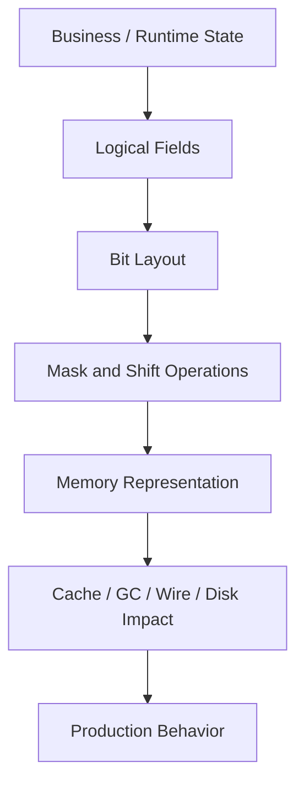
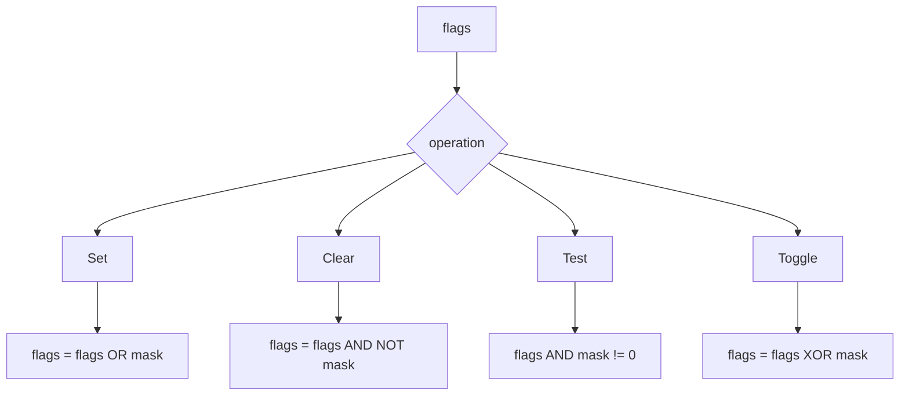
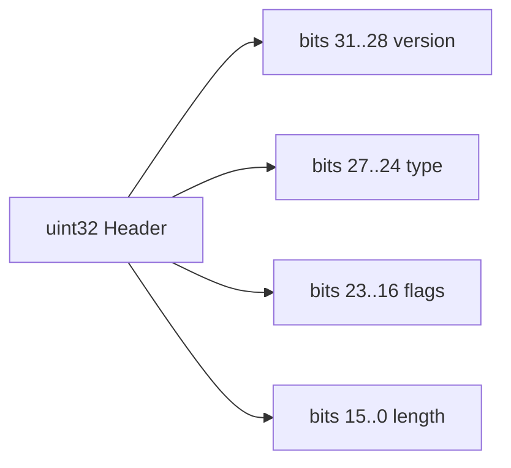
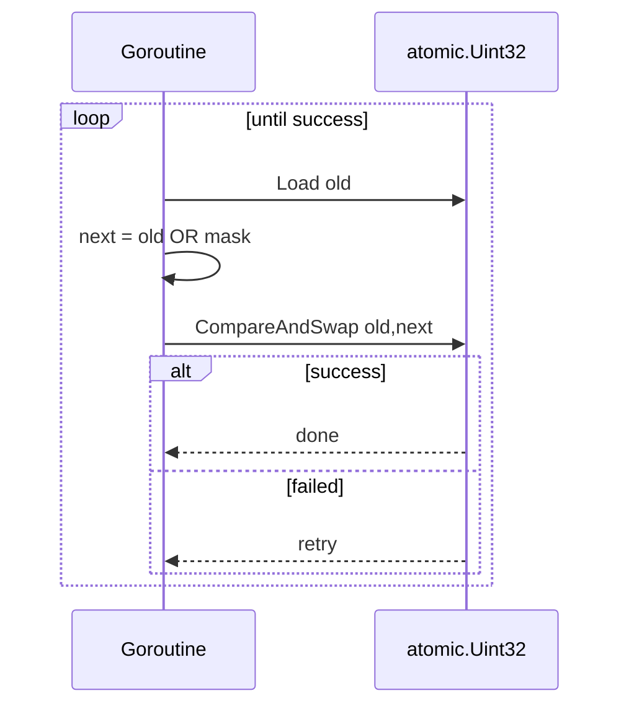

# learn-go-memory-systems-part-014.md

# Go Memory Systems — Part 014: Bit-Level Programming

> Series: `learn-go-memory-systems`  
> Part: `014`  
> Topic: `Bit-level programming: masks, flags, bitsets, packed state, protocol fields`  
> Target Go Version: `Go 1.26.x`  
> Audience: Java software engineer moving toward expert-level Go systems engineering

---

## 0. Posisi Part Ini Dalam Series

Pada part sebelumnya kita membahas byte-level programming: `byte`, `rune`, endian, binary encoding, dan parsing aman tanpa `unsafe`. Part ini turun satu level lagi: bukan lagi byte sebagai unit utama, tetapi **bit** sebagai unit informasi.

Bit-level programming sering terlihat seperti skill kecil: `&`, `|`, `^`, `<<`, `>>`. Pada engineering level tinggi, bit-level design jauh lebih besar dari sekadar operator:

- representasi state yang compact,
- flags dalam protocol,
- permission mask,
- bitmap/bitset,
- packed counters,
- wire format compatibility,
- atomic state transition,
- cache-friendly data layout,
- branch reduction,
- memory budget reduction,
- encoding/decoding deterministic,
- failure modeling pada overflow, sign, dan concurrency.

Di Java, banyak engineer jarang menyentuh bit-level kecuali saat memakai `EnumSet`, `BitSet`, protobuf flags, network protocol, cryptography, compression, atau low-level performance code. Di Go, karena bahasa dan standard library lebih dekat ke systems programming, bit-level code lebih sering muncul dalam:

- networking,
- storage engine,
- binary protocol,
- bitmap index,
- bloom filter,
- permission model,
- distributed systems metadata,
- serialization,
- observability tags,
- compression,
- hashing,
- lock-free/atomic state,
- embedded-like code,
- kernel/syscall binding,
- high-performance queue/ring buffer.

Tujuan part ini bukan membuat kode terlihat “low-level”, tetapi membuat Anda bisa memutuskan kapan bit-level representation memang tepat, kapan terlalu kompleks, dan bagaimana mendesainnya agar tetap defensible secara production.

---

## 1. Learning Objectives

Setelah menyelesaikan part ini, Anda harus bisa:

1. Membaca dan menulis bitwise expression Go dengan benar.
2. Membedakan signed/unsigned behavior dalam operasi bit.
3. Mendesain flag mask yang stabil dan backward-compatible.
4. Mendesain bitset/bitmap sederhana yang memory-efficient.
5. Mengekstrak protocol field dari packed integer tanpa bug endian/sign.
6. Menggunakan `math/bits` untuk operasi bit yang portable dan sering dioptimasi compiler.
7. Memahami kapan bit packing meningkatkan performance dan kapan merusak maintainability.
8. Menghindari bug umum: shift overflow, signed shift surprise, magic constants, non-atomic update, dan data race.
9. Membuat API bit-level yang tetap readable.
10. Mengevaluasi bit-level design dari perspektif memory, GC, cache, concurrency, dan observability.

---

## 2. Core Mental Model

Bit-level programming adalah tentang **mendesain layout informasi**.

Operator hanyalah alat. Pertanyaan yang lebih penting:

- bit mana berarti apa?
- siapa pemilik layout?
- apakah layout ini bagian dari public contract?
- apakah layout harus backward-compatible?
- apakah field punya max value?
- apa yang terjadi jika field overflow?
- apakah update-nya atomic?
- apakah bit-level compression mengurangi memory cukup signifikan?
- apakah debugging masih mungkin?
- apakah desain ini masih aman jika dipakai lintas architecture?

Diagram mental:



Engineer pemula biasanya mulai dari `x |= flag`.

Engineer senior mulai dari:

> “Apakah state ini harus direpresentasikan sebagai bit-level layout, dan apa invariant-nya?”

---

## 3. Bit Numbering

Satu byte memiliki 8 bit.

Biasanya kita menomori bit dari kanan ke kiri:

```text
bit index:  7 6 5 4 3 2 1 0
value:    128 64 32 16 8 4 2 1
binary:     1 1 1 1 1 1 1 1
```

Bit paling kanan adalah **least significant bit** atau LSB. Bit paling kiri dalam sebuah byte adalah **most significant bit** atau MSB.

Contoh:

```text
0000_0101 = 5
          = bit 2 + bit 0
          = 4 + 1
```

Dalam Go, integer literal bisa ditulis dengan binary prefix:

```go
const x = 0b0000_0101
```

Underscore membantu readability dan tidak mengubah value.

---

## 4. Operators Go Untuk Bit-Level Code

Go menyediakan operator bitwise berikut:

| Operator | Meaning | Example |
|---|---|---|
| `&` | bitwise AND | `a & b` |
| `|` | bitwise OR | `a | b` |
| `^` | bitwise XOR / unary complement | `a ^ b`, `^a` |
| `&^` | bit clear / AND NOT | `a &^ b` |
| `<<` | left shift | `a << n` |
| `>>` | right shift | `a >> n` |

Catatan penting: `^` punya dua bentuk:

```go
x := a ^ b // XOR
z := ^a    // bitwise complement
```

Go juga punya operator unik `&^` yang sering membuat kode lebih jelas daripada `a & ^mask`.

```go
x = x &^ mask // clear bits contained in mask
```

---

## 5. Truth Table

Bitwise operation bekerja per bit.

### AND

```text
0 & 0 = 0
0 & 1 = 0
1 & 0 = 0
1 & 1 = 1
```

AND dipakai untuk **test** atau **extract** bit.

```go
if flags&FlagEnabled != 0 {
    // enabled
}
```

### OR

```text
0 | 0 = 0
0 | 1 = 1
1 | 0 = 1
1 | 1 = 1
```

OR dipakai untuk **set** bit.

```go
flags |= FlagEnabled
```

### XOR

```text
0 ^ 0 = 0
0 ^ 1 = 1
1 ^ 0 = 1
1 ^ 1 = 0
```

XOR sering dipakai untuk toggle, parity, checksum-ish logic, dan difference mask.

```go
flags ^= FlagEnabled // toggle
```

### AND NOT / CLEAR

```go
flags &^= FlagEnabled
```

Artinya: hapus bit yang ada pada mask.

---

## 6. Why Unsigned Types Are Usually Better For Bit Code

Untuk bit-level code, gunakan unsigned integer kecuali ada alasan kuat memakai signed.

Common choices:

```go
uint8
uint16
uint32
uint64
uint
```

Alasan:

1. Bit-level code biasanya merepresentasikan pattern, bukan angka negatif.
2. Right shift pada unsigned lebih mudah dipahami sebagai logical shift.
3. Overflow unsigned lebih sering sesuai dengan arithmetic modulo yang diinginkan pada bit operations.
4. Interaksi dengan `math/bits` lebih natural.
5. Sign extension bug lebih mudah dihindari.

Contoh buruk:

```go
var x int8 = -1
fmt.Printf("%08b\n", uint8(x)) // 11111111
```

Ini valid, tetapi semantik “-1” dan “all bits set” tercampur. Dalam protocol atau packed state, lebih baik explicit:

```go
const AllFlags uint8 = 0xFF
```

---

## 7. Left Shift

Left shift memindahkan bit ke kiri dan mengisi bit kanan dengan nol.

```go
x := uint8(1) << 3 // 0000_1000 = 8
```

Mental model:

```text
0000_0001 << 3
0000_1000
```

Untuk unsigned integer, left shift mirip perkalian dengan `2^n`, selama tidak kehilangan bit penting.

```go
x << n == x * 2^n // conceptually, if no overflow/truncation surprise
```

Contoh membuat flag:

```go
const (
    FlagRead uint32 = 1 << iota
    FlagWrite
    FlagDelete
    FlagAdmin
)
```

Hasil:

```text
FlagRead   = 0001
FlagWrite  = 0010
FlagDelete = 0100
FlagAdmin  = 1000
```

---

## 8. Right Shift

Right shift memindahkan bit ke kanan.

```go
x := uint8(0b1000_0000)
y := x >> 7 // 1
```

Pada unsigned integer, right shift mengisi bit kiri dengan nol.

```text
1000_0000 >> 7
0000_0001
```

Untuk extraction field:

```go
version := (header >> 28) & 0xF
```

Artinya:

1. geser field ke posisi paling kanan,
2. mask width field.

---

## 9. Masks

Mask adalah bit pattern yang dipakai untuk memilih, mengaktifkan, mematikan, atau membatasi bagian tertentu dari integer.

Contoh mask 4 bit:

```go
const LowNibble uint8 = 0x0F // 0000_1111
```

Mengambil 4 bit bawah:

```go
low := x & LowNibble
```

Mengambil 4 bit atas:

```go
high := (x >> 4) & LowNibble
```

Diagram:

```text
x:       1011_0110
mask:    0000_1111
x&mask:  0000_0110
```

---

## 10. Basic Flag Operations

Misalkan:

```go
package flags

type Permission uint32

const (
    PermRead Permission = 1 << iota
    PermWrite
    PermDelete
    PermApprove
    PermAdmin
)
```

Set flag:

```go
p |= PermRead
```

Clear flag:

```go
p &^= PermDelete
```

Toggle flag:

```go
p ^= PermAdmin
```

Check flag:

```go
if p&PermWrite != 0 {
    // allowed
}
```

Check all required flags:

```go
func HasAll(p Permission, required Permission) bool {
    return p&required == required
}
```

Check any flag:

```go
func HasAny(p Permission, candidates Permission) bool {
    return p&candidates != 0
}
```

Remove flags:

```go
func Without(p Permission, remove Permission) Permission {
    return p &^ remove
}
```

---

## 11. Flags As API: Avoid Raw `uint32` Everywhere

Bad API:

```go
func Open(mode uint32) error
```

Better API:

```go
type OpenFlag uint32

const (
    OpenRead OpenFlag = 1 << iota
    OpenWrite
    OpenCreate
    OpenTruncate
)

func Open(path string, flags OpenFlag) error
```

Why better:

- type communicates semantic domain,
- prevents accidental mixing with unrelated masks,
- creates place for methods,
- improves documentation,
- improves code review.

Add methods:

```go
func (f OpenFlag) Has(flag OpenFlag) bool {
    return f&flag != 0
}

func (f OpenFlag) HasAll(flags OpenFlag) bool {
    return f&flags == flags
}

func (f OpenFlag) With(flags OpenFlag) OpenFlag {
    return f | flags
}

func (f OpenFlag) Without(flags OpenFlag) OpenFlag {
    return f &^ flags
}
```

---

## 12. Do Not Use Boolean Soup When Flags Are Stable And Compact

Consider this struct:

```go
type Record struct {
    Active      bool
    Deleted     bool
    Compressed  bool
    Encrypted   bool
    Indexed     bool
    Replicated  bool
    Tombstoned  bool
    Verified    bool
}
```

This is readable. But for millions of records, booleans may consume more memory than the logical one-bit idea suggests because of alignment and representation.

Packed alternative:

```go
type RecordFlags uint16

const (
    RecordActive RecordFlags = 1 << iota
    RecordDeleted
    RecordCompressed
    RecordEncrypted
    RecordIndexed
    RecordReplicated
    RecordTombstoned
    RecordVerified
)

type Record struct {
    Flags RecordFlags
}
```

Trade-off:

| Design | Pros | Cons |
|---|---|---|
| many bool fields | readable, easy debug | larger, harder to bulk operate |
| bit flags | compact, fast set algebra | less explicit, needs methods/docs |

Rule:

> Use bool fields for normal business readability. Use bit flags when compactness, bulk operations, or wire/disk format justify it.

---

## 13. Bit-Level Code Is A Contract

A flag layout often becomes public contract if it appears in:

- file format,
- network protocol,
- database column,
- cache key,
- authorization token,
- audit log,
- cross-service message,
- metrics label encoding,
- storage metadata.

Once externalized, changing bit positions can be a breaking change.

Bad:

```go
const (
    FlagA uint32 = 1 << iota
    FlagB
    FlagC
)
```

Later inserting a new flag between A and B:

```go
const (
    FlagA uint32 = 1 << iota
    FlagNew
    FlagB // changed value!
    FlagC // changed value!
)
```

For public format, prefer explicit bit positions:

```go
const (
    FlagA uint32 = 1 << 0
    FlagB uint32 = 1 << 1
    FlagC uint32 = 1 << 2
    FlagNew uint32 = 1 << 8 // reserved extension area
)
```

---

## 14. Reserved Bits

In protocol design, reserve bits intentionally.

Example 16-bit header flags:

```text
15 14 13 12 | 11 10 9 8 | 7 6 5 4 | 3 2 1 0
 version    | reserved  | features | status
```

In Go:

```go
const (
    statusMask   uint16 = 0x000F
    featureMask  uint16 = 0x00F0
    reservedMask uint16 = 0x0F00
    versionMask  uint16 = 0xF000
)
```

Validation:

```go
func validateHeaderFlags(x uint16) error {
    if x&reservedMask != 0 {
        return fmt.Errorf("reserved bits must be zero: 0x%04x", x&reservedMask)
    }
    return nil
}
```

Why reserved bits matter:

- forward compatibility,
- strict parser safety,
- downgrade prevention,
- easier evolution,
- fewer ambiguous states.

---

## 15. Packed Fields

A packed field stores multiple logical values inside one integer.

Example: 32-bit header:

```text
31..28  version     4 bits
27..24  msg type    4 bits
23..16  flags       8 bits
15..0   length      16 bits
```

Layout diagram:

```text
+---------+---------+----------+----------------+
| version | type    | flags    | length         |
| 4 bits  | 4 bits  | 8 bits   | 16 bits        |
+---------+---------+----------+----------------+
31       28 27     24 23      16 15             0
```

Implementation:

```go
package header

import "fmt"

type Header uint32

const (
    lengthBits  = 16
    flagsBits   = 8
    typeBits    = 4
    versionBits = 4

    lengthShift  = 0
    flagsShift   = lengthShift + lengthBits
    typeShift    = flagsShift + flagsBits
    versionShift = typeShift + typeBits

    lengthMask  Header = (1 << lengthBits) - 1
    flagsMask   Header = (1 << flagsBits) - 1
    typeMask    Header = (1 << typeBits) - 1
    versionMask Header = (1 << versionBits) - 1
)

func Pack(version, typ, flags uint8, length uint16) (Header, error) {
    if version >= 1<<versionBits {
        return 0, fmt.Errorf("version overflows %d bits: %d", versionBits, version)
    }
    if typ >= 1<<typeBits {
        return 0, fmt.Errorf("type overflows %d bits: %d", typeBits, typ)
    }

    return Header(version)<<versionShift |
        Header(typ)<<typeShift |
        Header(flags)<<flagsShift |
        Header(length)<<lengthShift, nil
}

func (h Header) Version() uint8 {
    return uint8((h >> versionShift) & versionMask)
}

func (h Header) Type() uint8 {
    return uint8((h >> typeShift) & typeMask)
}

func (h Header) Flags() uint8 {
    return uint8((h >> flagsShift) & flagsMask)
}

func (h Header) Length() uint16 {
    return uint16((h >> lengthShift) & lengthMask)
}
```

Notice the pattern:

```go
value := (packed >> shift) & mask
```

Packing pattern:

```go
packed |= (value & mask) << shift
```

But when `value` is already validated and widened to target type, masking during pack is optional. Validation is usually better than silent truncation.

---

## 16. Silent Truncation Is Dangerous

Bad packer:

```go
func PackType(t uint8) uint32 {
    return uint32(t&0x0F) << 24
}
```

If caller passes `0x2A`, function silently stores `0x0A`.

That may be okay for some low-level codecs, but for protocol correctness it is usually bad.

Prefer:

```go
func PackType(t uint8) (uint32, error) {
    if t > 0x0F {
        return 0, fmt.Errorf("type overflows 4 bits: %d", t)
    }
    return uint32(t) << 24, nil
}
```

Rule:

> Masking is for extraction. Validation is for construction.

---

## 17. Signedness Traps

Go has signed and unsigned integers.

Bit operations on signed integers are allowed, but often harder to reason about.

Example:

```go
var x int8 = -2
fmt.Printf("%08b\n", uint8(x)) // 11111110
```

Right shift signed values can preserve sign in ways that may surprise engineers expecting logical shift semantics.

For binary protocol parsing:

```go
raw := uint32(buf[0])<<24 |
    uint32(buf[1])<<16 |
    uint32(buf[2])<<8 |
    uint32(buf[3])
```

Do not build protocol integers through signed intermediate values unless the protocol field is truly signed.

Bad:

```go
x := int32(buf[0]) << 24 // wrong mental model if buf[0] is meant as byte field
```

Better:

```go
x := uint32(buf[0]) << 24
```

Convert to signed only after full construction if the field is signed by protocol.

---

## 18. Java Comparison: Signed Byte vs Go Byte

Java `byte` is signed `-128..127`.

Go `byte` is alias for `uint8`, range `0..255`.

This is a major simplification for protocol code in Go.

Java often needs:

```java
int b = raw[i] & 0xFF;
```

Go naturally has:

```go
b := raw[i] // byte == uint8
```

When porting Java byte/bit code to Go, watch for:

- unnecessary `& 0xff`,
- signed sign-extension assumptions,
- Java `byte` cast behavior,
- Java `>>>` unsigned shift equivalent.

Go does not have a separate `>>>` operator. Use unsigned integer types to get logical right shift behavior.

---

## 19. `math/bits`

The standard package `math/bits` provides bit counting and manipulation functions for unsigned integers.

Common functions:

- `bits.OnesCount`, `OnesCount8`, `OnesCount16`, `OnesCount32`, `OnesCount64`
- `bits.Len`, `Len8`, `Len16`, `Len32`, `Len64`
- `bits.LeadingZeros*`
- `bits.TrailingZeros*`
- `bits.RotateLeft*`
- `bits.Reverse*`
- `bits.ReverseBytes*`
- `bits.Add*`, `Sub*`, `Mul*`, `Div*`

Example:

```go
import "math/bits"

func CountEnabled(flags uint64) int {
    return bits.OnesCount64(flags)
}
```

Why use `math/bits` instead of handmade loops?

1. The intent is clearer.
2. It is portable.
3. It can map to CPU instructions where available.
4. It avoids subtle bugs.
5. It centralizes tricky bit algorithms.

Example bit scan:

```go
func LowestSetBitIndex(x uint64) (int, bool) {
    if x == 0 {
        return 0, false
    }
    return bits.TrailingZeros64(x), true
}
```

---

## 20. Bitset / Bitmap Fundamentals

A bitset represents membership using bits.

If you need boolean membership for N IDs:

```go
[]bool
```

is simple, but uses at least one byte per bool plus slice overhead.

A bitmap uses one bit per item:

```go
[]uint64
```

Each `uint64` stores 64 boolean values.

Index math:

```go
wordIndex := id / 64
bitIndex  := id % 64
mask      := uint64(1) << bitIndex
```

Use bit tricks:

```go
wordIndex := id >> 6     // divide by 64
bitIndex  := id & 63     // modulo 64
mask      := uint64(1) << bitIndex
```

Readable version is often better until profiling proves otherwise.

---

## 21. Simple Bitset Implementation

```go
package bitset

import "math/bits"

type BitSet struct {
    words []uint64
}

func New(size int) BitSet {
    if size < 0 {
        panic("negative bitset size")
    }
    return BitSet{words: make([]uint64, (size+63)/64)}
}

func (b BitSet) Set(i int) {
    word, mask := index(i)
    b.words[word] |= mask
}

func (b BitSet) Clear(i int) {
    word, mask := index(i)
    b.words[word] &^= mask
}

func (b BitSet) Has(i int) bool {
    word, mask := index(i)
    return b.words[word]&mask != 0
}

func (b BitSet) Count() int {
    total := 0
    for _, w := range b.words {
        total += bits.OnesCount64(w)
    }
    return total
}

func index(i int) (int, uint64) {
    if i < 0 {
        panic("negative bit index")
    }
    return i / 64, uint64(1) << uint(i%64)
}
```

This implementation relies on normal slice bounds checks. If `i` is beyond capacity, it panics. That may be desirable for internal code, but public libraries may prefer returning errors or bool.

---

## 22. Bitset Memory Comparison

For 10 million boolean membership values:

```text
[]bool:       about 10,000,000 bytes minimum
[]uint64:     10,000,000 / 8 = about 1,250,000 bytes
```

That is about 8x smaller, ignoring slice header and allocator effects.

But memory is not the only factor.

Bitsets also enable word-level operations:

```go
func Union(dst, a, b []uint64) {
    for i := range dst {
        dst[i] = a[i] | b[i]
    }
}

func Intersect(dst, a, b []uint64) {
    for i := range dst {
        dst[i] = a[i] & b[i]
    }
}
```

One operation handles 64 booleans.

This is why bitmap indexes can be powerful.

---

## 23. Bitmap Set Algebra

Given two sets A and B:

| Operation | Bitwise form |
|---|---|
| union | `A | B` |
| intersection | `A & B` |
| difference | `A &^ B` |
| symmetric difference | `A ^ B` |
| membership | `A & mask != 0` |

Example:

```go
func Difference(dst, a, b []uint64) {
    for i := range dst {
        dst[i] = a[i] &^ b[i]
    }
}
```

In regulatory/case-management terms, imagine each bit represents an entity ID in a result set:

```text
all licensed entities      = bitmap A
entities with open cases   = bitmap B
entities currently active  = bitmap C

active entities with cases = B & C
licensed but no cases      = A &^ B
```

This gives compact and fast set operations, especially when ID space is dense.

---

## 24. Dense vs Sparse Sets

Bitsets are excellent when:

- ID space is dense,
- maximum ID is known or bounded,
- membership operations dominate,
- set algebra is common,
- memory predictability matters.

Bitsets are poor when:

- ID space is huge and sparse,
- maximum ID is unknown/unbounded,
- IDs are arbitrary strings/UUIDs,
- only a few values are present,
- readability matters more than memory.

Example poor use:

```text
UUID-based customer IDs -> bitset directly
```

You would need mapping layer:

```text
UUID -> dense ordinal -> bitset index
```

That mapping has its own complexity and memory cost.

---

## 25. Bit Packing vs Struct Fields

Packed state:

```go
type State uint64
```

Struct state:

```go
type State struct {
    Phase     uint8
    Retry     uint8
    Priority  uint8
    Flags     uint16
    Deadline  uint32
}
```

Packed state may reduce memory, but can reduce clarity.

Decision matrix:

| Need | Prefer |
|---|---|
| public readability | struct fields |
| millions of tiny records | packed state |
| wire/disk compatibility | explicit packed layout |
| frequent field updates | struct or atomic packed if needed |
| lock-free atomic state | packed integer |
| debugging by humans | struct fields |
| set algebra | bitset/bitmap |

---

## 26. Atomic Bit Operations

Bitwise updates are not automatically atomic.

This is a data race:

```go
flags |= FlagReady
```

if multiple goroutines update/read `flags` without synchronization.

Use lock:

```go
type State struct {
    mu    sync.Mutex
    flags uint32
}

func (s *State) Set(f uint32) {
    s.mu.Lock()
    s.flags |= f
    s.mu.Unlock()
}
```

Or use atomic types for low-level cases:

```go
import "sync/atomic"

type AtomicFlags struct {
    bits atomic.Uint32
}

func (f *AtomicFlags) Load() uint32 {
    return f.bits.Load()
}

func (f *AtomicFlags) Set(mask uint32) {
    for {
        old := f.bits.Load()
        next := old | mask
        if f.bits.CompareAndSwap(old, next) {
            return
        }
    }
}

func (f *AtomicFlags) Clear(mask uint32) {
    for {
        old := f.bits.Load()
        next := old &^ mask
        if f.bits.CompareAndSwap(old, next) {
            return
        }
    }
}
```

Use atomic with care. Atomic bit state is easy to write and hard to reason about.

---

## 27. Atomic State Machine With Packed State

Sometimes a single atomic word represents a state machine.

Example 64-bit layout:

```text
63..48 epoch
47..32 owner shard
31..16 retry count
15..8  phase
7..0   flags
```

This allows CAS-based transition:

```go
func transition(s *atomic.Uint64, fromPhase, toPhase uint8) bool {
    for {
        old := s.Load()
        phase := uint8((old >> 8) & 0xFF)
        if phase != fromPhase {
            return false
        }
        next := (old &^ (uint64(0xFF) << 8)) | (uint64(toPhase) << 8)
        if s.CompareAndSwap(old, next) {
            return true
        }
    }
}
```

This can be powerful, but only if:

- state transition invariants are documented,
- field widths are validated,
- overflow policy is explicit,
- ABA risk is considered,
- tests cover concurrency,
- metrics/logging decode packed state clearly.

For most application code, a mutex plus explicit fields is safer.

---

## 28. ABA Problem In Packed Atomic State

CAS checks whether current value equals old value.

ABA problem:

```text
Goroutine A reads state = A
Goroutine B changes A -> B -> A
Goroutine A CAS sees A and succeeds, unaware of intermediate transition
```

Packed state can mitigate by including an epoch/version field:

```text
state = epoch + payload
```

Every transition increments epoch.

But epoch can overflow. Therefore define overflow behavior.

Example:

```go
const epochShift = 48
const epochMask uint64 = 0xFFFF

func epochOf(s uint64) uint16 {
    return uint16((s >> epochShift) & epochMask)
}
```

If epoch is 16 bits, wrap after 65,536 transitions. Is that acceptable? Maybe for low-frequency state, not for hot lock-free queue.

---

## 29. Bit-Level Protocol Field Extraction

Suppose first byte in protocol frame:

```text
bits 7..6: version
bits 5..4: compression
bits 3..0: message type
```

Decode:

```go
func DecodeFirstByte(b byte) (version, compression, msgType uint8) {
    version = uint8((b >> 6) & 0b0000_0011)
    compression = uint8((b >> 4) & 0b0000_0011)
    msgType = uint8(b & 0b0000_1111)
    return
}
```

Encode:

```go
func EncodeFirstByte(version, compression, msgType uint8) (byte, error) {
    if version > 0b11 {
        return 0, fmt.Errorf("version overflows 2 bits")
    }
    if compression > 0b11 {
        return 0, fmt.Errorf("compression overflows 2 bits")
    }
    if msgType > 0b1111 {
        return 0, fmt.Errorf("message type overflows 4 bits")
    }
    return byte(version<<6 | compression<<4 | msgType), nil
}
```

This is exactly the sort of code where clarity beats cleverness.

---

## 30. Endian vs Bit Layout

Endian describes byte order for multi-byte values.

Bit layout describes field position inside an integer or byte.

They are related but different.

Example:

```text
wire bytes: [0x12, 0x34]
```

Big endian `uint16` value:

```text
0x1234
```

Little endian `uint16` value:

```text
0x3412
```

Once you have the integer value, bit extraction uses shifts/masks on the value.

Do not confuse:

- byte order in memory/wire,
- bit numbering in protocol diagrams,
- human-readable binary representation.

Recommended pattern:

```go
v := binary.BigEndian.Uint16(buf)
field := (v >> shift) & mask
```

Do not manually mix endian and bit extraction unless necessary.

---

## 31. `iota` For Flags

`iota` is useful for sequential bit positions.

```go
const (
    FlagA uint64 = 1 << iota
    FlagB
    FlagC
    FlagD
)
```

Good for internal flags.

For external format, be careful with insertion. Prefer explicit positions.

Mixed explicit and `iota` can be dangerous if unclear.

Better:

```go
const (
    FlagA uint64 = 1 << 0
    FlagB uint64 = 1 << 1
    FlagC uint64 = 1 << 2
)
```

For groups:

```go
const (
    internalFlagBase = 0
    publicFlagBase   = 16

    InternalDirty uint64 = 1 << (internalFlagBase + 0)
    InternalHot   uint64 = 1 << (internalFlagBase + 1)

    PublicRead    uint64 = 1 << (publicFlagBase + 0)
    PublicWrite   uint64 = 1 << (publicFlagBase + 1)
)
```

---

## 32. Avoid Magic Numbers

Bad:

```go
if h&0x20 != 0 {
    // what is 0x20?
}
```

Better:

```go
const HeaderCompressed byte = 1 << 5

if h&HeaderCompressed != 0 {
    // compressed
}
```

Even better:

```go
type HeaderFlags byte

const HeaderCompressed HeaderFlags = 1 << 5

func (f HeaderFlags) Compressed() bool {
    return f&HeaderCompressed != 0
}
```

The goal is not to hide bit operations; the goal is to name semantic intent.

---

## 33. Binary Formatting For Debugging

Use formatting during debugging:

```go
fmt.Printf("flags=%08b\n", flags)
fmt.Printf("header=%032b\n", header)
fmt.Printf("header=0x%08x\n", header)
```

For production logs, include decoded fields:

```go
logger.Info("decoded header",
    "raw", fmt.Sprintf("0x%08x", h),
    "version", h.Version(),
    "type", h.Type(),
    "flags", fmt.Sprintf("0x%02x", h.Flags()),
    "length", h.Length(),
)
```

Raw bit patterns are useful for debugging but poor as the only operational signal.

---

## 34. Popcount Use Cases

`bits.OnesCount*` counts set bits.

Use cases:

- number of enabled flags,
- bitmap cardinality,
- Hamming distance,
- bloom filter internals,
- feature count,
- quorum masks,
- vector similarity primitives,
- compression statistics.

Example quorum:

```go
func HasQuorum(acks uint64, required int) bool {
    return bits.OnesCount64(acks) >= required
}
```

Example Hamming distance:

```go
func HammingDistance(a, b uint64) int {
    return bits.OnesCount64(a ^ b)
}
```

---

## 35. Leading And Trailing Zeros

Trailing zeros find lowest set bit.

```go
idx := bits.TrailingZeros64(x)
```

Leading zeros help compute bit length / highest set bit.

```go
length := bits.Len64(x)
```

Use case: priority bitmap.

```go
func NextReady(mask uint64) (int, bool) {
    if mask == 0 {
        return 0, false
    }
    return bits.TrailingZeros64(mask), true
}
```

This can replace scanning 64 boolean slots.

---

## 36. Priority Bitmap Example

Imagine 64 queues. A bit is set if the queue is non-empty.

```go
type ReadyQueues struct {
    mask uint64
}

func (r *ReadyQueues) MarkReady(q int) {
    r.mask |= uint64(1) << uint(q)
}

func (r *ReadyQueues) MarkEmpty(q int) {
    r.mask &^= uint64(1) << uint(q)
}

func (r ReadyQueues) Next() (int, bool) {
    if r.mask == 0 {
        return 0, false
    }
    return bits.TrailingZeros64(r.mask), true
}
```

This is a classic pattern in schedulers, event loops, and dispatchers.

But again: without synchronization, this is not safe for concurrent mutation.

---

## 37. Cache Locality

Bitsets improve cache locality by compressing boolean state.

Compare:

```go
[]bool
```

versus:

```go
[]uint64
```

A 64-byte cache line can hold:

- around 64 `bool` values if bool is one byte,
- 512 bits if using `uint64` words.

This means bitmap scanning can process much more logical state per cache line.

But packed bits also require bit operations to access individual values. For random single-bit access, the difference may not matter. For bulk operations, it often matters.

---

## 38. GC Impact

Pointer-free packed state is cheap for GC to scan.

```go
type State struct {
    Flags uint64
    Count uint32
}
```

No pointers.

GC does not need to traverse references inside these scalar fields.

Contrast:

```go
type State struct {
    Labels map[string]bool
}
```

This has pointer-rich structures and more GC work.

This does not mean bit-level code is always better. It means pointer density is a real cost in Go systems.

Bitsets and packed scalar fields can reduce:

- object count,
- pointer count,
- GC scan work,
- allocation rate,
- cache misses.

---

## 39. Branch Reduction

Bit operations can reduce branching.

Example:

```go
func Allowed(user, required Permission) bool {
    return user&required == required
}
```

Without bit flags, this may become multiple boolean checks:

```go
return (!requiredRead || userRead) &&
    (!requiredWrite || userWrite) &&
    (!requiredDelete || userDelete)
```

Bit operations can express set logic compactly.

But do not chase branch reduction blindly. Clear business logic matters.

---

## 40. Permission Mask Design

Permission masks are common but dangerous when domain rules are complex.

Good fit:

```text
Read, Write, Delete, Approve are independent capabilities.
```

Poor fit:

```text
User can approve only if case is escalated, belongs to agency, not conflict-of-interest, within workflow state, and has delegated authority.
```

In the second case, bit flags can represent coarse capabilities, but not the whole authorization decision.

Design:

```go
type Capability uint64

const (
    CapCaseRead Capability = 1 << iota
    CapCaseUpdate
    CapCaseApprove
    CapCaseEscalate
)

func HasCapability(mask Capability, cap Capability) bool {
    return mask&cap != 0
}
```

Then policy engine handles contextual rules.

Do not encode complex policy as undocumented bit hacks.

---

## 41. Packed State For Workflow Is Usually Risky

A workflow/state machine often has:

- state,
- substate,
- actor,
- guard conditions,
- timestamps,
- audit reason,
- transition history,
- escalation metadata.

Packing all of that into a `uint64` can make debugging and auditability worse.

Appropriate use:

```go
type InternalRuntimeState uint64
```

for transient runtime state.

Less appropriate:

```go
type RegulatoryCaseState uint64
```

if the state is legally/audit significant and should be explainable.

Rule:

> Bit packing is excellent for machine-level state, less excellent for human-accountable domain state.

---

## 42. Bloom Filter Bit Array Sketch

Bloom filter uses a bit array and multiple hash functions.

Simplified:

```go
type Bloom struct {
    bits []uint64
    m    uint64
}

func (b *Bloom) set(pos uint64) {
    i := pos % b.m
    b.bits[i/64] |= uint64(1) << (i % 64)
}

func (b *Bloom) has(pos uint64) bool {
    i := pos % b.m
    return b.bits[i/64]&(uint64(1)<<(i%64)) != 0
}
```

Bloom filters are compact because they use bits, but they introduce false positives.

Engineering question:

- Is false positive acceptable?
- What is target false positive rate?
- How many bits per key?
- How many hash functions?
- How is it persisted/versioned?

Bit-level representation enables the structure; correctness still depends on math and workload.

---

## 43. Bit-Level Testing

Bit code needs tests because mistakes are often one-character bugs.

Test patterns:

1. Table tests for known cases.
2. Boundary tests for min/max field values.
3. Overflow rejection tests.
4. Round-trip encode/decode tests.
5. Randomized/property-style tests.
6. Cross-endian known vector tests for protocol code.
7. Concurrency tests for atomic packed state.

Example round-trip:

```go
func TestHeaderRoundTrip(t *testing.T) {
    h, err := Pack(3, 9, 0xAB, 65535)
    if err != nil {
        t.Fatal(err)
    }
    if h.Version() != 3 || h.Type() != 9 || h.Flags() != 0xAB || h.Length() != 65535 {
        t.Fatalf("bad round trip: %#x", h)
    }
}
```

---

## 44. Property-Style Test Without Extra Library

```go
func TestHeaderRoundTripMany(t *testing.T) {
    for version := uint8(0); version < 16; version++ {
        for typ := uint8(0); typ < 16; typ++ {
            for flags := uint8(0); flags < 255; flags++ {
                length := uint16(version)<<12 | uint16(typ)<<8 | uint16(flags)
                h, err := Pack(version, typ, flags, length)
                if err != nil {
                    t.Fatal(err)
                }
                if h.Version() != version || h.Type() != typ || h.Flags() != flags || h.Length() != length {
                    t.Fatalf("roundtrip failed")
                }
            }
        }
    }
}
```

This is not a replacement for fuzzing, but it catches layout mistakes.

---

## 45. Fuzzing Bit Parsers

Go supports fuzzing through `testing`.

For bit-level protocol parsers, fuzzing is valuable because malformed bit patterns are common attack input.

Example sketch:

```go
func FuzzDecodeHeader(f *testing.F) {
    f.Add(uint32(0))
    f.Add(uint32(0xFFFFFFFF))

    f.Fuzz(func(t *testing.T, raw uint32) {
        h := Header(raw)
        _ = h.Version()
        _ = h.Type()
        _ = h.Flags()
        _ = h.Length()
    })
}
```

If decoder validates reserved bits:

```go
func FuzzValidateHeader(f *testing.F) {
    f.Fuzz(func(t *testing.T, raw uint32) {
        err := Validate(Header(raw))
        if err != nil {
            return
        }
        // assert invariants for accepted headers
    })
}
```

---

## 46. Benchmarking Bit Code

Benchmark only after correctness is stable.

```go
func BenchmarkBitsetCount(b *testing.B) {
    bs := New(1_000_000)
    for i := 0; i < 1_000_000; i += 3 {
        bs.Set(i)
    }

    b.ReportAllocs()
    for b.Loop() {
        _ = bs.Count()
    }
}
```

For older Go versions or style:

```go
for i := 0; i < b.N; i++ {
    _ = bs.Count()
}
```

Measure:

- ns/op,
- B/op,
- allocs/op,
- throughput per word,
- effect of data density,
- effect of CPU architecture.

Bit performance often depends on CPU instructions and memory bandwidth.

---

## 47. Anti-Pattern: Clever But Unnamed Bit Layout

Bad:

```go
s := (x >> 17) & 7
if s == 5 && y&0x40000000 != 0 {
    // ...
}
```

Better:

```go
const (
    statusShift = 17
    statusMask  = 0b111

    urgentMask uint32 = 1 << 30
)

func statusOf(x uint32) uint8 {
    return uint8((x >> statusShift) & statusMask)
}

func urgent(y uint32) bool {
    return y&urgentMask != 0
}
```

Bit-level code should be explicit because bugs are visually subtle.

---

## 48. Anti-Pattern: Bit Flags For Mutually Exclusive State Without Validation

Bad:

```go
const (
    StateNew uint8 = 1 << iota
    StateRunning
    StateDone
    StateFailed
)
```

This allows impossible combinations:

```go
state := StateRunning | StateDone
```

If state is mutually exclusive, use enum-like integer:

```go
type Phase uint8

const (
    PhaseNew Phase = iota
    PhaseRunning
    PhaseDone
    PhaseFailed
)
```

Use flags only for independent boolean dimensions.

---

## 49. Anti-Pattern: Forgetting Reserved Bit Validation

A parser that accepts all unknown bits can accidentally allow invalid states.

Bad:

```go
func DecodeFlags(x uint16) Flags {
    return Flags(x)
}
```

Better:

```go
func DecodeFlags(x uint16) (Flags, error) {
    if x&reservedMask != 0 {
        return 0, fmt.Errorf("reserved bits set: 0x%04x", x&reservedMask)
    }
    return Flags(x), nil
}
```

Sometimes forward compatibility requires ignoring unknown bits. But that decision must be explicit.

Policy options:

| Parser policy | Behavior |
|---|---|
| strict | reject unknown/reserved bits |
| tolerant | ignore unknown bits |
| preserve | parse known bits but preserve raw unknown bits |
| negotiate | accept based on version/capability |

---

## 50. Anti-Pattern: Non-Atomic Bit Update In Concurrent Code

This is read-modify-write:

```go
flags |= mask
```

It is not one logical atomic operation unless protected.

Race scenario:

```text
flags = 0000
G1 sets bit 0 -> reads 0000, next 0001
G2 sets bit 1 -> reads 0000, next 0010
G1 writes 0001
G2 writes 0010
final = 0010, lost bit 0
```

Use lock or atomic CAS.

---

## 51. Anti-Pattern: Overpacking Before Data Shows It Matters

Packing saves memory but can cost engineering time.

Before packing, ask:

- How many instances exist?
- What is actual memory saved?
- Is this on hot path?
- Does it reduce GC scan cost?
- Does it reduce cache miss rate?
- Does it complicate correctness?
- Will new engineers understand it?
- Can profiling show benefit?

If only 10,000 instances exist, saving 5 bytes each is likely not worth readability loss.

If 100 million instances exist, saving 8 bytes each is 800 MB.

---

## 52. Production Checklist For Bit-Level Design

Use this checklist before approving bit-level code.

### Representation

- Is the layout documented?
- Are bit positions named?
- Are masks named?
- Are widths defined as constants?
- Are reserved bits defined?
- Is endian interaction clear?

### Correctness

- Are max values validated before packing?
- Are invalid combinations rejected?
- Are mutually exclusive states modeled as enum, not flags?
- Are unknown bits handled intentionally?
- Are round-trip tests present?

### Memory / Performance

- Is compact representation justified?
- Is pointer density reduced?
- Is cache locality improved?
- Are benchmarks meaningful?
- Is `math/bits` used where appropriate?

### Concurrency

- Are updates protected by lock or atomic?
- Is read-modify-write safe?
- Is CAS loop correct?
- Is ABA considered if state cycles?
- Is memory ordering understood?

### Operations

- Can logs decode the bit state?
- Can metrics expose semantic fields?
- Can incidents be debugged without reading source?
- Is there a migration/versioning plan?

---

## 53. Mini Lab 1: Permission Mask

Create:

```go
type Permission uint64
```

Flags:

```go
Read
Write
Delete
Approve
Admin
```

Implement:

```go
func (p Permission) Has(x Permission) bool
func (p Permission) HasAll(x Permission) bool
func (p Permission) With(x Permission) Permission
func (p Permission) Without(x Permission) Permission
func (p Permission) String() string
```

Test:

- empty permission,
- single permission,
- combined permission,
- removing permission,
- checking all vs any,
- string output stable.

Expected insight:

> Flag API should expose domain operations, not scatter raw bit tricks everywhere.

---

## 54. Mini Lab 2: Binary Header

Build a 32-bit header:

```text
31..28 version
27..24 message type
23..16 flags
15..0  payload length
```

Requirements:

- validate overflow,
- reject version 0,
- expose accessor methods,
- implement `String()` for debug,
- add round-trip tests,
- fuzz raw values.

Expected insight:

> Packed protocol fields are simple only if layout, validation, and debug decode are first-class.

---

## 55. Mini Lab 3: BitSet

Implement:

```go
type BitSet struct { words []uint64 }
```

Methods:

```go
Set(i int)
Clear(i int)
Has(i int) bool
Count() int
Union(other BitSet) BitSet
Intersect(other BitSet) BitSet
Difference(other BitSet) BitSet
```

Add tests for:

- first bit,
- last bit in word,
- word boundary 63/64/65,
- large index,
- count,
- union/intersection/difference.

Benchmark:

- count sparse,
- count dense,
- union large bitsets.

Expected insight:

> Bitsets convert many boolean operations into word-level operations.

---

## 56. Mini Lab 4: Atomic Flags

Implement `AtomicFlags` with:

```go
Set(mask uint32)
Clear(mask uint32)
Has(mask uint32) bool
Load() uint32
```

Use `atomic.Uint32` and CAS loops.

Test with many goroutines setting different bits.

Expected insight:

> Bitwise read-modify-write needs synchronization. Operator syntax does not imply atomicity.

---

## 57. Incident Pattern: Packed Header Accepted Invalid Reserved Bits

Scenario:

- service parses binary frame header,
- reserved bits are ignored,
- new client accidentally sets reserved bit 9,
- old server accepts frame,
- downstream component interprets raw flags differently,
- inconsistent behavior appears only for specific clients.

Root cause:

```go
flags := raw & flagsMask
```

without reserved-bit validation.

Fix:

```go
unknown := raw & reservedMask
if unknown != 0 {
    return Header{}, fmt.Errorf("reserved bits set: 0x%x", unknown)
}
```

Preventive controls:

- protocol tests with invalid bit patterns,
- fuzz parser,
- version negotiation,
- observability of rejected reserved bits,
- explicit compatibility policy.

---

## 58. Incident Pattern: Lost Flag Update

Scenario:

- multiple goroutines mark worker state flags,
- code uses plain `flags |= mask`,
- under load some workers are never marked ready,
- scheduler misses available work.

Root cause:

- unsynchronized read-modify-write race.

Fix options:

1. Use mutex around flags.
2. Use channel ownership model.
3. Use atomic CAS loop.

Best option depends on design. For business workflow, prefer lock/owner goroutine. For scheduler internals, atomic may be justified.

---

## 59. Incident Pattern: Bit Packing Broke Auditability

Scenario:

- domain case state compressed into integer,
- logs only show `state=0x0002a80f`,
- incident review needs explainable transition,
- engineers must manually decode state from source,
- audit team cannot reason about why action happened.

Root cause:

- machine-optimized representation leaked into human-accountable domain boundary.

Fix:

- keep domain state explicit,
- use bit packing only for internal runtime/cache representation,
- log decoded fields,
- persist explicit audit facts.

Rule:

> A representation optimized for CPU is not automatically acceptable for governance.

---

## 60. Mermaid: Flag Operations



---

## 61. Mermaid: Packed Header Layout



---

## 62. Mermaid: Bitset Word Mapping

```mermaid
flowchart TD
    A[Index i] --> B[word = i / 64]
    A --> C[bit = i % 64]
    C --> D[mask = 1 << bit]
    B --> E[words[word]]
    D --> F[Test/Set/Clear]
    E --> F
```

---

## 63. Mermaid: Atomic CAS Bit Update



---

## 64. Design Heuristics

### Prefer flags when dimensions are independent

Good:

```text
compressed, encrypted, signed, urgent
```

Bad:

```text
new, running, done, failed
```

Mutually exclusive state should usually be enum-like.

### Prefer explicit constants for public layouts

Internal:

```go
const A = 1 << iota
```

External:

```go
const A = 1 << 0
```

### Prefer validation over truncation

Packing should reject overflow unless protocol explicitly requires truncation.

### Prefer `math/bits` over custom algorithms

Use standard library for popcount, rotate, reverse, leading/trailing zeros.

### Prefer decoded logs

Never make production operators decode bit fields manually during incident.

---

## 65. Relationship To GC And Memory Management

Bit-level programming matters in this memory systems series because it changes representation.

Potential benefits:

- fewer heap objects,
- fewer pointers,
- lower GC scan cost,
- smaller heap footprint,
- better cache locality,
- faster set algebra,
- compact wire/disk format.

Potential costs:

- readability loss,
- harder debugging,
- invalid state combinations,
- silent overflow/truncation,
- concurrency bugs,
- poor auditability,
- brittle public format.

The expert skill is not “use bits everywhere.”

The expert skill is:

> Use bit-level representation when it buys a measurable or architectural property, then wrap it in clear types, invariants, validation, and observability.

---

## 66. Relationship To Zero-Copy And Buffering

Bit-level parsing often appears in zero-copy or low-allocation parsers.

Example:

```go
func ParseHeader(buf []byte) (Header, error) {
    if len(buf) < 4 {
        return 0, io.ErrUnexpectedEOF
    }
    raw := binary.BigEndian.Uint32(buf[:4])
    h := Header(raw)
    if err := h.Validate(); err != nil {
        return 0, err
    }
    return h, nil
}
```

This does not copy payload. It only reads header fields.

But zero-copy payload views must still obey lifetime rules:

```go
type Frame struct {
    Header  Header
    Payload []byte // view into caller-owned buffer?
}
```

The bit-level header may be correct while the buffer ownership contract is broken.

Always document whether payload is borrowed or copied.

---

## 67. Relationship To Off-Heap

Off-heap and mmap code often uses bit fields for metadata:

- page flags,
- segment state,
- block allocation bitmap,
- free list bitmap,
- checksum flags,
- compression flags,
- tombstone markers.

In off-heap code, bit-level bugs can become memory corruption or data loss.

Extra requirements:

- fixed-width types,
- explicit endian,
- crash consistency,
- versioned layout,
- checksums,
- reserved-bit policy,
- migration tooling,
- offline inspection tool.

Part 023 and 024 will build on this.

---

## 68. Relationship To Authorization

Permission flags are tempting.

They work for coarse capabilities:

```go
CapRead | CapUpdate | CapApprove
```

They are insufficient for full authorization decisions requiring:

- subject attributes,
- resource attributes,
- environment/time,
- workflow state,
- delegation,
- conflict of interest,
- jurisdiction,
- audit reason.

Use bit masks as compact capability representation, not as substitute for policy evaluation.

---

## 69. Relationship To Storage Engines

Storage engines commonly use bit-level metadata:

- record tombstone bit,
- compression type field,
- checksum present bit,
- key/value inline bit,
- page dirty bit,
- bloom filter bit arrays,
- LSM block restart offsets,
- WAL record type flags,
- manifest entry flags.

This is where bit-level design becomes core systems skill.

Bad storage bit layout can cause:

- unrecoverable data after crash,
- incompatible file versions,
- silent corruption,
- impossible migration,
- poor observability.

Good layout includes:

- magic/version,
- explicit field widths,
- reserved bits,
- checksum,
- strict validation,
- offline decoder.

---

## 70. Recommended Code Organization

For non-trivial bit layouts:

```text
internal/protocol/header.go
internal/protocol/header_test.go
internal/protocol/header_fuzz_test.go
internal/protocol/doc.go
```

Inside `header.go`:

```go
type Header uint32

const (
    versionShift = ...
    versionMask  = ...
)

func PackHeader(...) (Header, error)
func (h Header) Version() uint8
func (h Header) Validate() error
func (h Header) String() string
```

Avoid scattering raw shifts and masks across services.

---

## 71. Review Questions

Before approving bit-level code, ask:

1. What invariant does this representation enforce?
2. What invalid states are possible?
3. Are impossible states rejected?
4. Is the layout public or internal?
5. How does the layout evolve?
6. Are bit positions stable?
7. Are reserved bits documented?
8. Is endian defined?
9. Is overflow rejected or truncated?
10. Is concurrent access safe?
11. Are logs human-readable?
12. Is there a benchmark showing benefit?
13. Is there a simpler representation that is good enough?
14. Does this reduce pointer density or allocation rate?
15. Can new engineers maintain this safely?

---

## 72. Summary

Bit-level programming in Go is not merely about operators. It is about representation design.

Key takeaways:

- Use unsigned integer types for bit patterns.
- Name masks and shifts.
- Use explicit constants for public layouts.
- Use flags for independent booleans, not mutually exclusive states.
- Validate before packing; mask when extracting.
- Use `math/bits` for standard bit operations.
- Use bitsets when set density and bulk operations justify them.
- Protect read-modify-write operations with locks, ownership, or atomic CAS.
- Decode bit state in logs and metrics.
- Treat wire/disk bit layouts as long-term contracts.
- Do not sacrifice auditability for premature compactness.

The highest-level mental model:

> Bits are cheap for machines but expensive for humans. Good engineering makes the machine representation compact while keeping the human contract explicit.

---

## 73. What Comes Next

Next part:

```text
learn-go-memory-systems-part-015.md
```

Topic:

```text
Buffer fundamentals: bytes.Buffer, strings.Builder, bufio, reusable buffers
```

Part 015 will move from bit-level representation into mutable byte storage: how buffers grow, when buffers retain memory, how to reuse buffers safely, where `bufio` helps, and how buffer ownership affects allocation, GC, and correctness.

---

## References

- Go Programming Language Specification — operators, integer types, constants, shifts.
- Go `math/bits` package documentation — bit counting and manipulation functions.
- Go `sync/atomic` package documentation — low-level atomic primitives and caution around synchronization.
- Go 1.26 Release Notes — target version baseline for this series.
- Go Memory Model — required background for data race and synchronization semantics.

<!-- NAVIGATION_FOOTER -->
<div class="page-nav">
<a href="./learn-go-memory-systems-part-013.md">⬅️ Go Memory Systems — Part 013</a>
<a href="./index.md">📚 Kategori</a>
<a href="../../index.md">🏠 Home</a>
<a href="./learn-go-memory-systems-part-015.md">Go Memory Systems — Part 015 ➡️</a>
</div>
