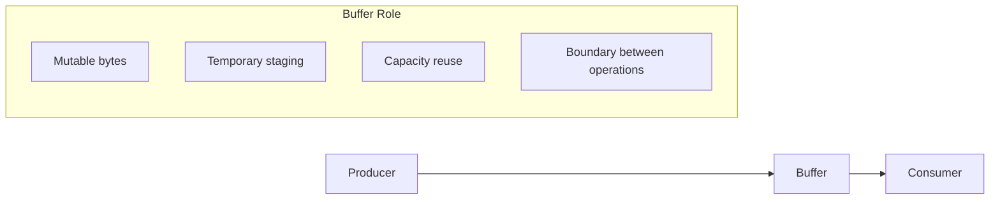
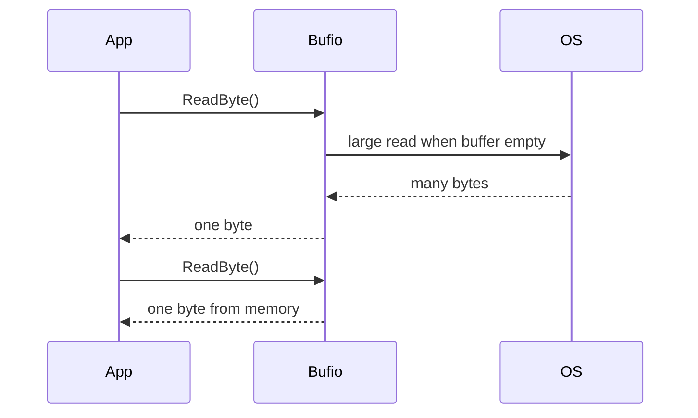
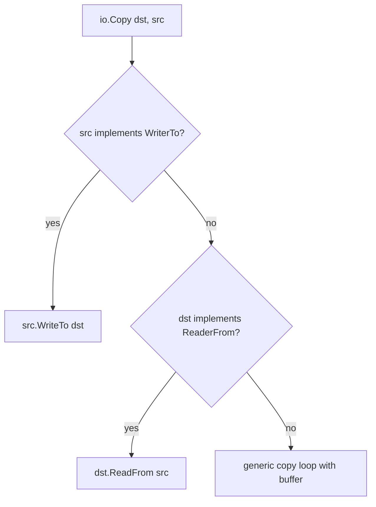
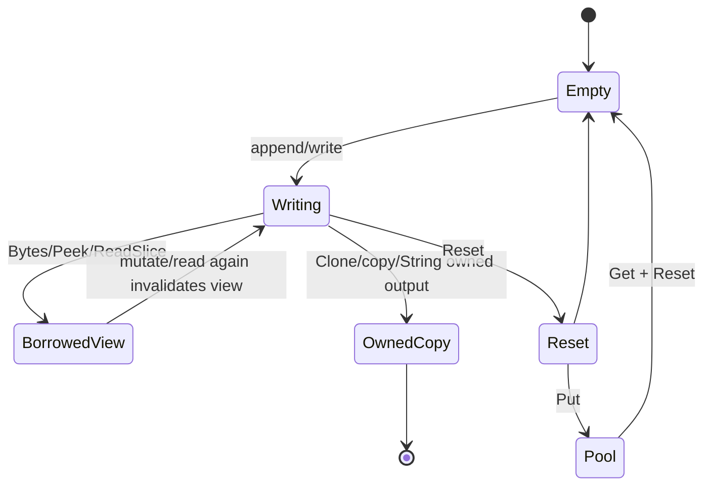
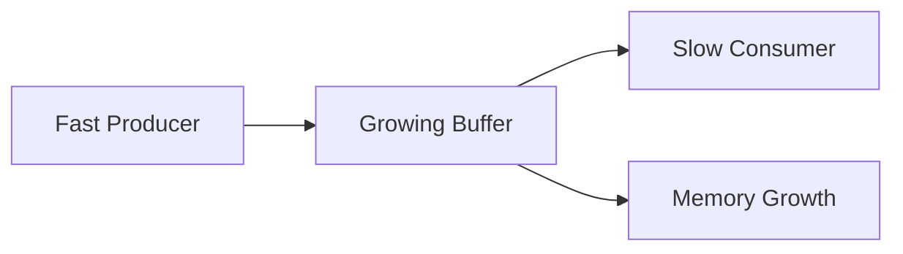

# learn-go-memory-systems-part-015.md

# Go Memory Systems — Part 015
# Buffer Fundamentals: `bytes.Buffer`, `strings.Builder`, `bufio`, Reusable Buffers

> Target pembaca: Java software engineer yang ingin memahami Go memory, buffer, stream, dan allocation behavior sampai level production engineering.
>
> Fokus part ini: membangun mental model buffer di Go sebagai _mutable staging area_ antara value representation, byte processing, string construction, stream I/O, allocation pressure, dan ownership contract.

---

## 0. Posisi Part Ini Dalam Seri

Kita sudah membangun fondasi berikut:

1. value representation,
2. pointer dan aliasing,
3. stack vs heap,
4. escape analysis,
5. allocator mechanics,
6. struct layout,
7. slice internals,
8. string internals,
9. interface/boxing-like traps,
10. byte dan bit programming.

Part ini mulai masuk ke area yang sangat sering menjadi sumber performa bagus atau buruk di service Go: **buffer**.

Buffer terlihat sederhana: hanya tempat menaruh byte sementara. Tetapi di sistem produksi, buffer menentukan:

- berapa banyak allocation per request,
- seberapa besar pressure ke GC,
- apakah memory besar tertahan terlalu lama,
- apakah API boundary aman dari mutation/aliasing,
- apakah stream menjadi bounded atau berubah menjadi unbounded memory hoarding,
- apakah optimization benar-benar zero-copy atau hanya memindahkan risiko ke lifetime bug.

Part ini adalah jembatan menuju Part 016 tentang `io.Reader`/`io.Writer` stream model.

---

## 1. Core Thesis

Buffer di Go bukan sekadar array byte. Buffer adalah **kontrak ownership terhadap mutable memory**.

Kalimat itu penting.

Saat kita memakai `[]byte`, `bytes.Buffer`, `strings.Builder`, `bufio.Reader`, `bufio.Writer`, `io.CopyBuffer`, atau `sync.Pool`, pertanyaan utamanya bukan hanya:

> “Apakah ini cepat?”

Pertanyaan yang lebih benar:

> “Siapa pemilik memory ini, siapa boleh menulisnya, sampai kapan datanya valid, apakah boleh disimpan setelah fungsi return, dan apakah memory besar akan tertahan?”

Tanpa kontrak ini, kode yang terlihat efisien bisa menjadi:

- data corruption,
- accidental retention,
- request cross-contamination,
- security leak,
- high GC pressure,
- latency spike,
- OOM under load.

---

## 2. Buffer Sebagai Mutable Staging Area

Dalam Go, banyak operasi I/O dan encoding bekerja dalam bentuk byte stream. Buffer sering dipakai sebagai staging area untuk:

- membangun response,
- membaca sebagian stream,
- menulis batch output,
- parsing frame/protocol,
- mengurangi syscall,
- menghindari allocation berulang,
- mengubah pola small writes menjadi larger writes,
- menyimpan scratch memory sementara.

Diagram mental:



Buffer bukan storage jangka panjang. Buffer terbaik biasanya memiliki lifetime pendek, jelas, dan bounded.

---

## 3. Buffer vs Slice vs String

Sebelum memakai type tertentu, bedakan tiga konsep ini.

| Konsep | Mutable? | Umumnya untuk | Risiko utama |
|---|---:|---|---|
| `[]byte` | Ya | raw bytes, protocol, I/O | aliasing, mutation, retention |
| `string` | Tidak | immutable text/key/message | conversion copy, secret retention |
| `bytes.Buffer` | Ya | growable byte buffer | exposing internal slice, retention |
| `strings.Builder` | Ya secara internal | efficient string construction | misuse setelah `String` |
| `bufio.Reader/Writer` | Ya secara internal | buffered I/O around stream | stale buffered data, flush lupa |

Important rule:

```go
[]byte is memory.
string is immutable view/value.
buffer is a mutable object that owns capacity.
```

---

## 4. `bytes.Buffer`: Mental Model

`bytes.Buffer` adalah growable byte buffer yang menyediakan method `Read` dan `Write`. Ia sering dipakai saat ingin membangun byte sequence secara incremental.

Contoh dasar:

```go
var b bytes.Buffer
b.WriteString("hello")
b.WriteByte(' ')
b.WriteString("world")
out := b.Bytes()
```

Secara mental, buffer memiliki:

- backing storage `[]byte`,
- read offset,
- length data yang valid,
- capacity yang mungkin lebih besar dari length.

Diagram:

```mermaid
flowchart TD
    B[bytes.Buffer]
    B --> S[backing []byte]
    B --> R[read offset]
    B --> L[valid length]
    S --> C[capacity]
```

`bytes.Buffer` bukan hanya slice. Ia adalah object dengan state.

---

## 5. `bytes.Buffer` dan Ownership

`b.Bytes()` mengembalikan slice ke data internal buffer.

Itu berarti:

```go
p := b.Bytes()
```

`p` bukan copy. `p` adalah view terhadap memory internal.

Konsekuensi:

- jika buffer berubah, isi `p` bisa berubah,
- jika `p` disimpan, backing array buffer ikut tertahan,
- jika buffer dikembalikan ke pool, `p` menjadi dangerous dangling logical view,
- jika caller memodifikasi `p`, internal state buffer bisa terpengaruh secara semantik.

Pattern aman jika output perlu hidup lebih lama:

```go
out := append([]byte(nil), b.Bytes()...)
```

Atau Go modern:

```go
out := bytes.Clone(b.Bytes())
```

Ownership contract:

```text
Bytes() returns borrowed mutable view.
Clone returns owned independent copy.
```

---

## 6. `bytes.Buffer.String()` Bukan Selalu Copy-Free Contract

`b.String()` menghasilkan string dari isi buffer. Dari sudut pandang API, string yang dihasilkan immutable. Tetapi jangan membuat asumsi internal copy/zero-copy sebagai kontrak desain. Yang penting secara desain:

- setelah menjadi string, caller melihat immutable text,
- jangan bergantung pada internal storage buffer,
- jangan gunakan buffer lagi jika kontrak output masih ambigu,
- kalau perlu byte ownership, copy eksplisit.

Untuk hot path, ukur dengan benchmark dan profile. Jangan berasumsi.

---

## 7. `bytes.Buffer.Reset()` Tidak Melepas Capacity

`Reset` membuat buffer kosong tetapi biasanya capacity tetap dimiliki.

```go
var b bytes.Buffer
b.Grow(10 << 20) // 10 MiB
b.Reset()        // length 0, capacity besar mungkin tetap ada
```

Ini bagus untuk reuse jika ukuran berikutnya mirip. Tetapi buruk jika buffer besar hanya terjadi sekali lalu disimpan lama.

Failure mode:

```go
var global bytes.Buffer

func handleHuge() {
    global.Grow(100 << 20)
    global.Reset()
}
```

Setelah spike, global buffer bisa mempertahankan memory besar.

Pattern:

```go
if b.Cap() > maxReusable {
    b = bytes.Buffer{}
} else {
    b.Reset()
}
```

Untuk pooled buffer, ini wajib dipikirkan.

---

## 8. `bytes.Buffer.Grow`

`Grow(n)` memastikan buffer punya ruang untuk menulis `n` byte tambahan.

Kegunaan:

- mengurangi repeated growth,
- membuat allocation lebih predictable,
- cocok ketika approximate size diketahui.

Contoh:

```go
func buildRecord(id string, payload []byte) []byte {
    var b bytes.Buffer
    b.Grow(len(id) + 1 + len(payload))
    b.WriteString(id)
    b.WriteByte(':')
    b.Write(payload)
    return bytes.Clone(b.Bytes())
}
```

Tapi jangan `Grow` dengan estimate yang tidak bounded dari input user tanpa validasi.

Bad:

```go
b.Grow(int(userProvidedLength))
```

Better:

```go
if n > maxRecordSize {
    return nil, ErrTooLarge
}
b.Grow(n)
```

---

## 9. `bytes.Buffer` vs Plain `[]byte` Append

Banyak kasus tidak butuh `bytes.Buffer`.

Plain `[]byte` bisa lebih eksplisit:

```go
buf := make([]byte, 0, 128)
buf = append(buf, "id="...)
buf = strconv.AppendInt(buf, id, 10)
buf = append(buf, '&')
buf = append(buf, payload...)
```

Keuntungan:

- ownership lebih jelas,
- less method abstraction,
- mudah return slice,
- cocok untuk encoding hot path.

`bytes.Buffer` cocok ketika:

- butuh `io.Writer`,
- banyak writer-based API,
- ingin kombinasi `Write`, `Read`, `WriteTo`, `ReadFrom`,
- code clarity lebih penting.

Decision:

| Situasi | Pilihan awal |
|---|---|
| Build byte output dengan known size | `[]byte` + `append` |
| API butuh `io.Writer` | `bytes.Buffer` |
| Build final string | `strings.Builder` |
| Stream I/O | `bufio` / `io.CopyBuffer` |
| Reusable scratch per request | caller-provided `[]byte` |

---

## 10. `strings.Builder`: Untuk String Construction

`strings.Builder` dirancang untuk membangun string secara efisien.

Contoh:

```go
var b strings.Builder
b.Grow(64)
b.WriteString("hello")
b.WriteByte(' ')
b.WriteString("world")
s := b.String()
```

Gunakan `strings.Builder` ketika final output adalah string.

Jangan gunakan `bytes.Buffer` lalu `String()` hanya karena familiar jika operasi Anda murni string.

---

## 11. `strings.Builder` dan Copy Hazard

`strings.Builder` memiliki aturan penting: jangan copy builder yang sudah digunakan.

Bad:

```go
var a strings.Builder
a.WriteString("hello")
b := a // dangerous pattern
b.WriteString(" world")
```

Builder adalah mutable state. Copy bisa merusak invariant internal.

General rule:

```text
Do not copy mutable buffer objects after first use.
```

Ini mirip dengan `bytes.Buffer`, `sync.Mutex`, `bufio.Reader`, dan banyak stateful object lain.

---

## 12. `strings.Builder` vs `+` Concatenation

Small fixed concatenation:

```go
s := a + ":" + b
```

biasanya baik dan compiler bisa mengoptimalkan.

Loop concatenation:

```go
s := ""
for _, p := range parts {
    s += p
}
```

sering buruk karena repeated allocation/copy.

Better:

```go
var b strings.Builder
for _, p := range parts {
    b.WriteString(p)
}
s := b.String()
```

Atau jika delimiter:

```go
s := strings.Join(parts, ",")
```

---

## 13. `strings.Builder` vs `bytes.Buffer`

| Kebutuhan | Lebih cocok |
|---|---|
| final output `string` | `strings.Builder` |
| final output `[]byte` | `bytes.Buffer` / `[]byte` append |
| perlu `io.Writer` untuk byte API | `bytes.Buffer` |
| text-only incremental build | `strings.Builder` |
| binary + text campuran | `bytes.Buffer` / `[]byte` append |

Prinsip:

```text
Choose the type whose output matches the ownership and representation you need.
```

---

## 14. `bufio.Reader`: Mengurangi Small Reads

`bufio.Reader` membungkus `io.Reader` dan menyediakan internal buffer.

Tujuannya:

- mengurangi jumlah read ke underlying source,
- menyediakan method seperti `ReadByte`, `ReadString`, `ReadSlice`, `Peek`,
- membuat parsing stream lebih efisien.

Contoh:

```go
r := bufio.NewReader(conn)
line, err := r.ReadString('\n')
```

Tanpa buffering, membaca byte demi byte dari network/file bisa menghasilkan banyak syscall atau expensive calls.

Dengan buffering:



---

## 15. `bufio.Reader.Peek`

`Peek(n)` melihat byte berikutnya tanpa advancing reader.

Berguna untuk:

- sniff protocol header,
- decide parser branch,
- check magic bytes,
- inspect delimiter.

Tetapi hasil `Peek` adalah view ke internal buffer. Jangan simpan terlalu lama.

Pattern:

```go
p, err := r.Peek(4)
if err != nil {
    return err
}
if !bytes.Equal(p, []byte("MAGC")) {
    return ErrBadMagic
}
```

Jika perlu retain:

```go
owned := bytes.Clone(p)
```

---

## 16. `bufio.Reader.ReadSlice` vs `ReadBytes` vs `ReadString`

`ReadSlice(delim)` mengembalikan slice ke internal buffer.

- efficient,
- borrowed view,
- invalid after next read,
- good for immediate parse.

`ReadBytes(delim)` mengembalikan owned `[]byte`.

- may allocate,
- safer for retention.

`ReadString(delim)` mengembalikan string.

- suitable for text,
- allocation/conversion likely,
- safer immutable output.

Decision:

| Method | Copy? | Validity | Use case |
|---|---:|---|---|
| `ReadSlice` | minimal | until next read | immediate parse |
| `ReadBytes` | yes/owned | caller owns | keep bytes |
| `ReadString` | yes/string | caller owns string | keep text |

---

## 17. `bufio.Scanner`: Convenient, But Not Universal

`bufio.Scanner` nyaman untuk token kecil seperti line-oriented input.

Contoh:

```go
scanner := bufio.NewScanner(r)
for scanner.Scan() {
    line := scanner.Text()
    _ = line
}
if err := scanner.Err(); err != nil {
    return err
}
```

Tetapi Scanner punya limit token default. Untuk line besar, Scanner dapat gagal dengan token too long. Dokumentasi `bufio.Scanner.Buffer` menjelaskan Scanner memakai internal buffer dan maximum token size default, dan buffer harus disetel sebelum scanning dimulai.

Pattern:

```go
scanner := bufio.NewScanner(r)
buf := make([]byte, 0, 64*1024)
scanner.Buffer(buf, 10*1024*1024)
```

Namun untuk protocol produksi dengan record besar/complex framing, sering lebih baik pakai `bufio.Reader` dan parser eksplisit daripada Scanner.

---

## 18. Scanner Anti-Pattern

Bad untuk unbounded production input:

```go
scanner := bufio.NewScanner(r)
for scanner.Scan() {
    process(scanner.Text())
}
```

Masalah:

- token default limit,
- `Text()` membuat string,
- line besar bisa error,
- sulit mengontrol memory budget per token,
- format non-line-based kurang cocok.

Better untuk large records:

```go
br := bufio.NewReaderSize(r, 64*1024)
for {
    line, err := br.ReadBytes('\n')
    if len(line) > maxLineSize {
        return ErrTooLarge
    }
    // process owned line or parse immediately
    if err == io.EOF {
        break
    }
    if err != nil {
        return err
    }
}
```

Atau gunakan fixed frame parser.

---

## 19. `bufio.Writer`: Mengurangi Small Writes

`bufio.Writer` membungkus `io.Writer` dan menunda write sampai buffer penuh atau `Flush` dipanggil.

Contoh:

```go
w := bufio.NewWriter(conn)
w.WriteString("HTTP/1.1 200 OK\r\n")
w.WriteString("Content-Length: 5\r\n\r\n")
w.WriteString("hello")
if err := w.Flush(); err != nil {
    return err
}
```

Tujuannya:

- menggabungkan small writes,
- mengurangi syscall/network calls,
- meningkatkan throughput.

Risiko utama:

```text
forget Flush => data never reaches underlying writer
```

---

## 20. Flush Semantics

`bufio.Writer` harus di-flush.

Pattern:

```go
bw := bufio.NewWriter(w)
if _, err := bw.Write(payload); err != nil {
    return err
}
if err := bw.Flush(); err != nil {
    return err
}
```

Jangan abaikan error dari `Flush`. Error bisa muncul saat data benar-benar dikirim ke underlying writer.

Bad:

```go
bw.Flush() // ignored
```

Better:

```go
if err := bw.Flush(); err != nil {
    return fmt.Errorf("flush response: %w", err)
}
```

---

## 21. `bufio.Writer.Available` dan `Buffered`

`Available()` memberi ruang kosong di buffer.

`Buffered()` memberi jumlah byte yang sudah ditulis ke buffer tetapi belum di-flush.

Gunakan untuk observability/debugging atau optimization spesifik, bukan untuk membangun logic fragile.

```go
if bw.Buffered() > 0 {
    if err := bw.Flush(); err != nil {
        return err
    }
}
```

---

## 22. Buffer Size: Tidak Ada Angka Sakti

Default buffer size sering cukup baik. Tetapi untuk high-throughput service, size perlu dipilih berdasarkan:

- payload typical,
- latency budget,
- memory budget,
- concurrency level,
- syscall cost,
- network behavior,
- cache locality,
- max in-flight requests.

Memory formula kasar:

```text
buffer_memory = buffer_size * concurrent_buffers
```

Jika 10.000 connection masing-masing punya 64 KiB read buffer dan 64 KiB write buffer:

```text
10_000 * 128 KiB = 1.28 GiB
```

Sebelum memperbesar buffer, hitung concurrency multiplier.

---

## 23. Buffer Per Request vs Per Connection vs Global

| Scope | Keuntungan | Risiko |
|---|---|---|
| per operation | safest lifetime | allocation berulang |
| per request | clear ownership | request besar retain capacity |
| per connection | reuse baik | idle connection menahan memory |
| per worker | bounded | careful handoff needed |
| global shared | low allocation illusion | race/corruption |
| pool | amortize allocation | stale data/retention/security |

Default aman: per operation atau per request.

Optimization baru masuk setelah profile menunjukkan allocation pressure.

---

## 24. Reusable Buffer Dengan Caller-Provided Slice

Pattern yang sering paling production-friendly:

```go
func EncodeRecord(dst []byte, r Record) []byte {
    dst = append(dst, r.Type)
    dst = binary.BigEndian.AppendUint32(dst, r.ID)
    dst = append(dst, r.Payload...)
    return dst
}
```

Caller mengontrol capacity dan lifetime:

```go
buf := make([]byte, 0, 1024)
buf = EncodeRecord(buf[:0], record)
```

Keuntungan:

- allocation bisa nol setelah initial capacity,
- ownership jelas,
- tidak butuh pool,
- mudah benchmark,
- cocok untuk hot path.

Kontrak harus jelas:

```text
The returned slice may reuse dst's backing array.
Caller owns dst and must not mutate it while output is in use elsewhere.
```

---

## 25. Append-Style API Pattern

Banyak package Go memakai pattern append-style:

```go
func AppendX(dst []byte, x X) []byte
```

Contoh standard library:

- `strconv.AppendInt`,
- `strconv.AppendQuote`,
- `encoding/binary.AppendUvarint`,
- beberapa API encoding modern.

Pattern ini bagus karena caller bisa memilih:

```go
// one-shot
out := AppendX(nil, x)

// reuse
buf = AppendX(buf[:0], x)

// preallocate
buf := make([]byte, 0, estimated)
buf = AppendX(buf, x)
```

---

## 26. `io.Copy` dan Buffering

`io.Copy(dst, src)` menyalin dari reader ke writer.

Ia dapat memakai fast path jika `src` mengimplementasikan `WriterTo` atau `dst` mengimplementasikan `ReaderFrom`.

Mental model:



Jadi `io.Copy` sering lebih pintar dari manual loop.

---

## 27. `io.CopyBuffer`

`io.CopyBuffer(dst, src, buf)` seperti `io.Copy`, tetapi memakai buffer yang disediakan jika generic buffer diperlukan.

```go
buf := make([]byte, 32*1024)
_, err := io.CopyBuffer(dst, src, buf)
```

Gunakan ketika:

- ingin mengontrol allocation,
- ingin reuse buffer antar copy operation,
- ingin memory budget predictable,
- tidak ingin generic copy loop allocate temporary buffer.

Tapi jangan assume `buf` selalu dipakai. Jika fast path aktif, buffer bisa tidak digunakan.

---

## 28. Manual Copy Loop

Kadang perlu manual loop karena ingin:

- checksum while copying,
- progress tracking,
- rate limiting,
- cancellation check,
- transform per chunk,
- enforce max bytes.

Pattern:

```go
func CopyWithLimit(dst io.Writer, src io.Reader, buf []byte, max int64) (int64, error) {
    if len(buf) == 0 {
        return 0, errors.New("empty buffer")
    }

    var written int64
    for {
        if written >= max {
            return written, ErrTooLarge
        }

        limit := len(buf)
        remain := max - written
        if int64(limit) > remain {
            limit = int(remain)
        }

        n, rerr := src.Read(buf[:limit])
        if n > 0 {
            wn, werr := dst.Write(buf[:n])
            written += int64(wn)
            if werr != nil {
                return written, werr
            }
            if wn != n {
                return written, io.ErrShortWrite
            }
        }
        if rerr == io.EOF {
            return written, nil
        }
        if rerr != nil {
            return written, rerr
        }
    }
}
```

Important:

- handle `n > 0` before read error,
- handle short write,
- enforce max size,
- avoid infinite loop if reader misbehaves.

---

## 29. Buffer Pooling Dengan `sync.Pool`

`sync.Pool` adalah cache object temporary. Ia aman untuk concurrent use, tetapi item di dalam pool dapat dihapus kapan saja oleh runtime.

Ini berarti pool bukan:

- object ownership system,
- bounded resource pool,
- lifecycle manager,
- connection pool,
- memory guarantee.

Good use:

```go
var bufferPool = sync.Pool{
    New: func() any {
        b := make([]byte, 0, 32*1024)
        return &b
    },
}

func getBuffer() *[]byte {
    p := bufferPool.Get().(*[]byte)
    *p = (*p)[:0]
    return p
}

func putBuffer(p *[]byte) {
    if cap(*p) > 1<<20 { // drop huge buffer
        return
    }
    *p = (*p)[:0]
    bufferPool.Put(p)
}
```

But carefully: returning pointer to slice requires discipline. Often a small wrapper type is cleaner.

---

## 30. `sync.Pool` Buffer Security Hazard

If buffer contains sensitive data, reset length is not enough.

```go
buf = buf[:0]
```

Old bytes remain in capacity region.

If later code extends slice, old data may become visible.

For secrets:

```go
for i := range buf {
    buf[i] = 0
}
buf = buf[:0]
```

Or avoid pooling secret buffers.

Rule:

```text
Reset changes length. It does not erase memory.
```

---

## 31. Pooling `bytes.Buffer`

Common pattern:

```go
var bufPool = sync.Pool{
    New: func() any { return new(bytes.Buffer) },
}

func render(x X) ([]byte, error) {
    b := bufPool.Get().(*bytes.Buffer)
    defer func() {
        if b.Cap() <= 1<<20 {
            b.Reset()
            bufPool.Put(b)
        }
    }()

    b.Reset()
    if err := encode(b, x); err != nil {
        return nil, err
    }
    return bytes.Clone(b.Bytes()), nil
}
```

Critical point: return clone, not `b.Bytes()`, because buffer is returned to pool.

Bad:

```go
out := b.Bytes()
bufPool.Put(b)
return out, nil // out aliases pooled mutable memory
```

This can cause cross-request data corruption.

---

## 32. Pooling `strings.Builder`

Usually less attractive than pooling `[]byte` or `bytes.Buffer`.

Reasons:

- builder has subtle copy/lifetime rules,
- final string may share/copy depending implementation details,
- misuse can create hard-to-debug behavior,
- string construction is often not the dominant cost unless proven.

Prefer:

- local `strings.Builder`,
- `Grow` with estimate,
- benchmark before pooling.

---

## 33. Buffer Ownership State Machine

Mermaid model:



Key invariant:

```text
Borrowed views must not outlive the mutable buffer operation that produced them.
```

---

## 34. Accidental Retention Dengan Buffer

Contoh:

```go
func firstLine(data []byte) []byte {
    i := bytes.IndexByte(data, '\n')
    if i < 0 {
        return data
    }
    return data[:i]
}
```

Jika `data` adalah 100 MiB dan first line 20 bytes, return slice tetap menahan backing array 100 MiB.

Better if retaining:

```go
func firstLineOwned(data []byte) []byte {
    i := bytes.IndexByte(data, '\n')
    if i < 0 {
        return bytes.Clone(data)
    }
    return bytes.Clone(data[:i])
}
```

Same issue exists with buffers:

```go
small := b.Bytes()[:10]
cache[key] = small // retains large buffer backing array
```

---

## 35. Bounded Buffering

Production rule:

```text
Never buffer untrusted or unbounded input without a maximum size.
```

Bad:

```go
body, err := io.ReadAll(r.Body)
```

Better:

```go
limited := io.LimitReader(r.Body, maxBody+1)
body, err := io.ReadAll(limited)
if err != nil {
    return err
}
if int64(len(body)) > maxBody {
    return ErrTooLarge
}
```

Better still for large payload:

```go
err := processStream(r.Body)
```

Buffering is a design choice, not default.

---

## 36. Java Comparison: `ByteArrayOutputStream`, `StringBuilder`, `ByteBuffer`

Java engineer mental mapping:

| Java | Go rough equivalent | Difference |
|---|---|---|
| `ByteArrayOutputStream` | `bytes.Buffer` | Go exposes `[]byte` view via `Bytes()` |
| `StringBuilder` | `strings.Builder` | Go string immutable; builder should not be copied |
| `BufferedInputStream` | `bufio.Reader` | Go uses `io.Reader` interface composition |
| `BufferedOutputStream` | `bufio.Writer` | must check `Flush` error |
| `ByteBuffer` heap | `[]byte` + cursor | no built-in position/limit object by default |
| `ByteBuffer.allocateDirect` | mmap/cgo/custom off-heap | no ordinary direct-buffer equivalent idiom |

Go favors small interfaces and explicit ownership over large stateful buffer abstractions.

---

## 37. Cursor-Based Buffer Parsing

Instead of using `bytes.Buffer` for parsing binary data, often use slice + cursor.

```go
type Cursor struct {
    b []byte
    i int
}

func (c *Cursor) U32() (uint32, error) {
    if len(c.b)-c.i < 4 {
        return 0, io.ErrUnexpectedEOF
    }
    v := binary.BigEndian.Uint32(c.b[c.i : c.i+4])
    c.i += 4
    return v, nil
}

func (c *Cursor) Bytes(n int) ([]byte, error) {
    if n < 0 || len(c.b)-c.i < n {
        return nil, io.ErrUnexpectedEOF
    }
    p := c.b[c.i : c.i+n]
    c.i += n
    return p, nil
}
```

This makes ownership explicit:

- returned `[]byte` is borrowed view,
- caller must clone if retaining,
- parser does not allocate.

---

## 38. Builder API For Encoding

Good encoding API:

```go
func AppendFrame(dst []byte, typ byte, payload []byte) []byte {
    dst = append(dst, typ)
    dst = binary.BigEndian.AppendUint32(dst, uint32(len(payload)))
    dst = append(dst, payload...)
    return dst
}
```

Callers choose memory strategy:

```go
buf := make([]byte, 0, 5+len(payload))
buf = AppendFrame(buf, 1, payload)
```

This is often better than:

```go
func EncodeFrame(payload []byte) []byte
```

because the latter hides allocation policy.

---

## 39. API Boundary: Borrowed vs Owned

Document buffer APIs explicitly.

Examples:

```go
// Parse parses b. The returned Record may reference b.
// The caller must keep b unchanged while using the Record.
func Parse(b []byte) (Record, error)
```

```go
// ParseCopy parses b and returns a Record that owns its byte fields.
func ParseCopy(b []byte) (Record, error)
```

```go
// AppendTo appends the encoded form of r to dst and returns the result.
// The returned slice may reuse dst's backing array.
func (r Record) AppendTo(dst []byte) []byte
```

Ambiguous APIs create bugs.

---

## 40. Borrowed View Pattern

For high-performance parsing:

```go
type HeaderView struct {
    b []byte
}

func (h HeaderView) Type() byte {
    return h.b[0]
}

func (h HeaderView) PayloadLen() uint32 {
    return binary.BigEndian.Uint32(h.b[1:5])
}
```

Contract:

```text
HeaderView borrows b. It does not own data.
Do not retain it beyond the lifetime of b.
```

Use this only when caller understands lifetime.

For public APIs, owned types are often safer.

---

## 41. Buffered Logging

Logging hot paths often allocate through:

- formatting,
- `fmt.Sprintf`,
- `...any`,
- string construction,
- JSON encoding.

For structured logging, avoid building intermediate strings if logger supports typed fields.

Bad hot path:

```go
log.Info("payload=" + string(payload))
```

Problems:

- `[]byte` to string conversion,
- logs huge payload accidentally,
- sensitive data risk.

Better:

```go
log.Info("received payload", "size", len(payload))
```

If formatting needed, use bounded preview:

```go
preview := payload
if len(preview) > 64 {
    preview = preview[:64]
}
log.Info("payload preview", "hex", hex.EncodeToString(preview), "size", len(payload))
```

---

## 42. JSON Encoding and Buffer Choice

Common choices:

```go
var b bytes.Buffer
enc := json.NewEncoder(&b)
err := enc.Encode(v)
```

or:

```go
out, err := json.Marshal(v)
```

`json.Marshal` returns `[]byte` and allocates output.

`json.Encoder` writes to `io.Writer`, useful for streaming or response writer.

For HTTP response:

```go
w.Header().Set("Content-Type", "application/json")
if err := json.NewEncoder(w).Encode(v); err != nil {
    // handle if still possible
}
```

Avoid unnecessary buffer if you can stream directly to writer.

But if you need content length or signing, buffer may be necessary.

---

## 43. HTTP Response Buffering

Decision:

| Need | Strategy |
|---|---|
| small response, need error before writing | buffer then write |
| large response | stream |
| need Content-Length | precompute or buffer bounded output |
| need compression | streaming compressor |
| need checksum/signature before send | buffer or two-pass design |

Bad:

```go
var b bytes.Buffer
for _, row := range millionRows {
    json.NewEncoder(&b).Encode(row)
}
w.Write(b.Bytes())
```

Better:

```go
enc := json.NewEncoder(w)
for _, row := range rows {
    if err := enc.Encode(row); err != nil {
        return
    }
}
```

But once response starts, error semantics change. Production design must decide protocol behavior.

---

## 44. Buffer and Backpressure

Buffer can hide backpressure.

If producer writes into unbounded buffer while consumer is slow, memory grows.



Better designs:

- bounded buffer,
- blocking write,
- streaming pipeline,
- context cancellation,
- rate limiting,
- max queue size.

Buffering should be a bounded shock absorber, not infinite storage.

---

## 45. Buffer Lifetime Checklist

For every buffer, answer:

1. Who allocates it?
2. Who owns it?
3. Who may mutate it?
4. Who may retain views into it?
5. When is it reset?
6. When is it released?
7. What is maximum capacity?
8. What happens after unusually large input?
9. Does it contain secrets?
10. Is it safe under concurrency?

If you cannot answer these, the design is incomplete.

---

## 46. Concurrency Hazards

Buffers are generally not safe for concurrent mutation.

Bad:

```go
var b bytes.Buffer

go b.WriteString("a")
go b.WriteString("b")
```

Race.

Better:

- one buffer per goroutine,
- protect with mutex,
- write to channel with owned chunks,
- use `io.Pipe` carefully,
- avoid shared mutable buffer.

Also dangerous:

```go
buf := make([]byte, 0, 1024)
for _, item := range items {
    buf = append(buf[:0], item.Data...)
    go func() {
        process(buf) // all goroutines share same backing array
    }()
}
```

Better:

```go
owned := bytes.Clone(buf)
go process(owned)
```

or transfer ownership and stop reusing until done.

---

## 47. Buffer Reuse and Goroutine Capture

Common bug:

```go
buf := make([]byte, 0, 4096)
for msg := range messages {
    buf = encode(buf[:0], msg)
    go send(buf)
}
```

`send` receives slice header pointing to same backing array reused by loop.

Fix options:

1. copy per goroutine,
2. synchronous send before reuse,
3. worker owns its own buffer,
4. object pool with explicit return after send completes.

Correct copy:

```go
out := bytes.Clone(buf)
go send(out)
```

---

## 48. Pool With Explicit Ownership

Better than raw `sync.Pool` scattered everywhere:

```go
type BufferLease struct {
    buf []byte
    pool *BufferPool
    closed bool
}

type BufferPool struct {
    p sync.Pool
    maxCap int
}

func NewBufferPool(defaultCap, maxCap int) *BufferPool {
    bp := &BufferPool{maxCap: maxCap}
    bp.p.New = func() any {
        b := make([]byte, 0, defaultCap)
        return &b
    }
    return bp
}

func (p *BufferPool) Get() *BufferLease {
    b := p.p.Get().(*[]byte)
    *b = (*b)[:0]
    return &BufferLease{buf: *b, pool: p}
}

func (l *BufferLease) Bytes() []byte {
    return l.buf
}

func (l *BufferLease) Append(p ...byte) {
    l.buf = append(l.buf, p...)
}

func (l *BufferLease) Close() {
    if l.closed {
        return
    }
    l.closed = true
    if cap(l.buf) > l.pool.maxCap {
        return
    }
    b := l.buf[:0]
    l.pool.p.Put(&b)
}
```

But be careful: this sample still has issues for production because `BufferLease` itself allocates unless pooled or value-returned. The main point is the ownership shape.

---

## 49. Avoid Premature Pooling

Pooling is not free.

Costs:

- complexity,
- stale data risk,
- retention of large capacity,
- harder ownership reasoning,
- accidental cross-request mutation,
- worse cache locality in some cases,
- GC still interacts with pool.

Use pool only after evidence:

```text
benchmark/profile shows allocation pressure from repeated temporary buffers
AND lifetime is short
AND buffer size is bounded
AND reset/cleanup is safe
```

---

## 50. `bytes.Buffer` Capacity Retention Example

Mini lab:

```go
package main

import (
    "bytes"
    "fmt"
)

func main() {
    var b bytes.Buffer
    fmt.Println("initial cap", b.Cap())

    b.Grow(10 << 20)
    fmt.Println("after grow", b.Cap())

    b.Reset()
    fmt.Println("after reset", b.Cap())

    b = bytes.Buffer{}
    fmt.Println("after replace", b.Cap())
}
```

Expected mental result:

- `Reset` clears length/state,
- replacing with zero value allows old backing array to be released if no references remain.

---

## 51. `bytes.Buffer.Bytes()` Aliasing Lab

```go
package main

import (
    "bytes"
    "fmt"
)

func main() {
    var b bytes.Buffer
    b.WriteString("hello")

    p := b.Bytes()
    p[0] = 'H'

    fmt.Println(b.String()) // Hello
}
```

Lesson:

```text
Bytes() exposes mutable internal data.
```

Do not treat it as immutable output unless you own all mutation.

---

## 52. Pooled Buffer Corruption Lab

```go
package main

import (
    "bytes"
    "fmt"
    "sync"
)

var pool = sync.Pool{New: func() any { return new(bytes.Buffer) }}

func build(s string) []byte {
    b := pool.Get().(*bytes.Buffer)
    b.Reset()
    b.WriteString(s)
    out := b.Bytes() // BUG: borrowed view
    pool.Put(b)
    return out
}

func main() {
    a := build("first")
    _ = build("second")
    fmt.Println(string(a))
}
```

Output is not a reliable contract. It may show corrupted/changed data depending reuse.

Fix:

```go
out := bytes.Clone(b.Bytes())
```

---

## 53. `bufio.Scanner` Token Limit Lab

```go
package main

import (
    "bufio"
    "fmt"
    "strings"
)

func main() {
    input := strings.NewReader(strings.Repeat("x", 100*1024))
    sc := bufio.NewScanner(input)

    for sc.Scan() {
        fmt.Println(len(sc.Text()))
    }
    if err := sc.Err(); err != nil {
        fmt.Println("error:", err)
    }
}
```

Then fix:

```go
sc := bufio.NewScanner(input)
sc.Buffer(make([]byte, 0, 64*1024), 200*1024)
```

Lesson:

```text
Scanner is convenience for bounded token scanning, not universal streaming parser.
```

---

## 54. Allocation Benchmark: Builder vs Concatenation

```go
package bufferbench

import (
    "strconv"
    "strings"
    "testing"
)

func BenchmarkConcatLoop(b *testing.B) {
    for range b.N {
        s := ""
        for i := 0; i < 100; i++ {
            s += strconv.Itoa(i)
        }
        _ = s
    }
}

func BenchmarkBuilder(b *testing.B) {
    for range b.N {
        var sb strings.Builder
        sb.Grow(300)
        for i := 0; i < 100; i++ {
            sb.WriteString(strconv.Itoa(i))
        }
        _ = sb.String()
    }
}
```

Run:

```bash
go test -bench . -benchmem
```

Look at:

- `allocs/op`,
- `B/op`,
- `ns/op`.

---

## 55. Allocation Benchmark: Append-Style Encoding

```go
package bufferbench

import (
    "encoding/binary"
    "testing"
)

type Record struct {
    Type byte
    ID uint32
    Payload []byte
}

func AppendRecord(dst []byte, r Record) []byte {
    dst = append(dst, r.Type)
    dst = binary.BigEndian.AppendUint32(dst, r.ID)
    dst = append(dst, r.Payload...)
    return dst
}

func BenchmarkAppendRecord(b *testing.B) {
    r := Record{Type: 1, ID: 42, Payload: make([]byte, 128)}
    buf := make([]byte, 0, 256)

    b.ReportAllocs()
    for range b.N {
        buf = AppendRecord(buf[:0], r)
    }
}
```

Expected ideal: zero allocation per operation if capacity is sufficient.

---

## 56. Anti-Pattern Catalog

### 56.1 Returning Borrowed Pooled Buffer

```go
return b.Bytes()
```

after putting `b` back to pool.

Fix: clone or transfer ownership.

### 56.2 `Reset` After Huge Spike Without Cap Guard

```go
b.Reset()
pool.Put(b)
```

Fix:

```go
if b.Cap() <= maxReusable { pool.Put(b) }
```

### 56.3 `io.ReadAll` On Unbounded Input

Fix: limit or stream.

### 56.4 Scanner For Large Unknown Records

Fix: `Reader` parser with explicit max.

### 56.5 Ignoring Flush Error

Fix: return/wrap error.

### 56.6 Shared Buffer Across Goroutines

Fix: copy, ownership transfer, or per-goroutine buffer.

### 56.7 Secret Data in Pool

Fix: zero or avoid pooling secrets.

---

## 57. Production Review Checklist

Use this in code review.

### Buffer Choice

- Is this output byte or string?
- Is `bytes.Buffer` necessary or would `[]byte` append be clearer?
- Is `strings.Builder` more appropriate?
- Is `bufio` needed around stream?

### Lifetime

- Does returned data alias internal buffer?
- Is returned data retained beyond buffer lifetime?
- Is clone needed?
- Is borrowed view documented?

### Capacity

- Is size bounded?
- Is `Grow` validated?
- Can one large request poison reusable capacity?
- Is there max reusable cap?

### Pooling

- Is pooling justified by benchmark/profile?
- Are buffers reset safely?
- Are secrets cleared?
- Is data cloned before returning?
- Is pool used as cache, not resource guarantee?

### I/O

- Is `Flush` checked?
- Is `Scanner` token size appropriate?
- Is unbounded `ReadAll` avoided?
- Are partial writes handled in manual loop?

### Concurrency

- Is buffer shared across goroutines?
- Is ownership transferred clearly?
- Could loop reuse corrupt goroutine data?

---

## 58. Incident Patterns

### Incident 1: Memory Grows After One Huge Request

Symptom:

- RSS grows,
- heap profile shows large retained buffers,
- latency maybe normal until OOM.

Root cause:

- pooled `bytes.Buffer` retained 100 MiB capacity after one huge response.

Fix:

- cap guard before returning to pool,
- bounded request/response size,
- avoid pooling large buffers.

### Incident 2: Random Response Corruption

Symptom:

- users receive parts of other responses,
- hard to reproduce,
- only under load.

Root cause:

- returned `b.Bytes()` from pooled buffer.

Fix:

- `bytes.Clone`,
- ownership tests,
- race tests,
- avoid pooling at API boundary.

### Incident 3: Log Processor Fails on Long Line

Symptom:

- works in dev,
- production log line >64 KiB fails.

Root cause:

- `bufio.Scanner` default token limit.

Fix:

- set Scanner buffer max if bounded,
- or use `bufio.Reader` with explicit large-record strategy.

### Incident 4: Data Not Sent

Symptom:

- client waits,
- server thinks write succeeded.

Root cause:

- `bufio.Writer.Flush` missing or error ignored.

Fix:

- always flush and check error.

---

## 59. Design Heuristics

1. Prefer no buffer when direct streaming is enough.
2. Prefer append-style `[]byte` API for hot encoders.
3. Prefer `strings.Builder` for string construction.
4. Prefer `bytes.Buffer` when `io.Writer` abstraction helps.
5. Prefer `bufio.Reader/Writer` around expensive underlying I/O.
6. Prefer bounded buffering for untrusted input.
7. Prefer clone at ownership boundary.
8. Avoid pooling until profile proves need.
9. Never return borrowed pooled memory.
10. Treat buffer size times concurrency as first-class memory budget.

---

## 60. Mental Model Summary

```mermaid
flowchart TD
    A[Need to build data] --> B{Final representation?}
    B -- string --> C[strings.Builder]
    B -- bytes --> D{Need io.Writer?}
    D -- yes --> E[bytes.Buffer]
    D -- no --> F[[]byte append]

    G[Need to read/write stream] --> H{Small operations on expensive source?}
    H -- yes --> I[bufio.Reader/Writer]
    H -- no --> J[Direct io.Reader/io.Writer]

    K[Need repeated temp memory] --> L{Profile proves allocation pressure?}
    L -- no --> M[Do not pool]
    L -- yes --> N[sync.Pool with cap guard and ownership rules]
```

---

## 61. What You Should Internalize

A strong Go engineer does not ask only:

> “Which buffer is fastest?”

They ask:

> “What is the lifetime and ownership of this memory, what is the maximum size, who can mutate it, and what happens under concurrency and failure?”

That is the difference between local optimization and production memory engineering.

---

## 62. Preparation For Part 016

Part berikutnya akan membahas stream model:

- `io.Reader`,
- `io.Writer`,
- partial read/write,
- EOF semantics,
- `io.Copy`,
- backpressure,
- cancellation,
- pipeline composition,
- avoiding unbounded buffering.

Part 015 memberi vocabulary buffer. Part 016 akan mengubah buffer menjadi streaming architecture.

---

## 63. Key Takeaways

- Buffer adalah mutable memory with ownership, bukan sekadar helper object.
- `bytes.Buffer.Bytes()` dan `bufio.Reader.Peek/ReadSlice` mengembalikan borrowed view.
- `Reset` tidak berarti memory dilepas.
- `strings.Builder` adalah pilihan utama untuk membangun string, bukan byte output.
- `bufio.Reader/Writer` mengurangi small read/write, tetapi memiliki validity/flush rules.
- `Scanner` nyaman tetapi bounded; jangan pakai membabi buta untuk large production records.
- Caller-provided `[]byte` append-style API sering menjadi pattern paling jelas dan cepat.
- `sync.Pool` adalah cache sementara, bukan lifecycle guarantee.
- Pooling buffer tanpa clone/ownership contract bisa menyebabkan corruption/security leak.
- Buffer size harus dikalikan concurrency untuk memahami memory budget.

---

## 64. References

- Go package `bytes`: `bytes.Buffer` and byte utilities.
- Go package `strings`: string manipulation and `strings.Builder`.
- Go package `bufio`: buffered I/O, `Reader`, `Writer`, `Scanner`, token buffer behavior.
- Go package `io`: `Reader`, `Writer`, `Copy`, `CopyBuffer`.
- Go package `sync`: `sync.Pool` semantics.
- Go 1.26 Release Notes: target version context for this series.

<!-- NAVIGATION_FOOTER -->
<div class="page-nav">
<a href="./learn-go-memory-systems-part-014.md">⬅️ Go Memory Systems — Part 014: Bit-Level Programming</a>
<a href="./index.md">📚 Kategori</a>
<a href="../../index.md">🏠 Home</a>
<a href="./learn-go-memory-systems-part-016.md">Go Memory Systems — Part 016 ➡️</a>
</div>
