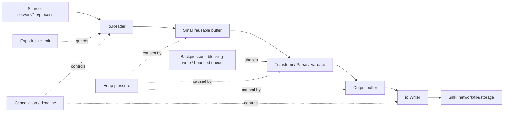
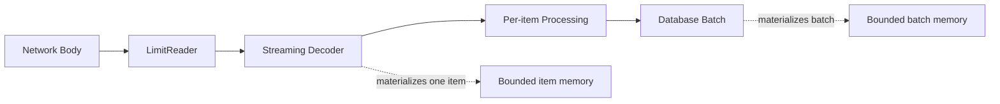
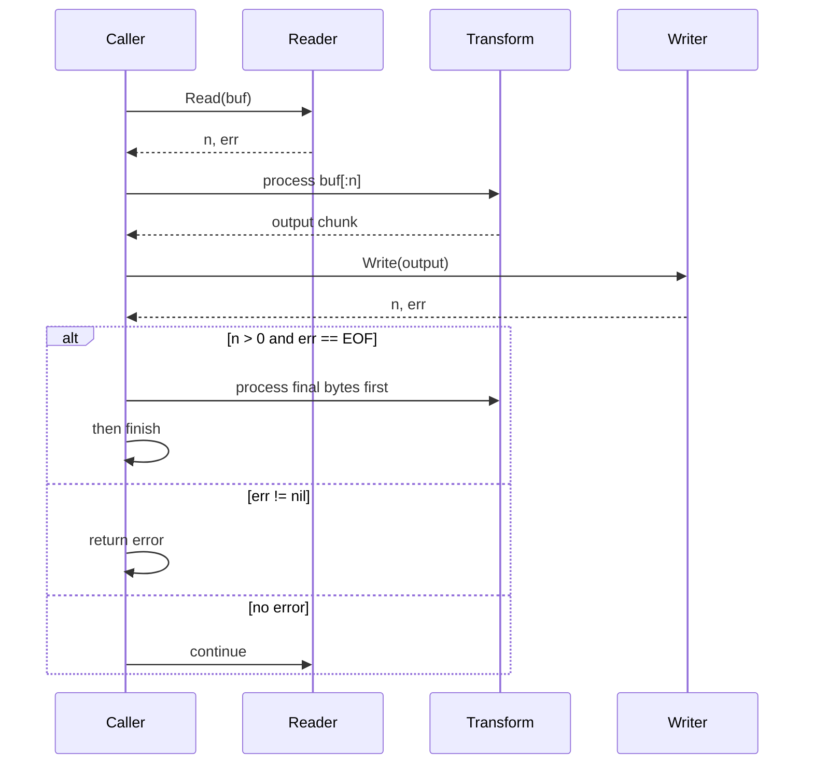
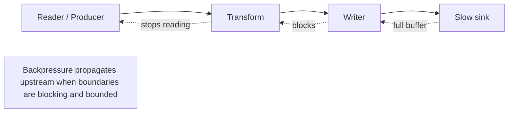
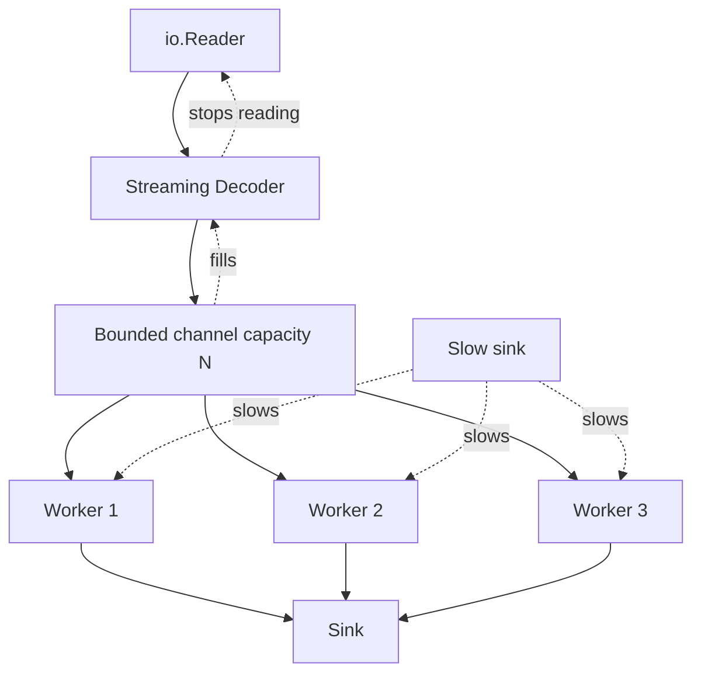

# learn-go-memory-systems-part-016.md

# Go Memory Systems — Part 016  
# Stream Mental Model: `io.Reader`, `io.Writer`, Pull vs Push, Backpressure Boundaries

> Seri: `learn-go-memory-systems`  
> Part: `016`  
> Target pembaca: Java software engineer yang ingin memahami Go memory, buffering, streaming, allocation, GC pressure, dan production-grade I/O design.  
> Fokus part ini: membangun mental model stream di Go sebagai kontrak memory dan flow-control, bukan sekadar API `Read`/`Write`.

---

## 0. Posisi Part Ini Dalam Seri

Kita sudah membangun fondasi:

1. Part 000: orientasi memory systems.
2. Part 001: virtual memory, heap, stack, RSS.
3. Part 002: representasi value Go.
4. Part 003: pointer dan aliasing.
5. Part 004: goroutine stack.
6. Part 005: heap lifecycle.
7. Part 006: escape analysis.
8. Part 007: allocation mechanics.
9. Part 008: struct layout.
10. Part 009: slice internals.
11. Part 010: string internals.
12. Part 011: interface representation.
13. Part 012: boxing-like behavior.
14. Part 013: byte-level programming.
15. Part 014: bit-level programming.
16. Part 015: buffer fundamentals.

Part 016 adalah jembatan dari **buffer** menuju **pipeline**.

Di Go, banyak sistem produksi tidak rusak karena tidak tahu cara memakai `io.Reader`. Mereka rusak karena salah mental model:

- menganggap stream punya length yang selalu diketahui,
- menganggap `Read` akan mengisi buffer penuh,
- menganggap `Write` selalu menulis semua bytes,
- memakai `io.ReadAll` di input yang tidak bounded,
- membuat pipeline yang kelihatan streaming tapi sebenarnya buffering penuh,
- tidak menutup body,
- tidak menghubungkan cancellation,
- tidak memahami backpressure,
- tidak punya batas memory eksplisit.

Part ini akan membahas stream sebagai **kontrak kontrol memory**.

---

## 1. Tujuan Pembelajaran

Setelah menyelesaikan part ini, Anda harus mampu:

1. Membaca dan menulis kode berbasis `io.Reader`/`io.Writer` dengan benar.
2. Menjelaskan kenapa `Read` boleh mengembalikan `n > 0` bersamaan dengan `err != nil`.
3. Menjelaskan perbedaan buffering, streaming, batching, dan materializing.
4. Mendesain pipeline I/O yang bounded memory.
5. Menentukan kapan memakai `io.Copy`, `io.CopyBuffer`, `io.LimitReader`, `io.Pipe`, `bufio`, `bytes.Buffer`, atau `io.ReadAll`.
6. Menghindari goroutine leak pada stream pipeline.
7. Menghubungkan stream dengan context cancellation.
8. Menangani partial write, short write, EOF, timeout, dan close semantics.
9. Menganalisis memory pressure akibat unbounded stream.
10. Membedakan pull-based flow dan push-based flow.
11. Mendesain boundary backpressure yang eksplisit.
12. Melakukan review API streaming seperti internal engineering handbook.

---

## 2. Core Thesis

> Stream adalah kontrak untuk memproses data secara bertahap, tetapi streaming hanya benar-benar hemat memory jika semua boundary dalam pipeline juga bounded.

`io.Reader` bukan sihir zero-copy. `io.Writer` bukan jaminan output selesai. `io.Copy` bukan jaminan aman dari OOM jika source/sink/buffer layer di atasnya salah desain.

Di production, pertanyaan utama bukan:

> “Apakah API ini memakai `io.Reader`?”

Pertanyaan yang lebih tepat:

> “Apakah data pernah dimaterialisasi penuh? Di boundary mana? Siapa yang menentukan batas ukuran? Bagaimana backpressure bekerja? Bagaimana cancellation menyebar? Siapa yang menutup resource?”

---

## 3. Java vs Go: Mental Model Awal

Sebagai Java engineer, Anda mungkin terbiasa dengan:

- `InputStream`
- `OutputStream`
- `Reader`
- `Writer`
- `BufferedInputStream`
- `ByteArrayInputStream`
- `ByteArrayOutputStream`
- `NIO Channel`
- `ByteBuffer`
- Reactive Streams
- Netty `ByteBuf`
- Servlet request/response body
- Spring `InputStreamResource`
- `Flux<DataBuffer>`

Go punya konsep mirip, tetapi gaya desainnya berbeda.

| Java | Go | Catatan |
|---|---|---|
| `InputStream.read(byte[])` | `io.Reader.Read([]byte)` | Kontrak mirip, tapi idiom error handling berbeda |
| `OutputStream.write(byte[])` | `io.Writer.Write([]byte)` | Go mengembalikan `(n int, err error)` |
| `BufferedInputStream` | `bufio.Reader` | Buffering eksplisit |
| `BufferedOutputStream` | `bufio.Writer` | Wajib `Flush` |
| `ByteArrayOutputStream` | `bytes.Buffer` | Materialized in memory |
| `Reader` char stream | Go `io.Reader` byte stream | Go string/UTF-8 handling explicit |
| Reactive backpressure | Blocking `Write`/bounded channel/context | Lebih manual |
| Netty pooled ByteBuf | `[]byte`, `sync.Pool`, custom pool | Ownership contract harus jelas |
| NIO zero-copy transfer | `io.Copy` fast paths / `sendfile` path | Tergantung source/sink |

Perbedaan terbesar:

- Go stream biasanya **byte-oriented**.
- Flow control sering muncul melalui **blocking**.
- Cancellation sering harus dihubungkan secara eksplisit via `context`, deadline, close, atau wrapper.
- Ownership buffer sering informal, sehingga harus ditulis jelas di API contract.

---

## 4. Stream vs Buffer vs Materialization

Sebelum masuk ke API, bedakan empat konsep ini.

### 4.1 Buffer

Buffer adalah memory sementara untuk menampung data antara producer dan consumer.

Contoh:

```go
buf := make([]byte, 32*1024)
n, err := r.Read(buf)
```

Buffer bisa kecil, besar, reusable, pooled, owned, borrowed, atau retained.

### 4.2 Stream

Stream adalah abstraksi bahwa data diproses bertahap.

```go
func Process(r io.Reader, w io.Writer) error {
    _, err := io.Copy(w, r)
    return err
}
```

Namun kode di atas hanya streaming jika `r` dan `w` juga tidak diam-diam materializing semua data.

### 4.3 Materialization

Materialization adalah mengubah stream menjadi data penuh di memory.

```go
data, err := io.ReadAll(r)
```

Ini sah jika input bounded dan ukurannya diketahui masuk akal. Ini fatal jika input berasal dari user/network tanpa limit.

### 4.4 Batching

Batching adalah mengumpulkan sebagian data agar efisien.

```go
bw := bufio.NewWriterSize(w, 64*1024)
defer bw.Flush()
```

Batching bukan materialization penuh, tetapi tetap memakai memory.

---

## 5. Diagram: Stream Pipeline Memory Boundary



Poin penting:

- Setiap kotak bisa menyembunyikan allocation.
- Setiap panah bisa menyembunyikan copy.
- Setiap boundary butuh kontrak:
  - ukuran maksimal,
  - ownership,
  - cancellation,
  - error propagation,
  - close semantics.

---

## 6. `io.Reader`: Kontrak Dasar

Interface:

```go
type Reader interface {
    Read(p []byte) (n int, err error)
}
```

Maknanya:

- Caller menyediakan buffer `p`.
- Reader menulis maksimal `len(p)` bytes ke `p`.
- Return `n` menunjukkan berapa byte valid di `p[:n]`.
- Return `err` menunjukkan kondisi error atau EOF.
- `n` bisa lebih kecil dari `len(p)` tanpa error.
- `n > 0` dan `err != nil` bisa terjadi.
- Caller harus memproses `n` bytes sebelum memeriksa final error secara fatal.

### 6.1 Loop Read yang Benar

```go
func Drain(r io.Reader, handle func([]byte) error) error {
    buf := make([]byte, 32*1024)

    for {
        n, err := r.Read(buf)
        if n > 0 {
            if handle(buf[:n]) != nil {
                return err
            }
        }

        if err != nil {
            if errors.Is(err, io.EOF) {
                return nil
            }
            return err
        }
    }
}
```

Tetapi kode ini punya bug kecil: jika `handle` error, function mengembalikan `err` dari `Read`, bukan error dari `handle`.

Versi benar:

```go
func Drain(r io.Reader, handle func([]byte) error) error {
    buf := make([]byte, 32*1024)

    for {
        n, readErr := r.Read(buf)
        if n > 0 {
            if handleErr := handle(buf[:n]); handleErr != nil {
                return handleErr
            }
        }

        if readErr != nil {
            if errors.Is(readErr, io.EOF) {
                return nil
            }
            return readErr
        }
    }
}
```

### 6.2 Anti-Pattern: Menganggap `Read` Mengisi Buffer Penuh

Salah:

```go
buf := make([]byte, 4096)
_, err := r.Read(buf)
if err != nil {
    return err
}
process(buf) // BUG: mungkin hanya sebagian yang valid
```

Benar:

```go
buf := make([]byte, 4096)
n, err := r.Read(buf)
if n > 0 {
    process(buf[:n])
}
if err != nil && !errors.Is(err, io.EOF) {
    return err
}
```

### 6.3 Anti-Pattern: Memeriksa Error Sebelum Memproses `n`

Salah:

```go
n, err := r.Read(buf)
if err != nil {
    return err
}
process(buf[:n])
```

Jika `n > 0` dan `err == io.EOF`, data terakhir hilang.

Benar:

```go
n, err := r.Read(buf)
if n > 0 {
    process(buf[:n])
}
if err != nil {
    if errors.Is(err, io.EOF) {
        return nil
    }
    return err
}
```

---

## 7. `io.Writer`: Kontrak Dasar

Interface:

```go
type Writer interface {
    Write(p []byte) (n int, err error)
}
```

Maknanya:

- Caller memberikan bytes `p`.
- Writer mencoba menulis.
- Return `n` menunjukkan bytes yang berhasil diterima/ditulis.
- Jika `n < len(p)`, Writer harus mengembalikan non-nil error.
- Caller tidak boleh mengasumsikan semua bytes tertulis jika error non-nil.

### 7.1 Write All Helper

Banyak writer normal akan menulis semua atau error. Tetapi untuk defensive API, helper eksplisit berguna.

```go
func WriteAll(w io.Writer, p []byte) error {
    for len(p) > 0 {
        n, err := w.Write(p)
        if n > 0 {
            p = p[n:]
        }
        if err != nil {
            return err
        }
        if n == 0 {
            return io.ErrShortWrite
        }
    }
    return nil
}
```

### 7.2 Anti-Pattern: Ignoring `n`

Salah:

```go
_, err := w.Write(data)
return err
```

Untuk banyak writer ini cukup, tetapi untuk library yang serius, terutama wrapper writer, network writer, atau custom writer, lebih defensif:

```go
n, err := w.Write(data)
if err != nil {
    return err
}
if n != len(data) {
    return io.ErrShortWrite
}
return nil
```

### 7.3 `bufio.Writer` Butuh `Flush`

```go
func WriteReport(w io.Writer, rows []Row) error {
    bw := bufio.NewWriterSize(w, 64*1024)

    for _, row := range rows {
        if _, err := fmt.Fprintf(bw, "%s,%d\n", row.Name, row.Value); err != nil {
            return err
        }
    }

    return bw.Flush()
}
```

Tanpa `Flush`, data bisa tertahan di memory buffer dan tidak terkirim.

---

## 8. EOF Semantics

`io.EOF` bukan “error fatal”. Ia adalah sinyal normal bahwa stream selesai.

Namun `EOF` harus dipahami dengan benar.

### 8.1 `Read` Bisa Mengembalikan Data dan EOF Bersamaan

Contoh custom reader:

```go
type oneShot struct {
    done bool
}

func (r *oneShot) Read(p []byte) (int, error) {
    if r.done {
        return 0, io.EOF
    }

    r.done = true
    copy(p, "hello")
    return len("hello"), io.EOF
}
```

Loop yang benar tetap memproses `"hello"`.

### 8.2 EOF Dalam Framed Protocol

Jika protocol membutuhkan frame lengkap, EOF bisa berarti:

- normal selesai jika tidak ada partial frame,
- corrupted/truncated stream jika EOF terjadi di tengah frame.

Contoh:

```go
func ReadExactly(r io.Reader, p []byte) error {
    _, err := io.ReadFull(r, p)
    return err
}
```

`io.ReadFull` membedakan incomplete read dengan error tertentu seperti unexpected EOF.

---

## 9. `io.ReadFull`

Untuk protocol fixed-size, jangan memakai `Read` satu kali.

Salah:

```go
header := make([]byte, 8)
n, err := r.Read(header)
if err != nil {
    return err
}
if n != 8 {
    return fmt.Errorf("short header")
}
```

Masalah: `Read` boleh legitimate mengembalikan kurang dari 8 bytes.

Benar:

```go
header := make([]byte, 8)
if _, err := io.ReadFull(r, header); err != nil {
    return err
}
```

### 9.1 Use Case

- binary frame header,
- magic number,
- length prefix,
- fixed-size checksum,
- nonce,
- protocol version field.

---

## 10. `io.Copy`

`io.Copy` adalah primitive utama untuk streaming copy.

```go
n, err := io.Copy(dst, src)
```

Karakteristik:

- Memproses data bertahap.
- Memakai buffer internal jika tidak ada fast path.
- Dapat memakai fast path jika source/destination mengimplementasikan interface tertentu seperti `WriterTo` atau `ReaderFrom`.
- Tidak membatasi total bytes secara otomatis.
- Akan terus copy sampai EOF atau error.

### 10.1 Aman?

Aman dari materializing penuh, tetapi tidak otomatis aman dari:

- source tak terbatas,
- sink lambat,
- cancellation tidak terhubung,
- input malicious tanpa limit,
- custom reader yang buffer internalnya unbounded,
- writer yang menahan semua data.

### 10.2 Copy Dengan Limit

```go
func CopyLimited(dst io.Writer, src io.Reader, max int64) (int64, error) {
    lr := &io.LimitedReader{
        R: src,
        N: max + 1,
    }

    n, err := io.Copy(dst, lr)
    if err != nil {
        return n, err
    }
    if n > max {
        return n, fmt.Errorf("input too large: limit=%d", max)
    }
    return n, nil
}
```

Ini pattern penting untuk upload, request body, import file, dan external integration.

### 10.3 `io.CopyBuffer`

Jika ingin mengontrol buffer:

```go
buf := make([]byte, 64*1024)
n, err := io.CopyBuffer(dst, src, buf)
```

Gunakan ketika:

- ingin reuse buffer per request,
- ingin buffer size eksplisit,
- ingin menghindari allocation internal berulang,
- ingin menyelaraskan ukuran dengan workload.

Jangan gunakan buffer kosong:

```go
_, _ = io.CopyBuffer(dst, src, make([]byte, 0)) // invalid usage
```

---

## 11. Pull vs Push

### 11.1 Pull-Based Stream

`io.Reader` adalah pull-based.

Consumer memanggil:

```go
n, err := r.Read(buf)
```

Consumer menentukan kapan data diminta.

Kelebihan:

- natural backpressure,
- memory lebih mudah dibatasi,
- consumer mengontrol buffer size,
- cocok untuk file/network stream tradisional.

Kekurangan:

- cancellation tidak selalu otomatis,
- transform async butuh tambahan mekanisme,
- fan-out/fan-in perlu desain ekstra.

### 11.2 Push-Based Stream

Push-based berarti producer mendorong data ke consumer.

Contoh:

```go
func Produce(send func([]byte) error) error {
    for {
        chunk := next()
        if err := send(chunk); err != nil {
            return err
        }
    }
}
```

Atau channel:

```go
ch := make(chan []byte, 16)
```

Kelebihan:

- cocok untuk event,
- bisa fan-out,
- bisa pipeline concurrent.

Kekurangan:

- channel buffer bisa menjadi queue memory,
- producer bisa outrun consumer,
- cancellation harus jelas,
- ownership chunk harus jelas.

### 11.3 Diagram Pull vs Push

```mermaid
flowchart TB
    subgraph Pull_Model["Pull Model"]
        Consumer1[Consumer] -->|Read(buf)| Reader1[Reader]
        Reader1 -->|fills buf| Consumer1
    end

    subgraph Push_Model["Push Model"]
        Producer2[Producer] -->|send chunk| Queue2[Channel / Callback]
        Queue2 --> Consumer2[Consumer]
    end

    Queue2 -. "bounded?" .-> Risk[Memory risk if unbounded or slow consumer]
```

---

## 12. Backpressure

Backpressure adalah mekanisme agar producer tidak menghasilkan data lebih cepat daripada consumer bisa memproses.

### 12.1 Backpressure Dalam Blocking Writer

```go
_, err := w.Write(chunk)
```

Jika sink lambat, `Write` blocking. Ini backpressure natural.

Contoh:

- TCP socket send buffer penuh,
- disk lambat,
- downstream HTTP response lambat,
- pipe reader tidak membaca.

### 12.2 Backpressure Dalam Channel

Bounded channel:

```go
ch := make(chan []byte, 16)
```

Producer akan blocking ketika channel penuh.

Unbounded channel tidak ada di Go standard library, tetapi bisa dibuat via slice queue. Itu berbahaya.

### 12.3 Backpressure Dalam `io.Pipe`

`io.Pipe` menghubungkan writer dan reader secara synchronous-ish.

```go
pr, pw := io.Pipe()
```

Jika reader tidak membaca, writer blocking. Ini dapat menjadi backpressure boundary.

### 12.4 Backpressure Boundary yang Buruk

```go
var queue [][]byte

func enqueue(b []byte) {
    queue = append(queue, append([]byte(nil), b...))
}
```

Jika consumer lambat, memory tumbuh tanpa batas.

### 12.5 Production Rule

> Queue tanpa bound adalah memory leak yang sedang menunggu traffic spike.

---

## 13. `io.LimitReader`

`io.LimitReader` membatasi jumlah bytes yang bisa dibaca dari reader.

```go
r := io.LimitReader(src, 10<<20) // 10 MiB
data, err := io.ReadAll(r)
```

Namun hati-hati:

- `LimitReader` hanya membatasi reader yang dibungkus.
- Jika perlu mendeteksi input melebihi limit, baca `max + 1`.
- Jika langsung `LimitReader(max)` lalu `ReadAll`, Anda tidak tahu apakah source punya bytes lebih banyak.

### 13.1 Pattern Detect Oversize

```go
func ReadAllLimited(r io.Reader, max int64) ([]byte, error) {
    lr := &io.LimitedReader{R: r, N: max + 1}

    data, err := io.ReadAll(lr)
    if err != nil {
        return nil, err
    }

    if int64(len(data)) > max {
        return nil, fmt.Errorf("payload too large: max=%d", max)
    }

    return data, nil
}
```

### 13.2 Kenapa Tidak Selalu Streaming?

Kadang memang perlu materialize:

- payload kecil,
- config file,
- signature verification membutuhkan whole payload,
- JSON kecil,
- template rendering,
- unit test.

Yang penting: bounded dan eksplisit.

---

## 14. `io.TeeReader`

`io.TeeReader` membaca dari source dan menulis bytes yang dibaca ke writer.

```go
h := sha256.New()
tr := io.TeeReader(r, h)

if _, err := io.Copy(dst, tr); err != nil {
    return err
}

sum := h.Sum(nil)
```

Use case:

- compute hash while streaming,
- logging sample,
- duplicate to audit stream,
- metrics byte count.

Hazard:

- tee writer lambat membuat read lambat,
- tee writer error muncul sebagai read error,
- tee ke `bytes.Buffer` bisa materialize seluruh input.

Salah:

```go
var copy bytes.Buffer
tr := io.TeeReader(r, &copy)
_, err := io.Copy(dst, tr)
// copy now contains entire stream: possible OOM
```

---

## 15. `io.MultiReader`

`io.MultiReader` membaca beberapa reader secara berurutan.

```go
r := io.MultiReader(
    strings.NewReader(header),
    body,
    strings.NewReader(footer),
)
_, err := io.Copy(w, r)
```

Use case:

- prepend header tanpa menggabungkan string besar,
- protocol framing,
- multipart-ish output,
- avoid concatenation.

Memory advantage:

```go
// Bad for large body:
all := append([]byte(header), bodyBytes...)
all = append(all, footerBytes...)

// Better:
r := io.MultiReader(
    bytes.NewReader(headerBytes),
    body,
    bytes.NewReader(footerBytes),
)
```

---

## 16. `io.MultiWriter`

`io.MultiWriter` menulis ke beberapa writer.

```go
mw := io.MultiWriter(file, hash)
_, err := io.Copy(mw, src)
```

Use case:

- write to sink and hash,
- write to response and metrics,
- duplicate output.

Hazard:

- semua writer dipanggil sequentially,
- writer lambat memperlambat semua,
- error salah satu writer menghentikan proses,
- bukan fan-out concurrent.

---

## 17. `io.Pipe`

`io.Pipe` adalah bridge antara push-style producer dan pull-style consumer.

Contoh: encode data di goroutine, consumer membaca sebagai `io.Reader`.

```go
func EncodeAsReader(ctx context.Context, values <-chan Value) io.Reader {
    pr, pw := io.Pipe()

    go func() {
        defer pw.Close()

        enc := json.NewEncoder(pw)
        for {
            select {
            case <-ctx.Done():
                _ = pw.CloseWithError(ctx.Err())
                return
            case v, ok := <-values:
                if !ok {
                    return
                }
                if err := enc.Encode(v); err != nil {
                    _ = pw.CloseWithError(err)
                    return
                }
            }
        }
    }()

    return pr
}
```

### 17.1 Goroutine Leak Hazard

Jika consumer tidak membaca atau tidak close, producer goroutine bisa block forever.

Bad:

```go
pr, pw := io.Pipe()

go func() {
    defer pw.Close()
    _, _ = pw.Write(hugeData) // may block forever if pr not read
}()

return pr
```

Jika caller abandon `pr`, goroutine leak.

### 17.2 Safer Pattern

Return `io.ReadCloser` and require close.

```go
func EncodeAsReadCloser(ctx context.Context, values <-chan Value) io.ReadCloser {
    pr, pw := io.Pipe()

    go func() {
        defer pw.Close()

        enc := json.NewEncoder(pw)
        for {
            select {
            case <-ctx.Done():
                _ = pw.CloseWithError(ctx.Err())
                return
            case v, ok := <-values:
                if !ok {
                    return
                }
                if err := enc.Encode(v); err != nil {
                    _ = pw.CloseWithError(err)
                    return
                }
            }
        }
    }()

    return pr
}
```

Caller must close:

```go
rc := EncodeAsReadCloser(ctx, values)
defer rc.Close()

_, err := io.Copy(w, rc)
```

---

## 18. Cancellation

`io.Reader` and `io.Writer` interfaces do not include `context.Context`.

So cancellation must be introduced through:

1. underlying object support,
2. deadlines,
3. closing,
4. wrapper that checks context between operations,
5. protocol-specific cancellation,
6. goroutine coordination.

### 18.1 Context-Aware Reader Wrapper

```go
type ContextReader struct {
    Ctx context.Context
    R   io.Reader
}

func (r ContextReader) Read(p []byte) (int, error) {
    select {
    case <-r.Ctx.Done():
        return 0, r.Ctx.Err()
    default:
    }

    n, err := r.R.Read(p)
    if err != nil {
        return n, err
    }

    select {
    case <-r.Ctx.Done():
        return n, r.Ctx.Err()
    default:
        return n, nil
    }
}
```

Limitation:

- Jika underlying `Read` blocking lama, wrapper tidak bisa interrupt kecuali underlying mendukung deadline/close.

### 18.2 Network Deadline

Untuk `net.Conn`, gunakan deadline:

```go
_ = conn.SetReadDeadline(time.Now().Add(30 * time.Second))
n, err := conn.Read(buf)
```

Atau context cancellation goroutine:

```go
go func() {
    <-ctx.Done()
    _ = conn.Close()
}()
```

Hati-hati: menutup conn untuk cancel berarti conn tidak reusable.

### 18.3 HTTP Request Context

Dalam handler:

```go
func handler(w http.ResponseWriter, r *http.Request) {
    ctx := r.Context()

    body := ContextReader{
        Ctx: ctx,
        R:   r.Body,
    }

    _, err := io.Copy(io.Discard, body)
    if err != nil {
        return
    }
}
```

Namun `r.Body` pada HTTP server biasanya terkait lifecycle connection/request. Tetap wajib size limit.

---

## 19. Streaming HTTP Body

### 19.1 Anti-Pattern: `io.ReadAll` Tanpa Limit

Salah:

```go
func upload(w http.ResponseWriter, r *http.Request) {
    data, err := io.ReadAll(r.Body)
    if err != nil {
        http.Error(w, err.Error(), 500)
        return
    }
    process(data)
}
```

Masalah:

- user bisa upload huge body,
- heap naik,
- GC pressure,
- OOMKill,
- slow client menahan goroutine,
- tidak ada max policy.

### 19.2 Better: Limit + Stream

```go
func upload(w http.ResponseWriter, r *http.Request) {
    const maxUpload = 100 << 20 // 100 MiB

    r.Body = http.MaxBytesReader(w, r.Body, maxUpload)
    defer r.Body.Close()

    if err := ProcessUpload(r.Context(), r.Body); err != nil {
        http.Error(w, err.Error(), http.StatusBadRequest)
        return
    }

    w.WriteHeader(http.StatusNoContent)
}
```

### 19.3 Process Streaming

```go
func ProcessUpload(ctx context.Context, r io.Reader) error {
    buf := make([]byte, 64*1024)

    for {
        select {
        case <-ctx.Done():
            return ctx.Err()
        default:
        }

        n, err := r.Read(buf)
        if n > 0 {
            if err := processChunk(buf[:n]); err != nil {
                return err
            }
        }

        if err != nil {
            if errors.Is(err, io.EOF) {
                return nil
            }
            return err
        }
    }
}
```

---

## 20. JSON Streaming

### 20.1 Materialized JSON

```go
data, err := io.ReadAll(r)
if err != nil {
    return err
}

var req Request
if err := json.Unmarshal(data, &req); err != nil {
    return err
}
```

Acceptable for bounded small JSON.

### 20.2 Streaming Decoder

```go
dec := json.NewDecoder(r)

var req Request
if err := dec.Decode(&req); err != nil {
    return err
}
```

This avoids explicitly reading all bytes first, but the decoded object still materializes.

### 20.3 Streaming Array

For huge JSON arrays:

```go
func ProcessJSONArray(r io.Reader, handle func(Item) error) error {
    dec := json.NewDecoder(r)

    tok, err := dec.Token()
    if err != nil {
        return err
    }

    delim, ok := tok.(json.Delim)
    if !ok || delim != '[' {
        return fmt.Errorf("expected array")
    }

    for dec.More() {
        var item Item
        if err := dec.Decode(&item); err != nil {
            return err
        }
        if err := handle(item); err != nil {
            return err
        }
    }

    tok, err = dec.Token()
    if err != nil {
        return err
    }

    delim, ok = tok.(json.Delim)
    if !ok || delim != ']' {
        return fmt.Errorf("expected end array")
    }

    return nil
}
```

Memory advantage:

- one item at a time,
- no full array slice,
- bounded by item size plus decoder buffer.

Hazard:

- if `handle` stores all items globally, streaming benefit gone.

---

## 21. CSV Streaming

```go
func ProcessCSV(r io.Reader, handle func([]string) error) error {
    cr := csv.NewReader(r)

    for {
        record, err := cr.Read()
        if err != nil {
            if errors.Is(err, io.EOF) {
                return nil
            }
            return err
        }

        if err := handle(record); err != nil {
            return err
        }
    }
}
```

But note:

- `record` contains strings allocated per record.
- If you retain records, memory grows.
- If input line is huge, memory can still spike.
- Need max record size at higher layer if necessary.

---

## 22. Binary Frame Streaming

A common production pattern:

```text
+--------+---------+----------+
| length | type    | payload  |
| 4 byte | 1 byte  | N bytes  |
+--------+---------+----------+
```

### 22.1 Safe Reader

```go
type Frame struct {
    Type    byte
    Payload []byte
}

func ReadFrame(r io.Reader, maxPayload uint32) (Frame, error) {
    var header [5]byte

    if _, err := io.ReadFull(r, header[:]); err != nil {
        return Frame{}, err
    }

    n := binary.BigEndian.Uint32(header[:4])
    if n > maxPayload {
        return Frame{}, fmt.Errorf("payload too large: %d > %d", n, maxPayload)
    }

    payload := make([]byte, n)
    if _, err := io.ReadFull(r, payload); err != nil {
        return Frame{}, err
    }

    return Frame{
        Type:    header[4],
        Payload: payload,
    }, nil
}
```

This materializes one frame, not whole stream.

### 22.2 Reusable Buffer Variant

```go
type FrameReader struct {
    r          io.Reader
    maxPayload uint32
    buf        []byte
}

func NewFrameReader(r io.Reader, maxPayload uint32) *FrameReader {
    return &FrameReader{
        r:          r,
        maxPayload: maxPayload,
    }
}

func (fr *FrameReader) Next() (typ byte, payload []byte, err error) {
    var header [5]byte

    if _, err := io.ReadFull(fr.r, header[:]); err != nil {
        return 0, nil, err
    }

    n := binary.BigEndian.Uint32(header[:4])
    if n > fr.maxPayload {
        return 0, nil, fmt.Errorf("payload too large: %d > %d", n, fr.maxPayload)
    }

    if cap(fr.buf) < int(n) {
        fr.buf = make([]byte, n)
    }
    fr.buf = fr.buf[:n]

    if _, err := io.ReadFull(fr.r, fr.buf); err != nil {
        return 0, nil, err
    }

    return header[4], fr.buf, nil
}
```

Important contract:

> `payload` is valid only until the next call to `Next`.

If caller needs retention, caller must copy.

---

## 23. Ownership Contract for Stream Chunks

When passing `[]byte` from stream pipeline, define ownership.

### 23.1 Borrowed Chunk

```go
// Handle receives a borrowed chunk.
// It must not retain chunk after returning.
type ChunkHandler func(chunk []byte) error
```

Implementation may reuse buffer.

### 23.2 Owned Chunk

```go
// Handle receives an owned chunk.
// It may retain or mutate chunk.
type OwnedChunkHandler func(chunk []byte) error
```

Implementation must copy if source buffer reused.

### 23.3 Why This Matters

Borrowed is faster but dangerous if undocumented.

Bad:

```go
var all [][]byte

func handle(chunk []byte) error {
    all = append(all, chunk) // BUG if chunk buffer reused
    return nil
}
```

Correct if retention needed:

```go
func handle(chunk []byte) error {
    owned := append([]byte(nil), chunk...)
    all = append(all, owned)
    return nil
}
```

---

## 24. Materialization Boundary

A robust stream pipeline should make materialization explicit.



Ask:

1. Where do we convert stream to object?
2. What is the max object size?
3. What is the max batch size?
4. What happens if downstream is slow?
5. What happens if upstream never ends?
6. What is retained after processing?

---

## 25. `bufio.Reader`

`bufio.Reader` wraps reader with internal buffer.

```go
br := bufio.NewReaderSize(r, 64*1024)
```

Benefits:

- reduce system calls,
- support peeking,
- read by delimiter,
- better small read performance.

### 25.1 `ReadSlice`

```go
line, err := br.ReadSlice('\n')
```

`line` is valid until next read. Borrowed buffer.

### 25.2 `ReadBytes`

```go
line, err := br.ReadBytes('\n')
```

Returns newly allocated bytes. Caller owns.

### 25.3 `ReadString`

```go
line, err := br.ReadString('\n')
```

Returns string. Allocation likely.

### 25.4 Contract Difference

| Method | Ownership | Allocation | Risk |
|---|---:|---:|---|
| `ReadSlice` | borrowed | low | invalid after next read |
| `ReadBytes` | owned | higher | line can be huge |
| `ReadString` | owned string | higher | conversion/allocation |
| `Scanner` | token abstraction | bounded default | token limit |

---

## 26. `bufio.Writer`

`bufio.Writer` batches writes.

```go
bw := bufio.NewWriterSize(w, 64*1024)
```

Must flush:

```go
if err := bw.Flush(); err != nil {
    return err
}
```

Hazards:

- error may surface on `Flush`,
- data may sit in memory,
- `defer bw.Flush()` can hide error,
- large writes may bypass internal buffer depending implementation,
- not safe for concurrent use unless externally synchronized.

### 26.1 Error-Preserving Pattern

```go
func WriteData(w io.Writer, data []Record) (err error) {
    bw := bufio.NewWriterSize(w, 64*1024)

    defer func() {
        flushErr := bw.Flush()
        if err == nil {
            err = flushErr
        }
    }()

    for _, rec := range data {
        if _, err := fmt.Fprintf(bw, "%s,%d\n", rec.Name, rec.Value); err != nil {
            return err
        }
    }

    return nil
}
```

---

## 27. `bufio.Scanner`

`Scanner` is convenient but not always suitable for large tokens.

```go
scanner := bufio.NewScanner(r)
for scanner.Scan() {
    line := scanner.Text()
    _ = line
}
if err := scanner.Err(); err != nil {
    return err
}
```

Default token size is limited. For large tokens:

```go
scanner.Buffer(make([]byte, 64*1024), 10*1024*1024)
```

But be careful: increasing token size increases potential memory.

Use `Reader.ReadSlice`/custom parser for high-performance or large record processing.

---

## 28. `io.Discard`

`io.Discard` is useful for draining.

```go
_, err := io.Copy(io.Discard, r)
```

Use cases:

- discard response body to reuse connection in some contexts,
- benchmark read path,
- consume unwanted body,
- drain limited bytes.

Hazard:

- discarding unbounded source can hang or waste bandwidth.
- still need limit/cancellation.

---

## 29. Closing Semantics

`io.Reader` has no `Close`.

`io.ReadCloser` has:

```go
type ReadCloser interface {
    Reader
    Closer
}
```

For resources:

- HTTP body,
- file,
- network connection,
- pipe reader,
- compressed reader,
- multipart file,

always close when ownership is yours.

### 29.1 Correct Pattern

```go
func Use(rc io.ReadCloser) error {
    defer rc.Close()
    _, err := io.Copy(io.Discard, rc)
    return err
}
```

### 29.2 But Close Error?

For writers, close often matters:

```go
func WriteGzip(w io.Writer, data []byte) error {
    gz := gzip.NewWriter(w)

    if _, err := gz.Write(data); err != nil {
        _ = gz.Close()
        return err
    }

    return gz.Close()
}
```

Compression writers may write footer/checksum on close. Ignoring close can corrupt output.

---

## 30. Compression Streams

### 30.1 Gzip Reader

```go
func Gunzip(dst io.Writer, src io.Reader) error {
    gz, err := gzip.NewReader(src)
    if err != nil {
        return err
    }
    defer gz.Close()

    _, err = io.Copy(dst, gz)
    return err
}
```

### 30.2 Gzip Writer

```go
func Gzip(dst io.Writer, src io.Reader) error {
    gz := gzip.NewWriter(dst)

    _, copyErr := io.Copy(gz, src)
    closeErr := gz.Close()

    if copyErr != nil {
        return copyErr
    }
    return closeErr
}
```

### 30.3 Zip Bomb / Decompression Bomb

Streaming decompression does not automatically protect memory or output size.

Need output limit:

```go
func GunzipLimited(dst io.Writer, src io.Reader, maxOut int64) error {
    gz, err := gzip.NewReader(src)
    if err != nil {
        return err
    }
    defer gz.Close()

    lr := &io.LimitedReader{R: gz, N: maxOut + 1}

    n, err := io.Copy(dst, lr)
    if err != nil {
        return err
    }
    if n > maxOut {
        return fmt.Errorf("decompressed output too large")
    }

    return nil
}
```

---

## 31. Streaming Hash

```go
func SHA256Of(r io.Reader) ([32]byte, error) {
    h := sha256.New()

    if _, err := io.Copy(h, r); err != nil {
        return [32]byte{}, err
    }

    var out [32]byte
    copy(out[:], h.Sum(nil))
    return out, nil
}
```

No need to materialize file.

For hash + copy:

```go
func CopyAndHash(dst io.Writer, src io.Reader) ([32]byte, int64, error) {
    h := sha256.New()
    mw := io.MultiWriter(dst, h)

    n, err := io.Copy(mw, src)
    if err != nil {
        return [32]byte{}, n, err
    }

    var sum [32]byte
    copy(sum[:], h.Sum(nil))
    return sum, n, nil
}
```

---

## 32. Streaming Transform

Example: uppercase ASCII transform without materializing entire stream.

```go
type UpperReader struct {
    R io.Reader
}

func (u UpperReader) Read(p []byte) (int, error) {
    n, err := u.R.Read(p)
    for i := 0; i < n; i++ {
        if p[i] >= 'a' && p[i] <= 'z' {
            p[i] -= 'a' - 'A'
        }
    }
    return n, err
}
```

Usage:

```go
_, err := io.Copy(w, UpperReader{R: r})
```

This mutates the caller-provided read buffer, which is valid because the buffer is owned by caller of `Read` for that call.

---

## 33. Stateful Transform

For line numbering:

```go
type LineNumberWriter struct {
    W       io.Writer
    line    int
    atStart bool
}

func NewLineNumberWriter(w io.Writer) *LineNumberWriter {
    return &LineNumberWriter{
        W:       w,
        line:    1,
        atStart: true,
    }
}

func (lw *LineNumberWriter) Write(p []byte) (int, error) {
    consumed := 0

    for len(p) > 0 {
        if lw.atStart {
            prefix := []byte(fmt.Sprintf("%d: ", lw.line))
            if err := WriteAll(lw.W, prefix); err != nil {
                return consumed, err
            }
            lw.atStart = false
        }

        i := bytes.IndexByte(p, '\n')
        if i < 0 {
            n, err := lw.W.Write(p)
            consumed += n
            return consumed, err
        }

        chunk := p[:i+1]
        if err := WriteAll(lw.W, chunk); err != nil {
            return consumed, err
        }
        consumed += len(chunk)

        p = p[i+1:]
        lw.line++
        lw.atStart = true
    }

    return consumed, nil
}
```

Caveat: This implementation allocates prefix via `fmt.Sprintf`. Hot path could optimize with `strconv.AppendInt`.

---

## 34. Stream Parser as State Machine

Streaming parsers often need state across chunks.

Example simplified newline frame parser:

```go
type LineParser struct {
    buf []byte
    max int
}

func NewLineParser(max int) *LineParser {
    return &LineParser{max: max}
}

func (p *LineParser) Push(chunk []byte, handle func([]byte) error) error {
    for len(chunk) > 0 {
        i := bytes.IndexByte(chunk, '\n')
        if i < 0 {
            if len(p.buf)+len(chunk) > p.max {
                return fmt.Errorf("line too long")
            }
            p.buf = append(p.buf, chunk...)
            return nil
        }

        part := chunk[:i]
        if len(p.buf)+len(part) > p.max {
            return fmt.Errorf("line too long")
        }

        p.buf = append(p.buf, part...)
        if err := handle(p.buf); err != nil {
            return err
        }

        p.buf = p.buf[:0]
        chunk = chunk[i+1:]
    }

    return nil
}
```

This parser materializes one line, not whole stream. It has max line length.

---

## 35. Streaming With Bounded Batch

Often per-item processing is too expensive one by one. Batch with bounds.

```go
func ProcessBatched(r io.Reader, batchSize int, handle func([]Item) error) error {
    dec := json.NewDecoder(r)

    batch := make([]Item, 0, batchSize)

    for dec.More() {
        var item Item
        if err := dec.Decode(&item); err != nil {
            return err
        }

        batch = append(batch, item)
        if len(batch) == batchSize {
            if err := handle(batch); err != nil {
                return err
            }
            clear(batch)
            batch = batch[:0]
        }
    }

    if len(batch) > 0 {
        if err := handle(batch); err != nil {
            return err
        }
    }

    return nil
}
```

Important:

- `batchSize` must be bounded.
- `clear(batch)` helps release references in reused slice if `Item` contains pointers.
- Handler must not retain batch unless contract says it owns it.

---

## 36. Memory Retention in Stream Pipelines

Streaming code can still retain memory accidentally.

### 36.1 Retaining Chunk Slices

```go
func collect(r io.Reader) ([][]byte, error) {
    var chunks [][]byte
    buf := make([]byte, 32*1024)

    for {
        n, err := r.Read(buf)
        if n > 0 {
            chunks = append(chunks, buf[:n]) // BUG: all chunks share same buffer
        }
        if err != nil {
            if errors.Is(err, io.EOF) {
                return chunks, nil
            }
            return nil, err
        }
    }
}
```

Fix:

```go
chunks = append(chunks, append([]byte(nil), buf[:n]...))
```

But now you are materializing all chunks. Make that explicit.

### 36.2 Retaining Huge Buffer Through Small Slice

```go
func firstLine(data []byte) []byte {
    i := bytes.IndexByte(data, '\n')
    if i < 0 {
        return data
    }
    return data[:i] // may retain huge data
}
```

If returned slice survives, huge backing array survives.

Fix:

```go
return append([]byte(nil), data[:i]...)
```

---

## 37. Stream and GC Pressure

Streaming can reduce live heap but may still cause high allocation rate.

Examples:

- allocating new buffer per chunk,
- converting chunk to string per chunk,
- using `fmt.Sprintf` per record,
- decoding JSON to map per item,
- retaining errors with large context,
- pooling incorrectly and keeping large capacity,
- using `bytes.Buffer` that grows to huge capacity and is reused forever.

### 37.1 Good Pattern: Reuse Local Buffer

```go
buf := make([]byte, 64*1024)
for {
    n, err := r.Read(buf)
    if n > 0 {
        process(buf[:n])
    }
    ...
}
```

### 37.2 Bad Pattern: Allocate Per Iteration

```go
for {
    buf := make([]byte, 64*1024)
    n, err := r.Read(buf)
    ...
}
```

### 37.3 But Reuse Has Ownership Contract

Local reuse is safe only if `process` does not retain.

---

## 38. Stream API Design Patterns

### 38.1 Accept Reader, Not Bytes

Instead of:

```go
func Import(data []byte) error
```

Prefer for large input:

```go
func Import(r io.Reader) error
```

### 38.2 Accept Writer, Not Return Bytes

Instead of:

```go
func Export() ([]byte, error)
```

Prefer:

```go
func Export(w io.Writer) error
```

### 38.3 Provide Both for Ergonomics

```go
func EncodeTo(w io.Writer, v Value) error {
    enc := json.NewEncoder(w)
    return enc.Encode(v)
}

func Encode(v Value) ([]byte, error) {
    var buf bytes.Buffer
    if err := EncodeTo(&buf, v); err != nil {
        return nil, err
    }
    return buf.Bytes(), nil
}
```

Core is streaming; convenience materializes.

### 38.4 Explicit Limit Option

```go
type ImportOptions struct {
    MaxBytes int64
}

func Import(r io.Reader, opt ImportOptions) error {
    if opt.MaxBytes > 0 {
        r = &io.LimitedReader{R: r, N: opt.MaxBytes + 1}
    }
    ...
}
```

But remember: detect oversize carefully.

---

## 39. Stream Middleware / Wrappers

### 39.1 Counting Reader

```go
type CountingReader struct {
    R io.Reader
    N int64
}

func (cr *CountingReader) Read(p []byte) (int, error) {
    n, err := cr.R.Read(p)
    cr.N += int64(n)
    return n, err
}
```

### 39.2 Limit With Error

`io.LimitedReader` returns EOF after limit, not custom “too large”. For custom behavior:

```go
type MaxBytesReader struct {
    R   io.Reader
    Max int64
    n   int64
}

func (r *MaxBytesReader) Read(p []byte) (int, error) {
    if r.n >= r.Max {
        return 0, fmt.Errorf("max bytes exceeded")
    }

    if int64(len(p)) > r.Max-r.n {
        p = p[:r.Max-r.n]
    }

    n, err := r.R.Read(p)
    r.n += int64(n)
    return n, err
}
```

This prevents reading beyond max but may return custom error only when caller tries another read. A max+1 pattern often gives clearer detection.

### 39.3 Rate-Limited Reader

Conceptual:

```go
type RateLimitedReader struct {
    R       io.Reader
    Wait    func(n int) error
}

func (rr RateLimitedReader) Read(p []byte) (int, error) {
    n, err := rr.R.Read(p)
    if n > 0 {
        if waitErr := rr.Wait(n); waitErr != nil {
            return n, waitErr
        }
    }
    return n, err
}
```

In production, use context-aware limiter.

---

## 40. Error Propagation

Stream pipeline should preserve errors from:

- source read,
- transform,
- destination write,
- flush,
- close,
- context cancellation,
- size limit,
- checksum validation,
- decompression,
- protocol parse.

### 40.1 Bad: Drop Close Error

```go
gz := gzip.NewWriter(w)
defer gz.Close()
_, err := io.Copy(gz, r)
return err
```

If `Close` fails, lost.

### 40.2 Better

```go
gz := gzip.NewWriter(w)

copyErr := func() error {
    _, err := io.Copy(gz, r)
    return err
}()

closeErr := gz.Close()
if copyErr != nil {
    return copyErr
}
return closeErr
```

### 40.3 Error Wrapping

```go
if err != nil {
    return fmt.Errorf("copy request body to object store: %w", err)
}
```

Do not wrap huge payload snippets in error.

---

## 41. Stream With Context and Worker Pool

Suppose you parse items sequentially but process concurrently.

Bad unbounded version:

```go
var wg sync.WaitGroup
for item := range items {
    wg.Add(1)
    go func() {
        defer wg.Done()
        process(item)
    }()
}
wg.Wait()
```

If stream has millions of items, this spawns millions of goroutines.

Bounded worker pool:

```go
func ProcessItems(ctx context.Context, r io.Reader, workers int) error {
    items := make(chan Item, workers*2)

    g, ctx := errgroup.WithContext(ctx)

    for i := 0; i < workers; i++ {
        g.Go(func() error {
            for item := range items {
                if err := process(ctx, item); err != nil {
                    return err
                }
            }
            return nil
        })
    }

    g.Go(func() error {
        defer close(items)

        dec := json.NewDecoder(r)
        for {
            var item Item
            if err := dec.Decode(&item); err != nil {
                if errors.Is(err, io.EOF) {
                    return nil
                }
                return err
            }

            select {
            case <-ctx.Done():
                return ctx.Err()
            case items <- item:
            }
        }
    })

    return g.Wait()
}
```

This example uses `errgroup` from `golang.org/x/sync/errgroup`, not standard library. If avoiding external dependency, use `sync.WaitGroup`, error channel, and context carefully.

Memory boundary:

- channel bounded,
- workers bounded,
- item object size must be bounded,
- decoder stream bounded by item size.

---

## 42. Standard Library Only Worker Pattern

```go
func ProcessItemsStd(ctx context.Context, items <-chan Item, workers int) error {
    ctx, cancel := context.WithCancel(ctx)
    defer cancel()

    var wg sync.WaitGroup
    errCh := make(chan error, 1)

    worker := func() {
        defer wg.Done()

        for {
            select {
            case <-ctx.Done():
                return
            case item, ok := <-items:
                if !ok {
                    return
                }

                if err := process(ctx, item); err != nil {
                    select {
                    case errCh <- err:
                        cancel()
                    default:
                    }
                    return
                }
            }
        }
    }

    wg.Add(workers)
    for i := 0; i < workers; i++ {
        go worker()
    }

    done := make(chan struct{})
    go func() {
        wg.Wait()
        close(done)
    }()

    select {
    case <-done:
        select {
        case err := <-errCh:
            return err
        default:
            return nil
        }
    case err := <-errCh:
        cancel()
        <-done
        return err
    case <-ctx.Done():
        <-done
        return ctx.Err()
    }
}
```

This is more verbose because cancellation/error propagation is explicit in Go.

---

## 43. Stream API Review Checklist

For every stream API, ask:

### 43.1 Source

- Is source finite?
- Is source trusted?
- Is max size known?
- Can source block forever?
- Does source need close?
- Does source support deadline/cancellation?

### 43.2 Buffer

- Who allocates buffer?
- How large?
- Is buffer reused?
- Can callee retain it?
- Does buffer capacity grow?
- Is large capacity released?

### 43.3 Transform

- Does transform materialize entire stream?
- Does transform allocate per chunk?
- Does transform convert bytes to string?
- Does transform retain references?
- Does transform handle partial records?

### 43.4 Sink

- Can sink block?
- Does sink support partial write?
- Does sink need flush?
- Does sink need close?
- Does close return meaningful error?

### 43.5 Backpressure

- What happens if sink is slower than source?
- Is queue bounded?
- Are goroutines bounded?
- Is memory bounded?

### 43.6 Cancellation

- How does context stop read?
- How does context stop write?
- How are goroutines released?
- What resource is closed on cancellation?

### 43.7 Observability

- Can we measure bytes read/written?
- Can we measure duration?
- Can we detect throughput drop?
- Can we detect queue growth?
- Can we detect goroutine leaks?
- Can we capture heap profiles?

---

## 44. Production Failure Modes

### 44.1 OOM From `io.ReadAll`

Symptom:

- heap grows with request size,
- GC CPU rises,
- pod OOMKilled,
- pprof shows `io.ReadAll`, `bytes.growSlice`, `bytes.Buffer`.

Cause:

- unbounded request/file read.

Fix:

- stream process,
- apply max bytes,
- use temp file/object storage,
- reject over limit.

### 44.2 Goroutine Leak From `io.Pipe`

Symptom:

- goroutine count grows,
- stack traces blocked on `io.(*pipe).write`,
- memory grows slowly due to goroutine stacks and retained buffers.

Cause:

- pipe writer goroutine waiting for reader abandoned.

Fix:

- return `ReadCloser`,
- close on cancellation,
- use context,
- ensure consumer drains or closes.

### 44.3 Connection Leak From Body Not Closed

Symptom:

- open connections grow,
- idle connection reuse poor,
- file descriptors exhausted,
- HTTP clients slow.

Cause:

- response body not closed.

Fix:

```go
resp, err := client.Do(req)
if err != nil {
    return err
}
defer resp.Body.Close()
```

Depending on reuse needs, drain limited amount before close.

### 44.4 Backpressure Missing

Symptom:

- queue grows,
- memory grows with traffic spike,
- latency grows,
- eventually OOM.

Cause:

- producer faster than consumer,
- unbounded slice queue,
- goroutine per item.

Fix:

- bounded channel,
- worker pool,
- reject/load shed,
- apply deadline,
- stream directly to sink.

### 44.5 Flush Missing

Symptom:

- client receives incomplete response,
- file truncated,
- tests flaky,
- compressed output invalid.

Cause:

- `bufio.Writer`, gzip, csv writer, multipart writer not flushed/closed.

Fix:

- check `Flush`/`Close` errors.

---

## 45. Diagnostics Workflow

### 45.1 Heap Growth

1. Capture heap profile.
2. Compare `inuse_space` vs `alloc_space`.
3. Look for:
   - `io.ReadAll`
   - `bytes.Buffer.grow`
   - `append`
   - JSON decode into large slice/map
   - retained chunks
4. Check request size distribution.
5. Check limits.

### 45.2 Goroutine Growth

1. Capture goroutine profile.
2. Look for blocked:
   - pipe read/write,
   - channel send/receive,
   - network read/write,
   - flush,
   - context not propagated.
3. Correlate with request cancellation.

### 45.3 RSS > Go Heap

Check:

- mmap,
- cgo,
- file page cache,
- network buffers,
- allocator idle memory,
- compressed/native libs,
- container metrics.

### 45.4 Throughput Collapse

Check:

- downstream write blocking,
- missing buffering,
- too small buffer,
- too much per-chunk allocation,
- single slow writer in `MultiWriter`,
- sync logging in hot path.

---

## 46. Mini Lab 1: Read Loop Correctness

Create file:

```go
package main

import (
    "errors"
    "fmt"
    "io"
)

type finalDataReader struct {
    done bool
}

func (r *finalDataReader) Read(p []byte) (int, error) {
    if r.done {
        return 0, io.EOF
    }
    r.done = true
    copy(p, "last")
    return 4, io.EOF
}

func bad(r io.Reader) ([]byte, error) {
    var out []byte
    buf := make([]byte, 8)

    for {
        n, err := r.Read(buf)
        if err != nil {
            if errors.Is(err, io.EOF) {
                return out, nil
            }
            return nil, err
        }
        out = append(out, buf[:n]...)
    }
}

func good(r io.Reader) ([]byte, error) {
    var out []byte
    buf := make([]byte, 8)

    for {
        n, err := r.Read(buf)
        if n > 0 {
            out = append(out, buf[:n]...)
        }
        if err != nil {
            if errors.Is(err, io.EOF) {
                return out, nil
            }
            return nil, err
        }
    }
}

func main() {
    a, _ := bad(&finalDataReader{})
    b, _ := good(&finalDataReader{})

    fmt.Printf("bad=%q\n", string(a))
    fmt.Printf("good=%q\n", string(b))
}
```

Expected:

```text
bad=""
good="last"
```

Lesson:

> Always process `n` before treating `err` as terminal.

---

## 47. Mini Lab 2: Chunk Retention Bug

```go
package main

import (
    "bytes"
    "fmt"
    "io"
)

func collectBad(r io.Reader) ([][]byte, error) {
    var chunks [][]byte
    buf := make([]byte, 4)

    for {
        n, err := r.Read(buf)
        if n > 0 {
            chunks = append(chunks, buf[:n])
        }
        if err != nil {
            if err == io.EOF {
                return chunks, nil
            }
            return nil, err
        }
    }
}

func collectGood(r io.Reader) ([][]byte, error) {
    var chunks [][]byte
    buf := make([]byte, 4)

    for {
        n, err := r.Read(buf)
        if n > 0 {
            chunks = append(chunks, append([]byte(nil), buf[:n]...))
        }
        if err != nil {
            if err == io.EOF {
                return chunks, nil
            }
            return nil, err
        }
    }
}

func main() {
    bad, _ := collectBad(bytes.NewReader([]byte("aaaabbbbcccc")))
    good, _ := collectGood(bytes.NewReader([]byte("aaaabbbbcccc")))

    fmt.Println("bad:")
    for _, c := range bad {
        fmt.Printf("%q\n", c)
    }

    fmt.Println("good:")
    for _, c := range good {
        fmt.Printf("%q\n", c)
    }
}
```

Likely output:

```text
bad:
"cccc"
"cccc"
"cccc"
good:
"aaaa"
"bbbb"
"cccc"
```

Lesson:

> Reused buffer creates borrowed chunks. Retain only after copy.

---

## 48. Mini Lab 3: Bounded Copy

```go
package main

import (
    "bytes"
    "fmt"
    "io"
)

func CopyLimited(dst io.Writer, src io.Reader, max int64) error {
    lr := &io.LimitedReader{R: src, N: max + 1}

    n, err := io.Copy(dst, lr)
    if err != nil {
        return err
    }
    if n > max {
        return fmt.Errorf("too large: got more than %d bytes", max)
    }
    return nil
}

func main() {
    var dst bytes.Buffer

    err := CopyLimited(&dst, bytes.NewReader([]byte("hello")), 4)
    fmt.Println("err:", err)
    fmt.Println("dst:", dst.String())
}
```

Output:

```text
err: too large: got more than 4 bytes
dst: hello
```

Observation:

- We detected oversize after reading max+1.
- Depending on use case, you may not want to write excess byte to dst.
- For strict output, validate before writing or write to temp sink.

Improved strict version:

```go
func ReadLimitedStrict(src io.Reader, max int64) ([]byte, error) {
    lr := &io.LimitedReader{R: src, N: max + 1}

    data, err := io.ReadAll(lr)
    if err != nil {
        return nil, err
    }
    if int64(len(data)) > max {
        return nil, fmt.Errorf("too large")
    }
    return data, nil
}
```

Streaming strict output requires buffering at least policy boundary or designing sink rollback.

---

## 49. Mini Lab 4: `io.Pipe` Leak Awareness

```go
package main

import (
    "fmt"
    "io"
    "runtime"
    "time"
)

func leakyReader() io.Reader {
    pr, pw := io.Pipe()

    go func() {
        defer pw.Close()
        for {
            _, err := pw.Write([]byte("hello"))
            if err != nil {
                return
            }
        }
    }()

    return pr
}

func main() {
    fmt.Println("goroutines before:", runtime.NumGoroutine())

    _ = leakyReader()
    time.Sleep(100 * time.Millisecond)

    fmt.Println("goroutines after:", runtime.NumGoroutine())
}
```

Because returned reader is abandoned and not closed, writer goroutine may block.

Better:

```go
func reader() io.ReadCloser {
    pr, pw := io.Pipe()

    go func() {
        defer pw.Close()
        for {
            _, err := pw.Write([]byte("hello"))
            if err != nil {
                return
            }
        }
    }()

    return pr
}
```

Caller:

```go
rc := reader()
_ = rc.Close()
```

---

## 50. Mermaid: Stream Lifecycle



---

## 51. Mermaid: Backpressure Through Blocking Write



If you insert an unbounded queue between processor and writer, this propagation breaks.

---

## 52. Mermaid: Bounded Worker Stream



Bounded channel preserves memory boundary.

---

## 53. Design Exercise: Upload to Object Storage With Hash

Requirement:

- Accept HTTP upload.
- Max 500 MiB.
- Stream to object storage.
- Compute SHA-256.
- Do not store full upload in memory.
- Cancel if client disconnects.
- Return hash.

Sketch:

```go
func UploadHandler(store Store) http.HandlerFunc {
    return func(w http.ResponseWriter, r *http.Request) {
        const maxUpload = 500 << 20

        body := http.MaxBytesReader(w, r.Body, maxUpload)
        defer body.Close()

        ctx := r.Context()

        cr := ContextReader{Ctx: ctx, R: body}

        h := sha256.New()
        tee := io.TeeReader(cr, h)

        if err := store.Put(ctx, "object-key", tee); err != nil {
            http.Error(w, err.Error(), http.StatusBadGateway)
            return
        }

        sum := h.Sum(nil)

        w.Header().Set("Content-Type", "text/plain")
        _, _ = fmt.Fprintf(w, "%x\n", sum)
    }
}
```

But review deeper:

- Does `store.Put` stream or materialize?
- Does `store.Put` close anything?
- Does it respect context?
- What happens if hash writer errors? Hash never errors.
- How does `MaxBytesReader` signal too large?
- Does object storage write partial object on cancellation?
- Is cleanup needed for failed multipart upload?
- Is upload size recorded?
- Is request body drained?
- Are timeouts configured at server level?

Top 1% review goes beyond code shape.

---

## 54. Design Exercise: Streaming Import With Validation

Requirement:

- Import newline-delimited JSON.
- Max body 200 MiB.
- Max line 1 MiB.
- Validate each record.
- Insert DB in batches of 500.
- Stop on first invalid record.
- No unbounded memory.

Sketch:

```go
func ImportNDJSON(ctx context.Context, r io.Reader, db DB) error {
    const maxLine = 1 << 20

    scanner := bufio.NewScanner(r)
    scanner.Buffer(make([]byte, 64*1024), maxLine)

    batch := make([]Record, 0, 500)

    flush := func() error {
        if len(batch) == 0 {
            return nil
        }
        if err := db.InsertBatch(ctx, batch); err != nil {
            return err
        }
        clear(batch)
        batch = batch[:0]
        return nil
    }

    lineNo := 0
    for scanner.Scan() {
        lineNo++

        var rec Record
        if err := json.Unmarshal(scanner.Bytes(), &rec); err != nil {
            return fmt.Errorf("line %d: decode: %w", lineNo, err)
        }

        if err := validate(rec); err != nil {
            return fmt.Errorf("line %d: validate: %w", lineNo, err)
        }

        batch = append(batch, rec)
        if len(batch) == cap(batch) {
            if err := flush(); err != nil {
                return err
            }
        }

        select {
        case <-ctx.Done():
            return ctx.Err()
        default:
        }
    }

    if err := scanner.Err(); err != nil {
        return err
    }

    return flush()
}
```

Review:

- `scanner.Bytes()` borrowed until next scan; OK because unmarshal completes immediately.
- `json.Unmarshal` materializes one record.
- Batch bounded to 500.
- `clear(batch)` helps release pointer fields.
- Scanner token max prevents huge line.
- Need outer HTTP max body.
- Need DB timeout/cancellation.

---

## 55. Common Anti-Patterns

### 55.1 `io.ReadAll` by Default

```go
data, _ := io.ReadAll(r)
```

Bad default for unknown input.

### 55.2 Ignoring `n` on Read

```go
_, err := r.Read(buf)
process(buf)
```

### 55.3 Retaining Borrowed Buffer

```go
saved = append(saved, chunk)
```

### 55.4 Unbounded Channel Between Stream Stages

```go
queue = append(queue, item)
```

### 55.5 Missing Flush

```go
bw := bufio.NewWriter(w)
bw.Write(data)
return nil
```

### 55.6 Missing Close

```go
resp, _ := http.Get(url)
data, _ := io.ReadAll(resp.Body)
// missing resp.Body.Close()
```

### 55.7 `io.Pipe` Without Cancellation

```go
pr, pw := io.Pipe()
go produce(pw)
return pr
```

### 55.8 Tee to Buffer on Huge Stream

```go
var audit bytes.Buffer
tr := io.TeeReader(r, &audit)
```

### 55.9 Context Wrapper That Cannot Interrupt Blocking Read

```go
ContextReader{Ctx: ctx, R: blockingFileOrConn}
```

Useful but insufficient if underlying `Read` blocks forever.

### 55.10 Pooling Large Buffers Forever

```go
pool.Put(buf[:0]) // cap maybe 512 MiB
```

Better:

```go
if cap(buf) <= 1<<20 {
    pool.Put(buf[:0])
}
```

---

## 56. Decision Framework

### 56.1 Should I Use `io.ReadAll`?

Use only if:

- maximum size is known and enforced,
- data must be whole,
- memory budget allows it,
- simpler code is worth it.

Do not use if:

- input is user-controlled and unbounded,
- file can be huge,
- network source may never end,
- request body size not enforced,
- many concurrent requests.

### 56.2 Should I Use `io.Copy`?

Use if:

- transform is none or writer/reader fast path sufficient,
- you need streaming copy,
- source has EOF,
- cancellation/limit handled elsewhere.

### 56.3 Should I Use `bufio.Reader`?

Use if:

- many small reads,
- delimiter-based parsing,
- need peek/readline behavior,
- want to reduce syscalls.

Avoid if:

- underlying already heavily buffered and no benefit,
- you accidentally retain borrowed slices,
- max token/line is not bounded.

### 56.4 Should I Use `io.Pipe`?

Use if:

- need connect writer-style producer to reader-style consumer,
- understand blocking behavior,
- can propagate errors,
- can close on cancellation.

Avoid if:

- simpler synchronous transform works,
- no cancellation story,
- consumer may abandon reader,
- producer can block forever.

### 56.5 Should I Use Channel?

Use if:

- item-level pipeline,
- bounded concurrency,
- bounded capacity,
- item ownership clear.

Avoid if:

- byte stream can stay as byte stream,
- channel carries huge `[]byte` without ownership,
- unbounded queue needed to “fix” throughput.

---

## 57. Internal Handbook Rules

1. Public APIs that accept external payloads must have explicit max size policy.
2. `io.ReadAll` on request body requires justification and enforced limit.
3. `io.Reader` handlers must process `n > 0` before terminal error.
4. Reused buffer means handler receives borrowed bytes.
5. Borrowed bytes must not be retained.
6. `bufio.Writer`, compression writer, and multipart writer close/flush errors must be checked.
7. `io.Pipe` must have cancellation and close semantics.
8. Stream pipelines must define backpressure boundary.
9. Channels in stream pipelines must be bounded.
10. Worker count must be bounded.
11. Per-item decode must not append to unbounded slice unless explicitly materializing.
12. Hashing, compression, and validation should stream when possible.
13. Native/network/file resources must be closed by owner.
14. Context-aware wrappers do not interrupt all blocking reads; know underlying source.
15. Heap profile and goroutine profile must be part of incident playbook.

---

## 58. Review Questions

1. Why can `Read` return `n > 0` and `err == io.EOF`?
2. Why is `io.ReadAll` not automatically wrong?
3. What is the difference between streaming and materializing one item at a time?
4. How does blocking `Write` create backpressure?
5. How can an unbounded queue break backpressure?
6. What is the difference between borrowed and owned `[]byte`?
7. Why can `io.Pipe` leak goroutines?
8. Why is `bufio.Writer.Flush` part of correctness, not optimization?
9. How do you detect oversized input while streaming?
10. Why can streaming still cause high allocation rate?
11. What happens if a JSON streaming decoder decodes into a slice of all items?
12. Why is `ContextReader` insufficient for some blocking reads?
13. What does `io.TeeReader` do if tee writer is slow?
14. Why should compression output be bounded after decompression?
15. How would you design a streaming import endpoint with bounded memory?

---

## 59. Summary

`io.Reader` and `io.Writer` are small interfaces, but production-grade stream design is not small.

The core lessons:

- Stream means incremental processing, not automatically bounded memory.
- `Read` and `Write` have precise partial semantics.
- Process `n` before terminal read error.
- Always define max size for untrusted input.
- Buffer ownership must be explicit.
- Backpressure must be preserved through bounded boundaries.
- Cancellation must be wired deliberately.
- `io.Pipe` is powerful but leak-prone.
- `bufio` improves batching but introduces flush/borrowed-buffer contracts.
- `io.Copy` is a good primitive, not a complete policy.
- Materialization is acceptable only when deliberate and bounded.
- Observability must include heap, goroutine, throughput, and error signals.

A top engineer does not merely ask:

> “Is this streaming?”

They ask:

> “Where is memory bounded, where is flow controlled, where can this block, who owns the bytes, and how does the system stop?”

---

## 60. Next Part

Next:

```text
learn-go-memory-systems-part-017.md
```

Topic:

```text
Copy semantics: where copies happen, hidden allocations, large value movement
```

Part 017 will connect stream/buffer design to copy behavior:

- assignment copies,
- function argument copies,
- return value copies,
- slice header vs backing array,
- map/channel/interface copy,
- string/byte conversion copy,
- append copy,
- large struct movement,
- copy vs pointer trade-off,
- mechanical sympathy for reducing copy without overusing pointers.

---

<!-- NAVIGATION_FOOTER -->
<div class="page-nav">
<a href="./learn-go-memory-systems-part-015.md">⬅️ Go Memory Systems — Part 015</a>
<a href="./index.md">📚 Kategori</a>
<a href="../../index.md">🏠 Home</a>
<a href="./learn-go-memory-systems-part-017.md">Go Memory Systems — Part 017 ➡️</a>
</div>
