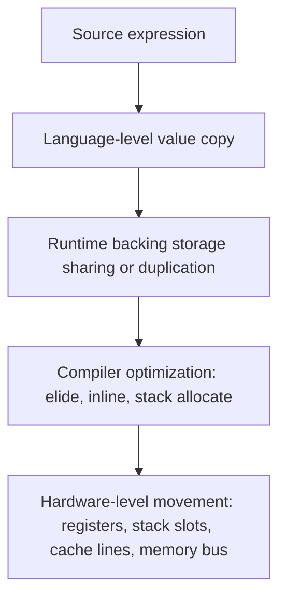
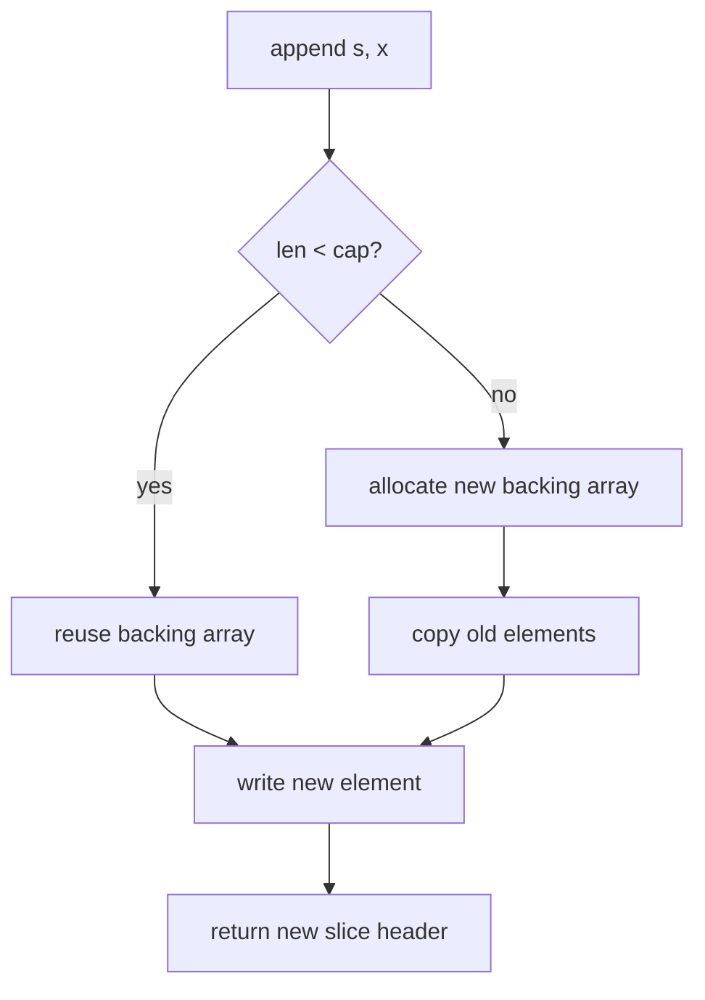
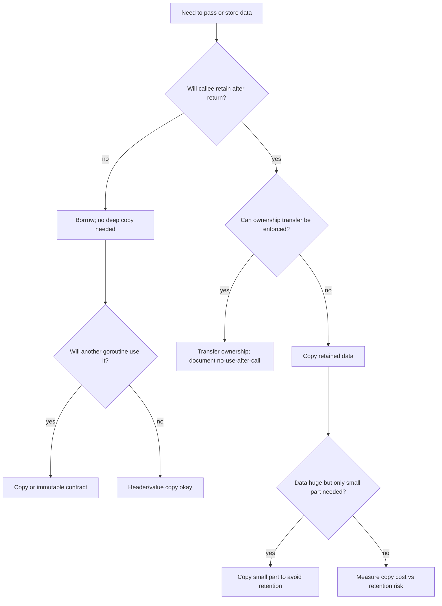

# learn-go-memory-systems-part-017.md

# Go Memory Systems — Part 017

## Copy Semantics: Where Copies Happen, Hidden Allocations, Large Value Movement

> Target reader: Java engineer yang sedang naik level menjadi Go engineer yang mampu melakukan design review, performance review, dan incident diagnosis pada sistem Go production-grade.
>
> Fokus part ini: memahami **apa yang sebenarnya dicopy di Go**, kapan copy itu murah, kapan copy itu mahal, kapan copy memicu allocation, kapan menghindari copy justru menciptakan bug/retention/GC pressure, dan bagaimana membuat API yang jelas ownership-nya.

---

## 0. Posisi Part Ini dalam Seri

Kita sudah membangun fondasi berikut:

1. value representation,
2. pointer,
3. stack dan heap,
4. escape analysis,
5. allocator,
6. struct layout,
7. slice/string/interface,
8. byte/bit/buffer/stream.

Part ini adalah titik konsolidasi.

Banyak bug performa Go bukan karena engineer tidak tahu `append`, `copy`, atau pointer. Bug muncul karena engineer tidak membedakan:

- copy value vs copy backing data,
- copy header vs copy payload,
- copy shallow vs copy deep,
- copy murah vs copy yang membuat GC scan mahal,
- copy yang disengaja vs copy tersembunyi,
- copy untuk safety vs copy yang tidak perlu,
- pointer untuk menghindari copy vs pointer yang memperpanjang lifetime object.

Dalam Java, banyak perpindahan data terasa seperti perpindahan reference. Dalam Go, assignment selalu menyalin value. Tetapi value Go bisa berupa header kecil yang menunjuk backing storage besar. Ini membuat kalimat “Go pass by value” benar, tetapi belum cukup untuk mengambil keputusan design.

---

## 1. Prinsip Inti

### 1.1 Go assignment copies the assigned value

Ketika kita menulis:

```go
b := a
```

Go menyalin value `a` ke `b`.

Yang harus selalu ditanyakan:

> Value itu isinya apa?

Jika `a` adalah `int64`, maka 8 byte integer dicopy.

Jika `a` adalah array `[1024]byte`, maka seluruh array 1024 byte dicopy.

Jika `a` adalah slice `[]byte`, maka slice header dicopy, bukan backing array-nya.

Jika `a` adalah string, maka string header dicopy, bukan byte data-nya.

Jika `a` adalah map, channel, function, atau interface, yang dicopy adalah descriptor/header/word, bukan seluruh struktur internalnya.

### 1.2 Copy does not imply ownership transfer

Copy value tidak otomatis berarti ownership pindah.

Contoh:

```go
func f(buf []byte) {
    x := buf
    _ = x
}
```

`x := buf` hanya menyalin slice header. `x` dan `buf` tetap menunjuk backing array yang sama.

Jika `x[0] = 1`, maka caller bisa melihat perubahan itu.

### 1.3 No copy is not always faster

Menghindari copy bisa membuat:

- lifetime object menjadi lebih panjang,
- GC harus scan lebih banyak pointer,
- cache locality lebih buruk,
- API ownership ambigu,
- data race lebih mudah terjadi,
- memory besar tertahan karena view kecil.

Kadang copy kecil adalah harga murah untuk:

- isolation,
- immutability-by-convention,
- shorter lifetime,
- clearer ownership,
- less retention,
- easier concurrency.

### 1.4 Pointer is not a free “avoid copy” button

Pointer menghindari copy payload, tetapi menambah:

- aliasing,
- nil state,
- possible heap escape,
- GC root/scan pressure,
- data race surface,
- lifetime complexity.

Untuk struct kecil yang pointer-free, value copy sering lebih baik daripada pointer chasing.

---

## 2. Mental Model: Copy Layers

Kita akan memakai empat layer copy.



Saat membaca kode Go, jangan berhenti di layer bahasa.

Tanyakan:

1. Apa value yang dicopy?
2. Apakah value itu membawa pointer ke storage lain?
3. Apakah compiler bisa menghilangkan copy?
4. Apakah copy menyebabkan allocation?
5. Apakah copy memperpanjang lifetime memory?
6. Apakah copy mempengaruhi cache locality?
7. Apakah copy mengubah ownership contract?

---

## 3. Taxonomy Value Copy di Go

| Type | Yang dicopy saat assignment | Backing data ikut dicopy? | Aliasing? |
|---|---:|---:|---:|
| `int`, `bool`, `float64` | scalar bits | ya, karena value-nya scalar | tidak |
| pointer `*T` | address | tidak | ya |
| array `[N]T` | seluruh elemen | ya | tidak, kecuali elemennya pointer/reference-like |
| struct | seluruh field | field value dicopy | tergantung field |
| slice `[]T` | header: ptr,len,cap | tidak | ya |
| string | header: ptr,len | tidak | immutable alias |
| map | map header pointer | tidak | ya |
| channel | channel descriptor pointer | tidak | ya |
| function | function value | tidak sepenuhnya; closure env bisa shared | ya untuk captured state |
| interface | type word + data word | dynamic value handling tergantung representasi | tergantung dynamic value |

---

## 4. Scalar Copy

Scalar copy adalah kasus paling sederhana.

```go
var a int64 = 10
b := a
b++
fmt.Println(a, b) // 10 11
```

Tidak ada aliasing.

Untuk scalar kecil, copy hampir selalu lebih baik daripada pointer.

Buruk:

```go
func inc(p *int64) int64 {
    return *p + 1
}
```

Lebih sederhana:

```go
func inc(v int64) int64 {
    return v + 1
}
```

Pointer hanya layak jika ada alasan nyata:

- perlu mutate caller state,
- optional/nil meaning,
- object besar,
- identity penting,
- shared state memang disengaja,
- interface/method set membutuhkan pointer receiver.

---

## 5. Array Copy

Array di Go adalah value penuh.

```go
var a [1024]byte
b := a // copy 1024 bytes
```

Ini berbeda dari Java array. Di Java, assignment array menyalin reference. Di Go, array assignment menyalin seluruh elemen.

### 5.1 Array as value can be good

Untuk fixed-size data kecil, array value bagus.

```go
type TraceID [16]byte

type SpanID [8]byte
```

Keuntungan:

- immutable-by-convention lebih mudah,
- no heap object if stack allocated,
- no shared backing storage,
- map key bisa array,
- cache locality bagus.

### 5.2 Array as accidental copy can be bad

```go
type Packet struct {
    Payload [64 * 1024]byte
    Len     int
}

func handle(p Packet) {
    // p copied on call boundary
}
```

Setiap call menyalin 64 KiB.

Lebih baik:

```go
type Packet struct {
    Payload []byte
}
```

atau jika ownership object besar memang shared:

```go
func handle(p *Packet) {
}
```

Tapi pointer bukan default. Ia membawa aliasing dan lifetime issue.

---

## 6. Struct Copy

Struct assignment menyalin semua field.

```go
type User struct {
    ID   int64
    Name string
}

u2 := u1
```

`ID` dicopy sebagai scalar.

`Name` dicopy sebagai string header. Byte data string tidak dicopy.

Jadi struct copy adalah field-wise value copy.

### 6.1 Pointer-free small struct

```go
type Point struct {
    X int64
    Y int64
}
```

Passing by value biasanya murah dan jelas.

```go
func distance(a, b Point) float64 {
    dx := a.X - b.X
    dy := a.Y - b.Y
    return math.Sqrt(float64(dx*dx + dy*dy))
}
```

### 6.2 Struct containing reference-like fields

```go
type Request struct {
    Header map[string]string
    Body   []byte
}

r2 := r1
```

Yang terjadi:

- `Header` map header dicopy,
- `Body` slice header dicopy,
- map internal storage shared,
- body backing array shared.

Ini shallow copy.

Jika `r2.Body[0] = 'x'`, `r1.Body` juga melihat perubahan.

Jika `r2.Header["x"] = "y"`, `r1.Header` juga melihat perubahan.

### 6.3 Struct with sync primitive must not be copied after use

```go
type Counter struct {
    mu sync.Mutex
    n  int64
}

func bad(c Counter) {
    c.mu.Lock()
    defer c.mu.Unlock()
    c.n++
}
```

Copying struct with `sync.Mutex`, `sync.RWMutex`, `sync.Cond`, `sync.WaitGroup`, or atomic fields can create correctness bugs.

Pattern:

```go
type Counter struct {
    mu sync.Mutex
    n  int64
}

func (c *Counter) Inc() {
    c.mu.Lock()
    defer c.mu.Unlock()
    c.n++
}
```

The important rule is not “always pointer receiver”. The rule is:

> Types with identity, internal synchronization, or mutable internal invariants should normally not be copied after first use.

### 6.4 Struct copy and GC scan cost

Copying pointer-containing struct can duplicate pointers, increasing root/retention opportunities.

```go
type Record struct {
    Key   []byte
    Value []byte
    Meta  map[string]string
}
```

A copy of `Record` does not duplicate payload, but duplicates references to payload.

This can accidentally retain data longer.

---

## 7. Slice Copy

Slice is a header.

Conceptual representation:

```go
type sliceHeader struct {
    data *T
    len  int
    cap  int
}
```

Assignment copies this header.

```go
s1 := []byte{1, 2, 3}
s2 := s1
s2[0] = 9
fmt.Println(s1) // [9 2 3]
```

### 7.1 Copy header vs copy data

Header copy:

```go
s2 := s1
```

Data copy:

```go
s2 := append([]byte(nil), s1...)
```

or:

```go
s2 := make([]byte, len(s1))
copy(s2, s1)
```

### 7.2 copy builtin

```go
n := copy(dst, src)
```

`copy` copies elements from source to destination and returns number of copied elements. It copies at most `min(len(dst), len(src))` elements.

It also handles overlapping source and destination.

```go
s := []byte("abcdef")
copy(s[2:], s[:4])
fmt.Println(string(s))
```

The exact resulting bytes depend on overlap semantics defined for copy as safe for overlap, not as naive forward loop.

### 7.3 append may or may not copy backing data

```go
s2 := append(s1, x)
```

If `cap(s1)` has room, append writes into existing backing array.

If not, append allocates a new backing array and copies existing elements.

This means append is a conditional copy.



### 7.4 Append aliasing hazard

```go
func addBang(s []byte) []byte {
    return append(s, '!')
}
```

This function may mutate the caller's backing array or allocate a new one. The caller must use the returned slice.

```go
s = addBang(s)
```

Never assume append always isolates.

### 7.5 Full slice expression as copy-control tool

```go
view := s[:n:n]
```

Now `cap(view) == len(view)`. If someone appends to `view`, append must allocate.

This is useful to prevent accidental mutation beyond visible range.

```go
func prefix(s []byte, n int) []byte {
    if n > len(s) {
        n = len(s)
    }
    return s[:n:n]
}
```

This still shares visible bytes. It only prevents append from writing into extra capacity.

### 7.6 Slice retention through shallow copy

```go
func firstLine(file []byte) []byte {
    i := bytes.IndexByte(file, '\n')
    if i < 0 {
        return file
    }
    return file[:i]
}
```

If `file` is 200 MiB and first line is 20 bytes, returned slice retains the 200 MiB backing array.

Correct if long-term retention:

```go
func firstLineCopy(file []byte) []byte {
    i := bytes.IndexByte(file, '\n')
    if i < 0 {
        return bytes.Clone(file)
    }
    return bytes.Clone(file[:i])
}
```

Copy is intentionally added to reduce retention.

---

## 8. String Copy

String value is conceptually:

```go
type stringHeader struct {
    data *byte
    len  int
}
```

String assignment copies header.

String data is immutable.

```go
s1 := "hello"
s2 := s1 // header copy
```

### 8.1 string to []byte copies

```go
b := []byte(s)
```

This creates mutable bytes, so it must copy.

### 8.2 []byte to string copies

```go
s := string(b)
```

This creates immutable string, so normal conversion copies.

Compiler can optimize certain temporary cases, but API design must assume conversion creates independent data.

### 8.3 Substring can retain original data

```go
small := big[:10]
```

If `small` is retained, it may keep `big` data alive.

Use:

```go
small = strings.Clone(small)
```

when profiling proves retention matters.

### 8.4 strings.Builder avoids repeated intermediate copies

Bad:

```go
var s string
for _, part := range parts {
    s += part
}
```

Better:

```go
var b strings.Builder
for _, part := range parts {
    b.WriteString(part)
}
s := b.String()
```

But do not reuse a builder after exposing a string unless you understand its contract. Treat builder output as a boundary.

---

## 9. Map Copy

Map assignment copies the map header, not entries.

```go
m1 := map[string]int{"a": 1}
m2 := m1
m2["a"] = 2
fmt.Println(m1["a"]) // 2
```

### 9.1 Map clone

Manual shallow clone:

```go
func cloneMap[K comparable, V any](src map[K]V) map[K]V {
    if src == nil {
        return nil
    }
    dst := make(map[K]V, len(src))
    for k, v := range src {
        dst[k] = v
    }
    return dst
}
```

This clones buckets logically, but value copy is shallow.

If `V` is `[]byte`, backing array is still shared.

```go
func cloneByteMap(src map[string][]byte) map[string][]byte {
    if src == nil {
        return nil
    }
    dst := make(map[string][]byte, len(src))
    for k, v := range src {
        dst[k] = bytes.Clone(v)
    }
    return dst
}
```

### 9.2 Map key copy

When inserting key into map, key value is stored according to map implementation semantics.

A string key stores string header and references string bytes.

If string was derived from a huge buffer, retention can happen.

Example:

```go
key := string(line[:10])
cache[key] = value
```

Normal `string([]byte)` conversion copies bytes, so key is independent. This is often good.

Unsafe zero-copy conversion here would be dangerous if `line` buffer is reused or huge.

### 9.3 Map values and aliasing

```go
type Entry struct {
    Data []byte
}

m["x"] = Entry{Data: buf}
```

The `Entry` value is copied into the map, but `Data` backing array is shared.

If `buf` is reused, map content changes/corrupts.

Correct:

```go
m["x"] = Entry{Data: bytes.Clone(buf)}
```

when map owns the value.

---

## 10. Channel Copy

Channel value assignment copies channel descriptor. All copies refer to the same channel.

```go
ch1 := make(chan int)
ch2 := ch1
```

Sending through `ch2` receives through `ch1`.

### 10.1 Sending values copies the sent value

```go
type Job struct {
    Payload []byte
}

ch <- job
```

The `Job` struct value is copied into channel buffer or to receiver. But `Payload` slice header points to same backing array.

If sender reuses `Payload` after send, receiver may see corrupted data.

Bad:

```go
buf := make([]byte, 4096)
for {
    n, _ := r.Read(buf)
    ch <- Job{Payload: buf[:n]}
}
```

Receiver sees same backing array reused.

Correct options:

1. copy per message:

```go
payload := bytes.Clone(buf[:n])
ch <- Job{Payload: payload}
```

2. ownership transfer with buffer pool and strict lifecycle:

```go
payload := pool.Get().([]byte)[:n]
// fill payload
ch <- Job{Payload: payload, Release: func() { pool.Put(payload[:cap(payload)]) }}
```

But this requires rigorous contract.

### 10.2 Channel buffer as hidden retention

Buffered channel stores copied values until received.

If values contain slices/pointers, the channel retains backing storage.

```go
jobs := make(chan Job, 10_000)
```

If each job references 1 MiB, channel can retain ~10 GiB logical payload.

The channel buffer stores headers, but headers point to large payloads.

---

## 11. Function and Closure Copy

Function values can carry captured environment.

```go
func makeHandler(buf []byte) func() int {
    return func() int {
        return len(buf)
    }
}
```

The returned function retains `buf`.

Copying the function value copies a reference to closure state, not the entire captured data.

```go
f1 := makeHandler(bigBuf)
f2 := f1
```

Both retain same closure environment.

### 11.1 Method value hidden capture

```go
type Big struct {
    Data [1 << 20]byte
}

func (b Big) Work() {}

func makeFn(b Big) func() {
    return b.Work
}
```

A method value can capture receiver. If receiver is large value, this may copy/retain large data.

Pointer receiver changes semantics:

```go
func (b *Big) Work() {}
```

But pointer receiver introduces aliasing and lifetime extension.

---

## 12. Interface Copy

Interface value copy copies type/data words.

```go
var x any = user
var y = x
```

The dynamic value may be stored directly or indirectly depending on type size and representation. Do not assume interface conversion is allocation-free in hot paths.

### 12.1 Interface copy can hide shallow copy

```go
type Event struct {
    Payload []byte
}

var a any = Event{Payload: buf}
b := a
```

Now both interface values logically reference dynamic `Event`, whose payload references `buf`.

### 12.2 Variadic `...any` creates temporary interface values

```go
fmt.Println(id, name, payload)
```

Arguments are converted to `any` values. This may allocate depending on type, escape, and call context.

For non-hot path logging, fine.

For high-throughput data path, measure.

### 12.3 `[]T` to `[]any` requires element conversion

This is not allowed directly:

```go
// var xs []int
// var ys []any = xs // compile error
```

You must allocate/fill:

```go
ys := make([]any, len(xs))
for i, x := range xs {
    ys[i] = x
}
```

Each element becomes an interface value.

---

## 13. Hidden Copies in Common Operations

### 13.1 Assignment

```go
b := a
```

Always copies value.

### 13.2 Function call

```go
f(x)
```

Argument values are passed by value.

For slice/map/channel/interface, header words are copied.

For large struct/array, payload is logically copied, though compiler may optimize.

### 13.3 Return value

```go
return x
```

Return value is passed according to ABI/compiler optimization. Semantically it is value return. Compiler may use registers, stack slots, or elide copies.

API design should be semantic first, then measured.

### 13.4 Append

Can copy old elements into new backing array.

### 13.5 String/byte conversion

Usually copies because mutability/immutability boundary.

### 13.6 Map insert

Copies key and value into map storage.

But reference-like fields still alias.

### 13.7 Channel send

Copies sent value.

But reference-like fields still alias.

### 13.8 Interface conversion

Creates interface representation and may trigger allocation.

### 13.9 Reflection

Can allocate when values are boxed, addressed, converted, or escaped.

### 13.10 JSON encode/decode

Often copies into new strings, slices, maps, interface trees.

`map[string]any` is flexible but allocation-heavy.

### 13.11 `fmt.Sprintf`

Builds string output and boxes args into `any`.

Use `strconv.Append*` or `strings.Builder` in hot paths.

---

## 14. Hidden Allocation vs Hidden Copy

A copy does not always allocate.

A heap allocation does not always imply large copy.

Examples:

```go
x := y // copy, no allocation necessarily
```

```go
p := &T{} // allocation may be stack or heap depending escape
```

```go
s = append(s, x) // may allocate and copy
```

```go
b := []byte(str) // allocates new byte backing array and copies
```

```go
var a any = largeStruct // may allocate/copy depending representation and escape
```

The performance question is not “is there copy?” but:

1. How many bytes?
2. How often?
3. On hot path?
4. Does it allocate?
5. Does it increase live heap?
6. Does it increase pointer graph?
7. Does it reduce retention or increase retention?
8. Does it improve isolation?

---

## 15. Large Value Movement

Large value movement means large payload copied across boundaries.

### 15.1 Large array field

```go
type Page struct {
    Data [4096]byte
}

func process(p Page) {}
```

Each call semantically copies 4 KiB.

May be okay if:

- low frequency,
- stack/register optimized,
- value semantics desired,
- no aliasing desired.

May be bad if:

- millions/sec,
- large arrays,
- chained calls,
- copied into interface/channel/map.

### 15.2 Large struct with no pointers

```go
type Row struct {
    A, B, C, D, E, F, G, H uint64
}
```

64-byte copy may be cheaper than pointer chasing if it improves locality.

Do not blindly convert to pointer.

### 15.3 Large struct with many pointers

Copying header fields is not expensive in bytes, but duplicates references and can retain object graph.

```go
type Session struct {
    User  *User
    Cache map[string][]byte
    Trace []Span
}
```

A copy of `Session` can keep a lot alive.

### 15.4 Hot/cold split

If large object has small hot fields and large cold payload:

```go
type Request struct {
    ID     uint64
    Method uint8
    Flags  uint32
    Body   []byte
    Meta   map[string]string
}
```

You can split:

```go
type RequestHot struct {
    ID     uint64
    Method uint8
    Flags  uint32
}

type Request struct {
    Hot  RequestHot
    Body []byte
    Meta map[string]string
}
```

Then pass `RequestHot` by value in hot path.

---

## 16. Copy and Escape Analysis

Copy itself is not automatically heap allocation.

But copy can interact with escape.

### 16.1 Returning pointer forces lifetime extension

```go
func NewPoint(x, y int) *Point {
    p := Point{X: x, Y: y}
    return &p
}
```

`p` must live after function returns, so it escapes.

### 16.2 Returning value may avoid heap

```go
func NewPoint(x, y int) Point {
    return Point{X: x, Y: y}
}
```

Caller receives value. Compiler can optimize.

### 16.3 Interface can force escape

```go
func Box(p Point) any {
    return p
}
```

Dynamic value may need storage whose lifetime extends beyond function.

### 16.4 Closure capture can retain copied variables

```go
func makeFn(x Large) func() int {
    return func() int { return x.N }
}
```

The closure retains `x`.

### 16.5 Diagnostic command

```bash
go test -run=^$ -bench=. -benchmem
go test -c -gcflags='-m=2'
go build -gcflags='-m=2'
```

Read reports as hints, not final truth. Verify with benchmark/profile.

---

## 17. Copy and GC

### 17.1 Pointer-free copies are GC-cheap

```go
type Key [32]byte
```

Copying `Key` does not add pointer scan work.

### 17.2 Pointer-rich copies can retain graphs

```go
type Node struct {
    Parent *Node
    Child  []*Node
    Data   []byte
}
```

Copying `Node` duplicates references to graph.

The bytes copied may be small, but retention impact can be large.

### 17.3 Copy as GC optimization

Copying small relevant data out of large buffer can reduce live heap.

```go
name := string(bytes.Clone(rawName))
```

Better example:

```go
name := string(rawName) // copies rawName bytes into string
```

This prevents retaining the entire input buffer.

### 17.4 Copy as GC pessimization

Copying pointer-rich object creates more references and potentially longer lifetime.

```go
history = append(history, req)
```

If `req` contains body slices, maps, context values, user object pointers, history now retains all.

Better:

```go
history = append(history, RequestSummary{
    ID:     req.ID,
    Status: req.Status,
})
```

Copy only what is needed.

---

## 18. Copy and Cache Locality

CPU does not read individual Go values in isolation. It moves cache lines.

Common cache line size is often 64 bytes on modern platforms, but do not hard-code correctness to it unless platform-specific.

### 18.1 Value copy may improve locality

```go
type Point struct { X, Y float64 }
points := []Point{...}
```

Sequential iteration over `[]Point` is cache-friendly.

Pointer version:

```go
points := []*Point{...}
```

May scatter objects across heap. More pointer chasing, worse locality, more GC scanning.

### 18.2 Copy too much can waste bandwidth

```go
type Big struct {
    Hot  int64
    Cold [1024]byte
}
```

If only `Hot` is needed, copying `Big` moves cold data unnecessarily.

Split hot and cold.

### 18.3 Struct of arrays vs array of structs

Array of structs:

```go
type Event struct {
    Timestamp int64
    Kind      uint16
    Payload   []byte
}
var events []Event
```

Struct of arrays:

```go
type EventColumns struct {
    Timestamp []int64
    Kind      []uint16
    Payload   [][]byte
}
```

SoA can reduce movement if you process only one column.

---

## 19. Copy and Concurrency

### 19.1 Copy can isolate goroutines

Bad:

```go
for scanner.Scan() {
    b := scanner.Bytes()
    go func() {
        process(b)
    }()
}
```

`scanner.Bytes()` returns data that may be overwritten by next scan.

Correct:

```go
for scanner.Scan() {
    b := bytes.Clone(scanner.Bytes())
    go func(b []byte) {
        process(b)
    }(b)
}
```

The copy is a concurrency boundary.

### 19.2 Copying header is not isolation

```go
func handleAsync(buf []byte) {
    local := buf
    go process(local)
}
```

`local` is only header copy. Caller may still mutate backing array.

### 19.3 Sending over channel copies value, not deep data

```go
ch <- Payload{Data: buf}
```

This is not deep copy.

### 19.4 Immutable-by-contract

If you do not copy, document immutability.

```go
// ParseFrame borrows b. Caller must not mutate b while the returned Frame is used.
func ParseFrame(b []byte) (Frame, error)
```

Better for safe API:

```go
// ParseFrameCopy copies retained fields. Caller may reuse b after return.
func ParseFrameCopy(b []byte) (Frame, error)
```

---

## 20. Copy and API Ownership

Every API handling slices/strings/buffers needs an ownership answer.

### 20.1 Borrowing API

```go
// Write writes p before returning. It does not retain p.
func (w *Writer) Write(p []byte) (int, error)
```

Borrowing is cheap but caller must keep data valid only during call.

### 20.2 Retaining API

```go
// Add stores a copy of key and value.
func (c *Cache) Add(key string, value []byte) {
    c.items[key] = bytes.Clone(value)
}
```

Retaining requires copy unless ownership transfer is explicit.

### 20.3 Ownership transfer API

```go
type Buffer struct {
    B []byte
}

// Enqueue takes ownership of b. Caller must not use b after call.
func (q *Queue) Enqueue(b []byte) {
    q.ch <- b
}
```

This is efficient but dangerous unless enforced by design.

### 20.4 Append-style API

```go
func AppendFrame(dst []byte, f Frame) []byte {
    dst = append(dst, byte(f.Type))
    dst = binary.BigEndian.AppendUint32(dst, f.Len)
    dst = append(dst, f.Payload...)
    return dst
}
```

Caller owns buffer; callee appends and returns updated slice.

This avoids hidden allocation if caller preallocates.

### 20.5 Fill-style API

```go
func EncodeFrame(dst []byte, f Frame) (int, error) {
    if len(dst) < FrameSize(f) {
        return 0, io.ErrShortBuffer
    }
    // fill dst
    return n, nil
}
```

Caller controls allocation completely.

---

## 21. Copy Decision Framework



Rule of thumb:

- Borrow for synchronous use.
- Copy for retention.
- Transfer ownership only inside tight internal components.
- Avoid unsafe zero-copy at public API boundary.
- Measure hot path.

---

## 22. Common Anti-Patterns

### 22.1 Pointer to everything

```go
type Config struct {
    Timeout *time.Duration
    Retries *int
    Enabled *bool
}
```

Sometimes needed for tri-state config. Often unnecessary.

Costs:

- nil checks,
- allocations,
- GC scanning,
- poor locality.

### 22.2 Returning borrowed buffer as if owned

```go
func Token() []byte {
    return internalScratch[:n]
}
```

Caller may retain unstable memory.

### 22.3 Storing request body slices directly

```go
cache[id] = reqBody[:100]
```

Can retain whole body.

### 22.4 `[]byte` to `string` unsafe conversion for map key

If buffer reused, map key corrupts conceptually. Even if string immutable contract is violated unsafely, behavior is invalid.

### 22.5 Copying structs with locks

```go
items = append(items, lockedObject)
```

Can duplicate lock state.

### 22.6 Channel of large values without thought

```go
ch := make(chan [1 << 20]byte, 100)
```

Channel buffer can contain 100 MiB of copied arrays.

### 22.7 Interface logging in hot loop

```go
for _, item := range items {
    log.Printf("item=%v", item)
}
```

May allocate through formatting/boxing/reflection.

Use structured logging carefully and measure.

### 22.8 Copying pointer-rich request into history

```go
history = append(history, req)
```

May retain body, context, headers, auth object, database handles indirectly.

Use summary struct.

---

## 23. Production Patterns

### 23.1 Copy at trust boundary

At network boundary, copy only if data must outlive read buffer.

```go
func handleLine(line []byte) {
    key := string(line) // copy into immutable string
    store(key)
}
```

### 23.2 Borrow internally

Inside synchronous parser pipeline:

```go
type Field struct {
    Name  []byte // borrowed
    Value []byte // borrowed
}
```

Document borrowed lifetime.

### 23.3 Own at async boundary

Before goroutine/channel/cache:

```go
owned := bytes.Clone(borrowed)
ch <- owned
```

### 23.4 Summary instead of full object

```go
type RequestSummary struct {
    ID        uint64
    UserID    uint64
    Status    uint16
    BodyBytes int
}
```

Store summaries, not full request object graphs.

### 23.5 Append into caller buffer

```go
func (m Message) AppendTo(dst []byte) []byte {
    dst = binary.BigEndian.AppendUint64(dst, m.ID)
    dst = append(dst, m.Payload...)
    return dst
}
```

### 23.6 Clone only when profile says retention

Use `strings.Clone`/`bytes.Clone` when you intentionally break retention, not as blanket habit.

---

## 24. Java Engineer Translation

### 24.1 Java reference assignment

```java
byte[] a = new byte[10];
byte[] b = a;
b[0] = 1;
```

`a` and `b` reference same array.

### 24.2 Go array assignment

```go
var a [10]byte
b := a
b[0] = 1
```

`a` unchanged.

### 24.3 Go slice assignment

```go
a := make([]byte, 10)
b := a
b[0] = 1
```

`a` changed.

The mistake is mapping Java array to Go slice without understanding header/backing array split.

### 24.4 Java object reference vs Go struct value

Java:

```java
User u2 = u1;
```

Reference copy.

Go:

```go
u2 := u1
```

Struct value copy.

But if struct contains slices/maps/pointers, inner data is shared.

---

## 25. Diagnostic Workflow

When suspecting copy/allocation issue:

### Step 1: Benchmark

```bash
go test -bench=. -benchmem ./...
```

Look at:

- ns/op,
- B/op,
- allocs/op.

### Step 2: Allocation profile

```bash
go test -bench=BenchmarkX -benchmem -memprofile=mem.out

go tool pprof -alloc_space ./pkg.test mem.out

go tool pprof -inuse_space ./pkg.test mem.out
```

Use `alloc_space` for allocation churn.

Use `inuse_space` for retained heap.

### Step 3: Escape analysis

```bash
go test -run=^$ -bench=BenchmarkX -gcflags='-m=2'
```

Look for:

- `escapes to heap`,
- `moved to heap`,
- interface conversions,
- closure captures,
- too-large stack objects.

### Step 4: Source review

Check:

- slice/string conversions,
- append growth,
- map insertion,
- channel send,
- goroutine capture,
- interface/`any` boundaries,
- reflection/formatting,
- copying pointer-rich structs,
- retaining subslices/substrings.

### Step 5: Design-level fix

Do not blindly micro-optimize.

Choose one:

- reduce retention by copying small data,
- reduce allocation by reusing caller buffer,
- reduce pointer graph by value structs,
- reduce copy by splitting hot/cold object,
- clarify ownership transfer,
- replace dynamic interface path with typed path,
- stream instead of buffer.

---

## 26. Mini Lab 1: Header Copy vs Data Copy

Create `copy_lab_test.go`:

```go
package copylab

import (
    "bytes"
    "testing"
)

func headerCopy(b []byte) []byte {
    return b
}

func dataCopyAppend(b []byte) []byte {
    return append([]byte(nil), b...)
}

func dataCopyClone(b []byte) []byte {
    return bytes.Clone(b)
}

func BenchmarkHeaderCopy(b *testing.B) {
    src := make([]byte, 4096)
    b.ReportAllocs()
    for b.Loop() {
        _ = headerCopy(src)
    }
}

func BenchmarkDataCopyAppend(b *testing.B) {
    src := make([]byte, 4096)
    b.ReportAllocs()
    for b.Loop() {
        _ = dataCopyAppend(src)
    }
}

func BenchmarkDataCopyClone(b *testing.B) {
    src := make([]byte, 4096)
    b.ReportAllocs()
    for b.Loop() {
        _ = dataCopyClone(src)
    }
}
```

Expected learning:

- header copy should be allocation-free,
- data copy allocates/copies backing storage,
- clone/append are explicit ownership boundary tools.

---

## 27. Mini Lab 2: Retention Bug

```go
package copylab

import (
    "bytes"
    "testing"
)

var sink [][]byte

func retainView(big []byte) []byte {
    idx := bytes.IndexByte(big, '\n')
    if idx < 0 {
        return big
    }
    return big[:idx]
}

func retainCopy(big []byte) []byte {
    idx := bytes.IndexByte(big, '\n')
    if idx < 0 {
        return bytes.Clone(big)
    }
    return bytes.Clone(big[:idx])
}

func BenchmarkRetainView(b *testing.B) {
    sink = sink[:0]
    b.ReportAllocs()
    for b.Loop() {
        big := bytes.Repeat([]byte("x"), 1<<20)
        big[10] = '\n'
        sink = append(sink, retainView(big))
    }
}

func BenchmarkRetainCopy(b *testing.B) {
    sink = sink[:0]
    b.ReportAllocs()
    for b.Loop() {
        big := bytes.Repeat([]byte("x"), 1<<20)
        big[10] = '\n'
        sink = append(sink, retainCopy(big))
    }
}
```

Expected learning:

- view may have fewer copy bytes but more retained memory,
- copy may reduce live heap,
- `alloc_space` and `inuse_space` tell different stories.

---

## 28. Mini Lab 3: Value vs Pointer Slice

```go
package copylab

import "testing"

type Point struct {
    X, Y int64
}

func sumValues(xs []Point) int64 {
    var s int64
    for _, x := range xs {
        s += x.X + x.Y
    }
    return s
}

func sumPointers(xs []*Point) int64 {
    var s int64
    for _, x := range xs {
        s += x.X + x.Y
    }
    return s
}

func BenchmarkSumValues(b *testing.B) {
    xs := make([]Point, 1_000_000)
    b.ReportAllocs()
    for b.Loop() {
        _ = sumValues(xs)
    }
}

func BenchmarkSumPointers(b *testing.B) {
    vals := make([]Point, 1_000_000)
    xs := make([]*Point, len(vals))
    for i := range vals {
        xs[i] = &vals[i]
    }
    b.ReportAllocs()
    for b.Loop() {
        _ = sumPointers(xs)
    }
}
```

Expected learning:

- pointer version may not allocate in benchmark loop,
- but pointer chasing can be slower,
- `[]Point` has better locality,
- pointer is not automatically faster.

---

## 29. Mini Lab 4: Channel Send Shallow Copy

```go
package main

import "fmt"

type Job struct {
    Data []byte
}

func main() {
    ch := make(chan Job, 1)

    buf := []byte("hello")
    ch <- Job{Data: buf}

    buf[0] = 'X'

    job := <-ch
    fmt.Println(string(job.Data)) // Xello
}
```

Fix:

```go
ch <- Job{Data: append([]byte(nil), buf...)}
```

Expected learning:

- channel send copies `Job`,
- `Job.Data` is a slice header,
- backing data is shared unless cloned.

---

## 30. Review Checklist

Use this checklist during PR review.

### 30.1 Function boundary

- Is argument passed by value intentionally?
- Is struct large?
- Does struct contain lock/atomic state?
- Does struct contain reference-like fields?
- Does callee retain input after return?
- Is ownership documented?

### 30.2 Slice/string boundary

- Is this header copy or data copy?
- Can returned slice retain large backing array?
- Can returned substring retain large string?
- Is `append` allowed to mutate caller backing array?
- Should full slice expression be used?
- Should `bytes.Clone` or `strings.Clone` be used?

### 30.3 Map/channel/cache boundary

- Does inserted value contain slices/maps/pointers?
- Is map/cache now owner of data?
- Does buffered channel retain large payloads?
- Is async processing using borrowed buffer unsafely?

### 30.4 Interface/reflection/logging boundary

- Is hot path converting to `any`?
- Is `fmt` used in tight loops?
- Is `map[string]any` necessary?
- Is reflection creating allocation churn?

### 30.5 Concurrency boundary

- Is data copied before goroutine if source buffer may be reused?
- Is immutable contract explicit?
- Is ownership transfer enforceable?
- Could shallow copy create data race?

### 30.6 GC/memory boundary

- Does copy reduce retention?
- Does pointer avoid copy but increase heap lifetime?
- Does copied object contain many pointers?
- Is value layout pointer-free where possible?
- Are profiles showing allocation churn or retained heap?

---

## 31. Design Rubric

| Situation | Prefer | Why |
|---|---|---|
| Small pointer-free value | pass by value | locality, no aliasing, GC-cheap |
| Large array/struct in hot path | pointer or split hot/cold | avoid large movement |
| Struct with mutex/identity | pointer receiver | avoid invalid copy |
| Slice used synchronously only | borrow | no extra allocation |
| Slice retained after return | copy or ownership transfer | avoid caller mutation/retention ambiguity |
| Slice sent to goroutine | copy unless immutable/owned | avoid race/corruption |
| Small field from huge buffer retained | copy small field | avoid retaining huge backing storage |
| Public API | safe copy or clear contract | avoid misuse |
| Internal hot path | borrow/transfer with discipline | performance with controlled risk |
| Map/cache value | copy owned data | avoid external mutation |
| Logging hot path | avoid `fmt`/`any` churn | reduce allocation |

---

## 32. Case Study: Streaming Protocol Parser

### 32.1 Problem

You read frames from network:

```text
+--------+---------+---------+
| type 1 | len 4   | payload |
+--------+---------+---------+
```

You want to parse without allocating per frame.

### 32.2 Borrowed frame view

```go
type FrameView struct {
    Type    byte
    Payload []byte // borrowed
}

func ParseFrameView(buf []byte) (FrameView, int, error) {
    if len(buf) < 5 {
        return FrameView{}, 0, io.ErrUnexpectedEOF
    }
    n := int(binary.BigEndian.Uint32(buf[1:5]))
    if n < 0 || len(buf) < 5+n {
        return FrameView{}, 0, io.ErrUnexpectedEOF
    }
    return FrameView{
        Type:    buf[0],
        Payload: buf[5 : 5+n],
    }, 5 + n, nil
}
```

Contract:

- FrameView borrows `buf`.
- Caller must process before buffer reuse.
- Do not store view in cache/channel/goroutine unless copied.

### 32.3 Owned frame

```go
type Frame struct {
    Type    byte
    Payload []byte // owned
}

func ParseFrameCopy(buf []byte) (Frame, int, error) {
    v, n, err := ParseFrameView(buf)
    if err != nil {
        return Frame{}, 0, err
    }
    return Frame{
        Type:    v.Type,
        Payload: bytes.Clone(v.Payload),
    }, n, nil
}
```

Now caller may reuse input buffer.

### 32.4 Dual API pattern

Expose both:

```go
func ParseFrameView(buf []byte) (FrameView, int, error)
func ParseFrameCopy(buf []byte) (Frame, int, error)
```

Use view in internal synchronous loop. Use copy at async/public boundary.

---

## 33. Case Study: Request Audit Log

Bad:

```go
type Request struct {
    ID      string
    Headers map[string][]string
    Body    []byte
    User    *User
    Ctx     context.Context
}

var audit []Request

audit = append(audit, req)
```

This retains:

- body backing array,
- headers map,
- user graph,
- context values,
- possibly cancellation tree.

Better:

```go
type AuditRecord struct {
    ID        string
    UserID    string
    BodyBytes int
    Status    int
    CreatedAt time.Time
}

audit = append(audit, AuditRecord{
    ID:        req.ID,
    UserID:    req.User.ID,
    BodyBytes: len(req.Body),
    Status:    status,
    CreatedAt: time.Now(),
})
```

The best copy is not always deep copy. Sometimes it is selective copy.

---

## 34. Case Study: Cache Key from Request Buffer

Input parser reads request line into reusable buffer.

Bad if using unsafe zero-copy string:

```go
key := unsafe.String(&line[0], len(line))
cache[key] = value
```

When buffer reused, key points to mutated bytes. This violates string immutability assumptions.

Correct:

```go
key := string(line)
cache[key] = value
```

The copy is required because map retains key.

This is a good copy.

---

## 35. Copy Budgeting

For high-throughput systems, treat copies as budgeted operations.

Example per request:

| Boundary | Copy? | Reason |
|---|---:|---|
| kernel to Go buffer | yes | unavoidable user-space read unless OS-assisted path |
| parse frame view | no | synchronous borrowed parse |
| auth token key | yes | retained in map/cache |
| logging summary | yes, small | avoid retaining body |
| forward body to upstream | stream | avoid full buffering |
| retry storage | maybe | must own data if replay required |

A clear copy budget is better than vague “zero-copy”.

---

## 36. Zero-Copy Connection

Part 018 will go deep on zero-copy, but the key bridge is this:

> Zero-copy is an ownership/lifetime problem before it is a performance technique.

If you cannot answer who owns bytes, how long they live, who can mutate them, and whether a view can outlive its source, you are not ready for zero-copy.

Many “zero-copy” bugs are simply copy semantics bugs hidden behind `unsafe`.

---

## 37. Practical Heuristics

### 37.1 Copy deliberately at boundaries

Good boundaries for copy:

- async boundary,
- cache boundary,
- map key/value retention,
- security boundary,
- public API boundary,
- long-term storage,
- converting mutable bytes to immutable string,
- extracting small value from huge buffer.

### 37.2 Avoid copy in tight synchronous path

Good places to borrow:

- parser internal loop,
- encoder append function,
- `io.Reader`/`Writer` pipeline,
- temporary buffer processing,
- checksum/hash stream.

### 37.3 Use value types for identity-less data

Good value types:

- `TraceID [16]byte`,
- `SpanID [8]byte`,
- `Point`,
- `Money` with fixed fields,
- small config snapshot,
- enum/bitmask state.

### 37.4 Use pointer for identity/lifecycle/mutation

Good pointer types:

- object with mutex,
- service/client/connection,
- large mutable aggregate,
- object with explicit `Close`,
- tree/graph node,
- state machine instance.

---

## 38. Common Interview-Level Traps

### Trap 1

```go
func f(s []int) {
    s = append(s, 1)
}
```

Does caller see change?

Answer: Maybe backing array content changes if capacity was available, but caller's slice header length is unchanged. Caller does not receive updated header.

### Trap 2

```go
func f(s []int) {
    s[0] = 99
}
```

Caller sees change if len > 0 because backing array shared.

### Trap 3

```go
m2 := m1
m2["x"] = 1
```

Same map.

### Trap 4

```go
var a [3]int
b := a
b[0] = 1
```

`a` unchanged.

### Trap 5

```go
type T struct { B []byte }
t2 := t1
t2.B[0] = 1
```

`t1.B` sees mutation.

### Trap 6

```go
ch <- t
```

`t` value is copied into channel, but inner references are shared.

### Trap 7

```go
go func() { use(buf) }()
```

Closure captures variable/value depending pattern, but underlying slice data can still be shared/reused. Copy if needed.

---

## 39. Production Incident Patterns

### 39.1 OOM after adding audit history

Cause:

- copied full request struct into history,
- retained bodies and context.

Fix:

- store summary only,
- cap history,
- avoid context retention.

### 39.2 Data corruption in worker pool

Cause:

- sent slice view over channel,
- producer reused buffer.

Fix:

- clone before send,
- or transfer owned buffer from pool.

### 39.3 GC spike after “optimization” to pointers

Cause:

- changed `[]SmallStruct` to `[]*SmallStruct`,
- created many heap objects,
- worsened locality and GC scan.

Fix:

- restore value slice,
- split hot/cold only where measured.

### 39.4 Latency spike from repeated string concatenation

Cause:

- loop `s += part`,
- repeated allocation/copy.

Fix:

- `strings.Builder`,
- pre-size with `Grow` if known.

### 39.5 Memory retained by small substrings

Cause:

- kept small slices/strings from huge input.

Fix:

- clone retained small data.

---

## 40. What to Memorize

Memorize these invariants:

1. Go assignment copies values.
2. Slice/string/map/channel/function/interface values are small descriptors or words that can refer to shared storage.
3. Array assignment copies all elements.
4. Struct assignment copies fields shallowly.
5. `append` may reuse backing array or allocate/copy.
6. `copy` copies elements, not capacity.
7. Channel send copies the sent value, not deep object graph.
8. Map insert copies key/value values, not deep object graph.
9. Interface conversion can hide allocation and retention.
10. Copy can be an optimization when it reduces retention.
11. Avoiding copy can be a pessimization when it extends lifetime or worsens locality.
12. Ownership contract matters more than clever micro-optimization.

---

## 41. Part 017 Summary

Copy semantics in Go are deceptively simple at language level and subtle at system level.

The central mental model:

```text
Assignment copies the value.
But the value may itself be a descriptor pointing to shared memory.
```

For production Go, copy decisions should be made using five questions:

1. What is copied?
2. Is backing storage shared?
3. Who owns the data after this boundary?
4. How long can the data live?
5. What is cheaper: copy bytes now, or retain/scan/coordinate shared memory later?

A top-tier Go engineer does not blindly minimize copies. They place copies where they clarify ownership, reduce retention, protect concurrency, and simplify correctness. They remove copies only where profiling proves the copy matters and lifetime contracts remain safe.

---

## 42. Bridge to Part 018

Part 018 continues directly from this part:

```text
learn-go-memory-systems-part-018.md
```

Topic:

```text
Zero-copy in Go: what is real, what is illusion, what is unsafe, what is OS-assisted
```

Now that copy semantics are clear, we can discuss zero-copy without turning it into superstition.


<!-- NAVIGATION_FOOTER -->
<div class="page-nav">
<a href="./learn-go-memory-systems-part-016.md">⬅️ Go Memory Systems — Part 016</a>
<a href="./index.md">📚 Kategori</a>
<a href="../../index.md">🏠 Home</a>
<a href="./learn-go-memory-systems-part-018.md">Go Memory Systems Part 018 — Zero-Copy in Go: What Is Real, What Is Illusion, What Is Unsafe, What Is OS-Assisted ➡️</a>
</div>
