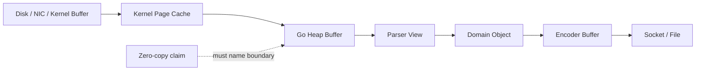
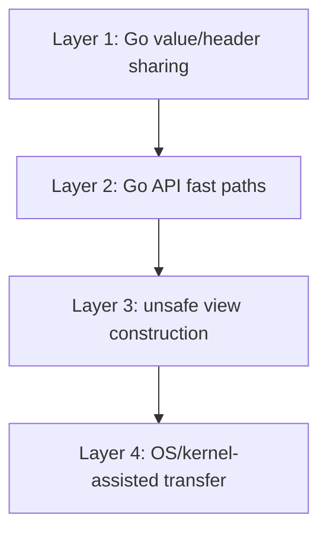
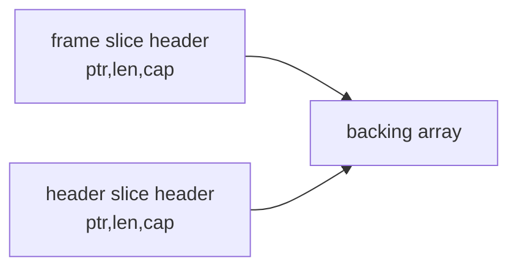
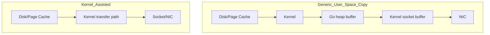
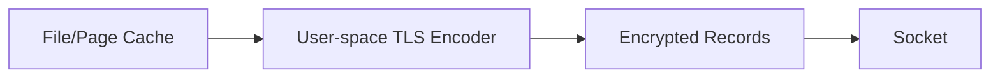
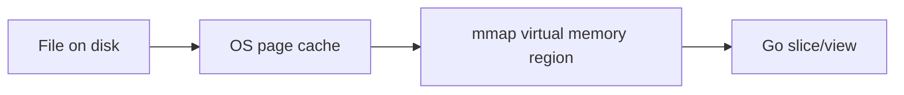
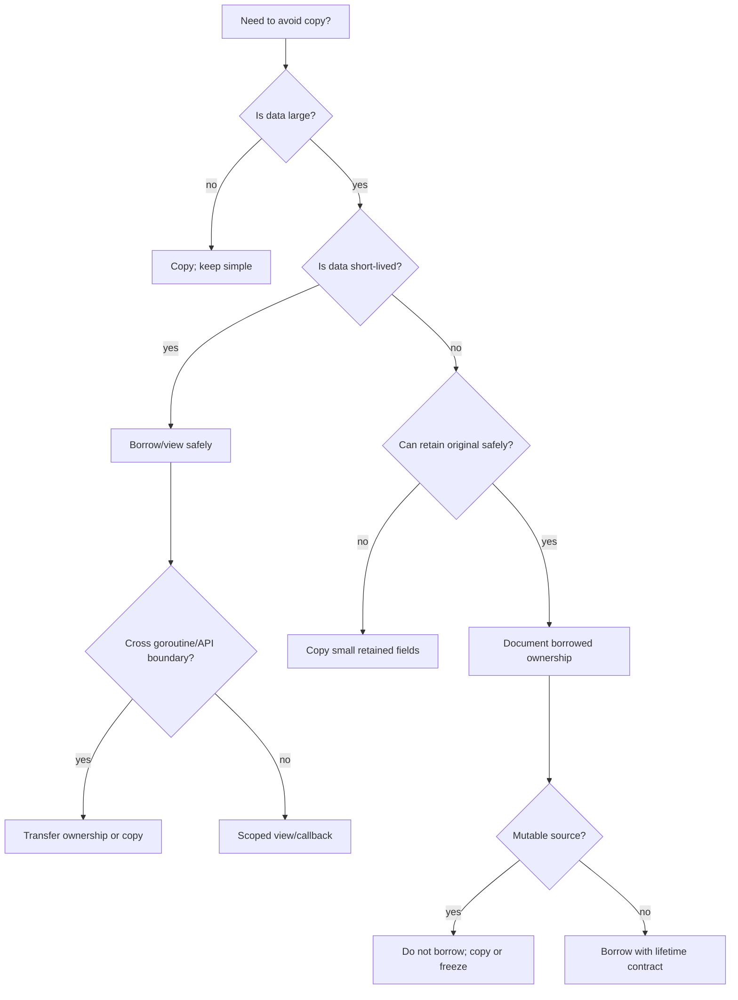
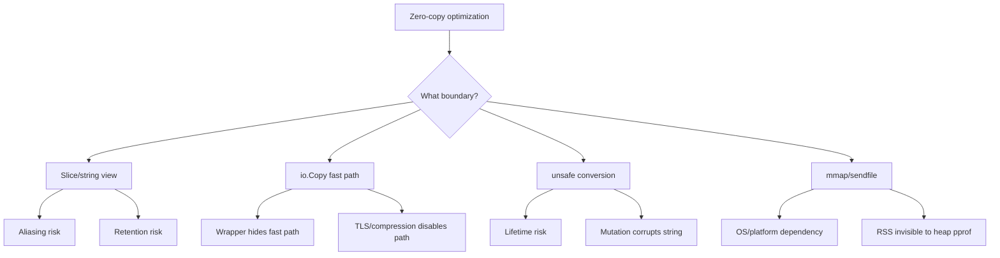
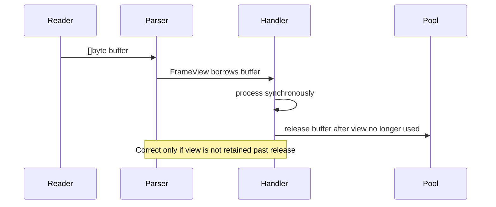
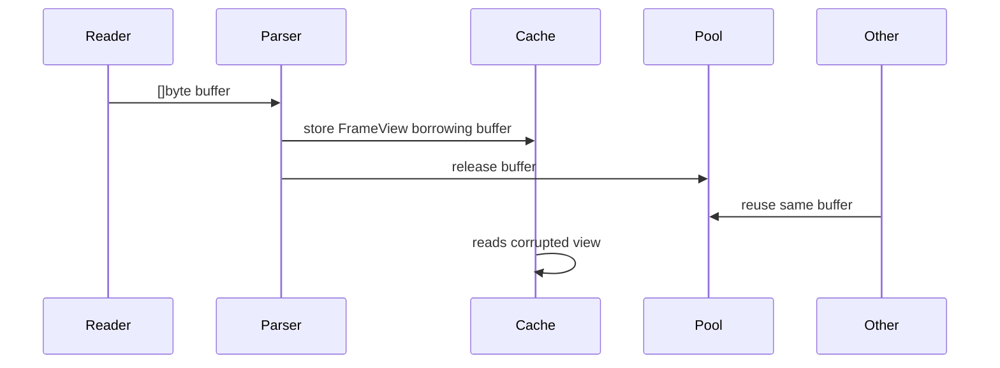

# learn-go-memory-systems-part-018.md

# Go Memory Systems Part 018 — Zero-Copy in Go: What Is Real, What Is Illusion, What Is Unsafe, What Is OS-Assisted

> Series: `learn-go-memory-systems`  
> Part: `018 / 034`  
> Target Go Version: Go 1.26.x  
> Audience: Java software engineer moving toward expert-level Go memory/runtime/system design  
> Focus: zero-copy, zero-allocation, unsafe views, kernel-assisted transfer, mmap, stream-first design, lifetime/ownership invariants

---

## 0. Why This Part Exists

Zero-copy is one of the most overloaded terms in backend engineering.

In design reviews, people often say:

> "Let's make it zero-copy."

But that sentence is incomplete. It does not specify:

- zero-copy between which layers?
- user space to user space?
- kernel space to user space?
- disk page cache to socket?
- byte slice to string?
- parser input to domain object?
- request body to response body?
- application buffer to TLS record?
- heap to off-heap?
- producer goroutine to consumer goroutine?

In Go, this ambiguity is dangerous because a design can be:

- zero allocation but still copying bytes,
- zero-copy but retaining a huge buffer,
- zero-copy but unsafe,
- zero-copy but slower,
- zero-copy only on one OS path,
- zero-copy only when an interface fast path is selected,
- zero-copy only before TLS/compression/encryption enters the pipeline,
- zero-copy only until the first `string(b)` or `append(dst, b...)` happens.

This part builds the mental model needed to decide when zero-copy is valuable and when it is a trap.

---

## 1. The Core Thesis

Zero-copy is not a single technique.

It is a family of techniques for avoiding data movement across boundaries.

The boundary matters more than the slogan.



When reviewing a zero-copy design, always ask:

1. Which bytes are being avoided?
2. Which copy is being removed?
3. What owns the underlying memory?
4. How long is the memory valid?
5. Can anyone mutate it?
6. Does GC see it?
7. Does it cross goroutines?
8. Does it cross API boundaries?
9. What happens on error/cancellation?
10. What is the fallback path?

If these questions are not answered, the design is not mature.

---

## 2. Vocabulary: Zero Allocation vs Zero Copy

These two are related but not identical.

### 2.1 Zero Allocation

Zero allocation means an operation does not allocate new Go heap objects.

Example:

```go
func Sum(b []byte) int {
    var n int
    for _, x := range b {
        n += int(x)
    }
    return n
}
```

This function does not allocate for the loop itself. But it reads/copies each byte into registers as part of CPU execution. That is not what people usually mean by copying.

### 2.2 Zero Copy

Zero copy means data is not duplicated into another buffer at a particular boundary.

Example:

```go
func ViewPrefix(b []byte, n int) []byte {
    return b[:n]
}
```

This returns a slice header pointing into the same backing array. It copies the slice header, not the byte contents.

That is zero-copy at the byte-buffer level.

### 2.3 Zero Heap Allocation but Copying Data

```go
func EncodeUint64(dst []byte, x uint64) []byte {
    return binary.BigEndian.AppendUint64(dst, x)
}
```

If `dst` has enough capacity, this may not allocate. But it still writes eight bytes into `dst`.

Zero allocation, not zero data movement.

### 2.4 Zero Copy but Retaining Memory

```go
func FirstLine(file []byte) []byte {
    i := bytes.IndexByte(file, '\n')
    if i < 0 {
        return file
    }
    return file[:i]
}
```

This returns a view into `file`. If `file` is 2 GiB and the first line is 40 bytes, the returned 40-byte slice can retain the entire 2 GiB backing array.

Zero-copy can become retention disaster.

### 2.5 Zero Copy but Unsafe

```go
func BytesToStringUnsafe(b []byte) string {
    return unsafe.String(unsafe.SliceData(b), len(b))
}
```

This avoids a byte copy. But the resulting string is only valid if the underlying bytes are not mutated for the lifetime of the string.

This is not a free optimization. It creates a contract the compiler cannot verify.

---

## 3. Four Layers of Zero-Copy in Go

Think of zero-copy in four layers.



### 3.1 Layer 1: Go Value/Header Sharing

This includes:

- slicing `[]byte`
- slicing `string`
- passing `[]byte` by value
- returning slice views
- using `bytes.Reader`
- using `strings.Reader`
- avoiding conversion to `string`

This is the safest zero-copy layer, but it creates aliasing and retention risks.

### 3.2 Layer 2: Go API Fast Paths

This includes:

- `io.Copy`
- `io.ReaderFrom`
- `io.WriterTo`
- `bytes.Buffer.WriteTo`
- `bytes.Reader.WriteTo`
- `strings.Reader.WriteTo`
- `os.File.WriteTo` / `ReadFrom` behavior where supported
- `net.TCPConn.ReadFrom` behavior where supported internally

The key point: some `io.Copy` paths avoid the generic user-space buffer loop.

The `io.Copy` documentation says it first checks whether `src` implements `WriterTo`, otherwise whether `dst` implements `ReaderFrom`. This enables optimized transfer paths when implementations provide them.

### 3.3 Layer 3: Unsafe View Construction

This includes:

- `unsafe.String`
- `unsafe.StringData`
- `unsafe.Slice`
- `unsafe.SliceData`
- `unsafe.Add`

This can create string/slice views without copying. But it bypasses ordinary type safety and mutability/lifetime protection.

### 3.4 Layer 4: OS/Kernel-Assisted Transfer

This includes:

- `sendfile`
- `splice` on Linux-like systems
- `copy_file_range`
- mmap
- page cache based transfer

Go may use some of these through standard library fast paths in specific cases. But these are platform-dependent and may be bypassed by TLS, compression, transformations, or wrapping readers/writers.

---

## 4. Java Engineer Translation

As a Java engineer, you may map zero-copy to:

- `ByteBuffer.slice()`
- Netty `ByteBuf.slice()` / `retainedSlice()`
- `FileChannel.transferTo()`
- direct buffers
- memory-mapped files
- pooling
- off-heap buffers
- reference-counted buffers

Go has similar concepts but different safety boundaries.

| Java / Netty Concept | Rough Go Equivalent | Important Difference |
|---|---|---|
| `byte[]` | `[]byte` | Go slice is a header over backing array |
| `String(byte[])` | `string(b)` | Go conversion copies bytes |
| `ByteBuffer.slice()` | `b[i:j]` | Go has no refcount by default |
| `ByteBuf.retainedSlice()` | no direct stdlib equivalent | ownership must be documented manually |
| `FileChannel.transferTo()` | `io.Copy` fast path / `sendfile` where available | depends on concrete types and platform |
| DirectByteBuffer | mmap/cgo/off-heap | not idiomatic default in Go |
| Netty refcount | explicit Close/Release contract | Go GC does not manage external lifetime |
| String interning | no general direct equivalent | use explicit cache if needed |

The biggest difference: Go encourages simple ownership contracts instead of pervasive buffer refcounting.

That makes many programs simpler. It also means unsafe zero-copy requires discipline because the language does not automatically track borrowed lifetimes.

---

## 5. The Boundary Model

Zero-copy is meaningful only when a boundary is specified.

Common boundaries:

1. network socket → Go heap
2. Go heap → parser
3. parser → domain model
4. domain model → encoder
5. encoder → socket
6. file → socket
7. file → parser
8. mmap region → view object
9. `[]byte` → `string`
10. `string` → `[]byte`
11. producer goroutine → consumer goroutine
12. user space → kernel space
13. Go heap → C/native memory

A design may be zero-copy at one boundary and not another.

Example:

```go
func Proxy(dst io.Writer, src io.Reader) error {
    _, err := io.Copy(dst, src)
    return err
}
```

This might use optimized paths depending on `dst` and `src`, but if `src` is wrapped in a gzip reader, bytes must be decompressed into user-space buffers.

```go
func ProxyCompressed(dst io.Writer, src io.Reader) error {
    gz, err := gzip.NewReader(src)
    if err != nil {
        return err
    }
    defer gz.Close()

    _, err = io.Copy(dst, gz)
    return err
}
```

Compression changes the boundary. It requires transformation. Transformation usually means new bytes must be produced.

---

## 6. Real Zero-Copy: Slice Views

The most basic Go zero-copy operation is slicing.

```go
func Header(frame []byte) []byte {
    return frame[:8]
}
```

This copies only the slice header.

A slice header contains conceptually:

```text
pointer to first element
length
capacity
```

The bytes are shared.



### Benefits

- no byte copy
- no heap allocation if header stays stack-bound
- fast parsing
- simple API

### Risks

- caller mutates data after callee stores view
- callee mutates data unexpectedly
- small view retains huge backing array
- view crosses goroutine boundary without ownership
- original buffer is reused from pool
- view is used after release

### Correct Contract

If an API returns a slice view, say it clearly.

```go
// Payload returns a borrowed view into f's backing buffer.
// The returned slice is valid only until the frame is reused or released.
// The caller must not retain or mutate it.
func (f *Frame) Payload() []byte {
    return f.buf[f.payloadStart:f.payloadEnd]
}
```

If the caller needs to retain data, provide a copy API.

```go
func (f *Frame) PayloadCopy() []byte {
    return bytes.Clone(f.buf[f.payloadStart:f.payloadEnd])
}
```

---

## 7. Real Zero-Copy: String Substrings

Slicing a string creates a string view at the language level.

```go
func Prefix(s string, n int) string {
    return s[:n]
}
```

A string is immutable, so aliasing mutation is not a problem. But retention can still be a problem.

```go
func ExtractToken(line string) string {
    idx := strings.IndexByte(line, ':')
    if idx < 0 {
        return ""
    }
    return line[:idx]
}
```

If `line` is a small slice of a huge string or derived from a large source, retaining the substring can retain the original backing bytes depending on implementation behavior and compiler/runtime decisions.

When you need independence, use:

```go
token = strings.Clone(token)
```

### Rule

Use substring views for short-lived parsing. Clone when storing long-term.

---

## 8. Copy Boundary: `[]byte` to `string`

In safe Go:

```go
s := string(b)
```

This copies bytes.

Why?

Because `string` is immutable and `[]byte` is mutable.

If Go allowed a safe no-copy conversion, this would break string immutability:

```go
b := []byte("admin")
s := string(b) // safe Go copies
b[0] = 'x'
fmt.Println(s) // still "admin"
```

The copy preserves invariants.

### When This Matters

Hot paths often accidentally allocate here:

```go
if string(keyBytes) == "Authorization" {
    // allocation unless optimized in very specific compiler-known patterns
}
```

Prefer byte APIs when possible:

```go
if bytes.Equal(keyBytes, []byte("Authorization")) {
    // avoid creating string from dynamic bytes
}
```

But note: `[]byte("Authorization")` itself may be optimized, but in APIs prefer package-level constants or direct byte comparison where practical.

---

## 9. Copy Boundary: `string` to `[]byte`

In safe Go:

```go
b := []byte(s)
```

This copies bytes.

Why?

Because the resulting `[]byte` is mutable, while the string must remain immutable.

```go
s := "admin"
b := []byte(s)
b[0] = 'x'
fmt.Println(s) // still "admin"
```

### Common Allocation Trap

```go
func WriteStringBad(w io.Writer, s string) error {
    _, err := w.Write([]byte(s)) // allocates/copies
    return err
}
```

Prefer:

```go
func WriteStringGood(w io.Writer, s string) error {
    _, err := io.WriteString(w, s)
    return err
}
```

This allows the writer to optimize string writing.

---

## 10. Unsafe Zero-Copy String from Bytes

Modern Go provides `unsafe.String` and `unsafe.SliceData`.

```go
func UnsafeString(b []byte) string {
    if len(b) == 0 {
        return ""
    }
    return unsafe.String(unsafe.SliceData(b), len(b))
}
```

This can avoid the copy from `[]byte` to `string`.

But it is correct only if all of these are true:

1. `b` will not be mutated while the string is used.
2. `b` will not be reused from a pool while the string is used.
3. `b` will remain alive while the string is used.
4. the string does not outlive the backing memory.
5. the data is not secret that should be cleared through the byte slice.
6. no other goroutine can mutate `b` concurrently.
7. the function contract documents the borrowed view.

### Incorrect Example

```go
var pool = sync.Pool{
    New: func() any { return make([]byte, 0, 4096) },
}

func ParseNameBad(input []byte) string {
    buf := pool.Get().([]byte)[:0]
    defer pool.Put(buf[:0])

    buf = append(buf, input...)
    return unsafe.String(unsafe.SliceData(buf), len(buf))
}
```

This returns a string pointing into a pooled buffer that may be reused immediately after the function returns.

That is memory corruption by contract violation.

### Correct Safer Version

```go
func ParseNameSafe(input []byte) string {
    return string(input) // copy; independent lifetime
}
```

### Correct Unsafe-But-Scoped Version

```go
func withUnsafeString(b []byte, fn func(string) error) error {
    if len(b) == 0 {
        return fn("")
    }

    s := unsafe.String(unsafe.SliceData(b), len(b))

    // s is used synchronously only inside fn.
    // b must not be mutated concurrently.
    err := fn(s)
    runtime.KeepAlive(b)
    return err
}
```

This is still delicate, but the lifetime is scoped.

---

## 11. Unsafe Zero-Copy Bytes from String

You can create a byte slice view of a string using unsafe primitives, but mutation would violate string immutability and can crash or corrupt data.

```go
func UnsafeBytesReadOnly(s string) []byte {
    if len(s) == 0 {
        return nil
    }
    return unsafe.Slice(unsafe.StringData(s), len(s))
}
```

This returned `[]byte` must be treated as read-only.

But Go's type system cannot express read-only `[]byte`.

That makes this API dangerous.

### Better Pattern

Do not return `[]byte` if it must be read-only.

Instead, accept a callback:

```go
func WithStringBytes(s string, fn func([]byte) error) error {
    if len(s) == 0 {
        return fn(nil)
    }
    b := unsafe.Slice(unsafe.StringData(s), len(s))
    err := fn(b)
    runtime.KeepAlive(s)
    return err
}
```

And document:

```go
// The byte slice passed to fn aliases s and must not be mutated or retained.
```

Even then, this should be isolated in a tiny internal package.

---

## 12. Why `reflect.StringHeader` and `reflect.SliceHeader` Are Legacy Hazards

Older code often used:

```go
type StringHeader struct {
    Data uintptr
    Len  int
}
```

This pattern is now discouraged/deprecated in new code.

The problem is that `uintptr` is an integer, not a GC-visible pointer. If you store a pointer only as `uintptr`, the GC is not required to treat it as keeping the object alive.

Use modern APIs instead:

- `unsafe.String`
- `unsafe.StringData`
- `unsafe.Slice`
- `unsafe.SliceData`
- `unsafe.Add`

Even with modern APIs, lifetime invariants remain your responsibility.

---

## 13. `io.Copy`: Not Just a Loop

A naive mental model:

```go
buf := make([]byte, 32*1024)
for {
    n, rerr := src.Read(buf)
    if n > 0 {
        _, werr := dst.Write(buf[:n])
        ...
    }
    ...
}
```

This is roughly the generic fallback.

But `io.Copy` can use optimized paths:

1. If `src` implements `io.WriterTo`, call `src.WriteTo(dst)`.
2. Else if `dst` implements `io.ReaderFrom`, call `dst.ReadFrom(src)`.
3. Else use a generic buffer loop.

```mermaid
flowchart TD
    A[io.Copy(dst, src)] --> B{src implements WriterTo?}
    B -- yes --> C[src.WriteTo(dst)]
    B -- no --> D{dst implements ReaderFrom?}
    D -- yes --> E[dst.ReadFrom(src)]
    D -- no --> F[generic buffer loop]
```

This matters because concrete types can provide more efficient transfer.

Examples:

- `bytes.Buffer` can write its internal bytes efficiently.
- `bytes.Reader` can write from its slice efficiently.
- `strings.Reader` can write from its string efficiently.
- `os.File` and `net.TCPConn` may trigger OS-specific fast paths in certain directions.

But once you wrap readers/writers, you may hide these fast paths.

---

## 14. How Wrappers Can Destroy Fast Paths

Consider:

```go
_, err := io.Copy(dst, src)
```

If `src` is `*os.File` and `dst` is a TCP connection, Go may use an optimized file-to-socket path where supported.

Now wrap `src`:

```go
r := bufio.NewReader(src)
_, err := io.Copy(dst, r)
```

The wrapper may prevent the concrete `*os.File` fast path from being visible.

Now wrap `dst`:

```go
w := bufio.NewWriter(dst)
_, err := io.Copy(w, src)
```

Again, the optimized path may no longer apply.

This does not mean wrappers are bad. It means fast path visibility depends on concrete types and interfaces.

### Review Question

When a pipeline uses `io.Copy`, ask:

- What are the concrete `src` and `dst` types?
- Do they implement `WriterTo` or `ReaderFrom`?
- Does a wrapper hide those methods?
- Is buffering necessary?
- Is transformation necessary?
- Is TLS involved?
- Is compression involved?
- Is metrics/logging wrapper involved?

---

## 15. `io.CopyBuffer`: Controlled Allocation, Not Guaranteed Zero-Copy

`io.CopyBuffer` lets you provide the intermediate buffer.

```go
buf := make([]byte, 64*1024)
_, err := io.CopyBuffer(dst, src, buf)
```

This avoids allocation of the temporary buffer in the generic path.

But:

- it still copies data through `buf` in the generic path,
- the buffer may not be used if `WriterTo`/`ReaderFrom` fast paths apply,
- it does not guarantee kernel zero-copy.

Use it when you need predictable buffer reuse.

Do not describe it as automatic zero-copy.

---

## 16. Kernel-Assisted Zero-Copy: File to Socket

Classic zero-copy example:

```text
file -> kernel page cache -> socket
```

Instead of:

```text
file -> kernel -> user-space buffer -> kernel -> socket
```

Kernel-assisted transfer can avoid copying file data into Go heap buffers.



### When It Can Help

- serving static files
- proxying files to TCP sockets
- large file transfer
- avoiding heap pressure
- reducing CPU memory bandwidth usage

### When It May Not Apply

- TLS encryption in user space
- gzip compression
- response transformation
- rate-limiting wrappers that intercept bytes
- metrics wrappers that hide concrete types
- non-file source
- non-socket destination
- OS unsupported path
- small payloads where overhead dominates

---

## 17. TLS Breaks Many File-to-Socket Zero-Copy Paths

TLS requires encryption. If encryption is done in user space, plaintext file bytes must be processed into ciphertext.

That usually means bytes are read into memory, encrypted, and written out.



So a design that is zero-copy over plain TCP may not remain zero-copy over HTTPS.

This is a common production misunderstanding.

### Engineering Conclusion

Do not claim zero-copy static file serving without specifying:

- plain HTTP or HTTPS?
- kernel TLS available or not?
- Go standard library path or reverse proxy?
- compression enabled or not?
- content transformation enabled or not?

---

## 18. Compression Usually Requires New Bytes

Compression transforms bytes.

```text
input bytes != output bytes
```

Therefore, a compression stage cannot simply pass the original memory view downstream.

It must produce compressed output.

```go
zw := gzip.NewWriter(dst)
_, err := io.Copy(zw, src)
```

This may be streaming and bounded-memory, but it is not zero-copy.

That is acceptable. Streaming bounded-memory is often more valuable than zero-copy.

---

## 19. Streaming Beats Zero-Copy for Many Systems

Many high-performance Go systems should optimize for:

- bounded memory,
- low allocation rate,
- streaming pipeline,
- stable backpressure,
- explicit ownership,
- clear cancellation,
- predictable latency.

Not necessarily maximum zero-copy.

A streaming copy with a 64 KiB buffer can be production-grade:

```go
func CopyBounded(dst io.Writer, src io.Reader, buf []byte) error {
    if len(buf) == 0 {
        return errors.New("empty buffer")
    }
    _, err := io.CopyBuffer(dst, src, buf)
    return err
}
```

This is not zero-copy, but it is bounded.

Bounded beats clever in many production services.

---

## 20. Zero-Copy Parser Design

Suppose you parse frames:

```text
+--------+--------+-------------+
| magic  | length | payload     |
| 4 byte | 4 byte | length byte |
+--------+--------+-------------+
```

A copy-heavy parser might do:

```go
payload := make([]byte, length)
copy(payload, frame[8:8+length])
return payload
```

A zero-copy parser returns a view:

```go
type FrameView struct {
    raw     []byte
    payload []byte
}

func ParseFrameView(raw []byte) (FrameView, error) {
    if len(raw) < 8 {
        return FrameView{}, io.ErrUnexpectedEOF
    }
    n := binary.BigEndian.Uint32(raw[4:8])
    end := 8 + int(n)
    if end < 8 || end > len(raw) {
        return FrameView{}, errors.New("invalid length")
    }
    return FrameView{
        raw:     raw[:end],
        payload: raw[8:end],
    }, nil
}
```

This is fast but borrowed.

The returned `FrameView` is valid only as long as `raw` is valid and not reused/mutated.

### Safer Design: View + Clone Boundary

```go
func (f FrameView) PayloadView() []byte {
    return f.payload
}

func (f FrameView) PayloadClone() []byte {
    return bytes.Clone(f.payload)
}
```

Expose both intentionally.

---

## 21. The Borrowed vs Owned Contract

This is one of the most important design distinctions.

### Borrowed

Borrowed data means:

- caller or upstream still owns memory,
- callee may inspect it temporarily,
- callee must not retain unless documented,
- callee must not mutate unless documented,
- validity is bounded by a scope.

Example:

```go
func ParseHeader(b []byte) (Header, error)
```

If `Header` stores views into `b`, document it.

### Owned

Owned data means:

- callee has independent memory,
- caller may mutate/reuse input after call,
- result can be retained safely.

Example:

```go
func ParseHeaderOwned(b []byte) (Header, error) {
    raw := bytes.Clone(b)
    return parseHeaderView(raw)
}
```

### Contract Table

| API Pattern | Copy? | Retain Safe? | Mutation Safe? | Common Use |
|---|---:|---:|---:|---|
| `ParseView([]byte)` | no | no | no | hot path parser |
| `ParseOwned([]byte)` | yes | yes | yes | external API boundary |
| `WithView([]byte, fn)` | no | no outside callback | no | scoped zero-copy |
| `AppendTo(dst, value)` | caller controls | yes if caller owns dst | yes | encoder |
| `WriteTo(w)` | streaming | destination decides | n/a | output pipeline |

---

## 22. Callback-Scoped Zero-Copy

One useful Go pattern is callback-scoped borrowing.

```go
func WithToken(line []byte, fn func(token []byte) error) error {
    i := bytes.IndexByte(line, ':')
    if i < 0 {
        return errors.New("missing colon")
    }
    token := line[:i]
    return fn(token)
}
```

The callback discourages retention because the view is scoped.

It does not make retention impossible, but it makes the intended lifetime clearer.

For unsafe string views:

```go
func WithTokenString(line []byte, fn func(token string) error) error {
    i := bytes.IndexByte(line, ':')
    if i < 0 {
        return errors.New("missing colon")
    }
    tok := line[:i]
    s := unsafe.String(unsafe.SliceData(tok), len(tok))
    err := fn(s)
    runtime.KeepAlive(line)
    return err
}
```

This should be internal and heavily documented.

---

## 23. Why `runtime.KeepAlive` Matters in Unsafe Code

In normal safe Go, the compiler/runtime tracks object liveness.

Unsafe code can create situations where the compiler does not see a normal reference in the shape you intend.

`runtime.KeepAlive(x)` tells the compiler/runtime that `x` must be considered live at least until that point.

Example:

```go
func UsePointer(b []byte) {
    p := unsafe.SliceData(b)
    nativeUse(unsafe.Pointer(p), len(b))
    runtime.KeepAlive(b)
}
```

Without `KeepAlive`, an aggressive compiler may determine `b` is no longer needed earlier than the native/unsafe operation conceptually requires.

Use `KeepAlive` at the boundary where unsafe/native code depends on Go-managed memory.

---

## 24. Mmap as Zero-Copy Read Interface

Memory mapping maps file contents into a process address space.

Instead of explicitly reading bytes into a Go heap buffer, the program accesses memory backed by the file/page cache.



### Benefits

- avoid explicit read copy into Go heap
- random access can be simple
- OS handles paging
- useful for large immutable indexes/files
- can reduce Go heap pressure

### Costs

- page faults become latency events
- memory not fully visible in Go heap profiles
- lifetime must be explicitly unmapped
- file changes/truncation can crash process depending on OS/usage
- not portable in exactly the same way across OSes
- dirty page/write semantics are subtle
- random access can destroy locality

### Mmap Is Not Magic

Mmap can reduce one copy. It does not eliminate:

- CPU cache misses,
- page faults,
- TLB pressure,
- parsing work,
- checksums,
- decoding,
- output encoding,
- transformation costs.

---

## 25. Mmap Retention and Visibility Problem

Because mmap memory is not ordinary Go heap allocation, heap profiles may look clean while RSS grows.

Symptoms:

- Go heap seems stable,
- RSS grows,
- container OOMs,
- heap pprof does not explain it,
- runtime metrics show external/sys memory gap.

Possible causes:

- mmap not unmapped,
- C memory not freed,
- OS page cache confusion,
- goroutine stacks,
- allocator idle memory,
- native library buffers.

Diagnostic question:

> Is this memory Go heap, Go runtime memory, mmap/native memory, or OS page cache?

---

## 26. Zero-Copy and GC: Pointer Density Matters

Zero-copy can reduce allocation rate.

That may reduce GC pressure.

But zero-copy can also increase retention and pointer graph complexity.

Example:

```go
type Parsed struct {
    Raw     []byte
    Headers map[string][]byte
    Body    []byte
}
```

If `Raw` is huge and `Headers`/`Body` point into it, retaining `Parsed` retains the whole raw buffer.

The GC sees pointers into backing arrays and must keep reachable objects alive.

A copy may be better:

```go
type Parsed struct {
    Headers map[string]string
    Body    []byte
}
```

Copy small long-lived fields; stream or discard huge short-lived bytes.

### Rule

For long-lived data, copy the small data you need and release the large buffer.

---

## 27. Small Copy Is Often Cheaper Than Long Retention

Suppose:

- request buffer: 8 MiB
- ID field: 32 bytes
- ID retained in cache for 10 minutes

Zero-copy ID view retains 8 MiB for 10 minutes.

Copying 32 bytes is obviously better.

```go
idView := reqBuf[idStart:idEnd]      // zero-copy but retains reqBuf
idCopy := string(reqBuf[idStart:idEnd]) // copies 32 bytes; releases reqBuf
```

This is a core top-level heuristic:

> Copy small long-lived data. Borrow large short-lived data.

---

## 28. Zero-Copy and `sync.Pool`: Dangerous Combination

Pooling creates reuse.

Zero-copy views create aliases.

Aliases into reused buffers create corruption.

Bad pattern:

```go
func DecodeAndStore(b []byte) {
    view := parseView(b)
    globalCache.Store(view.Key(), view)
    pool.Put(b[:0])
}
```

If `view` points into `b`, putting `b` back into the pool invalidates the cached view.

### Correct Pattern

Before storing beyond the buffer lifetime, detach:

```go
func DecodeAndStore(b []byte) {
    view := parseView(b)

    owned := StoredRecord{
        Key:   string(view.Key()),
        Value: bytes.Clone(view.Value()),
    }

    globalCache.Store(owned.Key, owned)
    pool.Put(b[:0])
}
```

This copy is not waste. It is the ownership transfer cost.

---

## 29. Zero-Copy and Concurrency

Borrowed views are especially risky across goroutine boundaries.

```go
func ProcessAsync(buf []byte) {
    view := buf[:16]
    go func() {
        use(view)
    }()
    reuse(buf)
}
```

This is unsafe at the contract level even if it does not always race in tests.

### Rule

Crossing a goroutine boundary usually requires one of:

1. transfer ownership of the whole buffer,
2. copy the needed data,
3. use immutable data,
4. reference-count/lease the buffer explicitly,
5. keep processing synchronous.

### Ownership Transfer Example

```go
type Job struct {
    Buf []byte // worker owns and must release
}

func submit(q chan<- Job, b []byte) {
    q <- Job{Buf: b}
    // caller must not touch b after this point
}
```

Document this as move semantics by convention.

Go does not enforce it.

---

## 30. Zero-Copy and API Design

A production-grade API should encode memory ownership in names/docs.

### Bad

```go
func Parse(b []byte) Record
```

Does `Record` borrow from `b` or own its data?

Unclear.

### Better

```go
func ParseView(b []byte) (RecordView, error)
func ParseOwned(b []byte) (Record, error)
```

### Better Still

```go
// ParseView returns a record that borrows from b.
// The caller must keep b immutable and alive while using the returned RecordView.
func ParseView(b []byte) (RecordView, error)

// ParseOwned returns a record independent from b.
func ParseOwned(b []byte) (Record, error)
```

### Encoder APIs

Prefer append-style APIs:

```go
func (r Record) AppendTo(dst []byte) []byte {
    dst = binary.BigEndian.AppendUint32(dst, r.ID)
    dst = append(dst, r.Name...)
    return dst
}
```

This gives the caller control over allocation.

---

## 31. Zero-Copy and Domain Modeling

Do not let zero-copy views leak into business domain objects unless the entire domain model is designed around borrowed lifetime.

Bad:

```go
type User struct {
    ID   []byte
    Name []byte
}
```

If `User` is stored, cached, logged asynchronously, or passed across goroutines, this is ambiguous.

Better for long-lived domain:

```go
type User struct {
    ID   string
    Name string
}
```

Better for parser layer:

```go
type UserView struct {
    raw  []byte
    id   []byte
    name []byte
}
```

Then explicitly convert:

```go
func (v UserView) Own() User {
    return User{
        ID:   string(v.id),
        Name: string(v.name),
    }
}
```

Layer boundaries matter.

---

## 32. Zero-Copy in HTTP Handlers

Common bad pattern:

```go
func handler(w http.ResponseWriter, r *http.Request) {
    body, _ := io.ReadAll(r.Body)
    process(body)
    w.Write(body)
}
```

Problems:

- reads entire body into heap,
- unbounded unless limited,
- retains body if process stores views,
- no streaming backpressure,
- possible OOM.

Streaming pattern:

```go
func handler(w http.ResponseWriter, r *http.Request) {
    defer r.Body.Close()

    lr := io.LimitReader(r.Body, 10<<20)
    if _, err := io.Copy(w, lr); err != nil {
        // handle error
        return
    }
}
```

This is not necessarily kernel zero-copy, but it is bounded-memory and backpressure-aware.

For transformations, use streaming decoder/encoder.

---

## 33. Zero-Copy in JSON

Standard `encoding/json` generally produces Go values and strings, requiring allocation/copy for parsed object structures.

A zero-copy JSON parser can return views into the original input, but then the original input must remain alive and immutable.

Trade-off:

| Design | Allocation | Retention Risk | Safety | Use Case |
|---|---:|---:|---:|---|
| `json.Unmarshal` into struct | medium | low | high | normal application |
| streaming `json.Decoder` | bounded | low | high | large input |
| DOM with copied strings | high | low | high | flexible processing |
| zero-copy DOM views | low | high | contract-heavy | hot path, short-lived |

For most services, streaming decoder is better than unsafe zero-copy JSON.

---

## 34. Zero-Copy in Logging

Logging is a common hidden allocation path.

Bad hot path:

```go
logger.Info("request", "body", string(body))
```

This copies body into a string and may retain/log sensitive data.

Better:

- do not log full body,
- log bounded prefix,
- log hash/checksum,
- log length and metadata,
- avoid conversion in hot path.

Example:

```go
func BodySummary(b []byte) slog.Attr {
    const max = 128
    if len(b) <= max {
        return slog.String("body_prefix", string(b))
    }
    return slog.Group("body",
        slog.Int("len", len(b)),
        slog.String("prefix", string(b[:max])),
    )
}
```

This still copies prefix to string. That is acceptable because it is bounded and intentional.

Zero-copy logging is usually not the right goal. Controlled copy is.

---

## 35. Zero-Copy and Security

Zero-copy can conflict with security.

Examples:

- secret bytes converted to string cannot be wiped,
- borrowed view retains sensitive request buffer longer,
- pooled buffer reused while string view still exists,
- logs accidentally retain body data,
- mmap exposes file content through process memory,
- panic dump/profile contains buffers,
- unsafe conversion bypasses immutability assumptions.

For secrets:

- prefer `[]byte` over `string` only if you can truly control lifetime,
- avoid unsafe `[]byte` → `string`,
- zero buffers if required,
- avoid pooling secret buffers unless carefully scrubbed,
- avoid logging raw bytes.

Sometimes copying into a controlled, short-lived, scrubbed buffer is safer than sharing views.

---

## 36. Zero-Copy and Checksums/Hashes

Hashing can be streaming and allocation-free, but not copy-free in CPU terms.

```go
h := sha256.New()
_, err := io.Copy(h, r)
sum := h.Sum(nil)
```

This streams bytes into the hash state.

No need to `io.ReadAll`.

For existing slices:

```go
sum := sha256.Sum256(b)
```

This does not allocate for the fixed-size array result.

The bytes are read by CPU. That is not avoidable if you need the hash.

Do not chase zero-copy when the operation semantically requires reading every byte.

---

## 37. Zero-Copy and Checks: Bounds, Validation, Trust

Returning a zero-copy view does not remove validation work.

Example:

```go
func Payload(frame []byte) ([]byte, error) {
    if len(frame) < 8 {
        return nil, io.ErrUnexpectedEOF
    }
    n := binary.BigEndian.Uint32(frame[4:8])
    if n > maxPayload {
        return nil, errors.New("payload too large")
    }
    end := 8 + int(n)
    if end < 8 || end > len(frame) {
        return nil, io.ErrUnexpectedEOF
    }
    return frame[8:end], nil
}
```

Zero-copy parsing still requires:

- length validation,
- overflow validation,
- bounds validation,
- reserved bit validation,
- version validation,
- checksum validation where applicable,
- maximum size enforcement.

Unsafe zero-copy without validation is not high performance. It is fragile.

---

## 38. Decision Framework

Use this decision framework.



### Practical Rules

1. Copy small, long-lived fields.
2. Borrow large, short-lived payloads.
3. Stream unknown or unbounded data.
4. Avoid `io.ReadAll` unless bounded and justified.
5. Prefer safe Go first.
6. Use unsafe only behind tiny APIs with tests and docs.
7. Do not return unsafe read-only `[]byte` without strict scope.
8. Do not store views into pooled buffers.
9. Do not cross goroutine boundaries with borrowed mutable views.
10. Verify with benchmark and pprof.

---

## 39. Example: A Good Frame API

```go
type FrameView struct {
    raw     []byte
    typ     byte
    payload []byte
}

func ParseFrameView(raw []byte) (FrameView, error) {
    if len(raw) < 5 {
        return FrameView{}, io.ErrUnexpectedEOF
    }

    typ := raw[0]
    n := binary.BigEndian.Uint32(raw[1:5])
    if n > 1<<20 {
        return FrameView{}, errors.New("payload too large")
    }

    end := 5 + int(n)
    if end < 5 || end > len(raw) {
        return FrameView{}, io.ErrUnexpectedEOF
    }

    return FrameView{
        raw:     raw[:end],
        typ:     typ,
        payload: raw[5:end],
    }, nil
}

func (f FrameView) Type() byte {
    return f.typ
}

// PayloadView returns a borrowed view.
// It is valid only while the original input remains alive and immutable.
func (f FrameView) PayloadView() []byte {
    return f.payload
}

// PayloadCopy returns an owned payload copy.
func (f FrameView) PayloadCopy() []byte {
    return bytes.Clone(f.payload)
}

type Frame struct {
    Type    byte
    Payload []byte
}

func (f FrameView) Own() Frame {
    return Frame{
        Type:    f.typ,
        Payload: bytes.Clone(f.payload),
    }
}
```

This API makes the memory contract visible.

---

## 40. Example: Unsafe String View API

Keep unsafe isolated.

```go
package internalbytes

import (
    "runtime"
    "unsafe"
)

// WithStringView calls fn with a string view over b without copying.
//
// The string aliases b. fn must not retain the string after returning.
// No goroutine may mutate b while fn executes.
// b must not be returned to a pool while fn executes.
func WithStringView(b []byte, fn func(string) error) error {
    if len(b) == 0 {
        return fn("")
    }

    s := unsafe.String(unsafe.SliceData(b), len(b))
    err := fn(s)
    runtime.KeepAlive(b)
    return err
}
```

Use it like:

```go
err := internalbytes.WithStringView(keyBytes, func(key string) error {
    if key == "Authorization" {
        return handleAuth()
    }
    return nil
})
```

This keeps the unsafe lifetime scoped.

Do not expose this casually in public APIs.

---

## 41. Example: Bad Unsafe API

```go
func BytesToString(b []byte) string {
    return unsafe.String(unsafe.SliceData(b), len(b))
}
```

This API is too easy to misuse.

The caller may:

- store the string,
- mutate `b`,
- return `b` to pool,
- pass string to another goroutine,
- log it asynchronously,
- assume it is independent.

If you must expose it, name it loudly:

```go
func BorrowedStringViewUnsafe(b []byte) string
```

But usually prefer callback-scoped usage.

---

## 42. Example: Streaming Transform with Bounded Memory

A transform stage is not zero-copy, but can be allocation-conscious.

```go
func UppercaseStream(dst io.Writer, src io.Reader, buf []byte) error {
    if len(buf) == 0 {
        return errors.New("empty buffer")
    }

    for {
        n, rerr := src.Read(buf)
        if n > 0 {
            chunk := buf[:n]
            for i, c := range chunk {
                if 'a' <= c && c <= 'z' {
                    chunk[i] = c - 'a' + 'A'
                }
            }
            if _, werr := dst.Write(chunk); werr != nil {
                return werr
            }
        }
        if rerr == io.EOF {
            return nil
        }
        if rerr != nil {
            return rerr
        }
    }
}
```

This mutates the buffer in place.

It does not allocate per chunk.

It is not zero-copy from input to output because transformation changes bytes, but it is memory-bounded and efficient.

---

## 43. Example: Avoiding Retention in a Parser

Bad:

```go
type Request struct {
    Method []byte
    Path   []byte
}

func ParseRequestLine(line []byte) Request {
    parts := bytes.SplitN(line, []byte(" "), 3)
    return Request{
        Method: parts[0],
        Path:   parts[1],
    }
}
```

If `line` points into a large read buffer and `Request` is retained, this retains the whole buffer.

Better:

```go
type Request struct {
    Method string
    Path   string
}

func ParseRequestLineOwned(line []byte) (Request, error) {
    first := bytes.IndexByte(line, ' ')
    if first < 0 {
        return Request{}, errors.New("bad request line")
    }
    secondRel := bytes.IndexByte(line[first+1:], ' ')
    if secondRel < 0 {
        return Request{}, errors.New("bad request line")
    }
    second := first + 1 + secondRel

    return Request{
        Method: string(line[:first]),
        Path:   string(line[first+1 : second]),
    }, nil
}
```

This copies only small fields and releases the big buffer.

---

## 44. Example: File Transfer Review

```go
func SendFile(w http.ResponseWriter, path string) error {
    f, err := os.Open(path)
    if err != nil {
        return err
    }
    defer f.Close()

    _, err = io.Copy(w, f)
    return err
}
```

Review questions:

- Is `w` a plain TCP-backed writer or wrapped by HTTP/TLS/chunking/compression?
- Does the response path permit `ReaderFrom` fast paths?
- Is content length set?
- Is range request supported?
- Is compression enabled?
- Is TLS enabled?
- Is this better handled by `http.ServeContent` or reverse proxy?
- Is file descriptor lifetime correct?
- Is cancellation handled by request context?
- Does serving this file require authorization checks?

Zero-copy cannot be reviewed in isolation from protocol behavior.

---

## 45. Measuring Zero-Copy Claims

Use evidence.

### Allocation Benchmark

```go
func BenchmarkParseView(b *testing.B) {
    input := makeFramePayload(1024)
    b.ReportAllocs()
    for b.Loop() {
        v, err := ParseFrameView(input)
        if err != nil {
            b.Fatal(err)
        }
        sinkBytes = v.PayloadView()
    }
}
```

### Heap Profile

Use:

```bash
go test -bench=Parse -benchmem -memprofile=mem.out ./...
go tool pprof -alloc_space ./pkg.test mem.out
go tool pprof -inuse_space ./pkg.test mem.out
```

### Escape Report

```bash
go test -run=^$ -bench=Parse -gcflags=all=-m=2 ./...
```

### Runtime Metrics

For service:

- allocation rate,
- heap live,
- heap objects,
- GC CPU,
- RSS,
- goroutine count,
- mmap/native memory if used,
- latency percentiles.

### System-Level Measurement

For kernel-assisted copy:

- CPU usage,
- syscall profile,
- network throughput,
- disk throughput,
- pprof CPU,
- OS tracing where appropriate,
- compare plain TCP vs TLS/compression path.

---

## 46. Microbenchmark Trap: Compiler Eliminates Work

Bad benchmark:

```go
func BenchmarkUnsafeString(b *testing.B) {
    data := []byte("hello")
    for b.Loop() {
        _ = unsafe.String(unsafe.SliceData(data), len(data))
    }
}
```

The compiler may optimize away too much.

Better:

```go
var sinkString string

func BenchmarkUnsafeString(b *testing.B) {
    data := []byte("hello")
    b.ReportAllocs()
    for b.Loop() {
        sinkString = unsafe.String(unsafe.SliceData(data), len(data))
    }
    runtime.KeepAlive(data)
}
```

Still, the result only measures conversion cost, not system correctness.

Benchmark correctness and lifetime separately.

---

## 47. Testing Zero-Copy APIs

Test more than output equality.

### Test Aliasing Contract

```go
func TestParseViewAliasesInput(t *testing.T) {
    raw := makeFrame([]byte("hello"))
    v, err := ParseFrameView(raw)
    if err != nil {
        t.Fatal(err)
    }

    raw[5] = 'H'
    if string(v.PayloadView()) != "Hello" {
        t.Fatal("expected view to alias input")
    }
}
```

This documents the contract.

### Test Owned Contract

```go
func TestParseOwnedDoesNotAliasInput(t *testing.T) {
    raw := makeFrame([]byte("hello"))
    v, err := ParseFrameView(raw)
    if err != nil {
        t.Fatal(err)
    }

    owned := v.Own()
    raw[5] = 'H'

    if string(owned.Payload) != "hello" {
        t.Fatal("owned payload should not alias input")
    }
}
```

### Test Pool Hazard

```go
func TestNoRetainPooledBuffer(t *testing.T) {
    // Design tests around your pool and parser contract.
    // The point is to catch accidental retention of borrowed views.
}
```

---

## 48. Fuzzing Zero-Copy Parsers

Zero-copy parsers must be fuzzed because length and bounds bugs can be catastrophic.

```go
func FuzzParseFrameView(f *testing.F) {
    f.Add([]byte{0x01, 0x00, 0x00, 0x00, 0x00})

    f.Fuzz(func(t *testing.T, data []byte) {
        v, err := ParseFrameView(data)
        if err != nil {
            return
        }
        if len(v.PayloadView()) > len(data) {
            t.Fatal("payload impossible")
        }
    })
}
```

Fuzzing should check:

- no panic,
- no out-of-bounds,
- no integer overflow,
- correct rejection of huge lengths,
- stable behavior for truncated frames,
- reserved field validation.

---

## 49. Race Testing Borrowed Views

Borrowed mutable views can cause races.

Run:

```bash
go test -race ./...
```

But remember: race detector catches concurrent unsynchronized access. It may not catch lifetime contract bugs that happen sequentially, such as returning a view into a pooled buffer and reusing it later.

You need both:

- race tests,
- ownership/lifetime tests,
- code review discipline.

---

## 50. Anti-Pattern Catalog

### 50.1 Calling Everything Zero-Copy

Do not call a design zero-copy unless you name the boundary.

Bad:

> This parser is zero-copy.

Better:

> The parser returns payload views into the input frame and does not copy payload bytes. The caller must not retain the view after the input buffer is reused.

### 50.2 Unsafe Conversion in Public API

```go
func BytesToString(b []byte) string
```

This hides danger.

### 50.3 View into Pooled Buffer

Returning or storing views into pooled memory is one of the most common zero-copy bugs.

### 50.4 Zero-Copy for Small Data

Avoiding a 16-byte copy while retaining a 4 MiB buffer is bad engineering.

### 50.5 `io.ReadAll` then Slice

Reading all data into memory and then returning slices is not a streaming design.

### 50.6 Mmap Without Unmap Strategy

Mmap memory must be managed explicitly.

### 50.7 Ignoring TLS/Compression

File-to-socket zero-copy claims often collapse under TLS/compression.

### 50.8 `[]byte` Read-Only by Convention Only

Go cannot enforce read-only slices. Returning `[]byte` view of string memory is dangerous.

### 50.9 Benchmark Without Retention Measurement

Allocation/op may be zero while in-use heap explodes due to retention.

### 50.10 Optimizing Before Bounding

Bounded memory first. Zero-copy second.

---

## 51. Production Incident Patterns

### Incident 1: Small Token Retains Huge Request Body

Symptoms:

- heap in-use grows,
- pprof shows large byte slices retained,
- cache seems to store small tokens,
- tokens are slices into full body.

Fix:

- copy token to string or small `[]byte`,
- release body buffer,
- add ownership tests.

### Incident 2: Pooled Buffer Corrupts Cached Records

Symptoms:

- random corrupted cache values,
- only under load,
- race detector may not always catch,
- records contain `[]byte` views into pooled buffer.

Fix:

- clone before storing,
- make retained type owned,
- separate `View` and `Record` types.

### Incident 3: `io.Copy` Fast Path Lost After Wrapper

Symptoms:

- file serving CPU increases after adding metrics wrapper,
- throughput drops,
- allocation profile changes.

Fix:

- check concrete interface implementation,
- preserve `ReaderFrom`/`WriterTo` in wrapper where safe,
- avoid unnecessary wrapping on hot path.

### Incident 4: Heap Profile Clean, RSS OOM

Symptoms:

- Go heap stable,
- container OOM,
- mmap/native memory not accounted in heap profile.

Fix:

- inspect runtime memory classes,
- inspect process mappings,
- track mmap allocation/unmap,
- include RSS and external memory dashboards.

### Incident 5: Unsafe String View Changes Value

Symptoms:

- logged key changes later,
- map lookup unstable,
- panic impossible to reproduce locally.

Cause:

- string created from mutable `[]byte` without copy,
- buffer mutated/reused.

Fix:

- use safe `string(b)` at retention boundary,
- isolate unsafe conversion to callback-scoped short-lived use.

---

## 52. Review Checklist

Use this checklist for any zero-copy proposal.

### Boundary

- [ ] Which boundary avoids copying?
- [ ] Is the copy actually material in profile?
- [ ] Is transformation required?
- [ ] Is TLS/compression involved?
- [ ] Is kernel fast path possible for the concrete types?

### Ownership

- [ ] Who owns the memory?
- [ ] Is the returned value borrowed or owned?
- [ ] Can the source buffer be reused?
- [ ] Can the source buffer be mutated?
- [ ] Does any view cross goroutine boundary?
- [ ] Does any view enter cache/global state/domain object?

### Lifetime

- [ ] How long is the view valid?
- [ ] Is lifetime documented?
- [ ] Is `runtime.KeepAlive` needed?
- [ ] Is there an explicit release/unmap?
- [ ] Are finalizers avoided as primary cleanup?

### Safety

- [ ] Is unsafe used?
- [ ] Is unsafe isolated?
- [ ] Is read-only `[]byte` avoided?
- [ ] Are string immutability rules preserved?
- [ ] Are pooled buffers detached before retention?

### Memory

- [ ] Could a small view retain huge backing memory?
- [ ] Is copying small long-lived fields better?
- [ ] Are pprof `inuse_space` and `alloc_space` both checked?
- [ ] Is RSS monitored separately?
- [ ] Is mmap/native memory measured?

### Testing

- [ ] Unit tests document aliasing/ownership?
- [ ] Race tests run?
- [ ] Fuzz tests cover length/bounds?
- [ ] Benchmarks prevent compiler elimination?
- [ ] Service-level load test validates memory behavior?

---

## 53. Mini Lab 1: View vs Copy

Create two functions:

```go
func TokenView(line []byte) []byte
func TokenCopy(line []byte) []byte
```

`TokenView` returns the bytes before `:` as a view.

`TokenCopy` returns an owned clone.

Test:

1. mutate original line after call,
2. check whether token changes,
3. store token in a slice and reuse source buffer,
4. benchmark allocations,
5. inspect retention with heap profile.

Expected lesson:

- view is fast but borrowed,
- copy is stable,
- ownership matters more than raw allocation count.

---

## 54. Mini Lab 2: `string(b)` vs Unsafe String View

Implement:

```go
func SafeString(b []byte) string
func WithUnsafeString(b []byte, fn func(string))
```

Benchmark:

- safe conversion,
- unsafe scoped conversion,
- map lookup using safe string,
- map lookup using unsafe scoped string.

Then create a failing test where a returned unsafe string aliases a mutated buffer.

Expected lesson:

- unsafe can remove allocation,
- unsafe can also break semantic immutability,
- scoped callback is safer than returning borrowed string.

---

## 55. Mini Lab 3: `io.Copy` Fast Path Visibility

Create wrappers around `bytes.Reader` and `bytes.Buffer`.

Check which methods are implemented:

```go
_, ok := any(src).(io.WriterTo)
_, ok := any(dst).(io.ReaderFrom)
```

Then benchmark:

- direct `io.Copy`,
- wrapped `io.Copy`,
- `io.CopyBuffer`,
- manual loop.

Expected lesson:

- concrete types matter,
- wrappers can hide fast paths,
- `CopyBuffer` controls allocation but not necessarily copy elimination.

---

## 56. Mini Lab 4: Retention Trap

Allocate a large buffer:

```go
big := make([]byte, 64<<20)
```

Store a small view:

```go
cache["id"] = big[:16]
```

Drop `big` and force GC.

Observe heap in-use.

Then store a clone instead:

```go
cache["id"] = bytes.Clone(big[:16])
```

Expected lesson:

- small view can retain large backing array,
- copying 16 bytes is often the right optimization.

---

## 57. Mini Lab 5: Streaming vs ReadAll

Implement two HTTP-like processors:

1. `ReadAllAndHash(r io.Reader)`,
2. `StreamHash(r io.Reader, buf []byte)`.

Benchmark with 1 MiB, 64 MiB, and 1 GiB inputs.

Measure:

- allocations,
- peak memory,
- throughput,
- GC frequency.

Expected lesson:

- streaming often wins operationally even if not zero-copy,
- bounded memory is a production property.

---

## 58. Design Heuristics

### 58.1 Copy When

Copy when:

- data is small,
- data will be retained,
- data crosses goroutine boundary,
- data enters cache/domain object,
- input buffer is pooled/reused,
- source is mutable,
- source lifetime is unclear,
- security requires independent cleanup,
- API is public and long-lived.

### 58.2 Borrow When

Borrow when:

- data is large,
- data is short-lived,
- processing is synchronous,
- source is immutable during use,
- lifetime is documented,
- no pooled reuse happens before use ends,
- no goroutine boundary is crossed,
- benchmark shows copy is significant.

### 58.3 Stream When

Stream when:

- data is unbounded,
- data comes from network/file,
- transformation can be chunked,
- latency/backpressure matters,
- memory budget is strict,
- only one pass is needed.

### 58.4 Use Unsafe When

Use unsafe only when:

- safe Go is measured insufficient,
- copy is a proven bottleneck,
- lifetime can be scoped,
- API can be internal,
- invariants can be tested,
- code is reviewed by engineers who understand Go memory rules,
- failure mode is acceptable and monitored.

---

## 59. Mermaid: Zero-Copy Risk Map



---

## 60. Mermaid: Borrowed View Lifecycle



Incorrect lifecycle:



---

## 61. Common Interview-Level Questions and Strong Answers

### Q1: Is `[]byte` to `string` zero-copy in Go?

Safe conversion `string(b)` copies because strings are immutable and byte slices are mutable. Unsafe APIs can create a no-copy string view, but then the engineer must guarantee lifetime and immutability manually.

### Q2: Is slicing zero-copy?

Slicing a slice copies the slice header, not the underlying bytes. It is zero-copy for the byte contents, but it aliases the same backing array and can retain more memory than expected.

### Q3: Does `io.Copy` always allocate a buffer?

No. `io.Copy` checks for `WriterTo` on the source and `ReaderFrom` on the destination before using a generic buffer loop. Concrete types can provide optimized paths.

### Q4: Is mmap zero-copy?

Mmap avoids explicit copying into a Go heap buffer for file access, but it still involves page faults, page cache, CPU reads, and explicit resource lifetime. It is not a universal performance win.

### Q5: Why can zero-copy be slower?

Possible reasons:

- worse cache locality,
- retaining huge buffers,
- page faults,
- extra bounds/lifetime complexity,
- disabled fast paths due to wrappers,
- unsafe bugs causing defensive code,
- small copies were cheaper than indirection.

### Q6: When should you copy intentionally?

Copy small long-lived data, data crossing ownership boundaries, data stored in caches/domain objects, data from pooled buffers, and data whose source can mutate.

---

## 62. Production Policy Template

A mature engineering team may define policy like this:

```text
Zero-copy policy:

1. Public APIs return owned data by default.
2. Borrowed APIs must use View/Borrowed naming and document lifetime.
3. Views into pooled buffers must not be retained.
4. Crossing goroutine boundaries requires ownership transfer or copy.
5. Unsafe string/slice conversions are allowed only in internal packages.
6. Unsafe borrowed string APIs should prefer callback-scoped lifetimes.
7. Any mmap/native memory must have explicit Close/Unmap and metrics.
8. pprof allocation reduction is not enough; in-use retention and RSS must be checked.
9. For small long-lived fields, copy instead of retaining large source buffers.
10. All zero-copy parsers must have fuzz tests for bounds and length fields.
```

---

## 63. Practical Code Review Comments

Use precise comments.

Bad:

> This should be zero-copy.

Better:

> This returns a slice view into `buf`. Since the result is stored in the cache, it will retain the entire request buffer and may become invalid if `buf` is pooled. Please clone the key/value at the cache boundary.

Bad:

> Use unsafe for performance.

Better:

> The profile shows `string(b)` contributes 7% allocation rate in the header matcher. We can consider a callback-scoped unsafe string view inside the matcher only, but the returned string must not escape and the buffer must not be mutated during the callback.

Bad:

> `io.Copy` is already zero-copy.

Better:

> `io.Copy` may use `WriterTo`/`ReaderFrom` fast paths depending on concrete types. This wrapper hides `ReaderFrom`, so we should benchmark whether throughput regressed or preserve the interface in the wrapper.

---

## 64. Mental Model Summary

Zero-copy in Go is a design tool, not a virtue by itself.

The expert model is:

```text
copy cost
vs
allocation cost
vs
GC scanning cost
vs
retention cost
vs
lifetime risk
vs
mutation risk
vs
API complexity
vs
OS/platform behavior
```

The best Go engineers are not the ones who eliminate every copy.

They are the ones who place copies deliberately at ownership boundaries and avoid copies only where the lifetime model remains simple, measurable, and safe.

---

## 65. Key Takeaways

1. Zero-copy must name the boundary.
2. Zero allocation is not the same as zero-copy.
3. Slice/string views avoid byte copies but create aliasing and retention risks.
4. Safe `[]byte` ↔ `string` conversions copy for good semantic reasons.
5. Unsafe conversions can remove copies but transfer lifetime/immutability proof to you.
6. `io.Copy` can use optimized fast paths through `WriterTo`/`ReaderFrom`.
7. Wrappers can hide fast paths.
8. Kernel-assisted transfer is platform- and protocol-dependent.
9. TLS/compression/transformation often defeat file-to-socket zero-copy.
10. Mmap avoids heap copies but introduces page-fault, RSS, and lifecycle complexity.
11. Copy small long-lived data; borrow large short-lived data.
12. Never store borrowed views into pooled buffers.
13. Crossing goroutine boundaries requires ownership transfer or copy.
14. Streaming bounded-memory design is often better than chasing zero-copy.
15. Production-grade zero-copy requires tests, docs, profiling, and incident-aware design.

---

## 66. References

- Go `io` package documentation: `Copy`, `CopyBuffer`, `ReaderFrom`, `WriterTo`.
- Go `unsafe` package documentation: `String`, `StringData`, `Slice`, `SliceData`, `Add`.
- Go 1.20 release notes: added `unsafe.SliceData`, `unsafe.String`, and `unsafe.StringData`.
- Go 1.21 release notes: `reflect.SliceHeader` and `reflect.StringHeader` deprecated in favor of modern unsafe APIs.
- Go Specification: string immutability, slice semantics, assignment and conversion rules.
- Go diagnostics documentation: pprof, heap profile, runtime metrics, trace.
- Go GC Guide: allocation rate, live heap, GC cost, memory limit model.

---

## 67. What Comes Next

Next part:

```text
learn-go-memory-systems-part-019.md
```

Topic:

```text
Network buffers: TCP, HTTP, request/response body streaming, avoiding buffering disasters
```

Part 019 will apply the zero-copy/streaming model to real network systems: `net.Conn`, TCP stream semantics, HTTP body lifecycle, slowloris defense, `MaxBytesReader`, request cancellation, response streaming, connection reuse, body closing, and why network boundaries are where hidden memory disasters often appear.

<!-- NAVIGATION_FOOTER -->
<div class="page-nav">
<a href="./learn-go-memory-systems-part-017.md">⬅️ Go Memory Systems — Part 017</a>
<a href="./index.md">📚 Kategori</a>
<a href="../../index.md">🏠 Home</a>
<a href="./learn-go-memory-systems-part-019.md">Go Memory Systems Part 019 — Network Buffers: TCP, HTTP, Request/Response Body Streaming, Avoiding Buffering Disasters ➡️</a>
</div>
