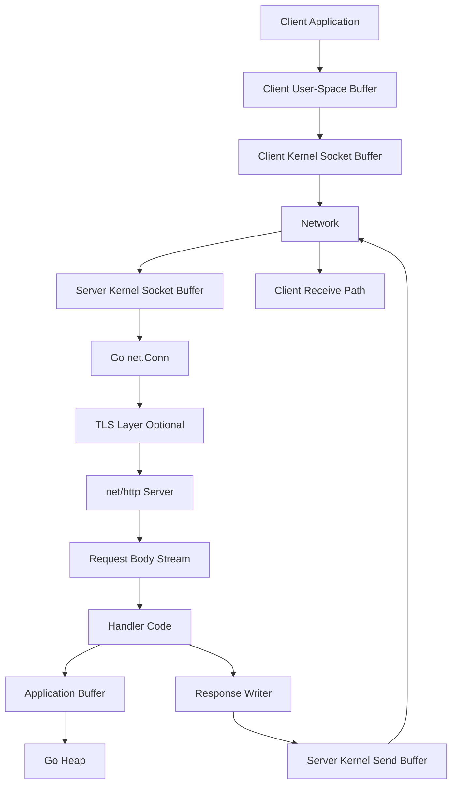
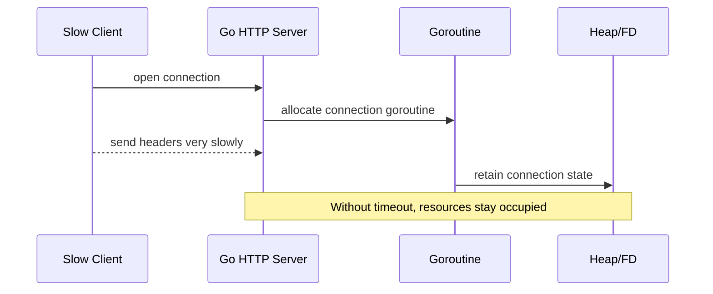
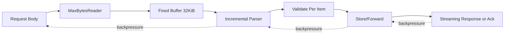
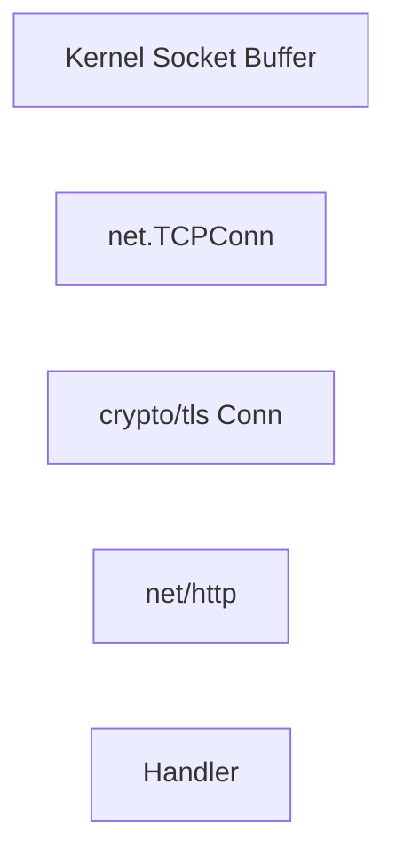
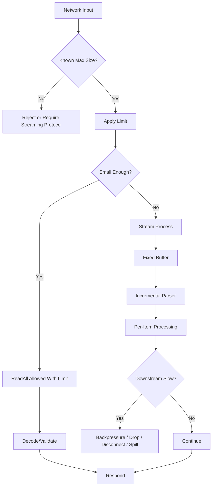
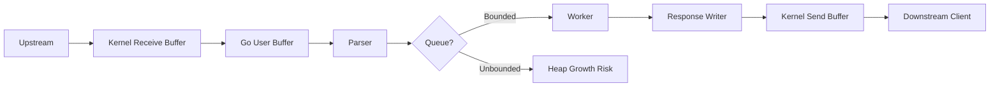
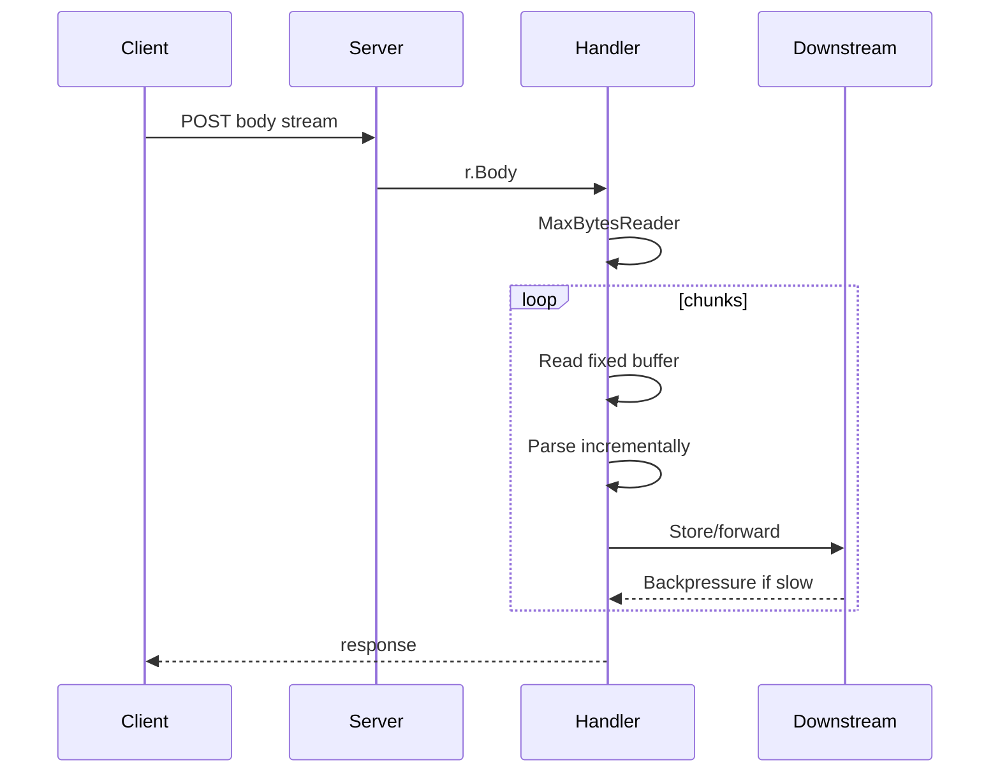

# learn-go-memory-systems-part-019.md

# Go Memory Systems Part 019 — Network Buffers: TCP, HTTP, Request/Response Body Streaming, Avoiding Buffering Disasters

> Target: Go 1.26.x  
> Audience: Java software engineer yang ingin membangun intuisi Go level production/runtime/infra.  
> Posisi seri: setelah memahami value representation, slice/string/buffer/stream/copy/zero-copy, sekarang kita masuk ke jaringan: tempat memory bug sering berubah menjadi latency spike, OOM, connection leak, dan incident.

---

## 0. Status Seri

Part yang sedang dibahas:

```text
learn-go-memory-systems-part-019.md
```

Part sebelumnya:

```text
learn-go-memory-systems-part-018.md
```

Topik sebelumnya: zero-copy di Go.

Part berikutnya:

```text
learn-go-memory-systems-part-020.md
```

Topik berikutnya: file I/O buffers, `os.File`, `bufio`, `io.Copy`, `sendfile`, dan mmap trade-offs.

Seri belum selesai.

---

## 1. Tujuan Part Ini

Setelah part ini, kamu harus mampu menjawab pertanyaan seperti:

1. Kenapa TCP disebut stream, bukan message queue?
2. Kenapa `Read` dari `net.Conn` bisa mengembalikan partial frame?
3. Kenapa request body HTTP harus diperlakukan sebagai stream, bukan `[]byte` default?
4. Kapan `io.ReadAll(r.Body)` aman, kapan berbahaya?
5. Apa bedanya:
   - socket buffer,
   - Go buffer,
   - HTTP body,
   - kernel buffer,
   - user-space heap,
   - TLS buffer,
   - reverse proxy buffer?
6. Bagaimana mendesain handler HTTP yang bounded-memory?
7. Bagaimana menghindari slowloris, huge body, response buffering, dan connection leak?
8. Bagaimana streaming JSON, multipart upload, download, proxying, dan transform pipeline secara memory-aware?
9. Bagaimana membaca pprof ketika memory naik karena network path?
10. Bagaimana melakukan design review network endpoint dari perspektif memory, backpressure, dan failure mode?

---

## 2. Core Thesis

Network programming di Go sering terlihat sederhana karena API-nya kecil:

```go
n, err := conn.Read(buf)
n, err := conn.Write(buf)
```

atau:

```go
func handler(w http.ResponseWriter, r *http.Request) {
    data, _ := io.ReadAll(r.Body)
    ...
}
```

Tetapi kesederhanaan API menutupi beberapa fakta penting:

1. Network adalah stream, bukan array.
2. Boundary aplikasi tidak sama dengan boundary packet.
3. Read/write bisa partial.
4. Buffer bisa berada di banyak layer.
5. Backpressure adalah sinyal desain, bukan noise.
6. Memory problem sering muncul dari unbounded buffering.
7. Connection leak sering muncul dari body yang tidak di-drain/close.
8. Zero-copy tidak otomatis tersedia hanya karena kamu memakai `[]byte`.
9. HTTP abstraction bisa menyembunyikan cost body parsing.
10. Production system harus punya explicit max size, timeout, cancellation, dan observability.

---

## 3. Mental Model Besar



Yang perlu diperhatikan:

- Semua kotak bisa punya buffer.
- Buffer bisa bounded atau unbounded.
- Buffer bisa di heap Go atau di kernel.
- Backpressure terjadi ketika downstream tidak bisa menerima data secepat upstream mengirim.
- Mengabaikan backpressure biasanya berarti membuat heap menjadi “shock absorber”.
- Heap sebagai shock absorber hampir selalu buruk untuk service long-running.

---

## 4. TCP Stream Mental Model

TCP adalah byte stream.

Artinya:

- tidak ada message boundary di API `Read`;
- satu `Write` di sisi pengirim tidak selalu menjadi satu `Read` di sisi penerima;
- satu frame aplikasi bisa datang dalam beberapa `Read`;
- beberapa frame aplikasi bisa datang dalam satu `Read`;
- packet boundary tidak boleh dianggap sebagai boundary protocol aplikasi.

Contoh bug umum:

```go
buf := make([]byte, 1024)
n, err := conn.Read(buf)
if err != nil {
    return err
}

msg := buf[:n]
// Salah jika menganggap msg selalu tepat satu request lengkap.
```

Untuk protocol framing, kamu harus membuat parser yang sadar boundary.

---

## 5. Packet Boundary Myth

Misal client melakukan:

```go
conn.Write([]byte("hello"))
conn.Write([]byte("world"))
```

Server bisa menerima:

```text
Read #1: "helloworld"
```

atau:

```text
Read #1: "hel"
Read #2: "low"
Read #3: "orld"
```

atau:

```text
Read #1: "hello"
Read #2: "world"
```

Semuanya valid.

Implikasi desain:

- Jangan parse berdasarkan “sekali read”.
- Gunakan framing:
  - length-prefix,
  - delimiter,
  - fixed-size record,
  - chunked format,
  - higher-level protocol seperti HTTP/2/gRPC.
- Batasi frame size.
- Pertahankan parser state antar read.
- Jangan `append` tanpa batas ke buffer.

---

## 6. `net.Conn` Contract

`net.Conn` adalah interface utama untuk stream connection.

Kontrak penting:

```go
type Conn interface {
    Read(b []byte) (n int, err error)
    Write(b []byte) (n int, err error)
    Close() error
    LocalAddr() Addr
    RemoteAddr() Addr
    SetDeadline(t time.Time) error
    SetReadDeadline(t time.Time) error
    SetWriteDeadline(t time.Time) error
}
```

### 6.1 `Read`

`Read`:

- mengisi sebagian atau seluruh `b`;
- bisa mengembalikan `n > 0` bersama `err != nil`;
- bisa block sampai data tersedia, deadline, close, atau error;
- tidak menjamin buffer penuh.

Pattern aman:

```go
n, err := conn.Read(buf)
if n > 0 {
    consume(buf[:n])
}
if err != nil {
    return err
}
```

Jangan:

```go
n, err := conn.Read(buf)
if err != nil {
    return err
}
consume(buf[:n])
```

Karena kamu bisa membuang data ketika `n > 0` dan `err != nil`.

### 6.2 `Write`

`Write`:

- bisa menulis sebagian data;
- bisa block ketika send buffer penuh;
- bisa gagal karena deadline, reset, broken pipe, closed connection.

Pattern safe write all:

```go
func writeAll(w io.Writer, p []byte) error {
    for len(p) > 0 {
        n, err := w.Write(p)
        if n > 0 {
            p = p[n:]
        }
        if err != nil {
            return err
        }
        if n == 0 {
            return io.ErrShortWrite
        }
    }
    return nil
}
```

Untuk banyak kasus, gunakan abstraction yang sudah menangani ini, tetapi pahami invariant-nya.

---

## 7. Socket Buffer vs Go Buffer

Ada minimal dua lapis buffer:

```mermaid
flowchart LR
    A[Remote Sender]
    B[Kernel Receive Buffer]
    C[Go net.Conn Read]
    D[User Buffer []byte]
    E[Parser State]
    F[Application Object]

    A --> B
    B --> C
    C --> D
    D --> E
    E --> F
```

Kernel receive buffer:

- dikelola OS;
- bukan Go heap;
- ukuran dipengaruhi OS dan socket option;
- menyerap burst sementara;
- jika penuh, TCP flow control memberi backpressure ke pengirim.

Go user buffer:

- `[]byte` yang kamu sediakan ke `Read`;
- berada di Go heap atau stack tergantung escape;
- bisa di-pool atau reused;
- bisa retained jika kamu menyimpan subslice.

Aplikasi yang buruk sering melakukan ini:

```go
var all []byte
for {
    n, err := conn.Read(buf)
    all = append(all, buf[:n]...)
    ...
}
```

Jika tidak ada limit, heap menjadi buffer unbounded.

---

## 8. Backpressure

Backpressure adalah mekanisme ketika downstream lambat membuat upstream melambat.

Dalam TCP:

- receiver lambat membaca;
- receive buffer penuh;
- TCP window mengecil;
- sender melambat.

Dalam Go pipeline:


Backpressure yang sehat:

- `Writer.Write` block karena network lambat;
- `Processor` menunggu;
- `Parser` menunggu;
- `Reader` tidak membaca lebih banyak;
- kernel buffer memberi pressure balik.

Backpressure yang rusak:


Akibat:

- heap naik;
- GC makin sering;
- latency naik;
- OOM;
- request timeout;
- service restart.

Rule:

> Jangan memutus backpressure dengan queue unbounded kecuali kamu punya policy eksplisit: max size, drop, spill-to-disk, rate limit, atau reject.

---

## 9. HTTP Body adalah Stream

Dalam `net/http`, request body adalah stream:

```go
r.Body // io.ReadCloser
```

Kesalahan umum:

```go
data, err := io.ReadAll(r.Body)
```

Ini tidak selalu salah, tetapi berbahaya jika:

- body size tidak dibatasi;
- endpoint public;
- upload bisa besar;
- attacker bisa mengirim body besar;
- handler berjalan banyak concurrent;
- memory limit container ketat;
- request timeout tidak jelas.

Safe pattern minimal:

```go
func handler(w http.ResponseWriter, r *http.Request) {
    const maxBody = 1 << 20 // 1 MiB

    r.Body = http.MaxBytesReader(w, r.Body, maxBody)
    defer r.Body.Close()

    data, err := io.ReadAll(r.Body)
    if err != nil {
        http.Error(w, "request body too large or invalid", http.StatusRequestEntityTooLarge)
        return
    }

    _ = data
}
```

Lebih baik untuk data besar: streaming decode/process.

---

## 10. `http.MaxBytesReader`

`http.MaxBytesReader` membungkus request body agar pembacaan dibatasi.

Mental model:


Gunakan untuk:

- endpoint JSON kecil;
- form body;
- upload metadata;
- request body yang harus bounded.

Jangan mengandalkan validasi application-level setelah `ReadAll` jika body sudah masuk heap terlalu besar.

Urutan yang benar:

1. Bungkus body dengan limit.
2. Decode/process.
3. Close body.
4. Return error yang tepat.

---

## 11. `io.LimitReader` vs `http.MaxBytesReader`

`io.LimitReader`:

```go
limited := io.LimitReader(r.Body, max)
```

- membatasi data yang dibaca dari reader;
- setelah limit habis, terlihat seperti EOF;
- tidak punya integrasi HTTP-specific.

`http.MaxBytesReader`:

```go
r.Body = http.MaxBytesReader(w, r.Body, max)
```

- HTTP-specific;
- mengembalikan error saat limit terlampaui;
- membantu server menangani connection behavior.

Untuk HTTP server handler, prefer `http.MaxBytesReader`.

---

## 12. Avoiding `io.ReadAll` Disasters

`io.ReadAll` cocok jika:

- input kecil;
- ada hard maximum;
- concurrency terbatas;
- error path jelas;
- tidak dipakai pada unknown stream.

`io.ReadAll` berbahaya jika:

- request body dari internet;
- file upload;
- response proxy;
- stream tanpa EOF cepat;
- event feed;
- large JSON array;
- compressed body;
- multipart body.

Contoh buruk:

```go
func upload(w http.ResponseWriter, r *http.Request) {
    data, err := io.ReadAll(r.Body)
    if err != nil {
        http.Error(w, err.Error(), 400)
        return
    }
    process(data)
}
```

Problem:

- attacker kirim 5 GiB;
- service membaca sampai heap penuh;
- GC thrash;
- OOMKill.

Pattern lebih baik:

```go
func upload(w http.ResponseWriter, r *http.Request) {
    const maxBody = 100 << 20 // 100 MiB
    r.Body = http.MaxBytesReader(w, r.Body, maxBody)
    defer r.Body.Close()

    if err := processStream(r.Context(), r.Body); err != nil {
        http.Error(w, err.Error(), http.StatusBadRequest)
        return
    }

    w.WriteHeader(http.StatusNoContent)
}
```

---

## 13. Streaming JSON

Untuk JSON besar, jangan selalu `ReadAll` lalu `json.Unmarshal`.

### 13.1 Small JSON

```go
const maxJSON = 1 << 20

func handleSmallJSON(w http.ResponseWriter, r *http.Request) {
    r.Body = http.MaxBytesReader(w, r.Body, maxJSON)
    defer r.Body.Close()

    var req CreateRequest
    dec := json.NewDecoder(r.Body)
    dec.DisallowUnknownFields()

    if err := dec.Decode(&req); err != nil {
        http.Error(w, "bad json", http.StatusBadRequest)
        return
    }

    w.WriteHeader(http.StatusNoContent)
}
```

Ini masih streaming secara decoder, tetapi object hasil decode tetap bisa besar sesuai struktur input. Limit body tetap penting.

### 13.2 Large JSON Array

Input:

```json
[
  {"id":1},
  {"id":2},
  {"id":3}
]
```

Pattern streaming:

```go
func processJSONArray(r io.Reader, handle func(Item) error) error {
    dec := json.NewDecoder(r)

    tok, err := dec.Token()
    if err != nil {
        return err
    }
    if d, ok := tok.(json.Delim); !ok || d != '[' {
        return fmt.Errorf("expected array")
    }

    for dec.More() {
        var item Item
        if err := dec.Decode(&item); err != nil {
            return err
        }
        if err := handle(item); err != nil {
            return err
        }
    }

    tok, err = dec.Token()
    if err != nil {
        return err
    }
    if d, ok := tok.(json.Delim); !ok || d != ']' {
        return fmt.Errorf("expected end array")
    }

    return nil
}
```

Benefit:

- memory bounded per item;
- bisa apply backpressure;
- tidak membangun giant slice.

Trade-off:

- error recovery lebih kompleks;
- partial commit harus dipikirkan;
- transaction boundary harus jelas.

---

## 14. Multipart Upload

Multipart sering menjadi sumber memory incident.

Bad pattern:

```go
if err := r.ParseMultipartForm(100 << 20); err != nil {
    ...
}
```

`ParseMultipartForm` bisa menyimpan sebagian data di memory dan sisanya di temporary file. Ini bisa benar, tetapi harus dipahami dan dibatasi.

Streaming pattern:

```go
func uploadMultipart(w http.ResponseWriter, r *http.Request) {
    const maxBody = 500 << 20
    r.Body = http.MaxBytesReader(w, r.Body, maxBody)
    defer r.Body.Close()

    mr, err := r.MultipartReader()
    if err != nil {
        http.Error(w, "bad multipart", http.StatusBadRequest)
        return
    }

    for {
        part, err := mr.NextPart()
        if errors.Is(err, io.EOF) {
            break
        }
        if err != nil {
            http.Error(w, "bad multipart", http.StatusBadRequest)
            return
        }

        if part.FileName() == "" {
            if err := consumeField(part); err != nil {
                http.Error(w, "bad field", http.StatusBadRequest)
                return
            }
            continue
        }

        if err := storeFilePart(r.Context(), part); err != nil {
            http.Error(w, "upload failed", http.StatusBadRequest)
            return
        }
    }

    w.WriteHeader(http.StatusNoContent)
}
```

Streaming part langsung ke storage/file/object store.

---

## 15. Response Streaming

Response juga bisa jadi memory disaster.

Bad pattern:

```go
var buf bytes.Buffer
for _, row := range rows {
    fmt.Fprintf(&buf, "%s,%s\n", row.A, row.B)
}
w.Write(buf.Bytes())
```

Jika result besar, heap naik.

Streaming pattern:

```go
func exportCSV(w http.ResponseWriter, r *http.Request) {
    w.Header().Set("Content-Type", "text/csv")
    w.Header().Set("Content-Disposition", `attachment; filename="export.csv"`)

    bw := bufio.NewWriterSize(w, 32<<10)
    defer bw.Flush()

    rows := queryRows(r.Context())
    for rows.Next() {
        row := rows.Row()
        if _, err := fmt.Fprintf(bw, "%s,%s\n", row.A, row.B); err != nil {
            return
        }
    }
}
```

Dengan streaming:

- memory bounded;
- client lambat memberi backpressure;
- handler tidak perlu menunggu semua data selesai sebelum mulai mengirim.

---

## 16. Flush

Untuk streaming response interaktif, kamu mungkin perlu flush.

Modern Go menyediakan `http.ResponseController`.

Pattern:

```go
func streamEvents(w http.ResponseWriter, r *http.Request) {
    rc := http.NewResponseController(w)

    w.Header().Set("Content-Type", "text/event-stream")
    w.Header().Set("Cache-Control", "no-cache")

    ticker := time.NewTicker(time.Second)
    defer ticker.Stop()

    for {
        select {
        case <-r.Context().Done():
            return
        case t := <-ticker.C:
            if _, err := fmt.Fprintf(w, "data: %s\n\n", t.Format(time.RFC3339)); err != nil {
                return
            }
            if err := rc.Flush(); err != nil {
                return
            }
        }
    }
}
```

Flush bukan solusi untuk semua buffering:

- ada buffering di Go;
- ada buffering di TLS;
- ada buffering di reverse proxy;
- ada buffering di client;
- ada buffering di network.

Tetapi flush memberi sinyal untuk mengirim data yang sudah ditulis.

---

## 17. Request Body Close

Selalu pahami lifecycle body.

Server handler:

```go
defer r.Body.Close()
```

Di server, `net/http` mengelola banyak hal, tetapi menutup body tetap praktik aman, terutama ketika kamu mengganti wrapper atau membaca secara custom.

Client side lebih kritis:

```go
resp, err := http.DefaultClient.Do(req)
if err != nil {
    return err
}
defer resp.Body.Close()
```

Jika response body tidak ditutup:

- connection tidak bisa direuse;
- FD bisa bocor;
- goroutine transport bisa tertahan;
- memory/connection pool naik.

Jika response body tidak dibaca sampai EOF, connection reuse bisa terganggu. Untuk response yang ingin dibuang:

```go
io.Copy(io.Discard, resp.Body)
resp.Body.Close()
```

Gunakan dengan hati-hati untuk body besar; kadang lebih baik close dan biarkan connection dibuang.

---

## 18. HTTP Client Streaming

Bad pattern:

```go
resp, err := http.Get(url)
if err != nil {
    return err
}
defer resp.Body.Close()

data, err := io.ReadAll(resp.Body)
```

Aman hanya jika response size bounded.

Streaming download:

```go
func download(ctx context.Context, client *http.Client, url string, dst io.Writer) error {
    req, err := http.NewRequestWithContext(ctx, http.MethodGet, url, nil)
    if err != nil {
        return err
    }

    resp, err := client.Do(req)
    if err != nil {
        return err
    }
    defer resp.Body.Close()

    if resp.StatusCode != http.StatusOK {
        return fmt.Errorf("unexpected status: %s", resp.Status)
    }

    _, err = io.Copy(dst, resp.Body)
    return err
}
```

Untuk limit:

```go
limited := io.LimitReader(resp.Body, max)
_, err = io.Copy(dst, limited)
```

Tapi pastikan kamu tahu apakah lebih baik drain atau close.

---

## 19. Timeout adalah Memory Control

Timeout bukan hanya reliability feature. Timeout juga memory control.

Tanpa timeout:

- slow client bisa menahan connection;
- goroutine tetap hidup;
- buffer tetap retained;
- file handle/DB transaction bisa tertahan;
- heap tidak turun karena object masih reachable.

Server config:

```go
srv := &http.Server{
    Addr:              ":8080",
    Handler:           mux,
    ReadHeaderTimeout: 5 * time.Second,
    ReadTimeout:       30 * time.Second,
    WriteTimeout:      60 * time.Second,
    IdleTimeout:       120 * time.Second,
    MaxHeaderBytes:    1 << 20,
}
```

Makna kasar:

- `ReadHeaderTimeout`: mitigasi slowloris header.
- `ReadTimeout`: batas membaca request secara keseluruhan.
- `WriteTimeout`: batas menulis response.
- `IdleTimeout`: batas keep-alive idle.
- `MaxHeaderBytes`: batas header.

Jangan copy nilai di atas membabi buta. Sesuaikan dengan endpoint.

Upload besar butuh timeout berbeda dari API JSON kecil.

---

## 20. Slowloris

Slowloris adalah pola serangan/masalah ketika client membuka koneksi dan mengirim header/body sangat lambat.

Dampak:

- goroutine per connection tertahan;
- FD habis;
- memory per connection naik;
- worker downstream tertahan;
- service tampak “healthy” tetapi tidak melayani traffic normal.

Mitigasi:

1. `ReadHeaderTimeout`.
2. `MaxHeaderBytes`.
3. reverse proxy timeout.
4. body size limit.
5. rate limit.
6. connection limit.
7. context cancellation.
8. monitoring active connections/goroutines.

Diagram:



---

## 21. Header Memory

HTTP header juga memory.

Risiko:

- header terlalu banyak;
- header value sangat besar;
- repeated header;
- cookie besar;
- auth token besar;
- proxy menambahkan headers.

Gunakan:

```go
MaxHeaderBytes: 1 << 20
```

Tetapi juga review aplikasi:

- Jangan log seluruh header sembarangan.
- Jangan copy header ke `map[string]string` besar tanpa limit.
- Jangan simpan `*http.Request` di background goroutine.
- Jangan menaruh full JWT claims besar di context tanpa kebutuhan.

---

## 22. Connection Reuse and Body Draining

HTTP keep-alive memberi performa bagus, tetapi lifecycle body menentukan connection reuse.

Client pattern:

```go
resp, err := client.Do(req)
if err != nil {
    return err
}
defer resp.Body.Close()

if resp.StatusCode >= 400 {
    io.CopyN(io.Discard, resp.Body, 4<<10) // maybe read small error body
    return fmt.Errorf("bad status: %s", resp.Status)
}

_, err = io.Copy(dst, resp.Body)
return err
```

Jika kamu membaca hanya sedikit lalu close, transport mungkin tidak reuse connection.

Trade-off:

- Drain body besar untuk reuse bisa membuang bandwidth/waktu.
- Close cepat bisa menghindari membaca data tidak berguna.
- Untuk error body kecil, baca limit.
- Untuk body tidak dipercaya, jangan drain unlimited.

---

## 23. `http.Transport` Buffering and Pooling

Client `http.Transport` punya connection pool.

Risk:

- default transport dipakai tanpa timeout;
- banyak host membuat banyak idle connection;
- response body tidak close membuat pool tidak sehat;
- per-host limit tidak sesuai traffic.

Config contoh:

```go
transport := &http.Transport{
    MaxIdleConns:        200,
    MaxIdleConnsPerHost: 20,
    IdleConnTimeout:     90 * time.Second,
}

client := &http.Client{
    Transport: transport,
    Timeout:   30 * time.Second,
}
```

`Client.Timeout` membatasi total request termasuk connection, redirect, body read. Untuk streaming panjang, jangan gunakan nilai pendek yang memutus stream valid.

---

## 24. Request Context

`r.Context()` akan done ketika client disconnect, request canceled, atau server selesai.

Gunakan context untuk menghentikan pipeline:

```go
func processStream(ctx context.Context, r io.Reader) error {
    buf := make([]byte, 32<<10)

    for {
        select {
        case <-ctx.Done():
            return ctx.Err()
        default:
        }

        n, err := r.Read(buf)
        if n > 0 {
            if err2 := processChunk(ctx, buf[:n]); err2 != nil {
                return err2
            }
        }
        if err != nil {
            if errors.Is(err, io.EOF) {
                return nil
            }
            return err
        }
    }
}
```

Tetapi note:

- `Read` sendiri bisa block;
- context tidak otomatis membatalkan arbitrary reader kecuali reader terhubung dengan request/connection yang mendukung cancellation;
- deadline atau close sering diperlukan di lower-level net.Conn.

---

## 25. Bounded Streaming Pipeline

Contoh pipeline aman:



Invariants:

- max body size jelas;
- buffer fixed/reused;
- parser incremental;
- tidak ada queue unbounded;
- tiap item diproses lalu dilepas;
- context cancellation dihormati;
- response write bisa memberi backpressure;
- error path menutup resource.

---

## 26. Binary Protocol over TCP

Misal frame format:

```text
+--------+---------+----------+
| magic  | length  | payload  |
| 2 byte | 4 byte  | N bytes  |
+--------+---------+----------+
```

Parser aman:

```go
const (
    magic   = 0xCAFE
    maxBody = 1 << 20
)

func readFrame(r io.Reader) ([]byte, error) {
    var hdr [6]byte
    if _, err := io.ReadFull(r, hdr[:]); err != nil {
        return nil, err
    }

    if binary.BigEndian.Uint16(hdr[0:2]) != magic {
        return nil, fmt.Errorf("bad magic")
    }

    n := binary.BigEndian.Uint32(hdr[2:6])
    if n > maxBody {
        return nil, fmt.Errorf("frame too large")
    }

    payload := make([]byte, n)
    if _, err := io.ReadFull(r, payload); err != nil {
        return nil, err
    }

    return payload, nil
}
```

Ini allocation per frame. Untuk high-performance, gunakan caller-provided scratch atau streaming payload.

Streaming variant:

```go
func readFrameTo(r io.Reader, dst io.Writer) error {
    var hdr [6]byte
    if _, err := io.ReadFull(r, hdr[:]); err != nil {
        return err
    }

    if binary.BigEndian.Uint16(hdr[0:2]) != magic {
        return fmt.Errorf("bad magic")
    }

    n := binary.BigEndian.Uint32(hdr[2:6])
    if n > maxBody {
        return fmt.Errorf("frame too large")
    }

    _, err := io.CopyN(dst, r, int64(n))
    return err
}
```

---

## 27. HTTP Proxying

Bad reverse proxy style:

```go
body, _ := io.ReadAll(upstreamResp.Body)
w.Write(body)
```

Problem:

- response besar masuk heap;
- client lambat membuat heap menahan body;
- double buffering.

Streaming proxy style:

```go
func proxy(w http.ResponseWriter, r *http.Request) {
    req, err := http.NewRequestWithContext(r.Context(), http.MethodGet, upstreamURL, nil)
    if err != nil {
        http.Error(w, "bad upstream request", 500)
        return
    }

    resp, err := http.DefaultClient.Do(req)
    if err != nil {
        http.Error(w, "upstream error", 502)
        return
    }
    defer resp.Body.Close()

    copyHeaders(w.Header(), resp.Header)
    w.WriteHeader(resp.StatusCode)

    _, _ = io.Copy(w, resp.Body)
}
```

Production reverse proxy lebih kompleks:

- hop-by-hop headers;
- trailers;
- compression;
- timeouts;
- cancellation;
- flush;
- error after headers sent;
- retry semantics;
- body limit;
- observability.

Gunakan `httputil.ReverseProxy` jika sesuai, tapi pahami memory contract-nya.

---

## 28. Compression Changes Memory Model

Compression stream:

```go
gz, err := gzip.NewReader(r.Body)
```

Bahaya:

- compressed body kecil bisa decompress menjadi sangat besar;
- body limit sebelum decompress tidak cukup;
- perlu decompressed limit;
- CPU juga bisa diserang.

Pattern:

```go
compressed := http.MaxBytesReader(w, r.Body, maxCompressed)
defer compressed.Close()

gz, err := gzip.NewReader(compressed)
if err != nil {
    http.Error(w, "bad gzip", 400)
    return
}
defer gz.Close()

limitedPlain := io.LimitReader(gz, maxPlain)
if err := processStream(r.Context(), limitedPlain); err != nil {
    http.Error(w, "bad body", 400)
    return
}
```

Jika perlu tahu apakah limit terlampaui, wrapper khusus dibutuhkan karena `LimitReader` memberi EOF setelah N byte.

---

## 29. TLS Layer

TLS menambah layer:



Implikasi:

- data dienkripsi/dekripsi di user space;
- `sendfile` style zero-copy biasanya tidak berlaku untuk TLS biasa;
- record TLS punya buffering sendiri;
- flush behavior dipengaruhi TLS record;
- CPU dan memory cost naik.

Design consequence:

- jangan mengklaim zero-copy network path ketika TLS aktif kecuali benar-benar terbukti;
- benchmark dengan TLS jika production memakai TLS;
- pprof CPU bisa menunjukkan crypto overhead;
- pprof heap bisa menunjukkan buffer tambahan.

---

## 30. HTTP/2 and Multiplexing

HTTP/2 memperkenalkan multiplexed streams di atas satu connection.

Implikasi memory:

- satu TCP connection bisa membawa banyak stream;
- flow control ada di connection dan stream level;
- slow stream bisa memengaruhi resource;
- response body harus tetap ditutup;
- per-stream buffer dan state perlu dipertimbangkan.

Jangan mengasumsikan:

```text
one request == one TCP connection
```

Dalam HTTP/2, itu salah.

Design review harus bertanya:

- berapa max concurrent stream?
- apakah downstream lambat bisa menahan buffer?
- apakah body streaming tetap bounded?
- apakah timeout cocok untuk long-lived streams?

---

## 31. Long-Lived Streams

Contoh:

- Server-Sent Events;
- long polling;
- websocket-like pattern;
- gRPC streaming;
- event feed;
- watch API.

Memory risks:

- per-client goroutine;
- per-client buffer;
- unbounded event queue;
- slow consumer;
- missed cancellation;
- retained request context;
- retained auth/session object.

Pattern:

```go
type Client struct {
    ch chan Event // bounded
}

func (c *Client) Send(ctx context.Context, e Event) error {
    select {
    case c.ch <- e:
        return nil
    case <-ctx.Done():
        return ctx.Err()
    default:
        return ErrSlowConsumer
    }
}
```

Policy harus jelas:

- block producer;
- drop newest;
- drop oldest;
- disconnect slow client;
- spill to disk;
- per-client replay cursor.

Tidak ada default yang benar untuk semua sistem.

---

## 32. Large Download Handler

Bad:

```go
data, _ := os.ReadFile(path)
w.Write(data)
```

Streaming:

```go
func downloadFile(w http.ResponseWriter, r *http.Request, path string) {
    f, err := os.Open(path)
    if err != nil {
        http.Error(w, "not found", http.StatusNotFound)
        return
    }
    defer f.Close()

    w.Header().Set("Content-Type", "application/octet-stream")
    _, _ = io.Copy(w, f)
}
```

`io.Copy` bisa menggunakan fast path jika source/destination mendukung.

Lebih specialized:

```go
http.ServeFile(w, r, path)
```

Pertimbangkan:

- range requests;
- content type;
- cache headers;
- access control;
- path traversal;
- client disconnect;
- file descriptor pressure.

---

## 33. Large Upload to File

Streaming upload:

```go
func uploadToFile(w http.ResponseWriter, r *http.Request) {
    const maxUpload = 1 << 30 // 1 GiB

    r.Body = http.MaxBytesReader(w, r.Body, maxUpload)
    defer r.Body.Close()

    f, err := os.CreateTemp("", "upload-*")
    if err != nil {
        http.Error(w, "server error", 500)
        return
    }
    defer f.Close()

    if _, err := io.Copy(f, r.Body); err != nil {
        http.Error(w, "upload failed", 400)
        return
    }

    w.WriteHeader(http.StatusNoContent)
}
```

Production additions:

- authenticated user quota;
- checksum;
- content-type sniffing carefully;
- virus scanning;
- temporary file cleanup;
- atomic rename;
- storage quota;
- upload rate limit;
- cancellation cleanup;
- audit log without storing full body.

---

## 34. Chunk Size Selection

Common buffer sizes:

- 4 KiB;
- 8 KiB;
- 16 KiB;
- 32 KiB;
- 64 KiB;
- 128 KiB.

Larger is not always better.

Trade-off:

| Buffer Size | Benefit | Cost |
|---:|---|---|
| small | lower per-connection memory | more syscalls/copy overhead |
| medium | good general throughput | acceptable memory |
| large | fewer calls for large streaming | high memory under concurrency |

Memory math:

```text
10,000 concurrent connections × 64 KiB = 640 MiB
10,000 concurrent connections × 256 KiB = 2.5 GiB
```

A per-connection buffer that seems small can be huge at scale.

---

## 35. Per-Connection Memory Budget

Design formula:

```text
per_connection_memory =
    connection state
  + read buffer
  + write buffer
  + TLS buffer
  + HTTP parser state
  + application scratch buffer
  + per-request decoded objects
  + queue/backlog
```

Total:

```text
total_memory =
    active_connections × per_connection_memory
  + active_requests × per_request_memory
  + caches
  + background workers
  + runtime overhead
  + kernel buffers
  + native/offheap
```

Production review harus meminta angka, bukan “harusnya aman”.

---

## 36. Retention Through Request

Anti-pattern:

```go
go func() {
    doLater(r)
}()
```

Masalah:

- `*http.Request` membawa banyak state;
- header/body/context bisa retained;
- connection-related values bisa ikut;
- body mungkin sudah close;
- memory retained lebih lama dari request.

Lebih baik extract minimal immutable data:

```go
type Job struct {
    UserID string
    TraceID string
    PayloadID string
}

job := Job{
    UserID: userID,
    TraceID: traceID,
    PayloadID: payloadID,
}

go func(job Job) {
    doLater(job)
}(job)
```

---

## 37. Retention Through Slice of Buffer

Bug:

```go
func parseLine(buf []byte) Record {
    parts := bytes.Split(buf, []byte(","))
    return Record{
        ID: parts[0],
    }
}
```

Jika `Record.ID` disimpan, ia bisa mempertahankan entire input buffer.

Solusi copy at ownership boundary:

```go
return Record{
    ID: append([]byte(nil), parts[0]...),
}
```

Atau convert to string dengan copy:

```go
return Record{
    ID: string(parts[0]),
}
```

Copy kecil bisa lebih murah daripada retention besar.

---

## 38. Logging Network Payload

Anti-pattern:

```go
body, _ := io.ReadAll(r.Body)
log.Printf("body=%s", body)
```

Risiko:

- memory besar;
- PII leak;
- secrets leak;
- log amplification;
- body consumed sehingga handler berikutnya tidak bisa membaca;
- pressure ke logging pipeline.

Pattern lebih baik:

- log metadata;
- log size;
- log hash;
- log first N bytes only if safe;
- redact;
- sample;
- never log secrets;
- do not log full body in production.

Example:

```go
limitedPreview := make([]byte, 512)
n, _ := io.ReadFull(r.Body, limitedPreview)
preview := limitedPreview[:n]

// Need to reconstruct body stream if downstream still needs bytes.
// Avoid this unless endpoint is small and bounded.
r.Body = io.NopCloser(io.MultiReader(bytes.NewReader(preview), r.Body))
```

Bahkan preview logging bisa rumit karena mengubah stream.

---

## 39. Middleware and Body Consumption

Middleware sering salah membaca body.

Bad:

```go
func logging(next http.Handler) http.Handler {
    return http.HandlerFunc(func(w http.ResponseWriter, r *http.Request) {
        body, _ := io.ReadAll(r.Body)
        log.Printf("body=%s", body)
        next.ServeHTTP(w, r)
    })
}
```

Handler berikutnya menerima body kosong.

Jika benar-benar perlu read body:

```go
body, err := io.ReadAll(io.LimitReader(r.Body, maxLoggable))
if err != nil {
    ...
}
r.Body.Close()
r.Body = io.NopCloser(bytes.NewReader(body))
```

Tetapi ini hanya cocok untuk body kecil dan bounded.

Untuk body besar, middleware tidak boleh full-read.

---

## 40. ResponseWriter Wrapping

Middleware yang menangkap response juga bisa buffering disaster.

Bad:

```go
type capture struct {
    http.ResponseWriter
    buf bytes.Buffer
}

func (c *capture) Write(p []byte) (int, error) {
    return c.buf.Write(p)
}
```

Ini menahan seluruh response.

Jika hanya butuh status/size:

```go
type observeWriter struct {
    http.ResponseWriter
    status int
    bytes  int64
}

func (w *observeWriter) WriteHeader(status int) {
    w.status = status
    w.ResponseWriter.WriteHeader(status)
}

func (w *observeWriter) Write(p []byte) (int, error) {
    n, err := w.ResponseWriter.Write(p)
    w.bytes += int64(n)
    return n, err
}
```

Jangan capture body kecuali ada limit ketat.

---

## 41. `bufio.Reader` with Network

`bufio.Reader` berguna untuk:

- line-based protocol;
- peek;
- read until delimiter;
- reduce syscalls.

Tetapi hati-hati:

```go
line, err := br.ReadString('\n')
```

Jika delimiter tidak datang, buffer bisa tumbuh.

Lebih aman:

```go
line, err := br.ReadSlice('\n')
```

Tetapi `ReadSlice` mengembalikan slice yang valid sampai read berikutnya. Jika mau simpan, copy.

Untuk line protocol public, limit panjang line.

---

## 42. Scanner Token Limit

`bufio.Scanner` convenient tapi punya token limit default.

Untuk protocol yang line-nya bisa besar, kamu harus set buffer:

```go
scanner := bufio.NewScanner(r)
scanner.Buffer(make([]byte, 0, 64<<10), 1<<20)
```

Tetapi menaikkan limit bukan solusi universal. Tetap ada max.

Jika token bisa sangat besar, gunakan streaming parser custom.

---

## 43. Designing Network API Ownership

Untuk handler/function network, dokumentasikan ownership:

```go
// ParseMessage parses p during the call.
// It does not retain p after returning.
func ParseMessage(p []byte) (Message, error)
```

atau:

```go
// NewMessage stores a copy of p.
// Caller may reuse p after this call.
func NewMessage(p []byte) Message
```

atau:

```go
// NewMessageView stores references into p.
// Caller must keep p immutable and alive while Message is used.
func NewMessageView(p []byte) MessageView
```

Untuk public API, prefer copy-safe default. Untuk hot internal path, view boleh, tapi contract harus ketat.

---

## 44. Memory-Safe HTTP Handler Template

```go
func handle(w http.ResponseWriter, r *http.Request) {
    if r.Method != http.MethodPost {
        http.Error(w, "method not allowed", http.StatusMethodNotAllowed)
        return
    }

    const maxBody = 2 << 20 // 2 MiB
    r.Body = http.MaxBytesReader(w, r.Body, maxBody)
    defer r.Body.Close()

    ctx := r.Context()

    dec := json.NewDecoder(r.Body)
    dec.DisallowUnknownFields()

    var req Request
    if err := dec.Decode(&req); err != nil {
        http.Error(w, "bad request", http.StatusBadRequest)
        return
    }

    if err := validate(req); err != nil {
        http.Error(w, "bad request", http.StatusBadRequest)
        return
    }

    resp, err := service.Do(ctx, req)
    if err != nil {
        http.Error(w, "server error", http.StatusInternalServerError)
        return
    }

    w.Header().Set("Content-Type", "application/json")
    enc := json.NewEncoder(w)
    if err := enc.Encode(resp); err != nil {
        return
    }
}
```

Checklist:

- method checked;
- body limited;
- body closed;
- decoder streaming;
- validation;
- context passed;
- response encoded directly to writer;
- no full response buffer unless needed.

---

## 45. Memory-Safe Upload Handler Template

```go
func handleUpload(w http.ResponseWriter, r *http.Request) {
    const maxBody = 500 << 20

    r.Body = http.MaxBytesReader(w, r.Body, maxBody)
    defer r.Body.Close()

    dst, err := createUploadSink(r.Context())
    if err != nil {
        http.Error(w, "server error", 500)
        return
    }
    defer dst.Close()

    h := sha256.New()

    mw := io.MultiWriter(dst, h)
    written, err := io.CopyBuffer(mw, r.Body, make([]byte, 64<<10))
    if err != nil {
        http.Error(w, "upload failed", 400)
        return
    }

    sum := h.Sum(nil)

    if err := finalizeUpload(r.Context(), written, sum); err != nil {
        http.Error(w, "server error", 500)
        return
    }

    w.WriteHeader(http.StatusNoContent)
}
```

Note:

- streaming;
- fixed buffer;
- checksum streaming;
- max body;
- context-aware sink jika mungkin;
- no `ReadAll`.

---

## 46. Memory-Safe Download Template

```go
func handleDownload(w http.ResponseWriter, r *http.Request) {
    src, meta, err := openDownloadSource(r.Context(), r.URL.Query().Get("id"))
    if err != nil {
        http.Error(w, "not found", 404)
        return
    }
    defer src.Close()

    w.Header().Set("Content-Type", meta.ContentType)
    w.Header().Set("Content-Length", strconv.FormatInt(meta.Size, 10))

    if _, err := io.CopyBuffer(w, src, make([]byte, 64<<10)); err != nil {
        return
    }
}
```

Memory bounded by buffer size and lower-layer state.

---

## 47. Error After Partial Response

Once you call:

```go
w.WriteHeader(http.StatusOK)
```

or write body implicitly, status is committed.

If streaming fails halfway:

- cannot change status to 500;
- client sees truncated response;
- protocol may indicate error by connection close;
- application-level framing may need checksum/footer;
- logs/metrics must capture failure.

For critical downloads:

- include content length/checksum;
- use object storage semantics;
- use resumable download;
- design client to detect truncated response.

---

## 48. Channels as Network Buffers

Bad:

```go
ch := make(chan []byte, 1_000_000)
```

This is a heap queue.

Even bounded channel can be large:

```text
1,000,000 × 4 KiB = ~4 GiB payload references
```

If each element points to unique buffer, huge memory.

Better:

```go
ch := make(chan []byte, 64)
```

with policy:

- backpressure;
- drop;
- disconnect;
- spill;
- rate limit.

For network streams, queue size is part of memory budget.

---

## 49. `sync.Pool` for Network Buffers

Pattern:

```go
var bufPool = sync.Pool{
    New: func() any {
        b := make([]byte, 32<<10)
        return &b
    },
}

func getBuf() *[]byte {
    return bufPool.Get().(*[]byte)
}

func putBuf(p *[]byte) {
    b := *p
    if cap(b) != 32<<10 {
        return
    }
    b = b[:32<<10]
    clear(b) // if sensitive data
    *p = b
    bufPool.Put(p)
}
```

Caveats:

- `sync.Pool` entries can disappear at any GC;
- do not put buffer still used by writer/goroutine;
- do not pool giant buffers casually;
- clear sensitive data;
- benchmark under realistic concurrency;
- avoid retaining large capacity accidentally.

Often per-handler local buffer is enough.

---

## 50. `bytes.Buffer` in Network Path

`bytes.Buffer` is useful for small composed payload.

But:

```go
var b bytes.Buffer
io.Copy(&b, r.Body)
```

is basically `ReadAll`.

Use `bytes.Buffer` for:

- small request signing canonicalization;
- small response body;
- tests;
- retry body for small payload;
- protocol header assembly.

Avoid for:

- large upload;
- proxy response;
- export;
- unknown input;
- long-lived queue.

---

## 51. Retry and Body Re-read

HTTP client retry with body is tricky.

If body is stream:

```go
req.Body
```

may not be rewindable.

For small body:

```go
body := []byte(`{"x":1}`)
req, _ := http.NewRequest("POST", url, bytes.NewReader(body))
```

Can retry by recreating reader.

For large body:

- use file reader with seek;
- use object store;
- use idempotency key;
- avoid blind retry after partial write;
- support resumable upload.

Memory trap:

```go
body, _ := io.ReadAll(src)
```

to make retry easy. This fails for large src.

---

## 52. Dealing with Unknown Content-Length

Request can have:

```go
r.ContentLength == -1
```

Meaning unknown.

Do not trust Content-Length alone:

- client may lie;
- chunked encoding;
- compressed body expands;
- proxies transform;
- missing length.

Use actual read limit.

```go
r.Body = http.MaxBytesReader(w, r.Body, max)
```

Content-Length is useful for early reject:

```go
if r.ContentLength > max {
    http.Error(w, "too large", http.StatusRequestEntityTooLarge)
    return
}
```

But still enforce during read.

---

## 53. Form Parsing

`r.ParseForm()` and `r.ParseMultipartForm()` can read body.

Risk:

- implicit memory use;
- default limits not enough for your domain;
- middleware may parse before handler;
- body consumed.

Pattern:

```go
r.Body = http.MaxBytesReader(w, r.Body, maxForm)
if err := r.ParseForm(); err != nil {
    http.Error(w, "bad form", 400)
    return
}
```

For multipart large uploads, prefer streaming `MultipartReader`.

---

## 54. Header + Body Combined Limits

An endpoint should define:

```text
max header size
max body size
max decompressed size
max field count
max field size
max file count
max file size
max processing time
max concurrent requests
```

Only `max body size` is not enough.

Example:

```text
POST /imports
- max compressed body: 100 MiB
- max decompressed stream: 2 GiB
- max rows: 10 million
- max row size: 64 KiB
- max columns: 200
- max duration: 30 minutes
- max concurrent imports per tenant: 2
```

This is production design, not micro-optimization.

---

## 55. Observability Metrics

Network memory path needs metrics:

- active connections;
- active requests;
- request body bytes read;
- response bytes written;
- rejected body too large;
- read timeout;
- write timeout;
- client disconnect;
- handler duration;
- in-flight upload bytes;
- per-endpoint concurrency;
- goroutine count;
- heap alloc;
- heap objects;
- GC CPU;
- RSS;
- open file descriptors;
- idle/active client transport connections if client-heavy.

---

## 56. pprof Investigation

Symptoms:

- heap grows during upload/download;
- GC CPU spikes;
- OOM on large request;
- goroutines grow;
- latency high when clients slow.

Profiles:

```bash
go tool pprof http://localhost:6060/debug/pprof/heap
go tool pprof -alloc_space http://localhost:6060/debug/pprof/heap
go tool pprof http://localhost:6060/debug/pprof/goroutine
go tool pprof http://localhost:6060/debug/pprof/block
```

Interpretation:

| Profile | Use |
|---|---|
| inuse_space | retained memory now |
| alloc_space | allocation churn |
| goroutine | stuck reads/writes, leaks |
| block | blocking on channel/mutex/I/O |
| trace | scheduling, network blocking, latency |

Common findings:

- `io.ReadAll`;
- `bytes.Buffer.grow`;
- `encoding/json`;
- middleware body capture;
- response capture;
- `bytes.Split` retaining large buffer;
- goroutine stuck writing to slow client;
- channel queue retaining `[]byte`.

---

## 57. Example Incident: Upload OOM

Symptom:

```text
Kubernetes pod OOMKilled during large uploads.
Heap profile shows bytes.Buffer and io.ReadAll.
```

Root cause:

```go
body, _ := io.ReadAll(r.Body)
```

No `MaxBytesReader`.

Contributing factors:

- client sends multi-GB body;
- 200 concurrent uploads;
- memory limit 2 GiB;
- logging middleware also reads body;
- retry duplicates traffic.

Fix:

1. Add max body.
2. Stream to temporary file/object store.
3. Remove body logging.
4. Add per-tenant concurrency.
5. Add timeout.
6. Add metrics.
7. Add load test with large body.
8. Add pprof regression run.

---

## 58. Example Incident: Slow Client Response Retention

Symptom:

```text
Heap grows when exporting CSV to slow clients.
```

Bad code:

```go
var rows []Row
for dbRows.Next() {
    rows = append(rows, scanRow(dbRows))
}

var b bytes.Buffer
for _, row := range rows {
    writeCSV(&b, row)
}

w.Write(b.Bytes())
```

Root cause:

- all rows retained;
- full CSV retained;
- slow client delays release.

Fix:

```go
bw := bufio.NewWriter(w)
defer bw.Flush()

for dbRows.Next() {
    row := scanRow(dbRows)
    if err := writeCSV(bw, row); err != nil {
        return
    }
}
```

Also handle context cancellation so DB query stops when client disconnects.

---

## 59. Example Incident: Connection Leak in HTTP Client

Symptom:

```text
Outbound calls slow down.
FD count grows.
Goroutine count grows.
Transport not reusing connections.
```

Bad code:

```go
resp, err := client.Do(req)
if err != nil {
    return err
}
if resp.StatusCode != 200 {
    return fmt.Errorf("bad status")
}
```

Missing:

```go
defer resp.Body.Close()
```

Fix:

```go
resp, err := client.Do(req)
if err != nil {
    return err
}
defer resp.Body.Close()

if resp.StatusCode != http.StatusOK {
    io.CopyN(io.Discard, resp.Body, 4<<10)
    return fmt.Errorf("bad status: %s", resp.Status)
}
```

---

## 60. Example Incident: Unbounded SSE Queue

Symptom:

```text
One tenant opens 20k SSE clients.
Memory grows slowly until OOM.
```

Bad design:

```go
client.events = make(chan Event, 100000)
```

Each slow client accumulates events.

Fix options:

1. Small bounded channel.
2. Drop oldest.
3. Disconnect slow consumer.
4. Per-tenant connection limit.
5. Replay from durable log by cursor.
6. Compress/coalesce events.
7. Monitor queue depth.

---

## 61. Production Review Checklist

### 61.1 Request Body

- [ ] Is max body size defined?
- [ ] Is max body enforced during read?
- [ ] Is decompressed size bounded?
- [ ] Is multipart handled streaming if large?
- [ ] Is `io.ReadAll` justified?
- [ ] Is body closed?
- [ ] Is context cancellation propagated?
- [ ] Are errors mapped to proper status?

### 61.2 Response

- [ ] Is response streamed if large?
- [ ] Is full response buffering avoided?
- [ ] Is flush needed?
- [ ] What happens if client disconnects?
- [ ] Can status be changed after partial write? If not, is protocol robust?
- [ ] Is content length known?
- [ ] Is checksum/footer needed?

### 61.3 Buffer

- [ ] Are buffer sizes explicit?
- [ ] Are buffers per request or shared?
- [ ] Is pooling justified by benchmark?
- [ ] Is sensitive data cleared?
- [ ] Can large capacity be retained?
- [ ] Are borrowed slices copied at ownership boundary?

### 61.4 Connection

- [ ] Are server timeouts configured?
- [ ] Is `ReadHeaderTimeout` set?
- [ ] Is `MaxHeaderBytes` set?
- [ ] Are idle timeouts set?
- [ ] Are client timeouts set?
- [ ] Are response bodies closed?
- [ ] Are connection pool limits sane?

### 61.5 Backpressure

- [ ] Is there any unbounded queue?
- [ ] Is channel capacity justified?
- [ ] What happens when downstream is slow?
- [ ] Is drop/block/disconnect policy explicit?
- [ ] Are per-tenant limits needed?

### 61.6 Observability

- [ ] Are request/response bytes measured?
- [ ] Are body-too-large errors counted?
- [ ] Are client disconnects visible?
- [ ] Is goroutine count monitored?
- [ ] Are heap/RSS/GC metrics monitored?
- [ ] Is pprof safely accessible?
- [ ] Are timeout errors distinguishable?

---

## 62. Anti-Pattern Catalog

### 62.1 `io.ReadAll` on Public Body

```go
data, _ := io.ReadAll(r.Body)
```

Without max limit, this is an OOM endpoint.

### 62.2 Capturing Entire Response in Middleware

```go
buf.Write(p)
```

without limit.

### 62.3 Unbounded Channel Between Reader and Writer

```go
ch := make(chan []byte, 1000000)
```

Heap queue.

### 62.4 Retaining Request in Goroutine

```go
go func() { use(r) }()
```

Retains too much and may use invalid body.

### 62.5 Trusting Content-Length

```go
if r.ContentLength < max {
    io.ReadAll(r.Body)
}
```

Still enforce limit while reading.

### 62.6 No Timeout

```go
http.ListenAndServe(":8080", mux)
```

Default server without timeouts is usually not acceptable for internet-facing production.

### 62.7 Full Logging Payload

```go
log.Printf("%s", body)
```

Memory + security issue.

### 62.8 Pooling Giant Buffers

```go
pool.Put(&hugeBuffer)
```

Retains large memory and makes RSS behavior worse.

### 62.9 Ignoring Partial Write

```go
conn.Write(buf)
```

without checking `n`.

### 62.10 Treating TCP Read as Message

```go
n, _ := conn.Read(buf)
handleFrame(buf[:n])
```

Protocol bug.

---

## 63. Mini Lab 1 — Observe `io.ReadAll` Allocation

Create handler:

```go
func bad(w http.ResponseWriter, r *http.Request) {
    data, err := io.ReadAll(r.Body)
    if err != nil {
        http.Error(w, err.Error(), 400)
        return
    }
    fmt.Fprintf(w, "read %d bytes\n", len(data))
}
```

Test with large payload.

Observe:

- heap grows;
- allocation profile shows `io.ReadAll`/`bytes.Buffer`;
- GC frequency increases.

Then add:

```go
r.Body = http.MaxBytesReader(w, r.Body, 1<<20)
```

Observe rejection and bounded heap.

---

## 64. Mini Lab 2 — Streaming Upload

Implement:

```go
func good(w http.ResponseWriter, r *http.Request) {
    r.Body = http.MaxBytesReader(w, r.Body, 1<<30)
    defer r.Body.Close()

    f, err := os.CreateTemp("", "upload-*")
    if err != nil {
        http.Error(w, "server error", 500)
        return
    }
    defer os.Remove(f.Name())
    defer f.Close()

    h := sha256.New()
    n, err := io.CopyBuffer(io.MultiWriter(f, h), r.Body, make([]byte, 64<<10))
    if err != nil {
        http.Error(w, "upload failed", 400)
        return
    }

    fmt.Fprintf(w, "stored=%d sha256=%x\n", n, h.Sum(nil))
}
```

Compare heap against bad handler.

---

## 65. Mini Lab 3 — TCP Framing

Write server that incorrectly assumes one read = one frame.

Then send fragmented frame from client.

Observe broken parsing.

Fix with:

```go
io.ReadFull
```

and length-prefix.

Learning:

- TCP stream has no application frame boundary;
- parser owns framing;
- memory limit belongs in parser.

---

## 66. Mini Lab 4 — Slow Client

Create response handler that streams many lines.

Use a slow client that reads slowly.

Observe:

- `Write` blocks;
- goroutine stays active;
- memory bounded if no queue;
- memory grows if you queue response in heap.

---

## 67. Design Exercise

Design endpoint:

```text
POST /v1/imports/customers
```

Requirements:

- accepts gzip CSV;
- max compressed size 200 MiB;
- max decompressed size 5 GiB;
- each row max 64 KiB;
- validate row by row;
- writes valid rows to database;
- rejects malformed CSV;
- supports cancellation;
- returns summary.

Questions:

1. Where do you enforce compressed limit?
2. Where do you enforce decompressed limit?
3. How do you avoid holding all rows?
4. What is transaction boundary?
5. What happens if client disconnects?
6. What is max concurrent import per tenant?
7. What metrics do you expose?
8. How do you test memory bound?
9. What pprof profile do you capture?
10. What do you log without leaking PII?

---

## 68. Reference Implementation Sketch

```go
func importCustomers(w http.ResponseWriter, r *http.Request) {
    const (
        maxCompressed   = 200 << 20
        maxDecompressed = 5 << 30
        maxRowSize      = 64 << 10
    )

    r.Body = http.MaxBytesReader(w, r.Body, maxCompressed)
    defer r.Body.Close()

    gz, err := gzip.NewReader(r.Body)
    if err != nil {
        http.Error(w, "invalid gzip", http.StatusBadRequest)
        return
    }
    defer gz.Close()

    limitedPlain := &countingLimitReader{
        r: gz,
        n: maxDecompressed,
    }

    br := bufio.NewReaderSize(limitedPlain, 64<<10)

    var imported int64

    for {
        line, err := readBoundedLine(br, maxRowSize)
        if len(line) > 0 {
            customer, err := parseCustomer(line)
            if err != nil {
                http.Error(w, "invalid row", http.StatusBadRequest)
                return
            }
            if err := insertCustomer(r.Context(), customer); err != nil {
                http.Error(w, "server error", http.StatusInternalServerError)
                return
            }
            imported++
        }

        if errors.Is(err, io.EOF) {
            break
        }
        if err != nil {
            http.Error(w, "invalid stream", http.StatusBadRequest)
            return
        }
    }

    json.NewEncoder(w).Encode(map[string]any{
        "imported": imported,
    })
}
```

Sketch helper:

```go
type countingLimitReader struct {
    r io.Reader
    n int64
}

func (r *countingLimitReader) Read(p []byte) (int, error) {
    if r.n <= 0 {
        return 0, fmt.Errorf("decompressed body too large")
    }
    if int64(len(p)) > r.n {
        p = p[:r.n]
    }
    n, err := r.r.Read(p)
    r.n -= int64(n)
    return n, err
}
```

This is not full production code, but it shows the shape.

---

## 69. What Top Engineers Watch

A top engineer does not ask only:

```text
How do I make this faster?
```

They ask:

```text
What is the maximum memory this endpoint can consume under adversarial but valid input?
```

They also ask:

```text
Where can backpressure be broken?
```

and:

```text
Which layer owns this buffer?
```

and:

```text
What happens if the downstream is 100x slower?
```

and:

```text
What is retained after request cancellation?
```

These questions prevent production incidents before benchmark tuning begins.

---

## 70. Summary

Network buffers in Go require a precise mental model:

- TCP is a byte stream, not message delivery.
- `Read` and `Write` are partial operations.
- HTTP body is an `io.ReadCloser`, not a `[]byte`.
- `io.ReadAll` must be justified by explicit bounded size.
- `http.MaxBytesReader` is a core defense for server request bodies.
- Streaming decode/process keeps memory bounded.
- Response streaming avoids full response retention.
- Timeout is memory control.
- Backpressure must be preserved.
- Unbounded channels turn slow downstream into heap growth.
- Middleware can accidentally consume or buffer bodies.
- Client response bodies must be closed.
- Context cancellation prevents retained work.
- Observability is required before tuning.
- Copying small data can be safer than retaining giant buffers.
- Zero-copy claims must be checked across TLS/proxy/kernel/application boundaries.

---

## 71. Practical Heuristics

Use these defaults unless evidence says otherwise:

1. Public HTTP body: always enforce max size.
2. Unknown large input: stream, do not `ReadAll`.
3. Large output: stream, do not build full `bytes.Buffer`.
4. Middleware: never capture full body/response without limit.
5. TCP parser: use explicit framing.
6. Per-connection buffers: multiply by concurrency.
7. Queue between network stages: bounded and policy-backed.
8. Slow consumers: disconnect/drop/backpressure explicitly.
9. Request context: pass it to downstream calls.
10. Production endpoint: define memory budget and failure policy.

---

## 72. Bridge to Next Part

This part focused on network buffering.

Next part moves to file I/O:

```text
learn-go-memory-systems-part-020.md
```

We will connect:

- `os.File`;
- file descriptor lifecycle;
- OS page cache;
- buffered file I/O;
- `ReadAt`/`WriteAt`;
- `io.Copy`;
- `sendfile`;
- mmap;
- large file processing;
- file-backed memory illusions;
- page cache vs app heap;
- crash consistency basics.

Network and file I/O often meet in upload/download/proxy paths, so the next part extends the same memory model into storage.

---

## 73. Appendix — Mermaid Overview







---

## 74. Appendix — Code Review Questions

Ask these in every network-heavy PR:

1. What is the largest request this endpoint accepts?
2. Where is that limit enforced?
3. Does the code read the whole body?
4. What happens under 1,000 concurrent requests?
5. Does response generation buffer everything?
6. What happens if the client reads response slowly?
7. Does the handler respect cancellation?
8. Are response bodies closed on outbound calls?
9. Are timeouts configured?
10. Does middleware consume or buffer body?
11. Are payloads logged?
12. Are buffers pooled safely?
13. Is there a queue? How large?
14. What is slow consumer policy?
15. What metrics prove this is bounded?

---

## 75. Appendix — Small Glossary

| Term | Meaning |
|---|---|
| socket buffer | Kernel-managed buffer for network send/receive |
| user buffer | `[]byte` allocated by Go/application |
| stream | Ordered bytes without application message boundary |
| frame | Application-defined message boundary |
| backpressure | Downstream slowness propagating upstream |
| slowloris | Slow client tying up server resources |
| body limit | Maximum bytes allowed to be read from request body |
| drain | Read and discard remaining body |
| flush | Push buffered response data downstream |
| retention | Memory remains reachable longer than expected |
| unbounded buffering | Accumulating data without explicit maximum |
| partial read | `Read` returns fewer bytes than requested |
| partial write | `Write` writes fewer bytes than provided |
| TLS record | Encrypted transport-layer record with its own buffering |

---

<!-- NAVIGATION_FOOTER -->
<div class="page-nav">
<a href="./learn-go-memory-systems-part-018.md">⬅️ Go Memory Systems Part 018 — Zero-Copy in Go: What Is Real, What Is Illusion, What Is Unsafe, What Is OS-Assisted</a>
<a href="./index.md">📚 Kategori</a>
<a href="../../index.md">🏠 Home</a>
<a href="./learn-go-memory-systems-part-020.md">Part 020 — File I/O Buffers — os.File, bufio, io.Copy, sendfile, mmap Trade-offs ➡️</a>
</div>
