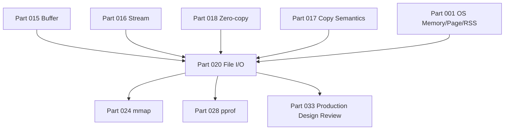
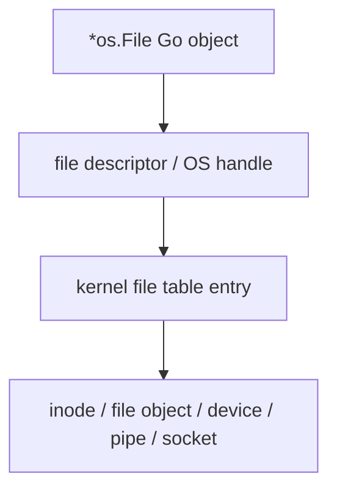
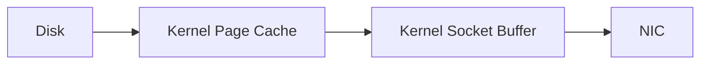
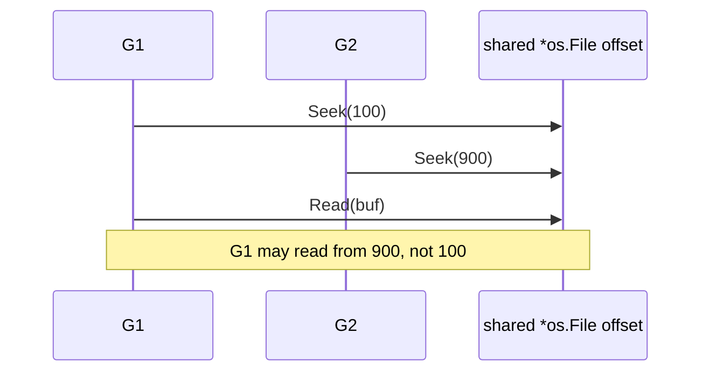
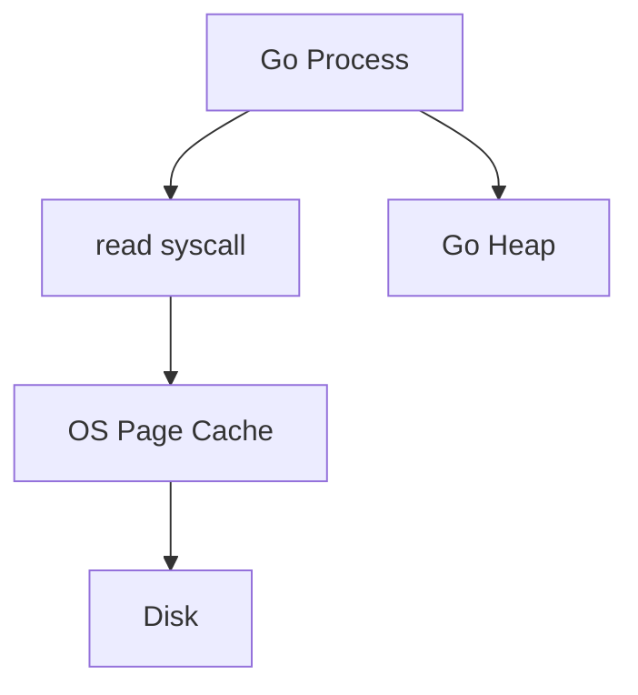
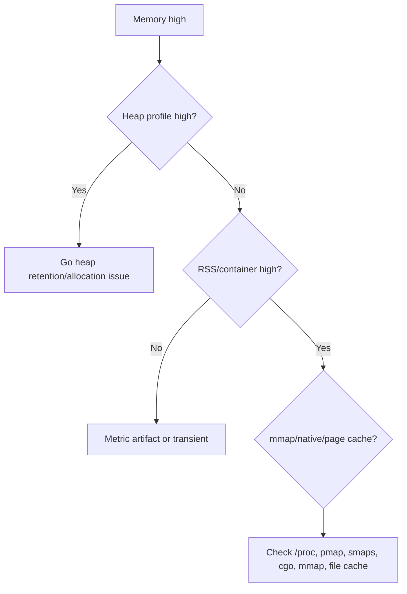
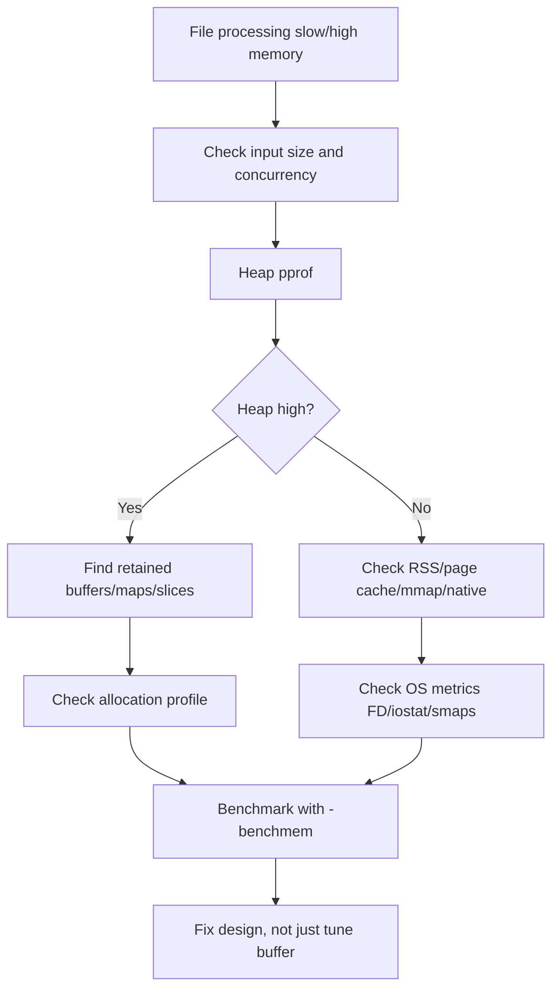

# learn-go-memory-systems-part-020: File I/O Buffers — os.File, bufio, io.Copy, sendfile, mmap Trade-offs

> Series: `learn-go-memory-systems`  
> Part: `020 / 034`  
> Target: Go `1.26.x`  
> Audience: Java engineer yang ingin memahami Go memory, I/O, buffer, stream, zero-copy, dan produksi sistem berperforma tinggi.

---

## Ringkasan Eksekutif

File I/O di Go bukan hanya soal memanggil `os.ReadFile`, `os.File.Read`, atau `io.Copy`.
Di sistem produksi, file I/O adalah titik temu antara:

1. **Go object**: `*os.File`, `[]byte`, `bufio.Reader`, `bytes.Buffer`.
2. **OS resource**: file descriptor, inode/handle, kernel file table.
3. **Kernel memory**: page cache, dirty pages, readahead, writeback.
4. **Runtime behavior**: blocking syscall, scheduler, allocation, GC scanning.
5. **Data-path contract**: apakah data di-stream, di-copy, di-map, di-cache, atau ditahan.
6. **Failure mode**: FD leak, OOM karena `ReadFile`, page cache disalahartikan sebagai leak, mmap crash, partial write, corrupted output, dan cleanup yang tidak deterministik.

Tujuan part ini: membangun mental model file I/O sebagai **bounded-memory pipeline**, bukan sebagai operasi “load file lalu process”.

---

## Posisi Part Ini Dalam Series

Kita sudah membahas:

- value representation,
- pointer,
- stack/heap,
- escape analysis,
- allocator,
- struct/slice/string/interface representation,
- byte/bit programming,
- buffer,
- stream,
- copy semantics,
- zero-copy,
- network buffer.

Part ini menggunakan semua itu untuk membahas file I/O.



---

## Learning Outcomes

Setelah menyelesaikan part ini, kamu harus bisa:

1. Menjelaskan beda `*os.File` sebagai Go object vs file descriptor OS.
2. Mendesain file processing dengan bounded memory.
3. Memilih antara `os.ReadFile`, `bufio.Reader`, manual chunk loop, `io.Copy`, `io.CopyBuffer`, `ReadAt`, dan mmap.
4. Memahami page cache dan mengapa RSS/process memory bisa terlihat naik.
5. Menjelaskan kapan `io.Copy` bisa lebih optimal daripada loop manual.
6. Memahami trade-off `sendfile`/kernel-assisted copy.
7. Menghindari FD leak, goroutine leak, buffer retention, partial write corruption.
8. Mendesain large-file pipeline production-grade.
9. Menganalisis file I/O incident dari gejala memory, latency, throughput, dan FD usage.
10. Membuat review checklist untuk PR yang memproses file besar.

---

## Sumber Resmi dan Anchor Fakta

Materi ini mengikuti prinsip dokumentasi resmi Go:

- Package `os` menyediakan interface platform-independent ke fungsionalitas operating system; `os.File` merepresentasikan open file descriptor/handle.
- Package `io` mendefinisikan abstraksi dasar `Reader`, `Writer`, `ReaderAt`, `WriterAt`, `Seeker`, `Closer`, `Copy`, dan `CopyBuffer`.
- `io.Copy` dapat memakai fast path `WriterTo` atau `ReaderFrom` sebelum fallback ke generic buffered loop.
- Package `bufio` menyediakan buffered I/O untuk mengurangi syscall kecil berulang.
- Go 1.26 tetap mempertahankan kompatibilitas Go 1, dengan perubahan implementasi runtime/toolchain/library sebagai bagian utama release.

> Catatan desain: walaupun sebagian optimalisasi file-to-network dapat menggunakan fast path platform-specific di standard library, API publik yang benar tetap `io.Copy`/`io.CopyBuffer`/interface standard, bukan hardcode syscall platform tertentu kecuali memang membangun library OS-specific.

---

# 1. Mental Model File I/O

## 1.1 File I/O Bukan Memory I/O Biasa

Saat Go program membaca file:

```go
f, err := os.Open("data.bin")
if err != nil {
    return err
}
defer f.Close()

buf := make([]byte, 32*1024)
for {
    n, err := f.Read(buf)
    // process buf[:n]
}
```

yang terjadi bukan:

```text
file langsung masuk ke variable Go
```

Melainkan pipeline berlapis:

```mermaid
flowchart LR
    Disk[Disk / SSD / Network FS] --> Kernel[Kernel Block Layer]
    Kernel --> PageCache[OS Page Cache]
    PageCache --> Syscall[read syscall]
    Syscall --> GoBuf[Go []byte Buffer]
    GoBuf --> Parser[Application Parser]
```

Ada banyak boundary:

| Boundary | Risiko |
|---|---|
| Disk → kernel | latency, readahead, random I/O |
| Kernel → page cache | memory pressure, cache eviction |
| Page cache → Go buffer | copy, syscall overhead |
| Go buffer → parser | allocation, retention, aliasing |
| Parser → output | partial write, buffering, backpressure |

File I/O yang benar bukan cuma “cepat”, tetapi:

- bounded memory,
- closeable,
- cancellable,
- observable,
- robust terhadap file besar,
- aman dari partial write corruption,
- jelas ownership buffer-nya.

## 1.2 Go Object vs OS Resource

`*os.File` adalah Go object yang membungkus resource OS.



Implikasi penting:

1. GC bisa melihat `*os.File` sebagai Go object.
2. Tetapi file descriptor adalah resource OS.
3. GC tidak memberi jaminan deterministic close.
4. Mengandalkan GC/finalizer untuk file cleanup adalah desain buruk.
5. Harus ada explicit `Close`.

Pola benar:

```go
f, err := os.Open(path)
if err != nil {
    return err
}
defer func() {
    if cerr := f.Close(); cerr != nil && err == nil {
        err = cerr
    }
}()
```

Untuk fungsi yang return named `err`, close error bisa dipropagasi. Untuk read-only file, close error sering tidak kritis, tetapi untuk writer, close error bisa sangat penting karena data mungkin baru flush saat close.

---

## 1.3 File Descriptor Leak

FD leak bukan heap leak, tetapi efeknya sama fatalnya.

Gejala:

- `too many open files`,
- request gagal acak,
- file watcher gagal,
- network connection gagal,
- service restart memperbaiki sementara,
- heap profile tampak normal.

Contoh bug:

```go
func countLines(paths []string) error {
    for _, path := range paths {
        f, err := os.Open(path)
        if err != nil {
            return err
        }
        defer f.Close() // BUG: defer di loop panjang menahan semua FD sampai fungsi return

        // process file...
    }
    return nil
}
```

Perbaikan:

```go
func countLines(paths []string) error {
    for _, path := range paths {
        if err := countLinesOne(path); err != nil {
            return err
        }
    }
    return nil
}

func countLinesOne(path string) error {
    f, err := os.Open(path)
    if err != nil {
        return err
    }
    defer f.Close()

    // process file...
    return nil
}
```

Atau close eksplisit per iterasi.

---

# 2. File Reading Strategy

## 2.1 Jangan Mulai Dari `os.ReadFile`

`os.ReadFile` berguna untuk file kecil/config/test fixture.

```go
data, err := os.ReadFile("config.json")
```

Tetapi untuk input tidak terbatas:

```go
data, err := os.ReadFile(uploadPath) // DANGEROUS for large/unknown file
```

Risiko:

- allocation sebesar file,
- file 2 GB → allocation 2 GB,
- GC pressure,
- OOMKill container,
- latency spike,
- retention jika `data` masuk cache/log/error.

Rule of thumb:

| File type | Strategy |
|---|---|
| config kecil | `os.ReadFile` acceptable |
| test fixture kecil | `os.ReadFile` acceptable |
| file user upload | stream/chunk |
| log besar | scanner dengan buffer limit explicit atau reader chunk |
| binary frame besar | bounded reader |
| CSV/JSON besar | streaming decoder |
| media besar | `io.Copy`/file streaming |
| random access index | `ReadAt` |
| huge immutable dataset | mmap bisa dipertimbangkan |

---

## 2.2 Manual Chunk Loop

Pola dasar:

```go
func ProcessFile(path string, process func([]byte) error) error {
    f, err := os.Open(path)
    if err != nil {
        return err
    }
    defer f.Close()

    buf := make([]byte, 64*1024)

    for {
        n, readErr := f.Read(buf)
        if n > 0 {
            if err := process(buf[:n]); err != nil {
                return err
            }
        }
        if readErr == io.EOF {
            return nil
        }
        if readErr != nil {
            return readErr
        }
    }
}
```

Invariant penting:

1. `buf[:n]` hanya valid sampai iterasi berikutnya jika `process` menyimpan reference.
2. Jika `process` butuh menyimpan data, ia harus copy.
3. Jangan mengasumsikan `Read` mengisi seluruh buffer.
4. Handle `n > 0` sebelum `err`, karena beberapa Reader boleh mengembalikan data dan error sekaligus.

Salah:

```go
n, err := f.Read(buf)
if err != nil {
    return err
}
process(buf[:n])
```

Masalah: jika `n > 0` dan `err == io.EOF`, data terakhir hilang.

---

## 2.3 Borrowed Buffer Contract

Dalam file I/O, kontrak buffer harus eksplisit:

```go
// process receives a borrowed buffer.
// It must not retain buf after returning.
func process(buf []byte) error
```

Diagram:

```mermaid
sequenceDiagram
    participant Loop as Read Loop
    participant Buf as Reusable []byte
    participant Proc as process(buf)
    Loop->>Buf: fill by f.Read
    Loop->>Proc: pass buf[:n]
    Note over Proc: may inspect during call only
    Proc-->>Loop: return
    Loop->>Buf: reused next read
```

Jika perlu retain:

```go
func copyChunk(chunk []byte) []byte {
    owned := make([]byte, len(chunk))
    copy(owned, chunk)
    return owned
}
```

---

# 3. `bufio`: Kapan Dipakai

## 3.1 `bufio.Reader`

`bufio.Reader` membantu ketika pattern aplikasi melakukan banyak read kecil.

Contoh buruk:

```go
one := make([]byte, 1)
for {
    _, err := f.Read(one)
    // ...
}
```

Ini berpotensi syscall per byte.

Lebih baik:

```go
r := bufio.NewReaderSize(f, 64*1024)
b, err := r.ReadByte()
```

`bufio.Reader` membaca chunk besar dari file ke internal buffer, lalu memenuhi request kecil dari memory.


Trade-off:

| Benefit | Cost |
|---|---|
| fewer syscall | internal buffer memory |
| convenient token/line parsing | possible retention if slice reused wrongly |
| peeking | data remains in buffer |
| small reads become efficient | more abstraction |

---

## 3.2 `ReadSlice` vs `ReadString` vs `Scanner`

`bufio.Reader` menyediakan beberapa cara line/token parsing.

### `ReadSlice`

```go
line, err := r.ReadSlice('\n')
```

- returns slice pointing to internal buffer,
- no copy for line,
- invalid after next read,
- can fail with `ErrBufferFull`.

Cocok untuk hot path yang paham borrowed buffer.

### `ReadString`

```go
line, err := r.ReadString('\n')
```

- returns string,
- may allocate/copy,
- convenient.

Cocok untuk control plane, config, low-volume.

### `Scanner`

```go
scanner := bufio.NewScanner(f)
for scanner.Scan() {
    line := scanner.Text()
}
```

- convenient,
- default max token limit,
- `Text()` returns string,
- `Bytes()` returns byte slice,
- perlu `Scanner.Buffer` untuk token besar.

Scanner bagus untuk line kecil, bukan parser arbitrary binary besar.

---

## 3.3 `bufio.Writer`

Untuk banyak write kecil:

```go
w := bufio.NewWriterSize(f, 64*1024)
defer w.Flush()

for _, rec := range records {
    fmt.Fprintf(w, "%s,%d\n", rec.Name, rec.Value)
}
```

Tapi `defer w.Flush()` sendiri tidak cukup jika error perlu dipropagasi.

Lebih benar:

```go
func WriteRecords(path string, records []Record) (err error) {
    f, err := os.Create(path)
    if err != nil {
        return err
    }
    defer func() {
        if cerr := f.Close(); err == nil && cerr != nil {
            err = cerr
        }
    }()

    w := bufio.NewWriterSize(f, 64*1024)

    for _, rec := range records {
        if _, err := fmt.Fprintf(w, "%s,%d\n", rec.Name, rec.Value); err != nil {
            return err
        }
    }

    if err := w.Flush(); err != nil {
        return err
    }

    return nil
}
```

`Flush` error matters. `Close` error matters.

# 4. `io.Copy` and `io.CopyBuffer`

## 4.1 `io.Copy` Sebagai Primitive Pipeline

```go
written, err := io.Copy(dst, src)
```

Mental model:


Keunggulan:

- simple,
- battle-tested,
- bisa menggunakan fast path `WriterTo`/`ReaderFrom`,
- tidak perlu membuat buffer manual untuk banyak kasus,
- cocok untuk file-to-file, file-to-network, network-to-file, stream proxy.

Contoh:

```go
func CopyFile(dstPath, srcPath string) (err error) {
    src, err := os.Open(srcPath)
    if err != nil {
        return err
    }
    defer src.Close()

    dst, err := os.Create(dstPath)
    if err != nil {
        return err
    }
    defer func() {
        if cerr := dst.Close(); err == nil && cerr != nil {
            err = cerr
        }
    }()

    if _, err := io.Copy(dst, src); err != nil {
        return err
    }
    return nil
}
```

---

## 4.2 `io.CopyBuffer`

Gunakan `io.CopyBuffer` kalau kamu ingin kontrol buffer:

```go
buf := make([]byte, 128*1024)
_, err := io.CopyBuffer(dst, src, buf)
```

Cocok ketika:

- kamu punya pool buffer,
- ingin ukuran buffer tertentu,
- ingin mengurangi allocation per request,
- ingin standardize memory budget.

Tapi jangan pakai buffer yang sama secara concurrent:

```go
// BUG: shared buffer used concurrently.
var shared = make([]byte, 64*1024)

go io.CopyBuffer(a, b, shared)
go io.CopyBuffer(c, d, shared)
```

Benar:

```go
buf1 := make([]byte, 64*1024)
buf2 := make([]byte, 64*1024)

go io.CopyBuffer(a, b, buf1)
go io.CopyBuffer(c, d, buf2)
```

Atau pakai pool dengan ownership jelas.

---

## 4.3 `io.Copy` Fast Path

`io.Copy` secara konseptual melakukan:

1. jika source implement `WriterTo`, panggil `src.WriteTo(dst)`;
2. jika destination implement `ReaderFrom`, panggil `dst.ReadFrom(src)`;
3. fallback ke loop buffer generic.

Pseudo:

```go
if wt, ok := src.(io.WriterTo); ok {
    return wt.WriteTo(dst)
}
if rf, ok := dst.(io.ReaderFrom); ok {
    return rf.ReadFrom(src)
}
return copyBuffer(dst, src, make([]byte, 32*1024))
```

Kenapa penting?

Karena implementation khusus bisa melakukan transfer lebih efisien dari generic buffer loop.

Contoh:
- file source ke TCP connection pada OS tertentu bisa memakai fast path internal,
- file-to-file bisa punya optimization platform-specific,
- custom reader/writer bisa mengimplementasikan `WriteTo`/`ReadFrom`.

Rule:

> Untuk data transfer generic, prefer `io.Copy` dulu. Jangan menulis loop manual kecuali kamu butuh parsing/transformasi/control khusus.

---

# 5. sendfile dan Kernel-Assisted Copy

## 5.1 Problem: Copy Berlapis

File to network dengan loop manual:

```mermaid
flowchart LR
    Disk --> PageCache[Kernel Page Cache]
    PageCache --> GoBuf[Go []byte]
    GoBuf --> SocketBuf[Kernel Socket Buffer]
    SocketBuf --> NIC[NIC]
```

Ada copy dari kernel ke user-space dan user-space ke kernel.

Kernel-assisted transfer seperti `sendfile` dapat mengurangi copy user-space:



Namun ada caveat:

- tidak selalu berlaku,
- tergantung OS,
- tergantung source/destination,
- TLS sering memaksa data lewat user-space untuk encryption,
- compression/transformation memaksa user-space,
- tidak semua filesystem/socket path sama.

---

## 5.2 Jangan Hardcode `sendfile` Terlalu Dini

Di Go, biasanya cukup:

```go
io.Copy(w, file)
```

Jika `w`/`file` mendukung fast path, standard library dapat memanfaatkannya.

Hardcode syscall langsung membuat:

- kode platform-specific,
- portability rendah,
- error handling lebih sulit,
- interaction dengan timeout/cancellation lebih rumit,
- TLS/compression tetap tidak otomatis optimal.

Gunakan syscall langsung hanya jika:

1. membangun library/platform infra khusus,
2. sudah profiling membuktikan bottleneck,
3. deployment OS jelas,
4. behavior fallback jelas,
5. test matrix lintas platform tersedia.

---

# 6. Sequential Read, Random Read, ReadAt

## 6.1 Sequential Read

Sequential read cocok untuk:

- log processing,
- CSV import,
- object storage download,
- file transform,
- checksum,
- upload stream,
- compression/decompression.

Pattern:

```go
buf := make([]byte, 256*1024)
for {
    n, err := f.Read(buf)
    if n > 0 {
        // process in order
    }
    if err == io.EOF {
        break
    }
    if err != nil {
        return err
    }
}
```

Keuntungan:

- page cache readahead efektif,
- memory bounded,
- simple,
- cocok untuk streaming transformation.

---

## 6.2 Random Read with `ReadAt`

`ReadAt` membaca offset tertentu tanpa mengubah file offset shared.

```go
buf := make([]byte, 4096)
n, err := f.ReadAt(buf, off)
```

Cocok untuk:

- index file,
- SSTable block read,
- database page read,
- archive reader,
- random access format.

Keuntungan:

- safer for concurrent random read,
- tidak tergantung shared seek offset,
- bisa parallel read berbagai offset.

Contoh:

```go
func ReadBlock(f *os.File, off int64, size int) ([]byte, error) {
    buf := make([]byte, size)
    n, err := f.ReadAt(buf, off)
    if err != nil && err != io.EOF {
        return nil, err
    }
    return buf[:n], nil
}
```

Untuk exact block:

```go
func ReadExactBlock(f *os.File, off int64, size int) ([]byte, error) {
    buf := make([]byte, size)
    if _, err := f.ReadAt(buf, off); err != nil {
        return nil, err
    }
    return buf, nil
}
```

`ReadAt` dapat mengembalikan `io.EOF` jika short read.

---

## 6.3 `Seek` Hazard

`Seek` mengubah offset file object.

```go
f.Seek(off, io.SeekStart)
f.Read(buf)
```

Dalam concurrent code, ini berbahaya jika file yang sama dipakai beberapa goroutine.



Untuk random concurrent read, prefer `ReadAt`.

---

# 7. File Writing Strategy

## 7.1 Partial Write

`Write` dapat menulis lebih sedikit dari panjang buffer dan mengembalikan `n < len(p)`.

Interface `io.Writer` contract harus dihormati.

Utility:

```go
func WriteFull(w io.Writer, p []byte) error {
    for len(p) > 0 {
        n, err := w.Write(p)
        if n > 0 {
            p = p[n:]
        }
        if err != nil {
            return err
        }
        if n == 0 {
            return io.ErrShortWrite
        }
    }
    return nil
}
```

Untuk `*os.File`, short write jarang pada regular file, tetapi jangan membangun invariant library dengan asumsi itu.

---

## 7.2 Atomic-ish File Replacement

Untuk menulis file penting:

1. tulis ke temp file,
2. flush/sync jika perlu durability,
3. close,
4. rename temp ke target.

```go
func WriteFileAtomic(path string, data []byte) (err error) {
    dir := filepath.Dir(path)
    tmp, err := os.CreateTemp(dir, ".tmp-*")
    if err != nil {
        return err
    }

    tmpName := tmp.Name()
    defer func() {
        if err != nil {
            _ = os.Remove(tmpName)
        }
    }()

    if _, err := tmp.Write(data); err != nil {
        _ = tmp.Close()
        return err
    }

    if err := tmp.Sync(); err != nil {
        _ = tmp.Close()
        return err
    }

    if err := tmp.Close(); err != nil {
        return err
    }

    if err := os.Rename(tmpName, path); err != nil {
        return err
    }

    return nil
}
```

Catatan:

- rename atomic bergantung filesystem/OS dan same directory/device.
- durability penuh bisa butuh fsync directory di beberapa sistem.
- Windows semantics berbeda untuk replace existing file.
- Untuk production library, OS-specific nuance harus diuji.

---

## 7.3 Buffered Writer and Durability

`bufio.Writer.Flush()` hanya memindahkan data dari user-space buffer ke underlying writer.

```text
bufio buffer -> os.File -> kernel page cache -> disk later
```

`file.Sync()` meminta OS flush ke storage.

Urutan:

```go
if err := w.Flush(); err != nil {
    return err
}
if err := f.Sync(); err != nil {
    return err
}
if err := f.Close(); err != nil {
    return err
}
```

Jika durability tidak wajib, `Sync` bisa mahal dan tidak perlu.
Jika durability wajib, tanpa `Sync` kamu hanya punya “written to kernel”, bukan “safe after crash”.

---

# 8. Page Cache

## 8.1 Page Cache Bukan Go Heap

Ketika file dibaca, OS dapat menyimpan page file di page cache.



Page cache ada di memory OS, bukan heap Go.

Konsekuensi:

- `heap profile` tidak menunjukkan page cache.
- RSS bisa membingungkan tergantung accounting OS/mmap.
- container memory bisa terpengaruh oleh page cache.
- file processing besar bisa menekan memory tanpa “heap leak”.

---

## 8.2 Page Cache Misdiagnosis

Gejala:

- setelah membaca file besar, memory node/container naik,
- heap profile normal,
- GC tidak menurunkan memory,
- restart service “memperbaiki” sementara,
- sebenarnya page cache atau mmap resident pages.

Diagnosis:

1. cek heap profile `inuse_space`,
2. cek runtime metrics `/memory/classes/*`,
3. cek RSS/container memory,
4. cek OS page cache,
5. cek mmap/native memory,
6. cek FD dan mapped file count.

Diagram:



---

# 9. mmap Trade-offs

## 9.1 Apa Itu mmap Secara Mental Model

mmap memetakan file ke virtual address space process.

```mermaid
flowchart LR
    File[File on disk] --> PageCache[OS Page Cache]
    PageCache --> Mapping[Virtual Memory Mapping]
    Mapping --> GoView[[]byte-like view]
```

Membaca memory mapping memicu page fault saat page belum resident.

Keuntungan:

- tidak perlu explicit read loop,
- random access bisa natural,
- OS page cache bekerja langsung,
- bisa bagus untuk immutable large file/index.

Risiko:

- page fault latency,
- SIGBUS jika file truncated,
- cleanup/mapping lifecycle sulit,
- memory tidak terlihat seperti Go heap biasa,
- portability berbeda,
- pointer/view lifetime harus sangat disiplin,
- write consistency jauh lebih sulit.

---

## 9.2 Kapan mmap Masuk Akal

mmap cocok ketika:

- file besar,
- mostly read-only,
- random access,
- format stabil,
- lifetime mapping jelas,
- crash consistency dipikirkan,
- observability native memory tersedia.

Contoh domain:

- search index,
- SSTable/block index,
- read-only dictionary,
- embedded data file,
- memory-mapped immutable segment.

mmap biasanya tidak cocok untuk:

- upload processing sederhana,
- streaming transform,
- small file,
- file frequently truncated,
- cross-platform product tanpa abstraction,
- mutable transactional data tanpa WAL/checksum protocol.

---

## 9.3 mmap Bukan Zero-Copy Ajaib

mmap menghindari explicit copy dari kernel ke user buffer, tetapi:

- page tetap harus dibaca dari disk ke memory,
- page fault bisa mahal,
- TLB/cache effects nyata,
- random access buruk bisa menghancurkan locality,
- mapped pages bisa menekan memory,
- data lifetime menjadi terikat mapping.

Rule:

> mmap mengubah bentuk biaya. Ia tidak menghapus biaya.

---

# 10. Buffer Size Selection

## 10.1 Tidak Ada Magic Universal Size

Ukuran buffer dipengaruhi oleh:

- syscall overhead,
- cache locality,
- storage throughput,
- network throughput,
- compression algorithm,
- parser behavior,
- concurrency count,
- memory budget.

Contoh:

| Buffer | Karakter |
|---:|---|
| 4 KiB | page-sized, small memory, more syscalls |
| 32 KiB | common default-ish streaming size |
| 64 KiB | good practical starting point |
| 128 KiB | fewer syscalls, more memory per concurrent stream |
| 1 MiB | can help throughput but increases memory footprint |
| huge | often retention/latency/cache problem |

Jika ada 1000 concurrent streams:

```text
64 KiB * 1000 = 64 MiB
1 MiB * 1000 = 1 GiB
```

Memory budget harus dihitung berdasarkan concurrency.

---

## 10.2 Buffer Size Formula

```text
per_stream_memory = read_buffer + write_buffer + parser_scratch + decompressor_state + application_state

total_memory = per_stream_memory * max_concurrent_streams
```

Contoh:

```text
read buffer        = 64 KiB
write buffer       = 64 KiB
parser scratch     = 32 KiB
gzip state approx  = variable
concurrency        = 500

baseline buffer = 160 KiB * 500 = 80 MiB
```

Belum termasuk heap object lain, goroutine stack, maps, queues, response buffers, TLS state.

---

# 11. Large File Processing Pattern

## 11.1 Bounded Streaming Transform

```go
func TransformFile(dstPath, srcPath string, transform func([]byte) ([]byte, error)) (err error) {
    src, err := os.Open(srcPath)
    if err != nil {
        return err
    }
    defer src.Close()

    dst, err := os.Create(dstPath)
    if err != nil {
        return err
    }
    defer func() {
        if cerr := dst.Close(); err == nil && cerr != nil {
            err = cerr
        }
    }()

    r := bufio.NewReaderSize(src, 64*1024)
    w := bufio.NewWriterSize(dst, 64*1024)

    buf := make([]byte, 64*1024)

    for {
        n, readErr := r.Read(buf)
        if n > 0 {
            out, err := transform(buf[:n])
            if err != nil {
                return err
            }
            if _, err := w.Write(out); err != nil {
                return err
            }
        }

        if readErr == io.EOF {
            break
        }
        if readErr != nil {
            return readErr
        }
    }

    if err := w.Flush(); err != nil {
        return err
    }

    return nil
}
```

Catatan:

- transform di atas boleh allocate jika output size berubah.
- Untuk high-performance, transform dapat menerima output buffer.

---

## 11.2 Append-Style Transform

Lebih allocation-aware:

```go
type Transformer interface {
    Transform(dst []byte, src []byte) ([]byte, error)
}

func TransformStream(dst io.Writer, src io.Reader, t Transformer) error {
    in := make([]byte, 64*1024)
    out := make([]byte, 0, 64*1024)

    for {
        n, readErr := src.Read(in)
        if n > 0 {
            out = out[:0]
            var err error
            out, err = t.Transform(out, in[:n])
            if err != nil {
                return err
            }
            if _, err := dst.Write(out); err != nil {
                return err
            }
        }

        if readErr == io.EOF {
            return nil
        }
        if readErr != nil {
            return readErr
        }
    }
}
```

Invariant:

- `Transform` tidak retain `src`.
- `Transform` append ke `dst`.
- caller owns buffer lifecycle.
- output valid sampai `out` reused.

---

## 11.3 Streaming Hash

```go
func SHA256File(path string) ([32]byte, error) {
    var zero [32]byte

    f, err := os.Open(path)
    if err != nil {
        return zero, err
    }
    defer f.Close()

    h := sha256.New()
    if _, err := io.Copy(h, f); err != nil {
        return zero, err
    }

    var sum [32]byte
    copy(sum[:], h.Sum(nil))
    return sum, nil
}
```

Ini bounded memory. Tidak perlu load file penuh.

---

# 12. File Upload/Download Server Pattern

## 12.1 Upload to File

```go
func Upload(w http.ResponseWriter, r *http.Request) {
    const maxBody = 1 << 30 // 1 GiB
    r.Body = http.MaxBytesReader(w, r.Body, maxBody)
    defer r.Body.Close()

    dst, err := os.CreateTemp("/data/uploads", "upload-*")
    if err != nil {
        http.Error(w, "create failed", http.StatusInternalServerError)
        return
    }
    defer dst.Close()

    buf := make([]byte, 128*1024)
    if _, err := io.CopyBuffer(dst, r.Body, buf); err != nil {
        http.Error(w, "copy failed", http.StatusBadRequest)
        return
    }

    if err := dst.Sync(); err != nil {
        http.Error(w, "sync failed", http.StatusInternalServerError)
        return
    }

    w.WriteHeader(http.StatusCreated)
}
```

Memory bounded oleh buffer, bukan body size.

---

## 12.2 Download File

```go
func Download(w http.ResponseWriter, r *http.Request) {
    f, err := os.Open("/data/file.bin")
    if err != nil {
        http.NotFound(w, r)
        return
    }
    defer f.Close()

    w.Header().Set("Content-Type", "application/octet-stream")

    if _, err := io.Copy(w, f); err != nil {
        // client may have disconnected
        return
    }
}
```

Untuk static files, `http.ServeFile` bisa lebih tepat karena menangani metadata/range/cache headers.

---

# 13. CSV/JSON File Processing

## 13.1 CSV Streaming

```go
func ProcessCSV(path string) error {
    f, err := os.Open(path)
    if err != nil {
        return err
    }
    defer f.Close()

    r := csv.NewReader(bufio.NewReaderSize(f, 128*1024))

    for {
        rec, err := r.Read()
        if err == io.EOF {
            return nil
        }
        if err != nil {
            return err
        }

        if err := processRecord(rec); err != nil {
            return err
        }
    }
}
```

Caveat:

- `encoding/csv` returns strings, so conversion/allocation terjadi.
- Untuk extreme hot path binary/text parsing, custom parser bisa lebih efisien.
- Tetapi correctness CSV sulit; jangan reimplement kecuali perlu.

---

## 13.2 JSON Streaming

Untuk array besar:

```go
func ProcessJSONArray(path string) error {
    f, err := os.Open(path)
    if err != nil {
        return err
    }
    defer f.Close()

    dec := json.NewDecoder(bufio.NewReaderSize(f, 128*1024))

    tok, err := dec.Token()
    if err != nil {
        return err
    }
    if delim, ok := tok.(json.Delim); !ok || delim != '[' {
        return fmt.Errorf("expected array")
    }

    for dec.More() {
        var item Item
        if err := dec.Decode(&item); err != nil {
            return err
        }
        if err := processItem(item); err != nil {
            return err
        }
    }

    _, err = dec.Token()
    return err
}
```

Avoid:

```go
data, _ := os.ReadFile(path)
json.Unmarshal(data, &items)
```

untuk file besar karena semua data dan semua object materialized sekaligus.

---

# 14. File I/O and Concurrency

## 14.1 Parallelism Tidak Selalu Mempercepat Disk

Untuk disk/network FS:

- sequential read satu stream bisa sangat cepat,
- banyak random read bisa merusak locality,
- SSD lebih toleran random I/O,
- network filesystem punya latency/throughput limit,
- object storage berbeda lagi.

Concurrency harus bounded.

```go
sem := make(chan struct{}, maxConcurrentFiles)

for _, path := range paths {
    path := path
    sem <- struct{}{}
    go func() {
        defer func() { <-sem }()
        _ = processFile(path)
    }()
}
```

Lebih baik pakai worker pool dengan error propagation.

---

## 14.2 Per-Worker Buffer

Pola:

```go
type Job struct {
    Path string
}

func worker(jobs <-chan Job) error {
    buf := make([]byte, 128*1024) // per worker, not per file chunk

    for job := range jobs {
        if err := processOne(job.Path, buf); err != nil {
            return err
        }
    }
    return nil
}
```

Tapi hati-hati: jika `processOne` menyimpan buffer, bug.

---

## 14.3 Avoid Unbounded File Queue

Salah:

```go
files := make(chan []byte, 100000)
```

Jika setiap item menyimpan data file, ini memory bomb.

Benar:

```go
paths := make(chan string, 1000)
```

Queue path/metadata kecil, bukan content besar.

---

# 15. Interaction With GC

## 15.1 Pointer-Free Buffers

`[]byte` backing array tidak mengandung pointer.
GC tidak perlu scan setiap byte sebagai pointer.

Tetapi slice header yang menunjuk backing array tetap root jika reachable.

Artinya:

```go
var global [][]byte
global = append(global, hugeBuffer[:10])
```

Walaupun hanya 10 byte dipakai, huge backing array tetap retained.

Perbaiki:

```go
small := bytes.Clone(hugeBuffer[:10])
global = append(global, small)
```

---

## 15.2 Buffer Retention Through Error/Log

Salah:

```go
return fmt.Errorf("failed parsing chunk: %q", buf)
```

Ini bisa:

- convert huge buffer to string,
- allocate besar,
- log secret,
- retain data di error chain/log pipeline.

Lebih baik:

```go
return fmt.Errorf("failed parsing chunk at offset %d: %w", offset, err)
```

Jika perlu sample:

```go
sample := buf
if len(sample) > 64 {
    sample = sample[:64]
}
return fmt.Errorf("failed parsing at offset %d sample=%x: %w", offset, sample, err)
```

---

# 16. Error Handling in File I/O

## 16.1 Preserve Path Context

```go
f, err := os.Open(path)
if err != nil {
    return fmt.Errorf("open %s: %w", path, err)
}
```

Go `os` errors sering sudah membawa path via `*PathError`, tetapi wrapping tetap membantu context domain.

---

## 16.2 Close Error Handling

Read file:

```go
defer f.Close()
```

sering cukup.

Write file:

```go
defer func() {
    if cerr := f.Close(); err == nil && cerr != nil {
        err = cerr
    }
}()
```

Flush + Close:

```go
if err := w.Flush(); err != nil {
    return err
}
if err := f.Close(); err != nil {
    return err
}
```

Jangan ignore close untuk writer penting.

---

## 16.3 Cleanup on Failure

```go
func WriteTemp(path string, data []byte) (err error) {
    tmp := path + ".tmp"

    f, err := os.Create(tmp)
    if err != nil {
        return err
    }

    defer func() {
        if err != nil {
            _ = os.Remove(tmp)
        }
    }()

    if _, err = f.Write(data); err != nil {
        _ = f.Close()
        return err
    }

    if err = f.Close(); err != nil {
        return err
    }

    return os.Rename(tmp, path)
}
```

Cleanup harus idempotent dan safe.

# 17. Observability

## 17.1 Metrics Yang Relevan

Untuk file I/O, monitor:

| Metric | Makna |
|---|---|
| open file descriptors | FD leak |
| file read bytes/sec | throughput |
| file write bytes/sec | output pressure |
| read latency | storage pressure |
| write latency | disk/network FS slow |
| queue depth | backpressure |
| heap in-use | Go retention |
| alloc rate | buffer/object churn |
| RSS/container memory | page cache/native/mmap/heap total |
| goroutine count | stuck stream/leak |
| error by type | partial write, permission, ENOSPC |

---

## 17.2 Profiling Flow



---

## 17.3 pprof Patterns

Heap in-use high:

- retained buffers,
- slice leak,
- `os.ReadFile`,
- `bytes.Buffer` not reset/released,
- unbounded queue,
- decompressed content materialized,
- map cache of file chunks.

Alloc space high but in-use low:

- repeated small allocations,
- scanner `Text()` string allocation,
- fmt-heavy loop,
- transform creates new output per chunk,
- per-iteration buffer allocation.

Goroutine profile high:

- blocked on `io.Pipe`,
- blocked writing to slow disk/network,
- upload/download client disconnected but producer alive,
- workers waiting forever due channel not closed.

---

# 18. Security and Robustness

## 18.1 Path Traversal

File I/O often touches user input.

Bad:

```go
path := "/data/" + r.URL.Query().Get("name")
```

Risk:

```text
../../etc/passwd
```

Use:

- allowlist,
- clean path,
- base directory check,
- generated server-side IDs,
- avoid raw user path as filesystem path.

---

## 18.2 Symlink Race

If security boundary matters:

- checking path then opening is race-prone,
- symlink can change between check and open,
- OS-specific secure open may be needed.

For simple app internal processing, basic validation may be enough.
For security-sensitive file service, design OS-specific safe file open.

---

## 18.3 Size Limit

Never trust file/input size blindly.

- limit upload body,
- check compressed size and decompressed size,
- limit records,
- limit line/token length,
- limit nested JSON,
- limit archive entries,
- limit total extracted bytes.

Decompression bomb is file I/O + memory DoS.

---

# 19. Java Engineer Comparison

## 19.1 Java NIO vs Go I/O

| Java | Go |
|---|---|
| `InputStream` | `io.Reader` |
| `OutputStream` | `io.Writer` |
| `FileChannel` | `*os.File` with `ReadAt`, `WriteAt`, `Seek` |
| `ByteBuffer` | `[]byte` plus ownership contract |
| DirectByteBuffer | mmap/cgo/syscall memory patterns |
| try-with-resources | `defer Close`, explicit error handling |
| GC-managed heap + off-heap direct | Go heap + OS/native/mmap not fully visible to GC |
| `transferTo` | `io.Copy` fast path model |
| `MappedByteBuffer` | mmap via non-stdlib or syscall/x/sys |

Important difference:

Java has explicit `ByteBuffer` position/limit/capacity abstraction.
Go usually uses `[]byte` plus convention:

```go
buf[:n]      // valid data
buf[n:cap]   // spare capacity
buf[:0]      // reset for append
```

This is simpler but more dependent on discipline.

---

## 19.2 Java Habit to Avoid in Go

Java engineer often writes:

```go
data, err := os.ReadFile(path)
if err != nil { ... }
process(data)
```

because in Java small utilities often do:

```java
Files.readAllBytes(path)
```

In Go production services, default should be streaming unless file is known small.

Another habit:

```go
var out bytes.Buffer
io.Copy(&out, f)
```

This loads entire file into heap-backed buffer.
It is not streaming if destination is memory.

---

# 20. API Design Patterns

## 20.1 Accept `io.Reader`, Not File Path

Bad reusable library API:

```go
func ParseFile(path string) (*Result, error)
```

Better core API:

```go
func Parse(r io.Reader) (*Result, error)
```

Then adapter:

```go
func ParseFile(path string) (*Result, error) {
    f, err := os.Open(path)
    if err != nil {
        return nil, err
    }
    defer f.Close()
    return Parse(f)
}
```

Benefit:

- testable,
- works with network/body/memory/compressed stream,
- no file responsibility inside parser,
- caller controls lifecycle.

---

## 20.2 Accept `io.ReaderAt` for Random Access

For indexed binary format:

```go
func OpenIndex(r io.ReaderAt, size int64) (*Index, error)
```

This supports:

- `*os.File`,
- memory-backed `bytes.Reader`,
- mmap wrapper,
- remote range reader adapter.

---

## 20.3 Caller-Provided Buffer

```go
func EncodeRecord(dst []byte, rec Record) ([]byte, error)
```

Benefit:

- caller controls allocation,
- reusable per worker,
- easier benchmark,
- no hidden global pool.

---

# 21. Anti-Pattern Catalog

## 21.1 `os.ReadFile` on Unknown Input

```go
data, _ := os.ReadFile(path)
```

Risk: OOM.

---

## 21.2 `defer Close` in Huge Loop

```go
for _, path := range paths {
    f, _ := os.Open(path)
    defer f.Close()
}
```

Risk: FD leak until function returns.

---

## 21.3 `bytes.Buffer` as Accidental Full File Store

```go
var b bytes.Buffer
io.Copy(&b, f)
```

Risk: full file in heap.

---

## 21.4 Ignoring Flush Error

```go
defer writer.Flush()
```

Risk: data loss invisible.

---

## 21.5 Shared Buffer Across Goroutines

```go
var buf = make([]byte, 64*1024)
go io.CopyBuffer(a, b, buf)
go io.CopyBuffer(c, d, buf)
```

Risk: data corruption.

---

## 21.6 Path as Trust Boundary

```go
os.Open("/data/" + userInput)
```

Risk: path traversal.

---

## 21.7 mmap Without Lifecycle

Risk:

- use-after-unmap,
- SIGBUS,
- native memory invisible,
- file truncation crash.

---

## 21.8 Unbounded Parallel File Processing

```go
for _, p := range paths {
    go process(p)
}
```

Risk:

- FD exhaustion,
- disk thrashing,
- memory spike,
- scheduler overhead.

---

# 22. Production Design Checklist

Before approving file I/O code, ask:

## Size and Boundaries

- What is the maximum file size?
- Is input trusted?
- Is there an enforced size limit?
- Is decompressed size bounded?
- Is record/token size bounded?

## Memory

- Does code stream or load all data?
- How large is buffer per stream?
- What is max concurrency?
- Is total buffer memory calculated?
- Can slices retain large backing arrays?
- Does error/log retain data?

## Resource Lifecycle

- Are files closed?
- Are close errors handled for writers?
- Are temp files removed on failure?
- Is `Flush` checked?
- Is `Sync` needed?

## Correctness

- Are partial reads handled?
- Are partial writes handled?
- Is EOF handled after processing `n > 0`?
- Is random access using `ReadAt` instead of shared `Seek`?
- Is output replacement atomic enough?

## Performance

- Is `io.Copy` sufficient?
- Is manual loop justified?
- Is buffer size benchmarked?
- Is concurrency bounded?
- Is page cache behavior understood?

## Security

- Are paths validated?
- Is path traversal prevented?
- Are symlinks considered?
- Are temp file permissions correct?
- Are secrets not logged?

## Observability

- Are bytes read/written measured?
- Are errors categorized?
- Are FD counts monitored?
- Can pprof be captured safely?
- Are RSS vs heap differences understood?

---

# 23. Mini Lab

## Lab 1: `ReadFile` vs Streaming

Buat dua fungsi:

```go
func CountBytesReadFile(path string) (int64, error)
func CountBytesStreaming(path string) (int64, error)
```

Run terhadap file:

- 1 MiB,
- 100 MiB,
- 1 GiB.

Measure:

```bash
go test -bench . -benchmem
```

Observe:

- allocation/op,
- total time,
- memory profile.

Expected insight:

- `ReadFile` allocation mengikuti file size,
- streaming allocation bounded.

---

## Lab 2: Buffer Size Benchmark

Benchmark copy dengan buffer:

- 4 KiB,
- 32 KiB,
- 64 KiB,
- 256 KiB,
- 1 MiB.

Template:

```go
func BenchmarkCopyBuffer(b *testing.B) {
    sizes := []int{4 << 10, 32 << 10, 64 << 10, 256 << 10, 1 << 20}

    for _, size := range sizes {
        b.Run(fmt.Sprintf("buf_%d", size), func(b *testing.B) {
            for b.Loop() {
                src, _ := os.Open("testdata/large.bin")
                dst := io.Discard
                buf := make([]byte, size)

                _, err := io.CopyBuffer(dst, src, buf)
                _ = src.Close()

                if err != nil {
                    b.Fatal(err)
                }
            }
        })
    }
}
```

Expected insight:

- bigger buffer is not always better,
- allocation placement matters,
- page cache makes repeated benchmark misleading unless controlled.

---

## Lab 3: FD Leak

Create bug intentionally:

```go
func leakFD(paths []string) error {
    for _, p := range paths {
        f, err := os.Open(p)
        if err != nil {
            return err
        }
        defer f.Close()
    }
    return nil
}
```

Observe open FD count while function runs.

Fix by scoping per file.

---

## Lab 4: Slice Retention

Read chunk 1 MiB, store first 16 bytes repeatedly.

Bad:

```go
stored = append(stored, buf[:16])
```

Good:

```go
stored = append(stored, bytes.Clone(buf[:16]))
```

Profile heap.

Expected insight:

- small view can retain large backing storage.

---

## Lab 5: JSON Streaming

Compare:

```go
os.ReadFile + json.Unmarshal into []Item
```

vs:

```go
json.Decoder streaming per item
```

Measure:

- peak heap,
- allocation/op,
- throughput,
- latency to first item.

---

# 24. Incident Playbook

## Scenario A: OOM During Import

Symptoms:

- import file 5 GB,
- service killed by container,
- heap profile points to `os.ReadFile` or `bytes.Buffer`.

Likely causes:

- full file materialization,
- JSON/CSV materialized into slice,
- unbounded worker queue.

Fix:

- stream file,
- process records incrementally,
- limit concurrency,
- enforce file/body size,
- monitor allocation rate.

---

## Scenario B: `too many open files`

Symptoms:

- random open/network failures,
- heap normal,
- FD count increasing.

Likely causes:

- `defer Close` inside long loop,
- missing `Close` on error path,
- HTTP response body not closed,
- file watcher leak.

Fix:

- scope close per iteration,
- audit all open paths,
- add FD metric,
- add tests with low ulimit if possible.

---

## Scenario C: Memory High, Heap Normal

Symptoms:

- container memory high,
- Go heap normal,
- GC does not help.

Likely causes:

- page cache,
- mmap,
- cgo/native allocation,
- decompressor native memory,
- OS buffer.

Fix:

- inspect RSS/smaps/page cache,
- check mmap usage,
- check cgo/native,
- tune container memory with headroom,
- avoid unnecessary mmap for streaming workloads.

---

## Scenario D: Output File Corrupted

Symptoms:

- file exists but incomplete,
- process crash during write,
- reader sees partial file.

Likely causes:

- direct write to final path,
- no temp + rename,
- ignored flush/close error,
- no checksum/footer.

Fix:

- write temp file,
- flush,
- sync if durability required,
- close,
- rename,
- add checksum/version/footer.

---

# 25. Mental Model Summary

```mermaid
flowchart TD
    A[File I/O Design] --> B[Data Size]
    A --> C[Access Pattern]
    A --> D[Memory Budget]
    A --> E[Resource Lifecycle]
    A --> F[Correctness]
    A --> G[Observability]

    B --> B1[Small known file: ReadFile ok]
    B --> B2[Large/unknown file: Stream]

    C --> C1[Sequential: Reader/io.Copy]
    C --> C2[Random: ReadAt/mmap candidate]

    D --> D1[Buffer per stream * concurrency]
    D --> D2[Retained slices]
    D --> D3[Page cache/RSS]

    E --> E1[Close]
    E --> E2[Flush]
    E --> E3[Sync]
    E --> E4[Temp cleanup]

    F --> F1[Partial read]
    F --> F2[Partial write]
    F --> F3[EOF semantics]
    F --> F4[Atomic replacement]

    G --> G1[Heap]
    G --> G2[RSS]
    G --> G3[FD]
    G --> G4[Throughput/latency]
```



---

# 26. Part 020 Final Checklist

Kamu sudah memahami part ini jika bisa menjawab:

1. Mengapa `os.ReadFile` berbahaya untuk input user besar?
2. Apa beda `*os.File` dengan file descriptor OS?
3. Mengapa `defer Close` di loop panjang bisa menjadi FD leak?
4. Mengapa `io.Copy` sering lebih baik daripada manual read/write loop?
5. Kapan memakai `io.CopyBuffer`?
6. Apa yang dimaksud `io.Copy` fast path?
7. Mengapa `sendfile` bukan API yang perlu dipakai langsung dalam banyak aplikasi Go?
8. Apa beda `Read`, `ReadAt`, dan `Seek`?
9. Mengapa `ReadAt` lebih cocok untuk random concurrent read?
10. Kenapa `Flush` tidak sama dengan `Sync`?
11. Apa itu page cache dan mengapa heap profile tidak menunjukkannya?
12. Kapan mmap masuk akal?
13. Mengapa mmap bukan magic zero-copy?
14. Bagaimana menghitung memory budget berdasarkan buffer size dan concurrency?
15. Apa tanda FD leak?
16. Apa tanda page cache/mmap/native memory issue?
17. Bagaimana menulis output file lebih aman dengan temp + rename?
18. Bagaimana mendesain parser file yang menerima `io.Reader`?
19. Mengapa `bytes.Buffer` bisa menjadi full-file store tidak sengaja?
20. Apa checklist PR untuk file I/O production-grade?

---

# 27. Jembatan ke Part Berikutnya

Part berikutnya:

```text
learn-go-memory-systems-part-021.md
```

Topik:

```text
unsafe fundamentals: valid pointer patterns, uintptr hazards, unsafe.Add, unsafe.Slice
```

Kenapa setelah file I/O kita masuk `unsafe`?

Karena setelah memahami buffer, stream, zero-copy, dan mmap, godaan berikutnya biasanya adalah:

- “bisa nggak parse file binary tanpa copy?”
- “bisa nggak cast `[]byte` ke struct?”
- “bisa nggak convert `[]byte` ke string tanpa allocation?”
- “bisa nggak pointer arithmetic seperti C?”
- “bisa nggak pakai mmap lalu struct overlay?”

Jawabannya: bisa dalam kondisi tertentu, tetapi sangat mudah salah.
Part 021 akan membangun pagar mental untuk `unsafe`: kapan valid, kapan GC tidak lagi bisa melindungi, dan bagaimana review kode unsafe secara produksi.

---

## Status Series

Selesai sampai:

```text
learn-go-memory-systems-part-000.md
learn-go-memory-systems-part-001.md
learn-go-memory-systems-part-002.md
learn-go-memory-systems-part-003.md
learn-go-memory-systems-part-004.md
learn-go-memory-systems-part-005.md
learn-go-memory-systems-part-006.md
learn-go-memory-systems-part-007.md
learn-go-memory-systems-part-008.md
learn-go-memory-systems-part-009.md
learn-go-memory-systems-part-010.md
learn-go-memory-systems-part-011.md
learn-go-memory-systems-part-012.md
learn-go-memory-systems-part-013.md
learn-go-memory-systems-part-014.md
learn-go-memory-systems-part-015.md
learn-go-memory-systems-part-016.md
learn-go-memory-systems-part-017.md
learn-go-memory-systems-part-018.md
learn-go-memory-systems-part-019.md
learn-go-memory-systems-part-020.md
```

Seri belum selesai.

---

# Appendix 1: Production Note — File I/O Review Lens 1

Bagian ini sengaja berulang secara tematik dengan variasi sudut pandang produksi, karena file I/O failure biasanya muncul dari kombinasi kecil banyak faktor.

## A1.1 Pertanyaan Utama

Saat melihat kode file I/O, jangan hanya bertanya:

```text
apakah kodenya compile?
```

Tanyakan:

```text
apa batas maksimum resource yang bisa dikonsumsi kode ini?
```

Resource yang dimaksud:

- heap,
- RSS,
- page cache pressure,
- file descriptor,
- goroutine,
- temporary file,
- disk throughput,
- disk space,
- write amplification,
- log volume.

## A1.2 Invariant

Invariant yang baik:

```text
Untuk setiap file yang dibuka, ada satu path close yang jelas.
Untuk setiap buffer reusable, tidak ada reference yang bertahan setelah reuse.
Untuk setiap input user, ada size limit.
Untuk setiap output penting, flush/close error tidak hilang.
Untuk setiap concurrent stream, memory per stream sudah dibudgetkan.
```

## A1.3 Red Flag

Red flag umum:

```go
data, _ := os.ReadFile(path)
```

```go
defer f.Close() // inside unbounded loop
```

```go
io.Copy(&bytes.Buffer{}, f)
```

```go
go processFile(path) // without bound
```

```go
log.Printf("bad data: %s", hugeChunk)
```

## A1.4 Better Direction

Arah desain yang lebih aman:

```go
func Process(r io.Reader, maxBytes int64) error {
    limited := io.LimitReader(r, maxBytes)
    br := bufio.NewReaderSize(limited, 64*1024)
    return processStream(br)
}
```

## A1.5 Java Comparison

Di Java, banyak engineer terbiasa melihat `InputStream`/`FileChannel`/`ByteBuffer`.
Di Go, abstraksi lebih kecil:

- `io.Reader`,
- `io.Writer`,
- `[]byte`,
- `*os.File`.

Kesederhanaan ini membuat kode ringkas, tetapi ownership dan lifetime harus dikontrak secara eksplisit oleh engineer.

## A1.6 Review Sentence

Kalimat review yang baik:

> Kode ini memproses file secara streaming dengan memory bounded sebesar `buffer_size * concurrency`, tidak menyimpan borrowed buffer, menutup file pada semua path, dan mengecek error flush/close untuk writer.

Kalimat review yang buruk:

> Sepertinya aman karena Go punya GC.

---

# Appendix 2: Production Note — File I/O Review Lens 2

Bagian ini sengaja berulang secara tematik dengan variasi sudut pandang produksi, karena file I/O failure biasanya muncul dari kombinasi kecil banyak faktor.

## A2.1 Pertanyaan Utama

Saat melihat kode file I/O, jangan hanya bertanya:

```text
apakah kodenya compile?
```

Tanyakan:

```text
apa batas maksimum resource yang bisa dikonsumsi kode ini?
```

Resource yang dimaksud:

- heap,
- RSS,
- page cache pressure,
- file descriptor,
- goroutine,
- temporary file,
- disk throughput,
- disk space,
- write amplification,
- log volume.

## A2.2 Invariant

Invariant yang baik:

```text
Untuk setiap file yang dibuka, ada satu path close yang jelas.
Untuk setiap buffer reusable, tidak ada reference yang bertahan setelah reuse.
Untuk setiap input user, ada size limit.
Untuk setiap output penting, flush/close error tidak hilang.
Untuk setiap concurrent stream, memory per stream sudah dibudgetkan.
```

## A2.3 Red Flag

Red flag umum:

```go
data, _ := os.ReadFile(path)
```

```go
defer f.Close() // inside unbounded loop
```

```go
io.Copy(&bytes.Buffer{}, f)
```

```go
go processFile(path) // without bound
```

```go
log.Printf("bad data: %s", hugeChunk)
```

## A2.4 Better Direction

Arah desain yang lebih aman:

```go
func Process(r io.Reader, maxBytes int64) error {
    limited := io.LimitReader(r, maxBytes)
    br := bufio.NewReaderSize(limited, 64*1024)
    return processStream(br)
}
```

## A2.5 Java Comparison

Di Java, banyak engineer terbiasa melihat `InputStream`/`FileChannel`/`ByteBuffer`.
Di Go, abstraksi lebih kecil:

- `io.Reader`,
- `io.Writer`,
- `[]byte`,
- `*os.File`.

Kesederhanaan ini membuat kode ringkas, tetapi ownership dan lifetime harus dikontrak secara eksplisit oleh engineer.

## A2.6 Review Sentence

Kalimat review yang baik:

> Kode ini memproses file secara streaming dengan memory bounded sebesar `buffer_size * concurrency`, tidak menyimpan borrowed buffer, menutup file pada semua path, dan mengecek error flush/close untuk writer.

Kalimat review yang buruk:

> Sepertinya aman karena Go punya GC.

---

# Appendix 3: Production Note — File I/O Review Lens 3

Bagian ini sengaja berulang secara tematik dengan variasi sudut pandang produksi, karena file I/O failure biasanya muncul dari kombinasi kecil banyak faktor.

## A3.1 Pertanyaan Utama

Saat melihat kode file I/O, jangan hanya bertanya:

```text
apakah kodenya compile?
```

Tanyakan:

```text
apa batas maksimum resource yang bisa dikonsumsi kode ini?
```

Resource yang dimaksud:

- heap,
- RSS,
- page cache pressure,
- file descriptor,
- goroutine,
- temporary file,
- disk throughput,
- disk space,
- write amplification,
- log volume.

## A3.2 Invariant

Invariant yang baik:

```text
Untuk setiap file yang dibuka, ada satu path close yang jelas.
Untuk setiap buffer reusable, tidak ada reference yang bertahan setelah reuse.
Untuk setiap input user, ada size limit.
Untuk setiap output penting, flush/close error tidak hilang.
Untuk setiap concurrent stream, memory per stream sudah dibudgetkan.
```

## A3.3 Red Flag

Red flag umum:

```go
data, _ := os.ReadFile(path)
```

```go
defer f.Close() // inside unbounded loop
```

```go
io.Copy(&bytes.Buffer{}, f)
```

```go
go processFile(path) // without bound
```

```go
log.Printf("bad data: %s", hugeChunk)
```

## A3.4 Better Direction

Arah desain yang lebih aman:

```go
func Process(r io.Reader, maxBytes int64) error {
    limited := io.LimitReader(r, maxBytes)
    br := bufio.NewReaderSize(limited, 64*1024)
    return processStream(br)
}
```

## A3.5 Java Comparison

Di Java, banyak engineer terbiasa melihat `InputStream`/`FileChannel`/`ByteBuffer`.
Di Go, abstraksi lebih kecil:

- `io.Reader`,
- `io.Writer`,
- `[]byte`,
- `*os.File`.

Kesederhanaan ini membuat kode ringkas, tetapi ownership dan lifetime harus dikontrak secara eksplisit oleh engineer.

## A3.6 Review Sentence

Kalimat review yang baik:

> Kode ini memproses file secara streaming dengan memory bounded sebesar `buffer_size * concurrency`, tidak menyimpan borrowed buffer, menutup file pada semua path, dan mengecek error flush/close untuk writer.

Kalimat review yang buruk:

> Sepertinya aman karena Go punya GC.

---

# Appendix 4: Production Note — File I/O Review Lens 4

Bagian ini sengaja berulang secara tematik dengan variasi sudut pandang produksi, karena file I/O failure biasanya muncul dari kombinasi kecil banyak faktor.

## A4.1 Pertanyaan Utama

Saat melihat kode file I/O, jangan hanya bertanya:

```text
apakah kodenya compile?
```

Tanyakan:

```text
apa batas maksimum resource yang bisa dikonsumsi kode ini?
```

Resource yang dimaksud:

- heap,
- RSS,
- page cache pressure,
- file descriptor,
- goroutine,
- temporary file,
- disk throughput,
- disk space,
- write amplification,
- log volume.

## A4.2 Invariant

Invariant yang baik:

```text
Untuk setiap file yang dibuka, ada satu path close yang jelas.
Untuk setiap buffer reusable, tidak ada reference yang bertahan setelah reuse.
Untuk setiap input user, ada size limit.
Untuk setiap output penting, flush/close error tidak hilang.
Untuk setiap concurrent stream, memory per stream sudah dibudgetkan.
```

## A4.3 Red Flag

Red flag umum:

```go
data, _ := os.ReadFile(path)
```

```go
defer f.Close() // inside unbounded loop
```

```go
io.Copy(&bytes.Buffer{}, f)
```

```go
go processFile(path) // without bound
```

```go
log.Printf("bad data: %s", hugeChunk)
```

## A4.4 Better Direction

Arah desain yang lebih aman:

```go
func Process(r io.Reader, maxBytes int64) error {
    limited := io.LimitReader(r, maxBytes)
    br := bufio.NewReaderSize(limited, 64*1024)
    return processStream(br)
}
```

## A4.5 Java Comparison

Di Java, banyak engineer terbiasa melihat `InputStream`/`FileChannel`/`ByteBuffer`.
Di Go, abstraksi lebih kecil:

- `io.Reader`,
- `io.Writer`,
- `[]byte`,
- `*os.File`.

Kesederhanaan ini membuat kode ringkas, tetapi ownership dan lifetime harus dikontrak secara eksplisit oleh engineer.

## A4.6 Review Sentence

Kalimat review yang baik:

> Kode ini memproses file secara streaming dengan memory bounded sebesar `buffer_size * concurrency`, tidak menyimpan borrowed buffer, menutup file pada semua path, dan mengecek error flush/close untuk writer.

Kalimat review yang buruk:

> Sepertinya aman karena Go punya GC.

---

# Appendix 5: Production Note — File I/O Review Lens 5

Bagian ini sengaja berulang secara tematik dengan variasi sudut pandang produksi, karena file I/O failure biasanya muncul dari kombinasi kecil banyak faktor.

## A5.1 Pertanyaan Utama

Saat melihat kode file I/O, jangan hanya bertanya:

```text
apakah kodenya compile?
```

Tanyakan:

```text
apa batas maksimum resource yang bisa dikonsumsi kode ini?
```

Resource yang dimaksud:

- heap,
- RSS,
- page cache pressure,
- file descriptor,
- goroutine,
- temporary file,
- disk throughput,
- disk space,
- write amplification,
- log volume.

## A5.2 Invariant

Invariant yang baik:

```text
Untuk setiap file yang dibuka, ada satu path close yang jelas.
Untuk setiap buffer reusable, tidak ada reference yang bertahan setelah reuse.
Untuk setiap input user, ada size limit.
Untuk setiap output penting, flush/close error tidak hilang.
Untuk setiap concurrent stream, memory per stream sudah dibudgetkan.
```

## A5.3 Red Flag

Red flag umum:

```go
data, _ := os.ReadFile(path)
```

```go
defer f.Close() // inside unbounded loop
```

```go
io.Copy(&bytes.Buffer{}, f)
```

```go
go processFile(path) // without bound
```

```go
log.Printf("bad data: %s", hugeChunk)
```

## A5.4 Better Direction

Arah desain yang lebih aman:

```go
func Process(r io.Reader, maxBytes int64) error {
    limited := io.LimitReader(r, maxBytes)
    br := bufio.NewReaderSize(limited, 64*1024)
    return processStream(br)
}
```

## A5.5 Java Comparison

Di Java, banyak engineer terbiasa melihat `InputStream`/`FileChannel`/`ByteBuffer`.
Di Go, abstraksi lebih kecil:

- `io.Reader`,
- `io.Writer`,
- `[]byte`,
- `*os.File`.

Kesederhanaan ini membuat kode ringkas, tetapi ownership dan lifetime harus dikontrak secara eksplisit oleh engineer.

## A5.6 Review Sentence

Kalimat review yang baik:

> Kode ini memproses file secara streaming dengan memory bounded sebesar `buffer_size * concurrency`, tidak menyimpan borrowed buffer, menutup file pada semua path, dan mengecek error flush/close untuk writer.

Kalimat review yang buruk:

> Sepertinya aman karena Go punya GC.

---

# Appendix 6: Production Note — File I/O Review Lens 6

Bagian ini sengaja berulang secara tematik dengan variasi sudut pandang produksi, karena file I/O failure biasanya muncul dari kombinasi kecil banyak faktor.

## A6.1 Pertanyaan Utama

Saat melihat kode file I/O, jangan hanya bertanya:

```text
apakah kodenya compile?
```

Tanyakan:

```text
apa batas maksimum resource yang bisa dikonsumsi kode ini?
```

Resource yang dimaksud:

- heap,
- RSS,
- page cache pressure,
- file descriptor,
- goroutine,
- temporary file,
- disk throughput,
- disk space,
- write amplification,
- log volume.

## A6.2 Invariant

Invariant yang baik:

```text
Untuk setiap file yang dibuka, ada satu path close yang jelas.
Untuk setiap buffer reusable, tidak ada reference yang bertahan setelah reuse.
Untuk setiap input user, ada size limit.
Untuk setiap output penting, flush/close error tidak hilang.
Untuk setiap concurrent stream, memory per stream sudah dibudgetkan.
```

## A6.3 Red Flag

Red flag umum:

```go
data, _ := os.ReadFile(path)
```

```go
defer f.Close() // inside unbounded loop
```

```go
io.Copy(&bytes.Buffer{}, f)
```

```go
go processFile(path) // without bound
```

```go
log.Printf("bad data: %s", hugeChunk)
```

## A6.4 Better Direction

Arah desain yang lebih aman:

```go
func Process(r io.Reader, maxBytes int64) error {
    limited := io.LimitReader(r, maxBytes)
    br := bufio.NewReaderSize(limited, 64*1024)
    return processStream(br)
}
```

## A6.5 Java Comparison

Di Java, banyak engineer terbiasa melihat `InputStream`/`FileChannel`/`ByteBuffer`.
Di Go, abstraksi lebih kecil:

- `io.Reader`,
- `io.Writer`,
- `[]byte`,
- `*os.File`.

Kesederhanaan ini membuat kode ringkas, tetapi ownership dan lifetime harus dikontrak secara eksplisit oleh engineer.

## A6.6 Review Sentence

Kalimat review yang baik:

> Kode ini memproses file secara streaming dengan memory bounded sebesar `buffer_size * concurrency`, tidak menyimpan borrowed buffer, menutup file pada semua path, dan mengecek error flush/close untuk writer.

Kalimat review yang buruk:

> Sepertinya aman karena Go punya GC.

---

# Appendix 7: Production Note — File I/O Review Lens 7

Bagian ini sengaja berulang secara tematik dengan variasi sudut pandang produksi, karena file I/O failure biasanya muncul dari kombinasi kecil banyak faktor.

## A7.1 Pertanyaan Utama

Saat melihat kode file I/O, jangan hanya bertanya:

```text
apakah kodenya compile?
```

Tanyakan:

```text
apa batas maksimum resource yang bisa dikonsumsi kode ini?
```

Resource yang dimaksud:

- heap,
- RSS,
- page cache pressure,
- file descriptor,
- goroutine,
- temporary file,
- disk throughput,
- disk space,
- write amplification,
- log volume.

## A7.2 Invariant

Invariant yang baik:

```text
Untuk setiap file yang dibuka, ada satu path close yang jelas.
Untuk setiap buffer reusable, tidak ada reference yang bertahan setelah reuse.
Untuk setiap input user, ada size limit.
Untuk setiap output penting, flush/close error tidak hilang.
Untuk setiap concurrent stream, memory per stream sudah dibudgetkan.
```

## A7.3 Red Flag

Red flag umum:

```go
data, _ := os.ReadFile(path)
```

```go
defer f.Close() // inside unbounded loop
```

```go
io.Copy(&bytes.Buffer{}, f)
```

```go
go processFile(path) // without bound
```

```go
log.Printf("bad data: %s", hugeChunk)
```

## A7.4 Better Direction

Arah desain yang lebih aman:

```go
func Process(r io.Reader, maxBytes int64) error {
    limited := io.LimitReader(r, maxBytes)
    br := bufio.NewReaderSize(limited, 64*1024)
    return processStream(br)
}
```

## A7.5 Java Comparison

Di Java, banyak engineer terbiasa melihat `InputStream`/`FileChannel`/`ByteBuffer`.
Di Go, abstraksi lebih kecil:

- `io.Reader`,
- `io.Writer`,
- `[]byte`,
- `*os.File`.

Kesederhanaan ini membuat kode ringkas, tetapi ownership dan lifetime harus dikontrak secara eksplisit oleh engineer.

## A7.6 Review Sentence

Kalimat review yang baik:

> Kode ini memproses file secara streaming dengan memory bounded sebesar `buffer_size * concurrency`, tidak menyimpan borrowed buffer, menutup file pada semua path, dan mengecek error flush/close untuk writer.

Kalimat review yang buruk:

> Sepertinya aman karena Go punya GC.

---

# Appendix 8: Production Note — File I/O Review Lens 8

Bagian ini sengaja berulang secara tematik dengan variasi sudut pandang produksi, karena file I/O failure biasanya muncul dari kombinasi kecil banyak faktor.

## A8.1 Pertanyaan Utama

Saat melihat kode file I/O, jangan hanya bertanya:

```text
apakah kodenya compile?
```

Tanyakan:

```text
apa batas maksimum resource yang bisa dikonsumsi kode ini?
```

Resource yang dimaksud:

- heap,
- RSS,
- page cache pressure,
- file descriptor,
- goroutine,
- temporary file,
- disk throughput,
- disk space,
- write amplification,
- log volume.

## A8.2 Invariant

Invariant yang baik:

```text
Untuk setiap file yang dibuka, ada satu path close yang jelas.
Untuk setiap buffer reusable, tidak ada reference yang bertahan setelah reuse.
Untuk setiap input user, ada size limit.
Untuk setiap output penting, flush/close error tidak hilang.
Untuk setiap concurrent stream, memory per stream sudah dibudgetkan.
```

## A8.3 Red Flag

Red flag umum:

```go
data, _ := os.ReadFile(path)
```

```go
defer f.Close() // inside unbounded loop
```

```go
io.Copy(&bytes.Buffer{}, f)
```

```go
go processFile(path) // without bound
```

```go
log.Printf("bad data: %s", hugeChunk)
```

## A8.4 Better Direction

Arah desain yang lebih aman:

```go
func Process(r io.Reader, maxBytes int64) error {
    limited := io.LimitReader(r, maxBytes)
    br := bufio.NewReaderSize(limited, 64*1024)
    return processStream(br)
}
```

## A8.5 Java Comparison

Di Java, banyak engineer terbiasa melihat `InputStream`/`FileChannel`/`ByteBuffer`.
Di Go, abstraksi lebih kecil:

- `io.Reader`,
- `io.Writer`,
- `[]byte`,
- `*os.File`.

Kesederhanaan ini membuat kode ringkas, tetapi ownership dan lifetime harus dikontrak secara eksplisit oleh engineer.

## A8.6 Review Sentence

Kalimat review yang baik:

> Kode ini memproses file secara streaming dengan memory bounded sebesar `buffer_size * concurrency`, tidak menyimpan borrowed buffer, menutup file pada semua path, dan mengecek error flush/close untuk writer.

Kalimat review yang buruk:

> Sepertinya aman karena Go punya GC.

---

# Appendix 9: Production Note — File I/O Review Lens 9

Bagian ini sengaja berulang secara tematik dengan variasi sudut pandang produksi, karena file I/O failure biasanya muncul dari kombinasi kecil banyak faktor.

## A9.1 Pertanyaan Utama

Saat melihat kode file I/O, jangan hanya bertanya:

```text
apakah kodenya compile?
```

Tanyakan:

```text
apa batas maksimum resource yang bisa dikonsumsi kode ini?
```

Resource yang dimaksud:

- heap,
- RSS,
- page cache pressure,
- file descriptor,
- goroutine,
- temporary file,
- disk throughput,
- disk space,
- write amplification,
- log volume.

## A9.2 Invariant

Invariant yang baik:

```text
Untuk setiap file yang dibuka, ada satu path close yang jelas.
Untuk setiap buffer reusable, tidak ada reference yang bertahan setelah reuse.
Untuk setiap input user, ada size limit.
Untuk setiap output penting, flush/close error tidak hilang.
Untuk setiap concurrent stream, memory per stream sudah dibudgetkan.
```

## A9.3 Red Flag

Red flag umum:

```go
data, _ := os.ReadFile(path)
```

```go
defer f.Close() // inside unbounded loop
```

```go
io.Copy(&bytes.Buffer{}, f)
```

```go
go processFile(path) // without bound
```

```go
log.Printf("bad data: %s", hugeChunk)
```

## A9.4 Better Direction

Arah desain yang lebih aman:

```go
func Process(r io.Reader, maxBytes int64) error {
    limited := io.LimitReader(r, maxBytes)
    br := bufio.NewReaderSize(limited, 64*1024)
    return processStream(br)
}
```

## A9.5 Java Comparison

Di Java, banyak engineer terbiasa melihat `InputStream`/`FileChannel`/`ByteBuffer`.
Di Go, abstraksi lebih kecil:

- `io.Reader`,
- `io.Writer`,
- `[]byte`,
- `*os.File`.

Kesederhanaan ini membuat kode ringkas, tetapi ownership dan lifetime harus dikontrak secara eksplisit oleh engineer.

## A9.6 Review Sentence

Kalimat review yang baik:

> Kode ini memproses file secara streaming dengan memory bounded sebesar `buffer_size * concurrency`, tidak menyimpan borrowed buffer, menutup file pada semua path, dan mengecek error flush/close untuk writer.

Kalimat review yang buruk:

> Sepertinya aman karena Go punya GC.

---

# Appendix 10: Production Note — File I/O Review Lens 10

Bagian ini sengaja berulang secara tematik dengan variasi sudut pandang produksi, karena file I/O failure biasanya muncul dari kombinasi kecil banyak faktor.

## A10.1 Pertanyaan Utama

Saat melihat kode file I/O, jangan hanya bertanya:

```text
apakah kodenya compile?
```

Tanyakan:

```text
apa batas maksimum resource yang bisa dikonsumsi kode ini?
```

Resource yang dimaksud:

- heap,
- RSS,
- page cache pressure,
- file descriptor,
- goroutine,
- temporary file,
- disk throughput,
- disk space,
- write amplification,
- log volume.

## A10.2 Invariant

Invariant yang baik:

```text
Untuk setiap file yang dibuka, ada satu path close yang jelas.
Untuk setiap buffer reusable, tidak ada reference yang bertahan setelah reuse.
Untuk setiap input user, ada size limit.
Untuk setiap output penting, flush/close error tidak hilang.
Untuk setiap concurrent stream, memory per stream sudah dibudgetkan.
```

## A10.3 Red Flag

Red flag umum:

```go
data, _ := os.ReadFile(path)
```

```go
defer f.Close() // inside unbounded loop
```

```go
io.Copy(&bytes.Buffer{}, f)
```

```go
go processFile(path) // without bound
```

```go
log.Printf("bad data: %s", hugeChunk)
```

## A10.4 Better Direction

Arah desain yang lebih aman:

```go
func Process(r io.Reader, maxBytes int64) error {
    limited := io.LimitReader(r, maxBytes)
    br := bufio.NewReaderSize(limited, 64*1024)
    return processStream(br)
}
```

## A10.5 Java Comparison

Di Java, banyak engineer terbiasa melihat `InputStream`/`FileChannel`/`ByteBuffer`.
Di Go, abstraksi lebih kecil:

- `io.Reader`,
- `io.Writer`,
- `[]byte`,
- `*os.File`.

Kesederhanaan ini membuat kode ringkas, tetapi ownership dan lifetime harus dikontrak secara eksplisit oleh engineer.

## A10.6 Review Sentence

Kalimat review yang baik:

> Kode ini memproses file secara streaming dengan memory bounded sebesar `buffer_size * concurrency`, tidak menyimpan borrowed buffer, menutup file pada semua path, dan mengecek error flush/close untuk writer.

Kalimat review yang buruk:

> Sepertinya aman karena Go punya GC.

---

# Appendix 11: Production Note — File I/O Review Lens 11

Bagian ini sengaja berulang secara tematik dengan variasi sudut pandang produksi, karena file I/O failure biasanya muncul dari kombinasi kecil banyak faktor.

## A11.1 Pertanyaan Utama

Saat melihat kode file I/O, jangan hanya bertanya:

```text
apakah kodenya compile?
```

Tanyakan:

```text
apa batas maksimum resource yang bisa dikonsumsi kode ini?
```

Resource yang dimaksud:

- heap,
- RSS,
- page cache pressure,
- file descriptor,
- goroutine,
- temporary file,
- disk throughput,
- disk space,
- write amplification,
- log volume.

## A11.2 Invariant

Invariant yang baik:

```text
Untuk setiap file yang dibuka, ada satu path close yang jelas.
Untuk setiap buffer reusable, tidak ada reference yang bertahan setelah reuse.
Untuk setiap input user, ada size limit.
Untuk setiap output penting, flush/close error tidak hilang.
Untuk setiap concurrent stream, memory per stream sudah dibudgetkan.
```

## A11.3 Red Flag

Red flag umum:

```go
data, _ := os.ReadFile(path)
```

```go
defer f.Close() // inside unbounded loop
```

```go
io.Copy(&bytes.Buffer{}, f)
```

```go
go processFile(path) // without bound
```

```go
log.Printf("bad data: %s", hugeChunk)
```

## A11.4 Better Direction

Arah desain yang lebih aman:

```go
func Process(r io.Reader, maxBytes int64) error {
    limited := io.LimitReader(r, maxBytes)
    br := bufio.NewReaderSize(limited, 64*1024)
    return processStream(br)
}
```

## A11.5 Java Comparison

Di Java, banyak engineer terbiasa melihat `InputStream`/`FileChannel`/`ByteBuffer`.
Di Go, abstraksi lebih kecil:

- `io.Reader`,
- `io.Writer`,
- `[]byte`,
- `*os.File`.

Kesederhanaan ini membuat kode ringkas, tetapi ownership dan lifetime harus dikontrak secara eksplisit oleh engineer.

## A11.6 Review Sentence

Kalimat review yang baik:

> Kode ini memproses file secara streaming dengan memory bounded sebesar `buffer_size * concurrency`, tidak menyimpan borrowed buffer, menutup file pada semua path, dan mengecek error flush/close untuk writer.

Kalimat review yang buruk:

> Sepertinya aman karena Go punya GC.

---

# Appendix 12: Production Note — File I/O Review Lens 12

Bagian ini sengaja berulang secara tematik dengan variasi sudut pandang produksi, karena file I/O failure biasanya muncul dari kombinasi kecil banyak faktor.

## A12.1 Pertanyaan Utama

Saat melihat kode file I/O, jangan hanya bertanya:

```text
apakah kodenya compile?
```

Tanyakan:

```text
apa batas maksimum resource yang bisa dikonsumsi kode ini?
```

Resource yang dimaksud:

- heap,
- RSS,
- page cache pressure,
- file descriptor,
- goroutine,
- temporary file,
- disk throughput,
- disk space,
- write amplification,
- log volume.

## A12.2 Invariant

Invariant yang baik:

```text
Untuk setiap file yang dibuka, ada satu path close yang jelas.
Untuk setiap buffer reusable, tidak ada reference yang bertahan setelah reuse.
Untuk setiap input user, ada size limit.
Untuk setiap output penting, flush/close error tidak hilang.
Untuk setiap concurrent stream, memory per stream sudah dibudgetkan.
```

## A12.3 Red Flag

Red flag umum:

```go
data, _ := os.ReadFile(path)
```

```go
defer f.Close() // inside unbounded loop
```

```go
io.Copy(&bytes.Buffer{}, f)
```

```go
go processFile(path) // without bound
```

```go
log.Printf("bad data: %s", hugeChunk)
```

## A12.4 Better Direction

Arah desain yang lebih aman:

```go
func Process(r io.Reader, maxBytes int64) error {
    limited := io.LimitReader(r, maxBytes)
    br := bufio.NewReaderSize(limited, 64*1024)
    return processStream(br)
}
```

## A12.5 Java Comparison

Di Java, banyak engineer terbiasa melihat `InputStream`/`FileChannel`/`ByteBuffer`.
Di Go, abstraksi lebih kecil:

- `io.Reader`,
- `io.Writer`,
- `[]byte`,
- `*os.File`.

Kesederhanaan ini membuat kode ringkas, tetapi ownership dan lifetime harus dikontrak secara eksplisit oleh engineer.

## A12.6 Review Sentence

Kalimat review yang baik:

> Kode ini memproses file secara streaming dengan memory bounded sebesar `buffer_size * concurrency`, tidak menyimpan borrowed buffer, menutup file pada semua path, dan mengecek error flush/close untuk writer.

Kalimat review yang buruk:

> Sepertinya aman karena Go punya GC.

---

# Appendix 13: Production Note — File I/O Review Lens 13

Bagian ini sengaja berulang secara tematik dengan variasi sudut pandang produksi, karena file I/O failure biasanya muncul dari kombinasi kecil banyak faktor.

## A13.1 Pertanyaan Utama

Saat melihat kode file I/O, jangan hanya bertanya:

```text
apakah kodenya compile?
```

Tanyakan:

```text
apa batas maksimum resource yang bisa dikonsumsi kode ini?
```

Resource yang dimaksud:

- heap,
- RSS,
- page cache pressure,
- file descriptor,
- goroutine,
- temporary file,
- disk throughput,
- disk space,
- write amplification,
- log volume.

## A13.2 Invariant

Invariant yang baik:

```text
Untuk setiap file yang dibuka, ada satu path close yang jelas.
Untuk setiap buffer reusable, tidak ada reference yang bertahan setelah reuse.
Untuk setiap input user, ada size limit.
Untuk setiap output penting, flush/close error tidak hilang.
Untuk setiap concurrent stream, memory per stream sudah dibudgetkan.
```

## A13.3 Red Flag

Red flag umum:

```go
data, _ := os.ReadFile(path)
```

```go
defer f.Close() // inside unbounded loop
```

```go
io.Copy(&bytes.Buffer{}, f)
```

```go
go processFile(path) // without bound
```

```go
log.Printf("bad data: %s", hugeChunk)
```

## A13.4 Better Direction

Arah desain yang lebih aman:

```go
func Process(r io.Reader, maxBytes int64) error {
    limited := io.LimitReader(r, maxBytes)
    br := bufio.NewReaderSize(limited, 64*1024)
    return processStream(br)
}
```

## A13.5 Java Comparison

Di Java, banyak engineer terbiasa melihat `InputStream`/`FileChannel`/`ByteBuffer`.
Di Go, abstraksi lebih kecil:

- `io.Reader`,
- `io.Writer`,
- `[]byte`,
- `*os.File`.

Kesederhanaan ini membuat kode ringkas, tetapi ownership dan lifetime harus dikontrak secara eksplisit oleh engineer.

## A13.6 Review Sentence

Kalimat review yang baik:

> Kode ini memproses file secara streaming dengan memory bounded sebesar `buffer_size * concurrency`, tidak menyimpan borrowed buffer, menutup file pada semua path, dan mengecek error flush/close untuk writer.

Kalimat review yang buruk:

> Sepertinya aman karena Go punya GC.

---

# Appendix 14: Production Note — File I/O Review Lens 14

Bagian ini sengaja berulang secara tematik dengan variasi sudut pandang produksi, karena file I/O failure biasanya muncul dari kombinasi kecil banyak faktor.

## A14.1 Pertanyaan Utama

Saat melihat kode file I/O, jangan hanya bertanya:

```text
apakah kodenya compile?
```

Tanyakan:

```text
apa batas maksimum resource yang bisa dikonsumsi kode ini?
```

Resource yang dimaksud:

- heap,
- RSS,
- page cache pressure,
- file descriptor,
- goroutine,
- temporary file,
- disk throughput,
- disk space,
- write amplification,
- log volume.

## A14.2 Invariant

Invariant yang baik:

```text
Untuk setiap file yang dibuka, ada satu path close yang jelas.
Untuk setiap buffer reusable, tidak ada reference yang bertahan setelah reuse.
Untuk setiap input user, ada size limit.
Untuk setiap output penting, flush/close error tidak hilang.
Untuk setiap concurrent stream, memory per stream sudah dibudgetkan.
```

## A14.3 Red Flag

Red flag umum:

```go
data, _ := os.ReadFile(path)
```

```go
defer f.Close() // inside unbounded loop
```

```go
io.Copy(&bytes.Buffer{}, f)
```

```go
go processFile(path) // without bound
```

```go
log.Printf("bad data: %s", hugeChunk)
```

## A14.4 Better Direction

Arah desain yang lebih aman:

```go
func Process(r io.Reader, maxBytes int64) error {
    limited := io.LimitReader(r, maxBytes)
    br := bufio.NewReaderSize(limited, 64*1024)
    return processStream(br)
}
```

## A14.5 Java Comparison

Di Java, banyak engineer terbiasa melihat `InputStream`/`FileChannel`/`ByteBuffer`.
Di Go, abstraksi lebih kecil:

- `io.Reader`,
- `io.Writer`,
- `[]byte`,
- `*os.File`.

Kesederhanaan ini membuat kode ringkas, tetapi ownership dan lifetime harus dikontrak secara eksplisit oleh engineer.

## A14.6 Review Sentence

Kalimat review yang baik:

> Kode ini memproses file secara streaming dengan memory bounded sebesar `buffer_size * concurrency`, tidak menyimpan borrowed buffer, menutup file pada semua path, dan mengecek error flush/close untuk writer.

Kalimat review yang buruk:

> Sepertinya aman karena Go punya GC.

---

# Appendix 15: Production Note — File I/O Review Lens 15

Bagian ini sengaja berulang secara tematik dengan variasi sudut pandang produksi, karena file I/O failure biasanya muncul dari kombinasi kecil banyak faktor.

## A15.1 Pertanyaan Utama

Saat melihat kode file I/O, jangan hanya bertanya:

```text
apakah kodenya compile?
```

Tanyakan:

```text
apa batas maksimum resource yang bisa dikonsumsi kode ini?
```

Resource yang dimaksud:

- heap,
- RSS,
- page cache pressure,
- file descriptor,
- goroutine,
- temporary file,
- disk throughput,
- disk space,
- write amplification,
- log volume.

## A15.2 Invariant

Invariant yang baik:

```text
Untuk setiap file yang dibuka, ada satu path close yang jelas.
Untuk setiap buffer reusable, tidak ada reference yang bertahan setelah reuse.
Untuk setiap input user, ada size limit.
Untuk setiap output penting, flush/close error tidak hilang.
Untuk setiap concurrent stream, memory per stream sudah dibudgetkan.
```

## A15.3 Red Flag

Red flag umum:

```go
data, _ := os.ReadFile(path)
```

```go
defer f.Close() // inside unbounded loop
```

```go
io.Copy(&bytes.Buffer{}, f)
```

```go
go processFile(path) // without bound
```

```go
log.Printf("bad data: %s", hugeChunk)
```

## A15.4 Better Direction

Arah desain yang lebih aman:

```go
func Process(r io.Reader, maxBytes int64) error {
    limited := io.LimitReader(r, maxBytes)
    br := bufio.NewReaderSize(limited, 64*1024)
    return processStream(br)
}
```

## A15.5 Java Comparison

Di Java, banyak engineer terbiasa melihat `InputStream`/`FileChannel`/`ByteBuffer`.
Di Go, abstraksi lebih kecil:

- `io.Reader`,
- `io.Writer`,
- `[]byte`,
- `*os.File`.

Kesederhanaan ini membuat kode ringkas, tetapi ownership dan lifetime harus dikontrak secara eksplisit oleh engineer.

## A15.6 Review Sentence

Kalimat review yang baik:

> Kode ini memproses file secara streaming dengan memory bounded sebesar `buffer_size * concurrency`, tidak menyimpan borrowed buffer, menutup file pada semua path, dan mengecek error flush/close untuk writer.

Kalimat review yang buruk:

> Sepertinya aman karena Go punya GC.

---

# Appendix 16: Production Note — File I/O Review Lens 16

Bagian ini sengaja berulang secara tematik dengan variasi sudut pandang produksi, karena file I/O failure biasanya muncul dari kombinasi kecil banyak faktor.

## A16.1 Pertanyaan Utama

Saat melihat kode file I/O, jangan hanya bertanya:

```text
apakah kodenya compile?
```

Tanyakan:

```text
apa batas maksimum resource yang bisa dikonsumsi kode ini?
```

Resource yang dimaksud:

- heap,
- RSS,
- page cache pressure,
- file descriptor,
- goroutine,
- temporary file,
- disk throughput,
- disk space,
- write amplification,
- log volume.

## A16.2 Invariant

Invariant yang baik:

```text
Untuk setiap file yang dibuka, ada satu path close yang jelas.
Untuk setiap buffer reusable, tidak ada reference yang bertahan setelah reuse.
Untuk setiap input user, ada size limit.
Untuk setiap output penting, flush/close error tidak hilang.
Untuk setiap concurrent stream, memory per stream sudah dibudgetkan.
```

## A16.3 Red Flag

Red flag umum:

```go
data, _ := os.ReadFile(path)
```

```go
defer f.Close() // inside unbounded loop
```

```go
io.Copy(&bytes.Buffer{}, f)
```

```go
go processFile(path) // without bound
```

```go
log.Printf("bad data: %s", hugeChunk)
```

## A16.4 Better Direction

Arah desain yang lebih aman:

```go
func Process(r io.Reader, maxBytes int64) error {
    limited := io.LimitReader(r, maxBytes)
    br := bufio.NewReaderSize(limited, 64*1024)
    return processStream(br)
}
```

## A16.5 Java Comparison

Di Java, banyak engineer terbiasa melihat `InputStream`/`FileChannel`/`ByteBuffer`.
Di Go, abstraksi lebih kecil:

- `io.Reader`,
- `io.Writer`,
- `[]byte`,
- `*os.File`.

Kesederhanaan ini membuat kode ringkas, tetapi ownership dan lifetime harus dikontrak secara eksplisit oleh engineer.

## A16.6 Review Sentence

Kalimat review yang baik:

> Kode ini memproses file secara streaming dengan memory bounded sebesar `buffer_size * concurrency`, tidak menyimpan borrowed buffer, menutup file pada semua path, dan mengecek error flush/close untuk writer.

Kalimat review yang buruk:

> Sepertinya aman karena Go punya GC.

---

# Appendix 17: Production Note — File I/O Review Lens 17

Bagian ini sengaja berulang secara tematik dengan variasi sudut pandang produksi, karena file I/O failure biasanya muncul dari kombinasi kecil banyak faktor.

## A17.1 Pertanyaan Utama

Saat melihat kode file I/O, jangan hanya bertanya:

```text
apakah kodenya compile?
```

Tanyakan:

```text
apa batas maksimum resource yang bisa dikonsumsi kode ini?
```

Resource yang dimaksud:

- heap,
- RSS,
- page cache pressure,
- file descriptor,
- goroutine,
- temporary file,
- disk throughput,
- disk space,
- write amplification,
- log volume.

## A17.2 Invariant

Invariant yang baik:

```text
Untuk setiap file yang dibuka, ada satu path close yang jelas.
Untuk setiap buffer reusable, tidak ada reference yang bertahan setelah reuse.
Untuk setiap input user, ada size limit.
Untuk setiap output penting, flush/close error tidak hilang.
Untuk setiap concurrent stream, memory per stream sudah dibudgetkan.
```

## A17.3 Red Flag

Red flag umum:

```go
data, _ := os.ReadFile(path)
```

```go
defer f.Close() // inside unbounded loop
```

```go
io.Copy(&bytes.Buffer{}, f)
```

```go
go processFile(path) // without bound
```

```go
log.Printf("bad data: %s", hugeChunk)
```

## A17.4 Better Direction

Arah desain yang lebih aman:

```go
func Process(r io.Reader, maxBytes int64) error {
    limited := io.LimitReader(r, maxBytes)
    br := bufio.NewReaderSize(limited, 64*1024)
    return processStream(br)
}
```

## A17.5 Java Comparison

Di Java, banyak engineer terbiasa melihat `InputStream`/`FileChannel`/`ByteBuffer`.
Di Go, abstraksi lebih kecil:

- `io.Reader`,
- `io.Writer`,
- `[]byte`,
- `*os.File`.

Kesederhanaan ini membuat kode ringkas, tetapi ownership dan lifetime harus dikontrak secara eksplisit oleh engineer.

## A17.6 Review Sentence

Kalimat review yang baik:

> Kode ini memproses file secara streaming dengan memory bounded sebesar `buffer_size * concurrency`, tidak menyimpan borrowed buffer, menutup file pada semua path, dan mengecek error flush/close untuk writer.

Kalimat review yang buruk:

> Sepertinya aman karena Go punya GC.

---

# Appendix 18: Production Note — File I/O Review Lens 18

Bagian ini sengaja berulang secara tematik dengan variasi sudut pandang produksi, karena file I/O failure biasanya muncul dari kombinasi kecil banyak faktor.

## A18.1 Pertanyaan Utama

Saat melihat kode file I/O, jangan hanya bertanya:

```text
apakah kodenya compile?
```

Tanyakan:

```text
apa batas maksimum resource yang bisa dikonsumsi kode ini?
```

Resource yang dimaksud:

- heap,
- RSS,
- page cache pressure,
- file descriptor,
- goroutine,
- temporary file,
- disk throughput,
- disk space,
- write amplification,
- log volume.

## A18.2 Invariant

Invariant yang baik:

```text
Untuk setiap file yang dibuka, ada satu path close yang jelas.
Untuk setiap buffer reusable, tidak ada reference yang bertahan setelah reuse.
Untuk setiap input user, ada size limit.
Untuk setiap output penting, flush/close error tidak hilang.
Untuk setiap concurrent stream, memory per stream sudah dibudgetkan.
```

## A18.3 Red Flag

Red flag umum:

```go
data, _ := os.ReadFile(path)
```

```go
defer f.Close() // inside unbounded loop
```

```go
io.Copy(&bytes.Buffer{}, f)
```

```go
go processFile(path) // without bound
```

```go
log.Printf("bad data: %s", hugeChunk)
```

## A18.4 Better Direction

Arah desain yang lebih aman:

```go
func Process(r io.Reader, maxBytes int64) error {
    limited := io.LimitReader(r, maxBytes)
    br := bufio.NewReaderSize(limited, 64*1024)
    return processStream(br)
}
```

## A18.5 Java Comparison

Di Java, banyak engineer terbiasa melihat `InputStream`/`FileChannel`/`ByteBuffer`.
Di Go, abstraksi lebih kecil:

- `io.Reader`,
- `io.Writer`,
- `[]byte`,
- `*os.File`.

Kesederhanaan ini membuat kode ringkas, tetapi ownership dan lifetime harus dikontrak secara eksplisit oleh engineer.

## A18.6 Review Sentence

Kalimat review yang baik:

> Kode ini memproses file secara streaming dengan memory bounded sebesar `buffer_size * concurrency`, tidak menyimpan borrowed buffer, menutup file pada semua path, dan mengecek error flush/close untuk writer.

Kalimat review yang buruk:

> Sepertinya aman karena Go punya GC.

---

# Appendix 19: Production Note — File I/O Review Lens 19

Bagian ini sengaja berulang secara tematik dengan variasi sudut pandang produksi, karena file I/O failure biasanya muncul dari kombinasi kecil banyak faktor.

## A19.1 Pertanyaan Utama

Saat melihat kode file I/O, jangan hanya bertanya:

```text
apakah kodenya compile?
```

Tanyakan:

```text
apa batas maksimum resource yang bisa dikonsumsi kode ini?
```

Resource yang dimaksud:

- heap,
- RSS,
- page cache pressure,
- file descriptor,
- goroutine,
- temporary file,
- disk throughput,
- disk space,
- write amplification,
- log volume.

## A19.2 Invariant

Invariant yang baik:

```text
Untuk setiap file yang dibuka, ada satu path close yang jelas.
Untuk setiap buffer reusable, tidak ada reference yang bertahan setelah reuse.
Untuk setiap input user, ada size limit.
Untuk setiap output penting, flush/close error tidak hilang.
Untuk setiap concurrent stream, memory per stream sudah dibudgetkan.
```

## A19.3 Red Flag

Red flag umum:

```go
data, _ := os.ReadFile(path)
```

```go
defer f.Close() // inside unbounded loop
```

```go
io.Copy(&bytes.Buffer{}, f)
```

```go
go processFile(path) // without bound
```

```go
log.Printf("bad data: %s", hugeChunk)
```

## A19.4 Better Direction

Arah desain yang lebih aman:

```go
func Process(r io.Reader, maxBytes int64) error {
    limited := io.LimitReader(r, maxBytes)
    br := bufio.NewReaderSize(limited, 64*1024)
    return processStream(br)
}
```

## A19.5 Java Comparison

Di Java, banyak engineer terbiasa melihat `InputStream`/`FileChannel`/`ByteBuffer`.
Di Go, abstraksi lebih kecil:

- `io.Reader`,
- `io.Writer`,
- `[]byte`,
- `*os.File`.

Kesederhanaan ini membuat kode ringkas, tetapi ownership dan lifetime harus dikontrak secara eksplisit oleh engineer.

## A19.6 Review Sentence

Kalimat review yang baik:

> Kode ini memproses file secara streaming dengan memory bounded sebesar `buffer_size * concurrency`, tidak menyimpan borrowed buffer, menutup file pada semua path, dan mengecek error flush/close untuk writer.

Kalimat review yang buruk:

> Sepertinya aman karena Go punya GC.

---

# Appendix 20: Production Note — File I/O Review Lens 20

Bagian ini sengaja berulang secara tematik dengan variasi sudut pandang produksi, karena file I/O failure biasanya muncul dari kombinasi kecil banyak faktor.

## A20.1 Pertanyaan Utama

Saat melihat kode file I/O, jangan hanya bertanya:

```text
apakah kodenya compile?
```

Tanyakan:

```text
apa batas maksimum resource yang bisa dikonsumsi kode ini?
```

Resource yang dimaksud:

- heap,
- RSS,
- page cache pressure,
- file descriptor,
- goroutine,
- temporary file,
- disk throughput,
- disk space,
- write amplification,
- log volume.

## A20.2 Invariant

Invariant yang baik:

```text
Untuk setiap file yang dibuka, ada satu path close yang jelas.
Untuk setiap buffer reusable, tidak ada reference yang bertahan setelah reuse.
Untuk setiap input user, ada size limit.
Untuk setiap output penting, flush/close error tidak hilang.
Untuk setiap concurrent stream, memory per stream sudah dibudgetkan.
```

## A20.3 Red Flag

Red flag umum:

```go
data, _ := os.ReadFile(path)
```

```go
defer f.Close() // inside unbounded loop
```

```go
io.Copy(&bytes.Buffer{}, f)
```

```go
go processFile(path) // without bound
```

```go
log.Printf("bad data: %s", hugeChunk)
```

## A20.4 Better Direction

Arah desain yang lebih aman:

```go
func Process(r io.Reader, maxBytes int64) error {
    limited := io.LimitReader(r, maxBytes)
    br := bufio.NewReaderSize(limited, 64*1024)
    return processStream(br)
}
```

## A20.5 Java Comparison

Di Java, banyak engineer terbiasa melihat `InputStream`/`FileChannel`/`ByteBuffer`.
Di Go, abstraksi lebih kecil:

- `io.Reader`,
- `io.Writer`,
- `[]byte`,
- `*os.File`.

Kesederhanaan ini membuat kode ringkas, tetapi ownership dan lifetime harus dikontrak secara eksplisit oleh engineer.

## A20.6 Review Sentence

Kalimat review yang baik:

> Kode ini memproses file secara streaming dengan memory bounded sebesar `buffer_size * concurrency`, tidak menyimpan borrowed buffer, menutup file pada semua path, dan mengecek error flush/close untuk writer.

Kalimat review yang buruk:

> Sepertinya aman karena Go punya GC.

---

# Appendix 21: Production Note — File I/O Review Lens 21

Bagian ini sengaja berulang secara tematik dengan variasi sudut pandang produksi, karena file I/O failure biasanya muncul dari kombinasi kecil banyak faktor.

## A21.1 Pertanyaan Utama

Saat melihat kode file I/O, jangan hanya bertanya:

```text
apakah kodenya compile?
```

Tanyakan:

```text
apa batas maksimum resource yang bisa dikonsumsi kode ini?
```

Resource yang dimaksud:

- heap,
- RSS,
- page cache pressure,
- file descriptor,
- goroutine,
- temporary file,
- disk throughput,
- disk space,
- write amplification,
- log volume.

## A21.2 Invariant

Invariant yang baik:

```text
Untuk setiap file yang dibuka, ada satu path close yang jelas.
Untuk setiap buffer reusable, tidak ada reference yang bertahan setelah reuse.
Untuk setiap input user, ada size limit.
Untuk setiap output penting, flush/close error tidak hilang.
Untuk setiap concurrent stream, memory per stream sudah dibudgetkan.
```

## A21.3 Red Flag

Red flag umum:

```go
data, _ := os.ReadFile(path)
```

```go
defer f.Close() // inside unbounded loop
```

```go
io.Copy(&bytes.Buffer{}, f)
```

```go
go processFile(path) // without bound
```

```go
log.Printf("bad data: %s", hugeChunk)
```

## A21.4 Better Direction

Arah desain yang lebih aman:

```go
func Process(r io.Reader, maxBytes int64) error {
    limited := io.LimitReader(r, maxBytes)
    br := bufio.NewReaderSize(limited, 64*1024)
    return processStream(br)
}
```

## A21.5 Java Comparison

Di Java, banyak engineer terbiasa melihat `InputStream`/`FileChannel`/`ByteBuffer`.
Di Go, abstraksi lebih kecil:

- `io.Reader`,
- `io.Writer`,
- `[]byte`,
- `*os.File`.

Kesederhanaan ini membuat kode ringkas, tetapi ownership dan lifetime harus dikontrak secara eksplisit oleh engineer.

## A21.6 Review Sentence

Kalimat review yang baik:

> Kode ini memproses file secara streaming dengan memory bounded sebesar `buffer_size * concurrency`, tidak menyimpan borrowed buffer, menutup file pada semua path, dan mengecek error flush/close untuk writer.

Kalimat review yang buruk:

> Sepertinya aman karena Go punya GC.

---

# Appendix 22: Production Note — File I/O Review Lens 22

Bagian ini sengaja berulang secara tematik dengan variasi sudut pandang produksi, karena file I/O failure biasanya muncul dari kombinasi kecil banyak faktor.

## A22.1 Pertanyaan Utama

Saat melihat kode file I/O, jangan hanya bertanya:

```text
apakah kodenya compile?
```

Tanyakan:

```text
apa batas maksimum resource yang bisa dikonsumsi kode ini?
```

Resource yang dimaksud:

- heap,
- RSS,
- page cache pressure,
- file descriptor,
- goroutine,
- temporary file,
- disk throughput,
- disk space,
- write amplification,
- log volume.

## A22.2 Invariant

Invariant yang baik:

```text
Untuk setiap file yang dibuka, ada satu path close yang jelas.
Untuk setiap buffer reusable, tidak ada reference yang bertahan setelah reuse.
Untuk setiap input user, ada size limit.
Untuk setiap output penting, flush/close error tidak hilang.
Untuk setiap concurrent stream, memory per stream sudah dibudgetkan.
```

## A22.3 Red Flag

Red flag umum:

```go
data, _ := os.ReadFile(path)
```

```go
defer f.Close() // inside unbounded loop
```

```go
io.Copy(&bytes.Buffer{}, f)
```

```go
go processFile(path) // without bound
```

```go
log.Printf("bad data: %s", hugeChunk)
```

## A22.4 Better Direction

Arah desain yang lebih aman:

```go
func Process(r io.Reader, maxBytes int64) error {
    limited := io.LimitReader(r, maxBytes)
    br := bufio.NewReaderSize(limited, 64*1024)
    return processStream(br)
}
```

## A22.5 Java Comparison

Di Java, banyak engineer terbiasa melihat `InputStream`/`FileChannel`/`ByteBuffer`.
Di Go, abstraksi lebih kecil:

- `io.Reader`,
- `io.Writer`,
- `[]byte`,
- `*os.File`.

Kesederhanaan ini membuat kode ringkas, tetapi ownership dan lifetime harus dikontrak secara eksplisit oleh engineer.

## A22.6 Review Sentence

Kalimat review yang baik:

> Kode ini memproses file secara streaming dengan memory bounded sebesar `buffer_size * concurrency`, tidak menyimpan borrowed buffer, menutup file pada semua path, dan mengecek error flush/close untuk writer.

Kalimat review yang buruk:

> Sepertinya aman karena Go punya GC.

---

# Appendix 23: Production Note — File I/O Review Lens 23

Bagian ini sengaja berulang secara tematik dengan variasi sudut pandang produksi, karena file I/O failure biasanya muncul dari kombinasi kecil banyak faktor.

## A23.1 Pertanyaan Utama

Saat melihat kode file I/O, jangan hanya bertanya:

```text
apakah kodenya compile?
```

Tanyakan:

```text
apa batas maksimum resource yang bisa dikonsumsi kode ini?
```

Resource yang dimaksud:

- heap,
- RSS,
- page cache pressure,
- file descriptor,
- goroutine,
- temporary file,
- disk throughput,
- disk space,
- write amplification,
- log volume.

## A23.2 Invariant

Invariant yang baik:

```text
Untuk setiap file yang dibuka, ada satu path close yang jelas.
Untuk setiap buffer reusable, tidak ada reference yang bertahan setelah reuse.
Untuk setiap input user, ada size limit.
Untuk setiap output penting, flush/close error tidak hilang.
Untuk setiap concurrent stream, memory per stream sudah dibudgetkan.
```

## A23.3 Red Flag

Red flag umum:

```go
data, _ := os.ReadFile(path)
```

```go
defer f.Close() // inside unbounded loop
```

```go
io.Copy(&bytes.Buffer{}, f)
```

```go
go processFile(path) // without bound
```

```go
log.Printf("bad data: %s", hugeChunk)
```

## A23.4 Better Direction

Arah desain yang lebih aman:

```go
func Process(r io.Reader, maxBytes int64) error {
    limited := io.LimitReader(r, maxBytes)
    br := bufio.NewReaderSize(limited, 64*1024)
    return processStream(br)
}
```

## A23.5 Java Comparison

Di Java, banyak engineer terbiasa melihat `InputStream`/`FileChannel`/`ByteBuffer`.
Di Go, abstraksi lebih kecil:

- `io.Reader`,
- `io.Writer`,
- `[]byte`,
- `*os.File`.

Kesederhanaan ini membuat kode ringkas, tetapi ownership dan lifetime harus dikontrak secara eksplisit oleh engineer.

## A23.6 Review Sentence

Kalimat review yang baik:

> Kode ini memproses file secara streaming dengan memory bounded sebesar `buffer_size * concurrency`, tidak menyimpan borrowed buffer, menutup file pada semua path, dan mengecek error flush/close untuk writer.

Kalimat review yang buruk:

> Sepertinya aman karena Go punya GC.

---

# Appendix 24: Production Note — File I/O Review Lens 24

Bagian ini sengaja berulang secara tematik dengan variasi sudut pandang produksi, karena file I/O failure biasanya muncul dari kombinasi kecil banyak faktor.

## A24.1 Pertanyaan Utama

Saat melihat kode file I/O, jangan hanya bertanya:

```text
apakah kodenya compile?
```

Tanyakan:

```text
apa batas maksimum resource yang bisa dikonsumsi kode ini?
```

Resource yang dimaksud:

- heap,
- RSS,
- page cache pressure,
- file descriptor,
- goroutine,
- temporary file,
- disk throughput,
- disk space,
- write amplification,
- log volume.

## A24.2 Invariant

Invariant yang baik:

```text
Untuk setiap file yang dibuka, ada satu path close yang jelas.
Untuk setiap buffer reusable, tidak ada reference yang bertahan setelah reuse.
Untuk setiap input user, ada size limit.
Untuk setiap output penting, flush/close error tidak hilang.
Untuk setiap concurrent stream, memory per stream sudah dibudgetkan.
```

## A24.3 Red Flag

Red flag umum:

```go
data, _ := os.ReadFile(path)
```

```go
defer f.Close() // inside unbounded loop
```

```go
io.Copy(&bytes.Buffer{}, f)
```

```go
go processFile(path) // without bound
```

```go
log.Printf("bad data: %s", hugeChunk)
```

## A24.4 Better Direction

Arah desain yang lebih aman:

```go
func Process(r io.Reader, maxBytes int64) error {
    limited := io.LimitReader(r, maxBytes)
    br := bufio.NewReaderSize(limited, 64*1024)
    return processStream(br)
}
```

## A24.5 Java Comparison

Di Java, banyak engineer terbiasa melihat `InputStream`/`FileChannel`/`ByteBuffer`.
Di Go, abstraksi lebih kecil:

- `io.Reader`,
- `io.Writer`,
- `[]byte`,
- `*os.File`.

Kesederhanaan ini membuat kode ringkas, tetapi ownership dan lifetime harus dikontrak secara eksplisit oleh engineer.

## A24.6 Review Sentence

Kalimat review yang baik:

> Kode ini memproses file secara streaming dengan memory bounded sebesar `buffer_size * concurrency`, tidak menyimpan borrowed buffer, menutup file pada semua path, dan mengecek error flush/close untuk writer.

Kalimat review yang buruk:

> Sepertinya aman karena Go punya GC.

---

# Appendix 25: Production Note — File I/O Review Lens 25

Bagian ini sengaja berulang secara tematik dengan variasi sudut pandang produksi, karena file I/O failure biasanya muncul dari kombinasi kecil banyak faktor.

## A25.1 Pertanyaan Utama

Saat melihat kode file I/O, jangan hanya bertanya:

```text
apakah kodenya compile?
```

Tanyakan:

```text
apa batas maksimum resource yang bisa dikonsumsi kode ini?
```

Resource yang dimaksud:

- heap,
- RSS,
- page cache pressure,
- file descriptor,
- goroutine,
- temporary file,
- disk throughput,
- disk space,
- write amplification,
- log volume.

## A25.2 Invariant

Invariant yang baik:

```text
Untuk setiap file yang dibuka, ada satu path close yang jelas.
Untuk setiap buffer reusable, tidak ada reference yang bertahan setelah reuse.
Untuk setiap input user, ada size limit.
Untuk setiap output penting, flush/close error tidak hilang.
Untuk setiap concurrent stream, memory per stream sudah dibudgetkan.
```

## A25.3 Red Flag

Red flag umum:

```go
data, _ := os.ReadFile(path)
```

```go
defer f.Close() // inside unbounded loop
```

```go
io.Copy(&bytes.Buffer{}, f)
```

```go
go processFile(path) // without bound
```

```go
log.Printf("bad data: %s", hugeChunk)
```

## A25.4 Better Direction

Arah desain yang lebih aman:

```go
func Process(r io.Reader, maxBytes int64) error {
    limited := io.LimitReader(r, maxBytes)
    br := bufio.NewReaderSize(limited, 64*1024)
    return processStream(br)
}
```

## A25.5 Java Comparison

Di Java, banyak engineer terbiasa melihat `InputStream`/`FileChannel`/`ByteBuffer`.
Di Go, abstraksi lebih kecil:

- `io.Reader`,
- `io.Writer`,
- `[]byte`,
- `*os.File`.

Kesederhanaan ini membuat kode ringkas, tetapi ownership dan lifetime harus dikontrak secara eksplisit oleh engineer.

## A25.6 Review Sentence

Kalimat review yang baik:

> Kode ini memproses file secara streaming dengan memory bounded sebesar `buffer_size * concurrency`, tidak menyimpan borrowed buffer, menutup file pada semua path, dan mengecek error flush/close untuk writer.

Kalimat review yang buruk:

> Sepertinya aman karena Go punya GC.

---

# Appendix 26: Production Note — File I/O Review Lens 26

Bagian ini sengaja berulang secara tematik dengan variasi sudut pandang produksi, karena file I/O failure biasanya muncul dari kombinasi kecil banyak faktor.

## A26.1 Pertanyaan Utama

Saat melihat kode file I/O, jangan hanya bertanya:

```text
apakah kodenya compile?
```

Tanyakan:

```text
apa batas maksimum resource yang bisa dikonsumsi kode ini?
```

Resource yang dimaksud:

- heap,
- RSS,
- page cache pressure,
- file descriptor,
- goroutine,
- temporary file,
- disk throughput,
- disk space,
- write amplification,
- log volume.

## A26.2 Invariant

Invariant yang baik:

```text
Untuk setiap file yang dibuka, ada satu path close yang jelas.
Untuk setiap buffer reusable, tidak ada reference yang bertahan setelah reuse.
Untuk setiap input user, ada size limit.
Untuk setiap output penting, flush/close error tidak hilang.
Untuk setiap concurrent stream, memory per stream sudah dibudgetkan.
```

## A26.3 Red Flag

Red flag umum:

```go
data, _ := os.ReadFile(path)
```

```go
defer f.Close() // inside unbounded loop
```

```go
io.Copy(&bytes.Buffer{}, f)
```

```go
go processFile(path) // without bound
```

```go
log.Printf("bad data: %s", hugeChunk)
```

## A26.4 Better Direction

Arah desain yang lebih aman:

```go
func Process(r io.Reader, maxBytes int64) error {
    limited := io.LimitReader(r, maxBytes)
    br := bufio.NewReaderSize(limited, 64*1024)
    return processStream(br)
}
```

## A26.5 Java Comparison

Di Java, banyak engineer terbiasa melihat `InputStream`/`FileChannel`/`ByteBuffer`.
Di Go, abstraksi lebih kecil:

- `io.Reader`,
- `io.Writer`,
- `[]byte`,
- `*os.File`.

Kesederhanaan ini membuat kode ringkas, tetapi ownership dan lifetime harus dikontrak secara eksplisit oleh engineer.

## A26.6 Review Sentence

Kalimat review yang baik:

> Kode ini memproses file secara streaming dengan memory bounded sebesar `buffer_size * concurrency`, tidak menyimpan borrowed buffer, menutup file pada semua path, dan mengecek error flush/close untuk writer.

Kalimat review yang buruk:

> Sepertinya aman karena Go punya GC.

---

# Appendix 27: Production Note — File I/O Review Lens 27

Bagian ini sengaja berulang secara tematik dengan variasi sudut pandang produksi, karena file I/O failure biasanya muncul dari kombinasi kecil banyak faktor.

## A27.1 Pertanyaan Utama

Saat melihat kode file I/O, jangan hanya bertanya:

```text
apakah kodenya compile?
```

Tanyakan:

```text
apa batas maksimum resource yang bisa dikonsumsi kode ini?
```

Resource yang dimaksud:

- heap,
- RSS,
- page cache pressure,
- file descriptor,
- goroutine,
- temporary file,
- disk throughput,
- disk space,
- write amplification,
- log volume.

## A27.2 Invariant

Invariant yang baik:

```text
Untuk setiap file yang dibuka, ada satu path close yang jelas.
Untuk setiap buffer reusable, tidak ada reference yang bertahan setelah reuse.
Untuk setiap input user, ada size limit.
Untuk setiap output penting, flush/close error tidak hilang.
Untuk setiap concurrent stream, memory per stream sudah dibudgetkan.
```

## A27.3 Red Flag

Red flag umum:

```go
data, _ := os.ReadFile(path)
```

```go
defer f.Close() // inside unbounded loop
```

```go
io.Copy(&bytes.Buffer{}, f)
```

```go
go processFile(path) // without bound
```

```go
log.Printf("bad data: %s", hugeChunk)
```

## A27.4 Better Direction

Arah desain yang lebih aman:

```go
func Process(r io.Reader, maxBytes int64) error {
    limited := io.LimitReader(r, maxBytes)
    br := bufio.NewReaderSize(limited, 64*1024)
    return processStream(br)
}
```

## A27.5 Java Comparison

Di Java, banyak engineer terbiasa melihat `InputStream`/`FileChannel`/`ByteBuffer`.
Di Go, abstraksi lebih kecil:

- `io.Reader`,
- `io.Writer`,
- `[]byte`,
- `*os.File`.

Kesederhanaan ini membuat kode ringkas, tetapi ownership dan lifetime harus dikontrak secara eksplisit oleh engineer.

## A27.6 Review Sentence

Kalimat review yang baik:

> Kode ini memproses file secara streaming dengan memory bounded sebesar `buffer_size * concurrency`, tidak menyimpan borrowed buffer, menutup file pada semua path, dan mengecek error flush/close untuk writer.

Kalimat review yang buruk:

> Sepertinya aman karena Go punya GC.

---

# Appendix 28: Production Note — File I/O Review Lens 28

Bagian ini sengaja berulang secara tematik dengan variasi sudut pandang produksi, karena file I/O failure biasanya muncul dari kombinasi kecil banyak faktor.

## A28.1 Pertanyaan Utama

Saat melihat kode file I/O, jangan hanya bertanya:

```text
apakah kodenya compile?
```

Tanyakan:

```text
apa batas maksimum resource yang bisa dikonsumsi kode ini?
```

Resource yang dimaksud:

- heap,
- RSS,
- page cache pressure,
- file descriptor,
- goroutine,
- temporary file,
- disk throughput,
- disk space,
- write amplification,
- log volume.

## A28.2 Invariant

Invariant yang baik:

```text
Untuk setiap file yang dibuka, ada satu path close yang jelas.
Untuk setiap buffer reusable, tidak ada reference yang bertahan setelah reuse.
Untuk setiap input user, ada size limit.
Untuk setiap output penting, flush/close error tidak hilang.
Untuk setiap concurrent stream, memory per stream sudah dibudgetkan.
```

## A28.3 Red Flag

Red flag umum:

```go
data, _ := os.ReadFile(path)
```

```go
defer f.Close() // inside unbounded loop
```

```go
io.Copy(&bytes.Buffer{}, f)
```

```go
go processFile(path) // without bound
```

```go
log.Printf("bad data: %s", hugeChunk)
```

## A28.4 Better Direction

Arah desain yang lebih aman:

```go
func Process(r io.Reader, maxBytes int64) error {
    limited := io.LimitReader(r, maxBytes)
    br := bufio.NewReaderSize(limited, 64*1024)
    return processStream(br)
}
```

## A28.5 Java Comparison

Di Java, banyak engineer terbiasa melihat `InputStream`/`FileChannel`/`ByteBuffer`.
Di Go, abstraksi lebih kecil:

- `io.Reader`,
- `io.Writer`,
- `[]byte`,
- `*os.File`.

Kesederhanaan ini membuat kode ringkas, tetapi ownership dan lifetime harus dikontrak secara eksplisit oleh engineer.

## A28.6 Review Sentence

Kalimat review yang baik:

> Kode ini memproses file secara streaming dengan memory bounded sebesar `buffer_size * concurrency`, tidak menyimpan borrowed buffer, menutup file pada semua path, dan mengecek error flush/close untuk writer.

Kalimat review yang buruk:

> Sepertinya aman karena Go punya GC.

---

# Appendix 29: Production Note — File I/O Review Lens 29

Bagian ini sengaja berulang secara tematik dengan variasi sudut pandang produksi, karena file I/O failure biasanya muncul dari kombinasi kecil banyak faktor.

## A29.1 Pertanyaan Utama

Saat melihat kode file I/O, jangan hanya bertanya:

```text
apakah kodenya compile?
```

Tanyakan:

```text
apa batas maksimum resource yang bisa dikonsumsi kode ini?
```

Resource yang dimaksud:

- heap,
- RSS,
- page cache pressure,
- file descriptor,
- goroutine,
- temporary file,
- disk throughput,
- disk space,
- write amplification,
- log volume.

## A29.2 Invariant

Invariant yang baik:

```text
Untuk setiap file yang dibuka, ada satu path close yang jelas.
Untuk setiap buffer reusable, tidak ada reference yang bertahan setelah reuse.
Untuk setiap input user, ada size limit.
Untuk setiap output penting, flush/close error tidak hilang.
Untuk setiap concurrent stream, memory per stream sudah dibudgetkan.
```

## A29.3 Red Flag

Red flag umum:

```go
data, _ := os.ReadFile(path)
```

```go
defer f.Close() // inside unbounded loop
```

```go
io.Copy(&bytes.Buffer{}, f)
```

```go
go processFile(path) // without bound
```

```go
log.Printf("bad data: %s", hugeChunk)
```

## A29.4 Better Direction

Arah desain yang lebih aman:

```go
func Process(r io.Reader, maxBytes int64) error {
    limited := io.LimitReader(r, maxBytes)
    br := bufio.NewReaderSize(limited, 64*1024)
    return processStream(br)
}
```

## A29.5 Java Comparison

Di Java, banyak engineer terbiasa melihat `InputStream`/`FileChannel`/`ByteBuffer`.
Di Go, abstraksi lebih kecil:

- `io.Reader`,
- `io.Writer`,
- `[]byte`,
- `*os.File`.

Kesederhanaan ini membuat kode ringkas, tetapi ownership dan lifetime harus dikontrak secara eksplisit oleh engineer.

## A29.6 Review Sentence

Kalimat review yang baik:

> Kode ini memproses file secara streaming dengan memory bounded sebesar `buffer_size * concurrency`, tidak menyimpan borrowed buffer, menutup file pada semua path, dan mengecek error flush/close untuk writer.

Kalimat review yang buruk:

> Sepertinya aman karena Go punya GC.

---

# Appendix 30: Production Note — File I/O Review Lens 30

Bagian ini sengaja berulang secara tematik dengan variasi sudut pandang produksi, karena file I/O failure biasanya muncul dari kombinasi kecil banyak faktor.

## A30.1 Pertanyaan Utama

Saat melihat kode file I/O, jangan hanya bertanya:

```text
apakah kodenya compile?
```

Tanyakan:

```text
apa batas maksimum resource yang bisa dikonsumsi kode ini?
```

Resource yang dimaksud:

- heap,
- RSS,
- page cache pressure,
- file descriptor,
- goroutine,
- temporary file,
- disk throughput,
- disk space,
- write amplification,
- log volume.

## A30.2 Invariant

Invariant yang baik:

```text
Untuk setiap file yang dibuka, ada satu path close yang jelas.
Untuk setiap buffer reusable, tidak ada reference yang bertahan setelah reuse.
Untuk setiap input user, ada size limit.
Untuk setiap output penting, flush/close error tidak hilang.
Untuk setiap concurrent stream, memory per stream sudah dibudgetkan.
```

## A30.3 Red Flag

Red flag umum:

```go
data, _ := os.ReadFile(path)
```

```go
defer f.Close() // inside unbounded loop
```

```go
io.Copy(&bytes.Buffer{}, f)
```

```go
go processFile(path) // without bound
```

```go
log.Printf("bad data: %s", hugeChunk)
```

## A30.4 Better Direction

Arah desain yang lebih aman:

```go
func Process(r io.Reader, maxBytes int64) error {
    limited := io.LimitReader(r, maxBytes)
    br := bufio.NewReaderSize(limited, 64*1024)
    return processStream(br)
}
```

## A30.5 Java Comparison

Di Java, banyak engineer terbiasa melihat `InputStream`/`FileChannel`/`ByteBuffer`.
Di Go, abstraksi lebih kecil:

- `io.Reader`,
- `io.Writer`,
- `[]byte`,
- `*os.File`.

Kesederhanaan ini membuat kode ringkas, tetapi ownership dan lifetime harus dikontrak secara eksplisit oleh engineer.

## A30.6 Review Sentence

Kalimat review yang baik:

> Kode ini memproses file secara streaming dengan memory bounded sebesar `buffer_size * concurrency`, tidak menyimpan borrowed buffer, menutup file pada semua path, dan mengecek error flush/close untuk writer.

Kalimat review yang buruk:

> Sepertinya aman karena Go punya GC.

---

# Appendix 31: Production Note — File I/O Review Lens 31

Bagian ini sengaja berulang secara tematik dengan variasi sudut pandang produksi, karena file I/O failure biasanya muncul dari kombinasi kecil banyak faktor.

## A31.1 Pertanyaan Utama

Saat melihat kode file I/O, jangan hanya bertanya:

```text
apakah kodenya compile?
```

Tanyakan:

```text
apa batas maksimum resource yang bisa dikonsumsi kode ini?
```

Resource yang dimaksud:

- heap,
- RSS,
- page cache pressure,
- file descriptor,
- goroutine,
- temporary file,
- disk throughput,
- disk space,
- write amplification,
- log volume.

## A31.2 Invariant

Invariant yang baik:

```text
Untuk setiap file yang dibuka, ada satu path close yang jelas.
Untuk setiap buffer reusable, tidak ada reference yang bertahan setelah reuse.
Untuk setiap input user, ada size limit.
Untuk setiap output penting, flush/close error tidak hilang.
Untuk setiap concurrent stream, memory per stream sudah dibudgetkan.
```

## A31.3 Red Flag

Red flag umum:

```go
data, _ := os.ReadFile(path)
```

```go
defer f.Close() // inside unbounded loop
```

```go
io.Copy(&bytes.Buffer{}, f)
```

```go
go processFile(path) // without bound
```

```go
log.Printf("bad data: %s", hugeChunk)
```

## A31.4 Better Direction

Arah desain yang lebih aman:

```go
func Process(r io.Reader, maxBytes int64) error {
    limited := io.LimitReader(r, maxBytes)
    br := bufio.NewReaderSize(limited, 64*1024)
    return processStream(br)
}
```

## A31.5 Java Comparison

Di Java, banyak engineer terbiasa melihat `InputStream`/`FileChannel`/`ByteBuffer`.
Di Go, abstraksi lebih kecil:

- `io.Reader`,
- `io.Writer`,
- `[]byte`,
- `*os.File`.

Kesederhanaan ini membuat kode ringkas, tetapi ownership dan lifetime harus dikontrak secara eksplisit oleh engineer.

## A31.6 Review Sentence

Kalimat review yang baik:

> Kode ini memproses file secara streaming dengan memory bounded sebesar `buffer_size * concurrency`, tidak menyimpan borrowed buffer, menutup file pada semua path, dan mengecek error flush/close untuk writer.

Kalimat review yang buruk:

> Sepertinya aman karena Go punya GC.

---

# Appendix 32: Production Note — File I/O Review Lens 32

Bagian ini sengaja berulang secara tematik dengan variasi sudut pandang produksi, karena file I/O failure biasanya muncul dari kombinasi kecil banyak faktor.

## A32.1 Pertanyaan Utama

Saat melihat kode file I/O, jangan hanya bertanya:

```text
apakah kodenya compile?
```

Tanyakan:

```text
apa batas maksimum resource yang bisa dikonsumsi kode ini?
```

Resource yang dimaksud:

- heap,
- RSS,
- page cache pressure,
- file descriptor,
- goroutine,
- temporary file,
- disk throughput,
- disk space,
- write amplification,
- log volume.

## A32.2 Invariant

Invariant yang baik:

```text
Untuk setiap file yang dibuka, ada satu path close yang jelas.
Untuk setiap buffer reusable, tidak ada reference yang bertahan setelah reuse.
Untuk setiap input user, ada size limit.
Untuk setiap output penting, flush/close error tidak hilang.
Untuk setiap concurrent stream, memory per stream sudah dibudgetkan.
```

## A32.3 Red Flag

Red flag umum:

```go
data, _ := os.ReadFile(path)
```

```go
defer f.Close() // inside unbounded loop
```

```go
io.Copy(&bytes.Buffer{}, f)
```

```go
go processFile(path) // without bound
```

```go
log.Printf("bad data: %s", hugeChunk)
```

## A32.4 Better Direction

Arah desain yang lebih aman:

```go
func Process(r io.Reader, maxBytes int64) error {
    limited := io.LimitReader(r, maxBytes)
    br := bufio.NewReaderSize(limited, 64*1024)
    return processStream(br)
}
```

## A32.5 Java Comparison

Di Java, banyak engineer terbiasa melihat `InputStream`/`FileChannel`/`ByteBuffer`.
Di Go, abstraksi lebih kecil:

- `io.Reader`,
- `io.Writer`,
- `[]byte`,
- `*os.File`.

Kesederhanaan ini membuat kode ringkas, tetapi ownership dan lifetime harus dikontrak secara eksplisit oleh engineer.

## A32.6 Review Sentence

Kalimat review yang baik:

> Kode ini memproses file secara streaming dengan memory bounded sebesar `buffer_size * concurrency`, tidak menyimpan borrowed buffer, menutup file pada semua path, dan mengecek error flush/close untuk writer.

Kalimat review yang buruk:

> Sepertinya aman karena Go punya GC.

---

# Appendix 33: Production Note — File I/O Review Lens 33

Bagian ini sengaja berulang secara tematik dengan variasi sudut pandang produksi, karena file I/O failure biasanya muncul dari kombinasi kecil banyak faktor.

## A33.1 Pertanyaan Utama

Saat melihat kode file I/O, jangan hanya bertanya:

```text
apakah kodenya compile?
```

Tanyakan:

```text
apa batas maksimum resource yang bisa dikonsumsi kode ini?
```

Resource yang dimaksud:

- heap,
- RSS,
- page cache pressure,
- file descriptor,
- goroutine,
- temporary file,
- disk throughput,
- disk space,
- write amplification,
- log volume.

## A33.2 Invariant

Invariant yang baik:

```text
Untuk setiap file yang dibuka, ada satu path close yang jelas.
Untuk setiap buffer reusable, tidak ada reference yang bertahan setelah reuse.
Untuk setiap input user, ada size limit.
Untuk setiap output penting, flush/close error tidak hilang.
Untuk setiap concurrent stream, memory per stream sudah dibudgetkan.
```

## A33.3 Red Flag

Red flag umum:

```go
data, _ := os.ReadFile(path)
```

```go
defer f.Close() // inside unbounded loop
```

```go
io.Copy(&bytes.Buffer{}, f)
```

```go
go processFile(path) // without bound
```

```go
log.Printf("bad data: %s", hugeChunk)
```

## A33.4 Better Direction

Arah desain yang lebih aman:

```go
func Process(r io.Reader, maxBytes int64) error {
    limited := io.LimitReader(r, maxBytes)
    br := bufio.NewReaderSize(limited, 64*1024)
    return processStream(br)
}
```

## A33.5 Java Comparison

Di Java, banyak engineer terbiasa melihat `InputStream`/`FileChannel`/`ByteBuffer`.
Di Go, abstraksi lebih kecil:

- `io.Reader`,
- `io.Writer`,
- `[]byte`,
- `*os.File`.

Kesederhanaan ini membuat kode ringkas, tetapi ownership dan lifetime harus dikontrak secara eksplisit oleh engineer.

## A33.6 Review Sentence

Kalimat review yang baik:

> Kode ini memproses file secara streaming dengan memory bounded sebesar `buffer_size * concurrency`, tidak menyimpan borrowed buffer, menutup file pada semua path, dan mengecek error flush/close untuk writer.

Kalimat review yang buruk:

> Sepertinya aman karena Go punya GC.

---

# Appendix 34: Production Note — File I/O Review Lens 34

Bagian ini sengaja berulang secara tematik dengan variasi sudut pandang produksi, karena file I/O failure biasanya muncul dari kombinasi kecil banyak faktor.

## A34.1 Pertanyaan Utama

Saat melihat kode file I/O, jangan hanya bertanya:

```text
apakah kodenya compile?
```

Tanyakan:

```text
apa batas maksimum resource yang bisa dikonsumsi kode ini?
```

Resource yang dimaksud:

- heap,
- RSS,
- page cache pressure,
- file descriptor,
- goroutine,
- temporary file,
- disk throughput,
- disk space,
- write amplification,
- log volume.

## A34.2 Invariant

Invariant yang baik:

```text
Untuk setiap file yang dibuka, ada satu path close yang jelas.
Untuk setiap buffer reusable, tidak ada reference yang bertahan setelah reuse.
Untuk setiap input user, ada size limit.
Untuk setiap output penting, flush/close error tidak hilang.
Untuk setiap concurrent stream, memory per stream sudah dibudgetkan.
```

## A34.3 Red Flag

Red flag umum:

```go
data, _ := os.ReadFile(path)
```

```go
defer f.Close() // inside unbounded loop
```

```go
io.Copy(&bytes.Buffer{}, f)
```

```go
go processFile(path) // without bound
```

```go
log.Printf("bad data: %s", hugeChunk)
```

## A34.4 Better Direction

Arah desain yang lebih aman:

```go
func Process(r io.Reader, maxBytes int64) error {
    limited := io.LimitReader(r, maxBytes)
    br := bufio.NewReaderSize(limited, 64*1024)
    return processStream(br)
}
```

## A34.5 Java Comparison

Di Java, banyak engineer terbiasa melihat `InputStream`/`FileChannel`/`ByteBuffer`.
Di Go, abstraksi lebih kecil:

- `io.Reader`,
- `io.Writer`,
- `[]byte`,
- `*os.File`.

Kesederhanaan ini membuat kode ringkas, tetapi ownership dan lifetime harus dikontrak secara eksplisit oleh engineer.

## A34.6 Review Sentence

Kalimat review yang baik:

> Kode ini memproses file secara streaming dengan memory bounded sebesar `buffer_size * concurrency`, tidak menyimpan borrowed buffer, menutup file pada semua path, dan mengecek error flush/close untuk writer.

Kalimat review yang buruk:

> Sepertinya aman karena Go punya GC.

---

# Appendix 35: Production Note — File I/O Review Lens 35

Bagian ini sengaja berulang secara tematik dengan variasi sudut pandang produksi, karena file I/O failure biasanya muncul dari kombinasi kecil banyak faktor.

## A35.1 Pertanyaan Utama

Saat melihat kode file I/O, jangan hanya bertanya:

```text
apakah kodenya compile?
```

Tanyakan:

```text
apa batas maksimum resource yang bisa dikonsumsi kode ini?
```

Resource yang dimaksud:

- heap,
- RSS,
- page cache pressure,
- file descriptor,
- goroutine,
- temporary file,
- disk throughput,
- disk space,
- write amplification,
- log volume.

## A35.2 Invariant

Invariant yang baik:

```text
Untuk setiap file yang dibuka, ada satu path close yang jelas.
Untuk setiap buffer reusable, tidak ada reference yang bertahan setelah reuse.
Untuk setiap input user, ada size limit.
Untuk setiap output penting, flush/close error tidak hilang.
Untuk setiap concurrent stream, memory per stream sudah dibudgetkan.
```

## A35.3 Red Flag

Red flag umum:

```go
data, _ := os.ReadFile(path)
```

```go
defer f.Close() // inside unbounded loop
```

```go
io.Copy(&bytes.Buffer{}, f)
```

```go
go processFile(path) // without bound
```

```go
log.Printf("bad data: %s", hugeChunk)
```

## A35.4 Better Direction

Arah desain yang lebih aman:

```go
func Process(r io.Reader, maxBytes int64) error {
    limited := io.LimitReader(r, maxBytes)
    br := bufio.NewReaderSize(limited, 64*1024)
    return processStream(br)
}
```

## A35.5 Java Comparison

Di Java, banyak engineer terbiasa melihat `InputStream`/`FileChannel`/`ByteBuffer`.
Di Go, abstraksi lebih kecil:

- `io.Reader`,
- `io.Writer`,
- `[]byte`,
- `*os.File`.

Kesederhanaan ini membuat kode ringkas, tetapi ownership dan lifetime harus dikontrak secara eksplisit oleh engineer.

## A35.6 Review Sentence

Kalimat review yang baik:

> Kode ini memproses file secara streaming dengan memory bounded sebesar `buffer_size * concurrency`, tidak menyimpan borrowed buffer, menutup file pada semua path, dan mengecek error flush/close untuk writer.

Kalimat review yang buruk:

> Sepertinya aman karena Go punya GC.


<!-- NAVIGATION_FOOTER -->
<div class="page-nav">
<a href="./learn-go-memory-systems-part-019.md">⬅️ Go Memory Systems Part 019 — Network Buffers: TCP, HTTP, Request/Response Body Streaming, Avoiding Buffering Disasters</a>
<a href="./index.md">📚 Kategori</a>
<a href="../../index.md">🏠 Home</a>
<a href="./learn-go-memory-systems-part-021.md">Part 021 — `unsafe` Fundamentals: Valid Pointer Patterns, `uintptr` Hazards, `unsafe.Add`, `unsafe.Slice` ➡️</a>
</div>
