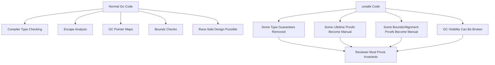
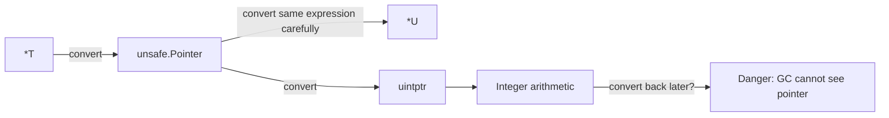
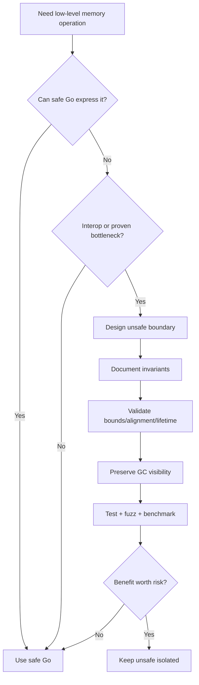

# learn-go-memory-systems-part-021.md

# Part 021 — `unsafe` Fundamentals: Valid Pointer Patterns, `uintptr` Hazards, `unsafe.Add`, `unsafe.Slice`

> Seri: **learn-go-memory-systems**  
> Target: Go **1.26.x**  
> Audience: Java software engineer yang ingin memahami Go memory systems sampai level internal engineering handbook.  
> Fokus part ini: memahami `unsafe` sebagai boundary eksplisit yang melewati type safety Go, bukan sebagai shortcut optimasi umum.

---

## Status Seri

Part ini adalah bagian ke-22 dari 35 part.

```text
learn-go-memory-systems-part-000.md
learn-go-memory-systems-part-001.md
learn-go-memory-systems-part-002.md
learn-go-memory-systems-part-003.md
learn-go-memory-systems-part-004.md
learn-go-memory-systems-part-005.md
learn-go-memory-systems-part-006.md
learn-go-memory-systems-part-007.md
learn-go-memory-systems-part-008.md
learn-go-memory-systems-part-009.md
learn-go-memory-systems-part-010.md
learn-go-memory-systems-part-011.md
learn-go-memory-systems-part-012.md
learn-go-memory-systems-part-013.md
learn-go-memory-systems-part-014.md
learn-go-memory-systems-part-015.md
learn-go-memory-systems-part-016.md
learn-go-memory-systems-part-017.md
learn-go-memory-systems-part-018.md
learn-go-memory-systems-part-019.md
learn-go-memory-systems-part-020.md
learn-go-memory-systems-part-021.md  <-- sekarang
```

Part berikutnya:

```text
learn-go-memory-systems-part-022.md
```

Topik berikutnya: **Unsafe string/slice conversion: when it is valid, when it corrupts memory, Go 1.20+ APIs**.

---

## Daftar Isi

1. Kenapa `unsafe` Perlu Dibahas Terpisah
2. Mental Model Utama: `unsafe` Bukan “Lebih Dekat ke Mesin”, Tapi “Keluar dari Kontrak Compiler”
3. Apa yang Diberikan Package `unsafe`
4. Go Safety Boundary: Type Safety, Memory Safety, GC Visibility
5. `unsafe.Pointer`: Universal Pointer Tanpa Type Semantics
6. `uintptr`: Angka, Bukan Pointer
7. Aturan Besar: Jangan Simpan Pointer sebagai `uintptr`
8. `unsafe.Add`: Pointer Arithmetic Modern
9. `unsafe.Slice`: Membuat Slice View dari Pointer + Length
10. `unsafe.Sizeof`, `Alignof`, `Offsetof`
11. Alignment: Benar Secara Type Belum Tentu Benar Secara Address
12. Struct Overlay: Kapan Masuk Akal, Kapan Berbahaya
13. Endianness dan Layout Portability
14. GC Visibility: Pointer yang Tidak Terlihat Bisa Membunuh Program
15. Stack Movement, Heap, dan Pointer Arithmetic
16. `runtime.KeepAlive`: Lifetime Barrier yang Sering Dilupakan
17. Valid Pattern 1: Inspect Layout dengan `Sizeof`/`Offsetof`
18. Valid Pattern 2: Pointer ke Field Menggunakan `unsafe.Add`
19. Valid Pattern 3: Slice View ke Memory yang Lifetime-nya Jelas
20. Valid Pattern 4: Syscall/cgo Boundary dengan Ownership Tegas
21. Invalid Pattern 1: `uintptr` Disimpan untuk Dipakai Nanti
22. Invalid Pattern 2: Pointer ke Memory yang Sudah Tidak Hidup
23. Invalid Pattern 3: Membuat Go Pointer Tidak Terlihat oleh GC
24. Invalid Pattern 4: Mutasi String via Unsafe
25. Invalid Pattern 5: Struct Header Manual Lama
26. Unsafe vs Reflection
27. Unsafe vs Generics
28. Unsafe vs cgo
29. Unsafe vs mmap/off-heap
30. Performance Reality: `unsafe` Tidak Otomatis Lebih Cepat
31. Production Design Rules
32. Review Checklist untuk `unsafe`
33. Testing Strategy
34. Fuzzing Strategy
35. Benchmark Strategy
36. Observability dan Incident Pattern
37. Mini Lab
38. Ringkasan Mental Model

---

## 1. Kenapa `unsafe` Perlu Dibahas Terpisah

Di Go, `unsafe` bukan sekadar package teknis. Ia adalah garis batas antara dua dunia:

1. dunia Go biasa, di mana compiler, type system, runtime, dan garbage collector bekerja sama melindungi program; dan
2. dunia manual, di mana engineer mengambil sebagian tanggung jawab yang biasanya dipegang compiler/runtime.

Dalam Java, analoginya bukan hanya `Unsafe` atau `ByteBuffer`. Lebih dekat ke kombinasi:

- `sun.misc.Unsafe` / `jdk.internal.misc.Unsafe`,
- direct memory,
- JNI pointer boundary,
- object layout introspection,
- off-heap memory management,
- manual alignment,
- dan lifetime discipline yang biasanya tidak terlihat di Java application code.

Tetapi Go berbeda dari Java dalam beberapa hal penting:

- Go memiliki pointer di level bahasa.
- Go memiliki GC, tetapi GC tidak membuat semua pointer manipulation aman.
- Go `unsafe` tidak punya borrow checker seperti Rust.
- Go compiler boleh mengubah layout, allocation placement, inlining, dan lifetime selama masih sesuai spec.
- Go 1 compatibility tidak menjamin program yang bergantung pada detail `unsafe` non-portable akan terus aman.

Package `unsafe` secara resmi berisi operasi yang melewati type safety Go. Dokumentasi juga menegaskan bahwa package yang mengimpor `unsafe` bisa non-portable dan tidak dilindungi oleh Go 1 compatibility guarantee.

Artinya: ketika ada `import "unsafe"`, code review harus naik level.

---

## 2. Mental Model Utama: `unsafe` Bukan “Lebih Dekat ke Mesin”, Tapi “Keluar dari Kontrak Compiler”

Banyak engineer berpikir:

> `unsafe` = low-level = lebih cepat.

Mental model yang lebih benar:

> `unsafe` = compiler/runtime tidak lagi bisa membuktikan sebagian invariant untuk Anda.

`unsafe` memberi akses ke beberapa kemampuan:

- melihat ukuran/alignment/offset type;
- mengonversi pointer antar type;
- melakukan pointer arithmetic;
- membuat slice/string view dari pointer;
- melewati sebagian rule type system.

Tetapi sebagai gantinya, Anda harus menjaga invariant sendiri:

- address valid;
- alignment benar;
- lifetime cukup panjang;
- memory tidak dimutasi melalui view immutable;
- object yang mengandung Go pointer tetap terlihat oleh GC;
- tidak ada data race;
- tidak ada out-of-bounds;
- tidak ada use-after-free;
- tidak ada dependency pada layout yang tidak dijamin.

Diagram mentalnya:



Key rule:

> `unsafe` should be treated as a tiny, documented, tested, benchmarked boundary — not as an implementation style.

---

## 3. Apa yang Diberikan Package `unsafe`

Package `unsafe` menyediakan beberapa building block utama:

```go
package unsafe

type Pointer *ArbitraryType

func Sizeof(x ArbitraryType) uintptr
func Alignof(x ArbitraryType) uintptr
func Offsetof(x ArbitraryType) uintptr

func Add(ptr Pointer, len IntegerType) Pointer
func Slice(ptr *ArbitraryType, len IntegerType) []ArbitraryType
func SliceData(slice []ArbitraryType) *ArbitraryType

func String(ptr *byte, len IntegerType) string
func StringData(str string) *byte
```

Beberapa API seperti `String`, `StringData`, `Slice`, dan `SliceData` akan dibahas lebih detail di part berikutnya. Part ini fokus pada fondasi pointer, `uintptr`, arithmetic, alignment, dan GC visibility.

Hal penting:

- `unsafe.Sizeof`, `Alignof`, dan `Offsetof` menghasilkan informasi layout compile-time untuk type tertentu.
- `unsafe.Pointer` adalah pointer tanpa type semantics.
- `unsafe.Add` adalah cara modern melakukan pointer arithmetic secara lebih jelas daripada pattern lama `uintptr(p)+offset`.
- `unsafe.Slice` membuat slice view dari pointer dan length, tetapi tidak mengalokasikan backing array baru.
- `unsafe.String` membuat string view dari pointer dan length, tetapi string tetap wajib dianggap immutable.

---

## 4. Go Safety Boundary: Type Safety, Memory Safety, GC Visibility

Ada tiga lapisan safety yang perlu dipisahkan.

### 4.1 Type Safety

Normal Go memastikan Anda tidak bisa memperlakukan `*User` sebagai `*Order` tanpa explicit conversion yang valid.

Dengan `unsafe.Pointer`, Anda bisa melakukan ini:

```go
var x uint64 = 0x1122334455667788
p := unsafe.Pointer(&x)
b := (*[8]byte)(p)
fmt.Printf("%x\n", b[0])
```

Ini melewati type boundary. Program bisa berjalan, tetapi interpretasi byte bergantung pada endian, alignment, dan representasi type.

### 4.2 Memory Safety

Normal Go mencegah out-of-bounds pada slice/array access. Dengan unsafe, Anda bisa membuat view yang lebih panjang daripada memory valid:

```go
func invalid(p *byte) []byte {
    return unsafe.Slice(p, 1<<30) // compiler tidak tahu apakah memory sebesar itu valid
}
```

Jika caller membaca melewati memory valid, hasilnya bisa panic, corrupt data, SIGSEGV, atau terlihat “baik-baik saja” sampai production.

### 4.3 GC Visibility

Go GC perlu mengetahui mana word di heap/stack yang berisi pointer Go. Jika Anda menyembunyikan pointer sebagai integer atau menaruh Go pointer di memory yang tidak discan GC, runtime bisa menganggap object sudah tidak reachable.

Contoh berbahaya:

```go
var saved uintptr

func store(p *int) {
    saved = uintptr(unsafe.Pointer(p))
}

func load() *int {
    return (*int)(unsafe.Pointer(saved))
}
```

Masalahnya bukan hanya “alamat bisa berubah”. Bahkan dengan non-moving GC, pointer yang disimpan sebagai integer tidak membuat object tetap hidup. GC tidak melihat integer sebagai pointer root.

---

## 5. `unsafe.Pointer`: Universal Pointer Tanpa Type Semantics

`unsafe.Pointer` dapat dikonversi dari dan ke pointer type apa pun.

```go
type A struct {
    X int64
}

type B struct {
    Y int64
}

func reinterpret(a *A) *B {
    return (*B)(unsafe.Pointer(a))
}
```

Kode ini legal secara compile-time, tetapi validitas runtime-nya bergantung pada invariant yang Anda jaga sendiri:

- Apakah `A` dan `B` punya layout kompatibel?
- Apakah alignment `B` terpenuhi?
- Apakah field pointer dalam `B` akan membuat GC salah interpretasi?
- Apakah code bergantung pada layout yang tidak dijamin lintas arsitektur?
- Apakah mutasi melalui `*B` melanggar invariant `A`?

### 5.1 `unsafe.Pointer` Tidak Sama Dengan `void*` Sederhana

Di C, `void*` adalah pointer tanpa type, tetapi C tidak punya GC yang harus melihat pointer graph Go. Di Go, pointer bukan hanya alamat; pointer juga bagian dari runtime memory model.

Saat pointer masih bertipe pointer Go, GC dapat melihatnya. Saat pointer menjadi `uintptr`, ia menjadi angka.



---

## 6. `uintptr`: Angka, Bukan Pointer

`uintptr` adalah unsigned integer yang cukup besar untuk menampung bit pattern sebuah pointer.

Kalimat penting:

> `uintptr` can hold a pointer value, but it is not a pointer.

Konsekuensinya:

- `uintptr` tidak menjaga object tetap hidup.
- `uintptr` tidak dilacak GC sebagai pointer.
- `uintptr` arithmetic tidak dicek bounds.
- `uintptr` bisa menjadi stale address.
- menyimpan `uintptr` sebagai field/global/cache adalah bug kandidat kuat.

Contoh buruk:

```go
type Holder struct {
    addr uintptr
}

func NewHolder(buf []byte) Holder {
    return Holder{addr: uintptr(unsafe.Pointer(&buf[0]))}
}

func (h Holder) First() byte {
    return *(*byte)(unsafe.Pointer(h.addr))
}
```

Masalah:

- `buf` mungkin tidak lagi hidup ketika `First` dipanggil.
- GC tidak tahu `Holder.addr` harus mempertahankan backing array.
- Jika backing array berasal dari stack/heap dengan lifetime pendek, behavior tidak valid.

### 6.1 Java Analogy

Bayangkan Anda mengambil address object Java via JVM internal, menyimpannya sebagai `long`, lalu menggunakan lagi setelah GC. Itu jelas tidak aman pada moving GC. Di Go, GC saat ini non-moving untuk heap object, tetapi tetap tidak aman karena lifetime/reachability dan stack movement tetap relevan.

Non-moving bukan izin untuk menyimpan pointer sebagai integer.

---

## 7. Aturan Besar: Jangan Simpan Pointer sebagai `uintptr`

Rule praktis:

> Konversi pointer ke `uintptr` hanya boleh terjadi dalam expression yang sama dengan konversi balik, untuk arithmetic/address calculation yang tidak perlu survive melewati sequence point/lifetime boundary.

Pattern yang relatif benar:

```go
func fieldPtr(base unsafe.Pointer, offset uintptr) unsafe.Pointer {
    return unsafe.Add(base, offset)
}
```

Pattern lama yang masih sering terlihat:

```go
p := unsafe.Pointer(uintptr(base) + offset)
```

Pattern ini historically dipakai, tetapi lebih rawan karena ada momen pointer menjadi integer. Dengan `unsafe.Add`, niat pointer arithmetic lebih jelas dan tidak perlu membuat intermediate `uintptr` eksplisit untuk address arithmetic.

Pattern salah:

```go
addr := uintptr(unsafe.Pointer(p))
// banyak operasi lain
runtime.GC()
q := (*T)(unsafe.Pointer(addr))
```

Atau:

```go
type Node struct {
    next uintptr // wrong if this is logically a Go pointer
}
```

Jika `next` menunjuk Go object, gunakan `*Node`, bukan `uintptr`.

---

## 8. `unsafe.Add`: Pointer Arithmetic Modern

`unsafe.Add(ptr, len)` mengembalikan pointer yang merupakan `ptr + len` byte.

Contoh:

```go
type Header struct {
    Magic uint32
    Flags uint16
    Len   uint16
}

func fieldFlags(h *Header) *uint16 {
    base := unsafe.Pointer(h)
    off := unsafe.Offsetof(h.Flags)
    return (*uint16)(unsafe.Add(base, off))
}
```

Tetapi jangan salah paham: `unsafe.Add` tidak membuat arithmetic otomatis aman. Ia hanya API yang lebih tepat untuk pointer arithmetic.

Anda tetap harus membuktikan:

- `ptr` tidak nil kecuali offset valid untuk operasi yang dilakukan;
- offset berada dalam object/allocation yang valid;
- hasil pointer alignment cocok untuk target type;
- object asal tetap hidup selama pointer hasil dipakai;
- tidak melanggar aliasing/lifetime invariant.

### 8.1 Kenapa `unsafe.Add` Lebih Baik daripada `uintptr` Arithmetic Manual

Bandingkan:

```go
p2 := unsafe.Pointer(uintptr(p) + n)
```

dengan:

```go
p2 := unsafe.Add(p, n)
```

Versi kedua menyampaikan kepada pembaca:

- ini pointer arithmetic;
- input dan output tetap dalam domain pointer;
- tidak ada kebutuhan menyimpan address sebagai integer.

Namun, reviewer tetap harus memvalidasi bounds dan lifetime.

---

## 9. `unsafe.Slice`: Membuat Slice View dari Pointer + Length

`unsafe.Slice(ptr, len)` membuat `[]T` yang backing memory-nya dimulai dari `ptr` sepanjang `len` element.

Contoh aman-ish jika invariant jelas:

```go
func viewArray(a *[16]byte) []byte {
    return unsafe.Slice(&a[0], len(a))
}
```

Tetapi untuk array biasa, Anda tidak butuh `unsafe`; `a[:]` cukup. `unsafe.Slice` biasanya muncul saat memory berasal dari:

- syscall;
- mmap;
- cgo;
- custom allocator;
- pointer arithmetic ke region tertentu;
- internal performance boundary yang sangat terbatas.

Contoh boundary:

```go
type Region struct {
    ptr *byte
    len int
}

func (r Region) Bytes() []byte {
    if r.ptr == nil {
        if r.len != 0 {
            panic("invalid region: nil pointer with non-zero length")
        }
        return nil
    }
    return unsafe.Slice(r.ptr, r.len)
}
```

Pertanyaan review:

- Siapa pemilik memory `ptr`?
- Siapa menjamin memory masih hidup?
- Siapa boleh menulis?
- Apa yang terjadi setelah `Region.Close()`?
- Apakah slice boleh disimpan caller?
- Apakah slice mengandung Go pointer?
- Apakah memory berasal dari Go heap atau non-Go heap?

---

## 10. `unsafe.Sizeof`, `Alignof`, `Offsetof`

Tiga fungsi ini relatif paling aman karena tidak memanipulasi memory secara langsung.

```go
type Event struct {
    A byte
    B int64
    C int32
}

func inspect() {
    var e Event
    fmt.Println(unsafe.Sizeof(e))
    fmt.Println(unsafe.Alignof(e))
    fmt.Println(unsafe.Offsetof(e.B))
}
```

Mereka berguna untuk:

- memahami padding;
- mengecek layout hot struct;
- memastikan field offset untuk binary overlay internal;
- membuat static assertion;
- memahami cache density.

### 10.1 Static Assertion Pattern

```go
const expectedSize = 24

func _() {
    var e Event
    if unsafe.Sizeof(e) != expectedSize {
        panic("unexpected Event size")
    }
}
```

Untuk compile-time assertion:

```go
type Event struct {
    A byte
    B int64
    C int32
}

const eventSize = unsafe.Sizeof(Event{})

var _ [24 - eventSize]byte
```

Tetapi pattern compile-time assertion dengan arithmetic harus hati-hati agar tidak underflow pada `uintptr`. Biasanya lebih jelas memakai test.

---

## 11. Alignment: Benar Secara Type Belum Tentu Benar Secara Address

Alignment adalah requirement bahwa address object harus kelipatan tertentu. Misalnya `uint64` sering membutuhkan alignment 8 byte di banyak arsitektur.

Dengan normal Go, compiler menjaga alignment.

Dengan unsafe, Anda bisa membuat pointer tidak aligned:

```go
func bad(buf []byte) *uint64 {
    return (*uint64)(unsafe.Pointer(&buf[1])) // mungkin unaligned
}
```

Di beberapa arsitektur, unaligned access bisa:

- panic/SIGBUS;
- lebih lambat;
- bekerja tetapi tidak portable;
- salah untuk atomic operation.

Untuk binary parsing portable, lebih aman:

```go
v := binary.LittleEndian.Uint64(buf[1:9])
```

Daripada overlay langsung ke `*uint64`.

### 11.1 Atomic Alignment

Atomic operation punya requirement lebih ketat. Jika Anda melakukan atomic operation pada address yang tidak aligned sesuai requirement platform, behavior bisa crash atau tidak benar.

```go
type Counter struct {
    _ [7]byte
    X uint64 // compiler akan align field dalam struct normal
}
```

Masalah muncul ketika Anda membuat pointer ke `uint64` dari arbitrary byte buffer.

---

## 12. Struct Overlay: Kapan Masuk Akal, Kapan Berbahaya

Struct overlay adalah memperlakukan bytes sebagai struct:

```go
type Header struct {
    Magic uint32
    Len   uint32
}

func parse(buf []byte) *Header {
    return (*Header)(unsafe.Pointer(&buf[0]))
}
```

Ini terlihat cepat, tetapi sering salah untuk protocol parsing.

Risiko:

- endian tergantung mesin;
- padding struct bisa berbeda dari wire format;
- alignment belum tentu valid;
- buffer length belum dicek;
- lifetime buffer harus lebih panjang dari pointer;
- mutasi buffer mengubah header view;
- field pointer dalam struct overlay sangat berbahaya;
- portability lintas arch rendah.

Lebih aman:

```go
func parseHeader(buf []byte) (Header, error) {
    if len(buf) < 8 {
        return Header{}, io.ErrUnexpectedEOF
    }
    return Header{
        Magic: binary.BigEndian.Uint32(buf[0:4]),
        Len:   binary.BigEndian.Uint32(buf[4:8]),
    }, nil
}
```

Kapan overlay masuk akal?

- format in-memory internal, bukan wire format publik;
- platform dikunci;
- alignment dikontrol;
- layout diverifikasi test;
- data tidak mengandung Go pointers;
- performance terbukti butuh;
- boundary kecil dan terdokumentasi.

---

## 13. Endianness dan Layout Portability

Go spec tidak mengatakan bahwa integer di memory harus little-endian untuk semua platform. Wire format harus eksplisit.

Jangan menulis parser seperti ini untuk protocol/network/file portable:

```go
func u32(buf []byte) uint32 {
    return *(*uint32)(unsafe.Pointer(&buf[0]))
}
```

Gunakan:

```go
func u32(buf []byte) uint32 {
    return binary.BigEndian.Uint32(buf[:4])
}
```

Atau `binary.LittleEndian` sesuai format.

Unsafe overlay sering menyembunyikan keputusan endian. Dalam production system, itu buruk karena format data adalah kontrak jangka panjang.

---

## 14. GC Visibility: Pointer yang Tidak Terlihat Bisa Membunuh Program

Go GC adalah tracing collector. Ia menelusuri roots dan pointer fields yang diketahui runtime.

Jika Go pointer disimpan dalam memory yang tidak discan GC, pointer itu tidak menjaga object tetap hidup.

Contoh berbahaya:

```go
type Box struct {
    p unsafe.Pointer
}
```

Ini masih pointer word yang diketahui sebagai unsafe pointer dalam Go object, sehingga GC memperlakukannya sebagai pointer? Untuk `unsafe.Pointer` field dalam heap object, runtime memiliki pointer bitmap untuk field itu. Tetapi jika pointer disimpan sebagai `uintptr`, GC tidak melihatnya sebagai pointer.

Lebih berbahaya:

```go
type Box struct {
    p uintptr
}
```

Atau menaruh Go pointer ke mmap/C memory:

```go
// Pseudocode: store Go pointer bits into non-Go memory.
```

GC tidak scan arbitrary mmap/C memory. Jika hanya pointer di sana yang mereferensikan object Go, object bisa dikumpulkan.

Rule:

> Jangan simpan Go pointer dalam non-Go memory kecuali Anda benar-benar memahami cgo pointer passing rules, pinning, lifetime, dan tidak membuat hidden object graph.

---

## 15. Stack Movement, Heap, dan Pointer Arithmetic

Goroutine stack dapat tumbuh dan dipindahkan. Runtime memperbarui pointer yang diketahui. Tetapi pointer yang disembunyikan sebagai integer tidak bisa diperbarui.

Contoh mental:

```go
func f() uintptr {
    x := 10
    return uintptr(unsafe.Pointer(&x)) // invalid
}
```

Bahkan jika Anda langsung pakai setelah return, `x` sudah tidak hidup. Compiler mungkin memindahkan `x` ke heap jika melihat escape, tetapi ketika Anda menyembunyikan pointer sebagai `uintptr`, compiler/GC tidak punya jaminan sama.

Jangan mencoba “mengalahkan escape analysis” dengan `uintptr`.

Itu bukan optimasi. Itu memory corruption yang tertunda.

---

## 16. `runtime.KeepAlive`: Lifetime Barrier yang Sering Dilupakan

`runtime.KeepAlive(x)` memastikan `x` dianggap live sampai titik pemanggilan itu.

Ini penting saat Anda melewatkan raw pointer ke syscall/cgo/unsafe operation, sementara Go object pemilik memory harus tetap hidup.

Contoh pola:

```go
func writeRaw(fd int, buf []byte) error {
    if len(buf) == 0 {
        return nil
    }

    p := unsafe.Pointer(&buf[0])

    // Misalnya rawSyscallWrite memakai p tanpa Go memahami bahwa buf masih diperlukan.
    err := rawSyscallWrite(fd, p, len(buf))

    runtime.KeepAlive(buf)
    return err
}
```

Tanpa `KeepAlive`, compiler bisa menganggap `buf` tidak dipakai setelah mengambil pointer, terutama pada boundary yang tidak jelas untuk optimizer. `KeepAlive` membuat lifetime eksplisit.

Jangan overuse `KeepAlive` di normal Go. Gunakan di boundary unsafe/syscall/cgo/finalizer/native handle.

---

## 17. Valid Pattern 1: Inspect Layout dengan `Sizeof`/`Offsetof`

Pattern ini aman untuk observasi layout.

```go
package main

import (
    "fmt"
    "unsafe"
)

type Record struct {
    Active bool
    ID     int64
    Score  int32
}

func main() {
    var r Record
    fmt.Println("size", unsafe.Sizeof(r))
    fmt.Println("align", unsafe.Alignof(r))
    fmt.Println("off Active", unsafe.Offsetof(r.Active))
    fmt.Println("off ID", unsafe.Offsetof(r.ID))
    fmt.Println("off Score", unsafe.Offsetof(r.Score))
}
```

Use case:

- mengurangi padding;
- memahami cache density;
- memvalidasi layout internal;
- dokumentasi performance-sensitive struct.

Tidak ada pointer reinterpretation di sini.

---

## 18. Valid Pattern 2: Pointer ke Field Menggunakan `unsafe.Add`

Kadang Anda membangun generic-ish internal layout tool.

```go
type Header struct {
    Magic uint32
    Flags uint16
    Len   uint16
}

func flagsPtr(h *Header) *uint16 {
    return (*uint16)(unsafe.Add(unsafe.Pointer(h), unsafe.Offsetof(h.Flags)))
}
```

Sebenarnya untuk field normal, cukup `&h.Flags`. Pattern di atas hanya masuk akal jika offset datang dari metadata internal.

```go
type Field struct {
    Name   string
    Offset uintptr
}

func fieldUint32(base unsafe.Pointer, f Field) *uint32 {
    return (*uint32)(unsafe.Add(base, f.Offset))
}
```

Invariant:

- `base` menunjuk object dengan layout yang cocok;
- `f.Offset` berasal dari `unsafe.Offsetof`, bukan input user;
- target field alignment valid;
- object tetap hidup selama pointer dipakai.

---

## 19. Valid Pattern 3: Slice View ke Memory yang Lifetime-nya Jelas

Contoh: Anda punya region memory dari mmap/off-heap wrapper.

```go
type Region struct {
    ptr *byte
    len int
    closed bool
}

func (r *Region) Bytes() []byte {
    if r.closed {
        panic("region closed")
    }
    if r.len == 0 {
        return nil
    }
    if r.ptr == nil {
        panic("nil pointer with non-zero length")
    }
    return unsafe.Slice(r.ptr, r.len)
}
```

Tetapi API ini sangat berbahaya jika caller menyimpan slice setelah `Close`.

Lebih defensif:

```go
func (r *Region) WithBytes(fn func([]byte) error) error {
    if r.closed {
        return ErrClosed
    }
    var b []byte
    if r.len > 0 {
        b = unsafe.Slice(r.ptr, r.len)
    }
    err := fn(b)
    runtime.KeepAlive(r)
    return err
}
```

Pattern callback membatasi lifetime borrowed view.

---

## 20. Valid Pattern 4: Syscall/cgo Boundary dengan Ownership Tegas

Saat berinteraksi dengan OS/native library, Anda mungkin perlu pointer raw.

Checklist:

- Siapa allocate memory?
- Siapa free memory?
- Bolehkah native side menyimpan pointer setelah call selesai?
- Apakah memory mengandung Go pointer?
- Perlu pinning?
- Perlu `runtime.KeepAlive`?
- Bagaimana error path cleanup?
- Bagaimana cancellation/timeout memengaruhi lifetime?

Pseudo-pattern:

```go
func callNative(buf []byte) error {
    if len(buf) == 0 {
        return nil
    }
    p := unsafe.Pointer(&buf[0])
    err := nativeCall(p, len(buf))
    runtime.KeepAlive(buf)
    return err
}
```

Untuk cgo, ikuti aturan pointer passing cgo, bukan asumsi pribadi.

---

## 21. Invalid Pattern 1: `uintptr` Disimpan untuk Dipakai Nanti

```go
type Cursor struct {
    addr uintptr
}

func NewCursor(buf []byte) Cursor {
    return Cursor{addr: uintptr(unsafe.Pointer(&buf[0]))}
}
```

Ini salah karena `Cursor` tidak mempertahankan `buf`.

Versi yang lebih benar:

```go
type Cursor struct {
    buf []byte
    off int
}

func (c *Cursor) ptr() unsafe.Pointer {
    if len(c.buf) == 0 {
        return nil
    }
    return unsafe.Pointer(&c.buf[c.off])
}
```

Sekarang `buf` tetap menjadi field yang terlihat GC.

---

## 22. Invalid Pattern 2: Pointer ke Memory yang Sudah Tidak Hidup

```go
func bad() *int {
    var x int
    p := unsafe.Pointer(&x)
    return (*int)(p)
}
```

Untuk pointer normal `return &x`, compiler akan memindahkan `x` ke heap. Tetapi jika Anda melakukan transformasi yang membuat compiler kehilangan visibility, jangan mengandalkan behavior.

Lebih buruk:

```go
func bad() uintptr {
    var x int
    return uintptr(unsafe.Pointer(&x))
}
```

Caller yang mengubah balik address ini ke pointer melakukan use-after-lifetime.

---

## 23. Invalid Pattern 3: Membuat Go Pointer Tidak Terlihat oleh GC

```go
type OffHeapIndex struct {
    mem []byte // pretend this is mmap/native memory
}

func (idx *OffHeapIndex) StorePointer(p *User) {
    addr := uintptr(unsafe.Pointer(p))
    binary.LittleEndian.PutUint64(idx.mem[:8], uint64(addr))
}
```

Jika `p` hanya disimpan di `idx.mem`, GC tidak melihatnya.

Kalau Anda butuh referensi ke Go object, simpan di Go object:

```go
type Index struct {
    refs []*User
}
```

Kalau Anda butuh off-heap data, simpan data plain tanpa Go pointer:

```go
type UserRecord struct {
    ID uint64
    Offset uint64
}
```

Off-heap sebaiknya menyimpan scalar/bytes, bukan pointer Go.

---

## 24. Invalid Pattern 4: Mutasi String via Unsafe

String di Go immutable. Anda bisa menemukan trik unsafe yang mengubah string menjadi `[]byte` tanpa copy lalu memutasinya. Itu melanggar kontrak bahasa.

```go
func dangerous(s string) []byte {
    return unsafe.Slice(unsafe.StringData(s), len(s))
}
```

Kemudian:

```go
b := dangerous("hello")
b[0] = 'H' // sangat berbahaya; literal bisa read-only
```

Bisa crash. Bisa corrupt data. Bisa terlihat jalan di satu environment lalu gagal di yang lain.

Aturan:

- string view dari bytes harus immutable;
- bytes view dari string tidak boleh dimutasi;
- string literal tidak boleh diasumsikan writable;
- jangan expose mutable view dari immutable data.

Part berikutnya akan membahas ini secara khusus.

---

## 25. Invalid Pattern 5: Struct Header Manual Lama

Dulu banyak kode memakai:

```go
type StringHeader struct {
    Data uintptr
    Len  int
}
```

atau `reflect.StringHeader`/`reflect.SliceHeader` untuk konversi string/slice.

Masalah utamanya:

- `Data` adalah `uintptr`, bukan pointer root;
- GC visibility bisa hilang;
- lifetime tidak aman;
- representasi internal bisa tidak menjadi kontrak yang ingin Anda pegang.

API modern seperti `unsafe.String`, `unsafe.StringData`, `unsafe.Slice`, dan `unsafe.SliceData` lebih eksplisit. Tetap unsafe, tetapi lebih baik daripada membangun header manual.

---

## 26. Unsafe vs Reflection

Reflection juga bisa mahal dan dinamis, tetapi reflection tetap berada dalam sistem type/runtime Go dalam banyak kasus. Unsafe melewati batas lebih jauh.

Perbandingan:

| Aspek | Reflection | Unsafe |
|---|---|---|
| Type checked compile-time | Tidak penuh | Tidak penuh |
| Runtime metadata | Ya | Tidak selalu |
| GC visibility | Umumnya tetap | Bisa rusak jika pointer disembunyikan |
| Portability | Lebih baik | Lebih rawan |
| Performance | Bisa lambat | Bisa cepat, bisa lebih lambat |
| Failure mode | Panic/error | Corruption/SIGSEGV/data race |

Jangan mengganti reflection dengan unsafe hanya karena ingin “lebih cepat” tanpa benchmark.

---

## 27. Unsafe vs Generics

Banyak code yang dulu memakai unsafe untuk type-specific fast path bisa sekarang diganti dengan generics.

Contoh generic safe:

```go
func Clone[T any](in []T) []T {
    out := make([]T, len(in))
    copy(out, in)
    return out
}
```

Daripada membuat untyped byte copy via unsafe untuk semua type.

Tetapi generics tidak bisa menggantikan semua unsafe, terutama untuk:

- raw memory view;
- syscalls;
- mmap;
- object layout introspection;
- custom serialization layout;
- interop native.

Rule:

> Gunakan generics untuk type abstraction. Gunakan unsafe hanya untuk memory representation boundary yang tidak bisa diekspresikan aman.

---

## 28. Unsafe vs cgo

cgo punya aturan pointer passing sendiri. Salah satu prinsip penting: C tidak boleh menyimpan Go pointer secara sembarangan setelah call selesai kecuali memory dipin sesuai aturan.

Dengan unsafe saja, Anda bisa membuat pointer raw. Dengan cgo, Anda juga melintasi runtime boundary:

- scheduler;
- stack;
- GC;
- pointer pinning;
- thread affinity;
- native lifetime;
- C allocator.

Jika part ini adalah red zone, cgo + unsafe adalah dark red zone.

Checklist tambahan:

- Apakah native side menyimpan pointer?
- Apakah Go memory mengandung Go pointer?
- Apakah C memory harus dibebaskan?
- Bagaimana error path?
- Apakah callback dari C ke Go terjadi?
- Apakah pointer digunakan setelah Go object finalizer berjalan?

---

## 29. Unsafe vs mmap/off-heap

mmap/off-heap memory tidak dikelola Go heap.

Jika Anda membuat slice view:

```go
b := unsafe.Slice(ptr, n)
```

maka:

- `b` terlihat seperti normal `[]byte`, tetapi backing memory bukan Go heap;
- GC tidak mengelola lifetime memory itu;
- `append(b, x)` bisa membuat backing baru di Go heap jika cap tidak cukup;
- membaca setelah unmap bisa SIGSEGV;
- menulis setelah file closed/unmapped bisa crash/corrupt;
- pprof heap tidak menunjukkan memory tersebut sebagai Go heap allocation.

API wrapper harus sangat jelas:

```go
type MMap struct {
    ptr *byte
    len int
    closed atomic.Bool
}
```

Dan sebaiknya tidak membiarkan borrowed slice hidup setelah close.

---

## 30. Performance Reality: `unsafe` Tidak Otomatis Lebih Cepat

Unsafe bisa mengurangi copy atau bounds check, tetapi bisa juga memperburuk:

- alignment miss;
- cache behavior buruk;
- lost compiler optimization;
- deoptimization karena aliasing tidak jelas;
- GC confusion atau retention;
- lebih sulit di-inline karena abstraction rumit;
- branch tambahan untuk safety manual;
- bug yang memaksa defensive copy di caller.

Contoh: parsing `uint32` dari byte slice.

Unsafe overlay:

```go
func parseUnsafe(b []byte) uint32 {
    return *(*uint32)(unsafe.Pointer(&b[0]))
}
```

Safe version:

```go
func parseSafe(b []byte) uint32 {
    return binary.LittleEndian.Uint32(b[:4])
}
```

Modern compiler sering mengoptimalkan safe version dengan sangat baik. Safe version juga portable dan jelas.

Rule:

> Sebelum memakai unsafe untuk performance, buktikan safe version bottleneck dengan benchmark dan pprof.

---

## 31. Production Design Rules

### 31.1 Isolate Unsafe

Jangan sebar `unsafe` di seluruh codebase.

Struktur yang lebih baik:

```text
internal/
  rawmem/
    region.go        // public safe-ish wrapper
    region_unsafe.go // unsafe implementation detail
    region_test.go
```

Public API tetap aman:

```go
type Region struct { /* unexported */ }

func (r *Region) ReadAt(dst []byte, off int64) (int, error)
func (r *Region) WithBytes(fn func([]byte) error) error
func (r *Region) Close() error
```

### 31.2 Document Invariants Beside Code

Jangan hanya tulis:

```go
// fast path
```

Tulis:

```go
// Invariants:
// - base points to a live Packet value.
// - offset is produced by unsafe.Offsetof(Packet.PayloadLen).
// - target address is aligned for uint32.
// - returned pointer must not outlive base.
```

### 31.3 Provide Safe Fallback

Untuk code portable:

```go
//go:build amd64 || arm64
```

Dan fallback:

```go
//go:build !amd64 && !arm64
```

Jika optimization arch-specific, jangan pura-pura portable.

### 31.4 Test Across Architectures if Possible

Minimum:

- `GOARCH=amd64`
- `GOARCH=arm64`
- race test untuk safe wrapper jika concurrency involved
- fuzz untuk parser/view boundary

### 31.5 No User-Controlled Offset Without Bounds

Jangan melakukan:

```go
ptr := unsafe.Add(base, userOffset)
```

tanpa validasi:

```go
if userOffset > max || size > max-userOffset {
    return error
}
```

---

## 32. Review Checklist untuk `unsafe`

Gunakan checklist ini setiap melihat `import "unsafe"`.

### 32.1 Justification

- Apa alasan `unsafe` dipakai?
- Apakah safe version sudah dicoba?
- Ada benchmark/profiling yang membuktikan perlu?
- Apakah ini interop boundary yang memang membutuhkan raw pointer?

### 32.2 Scope

- Apakah `unsafe` terisolasi di package kecil?
- Apakah API publik tetap safe?
- Apakah unsafe detail tidak bocor ke caller?

### 32.3 Lifetime

- Siapa pemilik memory?
- Apakah pointer/view bisa hidup lebih lama dari owner?
- Apakah perlu `runtime.KeepAlive`?
- Apakah ada `Close`/free/unmap?
- Apa yang terjadi jika caller menyimpan slice setelah close?

### 32.4 Bounds

- Apakah semua offset/length divalidasi?
- Apakah overflow dicek?
- Apakah length dalam element, bukan byte, jelas?
- Apakah nil pointer + nonzero length dicegah?

### 32.5 Alignment

- Apakah target pointer aligned?
- Apakah atomic access aligned?
- Apakah platform-specific assumption didokumentasikan?

### 32.6 GC Visibility

- Apakah Go pointer pernah disimpan sebagai `uintptr`?
- Apakah Go pointer disimpan di non-Go memory?
- Apakah memory yang mengandung Go pointers discan GC?
- Apakah pointer owner tetap reachable?

### 32.7 Mutability

- Apakah immutable data dibuat mutable?
- Apakah string view dari bytes bisa rusak karena bytes dimutasi?
- Apakah borrowed view dikirim ke goroutine lain?

### 32.8 Portability

- Apakah endian eksplisit?
- Apakah struct padding diasumsikan?
- Apakah build tags diperlukan?
- Apakah 32-bit arch dipertimbangkan?

### 32.9 Failure Mode

- Apakah failure menghasilkan error/panic terkontrol, bukan SIGSEGV?
- Apakah ada fuzz test?
- Apakah ada test dengan `-race` untuk wrapper safe?
- Apakah ada stress test GC?

---

## 33. Testing Strategy

Unsafe code butuh test lebih agresif daripada normal code.

### 33.1 Layout Tests

```go
func TestHeaderLayout(t *testing.T) {
    var h Header
    if got, want := unsafe.Sizeof(h), uintptr(8); got != want {
        t.Fatalf("size = %d, want %d", got, want)
    }
    if got, want := unsafe.Offsetof(h.Len), uintptr(4); got != want {
        t.Fatalf("Len offset = %d, want %d", got, want)
    }
}
```

### 33.2 Boundary Tests

- nil pointer, zero length;
- nil pointer, non-zero length;
- zero-length region;
- max length;
- offset near end;
- overflow case;
- close then access;
- double close;
- concurrent close/read if allowed or explicitly forbidden.

### 33.3 GC Stress Test

```go
func TestViewLifetime(t *testing.T) {
    r := newRegionForTest(t)
    b := r.Bytes()

    for i := 0; i < 1000; i++ {
        runtime.GC()
        _ = b[0]
    }

    runtime.KeepAlive(r)
}
```

GC stress does not prove correctness, but it catches some lifetime bugs.

### 33.4 Race Test

If wrapper can be used concurrently:

```bash
go test -race ./...
```

Race detector cannot see all unsafe memory races, especially native/off-heap races, but still useful for Go-visible state.

---

## 34. Fuzzing Strategy

Parser code with unsafe needs fuzzing.

Example safe wrapper fuzz:

```go
func FuzzParseHeader(f *testing.F) {
    f.Add([]byte{0, 1, 2, 3, 4, 5, 6, 7})

    f.Fuzz(func(t *testing.T, data []byte) {
        h1, err1 := ParseHeaderSafe(data)
        h2, err2 := ParseHeaderUnsafe(data)

        if (err1 != nil) != (err2 != nil) {
            t.Fatalf("error mismatch: %v vs %v", err1, err2)
        }
        if err1 == nil && h1 != h2 {
            t.Fatalf("header mismatch: %+v vs %+v", h1, h2)
        }
    })
}
```

Golden rule:

> Unsafe implementation should often be tested against a simple safe reference implementation.

---

## 35. Benchmark Strategy

Benchmark both safe and unsafe versions.

```go
func BenchmarkParseSafe(b *testing.B) {
    data := make([]byte, 64)
    for i := 0; i < b.N; i++ {
        _ = ParseHeaderSafe(data)
    }
}

func BenchmarkParseUnsafe(b *testing.B) {
    data := make([]byte, 64)
    for i := 0; i < b.N; i++ {
        _ = ParseHeaderUnsafe(data)
    }
}
```

Run:

```bash
go test -bench . -benchmem ./...
```

Interpretation:

- Jika unsafe tidak mengurangi ns/op signifikan, jangan pakai.
- Jika unsafe hanya mengurangi 1 allocation/op tapi menambah lifetime risk, pertimbangkan ulang.
- Jika safe code sudah compiler-optimized, unsafe mungkin tidak berguna.
- Benchmark harus mencerminkan real data size/alignment/CPU/cache behavior.

### 35.1 Benchmark dengan Prevent Dead-Code Elimination

```go
var sink Header

func BenchmarkParseSafe(b *testing.B) {
    data := make([]byte, 64)
    var h Header
    b.ReportAllocs()
    for i := 0; i < b.N; i++ {
        h, _ = ParseHeaderSafe(data)
    }
    sink = h
}
```

---

## 36. Observability dan Incident Pattern

Unsafe bug sering muncul sebagai:

- random SIGSEGV;
- corrupted request data;
- map panic yang terlihat tidak terkait;
- GC crash;
- rare data race;
- wrong value under high load;
- issue hanya di ARM, tidak di x86;
- issue hanya saat `GOMAXPROCS` tinggi;
- issue hanya setelah GC;
- issue hanya di container tertentu;
- issue hilang ketika logging ditambah.

### 36.1 Incident Questions

Saat ada crash dan codebase memakai unsafe:

1. Ada `uintptr` field/global/cache?
2. Ada unsafe string/slice conversion?
3. Ada mmap/off-heap slice yang bisa dipakai setelah close?
4. Ada Go pointer disimpan di C/off-heap memory?
5. Ada struct overlay dari network/file bytes?
6. Ada unaligned atomic?
7. Ada pointer arithmetic dengan offset dari input?
8. Ada view dari pooled buffer yang keluar dari scope?
9. Ada `runtime.KeepAlive` yang hilang?
10. Ada build tag/arch assumption yang tidak sesuai runtime?

### 36.2 Debugging Tools

- `go test -race` untuk race Go-visible.
- fuzzing untuk parser boundary.
- `GODEBUG` tertentu sesuai kasus runtime/GC.
- pprof untuk melihat apakah unsafe optimization benar-benar mengurangi allocation.
- core dump/native debugger untuk SIGSEGV berat.
- logging invariant, bukan logging seluruh buffer besar.

---

## 37. Mini Lab

### Lab 1 — Inspect Struct Layout

Buat file:

```go
package main

import (
    "fmt"
    "unsafe"
)

type Bad struct {
    A bool
    B int64
    C bool
    D int32
}

type Better struct {
    B int64
    D int32
    A bool
    C bool
}

func main() {
    fmt.Println("Bad", unsafe.Sizeof(Bad{}))
    fmt.Println("Bad offsets", unsafe.Offsetof(Bad{}.A), unsafe.Offsetof(Bad{}.B), unsafe.Offsetof(Bad{}.C), unsafe.Offsetof(Bad{}.D))

    fmt.Println("Better", unsafe.Sizeof(Better{}))
    fmt.Println("Better offsets", unsafe.Offsetof(Better{}.B), unsafe.Offsetof(Better{}.D), unsafe.Offsetof(Better{}.A), unsafe.Offsetof(Better{}.C))
}
```

Pertanyaan:

- Berapa byte padding yang hilang?
- Apakah reordering selalu boleh secara domain?
- Apakah layout DTO publik boleh diubah?

### Lab 2 — Unsafe Field Pointer

```go
type Header struct {
    Magic uint32
    Flags uint16
    Len   uint16
}

func flags(h *Header) *uint16 {
    return (*uint16)(unsafe.Add(unsafe.Pointer(h), unsafe.Offsetof(h.Flags)))
}
```

Verifikasi:

```go
func TestFlags(t *testing.T) {
    h := Header{Flags: 7}
    p := flags(&h)
    if *p != 7 {
        t.Fatal(*p)
    }
    *p = 9
    if h.Flags != 9 {
        t.Fatal(h.Flags)
    }
}
```

Diskusi:

- Kenapa untuk kasus ini `&h.Flags` lebih baik?
- Kapan offset-based pointer masuk akal?

### Lab 3 — `uintptr` Lifetime Bug Thought Experiment

Tulis kode:

```go
var saved uintptr

func save() {
    x := 123
    saved = uintptr(unsafe.Pointer(&x))
}

func load() int {
    runtime.GC()
    return *(*int)(unsafe.Pointer(saved))
}
```

Jangan jadikan ini production code. Gunakan untuk diskusi:

- Kenapa ini invalid meski kadang mencetak `123`?
- Apa yang compiler/GC tidak bisa lihat?
- Bagaimana cara benar jika ingin mempertahankan value?

### Lab 4 — Safe Parser vs Unsafe Parser

Buat safe parser:

```go
type Header struct {
    Magic uint32
    Len   uint32
}

func ParseSafe(b []byte) (Header, error) {
    if len(b) < 8 {
        return Header{}, io.ErrUnexpectedEOF
    }
    return Header{
        Magic: binary.BigEndian.Uint32(b[0:4]),
        Len:   binary.BigEndian.Uint32(b[4:8]),
    }, nil
}
```

Buat unsafe parser hanya untuk eksperimen dan bandingkan.

Pertanyaan:

- Apakah output sama di little-endian vs big-endian?
- Apakah struct padding memengaruhi?
- Apakah benchmark benar-benar lebih cepat?
- Apakah risk worth it?

---

## 38. Ringkasan Mental Model

`unsafe` di Go bukan alat pertama untuk performance. Ia adalah alat terakhir ketika:

1. safe Go tidak bisa mengekspresikan operasi yang dibutuhkan;
2. atau safe Go terbukti bottleneck dengan benchmark/profiling;
3. invariant lifetime, bounds, alignment, mutability, dan GC visibility bisa dibuktikan;
4. unsafe code diisolasi dalam boundary kecil;
5. API publik tetap aman;
6. test/fuzz/benchmark/review cukup kuat.

Inti part ini:

- `unsafe.Pointer` adalah pointer tanpa type semantics.
- `uintptr` adalah angka, bukan pointer.
- Jangan menyimpan pointer sebagai `uintptr`.
- `unsafe.Add` adalah cara modern untuk pointer arithmetic, tetapi tidak otomatis aman.
- `unsafe.Slice` membuat view, bukan ownership baru.
- Alignment, bounds, lifetime, mutability, dan GC visibility adalah invariant utama.
- Go pointer harus tetap terlihat oleh GC jika object harus tetap hidup.
- Off-heap/mmap/C memory tidak discan GC.
- `runtime.KeepAlive` diperlukan di boundary tertentu untuk memperjelas lifetime.
- Unsafe optimization tanpa benchmark adalah spekulasi berisiko tinggi.

Diagram akhir:



---

## Referensi Resmi

- Go package `unsafe`: `https://pkg.go.dev/unsafe`
- Go Language Specification: `https://go.dev/ref/spec`
- Go package `runtime`: `https://pkg.go.dev/runtime`
- Go package `runtime/debug`: `https://pkg.go.dev/runtime/debug`
- cgo command documentation: `https://pkg.go.dev/cmd/cgo`
- Go 1.26 Release Notes: `https://go.dev/doc/go1.26`

---

## Penutup Part 021

Part ini adalah fondasi sebelum masuk ke unsafe string/slice conversion. Banyak bug zero-copy di Go bukan karena engineer tidak tahu API-nya, tetapi karena tidak membedakan:

- pointer vs integer;
- view vs ownership;
- address validity vs lifetime validity;
- non-moving heap vs GC reachability;
- immutable data vs mutable view;
- safe parser vs layout overlay.

Setelah part ini, kita bisa masuk lebih tajam ke:

```text
learn-go-memory-systems-part-022.md
```

Topik: **Unsafe string/slice conversion: when it is valid, when it corrupts memory, Go 1.20+ APIs**.


<!-- NAVIGATION_FOOTER -->
<div class="page-nav">
<a href="./learn-go-memory-systems-part-020.md">⬅️ Part 020 — File I/O Buffers — os.File, bufio, io.Copy, sendfile, mmap Trade-offs</a>
<a href="./index.md">📚 Kategori</a>
<a href="../../index.md">🏠 Home</a>
<a href="./learn-go-memory-systems-part-022.md">Go Memory Systems — Part 022 ➡️</a>
</div>
