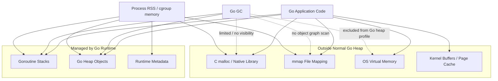
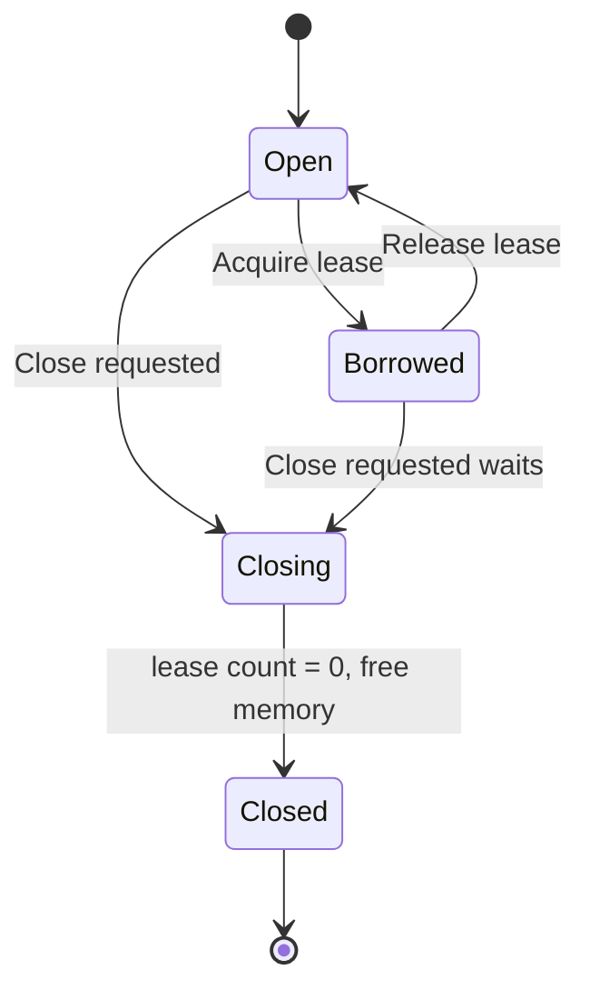
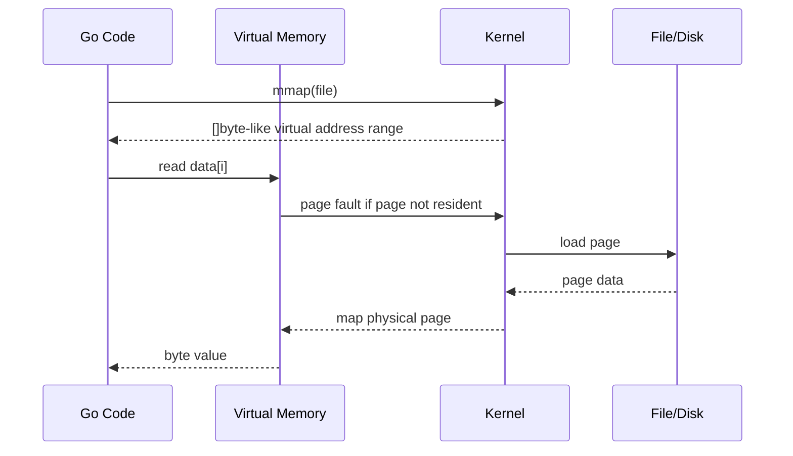
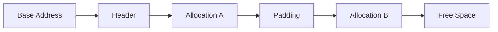
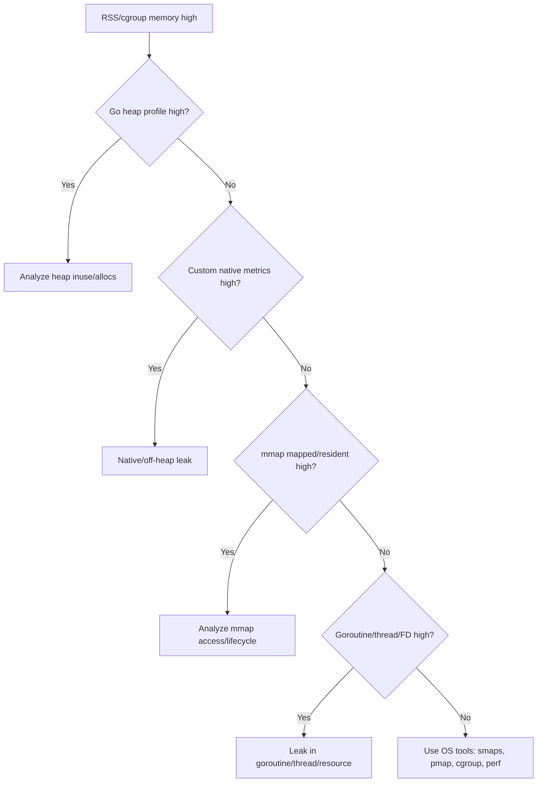

# learn-go-memory-systems-part-023.md

# Go Memory Systems — Part 023

## Off-Heap in Go: cgo, mmap, syscall memory, unmanaged memory, ownership model

> Target pembaca: Java software engineer yang ingin memahami Go memory system sampai level production engineering.
>
> Fokus part ini: memahami **off-heap/unmanaged memory** di Go secara benar: bukan sebagai trik menghindari GC, tetapi sebagai boundary berisiko tinggi yang membutuhkan model ownership, lifetime, accounting, cleanup, observability, dan failure handling yang eksplisit.

---

## 0. Posisi Part Ini dalam Series

Sebelumnya kita sudah membangun fondasi:

- value representation,
- pointer,
- stack,
- heap,
- escape analysis,
- allocator,
- slice/string/interface representation,
- byte/bit/buffer/stream,
- copy semantics,
- zero-copy,
- `unsafe` fundamentals,
- unsafe string/slice conversion.

Part ini masuk ke area yang lebih berbahaya: **memory yang tidak dikelola langsung oleh Go GC**.

Di Java, Anda mungkin mengenal:

- `ByteBuffer.allocateDirect`,
- Netty pooled direct buffer,
- JNI native memory,
- memory mapped file,
- off-heap cache,
- RocksDB native memory,
- Arrow memory allocator,
- `sun.misc.Unsafe`,
- Panama Foreign Memory API.

Di Go, tidak ada direct equivalent yang idiomatis dan universal seperti `DirectByteBuffer`. Go punya managed heap yang biasanya cukup efisien, tetapi tetap ada beberapa cara memakai memory di luar Go heap:

1. `cgo` / `C.malloc`,
2. `syscall.Mmap` atau package `golang.org/x/sys/unix`,
3. OS-specific virtual memory allocation,
4. native library yang mengelola memory sendiri,
5. memory mapped file,
6. kernel/user-space buffer integration,
7. custom byte arena berbasis Go heap yang meniru region allocation, meskipun ini bukan off-heap sejati.

Part ini akan membahas semua itu dari sudut **engineering defensibility**.

---

## 1. Premis Utama

Off-heap di Go harus dipahami dengan premis berikut:

> Off-heap memory bukan memory gratis.
> Ia hanya memindahkan sebagian tanggung jawab dari runtime Go ke engineer.

Managed heap memberikan:

- reachability tracking,
- automatic reclamation,
- pointer scanning,
- lifetime safety relatif,
- integration dengan runtime metrics,
- integration dengan GC pacing,
- sebagian observability melalui pprof.

Off-heap memberikan:

- kontrol layout tertentu,
- interoperabilitas dengan C/kernel/native library,
- potensi mengurangi GC scanning untuk byte-heavy data,
- potensi mmap file besar tanpa membaca semuanya ke Go heap,
- kemampuan berbagi memory dengan OS/native system.

Tetapi Anda kehilangan:

- automatic lifetime management,
- GC visibility,
- type safety,
- bounds safety,
- automatic zeroing guarantee yang biasa Anda dapat dari Go allocation,
- pprof heap visibility,
- portability,
- simplicity.

Kesalahan off-heap sering berubah dari “GC pressure” menjadi:

- silent memory corruption,
- SIGSEGV,
- use-after-free,
- double free,
- native memory leak,
- container OOM yang tidak muncul di Go heap profile,
- data race yang tidak tertangkap dengan mudah,
- platform-specific bug,
- observability blind spot.

---

## 2. Definisi: Managed Heap vs Off-Heap vs Unmanaged Memory

### 2.1 Managed Go Heap

Managed Go heap adalah memory yang dialokasikan oleh runtime Go untuk object Go biasa.

Contoh:

```go
b := make([]byte, 1024)
s := "hello"
m := map[string][]byte{}
t := &MyStruct{}
```

Memory ini:

- diketahui runtime,
- dapat dilacak GC,
- masuk ke Go heap accounting,
- terlihat dalam heap profile,
- subject to GC pacing,
- aman dari manual free.

### 2.2 Off-Heap / Unmanaged Memory

Dalam konteks aplikasi Go, off-heap adalah memory yang tidak dialokasikan sebagai object Go heap biasa.

Contoh:

```go
p := C.malloc(C.size_t(n))
```

atau:

```go
data, err := syscall.Mmap(fd, 0, size, syscall.PROT_READ, syscall.MAP_SHARED)
```

Memory seperti ini:

- tidak otomatis di-free oleh Go GC,
- tidak discan sebagai object graph Go,
- tidak selalu terlihat di heap profile,
- tetap berkontribusi ke RSS process,
- tetap dapat menyebabkan container OOM.

### 2.3 Runtime Internal Unmanaged Memory

Runtime Go sendiri punya konsep unmanaged memory untuk kebutuhan internal tertentu. Dokumentasi internal runtime menjelaskan bahwa runtime kadang perlu mengalokasikan object di luar garbage-collected heap, misalnya untuk bagian memory manager itu sendiri.

Untuk aplikasi, informasi ini penting sebagai sinyal: **bahkan runtime memperlakukan unmanaged memory sebagai area khusus dengan aturan ketat**.

Jangan meniru internal runtime secara sembarangan.

---

## 3. Mental Model Besar



Interpretasi:

- GC terutama memahami Go stack dan Go heap.
- RSS melihat semua resident pages process.
- Off-heap bisa membuat RSS naik tanpa heap profile naik.
- `GOMEMLIMIT` mengatur memory yang dikelola runtime, bukan semua memory eksternal.
- Native memory harus punya accounting sendiri.

---

## 4. Kenapa Off-Heap Dipakai?

Off-heap hanya layak dipertimbangkan jika ada alasan kuat.

### 4.1 Interoperabilitas dengan C atau Native Library

Contoh:

- compression library native,
- crypto library native,
- database engine native,
- image/video codec,
- ML inference library,
- OS API.

Di sini off-heap bukan optimasi, tetapi kebutuhan integrasi.

### 4.2 Memory Mapped File

Mmap memungkinkan file dipetakan ke address space process.

Berguna untuk:

- file besar,
- random access,
- read-mostly index,
- database/SSTable-style access,
- memory sharing,
- zero-copy-ish file access.

Namun mmap bukan byte slice biasa yang bebas risiko. Ia terikat pada page fault, file lifecycle, mapping lifecycle, dan OS behavior.

### 4.3 Mengurangi GC Scan untuk Data Byte-Heavy

Jika data besar adalah byte blob tanpa pointer, menyimpannya di Go heap tetap bisa manageable. Go GC tidak perlu menelusuri isi `[]byte` sebagai pointer graph, tetapi object slice/backing array tetap masuk heap accounting.

Off-heap bisa mengurangi Go heap live bytes, tetapi:

- RSS tetap naik,
- memory limit runtime tidak melihat semuanya,
- cleanup manual diperlukan,
- bug severity meningkat.

### 4.4 Layout Khusus

Kadang Anda butuh layout tertentu:

- C ABI-compatible struct,
- fixed binary layout,
- shared memory layout,
- page-aligned memory,
- huge page experiment,
- memory registered untuk hardware/library tertentu.

### 4.5 Avoiding Copy at Boundary

Saat native library mengisi buffer, mungkin lebih murah memberi pointer native buffer daripada copy ke Go heap.

Namun ini menuntut kontrak:

- siapa owner buffer,
- kapan valid,
- siapa free,
- apakah Go boleh menyimpan pointer,
- apakah C boleh menyimpan pointer,
- apakah data mutable,
- bagaimana sinkronisasi.

---

## 5. Kapan Off-Heap Tidak Layak?

Off-heap biasanya tidak layak jika motivasinya hanya:

- “GC pasti lambat”,
- “ingin performa seperti C”,
- “heap profile besar jadi pindahkan ke native”,
- “zero-copy kelihatan keren”,
- “menghindari ownership design”,
- “ingin cache besar tanpa memikirkan eviction”,
- “ingin memori tidak dihitung Go”.

Itu bukan optimasi. Itu memindahkan masalah ke tempat yang lebih gelap.

Untuk banyak service Go, strategi yang lebih baik:

- streaming,
- bounded buffer,
- reduce retention,
- reduce pointer density,
- use `[]byte` dengan ownership jelas,
- use pooling secara terbatas,
- tune `GOGC`/`GOMEMLIMIT` setelah profiling,
- redesign cache,
- split hot/cold data,
- avoid `map[string]any` di hot path,
- reduce allocation rate.

---

## 6. Off-Heap Decision Tree

```mermaid
flowchart TD
    A[Need lower memory or faster path?] --> B{Is the data actually large and retained?}
    B -- No --> C[Profile allocation/copy/retention first]
    B -- Yes --> D{Can streaming solve it?}
    D -- Yes --> E[Use Reader/Writer pipeline]
    D -- No --> F{Can Go heap byte blobs solve it?}
    F -- Yes --> G[Use []byte with ownership + pooling/bounds]
    F -- No --> H{Need native/kernel/file mapping?}
    H -- No --> I[Revisit architecture]
    H -- Yes --> J[Consider off-heap with explicit owner]
    J --> K[Add accounting, cleanup, observability, tests]
```

Rule praktis:

> Jangan memilih off-heap sebelum Anda bisa menjelaskan kenapa streaming dan Go heap bounded buffer tidak cukup.

---

## 7. Approach 1: cgo and C.malloc

### 7.1 Apa Itu cgo?

`cgo` memungkinkan Go memanggil kode C dan C memanggil kode Go dalam batas tertentu.

Contoh minimal:

```go
package nativebuf

/*
#include <stdlib.h>
*/
import "C"

import (
    "errors"
    "unsafe"
)

type Buffer struct {
    ptr unsafe.Pointer
    len int
}

func NewBuffer(n int) (*Buffer, error) {
    if n < 0 {
        return nil, errors.New("negative size")
    }
    if n == 0 {
        return &Buffer{}, nil
    }

    p := C.malloc(C.size_t(n))
    if p == nil {
        return nil, errors.New("C.malloc failed")
    }

    return &Buffer{ptr: p, len: n}, nil
}

func (b *Buffer) Close() error {
    if b == nil || b.ptr == nil {
        return nil
    }
    C.free(b.ptr)
    b.ptr = nil
    b.len = 0
    return nil
}
```

Ini terlihat sederhana, tetapi belum production-grade.

Masalah yang belum diselesaikan:

- use-after-close,
- double close,
- slice view masih hidup setelah close,
- concurrent close/read,
- memory accounting,
- finalizer safety net,
- bounds check,
- pointer lifetime,
- panic safety,
- leak detection.

### 7.2 Membuat Slice View dari C Memory

```go
func (b *Buffer) Bytes() []byte {
    if b == nil || b.ptr == nil || b.len == 0 {
        return nil
    }
    return unsafe.Slice((*byte)(b.ptr), b.len)
}
```

Kontraknya berat:

- slice ini bukan owner;
- slice valid hanya selama `Buffer` belum `Close`;
- caller tidak boleh menyimpan slice setelah owner dilepas;
- caller tidak boleh memakai slice secara concurrent dengan `Close`;
- GC tidak tahu bahwa slice ini harus menjaga C memory, karena C memory bukan Go object;
- `Buffer` object Go harus tetap hidup selama slice dipakai.

### 7.3 runtime.KeepAlive

Kadang Anda perlu menjaga Go owner tetap live sampai operasi selesai.

```go
func (b *Buffer) ReadAt(i int) byte {
    if i < 0 || i >= b.len {
        panic("out of bounds")
    }
    bs := unsafe.Slice((*byte)(b.ptr), b.len)
    v := bs[i]
    runtime.KeepAlive(b)
    return v
}
```

`runtime.KeepAlive(b)` memberi sinyal bahwa `b` harus dianggap live sampai titik itu. Ini penting ketika finalizer atau native resource dapat dilepas jika object owner dianggap tidak reachable terlalu cepat.

Namun `KeepAlive` bukan pengganti ownership yang baik. Ia hanya tool lifetime di boundary berbahaya.

---

## 8. cgo Pointer Passing Rules

cgo pointer rules adalah bagian paling penting untuk integrasi Go-C.

Secara garis besar:

- Go pointer adalah pointer ke memory yang dialokasikan oleh Go.
- C pointer adalah pointer ke memory yang dialokasikan C/native.
- Go boleh memanggil C dengan pointer tertentu, tetapi ada pembatasan agar GC tetap aman.
- C tidak boleh sembarangan menyimpan Go pointer setelah call selesai.
- Go value yang mengandung Go pointer tidak boleh sembarang ditaruh di C memory.

Dokumentasi `cmd/cgo` menjelaskan aturan pointer passing dan juga menyediakan `runtime/cgo.Handle` untuk melewatkan Go value melalui C sebagai handle integer tanpa melanggar aturan pointer passing.

### 8.1 Wrong Mental Model

Salah:

```text
Go pointer adalah address biasa, jadi C boleh menyimpannya kapan pun.
```

Benar:

```text
Go pointer adalah bagian dari managed runtime. Menyimpannya di C memory bisa membuat GC tidak tahu bahwa object masih dibutuhkan atau membuat invariant pointer passing rusak.
```

### 8.2 Bad Pattern: C Menyimpan Go Pointer

```go
// Pseudocode buruk.
b := make([]byte, 1024)
C.store_pointer(unsafe.Pointer(&b[0])) // jika C menyimpan setelah call, ini bermasalah
```

Masalah:

- Go object lifetime dikontrol GC.
- C menyimpan pointer yang tidak terlihat sebagai root Go biasa.
- Jika object tidak lagi dianggap live oleh Go, future access dari C berbahaya.
- Aturan cgo dapat dilanggar.

### 8.3 Better Pattern: C Owns C Memory

```go
p := C.malloc(C.size_t(n))
if p == nil {
    return errors.New("malloc failed")
}
defer C.free(p)

C.fill_buffer((*C.char)(p), C.size_t(n))
```

Jika C harus menyimpan pointer jangka panjang, gunakan memory yang C kelola, bukan pointer ke Go heap.

### 8.4 Callback Pattern dengan runtime/cgo.Handle

Jika C perlu membawa identitas Go object, jangan simpan Go pointer langsung di C. Gunakan handle.

```go
package callback

/*
#include <stdint.h>

extern void goCallback(uintptr_t h);
*/
import "C"

import "runtime/cgo"

type State struct {
    Name string
}

func Register(s *State) uintptr {
    h := cgo.NewHandle(s)
    return uintptr(h)
}

func Release(h uintptr) {
    cgo.Handle(h).Delete()
}

//export goCallback
func goCallback(h C.uintptr_t) {
    v := cgo.Handle(h).Value().(*State)
    _ = v.Name
}
```

Kontrak:

- `NewHandle` membuat Go value tetap reachable melalui registry runtime.
- `Delete` wajib dipanggil untuk menghindari leak.
- C hanya membawa integer handle, bukan Go pointer.

---

## 9. Ownership Model untuk Off-Heap

Off-heap harus punya owner eksplisit.

### 9.1 Pertanyaan Ownership

Untuk setiap off-heap buffer, jawab:

1. Siapa yang allocate?
2. Siapa yang free?
3. Kapan memory valid?
4. Apakah memory mutable?
5. Apakah view boleh disimpan?
6. Apakah view boleh dipakai concurrent?
7. Apakah C boleh menyimpan pointer?
8. Apakah Go boleh menyimpan pointer ke memory itu?
9. Apakah memory mengandung Go pointer?
10. Bagaimana accounting memory dilakukan?
11. Bagaimana leak dideteksi?
12. Bagaimana close idempotent?
13. Apa yang terjadi jika close saat view masih dipakai?
14. Apa invariant saat panic?
15. Apa observability-nya?

### 9.2 Borrowed vs Owned

Gunakan bahasa kontrak yang jelas.

```text
Owned buffer:
- caller bertanggung jawab Close/Free.
- data valid sampai Close.

Borrowed view:
- tidak boleh disimpan setelah callback/operation selesai.
- tidak boleh dipakai setelah owner release.
- tidak boleh di-free oleh borrower.

Copied data:
- caller memiliki copy aman.
- lifecycle terpisah dari native memory.
```

### 9.3 Diagram Ownership

```mermaid
flowchart LR
    Owner[Owner Object]
    Native[Native Memory]
    View1[Borrowed []byte View]
    View2[Copied []byte]

    Owner -- owns/free --> Native
    View1 -- points to, no ownership --> Native
    Native -- copy --> View2
    View2 -- owned by Go heap --> GC[Go GC]
```

---

## 10. Production-Grade Native Buffer Wrapper

Berikut pattern yang lebih defensif.

```go
package nativebuf

/*
#include <stdlib.h>
#include <string.h>
*/
import "C"

import (
    "errors"
    "fmt"
    "runtime"
    "sync"
    "sync/atomic"
    "unsafe"
)

var ErrClosed = errors.New("native buffer is closed")

type Buffer struct {
    mu     sync.RWMutex
    ptr    unsafe.Pointer
    len    int
    closed atomic.Bool
}

func New(n int) (*Buffer, error) {
    if n < 0 {
        return nil, fmt.Errorf("negative size: %d", n)
    }

    b := &Buffer{len: n}
    if n > 0 {
        p := C.malloc(C.size_t(n))
        if p == nil {
            return nil, errors.New("C.malloc failed")
        }
        b.ptr = p
    }

    runtime.SetFinalizer(b, (*Buffer).finalize)
    return b, nil
}

func (b *Buffer) Len() int {
    if b == nil {
        return 0
    }
    b.mu.RLock()
    defer b.mu.RUnlock()
    return b.len
}

func (b *Buffer) WithBytes(fn func([]byte) error) error {
    if b == nil {
        return ErrClosed
    }

    b.mu.RLock()
    defer b.mu.RUnlock()

    if b.closed.Load() || b.ptr == nil && b.len != 0 {
        return ErrClosed
    }

    var view []byte
    if b.len > 0 {
        view = unsafe.Slice((*byte)(b.ptr), b.len)
    }

    err := fn(view)
    runtime.KeepAlive(b)
    return err
}

func (b *Buffer) Close() error {
    if b == nil {
        return nil
    }

    b.mu.Lock()
    defer b.mu.Unlock()

    if b.closed.Swap(true) {
        return nil
    }

    runtime.SetFinalizer(b, nil)

    if b.ptr != nil {
        C.free(b.ptr)
        b.ptr = nil
    }
    b.len = 0
    return nil
}

func (b *Buffer) finalize() {
    // Safety net only. Do not rely on this for deterministic cleanup.
    _ = b.Close()
}
```

### 10.1 Kenapa API `WithBytes` Lebih Aman daripada `Bytes()`?

`Bytes()` mengembalikan borrowed view yang bisa disimpan sembarangan.

```go
view := b.Bytes()
b.Close()
fmt.Println(view[0]) // use-after-free
```

`WithBytes` membatasi lifetime view ke callback.

```go
err := b.WithBytes(func(p []byte) error {
    // p hanya valid di dalam callback ini.
    return process(p)
})
```

Ini bukan jaminan sempurna, karena caller masih bisa menyimpan `p` di luar callback jika jahat/ceroboh.

Tetapi API shape membuat kontrak lebih jelas.

### 10.2 Finalizer sebagai Safety Net

Finalizer tidak deterministic.

Jangan desain:

```text
Resource akan otomatis free saat tidak dipakai.
```

Desain yang benar:

```text
Close wajib dipanggil. Finalizer hanya safety net untuk leak yang lolos.
```

### 10.3 Locking Model

Wrapper di atas memakai `RWMutex` untuk mencegah close bersamaan dengan view callback.

Trade-off:

- lebih aman,
- ada overhead lock,
- tidak cocok untuk hot path ultra-low-latency tanpa desain lebih ketat.

Untuk hot path, bisa pakai refcount, epoch, lease, atau single-owner discipline.

---

## 11. Refcount / Lease Model

Jika borrowed view bisa hidup lintas function, callback tidak cukup. Anda butuh lease.



Simplified design:

```go
type Lease struct {
    owner *Region
    data  []byte
    once  sync.Once
}

func (l *Lease) Bytes() []byte { return l.data }

func (l *Lease) Release() {
    l.once.Do(func() {
        l.data = nil
        l.owner.release()
        l.owner = nil
    })
}
```

Invariants:

- setiap acquire harus release,
- close menunggu lease habis atau gagal jika masih ada lease,
- view tidak boleh dipakai setelah release,
- leak lease adalah leak resource.

Ini mendekati model manual memory management. Kompleksitasnya tinggi.

---

## 12. Approach 2: mmap

### 12.1 Apa Itu mmap?

Memory mapping memetakan file atau anonymous memory ke virtual address space process.

Di Go, Anda bisa memakai:

- `syscall.Mmap` di beberapa platform,
- `golang.org/x/sys/unix.Mmap`,
- library wrapper seperti `edsrzf/mmap-go` atau lainnya jika Anda memilih dependency.

Contoh low-level:

```go
f, err := os.Open("data.bin")
if err != nil {
    return err
}
defer f.Close()

st, err := f.Stat()
if err != nil {
    return err
}

size := int(st.Size())
if size == 0 {
    return nil
}

data, err := syscall.Mmap(int(f.Fd()), 0, size, syscall.PROT_READ, syscall.MAP_SHARED)
if err != nil {
    return err
}
defer syscall.Munmap(data)

// data is []byte view over mapped memory.
_ = data[0]
```

### 12.2 mmap Bukan Go Heap

`data` adalah `[]byte`, tetapi backing storage-nya bukan Go heap allocation biasa.

Konsekuensi:

- heap profile tidak menunjukkan seluruh mapped file sebagai heap allocation,
- RSS bisa naik saat pages disentuh,
- page faults bisa menyebabkan latency spikes,
- unmap saat slice masih dipakai bisa crash,
- file truncation saat mapping aktif bisa menyebabkan signal/error platform-specific,
- write mapping punya crash consistency problem.

### 12.3 mmap Mental Model



Latency penting:

- access pertama ke page bisa page fault,
- random access file besar bisa banyak page fault,
- sequential access bisa dibantu readahead,
- memory pressure bisa evict pages,
- RSS bisa berubah dinamis.

### 12.4 Kapan mmap Cocok?

Cocok untuk:

- read-only large file index,
- immutable segment file,
- SSTable-style lookup,
- random access large data,
- sharing OS page cache across processes,
- avoiding `ReadFile` ke heap.

Kurang cocok untuk:

- small files,
- simple sequential streaming,
- highly mutable data tanpa crash protocol,
- data yang perlu portability tinggi,
- environment dengan strict RSS/cgroup limit tanpa accounting,
- file yang sering truncate/replace saat mapping dipakai.

### 12.5 mmap vs Streaming

| Concern | Streaming | mmap |
|---|---|---|
| Sequential large file | bagus | bisa bagus tapi tidak selalu perlu |
| Random access | kurang ideal | bagus |
| Heap usage | bounded | low Go heap |
| RSS predictability | lebih mudah | lebih sulit |
| Page fault latency | lebih eksplisit via read | implicit saat access |
| Cleanup | close file/reader | munmap wajib |
| Crash consistency write | biasa via write/fsync/rename | kompleks |
| Portability | lebih baik | lebih OS-specific |

---

## 13. Approach 3: OS Virtual Memory Allocation

Selain C malloc dan mmap file, ada anonymous mapping atau OS-level allocation.

Contoh pada Unix-like:

```go
data, err := syscall.Mmap(
    -1,
    0,
    size,
    syscall.PROT_READ|syscall.PROT_WRITE,
    syscall.MAP_ANON|syscall.MAP_PRIVATE,
)
if err != nil {
    return err
}
defer syscall.Munmap(data)
```

Ini memberi memory page-backed yang bukan Go heap biasa.

Gunanya:

- page-aligned buffer,
- custom arena,
- large native buffer,
- experimenting with guard pages,
- shared memory variants.

Risiko:

- OS-specific flag,
- manual unmap,
- RSS accounting manual,
- no automatic GC cleanup,
- no pointer scanning,
- SIGSEGV jika salah akses setelah unmap.

---

## 14. Off-Heap Tidak Boleh Menyimpan Go Pointer Sembarangan

Ini invariant besar:

> Jangan menyimpan Go pointer di memory yang tidak discan GC kecuali Anda benar-benar memahami aturan runtime/cgo dan punya mekanisme root yang benar.

Contoh buruk:

```go
type Node struct {
    next *Node
    key  []byte
}

// Jangan serialize pointer Go mentah ke mmap/off-heap dan berharap GC paham.
```

Jika off-heap memory menyimpan address object Go:

- GC tidak otomatis menelusuri memory off-heap sebagai pointer root,
- object bisa dianggap mati,
- pointer bisa menjadi dangling dari perspektif C/off-heap,
- aturan cgo dapat dilanggar.

Go saat ini memakai non-moving GC, tetapi jangan menjadikan itu alasan menyimpan Go pointer sembarangan di luar heap. Masalahnya bukan hanya moving vs non-moving; masalahnya adalah **visibility, lifetime, root, dan invariant runtime**.

### 14.1 Simpan Offset, Bukan Pointer

Untuk off-heap data structure, gunakan offset.

```text
base pointer + offset -> address
```

Bukan:

```text
raw Go pointer to Go object
```

Contoh conceptual:

```go
type Arena struct {
    data []byte // bisa mmap/native memory view
}

type NodeRef uint32 // offset dari base
```

Keuntungan offset:

- portable dalam file/mmap,
- bisa divalidasi bounds,
- tidak bergantung pada address process,
- tidak membuat GC invariant rusak,
- cocok untuk serialization.

---

## 15. Designing an Off-Heap Arena

### 15.1 Simple Bump Allocator on mmap/Native Memory

```go
type Arena struct {
    mu   sync.Mutex
    data []byte
    off  int
}

func (a *Arena) Alloc(n, align int) (int, error) {
    if n < 0 || align <= 0 || align&(align-1) != 0 {
        return 0, errors.New("invalid allocation")
    }

    a.mu.Lock()
    defer a.mu.Unlock()

    start := alignUp(a.off, align)
    end := start + n
    if end < start || end > len(a.data) {
        return 0, errors.New("arena out of memory")
    }
    a.off = end
    return start, nil
}

func alignUp(x, align int) int {
    return (x + align - 1) &^ (align - 1)
}
```

### 15.2 Offset-Based Access

```go
func (a *Arena) Bytes(off, n int) ([]byte, error) {
    if off < 0 || n < 0 || off+n < off || off+n > len(a.data) {
        return nil, errors.New("out of bounds")
    }
    return a.data[off : off+n], nil
}
```

### 15.3 Invariants

Arena harus punya invariant:

- allocation monotonik atau free-list tervalidasi,
- no overlapping active allocation,
- offset always bounds-checked,
- alignment explicit,
- no Go pointers stored in arena,
- close/unmap invalidates all views,
- access after close rejected jika wrapper bisa mendeteksi,
- accounting updated exactly once,
- format versioned jika persisted.

### 15.4 Mermaid Layout



---

## 16. Memory Accounting

Off-heap tanpa accounting adalah operational risk.

### 16.1 Apa yang Harus Dihitung?

Minimal:

- bytes allocated,
- bytes freed,
- current live native bytes,
- peak native bytes,
- allocation count,
- free count,
- failed allocation count,
- mmap mapped bytes,
- munmap count,
- open native buffers,
- outstanding leases/views,
- per-component ownership.

### 16.2 Simple Accounting

```go
type NativeStats struct {
    LiveBytes      atomic.Int64
    PeakBytes      atomic.Int64
    AllocCount     atomic.Int64
    FreeCount      atomic.Int64
    FailedAllocs   atomic.Int64
    OpenBuffers    atomic.Int64
}

func (s *NativeStats) addAlloc(n int64) {
    live := s.LiveBytes.Add(n)
    s.AllocCount.Add(1)
    s.OpenBuffers.Add(1)

    for {
        peak := s.PeakBytes.Load()
        if live <= peak || s.PeakBytes.CompareAndSwap(peak, live) {
            return
        }
    }
}

func (s *NativeStats) addFree(n int64) {
    s.LiveBytes.Add(-n)
    s.FreeCount.Add(1)
    s.OpenBuffers.Add(-1)
}
```

### 16.3 GOMEMLIMIT Caveat

`GOMEMLIMIT` / runtime memory limit mencakup memory yang dikelola runtime Go, tetapi mengecualikan sumber eksternal seperti memory yang dikelola bahasa lain, mapping binary, atau memory yang dipegang OS atas nama program.

Konsekuensi:

- Anda tidak bisa hanya mengandalkan `GOMEMLIMIT` untuk native memory.
- Native memory harus punya limit sendiri.
- Di Kubernetes, container limit melihat RSS/cgroup total, bukan hanya Go heap.

### 16.4 Budget Formula

Untuk service dengan container limit:

```text
container_limit
  >= Go runtime memory
   + native/off-heap memory
   + mmap resident pages
   + thread stacks
   + binary/shared library mappings
   + page cache effects
   + allocator fragmentation
   + safety headroom
```

Jangan set `GOMEMLIMIT` sama dengan container limit jika Anda punya native/mmap memory besar.

Lebih aman:

```text
GOMEMLIMIT = container_limit - native_budget - mmap_rss_budget - OS_headroom
```

---

## 17. Observability: Kenapa Heap Profile Tidak Cukup

Jika RSS naik tetapi heap profile tidak naik, kemungkinan:

- mmap pages resident,
- C malloc/native library memory,
- cgo allocations,
- OS page cache/accounting,
- goroutine stacks,
- runtime metadata,
- fragmentation,
- binary/shared library mapping,
- thread stacks dari C library.

### 17.1 Minimal Dashboard

Untuk service yang memakai off-heap, dashboard harus punya:

- Go heap live,
- Go heap sys,
- Go heap released,
- RSS,
- cgroup memory usage,
- native live bytes custom metric,
- mmap mapped bytes custom metric,
- open native buffer count,
- outstanding lease count,
- allocation/free rate,
- GC CPU,
- GC cycle count,
- OOMKill count,
- page fault metrics jika tersedia,
- file descriptor count.

### 17.2 Diagnostic Flow



---

## 18. Cleanup Design

### 18.1 Explicit Close

Every owner must support explicit close.

```go
type Resource interface {
    Close() error
}
```

Invariants:

- Close idempotent,
- Close releases exactly once,
- Close blocks or fails if borrowed views exist,
- Close clears pointer/len,
- Close removes finalizer,
- Close updates accounting,
- Close is safe under panic path via `defer`.

### 18.2 Idempotency

```go
func (b *Buffer) Close() error {
    if b.closed.Swap(true) {
        return nil
    }
    // release once
    return nil
}
```

### 18.3 Error Semantics

Close errors matter for file-backed mappings or flush operations.

Patterns:

- read-only native buffer close: usually no meaningful error;
- mmap unmap: error possible;
- file sync before unmap: error significant;
- C library release: may return status.

### 18.4 Finalizer Warning

Finalizer can be delayed indefinitely and may not run before process exit.

Use finalizer only for:

- debug leak detection,
- safety net,
- panic/log in tests,
- freeing as last resort.

Do not use finalizer for:

- transaction commit,
- lock release,
- file flush correctness,
- business cleanup,
- predictable memory budget.

---

## 19. Failure Modes

### 19.1 Native Memory Leak

Symptom:

- RSS grows,
- Go heap profile stable,
- GC not helping,
- container OOMKill.

Cause:

- missing `C.free`,
- missing `Munmap`,
- missing `Handle.Delete`,
- native library allocation not released,
- finalizer relied upon but not running fast enough.

Mitigation:

- explicit ownership,
- custom native memory metrics,
- tests with allocation/free count,
- fail-fast budget,
- leak detector in integration tests.

### 19.2 Use-After-Free

Symptom:

- random data corruption,
- panic from invalid memory,
- SIGSEGV,
- flaky tests,
- production-only crash.

Cause:

- borrowed slice stored after close,
- concurrent close while read,
- native library retained pointer after owner freed.

Mitigation:

- callback/lease API,
- close synchronization,
- poison memory in debug builds,
- avoid exposing raw pointer/slice broadly.

### 19.3 Double Free

Symptom:

- allocator corruption,
- crash during free,
- later unrelated crash.

Cause:

- multiple owners,
- copying owner struct by value,
- close not idempotent,
- finalizer + explicit close both freeing without guard.

Mitigation:

- non-copyable owner pattern,
- `sync.Once` or atomic closed state,
- set pointer nil after free,
- disable finalizer before explicit free.

### 19.4 Storing Go Pointer in C Memory

Symptom:

- cgo runtime check failure,
- subtle GC bug,
- future runtime incompatibility,
- memory corruption.

Mitigation:

- use `runtime/cgo.Handle`,
- use offsets/IDs,
- keep Go object rooted in Go structures,
- obey cgo pointer passing rules.

### 19.5 GOMEMLIMIT Misconfiguration

Symptom:

- Go heap looks under limit,
- process still OOMKilled,
- GC CPU high but native memory dominates.

Cause:

- `GOMEMLIMIT` set near container limit while native/mmap memory not budgeted.

Mitigation:

- subtract native budget from runtime limit,
- add native limiter,
- expose RSS/cgroup metrics.

---

## 20. Native Memory Limiter

A production off-heap layer should have a limiter.

```go
type Limiter struct {
    limit int64
    used  atomic.Int64
}

func NewLimiter(limit int64) *Limiter {
    return &Limiter{limit: limit}
}

func (l *Limiter) TryAcquire(n int64) bool {
    if n < 0 {
        return false
    }
    for {
        cur := l.used.Load()
        next := cur + n
        if next < cur || next > l.limit {
            return false
        }
        if l.used.CompareAndSwap(cur, next) {
            return true
        }
    }
}

func (l *Limiter) Release(n int64) {
    if n <= 0 {
        return
    }
    l.used.Add(-n)
}

func (l *Limiter) Used() int64 {
    return l.used.Load()
}
```

Allocation flow:

```go
if !limiter.TryAcquire(int64(n)) {
    return nil, ErrNativeLimitExceeded
}

p := C.malloc(C.size_t(n))
if p == nil {
    limiter.Release(int64(n))
    return nil, ErrMallocFailed
}
```

Free flow:

```go
C.free(p)
limiter.Release(int64(n))
```

Invariant:

> Acquire and release must match exactly once per successful allocation.

---

## 21. Alignment and Layout

Native memory often requires alignment.

Examples:

- C struct alignment,
- SIMD library,
- atomic access,
- page alignment,
- file format compatibility.

Go `unsafe.Alignof` helps for Go types, tetapi C layout tidak selalu sama dengan Go layout kecuali Anda sangat berhati-hati dengan ABI/platform.

### 21.1 Avoid Struct Overlay by Default

Tempting:

```go
type Header struct {
    Magic uint32
    Size  uint32
}

h := (*Header)(unsafe.Pointer(&data[0]))
```

Risiko:

- alignment,
- endian,
- padding,
- platform-dependent layout,
- bounds,
- future versioning.

Safer:

```go
magic := binary.BigEndian.Uint32(data[0:4])
size := binary.BigEndian.Uint32(data[4:8])
```

Untuk persisted format, prefer explicit byte encoding.

---

## 22. Off-Heap and GC Cost

### 22.1 Apa yang Berkurang?

Jika Anda memindahkan large byte blobs ke off-heap:

- Go heap live bytes bisa turun,
- heap growth pressure bisa turun,
- object count bisa turun,
- GC accounting untuk heap bisa turun.

### 22.2 Apa yang Tidak Hilang?

- RSS tetap ada,
- allocation/free cost native tetap ada,
- memory bandwidth tetap ada,
- cache pressure tetap ada,
- page faults tetap ada,
- ownership complexity naik,
- observability lebih sulit.

### 22.3 Pointer-Free Go Heap Bisa Cukup Baik

Jangan lupa: `[]byte` backing array tidak berisi pointer. GC tidak menelusuri setiap byte sebagai pointer. Untuk banyak kasus, menyimpan byte besar di Go heap dengan lifecycle jelas lebih aman daripada off-heap.

Masalah Go heap sering bukan byte blob itu sendiri, tetapi:

- terlalu banyak object kecil,
- retention backing array karena subslice,
- unbounded cache,
- goroutine/channel leak,
- interface/reflection allocation,
- map yang tidak dibersihkan,
- poor streaming design.

---

## 23. Off-Heap API Design Patterns

### 23.1 Safe Default: Copy Out

```go
func (b *Buffer) CopyBytes() ([]byte, error) {
    var out []byte
    err := b.WithBytes(func(p []byte) error {
        out = append([]byte(nil), p...)
        return nil
    })
    return out, err
}
```

Good for:

- external API,
- untrusted caller,
- long-lived data,
- logging,
- async processing.

### 23.2 Advanced: Borrowed Callback

```go
func (b *Buffer) WithBytes(fn func([]byte) error) error
```

Good for:

- parsing,
- hashing,
- immediate write,
- bounded synchronous use.

### 23.3 Dangerous: Raw Pointer

```go
func (b *Buffer) Pointer() unsafe.Pointer
```

Only expose inside internal package or FFI boundary.

### 23.4 Lease for Longer Work

```go
lease, err := region.Acquire(off, n)
if err != nil { return err }
defer lease.Release()
process(lease.Bytes())
```

Good for:

- asynchronous but bounded processing,
- zero-copy pipeline with explicit lifecycle.

But complexity rises.

---

## 24. Package Boundary Strategy

Recommended package structure:

```text
internal/nativebuf/
  buffer.go        // safe owner API
  limiter.go       // memory budget
  stats.go         // metrics
  cgo_unix.go      // C malloc / free
  mmap_unix.go     // mmap implementation
  mmap_windows.go  // windows equivalent or unsupported
  debug.go         // leak checks / poisoning under build tag
```

Expose safe public API:

```go
type Blob interface {
    Len() int
    WithBytes(func([]byte) error) error
    CopyBytes() ([]byte, error)
    Close() error
}
```

Do not expose:

- raw `unsafe.Pointer`,
- arbitrary `uintptr`,
- mutable borrowed slice without lifetime contract,
- C allocation details,
- platform-specific handles.

---

## 25. Debugging Techniques

### 25.1 Go-Level

Use:

```bash
go test -race ./...
go test -run TestName -count=1000 ./...
go test -fuzz=Fuzz ./...
go test -bench . -benchmem ./...
```

Caveat:

- race detector may not see all native memory races,
- heap profile may not see native memory,
- fuzzing can expose bounds/lifetime bugs if API is testable.

### 25.2 OS-Level

Depending on OS:

- `pmap`,
- `/proc/<pid>/smaps`,
- `/proc/<pid>/status`,
- `vmmap` on macOS,
- cgroup memory files,
- `perf`,
- `strace`,
- `lsof`,
- native allocator tools,
- ASAN/MSAN/TSAN where applicable with cgo/native build.

### 25.3 Application-Level

Add:

- allocation IDs in debug build,
- stack trace on allocation in tests,
- outstanding allocation map under build tag,
- poison freed memory,
- canary bytes,
- bounds check wrapper,
- close leak detector.

---

## 26. Testing Off-Heap Code

### 26.1 Unit Tests

Test:

- allocate zero,
- allocate small,
- allocate large,
- allocation failure,
- close twice,
- use after close returns error,
- callback cannot run after close,
- limiter acquire/release exact,
- metrics correct,
- finalizer disabled after close,
- invalid offset rejected,
- alignment correct.

### 26.2 Concurrency Tests

Test:

- concurrent reads,
- read while close,
- close while lease active,
- double release lease,
- acquire after close,
- limiter under high concurrency.

### 26.3 Fuzz Tests

Fuzz:

- offsets,
- sizes,
- binary header parsing,
- frame lengths,
- alignment values,
- corrupted mmap data,
- truncated file.

### 26.4 Fault Injection

Inject:

- malloc failure,
- mmap failure,
- munmap failure,
- partial file write,
- file truncate during read,
- context cancellation,
- panic inside callback.

---

## 27. Mini Lab 1: Native Buffer Wrapper

Goal:

- implement `NativeBuffer`,
- explicit `Close`,
- `WithBytes`,
- memory limiter,
- stats,
- tests for double close and use-after-close.

Expected API:

```go
type NativeBuffer struct { /* ... */ }

func NewNativeBuffer(n int, limiter *Limiter, stats *Stats) (*NativeBuffer, error)
func (b *NativeBuffer) WithBytes(func([]byte) error) error
func (b *NativeBuffer) CopyBytes() ([]byte, error)
func (b *NativeBuffer) Close() error
```

Acceptance criteria:

- no raw pointer escapes public package,
- close idempotent,
- limiter accurate,
- stats accurate,
- callback protected from concurrent close,
- `go test -race` passes for Go-side synchronization.

---

## 28. Mini Lab 2: mmap Read-Only Segment

Goal:

- map read-only file,
- parse header with `encoding/binary`,
- expose `Lookup(offset, len)` as borrowed callback,
- unmap safely,
- reject access after close.

Do not:

- overlay struct directly,
- mutate read-only mapping,
- return raw slice without lifetime warning,
- ignore `Munmap`.

---

## 29. Mini Lab 3: RSS vs Heap Experiment

Experiment:

1. allocate 512 MiB using `make([]byte, n)`,
2. observe heap profile and RSS,
3. allocate 512 MiB using mmap anonymous memory,
4. touch every page,
5. observe heap profile and RSS,
6. unmap,
7. observe RSS change.

Expected learning:

- heap profile and RSS are different lenses,
- mmap may not show as Go heap,
- RSS changes when pages are resident,
- unmap is explicit cleanup,
- GC does not free mmap memory.

---

## 30. Production Review Checklist

Before approving off-heap code, require clear answers.

### 30.1 Necessity

- [ ] Why is Go heap insufficient?
- [ ] Was streaming considered?
- [ ] Was bounded `[]byte` considered?
- [ ] Was retention fixed first?
- [ ] Was allocation profile measured?
- [ ] Is native/kernel/file interop truly required?

### 30.2 Ownership

- [ ] Who allocates?
- [ ] Who frees?
- [ ] Is close idempotent?
- [ ] Is owner non-copyable or copy-safe?
- [ ] Are borrowed views documented?
- [ ] Can views outlive owner?
- [ ] Is concurrent close handled?
- [ ] Is finalizer only safety net?

### 30.3 Pointer Safety

- [ ] Are cgo pointer rules followed?
- [ ] Are Go pointers stored in C/off-heap memory? If yes, why is it valid?
- [ ] Is `runtime/cgo.Handle` used where appropriate?
- [ ] Is `runtime.KeepAlive` used at dangerous boundary?
- [ ] Are raw pointers hidden in internal package?

### 30.4 Memory Accounting

- [ ] Are native bytes tracked?
- [ ] Is there a native memory limit?
- [ ] Is `GOMEMLIMIT` adjusted for native budget?
- [ ] Are mapped bytes tracked?
- [ ] Are outstanding leases tracked?
- [ ] Are metrics exported?

### 30.5 Safety and Testing

- [ ] Race tests pass for Go-side code?
- [ ] Fuzz tests cover offsets/sizes?
- [ ] Fault injection exists?
- [ ] Double free tested?
- [ ] Use-after-close tested?
- [ ] Close during callback tested?
- [ ] Platform-specific behavior tested?

### 30.6 Operations

- [ ] RSS dashboard exists?
- [ ] cgroup memory dashboard exists?
- [ ] Native memory metrics exist?
- [ ] Alerting exists for native memory growth?
- [ ] Incident playbook exists?
- [ ] Leak detection mode exists?

---

## 31. Common Anti-Patterns

### Anti-Pattern 1: “Move It Off-Heap to Fix GC”

If you do not understand why GC is costly, off-heap may only hide the metric.

Better:

- profile allocation rate,
- inspect retention,
- reduce pointer density,
- stream,
- bound caches.

### Anti-Pattern 2: Returning Native Slice Freely

```go
func (b *Buffer) Bytes() []byte
```

This invites use-after-free.

Prefer:

```go
func (b *Buffer) WithBytes(func([]byte) error) error
```

or copy.

### Anti-Pattern 3: Finalizer as Primary Cleanup

Finalizer is not deterministic.

Explicit close required.

### Anti-Pattern 4: No Native Memory Metrics

If pprof cannot see it and you do not export custom metrics, operations is blind.

### Anti-Pattern 5: Storing Go Pointer in mmap

Persisted/off-heap data should store offsets/IDs, not process-local Go pointers.

### Anti-Pattern 6: mmap Everything

Mmap is not automatically faster.

For simple sequential processing, streaming is often simpler, more predictable, and safer.

### Anti-Pattern 7: Struct Overlay for File Format

Use explicit binary encoding for persisted formats.

### Anti-Pattern 8: Ignoring Container Limit

Native memory still counts toward process/cgroup memory.

---

## 32. Java Engineer Translation Table

| Java Concept | Go Equivalent / Analogy | Important Difference |
|---|---|---|
| Java heap | Go heap | Go object model and GC behavior differ |
| DirectByteBuffer | mmap/C malloc wrapper | No standard direct buffer abstraction with same semantics |
| JNI native memory | cgo/native memory | cgo pointer rules are strict |
| Cleaner/finalizer | finalizer / explicit Close | finalizer not deterministic; Close preferred |
| Netty ByteBuf refcount | custom lease/refcount | Must implement carefully yourself |
| ByteBuffer slice | borrowed `[]byte` view | Lifetime must be documented manually |
| Unsafe memory | `unsafe.Pointer` + native/mmap | Outside Go compatibility safety |
| Native memory leak | C malloc/mmap leak | pprof heap may not show it |
| JVM max heap | `GOMEMLIMIT` roughly runtime memory limit | External memory excluded; container still sees RSS |

---

## 33. Capstone Design: Off-Heap Read-Only Index

Scenario:

- You have a 5 GiB immutable index file.
- Service needs random lookup.
- Loading into Go heap would exceed budget.
- Streaming per lookup is too slow.
- mmap read-only may be justified.

Design:

```text
IndexFile
  - header
  - directory section
  - data section
  - checksum/footer

Go wrapper
  - mmap read-only
  - parse header safely
  - validate version/checksum
  - expose Lookup(key) with copied value or borrowed callback
  - munmap on Close
  - metrics: mapped bytes, lookups, page faults if available
```

API:

```go
type Index struct { /* mmap owner */ }

func OpenIndex(path string) (*Index, error)
func (idx *Index) LookupCopy(key []byte) ([]byte, bool, error)
func (idx *Index) LookupView(key []byte, fn func([]byte) error) (bool, error)
func (idx *Index) Close() error
```

Rules:

- default API copies,
- advanced API borrows inside callback,
- no raw slice escapes without warning,
- close blocks while lookup callback active or uses RW lock,
- mapping is read-only,
- file replacement uses new file + new mapping, old mapping closed after readers drain.

---

## 34. Incident Playbook

### Case: Container OOM, Heap Profile Normal

Steps:

1. Check cgroup memory/RSS.
2. Check Go heap inuse.
3. Check `/memory/classes/*` runtime metrics.
4. Check custom native memory metric.
5. Check mmap mapped bytes.
6. Check FD count.
7. Check goroutine count.
8. Check `/proc/<pid>/smaps` or equivalent.
9. Correlate with traffic path that allocates native/mmap memory.
10. Disable/limit offending path.
11. Lower native budget or add backpressure.
12. Recalculate `GOMEMLIMIT` with native headroom.

### Case: Random SIGSEGV

Steps:

1. Identify recent unsafe/off-heap change.
2. Check use-after-close possibilities.
3. Check concurrent close/read.
4. Check slice view stored after callback.
5. Check double free.
6. Check cgo pointer rule violations.
7. Run stress test with `-race` for Go code.
8. Add debug poison/canary.
9. Use native sanitizer if C code involved.

### Case: Data Corruption Without Crash

Steps:

1. Check borrowed view escaping lifetime.
2. Check buffer reuse after unsafe string/slice view.
3. Check missing copy at async boundary.
4. Check mmap file mutation/truncation.
5. Check endian/layout assumptions.
6. Add checksum/version validation.
7. Fuzz parser and offset logic.

---

## 35. Practical Engineering Rules

1. Prefer Go heap and streaming unless a strong reason exists.
2. Treat off-heap as resource, not object.
3. Every off-heap allocation must have one owner.
4. Every owner must have explicit `Close`.
5. Every borrowed view must have a documented lifetime.
6. Default external API should copy.
7. Advanced zero-copy API should use callback or lease.
8. Never store Go pointer in unmanaged memory casually.
9. Use offsets for off-heap data structures.
10. Add native memory accounting before production.
11. Do not set `GOMEMLIMIT` without subtracting native memory budget.
12. Do not rely on heap profile for off-heap leaks.
13. Use finalizer only as safety net.
14. Hide `unsafe.Pointer` inside internal package.
15. Fuzz offset/length parsing.
16. Test close/use-after-close/concurrent access.
17. Prefer explicit binary encoding over struct overlay.
18. Keep unsafe/off-heap surface area small.
19. Make failure boring: return errors, enforce limits, expose metrics.
20. If you cannot explain the lifetime, do not expose the pointer.

---

## 36. Summary

Off-heap in Go is a specialized tool, not a default optimization technique.

The most important distinction:

```text
Go heap memory:
  runtime tracks lifetime.

Off-heap memory:
  you track lifetime.
```

You should use off-heap when you need:

- native interop,
- mmap/random access large file,
- OS/kernel integration,
- layout/control not possible on normal heap,
- carefully justified memory architecture.

You should avoid off-heap when:

- streaming solves the problem,
- Go heap byte slices are enough,
- retention bugs are not fixed,
- allocation profile is not measured,
- team cannot maintain unsafe code,
- observability/accounting does not exist.

The core invariants:

```text
allocation has owner
owner has close
view has lifetime
memory has budget
unsafe has boundary
native memory has metrics
cgo follows pointer rules
mmap has unmap
finalizer is safety net only
```

If these invariants are not explicit, the system is not production-grade.

---

## 37. What Comes Next

Part berikutnya:

```text
learn-go-memory-systems-part-024.md
```

Topik:

```text
Memory-mapped files: mmap design, page faults, crash consistency, resource cleanup
```

Part 023 memperkenalkan mmap sebagai salah satu bentuk off-heap. Part 024 akan memperdalam mmap secara khusus: page fault, read-only mapping, writable mapping, file truncation, crash consistency, atomic replacement, checksums, Windows/Linux differences, dan bagaimana mendesain file-backed data structure yang defensible.

---

## References

- Go `cmd/cgo` documentation: https://pkg.go.dev/cmd/cgo
- Go `runtime/cgo.Handle`: https://pkg.go.dev/runtime/cgo
- Go `runtime` package, including `GOMEMLIMIT`: https://pkg.go.dev/runtime
- Go `runtime/debug.SetMemoryLimit`: https://pkg.go.dev/runtime/debug
- Go `unsafe` package: https://pkg.go.dev/unsafe
- Go runtime internal HACKING notes on unmanaged memory: https://go.dev/src/runtime/HACKING
- Go GC Guide: https://go.dev/doc/gc-guide
- Go Diagnostics: https://go.dev/doc/diagnostics
- Go Memory Model: https://go.dev/ref/mem

<!-- NAVIGATION_FOOTER -->
<div class="page-nav">
<a href="./learn-go-memory-systems-part-022.md">⬅️ Go Memory Systems — Part 022</a>
<a href="./index.md">📚 Kategori</a>
<a href="../../index.md">🏠 Home</a>
<a href="./learn-go-memory-systems-part-024.md">Go Memory Systems Part 024 — Memory-Mapped Files: mmap Design, Page Faults, Crash Consistency, Resource Cleanup ➡️</a>
</div>
