# learn-go-memory-systems-part-024.md

# Go Memory Systems Part 024 — Memory-Mapped Files: mmap Design, Page Faults, Crash Consistency, Resource Cleanup

> Seri: `learn-go-memory-systems`  
> Part: `024`  
> Target: Go 1.26.x  
> Perspektif: Java software engineer menuju Go systems engineer  
> Status seri: **belum selesai** — ini bukan bagian terakhir.

---

## 0. Posisi Part Ini Dalam Seri

Kita sudah melewati:

- value representation,
- pointer,
- stack,
- heap,
- escape analysis,
- allocator,
- struct/slice/string/interface,
- byte/bit/buffer/stream,
- zero-copy,
- network buffer,
- file I/O buffer,
- `unsafe`,
- off-heap.

Sekarang kita masuk ke salah satu area yang sering terlihat “advanced” tetapi rawan salah kaprah: **memory-mapped file** atau **mmap**.

Mmap sering dipromosikan sebagai:

- zero-copy file access,
- cara membaca file besar tanpa `Read`,
- cara membuat storage engine cepat,
- cara berbagi memory antar proses,
- cara menghindari heap Go.

Semua itu bisa benar dalam konteks tertentu, tetapi bisa juga menyesatkan.

Mental model yang benar:

> Mmap bukan “file masuk ke memory Go”.  
> Mmap adalah **mapping virtual address space proses ke file-backed pages** yang dikelola kernel.

Artinya:

- data file tidak otomatis seluruhnya dimuat ke RAM;
- akses pertama ke page bisa memicu page fault;
- memory mmap biasanya tidak muncul sebagai Go heap;
- Go GC tidak memahami isi mmap sebagai object graph;
- `GOMEMLIMIT` tidak boleh dianggap sebagai limit absolut untuk mmap/native memory;
- crash consistency tetap masalah aplikasi, bukan otomatis diselesaikan mmap;
- lifecycle `munmap`, `close`, `sync`, dan ownership harus eksplisit.

---

## 1. Tujuan Pembelajaran

Setelah menyelesaikan part ini, kamu harus mampu:

1. Menjelaskan mmap secara OS-level, bukan sekadar API.
2. Membedakan:
   - Go heap,
   - OS page cache,
   - RSS,
   - virtual memory,
   - mapped file region.
3. Menentukan kapan mmap cocok dan kapan streaming lebih aman.
4. Mendesain abstraction mmap yang:
   - bounded,
   - explicit ownership,
   - cleanup-safe,
   - portable-aware,
   - observable.
5. Menghindari bug umum:
   - use-after-unmap,
   - SIGBUS,
   - stale view,
   - crash-inconsistent file format,
   - data corruption karena struct overlay,
   - RSS growth yang tidak terlihat di heap profile.
6. Mengerti bahwa mmap bukan pengganti desain storage yang benar.

---

## 2. Sumber Faktual Resmi yang Relevan

Beberapa titik faktual penting:

- Go standard library tidak menyediakan package mmap high-level portable di `os`; akses mmap biasanya lewat `syscall` lama, `golang.org/x/sys/unix`, atau package pihak ketiga. Package `x/sys/unix` adalah raw system call interface untuk OS terkait.
- `os.File.Sync` mendokumentasikan bahwa `Sync` meng-commit current contents file ke stable storage, biasanya dengan flush copy file system in-memory ke disk.
- `runtime/debug.SetMemoryLimit` memberi runtime soft memory limit untuk memory yang diperhitungkan runtime, tetapi memory eksternal/native/mmap tetap perlu dipahami terpisah dalam desain capacity.
- Go 1.26 release notes menjadi target versi seri ini.

Di part ini, kita tidak akan mengandalkan API mmap pihak ketiga tertentu sebagai kebenaran utama. Kita akan membangun mental model dan abstraction design yang bisa diterapkan dengan `x/sys/unix`, syscall platform lain, atau library mmap yang kamu audit sendiri.

---

## 3. Apa Itu mmap?

Secara sederhana:

```text
file bytes <-> kernel page cache <-> virtual address range process <-> program reads/writes memory address
```

Dengan read biasa:

```mermaid
flowchart LR
    A[Disk/File] --> B[Kernel Page Cache]
    B --> C[Copy to Go []byte Buffer]
    C --> D[Application Parser]
```

Dengan mmap:

```mermaid
flowchart LR
    A[Disk/File] --> B[Kernel Page Cache]
    B --> C[Mapped Virtual Address Range]
    C --> D[Application Reads []byte View]
```

Perbedaannya bukan berarti disk hilang atau copy hilang total di semua level.

Perbedaannya adalah program melihat file sebagai memory address range. Kernel akan memetakan virtual page ke file-backed page. Ketika program mengakses address yang page-nya belum resident, kernel melakukan page fault dan membawa page tersebut dari disk/page cache.

---

## 4. Mmap Bukan Go Heap

Ini invariant pertama:

> Memory hasil mmap bukan object heap Go.

Implikasinya besar:

| Aspek | Go Heap | Mmap |
|---|---|---|
| Dikelola GC | Ya | Tidak |
| Terlihat di heap profile | Ya | Tidak sebagai heap object utama |
| Bisa berisi Go pointer aman? | Ya | Tidak boleh diperlakukan sebagai object graph Go |
| Lifetime | GC + reachability | explicit unmap |
| Memory limit Go | Runtime-aware | harus dipantau dari RSS/native/mapping |
| Failure cleanup | GC bisa reclaim heap | harus `Munmap`/close eksplisit |

Jika kamu membuat `[]byte` yang menunjuk ke mmap region, slice header-nya adalah Go value kecil, tetapi backing memory-nya bukan Go heap.

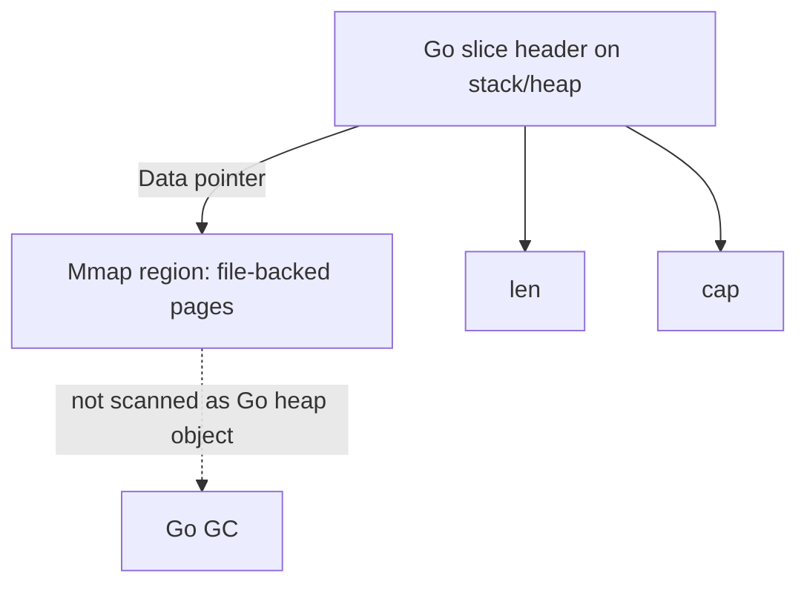

---

## 5. Kenapa Mmap Terlihat Menarik?

Mmap menarik karena:

1. **Tidak perlu buffer heap besar**
   - Kamu tidak perlu `os.ReadFile` untuk file 10 GB.
2. **Random access natural**
   - Offset file bisa menjadi index memory.
3. **Kernel page cache bekerja otomatis**
   - OS memilih page mana yang resident.
4. **Potential copy avoidance**
   - Tidak ada explicit copy dari kernel buffer ke Go buffer untuk read path.
5. **Data structure persistent**
   - File bisa diakses seperti array bytes.
6. **Inter-process sharing**
   - Multiple process bisa map file yang sama.
7. **Storage engine use case**
   - SSTable, index file, immutable segment, write-ahead log reader.

Tetapi semua keuntungan ini punya trade-off.

---

## 6. Kenapa Mmap Berbahaya?

Mmap berbahaya karena:

1. **Failure mode pindah dari error return ke signal/panic/crash**
   - Truncated mapped file bisa menyebabkan SIGBUS ketika page diakses.
2. **Lifetime manual**
   - Akses slice setelah unmap adalah memory corruption/use-after-free territory.
3. **Crash consistency tidak otomatis**
   - Write ke mapped memory tidak berarti format file atomic.
4. **RSS bisa naik tanpa heap profile menjelaskan**
   - Karena page mmap resident dihitung RSS.
5. **OS behavior berbeda**
   - Linux, macOS, Windows punya detail berbeda.
6. **GC tidak tahu payload**
   - Jika kamu menyimpan pointer Go di mmap, itu salah secara desain.
7. **Capacity planning lebih sulit**
   - `GOMEMLIMIT` bukan pengganti native/RSS budgeting.
8. **Observability butuh OS-level metrics**
   - pprof heap saja tidak cukup.
9. **Page fault bisa muncul di request hot path**
   - Latency spike tidak terlihat sebagai allocation.

---

## 7. Mmap vs Streaming: Keputusan Awal

Gunakan mmap bila:

- file besar dan mostly immutable;
- access pattern random-read;
- kamu butuh index lookup by offset;
- kamu bisa mengontrol file lifecycle;
- kamu bisa menerima OS-specific implementation;
- kamu punya observability RSS/page fault;
- format file punya checksum/versioning/bounds;
- kamu bisa menutup mapping dengan aman.

Lebih baik streaming bila:

- file dibaca sekali secara sequential;
- input berasal dari network/user upload;
- file size tidak dipercaya;
- transform pipeline bisa chunk-based;
- kamu ingin memory bounded dan portable;
- correctness lebih penting daripada random-access speed;
- tim belum siap mengelola native memory lifecycle.

Tabel ringkas:

| Use case | Mmap? | Alasan |
|---|---:|---|
| Membaca config kecil | Tidak | `os.ReadFile` cukup |
| Upload HTTP besar | Tidak | streaming lebih aman |
| Scan file log besar sekali jalan | Biasanya tidak | sequential streaming bagus |
| Immutable SSTable random lookup | Ya, layak | mmap cocok untuk random reads |
| Write-heavy mutable file | Hati-hati | crash consistency sulit |
| Shared-memory IPC | Bisa | perlu protocol/lifetime kuat |
| Secret material | Biasanya tidak | cleanup dan page residency kompleks |

---

## 8. Mental Model Virtual Memory

Mmap bekerja di virtual memory process.

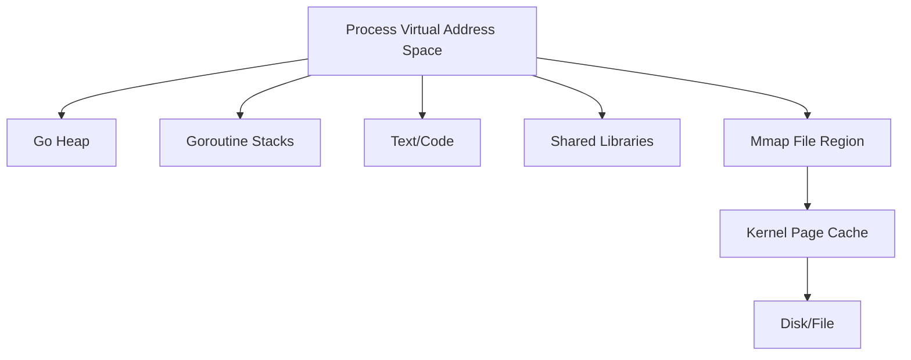

Saat kamu melakukan mmap, OS memberikan range address virtual. Range itu belum tentu langsung menggunakan physical RAM penuh.

Saat program membaca byte di page tertentu:

1. CPU mencoba load address.
2. MMU melihat page table.
3. Jika page belum mapped/resident, terjadi page fault.
4. Kernel mencari page di page cache atau membaca dari disk.
5. Page table diperbarui.
6. Instruksi dilanjutkan.

---

## 9. Page Fault Tidak Selalu Buruk

Ada dua jenis umum:

| Jenis | Makna |
|---|---|
| Minor page fault | Page sudah ada di memory tetapi belum mapped ke process |
| Major page fault | Page perlu dibaca dari disk/storage |

Minor fault bisa relatif murah. Major fault bisa mahal dan menyebabkan latency spike.

Dalam service latency-sensitive, mmap random access ke file besar bisa memunculkan tail latency tinggi jika page belum warm.

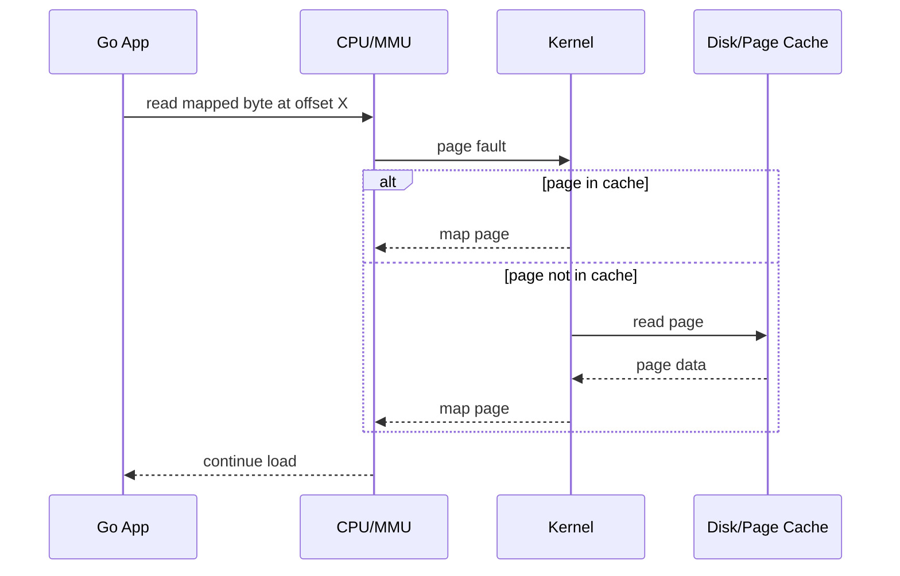

---

## 10. Page Cache vs Go Heap

Dengan file I/O biasa, OS page cache tetap dipakai.

Read biasa:

1. Disk/file data masuk page cache.
2. Kernel copy data ke userspace buffer.
3. Go code memproses `[]byte`.

Mmap:

1. Disk/file data masuk page cache.
2. Userspace address langsung map ke page cache page.
3. Go code memproses `[]byte` view.

Mmap mengurangi explicit copy ke buffer Go, tetapi bukan berarti tidak ada disk read, page fault, cache pressure, atau memory residency.

---

## 11. RSS Confusion

RSS bisa naik karena:

- Go heap live object,
- Go heap idle belum released,
- goroutine stacks,
- mmap resident pages,
- shared library pages,
- cgo/native allocations,
- OS page mapping accounting.

Heap profile bisa kecil tetapi RSS besar bila mmap pages resident.

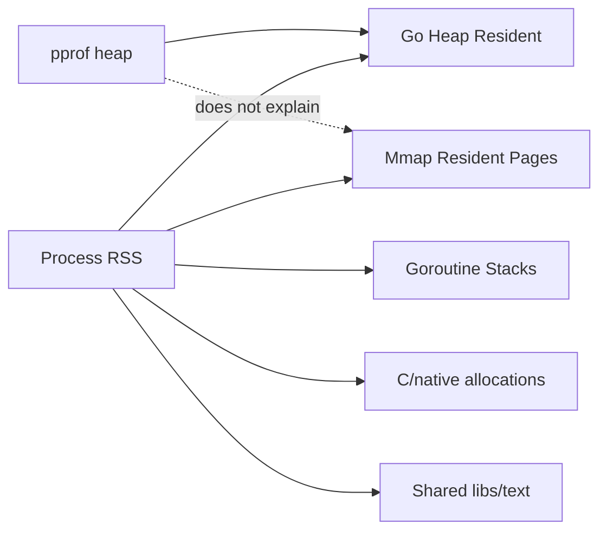

Review rule:

> Jika RSS besar tetapi heap profile kecil, jangan langsung menyimpulkan pprof salah. Mungkin memory-nya bukan Go heap.

---

## 12. Mmap Read-Only vs Read-Write

Dua mode utama:

| Mode | Use case | Risiko |
|---|---|---|
| Read-only | immutable index/SSTable/cache file | SIGBUS jika file berubah/truncated |
| Read-write shared | persistent mutable data | crash consistency, dirty page flush, concurrency |
| Private copy-on-write | patch local process view | perubahan tidak balik ke file |

Read-only mmap jauh lebih mudah dibuat benar.

Read-write mmap butuh desain storage serius.

---

## 13. MAP_SHARED vs MAP_PRIVATE

Secara konsep Unix-like:

| Mapping | Behavior |
|---|---|
| Shared | write ke mapping bisa terlihat ke file/process lain |
| Private | copy-on-write, perubahan tidak persist ke file |

Untuk storage persistence, kamu biasanya berpikir tentang shared mapping, tetapi ini bukan berarti write kamu atomic atau durable.

Untuk parser immutable, read-only mapping cukup.

---

## 14. File Size dan Bounds

Mmap harus punya ukuran.

Masalah penting:

- mapping length tidak boleh melewati file size dengan cara yang tidak valid;
- file bisa berubah/truncated oleh proses lain;
- offset harus divalidasi;
- format parser tidak boleh percaya header begitu saja.

Minimal invariant:

```text
0 <= offset <= len(mapping)
0 <= size <= len(mapping)-offset
```

Jangan pernah membuat slice dari offset/length hasil file tanpa bounds check.

---

## 15. SIGBUS Problem

Pada Unix-like systems, jika kamu map file lalu file dipotong/truncated, akses ke page yang tidak lagi valid bisa memicu SIGBUS.

Dalam Go, ini bisa terlihat sebagai crash fatal, bukan error biasa dari `Read`.

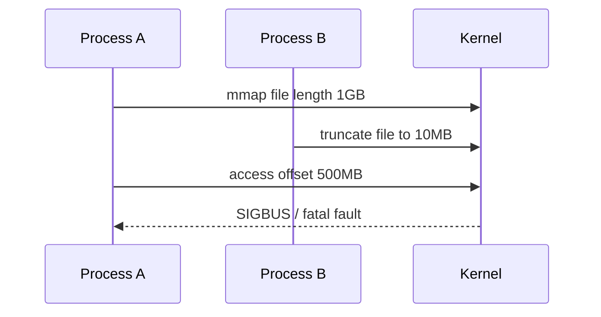

Design implication:

- jangan map file yang bisa dimutasi/truncated pihak lain tanpa coordination;
- immutable segment lebih aman;
- gunakan rename-atomic publish pattern;
- jangan overwrite file yang sedang dimap pembaca.

---

## 16. Publish Immutable File Pattern

Pattern yang baik untuk file immutable:

1. Writer menulis ke temporary file.
2. Writer flush/sync data.
3. Writer menulis checksum/footer.
4. Writer sync file.
5. Writer close file.
6. Writer atomic rename ke final path.
7. Reader hanya mmap final immutable file.

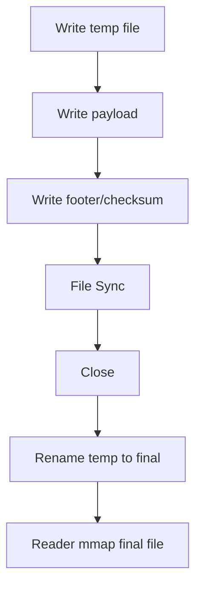

Ini mengurangi risiko reader melihat partial file.

---

## 17. Atomic Rename Tidak Sama Dengan Durable

Atomic rename sering dipakai untuk publish file. Tetapi crash consistency yang benar juga perlu memperhatikan:

- file data sudah di-sync;
- directory entry rename sudah durable;
- parent directory sync mungkin diperlukan di sistem tertentu;
- metadata ordering bisa berbeda antar filesystem.

Untuk aplikasi enterprise biasa, ini mungkin cukup dengan `file.Sync` + rename. Untuk storage engine serius, kamu perlu mempelajari filesystem semantics target.

---

## 18. Crash Consistency: Mmap Write Path

Dengan read-write mmap, problem menjadi lebih sulit.

Misalnya kamu update header:

```text
[header version=2][payload partly written][checksum old]
```

Crash terjadi di tengah. Setelah restart, file bisa berada dalam state campuran.

Mmap tidak memberikan transaction boundary.

Solusi umum:

- append-only log;
- copy-on-write pages;
- double header dengan generation;
- checksum per block;
- footer commit marker;
- WAL;
- manifest file;
- fsync/msync ordering;
- idempotent recovery.

---

## 19. Format File Harus Self-Defensive

Jangan membuat format mmap yang bergantung pada “program selalu menulis benar”.

Format file minimal harus punya:

- magic number;
- version;
- endianness;
- header length;
- total length;
- block count;
- checksum;
- optional footer;
- reserved flags;
- compatibility policy.

Contoh layout:

```text
+-------------------+
| magic             |
| version           |
| endian            |
| header_len        |
| file_len          |
| block_count       |
| index_offset      |
| data_offset       |
| header_checksum   |
+-------------------+
| data blocks       |
+-------------------+
| index             |
+-------------------+
| footer checksum   |
+-------------------+
```

---

## 20. Mermaid: Mmap File Format

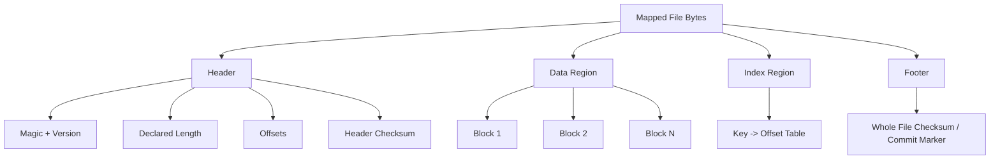

---

## 21. Struct Overlay Hazard

Sangat menggoda menulis:

```go
type Header struct {
    Magic   uint32
    Version uint16
    Flags   uint16
    Count   uint64
}
```

Lalu overlay langsung ke mmap bytes pakai `unsafe`.

Masalah:

- alignment;
- padding;
- endianness;
- architecture differences;
- future compatibility;
- unaligned access;
- struct layout bukan format file contract portable;
- Go pointer field tidak boleh masuk format;
- `unsafe` view bisa membaca data malformed.

Lebih aman:

```go
magic := binary.LittleEndian.Uint32(b[0:4])
version := binary.LittleEndian.Uint16(b[4:6])
flags := binary.LittleEndian.Uint16(b[6:8])
count := binary.LittleEndian.Uint64(b[8:16])
```

Untuk file format durable, explicit binary encoding lebih defensible daripada struct overlay.

---

## 22. Endianness Harus Eksplisit

Format file harus memilih endian.

Umumnya:

- little-endian untuk internal storage modern;
- big-endian/network byte order untuk protocol tertentu.

Jangan mengandalkan native endian.

```go
const headerSize = 32

func readU64LE(b []byte, off int) (uint64, bool) {
    if off < 0 || off+8 > len(b) {
        return 0, false
    }
    return binary.LittleEndian.Uint64(b[off : off+8]), true
}
```

---

## 23. Go API Abstraction: Jangan Bocorkan Mmap Sembarangan

Buruk:

```go
func Open(path string) ([]byte, error)
```

Kenapa buruk?

- siapa yang unmap?
- kapan view tidak valid?
- boleh disimpan?
- boleh dipakai concurrent?
- apakah file boleh berubah?
- apakah caller tahu ini native memory?

Lebih baik:

```go
type Mapping struct {
    data []byte
    // fd/file/platform fields
}

func (m *Mapping) Bytes() []byte {
    return m.data
}

func (m *Mapping) Close() error {
    // unmap once
}
```

Tetapi `Bytes()` tetap bahaya jika caller menyimpan setelah `Close`.

Lebih defensif:

```go
func (m *Mapping) View(fn func([]byte) error) error
```

Dengan pattern ini, lifetime view dibatasi oleh callback.

---

## 24. Borrowed View Pattern

```go
type MappedFile struct {
    mu     sync.RWMutex
    data   []byte
    closed bool
}

func (m *MappedFile) WithBytes(fn func([]byte) error) error {
    m.mu.RLock()
    defer m.mu.RUnlock()

    if m.closed {
        return ErrClosed
    }

    return fn(m.data)
}

func (m *MappedFile) Close() error {
    m.mu.Lock()
    defer m.mu.Unlock()

    if m.closed {
        return nil
    }

    m.closed = true
    data := m.data
    m.data = nil

    // unix.Munmap(data)
    _ = data
    return nil
}
```

Ini belum sempurna untuk semua use case, tetapi lebih aman daripada membagikan slice global tanpa lifecycle.

---

## 25. Owned Copy Boundary

Kadang solusi terbaik adalah copy kecil.

Misal lookup key dari mmap:

```go
func (idx *Index) Lookup(key []byte) ([]byte, error)
```

Pertanyaan:

- Return value menunjuk mmap?
- Caller boleh simpan?
- Apa yang terjadi setelah Close?
- Apa yang terjadi jika mapping reload?

Dua API lebih jelas:

```go
func (idx *Index) LookupView(key []byte, fn func([]byte) error) error
func (idx *Index) LookupCopy(key []byte) ([]byte, error)
```

Nama API mengkomunikasikan ownership.

---

## 26. Mmap dan GC

Mmap region tidak discan sebagai Go object graph. Itu baik untuk byte data besar, tetapi buruk jika kamu mencoba menyimpan Go pointer di sana.

Jangan lakukan:

```text
mmap bytes contain address of Go heap object
```

GC tidak akan memperlakukan angka address di mmap sebagai root. Object bisa dikoleksi, dipindahkan? Go GC saat ini non-moving untuk heap umum, tetapi desain kamu tetap salah karena GC visibility dan cgo/unsafe rules.

Rule:

> Mmap hanya boleh berisi data format, bukan Go object graph.

---

## 27. Mmap dan `GOMEMLIMIT`

`GOMEMLIMIT`/`debug.SetMemoryLimit` membantu runtime mengelola memory Go/runtime. Tetapi mmap/native memory tetap harus masuk capacity planning process-level.

Praktisnya:

```text
container_limit
  >= Go runtime memory
   + mmap resident pages
   + cgo/native allocation
   + stacks
   + page tables
   + shared libs
   + safety margin
```

Jika service mmap file 20 GB di container limit 2 GB, kamu tidak otomatis pakai 20 GB RSS. Tetapi random access bisa membuat banyak page resident dan menekan memory.

---

## 28. Observability Mmap

Kamu perlu minimal:

- RSS;
- Go heap;
- mmap bytes mapped;
- mapped file count;
- active mapping count;
- page fault rate;
- major page fault count;
- open file descriptor count;
- unmap errors;
- mapping lifetime histogram;
- cache hit/miss di level aplikasi.

Heap profile saja tidak cukup.

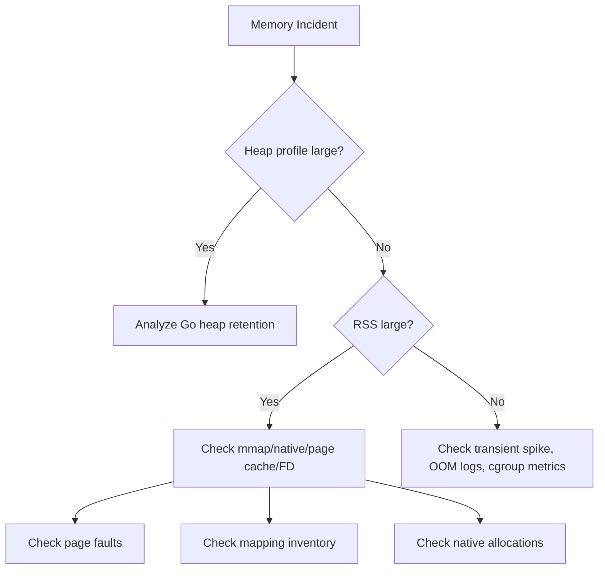

---

## 29. Metrics yang Sebaiknya Diekspos

Contoh metric aplikasi:

```text
mapped_file_open_total
mapped_file_close_total
mapped_file_active
mapped_file_bytes_virtual
mapped_file_lookup_total
mapped_file_lookup_error_total
mapped_file_checksum_error_total
mapped_file_reopen_total
mapped_file_view_duration_seconds
mapped_file_major_faults_process_total
```

Beberapa OS metrics mungkin dari node exporter/cgroup/procfs, bukan Go runtime.

---

## 30. Mmap Lifecycle State Machine

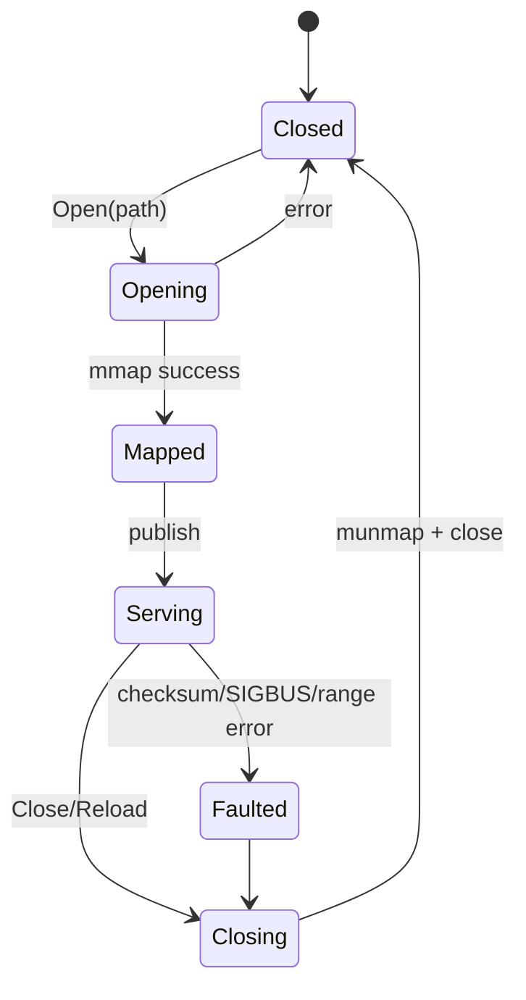

Invariant:

- `Serving` hanya boleh terjadi jika mapping valid.
- `Closing` harus menolak view baru.
- View aktif harus selesai sebelum unmap.
- Setelah `Closed`, tidak boleh ada borrowed slice yang dipakai.

---

## 31. Reload Pattern

Jika file immutable diganti versi baru, jangan mutate mapping lama.

Pattern:

1. mmap file baru;
2. validate checksum/version;
3. atomic swap pointer index;
4. mapping lama tetap hidup sampai reader selesai;
5. close mapping lama setelah no active readers.

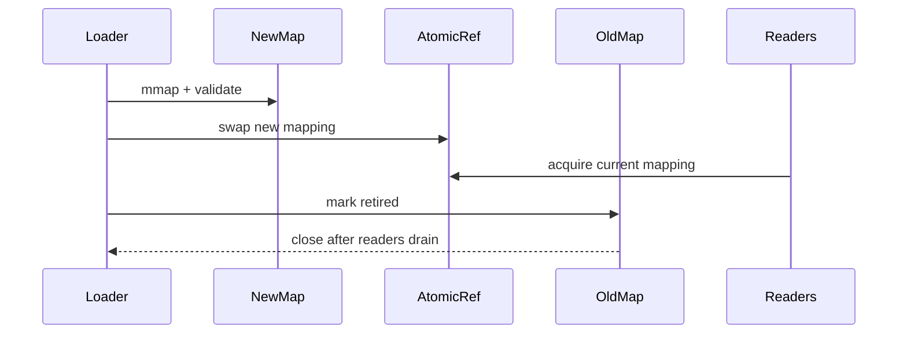

Ini mirip RCU/snapshot lifecycle.

---

## 32. Refcount Mapping

Untuk high-read system:

```go
type MappingRef struct {
    data []byte
    refs atomic.Int64
    closing atomic.Bool
}
```

Tetapi hati-hati:

- refcount bug bisa leak mapping;
- close while active readers bisa crash;
- reader panic harus release ref via defer;
- deadlock bisa terjadi jika callback re-enters.

Callback-based API sering lebih sederhana.

---

## 33. Windowed Mmap

Untuk file sangat besar, map seluruh file mungkin tidak ideal.

Windowed mmap:

- map chunk range;
- process range;
- unmap;
- move next window.

Cocok untuk:

- sequential scan besar dengan random-ish local access;
- limited virtual address concern;
- memory pressure control;
- file processing batch.

Trade-off:

- remap overhead;
- window boundary logic;
- page alignment;
- more complex code.

---

## 34. Page Alignment

Mmap offset biasanya harus aligned ke page size.

Jika kamu ingin map offset arbitrary:

```text
requested_offset = 12345
page_size = 4096
aligned_offset = floor(12345 / 4096) * 4096
delta = requested_offset - aligned_offset
mapping_len = delta + requested_len
view = mapped[delta : delta+requested_len]
```

Ini harus diabstraksikan agar caller tidak salah.

---

## 35. Mmap dan Concurrency

Read-only immutable mmap aman dibaca banyak goroutine, selama:

- mapping tidak di-unmap ketika masih dibaca;
- file tidak di-truncate;
- view tidak dimutasi.

Read-write mmap butuh synchronization seperti shared memory biasa.

Jika dua goroutine menulis ke mapped bytes yang sama tanpa sync, itu data race secara konseptual, dan bisa corrupt format.

---

## 36. Mmap dan Race Detector

Race detector mungkin tidak memberi perlindungan penuh untuk semua pola unsafe/native/mmap. Jangan menganggap “race detector clean” berarti mmap design aman.

Untuk mmap, correctness harus dibangun dari:

- immutable design;
- explicit locking;
- checksum;
- bounds validation;
- lifecycle control;
- fuzzing;
- fault injection;
- crash recovery tests.

---

## 37. Error Handling Philosophy

Mmap membuat sebagian failure tidak muncul sebagai normal `error`.

Maka validasi awal penting:

- stat file size;
- reject zero/too-small file jika format butuh header;
- validate magic/version;
- validate declared length <= actual length;
- validate offsets monotonic;
- validate checksum;
- optionally warm critical pages.

Jangan menunggu parser deep path menemukan corruption.

---

## 38. Warmup Strategy

Untuk latency-sensitive index:

- mmap saat startup/reload;
- validate;
- optionally touch pages untuk warm critical index area;
- expose readiness setelah warmup selesai;
- budget startup time.

Warmup bukan selalu baik. Membaca seluruh file 50 GB saat startup bisa buruk. Warm area yang penting saja.

---

## 39. Prefetch / madvise

Beberapa OS menyediakan madvise/fadvise-like hints:

- sequential;
- random;
- will need;
- don't need.

Di Go, aksesnya platform-specific via `x/sys/unix` atau syscall.

Jangan jadikan madvise sebagai core correctness. Ia hint, bukan kontrak.

---

## 40. Mmap untuk Storage Engine

Use case yang masuk akal:

- immutable SSTable;
- B-tree page cache reader;
- index file;
- segment file reader;
- columnar data reader;
- binary dictionary.

Read-only mmap cocok untuk immutable segment.

Write path storage engine biasanya tetap memakai:

- WAL,
- append,
- fsync,
- manifest,
- compaction,
- rename atomic,
- mmap read-side setelah segment sealed.

---

## 41. Immutable Segment Architecture

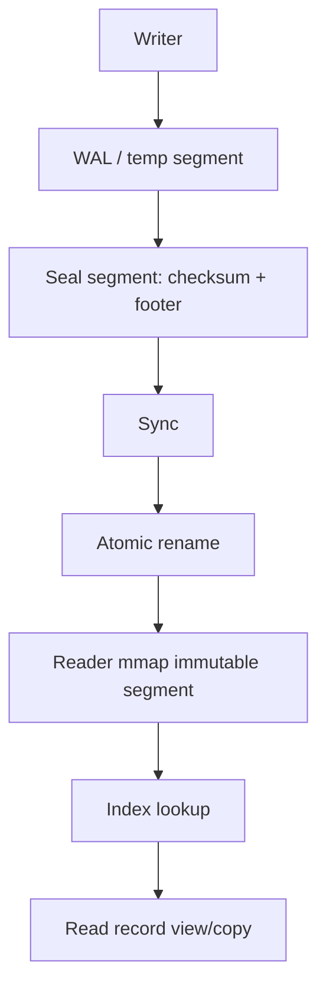

Ini lebih aman daripada mmap mutable structure langsung.

---

## 42. Mutable Mmap Architecture: Kenapa Sulit

Mutable mmap storage harus menjawab:

- Bagaimana atomic update?
- Bagaimana partial write dideteksi?
- Bagaimana recovery?
- Bagaimana page torn write?
- Bagaimana ordering write data vs metadata?
- Bagaimana multi-process sync?
- Bagaimana compaction?
- Bagaimana version compatibility?
- Bagaimana checksum granularity?
- Bagaimana free-list consistency?

Jika belum punya jawaban, jangan mulai dari mutable mmap.

---

## 43. Java Comparison: MappedByteBuffer

Sebagai Java engineer, kamu mungkin mengenal `MappedByteBuffer`.

Perbandingan:

| Java | Go |
|---|---|
| `MappedByteBuffer` | biasanya `[]byte` dari mmap wrapper |
| Direct/native memory | mmap/native memory |
| Cleaner/unmap historically tricky | explicit `Munmap` |
| GC tidak manage payload | GC tidak manage payload |
| ByteBuffer has position/limit | Go slice len/cap sederhana |
| endian via ByteBuffer order | endian via `encoding/binary` |

Di kedua dunia:

- mmap tidak membuat crash consistency otomatis;
- off-heap/native memory tetap masuk RSS;
- unmap/lifetime adalah masalah desain;
- page fault bisa menjadi latency spike.

---

## 44. Desain API: Read-Only Mapped Index

Contoh high-level API:

```go
type Index struct {
    mapping *MappedFile
}

func OpenIndex(path string) (*Index, error) {
    mf, err := OpenMappedFile(path)
    if err != nil {
        return nil, err
    }

    ok, err := validateIndex(mf)
    if err != nil || !ok {
        _ = mf.Close()
        if err != nil {
            return nil, err
        }
        return nil, ErrInvalidIndex
    }

    return &Index{mapping: mf}, nil
}

func (idx *Index) LookupCopy(key []byte) ([]byte, error) {
    var out []byte
    err := idx.mapping.WithBytes(func(b []byte) error {
        v, ok := lookupView(b, key)
        if !ok {
            return ErrNotFound
        }
        out = append([]byte(nil), v...)
        return nil
    })
    return out, err
}

func (idx *Index) LookupView(key []byte, fn func([]byte) error) error {
    return idx.mapping.WithBytes(func(b []byte) error {
        v, ok := lookupView(b, key)
        if !ok {
            return ErrNotFound
        }
        return fn(v)
    })
}
```

Dua API memberi pilihan eksplisit:

- `LookupCopy`: aman disimpan.
- `LookupView`: cepat tetapi borrowed.

---

## 45. Validation First

```go
func validateIndexBytes(b []byte) error {
    if len(b) < 32 {
        return ErrTooSmall
    }
    if string(b[0:4]) != "IDX1" {
        return ErrBadMagic
    }

    version := binary.LittleEndian.Uint16(b[4:6])
    if version != 1 {
        return ErrUnsupportedVersion
    }

    declaredLen := binary.LittleEndian.Uint64(b[8:16])
    if declaredLen > uint64(len(b)) {
        return ErrBadLength
    }

    indexOff := binary.LittleEndian.Uint64(b[16:24])
    dataOff := binary.LittleEndian.Uint64(b[24:32])
    if indexOff > dataOff || dataOff > declaredLen {
        return ErrBadOffset
    }

    return nil
}
```

Rules:

- validate before serving;
- never trust offsets;
- never trust counts;
- multiply with overflow check;
- fail closed.

---

## 46. Integer Overflow Hazard

File format often stores:

```text
count
entry_size
offset = base + count * entry_size
```

In Go, unsigned overflow wraps. Signed overflow behavior for integer operations is defined modulo two's complement for unsigned; signed has rules but still avoid relying on overflow.

Use checked arithmetic pattern.

```go
func checkedMulAdd(count, size, base uint64) (uint64, bool) {
    if size != 0 && count > (math.MaxUint64-base)/size {
        return 0, false
    }
    return base + count*size, true
}
```

Then ensure result <= len(mapping).

---

## 47. Mapping Inventory

Production service should know what it has mapped.

```go
type MappingInfo struct {
    Path       string
    Size       int64
    OpenedAt   time.Time
    Generation uint64
    State      string
}
```

Expose admin/debug endpoint carefully:

```json
{
  "active_mappings": 3,
  "mapped_bytes": 2147483648,
  "mappings": [
    {"path": "segment-001.sst", "size": 734003200, "generation": 42}
  ]
}
```

Do not expose sensitive full paths publicly.

---

## 48. Cleanup Strategy

Correct cleanup needs:

- idempotent Close;
- no active views;
- unmap before/after file close according to platform wrapper;
- error reporting;
- finalizer only as safety net, not primary lifecycle;
- tests that Close twice is safe;
- tests that view after close is impossible via API.

Bad API:

```go
b := mf.Bytes()
mf.Close()
use(b) // impossible to prevent if Bytes leaks
```

Better API:

```go
err := mf.WithBytes(func(b []byte) error {
    return use(b)
})
```

---

## 49. Finalizers as Safety Net

You might set finalizer to detect leaked mapping, but do not rely on it for timely unmap.

Finalizer can:

- log warning;
- increment metric;
- attempt cleanup as last resort.

But production correctness should use explicit `Close`.

---

## 50. Testing Mmap Code

Test categories:

1. Valid file opens.
2. Too-small file rejected.
3. Bad magic rejected.
4. Unsupported version rejected.
5. Declared length too large rejected.
6. Offset out of range rejected.
7. Count overflow rejected.
8. Checksum mismatch rejected.
9. Close idempotent.
10. Use after close impossible via public API.
11. Reload swaps generation safely.
12. Concurrent readers during reload.
13. Corrupt random bytes fuzz test.
14. Truncated file behavior if possible.
15. Platform-specific tests behind build tags.

---

## 51. Fuzzing Parser

Fuzz the parser separately from actual mmap.

```go
func FuzzValidateIndex(f *testing.F) {
    f.Add([]byte("IDX1\x01\x00\x00\x00" + strings.Repeat("\x00", 64)))

    f.Fuzz(func(t *testing.T, data []byte) {
        _ = validateIndexBytes(data)
    })
}
```

Goal:

- no panic;
- no out-of-bounds;
- no excessive allocation;
- no infinite loop;
- invalid file fails closed.

---

## 52. Benchmarking Mmap

Benchmark carefully.

A naive benchmark may measure page cache warm state, not disk.

Consider:

- cold cache vs warm cache;
- sequential vs random access;
- file size vs RAM;
- page fault count;
- CPU cache behavior;
- allocation/op;
- tail latency.

For storage lookup:

```text
BenchmarkLookupCopy
BenchmarkLookupView
BenchmarkLookupRandomWarm
BenchmarkLookupRandomCold
BenchmarkOpenValidate
```

Do not conclude mmap is faster after testing only warm tiny files.

---

## 53. Security Considerations

Mmap parser is attack surface if file is untrusted.

Risks:

- malformed offsets causing panic;
- huge count causing CPU loop;
- checksum bypass;
- path traversal in mapping loader;
- secret leakage through mapped file;
- stale deleted file still mapped;
- permission issue;
- TOCTOU between stat/open/map.

Safer approach:

- open file handle first;
- stat opened handle, not path after;
- validate content;
- restrict directory;
- use immutable publish;
- reject symlink if needed;
- least privilege file permissions.

---

## 54. TOCTOU: Path vs File Handle

Bad:

```text
stat(path)
open(path)
mmap(file)
```

Between stat and open, path could change.

Better:

```text
open(path)
fstat(file)
mmap(file)
validate mapped bytes
```

For high-security systems, also validate inode/device, permissions, ownership, and directory policy.

---

## 55. Deleted File Still Mapped

On Unix-like systems, a file can be unlinked while process still has it open/mapped. The mapping can remain valid while path disappears.

Operational implication:

- disk space may not free until mapping closed;
- deployment cleanup may appear ineffective;
- old segment still held by process.

Expose generation/path/inode metrics if this matters.

---

## 56. Mmap and Containers

In Kubernetes/container environments:

- RSS includes resident mapped pages;
- container OOM killer does not care that heap profile is small;
- page cache accounting can be confusing depending on cgroup version;
- memory pressure can evict file-backed pages;
- major faults can increase under pressure.

Capacity review should include:

```text
container memory limit
expected Go heap
expected mmap resident working set
native memory
goroutine stacks
safety margin
```

---

## 57. Production Incident Patterns

### Incident 1: Heap Small, Pod OOMKilled

Symptoms:

- pprof heap 300 MB;
- pod limit 1 GB;
- RSS 1.4 GB before kill;
- mmap index file 8 GB;
- random workload touched large working set.

Root cause:

- capacity model ignored mmap resident pages.

Fix:

- expose mapped bytes and RSS;
- limit working set;
- shard index;
- adjust pod memory;
- consider streaming/cache strategy.

---

### Incident 2: Crash After Compaction

Symptoms:

- reader process crashes randomly;
- compactor rewrites/truncates segment file;
- reader had mmap old path.

Root cause:

- mutable/truncated file was mapped by active readers.

Fix:

- immutable segment publish;
- rename new file;
- never truncate mapped file;
- reference-count old mappings;
- delete old file only after readers drain.

---

### Incident 3: Corrupt Reads After Reload

Symptoms:

- lookup returns wrong values;
- mapping old closed while goroutine still held `[]byte`.

Root cause:

- `Bytes()` leaked borrowed view beyond mapping lifetime.

Fix:

- callback-based API;
- refcount lease;
- copy-return API for long-lived data;
- tests for concurrent reload.

---

### Incident 4: File Validates But Later Panics

Symptoms:

- startup validation passes;
- lookup panics out-of-bounds for rare key.

Root cause:

- validation checked header but not every index offset/count invariant.

Fix:

- validate index table eagerly;
- bounds check on every lookup;
- checksum block-level;
- fuzz format parser.

---

## 58. Design Checklist

Before approving mmap usage, answer:

### Use case

- Is access random enough to justify mmap?
- Is file immutable while mapped?
- Is streaming insufficient?

### Lifecycle

- Who owns mapping?
- Who closes it?
- Can views escape?
- What happens on reload?
- Are active readers drained before unmap?

### Format

- Magic/version present?
- Endian explicit?
- Offsets validated?
- Counts checked for overflow?
- Checksums present?
- Crash recovery defined?

### Memory

- Is mapped byte size tracked?
- Is RSS tracked?
- Are page faults tracked?
- Is container memory budget updated?

### Safety

- Is file trusted?
- Is path open/stat race handled?
- Are symlinks considered?
- Are permissions correct?
- Are malformed files fuzzed?

### Portability

- Is platform support explicit?
- Are build tags used?
- Is Windows behavior tested if supported?
- Is fallback streaming available?

---

## 59. Anti-Patterns

Avoid:

1. Mapping user upload directly.
2. Returning raw `[]byte` mmap view with no lifecycle contract.
3. Writing mutable state directly into mmap with no WAL/checksum.
4. Using struct overlay for persistent format.
5. Assuming `file.Sync` alone solves mmap dirty page ordering.
6. Ignoring RSS because heap profile is small.
7. Truncating a file while readers may map it.
8. Storing Go pointers inside mapped memory.
9. Relying on finalizer to unmap.
10. Treating mmap as universally faster than streaming.
11. Using mmap to avoid learning buffering.
12. Building cross-platform logic without OS-specific tests.
13. Ignoring SIGBUS/truncation class failure.
14. Mapping huge files in many processes without capacity planning.
15. Using unsafe conversion to make mapped bytes into string and storing it forever.

---

## 60. Mini Lab 1 — Safe Header Parser

Implement parser for:

```text
offset 0: magic "IDX1"       4 bytes
offset 4: version uint16 LE  2 bytes
offset 6: flags uint16 LE    2 bytes
offset 8: fileLen uint64 LE  8 bytes
offset 16: indexOff uint64 LE
offset 24: dataOff uint64 LE
```

Requirements:

- no panic for any input;
- reject too-small input;
- reject bad magic;
- reject unsupported version;
- reject fileLen > len(b);
- reject indexOff > dataOff;
- reject dataOff > fileLen;
- fuzz it.

---

## 61. Mini Lab 2 — Borrowed vs Owned Lookup API

Build an in-memory fake mapped file using `[]byte`, then expose:

```go
LookupView(key []byte, fn func([]byte) error) error
LookupCopy(key []byte) ([]byte, error)
```

Simulate close and reload.

Requirements:

- view cannot be accessed after close through public API;
- copy remains valid after close;
- concurrent readers and close are safe;
- tests prove lifecycle.

---

## 62. Mini Lab 3 — RSS vs Heap Experiment

Create program that:

1. allocates 200 MB Go heap byte slice;
2. maps or simulates native/mmap large region if platform available;
3. prints `runtime.ReadMemStats`;
4. prints process RSS using OS tool;
5. compares pprof heap vs RSS.

Goal:

- understand why heap profile and RSS differ.

---

## 63. Practical Decision Framework

Ask in order:

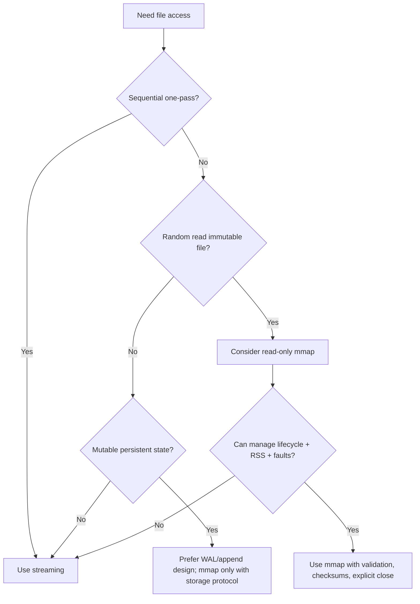

---

## 64. Internal Engineering Standard for Mmap

A production-grade Go mmap package should provide:

- explicit `Open`;
- explicit `Close`;
- idempotent close;
- no raw view escape by default;
- borrowed callback view;
- copy API;
- validation hooks;
- metrics;
- active reader protection;
- platform build tags;
- fuzz-tested parser;
- integration tests;
- no Go pointers in mapped data;
- documented memory accounting;
- documented crash consistency assumptions.

---

## 65. What Top Engineers Notice

A less experienced engineer says:

> “Mmap is faster because zero-copy.”

A stronger engineer asks:

- faster for which access pattern?
- cold or warm cache?
- what is page fault profile?
- what is RSS working set?
- what happens on reload?
- can file be truncated?
- what is crash consistency protocol?
- who owns the borrowed bytes?
- are offsets validated?
- can unsafe be avoided?
- how is this observed in prod?

The difference is not syntax knowledge. The difference is failure modeling.

---

## 66. Summary

Mmap is powerful because it lets a Go process treat file-backed data as addressable memory. But it is not magic:

- it is not Go heap;
- it is not automatically safe;
- it is not automatically durable;
- it is not automatically faster;
- it is not automatically bounded;
- it is not automatically portable.

Use mmap when the data and access pattern justify it, especially for immutable random-read file structures. Avoid it for ordinary sequential processing, untrusted uploads, and mutable storage unless you have a real crash consistency design.

The safest production stance:

> Prefer streaming by default.  
> Use read-only mmap for immutable, validated, random-access data.  
> Treat mutable mmap as storage-engine territory.

---

## 67. Part 024 Completion Checklist

Kamu siap lanjut jika bisa menjawab:

- Apa bedanya mmap region dengan Go heap?
- Kenapa heap profile bisa kecil saat RSS besar?
- Apa itu page fault dan kenapa penting untuk latency?
- Kenapa mmap file yang di-truncate bisa crash?
- Kenapa struct overlay berbahaya untuk file format?
- Bagaimana membuat API borrowed view vs owned copy?
- Kenapa read-only immutable mmap jauh lebih aman?
- Kenapa mutable mmap butuh WAL/checksum/recovery?
- Apa metric yang harus dilihat selain pprof heap?
- Kapan streaming lebih baik daripada mmap?

---

## 68. Seri Belum Selesai

Bagian ini adalah:

```text
learn-go-memory-systems-part-024.md
```

Part berikutnya:

```text
learn-go-memory-systems-part-025.md
```

Topik berikutnya:

```text
Finalizers, cleanup, lifetime pinning, runtime.KeepAlive, why cleanup is hard
```

<!-- NAVIGATION_FOOTER -->
<div class="page-nav">
<a href="./learn-go-memory-systems-part-023.md">⬅️ Go Memory Systems — Part 023</a>
<a href="./index.md">📚 Kategori</a>
<a href="../../index.md">🏠 Home</a>
<a href="./learn-go-memory-systems-part-025.md">Go Memory Systems Part 025 — Finalizers, Cleanup, Lifetime Pinning, `runtime.KeepAlive`, Why Cleanup Is Hard ➡️</a>
</div>
