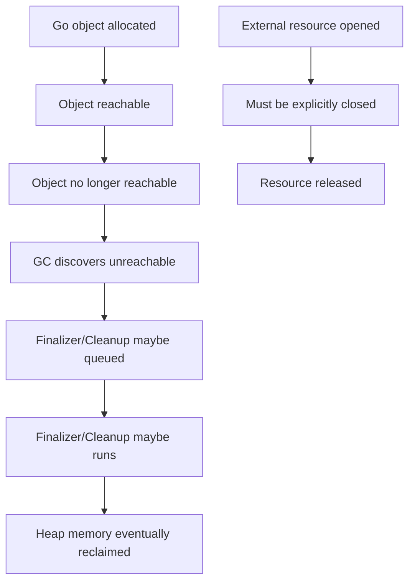
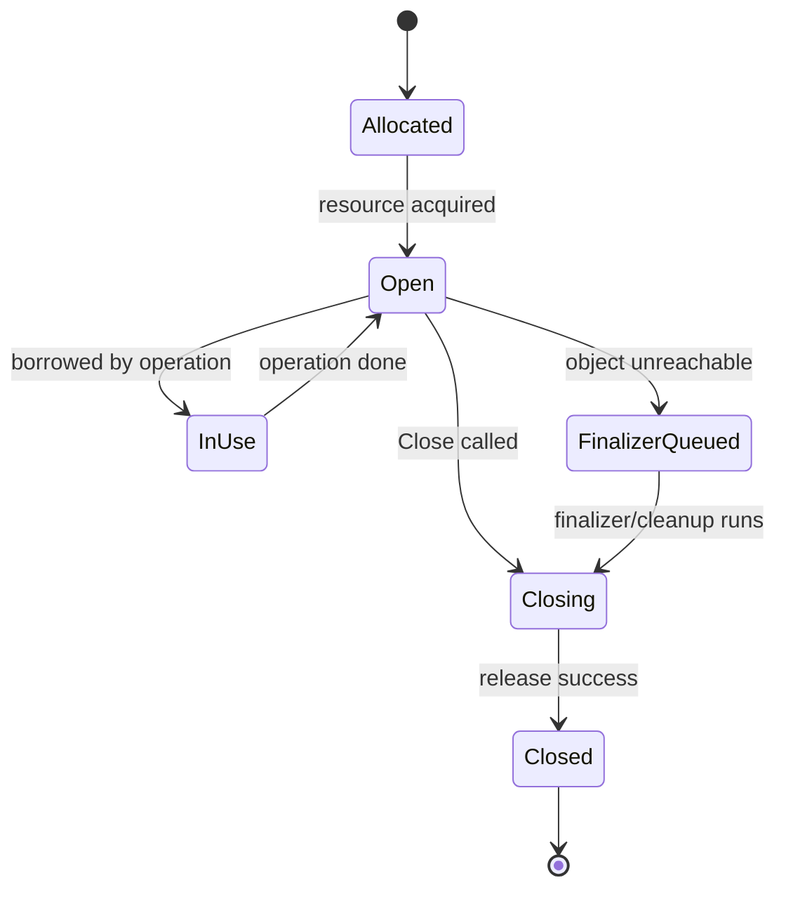
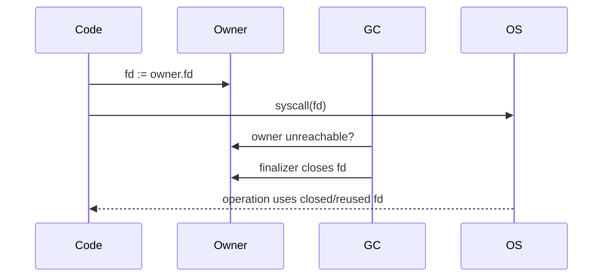
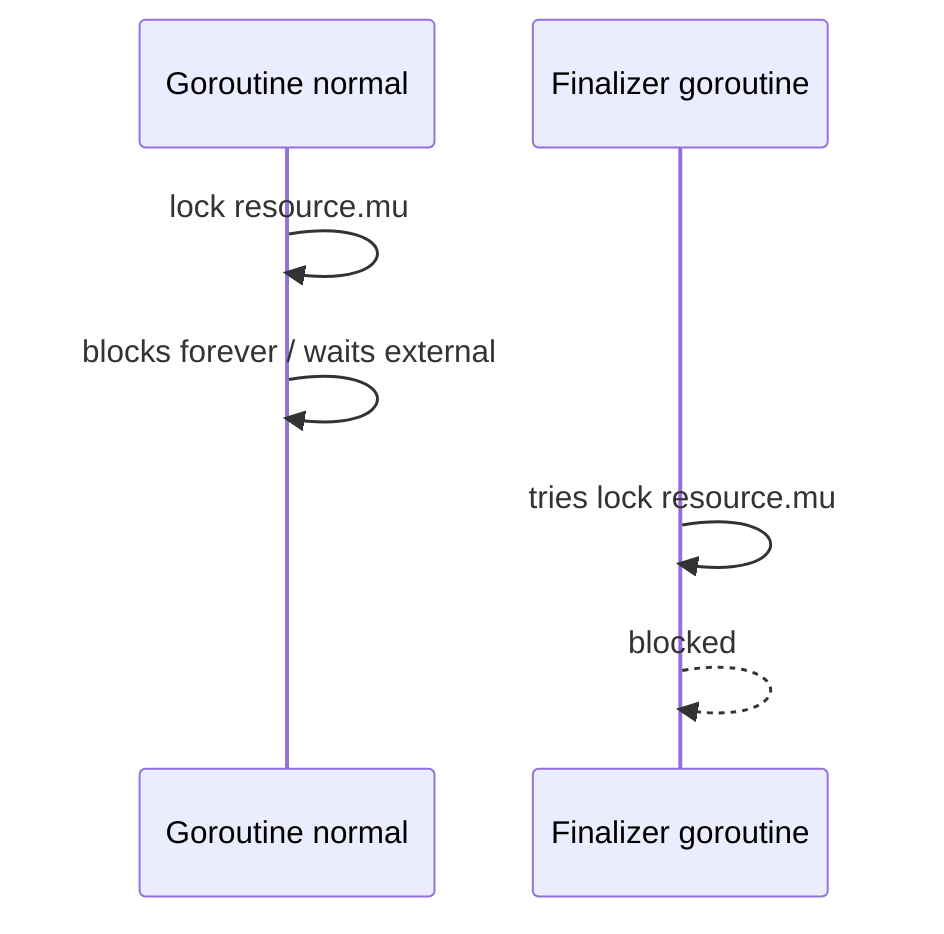
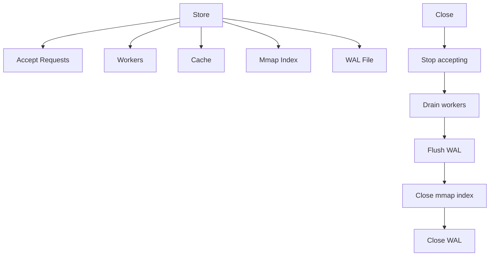
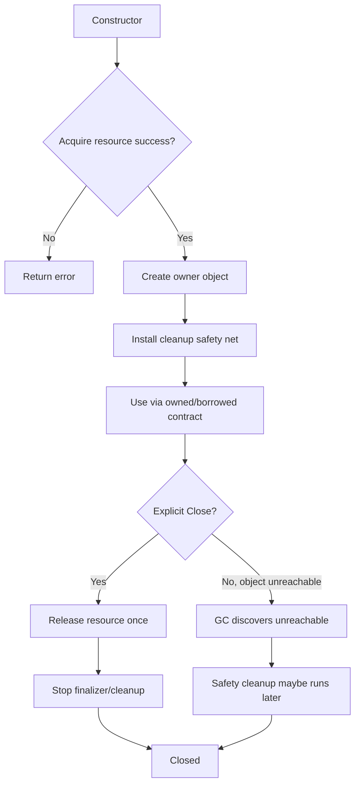

# learn-go-memory-systems-part-025.md

# Go Memory Systems Part 025 — Finalizers, Cleanup, Lifetime Pinning, `runtime.KeepAlive`, Why Cleanup Is Hard

> Seri: `learn-go-memory-systems`  
> Part: `025`  
> Target: Go 1.26.x  
> Perspektif: Java software engineer menuju Go systems engineer  
> Status seri: **belum selesai** — ini bukan bagian terakhir.

---

## 0. Posisi Part Ini Dalam Seri

Di part sebelumnya, kita membahas mmap dan off-heap/native memory. Kita melihat satu pola besar:

> Begitu resource tidak lagi sepenuhnya berada di Go heap, GC tidak cukup sebagai mekanisme lifecycle.

Sekarang kita masuk ke bagian yang sering disalahpahami oleh engineer dari ekosistem managed runtime:

- finalizer,
- cleanup,
- explicit close,
- lifetime pinning,
- `runtime.KeepAlive`,
- native handle,
- file descriptor,
- socket,
- mmap region,
- C allocation,
- object yang punya resource eksternal.

Dalam Java, kamu mungkin pernah mengenal:

- `finalize()` lama,
- `Cleaner`,
- `PhantomReference`,
- `try-with-resources`,
- `AutoCloseable`,
- `DirectByteBuffer` cleaner,
- file/socket close.

Di Go, mental model yang sehat adalah:

> GC boleh membantu membersihkan memory Go.  
> Tetapi resource eksternal harus punya lifecycle eksplisit.

Finalizer atau cleanup adalah **safety net**, bukan primary lifecycle.

---

## 1. Tujuan Pembelajaran

Setelah menyelesaikan part ini, kamu harus mampu:

1. Menjelaskan kenapa finalizer bukan destructor.
2. Mendesain resource wrapper dengan `Close` eksplisit.
3. Menjelaskan kapan `runtime.KeepAlive` diperlukan.
4. Memahami premature finalization pada resource native.
5. Membedakan:
   - heap object lifetime,
   - resource lifetime,
   - borrowed view lifetime,
   - OS handle lifetime.
6. Mendesain cleanup untuk:
   - file descriptor,
   - mmap region,
   - C allocation,
   - socket/native handle,
   - external resource.
7. Menghindari:
   - use-after-free,
   - double free,
   - finalizer resurrection,
   - cleanup queue overload,
   - nondeterministic resource exhaustion.
8. Membuat review checklist untuk resource-owning Go types.

---

## 2. Sumber Faktual Resmi yang Relevan

Beberapa dasar resmi yang penting:

- Package `runtime` mendokumentasikan `SetFinalizer` dan `KeepAlive`. Dokumentasi `SetFinalizer` menegaskan tidak ada jaminan kapan finalizer berjalan, dan finalizer berjalan di goroutine terpisah.
- `runtime.KeepAlive` mendokumentasikan pola untuk memastikan object tetap reachable sampai titik tertentu, terutama ketika finalizer dapat menutup file descriptor/native resource terlalu cepat.
- Go 1.24 menambahkan `runtime.AddCleanup`, dan Go 1.25 memperkenalkan `runtime.Cleanup.Stop`; di target seri Go 1.26.x, cleanup menjadi bagian dari API runtime modern.
- `runtime/metrics` mengekspos metric finalizer dan cleanup queue/execution, yang berguna untuk melihat apakah finalizer/cleanup menjadi bottleneck.
- `runtime/debug.SetMemoryLimit` adalah soft memory limit runtime, tetapi tidak menggantikan lifecycle explicit untuk resource eksternal.

---

## 3. Definisi Kerja

Kita perlu menyepakati istilah.

| Istilah | Makna |
|---|---|
| Heap object | Object Go yang dialokasikan dan dilacak GC |
| Resource | Sesuatu di luar object Go: FD, mmap, socket, C memory, lock external, temp file |
| Owner | Object/code yang bertanggung jawab melepaskan resource |
| Borrower | Code yang memakai resource sementara tanpa hak menutup |
| Finalizer | Function yang dijadwalkan runtime setelah object tidak lagi reachable |
| Cleanup | API runtime modern untuk cleanup setelah object tidak reachable |
| Close | Method eksplisit untuk melepas resource deterministik |
| Pinning lifetime | Membuat object tetap reachable sampai titik tertentu |
| Use-after-free | Resource dipakai setelah dilepas |
| Double free | Resource dilepas dua kali |
| Resurrection | Finalizer membuat object reachable lagi |

---

## 4. Finalizer Bukan Destructor

Destructor di bahasa seperti C++ punya karakteristik:

- berjalan deterministik saat object keluar scope atau di-delete;
- bagian dari ownership model;
- bisa dipakai untuk RAII;
- ordering relatif lebih eksplisit.

Go finalizer tidak seperti itu.

Finalizer Go:

- dipicu oleh GC reachability;
- waktunya tidak deterministik;
- mungkin tidak berjalan sebelum program exit;
- berjalan di goroutine terpisah;
- tidak cocok untuk business logic;
- tidak cocok sebagai mekanisme release utama;
- bisa terlambat sehingga resource eksternal habis duluan.

Rule:

> Jangan mendesain program yang correctness-nya bergantung pada finalizer berjalan tepat waktu.

---

## 5. Lifecycle: Memory vs Resource

Go heap memory dan resource eksternal punya lifecycle berbeda.



Masalahnya:

- resource bisa habis sebelum GC merasa perlu berjalan;
- GC target berdasarkan heap pressure, bukan FD pressure;
- C memory/mmap mungkin tidak memberi tekanan langsung ke Go heap;
- finalizer queue bisa tertunda.

---

## 6. Contoh Resource yang Tidak Boleh Bergantung Pada GC

Jangan bergantung pada finalizer untuk:

- file descriptor;
- socket;
- database connection;
- transaction;
- lock;
- temporary file;
- mmap region;
- `C.malloc`;
- GPU handle;
- OS thread affinity resource;
- external session;
- response body;
- timer/ticker lifecycle;
- stream pipe.

Semua resource ini harus punya `Close`, `Cancel`, `Release`, `Rollback`, `Commit`, atau lifecycle eksplisit lain.

---

## 7. Pola Dasar Resource Owner

Minimal:

```go
type NativeBuffer struct {
    ptr    unsafe.Pointer
    size   int
    closed atomic.Bool
}

func NewNativeBuffer(size int) (*NativeBuffer, error) {
    if size <= 0 {
        return nil, fmt.Errorf("invalid size")
    }

    p := C.malloc(C.size_t(size))
    if p == nil {
        return nil, fmt.Errorf("malloc failed")
    }

    b := &NativeBuffer{
        ptr:  unsafe.Pointer(p),
        size: size,
    }

    runtime.SetFinalizer(b, (*NativeBuffer).finalize)
    return b, nil
}

func (b *NativeBuffer) Close() error {
    if b == nil {
        return nil
    }
    if b.closed.Swap(true) {
        return nil
    }

    p := b.ptr
    b.ptr = nil
    b.size = 0

    if p != nil {
        C.free(p)
    }

    runtime.SetFinalizer(b, nil)
    return nil
}

func (b *NativeBuffer) finalize() {
    _ = b.Close()
}
```

Ini menunjukkan safety net, bukan final design final.

Kunci:

- `Close` idempotent;
- finalizer dihapus setelah close;
- pointer dinilkan;
- double free dicegah;
- finalizer hanya memanggil cleanup minimal.

---

## 8. Masalah Pada Contoh Sederhana

Contoh di atas masih punya banyak pertanyaan:

- Apakah `Bytes()` bisa mengembalikan view lalu `Close` dipanggil saat view dipakai?
- Apakah concurrent `Close` dan read aman?
- Apakah finalizer boleh memanggil method yang mengambil lock?
- Apakah finalizer bisa deadlock?
- Apakah cleanup lambat?
- Apakah C.free boleh dipanggil dari finalizer goroutine?
- Bagaimana kalau object resurrect?
- Bagaimana accounting native memory?
- Bagaimana metric leak?

Karena itu production wrapper perlu lifecycle design, bukan hanya `SetFinalizer`.

---

## 9. `Close` Harus Idempotent

Idempotent artinya beberapa kali dipanggil tetap aman.

```go
func (r *Resource) Close() error {
    if r.closed.Swap(true) {
        return nil
    }

    // release once
    return nil
}
```

Kenapa?

- caller bisa `defer r.Close()`;
- error path bisa menutup;
- owner bisa menutup;
- finalizer safety net bisa mencoba cleanup;
- race bug lebih mudah dicegah.

Idempotent tidak berarti thread-safe untuk semua operasi. Itu hanya menjamin release tidak terjadi dua kali.

---

## 10. Object State Machine



Invariant:

- `Closed` tidak boleh kembali ke `Open`.
- `Close` boleh dipanggil berkali-kali.
- Tidak boleh release saat ada borrower aktif.
- Finalizer tidak boleh menjalankan business logic.
- Semua path error setelah acquire harus release.

---

## 11. Defer Close Pattern

Untuk local ownership:

```go
f, err := os.Open(path)
if err != nil {
    return err
}
defer f.Close()
```

Pattern ini bagus bila:

- function owner resource;
- resource tidak dikembalikan;
- lifetime function-scope;
- Close error tidak perlu mengubah return.

Untuk write path, jangan abaikan Close/Sync error sembarangan.

```go
func writeFile(path string, data []byte) (err error) {
    f, err := os.Create(path)
    if err != nil {
        return err
    }

    defer func() {
        cerr := f.Close()
        if err == nil {
            err = cerr
        }
    }()

    if _, err := f.Write(data); err != nil {
        return err
    }

    if err := f.Sync(); err != nil {
        return err
    }

    return nil
}
```

---

## 12. Finalizer Timing Problem

Misal:

```go
func leakFD(path string) error {
    f, err := os.Open(path)
    if err != nil {
        return err
    }

    _ = f
    return nil
}
```

Jika tidak di-close, file descriptor mungkin baru dilepas saat GC menemukan `f` unreachable dan finalizer internal berjalan. Tetapi FD limit bisa habis duluan.

Resource pressure:

```text
FD limit reached before heap pressure triggers GC
```

Maka:

> Resource eksternal perlu release eksplisit berbasis ownership, bukan heap pressure.

---

## 13. Cleanup Queue Problem

Finalizer/cleanup berjalan asynchronous. Jika kamu membuat jutaan object kecil dengan finalizer/cleanup:

- queue bisa menumpuk;
- goroutine finalizer/cleanup bisa jadi bottleneck;
- cleanup lambat memperparah retention;
- metric finalizer/cleanup queue perlu dipantau.

Ini anti-pattern:

```go
for i := 0; i < 1_000_000; i++ {
    _ = NewObjectWithFinalizer()
}
```

Finalizer bukan pengganti pool/resource manager.

---

## 14. `runtime.KeepAlive`: Masalah yang Dipecahkan

`runtime.KeepAlive(x)` memastikan `x` dianggap reachable sampai titik tersebut.

Ini penting saat:

- object Go punya finalizer yang menutup resource;
- kamu mengoper resource raw ke syscall/C/kernel;
- compiler mungkin melihat object owner tidak dipakai lagi sebelum operasi selesai;
- hanya field/handle raw yang dipakai.

Contoh konseptual:

```go
type File struct {
    fd uintptr
}

func useFD(f *File) error {
    _, err := syscall.Write(syscall.Handle(f.fd), buf)
    runtime.KeepAlive(f)
    return err
}
```

Tanpa `KeepAlive(f)`, compiler/runtime bisa menganggap `f` tidak lagi diperlukan setelah `fd` diambil, sehingga finalizer dapat menutup FD terlalu awal.

---

## 15. Premature Finalization

Premature finalization terjadi ketika:

1. object owner punya finalizer;
2. code mengambil raw handle/pointer dari object;
3. setelah itu hanya raw handle yang dipakai;
4. compiler melihat owner tidak lagi live;
5. GC menjalankan finalizer;
6. finalizer menutup handle;
7. operasi raw masih berjalan atau akan berjalan.

Diagram:



`runtime.KeepAlive(owner)` setelah syscall membuat owner live sampai titik itu.

---

## 16. KeepAlive Placement

`KeepAlive` harus diletakkan setelah penggunaan terakhir resource raw.

Benar:

```go
n, err := syscall.Read(fd, buf)
runtime.KeepAlive(owner)
return n, err
```

Salah:

```go
runtime.KeepAlive(owner)
n, err := syscall.Read(fd, buf)
return n, err
```

Kenapa salah?

Karena setelah `KeepAlive`, owner bisa dianggap dead sebelum syscall.

Rule:

> Letakkan `runtime.KeepAlive(x)` setelah operasi terakhir yang membutuhkan `x` tetap hidup.

---

## 17. KeepAlive Bukan Lock

`KeepAlive` tidak:

- mencegah goroutine lain memanggil `Close`;
- membuat object thread-safe;
- menambah reference count;
- memblok finalizer selamanya;
- mencegah data race;
- menggantikan ownership protocol.

Jika resource bisa di-close oleh goroutine lain saat dipakai, kamu butuh lock/refcount/lease.

---

## 18. Borrowed Lease Pattern

Untuk resource yang bisa dipakai concurrent dan di-close:

```go
type Resource struct {
    mu      sync.Mutex
    closed  bool
    active  int
    cond    *sync.Cond
    handle  uintptr
}

func (r *Resource) WithHandle(fn func(uintptr) error) error {
    r.mu.Lock()
    if r.closed {
        r.mu.Unlock()
        return ErrClosed
    }
    r.active++
    h := r.handle
    r.mu.Unlock()

    defer func() {
        r.mu.Lock()
        r.active--
        if r.active == 0 {
            r.cond.Broadcast()
        }
        r.mu.Unlock()
    }()

    err := fn(h)
    runtime.KeepAlive(r)
    return err
}

func (r *Resource) Close() error {
    r.mu.Lock()
    if r.closed {
        r.mu.Unlock()
        return nil
    }
    r.closed = true
    for r.active > 0 {
        r.cond.Wait()
    }
    h := r.handle
    r.handle = 0
    r.mu.Unlock()

    return closeHandle(h)
}
```

Ini menyelesaikan masalah yang tidak bisa diselesaikan `KeepAlive` sendirian:

- close menunggu active users;
- new borrower ditolak setelah closing;
- owner tetap alive sampai handle use selesai.

---

## 19. Callback API dan Lifetime

Callback API membatasi lifetime borrowed view/handle.

Buruk:

```go
func (r *Resource) Handle() uintptr
```

Lebih baik:

```go
func (r *Resource) WithHandle(func(uintptr) error) error
```

Untuk mmap:

```go
func (m *Mapping) WithBytes(func([]byte) error) error
```

Untuk native buffer:

```go
func (b *Buffer) WithBytes(func([]byte) error) error
```

Callback API mengurangi risiko caller menyimpan view setelah resource close.

---

## 20. Finalizer Resurrection

Finalizer bisa membuat object reachable lagi jika menyimpan receiver ke global.

Contoh buruk:

```go
var rescued []*Resource

func (r *Resource) finalizer() {
    rescued = append(rescued, r)
}
```

Ini disebut resurrection.

Masalah:

- object yang sudah dianggap mati hidup lagi;
- finalizer biasanya hanya berjalan sekali kecuali diset lagi;
- lifecycle kacau;
- resource bisa tidak pernah dibersihkan.

Rule:

> Finalizer tidak boleh membuat object kembali reachable kecuali kamu benar-benar memahami konsekuensinya. Dalam production business code, anggap resurrection terlarang.

---

## 21. Finalizer dan Lock

Finalizer berjalan di goroutine terpisah. Jika finalizer mengambil lock yang juga dipakai normal path, hati-hati.

Deadlock scenario:



Jika finalizer queue blocked oleh finalizer lambat/deadlock, cleanup resource lain bisa tertunda.

Rule:

- finalizer harus minimal;
- jangan blocking lama;
- jangan melakukan network I/O;
- jangan menunggu business lock kompleks;
- jangan logging berat dalam hot finalizer path;
- jangan panic.

---

## 22. Finalizer dan Ordering

Jangan mengandalkan ordering finalizer antar object.

Misalnya object A finalizer butuh object B masih hidup. GC tidak memberi model destructor dependency seperti itu untuk application-level correctness.

Jika resource punya dependency, owner harus menutup dalam urutan eksplisit.

```go
func (s *Store) Close() error {
    var errs []error

    if s.index != nil {
        errs = append(errs, s.index.Close())
    }
    if s.wal != nil {
        errs = append(errs, s.wal.Close())
    }
    if s.dir != nil {
        errs = append(errs, s.dir.Close())
    }

    return errors.Join(errs...)
}
```

---

## 23. Close Error Handling

`Close` bisa gagal.

Examples:

- flush pending writes gagal;
- network close returns error;
- file close reports delayed write error;
- native release fails;
- transaction rollback fails.

Policy:

| Resource | Close error policy |
|---|---|
| Read-only file | often log/return |
| Write file | must check |
| DB transaction | must handle commit/rollback |
| Network response body | usually close to release connection |
| Native free | usually cannot recover |
| mmap sync/unmap | depends on write/read-only |

Jangan selalu abaikan `Close` error.

---

## 24. Ownership Transfer

Function harus jelas apakah menerima ownership.

Ambiguous:

```go
func Process(f *os.File) error
```

Pertanyaan:

- apakah Process menutup file?
- apakah caller masih boleh pakai setelah Process?
- apakah Process menyimpan file?

Lebih jelas:

```go
func ProcessBorrowed(f *os.File) error
func ProcessOwned(f *os.File) error
```

Atau dokumentasi:

```go
// Process reads from f but does not close it.
func Process(f *os.File) error
```

Untuk API internal besar, naming explicit sering lebih aman.

---

## 25. Owned vs Borrowed Contract

| Contract | Caller | Callee |
|---|---|---|
| Borrowed | tetap owner | tidak close, tidak simpan setelah return |
| Owned | menyerahkan resource | callee wajib close |
| Shared lease | owner external | callee acquire/release |
| Copy | caller bebas | callee memberi data independen |

Resource bugs sering muncul karena contract ini tidak eksplisit.

---

## 26. `io.Closer` dan Composition

Go punya interface kecil:

```go
type Closer interface {
    Close() error
}
```

Ini bagus untuk composition, tetapi terlalu kecil untuk menjelaskan ownership.

Misalnya:

```go
func Use(r io.Reader) error
func UseAndClose(r io.ReadCloser) error
```

Nama function harus menyatakan close behavior.

Pattern:

```go
func ReadAllAndClose(r io.ReadCloser) ([]byte, error) {
    defer r.Close()
    return io.ReadAll(r)
}
```

---

## 27. HTTP Response Body

Contoh resource lifecycle yang sering salah:

```go
resp, err := http.Get(url)
if err != nil {
    return err
}
defer resp.Body.Close()
```

Jika body tidak ditutup:

- connection bisa tidak dikembalikan ke pool;
- FD/socket bisa leak;
- goroutine transport bisa tertahan;
- memory buffer bisa tertahan.

Jika ingin connection reuse, body biasanya perlu dibaca sampai EOF atau transport behavior perlu dipahami. Tetapi minimal: selalu close.

---

## 28. Timer/Ticker Lifecycle

Resource tidak selalu OS FD.

```go
ticker := time.NewTicker(time.Second)
defer ticker.Stop()
```

Jika ticker tidak distop:

- runtime timer tetap aktif;
- goroutine/select mungkin leak;
- channel terus menerima tick.

Lifecycle eksplisit tetap penting.

---

## 29. Context Cancel as Cleanup

Untuk operasi dengan goroutine:

```go
ctx, cancel := context.WithCancel(parent)
defer cancel()
```

Jika cancel tidak dipanggil:

- child goroutine bisa hidup lebih lama;
- timer context timeout bisa tertahan sampai deadline;
- resource request bisa leak.

Context bukan hanya control flow; ia bagian dari lifecycle.

---

## 30. `runtime.AddCleanup` Mental Model

`runtime.AddCleanup` adalah API modern untuk menghubungkan cleanup function dengan pointer object. Setelah object tidak reachable, runtime dapat menjalankan cleanup function dengan argumen yang diberikan.

Mental model:

```text
ptr reachable -> no cleanup
ptr unreachable -> cleanup may be queued
cleanup runs asynchronously later
```

Keunggulan dibanding finalizer dalam beberapa desain:

- cleanup function menerima argumen terpisah;
- mengurangi risiko cleanup menutup over object receiver yang membuat lifecycle lebih kacau;
- lebih eksplisit untuk resource token.

Tetapi rule utamanya tetap sama:

> Cleanup bukan pengganti `Close`.

---

## 31. Cleanup Token Design

Conceptual pattern:

```go
type nativeToken struct {
    ptr unsafe.Pointer
}

type Buffer struct {
    ptr unsafe.Pointer
    cleanup runtime.Cleanup
}

func NewBuffer(size int) (*Buffer, error) {
    p := allocNative(size)
    b := &Buffer{ptr: p}

    token := nativeToken{ptr: p}
    b.cleanup = runtime.AddCleanup(b, func(t nativeToken) {
        freeNative(t.ptr)
    }, token)

    return b, nil
}

func (b *Buffer) Close() error {
    if b.cleanup.Stop() {
        freeNative(b.ptr)
    }
    b.ptr = nil
    return nil
}
```

Catatan: exact API detail harus mengikuti dokumentasi versi Go target. Di Go modern, konsep pentingnya adalah cleanup bisa dihentikan saat resource sudah dilepas eksplisit agar tidak double-free.

---

## 32. Finalizer vs Cleanup

| Aspek | Finalizer | Cleanup |
|---|---|---|
| API | `runtime.SetFinalizer` | `runtime.AddCleanup` |
| Receiver | finalizer menerima object | cleanup menerima arg terpisah |
| Risiko resurrection | lebih tinggi | lebih mudah dihindari |
| Deterministik | Tidak | Tidak |
| Primary cleanup? | Tidak | Tidak |
| Safety net | Ya | Ya |
| Explicit close tetap perlu | Ya | Ya |

Jika tersedia dan sesuai versi, cleanup sering lebih cocok untuk resource token sederhana. Tetapi jangan ubah mental model menjadi “cleanup aman sebagai destructor”.

---

## 33. Native Memory Accounting

Jika kamu allocate native/off-heap memory:

```go
type NativeLimiter struct {
    used  atomic.Int64
    limit int64
}
```

Acquisition:

```go
func (l *NativeLimiter) Reserve(n int64) bool {
    for {
        cur := l.used.Load()
        if cur+n > l.limit {
            return false
        }
        if l.used.CompareAndSwap(cur, cur+n) {
            return true
        }
    }
}
```

Release harus terjadi pada `Close`.

Finalizer/cleanup boleh menjadi safety net yang mengurangi metric jika leak, tetapi primary accounting harus sinkron dengan explicit lifecycle.

---

## 34. Double Free Prevention

Native resource wrapper harus punya state.

```go
type State uint32

const (
    stateOpen State = iota
    stateClosing
    stateClosed
)
```

Atau pakai atomic bool untuk case sederhana.

Double free bisa terjadi dari:

- caller Close dua kali;
- finalizer berjalan setelah explicit close;
- two owners think they own same pointer;
- copied struct wrapper contains same pointer.

Rule:

> Resource-owning struct biasanya tidak boleh dicopy.

---

## 35. Prevent Copying Resource Owners

Jika struct memiliki ownership resource, copy value bisa berbahaya.

```go
type Resource struct {
    noCopy noCopy
    fd     int
}
```

Go tidak punya built-in `noCopy`, tetapi `go vet` mengenali pola `Lock` method pada helper seperti yang dipakai beberapa package.

Simpler guideline:

- jangan expose resource owner sebagai value copy;
- constructor return `*T`;
- methods pakai pointer receiver;
- dokumentasikan “must not be copied after first use”;
- hindari embedding resource owner di struct yang sering dicopy.

---

## 36. Slice View Use-After-Close

Native buffer/mmap sering expose `[]byte`.

Bahaya:

```go
b := native.Bytes()
native.Close()
fmt.Println(b[0]) // use-after-free
```

Solusi:

1. callback borrowed view;
2. explicit lease;
3. return copy;
4. make `Bytes` unexported;
5. document strictly, but documentation saja tidak cukup.

---

## 37. Lease Object Pattern

```go
type Lease struct {
    r    *Resource
    data []byte
    once sync.Once
}

func (l *Lease) Bytes() []byte {
    return l.data
}

func (l *Lease) Release() {
    l.once.Do(func() {
        l.r.release()
        l.data = nil
        l.r = nil
    })
}
```

Caller:

```go
lease, err := r.Acquire()
if err != nil {
    return err
}
defer lease.Release()

use(lease.Bytes())
```

Trade-off:

- more explicit;
- caller can forget release;
- finalizer on lease maybe possible as leak detector, not cleanup primary.

---

## 38. Close While Operation In Progress

Common race:

```go
go func() {
    r.Read()
}()

r.Close()
```

If `Read` uses native handle and `Close` closes it concurrently:

- read may fail;
- FD may be reused for another resource;
- memory can corrupt;
- operation can panic/crash.

Need:

- mutex around operations and close;
- refcount/lease;
- context cancellation + drain;
- state machine.

---

## 39. File Descriptor Reuse Hazard

OS can reuse FD numbers.

Scenario:

1. resource A has fd=10;
2. finalizer closes fd=10 too early;
3. OS opens resource B with fd=10;
4. code using A's raw fd writes to B.

This is catastrophic because operation may succeed against wrong resource.

`KeepAlive` and ownership protocol protect against this class.

---

## 40. `runtime.KeepAlive` and FD Reuse

Pattern:

```go
func (f *FileLike) Write(p []byte) (int, error) {
    fd := f.fd

    n, err := syscall.Write(fd, p)

    runtime.KeepAlive(f)
    return n, err
}
```

But if another goroutine can call `f.Close()` concurrently, this is insufficient.

Need:

```go
func (f *FileLike) Write(p []byte) (int, error) {
    return f.withFD(func(fd int) (int, error) {
        n, err := syscall.Write(fd, p)
        runtime.KeepAlive(f)
        return n, err
    })
}
```

---

## 41. Cleanup and Panic

If cleanup panics, consequences can be severe. Treat cleanup code like runtime-adjacent code:

- no panic;
- recover if necessary;
- minimal work;
- no application-level dependency;
- no unbounded allocation;
- no blocking network call.

Example:

```go
func safeCleanup(token nativeToken) {
    defer func() {
        if r := recover(); r != nil {
            // increment metric, avoid crashing if policy allows
        }
    }()
    freeNative(token.ptr)
}
```

For critical systems, decide policy: crash-fast vs best-effort cleanup. But do not leave it implicit.

---

## 42. Finalizer for Leak Detection

A good use of finalizer/cleanup:

- detect caller forgot Close;
- emit metric/log;
- release resource as safety net.

Example concept:

```go
func newResource() *Resource {
    r := &Resource{}
    runtime.SetFinalizer(r, func(r *Resource) {
        if !r.closed.Load() {
            leakedResources.Add(1)
            _ = r.Close()
        }
    })
    return r
}
```

This is acceptable if:

- finalizer minimal;
- `Close` safe in finalizer context;
- production still requires explicit close;
- metric alerts on leaks.

---

## 43. Do Not Hide Leaks Too Well

If finalizer silently cleans up everything, developers may never notice lifecycle bugs.

Better:

- cleanup safety net;
- metric leak count;
- test failure in leak detector;
- optional debug panic in tests;
- structured log with allocation site if possible.

Goal:

> Finalizer should make leaks less catastrophic, not invisible.

---

## 44. Allocation Site Tracking

For hard-to-find leaks, resource owner can record creation stack in debug builds.

```go
type Resource struct {
    createdAt []uintptr
}
```

Or store `debug.Stack()` in non-prod/test. Be careful: stack capture allocates and can retain memory.

Use build tags:

```text
resource_debug.go
resource_nodebug.go
```

---

## 45. Testing Cleanup

Test explicit close:

- close once;
- close twice;
- operation after close returns error;
- acquire after close returns error;
- close waits for active borrower;
- close during operation;
- error path after partial acquire;
- constructor failure frees acquired subresources;
- finalizer/cleanup leak detector in test with forced GC if necessary.

Testing finalizer timing is inherently flaky. Keep tests for explicit lifecycle deterministic. Finalizer tests should be limited and tolerant.

---

## 46. Constructor Failure Cleanup

If constructor acquires multiple resources:

```go
func OpenStore(path string) (_ *Store, err error) {
    wal, err := openWAL(path)
    if err != nil {
        return nil, err
    }
    defer func() {
        if err != nil {
            wal.Close()
        }
    }()

    index, err := openIndex(path)
    if err != nil {
        return nil, err
    }
    defer func() {
        if err != nil {
            index.Close()
        }
    }()

    s := &Store{wal: wal, index: index}
    return s, nil
}
```

This avoids leaks on partial initialization.

---

## 47. Close Ordering for Composite Resources

If Store owns multiple resources:



Close order should reflect dependencies.

Bad:

- close file while worker still writes;
- unmap index while query goroutine still reads;
- close network listener but leave workers waiting forever.

---

## 48. Shutdown Protocol

For service:

1. stop accepting new work;
2. cancel contexts;
3. wait bounded time for active work;
4. close resources in dependency order;
5. flush/sync where required;
6. emit metrics;
7. exit.

Resource lifecycle is part of graceful shutdown.

---

## 49. Resource Wrapper Review Rubric

Ask:

- Is ownership clear?
- Is `Close` explicit?
- Is `Close` idempotent?
- Is `Close` concurrency-safe?
- Can operation race with `Close`?
- Is there a borrowed view?
- Can borrowed view escape?
- Is `KeepAlive` needed?
- Is there finalizer/cleanup safety net?
- Is safety net minimal?
- Is finalizer removed/stopped after explicit close?
- Are close errors handled?
- Are resources released on constructor failure?
- Is native memory accounted?
- Is copying resource owner prevented?
- Are metrics exposed?

---

## 50. Mermaid: Correct Resource Lifecycle



---

## 51. Anti-Patterns

Avoid:

1. Treating finalizer as destructor.
2. Depending on finalizer for FD/socket close.
3. Returning native/mmap `[]byte` without lifetime contract.
4. Forgetting `runtime.KeepAlive` after raw handle syscall.
5. Putting `KeepAlive` before the last use.
6. Assuming `KeepAlive` prevents concurrent `Close`.
7. Finalizer doing network calls.
8. Finalizer acquiring complex locks.
9. Finalizer resurrecting object.
10. Ignoring close error on write path.
11. Copying struct that owns resource.
12. Multiple owners for one native pointer.
13. Cleanup without double-free prevention.
14. Using finalizer to hide lifecycle bugs silently.
15. Testing only by forcing GC and assuming deterministic cleanup.

---

## 52. Production Incident Pattern 1 — FD Exhaustion Despite GC

Symptoms:

- service eventually fails with “too many open files”;
- heap profile normal;
- GC runs periodically;
- finalizers eventually close some files.

Root cause:

- code relied on finalizer/internal cleanup instead of explicit `Close`.

Fix:

- always `defer Close`;
- lint/review response body/file lifecycle;
- add FD metrics;
- add leak detector finalizer only as alert.

---

## 53. Production Incident Pattern 2 — Wrong File Written

Symptoms:

- rare corrupt output file;
- logs show write succeeded;
- FD wrapper had finalizer;
- raw fd used after owner not kept alive.

Root cause:

- premature finalization closed fd;
- OS reused fd number for another file;
- syscall wrote to reused fd.

Fix:

- `runtime.KeepAlive(owner)` after syscall;
- operation/close synchronization;
- avoid exposing raw fd casually.

---

## 54. Production Incident Pattern 3 — Mmap Crash During Reload

Symptoms:

- SIGSEGV/SIGBUS-like crash;
- reload closes old mapping;
- goroutine still holds old `[]byte`.

Root cause:

- borrowed view escaped beyond mapping lifetime.

Fix:

- callback API;
- lease/refcount;
- copy return for long-lived data;
- close waits for active readers.

---

## 55. Production Incident Pattern 4 — Finalizer Queue Backlog

Symptoms:

- memory/resources released very late;
- finalizer metrics show queue growth;
- cleanup function slow.

Root cause:

- too many objects with finalizers;
- finalizer doing heavy work.

Fix:

- reduce finalizer usage;
- batch resources;
- explicit close;
- keep finalizer minimal;
- monitor `/gc/finalizers/*` and `/gc/cleanups/*`.

---

## 56. Mini Lab 1 — Resource Owner

Implement:

```go
type Resource struct {
    closed atomic.Bool
}
```

Requirements:

- constructor installs finalizer or cleanup safety net;
- `Close` idempotent;
- operation after close returns `ErrClosed`;
- explicit close disables finalizer/cleanup;
- test double close.

---

## 57. Mini Lab 2 — KeepAlive Demonstration

Create conceptual wrapper around fake raw handle:

```go
type Handle struct {
    fd uintptr
}
```

Write method:

```go
func (h *Handle) Use() error
```

Add comment explaining why `runtime.KeepAlive(h)` belongs after last raw-handle use.

This lab is about code review reasoning, not forcing a flaky premature finalization bug.

---

## 58. Mini Lab 3 — Borrowed View Lease

Implement buffer with:

```go
WithBytes(func([]byte) error) error
Close() error
```

Requirements:

- no new views after close;
- close waits for active callbacks;
- callback panic still releases active count;
- tests with concurrent readers/close.

---

## 59. Mini Lab 4 — Composite Close

Implement store with:

- listener,
- worker pool,
- mmap-like index,
- WAL-like writer.

Close order:

1. stop accepting;
2. cancel workers;
3. wait;
4. close index;
5. flush/sync/close WAL.

Write tests for constructor failure cleanup.

---

## 60. Practical Rules

Use these rules in code review:

1. If type owns external resource, it needs `Close`.
2. If type has `Close`, it should usually be pointer-only.
3. If type exposes borrowed memory, bound lifetime with callback/lease.
4. If raw handle/pointer is used, consider `runtime.KeepAlive`.
5. If concurrent close is possible, use lock/refcount/state.
6. If finalizer/cleanup exists, it is safety net only.
7. If resource pressure can occur without heap pressure, do not depend on GC.
8. If close can fail, define error policy.
9. If constructor partially acquires, cleanup partial resources on error.
10. If leak safety net triggers, emit metrics.

---

## 61. Comparison With Java

| Concept | Java | Go |
|---|---|---|
| Destructor | None reliable | None |
| Old finalizer | `finalize()` deprecated/removed direction | `runtime.SetFinalizer`, nondeterministic |
| Cleaner | `Cleaner` | `runtime.AddCleanup` style API |
| Try-with-resources | `AutoCloseable` | `defer Close()` |
| Direct buffer | off-heap cleaner | native/mmap wrapper + Close |
| Reachability fence | `Reference.reachabilityFence` | `runtime.KeepAlive` |
| FD/resource release | explicit close | explicit close |

Core similarity:

> Managed memory does not eliminate explicit resource lifecycle.

---

## 62. What Top Engineers Notice

A weaker design says:

> “We added a finalizer so memory/resource will be cleaned.”

A stronger design says:

- Who owns the resource?
- Is close deterministic?
- Can Close race with operation?
- Are borrowed views bounded?
- Is KeepAlive needed?
- Is cleanup only safety net?
- Are close errors handled?
- Can constructor leak on partial failure?
- Can finalizer queue become overloaded?
- Is resource pressure observable?
- Is the resource owner copyable accidentally?

This is the difference between “code works in happy path” and “system survives production”.

---

## 63. Summary

Finalizers and cleanup mechanisms are useful, but dangerous when misunderstood.

The correct hierarchy is:

1. **Explicit ownership**
2. **Explicit `Close` / `Release` / `Cancel`**
3. **Clear borrowed vs owned contract**
4. **Concurrency-safe lifecycle**
5. **`runtime.KeepAlive` where raw handles/pointers are used**
6. **Finalizer/cleanup only as safety net and leak detector**
7. **Metrics for leaks and cleanup backlog**

The main invariant:

> GC manages Go heap memory.  
> Your code must manage resource lifetime.

---

## 64. Part 025 Completion Checklist

Kamu siap lanjut jika bisa menjawab:

- Kenapa finalizer bukan destructor?
- Kenapa finalizer tidak boleh menjadi primary cleanup?
- Apa problem premature finalization?
- Di mana `runtime.KeepAlive` harus diletakkan?
- Apa yang tidak diselesaikan `KeepAlive`?
- Bagaimana membuat `Close` idempotent?
- Bagaimana mencegah borrowed `[]byte` dipakai setelah close?
- Apa bedanya owned, borrowed, shared lease, dan copy?
- Kenapa resource owner tidak boleh dicopy?
- Bagaimana cleanup safety net dipantau di production?

---

## 65. Seri Belum Selesai

Bagian ini adalah:

```text
learn-go-memory-systems-part-025.md
```

Part berikutnya:

```text
learn-go-memory-systems-part-026.md
```

Topik berikutnya:

```text
Garbage collector architecture: mark, assist, sweep, write barrier, pacer
```

<!-- NAVIGATION_FOOTER -->
<div class="page-nav">
<a href="./learn-go-memory-systems-part-024.md">⬅️ Go Memory Systems Part 024 — Memory-Mapped Files: mmap Design, Page Faults, Crash Consistency, Resource Cleanup</a>
<a href="./index.md">📚 Kategori</a>
<a href="../../index.md">🏠 Home</a>
<a href="./learn-go-memory-systems-part-026.md">Go Memory Systems Part 026 — Garbage Collector Architecture: Mark, Assist, Sweep, Write Barrier, Pacer ➡️</a>
</div>
