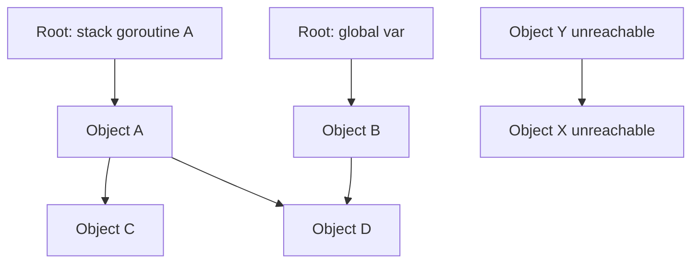
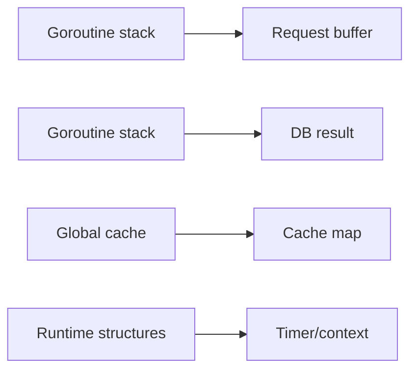
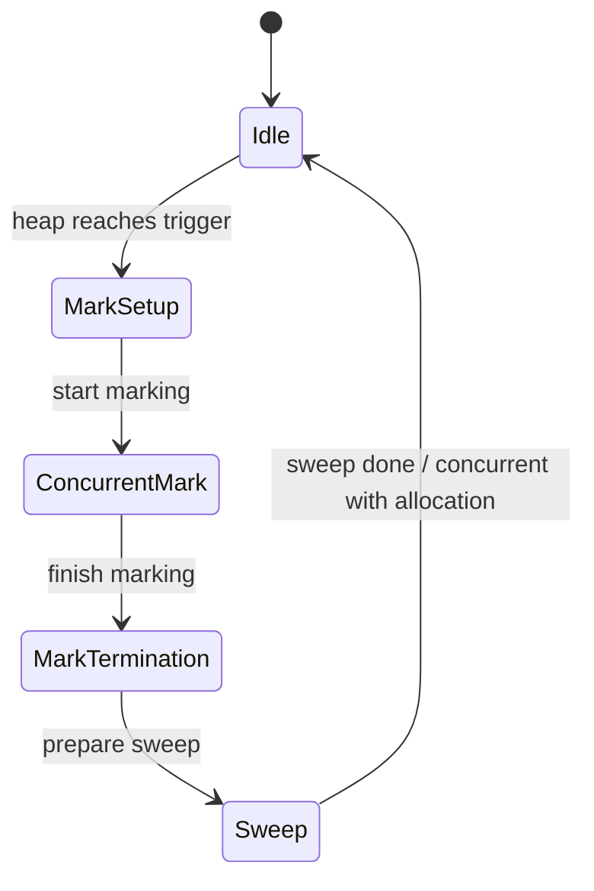
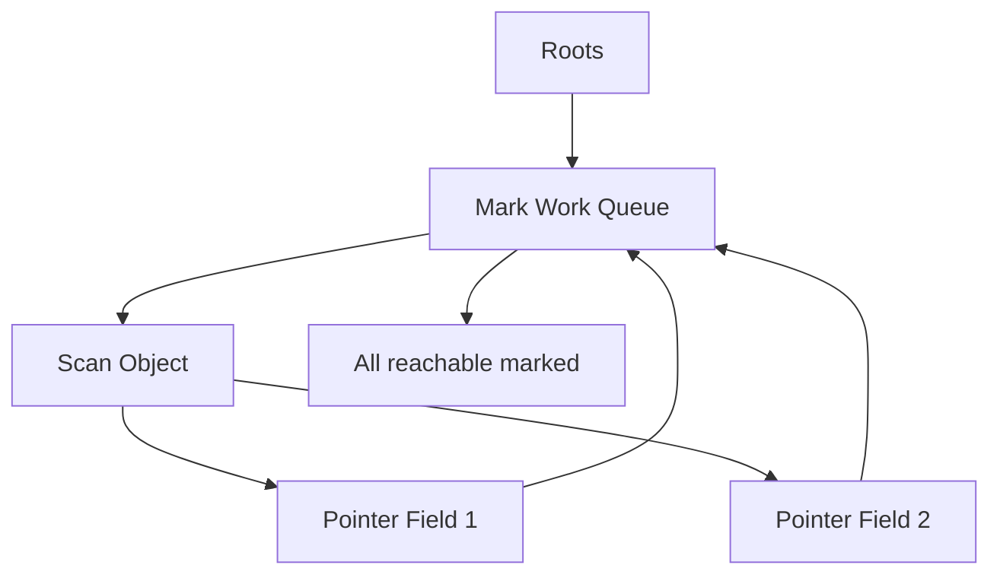
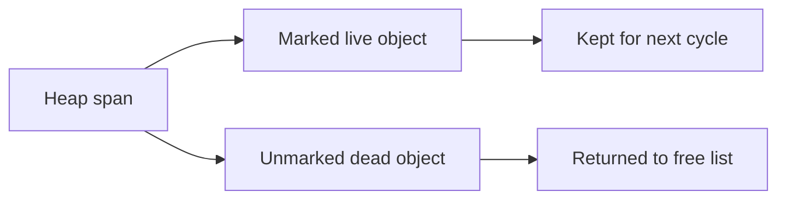
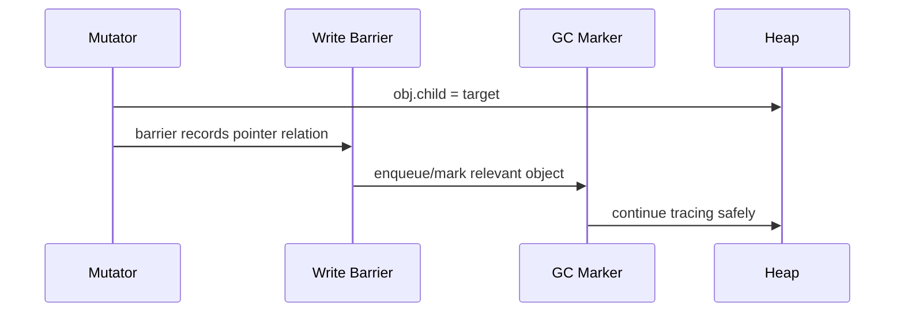
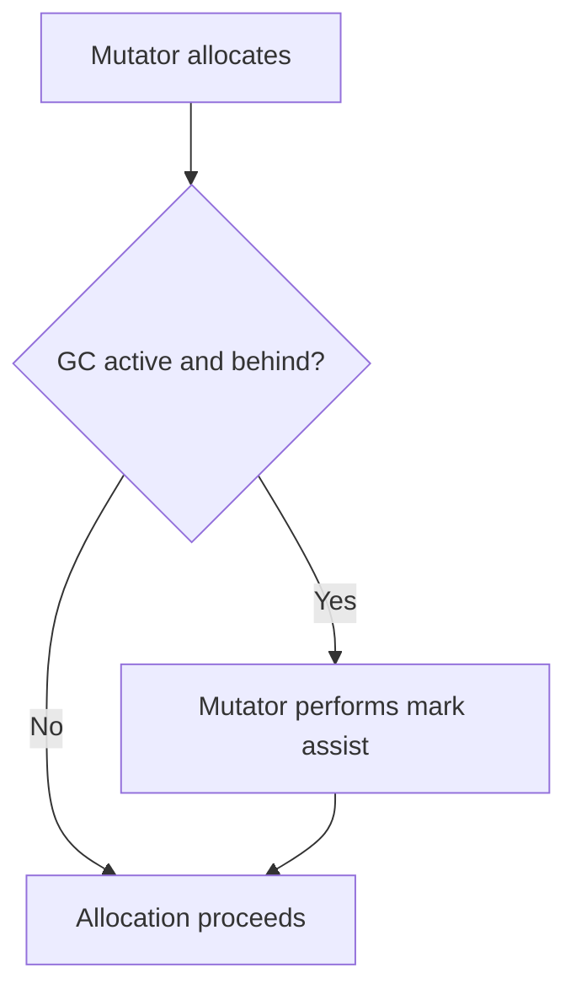
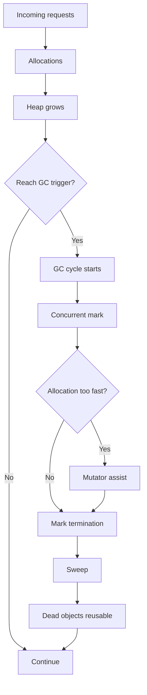
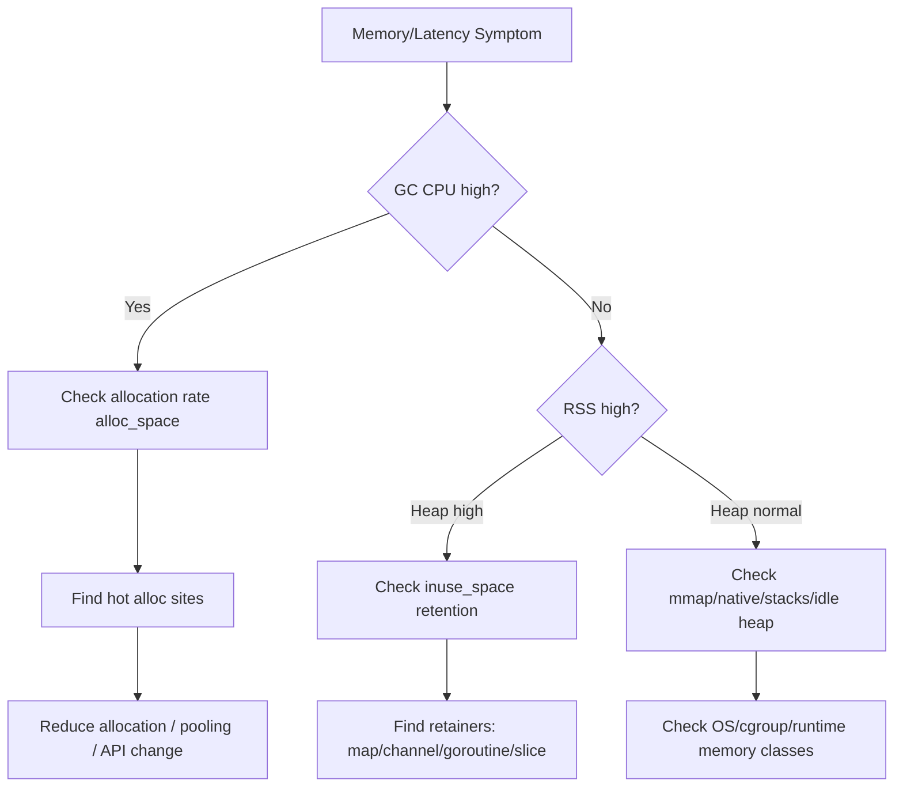

# learn-go-memory-systems-part-026.md

# Go Memory Systems Part 026 — Garbage Collector Architecture: Mark, Assist, Sweep, Write Barrier, Pacer

> Seri: `learn-go-memory-systems`  
> Part: `026`  
> Target: Go 1.26.x  
> Perspektif: Java software engineer menuju Go systems engineer  
> Status seri: **belum selesai** — ini bukan bagian terakhir.

---

## 0. Posisi Part Ini Dalam Seri

Di part sebelumnya kita membahas resource lifetime: finalizer, cleanup, `Close`, `runtime.KeepAlive`, dan resource eksternal. Sekarang kita kembali ke managed memory utama Go: **garbage collector**.

Namun bagian ini bukan sekadar “GC Go itu concurrent mark-sweep”. Itu terlalu dangkal.

Kita akan membangun model yang bisa dipakai untuk:

- membaca gejala production;
- mengerti kenapa allocation rate bisa lebih penting daripada heap size;
- membedakan live heap, heap goal, RSS, allocation churn;
- melihat kenapa pointer density bisa membuat GC lebih mahal;
- memahami kenapa `sync.Pool`, off-heap, zero-copy, dan struct layout punya hubungan langsung ke GC;
- melakukan design review sebelum service masuk production.

Mental model utama:

> Go GC adalah bagian dari runtime scheduling dan allocation economy.  
> Ia bukan proses background terpisah yang bisa kamu abaikan.

---

## 1. Tujuan Pembelajaran

Setelah menyelesaikan part ini, kamu harus mampu:

1. Menjelaskan Go GC sebagai tracing collector.
2. Membedakan:
   - roots,
   - object graph,
   - live heap,
   - allocated heap,
   - heap goal,
   - allocation rate,
   - GC CPU.
3. Menjelaskan fase:
   - mark setup,
   - concurrent mark,
   - mark termination,
   - sweep.
4. Menjelaskan write barrier dan kenapa dibutuhkan.
5. Menjelaskan mutator assist dan dampaknya ke latency.
6. Menjelaskan pacer dan heap goal.
7. Menjelaskan kenapa pointer-rich object lebih mahal discan.
8. Menjelaskan kenapa Go GC bukan generational collector seperti banyak JVM collector.
9. Mendesain data structure yang lebih GC-friendly.
10. Membaca GC symptom dari metrics dan profile.

---

## 2. Sumber Faktual Resmi yang Relevan

Fondasi faktual seri ini mengikuti dokumentasi resmi Go:

- Go GC Guide menjelaskan model tracing GC, cost model, live heap, heap goal, `GOGC`, dan memory limit.
- Package `runtime` mendokumentasikan environment variable seperti `GOGC`, `GOMEMLIMIT`, dan `GODEBUG=gctrace=1`.
- Package `runtime/debug` menyediakan `SetGCPercent`, `SetMemoryLimit`, dan `FreeOSMemory`.
- Package `runtime/metrics` mengekspos metric runtime termasuk heap, GC cycles, pause, finalizer/cleanup, dan memory classes.
- Go 1.26 release notes menyatakan perubahan penting runtime/GC modern seperti Green Tea GC sebagai default di Go 1.26.

Di part ini kita tetap fokus ke mental model yang stabil untuk engineer, bukan detail internal yang bisa berubah antar release.

---

## 3. Managed Memory Tidak Berarti Gratis

Di Go, kamu bisa menulis:

```go
b := make([]byte, 1024)
```

dan tidak memanggil `free`.

Tetapi “tidak memanggil free” bukan berarti tidak ada biaya.

Biaya managed memory muncul dalam bentuk:

- allocation cost;
- zeroing cost;
- pointer write barrier;
- heap growth;
- GC scan work;
- mark assist;
- cache locality loss;
- fragmentation;
- RSS growth;
- tail latency;
- CPU spent by runtime.

Dengan kata lain:

> GC menghapus manual free, bukan konsekuensi dari allocation.

---

## 4. GC Go Dalam Satu Kalimat

Versi sangat ringkas:

> Go GC adalah tracing, mostly concurrent, non-moving, mark-sweep garbage collector yang bekerja bersama mutator untuk menemukan object reachable dan membebaskan object unreachable.

Terminologi:

| Istilah | Makna |
|---|---|
| Mutator | Application goroutine yang mengubah heap |
| Collector | Runtime GC yang menemukan object live/dead |
| Root | Titik awal graph traversal |
| Mark | Menandai object reachable |
| Sweep | Mengembalikan memory object unreachable ke allocator |
| Write barrier | Mekanisme saat pointer write agar collector tidak kehilangan object |
| Assist | Mutator membantu GC saat allocation melampaui pace |
| Pacer | Komponen yang mengatur kapan GC mulai dan berapa kerja yang dibutuhkan |

---

## 5. Object Graph

GC melihat memory sebagai graph pointer.



Object A, B, C, D reachable. X dan Y unreachable.

GC tidak tahu business semantics. Jika object masih reachable dari root, ia dianggap live meskipun secara bisnis tidak dibutuhkan.

---

## 6. Roots

Root adalah titik awal tracing.

Contoh root:

- goroutine stacks;
- global variables;
- runtime structures;
- registers;
- finalizer/cleanup-related references;
- cgo handles/pinned references dalam kondisi tertentu.

Stack roots sangat penting. Jika kamu punya banyak goroutine dengan stack besar atau pointer ke object besar, root scanning dan retention bisa naik.



---

## 7. Reachability Bukan “Masih Dipakai”

Reachable berarti ada jalur pointer dari root.

Object bisa reachable karena:

- tersimpan di global cache;
- tersimpan di closure;
- tersimpan di goroutine yang leak;
- tersimpan di channel buffer;
- tersimpan di context value;
- tersimpan di map walaupun expired secara bisnis;
- tersimpan di slice backing array.

GC tidak bisa tahu:

- object sudah “tidak relevan”;
- cache entry expired tapi belum dihapus;
- goroutine seharusnya selesai;
- request sudah timeout tapi reference masih disimpan.

Jadi memory leak di Go sering berupa:

> accidental reachability.

---

## 8. Live Heap vs Allocated Heap

Dua angka sering tertukar:

| Istilah | Makna |
|---|---|
| Live heap | Object reachable setelah GC |
| Allocated heap | Total object yang dialokasikan selama periode |
| Allocation rate | Byte/object per detik yang dialokasikan |
| Retained heap | Object yang tetap live karena reachable |
| Heap goal | Target ukuran heap sebelum GC berikutnya |

Service bisa punya live heap kecil tetapi allocation rate besar. Hasilnya GC sering, CPU naik, latency naik.

Service lain bisa punya allocation rate kecil tetapi live heap besar karena cache. Hasilnya scan work dan memory footprint tinggi.

---

## 9. Allocation Rate Sebagai Musuh Tersembunyi

Contoh:

```text
live heap: 200 MB
allocation rate: 2 GB/s
```

Walaupun live heap hanya 200 MB, runtime harus menangani allocation churn besar.

Allocation churn muncul dari:

- `fmt.Sprintf` di hot path;
- `[]byte` to `string` conversion;
- `map[string]any`;
- per-request JSON intermediate;
- `io.ReadAll`;
- temporary slice growth;
- closure capture;
- interface boxing-like allocation;
- reflection-heavy logging/serialization.

Optimization sering harus menurunkan allocation rate, bukan hanya live heap.

---

## 10. Non-Moving GC

Go GC secara umum non-moving untuk heap object.

Artinya:

- object tidak dipindahkan untuk compaction umum;
- pointer ke object tetap valid selama object live;
- `unsafe` dan cgo lebih mudah dibanding moving collector;
- tetapi fragmentation/heap layout trade-off berbeda;
- locality tidak otomatis membaik melalui compaction.

Java collector modern seperti ZGC/Shenandoah/G1 punya model berbeda, termasuk relocation/compaction dalam kondisi tertentu. Go memilih trade-off yang cocok untuk simplicity, low latency, dan interoperability, tetapi engineer tetap perlu mengelola locality lewat data layout.

---

## 11. Bukan Generational Dalam Model JVM Umum

Banyak JVM collector memanfaatkan hipotesis:

> most objects die young.

Maka ada young generation, old generation, minor GC, promotion.

Go GC historically bukan generational collector dalam arti JVM umum. Go mengandalkan low-latency concurrent tracing dengan cost model yang berbeda.

Implikasi untuk Java engineer:

- Jangan berasumsi “object kecil sementara murah karena young-gen”.
- Allocation churn tetap berdampak langsung ke Go GC pacing.
- Mengurangi allocation di hot path sering lebih terlihat di Go.
- Pointer-free buffers bisa sangat membantu.

Go 1.26 membawa Green Tea GC sebagai default, tetapi mental model engineer tetap: live heap, pointer scanning, allocation rate, pacer, assist.

---

## 12. GC Cycle High-Level

Siklus GC kira-kira:



Ada stop-the-world pendek untuk transisi tertentu, tetapi mayoritas marking berjalan concurrent.

---

## 13. Mark Setup

Fase awal:

- runtime memulai GC cycle;
- menyiapkan barrier;
- menyiapkan work queues;
- mengidentifikasi roots;
- ada stop-the-world singkat untuk transisi state yang aman.

Tujuannya memastikan collector bisa mulai tracing graph sambil mutator lanjut berjalan.

---

## 14. Concurrent Mark

Pada fase mark:

- collector menelusuri pointer graph dari roots;
- object reachable ditandai;
- pointer fields discan;
- work dilakukan oleh GC workers;
- mutator bisa tetap berjalan;
- mutator yang allocate terlalu cepat bisa diminta assist.



---

## 15. Mark Termination

Mark termination memastikan semua marking selesai.

Pada tahap ini:

- runtime menyelesaikan mark work tersisa;
- ada stop-the-world singkat;
- write barrier state bisa diubah;
- heap live diketahui untuk cycle tersebut;
- sweep phase dapat dimulai.

Jika banyak pointer mutation terjadi atau mark work besar, termination bisa lebih mahal.

---

## 16. Sweep

Sweep membebaskan object yang tidak marked.

Sweep bisa berjalan:

- setelah mark selesai;
- lazily saat allocation membutuhkan span;
- concurrent dengan mutator.

Sweep tidak berarti memory langsung kembali ke OS. Memory bisa kembali ke allocator internal untuk reuse.



---

## 17. Return to Allocator vs Return to OS

Ketika object mati:

1. object memory bisa menjadi free space di runtime allocator;
2. runtime bisa reuse untuk allocation berikutnya;
3. tidak selalu langsung mengurangi RSS;
4. scavenger bisa mengembalikan page tertentu ke OS.

Jadi:

> GC freed object tidak selalu berarti RSS langsung turun.

Ini menjelaskan banyak incident “GC sudah jalan tapi memory pod tidak turun”.

---

## 18. Write Barrier

Masalah: GC marking concurrent, sementara mutator terus mengubah pointer graph.

Tanpa write barrier, collector bisa kehilangan object yang menjadi reachable setelah scanning tertentu.

Write barrier adalah kode yang dijalankan saat pointer write tertentu untuk menjaga invariant GC.

Contoh pointer mutation:

```go
obj.child = newChild
```

Saat GC aktif, runtime perlu memastikan newChild atau old pointer state tidak membuat object live terlewat.

---

## 19. Write Barrier Visual



Write barrier ada biayanya. Pointer-heavy mutation di saat GC aktif bisa lebih mahal.

---

## 20. Pointer-Free Data Bisa Lebih Murah

GC perlu scan pointer fields. Data tanpa pointer tidak perlu discan sebagai graph.

Contoh pointer-rich:

```go
type Node struct {
    Key   string
    Value []byte
    Next  *Node
}
```

Contoh pointer-light:

```go
type Entry struct {
    KeyOff uint32
    KeyLen uint32
    ValOff uint32
    ValLen uint32
}
```

Payload ada di big byte arena. Entry hanya integer offsets.

Trade-off:

- pointer-light lebih GC-friendly;
- tetapi API lebih kompleks;
- perlu bounds validation;
- ownership lebih manual;
- debugging lebih sulit.

Top engineer tidak selalu memilih pointer-light. Ia memilih ketika data volume/hot path membenarkan kompleksitas.

---

## 21. GC Scan Cost

Rough mental model:

```text
GC cost ~ amount of live heap to scan + pointer density + allocation rate + mutation rate
```

Byte count saja tidak cukup.

Object 1 GB `[]byte` berisi raw bytes tidak sama dengan graph 1 GB berisi jutaan pointer kecil.

```mermaid
flowchart LR
    A[1GB []byte payload] --> B[Small pointer header + no pointer scan in payload]
    C[1GB linked objects] --> D[Millions of objects + pointer scan + cache misses]
```

---

## 22. Object Count Matters

Banyak object kecil dapat mahal karena:

- metadata allocator;
- pointer graph traversal;
- poor locality;
- cache misses;
- mark queue overhead;
- sweeping many spans;
- allocation churn.

Kadang menggabungkan data ke contiguous buffers lebih baik.

---

## 23. Mutator Assist

Jika program allocate cepat saat GC sedang mengejar target, mutator bisa diminta membantu marking.

Artinya application goroutine melakukan sebagian kerja GC sebagai “pajak allocation”.

Symptoms:

- latency naik di allocation-heavy code path;
- CPU user/runtime naik;
- throughput turun saat GC pressure;
- profile menunjukkan runtime GC assist-related cost.

Mental model:



Mutator assist adalah alasan allocation rate bisa langsung terasa sebagai latency.

---

## 24. GC Pacer

Pacer mengatur:

- kapan GC mulai;
- berapa heap growth yang diizinkan;
- seberapa banyak work harus dilakukan;
- bagaimana collector mengejar allocation rate;
- target agar marking selesai sebelum heap melewati goal.

Dengan `GOGC=100`, secara kasar heap goal sekitar live heap + 100% growth, tetapi real behavior mempertimbangkan roots, memory limit, dan runtime heuristics.

Pacer mencoba menyeimbangkan:

- CPU GC,
- memory footprint,
- latency,
- allocation throughput.

---

## 25. Heap Goal

Simplified:

```text
heap goal = live heap after previous GC + growth allowance
```

Jika live heap 500 MB dan GOGC 100, heap goal kira-kira 1 GB.

Jika GOGC 50, heap goal kira-kira 750 MB.

Jika GOGC 200, heap goal kira-kira 1.5 GB.

Tetapi ini simplifikasi. Go runtime juga mempertimbangkan root set dan memory limit.

---

## 26. `GOGC`

`GOGC` mengatur target pertumbuhan heap relatif terhadap live heap.

| GOGC | Efek umum |
|---:|---|
| rendah | GC lebih sering, memory lebih rendah, CPU GC lebih tinggi |
| tinggi | GC lebih jarang, memory lebih tinggi, CPU GC bisa turun |
| off | GC disabled kecuali memory limit/forced scenario tertentu |

Jangan tuning `GOGC` tanpa metrics. Kalau allocation churn besar karena desain buruk, menaikkan `GOGC` hanya menukar CPU dengan memory.

---

## 27. `GOMEMLIMIT`

`GOMEMLIMIT` memberi soft memory limit untuk runtime.

Ia membantu containerized workloads karena runtime bisa menyesuaikan GC/scavenging agar mendekati limit.

Tetapi:

- bukan hard limit OS;
- tidak menghitung semua native/mmap memory seperti heap Go;
- jika terlalu rendah bisa menyebabkan GC thrashing;
- tetap butuh container/RSS observability.

---

## 28. GC Thrashing

GC thrashing terjadi ketika runtime harus GC sangat sering untuk memenuhi memory target/limit.

Symptoms:

- CPU tinggi;
- throughput turun;
- latency naik;
- heap tidak banyak turun;
- GC cycles sangat sering;
- allocation tetap tinggi;
- service seperti “sibuk membersihkan” bukan melayani request.

Root causes:

- memory limit terlalu rendah;
- live heap terlalu besar untuk limit;
- allocation rate terlalu tinggi;
- cache unbounded;
- object graph pointer-rich;
- mmap/native memory mengurangi room untuk Go heap di container.

---

## 29. Pause Time

Go GC dirancang untuk low pause. Tetapi pause bukan satu-satunya cost.

Ada:

- STW pause;
- concurrent mark CPU;
- mutator assist latency;
- write barrier overhead;
- sweep overhead;
- scavenger overhead;
- cache effects.

Java engineer sering fokus ke pause. Di Go, sering lebih berguna melihat:

- allocation/op,
- allocation rate,
- GC CPU fraction,
- heap goal/live heap,
- assist behavior,
- RSS vs heap,
- p99 latency correlation.

---

## 30. `GODEBUG=gctrace=1`

Untuk local/load test, `GODEBUG=gctrace=1` memberi log GC.

Gunakan untuk:

- melihat frekuensi GC;
- melihat heap before/after/goal;
- melihat CPU/pause;
- melihat apakah GC terlalu sering;
- korelasi dengan benchmark.

Jangan menjadikan parsing gctrace sebagai observability utama production. Gunakan metrics.

---

## 31. Runtime Metrics untuk GC

Metric penting:

- heap live/alloc objects;
- heap goal;
- GC cycles total;
- GC pause distribution;
- GC CPU fraction;
- memory classes;
- goroutine stacks;
- finalizer/cleanup queue;
- scan heap bytes;
- scan stack bytes;
- scan globals.

Nama detail metric bisa dicek di `runtime/metrics` versi Go target.

---

## 32. Diagram Memory/GC Economy



---

## 33. What Causes Object to Be Expensive for GC?

Expensive factors:

1. Contains pointers.
2. Points to many other objects.
3. Part of large graph.
4. Long-lived.
5. Mutated frequently during GC.
6. Allocated in huge quantity.
7. Poor locality.
8. Retained by global structures.
9. Stored in interface/reflection-heavy containers.
10. Keeps large backing arrays alive.

Cheap factors:

1. Pointer-free.
2. Short-lived and low allocation count.
3. Contiguous.
4. Reused safely.
5. Not retained accidentally.
6. Represented as offsets into byte buffer where appropriate.

---

## 34. GC-Friendly Struct Design

Bad for huge hot data:

```go
type Record struct {
    ID      string
    Name    string
    Tags    []string
    Payload []byte
    Next    *Record
}
```

Potentially better for storage/index:

```go
type RecordMeta struct {
    IDOff      uint32
    IDLen      uint32
    NameOff    uint32
    NameLen    uint32
    TagsOff    uint32
    TagsCount  uint32
    PayloadOff uint64
    PayloadLen uint32
}
```

Payload stored in byte arena/file.

Trade-off:

- loses ergonomic object model;
- needs validation;
- harder to mutate;
- better for immutable large data.

---

## 35. `sync.Pool` and GC

`sync.Pool` is GC-aware. Items can be dropped at any time, often around GC cycles.

Good use:

- temporary buffers;
- per-request scratch objects;
- expensive-to-allocate temporary objects;
- high-throughput path with clear reset.

Bad use:

- cache of important data;
- resource ownership;
- objects with hidden references not reset;
- large buffers that retain huge memory;
- relying on pool for deterministic reuse.

`sync.Pool` can reduce allocation rate, but can also hide retention if objects are not reset.

---

## 36. Pool Reset and Pointer Retention

If pooled object contains pointer fields, reset them.

Bad:

```go
type Work struct {
    Buf []byte
    Req *http.Request
    User *User
}
```

Returning to pool without clearing keeps request/user reachable.

Good:

```go
func (w *Work) Reset() {
    clear(w.Buf)
    w.Buf = w.Buf[:0]
    w.Req = nil
    w.User = nil
}
```

Even `Buf = Buf[:0]` keeps capacity. For huge buffers, maybe drop it.

---

## 37. Large Buffer Policy

For buffers:

```go
const maxKeep = 64 << 10

func putBuffer(b []byte) {
    if cap(b) > maxKeep {
        return
    }
    pool.Put(b[:0])
}
```

This avoids one huge request poisoning pool memory.

---

## 38. GC and Channels

Buffered channel retains elements.

```go
ch := make(chan []byte, 1000)
```

If each buffer is 1 MB, channel can retain up to 1 GB.

Even if workers are slow, GC sees buffers reachable via channel.

Channel is a memory queue. Size it like memory budget, not just concurrency convenience.

---

## 39. GC and Context

`context.WithValue` can retain large data until context tree dies.

Bad:

```go
ctx = context.WithValue(ctx, "requestBody", bigBytes)
```

Better:

- store small IDs;
- pass large data explicitly;
- avoid context as object bag.

---

## 40. GC and Errors

Error wrapping can retain large object if error struct holds pointer to request/response/buffer.

Bad:

```go
type ParseError struct {
    Input []byte
    Cause error
}
```

If logged/stored, entire input retained.

Better:

```go
type ParseError struct {
    Offset int
    Code string
    Cause error
}
```

Keep error metadata small.

---

## 41. GC and Logging

Structured logging with `any` fields can allocate and retain.

Bad hot path:

```go
logger.Info("request", "body", body)
```

Risks:

- large body retained;
- conversion allocation;
- log buffer growth;
- sensitive data leak.

Better:

```go
logger.Info("request",
    "body_len", len(body),
    "request_id", requestID,
)
```

---

## 42. GC and JSON

`encoding/json` with `map[string]any` creates many allocations and interface values.

For hot path:

- decode into struct;
- stream with `json.Decoder`;
- avoid intermediate `map[string]any`;
- reuse encoder/decoder carefully;
- avoid `RawMessage` retention of huge original buffer unless intended.

---

## 43. GC and Reflection

Reflection often:

- boxes values;
- creates temporary objects;
- hides escape;
- scans dynamic graph;
- reduces compiler optimization.

Reflection is fine for control plane/config/admin paths. Be careful in data plane hot paths.

---

## 44. GC and Slices

Subslice retention:

```go
small := big[:10]
cache[key] = small
```

GC keeps whole backing array alive.

Fix:

```go
small := bytes.Clone(big[:10])
cache[key] = small
```

Copying 10 bytes can free gigabytes.

---

## 45. GC and Maps

Maps can retain:

- keys;
- values;
- overflow buckets;
- pointer graph;
- deleted-but-not-shrunk backing storage.

Deleting entries helps reachability of keys/values, but map backing capacity may remain.

For unbounded maps:

- add eviction;
- rebuild periodically if needed;
- use bounded cache;
- track size in bytes, not item count only.

---

## 46. GC and Goroutine Leaks

Leaked goroutine retains its stack and references.

Example:

```go
go func() {
    buf := make([]byte, 10<<20)
    <-neverClosed
    _ = buf
}()
```

GC sees `buf` reachable from goroutine stack.

Always debug memory leak with goroutine profile too.

---

## 47. GC and Pointer Receiver

Pointer receiver can cause object to escape if method value/closure/interface stores receiver.

Not always bad, but review:

```go
cb := obj.Method
```

Method value can capture receiver.

If callback lives long, receiver and its graph stay live.

---

## 48. Measuring Allocation

Use:

```bash
go test -bench . -benchmem
go test -run '^$' -bench BenchmarkX -memprofile mem.out
go tool pprof mem.out
go build -gcflags=-m=2 ./...
```

Look for:

- allocs/op;
- B/op;
- top alloc sites;
- escape reasons;
- allocation stack traces;
- object retention in heap profile.

---

## 49. Heap Profile: `alloc_space` vs `inuse_space`

| Profile | Meaning |
|---|---|
| alloc_space | cumulative allocation volume |
| inuse_space | currently live/retained memory |
| alloc_objects | cumulative object count |
| inuse_objects | currently live object count |

If CPU/GC high, look at `alloc_space`.

If memory footprint high, look at `inuse_space`.

---

## 50. GC Tuning Comes After Design

Order of operations:

1. Measure allocation and retention.
2. Fix obvious unbounded retention.
3. Reduce hot path allocation.
4. Reduce pointer-rich graph if needed.
5. Bound queues/caches.
6. Tune `GOGC`/`GOMEMLIMIT`.
7. Validate under production-like load.

Do not start by setting `GOGC=off` or huge values.

---

## 51. Java Engineer Translation

| Java mental model | Go translation |
|---|---|
| Young gen absorbs short-lived allocation | Go allocation churn still directly pressures pacer/assist |
| ZGC/Shenandoah low pause via relocation/barriers | Go low pause via concurrent non-moving tracing |
| Object header overhead matters | Go object count/size class/pointer graph matters |
| DirectByteBuffer off-heap | mmap/cgo/native memory; not Go heap |
| Escape analysis scalar replacement | Go escape analysis stack vs heap decisions |
| GC logs | `gctrace`, runtime metrics, pprof |

---

## 52. Production Design Review Questions

Ask for any Go service:

- What is allocation/op for key request?
- What is allocation rate under peak?
- What is live heap after steady state?
- What is heap goal?
- What is GC CPU fraction?
- Are there large pointer-rich graphs?
- Are queues bounded by bytes?
- Are caches bounded and evicted?
- Are large buffers copied/retained accidentally?
- Are pprof endpoints secured?
- Is RSS explained by Go heap + native/mmap?
- Is `GOMEMLIMIT` aligned with container limit?
- Is tail latency correlated with GC cycles?

---

## 53. Incident Playbook: GC CPU Spike

1. Check allocation rate.
2. Check recent deployment.
3. Compare `alloc_space` before/after.
4. Identify top allocation sites.
5. Check `fmt`, JSON, logging, string/byte conversions.
6. Check request size distribution.
7. Check pool reset/regression.
8. Check `GOGC`/`GOMEMLIMIT` changes.
9. Validate with benchmark.
10. Patch allocation source, not just GC knob.

---

## 54. Incident Playbook: Heap Keeps Growing

1. Check `inuse_space`.
2. Inspect heap profile dominators.
3. Check maps/caches/channels.
4. Check goroutine profile.
5. Look for subslice retention.
6. Look for context/error/log retention.
7. Check finalizer/cleanup backlog.
8. Check native/mmap if RSS but not heap.
9. Add size bounds/eviction.
10. Validate after GC cycles.

---

## 55. Incident Playbook: RSS High, Heap Normal

Likely causes:

- heap idle not released yet;
- goroutine stacks;
- mmap resident pages;
- cgo/native memory;
- page cache accounting;
- fragmentation;
- shared library/text;
- OS allocator behavior.

Actions:

- inspect runtime memory classes;
- inspect RSS/cgroup;
- inspect mmap/native metrics;
- trigger controlled `debug.FreeOSMemory` only for diagnosis, not as normal fix;
- review memory limit;
- review native/mmap lifecycle.

---

## 56. Mermaid: GC Symptom Decision Tree



---

## 57. Mini Lab 1 — Allocation Churn

Create benchmark:

```go
func BenchmarkFmt(b *testing.B) {
    for i := 0; i < b.N; i++ {
        _ = fmt.Sprintf("id=%d", i)
    }
}

func BenchmarkAppendInt(b *testing.B) {
    dst := make([]byte, 0, 32)
    for i := 0; i < b.N; i++ {
        x := dst[:0]
        x = strconv.AppendInt(x, int64(i), 10)
        _ = x
    }
}
```

Compare `B/op` and `allocs/op`.

Goal:

- see how API choice affects allocation churn.

---

## 58. Mini Lab 2 — Pointer-Rich vs Pointer-Light

Build two representations for many records:

1. `[]*Record` with strings/slices.
2. `[]RecordMeta` with offsets into `[]byte`.

Measure:

- heap objects;
- allocation/op;
- GC time;
- lookup speed;
- code complexity.

Goal:

- understand trade-off, not blindly prefer offsets.

---

## 59. Mini Lab 3 — Subslice Retention

1. Allocate 100 MB buffer.
2. Store 10-byte subslice globally.
3. Force GC.
4. Inspect heap.
5. Replace with clone.
6. Force GC.
7. Compare.

Goal:

- see reachability through backing array.

---

## 60. Mini Lab 4 — Channel Memory Queue

Create:

```go
ch := make(chan []byte, 1000)
```

Send large buffers faster than consumer.

Observe:

- heap growth;
- goroutine behavior;
- GC cycles.

Then bound by bytes or reduce channel capacity.

Goal:

- see channel as memory reservoir.

---

## 61. Anti-Patterns

Avoid:

1. Treating Go GC as free.
2. Looking only at pause time.
3. Ignoring allocation rate.
4. Ignoring pointer density.
5. Using `map[string]any` in hot path.
6. Logging large objects.
7. Storing request body in context.
8. Returning subslice of huge buffer into cache.
9. Unbounded channels/caches.
10. Pooling without reset.
11. Pooling huge buffers without cap limit.
12. Tuning `GOGC` before profiling.
13. Ignoring RSS because heap is fine.
14. Assuming JVM GC intuition transfers directly.
15. Disabling GC to “fix” performance.

---

## 62. What Top Engineers Notice

A weak explanation says:

> “GC is slow.”

A stronger analysis asks:

- Which allocation site?
- What is allocation rate?
- What is live heap?
- What is heap goal?
- Is the object graph pointer-rich?
- Is latency from pause or assist?
- Is RSS from heap or mmap/native?
- Is retention accidental?
- Is the queue/cache bounded by bytes?
- Is the optimization reducing allocations or only moving them?

GC work is often a symptom. The cause is usually data structure/API/lifecycle design.

---

## 63. Summary

Go GC is a concurrent tracing collector with a cost model that rewards:

- low allocation rate;
- low pointer density;
- bounded live heap;
- clear ownership;
- streaming instead of buffering;
- pointer-free contiguous data where appropriate;
- avoiding accidental retention;
- measuring before tuning.

The collector is good, but not magic. It can reclaim unreachable Go heap memory. It cannot:

- know business lifetime;
- close external resources deterministically;
- make unbounded queues safe;
- make pointer-rich graphs cheap;
- explain native/mmap RSS alone;
- fix bad API ownership.

The engineer’s job is to shape memory behavior so the runtime can do its job efficiently.

---

## 64. Part 026 Completion Checklist

Kamu siap lanjut jika bisa menjawab:

- Apa itu root dalam Go GC?
- Apa bedanya live heap dan allocation rate?
- Kenapa object reachable bisa tetap menjadi leak?
- Apa fungsi write barrier?
- Apa itu mutator assist?
- Apa fungsi pacer?
- Kenapa pointer-free data sering lebih GC-friendly?
- Kenapa heap profile kecil tapi RSS besar?
- Kapan lihat `alloc_space` vs `inuse_space`?
- Kenapa tuning GC harus setelah profiling?

---

## 65. Seri Belum Selesai

Bagian ini adalah:

```text
learn-go-memory-systems-part-026.md
```

Part berikutnya:

```text
learn-go-memory-systems-part-027.md
```

Topik berikutnya:

```text
GC tuning: GOGC, GOMEMLIMIT, container memory, latency vs throughput
```

<!-- NAVIGATION_FOOTER -->
<div class="page-nav">
<a href="./learn-go-memory-systems-part-025.md">⬅️ Go Memory Systems Part 025 — Finalizers, Cleanup, Lifetime Pinning, `runtime.KeepAlive`, Why Cleanup Is Hard</a>
<a href="./index.md">📚 Kategori</a>
<a href="../../index.md">🏠 Home</a>
<a href="./learn-go-memory-systems-part-027.md">Go Memory Systems Part 027 — GC Tuning: `GOGC`, `GOMEMLIMIT`, Container Memory, Latency vs Throughput ➡️</a>
</div>
