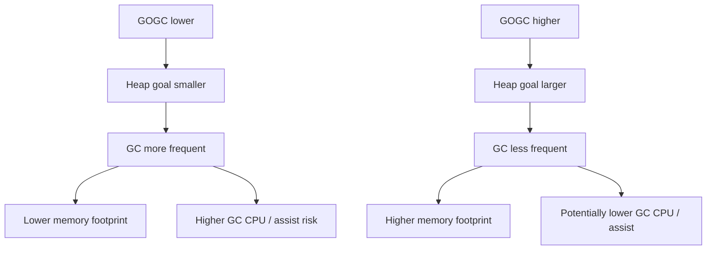
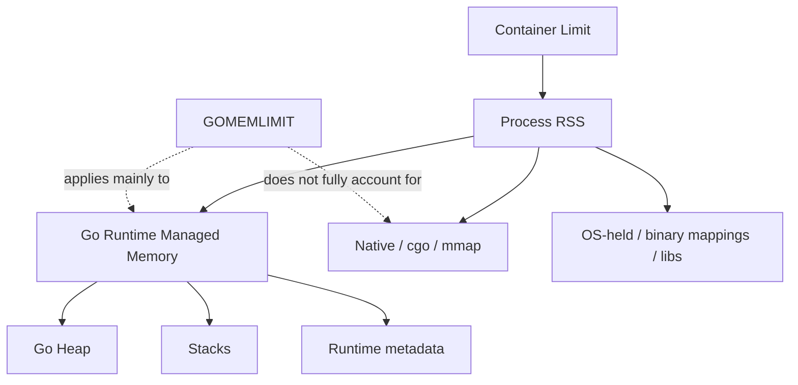
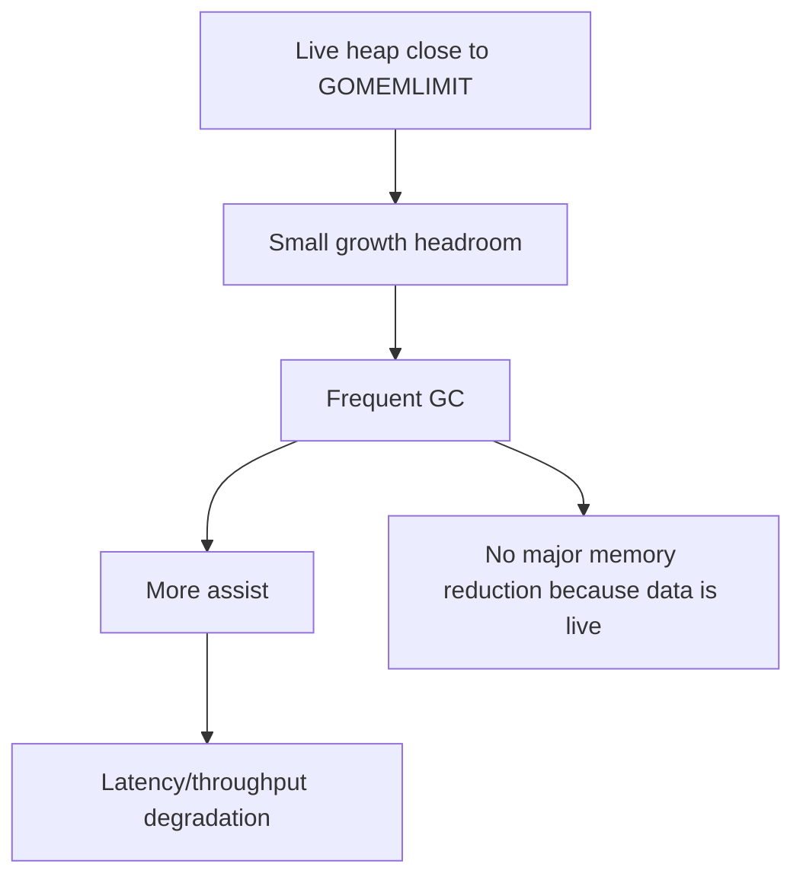
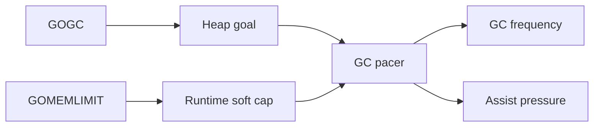
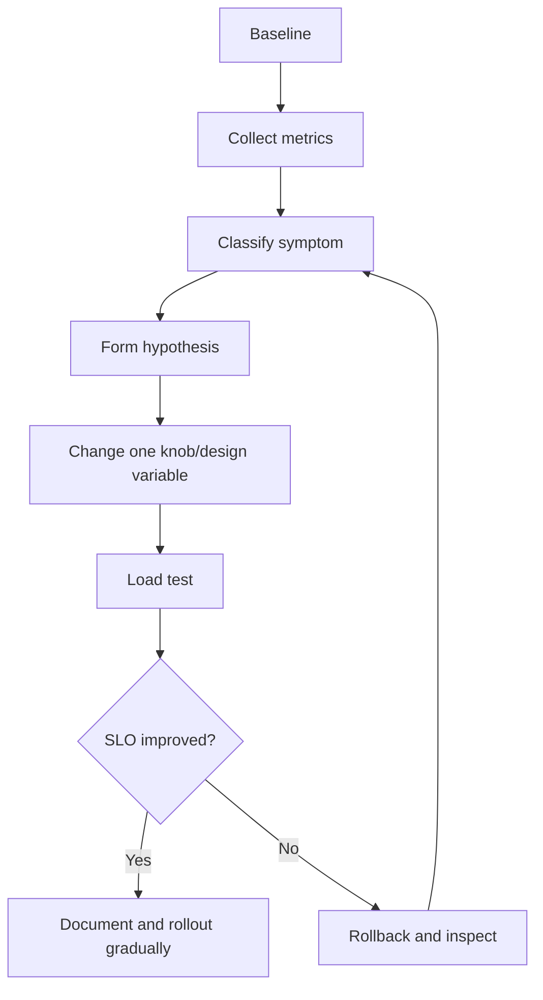
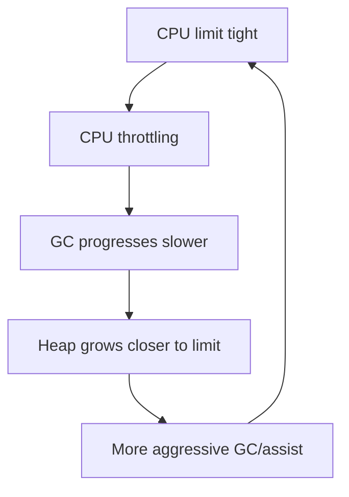
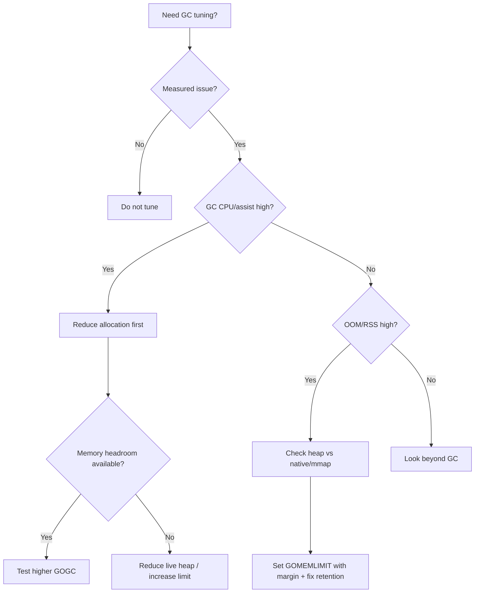

# learn-go-memory-systems-part-027.md

# Go Memory Systems Part 027 — GC Tuning: `GOGC`, `GOMEMLIMIT`, Container Memory, Latency vs Throughput

> Seri: `learn-go-memory-systems`  
> Part: `027`  
> Target: Go 1.26.x  
> Perspektif: Java software engineer menuju Go systems engineer  
> Status seri: **belum selesai** — ini bukan bagian terakhir.

---

## 0. Posisi Part Ini Dalam Seri

Part 026 menjelaskan arsitektur GC: roots, object graph, mark, sweep, write barrier, mutator assist, pacer, heap goal, dan kenapa pointer graph serta allocation rate sering lebih penting daripada sekadar ukuran heap.

Part 027 membahas pertanyaan yang biasanya muncul setelah itu:

> “Kalau begitu, `GOGC` dan `GOMEMLIMIT` harus di-set berapa?”

Jawaban matang bukan angka universal.

Jawaban matang adalah proses:

1. pahami workload;
2. ukur live heap;
3. ukur allocation rate;
4. ukur RSS dan container limit;
5. pahami memory eksternal;
6. tentukan SLO latency/throughput;
7. tentukan memory budget;
8. set knob dengan hipotesis;
9. validasi lewat load test;
10. pantau di production.

Tuning GC yang benar bukan ritual. Ia adalah **capacity engineering**.

---

## 1. Tujuan Pembelajaran

Setelah menyelesaikan part ini, kamu harus mampu:

1. Menjelaskan fungsi `GOGC`.
2. Menjelaskan fungsi `GOMEMLIMIT`.
3. Membedakan heap goal, live heap, runtime memory, RSS, dan container memory.
4. Menentukan kenapa setting `GOGC` rendah/tinggi bisa membantu atau merusak.
5. Menentukan kenapa `GOMEMLIMIT` terlalu rendah bisa menyebabkan GC thrashing.
6. Mendesain memory budget untuk Kubernetes/container.
7. Membaca symptom tuning dari metrics.
8. Membuat tuning plan untuk:
   - latency-sensitive API;
   - high-throughput service;
   - batch job;
   - memory-constrained container;
   - mmap/native-memory-heavy service.
9. Menghindari anti-pattern seperti `GOGC=off` tanpa memory limit yang benar.
10. Membuat load test matrix untuk membuktikan tuning.

---

## 2. Sumber Faktual Resmi yang Relevan

Fakta utama yang perlu dipegang:

- `GOGC` mengatur target persentase GC. Default-nya 100. Secara kasar, GC dipicu ketika newly allocated data mencapai persentase tertentu dari live data setelah collection terakhir.
- `GOMEMLIMIT` mengatur soft memory limit untuk runtime Go. Dokumentasi runtime menjelaskan limit ini mencakup Go heap dan memory lain yang dikelola runtime, tetapi mengecualikan memory eksternal seperti memory dari bahasa lain, mapping binary, dan memory yang dikelola OS behalf program.
- `runtime/debug.SetMemoryLimit` memberi runtime soft memory limit dan runtime akan mencoba menghormatinya lewat GC lebih sering dan pengembalian memory ke OS lebih agresif; dokumentasinya juga menegaskan limit ini tidak menghitung memory eksternal seperti memory non-Go.
- `runtime/metrics` menyediakan `/gc/gogc:percent` dan `/gc/gomemlimit:bytes` serta berbagai metric memory/GC untuk observability.
- Go GC Guide menjelaskan cost model GC, live heap, heap goal, dan trade-off antara memory overhead dan CPU.

---

## 3. Tuning Bukan Mengalahkan GC

Tuning yang buruk bertanya:

> “Bagaimana supaya GC jarang jalan?”

Tuning yang baik bertanya:

> “Berapa memory overhead yang boleh dibayar untuk menurunkan CPU/latency GC, sambil tetap aman dari OOM?”

Tuning adalah trade-off:

```text
more memory headroom
  -> potentially fewer GC cycles
  -> less assist pressure
  -> better throughput
  -> but higher RSS/OOM risk

less memory headroom
  -> more frequent GC
  -> lower heap footprint
  -> potentially lower RSS
  -> but higher CPU and tail latency
```

Tidak ada setting tunggal untuk semua service.

---

## 4. Memory Vocabulary

| Istilah | Makna |
|---|---|
| Live heap | Object Go reachable setelah GC |
| Heap goal | Target heap runtime sebelum cycle berikutnya |
| Allocation rate | Byte/object dialokasikan per waktu |
| GC CPU | CPU yang dipakai collector dan assist |
| RSS | Resident Set Size process di OS |
| Runtime memory | Memory yang dikelola runtime Go |
| Native memory | cgo/C allocation, mmap, OS-managed memory di luar runtime |
| Container limit | Batas memory cgroup/Kubernetes |
| Safety margin | Headroom untuk spike, stacks, native, kernel, fragmentation |

Tuning yang aman harus melihat semuanya.

---

## 5. `GOGC` Mental Model

`GOGC` menentukan seberapa besar heap boleh tumbuh relatif terhadap live heap.

Simplified:

```text
heap goal ≈ live heap + live heap * GOGC/100
```

Jika live heap setelah GC = 1 GB:

| GOGC | Approx heap goal |
|---:|---:|
| 50 | 1.5 GB |
| 100 | 2.0 GB |
| 200 | 3.0 GB |
| 400 | 5.0 GB |

Ini simplifikasi. Runtime juga mempertimbangkan roots, memory limit, dan heuristik pacer.

---

## 6. Dampak `GOGC`



Rule:

- Turunkan `GOGC` jika memory footprint terlalu besar dan CPU masih cukup.
- Naikkan `GOGC` jika GC CPU/assist tinggi dan memory headroom cukup.
- Jangan tuning tanpa load test.

---

## 7. `GOGC=off`

`GOGC=off` menonaktifkan GC berbasis persentase.

Ini sangat berbahaya kecuali:

- batch job punya memory upper bound jelas;
- proses short-lived;
- `GOMEMLIMIT` tetap dipasang;
- memory profile dipahami;
- failure OOM diterima/dikontrol.

Untuk long-running service, `GOGC=off` biasanya anti-pattern.

---

## 8. `GOMEMLIMIT` Mental Model

`GOMEMLIMIT` memberi runtime target soft memory.

Bukan hard process limit.

Ia membantu runtime:

- menjalankan GC lebih agresif saat mendekati limit;
- mengembalikan memory ke OS lebih agresif;
- tetap menghormati limit bahkan bila `GOGC=off`.

Tetapi ia tidak mencakup semua memory process.



---

## 9. `GOMEMLIMIT` Bukan `-Xmx`

Java engineer sering mencari analog `-Xmx`.

`GOMEMLIMIT` bukan exact `-Xmx`.

Perbandingan:

| Java `-Xmx` | Go `GOMEMLIMIT` |
|---|---|
| Hard-ish cap untuk Java heap | Soft limit runtime memory |
| Tidak termasuk native/direct/metaspace | Tidak termasuk semua external/native/OS memory |
| JVM collector menyesuaikan heap | Go runtime menyesuaikan GC/scavenging |
| OOM bisa terjadi dalam heap | OS/container OOM tetap bisa terjadi |

Jangan set `GOMEMLIMIT` sama dengan container limit penuh.

---

## 10. Container Memory Budget

Untuk Kubernetes:

```text
container_limit
  >= GOMEMLIMIT
   + native/mmap/cgo memory
   + binary/libs
   + kernel/socket buffers
   + page tables
   + safety margin
```

Practical rule awal:

```text
GOMEMLIMIT = 70% - 85% of container limit
```

Tetapi angka ini harus dikoreksi jika:

- service pakai mmap besar;
- cgo/native allocation besar;
- banyak goroutine stack;
- banyak socket buffer;
- TLS/compression buffers besar;
- sidecar/agent dalam container sama;
- workload punya spike request body.

---

## 11. Example Budget

Pod limit: 2 GiB.

Estimate:

```text
container limit            2048 MiB
native/mmap expected        200 MiB
goroutine stacks             80 MiB
runtime metadata             80 MiB
binary/libs/other            80 MiB
spike/safety margin          300 MiB
-----------------------------------
available for Go runtime   ~1308 MiB
```

Set awal:

```text
GOMEMLIMIT=1200MiB
```

Kemudian validasi.

Jika service tidak pakai native/mmap dan workload stabil, bisa lebih tinggi. Jika upload/network buffers besar, perlu lebih rendah.

---

## 12. Jangan Set `GOMEMLIMIT` Terlalu Dekat Limit Pod

Jika pod limit 2 GiB dan `GOMEMLIMIT=2GiB`, OS bisa OOMKill karena:

- RSS > runtime managed memory;
- native memory tidak dihitung;
- page cache/socket buffers/stacks/metadata tetap ada;
- transient spike melewati limit;
- runtime limit soft, bukan cgroup hard stop.

Better:

```text
pod memory limit: 2GiB
GOMEMLIMIT:      1.4GiB - 1.7GiB depending workload
```

---

## 13. GC Thrashing Karena `GOMEMLIMIT` Terlalu Rendah

Jika limit terlalu rendah dibanding live heap:

```text
live heap = 900 MiB
GOMEMLIMIT = 1 GiB
allocation rate = high
```

Runtime hanya punya sedikit ruang antara live heap dan limit. Akibatnya:

- GC sangat sering;
- mutator assist meningkat;
- CPU naik;
- latency naik;
- heap tidak bisa turun karena data memang live;
- service “sibuk GC” terus.



Solusi bukan selalu menaikkan GC agresivitas. Bisa jadi:

- kurangi live heap;
- kecilkan cache;
- ubah data layout;
- naikkan pod limit;
- naikkan GOMEMLIMIT;
- split service/workload.

---

## 14. Latency vs Throughput

Tuning memory berhubungan dengan SLO.

Latency-sensitive API:

- hindari allocation spike;
- hindari assist di request hot path;
- pakai `GOMEMLIMIT` dengan headroom cukup;
- jangan terlalu rendah `GOGC`;
- monitor p99/p999 saat GC;
- reduce allocation lebih efektif daripada knob.

High-throughput batch:

- mungkin boleh `GOGC` lebih tinggi;
- memory lebih besar untuk menurunkan CPU GC;
- maybe process-level memory limit lebih longgar;
- throughput lebih penting daripada small memory footprint.

Memory-constrained service:

- `GOMEMLIMIT` penting;
- `GOGC` mungkin lebih rendah;
- harus kurangi live heap;
- strict buffer/cache limit;
- throughput mungkin dikorbankan.

---

## 15. Knob Interaction

`GOGC` dan `GOMEMLIMIT` berinteraksi.

- `GOGC` menentukan heap growth target relatif live heap.
- `GOMEMLIMIT` membatasi runtime memory secara soft.
- Jika heap goal dari `GOGC` melebihi limit, runtime akan lebih agresif.
- Jika limit sangat rendah, `GOGC` tinggi tidak banyak membantu.
- Jika limit longgar, `GOGC` lebih dominan.



---

## 16. Tuning Workflow



Rules:

- change one thing at a time;
- use production-like load;
- compare p50/p95/p99/p999;
- compare allocation rate and RSS;
- watch OOM risk;
- include warmup and steady state;
- include spike test.

---

## 17. Baseline Metrics

Before tuning, collect:

### Go runtime

- heap live;
- heap alloc;
- heap goal;
- heap objects;
- allocation rate;
- GC cycles/sec;
- GC CPU;
- pause histogram;
- scan heap bytes;
- scan stack bytes;
- goroutine count;
- stack memory;
- memory classes;
- `GOGC`;
- `GOMEMLIMIT`.

### OS/container

- RSS;
- cgroup memory current;
- cgroup memory limit;
- OOM events;
- major page faults;
- CPU throttling;
- open FDs.

### App

- request rate;
- p50/p95/p99 latency;
- error rate;
- queue length;
- cache size bytes;
- buffer pool stats;
- request/response body size distribution.

---

## 18. Symptom: GC CPU High

Likely causes:

- allocation rate high;
- many small temporary objects;
- pointer-rich graph;
- low `GOGC`;
- low `GOMEMLIMIT`;
- reflection/logging/JSON overhead;
- buffer pooling regression;
- new feature creates intermediate allocations.

Actions:

1. inspect `alloc_space`;
2. run benchmark with `-benchmem`;
3. inspect escape analysis;
4. reduce allocation source;
5. consider raising `GOGC` if memory allows;
6. check if `GOMEMLIMIT` causing aggressive GC.

Do not immediately set `GOGC=1000`.

---

## 19. Symptom: OOMKilled

Likely causes:

- container limit too low;
- `GOMEMLIMIT` not set or too high;
- native/mmap memory ignored;
- request body buffering;
- cache unbounded;
- goroutine leak;
- channel queue large;
- RSS not explained by Go heap;
- memory spike during deploy/reload.

Actions:

1. inspect last RSS/cgroup memory;
2. compare Go heap vs RSS;
3. inspect mmap/native metrics;
4. inspect request size spike;
5. inspect goroutine count;
6. inspect cache/channel size;
7. set lower `GOMEMLIMIT` with margin;
8. reduce live heap/retention.

---

## 20. Symptom: Latency Spike During Load

Likely causes:

- mutator assist;
- allocation burst;
- page faults from mmap;
- CPU saturation from GC;
- lock contention around pools;
- buffer growth;
- JSON/logging hot path.

Actions:

- correlate p99 with GC cycles;
- inspect runtime trace;
- inspect allocation profile;
- compare with higher `GOGC`;
- reduce allocation in request path;
- increase memory headroom if safe;
- avoid request-size amplification.

---

## 21. Symptom: Memory Low But CPU High

If memory footprint is low because `GOGC`/`GOMEMLIMIT` forces frequent GC, CPU might be unnecessarily high.

Actions:

- raise `GOGC`;
- raise `GOMEMLIMIT`;
- increase pod limit if business allows;
- reduce allocation hot spots;
- validate throughput improvement.

This is common when teams over-tighten memory to “be efficient” but spend more CPU.

---

## 22. Symptom: Memory High But GC CPU Low

This may be okay if memory is cheap and SLO is throughput.

But review:

- OOM risk;
- node packing cost;
- cold restart warmup;
- cache is bounded;
- memory retained intentionally;
- no accidental subslice/map/goroutine leak.

If intentional, document memory budget. If accidental, fix retention.

---

## 23. Workload Profiles

### Stateless HTTP API

Typical:

- moderate live heap;
- high allocation per request if careless;
- p99 important.

Strategy:

- reduce alloc/op;
- set `GOMEMLIMIT` below pod limit;
- maybe raise `GOGC` if memory available;
- avoid request buffering;
- secure pprof.

### Batch ETL

Typical:

- high throughput;
- sequential processing;
- memory spikes from batching.

Strategy:

- stream;
- set batch size by bytes;
- `GOGC` can be higher if memory available;
- explicit `GOMEMLIMIT`;
- monitor peak RSS.

### Cache-heavy service

Typical:

- large live heap;
- GC scans lots of reachable data.

Strategy:

- bound cache by bytes;
- reduce pointer density;
- consider off-heap/mmap only with accounting;
- `GOGC` high may increase footprint too much;
- use memory limit carefully.

### Native/mmap-heavy service

Typical:

- heap profile underreports RSS;
- `GOMEMLIMIT` not enough.

Strategy:

- separate native budget;
- expose mapped/native bytes;
- lower `GOMEMLIMIT` to leave RSS headroom;
- avoid page fault latency;
- watch cgroup memory.

---

## 24. Example Tuning Matrix

For one service, test:

| Variant | GOGC | GOMEMLIMIT | Expected |
|---|---:|---:|---|
| baseline | default | unset | current behavior |
| safer memory | 100 | 70% pod | lower OOM risk |
| throughput | 200 | 80% pod | lower GC CPU, higher memory |
| tight memory | 50 | 65% pod | lower memory, higher CPU |
| stress | 100 | 55% pod | test thrashing boundary |

Measure:

- p50/p95/p99;
- RPS;
- CPU;
- GC CPU;
- RSS;
- heap live;
- OOM/headroom;
- error rate.

---

## 25. Load Test Requirements

A GC tuning test must include:

- warmup period;
- steady-state period;
- spike traffic;
- large request cases;
- cache warm state;
- cache churn state;
- reload/deploy behavior if relevant;
- representative payload size distribution;
- enough duration for multiple GC cycles;
- CPU limit/throttling same as prod.

Short microbenchmarks cannot prove service-level tuning alone.

---

## 26. Environment Variables

Typical container:

```yaml
env:
  - name: GOMEMLIMIT
    value: "1536MiB"
  - name: GOGC
    value: "150"
```

But prefer documenting why:

```text
Pod limit: 2GiB
Reserved native/stacks/other: ~350MiB
Safety margin: ~150MiB
Runtime target: 1536MiB
GOGC: 150 after load test reduced GC CPU 18% with p99 unchanged
```

---

## 27. Dynamic Tuning

You can change:

- `debug.SetGCPercent(percent)`;
- `debug.SetMemoryLimit(bytes)`.

Use dynamic tuning carefully.

Good use:

- CLI/batch phase changes;
- memory-aware service startup;
- controlled experiments;
- emergency mitigation.

Bad use:

- random feedback loop without stability;
- changing every few seconds;
- no observability;
- hiding memory leak;
- auto-tuner with no guardrails.

---

## 28. Phase-Based Batch Tuning

Example:

```go
old := debug.SetGCPercent(300)
defer debug.SetGCPercent(old)

// bulk load phase
loadData()

debug.SetGCPercent(100)
runtime.GC()

serve()
```

This can work if:

- phase boundaries are explicit;
- memory peak acceptable;
- `GOMEMLIMIT` still protects process;
- load phase is tested.

---

## 29. `debug.FreeOSMemory`

`debug.FreeOSMemory` forces GC and attempts to return memory to OS.

Use cases:

- diagnostic;
- CLI after huge temporary phase;
- controlled batch transition.

Anti-pattern:

- calling every request;
- cron-like “memory cleanup” in server;
- using it to hide retention;
- relying on it for normal latency.

If RSS high due to live heap, `FreeOSMemory` will not solve it.

---

## 30. Kubernetes Considerations

Memory tuning in K8s must include:

- request vs limit;
- CPU limit/throttling;
- pod density;
- node memory pressure;
- OOMKill events;
- sidecars;
- liveness/readiness behavior under GC thrash;
- graceful shutdown memory spike;
- rolling deploy double capacity.

GC CPU can cause CPU throttling if CPU limit too low. CPU throttling can slow GC, which can increase memory pressure. This feedback loop matters.



---

## 31. CPU Limit and GC

If container CPU is limited, GC workers and mutators share limited CPU.

Symptoms:

- GC cycles take longer;
- assist increases;
- latency spikes;
- memory grows more before marking catches up;
- throttling metrics correlate with GC.

Sometimes increasing CPU limit reduces memory risk.

---

## 32. Memory Request vs Limit

If request too low but limit high:

- pod may be scheduled onto crowded node;
- node pressure can affect performance;
- OOM risk from overcommit.

If limit too close to request and too low:

- GC may thrash;
- service unstable.

Capacity engineering must set both request and limit based on measured steady-state and spike.

---

## 33. Headroom Policy

A production policy might be:

```text
steady RSS <= 60% limit
p99 RSS <= 75% limit
stress RSS <= 85% limit
OOM margin >= 15%
```

Or stricter for critical services.

For batch jobs, policy differs.

Important: document the policy.

---

## 34. Cache Budget

Caches are part of live heap.

Cache policy should use bytes, not only entries.

```go
type CacheBudget struct {
    MaxBytes int64
}
```

If one entry can be 1 byte or 10 MB, item count limit is not enough.

GC tuning cannot fix unbounded cache.

---

## 35. Queue Budget

Buffered channels/queues should be bounded by memory.

Bad:

```go
jobs := make(chan Job, 100000)
```

If `Job` retains 100 KB, queue can retain 10 GB.

Better:

- smaller channel;
- byte-based semaphore;
- backpressure;
- streaming;
- reject/429.

---

## 36. Allocation Budget Per Request

For API:

```text
target allocation/request <= X KB
target allocs/request <= Y
```

You can enforce with benchmarks for core handlers.

Example:

```go
func BenchmarkHandleRequest(b *testing.B) {
    b.ReportAllocs()
    for i := 0; i < b.N; i++ {
        handle(sampleRequest)
    }
}
```

Use as regression guard.

---

## 37. GOGC Selection Heuristic

Starting points:

| Workload | Starting GOGC |
|---|---:|
| default unknown | 100 |
| latency-sensitive, enough memory | 100–200 after test |
| throughput batch, enough memory | 200–500 after test |
| memory-constrained | 50–100 |
| cache-heavy large live heap | test carefully, often 100–200 |
| native/mmap heavy | GOGC less important than GOMEMLIMIT/RSS |

These are not prescriptions. They are experiment seeds.

---

## 38. GOMEMLIMIT Selection Heuristic

Start:

```text
GOMEMLIMIT = container_limit - reserved_non_go - safety_margin
```

Where:

```text
reserved_non_go =
  expected native/cgo/mmap resident
+ stack estimate
+ runtime metadata estimate
+ binary/libs
+ socket/kernel buffer margin
```

If unknown, start conservative:

```text
GOMEMLIMIT = 70% of container limit
```

Then measure.

---

## 39. Measuring Stack Memory

Many goroutines can make stack memory significant.

Metrics/runtime can show stack memory class. Goroutine profile shows count and stacks.

If goroutine count grows:

- memory grows;
- root scanning grows;
- scheduling overhead grows;
- leak may retain heap.

GC tuning does not fix goroutine leak.

---

## 40. Memory Limit With mmap/native

If service maps 4 GiB index but working set resident ~600 MiB:

```text
pod limit: 3GiB
expected mmap RSS: 600MiB
other native: 100MiB
safety: 300MiB
GOMEMLIMIT: ~2GiB
```

But if workload can touch entire 4 GiB index, pod limit 3 GiB may be invalid.

Mmap needs working set analysis.

---

## 41. Tuning and `sync.Pool`

Before raising `GOGC`, check if allocation churn can be reduced by safe pooling.

But `sync.Pool` can:

- retain large buffers;
- hide references;
- increase memory footprint;
- reduce allocation but increase complexity;
- be cleared around GC.

Use pool for temporary, resettable, non-owning objects.

---

## 42. Tuning and Struct Layout

If GC scan is high:

- reduce pointer fields;
- split hot/cold fields;
- store pointer-free metadata;
- avoid linked structures for huge data;
- use contiguous arrays;
- consider indexes over object graph.

This may outperform knob tuning.

---

## 43. Tuning and Streaming

If memory pressure comes from buffering whole requests/files:

- streaming beats GC tuning;
- `io.CopyBuffer`;
- `json.Decoder`;
- `bufio`;
- chunked processing;
- bounded queue.

Do not tune GC to survive `io.ReadAll` on untrusted 2 GB input.

---

## 44. Tuning and Logging

If allocation profile shows logging:

- avoid logging large payload;
- avoid `fmt.Sprintf` before level check;
- avoid `map[string]any` fields in hot path;
- use typed attributes where possible;
- sample logs under load.

GC tuning cannot compensate for verbose hot-path logging at scale.

---

## 45. Tuning and JSON

If JSON dominates allocation:

- decode into structs;
- use streaming decoder for large arrays;
- avoid `interface{}` trees;
- reuse buffers carefully;
- evaluate generated codecs only after correctness.

Always benchmark with representative payloads.

---

## 46. Tuning and Error Handling

Errors can retain data.

Avoid errors that store full payload/request.

Use:

- offset;
- code;
- small excerpt;
- request ID;
- cause.

Memory tuning cannot fix retained giant error chains.

---

## 47. Canary Rollout

GC tuning should be rolled out gradually:

1. load test;
2. staging;
3. one canary pod;
4. compare metrics;
5. expand percentage;
6. monitor OOM/p99/CPU;
7. rollback plan.

GC tuning can change failure mode. Treat it like performance-sensitive config.

---

## 48. Document the Decision

Every non-default tuning should document:

```text
Service:
Workload:
Pod limit:
Baseline heap/RSS:
Baseline GC CPU:
Chosen GOGC:
Chosen GOMEMLIMIT:
Reason:
Load test evidence:
Rollback:
Owner:
Review date:
```

Without this, future engineers cargo-cult configs.

---

## 49. Example Decision Record

```text
Decision: Set GOMEMLIMIT=1536MiB and GOGC=150.

Context:
- Pod memory limit: 2GiB.
- Service has no cgo/mmap.
- Steady RSS baseline: 1.1GiB.
- p99 latency correlated with GC assist under peak.
- Allocation rate after optimization: 450MiB/s.

Evidence:
- GOGC=100: GC CPU 14%, p99 180ms.
- GOGC=150: GC CPU 10%, p99 150ms, RSS p99 1.55GiB.
- GOGC=200: GC CPU 8%, p99 148ms, RSS p99 1.82GiB, too close to limit.

Decision:
- Use GOGC=150.
- Use GOMEMLIMIT=1536MiB.
- Alert if RSS > 1.75GiB or GC CPU > 15%.
```

---

## 50. Mermaid: Tuning Decision Tree



---

## 51. Common Bad Advice

Bad advice:

- “Always set GOGC=off for performance.”
- “Always set GOGC=50 for low latency.”
- “Set GOMEMLIMIT equal to pod limit.”
- “If heap profile is small, memory is fine.”
- “If GC CPU is high, just raise GOGC.”
- “Call `debug.FreeOSMemory` periodically.”
- “Use sync.Pool everywhere.”
- “Move everything off-heap.”

All are context-dependent, and most are dangerous as defaults.

---

## 52. Production Alerts

Useful alerts:

- RSS > 85% container limit for N minutes.
- GC CPU > threshold.
- GC cycles/sec sudden increase.
- Heap live growing monotonically.
- Allocation rate sudden increase after deploy.
- Goroutine count growing.
- Native/mmap bytes growing.
- OOMKilled event.
- p99 latency correlated with GC assist.
- Cache bytes above budget.

Avoid alerting on single GC pause in isolation unless tied to SLO.

---

## 53. Dashboard Layout

Suggested dashboard panels:

1. Request rate / error rate / latency.
2. CPU usage / throttling.
3. RSS / cgroup memory / limit.
4. Go heap live / heap alloc / heap goal.
5. Allocation rate.
6. GC cycles/sec.
7. GC CPU / pause histogram.
8. Goroutine count / stack memory.
9. Memory classes.
10. Native/mmap/cache/queue bytes.
11. OOM events.
12. Deployment markers.

GC metrics without app metrics are hard to interpret.

---

## 54. Mini Lab 1 — GOGC Sweep

Run same allocation benchmark with:

```bash
GOGC=50 go test -bench . -benchmem
GOGC=100 go test -bench . -benchmem
GOGC=200 go test -bench . -benchmem
```

For service test:

```bash
GODEBUG=gctrace=1 GOGC=50 ./server
GODEBUG=gctrace=1 GOGC=200 ./server
```

Observe:

- memory footprint;
- GC frequency;
- throughput;
- p99 latency.

---

## 55. Mini Lab 2 — GOMEMLIMIT Pressure

Run workload with different memory limits:

```bash
GOMEMLIMIT=512MiB ./server
GOMEMLIMIT=1024MiB ./server
GOMEMLIMIT=1536MiB ./server
```

Observe:

- GC cycles;
- CPU;
- RSS;
- latency;
- OOM risk.

Do not run dangerously low limit in shared environment.

---

## 56. Mini Lab 3 — Container Budget

Take a real service and fill:

```text
Pod memory limit:
Steady RSS:
Peak RSS:
Go heap live:
Heap goal:
Goroutine stack:
Native/mmap:
Cache bytes:
Queue bytes:
Recommended GOMEMLIMIT:
Recommended GOGC test range:
```

This lab forces engineering discipline.

---

## 57. Mini Lab 4 — Allocation Fix vs GC Knob

Pick hot path with allocation.

Test:

1. baseline `GOGC=100`;
2. raise `GOGC=200`;
3. optimize allocation source;
4. compare.

Often allocation fix beats knob tuning and reduces both CPU and memory.

---

## 58. Review Checklist

Before changing GC settings:

- Do we know the actual symptom?
- Do we have baseline metrics?
- Is heap or RSS the problem?
- Is native/mmap memory involved?
- Is live heap intentionally large?
- Is allocation rate high?
- Are caches/queues bounded?
- Are goroutines leaking?
- Is CPU throttling present?
- Do we know pod memory limit/request?
- Did we load test?
- Is rollback easy?
- Is decision documented?

---

## 59. Anti-Patterns

Avoid:

1. Setting `GOMEMLIMIT` equal to container limit.
2. Setting `GOMEMLIMIT` below live heap reality.
3. Raising `GOGC` to hide allocation churn without memory budget.
4. Lowering `GOGC` to reduce memory then ignoring CPU latency.
5. Disabling GC in long-running service.
6. Calling `runtime.GC()` periodically.
7. Calling `debug.FreeOSMemory()` as normal operation.
8. Ignoring mmap/native memory.
9. Looking only at heap profile for OOMKilled pod.
10. Tuning in staging with unrealistic payloads.
11. Using average latency instead of p99/p999.
12. Ignoring CPU throttling.
13. Copy-pasting GC settings across services.
14. Not documenting non-default knobs.
15. Treating `sync.Pool` as deterministic memory manager.

---

## 60. What Top Engineers Notice

A weak tuning proposal says:

> “Set GOGC to 200, it will be faster.”

A strong tuning proposal says:

- Baseline GC CPU is 16%.
- Allocation rate is 700 MiB/s.
- Live heap is 600 MiB.
- Pod limit is 2 GiB.
- RSS p99 is 1.3 GiB.
- Native memory is negligible.
- GOGC 150 reduced GC CPU to 11% and p99 from 210ms to 170ms.
- GOGC 200 improved little more but RSS p99 reached 1.8 GiB.
- Choose GOGC 150 and GOMEMLIMIT 1536MiB.
- Alert and rollback defined.

That is the difference between guessing and engineering.

---

## 61. Summary

GC tuning in Go is about balancing:

- memory footprint,
- CPU,
- latency,
- throughput,
- OOM risk,
- container limits,
- workload shape.

`GOGC` controls heap growth target relative to live heap.  
`GOMEMLIMIT` gives runtime a soft memory budget.  
Neither replaces good memory design.

Best order:

1. measure;
2. fix retention;
3. reduce allocation;
4. bound cache/queue/buffer;
5. set `GOMEMLIMIT` with OS/container margin;
6. adjust `GOGC` based on tested trade-off;
7. monitor in production.

---

## 62. Part 027 Completion Checklist

Kamu siap lanjut jika bisa menjawab:

- Apa efek menaikkan `GOGC`?
- Apa efek menurunkan `GOGC`?
- Kenapa `GOMEMLIMIT` bukan hard process cap?
- Kenapa `GOMEMLIMIT` tidak boleh sama dengan pod limit?
- Apa tanda GC thrashing?
- Bagaimana memilih starting `GOMEMLIMIT`?
- Bagaimana membedakan masalah heap vs RSS?
- Kapan tuning knob kalah dari allocation reduction?
- Apa metric wajib sebelum tuning?
- Bagaimana membuat tuning decision record?

---

## 63. Seri Belum Selesai

Bagian ini adalah:

```text
learn-go-memory-systems-part-027.md
```

Part berikutnya:

```text
learn-go-memory-systems-part-028.md
```

Topik berikutnya:

```text
Memory observability: pprof heap, allocs, goroutine leak, block/mutex profile
```

<!-- NAVIGATION_FOOTER -->
<div class="page-nav">
<a href="./learn-go-memory-systems-part-026.md">⬅️ Go Memory Systems Part 026 — Garbage Collector Architecture: Mark, Assist, Sweep, Write Barrier, Pacer</a>
<a href="./index.md">📚 Kategori</a>
<a href="../../index.md">🏠 Home</a>
<a href="./learn-go-memory-systems-part-028.md">Go Memory Systems Part 028 — Memory Observability: pprof Heap, Allocs, Goroutine Leak, Block/Mutex Profile ➡️</a>
</div>
