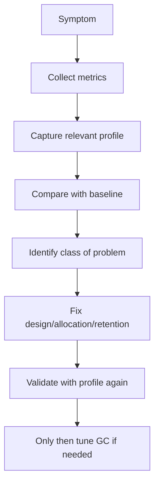
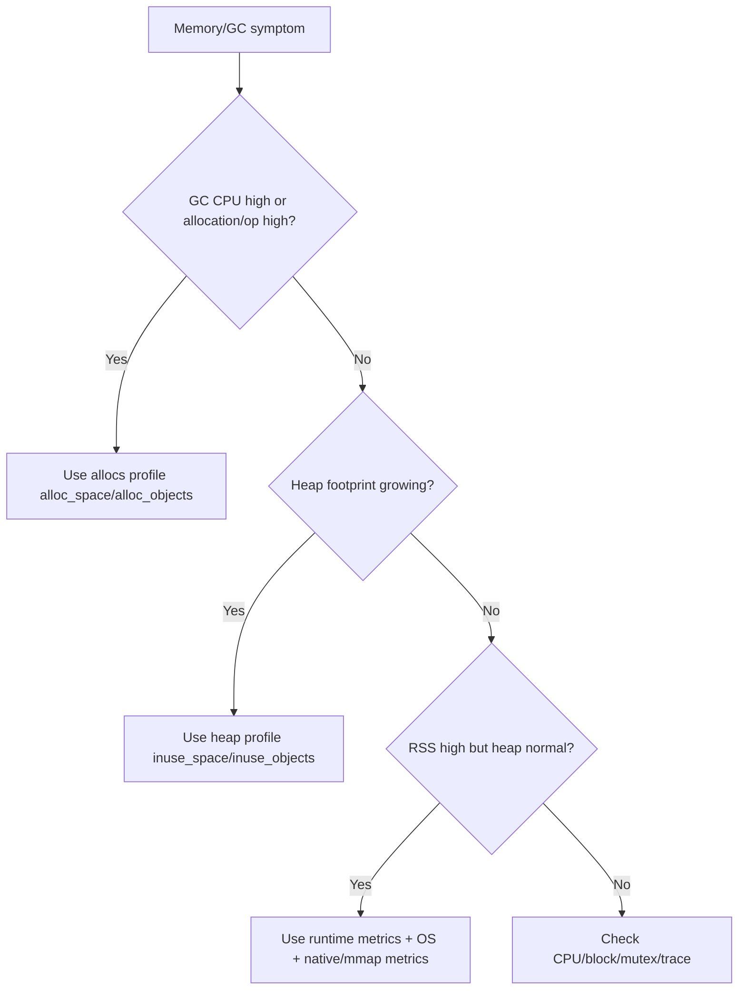
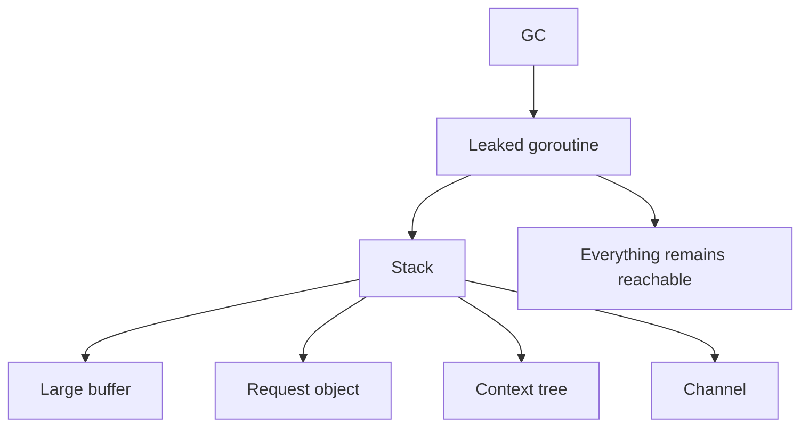
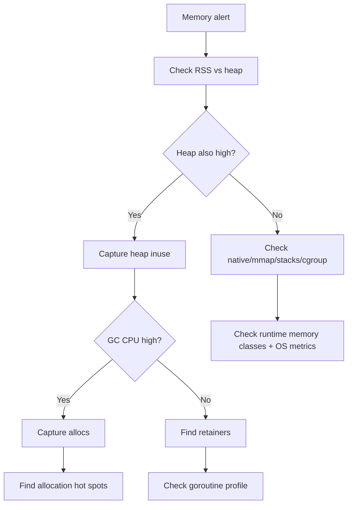
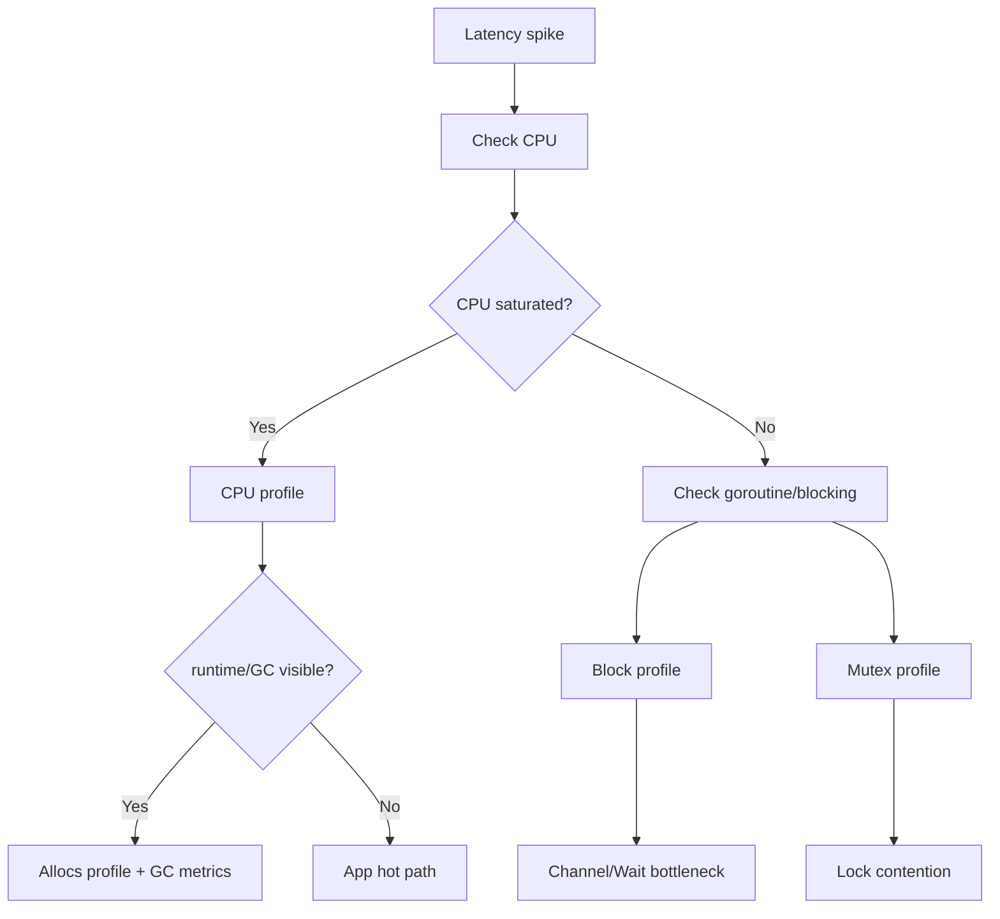
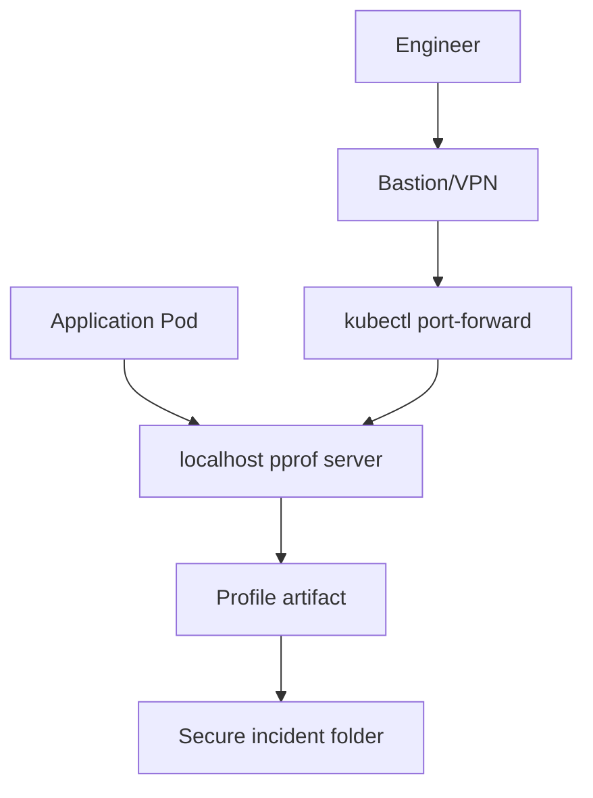

# learn-go-memory-systems-part-028.md

# Go Memory Systems Part 028 — Memory Observability: pprof Heap, Allocs, Goroutine Leak, Block/Mutex Profile

> Seri: `learn-go-memory-systems`  
> Part: `028`  
> Target: Go 1.26.x  
> Perspektif: Java software engineer menuju Go systems engineer  
> Status seri: **belum selesai** — ini bukan bagian terakhir.

---

## 0. Posisi Part Ini Dalam Seri

Part 026 membahas arsitektur GC.  
Part 027 membahas tuning GC dengan `GOGC`, `GOMEMLIMIT`, container budget, latency, dan throughput.

Sekarang kita masuk ke bagian yang menentukan apakah kamu bisa memperbaiki masalah memory secara nyata:

> observability.

Tanpa observability, engineer biasanya melakukan tiga kesalahan:

1. menebak-nebak penyebab memory naik;
2. tuning `GOGC`/`GOMEMLIMIT` tanpa tahu masalahnya;
3. mengoptimasi allocation padahal problem sebenarnya retention/goroutine leak/native memory.

Part ini membangun workflow untuk menjawab pertanyaan seperti:

- Apakah ini allocation churn atau retained heap?
- Apakah heap besar karena cache, goroutine leak, atau subslice retention?
- Kenapa RSS besar padahal heap profile kecil?
- Apakah latency spike dari GC, blocking, mutex contention, atau page fault?
- Kapan memakai heap profile, allocs profile, goroutine profile, block profile, mutex profile, trace, dan runtime metrics?

---

## 1. Tujuan Pembelajaran

Setelah menyelesaikan part ini, kamu harus mampu:

1. Mengaktifkan dan mengamankan pprof endpoint.
2. Membedakan profile:
   - heap,
   - allocs,
   - goroutine,
   - block,
   - mutex,
   - threadcreate,
   - CPU.
3. Memahami `inuse_space`, `inuse_objects`, `alloc_space`, dan `alloc_objects`.
4. Mendiagnosis:
   - allocation churn,
   - retained heap,
   - goroutine leak,
   - channel blockage,
   - mutex contention,
   - native/mmap RSS gap.
5. Membuat profiling workflow yang aman untuk production.
6. Menggunakan runtime metrics sebagai dashboard/alerting layer.
7. Membaca pprof sebagai evidence, bukan oracle.
8. Menghindari false conclusion dari profile yang diambil pada waktu yang salah.
9. Membuat incident playbook memory/GC/blocking.
10. Mendesain observability baseline untuk Go service production-grade.

---

## 2. Sumber Faktual Resmi yang Relevan

Beberapa dasar resmi:

- Dokumentasi Go diagnostics menjelaskan tooling profiling, tracing, heap dump, goroutine, block, mutex, dan kapan masing-masing digunakan.
- Package `runtime/pprof` mendokumentasikan profile runtime. Block profile melacak waktu goroutine blocked pada synchronization primitives seperti `sync.Mutex`, `sync.RWMutex`, `sync.WaitGroup`, `sync.Cond`, channel send/receive/select. Mutex profile melacak contention pada mutex.
- Package `net/http/pprof` menyediakan HTTP handler untuk data profiling runtime, dengan endpoint di bawah `/debug/pprof/`.
- Go 1.26 menambahkan experimental `goroutineleak` profile di `runtime/pprof` untuk mendeteksi kelas goroutine leak tertentu.
- Package `runtime/metrics` menyediakan metric runtime yang bisa dipakai untuk dashboard dan alerting.

---

## 3. Observability First, Tuning Second

Urutan yang benar:



Urutan yang salah:

```text
memory naik -> set GOGC lebih rendah
latency naik -> set GOGC lebih tinggi
RSS besar -> force runtime.GC()
```

Knob tuning tanpa diagnosis sering hanya memindahkan masalah.

---

## 4. Jenis Pertanyaan dan Tool yang Cocok

| Pertanyaan | Tool utama |
|---|---|
| Siapa yang mengalokasikan paling banyak sepanjang waktu? | allocs profile / `alloc_space` |
| Siapa yang masih menahan memory sekarang? | heap profile / `inuse_space` |
| Kenapa goroutine count naik? | goroutine profile / goroutine leak profile |
| Kenapa CPU tidak penuh tapi latency tinggi? | block/mutex profile |
| Kenapa p99 naik saat load? | trace + CPU + allocs |
| Kenapa RSS tinggi tapi heap kecil? | runtime metrics + OS/cgroup + mmap/native metrics |
| Kenapa GC CPU tinggi? | allocs + runtime metrics + heap goal |
| Kenapa service deadlock/hang? | goroutine + block profile |
| Kenapa lock contention tinggi? | mutex profile |

---

## 5. pprof Mental Model

pprof adalah format dan tool untuk profile sample.

Ia tidak “mengerti seluruh program”. Ia menampilkan sample stack yang dikumpulkan oleh runtime/tooling.

Profile adalah evidence probabilistik/berbasis sampling dalam banyak kasus.

Interpretasi harus mempertimbangkan:

- kapan profile diambil;
- durasi capture;
- sampling rate;
- workload saat capture;
- warmup vs steady state;
- profile type;
- object live vs cumulative allocation;
- profile labels;
- compiler inlining;
- optimized code;
- GC timing.

---

## 6. Mengaktifkan `net/http/pprof`

Untuk server internal:

```go
import _ "net/http/pprof"
```

Jika memakai default mux:

```go
go func() {
    log.Println(http.ListenAndServe("127.0.0.1:6060", nil))
}()
```

Endpoint ada di:

```text
/debug/pprof/
```

Tetapi production-grade service tidak boleh expose pprof sembarangan.

---

## 7. Security Rule untuk pprof

pprof bisa membocorkan:

- stack traces;
- function names;
- query/path/payload jika muncul di labels/log;
- memory pattern;
- goroutine state;
- internal architecture;
- potentially sensitive strings dalam heap/profile context.

Production rule:

- bind ke localhost/private admin network;
- protect dengan auth;
- jangan expose ke public internet;
- rate limit;
- audit access;
- disable jika compliance tidak mengizinkan;
- gunakan short capture duration;
- sanitize operational process.

```mermaid
flowchart LR
    Internet[Public Internet] -. forbidden .-> PPROF[/debug/pprof]
    VPN[VPN/Admin Network] --> Auth[Authz/Authn]
    Auth --> PPROF
    Local[localhost sidecar/debug shell] --> PPROF
```

---

## 8. Common pprof Commands

Capture heap:

```bash
go tool pprof http://localhost:6060/debug/pprof/heap
```

Capture allocs:

```bash
go tool pprof http://localhost:6060/debug/pprof/allocs
```

Capture goroutine:

```bash
go tool pprof http://localhost:6060/debug/pprof/goroutine
```

Capture CPU for 30s:

```bash
go tool pprof "http://localhost:6060/debug/pprof/profile?seconds=30"
```

Web UI:

```bash
go tool pprof -http=:0 heap.pb.gz
```

Top:

```text
(pprof) top
(pprof) top -cum
(pprof) list FunctionName
(pprof) web
(pprof) traces
```

---

## 9. Heap Profile: `inuse_space`

Use `inuse_space` when asking:

> “Apa yang masih live sekarang?”

Good for:

- memory leak;
- retained cache;
- subslice retention;
- goroutine retaining buffers;
- large maps;
- object graph still reachable;
- steady-state heap footprint.

Command:

```bash
go tool pprof -sample_index=inuse_space http://localhost:6060/debug/pprof/heap
```

Interpretation:

- flat: memory allocated directly in function;
- cum: memory allocated by function and callees;
- top retainers may reflect allocation site, not logical owner.

---

## 10. Heap Profile: `inuse_objects`

Use `inuse_objects` when object count matters.

Example problems:

- millions of tiny objects;
- map/list node explosion;
- per-request small structs retained;
- string/object fragmentation;
- GC overhead from object count.

Command:

```bash
go tool pprof -sample_index=inuse_objects http://localhost:6060/debug/pprof/heap
```

High object count can hurt GC even if bytes are moderate.

---

## 11. Allocs Profile: `alloc_space`

Use `alloc_space` when asking:

> “Siapa yang menyebabkan allocation churn?”

Good for:

- GC CPU high;
- mutator assist;
- temporary allocations;
- `fmt.Sprintf`;
- JSON/reflection/logging;
- string/byte conversion;
- buffer growth;
- `map[string]any`;
- per-request allocation regression.

Command:

```bash
go tool pprof -sample_index=alloc_space http://localhost:6060/debug/pprof/allocs
```

`alloc_space` is cumulative, not current live memory.

---

## 12. Allocs Profile: `alloc_objects`

Use when:

- too many tiny allocations;
- CPU overhead from allocator;
- GC object count high;
- interface/reflection creates many small boxes;
- parser creates per-token objects.

Command:

```bash
go tool pprof -sample_index=alloc_objects http://localhost:6060/debug/pprof/allocs
```

---

## 13. Decision: `alloc_space` vs `inuse_space`



---

## 14. Heap Profile Bisa Menipu Jika Waktu Salah

Heap profile diambil:

- sebelum cache warmup selesai;
- setelah request spike;
- sebelum/after GC berbeda;
- saat deployment/reload;
- saat debug endpoint sendiri allocate;
- saat load tidak representatif.

Best practice:

- capture during steady state;
- capture during symptom;
- capture after forced GC only if diagnosis but label it clearly;
- compare before/after;
- keep workload notes.

---

## 15. Differential Profiling

Ambil dua profile lalu compare:

```bash
go tool pprof -base before.pb.gz after.pb.gz
```

Use cases:

- regression after deploy;
- before/after optimization;
- leak growth over time;
- cache warmup delta;
- traffic pattern delta.

Differential profile lebih berguna daripada satu snapshot dalam banyak incident.

---

## 16. Programmatic Heap Profile

Untuk CLI/batch/lab:

```go
f, err := os.Create("heap.pb.gz")
if err != nil {
    return err
}
defer f.Close()

runtime.GC()
if err := pprof.WriteHeapProfile(f); err != nil {
    return err
}
```

Catatan:

- `runtime.GC()` mengubah keadaan; bagus untuk melihat retained heap setelah collection;
- jangan sembarangan force GC di production hot path.

---

## 17. Goroutine Profile

Gunakan ketika:

- goroutine count naik;
- memory naik tetapi heap retainers tidak jelas;
- service hang;
- shutdown lambat;
- channel deadlock;
- timers/context leak;
- worker tidak exit.

Command:

```bash
go tool pprof http://localhost:6060/debug/pprof/goroutine
```

Atau raw debug:

```bash
curl "http://localhost:6060/debug/pprof/goroutine?debug=2"
```

Goroutine profile menunjukkan stack goroutine. Stack itu sering menjawab “siapa menunggu apa”.

---

## 18. Goroutine Leak Pattern

Contoh leak:

```go
func handler(w http.ResponseWriter, r *http.Request) {
    ch := make(chan Result)

    go func() {
        ch <- slowWork()
    }()

    select {
    case res := <-ch:
        _ = res
    case <-r.Context().Done():
        return
    }
}
```

Jika request cancel, goroutine bisa blocked saat send ke `ch`.

Fix:

```go
ch := make(chan Result, 1)
```

atau goroutine aware context.

Goroutine leak dapat retain memory dari stack/closure.

---

## 19. Goroutine Leak and Retention



Heap profile mungkin menunjuk allocation site buffer, tetapi root cause ada di goroutine blocked.

Karena itu memory incident sering perlu heap profile + goroutine profile.

---

## 20. Go 1.26 Goroutine Leak Profile

Go 1.26 memperkenalkan experimental `goroutineleak` profile di `runtime/pprof` untuk melaporkan leaked goroutines dalam kelas tertentu.

Gunakan sebagai tambahan, bukan pengganti reasoning.

Kenapa tidak menggantikan reasoning?

- tidak semua blocked goroutine adalah leak;
- tidak semua leak bisa dideteksi permanen;
- long-lived worker bisa valid;
- workload context tetap penting.

---

## 21. Block Profile

Block profile melacak waktu goroutine blocked pada synchronization primitives:

- `sync.Mutex`,
- `sync.RWMutex`,
- `sync.WaitGroup`,
- `sync.Cond`,
- channel send/receive/select.

Aktifkan:

```go
runtime.SetBlockProfileRate(1)
```

Untuk production, jangan selalu rate 1 tanpa evaluasi overhead. Gunakan sampling/temporary enablement.

Capture:

```bash
go tool pprof http://localhost:6060/debug/pprof/block
```

Use when:

- CPU low but latency high;
- goroutines waiting;
- channel bottleneck;
- worker pool stuck;
- request throughput below expectation.

---

## 22. Mutex Profile

Mutex profile melacak contention pada mutex.

Aktifkan:

```go
runtime.SetMutexProfileFraction(5)
```

Capture:

```bash
go tool pprof http://localhost:6060/debug/pprof/mutex
```

Use when:

- CPU not fully utilized;
- p99 high;
- high lock contention suspected;
- global cache lock;
- `sync.Pool`/custom pool contention;
- metrics/logging lock bottleneck.

Runtime/pprof docs menjelaskan mutex profile stack biasanya menunjuk ke end of critical section yang menyebabkan contention, misalnya unlock site setelah lock ditahan lama.

---

## 23. Block vs Mutex Profile

| Symptom | Profile |
|---|---|
| goroutine blocked on channel send/receive/select | block |
| goroutine blocked on WaitGroup/Cond | block |
| lock contention on sync.Mutex/RWMutex | mutex |
| global lock held too long | mutex |
| pipeline backpressure | block |
| worker starvation | block + goroutine |
| cache lock bottleneck | mutex |

---

## 24. CPU Profile

CPU profile menjawab:

> “CPU digunakan di mana?”

Capture:

```bash
go tool pprof "http://localhost:6060/debug/pprof/profile?seconds=30"
```

Gunakan bersama memory profile karena allocation-heavy code juga sering tampak di CPU melalui runtime allocation/GC.

Jika CPU profile menunjukkan:

- `runtime.mallocgc`,
- `runtime.gcAssistAlloc`,
- `runtime.scanobject`,
- `runtime.mapassign`,
- `encoding/json`,
- `fmt`,
- reflection,

maka memory behavior mungkin mempengaruhi CPU.

---

## 25. Trace

`runtime/trace`/`go tool trace` berguna untuk:

- scheduler latency;
- goroutine blocking;
- network/syscall blocking;
- GC event correlation;
- STW events;
- task/region analysis;
- p99 latency investigation.

Trace lebih berat daripada profile. Gunakan untuk investigasi detail, bukan dashboard.

---

## 26. Runtime Metrics

`runtime/metrics` cocok untuk continuous observability.

Metric categories:

- heap;
- GC cycles;
- memory classes;
- scheduler/goroutine;
- finalizer/cleanup;
- mutex/wait;
- cgo calls;
- `GOGC`;
- `GOMEMLIMIT`.

Profile menjawab “di mana”. Metrics menjawab “berapa banyak dan kapan”.

---

## 27. Dashboard vs Profile

| Tool | Fungsi |
|---|---|
| Dashboard metrics | continuous trend, alert |
| pprof heap/allocs | attribution by stack |
| goroutine profile | blocked/leaked goroutine stacks |
| block/mutex profile | contention attribution |
| trace | timeline causal analysis |
| logs | event/context |
| OS/cgroup metrics | RSS/OOM/page fault/native gap |

Tidak ada satu tool yang cukup.

---

## 28. Memory Incident Workflow



---

## 29. Latency Incident Workflow



---

## 30. pprof Reading: Flat vs Cumulative

`flat`:

- cost attributed directly to function.

`cum`:

- cost in function plus callees.

If `main.Handle` has high cum but low flat, allocation happens in called functions.

Use:

```text
top
top -cum
list function
```

High `cum` helps find entry point. High `flat` helps find actual work.

---

## 31. Example: `fmt.Sprintf` Hot Path

Profile shows:

```text
fmt.Sprintf
fmt.newPrinter
reflect.Value
```

Interpretation:

- formatting allocates;
- variadic `any` may allocate;
- reflection path;
- string builder/buffer maybe better;
- avoid formatting if log level disabled.

Fix:

- `strconv.AppendInt`;
- structured typed logging;
- preallocated buffer;
- avoid hot path formatting.

---

## 32. Example: `encoding/json` Allocation

Profile shows:

```text
encoding/json.(*decodeState).object
reflect.New
mapassign
```

Interpretation:

- decoding into `map[string]any`;
- reflection-heavy;
- many small allocations.

Fix:

- decode into struct;
- stream large arrays;
- reuse decoder carefully;
- avoid unbounded intermediate DOM.

---

## 33. Example: Subslice Retention

Heap profile points to:

```text
io.ReadAll
handler.parse
cache.Set
```

But allocation site is large read buffer. Root cause is cache storing small subslice of big buffer.

Fix:

```go
small := bytes.Clone(big[:n])
cache.Set(key, small)
```

Profile after fix should show lower `inuse_space`.

---

## 34. Example: Goroutine Leak

Goroutine profile shows thousands:

```text
goroutine 12345 [chan send]:
service.(*Worker).run(...)
```

Heap profile shows request buffers live.

Root cause:

- blocked send retains closure data.

Fix:

- context-aware send;
- buffered channel;
- worker shutdown;
- bounded queue;
- drain protocol.

---

## 35. Example: Mutex Contention

Mutex profile shows:

```text
sync.(*Mutex).Unlock
cache.(*Cache).Get
```

Interpretation:

- lock held during cache get;
- maybe expensive operation inside critical section;
- maybe global lock.

Fix:

- reduce critical section;
- shard cache;
- use RWMutex carefully;
- avoid logging while holding lock;
- copy data then unlock.

---

## 36. Example: Blocked Pipeline

Block profile shows channel send blocked in parser.

Interpretation:

- downstream slower;
- channel full;
- backpressure working or bottleneck;
- memory may be bounded, but latency may rise.

Fix depends:

- increase workers if CPU available;
- reduce per-item cost;
- batch;
- apply timeout/drop/backpressure;
- avoid unbounded channel.

---

## 37. RSS High, Heap Normal

If:

```text
heap inuse: 300 MB
RSS: 2 GB
```

Possible:

- mmap resident pages;
- cgo/native allocation;
- Go heap idle not released;
- goroutine stacks;
- OS page cache accounting;
- binary/shared libs;
- fragmentation.

Use:

- runtime memory classes;
- OS `/proc/<pid>/smaps` on Linux;
- cgroup metrics;
- mmap/native app metrics;
- file descriptor and mapping inventory.

Do not blame GC immediately.

---

## 38. Heap Dump vs Heap Profile

Heap profile is sampled stack attribution.

Heap dump is more detailed raw heap state but heavier and sensitive.

Use heap profile first.

Heap dump may be needed for:

- object graph forensic;
- severe leak where profile insufficient;
- offline analysis;
- internal tooling.

Be careful with sensitive data.

---

## 39. Profiling Overhead

Overhead sources:

- CPU profile sampling;
- block/mutex profile instrumentation;
- heap profiling sampling;
- pprof HTTP request cost;
- trace overhead;
- debug endpoint load.

Guidelines:

- capture short windows;
- enable block/mutex temporarily if overhead concern;
- avoid profiling every pod simultaneously;
- canary profile;
- never expose to public.

---

## 40. Production Capture Strategy

For incident:

1. pick one affected pod;
2. record timestamp, load, version;
3. capture runtime metrics snapshot;
4. capture heap and allocs if memory/GC;
5. capture goroutine if count high/hang;
6. capture block/mutex if latency with low CPU;
7. capture CPU if CPU high;
8. compare with healthy pod/baseline;
9. store artifact securely;
10. document conclusion.

---

## 41. Baseline Profiles

Keep baseline profiles for:

- idle;
- steady-state normal load;
- peak load;
- after cache warmup;
- batch processing phase.

Baseline helps answer “is this new?”

Without baseline, profile interpretation is slower.

---

## 42. Release Regression Workflow

Before deploy:

- run benchmark `-benchmem`;
- compare allocation/op;
- compare memory profile under load test;
- track top alloc sites;
- fail CI on major regression for critical packages.

After deploy:

- watch allocation rate;
- watch GC cycles/sec;
- watch heap live;
- watch p99;
- compare to previous version.

---

## 43. Observability in Code

Add app-level memory metrics:

- cache bytes;
- queue bytes;
- active requests;
- request body size histogram;
- buffer pool gets/puts/drops;
- mmap/native bytes;
- goroutine worker counts;
- stream pipeline backlog.

Runtime metrics alone cannot know your business memory.

---

## 44. Queue Bytes Metric

If queue item can vary in size:

```go
type Job struct {
    Payload []byte
}
```

Expose:

```text
job_queue_items
job_queue_payload_bytes
job_queue_capacity_bytes
```

Do not monitor only item count.

---

## 45. Cache Metrics

Expose:

```text
cache_entries
cache_bytes
cache_evictions_total
cache_hit_ratio
cache_admission_total
cache_reject_too_large_total
```

Heap profile can show cache memory, but metric tells whether it is expected.

---

## 46. Buffer Pool Metrics

If using custom pool:

```text
buffer_pool_get_total
buffer_pool_put_total
buffer_pool_drop_large_total
buffer_pool_bytes_in_use
buffer_pool_capacity_kept
```

For `sync.Pool`, direct inventory is not deterministic. But you can measure wrapper-level behavior.

---

## 47. Native/mmap Metrics

Expose:

```text
native_alloc_bytes
native_alloc_active
mapped_file_bytes_virtual
mapped_file_active
mapped_file_generation
mapped_file_page_faults_if_available
```

These explain RSS gaps.

---

## 48. pprof Labels

pprof labels can attribute CPU/profile data by logical dimension.

Use cautiously:

- route;
- tenant class;
- operation type;
- batch phase.

Avoid sensitive labels:

- user email;
- token;
- raw path with ID if sensitive;
- PII.

Labels can improve attribution, but can leak data.

---

## 49. Safe Debug Endpoint Architecture



Prefer local/port-forward over public route.

---

## 50. pprof in Kubernetes

Common workflow:

```bash
kubectl port-forward pod/my-pod 6060:6060
go tool pprof http://localhost:6060/debug/pprof/heap
```

Capture from one pod at a time.

Record:

- pod name;
- namespace;
- container image;
- time;
- load;
- whether pod was canary;
- profile type.

---

## 51. Common Mistakes

1. Looking at `alloc_space` to diagnose retained memory.
2. Looking at `inuse_space` to diagnose allocation churn.
3. Capturing profile after incident ended.
4. Profiling idle pod then drawing peak conclusions.
5. Ignoring goroutine profile.
6. Ignoring RSS/native gap.
7. Exposing pprof publicly.
8. Enabling block profile permanently at extreme rate without measuring overhead.
9. Optimizing top allocation without checking business impact.
10. Failing to compare before/after.

---

## 52. Memory Leak Taxonomy

| Leak type | Profile clue | Extra tool |
|---|---|---|
| Cache leak | heap inuse map/cache | app cache metrics |
| Goroutine leak | goroutine count/stacks | goroutine profile |
| Subslice retention | large allocation retained by small user | code review |
| Channel queue | heap retained by channel | block/goroutine metrics |
| Context retention | request graph retained | heap + code review |
| Native leak | RSS high, heap low | OS/native metrics |
| mmap leak | RSS/mapped bytes high | mapping inventory |
| Finalizer backlog | cleanup/finalizer metrics | runtime metrics |

---

## 53. Incident Report Template

```text
Incident:
Time:
Service/version:
Symptom:
Traffic/load:
Container memory limit:
RSS:
Go heap live:
Allocation rate:
GC CPU:
Goroutine count:
Profiles captured:
Top findings:
Root cause:
Fix:
Validation:
Follow-up metrics/alerts:
```

---

## 54. Mini Lab 1 — Allocation Churn Profile

Write two functions:

1. uses `fmt.Sprintf` in loop;
2. uses `strconv.AppendInt` with reusable buffer.

Run:

```bash
go test -bench . -benchmem -memprofile mem.out
go tool pprof -sample_index=alloc_space mem.out
```

Goal:

- see allocation hot spot;
- compare `alloc_space`.

---

## 55. Mini Lab 2 — Retention Profile

Create:

- allocate big buffer;
- store small subslice globally;
- force GC;
- write heap profile;
- replace with clone;
- compare.

Goal:

- understand `inuse_space`.

---

## 56. Mini Lab 3 — Goroutine Leak Profile

Create handler/function that leaks goroutines blocked on channel send.

Capture:

```bash
curl localhost:6060/debug/pprof/goroutine?debug=2
```

Goal:

- see blocked stack;
- connect goroutine leak to retained memory.

---

## 57. Mini Lab 4 — Mutex Profile

Create global mutex held during sleep/work.

Enable:

```go
runtime.SetMutexProfileFraction(1)
```

Capture mutex profile.

Goal:

- understand contention attribution.

---

## 58. Mini Lab 5 — Block Profile

Create pipeline with slow consumer and blocked producers.

Enable:

```go
runtime.SetBlockProfileRate(1)
```

Capture block profile.

Goal:

- see channel send/receive blocking.

---

## 59. Review Checklist

Before claiming root cause:

- Did we capture during symptom?
- Did we use correct profile type?
- Did we compare to baseline?
- Did we check heap vs RSS?
- Did we check goroutine count?
- Did we check native/mmap/app metrics?
- Did we distinguish alloc churn vs retention?
- Did we inspect cumulative and flat?
- Did we validate fix with profile?
- Did we add alert/metric to prevent recurrence?

---

## 60. Production Anti-Patterns

Avoid:

1. pprof exposed publicly.
2. No runtime metrics dashboard.
3. No app-level cache/queue bytes.
4. No profile baseline.
5. Memory alert only on heap, not RSS.
6. OOM investigation without cgroup metrics.
7. GC tuning without allocation profile.
8. Ignoring goroutine profile in memory leak.
9. Treating pprof top line as full truth.
10. Capturing profile after manually forcing cleanup and forgetting to note it.
11. Storing profile artifacts insecurely.
12. Not correlating deploy marker with allocation change.
13. No rollback plan for profiling config.
14. Running heavy trace on every pod.
15. Alerting on noisy metric without SLO relation.

---

## 61. What Top Engineers Notice

A weak diagnosis says:

> “Heap is high; GC problem.”

A strong diagnosis says:

- RSS is 1.8 GiB, heap live is 600 MiB.
- Runtime memory classes show heap is not the whole story.
- Mapped file bytes are 900 MiB resident.
- Goroutine count is stable.
- Allocation rate is normal.
- OOM risk is from mmap working set plus container limit, not Go heap leak.
- Fix is memory budget/mmap working set/sharding, not `GOGC`.

Another strong diagnosis:

- GC CPU rose from 6% to 18% after deploy.
- `alloc_space` points to new structured logging path.
- `inuse_space` is unchanged.
- This is allocation churn, not retention.
- Fix logging allocation; do not lower `GOGC`.

Observability is what turns guessing into engineering.

---

## 62. Summary

Memory observability in Go is multi-layered:

- pprof heap tells retained Go heap.
- pprof allocs tells allocation churn.
- goroutine profile tells blocked/leaked goroutines.
- block profile tells synchronization/channel blocking.
- mutex profile tells lock contention.
- CPU profile tells where CPU goes.
- trace tells timeline.
- runtime metrics tell continuous trends.
- OS/cgroup metrics explain RSS and container behavior.
- app metrics explain business-owned memory like cache, queues, mmap, pools.

The central discipline:

> Pick the tool based on the question.  
> Capture during the symptom.  
> Compare against baseline.  
> Validate after the fix.

---

## 63. Part 028 Completion Checklist

Kamu siap lanjut jika bisa menjawab:

- Kapan memakai `inuse_space`?
- Kapan memakai `alloc_space`?
- Kenapa heap profile kecil tapi RSS bisa besar?
- Kenapa memory leak perlu goroutine profile?
- Apa yang dilacak block profile?
- Apa yang dilacak mutex profile?
- Kenapa pprof endpoint harus diamankan?
- Bagaimana melakukan differential profiling?
- Apa app-level memory metric yang wajib?
- Bagaimana membuat incident report memory yang evidence-based?

---

## 64. Seri Belum Selesai

Bagian ini adalah:

```text
learn-go-memory-systems-part-028.md
```

Part berikutnya:

```text
learn-go-memory-systems-part-029.md
```

Topik berikutnya:

```text
Runtime metrics: runtime/metrics, ReadMemStats, production dashboards
```


<!-- NAVIGATION_FOOTER -->
<div class="page-nav">
<a href="./learn-go-memory-systems-part-027.md">⬅️ Go Memory Systems Part 027 — GC Tuning: `GOGC`, `GOMEMLIMIT`, Container Memory, Latency vs Throughput</a>
<a href="./index.md">📚 Kategori</a>
<a href="../../index.md">🏠 Home</a>
<a href="./learn-go-memory-systems-part-029.md">Go Memory Systems Part 029 — Runtime Metrics: `runtime/metrics`, `ReadMemStats`, Production Dashboards ➡️</a>
</div>
