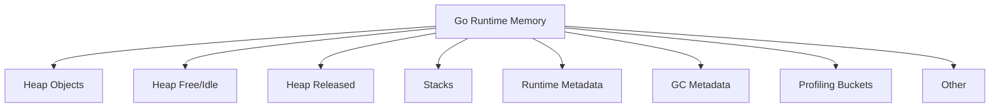
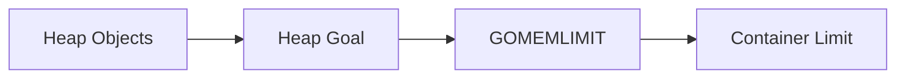
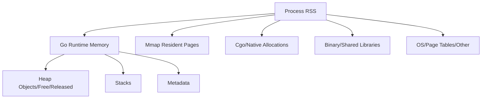
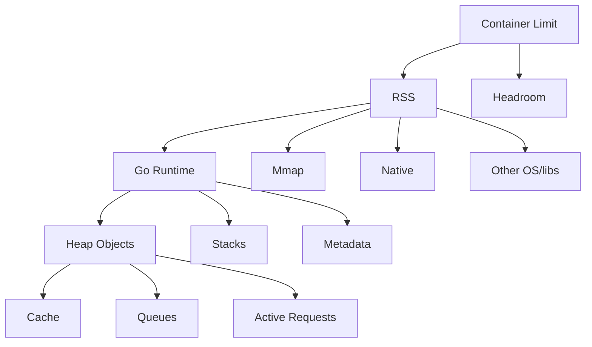

# learn-go-memory-systems-part-029.md

# Go Memory Systems Part 029 — Runtime Metrics: `runtime/metrics`, `ReadMemStats`, Production Dashboards

> Seri: `learn-go-memory-systems`  
> Part: `029`  
> Target: Go 1.26.x  
> Perspektif: Java software engineer menuju Go systems engineer  
> Status seri: **belum selesai** — ini bukan bagian terakhir.

---

## 0. Posisi Part Ini Dalam Seri

Part 028 membahas observability berbasis profile:

- heap profile,
- allocs profile,
- goroutine profile,
- block profile,
- mutex profile,
- CPU profile,
- trace,
- incident workflow.

Part 029 membahas observability yang lebih cocok untuk **continuous production monitoring**:

- `runtime/metrics`,
- `runtime.ReadMemStats`,
- production dashboards,
- alert design,
- memory classes,
- GC metrics,
- runtime vs OS/container metrics,
- app-level memory metrics.

Perbedaan utama:

```text
Profile menjawab: "di mana?"
Metrics menjawab: "berapa, kapan, dan tren?"
```

Keduanya dibutuhkan.

---

## 1. Tujuan Pembelajaran

Setelah menyelesaikan part ini, kamu harus mampu:

1. Menjelaskan peran `runtime/metrics`.
2. Menjelaskan kapan `runtime.ReadMemStats` masih berguna.
3. Mendesain dashboard runtime Go production-grade.
4. Membedakan:
   - heap allocation,
   - live heap,
   - heap goal,
   - memory classes,
   - GC cycles,
   - GC pause,
   - stack memory,
   - finalizer/cleanup metrics.
5. Menghubungkan runtime metrics dengan:
   - RSS,
   - cgroup memory,
   - OOMKilled,
   - native/mmap memory,
   - cache/queue app metrics.
6. Membuat alert yang actionable.
7. Menghindari alert noise.
8. Membuat triage flow berbasis metric.
9. Mengerti limitasi metrics dibanding profile.
10. Membuat baseline per service.

---

## 2. Sumber Faktual Resmi yang Relevan

Beberapa fakta resmi penting:

- Package `runtime/metrics` menyediakan interface stable untuk mengakses implementation-defined metrics dari Go runtime. Dokumentasinya menyebut package ini mirip `runtime.ReadMemStats` dan `runtime/debug.ReadGCStats`, tetapi lebih general; set metric bisa berevolusi bersama runtime.
- `runtime.ReadMemStats` mengisi `runtime.MemStats` dengan statistik allocator memory, dan hasilnya up to date saat call tersebut; ini berbeda dengan heap profile yang snapshot-nya berdasarkan completed GC cycle terakhir.
- Go diagnostics documentation menjelaskan bahwa Go runtime menyediakan profiling data untuk pprof dan tracing untuk analisis runtime.
- Go 1.26 release notes menyebut perubahan pprof UI: `go tool pprof -http` default ke flame graph view.
- `runtime/metrics` juga mengekspos metric untuk `GOGC`, `GOMEMLIMIT`, GC, memory classes, scheduler/goroutines, dan finalizer/cleanup.

---

## 3. Metrics vs Profiles

| Aspek | Metrics | Profiles |
|---|---|---|
| Fungsi | trend/time series | attribution by stack |
| Contoh | heap live naik | fungsi mana yang retain heap |
| Overhead | rendah jika sampling period wajar | lebih tinggi/insidental |
| Cocok untuk alert | ya | tidak langsung |
| Cocok untuk root cause detail | terbatas | ya |
| Retention analysis | indikasi | heap profile |
| Allocation hot path | indikasi allocation rate | allocs profile |
| Blocking | indikasi goroutine/latency | goroutine/block/mutex profile |

Mental model:

> Metrics memberi alarm dan arah. Profile memberi bukti lokasi.

---

## 4. `runtime/metrics` Mental Model

Package `runtime/metrics` mengekspos metric sebagai name + value.

Ada function penting:

- `metrics.All()` untuk daftar metric yang tersedia.
- `metrics.Read(samples)` untuk membaca values.

Contoh minimal:

```go
package main

import (
	"fmt"
	"runtime/metrics"
)

func main() {
	samples := []metrics.Sample{
		{Name: "/memory/classes/heap/objects:bytes"},
		{Name: "/gc/heap/goal:bytes"},
		{Name: "/sched/goroutines:goroutines"},
	}

	metrics.Read(samples)

	for _, s := range samples {
		fmt.Printf("%s = %v\n", s.Name, s.Value)
	}
}
```

`runtime/metrics` lebih future-friendly daripada hanya mengandalkan `ReadMemStats`.

---

## 5. Metric Naming

Metric name biasanya berbentuk:

```text
/path/to/metric:unit
```

Contoh:

```text
/gc/heap/goal:bytes
/sched/goroutines:goroutines
/gc/gogc:percent
/gc/gomemlimit:bytes
```

Unit penting:

- `:bytes`,
- `:objects`,
- `:seconds`,
- `:cpu-seconds`,
- `:percent`,
- `:goroutines`,
- `:gc-cycles`.

Jangan strip unit dari mental model.

---

## 6. Metrics Bisa Berevolusi

Dokumentasi `runtime/metrics` menegaskan metric set bisa berevolusi seiring runtime.

Production implication:

- jangan hardcode terlalu rapuh tanpa fallback;
- saat upgrade Go, review metric list;
- dashboard harus diuji setelah upgrade;
- exporter library harus kompatibel dengan versi Go;
- label/nama metric dari OpenTelemetry/Prometheus wrapper bisa berbeda.

---

## 7. `runtime.ReadMemStats`

`runtime.ReadMemStats` lebih lama dan masih berguna.

Contoh:

```go
var m runtime.MemStats
runtime.ReadMemStats(&m)

fmt.Println(m.Alloc)
fmt.Println(m.TotalAlloc)
fmt.Println(m.Sys)
fmt.Println(m.HeapAlloc)
fmt.Println(m.HeapSys)
fmt.Println(m.HeapIdle)
fmt.Println(m.HeapReleased)
fmt.Println(m.NumGC)
```

Dokumentasi runtime menyatakan `ReadMemStats` memberikan memory allocator statistics yang up to date saat call, berbeda dengan heap profile yang snapshot berdasarkan completed GC terakhir.

---

## 8. `ReadMemStats` vs `runtime/metrics`

| Aspek | `ReadMemStats` | `runtime/metrics` |
|---|---|---|
| API age | lama | modern |
| Coverage | allocator/GC focused | lebih general |
| Extensibility | struct fixed-ish | metric set evolves |
| Units | fields documented | name includes unit |
| Dashboard modern | bisa | lebih cocok |
| Compatibility | banyak tooling lama | recommended for broad runtime metrics |

Gunakan `runtime/metrics` untuk dashboard baru. `ReadMemStats` tetap berguna untuk compatibility dan quick debug.

---

## 9. Jangan Poll Terlalu Agresif

Membaca runtime stats punya overhead.

Guideline:

- interval 5s–15s biasanya cukup untuk dashboard;
- interval 1s bisa untuk high-resolution temporary debug;
- jangan baca per request;
- jangan export metric berat secara sinkron di hot path;
- pahami overhead exporter.

---

## 10. Kategori Dashboard Go Runtime

Dashboard produksi minimal:

1. Traffic and SLO.
2. CPU and throttling.
3. RSS/cgroup memory.
4. Go runtime memory classes.
5. Go heap and GC.
6. Allocation rate.
7. Goroutines and stacks.
8. Finalizer/cleanup.
9. Native/mmap/app memory.
10. Cache/queue/buffer metrics.
11. Deployment markers.

Runtime dashboard tanpa app metrics sering tidak cukup.

---

## 11. Heap Metrics

Metric yang perlu dipahami:

- heap objects bytes;
- heap free bytes;
- heap released bytes;
- heap unused bytes;
- heap goal;
- live heap, jika tersedia di runtime metric set;
- allocation count/bytes, jika tersedia.

Key questions:

- Apakah heap live naik monoton?
- Apakah heap goal terlalu dekat memory limit?
- Apakah heap released rendah sehingga RSS tetap tinggi?
- Apakah object count tinggi?
- Apakah heap growth sesuai traffic?

---

## 12. Memory Classes

Go runtime mengelompokkan memory ke classes.

Contoh conceptual classes:

- heap objects;
- heap free;
- heap released;
- stack;
- metadata;
- profiling buckets;
- GC metadata;
- other runtime memory.



Memory classes membantu menjawab:

> “Go runtime memory dipakai untuk apa?”

---

## 13. Heap Objects vs Heap Released

`heap objects`:

- memory yang berisi live/in-use heap objects.

`heap released`:

- memory yang sudah dikembalikan runtime ke OS.

Jika heap objects turun tetapi RSS tidak turun, periksa:

- heap idle/free belum released;
- RSS dari mmap/native;
- OS behavior;
- cgroup accounting.

---

## 14. Heap Goal

Heap goal adalah target yang dipakai pacer untuk GC cycle berikutnya.

Dashboard:

```text
heap objects bytes
heap goal bytes
GOMEMLIMIT bytes
RSS bytes
container limit bytes
```

Visual relationship:



Jika heap goal mendekati atau melebihi safe runtime budget, OOM risk naik.

---

## 15. Allocation Rate

Allocation rate biasanya dihitung dari counter cumulative allocation bytes.

Pseudo:

```text
allocation_rate = rate(total_allocated_bytes[1m])
```

Mengapa penting:

- GC CPU lebih berkorelasi dengan allocation rate daripada heap size saja;
- deployment regression sering terlihat sebagai allocation rate naik;
- p99 latency bisa naik karena mutator assist.

Alert tidak harus langsung pada allocation rate absolut; buat baseline per service.

---

## 16. Object Allocation Rate

Byte allocation rate tidak cukup.

Object allocation rate penting karena:

- banyak object kecil bisa membebani allocator/GC;
- pointer-rich small objects buruk untuk cache;
- map/interface/reflection path sering menaikkan object count.

Metric:

```text
alloc_objects_rate = rate(total_allocated_objects[1m])
```

Jika tersedia/exported.

---

## 17. GC Cycle Metrics

Pantau:

- GC cycles total;
- forced GC cycles;
- cycles/sec;
- time since last GC;
- GC CPU;
- pause histogram;
- heap goal/live relation.

Interpretasi:

| Symptom | Kemungkinan |
|---|---|
| GC cycles/sec naik | allocation rate naik atau memory limit ketat |
| forced GC naik | code/tool memanggil runtime.GC/debug.FreeOSMemory |
| pause naik | large root/mark termination/scheduler pressure |
| GC CPU naik | allocation churn/live heap/pointer graph |
| cycles sering tapi heap tidak turun | live heap tinggi atau limit terlalu rendah |

---

## 18. GC Pause Metrics

Jangan hanya lihat max pause.

Lihat:

- p50;
- p95;
- p99;
- max;
- rate of pause events;
- correlation with request latency.

Pause bisa rendah tetapi latency tetap buruk karena:

- mutator assist;
- CPU contention;
- allocation hot path;
- lock contention;
- CPU throttling.

---

## 19. GC CPU

GC CPU fraction/cpu-seconds menunjukkan biaya collector.

Jika GC CPU tinggi:

- lihat allocation rate;
- lihat live heap;
- lihat pointer density;
- lihat `GOGC`;
- lihat `GOMEMLIMIT`;
- lihat CPU throttling;
- lihat deployment diff.

---

## 20. Goroutine Metrics

Metric:

```text
/sched/goroutines:goroutines
```

Dashboard:

- goroutine count current;
- rate of change;
- max over window.

Alert:

- monotonic growth over N minutes;
- sudden spike after deploy;
- count above baseline + threshold.

But not all large goroutine count is leak. Worker-heavy service may be valid. Baseline matters.

---

## 21. Stack Memory Metrics

Goroutine count alone tidak cukup.

Pantau stack memory class:

- many goroutines => stacks;
- deep stacks/large frames => more stack memory;
- leaked goroutines retain stack references.

If goroutine count grows and stack memory grows, capture goroutine profile.

---

## 22. Finalizer/Cleanup Metrics

Go runtime exposes finalizer/cleanup-related metrics in modern versions.

Why important:

- finalizer queue growth can indicate leaked resource wrappers;
- slow finalizers/cleanups can delay release;
- cleanup backlog can retain resource tokens;
- Go 1.25 `GODEBUG=checkfinalizers=1` helps diagnose finalizer/cleanup issues.

Dashboard:

- finalizer queue length;
- cleanup queue length;
- finalizers executed;
- cleanups executed;
- cleanup duration if app-level.

---

## 23. `GOGC` and `GOMEMLIMIT` Metrics

Expose current:

```text
/gc/gogc:percent
/gc/gomemlimit:bytes
```

Why?

- verify environment config applied;
- correlate deploy/config changes;
- catch accidental defaults;
- detect dynamic tuning changes.

Dashboard should show knob values next to heap/GC behavior.

---

## 24. RSS and Cgroup Metrics

Go runtime metrics do not replace OS metrics.

Need:

- process RSS;
- cgroup memory current;
- cgroup memory limit;
- OOMKilled/OOM events;
- major page faults;
- CPU throttling.

In Kubernetes, OOM is decided by cgroup/OS, not Go heap profile.

---

## 25. RSS vs Runtime Memory



If RSS > runtime memory significantly:

- check mmap;
- check cgo;
- check file mappings;
- check OS/library;
- check page faults;
- check exporter accuracy.

---

## 26. App-Level Metrics Are Required

Runtime does not know:

- cache semantic size;
- queue payload size;
- mmap file inventory;
- native memory limiter;
- per-tenant memory;
- request body size distribution;
- buffer pool drops;
- stream backlog.

Add app metrics.

Examples:

```text
cache_bytes
cache_entries
cache_evictions_total
queue_payload_bytes
queue_items
buffer_pool_drop_large_total
native_alloc_bytes
mapped_file_bytes
active_upload_bytes
```

---

## 27. Dashboard Panel Design

### Panel 1 — Service SLO

- RPS.
- Error rate.
- p50/p95/p99 latency.
- Saturation/queue length.

### Panel 2 — CPU

- process CPU.
- container CPU.
- throttling.
- GC CPU if available.

### Panel 3 — Memory Topline

- RSS.
- cgroup memory current.
- container limit.
- Go runtime memory.
- GOMEMLIMIT.

### Panel 4 — Heap

- heap objects.
- heap goal.
- heap free/idle.
- heap released.
- allocation rate.

### Panel 5 — GC

- GC cycles/sec.
- pause p95/p99.
- GC CPU.
- forced GC.

### Panel 6 — Goroutines/Stacks

- goroutine count.
- stack memory.
- goroutine leak signal if available.

### Panel 7 — App Memory

- cache bytes.
- queue bytes.
- active request bytes.
- mmap/native bytes.

---

## 28. Alert Design Principles

Alert only when actionable.

Bad alert:

```text
GC happened
```

Good alert:

```text
GC CPU > 20% for 10m AND p99 latency above SLO
```

Bad alert:

```text
heap > 1GB
```

Good alert:

```text
RSS > 85% container limit for 5m
```

Bad alert:

```text
goroutines > 1000
```

Good alert:

```text
goroutines increased 5x above baseline and still rising for 15m
```

---

## 29. Suggested Alerts

Memory safety:

```text
RSS / container_limit > 0.85 for 5m
cgroup_memory_current / limit > 0.90 for 2m
OOMKilled event > 0
```

GC pressure:

```text
GC CPU > 15-25% for 10m and latency degraded
GC cycles/sec > baseline * 3 after deploy
allocation_rate > baseline * 2 for 10m
```

Leak suspicion:

```text
heap_objects_bytes increasing for 30m after traffic normalized
goroutine_count increasing monotonically for 30m
cache_bytes > configured budget
queue_payload_bytes > configured budget
```

Native gap:

```text
RSS - go_runtime_memory > threshold for 10m
mapped_file_bytes unexpected growth
native_alloc_bytes unexpected growth
```

---

## 30. Avoid Alert Noise

Do not alert on:

- normal GC cycles;
- small heap oscillation;
- one-time pause without SLO impact;
- goroutine count fixed high but expected;
- allocation burst during startup;
- cache warmup growth within budget.

Alert on trend, saturation, budget breach, and SLO impact.

---

## 31. Memory Baseline

For each service, record:

```text
idle RSS:
idle heap:
steady RSS:
steady heap:
peak RSS:
peak heap:
allocation rate normal:
allocation rate peak:
goroutine count normal:
GC CPU normal:
GOMEMLIMIT:
GOGC:
container request/limit:
native/mmap expected:
cache budget:
queue budget:
```

Without baseline, every graph looks suspicious.

---

## 32. Deployment Markers

Always overlay deployment/config change markers.

Many memory incidents are regression:

- new logging path;
- new JSON mapping;
- new cache;
- new goroutine per request;
- new `io.ReadAll`;
- new pool retaining huge buffers;
- changed `GOGC`;
- changed container limit.

Deployment markers reduce time to diagnosis.

---

## 33. Runtime Metric Exporter

Common options:

- Prometheus client custom collector;
- OpenTelemetry runtime instrumentation;
- existing framework runtime metrics;
- manual endpoint.

Whatever you choose:

- verify metric names/semantics;
- avoid high-cardinality labels;
- set sane interval;
- test after Go upgrade;
- document mapping from runtime metric to exported metric.

---

## 34. Example Runtime Metrics Collector

Simplified:

```go
type RuntimeSnapshot struct {
	HeapObjectsBytes uint64
	HeapGoalBytes    uint64
	Goroutines       uint64
	GOGC             uint64
	GOMEMLimit       uint64
}

func ReadRuntimeSnapshot() RuntimeSnapshot {
	samples := []metrics.Sample{
		{Name: "/memory/classes/heap/objects:bytes"},
		{Name: "/gc/heap/goal:bytes"},
		{Name: "/sched/goroutines:goroutines"},
		{Name: "/gc/gogc:percent"},
		{Name: "/gc/gomemlimit:bytes"},
	}

	metrics.Read(samples)

	return RuntimeSnapshot{
		HeapObjectsBytes: samples[0].Value.Uint64(),
		HeapGoalBytes:    samples[1].Value.Uint64(),
		Goroutines:       samples[2].Value.Uint64(),
		GOGC:             samples[3].Value.Uint64(),
		GOMEMLimit:       samples[4].Value.Uint64(),
	}
}
```

Production code must handle metric kind changes/missing metrics more defensively.

---

## 35. Handling Metric Kinds

`metrics.Value` has kind. Do not blindly call `Uint64()` if kind is not uint64.

Pseudo:

```go
func uint64Metric(s metrics.Sample) (uint64, bool) {
	if s.Value.Kind() != metrics.KindUint64 {
		return 0, false
	}
	return s.Value.Uint64(), true
}
```

Metric sets can evolve; robust exporters check.

---

## 36. Histograms

Some runtime metrics are histograms, for example pause distribution style metrics.

Exporter should convert histogram buckets carefully.

Questions:

- are buckets cumulative?
- what unit?
- how to compute p99?
- does Prometheus/OpenTelemetry wrapper do it correctly?
- are bucket boundaries stable enough?

Do not invent percentiles incorrectly from counters.

---

## 37. `ReadMemStats` Field Interpretation

Common fields:

| Field | Meaning |
|---|---|
| `Alloc` | bytes allocated and not yet freed, same as `HeapAlloc` |
| `TotalAlloc` | cumulative bytes allocated |
| `Sys` | total bytes obtained from OS |
| `HeapAlloc` | bytes of allocated heap objects |
| `HeapSys` | bytes of heap memory obtained from OS |
| `HeapIdle` | bytes in idle spans |
| `HeapInuse` | bytes in in-use spans |
| `HeapReleased` | bytes returned to OS |
| `HeapObjects` | number of allocated heap objects |
| `NumGC` | completed GC cycles |
| `PauseTotalNs` | cumulative pause time |

Do not treat `Sys` as RSS. It is runtime memory obtained from OS, not process resident memory.

---

## 38. `ReadMemStats` and RSS

`ReadMemStats.Sys` is not equal to RSS.

Why:

- RSS includes native/mmap/shared libs/stacks depending accounting;
- Sys includes memory obtained by runtime, not necessarily resident in same way;
- released memory semantics differ;
- OS/cgroup accounting has its own behavior.

Always use OS/cgroup metrics for actual process/container memory pressure.

---

## 39. Rate Calculations

From cumulative counters:

```text
allocation_rate = rate(total_alloc_bytes[5m])
gc_cycles_rate = rate(gc_cycles_total[5m])
pause_rate = rate(gc_pause_seconds_sum[5m])
```

For gauges:

```text
heap_objects_bytes
rss_bytes
goroutines
```

Do not apply rate to gauges unless you want derivative/trend intentionally.

---

## 40. SLO Correlation

Runtime metrics should be viewed beside SLO:

- latency p99;
- error rate;
- throughput;
- queue time;
- timeout rate.

GC CPU high but SLO fine may not be urgent.  
RSS near limit even if SLO fine is urgent risk.

---

## 41. Incident Flow: GC CPU High

Metric shows:

```text
GC CPU high
allocation rate high
heap live stable
```

Interpretation:

- allocation churn, not retention.

Next:

- capture allocs profile;
- inspect top `alloc_space`;
- compare deployment marker;
- fix hot path allocation.

---

## 42. Incident Flow: Heap Live Growing

Metric shows:

```text
heap objects bytes rising
allocation rate normal
GC cycles normal
RSS rising
```

Interpretation:

- retention/leak.

Next:

- capture heap `inuse_space`;
- capture goroutine profile;
- inspect cache/queue metrics;
- check subslice/map/context retention.

---

## 43. Incident Flow: RSS High, Runtime Normal

Metric shows:

```text
RSS high
Go runtime memory normal
heap normal
```

Interpretation:

- native/mmap/OS memory.

Next:

- inspect native/mmap metrics;
- inspect `/proc/smaps`/cgroup;
- inspect file mappings;
- inspect cgo allocator;
- check page fault/workload.

---

## 44. Incident Flow: Goroutine Growth

Metric shows:

```text
goroutine count monotonically rising
stack memory rising
heap rising
```

Interpretation:

- likely goroutine leak retaining memory.

Next:

- capture goroutine profile;
- identify blocked stacks;
- inspect channel/context cancellation;
- capture heap to see retained data.

---

## 45. Incident Flow: Finalizer/Cleanup Backlog

Metric shows:

```text
finalizer/cleanup queue rising
resources not released
RSS/native memory rising
```

Interpretation:

- finalizer/cleanup too slow or leaked resource owner pattern.

Next:

- inspect recent resource wrapper changes;
- check explicit Close missing;
- use `GODEBUG=checkfinalizers=1` in test/staging;
- add leak detection metric;
- remove heavy work from finalizer/cleanup.

---

## 46. App Memory Budget Dashboard

Example budget panel:

```text
container limit: 2048 MiB
RSS:             1360 MiB
GOMEMLIMIT:      1536 MiB
Go runtime:       980 MiB
heap objects:     720 MiB
cache bytes:      300 MiB
queue bytes:       40 MiB
mmap resident:    200 MiB
native bytes:      50 MiB
headroom:         688 MiB
```

This is much more actionable than “heap is 720 MiB”.

---

## 47. Memory Budget Mermaid



---

## 48. Dashboard Smells

Bad dashboard signs:

- only heap, no RSS;
- only RSS, no heap;
- no container limit line;
- no `GOMEMLIMIT`;
- no allocation rate;
- no goroutine count;
- no app cache/queue bytes;
- no deployment markers;
- no p99 latency beside GC;
- no CPU throttling;
- metric names unclear.

---

## 49. Metric Cardinality

Avoid labels like:

- user ID;
- request ID;
- raw path with IDs;
- key name;
- file path unbounded;
- tenant if thousands without control.

Runtime metrics should have low cardinality:

- service,
- instance/pod,
- version,
- environment,
- maybe route template.

High-cardinality metrics can create observability outages.

---

## 50. Sampling Interval

Suggested intervals:

| Metric type | Interval |
|---|---:|
| runtime metrics | 5–15s |
| app cache/queue gauges | 5–15s |
| request metrics | continuous aggregation |
| expensive OS smaps | on-demand / slower |
| pprof | on-demand |
| trace | on-demand |

Do not scrape expensive diagnostics too frequently.

---

## 51. CI Regression Metrics

For critical packages:

- benchmark `allocs/op`;
- benchmark `B/op`;
- benchmark throughput;
- store baseline;
- fail if regression > threshold.

Example policy:

```text
Critical parser:
- allocs/op must remain 0
- B/op must remain 0
- throughput regression > 10% requires approval
```

Runtime metrics are production. Benchmarks are pre-production guardrail.

---

## 52. Load Test Metrics

During load test, capture:

- runtime metrics time series;
- pprof heap/allocs at steady state;
- pprof CPU at peak;
- goroutine profile after test;
- RSS/cgroup;
- app cache/queue bytes;
- p99 latency.

Store artifacts with test metadata.

---

## 53. Metric Naming in Prometheus

Example exported names may look like:

```text
go_memstats_heap_alloc_bytes
go_memstats_heap_objects
go_goroutines
go_gc_duration_seconds
```

or OpenTelemetry-style names depending exporter.

Do not assume one standard across libraries. Map your exporter metric names to Go runtime semantics in documentation.

---

## 54. OpenTelemetry Runtime Instrumentation

OpenTelemetry Go ecosystem has runtime instrumentation packages that collect Go runtime metrics.

When using any library:

- check whether it uses `runtime/metrics` or `ReadMemStats`;
- check collection interval;
- check overhead;
- check metric names;
- check Go version support;
- check whether `GOMEMLIMIT`/new metrics are included.

---

## 55. `ReadMemStats` Compatibility Exporter

Many Prometheus Go client setups historically export `go_memstats_*` from `ReadMemStats`.

This is still useful, but for modern Go runtime dashboards, supplement with `runtime/metrics` where possible.

Especially useful additions:

- `GOMEMLIMIT`;
- heap goal;
- memory classes;
- finalizer/cleanup metrics;
- scheduler details.

---

## 56. Triage Table

| Metric pattern | Likely class | Next action |
|---|---|---|
| alloc rate up, heap live stable, GC CPU up | allocation churn | allocs profile |
| heap live up, alloc rate normal | retention | heap profile |
| goroutines up, heap up | goroutine leak | goroutine profile |
| RSS up, runtime memory flat | native/mmap/OS | OS + app native metrics |
| GC cycles high, live heap near limit | limit pressure | check `GOMEMLIMIT`/live heap |
| pause normal, p99 high, CPU low | blocking | block/mutex/goroutine |
| cleanup queue up | cleanup/finalizer issue | resource lifecycle audit |

---

## 57. Mini Lab 1 — Print Runtime Metrics

Write a small program that prints:

- heap objects bytes;
- heap goal;
- goroutine count;
- `GOGC`;
- `GOMEMLIMIT`.

Run with different env:

```bash
GOGC=50 GOMEMLIMIT=512MiB go run .
GOGC=200 GOMEMLIMIT=2GiB go run .
```

Goal:

- verify runtime config visible through metrics.

---

## 58. Mini Lab 2 — ReadMemStats vs Heap Profile

Program:

1. allocate memory;
2. print `ReadMemStats`;
3. write heap profile;
4. force GC;
5. print again;
6. compare.

Goal:

- understand up-to-date allocator stats vs profile snapshot behavior.

---

## 59. Mini Lab 3 — Dashboard Budget

For one real service, define:

```text
container limit:
GOMEMLIMIT:
expected runtime memory:
expected native/mmap:
expected cache:
expected queue:
safety margin:
```

Then map each to an actual metric.

Goal:

- no unobservable budget item.

---

## 60. Mini Lab 4 — Alert Review

Create three alerts:

1. OOM risk.
2. Allocation regression.
3. Goroutine leak.

For each, define:

- threshold;
- duration;
- labels;
- runbook link;
- false positive cases;
- first diagnostic command.

---

## 61. Runbook Example: OOM Risk

Alert:

```text
RSS > 85% container limit for 5m
```

Runbook:

1. Check deploy marker.
2. Compare heap objects vs RSS.
3. Check GOMEMLIMIT.
4. Check allocation rate.
5. Check cache/queue bytes.
6. Check mmap/native bytes.
7. If heap high: capture heap profile.
8. If goroutines growing: capture goroutine profile.
9. If RSS gap: inspect OS/cgroup/native.
10. Mitigate: reduce traffic/cache, scale out, raise memory, rollback.

---

## 62. Runbook Example: Allocation Regression

Alert:

```text
allocation_rate > 2x baseline for 10m after deploy
```

Runbook:

1. Capture allocs profile.
2. Compare with previous version.
3. Check logs/JSON/new mapping.
4. Check benchmark if available.
5. Rollback if p99/CPU impacted.
6. Add regression benchmark.

---

## 63. Runbook Example: Goroutine Growth

Alert:

```text
goroutines increasing monotonically for 30m and > 3x baseline
```

Runbook:

1. Capture goroutine profile debug=2.
2. Group stacks.
3. Identify blocked operation.
4. Check recent deploy.
5. Check context cancellation/channel sends.
6. Capture heap if memory also rising.
7. Fix leak and add test.

---

## 64. What Top Engineers Notice

A weak dashboard shows:

```text
heap_alloc
goroutines
```

A strong dashboard explains:

- how much memory is Go heap;
- how much memory is runtime non-heap;
- how close heap goal is to memory limit;
- whether RSS gap exists;
- whether allocation rate changed after deploy;
- whether goroutines/stacks are growing;
- whether app cache/queue/native memory explains growth;
- whether GC pressure correlates with latency;
- whether alert has a runbook.

Observability quality determines incident quality.

---

## 65. Summary

`runtime/metrics` is the modern foundation for Go runtime time-series observability. `ReadMemStats` remains useful and widely supported, but it is narrower.

A production Go memory dashboard must combine:

- Go runtime metrics;
- OS/container RSS/cgroup metrics;
- app-level memory budgets;
- SLO metrics;
- deployment markers;
- profiling workflow.

Metrics tell you when and how much. Profiles tell you where.

The strongest practice:

> Every byte in your memory budget should map to either a runtime metric, OS metric, or app metric.

If a memory category is not observable, it will eventually surprise you.

---

## 66. Part 029 Completion Checklist

Kamu siap lanjut jika bisa menjawab:

- Apa perbedaan `runtime/metrics` dan `ReadMemStats`?
- Kenapa `ReadMemStats.Sys` bukan RSS?
- Metric apa yang menunjukkan `GOMEMLIMIT`?
- Apa itu memory classes?
- Apa bedanya heap objects dan heap released?
- Bagaimana menghitung allocation rate?
- Alert apa yang lebih baik daripada “GC happened”?
- Kenapa app-level cache/queue bytes wajib?
- Bagaimana membedakan heap leak dan native/mmap leak dari metrics?
- Apa isi dashboard Go memory production-grade?

---

## 67. Seri Belum Selesai

Bagian ini adalah:

```text
learn-go-memory-systems-part-029.md
```

Part berikutnya:

```text
learn-go-memory-systems-part-030.md
```

Topik berikutnya:

```text
Allocation profiling workflow: benchmark, -benchmem, pprof, escape reports
```

<!-- NAVIGATION_FOOTER -->
<div class="page-nav">
<a href="./learn-go-memory-systems-part-028.md">⬅️ Go Memory Systems Part 028 — Memory Observability: pprof Heap, Allocs, Goroutine Leak, Block/Mutex Profile</a>
<a href="./index.md">📚 Kategori</a>
<a href="../../index.md">🏠 Home</a>
<a href="./learn-go-memory-systems-part-030.md">Go Memory Systems Part 030 — Allocation Profiling Workflow: Benchmark, `-benchmem`, `pprof`, Escape Reports ➡️</a>
</div>
